# 00 — ปูพื้นฐาน: อ่านอันนี้ก่อน

> **ไฟล์นี้เขียนให้คนที่ยังไม่เคยทำ backend มาก่อน**
> เอกสาร `01`–`04` เขียนโดยสมมติว่ารู้ศัพท์พวกนี้อยู่แล้ว ซึ่งทำให้อ่านแล้วงง
> ไฟล์นี้จะอธิบายทุกคำที่โผล่ในเอกสารพวกนั้น **โดยใช้ร้านอะไหล่ของเราเองเป็นตัวอย่างตลอด**
>
> ไม่ต้องอ่านรวดเดียวจบ อ่านหัวข้อ 1–3 ก่อนก็พอเข้าใจภาพใหญ่แล้ว
>
> **แก้ 2026-09-23 — ปรับให้ตรง ADR และโค้ดจริง** (เอกสารขัดกับ ADR → ยึด ADR):
> transaction อยู่ใน handler ผ่าน `TenantService.runTx(fn)` (ADR-0003 amendment, §5.2/§6) ·
> ลำดับการล็อกจริง (§5.3) · ร้านมี role คนเดียวคือ `owner` ไม่มี manager PIN แล้ว (§3.3/§7) ·
> ภาพ "POS หลายเครื่อง" แก้เป็น `pos` 1 เครื่อง + `backoffice` (ADR-0004, §2) ·
> offline ไม่ใช้ *scarcity rule* แล้ว (#240 D3, §11) · ค่า cache จริง (§8) · glossary เพิ่มคำใหม่

---

## สารบัญ

| § | หัวข้อ | ตอบคำถามว่า |
|---|---|---|
| [1](#1-ตอนนี้แอปเราทำงานยังไง) | ตอนนี้แอปเราทำงานยังไง | ของเดิมเป็นแบบไหน |
| [2](#2-มี-backend-แปลว่าอะไรกันแน่) | "มี backend" แปลว่าอะไร | จะเปลี่ยนไปเป็นแบบไหน |
| [3](#3-client--server--api-101) | Client / Server / API 101 | สองฝั่งคุยกันยังไง |
| [4](#4-database-server-ต่างจาก-sqlite-ยังไง) | Database server vs SQLite | ทำไมต้องเปลี่ยนฐานข้อมูล |
| [5](#5-ศัพท์-sql-ที่ต้องรู้) | ศัพท์ SQL ที่ต้องรู้ | PK, FK, index, transaction คืออะไร |
| [6](#6-multi-tenant--ร้านหลายร้านใน-database-เดียว) | Multi-tenant | "หลายร้าน" ทำยังไง |
| [7](#7-authentication--jwt) | Authentication / JWT | ล็อกอินยังไงให้ scale ได้ |
| [8](#8-cache--redis) | Cache / Redis | ทำไมต้องมี และพังยังไงได้บ้าง |
| [9](#9-queue--bullmq) | Queue / BullMQ | งานเบื้องหลังคืออะไร |
| [10](#10-scaling--nginx--health-check) | Scaling / Nginx | ทำไมต้องมี 3 instances |
| [11](#11-offline--sync) | Offline & Sync | เรื่องที่ยากที่สุดของโปรเจกต์นี้ |
| [12](#12-สรุปคำศัพท์-glossary) | Glossary | เปิดหาเวลาเจอคำแปลก ๆ |
| [13](#13-ลองตอบดูว่าเข้าใจหรือยัง) | ทดสอบความเข้าใจ | |

---

## 1. ตอนนี้แอปเราทำงานยังไง

นี่คือสิ่งที่เรามีอยู่วันนี้ — **ทุกอย่างอยู่ในเครื่องเดียว ไม่มีอินเทอร์เน็ตเข้ามาเกี่ยวเลย**


**"Repository" คืออะไร:** ชั้นกลางที่กันไม่ให้หน้าจอยุ่งกับฐานข้อมูลตรง ๆ
เช่นหน้า Checkout จะไม่เขียน SQL เอง แต่เรียก `salesRepo.saveSale(...)` แล้ว repository
จัดการให้ทั้งหมด (ตัดสต็อก, เพิ่มแต้ม, บันทึกบิล)

**ข้อดีของแบบนี้:** เร็วมาก (ไม่ต้องรอเน็ต), เน็ตล่มก็ขายได้, ไม่มีค่า server
**ข้อเสีย:** ข้อมูลอยู่เครื่องเดียว — เครื่องพัง = ข้อมูลหาย, เพิ่มเครื่องที่ 2 ไม่ได้, ดูยอดขายจากที่บ้านไม่ได้

> **สถานะ 2026-09-23:** ร้านจริง**ยังใช้แบบนี้อยู่** (Drift build) — backend เฟส 1 สร้างเสร็จแล้ว
> แต่รันกับ **tenant สาธิต** เท่านั้น ยังไม่ cutover ร้านจริง (ตัดสินไว้ว่าทำหลังเฟส 2 — `00_INDEX` ข้อ 4)

---

## 2. "มี backend" แปลว่าอะไรกันแน่

**Backend = โปรแกรมอีกตัวหนึ่ง ที่รันอยู่บนคอมพิวเตอร์อีกเครื่อง (server) แล้วเก็บข้อมูลไว้ให้**
แอปในมือถือ/คอมหน้าร้าน (เรียกว่า **client**) จะ "ขอ" และ "ส่ง" ข้อมูลผ่านอินเทอร์เน็ต

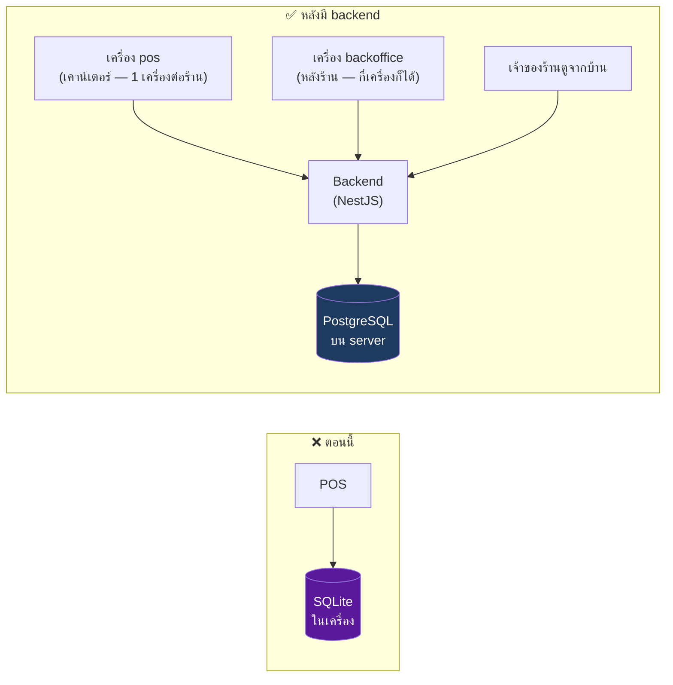

**ได้อะไรเพิ่ม:** หลายเครื่องเห็นข้อมูลเดียวกัน · เครื่องพังข้อมูลไม่หาย · ดูยอดจากที่ไหนก็ได้ · รองรับหลายร้าน

> **แก้ 2026-09-23 ([ADR-0004](adr/0004-device-roles.md)):** ภาพเดิมวาด "POS เครื่อง 1 / เครื่อง 2" ซึ่งผิด —
> ร้านหนึ่งมีเครื่อง **`pos` ได้เครื่องเดียว** (เครื่องเดียวที่แตะลิ้นชัก ขาย/รับคืน/เปิดปิดกะ)
> ส่วนเครื่อง **`backoffice`** (สต็อก/รายงาน) มีกี่เครื่องก็ได้ · "เครื่อง" = device token ที่ owner enrol ให้
**เสียอะไร:** ต้องมีเน็ต · ช้าลงนิดหน่อย (ต้องวิ่งไปกลับ) · มีค่า server · ซับซ้อนขึ้นเยอะ

> 💡 **นี่คือแกนของทั้งโปรเจกต์:** เราจะย้ายจาก "ข้อมูลอยู่ในเครื่อง" ไปเป็น "ข้อมูลอยู่บน server"
> โดย**ไม่ทำให้ร้านขายของไม่ได้** — ซึ่งเป็นเรื่องยากกว่าที่คิด (ดู §11)

---

## 3. Client / Server / API 101

### 3.1 คำศัพท์

| คำ | แปลว่า | ในโปรเจกต์เรา |
|---|---|---|
| **Client** | ฝั่งผู้ใช้ | แอป Flutter บนเครื่องหน้าร้าน |
| **Server** | ฝั่งที่ให้บริการ | โปรแกรม NestJS ที่รันบนคอมอีกเครื่อง |
| **API** | ช่องทางที่ client ใช้คุยกับ server | รายการ endpoint ทั้งหมดใน `02_API_SCREENS.md` |
| **Endpoint** | 1 ช่องทาง = 1 เรื่อง | `POST /api/v1/sales` = "ช่องสำหรับบันทึกการขาย" |
| **Request** | สิ่งที่ client ส่งไป | "นี่บิลใหม่ มี 2 รายการ รวม 1,400 บาท" |
| **Response** | สิ่งที่ server ตอบกลับ | "บันทึกแล้ว ได้แต้ม 140" หรือ "ของไม่พอ" |

### 3.2 HTTP method — กริยา 4 คำที่ต้องรู้

| Method | แปลว่า | ตัวอย่าง |
|---|---|---|
| **GET** | ขอดูข้อมูล (ไม่เปลี่ยนอะไร) | `GET /products` = ขอรายการอะไหล่ |
| **POST** | สร้างของใหม่ / สั่งให้ทำอะไร | `POST /sales` = บันทึกการขาย |
| **PATCH** | แก้บางส่วน | `PATCH /products/p12` = แก้ราคาอะไหล่ตัวนี้ |
| **DELETE** | ลบ | `DELETE /customers/c3` = ลบลูกค้า |

> **กฎที่ต้องจำ:** `GET` **ต้องไม่เปลี่ยนข้อมูล** ยิงกี่รอบก็ต้องได้ผลเหมือนเดิม
> ถ้า `GET` แล้วสต็อกลด = ออกแบบผิด

### 3.3 Status code — ตัวเลขที่บอกว่าเกิดอะไรขึ้น

| เลข | ความหมาย | เจอเมื่อไหร่ |
|---|---|---|
| **200** | สำเร็จ | ขอข้อมูลแล้วได้ |
| **201** | สร้างสำเร็จ | บันทึกบิลแล้ว |
| **202** | รับเรื่องแล้ว กำลังทำอยู่ | สั่ง backup แล้วมันไปทำเบื้องหลัง |
| **400** | client ส่งข้อมูลมาผิด | ลืมส่งราคา |
| **401** | ยังไม่ได้ล็อกอิน | token หมดอายุ |
| **403** | ล็อกอินแล้ว แต่ไม่มีสิทธิ์ | เครื่อง `backoffice` พยายามขายของ → `DEVICE_ROLE_FORBIDDEN` *(แก้ 2026-09-23: เดิมยกตัวอย่าง "แคชเชียร์" แต่ร้านเหลือ role คนเดียวคือ `owner` แล้ว — §7)* |
| **404** | ไม่เจอ | หาบิลเลขนี้ไม่เจอ |
| **409** | ขัดแย้ง / ทำไม่ได้ในสถานะนี้ | **สต็อกไม่พอ** (`INSUFFICIENT_STOCK`) ← เจอบ่อยสุดในระบบเรา |
| **429** | ยิงถี่เกินโควตา | เกิน rate limit ของร้าน (`RATE_LIMITED`, ADR-0006) |
| **500** | server พัง | บั๊กของเรา |
| **503** | ยังไม่พร้อมรับงาน | `/health/ready` ตอน DB หรือ Redis ล่ม (§10.3) |

> ตัว `code` และข้อความไทยของ error ทุกตัวอยู่ใน [`02_API_SCREENS.md §8`](02_API_SCREENS.md#8-error-codes)

### 3.4 JSON — รูปแบบข้อมูลที่ใช้คุยกัน

JSON คือข้อความธรรมดาที่จัดรูปแบบให้เครื่องอ่านได้ หน้าตาแบบนี้:

```jsonc
{
  "receiptNo": "RC01-2569-08-0042",   // รูปแบบใหม่ตาม ADR-0007 (บิลเก่าก่อนขึ้นระบบยังเป็น RC12345678ABCD) · เฟส 2 เครื่อง pos ออกเลขนี้เอง
  "total": "1400.00",
  "items": [
    { "name": "ผ้าเบรกหน้า", "qty": 2, "price": "750.00" }
  ]
}
```

### 3.5 รวมทุกอย่าง — 1 การขายเกิดอะไรขึ้นบ้าง

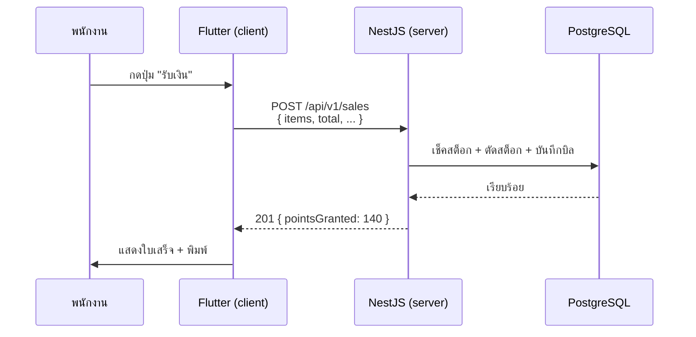

---

## 4. Database server ต่างจาก SQLite ยังไง

| | **SQLite** (ที่เราใช้ตอนนี้) | **PostgreSQL** (ที่จะใช้) |
|---|---|---|
| เป็นอะไร | **ไฟล์** ไฟล์เดียวในเครื่อง | **โปรแกรม** ที่รันคอยรับคำสั่ง |
| ใครเข้าถึงได้ | แอปที่อยู่ในเครื่องเดียวกัน | ใครก็ได้ที่ต่อเน็ตเข้ามาและมีรหัส |
| หลายคนเขียนพร้อมกัน | ทำได้จำกัดมาก | ออกแบบมาเพื่อการนี้โดยตรง |
| ความสามารถ | พื้นฐาน | เยอะกว่ามาก (RLS, full-text, JSON, replication) |
| เปรียบเทียบ | สมุดบัญชีในลิ้นชัก | ห้องเก็บเอกสารกลาง มีเจ้าหน้าที่เฝ้า |

> **"Drift" คืออะไร:** เป็นเครื่องมือฝั่ง Dart ที่ช่วยให้เขียนโค้ดคุยกับ SQLite ได้แบบ type-safe
> ส่วนฝั่ง NestJS จะใช้ **TypeORM** ทำหน้าที่แบบเดียวกันกับ PostgreSQL
> (เครื่องมือประเภทนี้เรียกรวม ๆ ว่า **ORM** = Object-Relational Mapper)

---

## 5. ศัพท์ SQL ที่ต้องรู้

### 5.1 โครงสร้างพื้นฐาน

```
ตาราง (table) = products
├── คอลัมน์ (column) = id, part_no, name, price, stock
└── แถว (row)     = สินค้า 1 ชิ้น
```

| คำ | คืออะไร | ตัวอย่างในร้านเรา |
|---|---|---|
| **Primary Key (PK)** | คอลัมน์ที่ใช้ระบุตัวตนของแถว ห้ามซ้ำ ห้ามว่าง | `products.id` = `"p12"` |
| **Foreign Key (FK)** | คอลัมน์ที่ชี้ไปหาแถวในตารางอื่น | `sale_items.sale_id` ชี้ไปหา `sales.id` |
| **Unique** | ห้ามค่าซ้ำกัน | `receipt_no` ห้ามมีเลขที่ใบเสร็จซ้ำ |
| **Index** | สารบัญที่ทำให้ค้นเร็วขึ้น | มี index ที่ `part_no` → ยิงบาร์โค้ดแล้วเจอทันที |
| **Constraint** | กฎที่ฐานข้อมูลบังคับเอง | `CHECK (stock >= 0)` = สต็อกติดลบไม่ได้เด็ดขาด |
| **NULL** | "ไม่มีค่า" (ต่างจาก 0 หรือ "") | ลูกค้าที่ไม่ได้กรอกเบอร์โทร → `phone = NULL` |

**Index เปรียบเหมือนสารบัญหนังสือ** — ถ้าไม่มี ต้องเปิดทีละหน้าจนเจอ (ช้ามากเมื่อของเยอะ)
แต่มีเยอะเกินไปก็ไม่ดี เพราะทุกครั้งที่เพิ่ม/แก้ข้อมูล ต้องไปอัปเดตสารบัญด้วย

### 5.2 Transaction — เรื่องที่สำคัญที่สุดในหัวข้อนี้

**Transaction = กลุ่มของคำสั่งที่ต้อง "สำเร็จทั้งหมด หรือไม่สำเร็จเลย"**

ตัวอย่างจริงของเรา — การขาย 1 บิลต้องทำ 5 อย่าง:

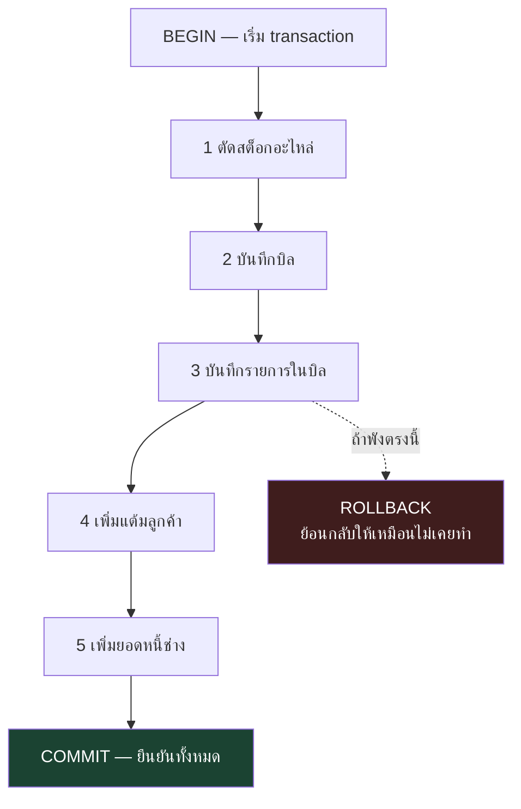

**ทำไมสำคัญ:** ถ้าไม่มี transaction แล้วไฟดับตอนขั้นที่ 3 → สต็อกลดไปแล้ว แต่บิลไม่ถูกบันทึก
= **ของหายจากสต็อกโดยไม่มีบิล** หาสาเหตุไม่เจอตลอดกาล

| คำสั่ง | แปลว่า |
|---|---|
| `BEGIN` | เริ่มจับกลุ่ม |
| `COMMIT` | ยืนยัน — เขียนลงจริง |
| `ROLLBACK` | ยกเลิก — ย้อนกลับให้เหมือนไม่เคยทำ |

**ในโค้ดของเรา transaction เปิดที่ไหน** *(แก้ 2026-09-23 ตาม [ADR-0003 amendment](adr/0003-tenant-lifecycle.md) — Accepted, มีผลตั้งแต่ `tx.4` 2026-09-14)*
ไม่มีใครเขียน `BEGIN` เอง — **handler** (ฟังก์ชันที่รับ request เช่น "บันทึกบิล") เรียก
`TenantService.runTx(fn)` แล้วทำงานทั้งหมดข้างใน `fn` ถ้า `fn` throw → ROLLBACK ทั้งก้อน

* `runTx` **ไม่รับเลขร้านเป็นพารามิเตอร์** — มันอ่านเองว่า request นี้เป็นของร้านไหน (ดู §6) จึงส่งร้านผิดไม่ได้
* ห้ามเปิด transaction ใน middleware / guard / interceptor
* ห้ามขอ connection ใบที่สองระหว่าง request เดียว (เช่น `Promise.all([runTx(a), runTx(b)])`) — เคยทำ pool ค้างทั้งระบบมาแล้ว (#162) ให้รวมเป็น `runTx` เดียว
* มีเพดานเวลา 25 วินาที: ทรานแซกชันที่ค้างนานกว่านั้นถูก rollback ก่อน `COMMIT`

### 5.3 Lock และ Deadlock

**Lock = การจองแถวไว้ไม่ให้คนอื่นแก้พร้อมกัน**

ปัญหาที่ต้องกัน — สินค้าเหลือ 1 ชิ้น สองเครื่องขายพร้อมกัน:

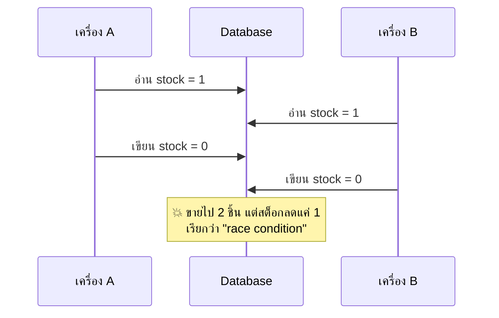

แก้ด้วยการ **lock**: เครื่อง A จองแถวนั้นไว้ก่อน เครื่อง B ต้องรอจน A เสร็จ

**Deadlock = ล็อกไขว้กันจนค้างทั้งคู่**
เครื่อง A จองสินค้า X แล้วรอ Y / เครื่อง B จองสินค้า Y แล้วรอ X → ค้างทั้งคู่ตลอดกาล
**วิธีกัน:** ทุกคน **จองเรียงลำดับเดียวกันเสมอ** (เช่นเรียงตาม `product_id`) แล้วจะไม่มีทางไขว้

> **ลำดับจริงในระบบเรา** *(เพิ่ม 2026-09-23 — กติกาที่ใช้กับงานเงิน/สต็อกทุกเส้น)*:
> บิล (`sales`) → ช่าง → สินค้า (เรียงตาม id) → `doc_counters` → ลูกค้า
> — ทาง void/คืนของแทรกการอ่าน `shifts` แบบ `FOR SHARE` ระหว่างบิลกับช่าง ·
> โค้ดใหม่ที่แตะหลายตารางในชุดนี้ต้องเรียงตามนี้เสมอ

---

## 6. Multi-tenant — ร้านหลายร้านใน database เดียว

**Tenant = ผู้เช่า** ในที่นี้ = **1 ร้าน**
Multi-tenant = ระบบเดียวให้บริการหลายร้าน โดยข้อมูลแต่ละร้าน**ต้องไม่ปนกันเด็ดขาด**

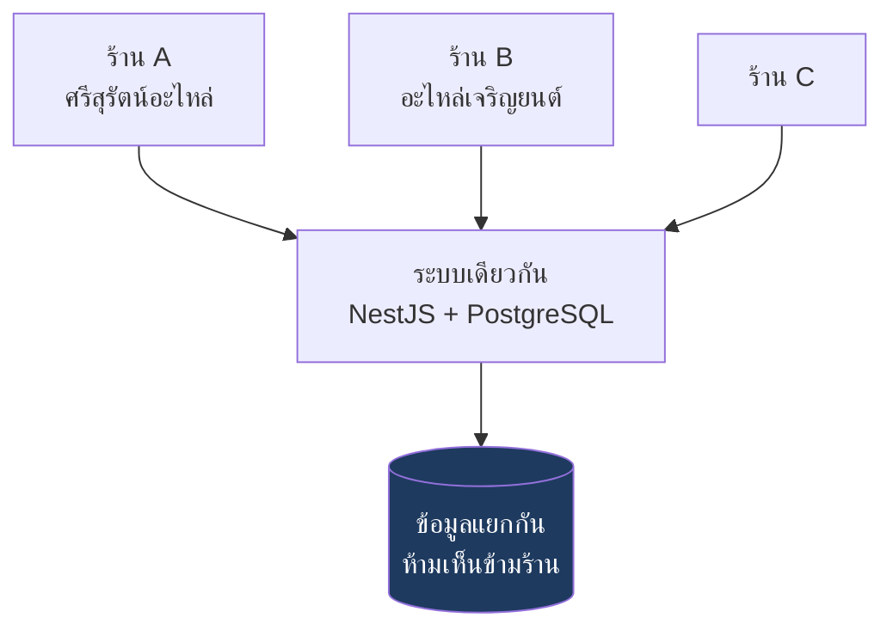

### 3 วิธีที่ทำได้

| วิธี | ทำยังไง | เปรียบเทียบ |
|---|---|---|
| **T1. คอลัมน์ `tenant_id`** | ทุกตารางมีคอลัมน์บอกว่าแถวนี้ของร้านไหน | อพาร์ตเมนต์ — ทุกคนอยู่ตึกเดียวกัน แยกด้วยเลขห้อง |
| **T2. schema แยก** | แต่ละร้านมีชุดตารางของตัวเอง | ทาวน์เฮาส์ — ผนังติดกัน แต่บ้านแยกหลัง |
| **T3. database แยก** | แต่ละร้านมี database คนละตัว | บ้านเดี่ยว — แยกขาด แพงสุด |

เราเลือก **T1** เพราะถูกที่สุดและรองรับร้านเยอะได้ แต่**เสี่ยงที่สุด** เพราะถ้าโปรแกรมเมอร์ลืมเขียน
`WHERE tenant_id = ...` แค่ที่เดียว → **ข้อมูลร้านหนึ่งจะโผล่ในอีกร้าน**

### RLS — ตาข่ายกันลืม

**Row-Level Security (RLS)** = ให้ **ฐานข้อมูลเป็นคนกรองเอง** ไม่ต้องหวังพึ่งความจำโปรแกรมเมอร์


ต่อให้ลืมเขียน `WHERE` ฐานข้อมูลก็จะกรองให้อยู่ดี — นี่คือเหตุผลที่เอกสารยืนยันให้เปิด RLS

### แล้ว PostgreSQL รู้ได้ไงว่า "ร้านที่ล็อกอินอยู่" คือร้านไหน

*(แก้ 2026-09-23 ตาม [ADR-0003 amendment](adr/0003-tenant-lifecycle.md) — แยก "ใครตัดสิน" กับ "ใครลงมือ")*

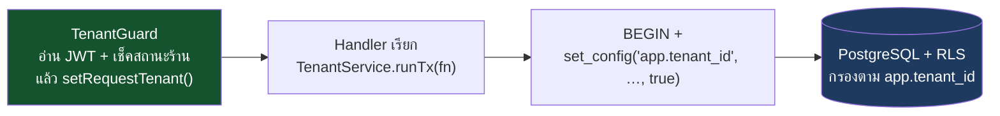

1. **guard ตัดสิน** — `TenantGuard` ดูว่าบัตรผ่านเป็นของร้านไหน ร้านยัง `active` ไหม
   แล้ว**แค่จดคำตัดสิน**ไว้ใน request ด้วย `setRequestTenant()` (ไม่ได้เปิด transaction หรือ `SET LOCAL` เอง)
2. **handler ลงมือ** — `runTx` เปิด transaction แล้วบอก PostgreSQL ว่า "ในทรานแซกชันนี้เป็นร้าน X"
   ด้วย `set_config('app.tenant_id', …, true)` (ค่า `true` = หายไปเองตอนจบทรานแซกชัน ไม่ติดไปกับ request ถัดไป)
3. **RLS กรอง** — ทุก query ในทรานแซกชันนั้นเห็นเฉพาะแถวของร้าน X

---

## 7. Authentication / JWT

### 7.1 ปัญหา

server ต้องรู้ว่า "คนที่ยิง request มานี่ใคร และเป็นพนักงานร้านไหน"
ถ้าไม่รู้ = ใครก็ยิงมาดูยอดขายร้านเราได้

### 7.2 วิธีเก่า (session) และปัญหาของมัน

server จำไว้ว่า "คนนี้ล็อกอินแล้ว" — **แต่จำไว้ในหน่วยความจำของตัวเอง**
พอมี server 3 ตัว (ดู §10) แล้ว request ถัดไปวิ่งไปเจอตัวที่ 2 ซึ่งไม่รู้จักเรา → เด้งออกให้ล็อกอินใหม่

> นี่คือเหตุผลที่โจทย์อาจารย์เขียนว่า **"ห้ามใช้ in-memory session เด็ดขาด"**

### 7.3 วิธีที่ใช้ — JWT

**JWT (JSON Web Token)** = บัตรผ่านที่ **server เซ็นชื่อกำกับไว้**
ข้างในบัตรเขียนว่าใคร ร้านไหน สิทธิ์อะไร แล้ว client แนบมาทุก request

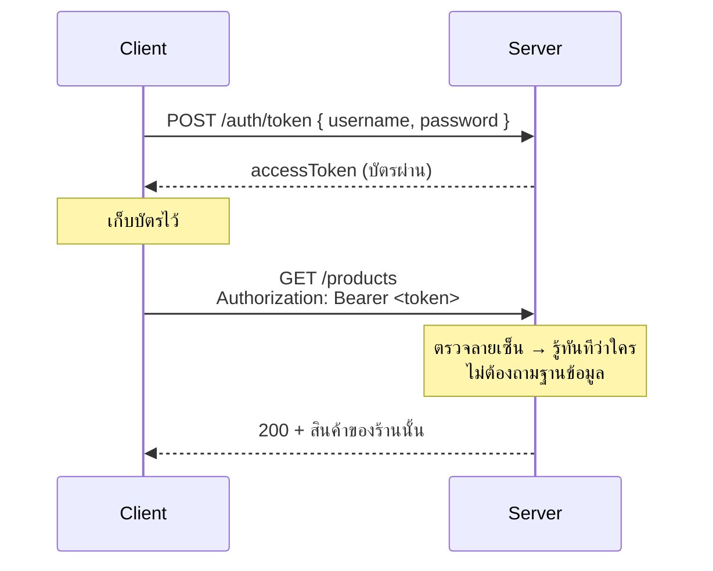

**ข้อดี:** server ตัวไหนก็ตรวจได้ ไม่ต้องจำอะไร → เพิ่ม server กี่ตัวก็ได้
**ข้อเสีย:** **ยกเลิกบัตรกลางคันไม่ได้** — ไล่พนักงานออกแล้วบัตรยังใช้ได้จนหมดอายุ
**วิธีแก้:** ทำบัตรอายุสั้น (15 นาที) + มี **refresh token** ไว้ขอบัตรใหม่
→ ระบบนี้เคาะแล้ว ([ADR-0009](adr/0009-jwt-session-lifetime.md)): access 15 นาที, refresh หมดอายุ
**ตี 4 ทุกวัน** (พนักงานล็อกอินใหม่ทุกเช้า) และตอนขอบัตรใหม่ server เช็คในฐานข้อมูลว่า
คน/ร้าน/เครื่องยังใช้งานได้อยู่ — ไล่ออกแล้วบัตรตายภายใน 15 นาทีโดยไม่ต้องมีรายชื่อดำใน Redis

| คำ | แปลว่า |
|---|---|
| **Authentication** | "คุณคือใคร" (ล็อกอิน) |
| **Authorization** | "คุณทำอันนี้ได้ไหม" (สิทธิ์) |
| **Access token** | บัตรผ่านอายุสั้น แนบไปทุก request |
| **Refresh token** | บัตรอายุยาวกว่า ใช้ขอ access token ใหม่ (ของเรา: หมดอายุตี 4 ของทุกวัน) |
| **Stateless** | server ไม่จำอะไรเลยระหว่าง request |

**ใครล็อกอินได้บ้าง** *(แก้ 2026-09-23 ตาม ADR-0009 addendum #240 E1/E2/E3 และ migration `SingleOwnerRole`)*
ร้านหนึ่งมี **บัญชีคนเดียวที่ใช้งานได้ (active)** และ role มีค่าเดียวคือ **`owner`** — ไม่มี manager/cashier แล้ว
และ**ไม่มี manager PIN** อีกต่อไป (คอลัมน์ `pin_hash` ถูกลบ) การยกเลิกบิลออนไลน์ใช้แค่ "เหตุผล"
สิ่งที่แยกสิทธิ์จริงคือ **เครื่อง** (`pos` / `backoffice` — §2) ไม่ใช่คน ·
PIN ที่ยังมีคือ **PIN ออฟไลน์ของเครื่อง `pos`** ในเฟส 2 (ตรวจที่เครื่องเท่านั้น — [`08`](08_PHASE2_SPEC.md))
บัตรผ่านเซ็นด้วย **RS256** (ADR-0009 addendum 2026-09-09)

---

## 8. Cache / Redis

### 8.1 ปัญหา

หน้า Checkout เปิดทีไรก็ขอรายการสินค้าทุกครั้ง — ข้อมูลชุดเดิมเป๊ะ วันละหลายร้อยครั้ง
ทุกครั้งฐานข้อมูลต้องไปค้นใหม่ = เสียแรงเปล่า

### 8.2 วิธีแก้ — cache

**Cache = ที่เก็บของชั่วคราวที่เร็วกว่ามาก** เราใช้ **Redis** (เก็บใน RAM จึงเร็วกว่า disk หลายเท่า)

**Cache-aside** = รูปแบบที่ใช้ แปลว่า "ดูใน cache ก่อน ไม่มีค่อยไปเอาจาก DB แล้วเก็บใส่ cache ไว้"

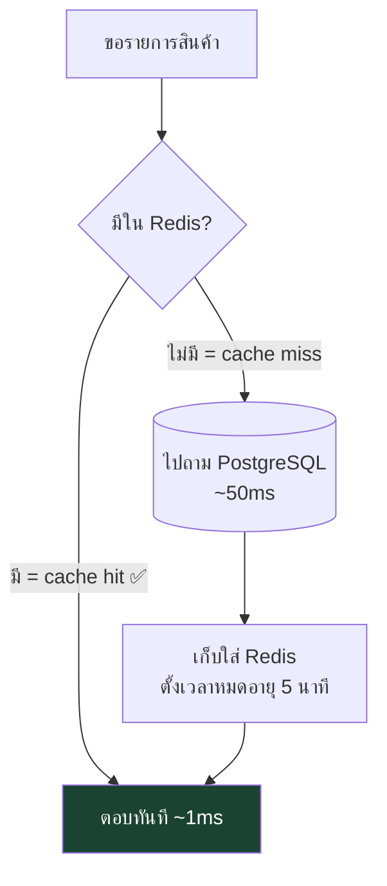

### 8.3 ปัญหาของ cache และศัพท์ที่ต้องรู้

| คำ | คืออะไร | ตัวอย่างในร้านเรา |
|---|---|---|
| **TTL** | อายุของข้อมูลใน cache | เก็บสินค้าไว้ 5 นาทีแล้วทิ้ง |
| **Invalidation** | การล้าง cache เมื่อข้อมูลจริงเปลี่ยน | ขายของแล้วต้องล้าง cache สินค้าทันที ไม่งั้นแสดงสต็อกเก่า |
| **Stale data** | ข้อมูลเก่าค้างใน cache | หน้าจอบอกว่าเหลือ 5 ชิ้น แต่จริง ๆ เหลือ 2 |
| **Cache stampede** | cache หมดอายุพอดี แล้ว 100 request วิ่งไปหา DB พร้อมกัน | เปิดร้านตอนเช้า ทุกเครื่องขอข้อมูลพร้อมกัน |
| **Cache avalanche** | key หมดอายุพร้อมกันหมด → DB โดนถล่ม | ตั้ง TTL 5 นาทีเท่ากันทุกอัน |
| **Jitter** | สุ่มบวกลบเวลาหมดอายุ กันไม่ให้หมดพร้อมกัน | 5 นาที ± 1 นาที |

> ⚠️ **กฎที่ผิดบ่อยที่สุด:** ต้องล้าง cache **หลัง** `COMMIT` เท่านั้น
> ถ้าล้างก่อนแล้ว transaction ดันล้มเหลว → cache จะไปดึงข้อมูลเก่ากลับมาเก็บอีกรอบ

**ค่าจริงในโค้ด** *(เพิ่ม 2026-09-23 — `server/src/infra/tenant-cache.service.ts`)*:
สินค้า 5 นาที ± 1 นาที · หมวดหมู่/ตั้งค่าร้าน 1 ชั่วโมง ± 6 นาที · ลูกค้า/ช่าง 1 นาที ·
การ "ล้าง" ทำโดยเลื่อนเลขรุ่น (generation) ของ key ร้านนั้น **หลัง commit** · และถ้า Redis ตัว cache ล่ม
ระบบ**ยังขายได้** (อ่านตรงจาก PostgreSQL แทน — พิสูจน์ใน #383)

---

## 9. Queue / BullMQ

### 9.1 ปัญหา

บางงาน**ช้า** เช่น สำรองข้อมูลทั้งร้าน, ส่ง LINE แจ้งยอดขาย, สร้างรายงานย้อนหลัง
ถ้าทำในจังหวะที่พนักงานกดปุ่ม พนักงานจะต้องยืนรอ 10 วินาที

### 9.2 วิธีแก้ — คิวงาน

**Queue = รายการงานที่ฝากไว้ให้ทำทีหลัง** เราใช้ **BullMQ** (ทำงานบน Redis)
**Worker = โปรแกรมอีกตัวที่คอยหยิบงานจากคิวมาทำ**

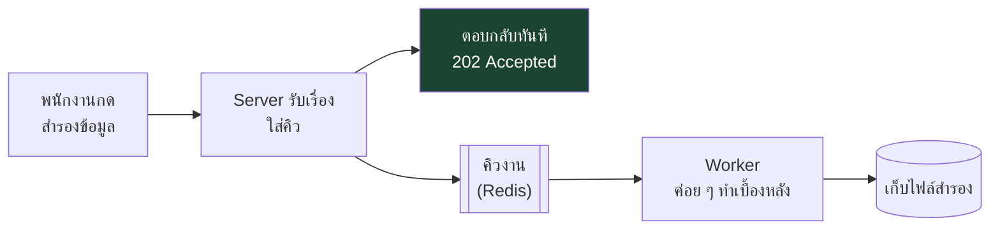

### 9.3 Idempotency — คำที่โผล่บ่อยที่สุดในเอกสาร

**Idempotent = ทำซ้ำกี่ครั้งก็ได้ผลเหมือนทำครั้งเดียว**

ทำไมต้องมี — สถานการณ์จริง:

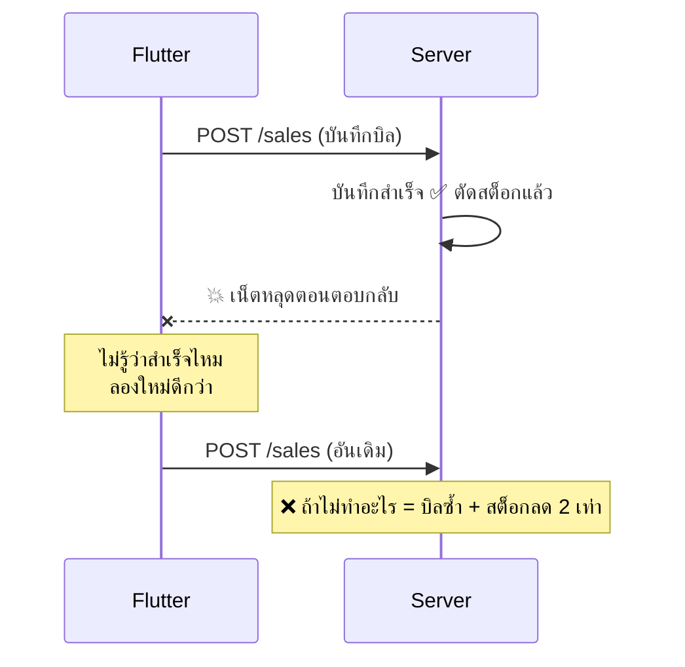

**วิธีแก้:** client แนบรหัสประจำบิล (`Idempotency-Key`) มาด้วย
server จำไว้ว่ารหัสนี้เคยทำแล้ว → ยิงซ้ำก็แค่ตอบผลเดิมกลับไป **ไม่ตัดสต็อกซ้ำ**

> รหัสบิลและ `Idempotency-Key` ต้องสร้าง **ครั้งเดียวต่อ 1 ตะกร้า** ไม่ใช่ใหม่ทุกครั้งที่กดส่ง —
> ถ้าสร้างใหม่ตอนลองซ้ำ server จะคิดว่าเป็นบิลใหม่ แล้วบิลซ้ำอยู่ดี

| คำ | แปลว่า |
|---|---|
| **At-least-once** | ระบบคิวรับประกันว่างานจะถูกทำ "อย่างน้อย 1 ครั้ง" — **อาจเกิน 1 ครั้งได้** จึงต้อง idempotent |
| **Retry** | ลองใหม่เมื่อล้มเหลว |
| **Backoff** | ลองใหม่โดยเว้นระยะห่างขึ้นเรื่อย ๆ (1 วิ → 2 วิ → 4 วิ) |
| **Dead-letter queue (DLQ)** | ที่ทิ้งงานที่ลองแล้วลองอีกก็ไม่สำเร็จ เอาไว้ให้คนมาดู |
| **Bull-Board** | หน้าเว็บดูว่าในคิวมีงานอะไร เสร็จกี่งาน พังกี่งาน |

---

## 10. Scaling / Nginx / Health check

### 10.1 ปัญหา

server 1 ตัวรับได้จำกัด และถ้ามันล่ม = ทุกคนใช้ไม่ได้

### 10.2 วิธีแก้ — เพิ่มจำนวน server

**Horizontal scaling = เพิ่มจำนวนเครื่อง** (ต่างจาก vertical scaling = ทำให้เครื่องเดิมแรงขึ้น)
แล้วมี **Load Balancer** คอยกระจายงาน — เราใช้ **Nginx**

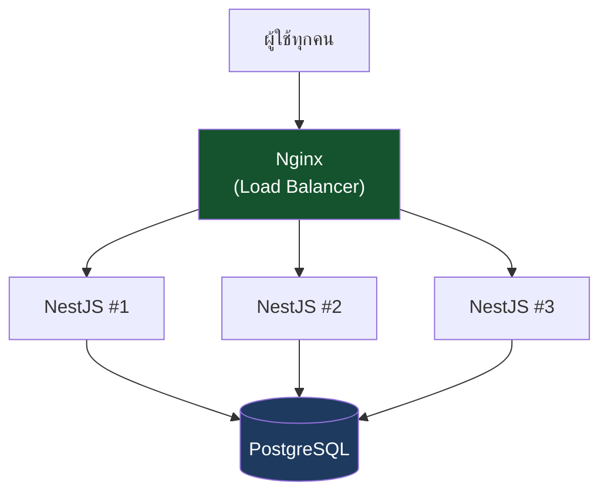

> โจทย์อาจารย์บังคับให้มี **อย่างน้อย 3 instances** ข้อนี้จึงเป็น requirement ตรง ๆ

**เงื่อนไขสำคัญ: server ทุกตัวต้อง stateless** (ไม่จำอะไรไว้ในตัวเอง)
เพราะ request แรกอาจไปตัวที่ 1 request ถัดไปไปตัวที่ 3 — ถ้าตัวที่ 1 จำอะไรไว้ ตัวที่ 3 จะไม่รู้
→ ของที่ต้องแชร์กันให้เก็บใน **Redis** หรือ **PostgreSQL** เท่านั้น

### 10.3 Health check

server ต้องมีช่องให้ตรวจว่า "ยังไหวอยู่ไหม" และ**ต้องแยก 2 แบบ**:

| Endpoint | เช็คอะไร | ถ้าไม่ผ่านทำไง |
|---|---|---|
| `/health/live` | โปรแกรมยังไม่ค้าง (**ห้ามเช็ค DB**) | รีสตาร์ท |
| `/health/ready` | พร้อมรับงานจริง (เช็ค DB + Redis ทั้งตัว cache และตัว queue) — ไม่พร้อมตอบ `503` | หยุดส่งงานให้ชั่วคราว แต่ไม่รีสตาร์ท |

> **ทำไมต้องแยก:** ถ้า `/health/live` ไปเช็ค DB ด้วย แล้ว DB สะดุด 3 วินาที
> → **ทุก container จะถูกรีสตาร์ทพร้อมกัน** = ทำให้ระบบล่มด้วยมือตัวเอง

### 10.4 คำอื่นที่จะเจอ

| คำ | แปลว่า |
|---|---|
| **Instance** | server 1 ตัว (1 สำเนาของโปรแกรม) |
| **Connection pool** | จำนวนสายที่แต่ละ instance ต่อไปหา DB ได้พร้อมกัน — **ตั้งเยอะเกิน DB จะรับไม่ไหว** |
| **Read replica** | สำเนาของ DB ที่ใช้อ่านอย่างเดียว ช่วยแบ่งเบาตัวหลัก |
| **Replication lag** | สำเนาตามไม่ทันตัวจริง (ช้ากว่า 0.1–1 วินาที) → **เพิ่งขายเสร็จแล้วอ่านเจอสต็อกเก่า** |
| **Graceful shutdown** | ปิดโปรแกรมแบบทำงานที่ค้างให้เสร็จก่อน ไม่ตัดกลางคัน |
| **p95 latency** | เวลาตอบสนองที่ 95% ของ request เร็วกว่านี้ (ดูค่านี้ ไม่ใช่ค่าเฉลี่ย) |
| **k6** | เครื่องมือยิงทดสอบว่ารับโหลดได้เท่าไหร่ |
| **Docker / docker-compose** | เครื่องมือห่อโปรแกรมให้รันที่ไหนก็เหมือนกัน / สั่งรันหลายตัวพร้อมกันด้วยคำสั่งเดียว |

---

## 11. Offline & Sync

**นี่คือหัวข้อที่ยากที่สุดของโปรเจกต์ และเป็นเหตุผลที่เอกสาร `03` มี 3 ทางเลือก**

### 11.1 คำถามเดียวที่ต้องตอบ

> **"ข้อมูลตัวจริงอยู่ที่ไหน?"** (source of truth)

* ถ้าอยู่ที่ **server** → เน็ตล่ม = ขายไม่ได้ แต่ข้อมูลไม่มีทางขัดแย้งกัน
* ถ้าอยู่ที่ **เครื่อง** → เน็ตล่มก็ขายได้ แต่**ข้อมูลขัดแย้งกันได้**

### 11.2 ปัญหา conflict — ทำไมมันยาก

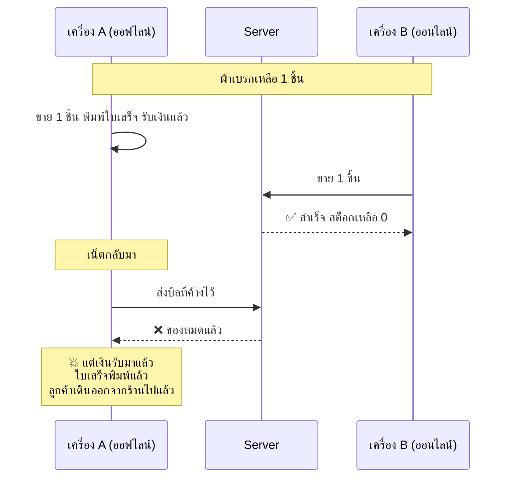

**นี่คือปัญหาที่แก้ด้วยโค้ดอย่างเดียวไม่ได้** ต้องมีขั้นตอนให้คนจัดการด้วย

> **แก้ 2026-09-23 — ของเดิมล้าสมัย:** ฉบับก่อนบอกว่าตอนออฟไลน์ "ขายได้เฉพาะของที่เหลือเยอะ"
> (*scarcity rule* / `offlineOk`) — **เจ้าของยกเลิกแล้ว 2026-09-15 (#240 D3/E10)** ไม่มี `offlineOk` อีก

ทางออกที่ใช้จริง ([`08_PHASE2_SPEC.md`](08_PHASE2_SPEC.md)) คือ:

* **เฟส 1 = ออนไลน์อย่างเดียว** ข้อมูลตัวจริงอยู่ที่ server — ยังไม่มีการขายออฟไลน์กับ server
* **เฟส 2:** ร้านมีเครื่องที่เขียนตอนออฟไลน์ได้ **เครื่องเดียว** (เครื่อง `pos` — ADR-0004)
  เครื่อง `backoffice` ขายไม่ได้ จึงเหลือทางชนน้อยมาก · ออฟไลน์ขายได้ถ้า**สต็อกในเครื่อง `pos` พอ**
* บิลที่ขายตอนออฟไลน์เข้า **outbox** แล้วส่งขึ้น `POST /sync/push` ตอนเน็ตกลับ
  ถ้า server ปฏิเสธ (เช่น `INSUFFICIENT_STOCK`) บิลนั้น**ไม่หายเงียบ** — ไปโผล่ในหน้า **"รอ owner"**
  ให้คนตัดสินใจ (ส่งใหม่ หรือทิ้งพร้อมหมายเหตุ)

### 11.3 ศัพท์ sync ที่จะเจอ

| คำ | แปลว่า | ทำไมต้องมี |
|---|---|---|
| **Source of truth** | ข้อมูลตัวจริงอยู่ที่ไหน | ต้องมีที่เดียว ไม่งั้นทะเลาะกัน |
| **Outbox** | ตารางในเครื่องที่เก็บ "สิ่งที่ยังส่งขึ้น server ไม่ได้" (ของเรา: `outbox_ops` ตารางเดียว) | เน็ตกลับมาแล้วค่อยส่งตามลำดับ |
| **Sync push / pull** | ส่งขึ้น / ดึงลง | |
| **Cursor** | ที่คั่นหน้าว่าดึงมาถึงไหนแล้ว (ของเรา: `updatedSince` + `afterId` ความละเอียดไมโครวินาที — เก็บ `meta.nextCursor` ที่ server ส่งมา ห้ามคำนวณเอง) | ครั้งหน้าจะได้ดึงต่อ ไม่ต้องดึงใหม่หมด |
| **Tombstone** | "ป้ายหลุมศพ" — บันทึกว่าแถวนี้ถูกลบแล้ว | ถ้าลบทิ้งเฉย ๆ เครื่องอื่นจะไม่รู้ว่าลบ แล้ว**ส่งกลับมาใหม่** |
| **Soft delete** | ไม่ลบจริง แค่ทำเครื่องหมาย `deleted_at` | ทำ tombstone ได้ + บิลเก่ายังอ้างถึงได้ |
| **Conflict resolution** | กติกาว่าใครถูกเมื่อชนกัน | |
| **Degraded mode** | โหมดสำรองตอนเน็ตล่ม (ทำได้บางอย่าง) | เฟส 2 มี 3 สถานะ: Online / Degraded / Syncing (08 D5) |
| **`change_log`** | ตาราง "สมุดบันทึกการเปลี่ยนแปลง" ที่เคยออกแบบไว้ให้ pull | **ไม่สร้างแล้ว** (เคาะ 2026-09-15, #191) — pull ใช้ cursor ข้างบนแทน |

---

## 12. สรุปคำศัพท์ (Glossary)

เปิดหาเวลาเจอคำแปลก ๆ ในเอกสาร `01`–`04`

| คำ | คำอธิบายสั้น |
|---|---|
| **API / Endpoint** | ช่องทางที่ client เรียกใช้ server |
| **At-least-once** | คิวรับประกันว่าทำอย่างน้อย 1 ครั้ง (อาจเกิน) |
| **BullMQ** | ระบบคิวงานที่ใช้ ทำงานบน Redis |
| **Cache-aside** | หาใน cache ก่อน ไม่มีค่อยไป DB |
| **CHECK constraint** | กฎที่ DB บังคับเอง เช่น สต็อกห้ามติดลบ |
| **Composite FK** | FK ที่ใช้หลายคอลัมน์รวมกัน (เราใช้พา `tenant_id` ไปด้วย) |
| **Connection pool** | จำนวนสายเชื่อมต่อ DB ที่เปิดค้างไว้ |
| **Deadlock** | ล็อกไขว้จนค้างทั้งคู่ |
| **Admin plane** | ฝั่งระบบที่ทีมเราใช้เอง (`/platform/*`) แยกขาดจากฝั่งที่ร้านใช้ (`/api/*`) ทั้งตาราง ตัว login JWT และ connection (ADR-0002) |
| **BYPASSRLS** | สิทธิ์พิเศษของ DB role ที่ทำให้ RLS ไม่ทำงานกับ role นั้น — เห็นข้อมูลทุกร้าน **ช่องโหว่ที่ใหญ่ที่สุดที่เราสร้างเอง** ใช้เฉพาะ admin plane (ADR-0002) |
| **Device token** | "บัตรประจำเครื่อง" ที่ owner enrol ให้ (`/devices` → `/auth/device`) — บอกว่าเครื่องนี้เป็น `pos` หรือ `backoffice` (ADR-0004) |
| **Denormalize** | จงใจเก็บข้อมูลซ้ำ เช่น เก็บชื่อลูกค้าไว้ในบิล เพื่อให้บิลเก่าไม่เปลี่ยนตามการแก้ชื่อ |
| **DLQ** | ที่ทิ้งงานที่ทำไม่สำเร็จซ้ำ ๆ |
| **DTO** | รูปแบบข้อมูลที่ส่งเข้า-ออก API |
| **Fail-open** | เมื่อกลไกป้องกันล่ม ให้ปล่อยผ่านแทนการบล็อก — ใช้กับ rate limit เพราะ POS หยุดขายไม่ได้ (ADR-0006) |
| **High-water mark** | เลขสูงสุดที่ระบบเคยเห็น ใช้ตรวจว่าเลขเอกสารขาดช่วงไหม และใช้ seed counter ในเครื่องที่ถูกล้าง (ADR-0007) |
| **Idempotent** | ทำซ้ำแล้วผลเหมือนเดิม |
| **Index** | สารบัญที่ทำให้ค้นเร็ว |
| **JWT** | บัตรผ่านที่ server เซ็นกำกับ |
| **Ledger** | บัญชีแบบเพิ่มอย่างเดียว ห้ามแก้ห้ามลบ (เช่น `movements`) |
| **Migration** | สคริปต์เปลี่ยนโครงสร้าง DB แบบมีลำดับ ย้อนกลับได้ — ของเราอยู่ที่ `server/src/db/migrations/` และ**เป็นความจริงของ schema** (วันนี้ 29 ตาราง) |
| **Modular monolith** | โปรแกรมตัวเดียวแต่แบ่งเป็นโมดูลชัดเจน (ตรงข้ามกับ microservices) |
| **NestJS** | เฟรมเวิร์ก backend ภาษา TypeScript ที่ทีมเรียนมา |
| **Noisy neighbor** | ร้านที่ใช้หนักจนทำให้ร้านอื่นในระบบเดียวกันช้า — ข้อเสียประจำตัวของ T1 (ADR-0006) |
| **NUMERIC** | ชนิดข้อมูลตัวเลขที่แม่นยำ ใช้กับเงินเสมอ (ห้ามใช้ float) |
| **Offline writer** | เครื่องที่ได้รับอนุญาตให้บันทึกรายการตอนไม่มีเน็ต ต้องมี **ไม่เกิน 1 เครื่องต่อร้าน** = เครื่อง `role='pos'` (ADR-0004) |
| **ORM (TypeORM)** | ตัวช่วยให้เขียนโค้ดคุยกับ DB โดยไม่ต้องเขียน SQL ดิบ |
| **Outbox** | คิวในเครื่อง เก็บสิ่งที่ยังส่งขึ้น server ไม่ได้ |
| **`owner`** | role เดียวของผู้ใช้ในร้าน (ไม่มี manager/cashier แล้ว — #240 E1/E2) · 1 ร้านมีบัญชี active ได้ 1 บัญชี |
| **Partial index** | index ที่ทำเฉพาะแถวที่เข้าเงื่อนไข (เช่นเฉพาะสินค้าที่ยังไม่ถูกลบ) |
| **pg_trgm** | ส่วนเสริมของ PostgreSQL ที่ค้นข้อความแบบ "มีคำนี้อยู่ข้างใน" ได้เร็ว — **ใช้กับภาษาไทยได้** |
| **Provisioning** | ขั้นตอนสร้างร้านใหม่เข้าระบบให้ครบ (tenant + owner + settings + seed) ในทรานแซกชันเดียว (ADR-0001) |
| **Race condition** | สองคนทำพร้อมกันแล้วผลเพี้ยน |
| **Rate limit** | จำกัดจำนวน request ต่อช่วงเวลา เกินแล้วตอบ `429` (ADR-0006) |
| **Redis** | ที่เก็บข้อมูลใน RAM ใช้ทำ cache + คิว |
| **Replication / lag** | สำเนา DB / อาการตามไม่ทัน |
| **RLS** | ให้ DB กรองข้อมูลตามร้านให้อัตโนมัติ |
| **`runTx`** | `TenantService.runTx(fn)` — ทางเดียวที่ handler ใช้เปิด transaction ของร้าน และตั้ง `app.tenant_id` ให้ RLS (ADR-0003 amendment) |
| **Seed** | ข้อมูลตั้งต้นที่ใส่ให้ตอนสร้างระบบใหม่ |
| **Snapshot** | ไฟล์สำรองข้อมูลทั้งก้อน ณ เวลาหนึ่ง |
| **Soft delete** | ทำเครื่องหมายว่าลบ แทนการลบจริง |
| **Stateless** | server ไม่จำอะไรระหว่าง request |
| **Tenant** | 1 ร้าน |
| **Tenant lifecycle** | สถานะของร้าน `active` / `suspended` / `closed` และผลของแต่ละสถานะ (ADR-0003) — เช็คที่ `TenantGuard` |
| **Tombstone** | บันทึกว่า "แถวนี้ถูกลบแล้ว" ไว้บอกเครื่องอื่น |
| **Transaction** | กลุ่มคำสั่งที่ต้องสำเร็จทั้งหมดหรือไม่เลย |
| **TTL** | อายุของข้อมูลใน cache |
| **WAC** | ต้นทุนเฉลี่ยถ่วงน้ำหนัก — สูตรคิดทุนใหม่ตอนรับของเข้าร้าน |

---

## 13. ลองตอบดูว่าเข้าใจหรือยัง

<details>
<summary><b>1. ทำไมการขาย 1 บิลต้องอยู่ใน transaction เดียว?</b></summary>

เพราะมันแตะ 5 ตาราง (สต็อก, บิล, รายการในบิล, แต้มลูกค้า, หนี้ช่าง)
ถ้าพังกลางทางแล้วไม่ย้อนกลับ จะเกิด "สต็อกลดแต่ไม่มีบิล" ซึ่งหาสาเหตุไม่เจอ
</details>

<details>
<summary><b>2. Idempotency-Key มีไว้ทำอะไร?</b></summary>

กันบิลซ้ำเวลา client ยิงใหม่เพราะเน็ตหลุดตอนรอคำตอบ
server เห็นรหัสเดิมก็ตอบผลเดิมกลับไป โดยไม่ตัดสต็อกซ้ำ
</details>

<details>
<summary><b>3. ทำไมต้องล้าง cache หลัง COMMIT ไม่ใช่ก่อน?</b></summary>

ถ้าล้างก่อนแล้ว transaction ล้มเหลว จะมีคนมาขอข้อมูลระหว่างนั้น
แล้ว cache จะไปดึง**ข้อมูลเก่า**กลับมาเก็บใหม่ กลายเป็นค้างข้อมูลผิดยาวไปอีก 5 นาที
</details>

<details>
<summary><b>4. ทำไม `/health/live` ห้ามเช็คฐานข้อมูล?</b></summary>

เพราะถ้า DB สะดุดแค่ 3 วินาที ทุก container จะถูกมองว่าตายและถูกรีสตาร์ทพร้อมกัน
= ทำระบบล่มด้วยมือตัวเอง ทั้งที่ DB แค่สะดุดนิดเดียว
</details>

<details>
<summary><b>5. RLS ช่วยอะไร ในเมื่อเราก็เขียน WHERE tenant_id เองได้?</b></summary>

เพราะ "เขียนเองได้" กับ "เขียนครบทุกที่ตลอดไป" ไม่เหมือนกัน
ลืมแค่ query เดียวใน 300 query = ข้อมูลร้านหนึ่งโผล่ในอีกร้าน
RLS คือตาข่ายที่ทำงานแม้เราลืม
</details>

<details>
<summary><b>6. ทำไมเงินต้องเป็น NUMERIC ไม่ใช่ float?</b></summary>

float เก็บทศนิยมได้ไม่แม่น (0.1 + 0.2 อาจได้ 0.30000000000000004)
พอเอามาบวกกันเป็นหมื่นบิล ยอดจะเพี้ยนหลักสตางค์แล้วเทียบกับใบเสร็จเก่าไม่ตรง
</details>

<details>
<summary><b>7. Tombstone มีไว้ทำไม ลบทิ้งเลยไม่ได้เหรอ?</b></summary>

ถ้าลบจริง เครื่องที่ออฟไลน์อยู่จะไม่มีทางรู้ว่าถูกลบ
พอ sync ขึ้นมามันจะ**ส่งข้อมูลนั้นกลับขึ้นไปใหม่** เหมือนผีคืนชีพ
</details>

<details>
<summary><b>8. ทำไมร้านหนึ่งถึงมีเครื่องที่ขายตอนออฟไลน์ได้แค่เครื่องเดียว?</b></summary>

*(แก้ 2026-09-23 — คำถามเดิม "ทำไมออฟไลน์ขายของบางตัวไม่ได้" ตอบตาม scarcity rule ที่ยกเลิกไปแล้ว #240 D3)*
เพราะถ้ามีสองเครื่องขายออฟไลน์พร้อมกัน ทั้งคู่จะเห็นสต็อกชุดเดียวกันแล้วขายชิ้นสุดท้ายซ้ำได้
ให้เขียนออฟไลน์ได้แค่เครื่อง `pos` เครื่องเดียว (ADR-0004) ทางชนก็เหลือน้อยมาก
และถ้ายังชนจริง บิลนั้นจะไปอยู่หน้า "รอ owner" ให้คนตัดสิน ไม่หายเงียบ
</details>

---

## อ่านอะไรต่อ

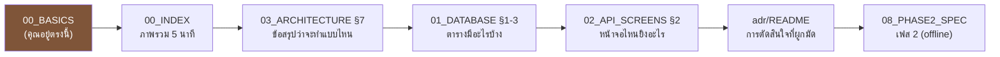

*(แก้ 2026-09-23: ต่อท้ายด้วย `adr/` และ `08` แทน `04` ซึ่งเป็นประวัติแล้ว — อยากลึกเรื่อง lock/RLS/cache ต่อจากไฟล์นี้
อ่าน [`architecture-primer.md`](architecture-primer.md))*

* **ถ้าคุณจะทำฝั่ง Flutter** → เน้น `02_API_SCREENS.md` (endpoint ที่ต้องเรียก) + `03 §2` (บทบาทของ Drift)
* **ถ้าคุณจะคุยกับทีม backend** → ส่ง `01_DATABASE.md` + `02_API_SCREENS.md` ให้เขา
* **ถ้าจะพรีเซนต์อาจารย์** → `03_ARCHITECTURE.md` + `02 §9` (เกณฑ์ load test)
