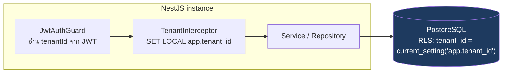
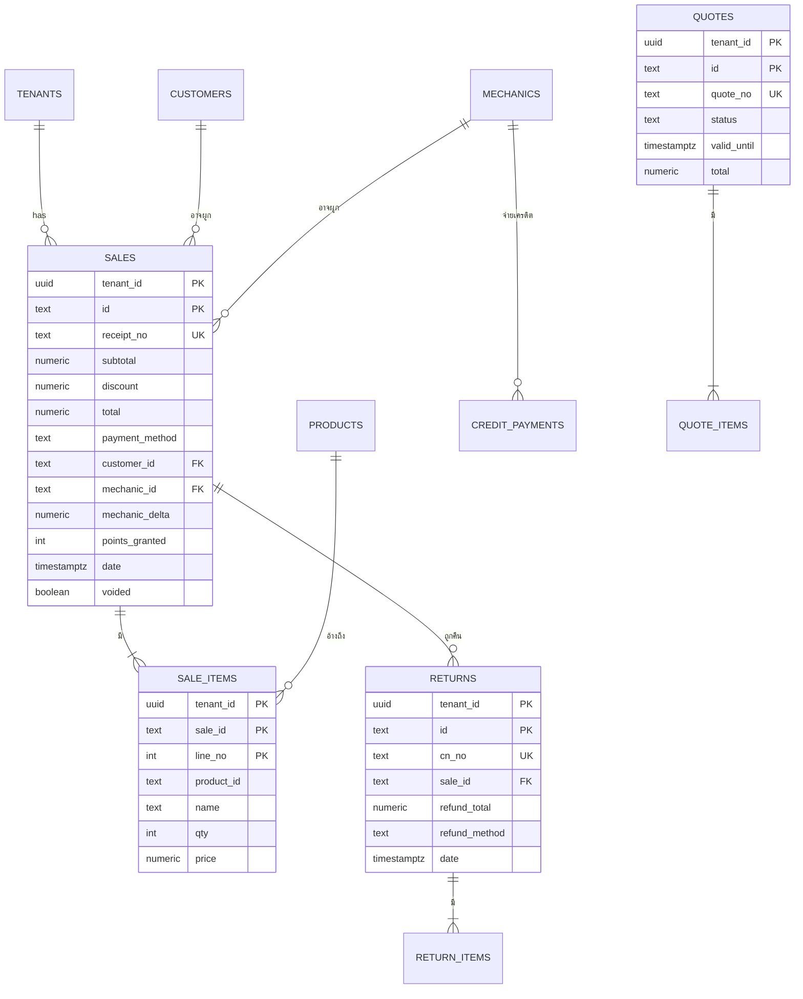
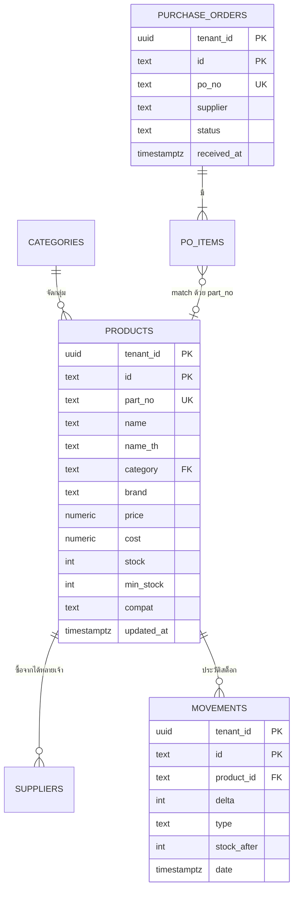
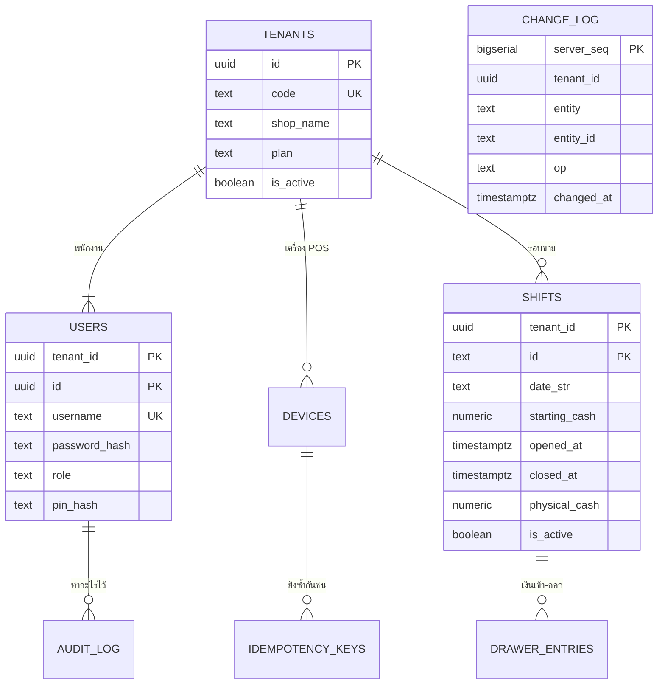
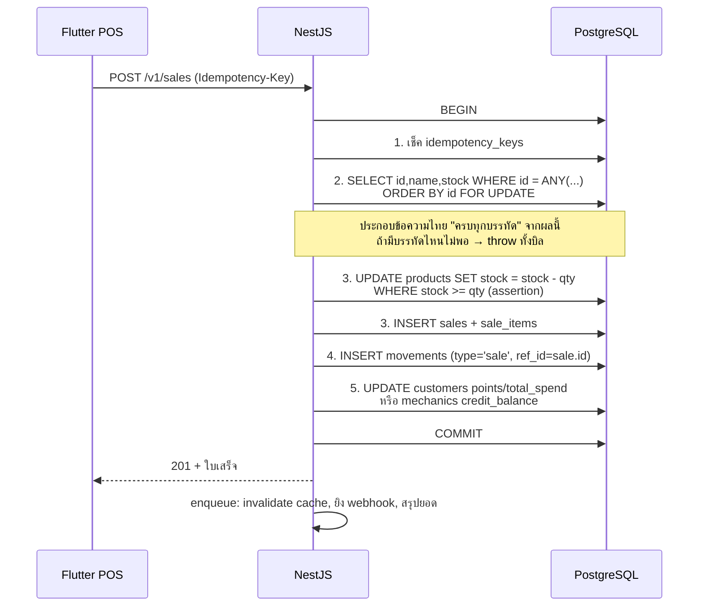
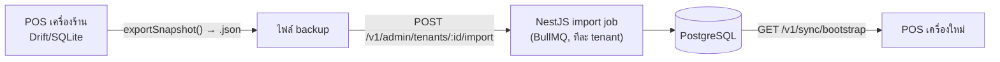

# 01 — Database Design (PostgreSQL, multi-tenant)

> **สำหรับทีม backend:** นี่คือ "หน้าตาของ database" ที่ถามถึง
> แอปเดิมเก็บทุกอย่างใน SQLite บนเครื่อง (Drift) **20 ตาราง** — เอกสารนี้แปลงเป็น PostgreSQL
> พร้อมเพิ่มอีก **7 ตาราง** ที่จำเป็นเมื่อมี backend + หลายร้าน (multi-tenant) → **รวม 27 ตาราง**
> (เฟส 1 สร้างจริงแค่ 26 — `change_log` เป็นของเฟส 2)
>
> Business rule ทั้งหมดที่เขียนในนี้ถอดมาจาก `pos/db.js` (แอป JS ตัวเดิม) และ `CONTRACT.md`
> **ห้ามแก้ค่าคงที่/สูตร** โดยไม่คุยกัน เพราะมันคือ behaviour ที่ร้านใช้จริงอยู่ทุกวัน

---

## 1. ภาพรวมโดเมน

ร้านขายอะไหล่รถยนต์ 1 ร้าน มีงาน 6 กลุ่ม:

| โดเมน | ทำอะไร | ตารางหลัก |
|---|---|---|
| **Catalog / Stock** | อะไหล่, หมวดหมู่, ซัพพลายเออร์, ประวัติการเคลื่อนไหวสต็อก | `products`, `categories`, `suppliers`, `movements` |
| **Selling** | ขายหน้าร้าน (ตัดสต็อก), ใบเสนอราคา, พักบิล | `sales`, `sale_items`, `quotes`, `quote_items`, `parked_sales` |
| **Returns** | รับคืนสินค้า / ออกใบลดหนี้ (credit note) | `returns`, `return_items` |
| **Purchasing** | ใบสั่งซื้อเข้าร้าน + รับของ (คิดต้นทุนเฉลี่ยถ่วงน้ำหนัก) | `purchase_orders`, `po_items` |
| **People & Credit** | ลูกค้า (แต้มสะสม), ช่าง (วงเงินเครดิต), การชำระเครดิต | `customers`, `mechanics`, `credit_payments` |
| **Cash / Shift** | เปิด-ปิดลิ้นชัก, เงินเข้า-ออกระหว่างวัน, รายงานปิดร้าน | `shifts`, `drawer_entries` |

จุดที่ **ห้ามพลาด**: การขาย 1 ครั้ง = transaction เดียวที่แตะ 5 ตาราง
(`sales` + `sale_items` + `products.stock` + `movements` + `customers`/`mechanics`)
ถ้าพังกลางทางต้อง rollback ทั้งหมด — ดู [§7.1](#71-การขาย-savesale--transaction-ที่สำคัญที่สุด)

---

## 2. Multi-tenant model ที่เอกสารนี้ใช้

เลือก **Shared database + shared schema + `tenant_id` ทุกตาราง + PostgreSQL RLS**
(เหตุผลและทางเลือกอื่นอยู่ใน [`03_ARCHITECTURE.md` §5](03_ARCHITECTURE.md#5-multi-tenant--3-ทางเลือก))

กติกา 4 ข้อ ที่ต้องทำให้ครบ ไม่งั้น multi-tenant จะรั่ว:

1. **ทุกตารางธุรกิจมี `tenant_id UUID NOT NULL`** — ไม่มีข้อยกเว้น
2. **Primary key เป็น composite `(tenant_id, id)`** และ **foreign key ก็พา `tenant_id` ไปด้วย**
   ```sql
   FOREIGN KEY (tenant_id, sale_id) REFERENCES sales (tenant_id, id)
   ```
   → ทำให้ "อ้างข้ามร้าน" เป็นไปไม่ได้ในระดับโครงสร้าง ไม่ต้องหวังพึ่ง `WHERE` ที่โปรแกรมเมอร์ลืมใส่
3. **Unique constraint ทุกตัวต้องขึ้นต้นด้วย `tenant_id`**
   เช่น เลขที่ใบเสร็จซ้ำกันข้ามร้านได้ แต่ห้ามซ้ำในร้านเดียวกัน → `UNIQUE (tenant_id, receipt_no)`
4. **เปิด RLS เป็นตาข่ายชั้นสุดท้าย** (ดู [§8](#8-row-level-security-rls))



**ข้อควรระวัง:** `SET LOCAL` มีผลเฉพาะใน transaction ถ้าใช้ connection pool แล้วไม่ได้อยู่ใน
transaction ค่าอาจติดไปกับ connection ตัวถัดไป → บังคับให้ทุก request ที่แตะ DB
ทำงานใน transaction (หรือใช้ `set_config('app.tenant_id', $1, true)`)

---

## 3. ER Diagram

แบ่ง 3 รูปเพื่อให้อ่านออก (ทุกตารางมี `tenant_id` เหมือนกันหมด จึงไม่วาดเส้นไป `tenants` ทุกเส้น)

### 3.1 Selling & Returns



### 3.2 Catalog, Stock & Purchasing



### 3.3 Cash / Shift + ตารางระบบ (ใหม่)



---

## 4. Type mapping — Drift/SQLite → PostgreSQL

| Drift (ปัจจุบัน) | PostgreSQL | หมายเหตุ |
|---|---|---|
| `TextColumn` id (`"p1"`, `"s17a3…"`) | `TEXT` | **เก็บเป็น TEXT ต่อไป** ไม่แปลงเป็น UUID/serial — id ถูกสร้างจาก client (`newId()`) และ "ต้อง" สร้างได้ตอนออฟไลน์ ดู [§7.2](#72-เลขเอกสาร-document-numbers) |
| `RealColumn` (เงิน) | **`NUMERIC(12,2)`** | ⚠️ **ห้ามใช้ `double precision`** — แอปเดิมใช้ float + `round2()` ถ้า backend ใช้ float ต่อ ยอดจะเพี้ยนหลักสตางค์แล้วเทียบกับใบเสร็จเก่าไม่ได้ ตั้งค่า TypeORM `transformer` แปลง `string ↔ number` ให้ชัด |
| `IntColumn` (stock, qty, points) | `INTEGER` | |
| `DateTimeColumn` | `TIMESTAMPTZ` | เก็บ UTC, แปลงเป็น `Asia/Bangkok` ที่ client เท่านั้น |
| `customers.createdAt` (TEXT!) | `TIMESTAMPTZ` | ของเดิมเป็น string — ต้อง parse ตอน migrate |
| `BoolColumn` | `BOOLEAN` | |
| `parked_sales.payload` (JSON string) | **`JSONB`** | query ได้, ตรวจ schema ได้ |
| `IntColumn autoIncrement` (`sale_items.rowId`, `shifts.id`) | เปลี่ยนวิธี — ดูด้านล่าง | |

**เรื่อง auto-increment ที่ต้องเปลี่ยน (สำคัญ):**

* `sale_items.rowId` / `po_items` / `return_items` / `quote_items` → เปลี่ยนเป็น **`line_no INT`**
  ที่ client กำหนดเอง (1,2,3…) และ PK = `(tenant_id, <parent>_id, line_no)`
  **เหตุผล:** ทำให้การ retry ยิงบิลเดิมซ้ำเป็น idempotent โดยธรรมชาติ (insert ชนกับ PK แทนที่จะได้แถวซ้ำ)
* `shifts.id` (auto-increment int) → เปลี่ยนเป็น **`TEXT`** ที่ client สร้าง
  **เหตุผล:** เปิดกะตอนเน็ตล่มต้องได้ id ทันที และ int ที่ auto-increment จะชนกันข้ามร้าน

---

## 5. DDL เต็ม

> เขียนเป็น SQL ตรง ๆ เพื่อให้เห็นภาพ — ตอน implement ให้ทำเป็น **TypeORM migration**
> (`npm run migration:generate`) ไม่ใช่ `synchronize: true` (ห้ามใช้ใน production เด็ดขาด)

### 5.1 ตารางระบบ (ใหม่ทั้งหมด)

```sql
-- ร้านค้าแต่ละร้าน = 1 tenant = 1 เจ้าของอิสระ (ไม่ใช่แฟรนไชส์เดียวกัน) = 1 เครื่อง POS ในเฟสนี้
-- ดูเหตุผลที่ 03_ARCHITECTURE.md §5
CREATE TABLE tenants (
  id            UUID PRIMARY KEY DEFAULT gen_random_uuid(),
  code          TEXT NOT NULL UNIQUE,           -- 'srisurart'
  shop_name     TEXT NOT NULL,                  -- 'ศรีสุรัตน์อะไหล่ยนต์'
  shop_name_en  TEXT NOT NULL DEFAULT '',
  plan          TEXT NOT NULL DEFAULT 'basic',
  is_active     BOOLEAN NOT NULL DEFAULT TRUE,
  created_at    TIMESTAMPTZ NOT NULL DEFAULT now()
);

-- พนักงาน (JWT subject) — 1 user ผูก tenant เดียวเสมอ ห้ามมี user ข้าม tenant (คนละเจ้าของกันจริง)
CREATE TABLE users (
  tenant_id     UUID NOT NULL REFERENCES tenants(id) ON DELETE CASCADE,
  id            UUID NOT NULL DEFAULT gen_random_uuid(),
  username      TEXT NOT NULL,
  password_hash TEXT NOT NULL,                  -- argon2id
  display_name  TEXT NOT NULL,
  role          TEXT NOT NULL CHECK (role IN ('owner','manager','cashier')),
  pin_hash      TEXT,                           -- manager PIN สำหรับยืนยันงานเสี่ยง (void/ลดราคาเกิน)
  is_active     BOOLEAN NOT NULL DEFAULT TRUE,
  created_at    TIMESTAMPTZ NOT NULL DEFAULT now(),
  PRIMARY KEY (tenant_id, id),
  UNIQUE (tenant_id, username)
);

-- เครื่อง POS แต่ละเครื่อง (ใช้ตอน sync + ออกเลขเอกสารไม่ให้ชน)
CREATE TABLE devices (
  tenant_id     UUID NOT NULL,
  id            TEXT NOT NULL,                  -- client-generated
  label         TEXT NOT NULL,                  -- 'เคาน์เตอร์หน้าร้าน'
  device_no     SMALLINT NOT NULL,              -- 1..99 ใช้เป็น prefix เลขเอกสาร
  last_pull_seq BIGINT NOT NULL DEFAULT 0,      -- cursor ของ change_log
  last_seen_at  TIMESTAMPTZ,
  PRIMARY KEY (tenant_id, id),
  UNIQUE (tenant_id, device_no)
);

-- กัน request ซ้ำ (โทรศัพท์กดซ้ำ / retry ตอนเน็ตกระตุก)
CREATE TABLE idempotency_keys (
  tenant_id     UUID NOT NULL,
  key           TEXT NOT NULL,                  -- ค่าจาก header Idempotency-Key
  endpoint      TEXT NOT NULL,
  request_hash  TEXT NOT NULL,                  -- sha256 ของ body — กันเอา key เดิมยิง body ใหม่
  status        TEXT NOT NULL CHECK (status IN ('in_progress','done','failed')),
  response_code INT,
  response_body JSONB,
  created_at    TIMESTAMPTZ NOT NULL DEFAULT now(),
  PRIMARY KEY (tenant_id, key)
);
CREATE INDEX idx_idem_created ON idempotency_keys (created_at);  -- ใช้ลบของเก่า (>24h)

-- ⛔ เฟส 2 เท่านั้น — อย่าสร้างในเฟส 1 (ยังไม่มีใครเรียก และมีบั๊ก cursor ที่ต้องแก้ก่อน ดูกล่องใต้ตาราง)
-- log การเปลี่ยนแปลงสำหรับ sync แบบ pull
CREATE TABLE change_log (
  server_seq    BIGSERIAL PRIMARY KEY,
  tenant_id     UUID NOT NULL,
  entity        TEXT NOT NULL,                  -- 'products' | 'sales' | ...
  entity_id     TEXT NOT NULL,
  op            TEXT NOT NULL CHECK (op IN ('insert','update','delete')),
  payload       JSONB,
  origin_device TEXT,                           -- กันส่งกลับไปหาเครื่องที่เป็นคนสร้างเอง
  changed_at    TIMESTAMPTZ NOT NULL DEFAULT now()
);
CREATE INDEX idx_changelog_pull ON change_log (tenant_id, server_seq);

-- ⚠️ ตารางนี้ "ไม่ใช่ตัวออกเลข" — ตัวออกเลขอยู่ที่เครื่อง (ดู §7.2)
-- นี่คือ high-water mark ไว้ตรวจว่าเลขเอกสารขาดช่วงหรือเปล่า (บิลหาย/เครื่องพัง)
CREATE TABLE doc_counters (
  tenant_id     UUID NOT NULL,
  device_id     TEXT NOT NULL,                  -- ⭐ ขาดไม่ได้ ไม่งั้นสองเครื่องเขียนทับกัน
  doc_type      TEXT NOT NULL,                  -- 'receipt' | 'po' | 'quote' | 'cn'
  period        TEXT NOT NULL,                  -- '2569-08'  (รีเซ็ตรายเดือน)
  last_no       INT  NOT NULL DEFAULT 0,        -- เลขสูงสุดที่เห็นจากเครื่องนี้
  PRIMARY KEY (tenant_id, device_id, doc_type, period)
);

-- audit (PDPA + สืบสวนเวลาเงินไม่ตรง)
CREATE TABLE audit_log (
  id            BIGSERIAL PRIMARY KEY,
  tenant_id     UUID NOT NULL,
  user_id       UUID,
  device_id     TEXT,
  action        TEXT NOT NULL,                  -- 'sale.void' | 'product.price_change' | 'backup.import'
  entity        TEXT,
  entity_id     TEXT,
  before        JSONB,
  after         JSONB,
  ip            INET,
  created_at    TIMESTAMPTZ NOT NULL DEFAULT now()
);
CREATE INDEX idx_audit_tenant_time ON audit_log (tenant_id, created_at DESC);
```

> ### ⚠️ `change_log` มีบั๊ก cursor ที่ต้องรู้ก่อนใช้
> `BIGSERIAL` จ่ายเลข **ตอน INSERT ไม่ใช่ตอน COMMIT** — transaction ที่ได้ `server_seq = 100`
> อาจ commit **ทีหลัง** ตัวที่ได้ 101 ดังนั้นเครื่องที่ pull ไปถึง 101 แล้วขอ `> 101`
> จะ **ข้ามแถว 100 ไปถาวร** = ข้อมูลหายเงียบ ๆ โดยไม่มี error
>
> ทางแก้ 2 แบบ: (ก) ใช้ commit-timestamp / `xmin` snapshot แบบ Debezium
> (ข) ง่ายกว่าสำหรับทีมนักศึกษา — pull เฉพาะแถวที่ `changed_at < now() - interval '5 seconds'`
> (ยอมรับ latency 5 วิ แลกกับความถูกต้อง)
>
> **แต่ทางที่ดีที่สุดคือ: เฟส 1 อย่าเพิ่งสร้างตารางนี้เลย** ยังไม่มีใครเรียกใช้

```sql

-- ค่าคงที่/เวอร์ชันข้อมูลของแต่ละร้าน (แทน AppMeta เดิม)
CREATE TABLE tenant_meta (
  tenant_id     UUID NOT NULL,
  key           TEXT NOT NULL,
  value         TEXT NOT NULL,
  PRIMARY KEY (tenant_id, key)
);
```

### 5.2 Catalog & Stock

```sql
CREATE TABLE categories (
  tenant_id  UUID NOT NULL REFERENCES tenants(id) ON DELETE CASCADE,
  name       TEXT NOT NULL,
  position   INT  NOT NULL,        -- ลำดับสี palette — ห้ามเรียงใหม่มั่ว สีจะสลับทั้งแอป
  PRIMARY KEY (tenant_id, name)
);

CREATE TABLE products (
  tenant_id  UUID NOT NULL REFERENCES tenants(id) ON DELETE CASCADE,
  id         TEXT NOT NULL,
  part_no    TEXT NOT NULL,
  name       TEXT NOT NULL,
  name_th    TEXT NOT NULL,
  category   TEXT NOT NULL,
  brand      TEXT NOT NULL,
  price      NUMERIC(12,2) NOT NULL CHECK (price >= 0),
  cost       NUMERIC(12,2) NOT NULL CHECK (cost  >= 0),
  stock      INT  NOT NULL CHECK (stock >= 0),      -- ⚠️ ดู §7.1 เรื่อง strict stock
  min_stock  INT  NOT NULL DEFAULT 0,
  compat     TEXT,                                   -- รุ่นรถที่ใส่ได้ (ค้นด้วย pg_trgm)
  updated_at TIMESTAMPTZ NOT NULL DEFAULT now(),
  deleted_at TIMESTAMPTZ,                            -- soft delete (จำเป็นสำหรับ sync)
  -- ⚠️ ห้ามใส่ FK ไป categories — ของเดิม "ลบหมวด" ไม่แตะ products.category
  --    สินค้าที่หมวดกำพร้าเป็น orphan by design และ catColor() มี hash fallback รองรับแล้ว
  -- ⚠️ ไม่มี inline UNIQUE (tenant_id, part_no) — ใช้ partial unique index ด้านล่างแทน
  PRIMARY KEY (tenant_id, id)
);
-- partial unique: สินค้าที่ถูก soft delete ไปแล้ว ต้องไม่กันไม่ให้เอา part_no เดิมมาใช้ใหม่
CREATE UNIQUE INDEX uq_products_partno ON products (tenant_id, part_no) WHERE deleted_at IS NULL;
CREATE INDEX idx_products_cat   ON products (tenant_id, category) WHERE deleted_at IS NULL;
CREATE INDEX idx_products_low   ON products (tenant_id) WHERE stock <= min_stock AND deleted_at IS NULL;
CREATE INDEX idx_products_updat ON products (tenant_id, updated_at);
-- ค้นหาชื่อไทย/อังกฤษ/เบอร์อะไหล่/รุ่นรถ ในช่องเดียว (หน้า Checkout + Vehicle Search)
-- ⚠️ ต้องใช้ pg_trgm ไม่ใช่ to_tsvector — เหตุผลใต้บล็อกนี้
CREATE EXTENSION IF NOT EXISTS pg_trgm;
CREATE INDEX idx_products_search ON products USING GIN (
  lower(part_no || ' ' || name || ' ' || name_th || ' ' || COALESCE(compat,'')) gin_trgm_ops
);

> ### ⚠️ ทำไมไม่ใช้ full-text (`to_tsvector`) กับภาษาไทย
> ภาษาไทย**ไม่มีช่องว่างระหว่างคำ** — parser มาตรฐานของ PostgreSQL จะมอง `"ผ้าเบรกหน้า"`
> เป็น token เดียว พนักงานพิมพ์ `"เบรก"` แล้ว**จะไม่เจอ** ทั้งที่ทุกวันนี้เจอ
> (แอปปัจจุบันใช้ substring filter ใน Dart จึงเจอเสมอ)
> → ใช้ **`pg_trgm` + `ILIKE '%…%'`** แทน ซึ่งเร็วพอสำหรับสินค้าหลักหมื่นชิ้น
> ถ้าอยากได้ full-text จริงต้องลง Thai word-segmentation dictionary เพิ่ม (เกินความจำเป็นตอนนี้)

CREATE TABLE suppliers (
  tenant_id  UUID NOT NULL,
  id         TEXT NOT NULL,
  product_id TEXT NOT NULL,
  name       TEXT NOT NULL,
  unit_cost  NUMERIC(12,2) NOT NULL,
  freight    NUMERIC(12,2) NOT NULL DEFAULT 0,
  PRIMARY KEY (tenant_id, id),
  FOREIGN KEY (tenant_id, product_id) REFERENCES products (tenant_id, id) ON DELETE CASCADE
);
CREATE INDEX idx_suppliers_product ON suppliers (tenant_id, product_id);

-- ประวัติสต็อกทุกการเคลื่อนไหว = ledger, append-only ห้าม UPDATE/DELETE
CREATE TABLE movements (
  tenant_id   UUID NOT NULL,
  id          TEXT NOT NULL,
  product_id  TEXT NOT NULL,
  part_no     TEXT NOT NULL,
  name        TEXT NOT NULL,
  delta       INT  NOT NULL,      -- ลบ = ขายออก, บวก = รับเข้า
  type        TEXT NOT NULL,      -- ⚠️ ค่าที่ระบบเขียนจริงวันนี้มีแค่ 3 ค่า:
                                  --    'receive' (รับของเข้า PO)
                                  --    'adjustment-in' / 'adjustment-out' (ปรับสต็อกมือ)
                                  --    'sale' / 'return' เป็น "ของใหม่" — ดูกล่องเตือนใต้ DDL
  note        TEXT,
  stock_after INT  NOT NULL,
  ref_id      TEXT,               -- ⭐ เพิ่มใหม่: sale_id / return_id / po_id ที่ทำให้เกิดแถวนี้
  date        TIMESTAMPTZ NOT NULL DEFAULT now(),
  PRIMARY KEY (tenant_id, id),
  FOREIGN KEY (tenant_id, product_id) REFERENCES products (tenant_id, id)
);
CREATE INDEX idx_movements_product ON movements (tenant_id, product_id, date DESC);
```

> **⭐ `movements.ref_id` เป็นคอลัมน์ใหม่ที่แอปเดิมไม่มี** — แนะนำให้ใส่ เพราะเวลาสต็อกไม่ตรง
> ตอนนี้ไล่กลับไปหาบิลต้นทางไม่ได้เลย ต้องเดาจากเวลา

> ### ⚠️ เรื่อง `movements` ที่ต้องรู้ก่อน implement
> **วันนี้การขายและการรับคืน *ไม่* เขียน `movements` เลย** — `saveSale()` และ `createReturn()`
> แตะแค่ `products.stock` ตรง ๆ (ตรวจแล้วใน `sales_repository.dart` / `returns_repository.dart`)
> ค่าที่ระบบเขียนจริงมีแค่ `'receive'` (รับของ PO) และ `'adjustment-in'` / `'adjustment-out'` (ปรับมือ)
>
> การเพิ่ม `type='sale'` / `'return'` จึงเป็น **พฤติกรรมใหม่ ไม่ใช่การ port** — ดีสำหรับการตรวจสอบ
> แต่ต้องกันสองอย่าง:
> 1. **ให้ server เป็นคนเขียน `movements` เท่านั้น** ห้ามให้ client เขียนแล้ว push ขึ้นมา
>    ไม่งั้น 1 บิลจะได้ movement 2 แถว (ของเครื่อง + ของ server) และ `stock_after` จากเครื่องออฟไลน์ไม่มีความหมาย
> 2. กันซ้ำด้วย `UNIQUE (tenant_id, type, ref_id, product_id)` — ทำให้ replay/retry ปลอดภัย
> 3. ตอน migrate ต้อง map ค่า type เดิมให้ครบ อย่าเผลอเขียน `'po'` / `'adjust'` ตามที่คนมักเดา

### 5.3 People & Credit

```sql
CREATE TABLE customers (
  tenant_id   UUID NOT NULL,
  id          TEXT NOT NULL,
  code        TEXT NOT NULL,                    -- 'CUS001' auto
  name        TEXT NOT NULL,
  name_th     TEXT NOT NULL,
  phone       TEXT,
  address     TEXT,
  points      INT NOT NULL DEFAULT 0 CHECK (points >= 0),
  total_spend NUMERIC(14,2) NOT NULL DEFAULT 0,
  created_at  TIMESTAMPTZ NOT NULL DEFAULT now(),
  updated_at  TIMESTAMPTZ NOT NULL DEFAULT now(),   -- ⭐ ต้องมีสำหรับ sync
  deleted_at  TIMESTAMPTZ,
  PRIMARY KEY (tenant_id, id),
  UNIQUE (tenant_id, code)
);
CREATE INDEX idx_customers_phone ON customers (tenant_id, phone);

CREATE TABLE mechanics (
  tenant_id      UUID NOT NULL,
  id             TEXT NOT NULL,
  code           TEXT NOT NULL,                 -- 'M001' auto
  name           TEXT NOT NULL,
  name_th        TEXT,
  nickname       TEXT,
  shop_name      TEXT,
  phone          TEXT,
  note           TEXT,
  credit_limit   NUMERIC(14,2) NOT NULL DEFAULT 0,
  credit_balance NUMERIC(14,2) NOT NULL DEFAULT 0 CHECK (credit_balance >= 0),
  total_sales    NUMERIC(14,2) NOT NULL DEFAULT 0,
  total_credit   NUMERIC(14,2) NOT NULL DEFAULT 0,
  total_discount NUMERIC(14,2) NOT NULL DEFAULT 0,
  total_markup   NUMERIC(14,2) NOT NULL DEFAULT 0,
  created_at     TIMESTAMPTZ NOT NULL DEFAULT now(),
  updated_at     TIMESTAMPTZ NOT NULL DEFAULT now(),   -- ⭐
  deleted_at     TIMESTAMPTZ,
  PRIMARY KEY (tenant_id, id),
  UNIQUE (tenant_id, code)
);

CREATE TABLE credit_payments (
  tenant_id   UUID NOT NULL,
  id          TEXT NOT NULL,
  receipt_no  TEXT NOT NULL,
  mechanic_id TEXT NOT NULL,
  amount      NUMERIC(14,2) NOT NULL CHECK (amount > 0),
  note        TEXT,
  date        TIMESTAMPTZ NOT NULL DEFAULT now(),
  PRIMARY KEY (tenant_id, id),
  FOREIGN KEY (tenant_id, mechanic_id) REFERENCES mechanics (tenant_id, id),
  UNIQUE (tenant_id, receipt_no)
);
CREATE INDEX idx_creditpay_mech ON credit_payments (tenant_id, mechanic_id, date DESC);
```

### 5.4 Sales & Returns

```sql
CREATE TABLE sales (
  tenant_id      UUID NOT NULL,
  id             TEXT NOT NULL,
  receipt_no     TEXT NOT NULL,
  subtotal       NUMERIC(12,2) NOT NULL,
  discount       NUMERIC(12,2) NOT NULL DEFAULT 0,
  total          NUMERIC(12,2) NOT NULL,
  payment_method TEXT NOT NULL,     -- 'เงินสด' | 'โอน' | 'บัตร' | 'เครดิตช่าง'
  customer_id    TEXT,
  customer_name  TEXT,              -- denormalize ไว้ตั้งใจ: ใบเสร็จเก่าต้องไม่เปลี่ยนตามชื่อที่แก้ทีหลัง
  mechanic_id    TEXT,
  mechanic_name  TEXT,
  mechanic_delta NUMERIC(12,2),     -- ส่วนลด(-)/บวกเพิ่ม(+) ที่ช่างทำ
  points_granted INT NOT NULL DEFAULT 0,
  date           TIMESTAMPTZ NOT NULL DEFAULT now(),
  voided         BOOLEAN NOT NULL DEFAULT FALSE,
  voided_at      TIMESTAMPTZ,
  shift_id       TEXT,              -- ⭐ เพิ่มใหม่: ผูกบิลกับรอบขาย (ดู §7.4)
  user_id        UUID,              -- ⭐ ใครขาย
  device_id      TEXT,              -- ⭐ ขายจากเครื่องไหน
  PRIMARY KEY (tenant_id, id),
  UNIQUE (tenant_id, receipt_no),
  FOREIGN KEY (tenant_id, customer_id) REFERENCES customers (tenant_id, id),
  FOREIGN KEY (tenant_id, mechanic_id) REFERENCES mechanics (tenant_id, id)
);
CREATE INDEX idx_sales_date     ON sales (tenant_id, date DESC);
CREATE INDEX idx_sales_customer ON sales (tenant_id, customer_id, date DESC);
CREATE INDEX idx_sales_mechanic ON sales (tenant_id, mechanic_id, date DESC);
CREATE INDEX idx_sales_shift    ON sales (tenant_id, shift_id);

CREATE TABLE sale_items (
  tenant_id  UUID NOT NULL,
  sale_id    TEXT NOT NULL,
  line_no    INT  NOT NULL,
  product_id TEXT NOT NULL,
  part_no    TEXT,
  name       TEXT NOT NULL,
  name_th    TEXT,
  qty        INT  NOT NULL CHECK (qty > 0),
  price      NUMERIC(12,2) NOT NULL,
  PRIMARY KEY (tenant_id, sale_id, line_no),
  FOREIGN KEY (tenant_id, sale_id) REFERENCES sales (tenant_id, id) ON DELETE CASCADE
);
CREATE INDEX idx_saleitems_product ON sale_items (tenant_id, product_id);

CREATE TABLE returns (
  tenant_id       UUID NOT NULL,
  id              TEXT NOT NULL,
  cn_no           TEXT NOT NULL,          -- credit note no.
  sale_id         TEXT NOT NULL,
  receipt_no      TEXT NOT NULL,
  refund_subtotal NUMERIC(12,2) NOT NULL,
  refund_discount NUMERIC(12,2) NOT NULL,
  refund_total    NUMERIC(12,2) NOT NULL,
  refund_method   TEXT NOT NULL,          -- 'เงินสด' | 'หักจากเครดิต' | 'โอน'
  reason          TEXT NOT NULL DEFAULT '',
  customer_id     TEXT,
  mechanic_id     TEXT,
  mechanic_name   TEXT,
  date            TIMESTAMPTZ NOT NULL DEFAULT now(),
  shift_id        TEXT,                   -- ⭐
  PRIMARY KEY (tenant_id, id),
  UNIQUE (tenant_id, cn_no),
  FOREIGN KEY (tenant_id, sale_id) REFERENCES sales (tenant_id, id)
);
CREATE INDEX idx_returns_sale ON returns (tenant_id, sale_id);
CREATE INDEX idx_returns_date ON returns (tenant_id, date DESC);

CREATE TABLE return_items (
  tenant_id    UUID NOT NULL,
  return_id    TEXT NOT NULL,
  line_no      INT  NOT NULL,
  product_id   TEXT NOT NULL,
  name         TEXT NOT NULL,
  qty          INT  NOT NULL CHECK (qty > 0),
  price        NUMERIC(12,2) NOT NULL,
  original_qty INT,
  PRIMARY KEY (tenant_id, return_id, line_no),
  FOREIGN KEY (tenant_id, return_id) REFERENCES returns (tenant_id, id) ON DELETE CASCADE
);
```

### 5.5 Purchasing, Quotes, Parked

```sql
CREATE TABLE purchase_orders (
  tenant_id    UUID NOT NULL,
  id           TEXT NOT NULL,
  po_no        TEXT NOT NULL,
  supplier     TEXT NOT NULL,
  status       TEXT NOT NULL DEFAULT 'open'
               CHECK (status IN ('open','received','cancelled')),
  created_at   TIMESTAMPTZ NOT NULL DEFAULT now(),
  received_at  TIMESTAMPTZ,
  cancelled_at TIMESTAMPTZ,
  PRIMARY KEY (tenant_id, id),
  UNIQUE (tenant_id, po_no)
);
CREATE INDEX idx_po_status ON purchase_orders (tenant_id, status, created_at DESC);

CREATE TABLE po_items (
  tenant_id UUID NOT NULL,
  po_id     TEXT NOT NULL,
  line_no   INT  NOT NULL,
  part_no   TEXT NOT NULL,     -- match กับ products.part_no ตอนรับของ (อาจไม่เจอ → คืน unmatched)
  name      TEXT NOT NULL,
  qty       INT  NOT NULL CHECK (qty > 0),
  cost      NUMERIC(12,2) NOT NULL,
  PRIMARY KEY (tenant_id, po_id, line_no),
  FOREIGN KEY (tenant_id, po_id) REFERENCES purchase_orders (tenant_id, id) ON DELETE CASCADE
);

CREATE TABLE quotes (
  tenant_id      UUID NOT NULL,
  id             TEXT NOT NULL,
  quote_no       TEXT NOT NULL,
  status         TEXT NOT NULL DEFAULT 'open'
                 CHECK (status IN ('open','converted','expired','cancelled')),
  date           TIMESTAMPTZ NOT NULL DEFAULT now(),
  valid_until    TIMESTAMPTZ NOT NULL,
  converted_at   TIMESTAMPTZ,
  converted_sale_id TEXT,               -- ⭐ เพิ่มใหม่: ใบเสนอราคานี้กลายเป็นบิลไหน
  subtotal       NUMERIC(12,2),
  discount       NUMERIC(12,2),
  total          NUMERIC(12,2),
  customer_name  TEXT,
  customer_phone TEXT,
  notes          TEXT,
  valid_days     INT,
  PRIMARY KEY (tenant_id, id),
  UNIQUE (tenant_id, quote_no)
);
CREATE INDEX idx_quotes_status ON quotes (tenant_id, status, date DESC);

CREATE TABLE quote_items (
  tenant_id  UUID NOT NULL,
  quote_id   TEXT NOT NULL,
  line_no    INT  NOT NULL,
  product_id TEXT,                      -- NULL ได้ = สินค้าที่ยังไม่มีในระบบ
  name       TEXT NOT NULL,
  qty        INT  NOT NULL CHECK (qty > 0),
  price      NUMERIC(12,2) NOT NULL,
  PRIMARY KEY (tenant_id, quote_id, line_no),
  FOREIGN KEY (tenant_id, quote_id) REFERENCES quotes (tenant_id, id) ON DELETE CASCADE
);

-- บิลพัก: ไม่แตะสต็อกเด็ดขาด
CREATE TABLE parked_sales (
  tenant_id UUID NOT NULL,
  id        TEXT NOT NULL,
  parked_at TIMESTAMPTZ NOT NULL DEFAULT now(),
  device_id TEXT,
  payload   JSONB NOT NULL,             -- { items, customerId, mechanicId, discount, ... }
  PRIMARY KEY (tenant_id, id)
);
```

### 5.6 Cash / Shift

```sql
CREATE TABLE shifts (
  tenant_id     UUID NOT NULL,
  id            TEXT NOT NULL,
  date_str      TEXT NOT NULL,          -- 'yyyy-MM-dd' ตามเวลาไทย
  starting_cash NUMERIC(12,2) NOT NULL,
  opened_at     TIMESTAMPTZ NOT NULL,
  closed_at     TIMESTAMPTZ,
  physical_cash NUMERIC(12,2),          -- เงินที่นับได้จริงตอนปิด
  is_active     BOOLEAN NOT NULL DEFAULT FALSE,
  auto_archived BOOLEAN NOT NULL DEFAULT FALSE,
  archived_at   TIMESTAMPTZ,
  opened_by     UUID,
  device_id     TEXT,
  PRIMARY KEY (tenant_id, id)
);
-- ⭐ "1 เครื่อง มีลิ้นชักปัจจุบันได้ 1 ใบ" — ต้องผูกกับ device_id ไม่ใช่ tenant_id
CREATE UNIQUE INDEX uq_shift_active ON shifts (tenant_id, device_id) WHERE is_active;
CREATE INDEX idx_shifts_hist ON shifts (tenant_id, opened_at DESC);

> ### ⚠️ `is_active` ไม่ได้แปลว่า "กะที่ยังเปิดอยู่"
> โค้ดจริง `closeShift()` **ไม่ปลด** `isActive` — กะที่ปิดแล้วยังคง `is_active = true`
> จนกว่าจะเปิดกะใหม่แล้ว `openShift()` มา archive ให้
> ดังนั้นความหมายที่ถูกคือ **"ลิ้นชักปัจจุบันของเครื่องนี้"** ไม่ใช่ "กะที่ยังเปิด"
>
> ถ้าเผลอทำ unique index เป็น `(tenant_id) WHERE is_active` จะกลายเป็นการบังคับว่า
> **ทั้งร้านเปิดได้เคาน์เตอร์เดียวตลอดกาล** และถ้า 2 เครื่องเปิดกะตอนออฟไลน์
> ตอน sync จะชน unique → ข้อมูลลิ้นชักของเครื่องหนึ่ง**หายทั้งวัน**
>
> ถ้าอยากได้ความหมาย "เปิด/ปิด" จริง ๆ ให้เพิ่มคอลัมน์แยก:
> `status TEXT CHECK (status IN ('open','closed','archived'))` แล้วปล่อย `is_active` ทำหน้าที่เดิมไป

CREATE TABLE drawer_entries (
  tenant_id  UUID NOT NULL,
  id         TEXT NOT NULL,
  shift_id   TEXT NOT NULL,
  type       TEXT NOT NULL,             -- 'in' | 'out'
  amount     NUMERIC(12,2) NOT NULL CHECK (amount > 0),
  note       TEXT,
  created_at TIMESTAMPTZ NOT NULL DEFAULT now(),
  created_by UUID,
  PRIMARY KEY (tenant_id, id),
  FOREIGN KEY (tenant_id, shift_id) REFERENCES shifts (tenant_id, id) ON DELETE CASCADE
);
CREATE INDEX idx_drawer_shift ON drawer_entries (tenant_id, shift_id, created_at DESC);
```

### 5.7 Settings (เดิมเป็น singleton แถวเดียว → กลายเป็นแถวต่อร้าน)

```sql
CREATE TABLE settings (
  tenant_id        UUID PRIMARY KEY REFERENCES tenants(id) ON DELETE CASCADE,
  shop_name        TEXT NOT NULL,
  shop_name_en     TEXT NOT NULL,
  tax_rate         NUMERIC(5,2) NOT NULL DEFAULT 7,
  quote_valid_days INT NOT NULL DEFAULT 30,
  address          TEXT,
  phone            TEXT,
  cashier_name     TEXT,
  tax_id           TEXT,
  branch_no        TEXT,
  updated_at       TIMESTAMPTZ NOT NULL DEFAULT now()    -- ⭐ ต้องมีสำหรับ sync
);
```

---

## 6. สรุป Index ทั้งหมด (ไว้ตรวจตอน review)

| ตาราง | Index | ใช้ตอนไหน |
|---|---|---|
| `products` | `(tenant_id, part_no)` UNIQUE | ยิงบาร์โค้ด / รับของ PO |
| `products` | GIN full-text | ช่องค้นหาหน้า Checkout & Vehicle Search |
| `products` | partial `WHERE stock <= min_stock` | LowStockAlert + รายงานของใกล้หมด |
| `sales` | `(tenant_id, date DESC)` | หน้า Reports, ปิดกะ, ประวัติบิล |
| `sales` | `(tenant_id, receipt_no)` UNIQUE | หน้า Returns ค้นบิลด้วยเลขที่ |
| `sale_items` | `(tenant_id, product_id)` | รายงาน "สินค้าขายดี" |
| `movements` | `(tenant_id, product_id, date DESC)` | ประวัติสต็อกรายชิ้น |
| `shifts` | partial UNIQUE `WHERE is_active` | บังคับ 1 กะ active |
| `change_log` | `(tenant_id, server_seq)` | sync pull |
| `audit_log` | `(tenant_id, created_at DESC)` | ตรวจย้อนหลัง |

> **หลักการ:** index ทุกตัว **ขึ้นต้นด้วย `tenant_id`** เพราะทุก query มี `WHERE tenant_id = ?` เสมอ

---

## 7. Business invariants ที่ backend ต้องบังคับ

> ส่วนนี้คือหัวใจ — ถ้า backend implement ไม่ตรง ร้านจะเจอ "สต็อกไม่ตรง / เงินไม่ตรง" ทันที
> ทุกข้อถอดมาจาก `pos/db.js` ซึ่งเป็น source of truth ของ behaviour

### 7.1 การขาย (`saveSale`) — transaction ที่สำคัญที่สุด



กติกาที่ห้ามเพี้ยน:

| กติกา | ค่า / สูตร |
|---|---|
| ตัดสต็อกแบบ **strict** | ห้าม clamp เป็น 0 — ถ้าไม่พอต้อง **throw** ทั้งบิล (ต่างจาก `adjustStock` ที่ clamp ที่ 0) |
| ข้อความ error | `สต็อกไม่พอ:\n` + ต่อบรรทัด `<name>: สต็อก <stock> แต่ต้องการ <qty>` หรือ `<name>: ไม่พบในสต็อก` — **คัดลอกตรงตัว ห้ามแปล** |
| แต้มลูกค้า | `points_granted = floor(total / 10)` |
| ปัดเงิน | `round2(v) = round(v * 100) / 100` (แบบ JS) |
| ขายเงินเชื่อช่าง | เมื่อ `payment_method = 'เครดิตช่าง'` → `mechanics.credit_balance += total` |
| สถิติช่าง | `total_sales += total`, `total_credit += total` (เฉพาะเครดิต), `total_discount`/`total_markup` จาก `mechanic_delta` |

**วิธีตัดสต็อกที่ถูกต้อง** — ต้องล็อกอ่านก่อน ไม่ใช่ `UPDATE … WHERE` เปล่า ๆ:

```sql
-- ขั้น 1: ล็อกทุกแถวที่จะแตะ "ในคราวเดียว" และเรียง id เสมอ (ORDER BY = ตัวกัน deadlock ตัวจริง)
SELECT id, name, name_th, stock
  FROM products
 WHERE tenant_id = $t AND id = ANY($ids)
 ORDER BY id
   FOR UPDATE;

-- ขั้น 2: ประกอบข้อความไทยจากผลข้างบน "ให้ครบทุกบรรทัด" แล้วค่อย throw ทีเดียว
--   • product ที่หายไปจากผล  → "<name>: ไม่พบในสต็อก"
--   • stock < qty            → "<name>: สต็อก <stock> แต่ต้องการ <qty>"

-- ขั้น 3: ตัดจริง (WHERE stock >= qty เหลือไว้เป็น assertion กันบั๊กของเราเอง)
UPDATE products SET stock = stock - $qty, updated_at = now()
 WHERE tenant_id = $t AND id = $pid AND stock >= $qty;
```

> **ทำไมต้องทำแบบนี้ ไม่ใช่ `UPDATE … WHERE` อย่างเดียว:**
> `rowcount = 0` **แยกไม่ออก**ว่า "ของไม่พอ" หรือ "ไม่มีสินค้าตัวนี้" ซึ่งเป็นคนละข้อความในของเดิม
> และ fail-fast จะได้แค่บรรทัดแรก ทั้งที่ของเดิมรวมทุกบรรทัดที่มีปัญหาแล้ว throw ทีเดียว
> (`insufficient.join('\n')`) — พนักงานจะต้องกดขายซ้ำทีละรอบเพื่อไล่ดูว่าอะไรขาดบ้าง

> **🔴 บั๊กที่มีอยู่แล้ววันนี้และควรปิดไปเลย:** โค้ดเดิม pre-check สต็อก **นอก** transaction
> แล้วค่อยเปิด transaction ตัดสต็อก — เป็น race condition จริง แค่ยังไม่เจอเพราะมีเครื่องเดียว
> การย้ายมาอยู่ใน `SELECT … FOR UPDATE` ปิดช่องนี้ไปในตัว

⚠️ **ห้ามยิง external call (พิมพ์ใบเสร็จ / LINE notify / webhook) ในระหว่าง transaction** — ให้ `enqueue` ทีหลัง

### 7.2 เลขเอกสาร (document numbers)

ปัจจุบัน client สร้างเองด้วย `docNo(prefix)` = prefix + 8 หลักท้ายของ epoch ms + 4 ตัวอักษรจาก uuid
→ **ไม่ซ้ำ แต่ไม่เรียงสวย และไม่ใช่รูปแบบที่บัญชีชอบ**

**ข้อสรุปหลัง review: เลขต้องออกที่เครื่อง ไม่ใช่ที่ server**
ถ้า server เป็นคนออกเลข = ออฟไลน์ออกบิลไม่ได้ = ตัดความสามารถออฟไลน์ทิ้งทั้งหมด
ดังนั้น counter ต้อง persist **ในเครื่อง** (Drift) ต่อ `(device_no, doc_type, period)`
ส่วน server ทำหน้าที่แค่ 2 อย่าง: กันเลขชนด้วย `UNIQUE (tenant_id, receipt_no)`
และเก็บ high-water mark ใน `doc_counters` ไว้ตรวจว่า **เลขขาดช่วงไหม** (บิลหาย / เครื่องพัง)

2 ทางเลือกที่เหลือ — **ต้องให้เจ้าของร้านเลือก เพราะใบเสร็จหน้าตาเปลี่ยน**:

| แบบ | รูปแบบ | ข้อดี | ข้อเสีย |
|---|---|---|---|
| **คงของเดิม** (`docNo('RC')`) | `RC12345678ABCD` | ไม่ต้องแก้อะไรเลย, ใบเสร็จหน้าตาเดิม | เลขไม่เรียง, บัญชีไล่ยาก |
| **เลขเรียงต่อเครื่อง** | `RC1-2569-08-0042` | เรียงสวย, ตรวจเลขขาดช่วงได้, ยังออฟไลน์ได้ | **ใบเสร็จหน้าตาเปลี่ยน** ต้องถามเจ้าของร้าน + ต้องจดทะเบียนเครื่อง |

⚠️ **อย่าเผลอเขียนตัวอย่างเลขแบบใหม่ลงใน spec แล้วให้ทีม implement ไปเลย** — `docNo()`
มีรูปแบบตายตัวอยู่แล้ว (`CONTRACT.md §7`) การเปลี่ยนคือการตัดสินใจทางธุรกิจ ไม่ใช่ทางเทคนิค

### 7.3 การรับคืน (`createReturn`)

* กันคืนเกิน: `qty ที่คืนได้ = qty ที่ขาย − qty ที่เคยคืนไปแล้ว` → เกินให้ throw
  `คืนเกินจำนวนที่ขาย:\n` + `<name>: คืนได้อีก <remaining> แต่ขอคืน <qty>`
* คืนส่วนลด/แต้ม/ยอดช่าง **ตามสัดส่วน** ของบรรทัดที่คืน (ไม่ใช่คืนเต็ม)
* `credit_balance` จะลดเฉพาะเมื่อ `refund_method = 'หักจากเครดิต'` เท่านั้น
* **ทุกยอดสะสมต้อง clamp ที่ 0 ในโค้ด** (`GREATEST(0, …)`) — `totalSpend`, `points`,
  `totalSales`, `credit_balance` ของเดิม clamp หมด นี่เป็น invariant ที่ตั้งใจ ไม่ใช่บั๊ก
  ส่วน `CHECK (… >= 0)` ใน DDL มีไว้เป็น **assertion กันบั๊กของเราเอง** เท่านั้น —
  ถ้า CHECK ยิงเมื่อไหร่ แปลว่าโค้ดเราลืม clamp ไม่ใช่ผู้ใช้ทำอะไรผิด
* คืนครบทั้งบิล → `sales.voided = TRUE` อัตโนมัติ
* บิลที่ `voided` แล้วห้ามคืนซ้ำ (`Bill already voided`)

### 7.4 รับของเข้า (`receivePO`) — ต้นทุนเฉลี่ยถ่วงน้ำหนัก

```
effective_new_cost = (po_item.cost > 0) ? po_item.cost : old_cost      ← ⚠️ fallback ที่ห้ามลืม
total_qty          = old_stock + new_qty
new_cost           = (total_qty > 0)
                     ? round2( (old_stock*old_cost + new_qty*effective_new_cost) / total_qty )
                     : effective_new_cost                              ← ⚠️ กันหารศูนย์
```

> **ทำไม fallback สองบรรทัดนี้สำคัญ:** ถ้า implement ตามสูตรกลางเปล่า ๆ ใบสั่งซื้อที่พนักงาน
> กรอกทุนเป็น 0 (เกิดบ่อยมาก — ของแถม/ของที่ยังไม่รู้ราคา) จะ **ดึงต้นทุนเฉลี่ยของสินค้านั้นลงเข้าใกล้ 0 อย่างถาวร**
> แล้วรายงานกำไรจะบวมผิดไปตลอด โค้ดเดิมกันไว้แล้ว (`purchase_orders_repository.dart:121-125`) — ต้องพกมาด้วย
> เสริมเกราะอีกชั้นด้วย `CHECK (cost >= 0)` ที่ `po_items`

* จับคู่ด้วย `part_no` — บรรทัดที่ไม่เจอสินค้า **ไม่ error** แต่คืนกลับมาเป็น list `unmatched`
* รับของแล้ว `status = 'received'` — **รับซ้ำไม่ได้** (endpoint ต้อง idempotent, เช็ค status ใน transaction)
  ⚠️ ข้อนี้เป็น **ของใหม่** — โค้ดเดิมไม่มี status guard เลย รับซ้ำได้และสต็อกจะบวกซ้ำ

### 7.5 กะ / ลิ้นชัก (`openShift` / `closeShift`)

* เปิดกะวันเดียวกันซ้ำ → คืนกะเดิม ไม่สร้างใหม่
* เปิดกะใหม่ → **archive กะเก่าก่อนเสมอ** (ถ้ากะเก่าไม่เคยปิด ให้ตั้ง `auto_archived = TRUE`) — *ห้ามทำข้อมูลวันเก่าหาย*
* ปิดกะแล้วยังเพิ่มเงินเข้า-ออกไม่ได้ → throw `ลิ้นชักปิดแล้ว ไม่สามารถบันทึกรายการเงินเพิ่มได้`
* **⭐ ปรับปรุงที่แนะนำ:** ผูก `sales.shift_id` / `returns.shift_id` ตอนบันทึก
  ปัจจุบันรายงานปิดกะคำนวณจาก "บิลที่เวลาอยู่ระหว่าง openedAt–now" ซึ่งพังทันทีถ้ามี 2 เครื่องหรือข้ามเที่ยงคืน

### 7.6 อื่น ๆ

* `quotes` / `parked_sales` **ไม่แตะสต็อกเด็ดขาด**
* `adjustStock` (ปรับสต็อกมือ) **clamp ที่ 0** — ต่างจากการขาย
* CSV export ทุกช่องต้องผ่าน `csvSafe()` (กัน formula injection: ค่าที่ขึ้นต้นด้วย `= + - @`)

---

## 8. Row-Level Security (RLS)

```sql
ALTER TABLE products ENABLE ROW LEVEL SECURITY;
ALTER TABLE products FORCE ROW LEVEL SECURITY;   -- ให้มีผลกับเจ้าของตารางด้วย

-- ⚠️ ต้องใส่ `, true` (missing_ok) — ไม่งั้นถ้าลืม set จะได้ error 22P02 = HTTP 500
--    แบบนี้จะ fail-closed คือได้ 0 แถว ซึ่งปลอดภัยกว่าและ debug ง่ายกว่า
CREATE POLICY tenant_isolation ON products
  USING      (tenant_id = NULLIF(current_setting('app.tenant_id', true), '')::uuid)
  WITH CHECK (tenant_id = NULLIF(current_setting('app.tenant_id', true), '')::uuid);
-- ทำซ้ำกับทุกตารางธุรกิจ (เขียนเป็น DO $$ ... $$ loop ใน migration)
```

* app เชื่อมด้วย role ที่ **ไม่ใช่** superuser และ **ไม่ใช่** table owner (ไม่งั้น RLS ถูกข้าม)
* งาน background (BullMQ worker) ก็ต้อง `SET LOCAL app.tenant_id` เหมือนกัน — เอา `tenantId` ใส่ใน job payload
  🔴 **กับดัก:** ถ้า job throw นอก transaction ค่า `app.tenant_id` จะ**ค้างอยู่บน connection ใน pool**
  แล้ว job ของร้านถัดไปจะสืบทอด tenant ผิด → **บังคับให้ทุก job body ห่อ transaction เสมอ**
  หรือใช้ `set_config(…, true)` + `RESET` ใน `finally`
* งาน admin/migration ใช้ role แยกที่ `BYPASSRLS`

> ### 🔴 ราคาที่ต้องจ่ายของ RLS ที่เอกสารเวอร์ชันแรกไม่ได้บอก
> **1. รายงานข้ามร้านต้องใช้ `BYPASSRLS`** — ตารางเปรียบเทียบใน `03` บอกว่า T1 ทำรายงานรวมทุกร้าน
> ได้ด้วย query เดียว ซึ่งจริง **แต่ทำผ่าน role ปกติไม่ได้เลย** ต้องมี role ที่ข้าม RLS
> ซึ่งกลายเป็น**ช่องรั่วที่ใหญ่ที่สุดในระบบ** → ต้องเป็น endpoint แยก + audit ทุกครั้งที่เรียก
>
> **2. บังคับทุก request อยู่ใน transaction = ใช้ read replica ไม่ได้**
> TypeORM transaction วิ่งเข้า master เสมอ ดังนั้นถ้าห่อ `GET` ทุกตัวด้วย `BEGIN/COMMIT`
> เพื่อให้ `SET LOCAL` ปลอดภัย **replica ในไดอะแกรมจะไม่ได้รับ traffic เลย**
> → ต้องเลือก: ยอมสละ replica ในเฟส 1 (แนะนำ — ร้านเดียวยังไม่ต้องใช้)
> หรือใช้ `set_config(…, false)` + reset ที่ชั้น pool ซึ่งเสี่ยงกว่ามาก

---

## 9. แผนย้ายข้อมูลจากของเดิม (data migration)

แอปมี `SnapshotRepository.exportSnapshot()` อยู่แล้ว → ได้ JSON รูปแบบ `sa_*` + `__meta`
ใช้อันนี้เป็นทางเข้าได้เลย ไม่ต้องเขียน exporter ใหม่



ขั้นตอน:
1. สร้าง `tenants` + `users` + `devices` ให้ร้าน
2. **Pre-flight scan ก่อนแตะ DB** (สแกน JSON อย่างเดียว ยังไม่ insert) — ถ้าเจอต้องหยุดและตัดสินใจก่อน:
   - สินค้าที่ `stock < 0` → `CHECK (stock >= 0)` จะ rollback ทั้งร้านเพราะสินค้าตัวเดียว
   - `category` ที่สินค้าอ้างถึงแต่ไม่มีในรายการหมวด
   - `createdAt` ที่ parse ไม่ได้
   - เลขเอกสารซ้ำ (`receipt_no` / `po_no` / `quote_no` / `cn_no`)
3. import ตามลำดับ dependency:
   `categories → products → suppliers → customers → mechanics → sales/sale_items →
   returns/return_items → credit_payments → purchase_orders/po_items → quotes/quote_items →
   movements → shifts → drawer_entries → parked_sales → settings → tenant_meta`
4. รันทั้งหมดใน transaction เดียวต่อ tenant — ล้มก็ rollback ทั้งร้าน
5. **ตรวจ 6 ค่าหลังย้าย** (ไม่ตรง = หยุด แล้วหาเหตุ):
   - `SUM(sales.total)` เท่ากับของเดิม
   - `SUM(products.stock)` เท่ากับของเดิม
   - `COUNT(*)` ทุกตารางเท่ากัน
   - แต้มลูกค้า/ยอดซื้อสะสมทุกคนเท่ากัน
   - `credit_balance` ของช่างทุกคนเท่ากัน **และ** `SUM(credit_payments.amount)` เท่ากัน
   - ยอดลิ้นชักของกะล่าสุด (`starting_cash` + entries) เท่ากัน
6. เก็บ snapshot เดิมไว้ **อย่างน้อย 90 วัน** ก่อนลบ

> ### 🔴 3 ตารางที่คนมักลืม import
> `credit_payments` (ประวัติช่างมาจ่ายหนี้), `drawer_entries` (เงินเข้า-ออกลิ้นชัก), `parked_sales`
> — ตกอันแรกอันเดียว ยอด `credit_balance` ของช่างจะไม่มีที่มา และงบช่างย้อนหลังผิดทั้งหมด

**กับดักที่เจอแน่ ๆ:**
* **`shifts` ใน snapshot ไม่มีฟิลด์ `id` เลย** และ drawer entries ฝังอยู่ในตัว shift
  (ของเดิม `shifts.id` เป็น auto-increment ที่ไม่เคย export) → ตอน import ต้อง **สร้าง id ขึ้นมาเอง**
  ตามกติกาที่กำหนดไว้ เช่น `sh_{dateStr}_{ลำดับ}` แล้ว map `drawer_entries.shift_id` ตามนั้น
* `zone` (คอลัมน์เก่า) ต้อง migrate เป็น `category` — ของเดิมทำตอน "อ่าน" ไม่ใช่ตอนเก็บ ต้องทำให้จบตอน import
* `customers.created_at` เป็น TEXT — parse ให้ถูก timezone
* float → NUMERIC: ค่าอย่าง `123.45000000000002` ต้อง `round2` ก่อนใส่
* `categories` ที่มีสินค้าอ้างถึงแต่ไม่มีในตาราง (ข้อมูลเก่าไม่ clean) → สร้าง category ให้อัตโนมัติ
  **แต่ห้ามใส่ FK `products.category → categories`** — ดู §10 (ของเดิมตั้งใจให้เป็น orphan ได้)

---

## 10. นโยบายการลบ (ต้องประกาศให้ชัด ไม่งั้นปุ่มลบที่ใช้อยู่ทุกวันจะพัง)

ของเดิมลบแบบ **hard delete ทั้งหมด** เพราะ localStorage ไม่มี FK เลยไม่เคยเจ็บ
พอมี composite FK จริง `DELETE /customers/:id` จะกลายเป็น 500 ทันทีที่ลูกค้าคนนั้นมีบิล

| ตาราง | นโยบาย | เหตุผล |
|---|---|---|
| `products` | **soft delete** (`deleted_at`) | มี `sale_items` / `movements` อ้างถึง + ต้องส่ง tombstone ตอน sync |
| `customers` | **soft delete** | `sales.customer_id` อ้างถึง — บิลเก่ายังโชว์ชื่อได้จาก `sales.customer_name` ที่ denormalize ไว้ |
| `mechanics` | **soft delete** | เหมือนกัน + ยอดเครดิตค้างต้องตามได้ |
| `categories` | **hard delete ได้** | ของเดิมลบแค่แถวในตาราง **ไม่แตะ `products.category`** — เป็น orphan by design และ `catColor()` มี hash fallback → **ห้ามใส่ FK `products → categories`** |
| `suppliers`, `parked_sales`, `quotes` | hard delete | ไม่มีใครอ้างถึง |
| `sales`, `returns`, `movements`, `credit_payments`, `shifts` | **ห้ามลบเลย** | เป็น ledger การเงิน — ยกเลิกด้วย `voided` / `cancelled` เท่านั้น |

**ผลต่อ API:** `DELETE` ที่เป็น soft delete ต้องคืน `200` เสมอเหมือนเดิม client ไม่ต้องรู้ว่าเปลี่ยนวิธี
และ `GET` ทุกตัวต้องกรอง `WHERE deleted_at IS NULL` (ยกเว้น endpoint sync ที่ต้องเห็น tombstone)

---

## 11. สิ่งที่ DB ยัง "ไม่มี" และควรคุยกัน

| ประเด็น | ทำไมสำคัญ |
|---|---|
| **ยังไม่มีตารางภาษี/ใบกำกับภาษีเต็มรูป** | ร้านออกใบกำกับอย่างย่อ ถ้าลูกค้าขอเต็มรูป ต้องมี `tax_invoices` แยก (ยกมาจาก scope เดิมที่ยังไม่ทำ) |
| **`sales` ไม่เก็บ `cost` ตอนขาย** | คำนวณกำไรย้อนหลังไม่ได้จริง เพราะ `products.cost` เปลี่ยนทุกครั้งที่รับของ → ควรเพิ่ม `sale_items.cost_at_sale` |
| **ไม่มี soft delete ครบทุกตาราง** | ตอน sync การลบต้องส่งเป็น tombstone ไม่งั้นเครื่องอื่นจะ resurrect ข้อมูลที่ลบไปแล้ว |
| **หลายร้าน = หลาย timezone?** | ถ้าทุกร้านอยู่ไทยหมด ใช้ `Asia/Bangkok` ตายตัวได้ ถ้าไม่ ต้องเก็บ `tenants.timezone` เพราะ `shifts.date_str` และรายงานรายวันขึ้นกับมัน |
| **`customers` / `mechanics` / `settings` ยังไม่มี `updated_at`** | มีแต่ `products` ที่มี → refresh cache ด้วย `?updatedSince=` ทำไม่ได้กับ 3 ตารางนี้ **เป็น Drift schema change ที่ต้องรัน `build_runner` บน ASCII path** ควรทำรวดเดียวตอนนี้ ไม่ใช่ไปเจอตอนเฟส 2 |
| **`sales.sync_status`** | ถ้าจะทำโหมดออฟไลน์ ต้องมี `('local'\|'confirmed'\|'rejected')` + คิวให้เจ้าของร้านเคลียร์บิลที่ server ปฏิเสธหลังพิมพ์ใบเสร็จไปแล้ว — ซ่อนไว้ใน log ไม่ได้ |

---

**ถัดไป:** [`02_API_SCREENS.md`](02_API_SCREENS.md) — แต่ละหน้าจอยิง API อะไรบ้าง
