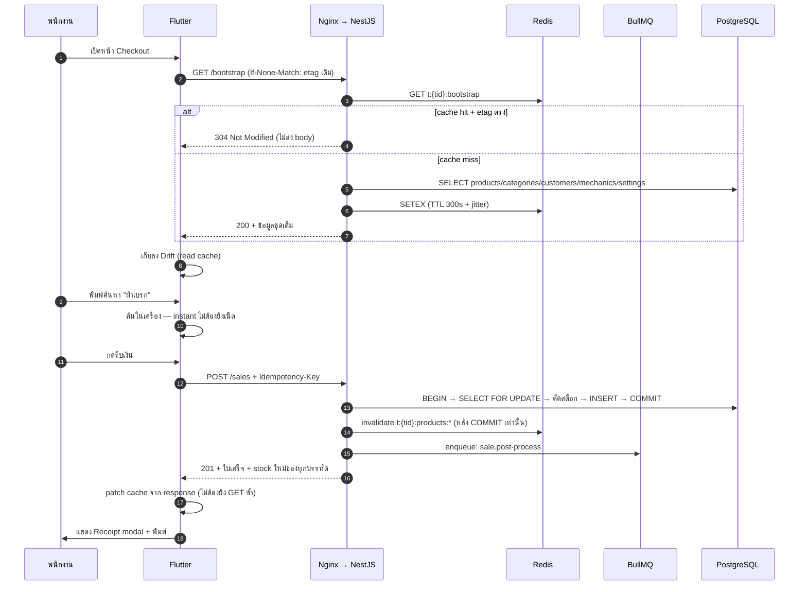
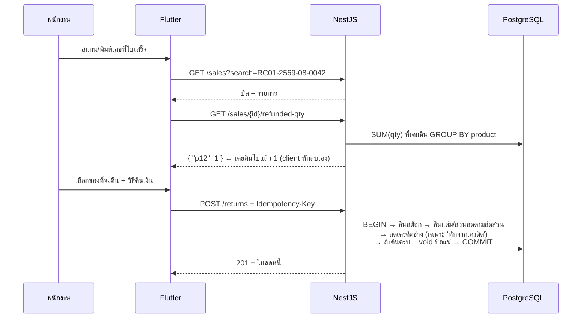

# 02 — หน้าจอ → API (Screen-to-Endpoint Map)

> **สำหรับทีม backend:** แอปมี **11 หน้าจอ** เอกสารนี้บอกว่าแต่ละหน้าจอ "ยิงอะไร ตอนไหน"
> ข้อมูลนี้ไม่ได้เดา — อ่านจากโค้ดจริงว่าหน้าจอเรียก repository method ไหนบ้าง
> แล้วแปลง repository method → REST endpoint
>
> **สำหรับทีม Flutter:** ตารางเดียวกันนี้บอกว่า repository ตัวไหนต้องเปลี่ยนไปเรียก HTTP
>
> งงกับ key? อ่าน [`00_BASICS.md#keys`](00_BASICS.md#keys) หรือฉบับย่อ [`01_DATABASE.md#keys`](01_DATABASE.md#keys) —
> `(tenant_id, id)` คือ **composite primary key** อันเดียว ไม่ใช่ PK สองอัน
>
> **อย่าสับสน:** `Idempotency-Key` (HTTP header กันยิงซ้ำ) ในเอกสารนี้ ≠ database key ข้างต้น — คนละเรื่องกัน

---

## 1. กติกากลางของ API

### 1.1 รูปแบบ

| หัวข้อ | ข้อกำหนด |
|---|---|
| Base path | `/api/v1` (ล็อกเวอร์ชันไว้ตั้งแต่วันแรก) · *(2026-09-23 ตรวจกับโค้ด: admin plane ก็อยู่ใต้ prefix นี้ด้วยเป็น `/api/v1/platform/*` — ดู §4.1 · ส่วน `GET /health/live`, `/health/ready`, `/metrics` **อยู่นอก prefix** ที่ root — `app.setup.ts:120-126`)* |
| Auth | `Authorization: Bearer <JWT>` ทุก endpoint ยกเว้น `/auth/*` และ `/health/*` · *(2026-09-23: ยกเว้น `/metrics` ด้วย (Nginx ตอบ 404 จากข้างนอก) · `GET /auth/me` ต้องมี JWT · `POST /sync/push` ใช้ `X-Device-Token` แทน JWT และ `POST /sync/discards` รับได้ทั้งสองแบบ — `sync.controller.ts:56,77`)* |
| Tenant | **อ่านจาก JWT claim `tid` เท่านั้น** — ห้ามรับ `tenantId` จาก body/query เด็ดขาด (ไม่งั้นปลอมข้ามร้านได้) |
| Device | JWT พก `did` (device id) + `drole` (`pos` / `backoffice`) เพิ่มจาก `tid` — guard ตรวจ `drole` **ต่อ endpoint** ตามคอลัมน์ "Device role" ใน §4 (ADR-0004) · **ที่มา:** `POST /auth/token` รับ `deviceToken` (ได้จาก `POST /auth/device` ด้วย enrolment code ที่ owner ออกผ่าน `POST /devices`) แล้ว server resolve เป็น `did`/`drole` เอง **ห้ามรับ `deviceId` จาก body** ไม่มี token = ไม่มี `drole` = เรียกได้เฉพาะแถว "ทั้งคู่" ในฐานะ `backoffice` (ADR-0004 "การผูกเครื่อง") · *(2026-09-23: ยกเว้น route ที่ต้องมี `did` ตาม F6 และ route ที่ออกเลขเอกสารในชุดของเครื่อง — ไม่มี `did` = `403 DEVICE_ROLE_FORBIDDEN` ดูคอลัมน์ Auth ใน §4.2)* · 🔴 **role ของคนมีค่าเดียว `owner`** (2026-09-15 E1, ADR-0004/0009 addendum รอบ 2) — ไม่มี guard ตรวจ role คน เหลือแค่ "ล็อกอินแล้ว" + device role |
| อายุ token (ADR-0009) | **access 15 นาที** · **refresh หมดอายุ 04:00 ตาม `tenants.timezone`** (ไม่ใช่ 24 ชม.นับจากล็อกอิน; refresh ที่ออกหลัง 03:00 หมดอายุ 04:00 ของวันถัดไป) · `/auth/refresh` ต้องเช็ค `users.is_active` + `tenants.status` + `devices.retired_at` ของ `did` ทุกครั้ง · **ไม่มี** refresh rotation และ **ไม่มี** denylist ใน Redis |
| Token audience | guard ของ `/api/*` **ปฏิเสธ token ที่ `aud != "tenant"`** และ guard ของ `/platform/*` **ปฏิเสธ `aud != "platform"`** — token ข้ามฝั่งกันไม่ได้แม้แต่กรณีเดียว **ไม่มี role ของร้านไหนเรียก `/platform/*` ได้ แม้แต่ `owner`** (ADR-0002) |
| ลายเซ็น / ที่เก็บ token (ADR-0009 addendum 2026-09-09) | **RS256** + header `kid` · verifier รับเฉพาะ `RS256` (ห้าม HS256 / `none`) · private key มีเฉพาะ process ที่มี `/auth/*` · claim บังคับ `iss`, `aud`, `sub`, `iat`, `exp`, `jti`, **`typ`** (`access`/`refresh` — `/api/*` รับเฉพาะ `access`, `/auth/refresh` รับเฉพาะ `refresh`) · skew 30 วินาที · web: **access ใน memory, refresh ใน IndexedDB** ห้าม localStorage · token ทาง header เท่านั้น ห้าม query string · `pino` redact `authorization` + body ของ `/auth/*` · **ทุก endpoint ใน `/auth/*` เขียน `audit_log`** |
| Content | `application/json; charset=utf-8` |
| Pagination | `?page=1&limit=50` (default 50, max 200) |
| เวลา | ISO-8601 UTC ทุกที่ (`2026-08-25T03:12:00Z`) |
| เงิน | ส่งเป็น **string** `"1234.50"` ไม่ใช่ float (กันปัญหา precision — ดู `01_DATABASE.md §4`) |

### 1.2 Response envelope (ตามสเปคที่อาจารย์กำหนดใน Flash Sale assignment)

```jsonc
// สำเร็จ
{ "status": "success", "data": { /* ... */ }, "meta": { "total": 120, "page": 1, "limit": 50, "totalPages": 3 } }

// ผิดพลาด
{ "status": "error",
  "error": {
    "code": "INSUFFICIENT_STOCK",                       // machine-readable
    "message": "สต็อกไม่พอ:\nผ้าเบรกหน้า: สต็อก 2 แต่ต้องการ 5",  // ⚠️ ข้อความไทย ตรงตัวจาก db.js
    "details": [ { "productId": "p12", "stock": 2, "requested": 5 } ]
  } }
```

> ⚠️ **`message` ภาษาไทยต้องคัดลอกจาก `pos/db.js` ตรงตัว ห้ามแปล/ห้ามเรียบเรียงใหม่**
> เพราะพนักงานหน้าร้านคุ้นกับข้อความเดิม และ test ของ client ผูกกับสตริงพวกนี้ (`CONTRACT.md §8`)
> `code` มีไว้ให้ client แยกเคส ส่วน `message` มีไว้ให้คนอ่าน

### 1.3 ใครเป็นเจ้าของตัวเลขเงิน

**client เป็นเจ้าของ, server เป็นผู้ตรวจ** — เพราะใบเสร็จพิมพ์ออกไปแล้วก่อนที่ request จะถึง server

* client ส่ง `subtotal` / `discount` / `total` มา
* server คำนวณซ้ำจาก `items[].qty × price` แล้ว **เทียบ**:
  * ต่างเกิน **0.01** → `409 TOTAL_MISMATCH` (แปลว่า client บั๊ก หรือมีคนยิงมั่ว)
  * ต่างไม่เกิน 0.01 → **ใช้ค่าจาก client** บันทึกลง DB
* `pointsGranted = floor(total/10)` **server คำนวณจากค่าที่ persist จริง** จึงไม่มีทางเพี้ยนตาม

> เขียน tolerance 0.01 ลง contract ให้ชัด อย่าปล่อยเป็น implicit —
> ของเดิมคือ Dart `double` + `round2(v) = (v*100).round()/100` ส่วน Postgres เป็น `NUMERIC`
> ค่าบวกจะปัดตรงกัน แต่ contract ต้องระบุไว้เผื่อเจอเคสขอบ

### 1.4 Idempotency (บังคับกับทุก write ที่เกี่ยวกับเงิน/สต็อก)

```
POST /api/v1/sales
Idempotency-Key: 9f3c…   ← client สร้าง 1 ครั้งต่อ 1 บิล และใช้ค่าเดิมทุกครั้งที่ retry
```
* ยิงซ้ำด้วย key เดิม + body เดิม → คืน response เดิม (200/201) **ห้ามตัดสต็อกซ้ำ**
* ยิงซ้ำด้วย key เดิม + body ต่าง → `409 IDEMPOTENCY_KEY_REUSED`
* เก็บใน `idempotency_keys` 24 ชม. แล้วลบทิ้ง (cron/BullMQ repeatable job)

---

## 2. ตารางสรุป — หน้าจอไหนยิงอะไร

| # | หน้าจอ (route) | READ (ตอนเปิดหน้า) | WRITE (ตอนกดปุ่ม) |
|---|---|---|---|
| 1 | **Checkout** `/` | `GET /bootstrap` (รวม products+categories+customers+mechanics+settings), `/parked-sales`, `/products?partNo=` (บาร์โค้ด) | `POST /sales` ⭐, `POST /quotes`, `POST /parked-sales`, `DELETE /parked-sales/:id`, `POST /customers` |
| 2 | **Products** `/products` | `GET /products`, `/categories`, `/products/:id/suppliers`, `/movements`, `/reports/product-sales`, `/settings` | `POST/PATCH/DELETE /products`, `POST /products/:id/adjust-stock`, `POST/DELETE /categories`, `POST/PATCH/DELETE /suppliers` |
| 3 | **Purchase Orders** `/purchase-orders` | `GET /purchase-orders`, `GET /products` | `POST /purchase-orders`, `POST /:id/receive` ⭐, `POST /:id/cancel`, `DELETE /:id` |
| 4 | **Vehicle Search** `/vehicle-search` | `GET /products?compat=…`, `GET /categories` | — (อ่านอย่างเดียว) |
| 5 | **Customers** `/customers` | `GET /customers`, `GET /customers/:id/sales` | `POST/PATCH/DELETE /customers` |
| 6 | **Mechanics** `/mechanics` | `GET /mechanics`, `/mechanics/:id/sales`, `/credit-payments` *(2026-09-23: ยังไม่มีใน server — ดู §3.6)* | `POST/PATCH/DELETE /mechanics`, `POST /mechanics/:id/credit-payments` |
| 7 | **Returns** `/returns` | `GET /sales?search=`, `GET /sales/:id/refunded-qty`, `GET /returns`, `/settings` | `POST /returns` ⭐ |
| 8 | **Quotes** `/quotes` | `GET /quotes`, `/settings` | `POST /quotes`, `PATCH /quotes/:id`, `POST /:id/duplicate`, `POST /:id/convert`, `DELETE /:id`, `POST /quotes/purge` |
| 9 | **Reports** `/reports` | `GET /reports/summary`, `/reports/top-products`, `/reports/by-category`, `/reports/stock-value` | — |
| 10 | **Settings** `/settings` | `GET /settings` | `PATCH /settings`, `POST /backup/export`, ~~`POST /backup/import`~~ (ย้ายไป admin plane §4.1), `GET /export/:entity.csv` *(2026-09-23: CSV ยังไม่มีใน server)* |
| 11 | **Cash Drawer** `/cash-drawer` | `GET /shifts/current`, `/shifts/history`, `/reports/closing?shiftId=` | `POST /shifts/open`, `POST /shifts/close`, `POST /shifts/current/entries` |

⭐ = endpoint ที่ต้อง **transaction + idempotent + invalidate cache** (3 ตัวนี้คือหัวใจของระบบ)

> *(2026-09-23 — Phase 2)* หน้า **"รอ owner"** (08 §14) เป็นหน้าใหม่นอก 11 หน้าข้างบน: READ `GET /review-items?status=pending` ·
> WRITE `POST /review-items/:id/reviewed`, `POST /sync/discards` · หน้าจัดการเครื่องใช้ `GET/POST /devices`, `POST /devices/:id/retire` (ดู §4.2)

> ### 🆕 endpoint ที่เป็น "ของใหม่" ไม่ใช่การ port จากโค้ดเดิม
> อย่าเข้าใจผิดว่าทั้งตารางคือ behaviour parity — endpoint กลุ่มนี้ **ไม่มีในแอปวันนี้**
> ต้องคุยกันก่อนว่าจะทำจริงไหม ไม่ใช่หยิบไป implement เลย:
> `POST /sales/:id/void` (ของเดิม void เกิดอัตโนมัติตอนคืนครบบิลเท่านั้น ไม่มีปุ่ม void ตรง ๆ) ·
> `GET /customers/:id/summary` · `GET /mechanics/:id/statement` · `GET /reports/by-payment` ·
> `GET /reports/daily` · `GET /quotes/:id/pdf` · `POST /quotes/:id/convert` (ของเดิมโยนตะกร้ากลับหน้า Checkout) ·
> `GET /bootstrap` · `POST /customers` จากหน้า Checkout (ของเดิมเพิ่มลูกค้าได้จากหน้า Customers เท่านั้น)
>
> *(2026-09-23 ตรวจกับ controller:* ทำแล้ว = `POST /sales/:id/void`, `POST /quotes/:id/convert`, `GET /bootstrap`, `POST /customers` ·
> **ยังไม่มีใน server** = `GET /customers/:id/summary`, `GET /mechanics/:id/statement`, `GET /reports/by-payment`,
> `GET /reports/daily`, `GET /quotes/:id/pdf` *— ยังเป็นข้อเสนอ ไม่ใช่สัญญา)*
>
> **นอกจากนี้ `AppShell` (กรอบนำทางที่อยู่ทุกหน้า) เรียก `watchSettings()` เป็น live stream** —
> เป็น stream เดียวที่ยัง wire อยู่จริงในแอป ต้องมีที่ทางในเฟส 1 (ดู `03_ARCHITECTURE.md §2`)

---

## 3. รายละเอียดทีละหน้าจอ

### 3.1 Checkout (หน้าแรก — หน้าที่ใช้หนักที่สุด)

หน้าจอนี้คือที่ที่พนักงานอยู่ 90% ของวัน: ค้นอะไหล่ → ใส่ตะกร้า → เลือกลูกค้า/ช่าง → รับเงิน → พิมพ์ใบเสร็จ



**Endpoints ที่หน้านี้ใช้**

| ตอนไหน | Method + Path | หมายเหตุ |
|---|---|---|
| **เปิดหน้า** | **`GET /bootstrap`** | ⭐ รวม products + categories(พร้อมสี) + customers + mechanics + settings ใน request เดียว รองรับ `ETag` / `If-None-Match` |
| เปิดหน้า | `GET /parked-sales` | บิลที่พักไว้ (ไม่ cache — เปลี่ยนบ่อย ข้อมูลน้อย) |
| ค้นหา | `GET /products?search=` | ค้นในเครื่องจาก cache ก่อน ยิง server เฉพาะตอนหาไม่เจอ |
| **ยิงบาร์โค้ด** | **`GET /products?partNo=<exact>`** | ⭐ ต้องแยกจาก `?search=` — บาร์โค้ดคือ exact match ถ้าใช้ full-text จะได้หลายผลลัพธ์/ผิดตัว |
| เลือกลูกค้า / ช่าง | (จาก cache ในเครื่อง) | `mechanics` ต้องมี `creditBalance`, `creditLimit` ติดมาด้วย |
| **รับเงิน** | `POST /sales` | ⭐ ดูสเปคด้านล่าง |
| บันทึกเป็นใบเสนอราคา | `POST /quotes` | ไม่ตัดสต็อก |
| พักบิล | `POST /parked-sales` / `DELETE /parked-sales/:id` | ไม่ตัดสต็อก |

> ### ⚠️ 3 กับดักของหน้านี้ที่เวอร์ชันแรกมองข้าม
> **1. N+1 ที่ซ่อนอยู่** — โค้ดปัจจุบันวนเรียก `catColor()` **ทีละหมวด** ถ้าแปลตรง ๆ เป็น REST
> จะกลายเป็น `1 + N` request → **`/categories` ต้องคืน `[{ name, color }]` มาพร้อมกันเลย**
> (หน้า Reports ก็มีปัญหาเดียวกัน แก้ที่เดียวได้ทั้งสองหน้า)
>
> **2. อย่าเพิ่ม request ที่ของเดิมไม่มี** — เวอร์ชันแรกใส่ `GET /reports/low-stock` และ `GET /settings`
> เข้ามาตอนเปิดหน้า ทั้งที่ของจริง low-stock คำนวณจาก list ที่โหลดมาแล้ว
> และ settings อ่านตอนพิมพ์ใบเสร็จเท่านั้น → รวมเข้า `/bootstrap` แทน
>
> **3. ช่องค้นหาปัจจุบัน instant เพราะค้นในหน่วยความจำ** (สินค้า/ลูกค้า/ช่าง ไม่มี debounce เพราะไม่ต้องมี)
> ถ้าเปลี่ยนเป็น `?search=` ยิง server ทุกตัวอักษร **UX จะแย่ลงชัดเจน** →
> นี่คือเหตุผลที่ Drift ต้องอยู่ต่อในฐานะ read cache (ดู `03_ARCHITECTURE.md §2`)

**`POST /api/v1/sales`** — endpoint ที่สำคัญที่สุดของทั้งระบบ

```jsonc
// Request
{
  "id": "s1a2b3c4",                 // client สร้าง (รองรับ offline) — server ใช้เป็น natural idempotency key ด้วย
  // "receiptNo": "RC01-2569-08-0042",   ← เฟส 1 ไม่ส่ง (server ออกให้) · เฟส 2 เครื่อง pos ส่งมาได้ และ prefix/device_no ต้องตรงกับ did ของ token (ADR-0007)
  //                                       (2026-09-23: เฟส 2 D4 = pos ออก RC เอง **ทั้งออนไลน์และออฟไลน์** · ไม่ส่ง = server ออกให้เฉพาะตอน DOC_NUMBER_FALLBACK เปิด — ดูหมายเหตุข้อ 2)
  "subtotal": "1500.00",
  "discount": "100.00",
  "total": "1400.00",
  "paymentMethod": "เครดิตช่าง",
  "customerId": "c3", "customerName": "สมชาย ยานยนต์",
  "mechanicId": "m2", "mechanicName": "ช่างเอก",
  "mechanicDelta": "-100.00",
  "overrideCreditLimit": false,   // true = คนขายกด "ยืนยัน" ใน dialog เกินวงเงินแล้ว (§8.2)
  "items": [
    { "lineNo": 1, "productId": "p12", "partNo": "BP-1234", "name": "Front Brake Pad",
      "nameTH": "ผ้าเบรกหน้า", "qty": 2, "price": "750.00" }
  ]
}

// 201 Created — ⭐ ต้องคืน stock ใหม่ของทุกบรรทัดที่แตะกลับมาด้วย
{ "status": "success",
  "data": { "id": "s1a2b3c4", "receiptNo": "RC01-2569-08-0042", "total": "1400.00",
            "pointsGranted": 140, "date": "2026-08-25T03:12:00Z",
            "shiftId": "sh_20260825_01",          // ⭐ #82 — กะที่ server ประทับให้ client คำนวณเองไม่ได้ · บิลใหม่มีค่าเสมอ (ไม่มีกะเปิด = 409 NO_OPEN_SHIFT) null ได้เฉพาะบิลเก่า/นำเข้าที่ replay
            "mechanicCreditBalanceAfter": "5400.00",
            "mechanicAfter": { "id": "m2", "totalSales": "182000.00", "totalDiscount": "3100.00",   // ⭐ #82 — ครบทั้งสี่ยอดสะสม
                               "totalMarkup": "0.00", "creditBalance": "5400.00" },                 // 🔴 ไม่มี total_credit (ข้อตัดสิน #11)
            "customerAfter": { "id": "c3", "points": 1340, "totalSpend": "58200.00" },   // ⭐ เพิ่ม (ADR-0010 ข้อ 3) — ไม่งั้น Drift ฝั่ง client ค้างค่าเก่าจนกว่า /bootstrap รอบถัดไป
            "products": [ { "id": "p12", "stock": 8 } ],   // ไม่มี offlineOk — เฟส 1 ยังไม่มีที่เก็บ (`sales.service.ts`), ADR-0010 ข้อ 4 · (2026-09-23: ยกเลิกถาวรแล้ว D3 — ไม่มี `offlineOk` ทั้งระบบ)
            "items": [ { "lineNo": 1, "productId": "p12", "costAtSale": "480.00" } ],    // ⭐ #82 — ต้นทุน ณ วันที่ขาย (ADR-0008) กู้คืนทีหลังไม่ได้
            "movements": [ { "id": "mv…", "productId": "p12", "partNo": "BP-1234", "name": "Front Brake Pad",   // ⭐ #82 — แถว ledger ที่บิลนี้เขียน
                             "delta": -2, "type": "sale", "note": null, "stockAfter": 8,
                             "date": "2026-08-25T03:12:00Z" } ] } }

// 409 — ของไม่พอ
{ "status": "error",
  "error": { "code": "INSUFFICIENT_STOCK",
             "message": "สต็อกไม่พอ:\nผ้าเบรกหน้า: สต็อก 1 แต่ต้องการ 2",
             "details": [ { "productId": "p12", "stock": 1, "requested": 2 } ] } }

// 409 — เครื่องนี้ไม่มีกะเปิดอยู่ (ทุกวิธีจ่าย: เงินสด / โอน/QR / เครดิตช่าง) — ข้อตัดสินเจ้าของร้าน 2026-09-13
{ "status": "error",
  "error": { "code": "NO_OPEN_SHIFT", "message": "No open shift" } }
```

> **หมายเหตุสำคัญ 4 ข้อ:**
> 1. `pointsGranted` **server คำนวณเอง** (`floor(total/10)`) ไม่รับจาก client
> 2. `receiptNo` — **เฟส 1 server เป็นคนออก** (จาก `doc_counters` ใต้ row lock ใน transaction เดียวกับบิล
>    ใช้ `device_no` ของ `did` ใน JWT) client ไม่ต้องส่ง · **เฟส 2 เครื่อง `pos` ออกเองได้** (ต้องออกบิลได้ตอนออฟไลน์)
>    server กันชนด้วย `UNIQUE (tenant_id, receipt_no)` ถ้าชน**ก่อนพิมพ์**ให้คืน `409 RECEIPT_NO_CONFLICT`
>    แล้ว client ออกเลขใหม่ ถ้าชนตอน `POST /sync/push` (บิลพิมพ์ไปแล้ว) ห้ามเปลี่ยนเลข → `rejected` เข้าคิว
>    reconciliation (ADR-0007)
>    ✅ รูปแบบ `RC01-2569-08-0042` **อนุมัติแล้ว** (ADR-0007, grill รอบ 2) — ยังต้องให้เจ้าของร้านเห็นใบเสร็จ
>    ตัวอย่างจริงก่อนพิมพ์ใบแรก แต่ไม่ใช่ "รูปแบบที่เสนอ" อีกต่อไป
>    🔄 **แก้ 2026-09-23 ตาม ADR-0007 addendum D4 + รอบ 3 C16 (08 §9):** เฟส 2 เครื่อง `pos` ออก RC/CN เอง
>    **ทั้งออนไลน์และออฟไลน์** (ไม่ใช่เฉพาะออฟไลน์) · server ตรวจ prefix + `device_no` ของ `did` + ช่วง 0001–9999
>    (ไม่ผ่าน = `400 DOC_NUMBER_INVALID`) แล้วยก high-water mark ใน `doc_counters` ด้วย `GREATEST` ·
>    body ไม่มีเลข → server ออกให้ **เฉพาะตอน `DOC_NUMBER_FALLBACK` เปิด** (ค่าเริ่มต้น) ปิดแล้ว = `400 DOC_NUMBER_REQUIRED`
>    (`documents/doc-number.service.ts` `resolveDocNumber`) · PO/QT/CP server ยังออกเองตลอด
> 3. **`shiftId` ไม่อยู่ใน request body** — server ประทับให้เองจากลิ้นชักที่เปิดอยู่ของเครื่องนั้น (#28)
>    ส่งมาก็ไม่อ่าน · รายงานปิดร้านคิดจาก `shift_id` ถ้ารับจาก body เครื่องหนึ่งเขียนเข้ากะของอีกเครื่องได้
>    **แต่อยู่ใน response** (#82) เพราะ client ไม่มีทางรู้ค่าที่ server ประทับ
>    🔴 **ไม่มีกะเปิด = ไม่ขาย** (ข้อตัดสินเจ้าของร้าน 2026-09-13 "ต้องเปิดกะก่อนรับเงินทุกกรณี"):
>    เครื่องที่ไม่มีกะเปิดอยู่ (ไม่เคยเปิด หรือปิดกะไปแล้ว) ได้ `409 NO_OPEN_SHIFT` ทุกวิธีจ่าย ไม่มีอะไรถูกเขียน
>    (ไม่ตัดสต็อก ไม่กินเลข RC) · **replay ไม่โดนปฏิเสธ** — บิลที่ commit ตอนกะยังเปิด ยิงซ้ำหลังปิดกะก็ยังได้ body เดิม
>    (เดิมพอร์ตจากแอปเก่าที่ขายได้โดยไม่เปิดลิ้นชักแล้วเก็บ `shift_id` เป็น null — เงินก้อนนั้นไม่เข้ารายงานปิดกะใดเลย)
> 4. **ต้องคืน `products[]` ที่สต็อกเปลี่ยนกลับมาใน response** เพื่อให้หน้า Checkout อัปเดตค่าในเครื่องได้ทันที
>    ไม่ต้องยิง `GET /products` ซ้ำ — แก้ปัญหา read-your-writes ที่ cache 5 นาที + replica lag ทำให้เห็นสต็อกเก่า
> 5. 🔴 **replay ต้องตอบ body เดิมทุก field** (#82) — ทั้งทาง `Idempotency-Key` และทาง `existingSale`
>    (ยิงซ้ำด้วย `id` เดิมแต่ key ใหม่) `existingSale` ต้อง `SELECT` `shift_id` / `sale_items` /
>    `movements` / ยอดช่าง กลับมาให้ครบ ไม่งั้นบิลที่ replay จะตอบ null ให้กับกะที่มันมีจริง
>    ทุก array เรียงลำดับแบบเดียวกับตอนเขียน (`items` ตาม `line_no`, `products`/`movements` ตามลำดับสินค้าบนบิล)

### 3.2 Products (จัดการอะไหล่)

| ตอนไหน | Method + Path |
|---|---|
| รายการสินค้า | `GET /products?page&limit&search&category&sort` · *(2026-09-23: โค้ดรับ `search`, `partNo`, `category`, `updatedSince`, `afterId`, `page`, `limit` — **ไม่มี `sort`** · `products.controller.ts:45-51`)* |
| หมวดหมู่ | `GET /categories` / `POST /categories` / `DELETE /categories/:name` |
| เพิ่ม/แก้/ลบ | `POST /products` · `PATCH /products/:id` · `DELETE /products/:id` (soft delete) |
| ปรับสต็อกมือ | `POST /products/:id/adjust-stock` `{ delta, type, note }` → **clamp ที่ 0** + สร้าง movement |
| ประวัติสต็อก | `GET /movements?productId=&from=&to=&page=` |
| ซัพพลายเออร์ | `GET /products/:id/suppliers` · `POST /suppliers` · `PATCH /suppliers/:id` · `DELETE /suppliers/:id` |
| รายงานสต็อก | `GET /reports/stock-value` |
| ยอดขายรายชิ้น | `GET /reports/product-sales?productId=&from=&to=` — #97: บิลชุดเดียวกับ summary (void เองไม่นับ, void อัตโนมัติจากคืนครบยังนับแล้วหักใบลดหนี้) |
| พิมพ์ป้าย | `GET /settings` (เอาชื่อร้านไปขึ้นบนป้าย) |

> ⚠️ **จุดที่ต้องแก้จากของเดิม:** ตอนนี้หน้า Products เรียก `salesRepo.getSales()` **โหลดบิลทั้งหมด**
> มาไล่นับว่าสินค้าชิ้นนี้ขายไปกี่ชิ้น — ร้านขายมา 2 ปีก็ต้องโหลดหมื่นบิลลงมือถือ
> **ต้องเปลี่ยนเป็น `GET /reports/product-sales`** ที่ `GROUP BY` ฝั่ง server

### 3.3 Purchase Orders (ใบสั่งซื้อ + รับของ)

| ตอนไหน | Method + Path | หมายเหตุ |
|---|---|---|
| รายการ PO | `GET /purchase-orders?status=open` | |
| ดูใบเดียว | `GET /purchase-orders/:id` | *(2026-09-23: มีใน server แต่เอกสารเดิมไม่ได้ระบุ)* |
| สร้าง PO | `POST /purchase-orders` | ไม่แตะสต็อก · *(2026-09-23: เลข PO ออกในชุดของเครื่องที่เรียก จึง**ต้องมี `did`** — ไม่มี = `403 DEVICE_ROLE_FORBIDDEN`, `purchase-orders.controller.ts:72`)* |
| **รับของ** | `POST /purchase-orders/:id/receive` | ⭐ transaction: บวกสต็อก + คำนวณต้นทุนเฉลี่ยถ่วงน้ำหนัก + สร้าง movement + `status='received'` |
| ยกเลิก | `POST /purchase-orders/:id/cancel` | |
| ลบ | `DELETE /purchase-orders/:id` | ลบได้เฉพาะที่ยังไม่รับของ |

```jsonc
// POST /purchase-orders/:id/receive  → 200
{ "status": "success",
  "data": {
    "poId": "po7", "status": "received", "receivedAt": "2026-08-25T04:00:00Z",
    "updated": [ { "partNo": "BP-1234", "stockAfter": 22, "costAfter": "512.73" } ],
    "unmatched": [ "XX-9999" ]        // ⚠️ ไม่ใช่ error — คือ part_no ที่ยังไม่มีในระบบ ให้ UI ถามว่าจะสร้างสินค้าใหม่ไหม
  } }
```
* **รับซ้ำไม่ได้**: ยิงซ้ำต้องได้ `409 PO_ALREADY_RECEIVED` (เช็ค status ภายใน transaction ไม่ใช่ก่อน)
* **#26 (สิ่งที่ implement จริง):** `updated[]` มี `productId` ด้วย และ response มี `movements[]` (แถว `receive` ที่เขียน, `ref_id` = PO id) ·
  PO ที่ `cancelled` รับของไม่ได้ = `409 PO_CANCELLED` · ยกเลิก/ลบ PO ที่รับของแล้ว = `409 PO_ALREADY_RECEIVED` · ยกเลิกซ้ำคืนแถวเดิม ·
  PO ที่ไม่มี (หรือของร้านอื่น) = `404 PO_NOT_FOUND` สำหรับ receive/cancel, `DELETE` ตอบ 200 เหมือน `DELETE /products/:id` ·
  part_no เดียวกันหลายบรรทัด → คิดต้นทุนทีละบรรทัดตามลำดับ (เหมือน loop ของ Dart) แต่เขียน `movements` แถวเดียวต่อสินค้า เพราะ `uq_movements_ref` ·
  ไม่มีการรับของบางส่วน (partial receipt) — รับทั้งใบตาม `po_items` เหมือนของเดิม ·
  ค่าที่ตกตรงครึ่งสตางค์พอดีปัดขึ้นตามค่าจริง (คิดเป็นสตางค์จำนวนเต็ม) **ไม่ใช่**ผลลัพธ์ float ของ Dart — เช่น 1@1.00 + 1@1.01 → server `1.01`, Dart `1.00` (ตั้งใจ ตาม `01_DATABASE.md` ที่ห้ามเงินเพี้ยนจาก float)

### 3.4 Vehicle Search (ค้นอะไหล่จากรุ่นรถ)

| Method + Path | หมายเหตุ |
|---|---|
| `GET /products?compat=vigo&search=&category=` | ค้นในฟิลด์ `compat` — ตอนนี้ client โหลดสินค้าทั้งหมดมา filter ใน Dart → ย้ายมาเป็น full-text index ฝั่ง server (`01_DATABASE.md §5.2`) · *(2026-09-23: server **ไม่มี param `compat`** — `compat` อยู่ในนิพจน์ของ `?search=` แล้ว (`SEARCH_EXPRESSION`, `products.service.ts:94`) จึงใช้ `GET /products?search=vigo&category=`)* |
| `GET /categories` | สำหรับ chip กรองหมวด |

### 3.5 Customers

| Method + Path | หมายเหตุ |
|---|---|
| `GET /customers?search=&page=` | *(2026-09-23: รับ `?updatedSince=&afterId=` แบบ keyset + `meta.nextCursor` ด้วยแล้ว สำหรับ pull ของ 08 §15 — `customers.controller.ts:38-65`)* |
| `GET /customers/:id` | *(2026-09-23: มีใน server แต่เอกสารเดิมไม่ได้ระบุ)* |
| `POST /customers` | server ออก `code` = `CUS###` (ต้อง lock กันชนตอนหลายเครื่องเพิ่มพร้อมกัน) |
| `PATCH /customers/:id` · `DELETE /customers/:id` | |
| **`GET /customers/:id/sales?page=`** | ⚠️ ของเดิมโหลดบิลทั้งหมดแล้ว filter ใน client → ต้องเป็น endpoint แยก |
| `GET /customers/:id/summary` | แต้มคงเหลือ, ยอดซื้อสะสม, ซื้อล่าสุดเมื่อไหร่ · *(2026-09-23: **ยังไม่มีใน server**)* |

### 3.6 Mechanics (ช่าง + เครดิต)

| Method + Path | หมายเหตุ |
|---|---|
| `GET /mechanics?search=` | ส่ง `creditBalance` / `creditLimit` มาด้วยเสมอ · *(2026-09-23: รับ `?updatedSince=&afterId=` keyset ด้วยแล้ว — `mechanics.controller.ts:50-54`)* |
| `GET /mechanics/:id` | *(2026-09-23: มีใน server แต่เอกสารเดิมไม่ได้ระบุ)* |
| `POST /mechanics` (`code` = `M###`) · `PATCH` · `DELETE` | |
| **`POST /mechanics/:id/credit-payments`** | ช่างมาจ่ายหนี้ — ลด `credit_balance` (clamp ที่ 0), ออกเลขใบเสร็จรับเงิน (series **CP**), ต้อง idempotent · **pos เท่านั้น** · body `{ id?, amount, paymentMethod, note?, allowOverpayment? }` — `paymentMethod` เป็น `'เงินสด'` \| `'โอน/QR'` **บังคับ** (รายงานปิดร้านต้องแยกเงินสดออกจากเงินโอน) · จ่ายเกินยอดค้างโดยไม่มี `allowOverpayment: true` = `409 CREDIT_PAYMENT_EXCEEDS_BALANCE` (§8.1) · ตอบ payment + `mechanicCreditBalanceAfter` · server แสตมป์ `shift_id` จากลิ้นชักที่เปิดอยู่ของเครื่องนั้นเอง (#24) · 🔴 เครื่องไม่มีกะเปิด = `409 NO_OPEN_SHIFT` ทั้งเงินสดและโอน ไม่มีอะไรถูกเขียน ไม่กินเลข CP (ข้อตัดสินเจ้าของร้าน 2026-09-13) — ตรวจ**หลัง** replay ด้วย `id` เดิม จึงยิงซ้ำหลังปิดกะยังได้รายการเดิม |
| `GET /credit-payments?mechanicId=&from=&to=` | *(2026-09-23: **ยังไม่มีใน server** — ไม่มี controller `credit-payments`)* |
| **`GET /mechanics/:id/sales?page=`** | ⚠️ เหมือนข้อ 3.5 — เดิม filter ใน client |
| `GET /mechanics/:id/statement?from=&to=` | ใบแจ้งหนี้: ยอดยกมา + ซื้อ + จ่าย + คงเหลือ · *(2026-09-23: **ยังไม่มีใน server**)* |

### 3.7 Returns (รับคืน / ใบลดหนี้)



| Method + Path | หมายเหตุ |
|---|---|
| `GET /sales?search=<receiptNo>&page=` | ค้นบิลที่จะคืน |
| **`GET /sales/:id/refunded-qty`** | ตรงกับ `getRefundedQty()` เดิม — คืน map `productId → qty ที่**คืนไปแล้ว**` |
| `POST /returns` | ⭐ transaction + idempotent · 🔴 **#100 (ข้อตัดสินเจ้าของร้าน 2026-09-13): คืนเป็น `'เงินสด'` ต้องมีกะเปิดอยู่** — ไม่มี = `409 NO_OPEN_SHIFT` ไม่มีอะไรถูกเขียน (ไม่คืนสต็อก ไม่กินเลข CN ไม่ auto-void) · `'โอน'`/`'หักจากเครดิต'` ไม่แตะเงินในลิ้นชัก จึงรับได้แม้ไม่มีกะ (`shift_id` null) |
| `GET /returns?saleId=&from=&to=&page=` | ประวัติการคืน · `saleId` เป็นตัวกรองเพิ่ม (#22) สำหรับดูใบลดหนี้ของบิลเดียว |

**`POST /returns` — 201 body** = ใบลดหนี้ (`id, cnNo, saleId, receiptNo, refundSubtotal, refundDiscount,
refundTotal, refundMethod, reason, customerId, mechanicId, mechanicName, date, shiftId, items[]`)
บวกผลที่ client ต้อง patch: `saleVoided`, `products[] {id, stock}`, `customerAfter`,
`mechanicCreditBalanceAfter` และ **#82 เพิ่มอีกสอง field**

*(2026-09-23 — D4, ADR-0007 addendum:* request รับ `cnNo` (optional) ที่เครื่อง `pos` ออกเอง ตรวจแบบเดียวกับ `receiptNo`
ของ §3.1 หมายเหตุข้อ 2 · ไม่ส่ง = server ออกให้เฉพาะตอน `DOC_NUMBER_FALLBACK` เปิด — `returns.dto.ts:18,49`, `returns.service.ts:259)*

```jsonc
  "movements": [ { "id": "mv…", "productId": "p12", "partNo": "BP-1234", "name": "Front Brake Pad",
                   "delta": 2, "type": "return", "note": null, "stockAfter": 10,
                   "date": "2026-08-25T04:00:00Z" } ],   // 🔴 'return' เท่านั้น — void เขียน 'void' (migration 1788652800003)
  "mechanicAfter": { "id": "m2", "totalSales": "…", "totalDiscount": "…",
                     "totalMarkup": "…", "creditBalance": "…" }   // 🔴 ไม่มี total_credit (#11)
```

> หนึ่งแถว `movements` ต่อ **หนึ่งสินค้า** ไม่ใช่ต่อบรรทัด — `uq_movements_ref` unique บน
> `(tenant_id, type, ref_id, product_id)` ใบลดหนี้ที่คืนของชิ้นเดียวกันสองราคาจึงได้แถวเดียว
> ส่วน `items[]` ได้สองบรรทัด · `items[].costAtSale` มีอยู่แล้วตั้งแต่ #22 (คัดจากบรรทัดบิลแม่)

### 3.8 Quotes (ใบเสนอราคา)

| Method + Path | หมายเหตุ |
|---|---|
| `GET /quotes?status=&from=&to=&page=` | |
| `POST /quotes` · `PATCH /quotes/:id` · `DELETE /quotes/:id` | **ไม่แตะสต็อก** |
| `POST /quotes/:id/duplicate` | ก๊อปปี้เป็นใบใหม่ status `open` |
| **`POST /quotes/:id/convert`** | แปลงเป็นบิลขาย → **สร้าง sale จริง (ตัดสต็อกตรงนี้)** + ตั้ง `converted_at`, `converted_sale_id` |
| `POST /quotes/purge` `{ olderThanDays: 90 }` | ลบใบเก่า — งานหนัก ควรโยนเข้า BullMQ แล้วตอบ `202 Accepted` |
| `GET /quotes/:id/pdf` | (ทางเลือก) ให้ server เรนเดอร์ A4 PDF แทนที่จะเรนเดอร์บนมือถือ · *(2026-09-23: **ยังไม่มีใน server**)* |

> *(2026-09-23 ตรวจกับ `quotes.controller.ts:94-97`)* `POST /quotes`, `POST /quotes/:id/duplicate` และ `/convert`
> **ต้องมี `did`** (เลข QT ออกในชุดของเครื่อง) — ไม่มี = `403 DEVICE_ROLE_FORBIDDEN` · มี `GET /quotes/:id` ด้วย ·
> ใบเสนอราคาเป็นงาน**ออนไลน์เท่านั้น**ในเฟส 2 (E6, 08 §6)

> **จุดที่ design เดิมกำกวม:** การ "แปลงใบเสนอราคาเป็นบิล" ตอนนี้ทำโดยโยนตะกร้ากลับไปหน้า Checkout
> แล้วให้พนักงานกดขายอีกที ทำให้ถ้าปิดแอปกลางทาง ใบเสนอราคาจะค้างสถานะ
> → แนะนำให้เป็น endpoint เดียวจบ (`/convert`) จะได้ atomic

> **#27 (สร้างแล้ว — ดู `server/README.md` *Quotes and parked sales*):**
> * `GET /quotes?status=` รับ `open` / `expired` / `converted` ตาม `_applyFilter` ของ `quotes_screen.dart`
>   ทุกใบตอบ `isExpired` (`valid_until < now()` ตอนอ่าน) และ `isConverted` (`status = 'converted'`) ตาม `QuoteRowStatus` — ไม่เขียน status `'expired'` ลงตาราง
> * `PATCH /quotes/:id` แก้ได้แค่ `customerName` / `customerPhone` / `notes` · ส่ง `status` / รายการ / ยอดเงิน = 400 · ใบที่แปลงแล้ว = `409 QUOTE_ALREADY_CONVERTED`
> * `POST /quotes/:id/convert` body = body ของ `POST /sales` **ยกเว้น** `items` / `subtotal` / `discount` / `total` (มาจากใบเสนอราคา ส่งมา = 400) → ตอบ `{ sale, quote }` โดย `sale` คือผลของ `POST /sales` ทุกช่อง
>   ล็อกแถว quote `FOR UPDATE` ก่อน แล้วตามลำดับของ sale path · แปลงซ้ำด้วย `id` บิลเดิม = replay บิลเดิม, `id` อื่น = `409 QUOTE_ALREADY_CONVERTED` · หมดอายุ = `409 QUOTE_EXPIRED` · แปลงได้เมื่อ `!converted && !expired` ตาม `quotes_screen.dart:559` (ไม่ดู status string อื่น)
> * 🔴 **retry ของ convert ต้องใช้ `Idempotency-Key` เดิม** — ถ้าใบเสนอราคาที่แปลงแล้วถูกลบ/purge ไปแล้ว retry ด้วย key ใหม่จะได้ `404 QUOTE_NOT_FOUND` และ client ที่ถือว่า 4xx ทุกตัวคือคำตอบจะตีบิลซ้ำ · replay ผ่าน `id` บิลจะอ่าน quote ใหม่ `quote.isExpired` จึงคำนวณ ณ ตอนอ่าน (replay วันถัดไปอาจต่างจากครั้งแรกแค่ช่องนี้)

> ### ❓ คำถามถึงเจ้าของโปรเจกต์ (#27 — ยังไม่เคาะ ห้าม implement จนกว่าจะตอบ)
> 1. **แปลงไม่ได้แล้วไปขายด้วย `POST /sales` = ใบเสนอราคาค้าง `open` แปลงซ้ำเป็นบิลที่สองได้.** Checkout ของ Dart ตัดบรรทัดที่สต็อกไม่พอ/ไม่มีในระบบทิ้งและให้แก้ตะกร้าได้ แต่ `/convert` บน server เป็นแบบทั้งใบหรือไม่เลย เลือกหนึ่งทาง:
>    **(ก)** `/convert` รับตะกร้าที่แก้แล้ว (ให้ sale path ตรวจตามปกติ) หรือ
>    **(ข)** `POST /sales` รับ `quoteId` (ไม่บังคับ) แล้วตั้งใบเสนอราคาเป็น converted ใน transaction เดียวกัน
> 2. **ห้าม `DELETE` ใบเสนอราคาที่แปลงแล้วไหม?** ตอนนี้ลบได้ตาม Dart (หน้าจอมีปุ่มลบทุกแถว) ซึ่งทำให้ retry ด้วย key ใหม่ได้ 404 (ข้อบนสุด)
> 3. **บิลพักของเครื่องอื่น (ในทางปฏิบัติคือ `pos` ที่ถูกถอน) ให้เครื่องใหม่เห็น/เรียกคืนได้ไหม?** ตอนนี้เห็นทั้งร้านตาม Dart
> * `DELETE /parked-sales/:id` ตอบแถวที่ลบ (การลบคือการเรียกบิลคืน — สองเครื่องเรียกพร้อมกันได้ใบเดียว อีกเครื่อง `404 PARKED_SALE_NOT_FOUND`)

### 3.9 Reports

**⚠️ หน้านี้ต้องรื้อทั้งหน้า:** ปัจจุบันโหลด `getSales()` + `getReturns()` + `getAll()` (สินค้าทั้งหมด)
มาคำนวณ KPI ใน Dart ทั้งหมด — ใช้ได้ตอนข้อมูล 100 บิล แต่พังตอน 50,000 บิล

| Endpoint ใหม่ | คืนอะไร | SQL |
|---|---|---|
| `GET /reports/summary?from=&to=` | ยอดขาย, จำนวนบิล, บิลเฉลี่ย, ยอดคืน, ยอดสุทธิ, กำไรขั้นต้น (+ `estimatedCostRows`/`unknownCostRows`) | `SUM/COUNT/AVG` บน `sales` + `returns` — #95: ทุกตัวเลขใช้บิลชุดเดียวกับรายงานปิดร้าน (void เองไม่นับ, void อัตโนมัติจากคืนครบยังนับแล้วหักใบลดหนี้), สูตรกำไรเดียวกับ §3.11, คืนสินค้าลงวันตาม `returns.date` |
| `GET /reports/top-products?from=&to=&limit=10` | สินค้าขายดี | `GROUP BY product_id` บน `sale_items` — #97: บิลชุดเดียวกับ summary (void เองไม่นับ, void อัตโนมัติจากคืนครบยังนับแล้วหักใบลดหนี้) |
| `GET /reports/by-category?from=&to=` | ยอดขายแยกหมวด | join `sale_items → products` — #97: บิลชุดเดียวกับ summary (void เองไม่นับ, void อัตโนมัติจากคืนครบยังนับแล้วหักใบลดหนี้) |
| `GET /reports/by-payment?from=&to=` | แยกตามวิธีชำระ (เงินสด/โอน/เครดิต) | *(2026-09-23: **ยังไม่มีใน server**)* |
| `GET /reports/daily?from=&to=` | ยอดรายวัน (กราฟ) | `GROUP BY date_trunc('day', date)` · *(2026-09-23: **ยังไม่มีใน server**)* |
| `GET /reports/stock-value` | มูลค่าสต็อกรวม = `SUM(stock × cost)` | |
| `GET /reports/low-stock` | รายการของใกล้หมด | ใช้ partial index · *(2026-09-23: รับ `?page=&limit=`)* |
| `GET /reports/closing?shiftId=` · `GET /reports/product-sales?productId=&from=&to=` | *(2026-09-23: สองตัวนี้มีใน `reports.controller.ts` ด้วย — รายละเอียดที่ §3.11 และ §3.2)* | |

> รายงานพวกนี้ **cache ได้ยาว** (TTL 5–15 นาที) เพราะไม่มีใครดูยอดขายแบบวินาทีต่อวินาที
> ถ้าข้อมูลโตมาก ค่อยทำเป็น **materialized view** refresh ทุก 15 นาทีด้วย BullMQ repeatable job

### 3.10 Settings + Backup

| Method + Path | หมายเหตุ |
|---|---|
| `GET /settings` · `PATCH /settings` | ข้อมูลร้าน, VAT, อายุใบเสนอราคา |
| `POST /backup/export` | → `202 Accepted` + `jobId` (งานหนัก เข้า BullMQ) → ~~ได้ signed URL ตอนเสร็จ~~ *(2026-09-25: ไม่ใช่ signed URL — ได้ `downloadPath` ใน `GET /backup/jobs/:id` ซึ่งต้องใช้ JWT + `did` เหมือนกัน)* · *(2026-09-23: ต้องมี `did` (F6) — ทั้งตัวนี้และ `GET /backup/jobs/:id` ไม่มี = `403 DEVICE_ROLE_FORBIDDEN`, `backup.controller.ts:53,86`)* |
| ~~`POST /backup/import`~~ | **ย้ายไป admin plane แล้ว** → `POST /platform/tenants/{id}/import` (ดู §4.1) |
| `GET /backup/jobs/:id` | เช็คสถานะงาน export (tenant plane, tenant JWT) · *(2026-09-25: `data`/`result` ตอนเสร็จ = descriptor เล็ก `{sizeBytes, sha256, exportedAt, recordCounts, downloadPath}` เท่านั้น — **ไม่มี snapshot ฝังมาแล้ว**)* |
| `GET /backup/jobs/:id/download` 🆕 *(2026-09-25)* | stream ไฟล์ snapshot `sa_*` + `__meta` (`application/json`, `Content-Disposition: attachment`) · ต้องมี `did` · job ต้องเป็นของ tenant ใน token (ไม่ใช่ = `404`) · ยังไม่เสร็จ/job หรือไฟล์หมดอายุ (~1 ชม.) = `404 NOT_FOUND` |
| `GET /platform/tenants/{id}/import/{jobId}` | เช็คสถานะงาน **import** (#239) — คนละ endpoint กับแถวบน: import อยู่ admin plane (platform admin token, ไม่มี `tid`) ไม่ใช่ tenant plane เหมือน export — ดู §4.1 |
| `GET /export/products.csv` `?…` | CSV — ทุกช่องผ่าน `csvSafe()` กัน formula injection · *(2026-09-23: **ยังไม่มีใน server**)* |

> ### ⚠️ ทำไม import ถึงไม่ใช่ปุ่มของร้านอีกต่อไป (ADR-0005)
> เดิมออกแบบให้ `owner` + PIN กดเองได้ ซึ่ง**ขัดกับ ADR-0005** ที่ประกาศว่า
> **ระบบไม่มีการย้อนข้อมูลรายร้าน** — ถ้าเจ้าของร้านอัปโหลดไฟล์เมื่อวานทับของวันนี้ได้
> นั่นคือ restore รายร้าน แค่เรียกชื่ออื่น และเป็น endpoint ที่อันตรายที่สุดในระบบ
>
> **การนำเข้าข้อมูลมีเหตุผลเดียวที่ยังจำเป็น: ตอน onboard ร้านใหม่** (ย้ายข้อมูลจากแอปเดิมเข้ามา
> ครั้งแรก — ดู `01_DATABASE.md` §9) จึงย้ายไปเป็น **`POST /platform/tenants/{id}/import`**
> ของ admin plane และ **ต้องปฏิเสธถ้า tenant นั้นมีบิลอยู่แล้ว** → เป็นเครื่องมือ provisioning
> ไม่ใช่เครื่องมือ restore
>
> ร้านยังกด **export** เก็บไฟล์เองได้ตามเดิม (นั่นคือประกันของร้าน) แค่กด import ทับเองไม่ได้

### 3.11 Cash Drawer (เปิด-ปิดกะ)

| Method + Path | หมายเหตุ |
|---|---|
| `GET /shifts/current` | กะที่ active + รายการเงินเข้า-ออก |
| `POST /shifts/open` `{ startingCash }` | ~~เปิดกะวันเดิมซ้ำ → คืนกะเดิม; เปิดวันใหม่ → archive กะเก่าก่อน~~ · 🔄 **แก้ 2026-09-23 ตาม 08 §11 (E7) และ `shifts.service.ts:168-205`:** body `{ id?, startingCash, openedAt? }` · `id` ที่มีอยู่แล้ว → คืนกะนั้นไม่ archive · มีกะ active อื่นของเครื่องนี้ → archive (ไม่ได้นับเงิน = `auto_archived` + รายการตรวจ `shift_uncounted`) แล้วเปิดกะใหม่ — **หลายกะต่อวันได้** |
| `POST /shifts/close` `{ physicalCash }` | บันทึกเงินที่นับได้จริง · ปิดซ้ำ = `409 SHIFT_ALREADY_CLOSED` (§8.1) |
| `POST /shifts/current/entries` `{ type, amount, note }` | ปิดกะแล้วยิงมาต้องได้ `409` + ข้อความไทย `ลิ้นชักปิดแล้ว…` · *(2026-09-23: body รับ `id?` และ `createdAt?` เพิ่ม — `shifts.controller.ts:117-126`)* |
| `GET /shifts/history?page=` | |
| **`GET /reports/closing?shiftId=`** | ⭐ รายงานปิดร้าน — ดูสูตรเต็มด้านล่าง |

**สูตรเงินสดที่ควรมีในลิ้นชัก** (คัดจากโค้ดจริง — เวอร์ชันแรกของเอกสารนี้เขียนตกไป 1 พจน์):

```
เงินสดที่ควรมี = เงินตั้งต้น (starting_cash)
               + ยอดขายที่รับเป็นเงินสด
               + ยอดที่ช่างมาจ่ายหนี้เป็นเงินสด      ← 🔴 พจน์ที่มักลืม
               − ยอดคืนเงินที่จ่ายเป็นเงินสด
               + เงินเข้าอื่น ๆ (drawer_entries type='in')
               − เงินออกอื่น ๆ (drawer_entries type='out')
ส่วนต่าง       = เงินที่นับได้จริง (physical_cash) − เงินสดที่ควรมี
```

> **ถ้าลืมพจน์ "ช่างจ่ายหนี้เงินสด" ลิ้นชักจะแสดงว่า "ขาด" ทุกวัน** เท่ากับยอดที่ช่างมาจ่าย
> ซึ่งจะทำให้พนักงานเลิกเชื่อรายงานปิดร้านไปเลย (โค้ดปัจจุบันบวกไว้ถูกแล้ว)

> **#30 — สิ่งที่ `GET /reports/closing?shiftId=` ตอบ:** `startingCash, cashSales, cashCreditPayments, cashRefunds,
> drawerIn, drawerOut, expectedCash, physicalCash, variance` + `grossProfit, estimatedCostRows, unknownCostRows`
> (`physicalCash`/`variance` เป็น `null` จนกว่าจะปิดกะ) · ทุกพจน์กรองด้วย `shift_id` + วิธีจ่าย `'เงินสด'` ของเอกสารนั้น ๆ ·
> บิลที่ **void เอง** ไม่นับ ส่วนบิลที่ void อัตโนมัติจากการคืนครบยังนับ แล้วใบลดหนี้หักออก (ไม่หักซ้ำ) ·
> กำไรขั้นต้น = `(Σ sales.total − Σ refund_total) ÷ (1 + tax_rate/100) − ต้นทุน` ใช้ `cost_at_sale` ก่อน
> fallback `products.cost` เฉพาะแถว NULL (ADR-0008)
>
> **ข้อจำกัดที่รู้แล้ว (#30):**
> (ก) ~~void เอง (`POST /sales/:id/void`) บิลของกะที่ปิดไปแล้ว ทำให้รายงานของกะที่ปิดแล้วนั้นเปลี่ยน และลิ้นชักปัจจุบันไม่แสดงเงินออก~~ — **ปิดแล้วโดย #94** (ข้อตัดสินเจ้าของร้าน 2026-09-13, ทางเลือก A): void ได้เฉพาะบิลของกะที่เปิดอยู่ของเครื่องนั้น นอกนั้น `409 SALE_NOT_IN_OPEN_SHIFT` แล้วออกใบลดหนี้แทน ซึ่งลงกะปัจจุบัน รายงานกะที่ปิดแล้วจึงไม่เปลี่ยนย้อนหลัง · ⚠️ ใบลดหนี้เงินสดออกได้**เฉพาะตอนมีกะเปิดอยู่** — ถ้าปิดลิ้นชักวันนี้ไปแล้วจะได้ `409 NO_OPEN_SHIFT` และกดเปิดกะซ้ำวันเดียวกันไม่ช่วย (`POST /shifts/open` คืนกะที่ปิดแล้วของวันนี้) **คืนเงินสดได้อีกทีเมื่อเปิดกะวันถัดไป** (เจ้าของร้านรับผลนี้ตอนเลือกทางเลือก A) *(🔄 2026-09-23: ประโยคนี้ถูกแทนโดย 08 §11 E7 — หลายกะต่อวัน `POST /shifts/open` หลังปิดกะเปิดกะใหม่ได้เลย ใบลดหนี้เงินสดไม่ต้องรอพรุ่งนี้)* ส่วนคืนแบบ `'โอน'` ยังทำได้ (ข้อ (ข) ข้างล่าง, #100) · ⚠️ กะที่ไม่เคยปิดและไม่เคย archive (ไม่มีใครกดเปิดกะวันถัดไป) ยังนับว่าเปิดอยู่ บิลเก่าหลายวันในกะนั้นจึงยัง void ได้
> (ข) ~~`POST /returns` ตอนไม่มีกะเปิด แสตมป์ `shift_id` เป็น null ยอดคืนเงินนั้นจึงไม่อยู่ในรายงานปิดร้านใดเลย~~ — **ปิดแล้วสำหรับเงินสดโดย #100** (ข้อตัดสินเจ้าของร้าน 2026-09-13, ทางเลือก A เฉพาะเงินสด): คืนเป็น `'เงินสด'` โดยไม่มีกะเปิด = `409 NO_OPEN_SHIFT` ไม่มีอะไรถูกเขียน — ตรวจหลัง guard ของบิล (`SALE_VOIDED`, `REFUND_METHOD_NOT_ALLOWED`, `RETURN_PRICE_MISMATCH`, `OVER_REFUND`) และอ่านลิ้นชัก `FOR SHARE` (ปิดกะรอใบลดหนี้เงินสดที่กำลังทำ) · replay ด้วย `Idempotency-Key` เดิมหลังปิดกะยังได้ผลเดิม · ⚠️ `'โอน'`/`'หักจากเครดิต'` ยังรับได้โดยไม่มีกะ และแสตมป์ `shift_id` null — ไม่กระทบเงินสดที่ควรมี แต่หักเข้า `grossProfit` ของกะนั้น จึงอ่านลิ้นชัก `FOR SHARE` เช่นกัน (ปิดกะรอใบลดหนี้ทุกวิธีที่กำลังทำ รายงานกะที่ปิดแล้วไม่เปลี่ยนย้อนหลัง)

> ⚠️ **บั๊กที่จะโผล่ทันทีตอนมี 2 เครื่อง:** ตอนนี้รายงานปิดกะคำนวณจาก "บิลทั้งหมดที่เวลาอยู่ในช่วงกะ"
> ซึ่งข้ามเครื่องกันไม่ได้และข้ามเที่ยงคืนไม่ได้
> → นี่คือเหตุผลที่ `01_DATABASE.md` เพิ่ม `sales.shift_id` / `returns.shift_id`

---

## 4. API Catalogue เต็ม

### 4.1 Admin plane (ADR-0002) — ไม่ใช่ API ของร้าน

อยู่ใต้ **`/platform/*`** ไม่ใช่ `/api/v1/*` — auth คนละ audience (`aud: "platform"`, **ไม่มี `tid`**)
guard ของ `/platform/*` ปฏิเสธ token ที่ `aud != "platform"` เสมอ **ไม่มี role ของร้านไหนเรียกได้
แม้แต่ `owner`** (ADR-0002) — ร้านแต่ละ tenant เป็นคนละเจ้าของกันจริง ข้ามร้านมาเห็นกันไม่ได้เด็ดขาด

> 🔄 **แก้ 2026-09-23 ตามโค้ด:** path จริงคือ **`/api/v1/platform/*`** (global prefix ครอบด้วย — `app.setup.ts:21,120`;
> Nginx `location /api/v1/platform/`) ไม่ใช่ `/platform/*` ที่ root · path ในตารางด้านล่างเขียนแบบย่อ ·
> เพิ่มชั้น IP allowlist (#270): Nginx ให้เฉพาะ loopback และ guard ตรวจ `PLATFORM_ADMIN_IPS` — IP อื่น = `403 PLATFORM_IP_FORBIDDEN`
> (`platform-auth.guard.ts:60`) · คอลัมน์ *Idempotent* ✔ ข้างล่าง **ยังไม่มี `Idempotency-Key` ในโค้ด** ของ platform controller ใดเลย
> (import กันซ้ำด้วย `409` เมื่อมีงาน import ค้างอยู่แล้ว — `tenant-import.service.ts:861`) · enrolment code ของเครื่อง `pos` แรกที่
> `POST /platform/tenants` คืนมา อายุ **7 วัน** (`platform-tenants.service.ts:122`) ไม่ใช่ 15 นาทีแบบ `POST /devices`

| Method | Path | Auth | Idempotent | หมายเหตุ |
|---|---|---|---|---|
| POST | `/platform/auth/token` | – | – | login ของ platform admin (ตาราง `platform_admins` แยกจาก `users`) — JWT ที่ได้ `aud: "platform"` ไม่มี `tid` |
| POST | `/platform/tenants` | platform admin | ✔ | สร้างร้านใหม่ (ADR-0001) **ทรานแซกชันเดียว** ต้องได้ครบ: แถวใน `tenants` (`status='active'`) + `users` แถวแรก `role='owner'` + `settings` 1 แถว + seed หมวดหมู่/หน่วยนับ + device แรก `role='pos'`, `device_no=1` — ล้มข้อใดข้อหนึ่งต้อง rollback ทั้งหมด ห้ามมี tenant ที่ไม่มี owner หรือไม่มี settings |
| PATCH | `/platform/tenants/{id}/status` | platform admin | ✔ | เปลี่ยน `active`/`suspended`/`closed` (ADR-0003) — **ต้องล้าง cache `t:{tid}:status` ทันที** ไม่งั้นการระงับจะช้าเท่า TTL ของ cache นั้น |
| POST | `/platform/tenants/{id}/import` | platform admin | ✔ | นำเข้า snapshot `sa_*` + `__meta` ตอน **onboard ร้านใหม่เท่านั้น** (ADR-0005) — **ต้องปฏิเสธถ้า tenant นั้นมีบิลอยู่แล้ว** ไม่ใช่ทาง restore ย้อนเวลา · ย้ายมาจาก `POST /backup/import` เดิม · **ตอบ `202 Accepted` + `jobId` (#239, ไม่ใช่ `201` อีกต่อไป)** — pre-flight (`01_DATABASE.md §9` ข้อ 2) รันแบบ synchronous ก่อนตอบ ไฟล์เสีย 400/409 ทันที ส่วนการเขียนจริงเป็น BullMQ job (`QUEUE_TENANT_IMPORT`, แยกจาก `QUEUE_BACKUP` ที่ export ใช้ — เหตุผลใน `server/README.md` §*Tenant import*) |
| GET | `/platform/tenants/{id}/import/{jobId}` | platform admin | – | สถานะงาน import (#239) — `queued\|running\|succeeded\|failed` + `tombstones`/`droppedSuppliers` ตอนสำเร็จ หรือ `error` ตอนล้ม อ่านจากตาราง `import_jobs` โดยตรง ไม่ผ่าน `GET /backup/jobs/:id` (ตัวนั้นอยู่ tenant plane ใช้ tenant JWT — platform admin ไม่มี token แบบนั้น) |
| GET | `/platform/tenants` | platform admin | – | รายชื่อร้าน (platform ops เท่านั้น) |

> 🔴 **ทุก endpoint ในตารางนี้ต้องเขียน `audit_log` ทุกครั้งที่ถูกเรียก** (ใคร, endpoint ไหน, แตะ tenant ใด) — ADR-0002 กติกาข้อ 3

### 4.2 Tenant plane (ตารางเดียวจบ)

Base path `/api/v1` (§1.1) — JWT ที่ใช้ต้องได้ `aud: "tenant"` มี `tid`

> คอลัมน์ **Device role** อ้างตามตารางความสามารถใน ADR-0004 (เส้นแบ่งคือ "แตะลิ้นชักเก็บเงินไหม"
> ไม่ใช่ "แตะสต็อกไหม"): `pos เท่านั้น` = เครื่องขาย 1 เครื่องต่อร้าน (ขาย/คืน/รับชำระเครดิตช่าง/
> เปิด-ปิดกะ+`drawer_entries`/พักบิล/ออกเลขใบเสร็จ — เขียน offline ได้เฉพาะเครื่องนี้), `ทั้งคู่` =
> `pos` + `backoffice` เรียกได้ทั้งคู่ (`backoffice` ต้องออนไลน์เสมอ เขียนตอนออฟไลน์ไม่ได้ — เฟส 2),
> `–` = ไม่มีแนวคิดเครื่อง (auth/health/metrics) **ADR-0004 เองระบุว่า "รายการ endpoint ที่จำกัดเฉพาะ
> `pos` รอยืนยัน"** — แถวที่ไม่ตรงกับหมวดในตารางความสามารถของ ADR ตรง ๆ (เช่น `/sales/:id/void`,
> `/shifts/*`, `/sync/*`) ใช้หลักการเดียวกัน **"อะไรก็ตามที่เกี่ยวกับบิล ทำที่เครื่องขาย"** เป็นการตีความ
> ของเอกสารนี้ ควรให้เจ้าของโปรเจกต์ยืนยันอีกรอบก่อน implement
> *(2026-09-23: ADR-0004 "ยังไม่เคาะ" บันทึกว่าเคาะแล้ว 2026-09-04 — "เอาตามตารางเดิม" · "อะไรก็ตามที่เกี่ยวกับบิล ทำที่เครื่องขาย")*
>
> 🔄 **คอลัมน์ Auth — แก้ 2026-09-23 ตาม E1 (ADR-0004/0009 addendum รอบ 2, 08 §3):** role คนเหลือ `owner` ค่าเดียว
> (migration `1788652803001-SingleOwnerRole`) และไม่มี guard ตรวจ role คนเหลืออยู่ใน `server/src` — ช่องที่เคยเขียน
> ~~`manager`~~ จึงหมายถึง **"ล็อกอินแล้ว" (✔)** เท่ากับแถวอื่น · ที่ยังเข้มกว่า ✔ มีแค่ "ต้องมี `did`" (F6 + route ที่ออกเลขเอกสาร)

| Method | Path | Auth | Device role | Cache | Queue | Idempotent |
|---|---|---|---|---|---|---|
| POST | `/auth/token` `{username, password, deviceToken?}` | – | – (server resolve `did`/`drole` จาก `deviceToken`) | – | – | – |
| POST | `/auth/refresh` | refresh | – (เช็ค `devices.retired_at` ของ `did`) | – | – | – |
| POST | `/auth/device` `{code}` 🆕 | – | – | – | – | – |
| GET | `/auth/me` | ✔ | ทั้งคู่ | – | – | – |
| GET | `/devices` 🆕 | ~~owner~~ **ต้องมี `did`** (2026-09-15 F6, 08 §3) | ทั้งคู่ | – | – | – |
| POST | `/devices` `{label, role}` 🆕 | ~~owner~~ **ต้องมี `did`** (2026-09-15 F6, 08 §3) | ทั้งคู่ | – | – | ✔ |
| POST | `/devices/{id}/retire` `{physicalCash?}` 🆕 (#144) · *(2026-09-23, F7: body รับ `{force?, note?}` ด้วย — `force: true` ต้องมี `note` ไม่งั้น 400 · op ค้างและไม่ force = `409 DEVICE_HAS_UNSYNCED_OPS`, `devices.controller.ts:104-114`)* | ~~owner~~ **ต้องมี `did`** (2026-09-15 F6, 08 §3) | ทั้งคู่ | – | – | ✔ |
| **GET** | **`/bootstrap`** 🆕 (#25) | ✔ | ทั้งคู่ | `ETag`/`304`, ไม่ใช่ Redis — ดู §3.1 (#32 ไม่ทำ Redis cache ให้ bootstrap — ไม่มีใน §5) | – | – |
| GET | `/products` (`?search=` / `?partNo=` / `?updatedSince=`) *(+ `&afterId=` keyset, `?category=`)* | ✔ | ทั้งคู่ | ✅ 5m | – | – |
| GET | `/products/:id` | ✔ | ทั้งคู่ | ✅ 5m | – | – |
| POST | `/products` | ~~manager~~ ✔ | ทั้งคู่ | invalidate | – | ✔ |
| PATCH | `/products/:id` | ~~manager~~ ✔ | ทั้งคู่ | invalidate | – | ✔ |
| DELETE | `/products/:id` | ~~manager~~ ✔ | ทั้งคู่ | invalidate | – | ✔ |
| POST | `/products/:id/adjust-stock` | ~~manager~~ ✔ | ทั้งคู่ | invalidate | – | ✔ |
| GET | `/categories` (คืน `[{name,color}]`) | ✔ | ทั้งคู่ | ✅ 3600s ±10% (#32) | – | – |
| POST/DELETE | `/categories` | ~~manager~~ ✔ | ทั้งคู่ | invalidate | – | ✔ |
| GET | `/products/:id/suppliers` | ✔ | ทั้งคู่ | – | – | – |
| POST/PATCH/DELETE | `/suppliers/:id?` | ~~manager~~ ✔ | ทั้งคู่ | – | – | ✔ |
| GET | `/movements` | ✔ | ทั้งคู่ | – | – | – |
| GET | `/customers` | ✔ | ทั้งคู่ | ✅ 1m ±10% (#32 — เฉพาะ list; ล้างเมื่อ customers CRUD / ขาย / void / คืน ที่ระบุลูกค้า / import) | – | – |
| POST/PATCH/DELETE | `/customers/:id?` | ✔ | ทั้งคู่ | invalidate | – | ✔ |
| GET | `/customers/:id` *(เพิ่ม 2026-09-23 — มีในโค้ดแต่ตกหล่น)* | ✔ | ทั้งคู่ | – | – | – |
| GET | `/customers/:id/sales` | ✔ | ทั้งคู่ | – | – | – |
| GET | `/mechanics` | ✔ | ทั้งคู่ | ✅ 1m ±10% (#32 — เฉพาะ list; ล้างเมื่อ mechanics CRUD / ขาย / void / คืน ที่ระบุช่าง / credit-payments / import) | – | – |
| POST/PATCH/DELETE | `/mechanics/:id?` | ~~manager~~ ✔ | ทั้งคู่ | invalidate | – | ✔ |
| GET | `/mechanics/:id` · `/mechanics/:id/sales` *(เพิ่ม 2026-09-23 — มีในโค้ดแต่ตกหล่น)* | ✔ | ทั้งคู่ | – | – | – |
| POST | `/mechanics/:id/credit-payments` | ✔ | **pos เท่านั้น** | invalidate | – | **✔ บังคับ** |
| **POST** | **`/sales`** | ✔ | **pos เท่านั้น** | invalidate | ✅ post-process | **✔ บังคับ** |
| GET | `/sales` | ✔ | ทั้งคู่ | – | – | – |
| GET | `/sales/:id` · `/sales/:id/refunded-qty` | ✔ | ทั้งคู่ | – | – | – |
| POST | `/sales/:id/void` 🆕 | ~~manager+PIN *(รวม `owner` — #23 ตีความว่าเจ้าของร้านไม่ได้ต่ำกว่า manager `users.role` เป็น flat list ไม่ได้บอกลำดับ ถ้าไม่ใช่แบบนี้ต้องแก้ที่นี่)*~~ 🔄 **แก้ 2026-09-23 ตาม E3 (ADR-0009 addendum รอบ 2, 08 §3/§12): ✔ + body `{ reason }` บังคับ ไม่มี PIN** — ไม่มีเหตุผล/ว่าง = `400` (`sales.controller.ts:136-146`) · ตอบ `200` · 🔴 **#94 (ข้อตัดสินเจ้าของร้าน 2026-09-13): void ได้เฉพาะบิลที่ `shift_id` ตรงกับกะที่เปิดอยู่ของเครื่องที่เรียก** — ไม่มีกะเปิด = `409 NO_OPEN_SHIFT` · บิลของกะอื่น (ปิดแล้ว, ของเครื่องอื่น, หรือ `shift_id` null จากบิลนำเข้า) = `409 SALE_NOT_IN_OPEN_SHIFT` → ให้ออกใบลดหนี้ (`POST /returns`) แทน ซึ่งลงกะปัจจุบัน · ตรวจหลัง `SALE_VOIDED`/`SALE_HAS_RETURNS` และอ่านลิ้นชัก `FOR SHARE` (ปิดกะรอ void ที่กำลังทำ) · replay ด้วย `Idempotency-Key` เดิมหลังปิดกะยังได้ผลเดิม | **pos เท่านั้น** | invalidate | – | ✔ |
| **POST** | **`/returns`** · 🔴 #100: `refundMethod = 'เงินสด'` ไม่มีกะเปิด = `409 NO_OPEN_SHIFT` (วิธีอื่นรับได้ `shift_id` null) | ✔ | **pos เท่านั้น** | invalidate | ✅ post-process | **✔ บังคับ** |
| GET | `/returns` | ✔ | ทั้งคู่ | – | – | – |
| GET | `/purchase-orders` · `/purchase-orders/:id` *(ตัวหลังเพิ่ม 2026-09-23)* | ✔ | ทั้งคู่ | – | – | – |
| POST | `/purchase-orders` | ~~manager~~ **ต้องมี `did`** (เลข PO ของเครื่อง, 2026-09-23) | ทั้งคู่ | – | – | ✔ |
| **POST** | **`/purchase-orders/:id/receive`** | ~~manager~~ ✔ | ทั้งคู่ | invalidate | – *(2026-09-23: ไม่ enqueue งานใด — ดู §6)* | **✔ บังคับ** |
| POST | `/purchase-orders/:id/cancel` · DELETE | ~~manager~~ ✔ | ทั้งคู่ | – | – | ✔ |
| GET/POST/PATCH/DELETE | `/quotes/:id?` | ✔ · *(2026-09-23: `POST` ต้องมี `did` — เลข QT ของเครื่อง)* | ทั้งคู่ | – | – | ✔ |
| POST | `/quotes/:id/duplicate` | ✔ · *(2026-09-23: ต้องมี `did`)* | ทั้งคู่ | – | – | ✔ |
| POST | `/quotes/:id/convert` | ✔ | **pos เท่านั้น** | invalidate | ✅ | **✔ บังคับ** |
| POST | `/quotes/purge` | ~~manager~~ ✔ | ทั้งคู่ | – | ✅ 202 | ✔ |
| GET | `/parked-sales` · POST · DELETE | ✔ | **pos เท่านั้น** | – | – | ✔ |
| GET | `/shifts/current` · `/shifts/history` | ✔ | ทั้งคู่ | – | – | – |
| POST | `/shifts/open` · `/close` · `/current/entries` | ✔ | **pos เท่านั้น** | – | – | ✔ |
| GET | `/reports/*` | ✔ | ทั้งคู่ | – *(ยังไม่ cache — §5 บอก "ปล่อยหมดอายุเอง" ขัดกับ AC3 ของ #32 ที่ให้อ่านหลังเขียนต้องสด → คำถามถึงเจ้าของโปรเจกต์ ดู `server/README.md` The server cache)* | – | – |
| GET | `/settings` | ✔ (ทุก role) | ทั้งคู่ | ✅ 3600s ±10% (#32) | – | – |
| PATCH | `/settings` | ~~manager~~ ✔ | ทั้งคู่ | invalidate (#32) | – | ✔ |
| POST | `/backup/export` | ~~**owner เท่านั้น**~~ **ต้องมี `did`** (2026-09-15 F6) | ทั้งคู่ | – | ✅ ~~`tenant-export`~~ คิว `backup` job `tenant.export` *(2026-09-23 ตาม `queue.constants.ts`)* | ~~✔~~ *(2026-09-23: ไม่ผ่าน `runIdempotent` — ยิงซ้ำ = job ใหม่, `backup.controller.ts:46-78`)* |
| GET | `/backup/jobs/:id` *(เพิ่ม 2026-09-23 — อยู่ §3.10 แต่ตกจากตารางนี้)* | **ต้องมี `did`** | ทั้งคู่ | – | – | – |
| GET | `/backup/jobs/:id/download` 🆕 *(2026-09-25)* | **ต้องมี `did`** | ทั้งคู่ | – | – | – |
| GET | `/review-items?status=` 🆕 *(เพิ่ม 2026-09-23 — 08 §14, หน้า "รอ owner")* | ✔ | ทั้งคู่ | – | – | – |
| POST | `/review-items/:id/reviewed` 🆕 *(เพิ่ม 2026-09-23 — ตอบ `200`, ไม่แตะเงิน/สต็อก)* | ✔ | ทั้งคู่ | – | – | ✔ |
| ~~POST~~ | ~~`/backup/import`~~ → ย้ายไป **§4.1 admin plane** | – | – | – | – | – |
| **GET** | **`/doc-counters`** 🆕 | ✔ | **pos เท่านั้น** | – | – | – |
| GET | `/export/:entity.csv` | ~~manager~~ ✔ *(2026-09-23: ยังไม่มีใน server)* | ทั้งคู่ | – | – | – |
| ~~POST~~ | ~~`/sync/push` · GET `/sync/pull` · `/sync/bootstrap`~~ | ~~✔~~ | ~~**pos เท่านั้น**~~ | – | – | ~~**✔ บังคับ**~~ |
| POST | `/sync/push` (2026-09-15, 08 §8 — `/sync/pull`/`/sync/bootstrap` ไม่ทำ) | **device token** (`X-Device-Token`) ไม่ใช่ JWT | **pos เท่านั้น** | – | – | **✔ บังคับ ต่อ op** |
| POST | `/sync/discards` 🆕 *(เพิ่ม 2026-09-23 — 08 §14 C15, ตอบ `200 {serverHasRow}`)* | JWT **หรือ** `X-Device-Token` (`TenantOrDeviceTokenGuard`) | ทั้งคู่ | – | – | ✔ |
| GET | `/health/live` · `/health/ready` *(2026-09-23: อยู่นอก `/api/v1` — §1.1)* | – | – | – | – | – |
| GET | `/metrics` *(2026-09-23: อยู่นอก `/api/v1`, Nginx ตอบ 404 จากข้างนอก)* | internal | – | – | – | – |

**`POST /backup/export`** (ADR-0005) — เจ้าของร้าน (`role='owner'`) เท่านั้น *(🔄 2026-09-23: ตาม F6 เงื่อนไขจริงคือ **ต้องมี `did`** — role คนมีแค่ `owner` อยู่แล้ว)*

> 📌 **ยุบ endpoint ซ้ำ (2026-09-04):** ADR-0005 เคยเสนอ `POST /tenant/export` เป็นของใหม่
> แต่ `POST /backup/export` เดิม**ทำสิ่งเดียวกันเป๊ะ** (202 + BullMQ + signed URL + โครง `sa_*`)
> จึงไม่สร้างตัวใหม่ — ใช้ของเดิมแล้วรัดสเปคให้แน่นตาม ADR-0005 แทน

* เป็น **BullMQ job แบบ async** (job `tenant-export` ดู §6) — export ทั้งร้านใหญ่เกินกว่าจะทำใน request เดียว
* คืนไฟล์โครง `sa_*` + `__meta` เดิมของ `DB.exportSnapshot()` — เปิดในแอปเดิมได้จริง
* ให้ **ลิงก์ดาวน์โหลดที่หมดอายุ** (ไม่ใช่ไฟล์ค้างตลอดไป)
  *(2026-09-25: ทำจริงแล้ว — worker เขียนไฟล์ลง volume `exports` (`EXPORT_DIR`, api ทั้ง 3 ตัว + worker mount ร่วมกัน)
  job ใน BullMQ เก็บแค่ descriptor ห้ามเก็บ snapshot ใน `returnvalue` อีก: `redis-queue` มีแค่ 192 MB + `noeviction`
  ร้านใหญ่ไม่กี่ครั้งก็เต็ม แล้วทุก BullMQ write ของทุกร้านล้มหมด · ไฟล์อายุ 1 ชม. เท่า `removeOnComplete` ของ job
  (`EXPORT_TTL_MS` = อายุ job + 15 นาที) — worker ลบไฟล์หมดอายุทุกครั้งที่ export และทุกชั่วโมงกับ `idem.cleanup` · ดาวน์โหลดผ่าน `GET /backup/jobs/:id/download`)*
* **เขียน `audit_log` ทุกครั้ง** — ไฟล์นี้มีชื่อ/เบอร์โทรลูกค้าทั้งร้าน (PDPA)
* **จำกัดความถี่** (เช่น วันละครั้ง) — เป็น endpoint ที่หนักที่สุดในระบบ
* 🔴 **ไม่มี restore รายร้าน** — endpoint นี้ export ได้อย่างเดียว **import กลับมาทับข้อมูลร้านตัวเองไม่ได้**
  (ADR-0005 รับปากแค่ "ขอไฟล์ข้อมูลร้านตัวเอง" ไม่รับปาก "ย้อนข้อมูล/กู้ของที่ลบผิด")

**Device enrolment** (ADR-0004 "การผูกเครื่อง" — เพิ่ม 2026-09-04)

> 🔄 *(2026-09-23)* ทุกคำว่า "`owner` เท่านั้น" ในรายการข้างล่าง **ถูกแทนด้วย F6** (ADR-0004 addendum รอบ 3): ต้องมี **`did`**
> (ล็อกอินพร้อม device token ที่ enrol แล้ว `pos` หรือ `backoffice`) · ไม่มี = `403 DEVICE_ROLE_FORBIDDEN` (`devices.controller.ts` `requireEnrolledDevice`)
> · retire รับ `{force, note}` เพิ่ม (F7 — ดูแถวในตาราง §4.2)

* `POST /devices` `{label, role}` — `owner` เท่านั้น · server กำหนด `device_no` ถัดไปที่ไม่เคยใช้
  (ห้ามใช้ซ้ำแม้เครื่องเดิม retire แล้ว) · คืน **enrolment code ใช้ครั้งเดียว** อายุสั้น · ถ้า `role='pos'`
  และร้านมี `pos` ที่ยังไม่ retire อยู่แล้ว → `409` (index `one_pos_per_tenant`) · เขียน `audit_log`
* `POST /auth/device` `{code}` — browser ของเครื่องนั้นแลก code เป็น **device token** (opaque, ยาว,
  server เก็บ `devices.token_hash`) · code ใช้ได้ครั้งเดียว · token เก็บใน localStorage/IndexedDB
  ล้างแล้ว = ต้อง enrol ใหม่ (ได้ `device_no` ใหม่ ชุดเลขเอกสารไม่ชนกับของเก่า)
* `POST /auth/token` รับ `deviceToken` (optional) → server resolve เป็น `did`/`drole` ใส่ JWT
  **ไม่มี `deviceId` ใน body ไม่ว่ากรณีใด**
* `POST /devices/{id}/retire` — `owner` เท่านั้น · **ปิดกะที่ค้างของเครื่องนั้นก่อน** (รับ `physicalCash`
  ใน body) แล้วตั้ง `retired_at` ใน transaction เดียว · `audit_log` · นี่คือปุ่ม "ย้ายเครื่องขาย"
* `GET /devices` — owner ดูรายการเครื่อง + สถานะ retire

> **ลงมือแล้ว #144 (2026-09-14)** — `server/src/devices/` · รายละเอียดใน `server/README.md` *Devices*
> * `POST /devices` → `201 {device, enrolCode}` · `device = {id, label, deviceNo, role, retiredAt, enrolled,
>   enrolExpiresAt, lastSeenAt}` (ไม่มี hash ใด ๆ) · `id` และ `deviceNo` จาก server เท่านั้น — ส่งมาใน body
>   ก็ไม่สนใจ · `deviceNo = max+1` ของทุกแถวรวมที่ retire แล้ว (ล็อก advisory ต่อร้าน) · code 8 ตัว hex
>   อายุ **15 นาที** (เจ้าของโปรเจกต์เคาะ 2026-09-15, #163) · `pos` ซ้ำ = `409 POS_DEVICE_EXISTS`
>   (`details {deviceId}`) · เกิน 99 = `409 DEVICE_NO_EXHAUSTED` · audit `device.create` (ไม่เก็บ code)
> * `POST /devices/{id}/retire` → `200 {device, shift}` · lock order **devices (`FOR NO KEY UPDATE`) → shifts
>   (`FOR UPDATE`)** · มีกะเปิดแต่ไม่ส่ง `physicalCash` = `409 PHYSICAL_CASH_REQUIRED` (`details {shiftId}`)
>   ไม่เขียนอะไรเลย · กะที่ปิดแล้วแต่ยัง `is_active` ถูก archive ด้วย (เก็บเงินที่นับตอนปิดไว้) · ล้าง
>   enrolment code ที่ค้าง · ไม่มีเครื่อง/ของร้านอื่น = `404 DEVICE_NOT_FOUND` · retire ซ้ำ = `409
>   DEVICE_ALREADY_RETIRED` · audit `device.retire`
> * หลัง retire: `POST /auth/token` ด้วย device token เดิม = 401, `/auth/refresh` = 401 (ADR-0009),
>   ออกเลขเอกสาร = `403 DEVICE_ROLE_FORBIDDEN`, `POST /shifts/open` = `403 DEVICE_ROLE_FORBIDDEN` (#144 —
>   access token เดิมยังอยู่ได้ถึง 15 นาที เปิดกะใหม่บนเครื่องที่ retire แล้วจะได้กะค้างแบบเดิมอีก)

**`GET /doc-counters`** (ADR-0007) — คืน high-water mark ของ `(device_id, doc_type, period)` — **ผู้ใช้คือเฟส 2**

* เฟส 1 server ยังออกเลขทุกชนิดเอง endpoint นี้ไม่อยู่ใน critical path ของเฟส 1 (ADR-0007 แก้ 2026-09-04)
  แต่**ทำไว้ล่วงหน้าแล้วใน #188** พร้อม seed ฝั่ง client — ตัวที่ใช้ผลจริง (ห้ามออกเลขออฟไลน์ ฯลฯ) คือเฟส 2
* เฟส 2 เครื่อง `pos` เรียกตอน **เปิดแอป/ล็อกอิน** เพื่อ seed counter ในเครื่อง: `local = max(local, server)`
  และ**ห้ามออกเลขออฟไลน์ถ้า period ปัจจุบันยังไม่เคยได้ seed** (`OFFLINE_NOT_ALLOWED`)
  *(🔄 2026-09-23: แทนโดย E8/C16 (ADR-0007 addendum รอบ 2–3, 08 §9) — ห้ามเฉพาะเครื่องที่**ไม่เคย seed เลย**/เพิ่งอัปเกรด ·
  ขึ้นเดือนใหม่ออฟไลน์เริ่ม `0001` ได้ · `OFFLINE_NOT_ALLOWED` ถูกยกเลิกแล้ว (§8.1) ข้อความเตือนฝั่งเครื่องอยู่ที่ §8.1.1 "เครื่องยังไม่ Seed เลขเอกสาร")*
* กันกรณี counter ใน Drift เพี้ยนโดยที่ device token ยังอยู่ (เช่น restore Drift จากไฟล์เก่า) —
  ส่วนกรณี IndexedDB ถูกล้างทั้งก้อน device token หายไปด้วย จึงเป็นการ enrol เครื่องใหม่ ไม่ใช่ seed

> **ลงมือแล้ว #188 (2026-09-15)** — `server/src/documents/doc-counters.*` · client `DocCounterSeeder`
> * `200 {deviceId, deviceNo, period, counters: [{docType, period, lastNo}]}` · เครื่องมาจาก `did` ใน token เท่านั้น
>   (query ใด ๆ ไม่สนใจ) · `period` = เดือนปัจจุบันตาม timezone ร้าน (สูตรเดียวกับตัวออกเลข) ให้ client
>   บันทึกเป็น period ที่ seed แล้วโดยไม่ต้องเดาจากนาฬิกาเครื่อง · `counters` คืน**ทุก period** ของเครื่องนี้
>   (ไม่ใช่แค่เดือนปัจจุบัน — ข้ามเดือนระหว่างนาฬิกา server กับเครื่องต้องไม่ทำแถวที่ยังออกเลขอยู่หาย และมีไม่เกิน
>   5 แถว/เดือน) · token ไม่ใช่ `pos` / ไม่มีเครื่อง / เครื่องไม่อยู่ในร้านนี้ / เครื่อง retire แล้ว =
>   `403 DEVICE_ROLE_FORBIDDEN`
> * client (เฉพาะ `USE_API_WRITES`, เครื่อง `pos`): Drift schema v6 `doc_counters` + `doc_counter_seeds` ·
>   seed เมื่อ `AuthCubit` emit `Authenticated` (เปิดแอปที่ session ยังอยู่ และหลังล็อกอิน) · ไม่ await ·
>   ดึงหรือพาร์สไม่ผ่าน = ไม่แตะแถวในเครื่องเลย · ทั้งสองตาราง key ด้วย `deviceId` (`devices.id`) ไม่ใช่ `deviceNo`
>   เพราะ `device_no` ไม่ซ้ำแค่ในร้านเดียว — browser ที่ enrol ใหม่เข้าอีกร้านด้วยเลขเดิมต้องไม่ได้ counter/marker เก่า
> * 🔴 แถวใน `doc_counter_seeds` พิสูจน์แค่ว่า **มีการ seed เกิดขึ้นเมื่อ `seededAt`** — **ไม่ได้**แปลว่า counter
>   ในเครื่องเป็นปัจจุบัน: เฟส 1 server ยังออกเลขต่อหลัง seed ตอนเช้า และ client ไม่ขยับ counter จาก response
>   ของการเขียน → #189 ต้อง seed ใหม่หรือเทียบกับ server ก่อนเชื่อ marker

---

## 5. Cache strategy (Redis, cache-aside)

| Key | ข้อมูล | TTL | ล้างเมื่อ |
|---|---|---|---|
| `t:{tid}:{ns}:gen` | generation token ต่อ namespace (#32) | 3600s ± 300s | ถูก `SET` เป็น token ใหม่ = invalidate ทั้ง namespace |
| `t:{tid}:products:g:{token}:list:…` | หน้ารายการสินค้า | 300s **+ jitter ±60s** | ขาย / void / คืน / รับของ / แก้สินค้า / ปรับสต็อก / import |
| `t:{tid}:products:g:{token}:item:{id}` | สินค้ารายชิ้น | 300s + jitter | เหมือนบน |
| `t:{tid}:categories:g:{token}:list` | หมวดหมู่ | 3600s ± 360s | เพิ่ม/ลบหมวด / import |
| `t:{tid}:settings:g:{token}:row` | ตั้งค่าร้าน | 3600s ± 360s | `PATCH /settings` / import |
| `t:{tid}:customers:g:{token}:list:…` | รายชื่อลูกค้า | 60s ± 6s | ดูตาราง write path ใน `server/README.md` |
| `t:{tid}:mechanics:g:{token}:list:…` | รายชื่อช่าง | 60s ± 6s | เหมือนบน |
| `t:{tid}:reports:summary:{from}:{to}` | KPI | 300s | (ปล่อยหมดอายุเอง) *(ยังไม่ทำ — ขัดกับ AC3 ของ #32 รอเจ้าของโปรเจกต์ตัดสิน)* |
| `t:{tid}:idem:{key}` | ผลลัพธ์ idempotency (ชั้นเร็ว) | 24h | – |
| `t:{tid}:status` | สถานะร้าน (`active`/`suspended`/`closed`) | 300s + jitter (แก้ 2026-09-04 — เดิม "ไม่หมดอายุ" ขัดกฎด้านล่างเอง) | `PATCH /platform/tenants/{id}/status` ล้างทันที (ADR-0003) · **miss / Redis ล่ม → อ่าน `tenants` ด้วย PK เสมอ ห้าม fail-open** (ADR-0003 ข้อ 5) |
| `t:{tid}:rl:{route}:{window}` | ตัวนับ rate limit ต่อ tenant (ADR-0006) | 1 window (เช่น 60s) | หมดอายุเองตาม window |

**กฎที่ต้องทำตาม (จาก Backend04):**
* **ทุก key ต้องมี TTL + jitter** — ไม่งั้นเจอ *cache avalanche* (key หมดอายุพร้อมกันหมด → DB โดนถล่ม)
* กัน *cache stampede*: cache miss ให้ใช้ Redis lock (`SET key NX PX 5000`) ให้ request แรกเท่านั้นที่ไป query DB
  — **ที่ทำจริง (#124):** lock เฉพาะ `GET /products` (list) · `TenantGuard` กับ `GET /products/:id` ไม่ lock
  เพราะวัดแล้วเป็น index lookup 0.008 / 0.026 ms ถูกกว่า round trip ของ lock เอง · waiter รอสูงสุด 1 s แล้วอ่าน DB เอง
  (ถือ connection ของ request อยู่ตลอดที่รอ) · รายละเอียดใน `server/README.md` *Stampede lock (#124)*
* **key ต้องขึ้นต้นด้วย `t:{tid}:` เสมอ** — cache รั่วข้ามร้านคือบั๊กที่แย่ที่สุดที่จะเกิดได้ในระบบ multi-tenant
* invalidate ต้องทำ**หลัง `COMMIT`** เท่านั้น (ถ้าล้างก่อนแล้ว transaction rollback = cache ค้างข้อมูลเก่า)
* อย่าใช้ `KEYS` ใน production — ใช้ `SCAN` หรือเก็บ tag set (`SADD t:{tid}:tags:products <key>`)

> **ที่ทำจริง (#32, 2026-09-14) — แจ้งเจ้าของโปรเจกต์:** ไม่ใช้ tag set แต่ใช้ **generation token ต่อ tenant ต่อ namespace**
> (`products` / `settings` / `customers` / `mechanics`) — invalidate = `SET t:{tid}:{ns}:gen <token ใหม่>` ครั้งเดียว ไม่มี `KEYS` ไม่มี `SCAN`
> เหตุผลหลัก: `redis-cache` เป็น `allkeys-lru` ถ้า tag set ถูก evict key ที่มันจดไว้จะค้างและไม่มีใครหาเจอเพื่อลบ
> (generation ที่ถูก evict = token สุ่มใหม่ = invalidate ในตัว) และ reader อ่าน token **ก่อน** query จึงกัน read-populate race ได้ด้วย
> ไม่มี ADR ข้อไหนบังคับ tag set — ข้อความข้างบนแค่ยกเป็นทางเลือกแทน `KEYS` ตาราง write path → key อยู่ใน `server/README.md` *The server cache (#32)*

### 5.1 Rate limit ต่อ tenant (ADR-0006) — บังคับ 2 ชั้น คนละหน้าที่

| ชั้น | ที่ไหน | key | กันอะไร |
|---|---|---|---|
| นอก (หยาบ) | Nginx `limit_req_zone` | **IP** | flood จากภายนอก, request ที่ยังไม่ผ่าน auth |
| ใน (แม่น) | NestJS guard + Redis | **`tenant_id`** (จาก JWT) | ร้านเดียวกินทรัพยากรจนร้านอื่นช้า (noisy neighbor) |

* **ทำที่ Nginx อย่างเดียวไม่ได้** — Nginx ตัวฟรี**อ่าน JWT ไม่ได้** (`auth_jwt` เป็นฟีเจอร์ของ NGINX Plus)
  จึงไม่รู้ว่า request เป็นของ tenant ไหน และให้ client ส่ง `X-Tenant-Id` มาเองก็ทำไม่ได้ —
  **ผิดกติกาข้อ 1 ที่เอกสารตั้งไว้เอง** (`tenant_id` มาจาก JWT เท่านั้น ห้ามมาจาก request) และเปิดช่องปลอม header เพื่อกินโควตาร้านอื่น
* Redis ที่ใช้ต้องเป็น **`redis-cache`** (`allkeys-lru`) **ไม่ใช่ `redis-queue`** — ตัวนับหายได้ ไม่เสียหาย
* เกินโควตา → `429` + header `Retry-After`
* **ยกเว้น `/health/live` และ `/health/ready`** — ไม่งั้น LB จะเข้าใจว่า instance ตาย
* **Redis ล่ม → guard ต้อง fail-open (ปล่อยผ่าน) ไม่ใช่บล็อกทั้งระบบ** — POS หยุดขายไม่ได้
* 🔴 **ตอนทำ k6 load test (§9) ต้องปิดหรือขยาย limit ให้ tenant ที่ใช้ทดสอบ** (`tenants.plan = 'loadtest'`)
  ไม่งั้นตัวเลขที่วัดได้คือ rate limiter ของตัวเอง ไม่ใช่ตัวระบบ

---

## 6. BullMQ jobs

| Queue | Job | Trigger | ทำอะไร |
|---|---|---|---|
| `sale-post` | `sale.created` | หลังขายสำเร็จ | อัปเดต materialized report, LINE notify ยอดขาย, พิมพ์สำรอง (invalidate cache **ไม่ได้อยู่ที่นี่** — ทำใน request หลัง commit, #32) |
| `sale-post` | `return.created` | หลังคืนสำเร็จ | เหมือนบน |
| `inventory` | ~~`po.received`~~ **`inventory.check`** | ~~รับของ~~ | ~~คำนวณต้นทุนใหม่,~~ เตือนของใกล้หมด · 🔄 *(2026-09-23 ตามโค้ด: job จริงชื่อ `inventory.check` enqueue โดย worker ของ `sale-post` เมื่อสินค้าบนบิล/ใบลดหนี้ `stock <= min_stock` — `sale-post.processor.ts:36-70` · รับของ PO ไม่ enqueue อะไร ต้นทุนเฉลี่ยคิดใน request เอง)* |
| `maintenance` | `quotes.purge` | manual / cron | ลบใบเสนอราคาเก่า |
| `maintenance` | `idem.cleanup` | repeatable ทุกชั่วโมง | ลบ idempotency key > 24h |
| `backup` | `tenant.export` | `POST /backup/export` (ADR-0005) | export ข้อมูลร้านเดียว (ไม่ใช่ทั้ง cluster) เป็นโครง `sa_*` + `__meta` เดิม, สร้างลิงก์ดาวน์โหลดที่หมดอายุ, เขียน `audit_log` — **ไม่ใช่ backup สำหรับ restore** |
| `tenant-import` | `tenant.import` | `POST /platform/tenants/{id}/import` (ADR-0005, #239) | นำเข้าข้อมูลตอน onboard ร้านใหม่เท่านั้น — ปฏิเสธถ้า tenant มีบิลอยู่แล้ว · **คิวแยกจาก `backup`** แม้เป็นงานฝั่งเดียวกัน (ADR-0005) เพราะ `@nestjs/bullmq` สร้าง Worker หนึ่งตัวต่อคิวต่อคลาส — สองคลาสแย่งคิวเดียวกันจะสุ่มว่าใครได้ job (เหตุผลเต็มใน `server/README.md` §*Tenant import*) · endpoint ตอบ `202` + `jobId`, เช็คสถานะที่ `GET /platform/tenants/{id}/import/{jobId}` |
| ~~`sync`~~ | ~~`sync.apply`~~ | ~~`/sync/push` (Arch C)~~ | ~~apply command จากเครื่องที่ออฟไลน์~~ — **ไม่ทำ (2026-09-15, 08 §8): push ตอบผลต่อ op ในคำขอเดียวกัน** |

**กติกา (จาก Backend05):**
* ทุก job ต้อง **idempotent** — BullMQ เป็น at-least-once, job รันซ้ำได้เสมอ
* `attempts: 3` + `backoff: exponential` + **dead-letter queue** สำหรับงานที่ล้มถาวร
* ใส่ `tenantId` + `correlationId` ใน job payload ทุกตัว (ไม่งั้น worker set `app.tenant_id` ไม่ได้ และไล่ log ไม่ได้)
* **ห้าม** ให้ worker เขียนงานที่ต้องตอบ user ทันที — การขายต้อง sync ตอบใน request (ต่างจาก Flash Sale assignment ที่โยนเข้า queue ได้ เพราะที่นี่พนักงานต้องได้ใบเสร็จเดี๋ยวนั้น)

---

## 7. Sync endpoints (ใช้เฉพาะ Architecture B / C)

> 🔴 **แทนที่ 2026-09-15** — สัญญาของ `POST /sync/push` ที่ใช้จริงอยู่ที่ [`08_PHASE2_SPEC.md §8`](08_PHASE2_SPEC.md)
> (ยืนยันด้วย device token, ผลต่อ op `applied`/`rejected`/`retry`, service เดียวกับ endpoint ออนไลน์) ·
> `GET /sync/pull?since=serverSeq` / `GET /sync/bootstrap` / `change_log` **ไม่ทำ** (#191 — pull ใช้ keyset `GET /products?updatedSince=&afterId=` + `meta.nextCursor`, 08 §15) ·
> job `sync.apply` ใน §6 ไม่ทำ — push ตอบผลในคำขอเดียวกัน · ตารางและตัวอย่างข้างล่างเก็บไว้เป็นประวัติ
> *(2026-09-23: ที่ server มีจริงใน `sync.controller.ts` = `POST /sync/push` (`X-Device-Token`, `200`) และ `POST /sync/discards` (08 §14) เท่านั้น ·
> body ของ push ไม่มี `deviceId` แล้ว — เครื่องมาจาก token)*

| Method + Path | ทำอะไร |
|---|---|
| `GET /sync/bootstrap` | ดึงข้อมูลทั้งร้านครั้งแรก (เครื่องใหม่) — ตอบเป็น stream/แบ่งหน้า + คืน `serverSeq` ปัจจุบัน |
| `GET /sync/pull?since={serverSeq}&limit=500` | ดึงการเปลี่ยนแปลงหลัง cursor นี้ จาก `change_log` |
| `POST /sync/push` | ส่ง batch ของ operation ที่ค้างในเครื่อง (outbox) — **ต้องมี `Idempotency-Key` ต่อ operation** |

```jsonc
// POST /sync/push
{ "deviceId": "dev_02", "ops": [
    { "opId": "op_9a3f", "type": "sale.create",  "payload": { /* SaleInput */ }, "clientTime": "2026-08-25T02:00:00Z" },
    { "opId": "op_9a40", "type": "stock.adjust", "payload": { /* … */ },        "clientTime": "2026-08-25T02:05:00Z" }
] }

// 200 — ตอบแยกผลทีละ op (บาง op สำเร็จ บาง op ไม่สำเร็จได้)
{ "status": "success",
  "data": { "results": [
      { "opId": "op_9a3f", "status": "applied",  "serverId": "s1a2b3c4" },
      { "opId": "op_9a40", "status": "rejected", "code": "INSUFFICIENT_STOCK",
        "message": "สต็อกไม่พอ:\nผ้าเบรกหน้า: สต็อก 0 แต่ต้องการ 1" }
  ], "serverSeq": 88421 } }
```

> **คำถามที่ต้องตอบให้ได้ก่อนเลือก B/C:** ถ้าเครื่อง A ขายของชิ้นสุดท้ายตอนออฟไลน์
> และเครื่อง B ก็ขายชิ้นเดียวกันตอนออนไลน์ — **ใครถูก?** และร้านจะจัดการยังไง?
> (ดู `03_ARCHITECTURE.md §4` และ `04_QA_SCRUTINY.md` Q3 — อันนี้เถียงกันหนักที่สุด)

---

## 8. Error codes

| HTTP | code | ข้อความไทย (ตรงตัวจาก `db.js`) |
|---|---|---|
| 409 | `INSUFFICIENT_STOCK` | `สต็อกไม่พอ:\n<name>: สต็อก <n> แต่ต้องการ <m>` |
| 409 | `OVER_REFUND` | `คืนเกินจำนวนที่ขาย:\n<name>: คืนได้อีก <n> แต่ขอคืน <m>` |
| 404 | `SALE_NOT_FOUND` | `Sale not found` |
| 404 | `SHIFT_NOT_FOUND` | – (ไม่แสดงให้ผู้ใช้เห็น · `GET /reports/closing?shiftId=` กับกะที่ไม่มี หรือเป็นของร้านอื่น — เพิ่มตอน #30) |
| 409 | `SALE_VOIDED` | `Bill already voided` |
| 409 | `DRAWER_CLOSED` | `ลิ้นชักปิดแล้ว ไม่สามารถบันทึกรายการเงินเพิ่มได้` |
| 400 | `INVALID_BACKUP` | `ไฟล์สำรองไม่ถูกต้อง — ไม่พบข้อมูล __meta` *(2026-09-23 ตรวจกับโค้ด: ข้อความนี้ออกจาก `POST /platform/tenants/{id}/import` ผ่าน `BadRequestException` ธรรมดา `code` ที่ได้จริงจึงเป็น `BAD_REQUEST` ไม่ใช่ `INVALID_BACKUP` — `tenant-import.service.ts:139`, `http-exception.filter.ts:37`)* |
| 409 | `NO_OPEN_SHIFT` | `No open shift` (ลิ้นชัก/ปิดกะ และตั้งแต่ 2026-09-13 `POST /sales` + `POST /mechanics/:id/credit-payments` ด้วย — ไม่มีกะเปิด = ไม่รับเงิน · #94: `POST /sales/:id/void` ด้วย · #100: `POST /returns` ที่คืนเป็น `'เงินสด'` ด้วย) |
| 409 | `IDEMPOTENCY_KEY_REUSED` | – (ไม่แสดงให้ผู้ใช้เห็น) |
| 400 | `IDEMPOTENCY_KEY_INVALID` | – (ไม่แสดงให้ผู้ใช้เห็น · header หาย หรือยาวเกิน 200 ตัวอักษร — เพิ่มตอน #18) |
| 503 | `IDEMPOTENCY_KEY_IN_FLIGHT` | – (ไม่แสดงให้ผู้ใช้เห็น · คำขอเดิมยังทำงานอยู่ ให้ client retry — เพิ่มตอน #18) |
| 409 | `RECEIPT_NO_CONFLICT` | – (client ออกเลขใหม่เองก่อนพิมพ์ · ตอน sync เข้าคิว reconciliation — ADR-0007; เดิมโผล่แค่ใน §3.1) |
| 409 | `DOC_NUMBER_EXHAUSTED` | – **ยังไม่มีข้อความไทย** (เลขเอกสารของเครื่องนี้เต็มเดือน = 9,999 ใบ — เพิ่มตอน #19 ดู §8.1) |
| 409 | `SALE_HAS_RETURNS` | – **ยังไม่มีข้อความไทย** (บิลนี้มีใบลดหนี้แล้ว void ไม่ได้ — เพิ่มตอน #23 ดู §8.1) |
| 409 | `SALE_NOT_IN_OPEN_SHIFT` | `บิลนี้ไม่ได้อยู่ในกะที่เปิดอยู่ ยกเลิกบิลไม่ได้ กรุณาทำรายการคืนสินค้า (ใบลดหนี้) แทน` (เจ้าของโปรเจกต์ 2026-09-15, #145 · `This bill is not from the open shift and cannot be voided. Issue a credit note instead.` — void บิลที่ไม่ใช่ของกะที่เปิดอยู่ของเครื่องนี้ ให้ออกใบลดหนี้แทน — เพิ่มตอน #94 ดู §8.1) |
| 409 | `SALE_ID_REUSED` | – **ยังไม่มีข้อความไทย** (`id` ของบิลถูกใช้ไปแล้วกับบิลที่ยอดไม่ตรงกัน — เพิ่มตอน #20 ดู §8.1) |
| 409 | `CREDIT_LIMIT_EXCEEDED` | – **ยังไม่มีข้อความไทย** (ขายเครดิตเกินวงเงินโดยไม่มี `overrideCreditLimit: true` — client แสดง dialog เดิมแล้วส่งซ้ำ เพิ่มตอน #21 ดู §8.1 / §8.2) |
| 409 | `RETURN_PRICE_MISMATCH` | – **ยังไม่มีข้อความไทย** (บรรทัดใบลดหนี้ราคาไม่ตรงกับที่บิลแม่ขายจริง — เพิ่มตอน #22 ดู §8.1) |
| 409 | `REFUND_METHOD_NOT_ALLOWED` | – **ยังไม่มีข้อความไทย** (เลือก `หักจากเครดิต` กับบิลที่ไม่มีช่าง — เพิ่มตอน #22 ดู §8.1) |
| 409 | `CREDIT_PAYMENT_EXCEEDS_BALANCE` | – **ยังไม่มีข้อความไทย** (ช่างจ่ายเกินยอดค้างโดยไม่มี `allowOverpayment: true` — client แสดง dialog เดิมแล้วส่งซ้ำ เพิ่มตอน #24 ดู §8.1) |
| 409 | `CREDIT_PAYMENT_ID_REUSED` | – **ยังไม่มีข้อความไทย** (`id` ของการชำระถูกใช้ไปแล้วกับรายการที่ช่าง/ยอด/วิธีจ่ายไม่ตรงกัน — เพิ่มตอน #24 ดู §8.1) |
| 404 | `PO_NOT_FOUND` | – (`Purchase order not found` · receive/cancel กับ PO ที่ไม่มี หรือเป็นของร้านอื่น — เพิ่มตอน #26) |
| 409 | `PO_CANCELLED` | – **ยังไม่มีข้อความไทย** (`This purchase order is cancelled and cannot be received.` — รับของจาก PO ที่ยกเลิกแล้ว · หน้าจอเดิมซ่อนปุ่มรับของของ PO ที่ไม่ใช่ `open` จึงไม่มีเคสนี้ — เพิ่มตอน #26) |
| 404 | `QUOTE_NOT_FOUND` | `Quote not found` (– ไม่มีข้อความไทย · เพิ่มตอน #27) |
| 404 | `PARKED_SALE_NOT_FOUND` | `Parked sale not found` (– ไม่มีข้อความไทย · บิลพักถูกเรียกคืน/ลบไปแล้ว — เพิ่มตอน #27) |
| 409 | `QUOTE_ALREADY_CONVERTED` | – **ยังไม่มีข้อความไทย** (ใบเสนอราคาแปลงเป็นบิลแล้ว — แปลงซ้ำด้วยบิลอื่น หรือแก้ไขใบที่แปลงแล้ว — เพิ่มตอน #27 ดู §8.1) |
| 409 | `QUOTE_EXPIRED` | – **ยังไม่มีข้อความไทย** (แปลงใบเสนอราคาที่หมดอายุ — เพิ่มตอน #27 ดู §8.1) |
| 404 | `DEVICE_NOT_FOUND` | – (`Device not found` · retire เครื่องที่ไม่มี หรือเป็นของร้านอื่น — เพิ่มตอน #144) |
| 409 | `POS_DEVICE_EXISTS` | `ร้านมีเครื่องขายอยู่แล้ว 1 เครื่อง กรุณาปลดเครื่องขายเดิมก่อนเพิ่มเครื่องใหม่` (#163 · `POST /devices` `role='pos'` ขณะร้านมี `pos` ที่ยังไม่ retire — เพิ่มตอน #144 ดู §8.1) |
| 409 | `DEVICE_NO_EXHAUSTED` | `เพิ่มเครื่องไม่ได้ ร้านใช้เลขเครื่องครบ 99 เครื่องแล้ว` (#163 · ร้านใช้ `device_no` ครบ 99 แล้ว — เพิ่มตอน #144 ดู §8.1) |
| 409 | `DEVICE_ALREADY_RETIRED` | `เครื่องนี้ถูกปลดไปแล้ว` (#163 · retire เครื่องที่ retire ไปแล้ว — เพิ่มตอน #144 ดู §8.1) |
| 409 | `PHYSICAL_CASH_REQUIRED` | `เครื่องนี้ยังมีกะเปิดอยู่ กรุณานับเงินในลิ้นชักและกรอกยอดก่อนปลดเครื่อง` (#163 · retire เครื่องที่มีกะเปิดอยู่โดยไม่ส่ง `physicalCash` — เพิ่มตอน #144 ดู §8.1) |
| 400 | `DOC_NUMBER_REQUIRED` | `จำเป็นต้องระบุเลขที่เอกสาร` (#268, เจ้าของโปรเจกต์ 2026-09-17) |
| 400 | `DOC_NUMBER_INVALID` | `รูปแบบเลขที่เอกสารไม่ถูกต้อง` (#268, เจ้าของโปรเจกต์ 2026-09-17) |
| 409 | `VOID_NEEDS_ONLINE` | `บิลออนไลน์สามารถยกเลิกได้เมื่อเชื่อมต่ออินเทอร์เน็ตเท่านั้น` (#268, เจ้าของโปรเจกต์ 2026-09-17) |
| 409 | `CLIENT_ID_REUSED` | `รหัสรายการซ้ำกับรายการอื่น กรุณาตรวจสอบ` (#268, เจ้าของโปรเจกต์ 2026-09-17) |
| 409 | `DEVICE_HAS_UNSYNCED_OPS` | `เครื่องนี้ยังมีรายการขายค้างส่ง กรุณาเชื่อมต่อเน็ตเพื่อส่งข้อมูลก่อนปลดเครื่อง` (#268, เจ้าของโปรเจกต์ 2026-09-17) |
| 400 | `WEAK_PASSWORD` | `รหัสผ่านไม่ผ่านเกณฑ์ ต้องมีอย่างน้อย 12 ตัวอักษร` (#364, เจ้าของโปรเจกต์ 2026-09-21 — ops เห็นเท่านั้น ไม่ขึ้นที่หน้าร้าน) |
| 401/403 | ~~`UNAUTHENTICATED`~~ **`UNAUTHORIZED`** / `FORBIDDEN` | – *(2026-09-23: 401 ที่ไม่ได้ตั้ง code ตกไปใช้ชื่อ `HttpStatus` = `UNAUTHORIZED` — `http-exception.filter.ts:37`)* |
| 404 | `CUSTOMER_NOT_FOUND` · `MECHANIC_NOT_FOUND` · `PRODUCT_NOT_FOUND` · `SUPPLIER_NOT_FOUND` | – *(เพิ่ม 2026-09-23 — มีในโค้ดแต่ตกหล่น · ไม่มีข้อความไทย)* |
| 403 | `PLATFORM_IP_FORBIDDEN` | – *(เพิ่ม 2026-09-23 — admin plane จาก IP นอก allowlist, #270 · `platform-auth.guard.ts:60`)* |
| 409 | `SHIFT_ALREADY_CLOSED` | – **ยังไม่มีข้อความไทย** *(เพิ่มในตารางนี้ 2026-09-23 — อยู่ §8.1 แล้วแต่ตกจากตารางรวม)* |
| 429 | `RATE_LIMITED` | `ระบบกำลังทำงานหนัก กรุณารอสักครู่` | – |

> ⚠️ **พบ 2026-09-23 — ผล `rejected` ของ `POST /sync/push` ไม่ตรงกับตารางนี้ (รอเจ้าของโปรเจกต์ ไม่ได้แก้ข้อความในตาราง):**
> `sync.service.ts` `mapOpError` (บรรทัด ~826-930) เขียน `code`/`message` ของ op ใหม่เอง — `CREDIT_PAYMENT_EXCEEDS_BALANCE` → code
> **`OVERPAYMENT`** (ไม่มีในตารางนี้) · มี code **`UNKNOWN_OP_TYPE`** (ไม่มีในตารางนี้) · และข้อความไทยที่**ไม่เคยผ่านการเคาะ**:
> `สต็อกไม่พอ` (สั้นกว่าข้อความ `db.js` แถว `INSUFFICIENT_STOCK`), `ยอดชำระเกินยอดหนี้คงค้าง`, `ราคาคืนไม่ตรงกับราคาที่ขายจริง`,
> `เลขที่ใบเสร็จซ้ำ กรุณาทำรายการใหม่` — ขัดกติกา §1.2 / §8.1 ("ห้ามแต่งข้อความไทยเอง")

### 8.1 Error ที่เป็น **ของใหม่** (ไม่มีใน `db.js`)

ทั้ง 30 ตัวนี้เป็นพฤติกรรมที่ระบบเดิม **ไม่มี** จึงไม่มีข้อความไทยให้ลอก

> **สถานะ 2026-09-04 — ข้อความชั่วคราว ผ่านเจ้าของโปรเจกต์แล้ว ยังไม่ผ่านคนหน้าร้าน**
> ข้อความในคอลัมน์ *ข้อความไทย* ด้านล่าง **agent เป็นคนร่าง** ไม่ได้ลอกมาจาก `db.js`
> (ไม่มีต้นฉบับให้ลอก) เจ้าของโปรเจกต์รับไว้เพื่อไม่ให้ block การ implement
>
> 🔴 **ตัวเหล่านี้ขึ้นที่หน้าร้านตอนมีลูกค้ายืนรอ ต้องให้พ่อแม่/คนขายอ่านแล้วแก้คำก่อนใช้จริง:**
> `DEVICE_ROLE_FORBIDDEN` · `TENANT_SUSPENDED` · `OFFLINE_NOT_ALLOWED` · `SALE_NOT_IN_OPEN_SHIFT` (#145)
>
> **2026-09-15 (#145, #163):** เจ้าของโปรเจกต์เลือกข้อความจากร่างของ agent ให้ `SALE_NOT_IN_OPEN_SHIFT`
> และ error ของการจัดการเครื่องสี่ตัว (`POS_DEVICE_EXISTS` · `DEVICE_NO_EXHAUSTED` · `DEVICE_ALREADY_RETIRED` ·
> `PHYSICAL_CASH_REQUIRED` — owner เห็นเท่านั้น) · หน้า login คงข้อความเดียว `เข้าสู่ระบบไม่สำเร็จ` สำหรับ 401
> ทุกแบบ (ไม่บอกว่าผิดที่ชื่อ/รหัส/เครื่อง กันการเดาชื่อผู้ใช้) ส่วน `TENANT_SUSPENDED` / `RATE_LIMITED` ยังแสดงข้อความเฉพาะ
>
> **2026-09-17 (#268, F10):** เจ้าของโปรเจกต์เคาะข้อความไทยชุด Option A สำหรับ 5 error code ใหม่ของ Phase 2
> (`DOC_NUMBER_REQUIRED`, `DOC_NUMBER_INVALID`, `VOID_NEEDS_ONLINE`, `CLIENT_ID_REUSED`, `DEVICE_HAS_UNSYNCED_OPS`)
> และ 13 จุด UI ของ Phase 2 (ดู §8.1.1)

| HTTP | code | ข้อความไทย (ร่าง) | เป็นของใหม่เพราะ |
|---|---|---|---|
| 409 | `PO_ALREADY_RECEIVED` | `ใบสั่งซื้อนี้รับของแล้ว` | โค้ดเดิม **ไม่มี status guard** — รับของซ้ำได้และสต็อกบวกซ้ำ (บั๊กที่ควรปิด) |
| 409 | `DUPLICATE_PART_NO` | `รหัสอะไหล่นี้มีอยู่แล้ว` | โค้ดเดิม **ไม่ throw** — `add()` คืน `null`, `update()` คืน `false` แล้ว UI จัดการเอง |
| 409 | `TOTAL_MISMATCH` | `ยอดเงินไม่ตรงกัน กรุณาทำรายการใหม่` | ยอดที่ client ส่งกับที่ server คำนวณต่างกันเกิน 0.01 (ดู §1.4) |
| 409 | ~~`OFFLINE_NOT_ALLOWED`~~ | ~~`สินค้านี้ขายตอนออฟไลน์ไม่ได้`~~ | ~~ขายสินค้าที่ไม่ผ่านเกณฑ์ `offlineOk` ขณะออฟไลน์ (เฟส 2)~~ · **ยกเลิก 2026-09-15 (D3, #240):** ไม่มี `offlineOk` แล้ว — error เฟส 2 และข้อความไทยทั้งหมดอยู่ที่ `08_PHASE2_SPEC.md` §18 |
| 403 | `TENANT_SUSPENDED` | `ร้านนี้ถูกระงับการใช้งาน` | ร้านถูกระงับ/เลิกใช้ (ADR-0003) — ของเดิมไม่มีสถานะร้าน ไม่มีบทจะเจอเคสนี้ |
| 403 | `DEVICE_ROLE_FORBIDDEN` | `เครื่องนี้ขายของไม่ได้` | เครื่อง `backoffice` พยายามทำงานที่จำกัดเฉพาะเครื่อง `pos` (ADR-0004) — ของเดิมมีเครื่องเดียว ไม่มีแนวคิด "เครื่องนี้ทำไม่ได้" |
| 429 | `RATE_LIMITED` | `ระบบกำลังทำงานหนัก กรุณารอสักครู่` | เกินโควตาต่อ tenant (ADR-0006) — ต้องมี header `Retry-After` ด้วยเสมอ |
| 409 | `DOC_NUMBER_EXHAUSTED` | 🔴 **ยังไม่ร่าง — ต้องให้เจ้าของร้านเป็นคนตั้ง** | เลขเอกสาร 4 หลักของเครื่องหนึ่งเต็มภายในเดือนเดียว (ADR-0007 สั่งให้ error ชัด ๆ ห้ามวนกลับ `0001` เพราะจะชนใบที่พิมพ์ไปแล้ว) — ของเดิมออกเลขสุ่ม ไม่มีเพดาน · **#19 คืนข้อความอังกฤษไว้ก่อน** ไม่แต่งไทยเอง เพราะ `CLAUDE.md` ห้ามคิดข้อความไทยใหม่ · 9,999 ใบ/เดือน/เครื่อง ไม่น่าเกิดที่ร้านนี้ แต่ถ้าเกิดคือขายไม่ได้จนกว่าจะขึ้นเดือนใหม่ |
| 409 | `SALE_HAS_RETURNS` | 🔴 **ยังไม่ร่าง — ต้องให้เจ้าของร้านเป็นคนตั้ง** | `POST /sales/:id/void` กับบิลที่มีใบลดหนี้แล้ว — ถ้าปล่อยให้ void จะคืนสต็อกซ้ำกับที่ใบลดหนี้คืนไปแล้ว · ของเดิมไม่มีปุ่ม void จึงไม่มีเคสนี้ · **#23 คืนข้อความอังกฤษไว้ก่อน** ไม่แต่งไทยเอง |
| 409 | `SALE_NOT_IN_OPEN_SHIFT` | `บิลนี้ไม่ได้อยู่ในกะที่เปิดอยู่ ยกเลิกบิลไม่ได้ กรุณาทำรายการคืนสินค้า (ใบลดหนี้) แทน` — agent ร่าง เจ้าของโปรเจกต์เลือก 2026-09-15 (#145) ยังไม่ผ่านคนหน้าร้าน | `POST /sales/:id/void` กับบิลที่ `shift_id` ไม่ใช่กะที่เปิดอยู่ของเครื่องนี้ (กะที่ปิดแล้ว, กะของเครื่องอื่น, หรือบิลนำเข้าที่ไม่มีกะ) — ถ้าปล่อยให้ void รายงานปิดกะที่นับเงินไปแล้วจะเปลี่ยนย้อนหลัง และลิ้นชักที่เงินออกจริงไม่มีรายการเงินออก (#94) · ทางที่ถูกคือออกใบลดหนี้ ซึ่งลงกะปัจจุบัน (ต้องมีกะเปิดอยู่ — ไม่งั้นใบลดหนี้เงินสดได้ `409 NO_OPEN_SHIFT`, #100) · ของเดิมไม่มีปุ่ม void จึงไม่มีเคสนี้ · **#94 คืนข้อความอังกฤษไว้ก่อน** ไม่แต่งไทยเอง · ข้อความควรบอกให้ไปออกใบลดหนี้ |
| 409 | `SALE_ID_REUSED` | 🔴 **ยังไม่ร่าง — ต้องให้เจ้าของร้านเป็นคนตั้ง** | §3.1 บอกว่า `id` ที่ client สร้างคือ natural idempotency key → ยิงซ้ำด้วย `id` เดิม **และยอดเท่าเดิม** server คืนบิลเดิมให้ (ไม่ใช่ error ไม่ใช่ตัดสต็อกซ้ำ) แต่ถ้า `id` เดิม **ยอดต่าง** = คนละบิลที่ใส่ `id` ชนกัน ถ้าเงียบไว้เท่ากับทำเงินของบิลใหม่หาย · เดิม `POST /sales` ชน PK แล้วเป็น **500** ซึ่งทำให้พนักงานตีบิลใหม่ = ขายซ้ำ · **#20 คืนข้อความอังกฤษไว้ก่อน** |
| 409 | `SHIFT_ALREADY_CLOSED` | 🔴 **ยังไม่ร่าง — ต้องให้เจ้าของร้านเป็นคนตั้ง** | `POST /shifts/close` กับกะที่ปิดไปแล้ว — `physical_cash` คือเงินที่นับจริง กดซ้ำแล้วทับค่าเดิมเงียบ ๆ โดยไม่มีร่องรอย (idempotency key คนละใบกันจึงกันไม่ได้) · ของเดิม `closeShift()` ใน `shifts_repository.dart` **ไม่ throw** แค่เขียนทับค่าเดิม จึงไม่มีข้อความไทยให้ลอก · **ใช้ `DRAWER_CLOSED` ไม่ได้** — ข้อความไทยของ code นั้นพูดถึง“บันทึกรายการเงินเพิ่ม” ซึ่งเป็นคนละการกระทำ · **#28 คืนข้อความอังกฤษไว้ก่อน** |
| 409 | `CREDIT_LIMIT_EXCEEDED` | 🔴 **ยังไม่ร่าง — client แสดง dialog ไทยของเดิมเอง** | ส่งเฉพาะเมื่อ `paymentMethod = 'เครดิตช่าง'` **และ** `credit_balance + total > credit_limit` **และ** body ไม่มี `overrideCreditLimit: true` — `details { creditLimit, creditBalance, newBalance }` · ของเดิมไม่ใช่ error แต่เป็น confirm dialog (`checkout_screen.dart:567` — ดู §8.2) client จึงแสดง dialog เดิมแล้วส่งบิลซ้ำพร้อม flag; server จึงเขียน `audit_log` (`sale.credit_limit_override`) · **#21 คืนข้อความอังกฤษไว้ก่อน** ไม่แต่งไทยเอง |
| 409 | `CREDIT_PAYMENT_EXCEEDS_BALANCE` | 🔴 **ยังไม่ร่าง — client แสดง dialog ไทยของเดิมเอง** | `POST /mechanics/:id/credit-payments` ที่ `amount > credit_balance` และ body ไม่มี `allowOverpayment: true` — `details { creditBalance, amount, overpayBy }` · ของเดิมไม่ใช่ error แต่เป็น confirm dialog (`mechanics_screen.dart:1331` — *“จำนวนเงิน X เกินยอดค้าง Y ยืนยันรับเงิน?”*) client จึงแสดง dialog เดิมแล้วส่งซ้ำพร้อม flag; server เขียน `audit_log` (`mechanic.credit_payment_overpayment`) · จำเป็นเพราะ AC สั่ง `GREATEST(0, …)` ซึ่งเป็นรูปเดียวกับบั๊กเงินของ #22: clamp บน input ที่ไม่ได้ตรวจ เปลี่ยนการพิมพ์ผิด 100,000 แทน 1,000 ให้กลายเป็นหนี้ที่หายไปเงียบ ๆ พร้อมใบเสร็จของเงินที่ไม่มีใครยื่นให้ · **#24 คืนข้อความอังกฤษไว้ก่อน** ไม่แต่งไทยเอง |
| 409 | `CREDIT_PAYMENT_ID_REUSED` | 🔴 **ยังไม่ร่าง — ต้องให้เจ้าของร้านเป็นคนตั้ง** | คู่ของ `SALE_ID_REUSED` — `POST /mechanics/:id/credit-payments` รับ `id` ที่ client สร้าง (`newId('cp')`) เป็นด่านกันซ้ำชั้นที่สองต่อจาก `Idempotency-Key`: ยิงซ้ำด้วย `id` เดิม**และ**ช่าง/ยอด/วิธีจ่ายเท่าเดิม = server คืนรายการเดิม ถ้าไม่ตรง = คนละรายการที่ `id` ชนกัน (บั๊กฝั่ง client) ถ้าเงียบไว้เท่ากับทำเงินของรายการใหม่หาย · **#24 คืนข้อความอังกฤษไว้ก่อน** |
| 409 | `RETURN_PRICE_MISMATCH` | 🔴 **ยังไม่ร่าง — ต้องให้เจ้าของร้านเป็นคนตั้ง** | ราคาบนบรรทัดใบลดหนี้ไม่ตรงกับราคาที่ `sale_items` ของบิลแม่ขายจริง — `details { lines: [{ productId, price, soldAt[] }] }` · ของเดิม client เป็นคนคิดเงินคืนเอง (`returns_repository.dart` เอา `price` ที่ส่งมาคูณตรง ๆ) จึงไม่มีเคสนี้ แต่บน server ถ้าเชื่อราคาจาก client เครื่อง `pos` จะออกใบลดหนี้ 999,999 บาทจากบิล 85 บาทได้ แล้ว `GREATEST(0, …)` กลบให้เงียบ (ยอดค้างช่างกลายเป็น 0 โดยไม่ error) · บิลเดียวขายของชิ้นเดียวกันได้สองราคา “ราคาของสินค้านี้บนบิล” จึงเป็นเซ็ตไม่ใช่ค่าเดียว — server จึง**ปฏิเสธ** ไม่ใช่แก้ราคาให้เงียบ ๆ · **#22 คืนข้อความอังกฤษไว้ก่อน** ไม่แต่งไทยเอง |
| 409 | `REFUND_METHOD_NOT_ALLOWED` | 🔴 **ยังไม่ร่าง — ต้องให้เจ้าของร้านเป็นคนตั้ง** | `refundMethod = 'หักจากเครดิต'` กับบิลที่ไม่มี `mechanic_id` — ไม่มีเครดิตให้หัก ใบลดหนี้จะบันทึกว่าหักจากเครดิตทั้งที่ไม่ได้หักอะไร และรายงานปิดกะก็ไม่นับเป็นเงินสด เงินหายทั้งสองทาง · หน้าจอเดิมเปิดตัวเลือกนี้เฉพาะบิลที่มีช่าง (`returns_screen.dart:904`) จึงไม่มีเคสนี้ · whitelist ใน DTO มองไม่เห็นบิล ต้องเช็คหลัง `lockSale` · **#22 คืนข้อความอังกฤษไว้ก่อน** |
| 409 | `PO_CANCELLED` | 🔴 **ยังไม่ร่าง — ต้องให้เจ้าของร้านเป็นคนตั้ง** | `POST /purchase-orders/:id/receive` กับ PO ที่ `status = 'cancelled'` — ถ้าปล่อยให้รับ สต็อกและต้นทุนเฉลี่ยจะขยับจากใบที่ร้านบอกว่ายกเลิกแล้ว · ของเดิมไม่มี status guard แต่หน้าจอซ่อนปุ่มรับของของ PO ที่ไม่ใช่ `open` จึงไม่มีเคสนี้ · **#26 คืนข้อความอังกฤษไว้ก่อน** (`This purchase order is cancelled and cannot be received.`) |
| 409 | `QUOTE_ALREADY_CONVERTED` | 🔴 **ยังไม่ร่าง — ต้องให้เจ้าของร้านเป็นคนตั้ง** | `POST /quotes/:id/convert` ด้วย `id` บิลที่ไม่ใช่บิลที่ใบนี้แปลงไปแล้ว หรือ `PATCH` ใบที่แปลงแล้ว — `details { convertedSaleId }` · ของเดิมแปลงโดยตั้ง status แล้วโยนตะกร้าไป Checkout ไม่มี guard จึงแปลงซ้ำเป็นบิลที่สองได้ · ข้อความหน้าจอเดิม `ใบนี้แปลงเป็นการขายแล้ว แก้ไขไม่ได้` พูดถึงการแก้ไขเท่านั้น ใช้กับการแปลงซ้ำไม่ได้ · **#27 คืนข้อความอังกฤษไว้ก่อน** |
| 409 | `QUOTE_EXPIRED` | 🔴 **ยังไม่ร่าง — ต้องให้เจ้าของร้านเป็นคนตั้ง** | `POST /quotes/:id/convert` กับใบที่ `valid_until < now()` (`QuoteRowStatus.isExpired`) — `details { validUntil }` · หน้าจอเดิมซ่อนปุ่ม "→ ขาย" ของใบหมดอายุ จึงไม่มีข้อความให้ลอก · ทางออกที่หน้าจอมีอยู่แล้วคือ "ทำซ้ำ (ต่ออายุใหม่)" · **#27 คืนข้อความอังกฤษไว้ก่อน** |
| 409 | `POS_DEVICE_EXISTS` | `ร้านมีเครื่องขายอยู่แล้ว 1 เครื่อง กรุณาปลดเครื่องขายเดิมก่อนเพิ่มเครื่องใหม่` — agent ร่าง เจ้าของโปรเจกต์เลือก 2026-09-15 (#163) | `POST /devices` `role='pos'` ขณะร้านมีเครื่อง `pos` ที่ยังไม่ retire (index `one_pos_per_tenant`, ADR-0004) — `details { deviceId }` · ของเดิมมีเครื่องเดียว ไม่มีแนวคิดเพิ่มเครื่อง · ทางออกบนหน้าจอคือ "ย้ายเครื่องขาย" = retire เครื่องเดิมก่อน · **#144 คืนข้อความอังกฤษไว้ก่อน** |
| 409 | `DEVICE_NO_EXHAUSTED` | `เพิ่มเครื่องไม่ได้ ร้านใช้เลขเครื่องครบ 99 เครื่องแล้ว` — agent ร่าง เจ้าของโปรเจกต์เลือก 2026-09-15 (#163) | `device_no` เป็น 2 หลักในเลขเอกสาร (1..99) และห้ามใช้ซ้ำแม้เครื่องเดิม retire แล้ว (ADR-0004/0007) — เครื่องที่ 100 ของร้านสร้างไม่ได้ · ไม่น่าเกิดที่ร้านนี้ · **#144 คืนข้อความอังกฤษไว้ก่อน** |
| 409 | `DEVICE_ALREADY_RETIRED` | `เครื่องนี้ถูกปลดไปแล้ว` — agent ร่าง เจ้าของโปรเจกต์เลือก 2026-09-15 (#163) | `POST /devices/{id}/retire` กับเครื่องที่ retire ไปแล้ว — `details { retiredAt }` · ถ้าเงียบไว้ `retired_at` และ audit จะถูกเขียนทับ · ของเดิมไม่มีเครื่อง จึงไม่มีเคสนี้ · **#144 คืนข้อความอังกฤษไว้ก่อน** |
| 409 | `PHYSICAL_CASH_REQUIRED` | `เครื่องนี้ยังมีกะเปิดอยู่ กรุณานับเงินในลิ้นชักและกรอกยอดก่อนปลดเครื่อง` — agent ร่าง เจ้าของโปรเจกต์เลือก 2026-09-15 (#163) | `POST /devices/{id}/retire` ไม่ส่ง `physicalCash` ขณะเครื่องนั้นมีกะเปิดอยู่ — `details { shiftId }` · ADR-0004 สั่งปิดกะค้างใน transaction เดียวกับ retire โดยบันทึกเงินที่ owner นับ · ถ้าตั้งเป็น 0 ให้เอง ใบปิดกะจะขาดเงินเท่ายอดทั้งวัน (เหตุผลเดียวกับ `POST /shifts/close` ที่บังคับ `physicalCash`) · client ควรถามยอดนับเงินแล้วส่งซ้ำด้วย `Idempotency-Key` ใหม่ · **#144 คืนข้อความอังกฤษไว้ก่อน** |
| 400 | `DOC_NUMBER_REQUIRED` | `จำเป็นต้องระบุเลขที่เอกสาร` — เจ้าของโปรเจกต์เลือก 2026-09-17 (#268 Option A) | client ไม่ส่งเลขเอกสาร (RC/CN) หลังปิด fallback (C16) · ADR-0007 / Phase 2 |
| 400 | `DOC_NUMBER_INVALID` | `รูปแบบเลขที่เอกสารไม่ถูกต้อง` — เจ้าของโปรเจกต์เลือก 2026-09-17 (#268 Option A) | client ส่งเลขเอกสารผิด format / ผิด prefix / นอกช่วง 0001–9999 · ADR-0007 / Phase 2 |
| 409 | `VOID_NEEDS_ONLINE` | `บิลออนไลน์สามารถยกเลิกได้เมื่อเชื่อมต่ออินเทอร์เน็ตเท่านั้น` — เจ้าของโปรเจกต์เลือก 2026-09-17 (#268 Option A) | บิลที่สร้างตอนออนไลน์ต้อง void ตอนออนไลน์เท่านั้น ห้าม void ออฟไลน์ · Phase 2 (§18) |
| 409 | `CLIENT_ID_REUSED` | `รหัสรายการซ้ำกับรายการอื่น กรุณาตรวจสอบ` — เจ้าของโปรเจกต์เลือก 2026-09-17 (#268 Option A) | `client_id` (natural key) ซ้ำกับรายการอื่นแต่ payload ต่างกัน · Phase 2 |
| 409 | `DEVICE_HAS_UNSYNCED_OPS` | `เครื่องนี้ยังมีรายการขายค้างส่ง กรุณาเชื่อมต่อเน็ตเพื่อส่งข้อมูลก่อนปลดเครื่อง` — เจ้าของโปรเจกต์เลือก 2026-09-17 (#268 Option A) | `POST /devices/:id/retire` ขณะยังมี unsynced ops ใน outbox และไม่ได้ force · ADR-0004 / Phase 2 |
| 400 | `WEAK_PASSWORD` | `รหัสผ่านไม่ผ่านเกณฑ์ ต้องมีอย่างน้อย 12 ตัวอักษร` — เจ้าของโปรเจกต์เลือก 2026-09-21 (#364) | `POST /platform/tenants` ที่ `ownerPassword` ว่าง หรือสั้นกว่า **12 ตัวอักษร** — เกณฑ์เดียวกับ `bootstrap:admin` (#337) จากฟังก์ชันเดียวกัน (`common/password.ts` → `passwordPolicyViolation` / `MIN_PASSWORD_LENGTH`) · ปฏิเสธ**ก่อน** hash argon2 และ**ก่อน**เปิดธุรกรรม จึงไม่มี tenant/owner ค้าง · **ไม่ขึ้นที่หน้าร้าน** — เห็นเฉพาะคนที่ provision ร้าน (`message` เป็นอังกฤษสำหรับ ops) จึงไม่ต้องรอเจ้าของร้านเคาะคำ |

### 8.1.1 ข้อความ UI ของ Phase 2 (เคาะแล้ว 2026-09-17, #268 Option A)

ข้อความสำหรับหน้าจอและ component ใหม่ของ Phase 2 ตามที่เจ้าของโปรเจกต์เลือก (Option A):

| จุด UI | ข้อความไทย (Option A) | หมายเหตุ / บริบท |
|---|---|---|
| ป้าย "รอ owner" (Badge) | `รอตรวจสอบ` | รายการที่ต้องรอเจ้าของร้านตรวจสอบ (เช่น reconciles / review) |
| แถบสถานะ (Status Bar) | `ออนไลน์` / `ออฟไลน์ (ขายสำรอง)` / `กำลังส่งข้อมูล...` | สถานะการเชื่อมต่อของเครื่อง pos |
| ล็อกแท็บเดียว (Single-Tab Lock) | หัวข้อ: `ระบบ POS กำลังเปิดใช้งานในแท็บอื่น`<br>คำอธิบาย: `เพื่อป้องกันสต็อกและยอดเงินคลาดเคลื่อน กรุณาใช้แท็บเดิมที่เปิดไว้` | ป้องกันการเปิด POS ซ้อนกันหลายแท็บในเบราว์เซอร์เดียว |
| แจ้งเตือนอัปเดตรุ่นใหม่ (Update Prompt) | หัวข้อ: `มีอัปเดตระบบเวอร์ชันใหม่`<br>ปุ่ม: `อัปเดตทันที` / `ไว้ทีหลัง` | แจ้งเตือนเมื่อตรวจพบเวอร์ชันใหม่ของ Web app |
| ช่องกรอกเหตุผล void (Void Reason) | `ระบุเหตุผลในการยกเลิกบิล (จำเป็น)` | Placeholder / Label ช่องกรอกเหตุผลในการยกเลิกบิล |
| ปุ่ม Reconciliation | `ส่งเข้าระบบใหม่` / `ทิ้งรายการนี้` / `ตรวจรับทราบแล้ว` | ปุ่มดำเนินการสำหรับรายการ reconcile แต่ละสถานะ |
| ชื่อ 2 แท็บ Review | `รายการติดปัญหา / ค้างส่ง` · `รายการรอตรวจสอบ` | แท็บแยกประเภทรายการในหน้าตรวจรายการของเจ้าของร้าน |
| 5 Review Kinds (ประเภทรายการตรวจ) | 1. `ยกเลิกบิลตอนออฟไลน์`<br>2. `อนุมัติขายเกินวงเงินเครดิต`<br>3. `ปิดกะอัตโนมัติ (ไม่ได้นับเงิน)`<br>4. `เวลาเครื่องไม่ตรงกับระบบ`<br>5. `บังคับปลดเครื่องขณะมีรายการค้าง` | ประเภทรายการที่ต้องตรวจสอบความถูกต้อง |
| ป้ายปิดกะไม่ได้นับเงิน (Uncounted Shift) | `ไม่ได้นับเงินตอนปิดกะ` | ป้ายเตือนในรายงานกะที่ปิดอัตโนมัติหรือไม่ได้นับเงิน |
| หน้าจอตั้ง PIN ออฟไลน์ (Offline PIN) | หัวข้อ: `ตั้งรหัส PIN สำหรับขายออฟไลน์`<br>คำเตือน: `รหัส PIN ต้องไม่ตรงกับรหัสผ่านเข้าสู่ระบบ` | หน้าจอตั้ง PIN สำหรับใช้งานตอนออฟไลน์ |
| แถบเตือนออฟไลน์หมดอายุ (Offline Expired) | `ไม่ได้เชื่อมต่อระบบเกิน 3 วัน กรุณาต่ออินเทอร์เน็ตและเข้าสู่ระบบด้วยรหัสผ่าน` | แจ้งเตือนเมื่อเครื่องออฟไลน์เกินกำหนดเวลา 3 วัน |
| ปุ่มโหมด Degraded ที่กดไม่ได้ | ป้ายปุ่ม: `ใช้ได้เฉพาะโหมดออนไลน์`<br>Tooltip: `ฟังก์ชันนี้ต้องเชื่อมต่ออินเทอร์เน็ต` | ปุ่มฟังก์ชันที่ปิดใช้งานเมื่อระบบอยู่ในโหมด degraded / ออฟไลน์ |
| เครื่องยังไม่ Seed เลขเอกสาร (Unseeded Counter) | `เครื่องยังไม่ได้เชื่อมต่อข้อมูลเลขเอกสาร กรุณาต่อเน็ตเพื่อเริ่มใช้งาน` | เตือนเมื่อเครื่อง pos ยังไม่เคยต่อเน็ตเพื่อดึงเลขเอกสารเริ่มต้น |
| เปิดที่เก็บ token ในเบราว์เซอร์ไม่ได้ (`TokenStoreUnavailableException`, ฝั่ง client) | `เปิดที่เก็บข้อมูลผูกเครื่องในเบราว์เซอร์ไม่ได้ กรุณารีโหลดหน้า — อย่าผูกเครื่องใหม่` — **ratified by owner 2026-09-25** (#400) | Flutter Web เปิด/เขียน IndexedDB (ที่เก็บ refresh + device token) ไม่ได้ · **ไม่มี fallback ไป localStorage** (ADR-0009) — `frontend/lib/data/storage/token_storage.dart` · ห้ามบอกว่า "ยังไม่ผูกเครื่อง" เพราะการผูกใหม่ได้ `device_no` ใหม่ (ADR-0004 F8) |

#### สถานะ "ยังไม่ทราบผลการขาย" — **ไม่ใช่ error code** (#220, เจ้าของโปรเจกต์ 2026-09-15)

`POST /sales` ที่ **server ไม่ได้ตอบคำตัดสิน** (timeout, socket หลุด, 5xx รวม 502/504 ของ nginx, 429,
`503 IDEMPOTENCY_KEY_IN_FLIGHT` — คือทุกอย่างที่ `isVerdict` ไม่นับ) **ไม่ใช่ "ขายไม่สำเร็จ"**: บิลอาจ commit
ไปแล้ว แค่คำตอบหาย เดิมหน้า Checkout ขึ้น `ขายไม่สำเร็จ: เกิดข้อผิดพลาดในการเชื่อมต่อกับเซิร์ฟเวอร์` ซึ่งชวนให้แคชเชียร์
แก้ตะกร้าแล้วตีบิลใหม่ → id + `Idempotency-Key` ใหม่ → **บิลซ้ำ ตัดสต็อกสองรอบ**

**ข้อตัดสิน: แก้ด้วย outbox (`q2`) ไม่ทำ stopgap ใน phase 1.** บิล/ใบลดหนี้/รายการลิ้นชักที่ server ไม่ตอบ
**เก็บลงคิวในเครื่อง** (id + `Idempotency-Key` ผูกกับ op ตั้งแต่ก่อนส่ง แบบเดียวกับ `pending_credit_payments` ของ #24)
แคชเชียร์ขายบิลต่อไปได้ พอเน็ตกลับมาค่อยส่งด้วย key เดิม — ไม่มีการล็อกตะกร้า ไม่มีปุ่มยกเลิก

เหตุผลที่ทำได้โดยไม่ต้องรอ reconciliation เต็มรูป: **ร้านมีเครื่อง `pos` เครื่องเดียว** (ADR-0004) จึงเป็นผู้เดียวที่ตัดสต็อก
และขยับยอดหนี้ช่าง — ข้อมูลในเครื่องถูกต้อง เช็คสต็อกและวงเงินเครดิต (dialog เดิม + `overrideCreditLimit` ที่ติดไปกับ op, #194)
ในเครื่องได้ก่อนเข้าคิว บิลที่ถูกปฏิเสธตอน push จึงเหลือแค่เคสที่เครื่อง `backoffice` เปลี่ยนข้อมูลระหว่างเน็ตหลุด
(ปรับสต็อกลด ลบสินค้า แก้วงเงิน) ซึ่งยังต้องมีที่ให้คนมาตัดสิน (q3) · เลขใบเสร็จ offline ต้องผ่าน #189/#190

- ข้อความเมื่อบิลเข้าคิว: `บันทึกการขายแล้ว รอส่งเข้าระบบ` — agent ร่าง เจ้าของโปรเจกต์เลือก 2026-09-15 (#228) ยังไม่ผ่านคนหน้าร้าน
- op ที่ server ปฏิเสธตอน push: **แถบแดงค้างบนหน้าขาย** จนกว่าจะมีคนกดเข้าไปจัดการ (เจ้าของโปรเจกต์ 2026-09-15, #228) — ถ้อยคำในแถบยังไม่ตั้ง
- **ก่อน `q2` ลง** หน้า Checkout ยังเป็นพฤติกรรมเดิม (phase 1 ไม่ cutover — ร้านใช้ Drift build)

### 8.2 ⚠️ วงเงินเครดิตช่าง — **ไม่ใช่ error**

> **หมายเหตุ #21:** "ไม่ใช่ error" หมายถึง *ไม่ใช่การปฏิเสธขาย* — server ยังต้องตอบ `409 CREDIT_LIMIT_EXCEEDED` เมื่อบิลไม่มี flag เพื่อให้ client รู้ว่าต้องแสดง dialog (ดูข้อสุดท้ายด้านล่าง) แต่บิลเดิมส่งซ้ำพร้อม `overrideCreditLimit: true` ผ่านเสมอ

เวอร์ชันแรกของเอกสารนี้เขียนไว้ว่า `CREDIT_LIMIT_EXCEEDED → 403` ซึ่ง **ผิด**
ของจริงเป็น **confirm dialog ให้ override ได้**:
`'เกินวงเงินเครดิต! ยอดค้างใหม่ … ยืนยันขายเครดิต?'` — ร้านขายเกินวงเงินให้ช่างประจำอยู่ทุกวัน

→ ทำเป็น 403 = **ปิดการขายที่ร้านทำเป็นปกติ** ที่ถูกคือ:
* `GET /mechanics` ส่ง `creditBalance` / `creditLimit` มาให้ client เตือนเอง
* `POST /sales` รับ `"overrideCreditLimit": true` ใน body
* server **บันทึกลง `audit_log`** ว่า override ตอนไหน ด้วยยอดเท่าไหร่ ใครทำ
* ถ้าเกินวงเงินแต่ body **ไม่มี** flag → server ตอบ `409 CREDIT_LIMIT_EXCEEDED` พร้อม `details { creditLimit, creditBalance, newBalance }` — client แสดง dialog เดิมแล้วส่งบิลเดิมซ้ำพร้อม `overrideCreditLimit: true` (#21; flag บนบิลที่ไม่เกินวงเงินไม่เขียน audit)

---

## 9. เป้าหมาย load test (k6) — ผูกกับเกณฑ์ในคอร์ส

> 🔴 **ต้องปิดหรือขยาย rate limit ให้ tenant ที่ใช้ทำ k6 ก่อนยิงโหลด** (ตั้ง `tenants.plan = 'loadtest'`
> ตาม ADR-0006) — ไม่งั้นตัวเลขที่ได้คือ **การวัด rate limiter ของตัวเอง ไม่ใช่การวัดระบบ**
> เพราะ guard จะเริ่มตอบ `429` ก่อนที่ NestJS/PostgreSQL/Redis จะเข้าใกล้ขีดจำกัดจริงด้วยซ้ำ
> ตัวเลขแบบนั้นส่งอาจารย์ไปก็ไม่มีความหมาย

| สถานการณ์ | โหลด | เกณฑ์ผ่าน |
|---|---|---|
| `GET /products` (read-heavy) | 1,000 VUs | p95 < 200ms, cache hit > 90%, error < 0.1% |
| `POST /sales` (write-heavy) | 200 VUs ยิงสินค้าชุดเดียวกัน | **สต็อกห้ามติดลบแม้แต่ครั้งเดียว**, ไม่มีบิลซ้ำ, p95 < 500ms |
| ยิง `POST /sales` ซ้ำด้วย Idempotency-Key เดิม 5 ครั้ง | 100 VUs | สร้างบิลเดียว, ตัดสต็อกครั้งเดียว |
| Mixed (80% read / 20% write) | 500 VUs, 10 นาที | ไม่มี connection pool หมด, replication lag < 1s |

🔴 **วิธีวัด latency ให้สะอาด — เคาะแล้ว 2026-09-15 (owner, issue #251):** ยิงจาก**หลายเครื่องพร้อมกัน**
(สามเครื่องทีม บน campus network) แต่ละเครื่องอยู่ใต้ `limit_req zone=perip rate=30r/s burst=60` ของ
Nginx เอง (ห้ามยกเว้น `perip` ให้ — ตัวจำกัดต้องเข้มเท่าที่ร้านจริงเจอ) ผล metrics ส่งเข้า Prometheus
ของ VM ผ่าน `--web.enable-remote-write-receiver` (`deploy/compose/monitoring.yml`) หลัง Nginx ที่
`location /prometheus-remote-write/` (allowlist + Basic Auth, `server/docker/nginx/nginx.conf`)
รวมผลใน Grafana. เหตุผลที่ยิงจากเครื่องเดียวผ่าน Nginx วัดไม่ได้สะอาด, SSH tunnel วัดได้แค่ tunnel,
และ k6 บน VM เองแย่ง CPU กับ server — ดู `docs/handoff_log/close3-demo-deploy-2026-09-15.md` §4.1.
สูตรแบ่งโหลดต่อเครื่อง (`SAFE_RATE_PER_SHARD` = 24r/s, 80% ของ 30r/s; `SAFE_BURST_PER_SHARD` = 45
requests, 75% ของ burst=60) อยู่ที่ `server/test/k6/lib/shard.js`; ขั้นตอนเต็มอยู่ที่
`server/test/k6/README.md`. **p95/p99 เป็นค่าต่อเครื่อง ไม่ใช่ค่าเฉลี่ยรวม** — k6's remote-write
คำนวณ percentile ในเครื่องตัวเอง รวมทีหลังไม่ได้ (ไม่ใช่สถิติเชิงเส้น) — ทุกเครื่องต้องผ่านเกณฑ์
ของตัวเองแยกกัน.

**Data-integrity proof ที่ต้องแคปหน้าจอส่ง (แบบเดียวกับ assignment):**
`SELECT stock FROM products WHERE id='p12'` ต้องเท่ากับ `สต็อกตั้งต้น − SUM(sale_items.qty)` พอดี และ **ไม่ติดลบ**

---

**ถัดไป:** [`03_ARCHITECTURE.md`](03_ARCHITECTURE.md) — 3 architecture ให้เลือก
