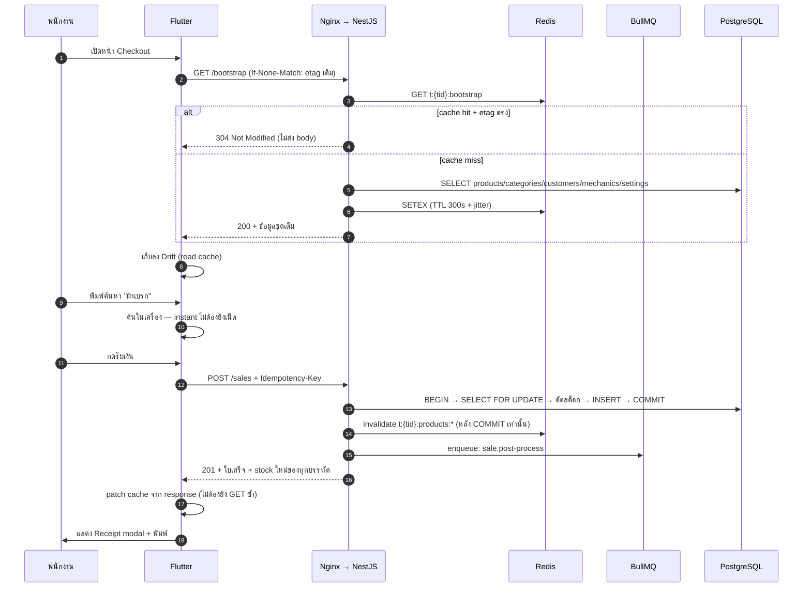
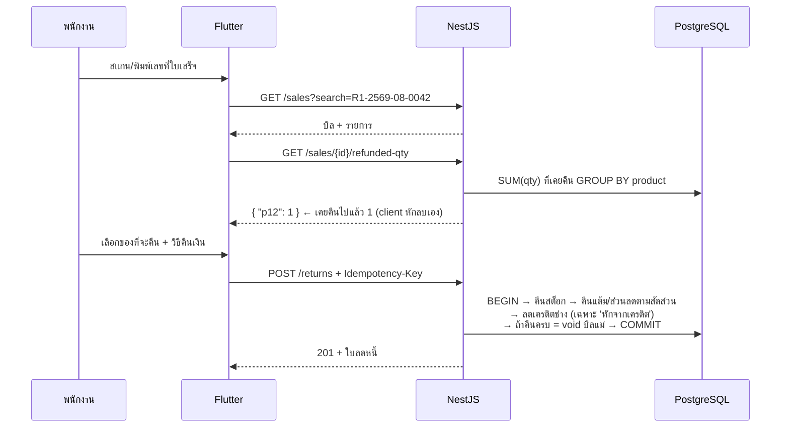

# 02 — หน้าจอ → API (Screen-to-Endpoint Map)

> **สำหรับทีม backend:** แอปมี **11 หน้าจอ** เอกสารนี้บอกว่าแต่ละหน้าจอ "ยิงอะไร ตอนไหน"
> ข้อมูลนี้ไม่ได้เดา — อ่านจากโค้ดจริงว่าหน้าจอเรียก repository method ไหนบ้าง
> แล้วแปลง repository method → REST endpoint
>
> **สำหรับทีม Flutter:** ตารางเดียวกันนี้บอกว่า repository ตัวไหนต้องเปลี่ยนไปเรียก HTTP

---

## 1. กติกากลางของ API

### 1.1 รูปแบบ

| หัวข้อ | ข้อกำหนด |
|---|---|
| Base path | `/api/v1` (ล็อกเวอร์ชันไว้ตั้งแต่วันแรก) |
| Auth | `Authorization: Bearer <JWT>` ทุก endpoint ยกเว้น `/auth/*` และ `/health/*` |
| Tenant | **อ่านจาก JWT claim `tid` เท่านั้น** — ห้ามรับ `tenantId` จาก body/query เด็ดขาด (ไม่งั้นปลอมข้ามร้านได้) |
| Content | `application/json; charset=utf-8` |
| Pagination | `?page=1&limit=50` (default 50, max 200) |
| เวลา | ISO-8601 UTC ทุกที่ (`2026-08-25T03:12:00Z`) |
| เงิน | ส่งเป็น **string** `"1234.50"` ไม่ใช่ float (กันปัญหา precision — ดู `01_DATABASE.md §4`) |

### 1.2 Response envelope (ตามสเปคที่อาจารย์กำหนดใน Flash Sale assignment)

```jsonc
// สำเร็จ
{ "status": "success", "data": { /* ... */ }, "meta": { "total": 120, "page": 1, "limit": 50, "totalPages": 3 } }

// ผิดพลาด
{ "status": "error",
  "error": {
    "code": "INSUFFICIENT_STOCK",                       // machine-readable
    "message": "สต็อกไม่พอ:\nผ้าเบรกหน้า: สต็อก 2 แต่ต้องการ 5",  // ⚠️ ข้อความไทย ตรงตัวจาก db.js
    "details": [ { "productId": "p12", "stock": 2, "requested": 5 } ]
  } }
```

> ⚠️ **`message` ภาษาไทยต้องคัดลอกจาก `pos/db.js` ตรงตัว ห้ามแปล/ห้ามเรียบเรียงใหม่**
> เพราะพนักงานหน้าร้านคุ้นกับข้อความเดิม และ test ของ client ผูกกับสตริงพวกนี้ (`CONTRACT.md §8`)
> `code` มีไว้ให้ client แยกเคส ส่วน `message` มีไว้ให้คนอ่าน

### 1.3 ใครเป็นเจ้าของตัวเลขเงิน

**client เป็นเจ้าของ, server เป็นผู้ตรวจ** — เพราะใบเสร็จพิมพ์ออกไปแล้วก่อนที่ request จะถึง server

* client ส่ง `subtotal` / `discount` / `total` มา
* server คำนวณซ้ำจาก `items[].qty × price` แล้ว **เทียบ**:
  * ต่างเกิน **0.01** → `409 TOTAL_MISMATCH` (แปลว่า client บั๊ก หรือมีคนยิงมั่ว)
  * ต่างไม่เกิน 0.01 → **ใช้ค่าจาก client** บันทึกลง DB
* `pointsGranted = floor(total/10)` **server คำนวณจากค่าที่ persist จริง** จึงไม่มีทางเพี้ยนตาม

> เขียน tolerance 0.01 ลง contract ให้ชัด อย่าปล่อยเป็น implicit —
> ของเดิมคือ Dart `double` + `round2(v) = (v*100).round()/100` ส่วน Postgres เป็น `NUMERIC`
> ค่าบวกจะปัดตรงกัน แต่ contract ต้องระบุไว้เผื่อเจอเคสขอบ

### 1.4 Idempotency (บังคับกับทุก write ที่เกี่ยวกับเงิน/สต็อก)

```
POST /api/v1/sales
Idempotency-Key: 9f3c…   ← client สร้าง 1 ครั้งต่อ 1 บิล และใช้ค่าเดิมทุกครั้งที่ retry
```
* ยิงซ้ำด้วย key เดิม + body เดิม → คืน response เดิม (200/201) **ห้ามตัดสต็อกซ้ำ**
* ยิงซ้ำด้วย key เดิม + body ต่าง → `409 IDEMPOTENCY_KEY_REUSED`
* เก็บใน `idempotency_keys` 24 ชม. แล้วลบทิ้ง (cron/BullMQ repeatable job)

---

## 2. ตารางสรุป — หน้าจอไหนยิงอะไร

| # | หน้าจอ (route) | READ (ตอนเปิดหน้า) | WRITE (ตอนกดปุ่ม) |
|---|---|---|---|
| 1 | **Checkout** `/` | `GET /bootstrap` (รวม products+categories+customers+mechanics+settings), `/parked-sales`, `/products?partNo=` (บาร์โค้ด) | `POST /sales` ⭐, `POST /quotes`, `POST /parked-sales`, `DELETE /parked-sales/:id`, `POST /customers` |
| 2 | **Products** `/products` | `GET /products`, `/categories`, `/products/:id/suppliers`, `/movements`, `/reports/product-sales`, `/settings` | `POST/PATCH/DELETE /products`, `POST /products/:id/adjust-stock`, `POST/DELETE /categories`, `POST/PATCH/DELETE /suppliers` |
| 3 | **Purchase Orders** `/purchase-orders` | `GET /purchase-orders`, `GET /products` | `POST /purchase-orders`, `POST /:id/receive` ⭐, `POST /:id/cancel`, `DELETE /:id` |
| 4 | **Vehicle Search** `/vehicle-search` | `GET /products?compat=…`, `GET /categories` | — (อ่านอย่างเดียว) |
| 5 | **Customers** `/customers` | `GET /customers`, `GET /customers/:id/sales` | `POST/PATCH/DELETE /customers` |
| 6 | **Mechanics** `/mechanics` | `GET /mechanics`, `/mechanics/:id/sales`, `/credit-payments` | `POST/PATCH/DELETE /mechanics`, `POST /mechanics/:id/credit-payments` |
| 7 | **Returns** `/returns` | `GET /sales?search=`, `GET /sales/:id/refunded-qty`, `GET /returns`, `/settings` | `POST /returns` ⭐ |
| 8 | **Quotes** `/quotes` | `GET /quotes`, `/settings` | `POST /quotes`, `PATCH /quotes/:id`, `POST /:id/duplicate`, `POST /:id/convert`, `DELETE /:id`, `POST /quotes/purge` |
| 9 | **Reports** `/reports` | `GET /reports/summary`, `/reports/top-products`, `/reports/by-category`, `/reports/stock-value` | — |
| 10 | **Settings** `/settings` | `GET /settings` | `PATCH /settings`, `POST /backup/export`, `POST /backup/import`, `GET /export/:entity.csv` |
| 11 | **Cash Drawer** `/cash-drawer` | `GET /shifts/current`, `/shifts/history`, `/reports/closing?shiftId=` | `POST /shifts/open`, `POST /shifts/close`, `POST /shifts/current/entries` |

⭐ = endpoint ที่ต้อง **transaction + idempotent + invalidate cache** (3 ตัวนี้คือหัวใจของระบบ)

> ### 🆕 endpoint ที่เป็น "ของใหม่" ไม่ใช่การ port จากโค้ดเดิม
> อย่าเข้าใจผิดว่าทั้งตารางคือ behaviour parity — endpoint กลุ่มนี้ **ไม่มีในแอปวันนี้**
> ต้องคุยกันก่อนว่าจะทำจริงไหม ไม่ใช่หยิบไป implement เลย:
> `POST /sales/:id/void` (ของเดิม void เกิดอัตโนมัติตอนคืนครบบิลเท่านั้น ไม่มีปุ่ม void ตรง ๆ) ·
> `GET /customers/:id/summary` · `GET /mechanics/:id/statement` · `GET /reports/by-payment` ·
> `GET /reports/daily` · `GET /quotes/:id/pdf` · `POST /quotes/:id/convert` (ของเดิมโยนตะกร้ากลับหน้า Checkout) ·
> `GET /bootstrap` · `POST /customers` จากหน้า Checkout (ของเดิมเพิ่มลูกค้าได้จากหน้า Customers เท่านั้น)
>
> **นอกจากนี้ `AppShell` (กรอบนำทางที่อยู่ทุกหน้า) เรียก `watchSettings()` เป็น live stream** —
> เป็น stream เดียวที่ยัง wire อยู่จริงในแอป ต้องมีที่ทางในเฟส 1 (ดู `03_ARCHITECTURE.md §2`)

---

## 3. รายละเอียดทีละหน้าจอ

### 3.1 Checkout (หน้าแรก — หน้าที่ใช้หนักที่สุด)

หน้าจอนี้คือที่ที่พนักงานอยู่ 90% ของวัน: ค้นอะไหล่ → ใส่ตะกร้า → เลือกลูกค้า/ช่าง → รับเงิน → พิมพ์ใบเสร็จ



**Endpoints ที่หน้านี้ใช้**

| ตอนไหน | Method + Path | หมายเหตุ |
|---|---|---|
| **เปิดหน้า** | **`GET /bootstrap`** | ⭐ รวม products + categories(พร้อมสี) + customers + mechanics + settings ใน request เดียว รองรับ `ETag` / `If-None-Match` |
| เปิดหน้า | `GET /parked-sales` | บิลที่พักไว้ (ไม่ cache — เปลี่ยนบ่อย ข้อมูลน้อย) |
| ค้นหา | `GET /products?search=` | ค้นในเครื่องจาก cache ก่อน ยิง server เฉพาะตอนหาไม่เจอ |
| **ยิงบาร์โค้ด** | **`GET /products?partNo=<exact>`** | ⭐ ต้องแยกจาก `?search=` — บาร์โค้ดคือ exact match ถ้าใช้ full-text จะได้หลายผลลัพธ์/ผิดตัว |
| เลือกลูกค้า / ช่าง | (จาก cache ในเครื่อง) | `mechanics` ต้องมี `creditBalance`, `creditLimit` ติดมาด้วย |
| **รับเงิน** | `POST /sales` | ⭐ ดูสเปคด้านล่าง |
| บันทึกเป็นใบเสนอราคา | `POST /quotes` | ไม่ตัดสต็อก |
| พักบิล | `POST /parked-sales` / `DELETE /parked-sales/:id` | ไม่ตัดสต็อก |

> ### ⚠️ 3 กับดักของหน้านี้ที่เวอร์ชันแรกมองข้าม
> **1. N+1 ที่ซ่อนอยู่** — โค้ดปัจจุบันวนเรียก `catColor()` **ทีละหมวด** ถ้าแปลตรง ๆ เป็น REST
> จะกลายเป็น `1 + N` request → **`/categories` ต้องคืน `[{ name, color }]` มาพร้อมกันเลย**
> (หน้า Reports ก็มีปัญหาเดียวกัน แก้ที่เดียวได้ทั้งสองหน้า)
>
> **2. อย่าเพิ่ม request ที่ของเดิมไม่มี** — เวอร์ชันแรกใส่ `GET /reports/low-stock` และ `GET /settings`
> เข้ามาตอนเปิดหน้า ทั้งที่ของจริง low-stock คำนวณจาก list ที่โหลดมาแล้ว
> และ settings อ่านตอนพิมพ์ใบเสร็จเท่านั้น → รวมเข้า `/bootstrap` แทน
>
> **3. ช่องค้นหาปัจจุบัน instant เพราะค้นในหน่วยความจำ** (สินค้า/ลูกค้า/ช่าง ไม่มี debounce เพราะไม่ต้องมี)
> ถ้าเปลี่ยนเป็น `?search=` ยิง server ทุกตัวอักษร **UX จะแย่ลงชัดเจน** →
> นี่คือเหตุผลที่ Drift ต้องอยู่ต่อในฐานะ read cache (ดู `03_ARCHITECTURE.md §2`)

**`POST /api/v1/sales`** — endpoint ที่สำคัญที่สุดของทั้งระบบ

```jsonc
// Request
{
  "id": "s1a2b3c4",                 // client สร้าง (รองรับ offline) — server ใช้เป็น natural idempotency key ด้วย
  "receiptNo": "R1-2569-08-0042",
  "subtotal": "1500.00",
  "discount": "100.00",
  "total": "1400.00",
  "paymentMethod": "เครดิตช่าง",
  "customerId": "c3", "customerName": "สมชาย ยานยนต์",
  "mechanicId": "m2", "mechanicName": "ช่างเอก",
  "mechanicDelta": "-100.00",
  "shiftId": "sh_20260825_01",
  "items": [
    { "lineNo": 1, "productId": "p12", "partNo": "BP-1234", "name": "Front Brake Pad",
      "nameTH": "ผ้าเบรกหน้า", "qty": 2, "price": "750.00" }
  ]
}

// 201 Created — ⭐ ต้องคืน stock ใหม่ของทุกบรรทัดที่แตะกลับมาด้วย
{ "status": "success",
  "data": { "id": "s1a2b3c4", "receiptNo": "R1-2569-08-0042", "total": "1400.00",
            "pointsGranted": 140, "date": "2026-08-25T03:12:00Z",
            "mechanicCreditBalanceAfter": "5400.00",
            "products": [ { "id": "p12", "stock": 8, "offlineOk": true } ] } }

// 409 — ของไม่พอ
{ "status": "error",
  "error": { "code": "INSUFFICIENT_STOCK",
             "message": "สต็อกไม่พอ:\nผ้าเบรกหน้า: สต็อก 1 แต่ต้องการ 2",
             "details": [ { "productId": "p12", "stock": 1, "requested": 2 } ] } }
```

> **หมายเหตุสำคัญ 3 ข้อ:**
> 1. `pointsGranted` **server คำนวณเอง** (`floor(total/10)`) ไม่รับจาก client
> 2. `receiptNo` **client เป็นคนออก** (ต้องออกบิลได้ตอนออฟไลน์) — server แค่กันชนด้วย
>    `UNIQUE (tenant_id, receipt_no)` ถ้าชนให้คืน `409 RECEIPT_NO_CONFLICT` แล้วให้ client ออกเลขใหม่
>    ⚠️ ตัวอย่าง `"R1-2569-08-0042"` ข้างบนเป็น **รูปแบบที่เสนอ ไม่ใช่รูปแบบปัจจุบัน** —
>    ของจริงคือ `docNo('RC')` การเปลี่ยนต้องถามเจ้าของร้านก่อน (ดู `01_DATABASE.md §7.2`)
> 3. **ต้องคืน `products[]` ที่สต็อกเปลี่ยนกลับมาใน response** เพื่อให้หน้า Checkout อัปเดตค่าในเครื่องได้ทันที
>    ไม่ต้องยิง `GET /products` ซ้ำ — แก้ปัญหา read-your-writes ที่ cache 5 นาที + replica lag ทำให้เห็นสต็อกเก่า

### 3.2 Products (จัดการอะไหล่)

| ตอนไหน | Method + Path |
|---|---|
| รายการสินค้า | `GET /products?page&limit&search&category&sort` |
| หมวดหมู่ | `GET /categories` / `POST /categories` / `DELETE /categories/:name` |
| เพิ่ม/แก้/ลบ | `POST /products` · `PATCH /products/:id` · `DELETE /products/:id` (soft delete) |
| ปรับสต็อกมือ | `POST /products/:id/adjust-stock` `{ delta, type, note }` → **clamp ที่ 0** + สร้าง movement |
| ประวัติสต็อก | `GET /movements?productId=&from=&to=&page=` |
| ซัพพลายเออร์ | `GET /products/:id/suppliers` · `POST /suppliers` · `PATCH /suppliers/:id` · `DELETE /suppliers/:id` |
| รายงานสต็อก | `GET /reports/stock-value` |
| ยอดขายรายชิ้น | `GET /reports/product-sales?productId=&from=&to=` |
| พิมพ์ป้าย | `GET /settings` (เอาชื่อร้านไปขึ้นบนป้าย) |

> ⚠️ **จุดที่ต้องแก้จากของเดิม:** ตอนนี้หน้า Products เรียก `salesRepo.getSales()` **โหลดบิลทั้งหมด**
> มาไล่นับว่าสินค้าชิ้นนี้ขายไปกี่ชิ้น — ร้านขายมา 2 ปีก็ต้องโหลดหมื่นบิลลงมือถือ
> **ต้องเปลี่ยนเป็น `GET /reports/product-sales`** ที่ `GROUP BY` ฝั่ง server

### 3.3 Purchase Orders (ใบสั่งซื้อ + รับของ)

| ตอนไหน | Method + Path | หมายเหตุ |
|---|---|---|
| รายการ PO | `GET /purchase-orders?status=open` | |
| สร้าง PO | `POST /purchase-orders` | ไม่แตะสต็อก |
| **รับของ** | `POST /purchase-orders/:id/receive` | ⭐ transaction: บวกสต็อก + คำนวณต้นทุนเฉลี่ยถ่วงน้ำหนัก + สร้าง movement + `status='received'` |
| ยกเลิก | `POST /purchase-orders/:id/cancel` | |
| ลบ | `DELETE /purchase-orders/:id` | ลบได้เฉพาะที่ยังไม่รับของ |

```jsonc
// POST /purchase-orders/:id/receive  → 200
{ "status": "success",
  "data": {
    "poId": "po7", "status": "received", "receivedAt": "2026-08-25T04:00:00Z",
    "updated": [ { "partNo": "BP-1234", "stockAfter": 22, "costAfter": "512.73" } ],
    "unmatched": [ "XX-9999" ]        // ⚠️ ไม่ใช่ error — คือ part_no ที่ยังไม่มีในระบบ ให้ UI ถามว่าจะสร้างสินค้าใหม่ไหม
  } }
```
* **รับซ้ำไม่ได้**: ยิงซ้ำต้องได้ `409 PO_ALREADY_RECEIVED` (เช็ค status ภายใน transaction ไม่ใช่ก่อน)

### 3.4 Vehicle Search (ค้นอะไหล่จากรุ่นรถ)

| Method + Path | หมายเหตุ |
|---|---|
| `GET /products?compat=vigo&search=&category=` | ค้นในฟิลด์ `compat` — ตอนนี้ client โหลดสินค้าทั้งหมดมา filter ใน Dart → ย้ายมาเป็น full-text index ฝั่ง server (`01_DATABASE.md §5.2`) |
| `GET /categories` | สำหรับ chip กรองหมวด |

### 3.5 Customers

| Method + Path | หมายเหตุ |
|---|---|
| `GET /customers?search=&page=` | |
| `POST /customers` | server ออก `code` = `CUS###` (ต้อง lock กันชนตอนหลายเครื่องเพิ่มพร้อมกัน) |
| `PATCH /customers/:id` · `DELETE /customers/:id` | |
| **`GET /customers/:id/sales?page=`** | ⚠️ ของเดิมโหลดบิลทั้งหมดแล้ว filter ใน client → ต้องเป็น endpoint แยก |
| `GET /customers/:id/summary` | แต้มคงเหลือ, ยอดซื้อสะสม, ซื้อล่าสุดเมื่อไหร่ |

### 3.6 Mechanics (ช่าง + เครดิต)

| Method + Path | หมายเหตุ |
|---|---|
| `GET /mechanics?search=` | ส่ง `creditBalance` / `creditLimit` มาด้วยเสมอ |
| `POST /mechanics` (`code` = `M###`) · `PATCH` · `DELETE` | |
| **`POST /mechanics/:id/credit-payments`** | ช่างมาจ่ายหนี้ — ลด `credit_balance` (clamp ที่ 0), ออกเลขใบเสร็จรับเงิน, ต้อง idempotent |
| `GET /credit-payments?mechanicId=&from=&to=` | |
| **`GET /mechanics/:id/sales?page=`** | ⚠️ เหมือนข้อ 3.5 — เดิม filter ใน client |
| `GET /mechanics/:id/statement?from=&to=` | ใบแจ้งหนี้: ยอดยกมา + ซื้อ + จ่าย + คงเหลือ |

### 3.7 Returns (รับคืน / ใบลดหนี้)



| Method + Path | หมายเหตุ |
|---|---|
| `GET /sales?search=<receiptNo>&page=` | ค้นบิลที่จะคืน |
| **`GET /sales/:id/refunded-qty`** | ตรงกับ `getRefundedQty()` เดิม — คืน map `productId → qty ที่**คืนไปแล้ว**` |
| `POST /returns` | ⭐ transaction + idempotent |
| `GET /returns?from=&to=&page=` | ประวัติการคืน |

### 3.8 Quotes (ใบเสนอราคา)

| Method + Path | หมายเหตุ |
|---|---|
| `GET /quotes?status=&from=&to=&page=` | |
| `POST /quotes` · `PATCH /quotes/:id` · `DELETE /quotes/:id` | **ไม่แตะสต็อก** |
| `POST /quotes/:id/duplicate` | ก๊อปปี้เป็นใบใหม่ status `open` |
| **`POST /quotes/:id/convert`** | แปลงเป็นบิลขาย → **สร้าง sale จริง (ตัดสต็อกตรงนี้)** + ตั้ง `converted_at`, `converted_sale_id` |
| `POST /quotes/purge` `{ olderThanDays: 90 }` | ลบใบเก่า — งานหนัก ควรโยนเข้า BullMQ แล้วตอบ `202 Accepted` |
| `GET /quotes/:id/pdf` | (ทางเลือก) ให้ server เรนเดอร์ A4 PDF แทนที่จะเรนเดอร์บนมือถือ |

> **จุดที่ design เดิมกำกวม:** การ "แปลงใบเสนอราคาเป็นบิล" ตอนนี้ทำโดยโยนตะกร้ากลับไปหน้า Checkout
> แล้วให้พนักงานกดขายอีกที ทำให้ถ้าปิดแอปกลางทาง ใบเสนอราคาจะค้างสถานะ
> → แนะนำให้เป็น endpoint เดียวจบ (`/convert`) จะได้ atomic

### 3.9 Reports

**⚠️ หน้านี้ต้องรื้อทั้งหน้า:** ปัจจุบันโหลด `getSales()` + `getReturns()` + `getAll()` (สินค้าทั้งหมด)
มาคำนวณ KPI ใน Dart ทั้งหมด — ใช้ได้ตอนข้อมูล 100 บิล แต่พังตอน 50,000 บิล

| Endpoint ใหม่ | คืนอะไร | SQL |
|---|---|---|
| `GET /reports/summary?from=&to=` | ยอดขาย, จำนวนบิล, บิลเฉลี่ย, ยอดคืน, ยอดสุทธิ, กำไรขั้นต้น | `SUM/COUNT/AVG` บน `sales` + `returns` |
| `GET /reports/top-products?from=&to=&limit=10` | สินค้าขายดี | `GROUP BY product_id` บน `sale_items` |
| `GET /reports/by-category?from=&to=` | ยอดขายแยกหมวด | join `sale_items → products` |
| `GET /reports/by-payment?from=&to=` | แยกตามวิธีชำระ (เงินสด/โอน/เครดิต) | |
| `GET /reports/daily?from=&to=` | ยอดรายวัน (กราฟ) | `GROUP BY date_trunc('day', date)` |
| `GET /reports/stock-value` | มูลค่าสต็อกรวม = `SUM(stock × cost)` | |
| `GET /reports/low-stock` | รายการของใกล้หมด | ใช้ partial index |

> รายงานพวกนี้ **cache ได้ยาว** (TTL 5–15 นาที) เพราะไม่มีใครดูยอดขายแบบวินาทีต่อวินาที
> ถ้าข้อมูลโตมาก ค่อยทำเป็น **materialized view** refresh ทุก 15 นาทีด้วย BullMQ repeatable job

### 3.10 Settings + Backup

| Method + Path | หมายเหตุ |
|---|---|
| `GET /settings` · `PATCH /settings` | ข้อมูลร้าน, VAT, อายุใบเสนอราคา |
| `POST /backup/export` | → `202 Accepted` + `jobId` (งานหนัก เข้า BullMQ) → ได้ signed URL ตอนเสร็จ |
| `POST /backup/import` | อัปโหลด snapshot JSON แบบเดิม (`sa_*` + `__meta`) — **ต้องเป็น admin + ต้องมี audit log** |
| `GET /backup/jobs/:id` | เช็คสถานะงาน export/import |
| `GET /export/products.csv` `?…` | CSV — ทุกช่องผ่าน `csvSafe()` กัน formula injection |

> ⚠️ `POST /backup/import` เป็น endpoint ที่อันตรายที่สุดในระบบ (เขียนทับข้อมูลทั้งร้าน)
> → ต้อง role `owner` + ยืนยัน PIN + เก็บ `audit_log` + ทำ backup อัตโนมัติก่อน import

### 3.11 Cash Drawer (เปิด-ปิดกะ)

| Method + Path | หมายเหตุ |
|---|---|
| `GET /shifts/current` | กะที่ active + รายการเงินเข้า-ออก |
| `POST /shifts/open` `{ startingCash }` | เปิดกะวันเดิมซ้ำ → คืนกะเดิม; เปิดวันใหม่ → archive กะเก่าก่อน |
| `POST /shifts/close` `{ physicalCash }` | บันทึกเงินที่นับได้จริง |
| `POST /shifts/current/entries` `{ type, amount, note }` | ปิดกะแล้วยิงมาต้องได้ `409` + ข้อความไทย `ลิ้นชักปิดแล้ว…` |
| `GET /shifts/history?page=` | |
| **`GET /reports/closing?shiftId=`** | ⭐ รายงานปิดร้าน — ดูสูตรเต็มด้านล่าง |

**สูตรเงินสดที่ควรมีในลิ้นชัก** (คัดจากโค้ดจริง — เวอร์ชันแรกของเอกสารนี้เขียนตกไป 1 พจน์):

```
เงินสดที่ควรมี = เงินตั้งต้น (starting_cash)
               + ยอดขายที่รับเป็นเงินสด
               + ยอดที่ช่างมาจ่ายหนี้เป็นเงินสด      ← 🔴 พจน์ที่มักลืม
               − ยอดคืนเงินที่จ่ายเป็นเงินสด
               + เงินเข้าอื่น ๆ (drawer_entries type='in')
               − เงินออกอื่น ๆ (drawer_entries type='out')
ส่วนต่าง       = เงินที่นับได้จริง (physical_cash) − เงินสดที่ควรมี
```

> **ถ้าลืมพจน์ "ช่างจ่ายหนี้เงินสด" ลิ้นชักจะแสดงว่า "ขาด" ทุกวัน** เท่ากับยอดที่ช่างมาจ่าย
> ซึ่งจะทำให้พนักงานเลิกเชื่อรายงานปิดร้านไปเลย (โค้ดปัจจุบันบวกไว้ถูกแล้ว)

> ⚠️ **บั๊กที่จะโผล่ทันทีตอนมี 2 เครื่อง:** ตอนนี้รายงานปิดกะคำนวณจาก "บิลทั้งหมดที่เวลาอยู่ในช่วงกะ"
> ซึ่งข้ามเครื่องกันไม่ได้และข้ามเที่ยงคืนไม่ได้
> → นี่คือเหตุผลที่ `01_DATABASE.md` เพิ่ม `sales.shift_id` / `returns.shift_id`

---

## 4. API Catalogue เต็ม (ตารางเดียวจบ)

| Method | Path | Auth | Cache | Queue | Idempotent |
|---|---|---|---|---|---|
| POST | `/auth/token` | – | – | – | – |
| POST | `/auth/refresh` | refresh | – | – | – |
| GET | `/auth/me` | ✔ | – | – | – |
| GET | `/products` (`?search=` / `?partNo=` / `?updatedSince=`) | ✔ | ✅ 5m | – | – |
| GET | `/products/:id` | ✔ | ✅ 5m | – | – |
| POST | `/products` | manager | invalidate | – | ✔ |
| PATCH | `/products/:id` | manager | invalidate | – | ✔ |
| DELETE | `/products/:id` | manager | invalidate | – | ✔ |
| POST | `/products/:id/adjust-stock` | manager | invalidate | – | ✔ |
| GET | `/categories` (คืน `[{name,color}]`) | ✔ | ✅ 1h | – | – |
| POST/DELETE | `/categories` | manager | invalidate | – | ✔ |
| GET | `/products/:id/suppliers` | ✔ | – | – | – |
| POST/PATCH/DELETE | `/suppliers/:id?` | manager | – | – | ✔ |
| GET | `/movements` | ✔ | – | – | – |
| GET | `/customers` | ✔ | ✅ 1m | – | – |
| POST/PATCH/DELETE | `/customers/:id?` | ✔ | invalidate | – | ✔ |
| GET | `/customers/:id/sales` | ✔ | – | – | – |
| GET | `/mechanics` | ✔ | ✅ 1m | – | – |
| POST/PATCH/DELETE | `/mechanics/:id?` | manager | invalidate | – | ✔ |
| POST | `/mechanics/:id/credit-payments` | ✔ | invalidate | – | **✔ บังคับ** |
| **POST** | **`/sales`** | ✔ | invalidate | ✅ post-process | **✔ บังคับ** |
| GET | `/sales` | ✔ | – | – | – |
| GET | `/sales/:id` · `/sales/:id/refunded-qty` | ✔ | – | – | – |
| POST | `/sales/:id/void` 🆕 | manager+PIN | invalidate | – | ✔ |
| **POST** | **`/returns`** | ✔ | invalidate | ✅ post-process | **✔ บังคับ** |
| GET | `/returns` | ✔ | – | – | – |
| GET | `/purchase-orders` | ✔ | – | – | – |
| POST | `/purchase-orders` | manager | – | – | ✔ |
| **POST** | **`/purchase-orders/:id/receive`** | manager | invalidate | ✅ | **✔ บังคับ** |
| POST | `/purchase-orders/:id/cancel` · DELETE | manager | – | – | ✔ |
| GET/POST/PATCH/DELETE | `/quotes/:id?` | ✔ | – | – | ✔ |
| POST | `/quotes/:id/duplicate` | ✔ | – | – | ✔ |
| POST | `/quotes/:id/convert` | ✔ | invalidate | ✅ | **✔ บังคับ** |
| POST | `/quotes/purge` | manager | – | ✅ 202 | ✔ |
| GET | `/parked-sales` · POST · DELETE | ✔ | – | – | ✔ |
| GET | `/shifts/current` · `/shifts/history` | ✔ | – | – | – |
| POST | `/shifts/open` · `/close` · `/current/entries` | ✔ | – | – | ✔ |
| GET | `/reports/*` | ✔ | ✅ 5–15m | – | – |
| GET/PATCH | `/settings` | manager | ✅ 1h / invalidate | – | ✔ |
| POST | `/backup/export` · `/backup/import` | owner+PIN | – | ✅ 202 | ✔ |
| GET | `/export/:entity.csv` | manager | – | – | – |
| POST | `/sync/push` · GET `/sync/pull` · `/sync/bootstrap` | ✔ | – | – | **✔ บังคับ** |
| GET | `/health/live` · `/health/ready` | – | – | – | – |
| GET | `/metrics` | internal | – | – | – |

---

## 5. Cache strategy (Redis, cache-aside)

| Key | ข้อมูล | TTL | ล้างเมื่อ |
|---|---|---|---|
| `t:{tid}:products:p{page}:l{limit}:c{cat}` | หน้ารายการสินค้า | 300s **+ jitter ±60s** | ขาย / คืน / รับของ / แก้สินค้า |
| `t:{tid}:product:{id}` | สินค้ารายชิ้น | 300s + jitter | เหมือนบน |
| `t:{tid}:categories` | หมวดหมู่ | 3600s | เพิ่ม/ลบหมวด |
| `t:{tid}:settings` | ตั้งค่าร้าน | 3600s | `PATCH /settings` |
| `t:{tid}:reports:summary:{from}:{to}` | KPI | 300s | (ปล่อยหมดอายุเอง) |
| `t:{tid}:idem:{key}` | ผลลัพธ์ idempotency (ชั้นเร็ว) | 24h | – |

**กฎที่ต้องทำตาม (จาก Backend04):**
* **ทุก key ต้องมี TTL + jitter** — ไม่งั้นเจอ *cache avalanche* (key หมดอายุพร้อมกันหมด → DB โดนถล่ม)
* กัน *cache stampede*: cache miss ให้ใช้ Redis lock (`SET key NX PX 5000`) ให้ request แรกเท่านั้นที่ไป query DB
* **key ต้องขึ้นต้นด้วย `t:{tid}:` เสมอ** — cache รั่วข้ามร้านคือบั๊กที่แย่ที่สุดที่จะเกิดได้ในระบบ multi-tenant
* invalidate ต้องทำ**หลัง `COMMIT`** เท่านั้น (ถ้าล้างก่อนแล้ว transaction rollback = cache ค้างข้อมูลเก่า)
* อย่าใช้ `KEYS` ใน production — ใช้ `SCAN` หรือเก็บ tag set (`SADD t:{tid}:tags:products <key>`)

---

## 6. BullMQ jobs

| Queue | Job | Trigger | ทำอะไร |
|---|---|---|---|
| `sale-post` | `sale.created` | หลังขายสำเร็จ | invalidate cache, อัปเดต materialized report, LINE notify ยอดขาย, พิมพ์สำรอง |
| `sale-post` | `return.created` | หลังคืนสำเร็จ | เหมือนบน |
| `inventory` | `po.received` | รับของ | คำนวณต้นทุนใหม่, เตือนของใกล้หมด |
| `maintenance` | `quotes.purge` | manual / cron | ลบใบเสนอราคาเก่า |
| `maintenance` | `idem.cleanup` | repeatable ทุกชั่วโมง | ลบ idempotency key > 24h |
| `backup` | `snapshot.export` | manual / cron รายวัน | dump ข้อมูลร้าน → object storage |
| `backup` | `snapshot.import` | manual | import ทีละร้าน |
| `sync` | `sync.apply` | `/sync/push` (Arch C) | apply command จากเครื่องที่ออฟไลน์ |

**กติกา (จาก Backend05):**
* ทุก job ต้อง **idempotent** — BullMQ เป็น at-least-once, job รันซ้ำได้เสมอ
* `attempts: 3` + `backoff: exponential` + **dead-letter queue** สำหรับงานที่ล้มถาวร
* ใส่ `tenantId` + `correlationId` ใน job payload ทุกตัว (ไม่งั้น worker set `app.tenant_id` ไม่ได้ และไล่ log ไม่ได้)
* **ห้าม** ให้ worker เขียนงานที่ต้องตอบ user ทันที — การขายต้อง sync ตอบใน request (ต่างจาก Flash Sale assignment ที่โยนเข้า queue ได้ เพราะที่นี่พนักงานต้องได้ใบเสร็จเดี๋ยวนั้น)

---

## 7. Sync endpoints (ใช้เฉพาะ Architecture B / C)

| Method + Path | ทำอะไร |
|---|---|
| `GET /sync/bootstrap` | ดึงข้อมูลทั้งร้านครั้งแรก (เครื่องใหม่) — ตอบเป็น stream/แบ่งหน้า + คืน `serverSeq` ปัจจุบัน |
| `GET /sync/pull?since={serverSeq}&limit=500` | ดึงการเปลี่ยนแปลงหลัง cursor นี้ จาก `change_log` |
| `POST /sync/push` | ส่ง batch ของ operation ที่ค้างในเครื่อง (outbox) — **ต้องมี `Idempotency-Key` ต่อ operation** |

```jsonc
// POST /sync/push
{ "deviceId": "dev_02", "ops": [
    { "opId": "op_9a3f", "type": "sale.create",  "payload": { /* SaleInput */ }, "clientTime": "2026-08-25T02:00:00Z" },
    { "opId": "op_9a40", "type": "stock.adjust", "payload": { /* … */ },        "clientTime": "2026-08-25T02:05:00Z" }
] }

// 200 — ตอบแยกผลทีละ op (บาง op สำเร็จ บาง op ไม่สำเร็จได้)
{ "status": "success",
  "data": { "results": [
      { "opId": "op_9a3f", "status": "applied",  "serverId": "s1a2b3c4" },
      { "opId": "op_9a40", "status": "rejected", "code": "INSUFFICIENT_STOCK",
        "message": "สต็อกไม่พอ:\nผ้าเบรกหน้า: สต็อก 0 แต่ต้องการ 1" }
  ], "serverSeq": 88421 } }
```

> **คำถามที่ต้องตอบให้ได้ก่อนเลือก B/C:** ถ้าเครื่อง A ขายของชิ้นสุดท้ายตอนออฟไลน์
> และเครื่อง B ก็ขายชิ้นเดียวกันตอนออนไลน์ — **ใครถูก?** และร้านจะจัดการยังไง?
> (ดู `03_ARCHITECTURE.md §4` และ `04_QA_SCRUTINY.md` Q3 — อันนี้เถียงกันหนักที่สุด)

---

## 8. Error codes

| HTTP | code | ข้อความไทย (ตรงตัวจาก `db.js`) |
|---|---|---|
| 409 | `INSUFFICIENT_STOCK` | `สต็อกไม่พอ:\n<name>: สต็อก <n> แต่ต้องการ <m>` |
| 409 | `OVER_REFUND` | `คืนเกินจำนวนที่ขาย:\n<name>: คืนได้อีก <n> แต่ขอคืน <m>` |
| 404 | `SALE_NOT_FOUND` | `Sale not found` |
| 409 | `SALE_VOIDED` | `Bill already voided` |
| 409 | `DRAWER_CLOSED` | `ลิ้นชักปิดแล้ว ไม่สามารถบันทึกรายการเงินเพิ่มได้` |
| 400 | `INVALID_BACKUP` | `ไฟล์สำรองไม่ถูกต้อง — ไม่พบข้อมูล __meta` |
| 409 | `NO_OPEN_SHIFT` | `No open shift` |
| 409 | `IDEMPOTENCY_KEY_REUSED` | – (ไม่แสดงให้ผู้ใช้เห็น) |
| 401/403 | `UNAUTHENTICATED` / `FORBIDDEN` | – |
| 429 | `RATE_LIMITED` | – |

### 8.1 Error ที่เป็น **ของใหม่** (ไม่มีใน `db.js` — ห้ามแต่งข้อความไทยเอง)

ทั้ง 4 ตัวนี้เป็นพฤติกรรมที่ระบบเดิม **ไม่มี** จึงไม่มีข้อความไทยให้ลอก
→ **ต้องให้เจ้าของร้าน/คนหน้าร้านเป็นคนเลือกคำ** ก่อน implement

| HTTP | code | เป็นของใหม่เพราะ |
|---|---|---|
| 409 | `PO_ALREADY_RECEIVED` | โค้ดเดิม **ไม่มี status guard** — รับของซ้ำได้และสต็อกบวกซ้ำ (บั๊กที่ควรปิด) |
| 409 | `DUPLICATE_PART_NO` | โค้ดเดิม **ไม่ throw** — `add()` คืน `null`, `update()` คืน `false` แล้ว UI จัดการเอง |
| 409 | `TOTAL_MISMATCH` | ยอดที่ client ส่งกับที่ server คำนวณต่างกันเกิน 0.01 (ดู §1.4) |
| 409 | `OFFLINE_NOT_ALLOWED` | ขายสินค้าที่ไม่ผ่านเกณฑ์ `offlineOk` ขณะออฟไลน์ (เฟส 2) |

### 8.2 ⚠️ วงเงินเครดิตช่าง — **ไม่ใช่ error**

เวอร์ชันแรกของเอกสารนี้เขียนไว้ว่า `CREDIT_LIMIT_EXCEEDED → 403` ซึ่ง **ผิด**
ของจริงเป็น **confirm dialog ให้ override ได้**:
`'เกินวงเงินเครดิต! ยอดค้างใหม่ … ยืนยันขายเครดิต?'` — ร้านขายเกินวงเงินให้ช่างประจำอยู่ทุกวัน

→ ทำเป็น 403 = **ปิดการขายที่ร้านทำเป็นปกติ** ที่ถูกคือ:
* `GET /mechanics` ส่ง `creditBalance` / `creditLimit` มาให้ client เตือนเอง
* `POST /sales` รับ `"overrideCreditLimit": true` ใน body
* server **บันทึกลง `audit_log`** ว่า override ตอนไหน ด้วยยอดเท่าไหร่ ใครทำ

---

## 9. เป้าหมาย load test (k6) — ผูกกับเกณฑ์ในคอร์ส

| สถานการณ์ | โหลด | เกณฑ์ผ่าน |
|---|---|---|
| `GET /products` (read-heavy) | 1,000 VUs | p95 < 200ms, cache hit > 90%, error < 0.1% |
| `POST /sales` (write-heavy) | 200 VUs ยิงสินค้าชุดเดียวกัน | **สต็อกห้ามติดลบแม้แต่ครั้งเดียว**, ไม่มีบิลซ้ำ, p95 < 500ms |
| ยิง `POST /sales` ซ้ำด้วย Idempotency-Key เดิม 5 ครั้ง | 100 VUs | สร้างบิลเดียว, ตัดสต็อกครั้งเดียว |
| Mixed (80% read / 20% write) | 500 VUs, 10 นาที | ไม่มี connection pool หมด, replication lag < 1s |

**Data-integrity proof ที่ต้องแคปหน้าจอส่ง (แบบเดียวกับ assignment):**
`SELECT stock FROM products WHERE id='p12'` ต้องเท่ากับ `สต็อกตั้งต้น − SUM(sale_items.qty)` พอดี และ **ไม่ติดลบ**

---

**ถัดไป:** [`03_ARCHITECTURE.md`](03_ARCHITECTURE.md) — 3 architecture ให้เลือก
