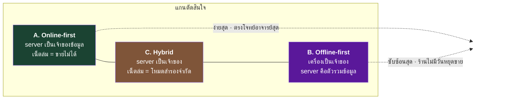
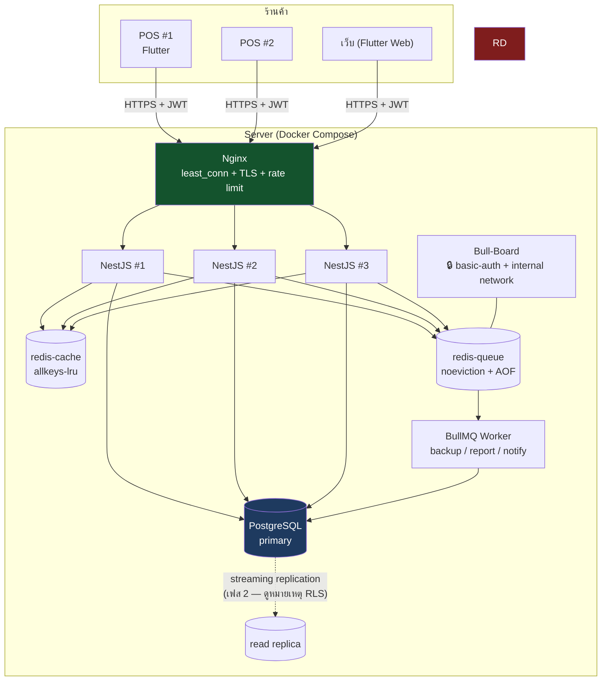
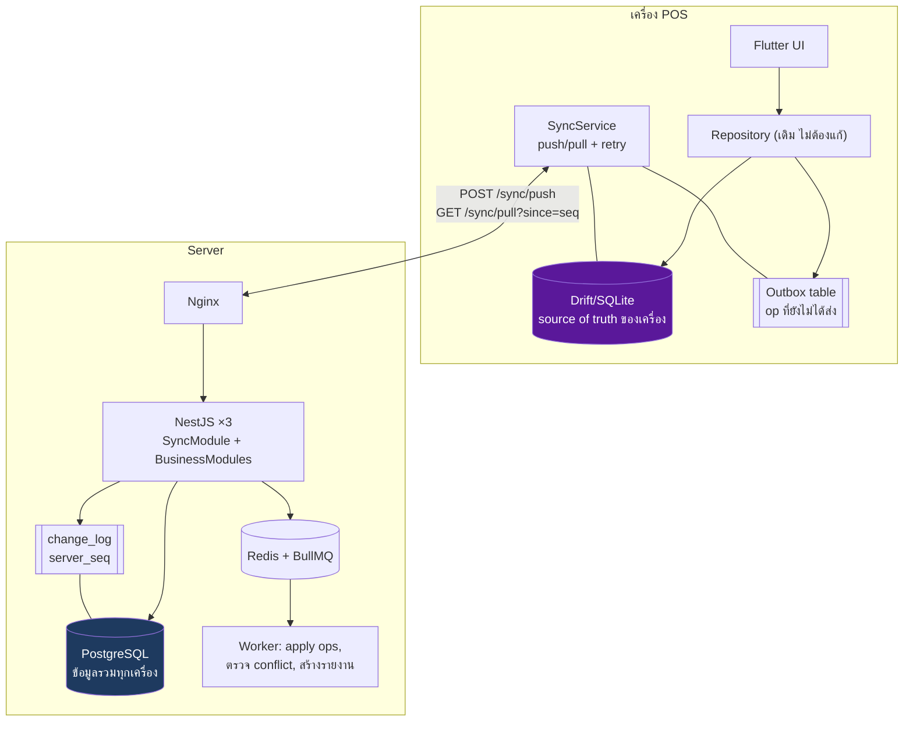
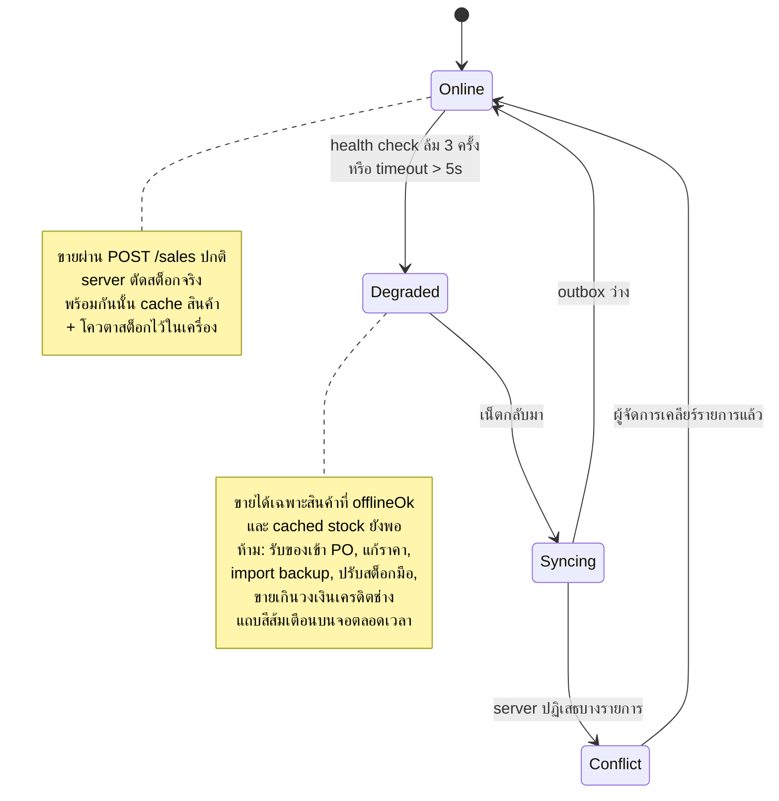
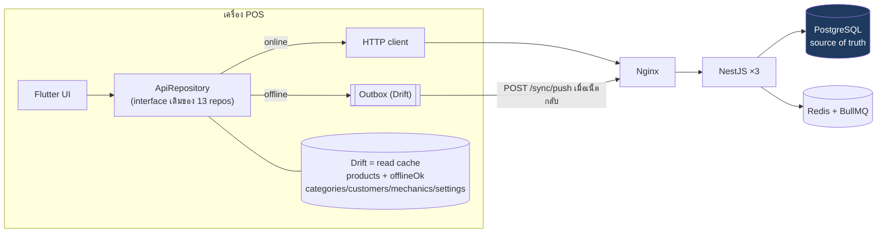
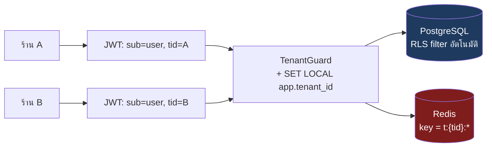
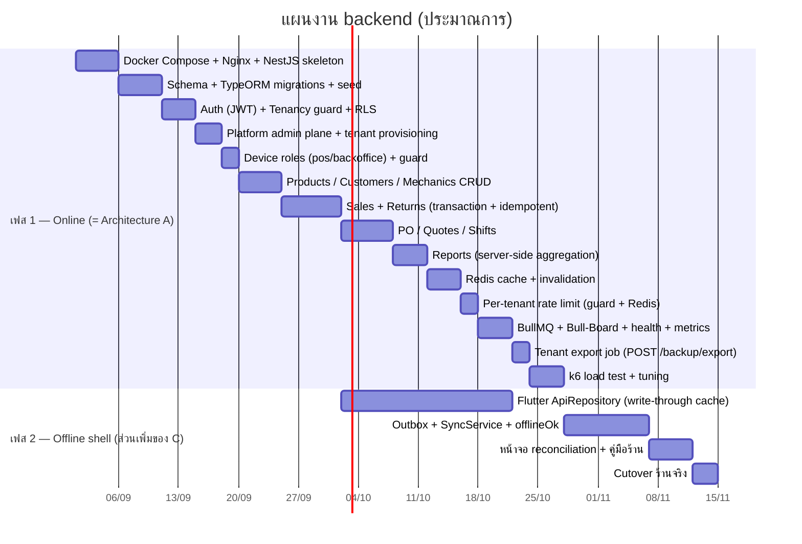

# 03 — Architecture: 3 ทางเลือก พร้อมข้อดี-ข้อเสีย

> ทั้ง 3 แบบอยู่บน **สแตกเดียวกัน** ที่ทีมเรียนมาและอาจารย์กำหนด:
> **Nginx (LB) → NestJS ≥3 instances → PostgreSQL (TypeORM) + Redis (cache) + BullMQ (queue), JWT stateless, Docker Compose**
> ที่ต่างกันคือ **"ข้อมูลตัวจริงอยู่ที่ไหน"** และ **"ตอนเน็ตล่มเกิดอะไรขึ้น"**

---

## 1. แกนหลักที่ทำให้ 3 แบบต่างกัน

แอปนี้ **เกิดมาเป็น offline-first** — ทุกวันนี้ SQLite บนเครื่องคือข้อมูลตัวจริง ร้านขายได้แม้เน็ตล่ม
พอเติม backend เข้าไป ต้องตอบคำถามเดียวให้ได้ก่อน:

> **สต็อกตัวจริง (source of truth) อยู่ที่ server หรือที่เครื่อง?**



ตอบคำถามนี้ก่อน แล้วสถาปัตยกรรมจะเลือกตัวเอง — อย่าเลือกสถาปัตยกรรมก่อนแล้วค่อยหาเหตุผล

---

## 2. Architecture A — Online-first Modular Monolith

**แนวคิด:** Flutter กลายเป็น thin client ยิง REST ตรง ๆ, Drift เหลือแค่ cache สำหรับอ่าน (หรือถอดทิ้งเลย)
ข้อมูลตัวจริงอยู่ที่ PostgreSQL ที่เดียว



> ### 📱 Drift ไม่ได้หายไป — แม้แต่ในแบบ A
> เอกสารเวอร์ชันแรกเขียนกำกวมว่า "Drift เหลือแค่ cache หรือถอดทิ้งเลย" ซึ่งทำให้เข้าใจผิดได้
> **ที่ถูกคือ Drift อยู่ต่อทั้งใน A และ C** ต่างกันแค่บทบาท:
>
> | | ใน **A** | ใน **C** |
> |---|---|---|
> | บทบาท | **read cache อย่างเดียว** ไม่มี write path ไม่มี business logic | read cache + **outbox** |
> | cache อะไร | `products` (+`offlineOk`, `cached_stock`), `categories`, `customers`, `mechanics`, `settings` | ชุดเดียวกันเป๊ะ |
> | **ไม่** cache | sales, returns, PO, quotes, shifts, movements, reports — ยิงสดทุกครั้ง | เหมือนกัน |
> | refresh ยังไง | `?updatedSince=<iso>` ไม่ใช่โหลดใหม่ทั้งก้อน | เหมือนกัน |
>
> **ทำไมต้องมี:** ช่องค้นหาหน้า Checkout ทุกวันนี้ instant เพราะค้นในหน่วยความจำ
> ถ้ายิง server ทุกตัวอักษร UX จะแย่ลงชัดเจน (ดู `02_API_SCREENS.md §3.1`)
>
> ⚠️ **งานที่ต้องทำตั้งแต่ตอนนี้ ไม่ใช่เฟส 2:** `products` มี `updatedAt` แล้ว แต่
> **`customers` / `mechanics` / `settings` ยังไม่มี** และยังไม่มี `deletedAt` (tombstone)
> → เป็น **Drift schema change ที่ต้องรัน `build_runner` บน ASCII path** ทำรวดเดียวตอนนี้เลย
> ไม่งั้นจะไปติดตอนเฟส 2 แล้วต้องมา migrate ซ้ำ

**Module ใน NestJS** (modular monolith — ไม่ใช่ microservices):
```
src/
  auth/         products/     sales/       returns/
  purchasing/   quotes/       customers/   mechanics/
  shifts/       reports/      backup/      tenancy/  (guard + interceptor)
  common/       (filters, interceptors, idempotency, cache, health)
```

### ข้อดี
* **ง่ายที่สุด และตรงกับที่ทีมเพิ่งเรียนมาที่สุด** — เอา pattern จาก Flash Sale assignment มาใช้ได้แทบ 1:1
* **ไม่มีปัญหา conflict เลย** — สต็อกมีที่เดียว ใช้ `UPDATE … WHERE stock >= qty` จบ
* หลายเครื่อง หลายสาขา เห็นข้อมูลตรงกันทันที (real-time จริง)
* Backup/restore/audit/รายงาน ทำที่เดียว
* ทดสอบง่าย: k6 ยิงตรงเข้า API วัดผลได้ตามเกณฑ์อาจารย์เป๊ะ
* **Effort น้อยที่สุด** — ประมาณ 60% ของงานทั้งหมดเทียบกับแบบ B

### ข้อเสีย
* 🔴 **เน็ตล่ม = ขายไม่ได้เลย** — สำหรับร้านอะไหล่ที่เน็ตบ้าน/4G ไม่นิ่ง นี่คือความเสี่ยงทางธุรกิจจริง
  (ปัจจุบันแอปทำงานได้ 100% ตอนออฟไลน์ — เท่ากับ **ถอยหลัง** ในมุมผู้ใช้)
* Server ล่ม/ deploy พลาด = ทุกร้านหยุดพร้อมกัน (blast radius กว้าง)
* Latency ต่อการกดปุ่มขึ้นกับเน็ตร้าน — ตอนลูกค้าต่อคิว 5 คน ความหน่วง 2 วิรู้สึกได้ชัด
* ต้องรื้อ repository layer ของ Flutter เกือบทั้งหมด (13 repos)

### เหมาะเมื่อ
ร้านมีเน็ตนิ่ง / มี 4G สำรอง, ต้องการเห็นข้อมูลข้ามสาขาทันที, ทีมมีเวลาจำกัด

---

## 3. Architecture B — Offline-first + Sync Engine

**แนวคิด:** Drift/SQLite ยังเป็นข้อมูลตัวจริงของเครื่อง — เขียนลงเครื่องก่อนเสมอ ตอบ UI ทันที
แล้วค่อย sync ขึ้น server เบื้องหลัง server ทำหน้าที่ "รวมข้อมูลทุกเครื่อง + เก็บถาวร + ออกรายงาน"



**การไหลของข้อมูล:** ขาย → เขียน SQLite + เขียน outbox ใน transaction เดียว → UI เด้งทันที
→ SyncService ส่ง batch ขึ้น server → server apply + เขียน `change_log` → เครื่องอื่น pull ตาม `server_seq`

### ข้อดี
* 🟢 **ร้านไม่มีวันหยุดขาย** — เน็ตล่ม ไฟดับ router พัง ก็ยังออกบิลได้ (รักษาคุณค่าหลักของแอปปัจจุบัน)
* UI เร็วมาก ทุกอย่างเป็น local read/write (0ms) — พนักงานหน้าร้านรู้สึกต่างชัดเจน
* Repository layer ฝั่ง Flutter **แทบไม่ต้องแก้** — เพิ่มแค่ outbox + SyncService
* Server ล่ม/deploy ไม่กระทบการขายหน้าร้าน
* ประหยัด bandwidth (ส่งเฉพาะ delta)

### ข้อเสีย
* 🔴 **Conflict คือปัญหาที่แก้ให้ถูกใจไม่ได้จริง** — สินค้าเหลือ 1 ชิ้น สองเครื่องขายพร้อมกันตอนออฟไลน์
  server จะปฏิเสธได้ 1 บิล **แต่เงินรับมาแล้ว ใบเสร็จพิมพ์ไปแล้ว ลูกค้าเดินออกจากร้านไปแล้ว**
  → ต้องออกแบบ "รายงานรายการที่ต้องแก้มือ" (reconciliation) + ขั้นตอนงานของร้าน ไม่ใช่แค่โค้ด
* ซับซ้อนที่สุด: outbox, cursor, tombstone (ลบแล้วต้องไม่ฟื้น), clock skew, การ replay ตามลำดับ
* **Debug ยากมาก** — บั๊กมักโผล่เฉพาะตอนออฟไลน์นาน ๆ แล้วกลับมาออนไลน์พร้อมกัน reproduce ยาก
* รายงานข้ามสาขา "เกือบ real-time" เท่านั้น
* Effort สูงสุด (~180% ของ A) และเป็นงานที่ต้องมีคนดูแลยาว

### เหมาะเมื่อ
เน็ตร้านไม่น่าไว้ใจ, ยอมรับ conflict + มีขั้นตอนแก้มือได้, ทีมมีเวลาและคนดูแลระยะยาว

---

## 4. Architecture C — Hybrid: Online-first + โหมดสำรองแบบจำกัด (แนะนำ)

**แนวคิด:** ปกติทำงานแบบ A ทุกอย่าง (server เป็นเจ้าของสต็อก)
แต่เมื่อ **ตรวจพบว่าเน็ตหลุด** จะเข้าสู่ *degraded mode*: ขายต่อได้ภายใต้เงื่อนไขจำกัด
โดยเก็บเป็น **command** ลง outbox แล้วส่งขึ้นเมื่อเน็ตกลับมา

ประเด็นสำคัญคือ **ยอมให้ conflict เกิดได้น้อยที่สุดโดยตั้งใจ** ไม่ใช่ปล่อยฟรีแบบ B:





**กลไก "scarcity rule" — หัวใจของแบบนี้**

server ส่ง flag มากับสินค้าแต่ละตัว:
```
offlineOk = stock >= max(5, 3 × qty เฉลี่ยต่อบิลของสินค้านั้น)
```
* **ออนไลน์:** ขายได้ทุกอย่างตามปกติ server ตัดสต็อกจริง
* **ออฟไลน์:** ขายได้เฉพาะสินค้าที่ `offlineOk == true` **และ** สต็อกที่ cache ไว้ยังพอ
  → ของที่เหลือเยอะ (โอกาสชนแทบเป็นศูนย์) ขายได้ / ของใกล้หมด (ของที่ชนกันจริง) ต้องรอเน็ต

**ทำไมไม่ใช้ "จองโควตาสต็อก" (stock lease)?** — เวอร์ชันแรกของเอกสารนี้เสนอ lease ไว้ แต่ถูกตีตกในการ review
เพราะ 3 เหตุผล (ดู [`04_QA_SCRUTINY.md` Q3](04_QA_SCRUTINY.md#q3--ประเด็นที่เถียงหนักสุด-กลไกจองสต็อก-stock-lease-เอาไงดี)):

1. **มันไม่ได้ทำให้ conflict เป็นศูนย์จริง** — TTL หมดตอนเครื่องยังออฟไลน์อยู่ (ซึ่งคือสถานการณ์ที่ lease
   มีไว้รองรับพอดี) server ก็คืนของเข้า pool แล้วเครื่องอื่นขายซ้ำได้ → oversell แบบ**เงียบกว่าเดิม**
   เพราะการต่ออายุ lease ต้องใช้เน็ต ซึ่งเป็นสิ่งเดียวที่ไม่มี
2. **กฎ "จองเฉพาะของขายดี" กลับหัวกับความเสี่ยง** — ซีลยางที่มีสต็อก 200 ชิ้น (ความเสี่ยง oversell = 0)
   กลับ**ขายไม่ได้**เพราะไม่ได้จองไว้ ส่วนของขายดีที่เสี่ยงจริงกลับจองไว้
3. **มันทำให้ `stock` มีสองความหมาย** — พอมี `reserved` ปุ๊บ `CHECK (stock >= 0)`,
   index `stock <= min_stock` (แถบเตือนของใกล้หมด), `movements.stock_after`
   และ checklist migration `SUM(products.stock)` จะตีความคนละแบบทันที

> ✅ **scarcity rule ให้ผลทางธุรกิจเกือบเท่ากัน โดยไม่เพิ่ม state ฝั่ง server แม้แต่ตัวเดียว**
> ไม่มีตารางใหม่ ไม่มี endpoint ใหม่ ไม่มี TTL ไม่มีของหายจากชั้น
> และอธิบายให้พนักงานเข้าใจได้ใน 1 ประโยค: *"ป้ายเทา = เน็ตล่มขายไม่ได้"*
> เทียบกับ lease ที่ต้องอธิบายว่า *"ทำไมของมี 10 แต่ขายได้แค่ 3"*

**สิ่งที่ยังต้องมีอยู่ดี (อย่าหลอกตัวเอง):** scarcity ลดโอกาสชน **ไม่ใช่ทำให้เป็นศูนย์**
ตอน push ขึ้น server ยังต้องมี `UPDATE … WHERE stock >= qty` เป็นผู้ตัดสินสุดท้าย
และต้องมี `sales.sync_status ('local' | 'confirmed' | 'rejected')` + **คิวให้เจ้าของร้านเคลียร์บิล
ที่ถูกปฏิเสธหลังพิมพ์ใบเสร็จไปแล้ว** — ซ่อนไว้ใน log ไม่ได้

### ข้อดี
* 🟢 ได้ **ทั้งความเรียบง่ายของ A** (สต็อกมีเจ้าของชัดเจน) **และความอึดของ B** (เน็ตล่มยังขายได้)
* **ลดโอกาส conflict ลงมากโดยไม่เพิ่ม state ฝั่ง server เลย** — `offlineOk` เป็นแค่ boolean ที่ derive ได้
* ทำเป็นเฟสได้: **เฟส 1 = A ล้วน** (ส่งอาจารย์ได้แล้ว) → **เฟส 2 ค่อยเติม outbox + `offlineOk`**
* ขอบเขตของ "สิ่งที่ทำตอนออฟไลน์ได้" ชัดเจน → test ได้ครบจริง (ต่างจาก B ที่ทำได้ทุกอย่าง = test ไม่หมด)
* ยัง demo ให้อาจารย์เห็นครบทุก requirement (LB, cache, queue, JWT, k6) เพราะ path หลักคือ A

### ข้อเสีย
* 🟡 มี **2 code path** (online / degraded) → ต้องเทสต์ทั้งคู่ และมีโอกาสพฤติกรรมสองทางไม่ตรงกัน
* ยัง **ต้องมีหน้าจอ reconciliation** สำหรับบิลที่ server ปฏิเสธ — scarcity ลดความถี่ ไม่ได้ลบทิ้ง
* พนักงานจะเจอ "ของมีอยู่แต่ขายตอนนี้ไม่ได้" ในสินค้าใกล้หมด ต้องอธิบายให้เข้าใจก่อนใช้จริง
* วงเงินเครดิตช่างเป็นตัวเลขที่ enforce ตอนออฟไลน์ไม่ได้ (สองเครื่องแก้พร้อมกันได้)
  → ต้องยอมรับว่าเป็น **warning + บันทึก override** ไม่ใช่ hard block (ซึ่งตรงกับพฤติกรรมเดิมอยู่แล้ว)
* Effort ~150–160% ของ A (ตัวเลขนี้แก้แล้ว — ดู [§6](#6-ตารางเปรียบเทียบ-3-architecture))

### เหมาะเมื่อ
อยากได้ระบบที่ใช้จริงในร้านได้ยาว ๆ และส่งอาจารย์ได้ด้วย — **ซึ่งคือสถานการณ์ของโปรเจกต์นี้**

---

## 5. Multi-tenant — 3 ทางเลือก

เลือกแยกจาก architecture ข้างบน (จับคู่กันได้ทุกแบบ)

> ### 📌 ยืนยันโมเดล (2026-09-03): **หลายร้าน คนละเจ้าของ ไม่ใช่แฟรนไชส์**
> เจ้าของโปรเจกต์ยืนยันว่า tenant แต่ละร้าน = **ธุรกิจอิสระ คนละเจ้าของกัน** (SaaS ขายให้ร้านอะไหล่
> หลายร้านที่ไม่รู้จักกัน) **ไม่ใช่** เชนเดียวเจ้าของเดียวเปิดหลายสาขา ข้อนี้เปลี่ยน 3 จุดในเอกสารเดิม:
>
> 1. **ไม่มี "รายงานข้ามร้าน" เป็นฟีเจอร์ทางธุรกิจอีกต่อไป** — แถวตารางด้านล่างที่เคย
>    เขียนไว้ว่าเพื่อ "เจ้าของแฟรนไชส์" นั้น **ตกไป** เพราะไม่มีเจ้าของคนเดียวที่ควรเห็นร้านอื่น
>    endpoint ข้ามร้านที่เหลืออยู่ (ดูกับดักที่ 1 ด้านล่าง) มีไว้เพื่อ **platform ops ของทีมเราเอง**
>    (billing / support / สถิติรวมของแพลตฟอร์ม) เท่านั้น — ไม่มี role ของร้านไหนเรียกได้เลย แม้แต่ `owner`
> 2. **`users.role = 'owner'` ผูกกับ `tenant_id` เดียวเท่านั้น** — ไม่มี user คนไหน sub อยู่ได้
>    มากกว่า 1 tenant (คนละเจ้าของกันจริง ๆ ไม่มีเหตุผลทางธุรกิจให้ user ข้าม tenant)
>    ต่างจากแฟรนไชส์ที่เจ้าของอาจอยากมี 1 login ดูได้ทุกสาขา
> 3. **provision tenant ใหม่ — ปิดแล้ว (ADR-0001):** platform admin ของทีมเราเป็นคนสร้างร้านใหม่ให้
>    ผ่าน `POST /platform/tenants` (ทรานแซกชันเดียว ได้ tenant+owner+settings+seed ครบ) —
>    **ยังไม่ทำ self-service signup ในเฟส 1** ดู [`adr/0001-tenant-provisioning.md`](adr/0001-tenant-provisioning.md)
>
> **จำนวนเครื่องต่อร้าน — ไม่ใช่ "1 ร้าน = 1 เครื่อง" แต่แบ่งตาม *บทบาท* (ADR-0004):**
> ร้านมีเครื่อง **`role='pos'` ได้ไม่เกิน 1 เครื่อง** (เครื่องที่แตะลิ้นชักเก็บเงิน ออกเลขใบเสร็จ
> และเป็นเครื่องเดียวที่เขียนตอนออฟไลน์ได้ในเฟส 2) กับเครื่อง **`role='backoffice'` กี่เครื่องก็ได้**
> (สต็อก/รับของเข้า/ใบเสนอราคา/รายงาน — ต้องออนไลน์เสมอ) บังคับด้วย partial unique index
> `one_pos_per_tenant` ที่ระดับฐานข้อมูล ดู [`adr/0004-device-roles.md`](adr/0004-device-roles.md)

| | **T1. Shared DB + Shared Schema**<br/>(`tenant_id` + RLS) | **T2. Schema-per-tenant**<br/>(`tenant_abc.products`) | **T3. Database-per-tenant** |
|---|---|---|---|
| **แยกข้อมูล** | ระดับแถว (พึ่ง RLS + composite FK) | ระดับ schema | ระดับ DB (แข็งแรงสุด) |
| **ต้นทุน/ร้าน** | ต่ำมาก (ร้านที่ 100 ≈ ฟรี) | กลาง | สูง (connection pool ต่อ DB) |
| **Migration** | รันครั้งเดียว จบทุกร้าน | ต้องวนทุก schema (100 ร้าน = 100 รอบ) | วนทุก DB + จัดการเวอร์ชันเหลื่อม |
| **ความเสี่ยงข้อมูลรั่ว** | 🔴 สูงสุด — ลืม `WHERE tenant_id` ครั้งเดียวก็รั่ว | 🟡 กลาง | 🟢 ต่ำสุด |
| **Backup/restore ทีละร้าน** | ยาก (ต้อง filter) — **export รายร้านทำได้** (ADR-0005) แต่ **ไม่รับปาก restore รายร้าน** | กลาง | ง่ายสุด (`pg_dump` ทั้ง DB) |
| **Noisy neighbor** | ร้านใหญ่ทำร้านเล็กช้าได้ — กันด้วย **rate limit ต่อ tenant ที่ guard+Redis** (Nginx ทำไม่ได้เพราะอ่าน JWT ไม่ได้, ADR-0006) | เหมือนกัน | แยกขาด |
| **รายงานรวม-ระดับแพลตฟอร์ม (ทีมเราเอง ไม่ใช่ร้านไหน)** | ง่ายสุด (query เดียว) | ต้อง UNION | ยากสุด |
| **เหมาะกับ** | SaaS หลายร้าน, ร้านเล็ก-กลาง | 10–100 ร้านที่ต้องการแยกชัด | ลูกค้าองค์กรที่ขอ DB แยก |

**แนะนำ: T1** — เพราะโจทย์คือ "ร้านอะไหล่หลายร้าน" ซึ่งเป็น SaaS ร้านเล็ก-กลางจำนวนมาก
และเป็นแบบเดียวที่ทำรายงานรวมทุกร้านได้ง่าย

**แต่ต้องจ่ายค่าความปลอดภัยให้ครบ 6 ข้อ** (ไม่ทำ = ข้อมูลร้านหนึ่งโผล่ในอีกร้าน ซึ่งเป็นหายนะทางธุรกิจ):
1. `tenant_id` มาจาก **JWT เท่านั้น** ห้ามมาจาก request
2. เปิด **RLS + FORCE RLS** ทุกตาราง, app ใช้ role ที่ไม่ใช่ owner
3. **Composite FK พา `tenant_id` ไปด้วย** ทุกความสัมพันธ์
4. **Redis key ขึ้นต้นด้วย `t:{tid}:` เสมอ** — cache รั่วข้ามร้านคือช่องโหว่ที่คนลืมบ่อยที่สุด
5. **เขียน integration test ที่พยายามอ่านข้ามร้านแล้วต้องได้ 0 แถว** — รันทุก PR
6. **1 user = 1 tenant เท่านั้น ห้ามมี user ที่มีสิทธิ์มากกว่า 1 ร้าน** — JWT ออกมาผูก `tid`
   เดียวตลอดชีพ token ถ้าอนาคตมีคนต้องดูหลายร้าน (เช่น พนักงานบัญชีรับจ้างหลายร้าน) ให้ทำเป็นบัญชี
   แยกต่อร้าน + สลับ login ไม่ใช่ token เดียวข้ามร้าน — กติกาข้อนี้จริง 100% **สำหรับตาราง `users`**
   เท่านั้น ทีม platform ops ที่ต้องเห็นทุกร้าน (กับดักที่ 1 ด้านล่าง) **ไม่ได้อยู่ในตาราง `users`**
   ไปตามกติกานี้ แต่แยกไปอยู่ตาราง `platform_admins` ต่างหาก (ADR-0002) — ดูรายละเอียดที่กับดักที่ 1

> ### ⚠️ 3 กับดักของ T1 ที่จะเจอตอน implement (review จับได้)
> **1. "รายงานข้ามร้าน query เดียวจบ" ต้องใช้ role ที่ `BYPASSRLS`**
> ซึ่งกลายเป็น **ช่องรั่วที่ใหญ่ที่สุดในระบบ ที่เราสร้างขึ้นมาเอง** — ยิ่งสำคัญกว่าเดิมเพราะร้านแต่ละ
> tenant เป็น **คนละเจ้าของกันจริง** (ไม่ใช่แฟรนไชส์เดียวกัน) ข้อมูลรั่วข้ามร้าน = รั่วให้คู่แข่งของ
> ลูกค้าอีกราย ไม่ใช่แค่รั่วภายในบริษัทเดียวกัน
> → ต้องเป็น endpoint แยกต่างหาก **สำหรับทีม platform ops เท่านั้น ไม่มี role `owner`/`manager`
> ของร้านไหนเรียกได้** + เขียน `audit_log` ทุกครั้งที่เรียก ไม่ใช่ path ปกติของแอป
>
> **เคาะแบบแผนรองรับแล้ว (ADR-0002)** — ไม่ใช่แค่คำเตือนลอย ๆ อีกต่อไป: platform ops อยู่ใน
> ตาราง `platform_admins` แยกขาดจาก `users` (ไม่มี `tenant_id`), login คนละ endpoint
> (`POST /platform/auth/token`), JWT คนละ `aud` (`"platform"` vs `"tenant"`), connection ที่
> `BYPASSRLS` เป็น **DataSource คนละตัว** กับ traffic ปกติ, และ Nginx กัน `/platform/*`
> ไม่ให้ออกอินเทอร์เน็ต (internal network / allowlist IP) เหมือนที่สั่งไว้กับ Bull-Board
>
> **2. บังคับทุก request อยู่ใน transaction (เพื่อให้ `SET LOCAL` ปลอดภัย) = read replica ไม่ได้ใช้เลย**
> TypeORM transaction วิ่งเข้า master เสมอ → replica ในไดอะแกรมจะไม่ได้รับ traffic
> **ทางเลือกที่แนะนำ: เฟส 1 ยังไม่ต้องมี replica** (ร้านเดียวไม่ต้องใช้) แล้วค่อยแก้ตอนโหลดจริงเริ่มขึ้น
>
> **3. BullMQ worker ทำ tenant รั่วได้ง่ายกว่าที่คิด** — ถ้า job throw นอก transaction
> ค่า `app.tenant_id` จะค้างบน connection ใน pool แล้ว job ของร้านถัดไปสืบทอด tenant ผิด
> → **บังคับให้ทุก job body ห่อ transaction เสมอ** ไม่มีข้อยกเว้น



---

## 6. ตารางเปรียบเทียบ 3 architecture

| เกณฑ์ | A. Online-first | B. Offline-first | C. Hybrid |
|---|---|---|---|
| เน็ตล่มแล้วขายได้ไหม | ❌ ไม่ได้ | ✅ ได้ทุกอย่าง | ✅ ได้แบบจำกัด (ตามโควตา) |
| ความถูกต้องของสต็อก | 🟢 แม่นเสมอ | 🔴 อาจขายเกิน ต้องตามแก้ | 🟢 แม่น (โควตากันไว้) |
| ความซับซ้อน | 🟢 ต่ำ | 🔴 สูง | 🟡 กลาง |
| แรงงาน (เทียบ A = 100%) | 100% | ~140–150% | ~150–160% |
| ต้องแก้ Flutter มากแค่ไหน | **รื้อ 13 repos** | ไม่ต้องรื้อ — เพิ่ม outbox + sync | รื้อ 13 repos + เพิ่ม outbox (ทำทีหลังได้) |
| ข้อมูลข้ามสาขา real-time | ✅ ทันที | 🟡 หน่วง | ✅ ทันที (ตอนออนไลน์) |
| Debug ยากไหม | 🟢 ง่าย | 🔴 ยากมาก | 🟡 กลาง |
| ตรงกับ requirement อาจารย์ | ✅ ตรงเป๊ะ | 🟡 sync ไม่อยู่ในคอร์ส | ✅ path หลักตรง |
| เสี่ยงต่อธุรกิจร้าน | 🔴 หยุดขายเมื่อเน็ตล่ม | 🟡 เงินอาจไม่ตรง | 🟢 ต่ำสุด |
| ทำเป็นเฟสได้ไหม | – | ❌ ต้องคิดครบตั้งแต่แรก | ✅ A ก่อน แล้วเติมทีหลัง |

> ### 📌 หมายเหตุเรื่องตัวเลข effort (แก้แล้วหลัง review)
> เวอร์ชันแรกเขียน 100 / 180 / 125% ซึ่ง **คำนวณผิดทิศ** เพราะ:
> * **A ก็ต้องรื้อ 13 repos เหมือนกัน** — ไม่ใช่ต้นทุนเฉพาะของ C
> * **B ไม่ต้องรื้อ repos เลย** (เขียนลง Drift เหมือนเดิม เพิ่มแค่ outbox + SyncService) → B ถูกกว่าที่คิด
> * **C มีต้นทุนที่ไม่ได้นับ** — outbox + reconciliation + เทสต์ 2 code path × 11 หน้าจอ
>
> ตัวเลขพวกนี้ยังเป็นการประมาณแบบหยาบ **ก่อนเริ่มจริงต้องแตกเป็น man-day ต่อ task + บวก buffer 30%**
> และระบุว่าสมาชิก 3 คนทำอะไรขนานกันได้บ้าง (Gantt ด้านล่างเรียงต่อกันหมด ซึ่งไม่สมจริง)

---

## 7. สรุป — แนะนำอะไร

> ### 🎯 เลือก **Architecture C (Hybrid)** + **T1 (shared schema + RLS)** โดยแบ่งทำ 2 เฟส

เหตุผล 4 ข้อ:
1. **เฟส 1 ของ C คือ A เป๊ะ ๆ** → ส่งอาจารย์ได้ตรงทุก requirement โดยไม่ต้องรอ sync engine
2. ไม่ทำให้ผู้ใช้ "ถอยหลัง" — ร้านที่วันนี้ขายได้ตอนเน็ตล่ม จะยังขายได้
3. **หลีกเลี่ยงกับดักที่แพงที่สุดของ B** คือ conflict ของสต็อก โดยใช้โควตาแทนการมาแก้ทีหลัง
4. T1 เป็นแบบเดียวที่ตอบโจทย์ "หลายร้าน" ได้ในต้นทุนที่นักศึกษาทำไหว และทำรายงานรวมได้

**ถ้าเวลาไม่พอจริง ๆ:** ทำแค่ **A + T1** ให้เสร็จสมบูรณ์ ดีกว่าทำ B ครึ่ง ๆ กลาง ๆ
sync engine ที่ทำไม่จบคือแหล่งของ "เงินไม่ตรง" ที่หาสาเหตุไม่เจอ

> ### 🔑 ข้อสรุปที่สำคัญที่สุดของทั้งเอกสาร: **เฟส 1 ไม่ต้อง cutover ร้าน**
> คำถามที่ค้างอยู่คือ *"เน็ตล่มแล้วขายไม่ได้ ใครรับผิดชอบ?"* — คำตอบคือ **ไม่ต้องมีใครรับ ถ้าไม่ cutover**
>
> **conflict เป็นไปไม่ได้ ตราบใดที่มี offline writer เดียวต่อร้าน — ไม่ใช่เพราะ "ร้านมีเครื่องเดียว"**
> (ADR-0004) เอกสารเวอร์ชันก่อนอ้างว่าเพราะ "ร้านมีเครื่องเดียว" ซึ่งผิด 2 ชั้น:
>
> 1. **ไม่มีอะไรบังคับ** ให้มีเครื่องเดียว แอปเป็น Flutter Web เปิดแท็บที่สองก็พังแล้ว — มันเป็นแค่
>    ข้อเท็จจริงวันนี้ที่ผู้ใช้ทำให้พังได้ตลอด ไม่ใช่ "ทางโครงสร้าง"
> 2. **ไม่จำเป็นต้องใช้ข้ออ้างนี้เลย** — ในโหมดออนไลน์ server เป็นเจ้าของสต็อก ตัดในทรานแซกชัน
>    พร้อม row lock อยู่แล้ว และเกณฑ์ปิดเฟส 1 ข้อ *"ยิง POST /sales พร้อมกัน 200 ครั้งบนสินค้า
>    50 ชิ้น → ได้ 50 บิลพอดี"* **คือการพิสูจน์ว่าหลายเครื่องพร้อมกันปลอดภัย**
>
> สิ่งที่บังคับ "เครื่องเดียว" จริง ๆ คือ **partial unique index `one_pos_per_tenant`** — ร้านมีเครื่อง
> `role='pos'` ที่ยังไม่ถูก retire ได้ไม่เกิน 1 เครื่อง และเหตุผลก็ไม่ใช่เรื่องสต็อกด้วย แต่เป็นของที่มีอยู่
> **ชิ้นเดียวทางกายภาพ**:
>
> 1. **ลิ้นชักเก็บเงินมีใบเดียว** — `shifts`/`drawer_entries`/ใบปิดกะทั้งชุดตั้งอยู่บนสมมติฐานนี้
>    สองเครื่องรับเงินสด = ปิดกะนับเงินไม่ตรงโดยไม่มีบั๊กสักตัว
> 2. **เลขที่ใบเสร็จควรเป็นชุดเดียว** — สองเครื่องขาย = สองชุดเลข = บัญชีไล่สองเล่ม
>
> เหตุผลสองข้อนี้ **ไม่หายไปแม้ระบบจะออนไลน์ 100%** ต่างจากเหตุผลเรื่องสต็อกที่หายไปทันทีที่มี
> server — จึงเป็นฐานที่มั่นคงกว่าให้ยึด และ **ไม่มีเหตุผลต้องรีบย้ายร้านขึ้น server**
>
> ผลพลอยได้: ADR-0004 ตอบคำถาม "ใครเขียน offline ได้" (เฟส 2) ได้ทันที = **เครื่องที่ `role='pos'`**
> ซึ่งเป็นแฟล็กนิ่ง ๆ ตั้งครั้งเดียวตอน provision **ไม่เพิ่ม state ฝั่ง server เลย** ไม่ต้องมี lease
> ที่มี TTL — ตรงกับเจตนาเดิมตอนที่ทีมตัดสินใจทิ้งกลไก stock lease (ดู [§4](#4-architecture-c--hybrid-online-first--โหมดสำรองแบบจำกัด-แนะนำ))
> ดู [`adr/0004-device-roles.md`](adr/0004-device-roles.md)
>
> | | ทำอะไร |
> |---|---|
> | **เฟส 1** | ส่งอาจารย์บน **tenant สาธิต** ที่ import ข้อมูลจริงเข้าไป (พิสูจน์ integrity ได้ครบ)<br/>**เครื่องหน้าร้านยังรัน Drift build เดิมต่อไปตามปกติ** |
> | **เฟส 2** | เติม offline shell (outbox + `offlineOk`) ให้ครบก่อน **แล้วค่อย cutover** |
>
> ถ้าทีมยืนยันจะ cutover ตั้งแต่เฟส 1 → **เจ้าของร้านต้องเป็นคนตัดสินใจเอง**
> และต้องเตรียม 4G สำรอง + ขั้นตอน "เน็ตล่มให้เขียนบิลมือ" ไว้ก่อน

---

## 8. แผนลงมือ



> ⚠️ **Gantt นี้ใช้ดูลำดับพึ่งพาเท่านั้น ไม่ใช่ดูวันที่** — เจ้าของโปรเจกต์ตัดสินใจ 2026-09-04
> ว่า**ไม่ผูกกับกำหนดส่ง** ใช้เป็น checklist เรียงลำดับแทน (และ**ไม่ตัด scope** — ทำครบถึง cutover)
>
> งาน `q1` **ไม่ใช่การแทนที่ Drift** — ดู [ADR-0010](adr/0010-client-write-through-cache.md):
> `ApiRepository` เป็น implementation ใหม่ของ interface เดิม ยิง server แล้ว**เขียนผลลง Drift**
> ซึ่ง Architecture C §4 ต้องการอยู่แล้ว (Online ต้อง cache สินค้า + โควตาสต็อกไว้ในเครื่อง)
> เดิมประเมิน 10 วัน ต่ำเกินจริงชัดเจน — แก้เป็น 20 วันแล้ว และควรบวก buffer อีก 30%
>
> **งาน `p3b`/`p3c`/`p8b`/`p9b` เป็นของใหม่ที่ ADR ทำให้เกิดขึ้น** ไม่มีในแผนเดิม:
> `p3b` platform admin plane + tenant provisioning ([ADR-0001](adr/0001-tenant-provisioning.md),
> [ADR-0002](adr/0002-platform-admin-plane.md)), `p3c` device roles + guard
> ([ADR-0004](adr/0004-device-roles.md)), `p8b` per-tenant rate limit
> ([ADR-0006](adr/0006-per-tenant-rate-limit.md)), `p9b` tenant export job
> ([ADR-0005](adr/0005-data-portability.md))
>
> ~~**งานที่ต้องแทรกก่อนทุกอย่าง:** เพิ่ม `updatedAt` + `deletedAt` ให้ `customers` / `mechanics` /
> `settings` ใน Drift~~ — **ทำแล้ว 2026-09-04** (Drift schema v2, ADR-0008) งานที่เหลือฝั่ง Drift คือ
> **schema v3** ก่อน `q1` เสร็จ: `Sales.shiftId`, `Shifts.id → TEXT`, `Products.offlineOk` (ADR-0010 ข้อ 2)
>
> **งาน `p3c` ต้องรวม device enrolment** (`POST /devices`, `POST /auth/device`, `/retire`,
> `deviceToken` ใน `/auth/token`) ตาม ADR-0004 "การผูกเครื่อง" — ไม่ใช่แค่ guard ตรวจ `drole`
> และ **`p5` ต้องมีตัวออกเลขเอกสารฝั่ง server** (ADR-0007: เฟส 1 server ออกทุกเลข)

**เกณฑ์ปิดเฟส 1 (definition of done):**
- [ ] `docker compose up` ครั้งเดียวได้ครบ Nginx + NestJS×3 + Postgres + Redis + worker + Bull-Board
- [ ] k6 ผ่านเกณฑ์ใน [`02_API_SCREENS.md §9`](02_API_SCREENS.md#9-เป้าหมาย-load-test-k6--ผูกกับเกณฑ์ในคอร์ส)
- [ ] ยิง `POST /sales` พร้อมกัน 200 ครั้งบนสินค้าที่มี 50 ชิ้น → ขายได้ 50 บิลพอดี **สต็อกเหลือ 0 ไม่ติดลบ**
- [ ] Integration test "อ่านข้ามร้าน" ได้ 0 แถวทุกเคส
- [ ] `/health/live` ไม่แตะ DB, `/health/ready` แตะ DB+Redis (แยกกันจริง)
- [ ] import snapshot ของร้านจริงเข้ามาแล้ว **ผ่าน checklist 6 ข้อ** ใน `01_DATABASE.md §9` ทุกข้อ
- [ ] `redis-cache` กับ `redis-queue` แยกกันจริง และ Bull-Board มี auth
- [ ] ยิง `POST /sales` ที่บิลมีสินค้าไม่พอ 3 บรรทัด → ได้ข้อความไทย **ครบทั้ง 3 บรรทัดในครั้งเดียว**
- [ ] ลบลูกค้าที่มีบิลแล้ว → ได้ `200` (soft delete) ไม่ใช่ `500`
- [ ] สร้าง tenant ใหม่ด้วย `POST /platform/tenants` แล้วล็อกอิน+ขายได้จริงโดยไม่ต้องแตะ psql (ADR-0001)
- [ ] เครื่อง `backoffice` ยิง `POST /sales` ต้องได้ `403` (`DEVICE_ROLE_FORBIDDEN`) (ADR-0004)
- [ ] ระงับร้าน (`status='suspended'`) แล้ว **คำขอถัดไปต้องถูกปฏิเสธทันที** ไม่ต้องรอ token หมดอายุ (ADR-0003)
- [ ] ระงับร้านแล้ว **job ที่ค้างในคิว BullMQ ของร้านนั้นต้องไม่ถูกรัน** (ADR-0003 — DoD เดิมทดสอบแค่ request path)
- [ ] ดับ `redis-cache` แล้วร้านที่ `suspended` **ยังถูกปฏิเสธ** และร้านปกติ**ยังใช้งานได้** (ADR-0003 ข้อ 5: status ตกไปอ่าน Postgres ไม่ fail-open/closed)
- [ ] เครื่อง `pos` ยิง `POST /sales` พร้อมกับเครื่อง `backoffice` ยิง `/purchase-orders/:id/receive` และ `/adjust-stock` **บนสินค้าตัวเดียวกัน** 200 รอบ → `stock` สุดท้ายตรงกับผลบวก/ลบทั้งหมด ไม่มี lost update (ADR-0004 — นี่คือการแข่งกันของหลายเครื่องที่มีอยู่จริง ไม่ใช่ `POST /sales` ×200)
- [ ] `owner` กด `POST /devices/{id}/retire` เครื่อง `pos` ที่มีกะเปิดอยู่ → กะถูกปิดใน transaction เดียวกัน, token เดิมของเครื่องนั้น refresh ไม่ผ่านภายใน 15 นาที, enrol เครื่องใหม่ได้ `device_no` ใหม่ และขายได้ (ADR-0004/0009)
- [ ] เครื่อง `backoffice` ที่ล็อกอินโดยไม่มี `deviceToken` เรียก `GET /products` ได้ แต่ `POST /sales` ได้ `403` (ADR-0004 "การผูกเครื่อง")

**สิ่งที่ห้ามลืมตอน deploy** (สรุปจากคอร์ส Backend01/06 + ที่ review จับเพิ่ม):
* 🔴 **แยก Redis เป็น 2 ตัว: `redis-cache` (`allkeys-lru`) กับ `redis-queue` (`noeviction` + AOF)**
  ถ้าใช้ตัวเดียว policy `allkeys-lru` จะ **กินงานในคิวทิ้ง** — งานขายหาย ไม่มี error
  แก้ในไฟล์ compose แค่ไม่กี่บรรทัด แต่ถ้าไม่ทำจะเป็นบั๊กที่หาไม่เจอ
* 🔴 **Bull-Board ต้องมี auth** — payload ของ job มี `tenantId` + ข้อมูลลูกค้า
  mount ไว้เปล่า ๆ ที่ `/admin/queues` = ข้อมูลรั่วข้ามร้าน + ผิด PDPA
  ให้ใส่ basic-auth และวางไว้บน internal network ไม่ให้ออกอินเทอร์เน็ต
* 🔴 **`/platform/*` ต้องกันไม่ให้ออกอินเทอร์เน็ต** (internal network / allowlist IP) — แนวเดียวกับ
  Bull-Board ด้านบน endpoint กลุ่มนี้เห็น/แก้ได้ทุกร้าน พลาดครั้งเดียว = รั่วทั้งแพลตฟอร์ม (ADR-0002)
* 🔴 **JWT TTL + revoke — เคาะแล้ว ([ADR-0009](adr/0009-jwt-session-lifetime.md))** — access 15 นาที,
  refresh หมดอายุ 04:00 ตาม `tenants.timezone`, `/auth/refresh` เช็ค `users.is_active` +
  `tenants.status` + `devices.retired_at` จาก DB ทุกครั้ง **ไม่มี refresh rotation ไม่มี denylist ใน Redis**
  (ข้อเสนอเดิม "rotation เก็บใน Redis" ถูก ADR-0009 ตัดทิ้งโดยตั้งใจ — ไล่พนักงานออกแล้ว token
  ตายภายใน ≤15 นาทีโดยไม่ต้องมี state เพิ่ม)
* `instances × (1 + replicas) × poolSize ≤ 80% ของ max_connections` — สาเหตุอันดับ 1 ของ "too many connections"
* Nginx ฟรีมีแค่ passive health check (`max_fails`/`fail_timeout`) — **Docker `HEALTHCHECK` ไม่ได้ทำให้ Nginx หยุดส่ง traffic** (สไลด์ในคอร์สผิดข้อนี้)
* graceful shutdown ก่อน SIGTERM ไม่งั้น deploy ทีเจอ 502 ทุกครั้ง
* ห้าม `synchronize: true` ใน production, ใช้ migration เท่านั้น
* ห้าม log เลขบัตร/เบอร์โทร/ชื่อลูกค้าเต็ม (PDPA)

**เครื่องที่รันจริง — ยังไม่เคาะ (2026-09-04):**
* เฟส 1 รันบน **VM ของคณะ (Docker)** — ใช้สำหรับ**สาธิต/ส่งงานเท่านั้น**
* โควตาที่คณะให้ (ดู 2026-09-04): **4 vCPU · 6 GB RAM · disk 50 GB (จัดสรรแล้ว 30 GB)** — ใช้โควตา
  CPU/RAM เต็มแล้ว ขยายไม่ได้ · สแตกเฟส 1 ทั้งชุดกินราว 3–3.5 GB จึงพอ แต่ให้ใส่ `mem_limit`
  ต่อ container ใน compose กัน NestJS รั่วแล้วไป OOM Postgres · **ห้ามรัน k6 บน VM นี้** (แย่ง CPU
  กับ server ผลเชื่อไม่ได้) → k6 ต้องยิงจากเครื่องอื่น = ต้องมี inbound (ข้อถัดไป)
* 🔴 **ต้องเลือก production host ก่อนงาน `q4` (cutover)** — VM คณะไม่ใช่ที่ที่ POS ของร้าน
  จะไปฝากชีวิตไว้ได้ (หมดสถานะนักศึกษา = เครื่องหาย, และมักไม่มี inbound จากนอกเครือข่ายคณะ)
* ตรวจตั้งแต่สัปดาห์แรก: **VM คณะรับ inbound จากนอกมหาวิทยาลัยได้ไหม** ถ้าไม่ได้ k6 จาก
  เครื่องตัวเองก็ยิงไม่ถึง

---

**ถัดไป:** [`04_QA_SCRUTINY.md`](04_QA_SCRUTINY.md) — 3 agent ถกเถียง design นี้กันว่าตรงไหนยังไม่แน่น
