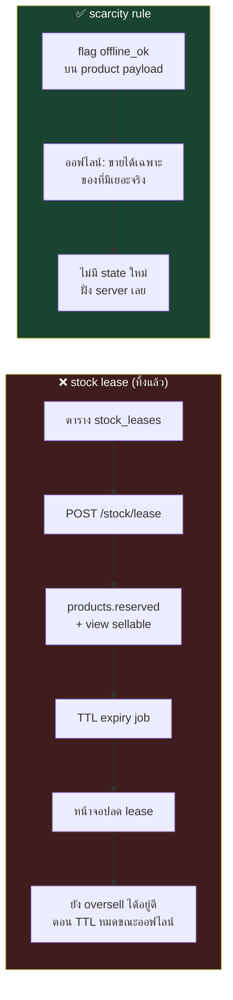
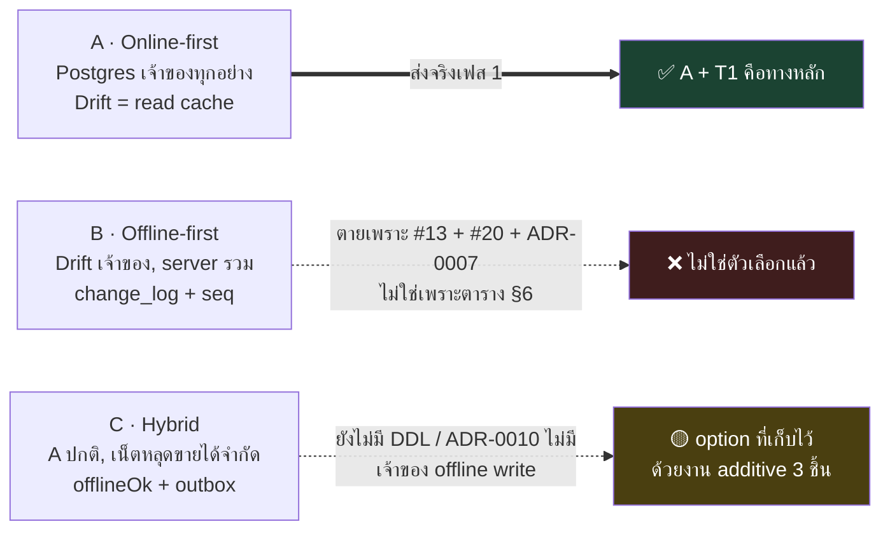
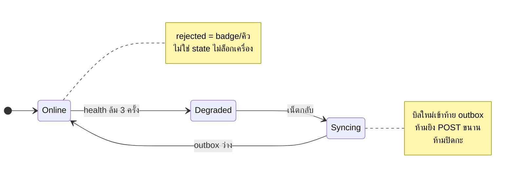

# 04 — บันทึกการถกเถียง (Design Scrutiny Q&A)

เอกสาร `01`–`03` ถูกส่งให้ **agent 3 ตัว** review คนละมุม แต่ละตัวไปอ่านโค้ดจริงมาเทียบ
แล้ว **ยิงคำถามใส่กันเอง 1 รอบ** ก่อนสรุป หน้านี้คือบันทึกว่าเถียงอะไรกัน และตกลงอะไรได้

| Agent | รับผิดชอบ | ตรวจอะไร |
|---|---|---|
| 🗄️ **Agent-DB** | schema & data integrity | `01_DATABASE.md` เทียบ `tables.dart` + repository ทั้ง 13 ตัว |
| 🔌 **Agent-API** | API contract & client | `02_API_SCREENS.md` เทียบ 11 screens + `CONTRACT.md` |
| 🏗️ **Agent-ARCH** | architecture / multi-tenant / ops | `03_ARCHITECTURE.md` เทียบสรุปคอร์ส Backend01–06 + โจทย์อาจารย์ |

**ผลรวม:** ทั้ง 3 ตัวให้ verdict เดียวกัน — *"โครงถูกทาง แต่ยังปล่อยผ่านไม่ได้"*
มี 3 BLOCKER และเปลี่ยนการตัดสินใจใหญ่ 1 ข้อ (ทิ้งกลไก stock lease)

| รอบ | ถกเรื่องอะไร | ผล |
|---|---|---|
| [รอบ 1](#รอบ-1--แต่ละคนเจออะไร-ย่อ) | แต่ละคนเจออะไรใน `01`–`03` | 18 finding, 3 BLOCKER |
| [รอบ 2](#รอบ-2--บทสนทนา) | Q1–Q10 รายละเอียดข้างใน (stock lease, เลขใบเสร็จ, soft delete, Drift…) | ตัดสินใจ 22 ข้อ แก้เข้าเอกสารแล้ว |
| [รอบ 3](#รอบ-3-2026-09-04--ถกทางเลือก-architecture-a--b--c-กันตรง-ๆ) | **A vs B vs C ตรง ๆ** — §7 แนะนำ C จริงไหม ตาราง §6 ซื่อตรงไหม | Q11–Q19 · ข้อเสนอ 12 ข้อ 🟡 ยังไม่แก้ · verdict: *A + T1 คือทางหลัก, C = option* |
| รอบ 4 (2026-09-08) — บันทึกอยู่ใน [`06_COUCHDB_REVISION.md §9`](06_COUCHDB_REVISION.md#9-บันทึก-scrutinize-รอบ-4-2026-09-08--ยิงใส่ข้อเสนอนี้) | **ข้อเสนอ CouchDB แทน Postgres** (ADR-0012) — invariant ทำเป็น view ได้จริงไหม | 2 agent · blocker 5 (voided ไม่ใช่เทอม ledger, delta ที่ขอ≠ที่มีผล, ไม่มี opening balance, reversal order-dependent, clamp ตอนอ่าน≠ตอนเขียน) + major 7 · **แก้เข้า `06` แล้วทุกข้อ** · verdict: *fix-then-ship ในฐานะข้อเสนอ* · **ผล: เจ้าของโปรเจกต์ปฏิเสธ ADR-0012 วันเดียวกัน — คง Postgres** (finding B1/B2/B4/B5 ยังใช้กับ #20–#24) |

---

## รอบ 1 — แต่ละคนเจออะไร (ย่อ)

**🗄️ Agent-DB**
1. `UNIQUE (tenant_id) WHERE is_active` บน `shifts` ล็อกร้านให้เปิดได้เคาน์เตอร์เดียวตลอดกาล
2. Composite FK ชุดใหม่ทำให้ปุ่ม "ลบลูกค้า / ลบหมวด" ที่ใช้อยู่ทุกวัน พังเป็น FK violation
3. แผน migration ตก `credit_payments`, `drawer_entries`, `parked_sales` → ยอดหนี้ช่างจะไม่มีที่มา
4. สูตรต้นทุนเฉลี่ยเขียนตกสอง fallback → PO ที่กรอกทุน 0 จะดึงต้นทุนเข้าใกล้ 0 ถาวร
5. `movements.type` ที่เขียนไว้ ไม่ตรงกับค่าที่ระบบเขียนจริง
6. `to_tsvector` ค้นภาษาไทยไม่ได้ (ไม่มีช่องว่างระหว่างคำ) — ถอยหลังจากของเดิม

**🔌 Agent-API**
1. ข้อความ error ไทย 2 ตัวเป็นของ "แต่งเอง" ไม่ได้มาจาก `db.js` และ `CREDIT_LIMIT_EXCEEDED → 403` ปิดทางขายเชื่อเกินวงเงินที่ร้านทำทุกวัน
2. `/sales/:id/refundable` **กลับความหมาย** จาก `getRefundedQty()` เดิม → ตัวเลข "คืนได้อีก" ผิดทุกบิลแบบเงียบ ๆ
3. สูตรรายงานปิดร้าน **ลืมยอด "ช่างมาจ่ายหนี้เงินสด"** → ลิ้นชักจะขาดทุกวัน
4. Checkout เปิดหน้าเดียวยิง 6–8 request และมี N+1 ซ่อนอยู่ (`catColor()` วนทีละหมวด)
5. ยิงบาร์โค้ดต้องการ exact `partNo` lookup แต่เอกสารมีแค่ `?search=` (full-text)
6. มี endpoint หลายตัวที่ "ไม่ได้ map จากโค้ด" แต่เขียนปนกันจนดูเหมือน parity

**🏗️ Agent-ARCH**
1. **stock lease ไม่มีอยู่จริงในเอกสาร** — ไม่มีตาราง ไม่มี endpoint และถ้าหักจาก `products.stock` ตรง ๆ จะพังทั้งรายงานของใกล้หมดและเกณฑ์พิสูจน์ data integrity ของอาจารย์
2. "conflict เป็นศูนย์โดยโครงสร้าง" เป็นเท็จ — TTL หมดตอนเครื่องยังออฟไลน์ = oversell เงียบกว่าแบบ B อีก
3. Redis กล่องเดียวทำทั้ง cache + queue → `allkeys-lru` จะกินงานในคิวทิ้ง (คอร์สเตือนไว้ตรง ๆ)
4. Bull-Board ไม่มี auth เลย ทั้งที่ job payload มี `tenantId` + ข้อมูลลูกค้า
5. RLS + "บังคับทุก request อยู่ใน transaction" → TypeORM transaction วิ่งเข้า master เสมอ = **read replica ในไดอะแกรมใช้ไม่ได้เลย**
6. ประมาณการ effort ไม่ได้มาจากอะไร และ Gantt เรียงงานต่อกันหมดโดยไม่มี parallel

---

## รอบ 2 — บทสนทนา

### Q1 — ตัดสต็อกยังไงให้ได้ข้อความไทยครบทุกบรรทัด
> 🔌 **API → DB:** เอกสารเขียน `UPDATE … WHERE stock >= qty` แบบ fail-fast ทีละแถว
> แต่ของจริงเก็บ **ทุกบรรทัด** ที่ไม่พอแล้ว throw ทีเดียว (`insufficient.join('\n')`)
> แล้วจะสร้างข้อความหลายบรรทัดยังไงหลัง rollback ไปแล้ว?

> 🗄️ **DB:** ผมผิด — `rowcount = 0` ยังแยกไม่ออกด้วยซ้ำว่า *"ของไม่พอ"* หรือ *"ไม่พบในสต็อก"*
> ซึ่งเป็นคนละข้อความ วิธีที่ถูกคือ **ใน transaction เดียวกัน**
> `SELECT … WHERE id = ANY($ids) ORDER BY id FOR UPDATE` → ประกอบข้อความครบทุกบรรทัดจากผลนี้
> แล้วค่อย UPDATE (`ORDER BY id` คือตัวกัน deadlock ตัวจริง ไม่ใช่การเรียงตอน UPDATE)
>
> **แถมของแถม:** ของเดิม pre-check อยู่ **นอก** transaction — เป็น race จริงที่มีอยู่วันนี้ backend ควรปิดไปเลย

✅ **สรุป:** `SELECT … FOR UPDATE` (เรียง id) → ประกอบ error → UPDATE — `WHERE stock >= qty` เหลือเป็น assertion

---

### Q2 — `CHECK (credit_balance >= 0)` หรือ clamp?
> 🔌 **API → DB:** ของจริง clamp ที่แอป (`math.max(0.0, …)`) คุณตั้งใจเปลี่ยนเป็น constraint violation หรือเผลอ?

> 🗄️ **DB:** เผลอครับ clamp คือ invariant ที่ `db.js` **ตั้งใจ** ไม่ใช่บั๊ก
> แก้เป็น `GREATEST(0, credit_balance - $amt)` เสมอ ส่วน `CHECK` เก็บไว้เป็น **assertion กันบั๊กของเราเอง** —
> ถ้า CHECK ยิงเมื่อไหร่แปลว่าโค้ดเราลืม clamp ไม่ใช่ผู้ใช้ทำผิด (ใช้กติกาเดียวกันกับ `points >= 0`)

✅ **สรุป:** clamp ในโค้ด + CHECK เป็นตาข่ายชั้นสอง ไม่ใช่ทางที่ผู้ใช้เจอ

---

### Q3 — 🔥 ประเด็นที่เถียงหนักสุด: กลไก "จองสต็อก" (stock lease) เอาไงดี
> 🏗️ **ARCH:** ผมขอค้าน lease ทั้งชุด 3 เหตุผล
> (1) มันไม่มีอยู่จริงในเอกสาร — ไม่มีตาราง `stock_leases` ไม่มี `POST /stock/lease` และ `products` มี `stock` คอลัมน์เดียว
> (2) "conflict เป็นศูนย์" ไม่จริง — TTL 8 ชม. หมดตอนเครื่องยังออฟไลน์ ก็ oversell อยู่ดี แถมเงียบกว่าเดิม
> (3) กฎ "จองเฉพาะของขายดี" **กลับหัว** — ลูกค้าถามหาซีลยางที่มีสต็อก 200 ชิ้น (เสี่ยง oversell = 0) กลับขายไม่ได้เพราะไม่ได้จองไว้
>
> **เสนอแทน — scarcity rule:** server ส่ง flag `offline_ok = (stock ≥ max(5, 3×ค่าเฉลี่ยต่อบิล))` มากับสินค้า
> ตอนออฟไลน์ขายได้เฉพาะตัวที่ `offline_ok` — ไม่มี state ใหม่ฝั่ง server ไม่มี TTL ไม่มีของหายจากชั้น

> 🗄️ **DB:** เห็นด้วยเต็มที่ และมันทำให้ปัญหาที่ผมกลัวที่สุดหายไปด้วย
> ถ้ามี `reserved` เมื่อไหร่ `CHECK (stock >= 0)`, index `stock <= min_stock`, `movements.stock_after`
> และ checklist migration `SUM(products.stock)` จะ **ตีความคนละแบบทันที**
> ขอปักหมุดว่า **`stock` = ของบนชั้นเท่านั้น ห้ามมีความหมายที่สอง**
> แต่ขอ 3 เงื่อนไข: `offline_ok` ต้องเป็น derived เท่านั้น / ตอน push ยังต้องมี `UPDATE … WHERE stock >= qty`
> เป็นผู้ตัดสินสุดท้าย (scarcity ลดโอกาสชน ไม่ใช่ทำให้เป็นศูนย์) / และต้องมี `sales.sync_status` +
> คิวให้เจ้าของร้านเคลียร์บิลที่ถูกปฏิเสธหลังพิมพ์ใบเสร็จไปแล้ว

> 🔌 **API:** เห็นด้วย — lease ต้องมี endpoint จอง/คืน/หมดอายุ + reconcile ทั้งชุด
> ส่วน `offline_ok` เป็นแค่ **1 boolean บน product** ไม่เพิ่ม endpoint สักตัว
> และอธิบายให้พนักงานเข้าใจได้ใน 1 ประโยค: *"ป้ายเทา = เน็ตล่มขายไม่ได้"*

✅ **สรุป:** **ทิ้ง stock lease** ใช้ scarcity rule แทน · `stock` = ของบนชั้นเท่านั้น · เพิ่ม `sales.sync_status`

---

### Q4 — เลขที่ใบเสร็จ ใครออก? (คำถามที่เกือบล้ม Architecture C)
> 🏗️ **ARCH → DB:** `doc_counters` PK เป็น `(tenant_id, doc_type, period)` **ไม่มี `device_no`**
> แต่ §7.2 เสนอเลขแบบ `R{device_no}-…` แล้วบอกว่าออฟไลน์ได้ — **ตอนออฟไลน์เครื่องเอาเลขมาจากไหน?**
> ถ้าตอบไม่ได้ = ออกใบเสร็จตอนออฟไลน์ไม่ได้ = ล้ม C ทั้งแบบ

> 🗄️ **DB:** ตอบไม่ได้จริง ๆ ครับ ตารางนั้นออกแบบผิด
> ที่ถูกคือ **counter อยู่ที่เครื่อง** (persist ใน Drift ต่อ `(device_no, doc_type, period)`)
> เครื่องออกเลขเองได้ทันทีตอนออฟไลน์ — `device_no` ทำให้ namespace ไม่ทับกันอยู่แล้ว
> ฝั่ง server เหลือแค่ high-water mark ไว้ **ตรวจเลขขาดช่วง** ไม่ใช่ตัวออกเลข
> ป้องกันชนด้วย `UNIQUE (tenant_id, receipt_no)` พอ

> 🔌 **API:** งั้นผมถอนข้อเสนอรอบแรกที่บอกว่า "server ต้องเป็นคนออก `receiptNo`"
> แต่ขอค้านตัวอย่างในเอกสาร: `"R1-2569-08-0042"` **ไม่ใช่ format ของ `docNo()`** ที่ใช้อยู่
> การเปลี่ยน format = ใบเสร็จหน้าตาเปลี่ยน ต้องถามเจ้าของร้านก่อน ไม่ใช่ตัดสินใจในเอกสาร design

✅ **สรุป:** client ออกเลข, server ตรวจซ้ำด้วย unique constraint · **format ใบเสร็จ = เรื่องที่ต้องถามเจ้าของร้าน**

> **อัปเดต 2026-09-04 (ADR-0007):** format `RC01-2569-08-0042` **อนุมัติแล้ว** (grill รอบ 2) — เหลือแค่ให้
> เจ้าของร้านเห็นใบเสร็จตัวอย่างจริงก่อนพิมพ์ใบแรก · และข้อสรุป "client ออกเลข" ถูกแยกตามเฟส
> (scrutinize รอบ 3): **เฟส 1 server ออกทุกเลข** เพราะออนไลน์ล้วน เฟส 2 เครื่อง `pos` ค่อยออก RC/CN เอง
> ส่วน PO/QT/CP ให้ server ออกตลอด — ข้อถอนของ API agent ข้างบนจึงถูกครึ่งเดียว: ถูกสำหรับเครื่อง
> `pos` ตอนออฟไลน์ ไม่ถูกสำหรับเครื่องที่ออนไลน์เสมอ

---

### Q5 — ยอดเงินในบิล ใครเป็นเจ้าของ?
> 🗄️ **DB → API:** client ส่ง `total` มาแล้ว server เชื่อเลย หรือคำนวณใหม่?
> ถ้าคำนวณใหม่ด้วย NUMERIC จะต่างจากใบเสร็จที่ Dart double พิมพ์ไปแล้วได้ 0.01 และแต้มเพี้ยนตามที่ขอบ

> 🔌 **API:** server **คำนวณใหม่ แต่ในฐานะ validation ไม่ใช่ authority** —
> ต่างเกิน 0.01 → `409 TOTAL_MISMATCH` (แปลว่า client บั๊กหรือมีคนยิงมั่ว)
> ต่างไม่เกิน 0.01 → **ใช้ค่าจาก client** เพราะใบเสร็จพิมพ์ไปแล้ว ห้ามเพี้ยน
> `points = floor(total/10)` ผูกกับค่าที่ persist จริง จึงไม่มีทางเพี้ยนตาม
> ขอแค่เขียน tolerance ลง contract ให้ชัด อย่าปล่อยเป็น implicit

✅ **สรุป:** client เป็นเจ้าของตัวเลข, server เป็นผู้ตรวจ, tolerance 0.01 เขียนลง contract

---

### Q6 — ปุ่ม "ลบ" ที่ใช้อยู่ทุกวันจะพังไหม
> 🗄️ **DB → API:** `DELETE /customers/:id` กับ `DELETE /categories/:name` soft หรือ hard?
> ตอนนี้โค้ดลบจริง แต่ schema ใหม่มี FK จาก `sales` → จะ 500 ทันทีที่ลูกค้ามีบิล

> 🔌 **API:** ต้องแยกเป็น 2 กรณี ไม่ใช่กติกาเดียว
> **ลูกค้า/ช่าง/สินค้า = soft delete** (`deleted_at`) คืน 200 เสมอ, `GET` ซ่อนไว้,
> ส่วนบิลเก่ายังโชว์ชื่อได้เพราะ `sales.customer_name` denormalize ไว้แล้ว
> **หมวดหมู่ = hard delete ได้** เพราะของเดิมลบแค่แถวใน `categories` **ไม่แตะ `products.category`** —
> มันเป็น *orphan by design* และ `catColor()` มี hash fallback รองรับอยู่แล้ว
> → **ห้ามใส่ FK `products.category → categories` เด็ดขาด** ไม่งั้นพฤติกรรมเดิมพัง

✅ **สรุป:** soft delete 3 ตาราง · หมวดหมู่ hard delete + **ถอด FK ออก**

---

### Q7 — เฟส 1 = ออนไลน์อย่างเดียว แล้วร้านที่วันนี้ขายตอนเน็ตล่มได้ล่ะ?
> 🗄️ **DB → ARCH:** ใครเซ็นรับ regression นี้ และระหว่างรอเฟส 2 ร้านทำยังไง?

> 🏗️ **ARCH:** ผมค้านคำว่า regression — เพราะ **ไม่จำเป็นต้อง cutover พร้อมส่งงาน**
> วันนี้ร้านมีเครื่องเดียว แผนที่ถูกคือ:
> เฟส 1 ส่งอาจารย์บน **tenant สาธิต** ที่ import ข้อมูลจริงเข้าไป
> ส่วน **เครื่องหน้าร้านยังรัน Drift build เดิมต่อไป** จนกว่าเฟส 2 (scarcity offline) จะเสร็จ
> ทำแบบนี้ไม่มีใครต้องเซ็นรับอะไรเลย
> ถ้าทีมยืนยันจะ cutover ก่อน → **เจ้าของร้านต้องเซ็นเอง** + ต้องมี 4G สำรอง + คู่มือ "เน็ตล่มให้เขียนบิลมือ"

✅ **สรุป:** **ไม่ cutover ในเฟส 1** — ส่งอาจารย์บน tenant สาธิต ร้านยังใช้ของเดิม

---

### Q8 — เครื่องที่ 2 จะรู้ได้ยังไงว่าเครื่องที่ 1 ขายของไปแล้ว
> 🔌 **API → ARCH:** ทั้งแอปเหลือ live stream ตัวเดียวคือ `watchSettings()` ที่เหลือเป็น
> การโหลดครั้งเดียวแล้วสั่งรีเฟรชเอง → เครื่อง B จะไม่รู้เลยจนกว่าคนจะกดรีเฟรช
> ตั้งใจให้ stale หรือจะมี SSE? แล้วใคร invalidate cache **ฝั่ง client**?

> 🏗️ **ARCH:** หลักฐานแรงกว่าที่คุณว่าอีก — `watchAll()` และ `watchSales()` เขียนไว้ใน repo แล้วแต่
> **ไม่มีใครเรียกเลย** ตอบตรง ๆ: **ตั้งใจให้ stale ในเฟส 1** เพราะร้านมีเครื่องเดียว
> พอมีเครื่องที่ 2 **อย่าเพิ่งทำ SSE/WebSocket** — ใช้ polling `?updatedSince=` ทุก 15–30 วิ
> ตอนหน้า Checkout เปิดอยู่ ถูกกว่ามาก ผ่าน Nginx ได้โดยไม่ต้องแก้ config และไม่ชนกับ JWT stateless
> ส่วน client cache invalidation = **ผลลัพธ์ของ response ตัวเอง + polling cursor** ไม่ใช่ push จาก server

> 🔌 **API:** เสริม — ให้ `POST /sales` **คืน stock ใหม่ของทุกบรรทัดที่แตะ** มาใน response เลย
> (server รู้อยู่แล้วจาก `UPDATE … RETURNING`) แคชเชียร์จะเห็นค่าใหม่ทันทีโดยไม่ต้องยิง `GET /products`
> ซึ่งแก้ปัญหา read-your-writes ที่ replica lag ทำให้เห็นสต็อกเก่าไปในตัว

✅ **สรุป:** stale ได้ในเฟส 1 · เครื่องที่ 2 ใช้ polling `?updatedSince=` · `POST /sales` คืนสต็อกใหม่กลับมาด้วย

---

### Q9 — Drift ยังอยู่ไหม แล้วอยู่ในบทบาทอะไร
> 🔌 **API → ARCH:** `02` เขียนบนสมมติฐาน "ไม่มี local cache" แต่ scarcity rule **ต้องมี** Drift cache

> 🏗️ **ARCH:** ต้องเขียนลงเอกสารให้ชัดว่า **Drift ไม่ได้หายไปทั้งใน A และ C** ต่างแค่เป็นเจ้าของอะไร
> * **ใน A:** Drift = **read cache อย่างเดียว ไม่มี write path ไม่มี business logic**
>   cache แค่ 5 ชุดที่เปลี่ยนช้า: `products`, `categories`, `customers`, `mechanics`, `settings`
>   **ไม่ cache:** sales / returns / PO / quotes / shifts / movements / reports — ยิงสดทุกครั้ง
> * **ใน C:** ชุดเดิมเป๊ะ + เพิ่ม outbox + คอลัมน์ `offline_ok`, `cached_stock` — **ไม่มีตารางใหม่ฝั่ง server เลย**
> * **refresh ด้วย `?updatedSince=`** ไม่ใช่โหลดใหม่ทั้งก้อน
>
> ⚠️ **ข้อค้นพบที่สำคัญ:** `products` มี `updatedAt` แล้ว แต่ **`customers` / `mechanics` / `settings` ยังไม่มี**
> → เป็น **Drift schema change ที่ต้องรัน `build_runner` บน ASCII path** ควรทำรวดเดียวตอนนี้
> ไม่ใช่ไปเจอตอนเฟส 2 (ตรงกับที่ `CLAUDE.md` Phase 7b ระบุไว้อยู่แล้ว)

✅ **สรุป:** Drift = read cache 5 ชุด · เพิ่ม `updatedAt` + `deletedAt` ให้ครบ **ตั้งแต่ตอนนี้**

---

### Q10 — freeze API contract ได้เลยไหม หรือต้องรอเลือก architecture ก่อน
> 🔌 **API:** freeze ได้ **ครึ่งเดียว** — `POST /sales`, `/returns`, `/receive`, `/reports/*`, `/shifts/*`
> เป็น command/query ที่รูปร่างไม่ขึ้นกับ architecture → ทีม backend เริ่มได้เลยวันนี้
> แต่ **read path ของ Checkout/Products/Vehicle-Search freeze ไม่ได้** เพราะ A ต้องการ `?page&limit&search`
> ส่วน B/C ต้องการ `?updatedSince=` ซึ่งเป็นคนละ contract คนละ cache strategy

> 🏗️ **ARCH:** ผมค้านครึ่งหลัง — ภายใต้ scarcity rule **endpoint ชุดเดียวกันเป๊ะ**
> ต่างแค่ "ใครเรียกและเมื่อไหร่": online เรียกทันที / offline เข้า outbox แล้ว replay เข้า **endpoint เดิม**
> ผ่าน `/sync/push` (ซึ่ง `02 §7` ออกแบบเป็น envelope ห่อ op อยู่แล้ว ไม่ใช่ API ชุดใหม่)
> สิ่งที่ต้องเพิ่มจริงมี 2 อย่างและเป็น **additive** ทั้งคู่: `?updatedSince=` และ flag `offline_ok`

✅ **สรุป:** **freeze ได้ทั้งชุด** ถ้ายอมรับว่า `?updatedSince=` + `offline_ok` เป็น additive
สิ่งเดียวที่ห้าม freeze ก่อนคือ **format เลขที่ใบเสร็จ** (ต้องถามเจ้าของร้าน)

---

## สรุปการตัดสินใจ + สิ่งที่แก้เข้าไปในเอกสารแล้ว

| # | ตัดสินใจ | แก้ที่ |
|---|---|---|
| 1 | **ทิ้ง stock lease** ใช้ scarcity rule (`offline_ok`) แทน | `03 §4` |
| 2 | `stock` = ของบนชั้นเท่านั้น ห้ามมี `reserved` | `01 §5.2, §7` |
| 3 | ตัดสต็อกด้วย `SELECT … ORDER BY id FOR UPDATE` ในtxn แล้วค่อย UPDATE | `01 §7.1` |
| 4 | clamp ในโค้ด (`GREATEST(0,…)`), CHECK เป็น assertion | `01 §5.3` |
| 5 | shifts: `UNIQUE (tenant_id, device_id) WHERE is_active` + `sales.shift_id` | `01 §5.6, §7.5` |
| 6 | soft delete: products/customers/mechanics · หมวดหมู่ hard delete **ไม่มี FK** | `01 §5.2, §10` · `02 §3.5` |
| 7 | เลขเอกสาร: counter อยู่ที่เครื่อง, server ตรวจซ้ำ + high-water mark | `01 §7.2` |
| 8 | เงิน: client เป็นเจ้าของ, server validate tolerance 0.01 → `TOTAL_MISMATCH` | `02 §1.2, §3.1` |
| 9 | วงเงินเครดิต = **warning + override** ไม่ใช่ 403 | `02 §8` |
| 10 | `/sales/:id/refundable` → `/refunded-qty` (คืนความหมายเดิม) | `02 §3.7` |
| 11 | สูตรปิดร้าน **+ ยอดช่างจ่ายหนี้เงินสด** | `02 §3.11` |
| 12 | `/categories` คืน `color` มาด้วย (ตัด N+1) · เพิ่ม `?partNo=` สำหรับบาร์โค้ด · เพิ่ม `GET /bootstrap` | `02 §3.1, §3.2` |
| 13 | `movements`: server เขียนคนเดียว + enum จริง + unique กันซ้ำ | `01 §5.2` |
| 14 | ค้นหาไทยใช้ `pg_trgm` ไม่ใช่ `to_tsvector` | `01 §5.2` |
| 15 | WAC ต้องมี fallback 2 ชั้น + `CHECK (cost >= 0)` | `01 §7.4` |
| 16 | migration: เติม 3 ตารางที่ตก + pre-flight scan + กติกาสร้าง shift id | `01 §9` |
| 17 | **แยก Redis เป็น 2 ตัว** (cache / queue) + Bull-Board ต้องมี auth | `03 §8` |
| 18 | RLS: `current_setting('app.tenant_id', true)` fail-closed · worker ต้องห่อ txn · รายงานข้ามร้าน = path แยก + audit | `01 §8` · `03 §5` |
| 19 | **ไม่ cutover ร้านในเฟส 1** — ส่งอาจารย์บน tenant สาธิต | `03 §7, §8` |
| 20 | ยังไม่สร้าง `change_log` ในเฟส 1 (มีบั๊ก seq gap และยังไม่มีใครใช้) | `01 §5.1` |
| 21 | Drift = read cache 5 ชุด + เพิ่ม `updatedAt`/`deletedAt` ตั้งแต่ตอนนี้ | `03 §2, §4` |
| 22 | ติดป้าย `NEW` ให้ endpoint/error ที่ไม่ได้ map จากโค้ดเดิม | `02 §3, §8` |

---

## ❗ เรื่องที่ agent เถียงกันแล้ว "ตกลงไม่ได้" — ต้องให้คนตัดสิน

1. **รูปแบบเลขที่ใบเสร็จ** — คงของเดิม (`RC…` แบบสุ่ม) หรือเปลี่ยนเป็นเลขเรียงต่อเครื่อง?
   *เปลี่ยน = ใบเสร็จหน้าตาเปลี่ยน ต้องถามเจ้าของร้าน ไม่ใช่ตัดสินในเอกสาร design*
2. **เกณฑ์ `offline_ok`** — `stock ≥ max(5, 3×เฉลี่ยต่อบิล)` เป็นแค่ข้อเสนอ ต้องดูข้อมูลขายจริงก่อนตั้งค่า
3. **ข้อความไทยของ error ใหม่** (`OFFLINE_NOT_ALLOWED`, `TOTAL_MISMATCH`, `PO_ALREADY_RECEIVED`) —
   ไม่มีใน `db.js` ห้ามแต่งเอง ต้องให้เจ้าของร้าน/คนหน้าร้านเป็นคนเลือกคำ
4. **จะ cutover ร้านจริงเมื่อไหร่** — ข้อเสนอคือหลังเฟส 2 แต่เป็นการตัดสินใจทางธุรกิจ

---

## รอบ 3 (2026-09-04) — ถกทางเลือก Architecture A / B / C กันตรง ๆ

รอบก่อนถกแต่ "รายละเอียดข้างใน" ของแต่ละแบบ รอบนี้ agent 3 ตัวถูกสั่งให้ถาม **คำถามที่หยาบกว่านั้น**:
*"§7 แนะนำ C จริง ๆ หรือแค่ A ที่แต่งชื่อใหม่? และตาราง §6 ซื่อตรงกับตัวเอกสารไหม?"*
แต่ละตัวอ่าน `03 §1–§7` + ADR ทั้ง 11 ฉบับ + ข้อสรุป 22 ข้อข้างบน (ห้ามรื้อของที่เคาะแล้ว) แล้วยิงคำถามใส่กัน 1 รอบ

**ผลรวมรอบ 3:** ทั้ง 3 ตัวลงที่เดียวกัน **โดยไม่ได้เห็นกันก่อน** — *"สิ่งที่ §7 แนะนำจริงคือ A + T1 ไม่ใช่ C"*
C ยังเรียกว่า "เลือกแล้ว" ไม่ได้ เพราะไม่มี DDL, ไม่มีที่เก็บ `avg qty`, ไม่มี ordering ของ replay และ ADR-0010 ระบุเองว่า
offline เหลือแค่ฝั่งอ่าน · ส่วน B ตกไปแล้วตั้งแต่รอบ 2 แต่ตาราง §6 ยังให้คะแนนเหมือนเป็นตัวเลือกจริง

---

### สิ่งที่แต่ละแบบถูก "พูดน้อยไป" และ "มองข้าม" (รวม 3 มุม)

| | ข้อดีที่เอกสารพูดน้อยไป | ข้อเสียที่เอกสารมองข้าม |
|---|---|---|
| **A** | 🗄️ writer เดียว → `SUM(movements) == stock` พิสูจน์ได้ทุกวินาที เป็นแบบเดียวที่ invariant `01 §7.1` ถือ 100% · 🔌 read path อยู่ใน Drift อยู่แล้ว "ช้า 2 วิทุกปุ่ม" (§2) จริงแค่ `POST /sales` 1 ครั้ง/บิล · 🏗️ ภายใต้ "ไม่ cutover" (#19) ข้อเสีย 🔴 ทั้งหมดของ A ใน §2 **ไม่เกิดจริง** | 🔌 "ไม่มี conflict" ไม่จริงฝั่ง UX — พนักงานเห็น `cached_stock` = 3 กดขายแล้วโดน `INSUFFICIENT_STOCK` ต้องมี error-path เหมือนกัน · 🏗️ ไวต่อ hosting ที่สุด แต่ production host ยังไม่เคาะ และ §6 ไม่มีแถว ops/uptime |
| **B** | 🔌 API surface เล็กสุด (`/sync/push` + `/pull`) · 🗄️ `change_log` + `server_seq` คือ audit/replay ที่ A/C ไม่มี — ADR-0005 "ไม่รับปาก restore" ก็เพราะขาดชิ้นนี้ · 🏗️ ADR-0004 (pos เดียว) ลบข้อเสีย 🔴 หลักของ B ไปแล้ว แต่คะแนน §6 ยังเป็นค่าก่อน ADR | **B ทำไม่ได้ภายใต้สิ่งที่เคาะแล้ว:** #13 server เขียน `movements` คนเดียว, #20 ไม่สร้าง `change_log`, ADR-0007 server ออกเลขเฟส 1 — ทั้ง 3 ขัดกับ "เครื่องเป็น source of truth" · 🗄️ ไม่นับ **schema skew ของ op payload** (client ค้าง 3 วัน push op รูปเก่า) |
| **C** | 🗄️ §4 ห้าม PO/ราคา/ปรับสต็อกตอนออฟไลน์ → outbox มี op ชนิดเดียว (sale) **ไม่ต้องมี sync engine ทั่วไป** · 🔌 replay เข้า endpoint เดิม (Q10) → "2 code path" อยู่ฝั่ง client เท่านั้น · 🏗️ ADR-0004+0007 ทำให้ conflict ที่เหลือแคบกว่าที่ §4 บรรยายมาก | 🗄️ `sync_status='rejected'` คือแถวที่ **ไม่ใช่ทั้งบิลและ void** — เลขออกแล้ว เงินเข้าลิ้นชักแล้ว แต่ไม่มี `movements` → ปิดกะไม่ตรงโดยไม่มีบั๊ก · 🔌 state machine §4 ไม่มีเคส request หลุดกลางทาง และ `Online→Degraded` = เคาน์เตอร์ค้าง ≥15 วิ · 🏗️ **ADR-0010 บรรทัด 81: "ตอนเน็ตหลุดเหลือแค่ฝั่งอ่าน"** → offline write path ไม่มีเจ้าของ |

**ตาราง §6 ถูกท้วง 4 ช่อง (🏗️ นำ, 🗄️ ยืนยัน):**

| ช่องใน §6 | ที่เขียน | ที่ควรเป็น | เพราะ |
|---|---|---|---|
| ความถูกต้องสต็อก · C | 🟢 แม่น (โควตากันไว้) | 🟡 | §4 เองบอก "scarcity ลดโอกาสชน ไม่ใช่ศูนย์" + ต้องมี reconciliation · คำว่า "โควตา" คือศัพท์ lease ที่ตีตกไปแล้ว (#1) |
| เสี่ยงต่อธุรกิจ · C | 🟢 ต่ำสุด | 🟡 | บิลถูกปฏิเสธหลังพิมพ์ใบเสร็จ = ความเสี่ยงชนิดเดียวกับ B ต่างแค่ความถี่ |
| Debug · C | 🟡 กลาง | 🔴 | outbox/replay/tombstone ของ §4 คือชุดเดียวกับที่ §3 ให้ B 🔴 |
| ทำเป็นเฟส · A | – | (ตัดแถว) | A คือเฟส 1 ของ C เอง แถวนี้เป็นศูนย์โดยนิยาม ไม่ใช่จุดต่าง |

---

### บทสนทนารอบ 3

#### Q11 — B ยังเป็นตัวเลือกอยู่ไหม
> 🏗️ **ARCH:** B ถูกตัดโดย decision ที่เคาะแล้ว ไม่ใช่โดยตาราง — #13, #20, ADR-0007 ทำให้ "เครื่องเป็น source of truth" เป็นไปไม่ได้
> ควรเขียนใน `03 §3` ให้ชัดว่าตกเพราะเหตุนี้ ไม่ใช่ปล่อยให้ตาราง §6 ให้คะแนนต่อเหมือนยังมีชีวิต

> 🔌 **API:** เสริม — `/sync/pull?since=seq` ของ B ต้องพึ่ง `change_log` ที่ #20 สั่งไม่สร้าง B ตายตั้งแต่รอบ 2 แล้ว

✅ **สรุป:** B = ❌ อย่างเป็นทางการ · `03 §3` ต้องเขียนเหตุผลที่ตกให้ตรง

---

#### Q12 — บิลที่ถูก reject หลังพิมพ์ใบเสร็จ ไปอยู่ไหน (คำถามที่ทำให้ C ยังไม่ผ่าน)
> 🗄️ **DB → API:** `POST /sync/push` คืนอะไรเมื่อ op ถูก reject แล้ว client เรียกอะไรต่อให้บิลนั้นกลายเป็น void ที่นับในปิดกะ?

> 🔌 **API:** **ยังไม่มีทางไป** — `rejected` เป็นสถานะใน Drift ไม่ใช่ resource บน server บิลนั้น **ไม่มีแถว `sales` ฝั่ง server เลย**
> `POST /sales/:id/void` จึง void อะไรไม่ได้ และสูตรปิดกะ (#11) ไม่เห็นเงินสดก้อนนั้น
> ต้องเพิ่ม op `void_offline_sale` ให้ server สร้างแถว `sales` status void (ไม่ตัดสต็อก) เข้ากะเดียวกัน

> 🏗️ **ARCH → DB:** แล้ว `sales.sync_status` อยู่ใน DDL `01` หรือยัง? unique + high-water mark (#7) รับแถว rejected ที่ครองเลขได้ไหม?

> 🗄️ **DB:** **ยังไม่อยู่** — `01 §5.2` มีแค่ `voided/voided_at` โผล่แค่ใน backlog `01 §11`
> ถ้าเพิ่มแล้ว INSERT แถว rejected: `UNIQUE (tenant_id, receipt_no)` รับได้, high-water ไม่ต้องแก้
> แต่ต้องมี `CHECK (sync_status <> 'rejected' OR voided)` ไม่งั้นแถวนั้นเข้าสูตรปิดกะ + `shift_id` โดยไม่มี `movements` คู่ → ledger ไม่ balance
> และถ้าไม่ INSERT เลย ช่องว่างเลข RC ตอนตรวจบัญชีจะ **แยกไม่ได้** ระหว่าง "ถูก reject" กับ "บิลหาย"

✅ **สรุป:** C ต้องการ (1) คอลัมน์ `sales.sync_status` + CHECK (2) op `void_offline_sale` (3) แถว rejected ต้อง INSERT เพื่อครองเลข — **ทั้ง 3 ยังไม่มีในเอกสาร**

---

#### Q13 — replay จาก pos เครื่องเดียวกระจายเข้า NestJS ×3 ใครคุมลำดับ
> 🗄️ **DB → ARCH:** least_conn กระจาย batch, #20 ตัด `change_log` แล้ว — ถ้าไม่มีลำดับ `movements.stock_after` จะไม่ monotonic และ `WHERE stock >= qty` จะ reject **บิลผิดใบ**

> 🏗️ **ARCH:** ใน `03` ไม่มีอะไรรับประกันจริง กลไกที่พอดีกับ ADR-0004 (pos เดียว):
> envelope ใส่ `client_seq` ต่อเครื่อง · server เก็บ `devices.last_applied_seq` · apply ทั้ง batch ใน txn เดียว
> ที่เปิดด้วย `SELECT … FROM devices WHERE id=? FOR UPDATE` → 3 instance ต่อคิวกันเองที่แถวนี้
> `seq ≠ last+1` → 409 ให้ client ส่งใหม่ · **ไม่ต้องใช้ BullMQ group เลย** (ตัด §5 กับดัก 3 ไปด้วย)

> 🗄️ **DB:** รับได้ — และ worker ต้องเรียก `SalesService` เดิมใน txn เพื่อผ่าน `FOR UPDATE` (#3) และเขียน `movements` (#13) ครบ

✅ **สรุป:** ordering = `client_seq` + lock แถว `devices` ไม่ใช่ BullMQ · ต้องเขียนเป็น ADR ก่อนเรียก C ว่าเลือกแล้ว

---

#### Q14 — `offlineOk = max(5, 3×avg)` size จากอะไร แล้ว `avg qty` อยู่ไหน
> 🔌 **API → DB:** avg qty คำนวณจากไหน — materialized หรือ query `sale_items` ทุก read?

> 🗄️ **DB:** **ไม่มีที่เก็บเลย** — ไม่มีคอลัมน์/MV ใน `01 §5.2` `offlineOk` โผล่แค่ใน response `02 §3.1` และ error `OFFLINE_NOT_ALLOWED`
> สูตร `03 §4` จึงยัง unimplementable งาน "เกณฑ์ offlineOk ค้าง" ใน `adr/README` ไม่มี column ปลายทาง

> 🗄️ **DB → ARCH:** และ §7 อ้าง "conflict เป็นไปไม่ได้ถ้า offline writer เดียว" แต่ภัยที่เหลือคือ backoffice ปรับสต็อกลง/คืนซัพพลายเออร์ **ระหว่าง pos ออฟไลน์** สูตรนี้วัดเคสนั้นไหม?

> 🏗️ **ARCH:** ไม่วัด — สูตร size จากความเร็วขายของ pos เท่านั้น ข้อเสนอ: **อย่าแก้สูตร ปิดต้นเหตุแทน** —
> endpoint ลดสต็อกฝั่ง backoffice ตอบ `409 POS_OFFLINE` เมื่อ `devices.last_seen_at` ของ pos เกิน 5 นาที
> (ADR-0004 มี pos เดียว server รู้อยู่แล้ว) เหลือภัยเดียวคือ pos ขายเกิน cache ซึ่ง offlineOk ครอบไว้

✅ **สรุป:** ต้องมีที่เก็บ `avg qty` ก่อน (MV หรือคอลัมน์บน `products`) · เพิ่ม `409 POS_OFFLINE` ฝั่ง backoffice

---

#### Q15 — ราคาเปลี่ยนระหว่าง pos ออฟไลน์ ตอน replay ใครชนะ
> 🏗️ **ARCH → API:** §4 ห้าม pos แก้ราคาตอนออฟไลน์ แต่ backoffice แก้ได้ → บิลที่คิดจาก cache เก่า client ชนะ (#8) หรือ `TOTAL_MISMATCH`?

> 🔌 **API:** **client ชนะ** — tolerance 0.01 มีไว้จับ rounding ไม่ใช่จับราคาเปลี่ยน
> server validate เฉพาะเลขคณิต (Σ `unitPrice×qty` = `total`) **ห้ามเทียบกับ `products.price` ปัจจุบัน** ทั้ง online และ replay กฎเดียวกัน
> ส่วน `cost_at_sale` (ADR-0008) server เติมเองตอน apply

✅ **สรุป:** ราคาล็อกตอนลูกค้าจ่าย · เขียนลง `02 §1.2` ว่า validation คือเลขคณิตในบิล ไม่ใช่เทียบราคาปัจจุบัน

---

#### Q16 — `/sync/push` เป็น contract เดียวกับ `POST /sales` จริงไหม ในเมื่อคนออกเลข RC ต่างกัน
> 🏗️ **ARCH → API:** online server ออกเลข (ADR-0007 เฟส 1) แต่ op ที่ replay ถือเลขที่ client ออก — นี่คือ contract เดียวหรือสอง? idempotency key ตัวเดียวกันไหม?

> 🔌 **API:** **เฟสละหนึ่ง ไม่ใช่สอง** — เฟส 1 ไม่มี replay (§7 เฟส 1 = A) เฟส 2 pos ออก RC/CN **ทุกครั้ง** ทั้ง online/offline
> ห้ามผสม "online server ออก / offline client ออก" ในเฟสเดียว
> key ต้องเป็นตัวเดียว = `sales.id` ที่ client สร้าง ใช้ทั้ง header `Idempotency-Key` และ `opId` ใน envelope
> → ปิดเคส request หลุดกลางทางไปด้วย: server ตอบ **200 คืนแถวเดิม ไม่ใช่ 409**

✅ **สรุป:** idempotency key = `sales.id` จาก client ทุกเฟส · เฟส 2 pos ออกเลขทุกบิลไม่ว่า online/offline

---

#### Q17 — บิล rejected 1 ใบ ล็อกเครื่อง pos ทั้งเครื่องจริงไหม
> 🔌 **API → ARCH:** state diagram §4 `Conflict → Online` ต่อเมื่อผู้จัดการเคลียร์ — แปลว่าขายออนไลน์ต่อไม่ได้จนกว่าจะเคลียร์? และระหว่าง `Syncing` ยิง `POST /sales` ใหม่ขนานกับ replay ได้ไหม?

> 🏗️ **ARCH:** ตามไดอะแกรม ใช่ — **และผิด** ที่ถูกคือ `Syncing → Online` เมื่อ outbox ว่าง ส่วน `rejected` เป็น **badge/คิว ไม่ใช่ state**
> และ **ห้าม** POST ขนาน: บิลใหม่เข้าท้าย outbox เสมอจนว่าง → สตรีมเดียว เรียงด้วย `client_seq` (Q13)
> ห้ามปิดกะ (#5 กะผูก device) ขณะ outbox ไม่ว่าง

✅ **สรุป:** ถอด state `Conflict` ออก · `Syncing` เป็นสตรีมเดียว · rejected = คิวให้เจ้าของเคลียร์โดยไม่หยุดขาย

---

#### Q18 — latency ที่ใช้ "ตัดสิน A" ไม่มีตัวเลขเลย
> 🔌 **API → ARCH:** §6 ไม่มีแถว latency ทั้งที่ "ช้า 2 วิ" เป็นข้อเสียหลักของ A · least_conn → NestJS ×3 รับ concurrency จริงเท่าไร p95 ของ `POST /sales` คือกี่ ms?

> 🏗️ **ARCH:** ไม่มีในเอกสาร — "200 ครั้งพร้อมกัน" ใน §7 เป็นเทสต์ความถูกต้อง ไม่ใช่ budget
> ตามความจริง ADR-0004 ทำให้ write ต่อร้าน = 1 stream ความจุรวม ≈ pool 10 × 3 instance = 30 txn ค้าง (ทุก request ห่อ txn, §5 กับดัก 2)
> เสนอเพิ่มแถวใน §6 และ DoD k6: **`POST /sales` p95 ≤ 300 ms ฝั่ง server @ 50 VU · end-to-end เคาน์เตอร์ ≤ 800 ms บน 4G**

✅ **สรุป:** เพิ่มแถว latency ใน §6 + ตัวเลข p95 ลง DoD · ข้อเสีย "2 วิ" ของ A ต้องวัด ไม่ใช่ประมาณ

---

#### Q19 — ทุกบิล bump `products.updated_at` → cache 5 ชุดโหลดซ้ำทุกบิลไหม
> 🗄️ **DB → API:** `01 §7.1` ขั้น 3 คือ `UPDATE products SET stock=…, updated_at=now()` → `?updatedSince=` จะดึงแถวสินค้าซ้ำทุกเครื่องทุกบิล ต้องแยก `stockUpdatedAt` ไหม?

> 🔌 **API:** **ต้อง bump** ไม่งั้น `offlineOk`/`cached_stock` ไม่เคย refresh หลังขาย
> แต่ **ไม่ต้องแยก cursor** — delta คืนเฉพาะแถวสินค้าที่ขายไป ไม่ใช่ทั้ง 5 ชุด (`categories/customers/mechanics/settings` ไม่ขยับตามสต็อก)
> ต้นทุนจริง = จำนวนบรรทัดขาย/วัน ไม่ใช่ทั้ง cache แยก cursor เพิ่มความซับซ้อนโดยไม่ได้อะไร

✅ **สรุป:** bump `updated_at` ทุกบิล · cursor เดียวพอ · เขียนต้นทุนลง `03 §2` ให้ชัดว่าเป็น per-row ไม่ใช่ per-cache

---

### สรุปรอบ 3 — สิ่งที่ต้องแก้ (🟡 = ข้อเสนอ ยังไม่แก้ในเอกสาร)

| # | ข้อเสนอ | แก้ที่ | สถานะ |
|---|---|---|---|
| 23 | **เขียน §7 ให้ตรง:** "เลือก A + T1 · เก็บ C เป็น option ด้วยงาน additive 3 ชิ้น (`updatedAt/deletedAt`, `?updatedSince=`, `offlineOk`)" ไม่ใช่ "เลือก C" | `03 §7` | 🟡 |
| 24 | B ตกเพราะ #13/#20/ADR-0007 — เขียนเหตุผลลง §3 และตัด B ออกจากตาราง §6 หรือติดป้าย ❌ | `03 §3, §6` | 🟡 |
| 25 | แก้ตาราง §6 4 ช่อง (C สต็อก 🟡 · C เสี่ยง 🟡 · C debug 🔴 · ตัดแถว "ทำเป็นเฟส") + เพิ่มแถว latency | `03 §6` | 🟡 |
| 26 | ADR-0010 ต้องระบุ **เจ้าของ offline write path** ก่อนเปิดเฟส 2 (ตอนนี้บอกว่าเหลือแค่ฝั่งอ่าน) | `adr/0010` | 🟡 |
| 27 | เฟส 2 prerequisite ฝั่ง DDL: `sales.sync_status` + `CHECK (… OR voided)` · แถว rejected ต้อง INSERT ครองเลข · ที่เก็บ `avg qty` | `01 §5.2, §11` | 🟡 |
| 28 | op `void_offline_sale` ให้บิล rejected กลายเป็น void ที่นับในปิดกะ | `02 §7` | 🟡 |
| 29 | ordering ของ replay = `client_seq` + `devices.last_applied_seq` + lock แถว `devices` — **ไม่ใช้ BullMQ group** | ADR ใหม่ | 🟡 |
| 30 | ถอด state `Conflict` · `Syncing` สตรีมเดียว ห้าม POST ขนาน ห้ามปิดกะ | `03 §4` | 🟡 |
| 31 | idempotency key = `sales.id` จาก client ทุกเฟส · request หลุดกลางทาง → 200 คืนแถวเดิม | `02 §1.2, §7` | 🟡 |
| 32 | server validate เลขคณิตในบิลเท่านั้น **ไม่เทียบ `products.price` ปัจจุบัน** | `02 §1.2` | 🟡 |
| 33 | backoffice ลดสต็อกตอน pos ออฟไลน์ → `409 POS_OFFLINE` (`devices.last_seen_at` > 5 นาที) | `02 §8` | 🟡 |
| 34 | DoD k6: `POST /sales` p95 ≤ 300 ms @ 50 VU · end-to-end ≤ 800 ms บน 4G | `03 §8` | 🟡 |

### ❗ รอบ 3 — ตกลงไม่ได้ ต้องให้คนตัดสิน

5. **เน็ตร้านล่มบ่อยแค่ไหน / เสียกี่บิลต่อเดือน** — ทั้ง 3 agent ยอมรับว่าตัดสิน A vs C ไม่ได้จากเอกสาร ต้องการข้อมูลจริงจากร้าน
   *ถ้าไม่มีตัวเลขนี้ C คือการจ่าย 150–160% เพื่อแก้ปัญหาที่ยังไม่ได้วัด*
6. **จะเปลี่ยนคำใน §7 จาก "แนะนำ C" เป็น "แนะนำ A + เก็บ option C" ไหม** — เป็นการเปลี่ยน framing ของทั้งเอกสาร เจ้าของโปรเจกต์ต้องเคาะ

> ⚠️ **หมายเหตุความน่าเชื่อถือ (🔌 API เตือนเอง):** การที่ 3 agent ลงที่เดียวกัน *ไม่ใช่หลักฐานอิสระ* — ทุกตัวอ่านเอกสารชุดเดียวกัน
> สิ่งที่ตรวจได้จริงมี 2 อย่าง: ADR-0010 บรรทัด 81 และการที่ `01 §5.2` ไม่มี `sync_status`

---

**กลับไป:** [`00_INDEX.md`](00_INDEX.md)

---

## รอบ 4 (2026-09-09) — ทบทวนความปลอดภัย: JWT, audit log, OWASP Top 10, CVE

**ที่มา:** เจ้าของโปรเจกต์ถามว่า JWT ทำตาม best practice ไหม (RS256?), มี user event log ไหม
และมีแผน CVE / OWASP Top 10 ไหม — คำตอบตอนนั้นคือ **ไม่มีทั้งสามอย่างในเอกสารหรือ CI**
สิ่งที่แก้ในรอบนี้: ADR-0009 addendum *"การเซ็นและที่เก็บ token"*, ticket #43 (`audit_log` writer),
ticket `sec.1` (CVE gate + OWASP checklist), job `audit` ใน `server.yml`, job `deps-audit` ใน
`flutter.yml`, `.github/dependabot.yml` และ override `multer >= 2.3.0` (3 high CVE ที่ `pnpm audit`
เจอทันทีในวันแรก — GHSA-535w-7cp7-47q4 และเพื่อน ผ่าน `@nestjs/platform-express`)

### OWASP Top 10 (2021) — แต่ละข้อปิดด้วยอะไร และยังขาดอะไร

| # | หมวด | ปิดด้วย (ออกแบบ / test ที่มี) | ยังขาด → ใครเป็นเจ้าของ |
|---|---|---|---|
| A01 | Broken Access Control | RLS fail-closed + FORCE ทุกตาราง (#15) · `tid`/`did` จาก claim เท่านั้น · `aud` แยก tenant/platform (ADR-0002) · `drole` guard ต่อ endpoint (ADR-0004) · cross-tenant zero-row test เป็น required check (#39) | e2e ที่ยิง `tenantId`/`deviceId` ปลอมใน body ทุก write endpoint → `sec.1` |
| A02 | Cryptographic Failures | Argon2id · RS256 + `kid` · access ใน memory · redact log (ADR-0009 addendum) · TLS ที่ Nginx | ยังไม่มี TLS config จริงเพราะยังไม่มี host (ADR-0011 / #40) |
| A03 | Injection | TypeORM parameterized · `SET LOCAL app.tenant_id` รับค่าจาก UUID ที่ parse แล้ว · JSON body only | negative-path e2e: SQLi ทุก string field, `tid` ที่ไม่ใช่ UUID → `sec.1` |
| A04 | Insecure Design | idempotency key (#18) · `TOTAL_MISMATCH` (§1.3) · row lock บนสต็อก · one `pos` per tenant · ADR ทั้งชุด | — |
| A05 | Security Misconfiguration | `synchronize` false ทุกที่ · `pos_app` ไม่ใช่ owner · Redis policy ตรงกับ prod ใน CI (#38) | **Helmet + CORS allowlist + Nginx hardening ยังไม่ระบุที่ไหนเลย** → `sec.1` (ลงใน #4/#14) · Trivy misconfig scan ของ Dockerfile → job `audit` |
| A06 | Vulnerable & Outdated Components | **ใหม่:** `pnpm audit --audit-level=high` + Trivy fs (`server.yml`) · OSV-Scanner บน `pubspec.lock` (`flutter.yml`) · Dependabot 4 ecosystem | image scan ของ container ที่ build จริง → #40 |
| A07 | Identification & Auth Failures | access 15 นาที / refresh ตี 4 · refresh เช็ค DB 3 ค่า · `typ` แยก access/refresh · device token opaque hash | **rate limit ต่อ user/IP บน `/auth/token` และ PIN** — #33 เป็นต่อ tenant ไม่พอ → `sec.1` เพิ่มลง #33 · e2e brute-force PIN |
| A08 | Software & Data Integrity | migration one-shot job, ไม่รันตอน boot · `--frozen-lockfile` ทุก job · `pnpm.overrides` แทนการ patch มือ | pin GitHub Actions ด้วย SHA (Dependabot `github-actions` ช่วย) · image signing ไม่ทำในเฟส 1 |
| A09 | Logging & Monitoring Failures | JSON log (pino) + health probes (#14) · **`audit_log` writer (#43)** · auth events ทุกตัวลง audit | alerting ไม่มี (ไม่มี host) · `GET /audit` สำหรับ owner เป็น slice หลัง |
| A10 | SSRF | ไม่เกี่ยว — server ไม่ fetch URL ที่ผู้ใช้กำหนด (export สร้างลิงก์ขาออกเท่านั้น) | — |

### สิ่งที่ตั้งใจ *ไม่* ทำ และทำไม

* **OWASP ZAP ใน CI** — ช้า (10+ นาที) และ false positive สูงกับ API ที่ไม่มีหน้าเว็บ ให้รัน baseline scan
  **ครั้งเดียวก่อนส่ง** กับ demo tenant บน faculty VM แล้วแนบผลในรายงาน (`sec.1` ข้อสุดท้าย)
* **SAST เต็มรูป (CodeQL/Semgrep)** — repo public จึงใช้ CodeQL ฟรีได้ แต่ยังไม่มี business code ให้สแกน
  ค่อยเปิดหลัง #4 + #20 merge เพราะตอนนี้จะเขียวเปล่า ๆ และไม่มีใครอ่าน
* **Pentest ภายนอก** — นอกขอบเขตวิชา; ตาราง OWASP ด้านบน + negative-path e2e คือหลักฐานที่ rubric ต้องการ
