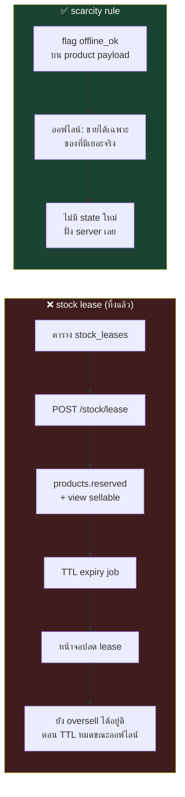

# 04 — บันทึกการถกเถียง (Design Scrutiny Q&A)

เอกสาร `01`–`03` ถูกส่งให้ **agent 3 ตัว** review คนละมุม แต่ละตัวไปอ่านโค้ดจริงมาเทียบ
แล้ว **ยิงคำถามใส่กันเอง 1 รอบ** ก่อนสรุป หน้านี้คือบันทึกว่าเถียงอะไรกัน และตกลงอะไรได้

| Agent | รับผิดชอบ | ตรวจอะไร |
|---|---|---|
| 🗄️ **Agent-DB** | schema & data integrity | `01_DATABASE.md` เทียบ `tables.dart` + repository ทั้ง 13 ตัว |
| 🔌 **Agent-API** | API contract & client | `02_API_SCREENS.md` เทียบ 11 screens + `CONTRACT.md` |
| 🏗️ **Agent-ARCH** | architecture / multi-tenant / ops | `03_ARCHITECTURE.md` เทียบสรุปคอร์ส Backend01–06 + โจทย์อาจารย์ |

**ผลรวม:** ทั้ง 3 ตัวให้ verdict เดียวกัน — *"โครงถูกทาง แต่ยังปล่อยผ่านไม่ได้"*
มี 3 BLOCKER และเปลี่ยนการตัดสินใจใหญ่ 1 ข้อ (ทิ้งกลไก stock lease)

---

## รอบ 1 — แต่ละคนเจออะไร (ย่อ)

**🗄️ Agent-DB**
1. `UNIQUE (tenant_id) WHERE is_active` บน `shifts` ล็อกร้านให้เปิดได้เคาน์เตอร์เดียวตลอดกาล
2. Composite FK ชุดใหม่ทำให้ปุ่ม "ลบลูกค้า / ลบหมวด" ที่ใช้อยู่ทุกวัน พังเป็น FK violation
3. แผน migration ตก `credit_payments`, `drawer_entries`, `parked_sales` → ยอดหนี้ช่างจะไม่มีที่มา
4. สูตรต้นทุนเฉลี่ยเขียนตกสอง fallback → PO ที่กรอกทุน 0 จะดึงต้นทุนเข้าใกล้ 0 ถาวร
5. `movements.type` ที่เขียนไว้ ไม่ตรงกับค่าที่ระบบเขียนจริง
6. `to_tsvector` ค้นภาษาไทยไม่ได้ (ไม่มีช่องว่างระหว่างคำ) — ถอยหลังจากของเดิม

**🔌 Agent-API**
1. ข้อความ error ไทย 2 ตัวเป็นของ "แต่งเอง" ไม่ได้มาจาก `db.js` และ `CREDIT_LIMIT_EXCEEDED → 403` ปิดทางขายเชื่อเกินวงเงินที่ร้านทำทุกวัน
2. `/sales/:id/refundable` **กลับความหมาย** จาก `getRefundedQty()` เดิม → ตัวเลข "คืนได้อีก" ผิดทุกบิลแบบเงียบ ๆ
3. สูตรรายงานปิดร้าน **ลืมยอด "ช่างมาจ่ายหนี้เงินสด"** → ลิ้นชักจะขาดทุกวัน
4. Checkout เปิดหน้าเดียวยิง 6–8 request และมี N+1 ซ่อนอยู่ (`catColor()` วนทีละหมวด)
5. ยิงบาร์โค้ดต้องการ exact `partNo` lookup แต่เอกสารมีแค่ `?search=` (full-text)
6. มี endpoint หลายตัวที่ "ไม่ได้ map จากโค้ด" แต่เขียนปนกันจนดูเหมือน parity

**🏗️ Agent-ARCH**
1. **stock lease ไม่มีอยู่จริงในเอกสาร** — ไม่มีตาราง ไม่มี endpoint และถ้าหักจาก `products.stock` ตรง ๆ จะพังทั้งรายงานของใกล้หมดและเกณฑ์พิสูจน์ data integrity ของอาจารย์
2. "conflict เป็นศูนย์โดยโครงสร้าง" เป็นเท็จ — TTL หมดตอนเครื่องยังออฟไลน์ = oversell เงียบกว่าแบบ B อีก
3. Redis กล่องเดียวทำทั้ง cache + queue → `allkeys-lru` จะกินงานในคิวทิ้ง (คอร์สเตือนไว้ตรง ๆ)
4. Bull-Board ไม่มี auth เลย ทั้งที่ job payload มี `tenantId` + ข้อมูลลูกค้า
5. RLS + "บังคับทุก request อยู่ใน transaction" → TypeORM transaction วิ่งเข้า master เสมอ = **read replica ในไดอะแกรมใช้ไม่ได้เลย**
6. ประมาณการ effort ไม่ได้มาจากอะไร และ Gantt เรียงงานต่อกันหมดโดยไม่มี parallel

---

## รอบ 2 — บทสนทนา

### Q1 — ตัดสต็อกยังไงให้ได้ข้อความไทยครบทุกบรรทัด
> 🔌 **API → DB:** เอกสารเขียน `UPDATE … WHERE stock >= qty` แบบ fail-fast ทีละแถว
> แต่ของจริงเก็บ **ทุกบรรทัด** ที่ไม่พอแล้ว throw ทีเดียว (`insufficient.join('\n')`)
> แล้วจะสร้างข้อความหลายบรรทัดยังไงหลัง rollback ไปแล้ว?

> 🗄️ **DB:** ผมผิด — `rowcount = 0` ยังแยกไม่ออกด้วยซ้ำว่า *"ของไม่พอ"* หรือ *"ไม่พบในสต็อก"*
> ซึ่งเป็นคนละข้อความ วิธีที่ถูกคือ **ใน transaction เดียวกัน**
> `SELECT … WHERE id = ANY($ids) ORDER BY id FOR UPDATE` → ประกอบข้อความครบทุกบรรทัดจากผลนี้
> แล้วค่อย UPDATE (`ORDER BY id` คือตัวกัน deadlock ตัวจริง ไม่ใช่การเรียงตอน UPDATE)
>
> **แถมของแถม:** ของเดิม pre-check อยู่ **นอก** transaction — เป็น race จริงที่มีอยู่วันนี้ backend ควรปิดไปเลย

✅ **สรุป:** `SELECT … FOR UPDATE` (เรียง id) → ประกอบ error → UPDATE — `WHERE stock >= qty` เหลือเป็น assertion

---

### Q2 — `CHECK (credit_balance >= 0)` หรือ clamp?
> 🔌 **API → DB:** ของจริง clamp ที่แอป (`math.max(0.0, …)`) คุณตั้งใจเปลี่ยนเป็น constraint violation หรือเผลอ?

> 🗄️ **DB:** เผลอครับ clamp คือ invariant ที่ `db.js` **ตั้งใจ** ไม่ใช่บั๊ก
> แก้เป็น `GREATEST(0, credit_balance - $amt)` เสมอ ส่วน `CHECK` เก็บไว้เป็น **assertion กันบั๊กของเราเอง** —
> ถ้า CHECK ยิงเมื่อไหร่แปลว่าโค้ดเราลืม clamp ไม่ใช่ผู้ใช้ทำผิด (ใช้กติกาเดียวกันกับ `points >= 0`)

✅ **สรุป:** clamp ในโค้ด + CHECK เป็นตาข่ายชั้นสอง ไม่ใช่ทางที่ผู้ใช้เจอ

---

### Q3 — 🔥 ประเด็นที่เถียงหนักสุด: กลไก "จองสต็อก" (stock lease) เอาไงดี
> 🏗️ **ARCH:** ผมขอค้าน lease ทั้งชุด 3 เหตุผล
> (1) มันไม่มีอยู่จริงในเอกสาร — ไม่มีตาราง `stock_leases` ไม่มี `POST /stock/lease` และ `products` มี `stock` คอลัมน์เดียว
> (2) "conflict เป็นศูนย์" ไม่จริง — TTL 8 ชม. หมดตอนเครื่องยังออฟไลน์ ก็ oversell อยู่ดี แถมเงียบกว่าเดิม
> (3) กฎ "จองเฉพาะของขายดี" **กลับหัว** — ลูกค้าถามหาซีลยางที่มีสต็อก 200 ชิ้น (เสี่ยง oversell = 0) กลับขายไม่ได้เพราะไม่ได้จองไว้
>
> **เสนอแทน — scarcity rule:** server ส่ง flag `offline_ok = (stock ≥ max(5, 3×ค่าเฉลี่ยต่อบิล))` มากับสินค้า
> ตอนออฟไลน์ขายได้เฉพาะตัวที่ `offline_ok` — ไม่มี state ใหม่ฝั่ง server ไม่มี TTL ไม่มีของหายจากชั้น

> 🗄️ **DB:** เห็นด้วยเต็มที่ และมันทำให้ปัญหาที่ผมกลัวที่สุดหายไปด้วย
> ถ้ามี `reserved` เมื่อไหร่ `CHECK (stock >= 0)`, index `stock <= min_stock`, `movements.stock_after`
> และ checklist migration `SUM(products.stock)` จะ **ตีความคนละแบบทันที**
> ขอปักหมุดว่า **`stock` = ของบนชั้นเท่านั้น ห้ามมีความหมายที่สอง**
> แต่ขอ 3 เงื่อนไข: `offline_ok` ต้องเป็น derived เท่านั้น / ตอน push ยังต้องมี `UPDATE … WHERE stock >= qty`
> เป็นผู้ตัดสินสุดท้าย (scarcity ลดโอกาสชน ไม่ใช่ทำให้เป็นศูนย์) / และต้องมี `sales.sync_status` +
> คิวให้เจ้าของร้านเคลียร์บิลที่ถูกปฏิเสธหลังพิมพ์ใบเสร็จไปแล้ว

> 🔌 **API:** เห็นด้วย — lease ต้องมี endpoint จอง/คืน/หมดอายุ + reconcile ทั้งชุด
> ส่วน `offline_ok` เป็นแค่ **1 boolean บน product** ไม่เพิ่ม endpoint สักตัว
> และอธิบายให้พนักงานเข้าใจได้ใน 1 ประโยค: *"ป้ายเทา = เน็ตล่มขายไม่ได้"*

✅ **สรุป:** **ทิ้ง stock lease** ใช้ scarcity rule แทน · `stock` = ของบนชั้นเท่านั้น · เพิ่ม `sales.sync_status`

---

### Q4 — เลขที่ใบเสร็จ ใครออก? (คำถามที่เกือบล้ม Architecture C)
> 🏗️ **ARCH → DB:** `doc_counters` PK เป็น `(tenant_id, doc_type, period)` **ไม่มี `device_no`**
> แต่ §7.2 เสนอเลขแบบ `R{device_no}-…` แล้วบอกว่าออฟไลน์ได้ — **ตอนออฟไลน์เครื่องเอาเลขมาจากไหน?**
> ถ้าตอบไม่ได้ = ออกใบเสร็จตอนออฟไลน์ไม่ได้ = ล้ม C ทั้งแบบ

> 🗄️ **DB:** ตอบไม่ได้จริง ๆ ครับ ตารางนั้นออกแบบผิด
> ที่ถูกคือ **counter อยู่ที่เครื่อง** (persist ใน Drift ต่อ `(device_no, doc_type, period)`)
> เครื่องออกเลขเองได้ทันทีตอนออฟไลน์ — `device_no` ทำให้ namespace ไม่ทับกันอยู่แล้ว
> ฝั่ง server เหลือแค่ high-water mark ไว้ **ตรวจเลขขาดช่วง** ไม่ใช่ตัวออกเลข
> ป้องกันชนด้วย `UNIQUE (tenant_id, receipt_no)` พอ

> 🔌 **API:** งั้นผมถอนข้อเสนอรอบแรกที่บอกว่า "server ต้องเป็นคนออก `receiptNo`"
> แต่ขอค้านตัวอย่างในเอกสาร: `"R1-2569-08-0042"` **ไม่ใช่ format ของ `docNo()`** ที่ใช้อยู่
> การเปลี่ยน format = ใบเสร็จหน้าตาเปลี่ยน ต้องถามเจ้าของร้านก่อน ไม่ใช่ตัดสินใจในเอกสาร design

✅ **สรุป:** client ออกเลข, server ตรวจซ้ำด้วย unique constraint · **format ใบเสร็จ = เรื่องที่ต้องถามเจ้าของร้าน**

---

### Q5 — ยอดเงินในบิล ใครเป็นเจ้าของ?
> 🗄️ **DB → API:** client ส่ง `total` มาแล้ว server เชื่อเลย หรือคำนวณใหม่?
> ถ้าคำนวณใหม่ด้วย NUMERIC จะต่างจากใบเสร็จที่ Dart double พิมพ์ไปแล้วได้ 0.01 และแต้มเพี้ยนตามที่ขอบ

> 🔌 **API:** server **คำนวณใหม่ แต่ในฐานะ validation ไม่ใช่ authority** —
> ต่างเกิน 0.01 → `409 TOTAL_MISMATCH` (แปลว่า client บั๊กหรือมีคนยิงมั่ว)
> ต่างไม่เกิน 0.01 → **ใช้ค่าจาก client** เพราะใบเสร็จพิมพ์ไปแล้ว ห้ามเพี้ยน
> `points = floor(total/10)` ผูกกับค่าที่ persist จริง จึงไม่มีทางเพี้ยนตาม
> ขอแค่เขียน tolerance ลง contract ให้ชัด อย่าปล่อยเป็น implicit

✅ **สรุป:** client เป็นเจ้าของตัวเลข, server เป็นผู้ตรวจ, tolerance 0.01 เขียนลง contract

---

### Q6 — ปุ่ม "ลบ" ที่ใช้อยู่ทุกวันจะพังไหม
> 🗄️ **DB → API:** `DELETE /customers/:id` กับ `DELETE /categories/:name` soft หรือ hard?
> ตอนนี้โค้ดลบจริง แต่ schema ใหม่มี FK จาก `sales` → จะ 500 ทันทีที่ลูกค้ามีบิล

> 🔌 **API:** ต้องแยกเป็น 2 กรณี ไม่ใช่กติกาเดียว
> **ลูกค้า/ช่าง/สินค้า = soft delete** (`deleted_at`) คืน 200 เสมอ, `GET` ซ่อนไว้,
> ส่วนบิลเก่ายังโชว์ชื่อได้เพราะ `sales.customer_name` denormalize ไว้แล้ว
> **หมวดหมู่ = hard delete ได้** เพราะของเดิมลบแค่แถวใน `categories` **ไม่แตะ `products.category`** —
> มันเป็น *orphan by design* และ `catColor()` มี hash fallback รองรับอยู่แล้ว
> → **ห้ามใส่ FK `products.category → categories` เด็ดขาด** ไม่งั้นพฤติกรรมเดิมพัง

✅ **สรุป:** soft delete 3 ตาราง · หมวดหมู่ hard delete + **ถอด FK ออก**

---

### Q7 — เฟส 1 = ออนไลน์อย่างเดียว แล้วร้านที่วันนี้ขายตอนเน็ตล่มได้ล่ะ?
> 🗄️ **DB → ARCH:** ใครเซ็นรับ regression นี้ และระหว่างรอเฟส 2 ร้านทำยังไง?

> 🏗️ **ARCH:** ผมค้านคำว่า regression — เพราะ **ไม่จำเป็นต้อง cutover พร้อมส่งงาน**
> วันนี้ร้านมีเครื่องเดียว แผนที่ถูกคือ:
> เฟส 1 ส่งอาจารย์บน **tenant สาธิต** ที่ import ข้อมูลจริงเข้าไป
> ส่วน **เครื่องหน้าร้านยังรัน Drift build เดิมต่อไป** จนกว่าเฟส 2 (scarcity offline) จะเสร็จ
> ทำแบบนี้ไม่มีใครต้องเซ็นรับอะไรเลย
> ถ้าทีมยืนยันจะ cutover ก่อน → **เจ้าของร้านต้องเซ็นเอง** + ต้องมี 4G สำรอง + คู่มือ "เน็ตล่มให้เขียนบิลมือ"

✅ **สรุป:** **ไม่ cutover ในเฟส 1** — ส่งอาจารย์บน tenant สาธิต ร้านยังใช้ของเดิม

---

### Q8 — เครื่องที่ 2 จะรู้ได้ยังไงว่าเครื่องที่ 1 ขายของไปแล้ว
> 🔌 **API → ARCH:** ทั้งแอปเหลือ live stream ตัวเดียวคือ `watchSettings()` ที่เหลือเป็น
> การโหลดครั้งเดียวแล้วสั่งรีเฟรชเอง → เครื่อง B จะไม่รู้เลยจนกว่าคนจะกดรีเฟรช
> ตั้งใจให้ stale หรือจะมี SSE? แล้วใคร invalidate cache **ฝั่ง client**?

> 🏗️ **ARCH:** หลักฐานแรงกว่าที่คุณว่าอีก — `watchAll()` และ `watchSales()` เขียนไว้ใน repo แล้วแต่
> **ไม่มีใครเรียกเลย** ตอบตรง ๆ: **ตั้งใจให้ stale ในเฟส 1** เพราะร้านมีเครื่องเดียว
> พอมีเครื่องที่ 2 **อย่าเพิ่งทำ SSE/WebSocket** — ใช้ polling `?updatedSince=` ทุก 15–30 วิ
> ตอนหน้า Checkout เปิดอยู่ ถูกกว่ามาก ผ่าน Nginx ได้โดยไม่ต้องแก้ config และไม่ชนกับ JWT stateless
> ส่วน client cache invalidation = **ผลลัพธ์ของ response ตัวเอง + polling cursor** ไม่ใช่ push จาก server

> 🔌 **API:** เสริม — ให้ `POST /sales` **คืน stock ใหม่ของทุกบรรทัดที่แตะ** มาใน response เลย
> (server รู้อยู่แล้วจาก `UPDATE … RETURNING`) แคชเชียร์จะเห็นค่าใหม่ทันทีโดยไม่ต้องยิง `GET /products`
> ซึ่งแก้ปัญหา read-your-writes ที่ replica lag ทำให้เห็นสต็อกเก่าไปในตัว

✅ **สรุป:** stale ได้ในเฟส 1 · เครื่องที่ 2 ใช้ polling `?updatedSince=` · `POST /sales` คืนสต็อกใหม่กลับมาด้วย

---

### Q9 — Drift ยังอยู่ไหม แล้วอยู่ในบทบาทอะไร
> 🔌 **API → ARCH:** `02` เขียนบนสมมติฐาน "ไม่มี local cache" แต่ scarcity rule **ต้องมี** Drift cache

> 🏗️ **ARCH:** ต้องเขียนลงเอกสารให้ชัดว่า **Drift ไม่ได้หายไปทั้งใน A และ C** ต่างแค่เป็นเจ้าของอะไร
> * **ใน A:** Drift = **read cache อย่างเดียว ไม่มี write path ไม่มี business logic**
>   cache แค่ 5 ชุดที่เปลี่ยนช้า: `products`, `categories`, `customers`, `mechanics`, `settings`
>   **ไม่ cache:** sales / returns / PO / quotes / shifts / movements / reports — ยิงสดทุกครั้ง
> * **ใน C:** ชุดเดิมเป๊ะ + เพิ่ม outbox + คอลัมน์ `offline_ok`, `cached_stock` — **ไม่มีตารางใหม่ฝั่ง server เลย**
> * **refresh ด้วย `?updatedSince=`** ไม่ใช่โหลดใหม่ทั้งก้อน
>
> ⚠️ **ข้อค้นพบที่สำคัญ:** `products` มี `updatedAt` แล้ว แต่ **`customers` / `mechanics` / `settings` ยังไม่มี**
> → เป็น **Drift schema change ที่ต้องรัน `build_runner` บน ASCII path** ควรทำรวดเดียวตอนนี้
> ไม่ใช่ไปเจอตอนเฟส 2 (ตรงกับที่ `CLAUDE.md` Phase 7b ระบุไว้อยู่แล้ว)

✅ **สรุป:** Drift = read cache 5 ชุด · เพิ่ม `updatedAt` + `deletedAt` ให้ครบ **ตั้งแต่ตอนนี้**

---

### Q10 — freeze API contract ได้เลยไหม หรือต้องรอเลือก architecture ก่อน
> 🔌 **API:** freeze ได้ **ครึ่งเดียว** — `POST /sales`, `/returns`, `/receive`, `/reports/*`, `/shifts/*`
> เป็น command/query ที่รูปร่างไม่ขึ้นกับ architecture → ทีม backend เริ่มได้เลยวันนี้
> แต่ **read path ของ Checkout/Products/Vehicle-Search freeze ไม่ได้** เพราะ A ต้องการ `?page&limit&search`
> ส่วน B/C ต้องการ `?updatedSince=` ซึ่งเป็นคนละ contract คนละ cache strategy

> 🏗️ **ARCH:** ผมค้านครึ่งหลัง — ภายใต้ scarcity rule **endpoint ชุดเดียวกันเป๊ะ**
> ต่างแค่ "ใครเรียกและเมื่อไหร่": online เรียกทันที / offline เข้า outbox แล้ว replay เข้า **endpoint เดิม**
> ผ่าน `/sync/push` (ซึ่ง `02 §7` ออกแบบเป็น envelope ห่อ op อยู่แล้ว ไม่ใช่ API ชุดใหม่)
> สิ่งที่ต้องเพิ่มจริงมี 2 อย่างและเป็น **additive** ทั้งคู่: `?updatedSince=` และ flag `offline_ok`

✅ **สรุป:** **freeze ได้ทั้งชุด** ถ้ายอมรับว่า `?updatedSince=` + `offline_ok` เป็น additive
สิ่งเดียวที่ห้าม freeze ก่อนคือ **format เลขที่ใบเสร็จ** (ต้องถามเจ้าของร้าน)

---

## สรุปการตัดสินใจ + สิ่งที่แก้เข้าไปในเอกสารแล้ว

| # | ตัดสินใจ | แก้ที่ |
|---|---|---|
| 1 | **ทิ้ง stock lease** ใช้ scarcity rule (`offline_ok`) แทน | `03 §4` |
| 2 | `stock` = ของบนชั้นเท่านั้น ห้ามมี `reserved` | `01 §5.2, §7` |
| 3 | ตัดสต็อกด้วย `SELECT … ORDER BY id FOR UPDATE` ในtxn แล้วค่อย UPDATE | `01 §7.1` |
| 4 | clamp ในโค้ด (`GREATEST(0,…)`), CHECK เป็น assertion | `01 §5.3` |
| 5 | shifts: `UNIQUE (tenant_id, device_id) WHERE is_active` + `sales.shift_id` | `01 §5.6, §7.5` |
| 6 | soft delete: products/customers/mechanics · หมวดหมู่ hard delete **ไม่มี FK** | `01 §5.2, §10` · `02 §3.5` |
| 7 | เลขเอกสาร: counter อยู่ที่เครื่อง, server ตรวจซ้ำ + high-water mark | `01 §7.2` |
| 8 | เงิน: client เป็นเจ้าของ, server validate tolerance 0.01 → `TOTAL_MISMATCH` | `02 §1.2, §3.1` |
| 9 | วงเงินเครดิต = **warning + override** ไม่ใช่ 403 | `02 §8` |
| 10 | `/sales/:id/refundable` → `/refunded-qty` (คืนความหมายเดิม) | `02 §3.7` |
| 11 | สูตรปิดร้าน **+ ยอดช่างจ่ายหนี้เงินสด** | `02 §3.11` |
| 12 | `/categories` คืน `color` มาด้วย (ตัด N+1) · เพิ่ม `?partNo=` สำหรับบาร์โค้ด · เพิ่ม `GET /bootstrap` | `02 §3.1, §3.2` |
| 13 | `movements`: server เขียนคนเดียว + enum จริง + unique กันซ้ำ | `01 §5.2` |
| 14 | ค้นหาไทยใช้ `pg_trgm` ไม่ใช่ `to_tsvector` | `01 §5.2` |
| 15 | WAC ต้องมี fallback 2 ชั้น + `CHECK (cost >= 0)` | `01 §7.4` |
| 16 | migration: เติม 3 ตารางที่ตก + pre-flight scan + กติกาสร้าง shift id | `01 §9` |
| 17 | **แยก Redis เป็น 2 ตัว** (cache / queue) + Bull-Board ต้องมี auth | `03 §8` |
| 18 | RLS: `current_setting('app.tenant_id', true)` fail-closed · worker ต้องห่อ txn · รายงานข้ามร้าน = path แยก + audit | `01 §8` · `03 §5` |
| 19 | **ไม่ cutover ร้านในเฟส 1** — ส่งอาจารย์บน tenant สาธิต | `03 §7, §8` |
| 20 | ยังไม่สร้าง `change_log` ในเฟส 1 (มีบั๊ก seq gap และยังไม่มีใครใช้) | `01 §5.1` |
| 21 | Drift = read cache 5 ชุด + เพิ่ม `updatedAt`/`deletedAt` ตั้งแต่ตอนนี้ | `03 §2, §4` |
| 22 | ติดป้าย `NEW` ให้ endpoint/error ที่ไม่ได้ map จากโค้ดเดิม | `02 §3, §8` |

---

## ❗ เรื่องที่ agent เถียงกันแล้ว "ตกลงไม่ได้" — ต้องให้คนตัดสิน

1. **รูปแบบเลขที่ใบเสร็จ** — คงของเดิม (`RC…` แบบสุ่ม) หรือเปลี่ยนเป็นเลขเรียงต่อเครื่อง?
   *เปลี่ยน = ใบเสร็จหน้าตาเปลี่ยน ต้องถามเจ้าของร้าน ไม่ใช่ตัดสินในเอกสาร design*
2. **เกณฑ์ `offline_ok`** — `stock ≥ max(5, 3×เฉลี่ยต่อบิล)` เป็นแค่ข้อเสนอ ต้องดูข้อมูลขายจริงก่อนตั้งค่า
3. **ข้อความไทยของ error ใหม่** (`OFFLINE_NOT_ALLOWED`, `TOTAL_MISMATCH`, `PO_ALREADY_RECEIVED`) —
   ไม่มีใน `db.js` ห้ามแต่งเอง ต้องให้เจ้าของร้าน/คนหน้าร้านเป็นคนเลือกคำ
4. **จะ cutover ร้านจริงเมื่อไหร่** — ข้อเสนอคือหลังเฟส 2 แต่เป็นการตัดสินใจทางธุรกิจ

---

**กลับไป:** [`00_INDEX.md`](00_INDEX.md)
