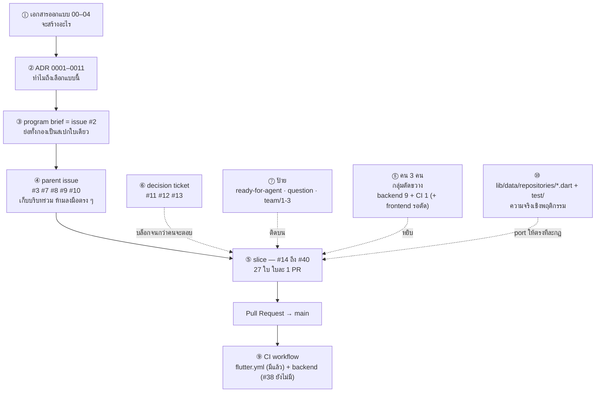
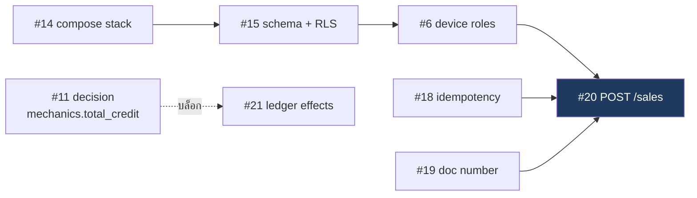
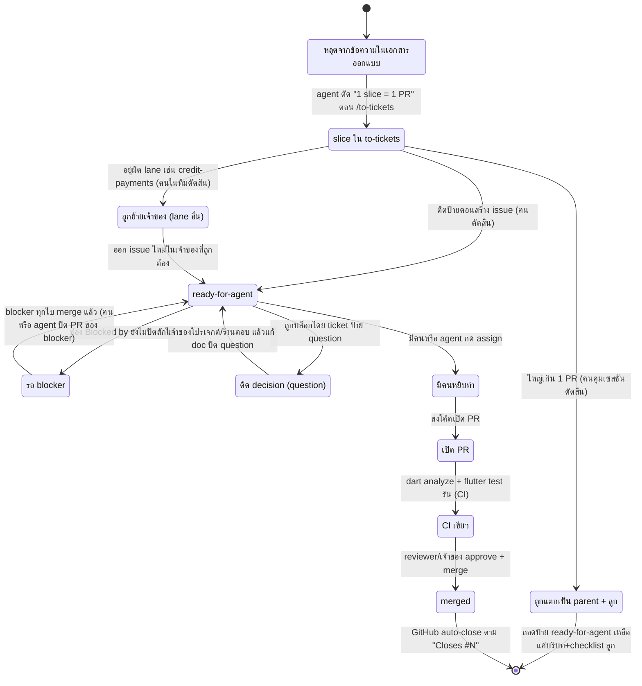

# 05 — จาก design เป็น ticket: งานถูกแตกมาได้ยังไง

> **ไฟล์นี้เขียนให้คนที่เพิ่งเข้ามารับงานในโปรเจกต์นี้**
> เอกสาร `01`–`04` บอกว่า **ระบบจะเป็นยังไง** · `adr/` บอกว่า **ทำไมถึงเป็นแบบนั้น** ·
> ไฟล์นี้บอกว่า **แล้วตกลงตอนนี้ต้องทำอะไร และ issue ในรีโปมันโผล่มาจากไหน**
>
> - เอกสารนี้ตอบ "ทำไม" ก่อน "อะไรอยู่ตรงไหน"
> - **ไม่ใช่สเปก** — ถ้าขัดกับ **ADR ใน `adr/` หรือเนื้อ issue จริง** ให้ถือว่าสองอย่างนั้นถูก
> - อ่านจบแล้วต้องทำได้: **หยิบ issue ของตัวเองมาทำได้เองโดยไม่ต้องถามว่ามันมาจากไหน
>   และรู้ว่าเมื่อไหร่ต้องหยุดแล้วถามคน**
> - เนื้อหาอ้างอิงสถานะรีโป ณ **2026-09-05**

---
## §0 แผนที่การอ่าน

| § | หัวข้อ | จำเป็นตอนนี้ไหม |
|---|---|---|
| §1 | ปัญหาเดียวที่ทั้งเรื่องพยายามแก้ | ⭐ ต้องอ่าน |
| §2 | ตัวละครทั้งหมด — เอกสาร, ADR, issue, ป้าย, คน | ⭐ ต้องอ่าน |
| §3 | เดินยังไงมาถึงตรงนี้ — grill → spec → ticket | ⭐ ต้องอ่าน |
| §4 | ทางเลือกที่ไม่ได้เลือก (จะแบ่งงาน 3 คนยังไง) | อ่านตอนสงสัยว่าทำไมงานของตัวเองหน้าตาแบบนี้ |
| §5 | — **ข้ามไป** เอกสารนี้ไม่มีเส้นทางไหนใน §3 ที่ใหญ่พอต้องแยกเป็นหัวข้อของตัวเอง | — |
| §6 | ทำไมต้องมีตั้ง 5 ชั้น | อ่านตอนรู้สึกว่าเอกสารซ้ำซ้อน |
| §7 | ชีวิตของ ticket 1 ใบ | ⭐ ต้องอ่านก่อนหยิบใบแรก |
| §8 | ถ้าทำผิดจะพังยังไง | ⭐ ต้องอ่านก่อนหยิบใบแรก |
| §9 | สิ่งที่เอกสารนี้ตัดออก | เปิดดูตอนหาของไม่เจอ |
| §10 | สรุปคำศัพท์ | เปิดดูตอนเจอศัพท์ |
| §11 | คำถามทดสอบตัวเอง | อ่านจบแล้วลองตอบ |
| §12 | อ่านอะไรต่อ | ⭐ ก่อนลงมือ |

**พื้นฐานที่สมมติว่ามีอยู่แล้ว (จะไม่อธิบายซ้ำ):** git · GitHub issue / PR · HTTP · SQL · และทุกศัพท์ที่
[`00_BASICS.md`](00_BASICS.md) สอนไปแล้ว (transaction, RLS, JWT, cache, queue, idempotency, multi-tenant)

**จะสอนให้ในไฟล์นี้:** ADR · spec (PRD) · program brief · vertical slice (tracer bullet) · HITL vs AFK ·
ป้าย `ready-for-agent` / `question` / `team/N` · parent issue vs child issue · กราฟ blocked-by ·
acceptance criteria vs done-criteria · critical path · lane vs cross-cutting bundle ·
ชื่อกระบวนการ grill-with-docs / scrutinize / to-spec / to-tickets

### บันไดความรู้ — ตัวไหนต้องรู้ก่อนตัวไหน

| ลำดับ | ศัพท์ | ต้องรู้อะไรก่อน | สอนที่ | ใช้ครั้งแรกที่ |
|---|---|---|---|---|
| 1 | **ADR / decision record** | — | §2 | §1 (กล่อง 📖) |
| 2 | **spec (PRD) / program brief** | ADR | §2 | §1 (กล่อง 📖) |
| 3 | **parent issue / child issue** | spec | §2 | §1 (กล่อง 📖) |
| 4 | **ป้าย `ready-for-agent`** | parent/child | §2 | §1 (กล่อง 📖) |
| 5 | **ป้าย `question`** | `ready-for-agent` | §2 | §2 |
| 6 | **acceptance criteria** | child issue | §2 | §1 (กล่อง 📖) |
| 7 | **done-criteria** | acceptance criteria | §2 | §1 (กล่อง 📖) |
| 8 | **grill-with-docs · scrutinize · to-spec · to-tickets** | ADR, spec | §3 | §1 (กล่อง 📖) |
| 9 | **vertical slice (tracer bullet)** | parent/child, acceptance criteria | §3 | §3 |
| 10 | **HITL vs AFK** | vertical slice | §3 | §3 |
| 11 | **กราฟ blocked-by** | vertical slice | §3 | §3 |
| 12 | **lane** | vertical slice | §4 | §3 |
| 13 | **cross-cutting bundle** | lane | §4 | §3 |
| 14 | **critical path** | กราฟ blocked-by | §4 | §4 |
| 15 | **ป้าย `team/N`** | cross-cutting bundle | §4 | §4 |

> ⚠️ **ช่อง "ใช้ครั้งแรกที่" ที่เป็น §1 คือของตั้งใจ** — §1 ต้องเล่าปัญหาก่อนที่จะมีศัพท์ให้ใช้
> จึงเปิด **กล่อง 📖** อธิบายสั้น ๆ ตรงจุดที่ใช้ แล้วชี้ว่าตัวเต็มอยู่ § ไหน
> ถ้าอ่าน §1 แล้วยังงง ให้ข้ามไปอ่าน §2 ก่อนแล้วค่อยกลับมา

---

## §1 แก่นเดียวของทั้งเรื่อง — เอกสารครบแล้ว แต่ยังหยิบไปทำไม่ได้

### 1.1 วิธีที่ตรงที่สุด — "แผนก็มีอยู่แล้ว แบ่งตาม Gantt แล้วลงมือเลยสิ"

ณ 2026-09-05 เรามีเอกสารออกแบบ backend ครบชุดใน `docs/Backend_design/` แล้วจริง ๆ: `01_DATABASE.md` 1,112
บรรทัด · `02_API_SCREENS.md` 681 · `03_ARCHITECTURE.md` 542 · `04_QA_SCRUTINY.md` 489 บวก `00_BASICS.md`
และโฟลเดอร์ `adr/` อีก 11 ไฟล์ (§2 อธิบายว่าไฟล์ใน `adr/` คืออะไร และทำไมกติกาของรีโปเขียนว่า *เอกสารขัดกับ
มันเมื่อไหร่ ให้ยึดมัน*)

ท้าย `03_ARCHITECTURE.md §8` ก็มี **แผนงานเรียงลำดับพร้อมอยู่แล้ว** — Gantt ที่ไล่จาก `p1` (compose + Nginx +
NestJS skeleton) → `p2` schema → `p3` auth+RLS → `p3b` admin plane → `p3c` device roles → `p4` CRUD →
`p5` sales+returns → `p6` PO/quotes/shifts → `p7` reports → `p8` cache → `p8b` rate limit → `p9` BullMQ →
`p9b` export → `p10` k6 · ทุกงานมี `after` กำกับว่ารออะไรอยู่ ปิดท้ายด้วย checklist **"เกณฑ์ปิดเฟส 1" 17 ข้อ**

ข้อสรุปตามมาแทบอัตโนมัติ: *ทีมมี 3 คน งานหลัง `p3c` แตกเป็น 3 สาย ก็แบ่งกันคนละสายสิ เอกสารเขียนไว้
หมดแล้ว เหลือแค่ลงมือ* — และเราทำแบบนั้นจริง มันกลายเป็น issue #7 #8 #9 สายละใบ ใบละหลายสัปดาห์

### 1.2 มันพังตรงไหน

**(ก) ก้อนที่ใหญ่จนหยิบไม่ขึ้น** — `p5` "sales + returns" ใน Gantt คือกล่องเดียว ประเมิน 7 วัน กลายเป็น issue #7
ใบเดียว ซึ่งไม่มีใครหยิบขึ้นมาแล้วเปิด PR ที่ merge ได้ พอแตกจริงมันคือ **7 ใบ** (#18–#24) เหตุผลที่บันทึกไว้ตอนแตก:
idempotency กับตัวออกเลขเอกสารเป็นชิ้นส่วนที่ *ทุกอย่างข้างบนใช้ร่วมกัน* ปล่อยให้ไปเกิดข้างใน `POST /sales` =
ต้องประดิษฐ์มันตอนกำลังรีบ

**(ข) ก้อนที่มัดของคนละเรื่องไว้ด้วยกัน** — `p4`+`p6`+`p7` ถูกมัดเป็น issue #8 ใบเดียว พอแตกจริงได้ **8 ใบ**
(#16 #17 #25 #26 #27 #28 #29 #30) และตอนแตกถึงเห็นว่ารายงานปิดกะต้องดึงออกมาเป็นใบของตัวเอง (#30) เพราะ
สูตรมันผิดแบบที่ดูเหมือนถูก: เงินสดที่ควรมีในลิ้นชัก **ลืมรวมเงินที่ช่างมาจ่ายคืนหนี้** (ลิ้นชักจะขาดทุกวันจนพนักงาน
เลิกเชื่อรายงาน) และกำไรขั้นต้นต้องบอกว่ามี **กี่บรรทัดที่ประมาณจากทุนปัจจุบัน** แทน `cost_at_sale` — ถ้ามันเบียด
อยู่กับ endpoint รวบยอดอีก 6 ตัวในใบเดียว ทั้งสองข้อจะได้เทสต์แบบผ่าน ๆ

**(ค) Gantt บอกลำดับ แต่ไม่บอกว่า "เสร็จ" แปลว่าอะไร** — 17 ข้อท้าย `§8` เป็นเกณฑ์ของ **ทั้งเฟส** ไม่ใช่ของงานใบใด
ใบหนึ่ง คนที่รับ `p2` ไปทำจึงไม่มีเส้นชัยของตัวเอง เทียบกับ issue #15 (คือ `p2` หลังแตกแล้ว) ที่มีเกณฑ์ 6 ข้อของมันเอง
เช่น *"ยิง raw query ด้วย role ของแอปโดยไม่ตั้ง `app.tenant_id` ต้องได้ **0 แถว** ไม่ใช่ error"* และ *"ตาราง `change_log` ต้องไม่มีอยู่"*

> 📖 **ศัพท์**: **acceptance criteria** = เกณฑ์รับงาน **ของงานใบเดียว** ติ๊กครบแล้วใบนั้นจบ · **done-criteria** =
> เกณฑ์ปิด **ทั้งเฟส** (17 ข้อท้าย `§8`) ซึ่งไม่มีใครติ๊กจบได้คนเดียว · แผนที่มีแต่อย่างหลัง = ทุกคนไม่รู้ว่าตัวเอง
> เสร็จเมื่อไหร่ (ตัวเต็ม §2)

**(ง) 💥 จุดที่พังแบบเงียบสนิท** — `01_DATABASE §7.1` สั่งว่าขายแบบเครดิตช่างต้อง `mechanics.total_credit
+= total` แต่โค้ด Dart ที่เป็นต้นแบบพฤติกรรมของทั้งระบบ **ไม่เคยเขียนค่านี้เลย** · คนที่อ่านเอกสารฝั่งเดียวแล้ว
ลงมือจะ implement ตามเอกสาร (ซึ่งเป็นสิ่งที่ถูกต้องที่จะทำ) → **ตัวเลขหนี้ช่างที่ร้านเปิดดูทุกวันเปลี่ยนไปโดยไม่มี
ใครสั่งให้เปลี่ยน** · และไม่มีใครเห็น เพราะไม่มี error ไม่มีเทสต์แดง เลขยังดูสมเหตุสมผล ต้องมีคนที่จำได้ว่า
"เมื่อก่อนช่องนี้เป็นศูนย์" เท่านั้นถึงจะจับได้ · ตอนนี้มันคือ issue **#11** ที่ติดป้ายว่าเป็นคำถามซึ่ง **ต้องให้คนตอบ**
และบล็อก #21 อยู่ — งานเดินไม่ได้จนกว่าจะมีคำตอบ นั่นคือความตั้งใจ

### 1.3 บีบทั้งเรื่องเหลือคำถามเดียว

> **ทำยังไงให้เอกสารกว่า 2,800 บรรทัด กลายเป็นของที่คนหนึ่งคน (หรือ agent หนึ่งตัว) หยิบขึ้นมาใบเดียวแล้ว
> ทำจนเปิด PR ได้เอง — โดยไม่ต้องถามซ้ำ และไม่เดาในจุดที่ห้ามเดา**

ทุกอย่างที่เหลือในเอกสารนี้ตอบคำถามนี้ข้อเดียว ไม่ใช่คำถามว่า "ระบบควรเป็นยังไง" (ตอบไปแล้วใน `01`–`04` และ `adr/`)

### 1.4 เกณฑ์ตัดสิน — เอาไป "รัน" ได้จริง

เอา issue 1 ใบไปวางต่อหน้าคนที่ **ไม่เคยอ่าน `Backend_design` มาก่อนเลย** แล้วดู 3 อย่าง: เปิด PR ได้ไหมโดย
ไม่ต้องถามอะไรเพิ่ม · ชี้ได้ไหมว่างานจบเมื่อไหร่ โดยชี้ที่ **ในใบนั้นเอง** · รู้ไหมว่าจุดไหนห้ามเดาแล้วต้องหยุดไปหาคน

**(ก) ค่าที่ถูกต้องเป๊ะ ๆ** — 1 ใบ = 1 PR · acceptance criteria เป็น checkbox ที่ตรวจได้เชิงกล · มีบรรทัด "Blocked by"
ที่อ้าง **เลข issue จริง** · ทุกข้อที่ต้องให้คนเคาะถูกยกออกไปเป็นใบแยก (#11 #12 #13) ไม่ใช่ปล่อยให้ไปเดาเอาใน PR

> 📖 **ศัพท์**: **parent** = ใบที่เก็บ *บริบทร่วม* ไว้ที่เดียว (#2 #3 #7 #8 #9 #10) ไม่ใช่ที่ที่ลงมือ · **"Blocked by"**
> = บรรทัดในใบลูกที่บอกว่าต้องรอใบไหนก่อน (ทั้งชุดต่อกันเป็นกราฟพึ่งพา) · **ป้าย `ready-for-agent`** = ใบนี้พร้อม
> หยิบ — parent และ #11–#13 **ไม่มีป้ายนี้ ห้ามลงมือที่ใบพวกนั้นตรง ๆ** (ตัวเต็ม §2)

**(ข) เบี่ยงเบนไปทางไหนก็เจ็บ**

| ทิศทาง | อาการที่เห็นจริง | ราคาที่จ่าย |
|---|---|---|
| **ใหญ่เกิน** | #7 #8 #9 — สายละใบ ใบละหลายสัปดาห์ | หยิบไม่ได้ ไม่มีเส้นชัย รีวิวไม่ไหว ค้างจนคนอื่นรอ |
| **เล็กเกิน** | ถ้าแตก 27 ใบเป็น 80 ใบ | ทุกใบมีป้าย มี Blocked by มีรีวิว มีบริบทที่ต้องอ่านซ้ำ — เวลาหมดไปกับการสลับงานมากกว่าเขียนโค้ด |

**(ค)** ขนาดที่เลือกจึงเป็น **27 ใบ (#14–#40)** โดยยกบริบทร่วมไปไว้ที่ parent · ทุก § ที่เหลือของเอกสารนี้มีไว้
ทำให้เกณฑ์ข้อนี้ผ่าน — ถ้าอ่านจบแล้วยังหยิบ issue ของตัวเองขึ้นมาทำไม่ได้ แปลว่าเอกสารนี้ (ไม่ใช่คุณ) ล้มเหลว

### 1.5 "ก็แค่แตกงานให้เล็กลงไม่จบเหรอ ทำไมต้องมีตั้ง 3 รอบ"

เพราะสามรอบตอบคนละคำถาม และรอบหลังใช้คำตอบของรอบก่อนเป็นวัตถุดิบ:

| รอบ | ตอบคำถามว่า | ถ้าข้ามรอบนี้ |
|---|---|---|
| 1 | **อะไรที่ยังไม่ได้ตัดสินใจ** | แตกงานได้ 27 ใบสวยงาม แต่มีใบที่รอคำตอบจากคนซ่อนอยู่ข้างในโดยไม่มีใครรู้ (เช่น #11) |
| 2 | **จะสร้างอะไร ลำดับไหน** | แตกงานจากเอกสารที่ยังขัดกันเอง ได้ ticket ที่ขัดกันเอง |
| 3 | **ใครหยิบใบไหน จบเมื่อไหร่** | ได้แผนที่ถูกต้องแต่ยังหยิบไม่ขึ้น = จุดที่เรายืนอยู่ก่อน 2026-09-05 |

และที่สำคัญกว่า: **การแตกงานคือวิธี *ค้นพบ* ข้อผิดพลาด ไม่ใช่แค่วิธีจัดระเบียบ** — สองเคสใน 1.2 ไม่มีใครเห็น
ตอนเขียนเอกสาร มันโผล่ตอนมีคนถามว่า *"ใบนี้จะติ๊กว่าเสร็จได้ยังไง"* เท่านั้น

> 📖 **ศัพท์**: สามรอบนี้มีชื่อจริงเป็นชื่อคำสั่งที่รันไป — `/grill-with-docs` (สัมภาษณ์เอกสารเพื่อไล่จับสิ่งที่ยังไม่ได้
> ตัดสินใจ) → `/to-spec` (เรียบเรียงเป็นสิ่งที่จะสร้าง) → `/to-tickets` (ตัดเป็นใบงาน) · §3 เล่าทีละรอบ

---

## §2 ตัวละครทั้งหมด

§1 บอกว่าปัญหาคืออะไร ส่วนนี้แนะนำ **"ของ" ทุกชิ้นที่คั่นอยู่ระหว่างเอกสารออกแบบกับ PR ที่ merge ได้จริง** มี 10 ตัว
เลข ① ② ③ ในหัวข้อย่อยตรงกับเลขในภาพ และ **ศัพท์ทุกคำที่โผล่ในภาพถูกสอนในหัวข้อที่มีเลขเดียวกัน** (ภาพมาก่อนเพราะถ้าไม่เห็นว่าของต่อกันยังไง อ่านทีละตัวแล้วจะจำไม่ได้ว่าตัวไหนอยู่ตรงไหน)

> ภาพนี้อ่านออกว่า **ของไหลจากเอกสารไปถึง PR ผ่านอะไรบ้าง** และอะไรบล็อกอะไร · อ่าน**ไม่**ออกว่าแต่ละขั้นใช้เวลาเท่าไหร่ ใครทำก่อนหลัง หรือ slice ใบไหนรอใบไหน — เรื่องนั้นอยู่ใน §3

### ① เอกสารออกแบบ `00`–`04`

* **(ก) ปัญหาเดิม** — ตกลงกันด้วยปากเปล่า ทุกคนคิดว่าเข้าใจตรงกัน จนถึงวันเขียนโค้ดถึงรู้ว่าคนละเรื่อง
* **(ข) คืออะไร** — คำอธิบายว่า **จะสร้างอะไร** ครบทุกตาราง ทุก endpoint ทุกหน้าจอ
* **(ค) ในงานจริง** — `00_BASICS.md` (ปูพื้นศัพท์) · `00_INDEX.md` (แผนที่) · `01_DATABASE.md` **1,112 บรรทัด** (28 ตาราง + DDL + invariant) · `02_API_SCREENS.md` **681** (11 หน้าจอ → endpoint) · `03_ARCHITECTURE.md` **542** (3 ทางเลือก + แผนลงมือ) · `04_QA_SCRUTINY.md` **489** (บันทึกการถกเถียง)
* 📖 **กับดัก** — กองนี้ **ไม่ใช่ของที่หยิบมาทำได้** อ่านจบก็ยังไม่รู้ว่าจะเริ่มบรรทัดไหน จึงต้องมี ③ ④ ⑤ ต่อท้าย

### ⭐ ② ADR — บันทึกการตัดสินใจ (decision record)

* **(ก) ปัญหาเดิม** — เอกสารบอกได้แค่ผลลัพธ์ ไม่ได้บอก *ทำไม* ผ่านไปสองเดือน คนใหม่เห็นข้อกำหนดแปลก ๆ แล้วเดาว่า "คงเผลอเขียน" จึงแก้ทิ้ง — เหตุผลที่มันเคยมีอยู่ก็หายไปพร้อมกัน
* **(ข) คืออะไร** — ไฟล์เดียว = การตัดสินใจเดียว บันทึก **ตอนตัดสินใจ** ว่า *เจอปัญหาอะไร มีทางไหนบ้าง เลือกทางไหน แลกอะไรไป*
* **(ค) ในงานจริง** — `docs/Backend_design/adr/0001`–`0011` เช่น `0004-device-roles.md` (บทบาทของเครื่อง), `0007-receipt-numbering.md` (ใครออกเลขที่ใบเสร็จ), `0010-client-write-through-cache.md` (Drift เหลือบทบาทอะไร)
* 📖 **อุปมา** — เหมือน **commit message ของการตัดสินใจ**: diff บอกว่าโค้ดเปลี่ยนอะไร ข้อความ commit บอกว่าทำไม ต่างกันตรงที่ ADR เขียน **ก่อน** ลงมือ ไม่ใช่สรุปย้อนหลังตอนงานเสร็จ
* 📖 **กับดัก** — คนมักอ่าน ADR เป็น "เอกสารเสริม" แล้วเชื่อไฟล์ `01`–`04` ก่อน — **ซึ่งกลับด้าน**

**ทำไมต้องมีกติกา "เอกสารขัดกับ ADR → ยึด ADR"** — ไฟล์ `01`–`04` ถูกเขียน **ก่อน** การตัดสินใจหลายข้อ พอมี ADR ใหม่ต้องเดินไปแก้เอกสารตามด้วยมือ (เรียกว่า propagate) ซึ่ง **พลาดได้และพลาดมาแล้วจริง**: รอบแรกประกาศว่า propagate "ครบ" ทั้งที่ครอบแค่ ADR-0001–0007 ส่วน 0008/0009 ตกค้างจนรอบที่สามถึงเจอ แปลว่า ณ เวลาใดก็ตาม เอกสารอาจเก่ากว่า ADR อยู่
💥 ถ้าไม่มีกติกานี้ คนสองคนอ่านคนละไฟล์แล้วเขียนโค้ดคนละแบบ โดยทั้งคู่ "ทำตามเอกสาร" ถูกต้องทั้งคู่ และไม่มีใครรู้ตัวจนกว่างานจะไปชนกัน

### ③ program brief — สเปกใบเดียว

* **(ก) ปัญหาเดิม** — จะแตกงานได้ต้องมีคน "อ่านครบทั้งกอง" ก่อน ถ้าให้ทุกคนไปอ่านเอง แต่ละคนก็จะสรุปไม่ตรงกันอีก
* **(ข) คืออะไร** — เอกสารใบเดียวที่ย่อ ① + ② เป็นสเปกของงานหนึ่งเฟส: จะแก้ปัญหาอะไร แก้ยังไง ใครได้อะไร อะไรไม่ทำ
* **(ค) ในงานจริง** — **issue #2** "Backend phase 1 — program brief" มี Problem Statement, Solution, **User Stories 60 ข้อ**, Implementation Decisions, Testing Decisions, Out of Scope, Further Notes พร้อมต้นไม้งานทั้งหมด + ตารางแบ่งคน · ในตัวมันเองประกาศว่า *"ถ้าสเปกนี้ขัดกับ ADR ให้ยึด ADR"*
* 📖 **อุปมา** — เหมือน **body ของ issue ที่เขียนดี** ที่อ่านแล้วรู้ว่าต้องทำอะไรถึงจะปิดได้ เพียงแต่ใหญ่ระดับทั้งโปรแกรม
* 📖 **กับดัก** — มันชื่อ brief แต่ **ไม่ใช่งาน** ปิดด้วย PR เดียวไม่ได้ มันเป็นที่รวมบริบท ไม่ใช่ที่ลงมือ

### ④ parent issue — ที่เก็บบริบทร่วม

* **(ก) ปัญหาเดิม** — งานหลายใบใช้ข้อมูลชุดเดียวกัน (ตารางไหน invariant ข้อไหน ADR ตัวไหน) ถ้าก็อปใส่ทุกใบ พอแก้ทีต้องไล่แก้ทุกใบ และมักลืมบางใบ
* **(ข) คืออะไร** — issue ที่เก็บ **บริบทที่ลูกทุกใบใช้ร่วมกัน** แล้วชี้ไปหา issue ลูกซึ่งเป็นงานจริง
* **(ค) ในงานจริง** — **#3** (foundation) **#7** (Lane A) **#8** (Lane B) **#9** (Lane C) **#10** (CI) — ทั้งห้าใบถูกเปลี่ยนชื่อให้ลงท้ายว่า `(parent)` และ **ถอดป้าย `ready-for-agent` ออกโดยตั้งใจ**
* 📖 **อุปมา** — เหมือน **branch ที่ไม่มีใคร commit ลงตรง ๆ** มีไว้ให้ branch ย่อยแตกออกไปแล้วค่อย merge กลับ
* 📖 **กับดัก** — parent ดู "พร้อมทำ" ที่สุดเพราะมันเขียนละเอียดที่สุด — และนั่นแหละคือกับดัก

### ⑤ slice — ตั๋วที่หยิบทำได้จริง

* **(ก) ปัญหาเดิม** — ตอนแรกงานทั้งเฟสถูกแบ่งเป็น 4 ใบใหญ่ (#3 #7 #8 #9) ใบละหลายสัปดาห์ **ไม่มีใครหยิบไปทำแล้ว merge ได้** เพราะจบไม่ลงในหนึ่ง PR
* **(ข) คืออะไร** — งานที่ตัดตาม **แนวตั้ง**: หนึ่งใบ = หนึ่ง PR = ของที่รันได้จริงเพิ่มขึ้นหนึ่งอย่าง
* **(ค) ในงานจริง** — **#14–#40 รวม 27 ใบ** เช่น #14 (`docker compose up` ขึ้นแล้ว `/health/live` เขียว), #18 (idempotency module), #20 (`POST /sales` transaction core) · #7 ใบเดียวถูกแตกเป็น #18–#24
* 📖 **อุปมา** — เหมือน **PR ที่รีวิวจบในนั่งเดียว** ตรงข้ามกับ PR สามพันบรรทัดที่ทุกคนกด approve เพราะอ่านไม่ไหว
* 📖 **กับดัก** — "ตัดแนวตั้ง" ไม่ได้แปลว่าตัดให้เล็ก แต่แปลว่าตัดแล้ว **ยังใช้งานได้จบเรื่อง** — "เขียนแต่ entity ยังไม่ต่อ API" คือตัดแนวนอน ซึ่งพิสูจน์อะไรไม่ได้เลยจนกว่าชิ้นอื่นจะมาครบ
* 📖 **acceptance criteria** = รายการที่ต้องผ่านถึงจะปิดใบนั้นได้ ทุกใบใน #14–#40 มีของตัวเอง — คนละอย่างกับ **done-criteria 17 ข้อใน `03_ARCHITECTURE.md §8`** ซึ่งเป็นเกณฑ์ปิด **ทั้งเฟส** ไม่ใช่ปิดใบเดียว
* 📖 **blocked-by** = ช่องที่บอกว่าใบนี้รอใบไหน ทุกใบอ้าง **เลข issue จริง** เพราะตอนสร้างเรียงตามลำดับพึ่งพา ต่อกันหมดจะได้กราฟว่าอะไรทำได้ก่อน · 💥 ถ้าเขียนลอย ๆ ว่า "รอ auth" จะไม่มีใครรู้ว่ารอใครจริง ๆ

**④ ต่างจาก ⑤ ตรงไหน และทำไมหยิบ parent มาทำถึงผิด** — parent คือ *บริบท* ส่วน slice คือ *งาน* ถ้าหยิบ #7 มาทำ จะได้ PR เดียวที่แตะ idempotency + เลขเอกสาร + ตัดสต็อก + แต้ม + คืนของ + เครดิตช่างพร้อมกัน รีวิวไม่ไหว เทสต์ชี้ไม่ได้ว่าอะไรพัง และ **คนอื่นที่ระบุว่ารอ #18 อยู่จะไม่มีวันเห็นว่ามันเสร็จ** เพราะ #18 ไม่เคยถูกปิด · ป้าย `ready-for-agent` มีไว้แยกสองอย่างนี้ด้วยตาเปล่า — parent **ทุกใบ** ไม่มีป้ายนี้

### ⑥ decision ticket — ตั๋วของ "สิ่งที่ห้ามเดา"

* **(ก) ปัญหาเดิม** — บางคำถามไม่มีคำตอบอยู่ในเอกสารเลย แต่เขียนโค้ดต่อไม่ได้ถ้าไม่ตอบ ถ้าปล่อยไว้ในหัวข้อ "ยังค้าง" ท้ายไฟล์ จะไม่มีใครเห็นว่ามันกำลังบล็อกงานอะไรอยู่
* **(ข) คืออะไร** — issue ที่ผลลัพธ์คือ **คำตอบของคน** ไม่ใช่โค้ด แล้วผูกไว้ว่ามันบล็อกใบไหน
* **(ค) ในงานจริง** — **#11 #12 #13** ป้าย `question` และ **ไม่มี** `ready-for-agent` — ห้าม agent ตอบเองใน PR
* 📖 **อุปมา** — เหมือน issue ที่เปิดค้างรอเจ้าของ repo ตอบ — ปิดเองด้วย PR ไม่ได้ เพราะข้อมูลไม่ได้อยู่ในโค้ด
* 📖 **กับดัก** — คนมักคิดว่า "เดาไปก่อน เดี๋ยวแก้ทีหลัง" ราคาถูก — แต่ของพวกนี้เดาแล้ว **พังเงียบ**

💥 **เคส #11 `mechanics.total_credit`** — `01_DATABASE.md §7.1` สั่งว่าบิลที่จ่ายด้วยเครดิตช่างต้อง `+= total` แต่โค้ด Dart **ไม่เคยเขียนค่านี้เลยสักที่**: `mechanics_repository.dart` seed ไว้เป็น `0`, `sales_repository.dart` ไม่แตะ, มีคนอ่านมันแค่ที่เดียวคือ `returns_repository.dart` ที่ใช้เป็นฐานคำนวณส่วนลดตอนคืนของ — และค่านี้โชว์อยู่บนหน้าจอช่าง (`mechanics_screen.dart`) ที่ร้านเปิดดูทุกวัน
→ ใครอ่านฝั่งเดียวแล้วลงมือ จะได้ตัวเลขที่ **"ถูกตามสเปก" แต่เปลี่ยนตัวเลขที่ร้านดูทุกวัน** พร้อมกับเปลี่ยนฐานส่วนลดตอนคืนของ โดยไม่มี error ไม่มีเทสต์แดง ไม่มีใครรู้ตัว · **#11 บล็อก #21**

### ⑦ ป้าย (label)

* **(ก) ปัญหาเดิม** — issue สี่สิบใบหน้าตาเหมือนกันหมด ต้องเปิดอ่านทีละใบถึงจะรู้ว่าใบไหนหยิบได้
* **(ข) คืออะไร** — คำสั้น ๆ ที่ติดบน issue เพื่อให้ *กรอง* ได้โดยไม่ต้องเปิดอ่าน
* **(ค) ในงานจริง** — `ready-for-agent` = สเปกครบพอที่คน (หรือ agent) หยิบไปทำได้เลย · `question` = รอคนตัดสิน ห้ามลงมือ · `team/1` `team/2` `team/3` = ใครเป็นเจ้าของงานใบนั้น
* 📖 **กับดัก** — `ready-for-agent` **ไม่ได้แปลว่า "ทำได้ตอนนี้"** มันแปลว่า *สเปกครบ* เท่านั้น ใบที่มีป้ายนี้อาจยังติด blocked-by อยู่ ต้องดูสองอย่างประกอบกันเสมอ

### ⑧ คน 3 คนในทีม

* **(ก) ปัญหาเดิม** — แผนเดิมแบ่งเป็น **lane** คือแบ่งตาม *ระบบย่อย* คนละ lane (A / B / C) แต่ทั้งสาม lane เป็น backend ล้วน จะมีคนที่ไม่ได้แตะ frontend หรือ CI เลย ซึ่งผิดกติกาของคอร์ส
* **(ข) คืออะไร** — **กลุ่มตัดขวาง (cross-cutting bundle)** = แบ่งตาม *ชั้นของระบบ* ให้ทุกคนได้ครบทุกชั้น กลุ่มละ **backend 9 ใบ + CI 1 ใบ + frontend 1 ใบ**
* **(ค) ในงานจริง** — `team/1` เส้นทางเงิน · `team/2` schema + แคตตาล็อก + รายงาน · `team/3` แพลตฟอร์ม + โครงสร้างพื้นฐาน · คอลัมน์ frontend จับคู่กับคอลัมน์ backend โดยตั้งใจ (คนที่เขียน `POST /sales` เป็นคนต่อหน้า Checkout เข้ากับมัน) · 🔴 **ตั๋ว frontend ยังไม่ถูกตัด** ยังเป็นข้อความใน `03_ARCHITECTURE.md §8` (งาน `q1` + Drift schema v3) เท่านั้น
* 📖 **กับดัก** — "ตัดขวาง" ทำให้งานพึ่งพากันข้ามคนมากขึ้น ไม่ใช่น้อยลง: `team/1` เริ่มได้ช้าที่สุด เพราะเส้นทางเงินรอ #6 ของ `team/3` ซึ่งรอ #15 ของ `team/2` ซึ่งรอ #14 ของ `team/3`

### ⑨ CI workflow

* **(ก) ปัญหาเดิม** — 3 คนแยกกันเขียน แต่ละคนรัน gate บนเครื่องตัวเอง (หรือลืมรัน) — ของพังบน `main` แล้วเถียงกันว่าใครทำ
* **(ข) คืออะไร** — สคริปต์ที่ GitHub รันให้เองทุก push/PR เพื่อบอกว่างานนั้นผ่าน gate หรือไม่
* **(ค) ในงานจริง** — `.github/workflows/flutter.yml` **มีแล้ว 3 job** (`analyze-and-test`, `codegen-check`, `build-web`) · backend workflow **ยังไม่มี** เป็น issue **#38** · `flutter.yml` ใส่ `paths-ignore` ของ `server/**` ไว้แล้ว เพราะ client กับ server อยู่ repo เดียวกัน (ADR-0011)

### ⑩ โค้ดอ้างอิงพฤติกรรม

* **(ก) ปัญหาเดิม** — เอกสารสรุปกฎธุรกิจเป็นภาษาคน ซึ่ง **ไม่มีทางครบ** ของจริงมีเงื่อนไขปลีกย่อยที่ไม่มีใครเขียนลงเอกสาร
* **(ข) คืออะไร** — โค้ดที่ร้านใช้ขายของอยู่จริงวันนี้ ถือเป็น **ความจริงเชิงพฤติกรรม** ที่ backend ต้อง port ตามทีละกฎ
* **(ค) ในงานจริง** — `lib/data/repositories/*.dart` (13 ไฟล์) + `test/*.dart` (17 ไฟล์, 123 เทสต์ผ่าน) เช่น `saveSale` ตัดสต็อกแบบไม่ clamp ที่ 0, `receivePO` คิดต้นทุนเฉลี่ยถ่วงน้ำหนัก, `createReturn` กันคืนเกินที่ขายไป
* 📖 **กับดัก** — "port ให้เหมือน" รวมถึง **ข้อความไทยตัวต่อตัว** เช่น `สต็อกไม่พอ…` ที่พนักงานคุ้นตาแล้ว · 💥 แปลใหม่ให้สวยขึ้น = พนักงานอ่านแล้วไม่รู้ว่าเป็น error ตัวเดิม แต่เทสต์ฝั่ง server ยังเขียวหมด

---

## §3 เดินยังไงมาถึงตรงนี้ — 3 เส้นทาง

เอกสาร `00`–`04` + `adr/` ไม่ได้กลายเป็น GitHub issue ในก้าวเดียว มันผ่าน **3 กระบวนการ** ที่ทำคนละหน้าที่ และแต่ละอันมี "ของที่ออกมา" คนละชนิด ข้ามอันไหนก็เห็นรอยทันที

| เส้น | ชื่อกระบวนการ | เข้าไปด้วย | ออกมาเป็น |
|---|---|---|---|
| §3.1 | **grill-with-docs** — สัมภาษณ์ทีละคำถามจนไม่เหลือกิ่งที่ยังไม่ตัดสิน | เอกสารที่ยังมีข้อค้าง | **การตัดสินใจ** (ADR + checklist) |
| §3.2 | **to-spec** — เขียนการตัดสินใจให้เป็นสเปกที่มีเจ้าของและมีเกณฑ์ปิด | ADR ทั้งชุด | **สเปก 1 ใบ** (issue #2) |
| §3.3 | **to-tickets** — แตกสเปกเป็นงานที่หยิบไปทำได้จริง | สเปก + parent ที่ยังใหญ่ | **27 ใบที่หยิบได้** |

> 📖 **ADR** = บันทึก "ทำไมถึงตัดสินใจแบบนี้" 1 ไฟล์ = 1 การตัดสินใจ อยู่ใน `docs/Backend_design/adr/` ·
> กติกาประจำรีโป: **เอกสารขัดกับ ADR → ยึด ADR**

### §3.1 grill-with-docs — สัมภาษณ์จนไม่เหลือกิ่งที่ยังไม่ตัดสิน

**เข้าไปด้วย** เอกสารออกแบบที่ "ดูครบ" แต่ท้ายไฟล์ทุกอันมีหัวข้อ *ยังไม่เคาะ* ค้างอยู่ ·
**ทำอะไร** ยิงคำถามเป็นรอบ ๆ ให้เจ้าของโปรเจกต์ตอบ รอบที่ 2 (2026-09-04) ใช้ **8 รอบคำถาม**
ครอบทั้งโปรเจกต์ ไม่ใช่แค่ฝั่ง backend · **ออกมาเป็น 11 การตัดสินใจ** + ADR-0010 + ADR-0011
+ **CI ตัวแรกของรีโป** (`.github/workflows/flutter.yml`) ที่สำคัญคือ:

| เรื่อง | ผล |
|---|---|
| ส่งอะไร + scope | **ทั้ง POS จริงของร้าน และงานส่งอาจารย์** · **ไม่ตัด scope** ทำถึง cutover |
| กำหนดส่ง | **ไม่ผูกกับวัน** — ใช้ checklist เรียงตามลำดับพึ่งพาแทน Gantt |
| โครงสร้างโค้ด | `server/` อยู่รีโปเดียวกับ client (ADR-0011) · client ใช้ Drift เป็น write-through cache แล้ว map ที่ชั้น repository (ADR-0010) |
| เคาะได้เลยในห้อง | เลขใบเสร็จ `RC01-2569-08-0042` **อนุมัติ** · host เฟส 1 = VM คณะ **สาธิตเท่านั้น** · CI ระดับ 3 |

**ทำไมคำถาม "ที่ต้องให้เจ้าของร้านตอบ" ถึงปิดได้ในห้องเดียว** — เพราะเจ้าของโปรเจกต์ **เป็นทั้งผู้สืบทอดร้าน
และคนเขียนโค้ด** เลขใบเสร็จ จังหวะ cutover และข้อความไทยจึงเคาะพร้อมกันได้ ⚠️ แต่ **พ่อแม่เป็นคนคุมร้าน
ประจำวันและเป็นคนอ่าน UI ภาษาไทยจริง ๆ** ข้อความหน้าร้าน 3 ตัว (`DEVICE_ROLE_FORBIDDEN` /
`TENANT_SUSPENDED` / `OFFLINE_NOT_ALLOWED`) จึงยังต้องผ่านคนเหล่านั้น

💥 **ของที่ grill จับได้ และไม่มีใครเห็นมาก่อน — เอกสารขัดกันเอง** Gantt ใน `03_ARCHITECTURE §8` เขียนว่างาน
`q1` คือ ApiRepository **แทน** Drift repos แต่ `§4` (สถาปัตยกรรมที่เลือก) สั่งให้ client cache สินค้าไว้ในเครื่อง
→ **ทำตาม Gantt ตรง ๆ = ลบชั้น offline ที่ใช้งานได้อยู่ทิ้งใน `q1` แล้วสร้างใหม่ใน `q2`** ไม่มี error
ไม่มีเทสต์แดง มีแต่เดือนที่หายไป → กลายเป็น **ADR-0010**

**หลัง** grill รอบนี้ยังมี **scrutinize** อีกรอบ (ลำดับตาม git: `946c405` grill รอบ 2 → `786a4d6` scrutinize รอบ 3)
— ให้ agent 3 ตัวที่ยืนคนละมุมอ่านของเดียวกันแล้วถกกัน ได้ addendum
ที่ผูกมัด 4 จุด: ADR-0004 (การผูกเครื่อง = device token ที่ server ออกให้), ADR-0007 (เฟส 1 server ออกเลขทุกใบ),
ADR-0009 (refresh เช็ค `devices.retired_at`), ADR-0010 (ต้องมี Drift schema v3)

🕳️ **กับดักของขั้นนี้** — grill ให้ *การตัดสินใจ* ไม่ได้ให้ *งาน* ตัดสินใจครบ 11 ข้อแล้วเปิดรีโปมา ยังไม่มีอะไรให้หยิบทำสักใบ

### §3.2 to-spec — เปลี่ยนการตัดสินใจเป็นสเปกที่มีเจ้าของ

**เข้าไปด้วย** ADR-0001…0011 + checklist จาก §3.1 ซึ่งกระจายอยู่หลายไฟล์ · **ทำอะไร** รวบเป็น **สเปกใบเดียว**:
ปัญหาคืออะไร จะแก้ยังไง ใครได้อะไร ปิดเฟสเมื่อไหร่ · **ออกมาเป็น issue #2** *program brief* —
Problem Statement · Solution · **User Stories 60 ข้อ** แยกตามบทบาท 7 กลุ่ม (cashier บนเครื่อง `pos`,
back-office, เจ้าของร้าน, platform admin, มุม "ร้านหนึ่งเทียบกับร้านอื่น", developer/CI, อาจารย์ผู้ตรวจ) ·
Implementation Decisions · Testing Decisions · Out of Scope

**#2 ไม่ใช่หน่วยงาน** — ไม่มีป้าย `ready-for-agent` มันคือที่รวม invariant กับเกณฑ์ปิดเฟส: เฟส 1 ปิดเมื่อผ่าน
**done-criteria 17 ข้อ** ใน `03_ARCHITECTURE §8` และทุกข้อถูกผูกกับ issue ลูก

> 📖 **acceptance criteria ≠ done-criteria** — *acceptance* คือเกณฑ์รับงาน **ของ ticket ใบเดียว** (ผ่านแล้ว merge ได้) ·
> *done-criteria* คือเกณฑ์ปิด **ทั้งเฟส** 17 ข้อนั้นเป็นของ #2 ไม่ใช่ของใบใดใบหนึ่ง

🕳️ **กับดักของขั้นนี้** — สเปกที่ดีก็ยังใหญ่เกินหยิบ #2 มีลูกรุ่นแรก **#3–#10** ซึ่ง 3 ใบ (#7 #8 #9) เป็น **lane**
กินเวลาเป็นสัปดาห์ ไม่มีใครคว้าไปทำแล้ว merge ได้ในวันเดียว

### §3.3 to-tickets — แตกเป็น vertical slice

ขั้นนี้ยาวที่สุด เพราะเป็นขั้นที่ตัดสินว่า "งาน 1 ชิ้น" หน้าตาเป็นยังไง

**(ก) ปัญหาเดิม** — วิธีที่ทุกคนทำโดยสัญชาตญาณคือ **แบ่งตามชั้น**: ใบหนึ่ง "ทำ schema ทั้งระบบ" ใบหนึ่ง
"ทำ API ทั้งหมด" ใบหนึ่ง "ทำ CI" ผลคือไม่มีใครสาธิตอะไรได้จนกว่าชั้นสุดท้ายจะเสร็จ และงานต่อสายทั้งหมด
ไปกองอยู่สัปดาห์สุดท้าย · **(ข) นิยาม** — **vertical slice** = งานบาง ๆ ที่ **ตัดทะลุทุกชั้น** จนใช้งานหรือ
สาธิตได้ด้วยตัวมันเอง (อีกชื่อคือ **tracer bullet** — กระสุนส่องวิถีนัดเดียวที่ยิงทะลุจากต้นถึงปลายเพื่อดูว่าเล็งถูกไหม) ·
**(ค) อุปมา** — 1 slice = **1 PR ที่ merge แล้วระบบยังรันได้ และมีของใหม่ให้ยิงจริงเพิ่ม 1 อย่าง** ถ้า merge แล้ว
ไม่มีใครเรียกอะไรได้เพิ่ม แปลว่ามันเป็น *ชั้น* ไม่ใช่ *slice* · **(ง) ในงานเรา** — **#14** (`p1`) = `docker compose up`
ครั้งเดียวได้ Nginx + NestJS + Postgres + Redis แล้ว `/health/live` เขียว สาธิตได้จบในตัวทั้งที่ยังไม่มีกฎธุรกิจ
สักบรรทัด · **(จ) กับดัก** — "slice บาง" ไม่ได้แปลว่า "งานเล็ก" และไม่ใช่ทุกใบจะสาธิตให้คนนอกดูได้
**#18 idempotency module** กับ **#19 document number issuer** เป็นโมดูลลึกที่ทุกอย่างเรียกใช้ ถูกแยกออกมา
เพราะถ้าฝังไว้ใน `POST /sales` มันจะถูกคิดขึ้นสด ๆ ใต้ความกดดัน

**ทำอะไร** — แตก parent ทุกใบ แล้ว **publish เรียงตามลำดับพึ่งพา** เพื่อให้ทุกช่อง *Blocked by* อ้าง
**เลข issue จริง** ไม่ใช่ชื่อเล่นที่ต้องมาแปลทีหลัง

> 📖 **กราฟ blocked-by** = ความสัมพันธ์ "ใบนี้เริ่มไม่ได้จนกว่าใบนั้นจะ merge" · เส้นที่ยาวที่สุดในกราฟเรียกว่า
> **critical path** — ย่นตรงอื่นเท่าไรก็ไม่ทำให้ทั้งโปรเจกต์จบเร็วขึ้น

อ่านจากภาพนี้ได้: **#14 → #15 → #6 คือ critical path** ไม่ว่าจะแบ่งคนยังไงก็หนีไม่พ้น ·
อ่านไม่ได้: ใบไหนใช้เวลานานแค่ไหน — กราฟบอกลำดับ ไม่ได้บอกขนาด

> 📖 **AFK** (*away from keyboard*) = ใบที่ agent หรือคนทำจนจบแล้ว **merge ได้เอง** ติดป้าย `ready-for-agent` ·
> **HITL** (*human in the loop*) = ใบที่ต้องมี **คนตัดสิน** ก่อน ไม่มีข้อมูลไหนในรีโปตอบแทนได้ — ในงานเราคือ
> **#11 #12 #13** ติดป้าย `question` และ **จงใจไม่ติด** `ready-for-agent`
> **กับดัก:** ถ้าไม่แยกออกมา จะมีคน (หรือ agent) "ตัดสินใจแทน" ระหว่างเขียน PR แล้วไม่มีใครรู้ว่ามันเดา — เช่น
> #11 `mechanics.total_credit` เอกสารสั่ง `+= total` แต่โค้ด Dart **ไม่เคยเขียนค่านี้เลย** อ่านฝั่งเดียวแล้วลงมือ
> = เปลี่ยนตัวเลขที่ร้านดูทุกวันโดยไม่ตั้งใจ

**ออกมาเป็นอะไร** (2026-09-05) — #3 → #14 #15 · #7 → #18–#24 · #8 → #16 #17 #25 #26 #27 #28 #29 #30 ·
#9 → #31–#37 · #10 → #38 #39 #40 รวม **งานที่หยิบได้ 27 ใบ** ชิ้นละ 1 PR บวก parent 5 ใบที่เก็บบริบทร่วมไว้
(**ห้ามลงมือที่ parent ตรง ๆ**)

**การย้าย 2 อย่างที่ตั้งใจ — ทั้งคู่เป็นเรื่องเงิน**

1. **`POST /mechanics/:id/credit-payments` ย้าย Lane B → Lane A (#24)** เดิมมันอยู่กับ CRUD ช่างเพราะ URL
   ขึ้นต้นด้วย `/mechanics` แต่ของจริงมัน **รับเงินสด ออกเลขเอกสาร CP และต้องเข้ายอดกะ** ทิ้งไว้ที่เดิม
   = เอาเส้นทางเงินไปวางใน lane ที่ไม่มีวินัยเรื่อง transaction
2. **closing report แยกออกจาก reports (#30 แยกจาก #29)** เพราะสูตร **ผิดแบบดูเหมือนถูก** 2 จุด:
   💥 เงินที่ควรมีในลิ้นชักต้องรวม **เงินสดที่ช่างมาจ่ายหนี้** ลืมแล้วลิ้นชักจะแสดงยอดขาด **ทุกวัน** จนพนักงาน
   เลิกเชื่อรายงานไปเลย — ไม่มี error ให้เห็น มีแต่ตัวเลขที่ผิดอย่างสม่ำเสมอ · และ gross profit ต้อง **รายงาน
   จำนวนแถวที่ประมาณเอา** จาก `products.cost` เพราะบิลที่ import เข้ามาไม่มี `cost_at_sale` · ถ้าปล่อยให้ไหล
   ไปกับ endpoint รวมยอดอีก 6 ตัว ทั้งคู่จะได้เทสต์แบบผ่าน ๆ

🕳️ **กับดักของขั้นนี้** — ticket ที่หยิบได้ทำให้ "เริ่มทำ" ง่ายจนคนเริ่มก่อนอ่าน parent · เหตุผลว่า *ทำไม*
อยู่ใน parent กับ #2 ส่วน acceptance criteria อยู่ในใบลูก — ต้องอ่านทั้งสองที่

### §3.4 ทำไมต้องแบ่งใหม่ทั้งหมดในวันเดียวกัน

2026-09-05 กลางทางของ to-tickets มีเงื่อนไขใหม่เข้ามา: **อาจารย์กำหนดว่าทั้ง 3 คนต้องแตะ frontend +
backend + CI/CD** แผนเดิม "คนละ lane" ตายทันที เพราะ **lane ทั้งสามเป็น backend ล้วน** ใครได้ Lane B
ไปคือคนที่จะไม่ได้แตะ frontend หรือ CI เลยตลอดโปรเจกต์

> 📖 **lane** = แบ่งตาม *โมดูลของระบบ* (sales / CRUD / infra) · **cross-cutting bundle** = แบ่งตาม
> *ให้แต่ละคนได้ครบทุกชั้น* — คนละแกนกัน จึงได้แผนที่งานคนละแบบ ไม่ใช่การจัดเรียงใหม่เฉย ๆ

จึงแบ่งใหม่เป็น **3 กลุ่มตัดขวาง** กลุ่มละ **backend 9 + CI 1 + frontend 1** และนี่คือเหตุผลที่ **#10 ถูกแตก
เป็น 3 ใบ (#38 #39 #40)** — CI ใบเดียวแปลว่ามีคนเดียวได้แตะ CI ซึ่งขัดกฎข้อนี้ตรง ๆ (ใครได้ใบไหน อยู่ §4)

🔴 **กับดักที่ยังเปิดอยู่** — **คอลัมน์ frontend ยังไม่ได้ตัด ticket** งานจริงคือ `q1` ตาม ADR-0010 บวก Drift
schema v3 ซึ่งตอนนี้ยังเป็นข้อความใน `03_ARCHITECTURE §8` เท่านั้น ต้องตัดออกมาเป็นใบ **ก่อน** ที่ใครสักคน
จะทำ backend ของตัวเองเสร็จ ไม่งั้นพื้นที่ที่สามจะถูกเร่งทำตอนท้าย

---

## §4 ทางเลือกที่ไม่ได้เลือก

รอบนี้มีจุดที่เลือกได้จริง 2 จุด — **เส้นแบ่งงานระหว่าง 3 คนลากตามอะไร** (4A) และ **1 ticket ควรใหญ่แค่ไหน** (4B)
ทั้งสองจุดมีทางที่คนมีเหตุผลเลือกต่างจากเราได้ และทางที่เราเลือกก็มีข้อเสียที่ต้องอยู่ด้วยจนจบเทอม เขียนไว้ให้เถียงกับมันได้

### 4A — จะแบ่งงานให้ 3 คนยังไง

แกนที่ทำให้ 3 แบบต่างกันคือ **เส้นแบ่งลากตามอะไร** — ตาม *ชั้น* ของระบบ · ตาม *โดเมน* ของ backend · หรือ *ตัดขวาง* ทั้งสองอย่าง
เส้นแบ่งเป็นตัวกำหนดสองอย่างที่มาเจ็บทีหลัง: ใครต้องรอใคร และแต่ละคนต้องสลับบริบทกี่เรื่องต่อวัน

> 📖 **lane กับ cross-cutting bundle**
> **(ก) ปัญหาเดิม** ถ้าไม่ตั้งชื่อวิธีแบ่ง การเถียงจะกลายเป็นเถียงว่า "ใบนี้ของใคร" ทีละใบ ไม่มีวันจบ
> **(ข) นิยาม** *lane* = กองงานที่อยู่ในชั้นเดียวกันและโดเมนเดียวกันทั้งกอง · *cross-cutting bundle* = กองที่ **ตั้งใจ** ให้คร่อมหลายชั้น (ที่นี่ = backend 9 + CI 1 + frontend 1)
> **(ค) เทียบของที่รู้อยู่แล้ว** lane เหมือนยกโฟลเดอร์ `lib/data/` ทั้งโฟลเดอร์ให้คนหนึ่งดูแล · bundle เหมือนให้คนหนึ่งรับผิดชอบ "หน้า Checkout" ตั้งแต่ตารางใน DB ยันปุ่มบนจอ
> **(ง) ในงานเราคือตัวไหน** แผน lane อยู่ใน `adr/README.md` (ถูกขีดฆ่าแล้ว) · แผน bundle คือตาราง `team/1` `team/2` `team/3` ใน issue #2
> **(จ) กับดัก** bundle ไม่ได้แปลว่า "งานกระจัดกระจาย" — ข้างในยังเป็นโดเมนเดียวกันได้ ดูแบบ 3

#### แบบ 1 — แบ่งตามชั้น (คนหนึ่ง frontend · คนหนึ่ง backend · คนหนึ่ง CI/CD)

**ข้อดี** เส้นแบ่งชัดที่สุดใน 3 แบบ ไม่ต้องตกลงกันว่าใบไหนของใคร · แต่ละคนลึกในเครื่องมือชุดเดียว (คน CI ไม่ต้องอ่าน `01_DATABASE.md` เลย) · แทบไม่มี PR ที่แก้ไฟล์ทับกัน
**ข้อเสีย** (ก) **ผิดกฎอาจารย์ทันที** ที่ออกมา 2026-09-05 ว่าทุกคนต้องแตะทั้ง 3 ด้าน · (ข) ภาระไม่สมดุลอย่างแรง — จาก 27 ใบที่ตัดไว้ เป็น backend **24 ใบ** และ CI **3 ใบ** (#38 #39 #40) คน backend ทำเกือบทั้งโปรเจกต์ คน CI ว่างตั้งแต่สัปดาห์ที่สอง
**เหมาะเมื่อ** ทีมไม่มีกฎบังคับเรื่องขอบเขตของแต่ละคน และยอมให้ภาระต่างกันได้ 8 เท่า

#### แบบ 2 — แบ่งตาม lane ของ backend (แผนเดิมที่บันทึกไว้)

`adr/README.md` เคยเขียนว่า *"แบ่ง Lane B / Lane C ให้อีกสองคนในทีม"* — Lane A ขาย/คืน (#7) · Lane B CRUD/PO/quotes/shifts/reports (#8) · Lane C cache/rate limit/queue/export/k6 (#9)

**ข้อดี** 3 lane ขนานกันได้จริงหลังงานฐาน (#14 #15) เสร็จ ต่างจากแบบ 1 ที่ frontend ต้องรอ backend เกือบหมดก่อน · แต่ละคนเป็นเจ้าของโดเมนเดียวจบ อ่านเอกสารแค่ส่วนของตัวเอง · ขอบเขตตรงกับ parent issue ที่มีอยู่แล้ว ไม่ต้องตัดใหม่
**ข้อเสีย** **ทั้ง 3 lane เป็น backend ล้วน** ไม่มีใครแตะ frontend หรือ CI เลยสักคน กฎอาจารย์ 2026-09-05 จึงทำให้ใช้ไม่ได้ทั้งแผน · และถ้าฝืนแปะ CI เข้าไปทีหลัง ก็กลับไปเจอปัญหาเดียวกับแบบ 1 คือ CI มี 3 ใบ ซึ่งไม่ลงตัวกับ lane ที่ขนาดไม่เท่ากันอยู่แล้ว
**เหมาะเมื่อ** ไม่มีกฎบังคับให้ทุกคนแตะทุกชั้น และเป้าหมายคือส่ง backend ให้เร็วที่สุด

#### แบบ 3 — แบ่งตัดขวาง 3 กลุ่ม (ที่เลือก)

กลุ่มละ **backend 9 + CI 1 + frontend 1** โดยคอลัมน์ frontend **จับคู่กับคอลัมน์ backend โดยตั้งใจ**

| | `team/1` เส้นทางเงิน | `team/2` schema + แคตตาล็อก + รายงาน | `team/3` แพลตฟอร์ม + โครงสร้างพื้นฐาน |
|---|---|---|---|
| backend | #18 #19 #20 #21 #22 #23 #24 #28 #30 | #15 #5 #16 #17 #25 #26 #27 #29 #32 | #14 #4 #6 #31 #33 #34 #35 #36 #37 |
| CI/CD | #40 image artefact | #39 path filter + isolation check | #38 backend workflow |
| frontend (ยังไม่ตัด ticket) | Checkout / Returns / Cash Drawer ฝั่งเขียน | Products / Customers / PO / Quotes / Reports ฝั่งอ่าน + Drift schema v3 | auth + device token, หน้า login, ข้อความ error ใหม่ |
| ตามการตัดสินใจ | #11 | — | #12 #13 |

**ข้อดี** ตรงกฎอาจารย์โดยไม่ต้องแปะงานแถม ต่างจากแบบ 1 และ 2 ที่ตกข้อนี้ทั้งคู่ · แต่ละกลุ่มยังเป็นโดเมนเดียวกันภายใน (`team/1` = เส้นทางเงินทั้งเส้น) จึงไม่ต้องสลับบริบทข้ามทั้งระบบแบบที่ชื่อ "ตัดขวาง" ชวนให้กลัว · คนที่เขียน `POST /sales` (#20) เป็นคนต่อหน้า Checkout เข้ากับมันเอง งาน client จึงเป็นงานจริง ไม่ใช่ commit ที่เติมเพื่อให้ครบเกณฑ์
**ข้อเสีย (ยาวกว่าทุกแบบ เพราะเราเลือกทางนี้)**
(ก) **#10 ถูกบังคับให้แตกเป็น 3 ใบ** (#38 #39 #40) ทั้งที่งาน CI ไม่ได้ใหญ่ขนาดนั้น — เหตุผลที่แตกคือ "หนึ่งคนหนึ่งใบ" ไม่ใช่ขนาดงาน
(ข) **`team/1` เริ่มได้ช้าที่สุดเชิงโครงสร้าง** — เส้นทางเงินรอ device role (#6 ของ `team/3`) ซึ่งรอ schema (#15 ของ `team/2`) ซึ่งรอ stack (#14 ของ `team/3`)
(ค) มีการพึ่งพาข้ามคนมากกว่าแบบ lane — `team/1` ต้องรอของจากอีกสองคนก่อนเริ่มใบแรกที่เป็นเนื้อจริง
(ง) **คอลัมน์ frontend ยังไม่มี ticket จริงสักใบ** เป็นแค่ช่องจองไว้ (งาน `q1` + Drift schema v3 ยังอยู่ในรูปข้อความใน `03_ARCHITECTURE §8`) — ต้องตัดก่อนที่ใครสักคนจะทำ backend ของตัวเองเสร็จ
**เหมาะเมื่อ** มีกฎบังคับว่าทุกคนต้องแตะทุกชั้น และรับได้ที่คนหนึ่งจะเริ่มงานเนื้อจริงช้ากว่าเพื่อน

> 📖 **critical path (เส้นวิกฤต)**
> **(ก) ปัญหาเดิม** เวลาแบ่งงาน คนมักถามว่า "ทั้งหมดกี่ใบ หารสามได้เท่าไหร่" ซึ่งตอบผิดคำถาม เพราะบางใบทำขนานกันได้ บางใบทำไม่ได้
> **(ข) นิยาม** โซ่ของงานที่ต้องทำต่อกันเป็นทอด ๆ และยาวที่สุด — ความยาวของมันคือเวลาที่เร็วที่สุดที่โปรเจกต์จะเสร็จได้ เพิ่มคนอีกสิบคนก็ไม่สั้นลง
> **(ค) เทียบของที่รู้อยู่แล้ว** คือสาย "Blocked by" ที่ลากยาวที่สุดในกราฟ issue
> **(ง) ในงานเราคือตัวไหน** **#14 → #15 → #6** (stack → schema → device role) และมันไม่หายไปไม่ว่าจะแบ่งงานแบบไหน — แบบ 1 และ 2 ก็ติดโซ่เส้นเดียวกัน
> **(จ) กับดัก** "อยู่บน critical path" ≠ "ใบที่ยากที่สุด" — #14 เป็นใบที่ตรงไปตรงมาที่สุดใบหนึ่ง แต่ทุกคนรอมันอยู่ ใบที่ควรเริ่มวันแรกจึงเป็น #14 ไม่ใช่ #20

| เกณฑ์ที่ใช้ตัดสินจริง | แบบ 1 ตามชั้น | แบบ 2 ตาม lane | แบบ 3 ตัดขวาง (เลือก) |
|---|---|---|---|
| ทุกคนแตะ frontend/backend/CI (กฎอาจารย์ 2026-09-05) | ❌ ตกด้วยกฎนี้ | ❌ ตกด้วยกฎนี้ | ✅ ตามนิยามของ bundle |
| ความสมดุลของภาระ | 🔴 24 ใบ vs 3 ใบ | 🟡 lane ขนาดไม่เท่ากัน | 🟢 9+1+1 เท่ากันทั้ง 3 |
| การพึ่งพาข้ามคน | 🟢 น้อยสุด | 🟡 ขนานกันได้หลังงานฐาน | 🔴 มากสุด (ข้อเสีย ค) |
| ต้องสลับบริบทแค่ไหน | 🟢 ชั้นเดียว | 🟢 โดเมนเดียว | 🟡 โดเมนเดียว แต่ 3 ชั้น |
| ticket พร้อมใช้เลยไหม | 🟡 ต้องตัด frontend | 🟢 parent มีอยู่แล้ว | 🔴 frontend ยังไม่มีสักใบ (ข้อเสีย ง) |
| critical path สั้นลงไหม | ❌ ไม่ (#14→#15→#6) | ❌ ไม่ | ❌ ไม่ |

**ที่ส่งจริงคือแบบ 3** — แบบ 1 และ 2 ไม่ได้แพ้เพราะคะแนนในตาราง แต่ **ตกเพราะกฎอาจารย์** ซึ่งเป็นข้อบังคับ ไม่ใช่เกณฑ์ที่ชั่งน้ำหนักได้
**ข้อมูลที่ยังไม่มีและอาจพลิกคำตอบ:** ยังไม่มีใครวัดว่าคอลัมน์ frontend ของแต่ละกลุ่มใหญ่แค่ไหนจริง ๆ (ยังไม่ตัด ticket) ถ้ามันโตกว่าที่คิดมาก การถ่วงจำนวน backend ให้แต่ละกลุ่มไม่เท่ากันอาจสมเหตุสมผลกว่า 9+9+9

### 4B — ticket ควรละเอียดแค่ไหน

แกนเดียวกัน คนละระดับ: **1 PR ควรกินงานกี่อย่าง** — ยิ่งใบใหญ่ ค่ารีวิวยิ่งแพงและ rollback ยิ่งยาก · ยิ่งใบเล็ก ค่าคุยกันเรื่องลำดับยิ่งแพงกว่าตัวงาน
ตัวเลขสองตัวข้างล่างเป็น **การประมาณตอนชั่งใจ** ไม่ได้ตัดจริง

* **หยาบกว่า (~21 ใบ)** ยุบใบบาง ๆ เข้าด้วยกัน · *ดี:* กราฟ "Blocked by" ตื้นกว่า คนใหม่อ่านจบเร็วกว่า · *เสีย:* #20 `POST /sales` จะกลายเป็น PR ก้อนใหญ่มาก — วันนี้มันมีเกณฑ์รับงาน 7 ข้ออยู่แล้ว ยุบเข้าไปอีกจะไม่มีใครรีวิวไหว
* **ตามที่ทำ (27 ใบ)** แตกจนของที่ทุกอย่างใช้ร่วมกันมีใบของตัวเอง (#18 idempotency, #19 เลขเอกสาร) แทนที่จะไปประดิษฐ์มันกลางทางใน #20
* **ละเอียดกว่า (~33 ใบ)** แตก #20 เป็น lock+validate / write+number · แยก PO create ออกจาก PO receive (#26) · แตกรายงานทีละ endpoint · *ดี:* PR เล็กจนรีวิวได้ในนั่งเดียว · *เสีย:* ค่าคุยกันแพงกว่าตัวงาน และหลายใบจะไม่ใช่ของที่เอาไปให้คนดูได้ด้วยตัวเอง

เลือกทางกลาง เพราะเส้นแบ่งที่ใช้จริงคือ **"หนึ่งใบต้องจบด้วยของที่เอาไปให้คนดูได้"** ไม่ใช่จำนวนบรรทัด
**ข้อเสียของทางกลางที่ต้องอยู่ด้วย:** #20 (`POST /sales`) กับ #26 (PO + รับของ) ยังเป็น PR ที่หนักที่สุดสองใบในชุด และ **แตกต่อไม่ได้** เพราะทั้งคู่มีทรานแซกชันเดียวเป็นแกน — แตกครึ่งเท่ากับส่ง PR ที่ครึ่งแรกล็อกแถวไว้แล้วไม่เขียนอะไรเลย ซึ่งทั้งเทสต์ไม่ได้และ merge ไม่ได้

---

## §6 ทำไมต้องมีตั้ง 5 ชั้น ชั้นเดียวไม่พอเหรอ

ระบบเอกสาร/ticket ของเราตอนนี้มีจริง 5 ชั้น เรียงจากนามธรรมไปเป็นรูปธรรม:

1. **ADR** (`adr/0001`–`0011`) — บันทึกว่า *ทำไม* ถึงตัดสินใจแบบนี้ ณ ตอนนั้น
2. **เอกสารออกแบบ** (`01_DATABASE` `02_API_SCREENS` `03_ARCHITECTURE`) — บอกว่า *ระบบเป็นยังไง* ตอนนี้
3. **program brief** (#2) — invariant + done-criteria 17 ข้อ + user story 58 ข้อ อยู่ที่เดียว ไม่กระจาย
4. **parent issue** (#3 #7 #8 #9 #10) — บริบทร่วมของกลุ่มงาน ไม่มีป้าย `ready-for-agent`
5. **slice** (#14–#40) — งานจริงใบละ 1 PR พร้อมเกณฑ์รับงานของตัวเอง

และมี **decision ticket** (#11 #12 #13) ตัดขวางทั้ง 5 ชั้น — เรื่องที่ห้ามใครเดาเอง ต้องรอคนตอบ

แต่ละชั้นตอบคำถามคนละข้อ ตัดชั้นไหนออก ก็เสียคำตอบของคำถามข้อนั้นไปทั้งระบบ:

| ตัดชั้นไหนออก | พังยังไง | พังตอนไหน |
|---|---|---|
| **ADR** | เอกสารเล่าว่าระบบเป็นยังไงแต่ไม่มีใครรู้ว่าทำไม | พังตอนมีคนเสนอ "ทำแบบนี้ง่ายกว่า" แล้วไม่มีใครค้านได้ — เคสจริง: กติกา "เอกสารขัดกับ ADR ให้ยึด ADR" มีอยู่เพราะเคยขัดกันเองจริง Gantt เขียนว่า `q1` คือ ApiRepository **แทน** Drift แต่ `03_ARCHITECTURE §4` ต้องการให้ client cache ไว้ในเครื่อง จนต้องออก ADR-0010 มาชี้ขาด |
| **program brief** | แต่ละ slice ต้องลอก invariant เดียวกันซ้ำกันหลายสิบครั้ง แล้วมันเริ่มไม่ตรงกันเอง | พังตอนแก้ invariant ตัวหนึ่งแล้วลืมแก้บาง slice ที่ลอกไปคนละคำ |
| **parent** | บริบทร่วมของกลุ่มงานไม่มีที่อยู่ ต้องยัดลง slice ทุกใบ หรือไม่ก็หายไปเลย | พังตอนคนใหม่หยิบ slice ไปทำแล้วไม่รู้ว่ามันอยู่ในภาพรวมไหน เช่นหยิบ #21 โดยไม่รู้ว่าอยู่ใต้ #7 และพึ่ง #18 #19 #20 มาก่อน |
| **slice** (เหลือแค่ parent/lane) | หยิบมาทำให้จบใน PR เดียวไม่ได้ ต้องแบ่งเองหน้างาน | พังตั้งแต่วันแรกที่มีคนพยายามหยิบ #7 ไปทำทั้งใบ — นี่คือเหตุผลที่ `/to-tickets backend` ต้องตัด #7 ออกเป็น #18–#24 |
| **decision ticket** | ปล่อยให้คนทำ (หรือ agent) เดาเอาเอง อ่านเอกสารฝั่งเดียวแล้วลงมือทันที | **พังแบบไม่มีใครรู้ตัว** — โค้ดผ่านเทสต์หมด แต่ตัวเลขที่ร้านดูทุกวันเปลี่ยนไปเงียบ ๆ เคส #11: `01_DATABASE §7.1` สั่งให้ `mechanics.total_credit += total` ตอนขายเครดิต แต่โค้ด Dart อ้างอิงไม่เคยเขียนค่านี้เลย — agent ที่เชื่อเอกสารฝั่งเดียวจะเพิ่ม `+= total` เข้าไปจริง แล้วเปลี่ยนยอดเครดิตที่ร้านเห็นโดยไม่มีใครสั่ง |
| **acceptance criteria ในแต่ละ slice** | ไม่มีนิยามร่วมว่า "เสร็จ" แปลว่าอะไร ต่างคนต่างเดา | พังตอน review — คนตรวจกับคนเขียนเถียงกันว่า PR "เสร็จ" หรือยัง เพราะไม่มีเกณฑ์กลางให้ชี้ |

ชั้นพวกนี้ไม่ใช่ของซ้ำซ้อน — ADR ตอบ "ทำไม", เอกสารออกแบบตอบ "เป็นยังไง", program brief ตอบ "อะไรต้องจริงเสมอ", parent ตอบ "อยู่ในภาพรวมไหน", slice ตอบ "ทำอะไรตอนนี้ให้จบใน PR เดียว" ส่วน decision ticket ไม่ได้ตอบคำถามไหนเลย — มันคือป้าย "ห้ามตอบเอง" ปักไว้บนคำถามที่ยังไม่มีคำตอบ

---

## §7 ชีวิตของ ticket 1 ใบ

Ticket ไม่ได้เกิดมาแล้วเดินตรงไปปิด — เส้นทางส่วนใหญ่มีจุดที่ต้องรอคนอื่นก่อน

| สถานะ | แปลว่าอะไร | ใครทำให้เปลี่ยน | ดูยังไงว่าอยู่สถานะนี้ |
|---|---|---|---|
| slice | ตัดจากเอกสารเป็นงาน 1 PR แล้ว แต่ยังไม่ประกาศให้หยิบ | คนคุมเซสชัน `/to-tickets` | ยังไม่มีป้าย `ready-for-agent` |
| ready-for-agent | ประกาศว่าหยิบได้ (แต่ต้องเช็คว่าจริงไหม — ดูตัวอย่าง #21) | คนตัด ticket ตอนสร้าง issue | ป้าย `ready-for-agent` |
| รอ blocker | หยิบได้ตามป้าย แต่ยังทำไม่ได้จริง | ปิดโดยคน/agent ที่ merge PR ของ blocker | ช่อง "Blocked by" มีเลขที่ยัง **ไม่** ปิด |
| ติด decision | บล็อกโดย ticket ที่ตอบได้ด้วยคนเท่านั้น | เจ้าของโปรเจกต์/ร้านตอบคำถาม | ตัวเองหรือ blocker มีป้าย `question` |
| ถูกแตกเป็น parent | ใหญ่เกิน 1 PR ถูกตัดเป็นลูกหลายใบ | คนคุมเซสชันตอน `/to-tickets` | ป้าย `ready-for-agent` ถูกถอด ชื่อขึ้นต้น `(parent)` มี checklist ลูกในเนื้อ issue |
| ถูกย้ายเจ้าของ | งานที่ตัดไว้ผิด lane ย้ายไปอีก lane เป็น issue ใหม่ | คนในทีมตอน re-cut | เลข issue เปลี่ยน เจ้าของ lane เปลี่ยน (ดูป้าย `team/N`) |
| picked → PR → CI → merged | อยู่ในมือคนแล้ว เดินตามกระบวนการ PR ปกติ | คน (assign/PR/review) + CI (เขียว/แดง) | assignee, PR ที่ลิงก์, สถานะ check ใน PR |

**ตัวอย่างจริงที่เดินตามไดอะแกรม:**

**#20** (`POST /sales` transaction core) — มีป้าย `ready-for-agent` แล้ว แต่ช่อง "Blocked by" ยังชี้ไป #18, #19, #6 ที่ยังเปิดอยู่ — อยู่สถานะ **รอ blocker** ไม่ใช่พร้อมเริ่ม

**#21** (sale ledger effects) — ก็มีป้าย `ready-for-agent` เหมือนกัน แต่ตัว issue เขียนกำกับไว้เองว่า `mechanics.total_credit` บล็อกอยู่บน #11 ซึ่งเป็น ticket ป้าย `question` ที่มีแต่เจ้าของโปรเจกต์ตอบได้ (design doc กับโค้ด Dart อ้างคนละอย่าง) — อยู่สถานะ **ติด decision** ทั้งที่ป้ายบอกว่า `ready-for-agent`; หยิบ #21 ไปเริ่มตรง ๆ จะไปชนกำแพงที่ acceptance criteria ข้อ `total_credit` ทันที

---

## §8 ถ้าทำผิดจะพังยังไง

| ถ้าคุณ… | ผลที่เกิด | รู้ตัวไหม |
|---|---|---|
| ตอบ decision ticket (#11 `mechanics.total_credit`) เองใน PR แทนที่จะรอคนเคาะ | `01_DATABASE §7.1` สั่งให้ `+= total` ตอนขายเครดิตช่าง แต่โค้ด Dart อ้างอิง (`mechanics_repository.dart`) ไม่เคยเขียนค่านี้เลย — ถ้า agent อ่านเอกสารฝั่งเดียวแล้วลงมือ โค้ดจะผ่านเทสต์ทุกตัว (ไม่มีเทสต์อ้างอิงมาเช็ค) แต่ตัวเลขยอดหนี้บนหน้าจอช่างที่เคยนิ่งเป็น 0 มาตลอดจะเริ่มขยับ | ❌ เงียบสนิท จนกว่าจะมีคนที่ร้านทักว่าเลขแปลก |
| แก้เอกสารออกแบบ (`01`–`04`) ให้ขัดกับ ADR โดยไม่รู้ตัว | กติกาที่ประกาศไว้คือ "เอกสารขัดกับ ADR → ยึด ADR" แต่คนอ่านเอกสารหลักเป็นหลักจะไม่รู้ว่ามันขัดกัน แล้วทำตามส่วนที่ผิด — เกิดขึ้นมาแล้วจริงกับ ADR-0008/0009 ที่ค้างอยู่ฝั่ง ADR โดย DDL/API ไม่ตาม (`adr/README.md` หัวข้อ "สถานะการนำไปลงเอกสารหลัก") | ❌ เงียบสนิท จนกว่าจะมีคนไปเปิด `adr/` มาเทียบ |
| ปล่อยให้พื้นที่ frontend ไม่มี ticket จนใกล้ส่ง | `handoff_log/to-tickets-backend.md` ระบุเองว่า frontend slice "ยังไม่มี ticket" เป็นแค่แถวในตาราง ไม่มี issue ค้างให้เห็นว่ามันหายไป ทั้งที่กฎอาจารย์บังคับให้ทุกคนต้องแตะ frontend/backend/CI — ถ้าไม่ตัด ticket ก่อนใครสักคนทำ backend เสร็จ พื้นที่นี้จะถูกเร่งทำตอนท้าย | ❌ เงียบสนิท เพราะไม่มี issue ที่ค้างให้มองเห็น |
| แต่งข้อความไทยขึ้นมาเอง แทนที่จะรอ #12 หรือของเดิม | ผิดกติกา behaviour parity (`CLAUDE.md`: ข้อความไทย = ลอกจากของเดิม ห้ามแปล/แต่งเอง) และ 3 คำที่ยังรอคนหน้าร้านยืนยัน (`DEVICE_ROLE_FORBIDDEN` / `TENANT_SUSPENDED` / `OFFLINE_NOT_ALLOWED`) เป็นคำที่ counter จะอ่านทุกวัน — ถ้าแต่งเอง โค้ด compile ผ่าน เทสต์ผ่าน แต่คนหน้าร้านอ่านแล้วงงหรือเข้าใจผิด | 🟡 เห็นอาการ (พนักงานถามว่า error นี้แปลว่าอะไร) แต่กว่าจะเชื่อมกลับมาที่ PR ที่แต่งคำเองใช้เวลา |
| ทำ slice เสร็จโดยไม่ไล่ acceptance criteria ในใบนั้นให้ครบ | สิ่งที่ "ดูเหมือนเสร็จ" (build ผ่าน, PR merge ได้) แต่เกณฑ์ปิดเฟส 1 ข้อใดข้อหนึ่งใน 17 ข้อของ `03_ARCHITECTURE.md §8` ยังไม่ผ่านจริง เช่น #39 ที่ตั้งเกณฑ์ไว้ชัดว่า PR แตะ `server/**` อย่างเดียวต้อง merge ได้ | ✅(สาย) รู้ตอนไล่ done-criteria ทั้ง 17 ข้อตอนท้าย ซึ่งแพงกว่าการเจอตอน review มาก |
| ตั้ง required status check บน `main` เป็นชื่อ job ของ `flutter.yml` ตรง ๆ | `flutter.yml` มี `paths-ignore: ['server/**', ...]` — PR ที่แตะแต่ `server/**` จะไม่รัน job ฝั่ง Flutter เลย ถ้า job นั้นเป็น required check, PR แบบนี้จะไม่มีวันผ่านเกณฑ์และ merge ไม่ได้ตลอดกาล นี่คือกับดักที่ issue **#39** เขียนเตือนไว้ตรง ๆ ว่าเป็น "the trap" | ✅ พังทันทีรู้เลย (PR ค้างไม่ให้ merge) แต่ถ้าตั้งไปแล้วแก้ยาก เพราะต้องรื้อ branch-protection settings ที่ตั้งไว้ |
| หยิบ parent issue (#3 #7 #8 #9 #10) มาทำตรง ๆ แทนที่จะไปหยิบ child ของมัน | parent issue ถูกถอดป้าย `ready-for-agent` ออกแล้วโดยตั้งใจ เพราะมันคือ "โปรแกรมยาวหลายสัปดาห์" ไม่ใช่งานชิ้นเดียว — ทำตรง ๆ จะได้ PR ใหญ่จน review ไม่ไหว และมีโอกาสชนกับคนอื่นที่กำลังทำ child slice ของ parent เดียวกันอยู่ (เช่น #18–#24 ใต้ #7) | 🟡 เห็นอาการตอนเปิด PR แล้ว (ใหญ่เกิน / merge conflict กับ slice อื่น) แต่กว่าจะรู้ก็เสียเวลาทำไปมากแล้ว |
| เริ่มงานของ `team/1` ก่อน #14 → #15 → #6 เสร็จ | `handoff_log/to-tickets-backend.md` ระบุ #14 → #15 → #6 เป็น critical path เพราะเส้นทางเงินต้องรอ device role (#6) ซึ่งรอ schema (#15) ซึ่งรอ stack (#14) — เริ่มก่อนแปลว่านั่งรอเฉย ๆ | ✅ พังทันทีรู้เลย (ไม่มีของให้ต่อ ก็หยุดเขียนได้แค่นั้น) |

ยิ่งแถวไหนตอบว่า **❌ เงียบสนิท** ยิ่งอันตราย เพราะมันคือแถวที่ทำถูกกติกาทุกอย่างที่ตรวจได้อัตโนมัติ (compile, test, merge) แต่ยังพังอยู่ดี — ระบบ ticket ทั้งชุดนี้ (parent/child, decision ticket, Blocked by, required check) มีไว้ดันจุดพังให้โผล่ตอน review ไม่ใช่ตอนขึ้นใช้งานจริงที่ร้าน แถวที่ยัง ❌ อยู่คือจุดที่ยังไม่มีอะไรดันให้โผล่ก่อนหน้านั้น

---

## §9 สิ่งที่เอกสารนี้ตัดออก

| ตัดอะไร | ทำไม | ถ้าจะอ่าน อ่านที่ไหน |
|---|---|---|
| วิธี implement จริงของแต่ละ endpoint | เอกสารนี้เล่าว่างานถูกแตกเป็น ticket ยังไง ไม่ใช่วิธีเขียนโค้ด | `02_API_SCREENS.md` + เนื้อ issue ใบนั้น ๆ |
| โครงสร้างตารางและ DDL | ไม่ใช่เรื่องการแบ่งงาน | `01_DATABASE.md` |
| เหตุผลเลือกสถาปัตยกรรม (A/B/C) และ multi-tenant model (T1/T2/T3) | เอกสารนี้พูดถึงแค่ *การแบ่งงาน* หลังเลือกแล้ว ไม่ใช่ *การเลือก* | `03_ARCHITECTURE.md` §2–§7 |
| ศัพท์ backend พื้นฐาน (transaction, RLS, JWT, cache, queue, idempotency, multi-tenant) | ถือว่ารู้แล้วก่อนอ่านไฟล์นี้ | `00_BASICS.md` |
| บันทึกการถกเถียงของ agent ที่ review design | เป็นประวัติการตัดสินใจ ไม่ใช่การแตก ticket | `04_QA_SCRUTINY.md` |
| เนื้อหาเฟส 2 (outbox, SyncService, `offlineOk`, cutover) | ยังไม่ถูกตัดเป็น ticket ในรอบนี้ | `03_ARCHITECTURE.md` §8 งาน `q1`–`q4` + [ADR-0010](adr/0010-client-write-through-cache.md) |
| งาน frontend | ยังไม่มี ticket เลย เป็นแค่ช่องจองในตารางแบ่งทีม | `adr/README.md` ท้ายไฟล์ + issue #2 |
| ชื่อจริงของคนในทีม | ป้าย `team/1` `team/2` `team/3` ยังเป็นชื่อชั่วคราว | ยังไม่มีเอกสารรองรับ |

## §10 สรุปคำศัพท์

**(1) เอกสารและการตัดสินใจ**

| คำ | คำอธิบายบรรทัดเดียว | สอนไว้ที่ § |
|---|---|---|
| ADR / decision record | ไฟล์บันทึกว่า "ทำไมถึงเลือกแบบนี้" 1 ไฟล์ต่อ 1 การตัดสินใจ | §2 |
| spec (PRD) | เอกสารบอกว่า *จะสร้างอะไร* — ในโปรเจกต์นี้คือแพ็กเกจ `01`–`04` | §2 |
| program brief | ticket ต้นไม้เดียวที่รวมงานทั้งหมดของเฟส 1 + ตารางแบ่งคน (issue #2) | §2 |
| parent issue / child issue | parent เก็บบริบทร่วม ลงมือไม่ได้ตรง ๆ · child คือ ticket ที่ทำจริงใต้ parent นั้น | §2 |
| acceptance criteria | เกณฑ์ว่า ticket หนึ่งใบ "เสร็จ" เมื่อไหร่ | §2 |
| done-criteria | เกณฑ์ว่าทั้งเฟสหรือทั้งโมดูล "เสร็จ" เมื่อไหร่ กว้างกว่า acceptance criteria ของ ticket เดียว | §6 |

**(2) ตัว ticket และป้าย**

| คำ | คำอธิบายบรรทัดเดียว | สอนไว้ที่ § |
|---|---|---|
| vertical slice (tracer bullet) | ticket ที่ทำได้จบสายเดียวแล้ว demo ได้ทันที ไม่ต้องรองาน ticket อื่นก่อน | §3 |
| ป้าย `ready-for-agent` | บอกว่า ticket ใบนี้ลงมือได้เลย ไม่ต้องรอคนตัดสินใจก่อน | §2 |
| ป้าย `question` | บอกว่า ticket ใบนี้คือการตัดสินใจที่ต้องให้คนตอบ ห้าม agent ตอบเองใน PR | §2 |
| ป้าย `team/N` | บอกว่า ticket ใบนี้อยู่ในกลุ่มงานตัดขวางของใคร (ยังเป็นชื่อชั่วคราว) | §2 |

**(3) การแบ่งงานและลำดับ**

| คำ | คำอธิบายบรรทัดเดียว | สอนไว้ที่ § |
|---|---|---|
| กราฟ blocked-by | เส้นเชื่อมระหว่าง ticket บอกว่าใบไหนต้องเสร็จก่อนใบไหนถึงเริ่มได้ | §3 |
| critical path | เส้น blocked-by ที่ยาวที่สุด กำหนดว่าเร็วที่สุดงานทั้งหมดเสร็จเมื่อไหร่ | §4 |
| lane | การแบ่งงานตามสายความรับผิดชอบเดิม (คนละคนคนละสาย) — ใช้ไม่ได้กับกติกาใหม่ | §4 |
| cross-cutting bundle | การแบ่งงานแบบใหม่ที่แทน lane — แต่ละกลุ่มมีทั้ง backend/CI/frontend | §4 |

**(4) ชื่อกระบวนการ**

| คำ | คำอธิบายบรรทัดเดียว | สอนไว้ที่ § |
|---|---|---|
| HITL vs AFK | ต้องมีคนตอบระหว่างทาง (HITL) เทียบกับปล่อยให้ agent ทำต่อเนื่องได้เอง (AFK) | §3 |
| grill-with-docs | เซสชันไล่ถามเอกสารเดิมเพื่อหาข้อค้าง/ข้อขัดแย้งก่อนตัดสินใจ | §3 |
| scrutinize | เซสชัน review ที่โจมตีดีไซน์เพื่อหา finding | §3 |
| to-spec | ขั้นที่แปลงผล grill/scrutinize ให้เป็นเอกสารสเปกที่แก้ไขแล้ว | §3 |
| to-tickets | ขั้นที่แปลงสเปกเป็น GitHub issue ที่หยิบทำได้จริง | §3 |

---

## §11 คำถามทดสอบตัวเอง

<b>เปิด backlog มาเจอ #7 ไม่มีป้าย <code>ready-for-agent</code> ทั้งที่ป้ายอื่น (#14 #20 …) มีปกติ — ทำไมถึงไม่ใช่แค่ป้ายตกหล่นแล้วหยิบทำไปเลย</b>

#3/#7/#8/#9/#10 ถูกถอด `ready-for-agent` ออกโดยตั้งใจตอน `/to-tickets` เพราะกลายเป็น **parent** — ให้บริบทร่วมของเลนเท่านั้น งานจริงถูกตัดเป็นลูกไปหมดแล้ว (#7 → #18–#24) หยิบลูกแทน อย่าหยิบ parent มาทำ
📍 `handoff_log/to-tickets-backend.md` §"Issue tracker — the shape it is now in"

<b>หยิบ #21 มาทำ เจอ <code>01_DATABASE.md §7.1</code> สั่งให้ <code>+= total</code> เข้า <code>mechanics.total_credit</code> ตอนขายเชื่อ แต่ <code>sales_repository.dart</code> ไม่เขียน field นี้เลยสักบรรทัด ในเมื่อ CLAUDE.md บอกให้ยึดโค้ด Dart เป็น behavioural reference ทำไมไม่ implement ตามเอกสาร design แล้วทำต่อไปเลย</b>

เพราะนี่คือของค้างที่มีเลขที่แน่นอนแล้ว: **decision #11** ระบุไว้ว่ายังไม่ปิดและ **blocks #21** ตรงๆ ห้ามเดาเอง ต้องหยุดแล้วรอ/ไปทวงคนตอบ — implement ผิดทางจะไปเปลี่ยนตัวเลขเครดิตช่างที่ร้านดูอยู่จริงแบบเงียบๆ ไม่มี error ให้เห็น
📍 `handoff_log/to-tickets-backend.md` §"The three decision tickets" (#11), `docs/Backend_design/adr/README.md`

<b>อยากใส่ข้อความ error ภาษาไทยตัวใหม่ของ <code>DEVICE_ROLE_FORBIDDEN</code> เองบนหน้าจอ ในเมื่อ <code>02_API_SCREENS.md §8.1</code> ก็มีข้อความร่างให้ใช้อยู่แล้ว ทำไมยังห้ามใช้ตรงๆ</b>

เพราะ 3 ข้อความที่ขึ้นหน้าร้าน (`DEVICE_ROLE_FORBIDDEN` / `TENANT_SUSPENDED` / `OFFLINE_NOT_ALLOWED`) เป็น **placeholder ที่ agent ร่างไว้ชั่วคราว** เจ้าของโปรเจกต์รับไว้เพื่อไม่ block งาน ไม่ใช่คำที่คนขายเลือกเอง เป็น **decision #12** รอคนหน้าร้านเคาะคำจริง — ห้ามแต่งเองและห้ามถือว่า placeholder เท่ากับของจริง
📍 `docs/Backend_design/02_API_SCREENS.md §8.1`, `handoff_log/to-tickets-backend.md` §"decision tickets" (#12)

<b><code>02_API_SCREENS.md</code> เขียนขัดกับ ADR-0007 เรื่องใครเป็นคนออกเลขที่ใบเสร็จ ในเมื่อ 02 เป็นไฟล์ endpoint ที่ละเอียดกว่า ADR แค่หน้าเดียว ทำไมไม่เชื่อไฟล์ที่ละเอียดกว่า</b>

กติกาตายตัวคือ **เอกสารขัดกับ ADR → ยึด ADR เสมอ** ไม่เกี่ยงว่าไฟล์ไหนละเอียดกว่า เพราะ ADR คือบันทึกการตัดสินใจล่าสุดที่ต้องถูก propagate เข้าเอกสารอื่นทีหลัง จุดที่ยังขัดกันคือจุดที่ propagate ตกหล่น ไม่ใช่จุดให้เลือกเอง
📍 `CLAUDE.md` "Where a doc contradicts an ADR, the ADR wins", `docs/Backend_design/00_INDEX.md` §"เอกสาร 01–04 ถูก propagate ตาม ADR"

<b>ทำ #20 (<code>POST /sales</code> transaction core) ให้เสร็จโดยยังไม่มี #19 (document number issuer) ได้ไหม ในเมื่อแค่ generate เลขวิ่งในโค้ดเดียวกันก็ทำได้ไม่ยาก</b>

ไม่ได้ — #20 ระบุ **Blocked by #19** ตรงๆ เพราะเลขเอกสาร (RC/CN/PO/QT/CP) เป็น deep module ที่ใช้ร่วมหลายจุด ถ้าสร้างแยกใน #20 จะได้ตัวออกเลขอีกชุดที่หลุด spec ของ #19 (รีเซ็ตรายเดือน ต่อเครื่อง ตาม ADR-0007) แล้วต้องรื้อทีหลัง
📍 issue #20 §"Blocked by", `handoff_log/to-tickets-backend.md` §"#7 Lane A → #18–#24"

<b>จะรู้ได้ยังไงว่า slice ที่ทำอยู่ "เสร็จ" แล้ว ในเมื่อเนื้อ ticket ก็ยาวและมีรายละเอียดจนดูเหมือนทำตามหมดก็เสร็จ</b>

ทุก ticket มีเช็คลิสต์ **"Acceptance criteria"** ท้าย issue ของตัวเอง (เช่น #20 มี 7 ข้อ บางข้ออ้างกลับไปยัง done-criterion ที่มีเลขใน `03_ARCHITECTURE.md §8`) — เสร็จเมื่อผ่านเช็คลิสต์นั้นทุกข้อ ไม่ใช่แค่ทำตามคำอธิบายในเนื้อ ticket แล้วหยุด
📍 ตัวอย่าง issue #20 §"Acceptance criteria", `docs/Backend_design/03_ARCHITECTURE.md §8` "เกณฑ์ปิดเฟส 1"

<b>ทำไม #24 (รับชำระหนี้ช่าง) ไม่อยู่บันเดิลเดียวกับ #17 (CRUD ลูกค้า/ช่าง) ทั้งที่เป็นเรื่อง mechanic เหมือนกัน</b>

เพราะ #24 รับเงินสดจริงและออกเลขเอกสาร **CP** ต้องมีวินัย transaction แบบ Lane A (sales/returns) ปล่อยไว้กับ CRUD ช่างที่ไม่มีวินัยแบบนี้ = เอาเส้นทางเงินไปอยู่ในเลนที่ไม่มีระบบรองรับ จึงย้ายไป team/1 (Lane A) แทน
📍 `handoff_log/to-tickets-backend.md` §"Two judgment calls worth re-reading" ข้อ 1

<b><code>team/1</code> เป็นเจ้าของ #18 (idempotency module) เอง ไม่ต้องรอใครทำก่อน ทำไมถึงยังเริ่ม "เต็มตัว" ตั้งแต่วันแรกไม่ได้</b>

เขียนโค้ด #18 แยกเดี่ยวเริ่มได้ แต่ critical path จริงคือ **#14 (stack) → #15 (schema) → #6 (device roles, team/3)** — จนกว่า schema+auth จะพร้อม #18 จะ integrate/ทดสอบผ่าน HTTP seam จริงไม่ได้ team/1 จึงเป็นสายที่ "เริ่มจริง" ช้าที่สุดเชิงโครงสร้าง แม้ ticket แรกจะเป็นของตัวเอง 100%
📍 `handoff_log/to-tickets-backend.md` §"team/1 starts last, structurally"

## §12 อ่านอะไรต่อ

**ตาราง 1 — ลำดับที่แนะนำสำหรับคนเพิ่งเข้าทีม**
| ลำดับ | อ่านอะไร | ได้อะไร |
|---|---|---|
| 1 | `00_BASICS.md` (ถ้ายังไม่แน่นศัพท์ backend) | ศัพท์ client/server/JWT/cache/queue/multi-tenant ที่เอกสารอื่นสมมติว่ารู้แล้ว |
| 2 | issue **#2** (program brief) | ภาพรวมทั้ง tree + ownership table เห็นว่า ticket ตัวเองอยู่ตรงไหน |
| 3 | parent issue ของกลุ่มตัวเอง (#3/#7/#8/#9/#10) | บริบทร่วมของเลน — ไม่ใช่ ticket ให้ลงมือ (ดู §11 ข้อ 1) |
| 4 | slice ใบแรกของตัวเอง (คอลัมน์ backend ในตาราง team) | รายละเอียดที่ต้อง build จริง + Acceptance criteria + Blocked by |
| 5 | `01_DATABASE.md` หรือ `02_API_SCREENS.md` เฉพาะหัวข้อที่ slice นั้นแตะ | schema/DDL หรือ request-response ที่ ticket อ้างถึง |
| 6 | ไฟล์ `adr/` ใบที่ slice นั้นอ้าง | เหตุผลเบื้องหลังกติกาที่ ticket บังคับ ไม่ใช่ทำตามโดยไม่รู้ทำไม |

**ตาราง 2 — เลือกตามงานที่ได้รับ**
| ถ้าคุณได้ | อ่านอะไรเพิ่ม |
|---|---|
| `team/1` (เส้นทางเงิน) | `01_DATABASE.md §7.1`, `lib/data/repositories/sales_repository.dart` + `returns_repository.dart` + เทสต์ของมัน, ADR-0007, ADR-0008 |
| `team/2` (schema/แคตตาล็อก/รายงาน) | `01_DATABASE.md` ทั้งไฟล์, ADR-0001, ADR-0005 |
| `team/3` (แพลตฟอร์ม/โครงสร้างพื้นฐาน) | `docs/Summary_backend/agent/Backend04.md` `Backend05.md` `Backend06.md` โดยเฉพาะหัวข้อ "slide-errata", ADR-0002, ADR-0003, ADR-0004, ADR-0006, ADR-0009 |

> ⚠️ **สิ่งที่ยังค้างและต้องมีคนทำ** — งาน frontend ยังไม่มี ticket เลย (คอลัมน์ frontend ในตาราง team เป็นแค่การจอง ต้องตัดเองก่อนใครทำ backend bundle ของตัวเองเสร็จ); ป้าย `team/1` `team/2` `team/3` ยังเป็น placeholder ไม่ใช่ชื่อคนจริง ต้อง remap เป็น GitHub handle เอง; decision #11 #12 #13 ยังรอคนตอบ — **#11 อยู่บน critical path ของ `team/1`** (blocks #21)

---

**ถัดไป:** [`00_INDEX.md`](00_INDEX.md) — แผนที่ของเอกสารทั้งชุด
