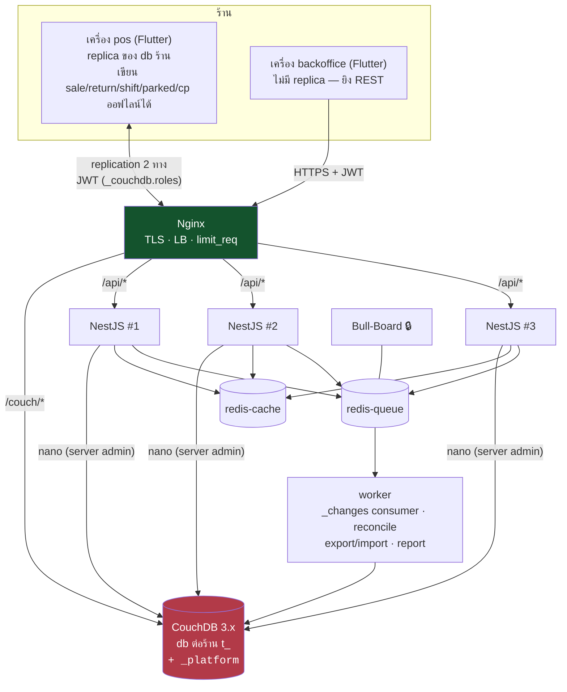

# 06 — แผนที่แก้แล้ว: CouchDB แทน PostgreSQL (ฉบับเสนอ 2026-09-08)

> **สถานะ: 🟡 Proposed** — เขียนตามที่อาจารย์แจ้งปากเปล่าว่า *"POS ควรใช้ CouchDB ไม่ใช่ PostgreSQL"*
> การตัดสินใจอยู่ใน [ADR-0012](adr/0012-couchdb-replaces-postgres.md) (ยัง **ไม่ Accepted**)
> เอกสารนี้คือ "ถ้า ADR-0012 ผ่าน แผนทั้งชุดจะหน้าตาแบบไหน" — **ยังไม่ได้แก้ `01`–`03` ตาม** โดยตั้งใจ
> เพราะแก้ไปก่อนแล้วอาจารย์หมายถึงอีกแบบ = รื้อสองรอบ
>
> 🔴 **จนกว่า ADR-0012 จะ Accepted: ห้ามแตะ `server/` และห้ามหยิบ ticket #4–#37** — ทุกใบเขียนบน
> สมมติฐาน Postgres ทำต่อไปคือทำงานทิ้ง

---

## 0. สมมติฐานที่เอกสารนี้ยืนอยู่ (อ่านก่อน)

| # | สมมติฐาน | ยืนยันแล้ว? |
|---|---|---|
| S1 | อาจารย์หมายถึง **แบบ ข** (เครื่องขาย replicate ตรงกับ CouchDB — offline-first) ไม่ใช่แค่สลับ DB หลัง server | ❌ **ยังไม่ยืนยัน** — ถ้าเป็นแบบ ก เอกสารนี้ใช้ไม่ได้ทั้งฉบับ และควรขอคง Postgres (ADR-0012 §"สองความหมาย") |
| S2 | ร้านยังใช้ **Flutter Web** เป็นเครื่องขาย | ✅ ตาม `CLAUDE.md` — แต่ทำให้ S3 เป็นความเสี่ยงหลัก |
| S3 | มี replication client ที่ใช้ได้บน Flutter Web | ❌ **ยังไม่มีหลักฐาน** — ต้อง spike (`§6` งาน `c0`) ก่อนคุยเรื่องอื่น |
| S4 | ADR-0004 (เครื่อง `pos` 1 เครื่องต่อร้าน, `backoffice` ออนไลน์เสมอ) ยังยืน | ✅ — และเป็น **เสาหลัก** ของแผนนี้ ถ้าถอน ADR-0004 แผนนี้ล้ม |
| S5 | ข้อกำหนดคอร์สที่ผูกกับ Postgres (TypeORM / pooling / PG replication) ถูกยกเลิกไปพร้อมคำสั่งเปลี่ยน DB | ❌ ยังไม่ยืนยัน |
| S6 | สแตกที่เหลือ (Nginx / NestJS ≥3 / Redis / BullMQ / JWT / k6 / compose) ยังเป็นข้อกำหนด | ✅ ตามที่เข้าใจ — ไม่ได้ยกเลิกอะไรนอกจาก DB |

---

## 1. ทำไมข้อเสนอนี้ "เข้ากับ" การตัดสินใจเดิมได้มากกว่าที่คิด

ADR ชุดปัจจุบันตัดสินไปแล้ว 3 อย่างที่บังเอิญเป็นสิ่งที่ CouchDB ต้องการพอดี:

1. **ADR-0004 — `pos` เครื่องเดียวต่อร้าน, `backoffice` ออนไลน์เสมอ** → มี offline writer เดียว
   = doc ประเภท "เงิน" ทุกตัวมี writer เดียว = **ไม่มี replication conflict บน path เงินโดยโครงสร้าง**
   นี่คือสิ่งที่ Architecture B ของเดิมไม่มี (`03 §3` ข้อเสีย 🔴 ข้อแรก) และเป็นเหตุผลที่ B ถูกตัด
2. **ADR-0007 เฟส 2 — เครื่อง `pos` ออกเลข RC/CN เอง** → ตรงกับ "counter ไม่เหมาะกับ CouchDB" ทุกประการ
   แค่เลื่อนกติกาเฟส 2 มาเป็นเฟส 1
3. **`04` ข้อ 13 — server เขียน `movements` คนเดียว** → กลายเป็น "NestJS เขียน doc `movement` ประเภท
   receive/adjust คนเดียว" ส่วนขาย/คืนเป็น doc ของตัวเองที่ view รวมให้ ไม่ต้องมี movement ซ้ำ

สิ่งที่ **หายไป** และต้องยอมรับตรง ๆ: ACID ข้ามหลาย doc, RLS, FK, `NUMERIC`, การพิสูจน์แบบ
"200 คนแย่ง 50 ชิ้น" — แต่ละข้อมีที่ไปใน §4 และ §7 ไม่ใช่ปล่อยหาย

---

## 2. ผลกระทบต่อการตัดสินใจเดิม (ADR ทีละฉบับ)

| ADR | ชะตา | ที่เปลี่ยน |
|---|---|---|
| 0001 provisioning | 🟡 แก้ | `POST /platform/tenants` = สร้าง db `t_<code>` + `_security` + apply design docs + seed 5 category docs + user owner + device `pos` #1 ในขั้นเดียว (ไม่มี transaction ให้ห่อ → ต้อง idempotent: รันซ้ำแล้วผลเท่าเดิม) |
| 0002 platform admin | 🟡 แก้ | `platform_admins` เก็บใน db `_platform` (NestJS อ่านเอง) · "DataSource ที่ BYPASSRLS" → "CouchDB server-admin credential อยู่กับ NestJS เท่านั้น ไม่มี path ไหนของร้านใช้" · `/platform/*` ยังกันออกอินเทอร์เน็ต |
| 0003 lifecycle | 🟡 แก้ | suspend = ถอด role `tenant:<tid>` ออกจาก `_security` ของ db + NestJS guard ปฏิเสธทันที · replication ที่ถือ JWT เดิมยังผ่านได้ ≤15 นาที (JWT revoke ไม่ได้ — ตรงกับ ADR-0009 อยู่แล้ว) |
| 0004 device roles | ✅ **คงเดิม** + ขยาย | เพิ่มกติกา: **มีแต่ `pos` ที่ replicate** (JWT ของเครื่องที่ไม่มี `drole=pos` จะไม่ได้ claim `_couchdb.roles`) · ตาราง "ทำได้/ไม่ได้" ใช้เป็น `validate_doc_update` ต่อ doc type (ปิด #13 ไปในตัว) |
| 0005 portability | 🟢 **ดีขึ้น** | export = replicate db → ไฟล์/`_all_docs?include_docs` · **restore รายร้านทำได้จริง** (replicate กลับ) → ควรถอนข้อ "ไม่รับปาก restore" |
| 0006 rate limit | 🟡 แก้ | NestJS guard เหมือนเดิม · **เพิ่ม**: replication ไม่ผ่าน NestJS → Nginx `limit_req` บน `/couch/*` ต่อ IP + CouchDB `[chttpd] max_http_request_size` · ต่อ tenant บน path replication **ทำไม่ได้** (Nginx อ่าน JWT ไม่ได้) — ยอมรับ |
| 0007 numbering | 🟡 เลื่อนเฟส **+ แก้ 1 ข้อ** | กติกา "เฟส 2" ใช้ตั้งแต่วันแรก: `pos` ออก RC/CN จาก counter ใน replica · **CP ย้ายมาให้ `pos` ออกด้วย** — ADR-0007 ปัจจุบันเขียนว่า CP "server ออกตลอดไป" แต่ CP เป็น `pos`-only (ADR-0004) และต้องทำตอนออฟไลน์ได้ → เป็น **amendment ของ ADR-0007** ไม่ใช่การเลื่อนเฟสเฉย ๆ (รอบ 4 M6); `_id = "sale:RC01-2569-09-0042"` = UNIQUE · server ออก PO/QT ด้วย CAS บน `counter:po:2569-09` · high-water mark = view `counters/max_by_period` · "ห้ามออกเลขถ้า period ยังไม่ seed" ยังจำเป็น (replica ใหม่ต้อง pull view ก่อน) · ⚠️ รูปแบบ `RC01-…` Accepted ระดับโปรเจกต์แล้ว แต่ **เจ้าของร้านยังไม่เห็นใบเสร็จตัวอย่าง** (`adr/README` คำถามข้อ 3) และ `CONTRACT.md §7` ยังสเปค `docNo()` แบบสุ่ม — แผนนี้ทำให้คำถามนั้น**ต้องตอบก่อน `c3.1`** ไม่ใช่ก่อนพิมพ์ใบแรก |
| 0008 cost_at_sale | ✅ คงเดิม | `pos` snapshot `product.costSatang` จาก replica ตอนขาย — ราคา/ทุนที่ backoffice แก้จะถึงเครื่องผ่าน replication (stale ได้ตอนออฟไลน์ = พฤติกรรมเดียวกับ `04` Q15 "ราคาล็อกตอนลูกค้าจ่าย") |
| 0009 JWT | ✅ คงเดิม | JWT ตัวเดียวใช้ทั้ง NestJS และ CouchDB (`jwt_authentication_handler`, HMAC key ร่วม, `sub` = username, `_couchdb.roles = ["tenant:<tid>", "pos"]`) · refresh ตี 4 เหมือนเดิม · เครื่อง retire → refresh ไม่ผ่าน → replication หยุดภายใน 15 นาที |
| 0010 write-through cache | ❌ **ยกเลิก** | ไม่มี `ApiRepository` สำหรับ `pos` — replica **คือ** ข้อมูล ไม่ใช่ cache · Drift schema v3 (`offlineOk`) ไม่ต้องทำ · **แต่** `backoffice` (ยิง REST) ยังต้องมี implementation ของ repository interface ที่คุย NestJS → ADR-0010 เหลือใช้เฉพาะ `backoffice` ฝั่งอ่าน |
| 0011 monorepo | ✅ คงเดิม | — |

**เอกสารหลัก:** `01` → เขียนใหม่เป็น "document model" (§4 ของไฟล์นี้คือโครง) · `02` → ตัด endpoint ฝั่ง `pos`
ออกทั้งกลุ่ม (sales/returns/shifts/parked/credit-payments) เหลือ backoffice + admin plane + reports ·
`03` → B ไม่ตายแล้ว §3/§6/§7 ต้องเขียนใหม่ · `04` → คงไว้เป็นประวัติ · `00_BASICS` → เพิ่มบท CouchDB
(document, `_rev`, replication, view/reduce, conflict) แทนบท SQL/transaction

---

## 3. สถาปัตยกรรมหลังเปลี่ยน



**ใครเขียนอะไร (กติกาสำคัญที่สุดของแผนนี้):**

| doc type | writer | เขียนออฟไลน์ | ถูก update ได้ไหม |
|---|---|---|---|
| `sale`, `return`, `credit_payment`, `drawer_entry`, `parked` | **`pos` เท่านั้น** | ✅ | ❌ append-only (ยกเว้น `sale.voided` — writer เดียวกัน จึงปลอดภัย) · quote ที่แปลงเป็นบิลบันทึกเป็น `sale.fromQuoteId` ไม่ update quote doc (รอบ 4 M3) |
| `shift` | `pos` **+ NestJS กรณีเดียว**: retire เครื่องกลางกะ (ADR-0004 "ย้ายเครื่องขายกลางกะ" สั่งให้ server ปิดกะพร้อม `retired_at`) | ✅ | ✅ (open → close) · **นี่คือ doc เดียวบน path เงินที่มี 2 writer** — กติกา: close จาก retire ชนะ; ถ้าเครื่องเก่ากลับมา replicate close ของตัวเอง → `_conflicts` เข้าคิว reconciliation ลิ้นชัก (owner เทียบ `physicalCash` สองค่า) |
| `customer`, `mechanic` | **`pos` + NestJS** (รอบ 4 M2: เพิ่มลูกค้าหน้าเคาน์เตอร์ตอนออฟไลน์เป็นงานประจำวัน ห้ามหาย) | ✅ | ✅ — ไม่ใช่ doc เงิน (ยอดสะสมอยู่ใน view §4.4) conflict = แค่ชื่อ/เบอร์ → เลือก `updatedAt` ล่าสุด, log |
| `product`, `category`, `supplier`, `settings` | **NestJS เท่านั้น** (backoffice ผ่าน REST; `pos` ก็ผ่าน REST เมื่อออนไลน์) | ❌ | ✅ — conflict เป็นไปได้เฉพาะ NestJS ×3 เขียนพร้อมกัน → CAS retry |
| `purchase_order`, `quote`, `movement` (`opening` / `receive` / `adjustment-in|out`) | NestJS เท่านั้น (`quote.status='converted'` **derive จาก view** ของ `sale.fromQuoteId` ไม่เขียนกลับ) | ❌ | PO/quote ✅ · movement ❌ append-only |
| `counter:*` | NestJS (PO/QT) | — | CAS |
| `_design/*` | job `migrate` | — | versioned |

ผลลัพธ์: doc **เงิน** ที่ทั้งสองฝั่งเขียนมีตัวเดียวคือ `shift` ในกรณี retire (มีกติกาแล้วข้างบน) ·
`customer`/`mechanic` มี 2 writer แต่ไม่ถือเงิน · ที่เหลือ conflict ได้แค่จาก NestJS ×3 ชนกันเอง (CAS retry)
· "conflict เชิงธุรกิจ" ที่ต้องมี guard คือ §4.3

### 3.1 build เดียว สองบทบาท — ตัดสินตอน runtime (scrutinize รอบ 4 จับว่าตกไป)

`CONTRACT.md §4` ผูก repository implementation ชุดเดียวตอน boot **ก่อน login** แต่ `drole` รู้หลัง
`POST /auth/device` (ADR-0004) → ต้องแก้โครง DI ที่ `CONTRACT.md` freeze ไว้:

* `repository_providers.dart` / `database.dart` / `main.dart` **ปลด freeze** — เป็นงานใน `c3` ไม่ใช่ของแถม
* ลำดับ boot: อ่าน device token จาก local storage → ถ้ามีและ `drole = pos` → เปิด local store + replicator
  แล้ว provide `Local*Repository` (13 ตัว port จาก Drift เดิม) · ถ้าไม่มี/`backoffice` → provide
  `Api*Repository` (REST, ไม่มี local store — ADR-0010 ส่วนที่เหลือ)
* หน้าจอไม่รู้ความต่าง — interface เดิมตาม `CONTRACT.md §3` ทั้ง 13 ตัว
* เครื่อง `pos` เมื่อ **ออนไลน์** ก็ยังเขียนผ่าน local store + replicate (ไม่สลับไป REST) — มี code path เดียว
  ต่อบทบาท ไม่ใช่ 2 path ต่อเครื่องแบบ Architecture C · ส่วน write ของ doc ที่ NestJS เป็นเจ้าของ
  (สินค้า/ลูกค้า/ช่าง/ตั้งค่า) เครื่อง `pos` ยิง REST เหมือน backoffice แล้วรอ replication นำผลกลับ

---

## 4. Document model + invariants (`01 §7` ย้ายมาอยู่ไหน)

### 4.1 `_id` และ uniqueness

| เดิม (`UNIQUE`) | ใหม่ (`_id`) |
|---|---|
| `(tenant_id, receipt_no)` | `sale:RC01-2569-09-0042` — tenant แยกด้วย db อยู่แล้ว |
| `(tenant_id, cn_no)` / `po_no` / `quote_no` / `cp receipt_no` | `return:CN01-…` / `po:PO00-…` / `quote:QT00-…` / `credit_payment:CP01-…` |
| `(tenant_id, part_no) WHERE deleted_at IS NULL` | ❌ บังคับที่ `_id` ไม่ได้ (part_no แก้ได้) → NestJS เช็คด้วย view `products/by_part_no` ก่อนเขียน **ไม่ atomic** ยอมรับ race ระหว่าง NestJS ×3 (โอกาสต่ำ, ผลคือ `DUPLICATE_PART_NO` โผล่ช้าใน reconciliation) |
| `sale_items` PK `(sale_id, line_no)` | embed `items[]` ใน sale doc — บิลเป็น doc เดียวเสมอ (นี่คือข้อได้เปรียบ: บิลไม่มีวันครึ่ง ๆ) |
| `one_pos_per_tenant` | อยู่ที่ `_platform` db (devices) ซึ่ง NestJS เขียนคนเดียว → เช็คใน code + CAS |
| `uq_shift_active` | writer เดียว (`pos`) เช็ค local |

### 4.2 สต็อก = ledger (แทน `products.stock` + `SELECT FOR UPDATE`)

```
stock(p) = Σ movement.effectiveDelta (opening/receive/adjust)  +  Σ(-item.qty ของ sale ทุกใบ รวม voided)  +  Σ(+item.qty ของ return)
```

**3 คำที่รอบ 4 จับได้ว่าฉบับแรกเขียนผิด — ห้ามเขียน view โดยไม่มี 3 ข้อนี้:**

1. **`voided` ไม่ใช่เทอมของ ledger** — `returns_repository.dart:123` คืนสต็อกผ่าน return ก่อน แล้ว `:197`
   ค่อยตั้ง `voided` เมื่อคืนครบ; `voided` ไม่เคยมีผลต่อสต็อกเอง ถ้า view ตัด sale ที่ voided ออก บิลที่คืนครบ
   จะบวกสองรอบ (−qty หาย + return +qty) → สต็อกบวมเท่าตัวต่อบิล · `voided` เป็นแค่ flag กันคืนซ้ำ/แสดงผล
2. **`movement.delta` ต้องเป็นค่าที่มีผลจริง ไม่ใช่ที่ขอ** — `products_repository.dart:138-149` clamp
   `newStock = max(0, stock+delta)` แต่เขียน movement ด้วย `delta` ที่ขอ (`stockAfter` เป็นค่า clamp แล้ว)
   → NestJS ต้องเขียน `effectiveDelta = max(delta, −stockNow)` และตอน import (§4.8) ต้อง**คำนวณ delta
   ใหม่จาก `stockAfter` ที่ต่อเนื่องกัน** ไม่ copy `delta` เดิม
3. **ต้องมี opening balance** — วันนี้ขาย/คืนไม่เขียน `movements` (`01 §5.2` กล่องเตือน) ดังนั้น
   `legacy stock ≠ Σ movements` เสมอ · import ต้องสร้าง `movement:opening:<pid>` 1 doc/สินค้า =
   `legacyStock − Σ movement.effectiveDelta + Σ soldQty − Σ returnedQty` ไม่งั้น checklist 6 ค่าไม่มีวันผ่าน

* view `stock/by_product` — map emit `[productId] → delta` จาก 3 doc type, reduce `_sum`
* ฝั่งเครื่อง `pos` คำนวณสูตรเดียวกันจาก replica (คง `products.stock` เป็น **คอลัมน์ derived ใน local store**
  ที่ update **ทันทีตอนเครื่องเขียน sale/return เอง** (writer เดียว จึงถูกเสมอ) และ update อีกครั้งเมื่อ
  replication นำ movement จาก backoffice เข้า — Checkout จึงยังค้นในหน่วยความจำได้เหมือนเดิม และ test เดิม
  ที่ assert "stock ลดทันทีหลัง `saveSale`" ยังเป็นจริง **แต่ต้องเขียน assertion ใหม่** เพราะแหล่งที่ลดคือ
  derived column ไม่ใช่ `UPDATE products`)
* `saveSale` ของเครื่อง `pos` ทำเหมือน `sales_repository.dart:33-56` **เป๊ะ**: pre-check ทุกบรรทัดจาก
  replica → ข้อความไทย `สต็อกไม่พอ:\n…` ครบทุกบรรทัด → เขียน sale doc **1 doc** ไม่มีอะไรให้ rollback
  เพราะไม่มีการ update product เลย · race ที่ `01 §7.1` เตือน (pre-check นอก transaction) **หายไป**
  เพราะเครื่องเดียวเขียน sale และ Dart เป็น single-thread
* `01 §5.2` "server เขียน `movements` คนเดียว + unique กันซ้ำ" → ยังจริงสำหรับ receive/adjust;
  sale/return **ไม่มี movement** (view รวมให้) — ไม่มี double-count
* `CHECK (stock >= 0)` ไม่มีที่ให้ใส่ → view `stock/negative` + job reconcile แจ้ง owner (§4.3)

### 4.3 conflict เชิงธุรกิจจุดเดียวที่เหลือ: `adjustment-out` ระหว่าง `pos` ออฟไลน์

`backoffice` สั่ง `adjust-stock -5` (clamp ที่ 0 ตาม `01 §7.6`) ขณะ `pos` ออฟไลน์ขายไป 3 → รวมแล้วติดลบ
ทางแก้ที่ **เสนอไว้แล้วแต่ยังไม่ลงเอกสาร** (`04` Q14 → ข้อเสนอ #33 🟡) ใช้ได้ตรง ๆ: **NestJS ตอบ `409 POS_OFFLINE`
สำหรับ movement ที่ลดสต็อก เมื่อ `pos` ไม่ได้ติดต่อ server เกิน 5 นาที** · receive (บวก) ไม่ต้องกัน ·
ถ้าหลุดจนติดลบจริง → view `stock/negative` เข้าคิว reconciliation ให้ owner ปรับ (ของใหม่เทียบแอปเดิม แต่จำเป็น)

⚠️ "ติดต่อ server ล่าสุดเมื่อไหร่" ต้องวัดจากของที่ NestJS **เห็นจริง** — `_local/<replication-id>` checkpoint
ใช้ไม่ได้ (เขียนโดยเครื่อง, ไม่โผล่ใน `_changes`, เครื่องที่ออนไลน์แต่ไม่มีอะไรจะส่งก็ไม่ขยับ = false `POS_OFFLINE`
ตอนบ่ายเงียบ ๆ) และ Nginx อ่าน JWT ไม่ได้ (ADR-0006) → **ทุก request บน `/couch/*` ต้องผ่าน Nginx
`auth_request` ไปที่ NestJS** ซึ่งตรวจ JWT + `devices.retired_at` + `tenants.status` แล้วประทับ
`devices.last_seen_at` — guard อ่านค่านั้น · ผลพลอยได้: ปิดช่อง "เครื่องที่ retire แล้วยังเขียนได้อีก 15 นาที"
(รอบ 4 M5) เพราะ revoke มีผลต่อ request ถัดไปทันที ไม่ต้องรอ JWT หมดอายุ

### 4.4 ยอดสะสม (customers.points/totalSpend, mechanics.credit_balance/total_*) — derived **จากค่าที่ persist ตอนเขียน** ไม่ใช่จาก `_sum` เปล่า ๆ

รอบ 4 พิสูจน์ว่า "view `_sum` แล้ว clamp ตอนอ่าน" **ไม่เท่ากับ** Dart ที่ clamp ทุก operation:

> เครดิตขาย ฿1,000 → balance 1,000 · ช่างจ่ายเกิน CP ฿1,500 → Dart `max(0, −500)` = **0** · ขายเครดิตอีก ฿500 → Dart = **500**
> แต่ `_sum` = 1000 − 1500 + 500 = 0 → clamp ตอนอ่าน = **0** — หนี้จริง ฿500 หายไป และ checklist `01 §9`
> ข้อ "credit_balance ทุกคนเท่ากัน" ล้มทันทีกับร้านที่เคยรับจ่ายเกิน

และ `returns_repository.dart:167-169` ใช้ `discountBase = totalDiscount != 0 ? totalDiscount : totalCredit`
= อ่านค่าสะสม **ณ เวลาคืน** — order-dependent, ไม่มี reduce ใดสร้างซ้ำได้ · `ReturnRow` วันนี้ **ไม่มี**
field `pointsReversed`/`spendReversed` (ฉบับแรกเขียนว่ามี — ผิด)

**กติกาที่ใช้แทน:**

* **ค่าที่ "มีผลจริง" ถูกคำนวณและ persist ลง doc ตอนเขียน โดย writer เดียว (`pos`)** ด้วยสูตร Dart เดิมเป๊ะ:
  * `sale` doc: `pointsGranted`, `spendApplied` (= total), `mechanic: {salesApplied, discountApplied, markupApplied, creditApplied}`
  * `credit_payment` doc: `creditApplied = min(amount, balanceAtWrite)` (เงินที่จ่ายเกินยังบันทึกเป็น `amount` เต็ม)
  * `return` doc: `pointsReversed`, `spendReversed`, `salesReversed`, `discountReversed`, `markupReversed`,
    `creditReversed` — แต่ละค่า **clamp แล้วเทียบกับยอดสะสม ณ ตอนคืน** เหมือน `returns_repository.dart:144-181`
* view `customers/agg` / `mechanics/agg` = `_sum` ของ field ที่ persist แล้วเท่านั้น → เท่ากับ Dart ทุกลำดับ
  เพราะ clamp เกิดที่เดิม (ตอนเขียน) และเครื่อง `pos` เป็นคนเดียวที่เห็นยอดสะสมล่าสุด (ค่าใน local store)
* **ต้นทุน:** ยอดสะสมจึงถูกได้ก็ต่อเมื่อ **ทุก write ที่แตะยอดนั้นมาจากเครื่องเดียว** — เป็นจริงตาม ADR-0004
  (ขาย/คืน/CP เป็น `pos`-only ทั้งหมด) และเป็นอีกเหตุผลว่าถ้าถอน ADR-0004 แผนนี้ล้ม
* **#11 (`total_credit`) ต้องปิดก่อน `c3.1`** — สูตร `discountBase` ข้างบนอ่าน `totalCredit` ซึ่ง Dart ไม่เคยเขียน
  (สาระของ #11) ถ้ายังไม่เคาะ view เขียนไม่ได้
* เครื่อง `pos` เก็บยอดสะสมเดียวกันใน local store (update ตอนเขียนเอง) เพื่อโชว์แต้ม/วงเงินตอนขายโดยไม่รอ view

### 4.5 กติกาที่ **ไม่เปลี่ยนเลย** (ย้ายที่บังคับจาก server มาเครื่อง `pos`)

| กติกา | อยู่ที่ | หมายเหตุ |
|---|---|---|
| ข้อความไทยทุกตัว (`02 §8`) | `pos` (Dart เดิม) | copy ตรงตัวเหมือนเดิม |
| คืนเกิน (qty ≤ sold − refunded) | `pos` — อ่าน sale + return docs ของบิลนั้นจาก replica (returns เป็นของ `pos` เท่านั้น → ครบเสมอ) | |
| คืนครบ → `voided` / voided ห้ามคืนซ้ำ | `pos` | update sale doc โดย writer เดียว |
| `openShift` archive กะเก่า · `addDrawerEntry` หลังปิดกะ → throw | `pos` | |
| WAC `receivePO` (`01 §7.4` พร้อม 2 fallback) | NestJS — `old_stock` อ่านจาก view ณ ตอนรับ และ **เขียน `product.cost` ใหม่** (`purchase_orders_repository.dart:120-127`) · ถ้า `pos` ออฟไลน์อยู่: old_stock stale + `pos` snapshot `costAtSale` จากทุนก่อน WAC (ADR-0008, สอดคล้อง `04` Q15) → **ใช้ `POS_OFFLINE` guard เดียวกับ §4.3 กับ receive ด้วย** (รอบ 4 m2 — เลิก "ต้องเคาะ") | |
| PO รับซ้ำไม่ได้ (`PO_ALREADY_RECEIVED`) | NestJS — เช็ค `status` + CAS `_rev` ของ PO doc (atomic ต่อ doc ✅) | |
| quotes/parked ไม่แตะสต็อก · adjust clamp 0 | เหมือนเดิม | |
| `pointsGranted = floor(total/10)`, `round2` | `pos` | |

### 4.6 เงิน

JSON ไม่มี decimal · เสนอ **สตางค์ integer** ในทุก doc (`totalSatang: 12345`) แปลง ↔ double ที่ชั้น repository
ที่เดียว (ที่เดียวกับที่ `baht()`/`round2()` อยู่) · เหตุผล: view `_sum` บน double สะสม error ข้ามพันบิล
ทางเลือกคือคง double + `round2` เหมือน Drift (parity 100%, มี float error ในรายงานรวม) — **เจ้าของโปรเจกต์เคาะ**

### 4.7 ค้นหา / รายงาน

* ค้นไทย (Checkout, Vehicle Search): **ฝั่ง client จาก replica** — เหมือนวันนี้ทุกประการ, `pg_trgm` ไม่ต้องมี
  `backoffice` ค้นผ่าน NestJS → Mango `$regex` (ไม่มี index, db ต่อร้านเล็ก รับได้) หรือ cache รายการสินค้า
  ทั้งร้านใน Redis (`t:{tid}:products`) แล้วกรองใน NestJS
* รายงาน (`02 §3.9`, `#29`, `#30`): view ต่อรายงาน key `[yyyy, mm, dd]` (จาก `dateKey` เดียวกับ Dart) reduce `_sum`
  → `group_level` ให้รายวัน/รายเดือน · ใบปิดกะคำนวณที่ `pos` จาก replica (ออฟไลน์ได้) และ NestJS มี view
  เดียวกันให้ owner ดูจาก backoffice · **สูตร + "ยอดช่างจ่ายหนี้เงินสด"** (`04` ข้อ 11) เหมือนเดิม

### 4.8 Data migration (`01 §9`) — ง่ายลง

snapshot `sa_*` → docs (sale + items รวมเป็น doc เดียว, shift + drawer entries แยก doc, `zone→category`
ทำตอนแปลง) **บวกของที่ไม่ใช่ 1:1** (รอบ 4 B2/B3): (1) `movement.delta` คำนวณใหม่จาก `stockAfter`
ที่ต่อเนื่องกันต่อสินค้า (2) `movement:opening:<pid>` ต่อสินค้า ตามสูตร §4.2 ข้อ 3 (3) field ที่ persist
ตาม §4.4 คำนวณย้อนหลังจากลำดับบิล/คืน/CP ของแต่ละคน **โดย replay สูตร Dart ตามเวลา** (ไม่มีทางลัด)
→ `_bulk_docs` เป็นชุด → checklist 6 ค่าเดิมตรวจจาก view · pre-flight scan เหมือนเดิม · `stock < 0`
ต้องหยุดที่ pre-flight เหมือนเดิม (ไม่มี rollback ทั้งร้านแล้ว)

**import ที่ค้างกลางทาง (รอบ 4 m1):** เขียน `meta:import {status:'running'}` ก่อน · `validate_doc_update`
ปฏิเสธ write ทุกอย่างที่ไม่ใช่ของ importer จนกว่า `status='done'` (กัน `pos` replicate ledger ครึ่งเดียวแล้ว
ขายไม่ได้เพราะ `สต็อกไม่พอ`) · import เป็น **create-only** (`PUT` ชน 409 = ข้ามได้เพราะ `_id` เดิม = doc เดิม)
· แก้ข้อมูลหลัง import = ลบ db แล้วสร้างใหม่ ไม่ re-import ทับ

---

## 5. Auth / multi-tenant / ops

* **JWT ตัวเดียว สองผู้ตรวจ** — NestJS ออก (`aud: tenant`, `tid`, `did`, `drole`, `sub`) และใส่
  `_couchdb.roles: ["tenant:<tid>"]` **เฉพาะเมื่อ `drole = pos`** · CouchDB `[jwt_auth]` ใช้ HMAC key เดียวกัน
  (`required_claims = exp`) · db `t_<code>` `_security.members.roles = ["tenant:<tid>"]` → เครื่องอื่น/ร้านอื่น
  replicate ได้ 403 · server admin credential ใช้โดย NestJS/worker เท่านั้น
* **แต่ CouchDB ตรวจ JWT แบบ stateless เท่านั้น** → เครื่องที่ retire กลางกะยังเขียนได้จนหมดอายุ (≤15 นาที)
  ซึ่งของเดิมไม่มี (ทุก write ผ่าน guard) → **Nginx `auth_request` ไป NestJS ทุก request บน `/couch/*`**
  (§4.3) เช็ค `retired_at` + `tenants.status` ต่อ request · CouchDB ยังตรวจ JWT ซ้ำอีกชั้น (defence-in-depth)
* **initial replication ยาวเกิน 15 นาที** (รอบ 4 m3, ยังไม่ได้วัด): replication = request หลายร้อยครั้ง คนละ
  auth → client ต้องต่ออายุ token กลางสตรีมได้ (PouchDB มี `fetch` hook; replicator ที่เขียนเองต้องมี)
  — เป็นเกณฑ์ผ่านของ `c0` ข้อหนึ่ง
* **Nginx** ต้อง proxy `/couch/t_<code>/*` ให้เฉพาะ path replication (`_changes`, `_revs_diff`, `_bulk_docs`,
  `_bulk_get`, `_local/*`, `_all_docs`, design view ที่ต้องใช้) และ **บล็อก** `_all_dbs`, `_users`, `_replicator`,
  `/_utils`, `/_node/*`, `PUT/DELETE /t_*` (สร้าง/ลบ db) — ทดสอบด้วย integration test เหมือนเคส "อ่านข้ามร้าน"
* **Redis 2 ตัว / Bull-Board auth / `/platform/*` internal** — ไม่เปลี่ยน (`03 §8` "ห้ามลืม")
* **CouchDB cluster** — VM คณะ 4 vCPU / 6 GB: 3 node CouchDB + NestJS ×3 + Redis ×2 **ไม่พอ** → เฟส 1
  รัน CouchDB **1 node** (`n=1`, `q=2`) + `mem_limit` ตามเดิม, ระบุชัดในเอกสารส่งอาจารย์ว่า n=3 ต้องใช้เครื่องอื่น
  (ถ้าอาจารย์ต้องการ cluster จริงต้องถามข้อ 2 ใน ADR-0012 ให้ชัด)
* **ห้ามใช้ `couch_peruser`** — เราต้องการ db ต่อ **ร้าน** ไม่ใช่ต่อ user

---

## 6. งานที่เปลี่ยน — ticket ทีละใบ

### 6.1 งานใหม่ที่ต้องมาก่อน (`c*`)

| งาน | คืออะไร | ทีม | บล็อก |
|---|---|---|---|
| **`c0` spike replication client บน Flutter Web** 🔴 | 2 สัปดาห์ hard cap: (ก) `foodb` + adapter (native ได้, **Web ไม่ได้**) (ข) PouchDB ผ่าน `package:web` JS interop เฉพาะ Web + `foodb` native = 2 implementation (ค) **เขียน replicator เองบน Drift** (`_changes?since` → `_revs_diff` → `_bulk_docs new_edits:false` + `_local` checkpoint; ไม่ resolve conflict — flag เข้า reconciliation) · ⚠️ ทาง (ค) **ไม่ใช่แค่ replicator**: ทุกตารางต้องเพิ่ม `_rev` + rev history (ไม่ใช่ scalar), tombstone (วันนี้มีแค่ 3 ตารางที่มี `deletedAt`), doc type, และต้อง **materialize** `saleItems/poItems/returnItems/quoteItems` เป็น `items[]` ในตัวแม่ (§4.1) — เป็นชั้นแปลง row↔doc เต็มตัว ประมาณการเดิม "600–900 บรรทัด" ต่ำเกินจริง · test 123 ตัว **ต้องเขียน assertion ใหม่** (§4.2) ไม่ใช่ "เก็บไว้ได้" · **ข้อจำกัด Web:** Drift/replicator วิ่งใน worker ของแท็บ — ปิดแท็บ = หยุด sync (ไม่มี service worker) บิลค้างจะขึ้นเมื่อเปิดแท็บครั้งถัดไป ต้องมีแถบ "ยังไม่ได้ส่ง N บิล" บนจอเสมอ · **เกณฑ์ผ่าน:** ขาย 200 บิลออฟไลน์บน Chrome → กลับออนไลน์ (แท็บเปิดอยู่) → ครบ 200 บน server ภายใน 60 วิ · **ถ้าไม่ผ่านทั้ง 3 ทาง = แบบ ข ทำไม่ได้ → กลับไปเสนอ Postgres** | team/1 + team/2 | ทุกอย่าง |
| `c1` compose: `postgres` → `couchdb`, job `migrate` = apply design docs ทุก db | แทน #15 | team/1 | c0 |
| `c2` design docs: `stock/*`, `customers/agg`, `mechanics/agg`, `reports/*`, `counters/*`, `validate_doc_update` ตาม ADR-0004 | แทน #15 §RLS + #21 + #29 | team/2 | c1 |
| `c3` client data layer: doc model + local derived stock + repositories 13 ตัว port ลง doc store + replication service + สถานะ sync บนจอ | งาน frontend ก้อนใหญ่สุด — **แทน `q1`/`q2`/schema v3** | ทั้ง 3 ทีม (แบ่งตามคอลัมน์ frontend เดิม) | c0 |
| `c4` `_changes` consumer + reconciliation queue (stock ติดลบ, `DUPLICATE_PART_NO` ช้า, doc ที่ `validate` ปัด) + หน้าจอ owner | แทน `q3` | team/3 | c2 |
| `c5` k6 + ledger proof (§7) | แทน #37 | team/3 | c3, c4 |

### 6.2 ticket เดิม

| ticket | ชะตา | เหตุผล/ที่เปลี่ยน |
|---|---|---|
| #14 compose (merged) | ✅ เก็บ → `c1` แก้ service เดียว | Nginx/health/envelope/logger ใช้ต่อ |
| #15 schema+RLS (merged) | ❌ **ทิ้ง** | ไม่มีตาราง ไม่มี RLS — ทิ้ง 653 บรรทัด migration + 305 บรรทัด test |
| #38 backend CI (merged) | 🟡 แก้ | สลับ service `postgres` → `couchdb`; ทิ้ง `schema.e2e-spec` เพิ่ม test design docs + Nginx allowlist |
| #4 auth + tenancy guard + RLS | 🟡 เขียนใหม่ | JWT + `_couchdb.roles` + guard เช็ค `tenants.status` จาก `_platform`; ไม่มี `SET LOCAL` |
| #5 platform + provisioning | 🟡 เขียนใหม่ | ตาม ADR-0001 แถวใน §2 |
| #6 device enrolment | ✅ เก็บ + เพิ่ม | claim replication เฉพาะ `pos` |
| #16 products | 🟡 เขียนใหม่ | product doc ไม่มี `stock`; adjust = movement doc + `POS_OFFLINE` guard |
| #17 customers/mechanics | 🟡 เขียนใหม่ | CRUD doc + อ่าน agg จาก view |
| #18 idempotency | 🔻 หด | `pos` ไม่ต้อง (`_id` คือ key) · เหลือสำหรับ backoffice write (receive/adjust) — เก็บใน Redis ตามคอร์ส |
| #19 doc number issuer | ✂️ แยก | ฝั่ง `pos` → `c3`; ฝั่ง server (PO/QT) CAS counter doc |
| #20 POST /sales | ➡️ **ย้ายไป frontend** (`c3`) | server ไม่มี endpoint นี้ · `validate_doc_update` ตรวจโครง doc + role เท่านั้น |
| #21 ledger effects | ➡️ กลายเป็น view (`c2`) + local derived (`c3`) | |
| #22 returns · #23 void · #24 CP · #28 shifts · #30 closing | ➡️ **ย้ายไป frontend** (`c3`) | ทั้งหมดเป็น `pos`-only ตาม ADR-0004 |
| #25 bootstrap | 🔻 หด | `backoffice` เท่านั้น (`pos` ได้จาก replication) |
| #26 PO/receive | 🟡 เขียนใหม่ | WAC จาก view; CAS บน PO doc |
| #27 quotes/parked | ✂️ แยก | quotes → NestJS (ทั้งสอง role); parked → `c3` |
| #29 reports | 🟡 เขียนใหม่ | view + Redis cache |
| #31 cache · #32 invalidation · #33 rate limit · #34 BullMQ · #35 jobs · #36 export | ✅ เก็บ, แก้เนื้อหา | #36 ง่ายลงมาก (replicate db → ไฟล์) · #33 เพิ่ม Nginx `/couch/*` |
| #37 k6 | 🟡 เขียนใหม่ → `c5` | |
| #39 · #40 CI | ✅ เก็บ | |
| #11 `total_credit` | ⏳ ยังค้าง | บล็อก `c2` view `mechanics/agg` แทน #21 |
| #12 คำไทย 3 ตัว | 🟡 แก้รายการ | `OFFLINE_NOT_ALLOWED` **หายไป** (ไม่มี offlineOk แล้ว) · เพิ่มคำสำหรับ "บิลนี้ทำให้สต็อกติดลบหลัง sync" และ "ยังไม่ได้ sync กี่บิล" (แถบสถานะ) |
| #13 pos-only endpoint list | ✅ ปิดได้ | กลายเป็น `validate_doc_update` ต่อ doc type ตามตาราง ADR-0004 |

### 6.3 ลำดับ (แทน Gantt `03 §8`)

```
c0 spike (gate) ──► c1 compose+couch ──► c2 design docs ──► #4/#5/#6 auth+provision ──► #16/#17/#26/#27/#29 backoffice API
                └──► c3 client data layer + replication ─────────────────────────────┬──► c4 reconcile ──► c5 proof ──► cutover
                                                                                     └──► #31–#36 cache/queue/export
```

**เส้นวิกฤต:** `c0 → c3 → c4 → c5` — ทั้งหมดเป็นงาน **frontend เป็นหลัก** ต่างจากเดิมที่ backend ล้วน →
กติกาอาจารย์ "ทุกคนแตะทั้ง 3 ด้าน" ทำได้ง่ายขึ้น แต่ **คอลัมน์ frontend ที่ยังไม่มี ticket** (`adr/README` หมายเหตุ 1)
กลายเป็นงานหลักทันที ต้องตัด ticket `c3` เป็น 3 ใบ **ตามคอลัมน์ frontend เดิมของแต่ละคน** ก่อนเริ่ม:

| ใบ | ใคร | เนื้อหา | backend ที่คู่กัน | CI ที่คู่กัน |
|---|---|---|---|---|
| `c3.1` | `team/1` NuimanLP | Local repos: sales / returns / credit payments / shifts / drawer / parked + counter RC/CN/CP ในเครื่อง + derived stock (§4.2) | `c1`, #19 ฝั่ง server (PO/QT), #26 | #40 |
| `c3.2` | `team/2` LomerAlloys | Local repos: products / customers / mechanics / quotes (อ่าน) + derived agg (§4.4) + `Api*Repository` ฝั่ง backoffice + import snapshot→docs (§4.8) | `c2` views, #16 #17 #27 #29 | #39 |
| `c3.3` | `team/3` PattaraponKitcharoen | replicator/sync service (ผลจาก `c0`) + role-aware DI (§3.1) + หน้า login/enrol + แถบสถานะ sync + คำไทยชุดใหม่ (#12) | #4 #5 #6, `c4` | #38 แก้ |

ทุกคนยังแตะครบ frontend + backend + CI ตามกติกาอาจารย์

**เรื่อง cutover:** แบบ ข ทำให้ "ไม่ cutover ในเฟส 1" (`04` ข้อ 19) มีน้ำหนักน้อยลง เพราะเครื่องร้านไม่ถอยหลัง
เรื่องออฟไลน์ — แต่ยังต้องผ่าน `c4` (reconciliation) + ADR-0007 ยืนยันหน้าตาใบเสร็จ ก่อน

---

## 7. เกณฑ์ปิดเฟส 1 (ฉบับใหม่ — แทน `03 §8`)

- [ ] `docker compose up` ได้ Nginx + NestJS ×3 + CouchDB + Redis ×2 + worker + Bull-Board · design docs apply แล้วทุก db
- [ ] **Ledger proof** (แทน "200 แย่ง 50") — 🔴 **พูดตรง ๆ ว่ามันพิสูจน์น้อยกว่าของเดิม** (รอบ 4 M7): ของเดิมพิสูจน์
      ว่า server กัน oversell ได้ภายใต้ writer หลายตัวพร้อมกัน · ของใหม่ไม่มี server-side oversell prevention
      **โดยโครงสร้าง** — ที่กันได้เพราะ writer เดียว (ADR-0004) เท่านั้น สิ่งที่ยังพิสูจน์ได้: เครื่อง `pos` ออฟไลน์ขาย
      200 บิลบนสินค้าที่มี 50 → **50 บิลพอดี** (pre-check ในเครื่อง, ที่เหลือ `สต็อกไม่พอ`) → ออนไลน์ → server มี 50 sale
      docs, `stock/by_product` = 0, **`stock/negative` ว่าง**, ไม่มี `_conflicts` บน doc เงิน — ต้องเขียนในรายงาน
      ส่งอาจารย์ว่านี่คือ single-writer proof ไม่ใช่ concurrency proof
- [ ] **race ที่มีจริง** (ADR-0004): `pos` ขาย ×200 (replicate) ขนานกับ `backoffice` receive ×100 + adjust ×100 ผ่าน NestJS
      บนสินค้าเดียวกัน → **`stock/negative` ว่าง** (ไม่ใช่แค่ "sum ตรง" — `_sum` ตรงเสมอโดยนิยาม แม้ติดลบ) และ
      ทุก adjust-out/receive ที่ยิงระหว่าง `pos` ขาดการติดต่อ > 5 นาที ได้ `409 POS_OFFLINE` ครบทุกครั้ง
- [ ] **ยอดสะสมตรง Dart ทุกลำดับ** (รอบ 4 B5): เล่นลำดับ "เครดิต 1,000 → CP 1,500 → เครดิต 500" บนเครื่อง `pos`
      → `mechanics/agg.creditBalance` = **500** (ไม่ใช่ 0) · คืนครบทั้งบิล → `stock/by_product` เท่าก่อนขาย
      (ไม่บวมเท่าตัว — B1) · adjust −5 บนสต็อก 3 → ledger −3 ไม่ใช่ −5 (B2)
- [ ] JWT ของร้าน A replicate `t_b` → 403 · JWT `backoffice` replicate อะไรก็ได้ → 403 · `_all_dbs`/`_utils` ผ่าน Nginx → 404
- [ ] suspend ร้าน → NestJS ปฏิเสธทันที, replication ปฏิเสธภายใน ≤15 นาที, job ค้างของร้านไม่รัน
- [ ] ล้าง IndexedDB → enrol เครื่องใหม่ได้ `device_no` ใหม่ → initial replication ครบ (นับ doc ตรง, token ต่ออายุกลางสตรีมได้)
      → counter RC/CN/**CP** seed จาก view → ขายบิลแรก/รับชำระ CP แรกได้เลขไม่ชน
- [ ] เครื่อง `pos` ที่ retire แล้ว ยิง `_bulk_docs` ด้วย JWT ที่ยังไม่หมดอายุ → **403 ทันที** จาก `auth_request` (M5)
- [ ] เพิ่มลูกค้าใหม่ + ขายให้ลูกค้านั้นตอนออฟไลน์ → ออนไลน์แล้ว customer doc + sale doc ขึ้นครบ, `customers/agg` ถูก (M2)
- [ ] import snapshot ร้านจริง → checklist 6 ค่า (`01 §9`) ตรงจาก view · รันซ้ำ 2 รอบ ผลเท่าเดิม (idempotent)
- [ ] k6 read: `GET /products` (backoffice) 1,000 VU p95 < 200 ms cache hit > 90% · replication `_changes` 50 เครื่องจำลอง
      pull พร้อมกัน ไม่มี error · `POST /purchase-orders/:id/receive` 200 VU ไม่มี lost update (CAS)
- [ ] ข้อเดิมที่ยังใช้: health live/ready แยก · Redis 2 ตัว · Bull-Board auth · ลบลูกค้าที่มีบิล → 200 soft delete ·
      `backoffice` เขียน sale doc ผ่าน `/couch/*` → `validate_doc_update` ปัด 403 · retire `pos` กลางกะ → กะปิดก่อน

---

## 8. สิ่งที่ห้ามหลอกตัวเอง

1. **ทั้งหมดนี้ยืนบน `c0`** — ถ้า Flutter Web replicate ไม่ได้ในเวลาที่กำหนด แบบ ข ตาย และแบบ ก ไม่คุ้ม →
   คำตอบที่ถูกคือกลับไปคุยกับอาจารย์เรื่อง Postgres พร้อมหลักฐาน ไม่ใช่ฝืนทำแบบ ก
2. **เสีย ACID จริง** — บิลเป็น doc เดียวจึงไม่ "ครึ่งบิล" แต่ **สต็อกเป็นค่า derive ที่ตรวจย้อนหลัง** ไม่ใช่ค่าที่ DB
   ปฏิเสธล่วงหน้า · ที่ยังปลอดภัยเพราะ single writer (ADR-0004) **ไม่ใช่เพราะ CouchDB**
3. **reconciliation ยังต้องมี** — น้อยกว่า C มาก (ไม่มี `sync_status='rejected'`, ไม่มี `RECEIPT_NO_CONFLICT`
   เพราะ pos เดียว) แต่ยังมี stock ติดลบจาก §4.3 และ doc ที่ `validate` ปัด
4. **ค่า effort เดิมใช้ไม่ได้** — งาน backend หดมาก (ไม่มี #18–#24/#28/#30), งาน frontend **บวมมาก** (`c3`)
   ต้องประเมินใหม่เป็น man-day หลัง `c0` ห้ามใช้ตัวเลข `03 §6`
5. **การส่งอาจารย์เปลี่ยนหน้าตา** — ไม่มี `SELECT FOR UPDATE`, ไม่มี TypeORM, ไม่มี PG replica ให้โชว์
   ต้องแลกด้วยการโชว์ replication / `_changes` / view / conflict handling — **ถ้าอาจารย์ยังให้คะแนนตาม rubric เดิม
   ทีมจะเสียคะแนน** ถามข้อ 2 ใน ADR-0012 ให้ชัดก่อน

---

## 9. บันทึก scrutinize รอบ 4 (2026-09-08) — ยิงใส่ข้อเสนอนี้

agent 2 ตัวอ่านฉบับแรกของไฟล์นี้ + ADR-0012 แล้วไล่เทียบกับโค้ด Dart และ ADR: **🗄️ DB/invariant** (opus)
กับ **🔌 client/ticket** (sonnet) · verdict รวม: *"rework — ข้ออ้างหลัก 'invariant ทำเป็น `_sum` view ได้'
พิสูจน์แล้วว่าผิด 3 จุด"* · ทุกข้อด้านล่าง **ผู้เขียนตรวจกับโค้ดซ้ำแล้วก่อนแก้** (ไม่ได้รับตาม agent เฉย ๆ)

### 9.1 finding ที่รับและแก้เข้าไปแล้ว

| # | ระดับ | finding | หลักฐาน | แก้ที่ |
|---|---|---|---|---|
| B1 | 🔴 | view ตัด sale ที่ `voided` ออก → บิลที่คืนครบบวกสองรอบ | `returns_repository.dart:123` คืนสต็อกก่อน `:197` ตั้ง voided | §4.2 ข้อ 1 |
| B2 | 🔴 | `movement.delta` เป็นค่าที่ขอ ไม่ใช่ที่มีผล (clamp) → `_sum` ผิดถาวร | `products_repository.dart:138-149` | §4.2 ข้อ 2, §4.8 |
| B3 | 🔴 | ไม่มี opening balance → checklist 6 ค่าไม่มีวันผ่าน (ขาย/คืนไม่เคยเขียน movements) | `01 §5.2` กล่องเตือน | §4.2 ข้อ 3, §4.8 |
| B4 | 🔴 | reversal ของช่างอ่านยอดสะสม ณ เวลาคืน (order-dependent) + field `pointsReversed` ที่อ้างว่ามี **ไม่มีจริง** | `returns_repository.dart:167-169`, `ReturnRow` | §4.4 เขียนใหม่ทั้งหมด |
| B5 | 🔴 | clamp ตอนอ่าน ≠ clamp ทุก write — ลำดับ 1,000/CP 1,500/500 ทำหนี้ ฿500 หาย | `mechanics_repository.dart:105`, `returns_repository.dart:174-181` | §4.4, DoD §7 |
| M1 | 🟠 | `shift` มี 2 writer (retire กลางกะ) — ฉบับแรกอ้าง "pos เท่านั้น" | ADR-0004 "ย้ายเครื่องขายกลางกะ" | §3 ตาราง |
| M2 | 🟠 | เพิ่มลูกค้าหน้าเคาน์เตอร์ตอนออฟไลน์ทำไม่ได้ — regression ที่ไม่ได้ประกาศ | §3 เดิม | §3 ตาราง (ให้ `pos` เขียนได้) |
| M3 | 🟠 | quote → converted ไม่มี writer ตอนออฟไลน์ | `quotes_repository.dart:149-150` | §3 (`sale.fromQuoteId` + view) |
| M4 | 🟠 | `_local` checkpoint ใช้วัด liveness ไม่ได้ (idle = ไม่ขยับ, opaque) · heartbeat ที่แก้ครั้งแรกก็ยังหลวม | CouchDB docs | §4.3 → Nginx `auth_request` |
| M5 | 🟠 | เครื่อง retire แล้วยังเขียนได้ ≤15 นาที (JWT stateless) | ADR-0009 | §5 → `auth_request` เดียวกัน |
| M6 | 🟠 | CP ให้ `pos` ออกเลข = ขัด ADR-0007 ("CP server ออกตลอดไป") ต้องเป็น amendment | ADR-0007 ตาราง | §2 แถว 0007, ADR-0012 ข้อ 5 |
| M7 | 🟠 | "ledger proof" พิสูจน์น้อยกว่า "200 แย่ง 50" และ "sum ตรง" เป็นจริงแม้ติดลบ | นิยาม `_sum` | §7 เขียนใหม่ |
| C-B1 | 🟠 | อ้าง "`04` ข้อ 14 เคาะแล้ว" — ที่ถูกคือ Q14 → ข้อเสนอ #33 ยัง 🟡 | `04_QA_SCRUTINY.md:475` | §4.3 |
| C-B2 | 🟡 | ADR-0012 อ้าง `03 §7` ว่า "A + T1" — ของจริงยังเขียน "C + T1" | `03_ARCHITECTURE.md:389` | ADR-0012 หัวไฟล์ |
| C-C | 🟠 | spike (ค) ประเมินต่ำ: rev tree, tombstone (มีแค่ 3 ตาราง), embed items[], test ต้องเขียนใหม่, ปิดแท็บ = หยุด sync | `tables.dart`, `CLAUDE.md` web DB | §6.1 `c0`, §4.2 |
| C-D | 🟠 | build เดียวสองบทบาท — ตัดสิน DI ตอน runtime ไม่ได้เขียนไว้เลย, ต้องปลด freeze `CONTRACT.md` | `CONTRACT.md §4` | §3.1 ใหม่ |
| C-E | 🟡 | ticket `c3` ×3 ไม่ได้ผูกกับคน | `adr/README` ตารางทีม | §6.3 ตารางใหม่ |
| C-F | 🟡 | รูปแบบ `RC01-…` ยังรอเจ้าของร้านดูใบเสร็จตัวอย่าง + `CONTRACT.md §7` ยังสเปคแบบสุ่ม | `adr/README` คำถามข้อ 3 | §2 แถว 0007 |
| m1 | 🟡 | import ค้างกลางทาง → ledger ครึ่งเดียว, `PUT` 409 = no-op เงียบ | — | §4.8 `meta:import` |
| m2 | 🟡 | WAC เขียน `product.cost` ด้วย — ขยาย `POS_OFFLINE` ไป receive | `purchase_orders_repository.dart:120-127` | §4.5 |
| m3 | 🟡 (ยังไม่วัด) | initial replication > 15 นาที ชน token หมดอายุ | — | §5, เกณฑ์ `c0` |

**ผลต่อข้อเสนอโดยรวม:** ข้อ B1–B5 ทำให้ "invariant = `_sum` view" ต้องเปลี่ยนเป็น **"ค่าที่มีผลจริงถูก persist
ตอนเขียนโดย writer เดียว, view แค่รวม"** — ซึ่งทำให้แผนนี้**พึ่ง ADR-0004 หนักขึ้นอีก** (ยอดสะสมถูกได้เพราะ
เครื่องเดียวเห็นยอดล่าสุด) และทำให้ import ต้อง replay สูตร Dart ตามเวลา ไม่ใช่แปลง 1:1 · verdict หลังแก้:
**fix-then-ship ในฐานะข้อเสนอ** — ยังไม่ implementation-ready จนกว่า `c0` ผ่านและอาจารย์ตอบ 5 ข้อ

### 9.2 ที่ agent เสนอแต่ **ไม่รับ**

* 🗄️ เสนอ "amend ADR-0004 ให้ retire ปิดกะไม่ได้" เป็นทางเลือกของ M1 — ไม่รับ เพราะ ADR-0004 ตัดสินไปแล้วว่า
  กะค้างที่ปิดไม่ได้แย่กว่ามีสองใบปิดกะ ใช้กติกา "retire ชนะ + conflict เข้าคิวลิ้นชัก" แทน

---

**กลับไป:** [`00_INDEX.md`](00_INDEX.md) · การตัดสินใจ: [ADR-0012](adr/0012-couchdb-replaces-postgres.md)
