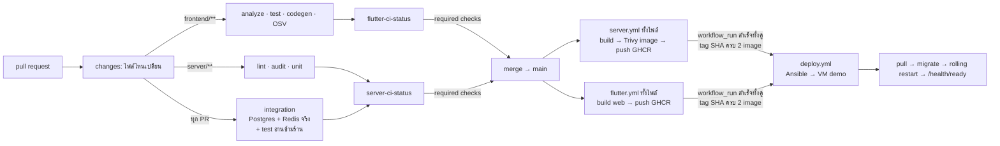

# 07 — CI/CD และการ deploy (เอกสารเจ้าของเรื่อง)

> เอกสารนี้เป็น**เจ้าของ**เรื่อง pipeline, environment, secret, การ deploy และ rollback —
> ช่องว่างที่เปิดค้างตั้งแต่ `docs/BACKEND_DEPLOYMENT.md` ถูกลบใน `ec24f79` (ดู `00_INDEX.md`)
> การตัดสินใจอยู่ใน [ADR-0013](adr/0013-cicd-toolchain.md) · ศัพท์ที่ใช้ตรงกับ [`CONTEXT.md`](../../CONTEXT.md)
> ที่ root (gate / status check / artefact / image / release / deploy / rollback / provision)
> **เอกสารนี้ขัดกับ ADR เมื่อไร ยึด ADR**

สถานะ 2026-09-10: **ออกแบบเสร็จ ผ่าน scrutinize 3 รอบ (แบบ / spec / ticket) · #61 และ #62 merge แล้ว (#70, #69) — image ทั้งสองอยู่บน GHCR และ public แล้ว** — spec = **#60**,
ticket ใต้ #10: #61 `ci.4` · #62 `ci.5` · #63 `ops.1` · #64 `ops.2` · #65 `cd.1` (รอ #61 #62) · #66 `ops.3` (รอ #64) ·
#67 `cd.2` (รอ #65) · #39 และ #44 ได้ comment ปรับขอบเขต

สถานะ 2026-09-14 (ปิดรอบ): 🔴 **`.github/workflows/deploy.yml` ยังไม่มีจริง** — #67 ถูกปิดไป 2026-09-13 โดยไม่เคยมี
workflow ใน git history (branch `feat/67-auto-deploy` ก็ไม่มี) จึงเปิด #67 ใหม่แล้ว · ลูกศร "merge → deploy.yml"
ใน §2 และ §6.1 จึงเป็น**แบบ** ไม่ใช่ของที่ทำงานอยู่ — ตอนนี้ deploy คือรัน `ansible-playbook` ด้วยมือ ·
ตั้งแต่ #147 ขั้น POS ใน `deploy.yml` (playbook) ใช้ `pos_compose_files` ไม่มี `monitoring.yml` ส่วน overlay อยู่ใน
`block`/`rescue` ทั้งหมด · ยังไม่เคยรันบน VM จริง

สถานะ 2026-09-15 (**#67** `cd.2`): **`.github/workflows/deploy.yml` มีแล้ว** แต่รันไม่ได้จนกว่าเจ้าของจะทำ §6.2 ครบ ·
VM `demo` อยู่ในเครือข่ายมหาวิทยาลัย GitHub-hosted runner ต่อไม่ถึง → เจ้าของเลือก **self-hosted runner บน VM**
([ADR-0013 addendum 2026-09-15](adr/0013-cicd-toolchain.md)) · runner รันเป็น `gha-runner` (ไม่มี docker) และสั่งได้แค่
`sudo -u deploy /usr/local/bin/pos-deploy` ซึ่งรัน `deploy/ansible/deploy.yml` ตัวเดิมแบบ `ansible_connection=local` บน VM และ
rollback อัตโนมัติเมื่อ playbook fail · ส่วนใดของ §2/§5/§6 ที่พูดถึง "SSH จาก Actions" ให้อ่านตาม addendum

สถานะ 2026-09-14 (**#39** `ci.2`): §2 กติกา 4 ข้อและ §4 ทำจริงแล้วใน
`.github/workflows/flutter.yml` / `server.yml` — job `changes` (`dorny/paths-filter@v4`,
ทำงานเฉพาะ `pull_request`, มี `permissions: pull-requests: read` เพราะเรียก PR-files API) กรอง
เฉพาะ job ฝั่งของตัวเอง (`analyze-and-test`/`deps-audit`/`codegen-check` ในไฟล์แรก,
`lint`/`audit`/`unit` ในไฟล์ที่สอง) ด้วย `if: ${{ !cancelled() && (... || needs.changes.outputs.… == 'true') }}`
— `!cancelled()` จำเป็นเพราะ `needs: [changes]` เฉย ๆ จะทำให้ job ถูก skip ตามไปด้วยเมื่อ `changes`
เอง skip (ทุก push); `integration` (ถือ cross-tenant isolation test ใน `test/security.e2e-spec.ts`)
ไม่ถูกกรองเลย; `push` ขึ้น `main` ไม่มี `paths:` อีกต่อไปทั้งสองไฟล์ ทุก commit บน main จึงรันเต็มเสมอ
(ปิดช่องว่าง AC4 ของ #40 ไปด้วย). `flutter-ci-status` / `server-ci-status` ท้ายไฟล์ของตัวเอง `needs`
ทุก job รวม `changes`, ใช้ `if: always()` + loop เช็คผลตามกติกาข้อ 4 ข้างบน. concurrency group บน
`main` คีย์ด้วย SHA ไม่ใช่ ref เดียว กัน merge ถี่แล้ว run กลางถูก evict. **Branch protection บน
GitHub ตั้งแล้ว 2026-09-15** (#186) — ค่าอยู่ใน §4 ข้างล่างนี้

---

## 1. แผนที่ 7 บล็อก (ตารางบนสไลด์ ↔ ของจริงใน repo)

| บล็อก | เครื่องมือ | อยู่ที่ไหนใน repo | สถานะ |
|---|---|---|---|
| Code & SCM | Git / GitHub | repo นี้ · branch protection บน `main` (§4) | มี / protection ตั้งแล้ว 2026-09-15 (#186) |
| Build & Test (CI) | GitHub Actions · vitest (server) · `flutter test` (client) | `.github/workflows/server.yml`, `flutter.yml` | ✅ |
| Security Scan | Trivy (fs + **image**) · `pnpm audit` · OSV-Scanner | job `audit`, `deps-audit`, และ scan ใน job build image | fs ✅ · image ฝั่ง server: PR #70 (#61) |
| Package / Storage | Docker + **GHCR** (public) | job build image ทั้งสอง workflow → `ghcr.io/nuimanlp/srisurart-pos-server`, `…-web` | server: PR #70 (#61, tarball artefact ถูกยกเลิก) · web: PR #69 (#62) |
| Config & Deploy (CD) | **Ansible** — รันโดย self-hosted runner บน VM (local, addendum ADR-0013 2026-09-15) · มือ: ผ่าน SSH | `deploy/ansible/`, `.github/workflows/deploy.yml` | playbook ✅ · workflow มีแล้ว (#67) รอเจ้าของตั้ง runner (§6.2) |
| KV Storage | **etcd** | service ใน compose + `RuntimeConfigService` ฝั่ง NestJS | ✅ service etcd + auth (#64) · `RuntimeConfigService` merge มาก่อนแล้ว (#66, PR #109; watch แก้ใน #120, PR #129) |
| Monitoring & Operate | **Node Exporter + Prometheus + Grafana (Monitoring)** | `deploy/compose/monitoring.yml`, `deploy/prometheus/`, `deploy/grafana/` | overlay #63 `ops.1` · ต่อเข้า `deploy/ansible/deploy.yml` แล้วใน #121 `ops.5` (ยังไม่ได้รันจริงบน VM) · ปฏิเสธ Wazuh/ELK เพราะกิน RAM 4–5 GB เกินงบ 6 GB |

**สิ่งที่ตั้งใจไม่ทำ:** Jenkins (มีเครื่องยนต์อยู่แล้ว), Kubernetes (VM เดียว), Wazuh / ELK (กิน RAM 4–5 GB ชนเพดาน VM 6 GB), Alertmanager,
exporter ของ Postgres/Redis, image signing, WAF, DB backup อัตโนมัติ (ADR-0005 มี export job),
เลือก production host (ครบกำหนดก่อน `q4`)

---

## 2. ภาพรวมการไหลของ commit



กติกา 4 ข้อที่ทำให้ภาพนี้ไม่ค้าง (ที่มา: #39, #40 AC4, scrutinize 2026-09-10):

1. **`paths:` ใช้กับ `pull_request` เท่านั้น และกรอง*ภายใน* workflow** (job `changes` +
   `if:` ราย job) ไม่ใช่ที่ระดับ trigger — PR ที่แตะแค่ `server/` จึงยังได้ `flutter-ci-status` สีเขียว
   (job ฝั่ง Flutter ถูก *skip* ไม่ใช่ *ไม่รัน*) ไม่งั้น required check ค้างตลอดกาล
2. **`push` ขึ้น `main` ไม่กรองเลย** — ทุก commit บน main รันทั้งสอง workflow เต็ม จึงได้ image
   ครบ 2 ตัวสำหรับ SHA เดียวเสมอ (= 1 release) และ job ปล่อยของใช้ `needs:` ธรรมดาได้
3. **job `integration` รันทุก PR ไม่ดู path** — เป็น job ที่ถือ test อ่านข้ามร้าน (กติกา multi-tenant ข้อ 6
   ใน `03_ARCHITECTURE §5`) ~90 วินาที
4. **status job ชื่อไม่ซ้ำกัน** (`flutter-ci-status`, `server-ci-status`) ใช้ `if: always()`
   บวกกับ loop เช็ค `needs.<job>.result` ของทุก job ใน `needs:` (รวม `changes` เอง) แบบ explicit —
   ผ่านเฉพาะ `success`/`skipped`, อย่างอื่น (`failure`, `cancelled`) คือ `exit 1`. **`always()` ปลอดภัย
   ก็ต่อเมื่อมี loop เช็คผลแบบนี้คู่กันเท่านั้น** — `always()` เฉย ๆ (ไม่เช็คผล) คือเขียวปลอมที่ข้อนี้เตือน
   เดิม เพราะ status job จะรันและ "ผ่าน" แม้ job ที่มันพึ่งพาถูก cancel หรือ fail ก็ตาม. เหตุผลที่ต้องเป็น
   `always()` ไม่ใช่ `!cancelled()`: ถ้า workflow run ทั้งอันถูก cancel (เช่น PR push ซ้อนกันแล้ว
   concurrency evict run เดิม) `!cancelled()` จะทำให้ status job เอง**ถูก skip** ไม่ใช่รันแล้วรายงาน
   fail — และ required check ที่ "ถูก skip" GitHub นับเป็นผ่าน (เขียวปลอมอีกแบบหนึ่ง) `always()` การันตี
   ว่า status job รันจริงเสมอ แล้วให้ loop เป็นคนตัดสินสีแทน

---

## 3. Release = image 2 ตัวที่ SHA เดียวกัน

| image | สร้างจาก | ข้างใน | tag |
|---|---|---|---|
| `ghcr.io/nuimanlp/srisurart-pos-server` | `server/Dockerfile` (job build image ใน `server.yml`) | node + `dist/` + prod deps — **ไม่มี npm/npx** | `<sha>`, `main` |
| `ghcr.io/nuimanlp/srisurart-pos-web` | `deploy/web.Dockerfile` (ต่อจาก build web ใน `flutter.yml`) | **ไฟล์ static อย่างเดียว** ที่ `/web` (ไม่มี nginx ไม่มี conf) | `<sha>`, `main` |

* **Trivy สแกน image server ก่อน push** — HIGH/CRITICAL, `ignore-unfixed: true`, `exit-code 1` →
  ไม่ผ่านไม่ push · ทำให้ผ่านได้ด้วย (1) `rm -rf` npm ใน runtime stage **ก่อน** `USER node`
  (2) pin base image ด้วย digest (3) `apk upgrade --no-cache` ใน runtime stage สำหรับ CVE ของ alpine เอง
  (openssl) — reproducibility มาจาก digest pin ไม่ใช่จากการไม่อัปเดต · **ไม่มี `.trivyignore`**
  (ปิดข้อ image-scan ของ #44)
* runtime ไม่มีอะไรเรียก npm อยู่แล้ว: CMD และทุก `command:` ใน compose เป็น `node dist/…`,
  healthcheck ใช้ `wget`, corepack อยู่แค่ stage `deps`
* job ปล่อยของต้องมี `permissions: { contents: read, packages: write }` **ระดับ job** — ทั้งสอง
  workflow ประกาศ `permissions: contents: read` ระดับไฟล์ ซึ่ง*แทน* default ทั้งหมด (packages กลายเป็น none)
* **tarball artefact เดิม (`docker save`) ถูกยกเลิก** — เหลือทางปล่อยทางเดียว · web artefact (`pos-web-<sha>`) คงไว้ให้คนโหลดดูได้
* ~~ครั้งแรกหลัง push ต้องสลับ package ทั้งสองเป็น public ด้วยมือ~~ — **ไม่ต้อง (ตรวจแล้ว 2026-09-10):**
  package ที่ `GITHUB_TOKEN` push จาก repo public จะผูกกับ repo และเป็น public ตั้งแต่ push แรก
  (pull แบบ anonymous สำเร็จทั้ง 2 image ทันทีหลัง run แรกบน main) · ถ้า repo เปลี่ยนเป็น private เมื่อไร
  package จะตามไปด้วย และ VM ต้องมี pull token — ดู §7

---

## 4. Branch protection บน `main` (บันทึกไว้ที่นี่ ไม่ใช่แค่ใน GitHub settings)

| ตั้งค่า | ค่า | เหตุผล |
|---|---|---|
| Require a pull request before merging | ✅ (approval 0 — ทีม 3 คน, ปรับได้) | ทุกการเปลี่ยนผ่าน CI |
| Required status checks | **`flutter-ci-status`, `server-ci-status`** เท่านั้น | ชื่อสองตัวนี้รายงานเสมอ (§2 ข้อ 1, 4) — **ห้าม** require job อื่นที่ถูก skip ได้ |
| Require branches up to date | ❌ | หลีกเลี่ยงการ re-run ทั้งชุดทุกครั้งที่ main ขยับ (3 คน merge ถี่) |
| Allow force pushes / deletions | ❌ | `main` เป็นแหล่งเดียวของ release |
| Secret scanning + push protection | ✅ (repo public ฟรี) | gate ที่ถูกที่สุดในระบบ |

ถ้าเพิ่ม job ใหม่ใน workflow: ให้มันเป็น `needs:` ของ status job ไม่ใช่ required check เพิ่ม

**คำสั่งตั้งค่าจริง** (ตั้งแล้ว 2026-09-15 โดย agent ตามคำสั่งเจ้าของ repo, #186 — รันซ้ำได้ ค่าเดิม) ·
ใช้ `--input` JSON เพราะ `required_pull_request_reviews=null` ของคำสั่งเดิม**ไม่บังคับ PR** ซึ่งขัดกับแถวแรกของตาราง:

```bash
gh api repos/NuimanLP/srisurart-pos-flutter/branches/main/protection \
  --method PUT -H "Accept: application/vnd.github+json" --input - <<'JSON'
{
  "required_status_checks": { "strict": false, "contexts": ["flutter-ci-status", "server-ci-status"] },
  "enforce_admins": false,
  "required_pull_request_reviews": { "required_approving_review_count": 0 },
  "restrictions": null,
  "allow_force_pushes": false,
  "allow_deletions": false
}
JSON
```

`strict=false` คือแถว "Require branches up to date" ข้างบน; `contexts` สองตัวคือแถว "Required status
checks" เท่านั้น — ห้ามเพิ่มชื่อ job อื่น (ดูเหตุผลบรรทัดบน)

---

## 5. Environment, secret และเครื่อง

**`demo` = VM คณะ** (`mob04`, `172.30.58.20`, 4 vCPU · 6 GB · 48 GB) — ~~รับ inbound จากนอกมหาวิทยาลัยได้ (2026-09-04)~~
**แก้ 2026-09-15:** address อยู่ในเครือข่ายมหาวิทยาลัย ต่อจากนอกไม่ได้ ไม่มี public address/port · ขาออกผ่าน NAT ได้ →
Actions ต่อ VM ด้วย self-hosted runner บน VM (ADR-0013 addendum, §6.2)
ใช้สาธิต/ส่งงานเท่านั้น ไม่ใช่ที่ของร้าน · **production host ยังไม่เลือก** เมื่อเลือกจะเป็น inventory
ที่สอง + GitHub Environment ใหม่ที่เปิด *required reviewer*

GitHub Environment `demo` ถือ secret ทั้งหมด (ไม่มีอะไรอยู่ใน repo):

| secret | ใช้ทำอะไร |
|---|---|
| `DEMO_SSH_HOST`, `DEMO_SSH_USER`, `DEMO_SSH_KEY` | Ansible เข้าเครื่อง (user แรกต้องมี sudo — เจ้าของโปรเจกต์ใส่เอง) · **addendum 2026-09-15: `deploy.yml` (workflow) ไม่ใช้ตัวไหนเลย** — runner อยู่บน VM แล้ว จึงไม่ต้องเก็บ key ของ VM ใน GitHub; ใช้แค่ตอนรัน playbook ด้วยมือจากเครื่องคน |
| `DEMO_ENV_FILE` | เนื้อหา `server/.env` ทั้งไฟล์ (Postgres/Redis password, JWT keys, `CORS_ORIGINS`, Grafana admin, `ETCD_ROOT_PASSWORD`) — Ansible template ลง VM ด้วย mode 0600. 🔴 **#64 merge แล้ว (PR #113) — ก่อน deploy ครั้งถัดไปต้องเพิ่ม `ETCD_ROOT_PASSWORD` และ `GRAFANA_ADMIN_PASSWORD` เข้าไปในค่านี้ แล้วรัน `provision.yml` ใหม่** — ไม่มี `ETCD_ROOT_PASSWORD` = ทุกคำสั่ง `docker compose` บน VM (รวม `deploy.yml` เอง) fail ตั้งแต่ interpolation · ไม่มี `GRAFANA_ADMIN_PASSWORD` = monitoring ขึ้นไม่ได้ (WARNING, §6 ข้อ 9) |

**งบ RAM บน VM** (mem_limit ปัจจุบันรวม 3,392 MB — รวม etcd 256m แล้ว, #64): เพิ่ม Prometheus 512m
(`--storage.tsdb.retention.time=7d --storage.tsdb.retention.size=2GB`) · Grafana 256m ·
node-exporter 64m → **≈ 4.2 GB จาก 6 GB** — ทุกตัวต้องมี `mem_limit` ห้ามปล่อยว่าง
🔴 **พิจารณาแล้วไม่ใช้ Wazuh / ELK:** Wazuh Server/Indexer (OpenSearch) ต้องการ RAM ขั้นต่ำ 4–5 GB ซึ่งหากนำมารันบน VM 6 GB จะเกิด Out-Of-Memory (OOM) ชนกับ POS stack (~3.4 GB) ทันที ดังนั้นสถาปัตยกรรมจึงเลือกชุดประหยัดทรัพยากรคือ **Node Exporter + Prometheus + Grafana** (~832 MB) ที่พอดีกับงบและทำงานได้อย่างปลอดภัย

**TLS:** self-signed จาก service `certgen` ต่อไป (ไม่มี DNS name; Let's Encrypt ไม่ออก cert ให้ IP)

**สิ่งที่ห้ามเปิดออกอินเทอร์เน็ต** (ufw เปิดแค่ 22/80/443): Postgres, Redis ×2, etcd, Bull-Board (3100),
Prometheus (9090), Grafana (3000), node-exporter — ทั้งหมดผูก loopback หรืออยู่บน compose network
เท่านั้น เข้าผ่าน `ssh -L` · `docker-compose.dev.yml` **ห้ามใช้บน VM**

---

## 6. การ deploy (Ansible) — ทำอะไรทีละขั้น

`deploy/ansible/` มี 2 playbook, idempotent ทั้งคู่ (รันซ้ำได้ ไม่เปลี่ยนอะไรถ้าตรงอยู่แล้ว):

**`provision.yml`** (เครื่องเปล่า → พร้อม deploy): ติด Docker Engine + compose plugin · สร้าง user
`deploy` (docker group, key ของ CI) · ufw allow 22/80/443 · สร้าง `/opt/pos/` · วาง `server/.env`
จาก secret (0600)

**`deploy.yml`** (release หนึ่ง → environment หนึ่ง) รับ `image_tag=<sha>`:
1. ถ้า VM รัน SHA นี้อยู่แล้ว → จบ (ทำให้ `workflow_run` ที่ยิงซ้ำไม่ deploy สองรอบ) · `-e force_redeploy=true` ข้ามข้อนี้
   (#67 — rollback อัตโนมัติใช้ เพราะหลัง deploy fail `.current_sha` ยังชี้ release ก่อนหน้า) · อย่าลบ `.current_sha` เพื่อบังคับ
2. วาง `docker-compose.yml` (จาก `server/`) + `deploy/compose/vm.override.yml` + `monitoring.yml`
   — override นี้ **แทน** `image:` ทั้ง 4 จุด (`migrate`, `api-1..3`, `worker`, `bull-board`) ด้วย
   `ghcr.io/…-server:${IMAGE_TAG}` และ **ถอด `build:`** ของ `api-1` (ไม่งั้น compose จะพยายาม build
   จาก source ที่ไม่มีบน VM)
3. `docker compose pull`
4. `docker compose run --rm web-sync` — copy `/web` จาก image web ลง volume `web` ที่ Nginx mount อ่าน
   (แบบเดียวกับ `certgen`) · Nginx ยังเป็น `nginx:1.29-alpine` + `server/docker/nginx/nginx.conf` เดิม
5. `docker compose run --rm migrate` — **schema ก่อนโค้ด** ครั้งเดียว
6. rolling: `up -d --no-deps api-1` → รอ healthy → `api-2` → `api-3` → `worker`, `bull-board` → validate
   `nginx.conf` ที่เพิ่ง copy (`run --rm --no-deps nginx nginx -t` ในคอนเทนเนอร์แยก ไม่แตะตัวที่รันอยู่) →
   `up -d --no-deps --force-recreate nginx` **ทุกครั้ง** (#249 — bind mount ไฟล์เดี่ยวยึด inode เก่าหลัง
   `copy` เหมือนกรณี Prometheus/Grafana ข้อ 9 ด้านล่าง แม้แต่ `nginx -s reload` ก็ไม่ช่วยเพราะ reload
   อ่านผ่าน mount เดิม; พิสูจน์กับ Linux bind mount จริงใน `docker:27-dind` — bind mount ของ Docker Desktop
   บน Windows path ไม่โชว์บั๊กนี้เพราะ resolve ด้วย path ไม่ใช่ inode) ถ้า config พังจะ fail deploy ตั้งแต่
   ข้อ validate โดยที่ Nginx ตัวเดิมยังรันอยู่
7. seed key etcd ที่ยังไม่มี (§8) — ไม่ทับค่าที่มีอยู่ · ของจริง: ทำใน `etcd-init.sh` ซึ่ง playbook รันแบบ
   `docker compose run --rm etcd-init` **ก่อน** rolling restart (ข้อ 6) — enable auth → assert → txn
   `create_revision == 0` put `/pos/config/log_level` = `LOG_LEVEL` ของ `.env` (ไม่ตั้ง = `info`) · exit ≠ 0 =
   deploy fail · ตามด้วย task ที่ยิง `kv/range` แบบไม่มี credential จาก container ใหม่ ต้อง**ไม่ใช่** 200
8. `GET /health/ready` ต้อง 200 จาก Nginx ไม่งั้น playbook fail (สีแดงใน Actions) → บันทึก SHA ลง `.current_sha`
9. monitoring overlay (#121) **หลัง**ข้อ 8 เสมอ และ **ไม่ทำให้ deploy fail** — Grafana/Prometheus
   ช้าหรือพังแค่พิมพ์ WARNING (`block`/`rescue`) เพราะ release ของ POS ผ่าน gate และถูกบันทึกไปแล้ว
   (ตัดสินใจรอบ review PR #135: monitoring ไม่ใช่ gate ของเคาน์เตอร์) · ข้อ 2–8 ใช้แค่
   `-f docker-compose.yml -f vm.override.yml` **ไม่โหลด `monitoring.yml`** — การ copy `monitoring.yml` +
   config, prune, pull image ของ Prometheus/Grafana และ `up` อยู่ใน block ทั้งหมด ดังนั้น Docker Hub ล่ม
   หรือไม่มี `GRAFANA_ADMIN_PASSWORD` ไม่กัน release ของ POS (ตอน `up` ของ POS compose จะเตือน
   "orphan containers" ของ monitoring — ไม่มี `--remove-orphans` จึงไม่ลบ) · deploy SHA เดิมซ้ำจบที่ข้อ 1
   ดังนั้นแก้ monitoring แล้วรอ release ถัดไป หรือรัน tag เดิมด้วย `-e force_redeploy=true` (rollout POS ทั้งรอบ)

**กติกา migration ที่ตามมา (expand/contract):** เพราะ migrate รันก่อน restart และ**ไม่มี down-migration**
โค้ดเวอร์ชันเก่าต้องยังรันบน schema ใหม่ได้ระหว่าง rolling — เพิ่มคอลัมน์ได้ ลบ/rename ต้องแยกเป็น
2 release

**Rollback** = รัน `deploy.yml` ด้วย `image_tag` ของ release ก่อนหน้า (`workflow_dispatch` ของ
`deploy.yml` รับ SHA) · schema ไม่ถอย

**ข้อจำกัดที่รู้แล้วยอมรับบน `demo`:** rolling restart ไม่มี drain — Nginx เตะ instance หลัง
`max_fails=2` ใน 10 วินาที และ**ไม่ retry POST** จึงมี 502 กับ `POST /sales` ที่ค้างอยู่บน instance
ที่กำลัง restart ได้ · ทางแก้ทีหลัง: `proxy_next_upstream non_idempotent` เมื่อ idempotency (#18)
คลุมทุก write แล้ว · **Nginx เองก็ถูก force-recreate ทุก deploy ตั้งแต่ #249** (ไม่ใช่แค่ตอน
`nginx.conf` เปลี่ยน) ด้วยเหตุผลเดียวกับ Prometheus/Grafana ข้อ 9 ด้านล่าง — connection ที่ค้างอยู่ตอน
recreate เจอ blip สั้น ๆ แบบเดียวกับย่อหน้านี้ ทุกครั้งที่ deploy ไม่ใช่แค่ตอน config เปลี่ยน; config ถูก
validate ด้วย `nginx -t` ในคอนเทนเนอร์แยกก่อนเสมอ ถ้าพังจะ fail deploy โดย Nginx ตัวที่รันอยู่ไม่โดนแตะ

### 6.1 trigger ของ `deploy.yml`

```yaml
on:
  workflow_run:
    workflows: ["Server CI", "Flutter CI"]
    types: [completed]
  workflow_dispatch:
    inputs: { image_tag: { description: SHA ที่จะ deploy (rollback) } }
```

* job รันเมื่อ `conclusion == 'success' && head_branch == 'main' && event == 'push'`
* **ใช้ `github.event.workflow_run.head_sha` เสมอ** — ทั้ง checkout และค้นหา tag (`github.sha` ใน
  `workflow_run` = head ของ default branch *ตอนนั้น* ไม่ใช่ commit ที่ trigger)
* เช็คว่า GHCR มี tag `<head_sha>` **ครบทั้ง 2 image** (registry API, anonymous token ได้เพราะ public)
  ถ้ายังไม่ครบ → จบเฉย ๆ (neutral) — workflow อีกตัวที่จบทีหลังจะยิงมาอีกรอบแล้วเจอครบ
* `concurrency: { group: deploy-demo, cancel-in-progress: false }` — **ห้าม** cancel กลาง rolling restart ·
  กรณีสอง run เห็นครบพร้อมกัน ข้อ 1 ของ playbook กันไว้อีกชั้น
* PR ที่แตะ `deploy/**` มี gate เล็ก: `ansible-lint` + `docker compose config` ของ override — **ยังไม่ได้ทำ**
  (ไม่อยู่ใน #67; ตอนนี้มีแค่ `deploy/scripts/validate.sh` ที่รันด้วยมือ)

**ของจริง (#67) — `.github/workflows/deploy.yml` + `deploy/scripts/pos-deploy.sh` ตรงกับข้างบน บวกสิ่งที่ addendum ADR-0013 เพิ่ม:**

* job `resolve` (GitHub-hosted): หา SHA (`workflow_run.head_sha` หรือ input ของ `workflow_dispatch`, ว่าง = head ของ `main`)
  → **ต้องเป็น commit บนประวัติของ `main`** → **`workflow_run` deploy เฉพาะ head ปัจจุบันของ `main`** → `verify-ghcr-tags.sh`:
  exit 0 = ครบ · exit 1 (404) ใน `workflow_run` = `::notice` จบเขียว, ใน `workflow_dispatch` = แดง · exit 2 (ถาม GHCR ไม่ได้) =
  **แดงเสมอ** — registry ล่มต้องไม่ดูเหมือน "image ยังไม่มา"
  * เหตุผลของ "head เท่านั้น": concurrency ของ GitHub เก็บ run ที่*รอ*ได้ตัวเดียวต่อ group — ถ้าไม่มีกฎนี้ การ re-run CI ของ
    commit เก่าจะเข้าไปแทน deploy ของ release ใหม่ที่รออยู่ แล้ว release ใหม่ไม่ถูก deploy จนกว่าจะ merge ครั้งถัดไป ·
    ผลที่ยอมรับ: merge สองครั้งติดกัน deploy แค่ตัวหลัง และถ้า CI ของตัวหลังแดง ไม่มีอะไร deploy จน merge ถัดไป (หรือสั่งมือ)
* job `deploy` (`runs-on: [self-hosted, srisurart-demo-deploy]`, `environment: demo`, concurrency `deploy-demo`
  `cancel-in-progress: false` ระดับ job, `timeout-minutes: 50`): **ไม่ checkout อะไร** ขั้นเดียวคือ
  `sudo -n -u deploy /usr/local/bin/pos-deploy auto|manual <sha>` (`auto` = `workflow_run`, `manual` = `workflow_dispatch`)
* `pos-deploy` (รันเป็น `deploy`, lock ด้วย `flock` รอสูงสุด 5 นาที — งบของ job 50 นาที = 2 รอบ × (20 + 1 นาที grace) + 8 นาทีสำหรับ
  lock/fetch/checkout): fetch `main` ลง `/home/deploy/pos-deploy/repo` เอง → ปฏิเสธ commit ที่
  ไม่อยู่บน `main` หรือเก่ากว่า `ROLLBACK_FLOOR` (= merge ของ #233 `4f3a244`; release ก่อนนั้น crash-loop บนเครื่องจริง) →
  `auto` และ SHA นี้เป็น ancestor ของ `.current_sha` → ไม่ deploy → checkout SHA นั้น (compose/nginx.conf/playbook ตรงกับ image
  ของ release นั้น — rollback ได้ไฟล์เก่ากลับมาด้วย) → `ansible-playbook -i 'vm-demo,' -e ansible_connection=local deploy.yml`
  **จำกัด 20 นาทีต่อรอบ** (compose ที่ค้างจึงเป็น fail ของรอบนั้นแล้วยัง rollback ได้ — ถ้าปล่อยให้ชน timeout ของ job, job ถูก
  cancel และไม่มีอะไรรันต่อ) · ข้อที่ยอมรับ: ถ้าค้างใน monitoring block (§6 ข้อ 9) ซึ่งรัน**หลัง**เขียน `.current_sha` แล้ว watchdog
  จะ kill แล้ว rollback release ที่ healthy อยู่ทิ้ง
* **rollback อัตโนมัติ:** รอบ deploy fail และ `.current_sha` มีค่าอื่น → checkout release นั้น → playbook
  `-e force_redeploy=true` (§6 ข้อ 1) · **ไม่ลบ `.current_sha`** · run ยัง**แดง** · ปฏิเสธถ้า playbook ของ release นั้นยังไม่รู้จัก
  `force_redeploy` (release ก่อน PR #237 merge) — ต้อง rollback ด้วยมือ · rollback หลัง fail ที่เกิด**ก่อน**แตะ container
  (pull ไม่ได้, network pre-flight ของ #148) = rolling restart release เดิมฟรีหนึ่งรอบ ไม่เสียหาย · pre-flight fail เหมือนกันทุก SHA
  จึง rollback fail ด้วย และ `.current_sha` ไม่ถูกแตะ
* 🔴 **กด Cancel ใน Actions ไม่หยุด deploy ที่เริ่มแล้ว** — ตั้งแต่ checkout release แรก `pos-deploy` ไม่รับ INT/TERM/HUP และ
  playbook รันใน session ของตัวเอง (`setsid`) จึงรันจนจบ **รวม rollback** · run ใน Actions ขึ้น cancelled ทันที แต่ผลจริงอยู่ที่
  `/home/deploy/pos-deploy/last-deploy.log` และ `/opt/pos/.current_sha` · ตั้งใจ: หยุดกลาง rolling restart = VM รันสอง version ·
  run ถัดไปที่เริ่มระหว่างนั้นรอ lock 5 นาทีแล้วแดงถ้ายังไม่เสร็จ — สั่งใหม่เมื่อ log จบ (ทดสอบแล้ว: INT+TERM ถึง sudo, process group
  ของมัน และ `pos-deploy` แล้ว KILL sudo ระหว่าง deploy และระหว่าง rollback — ทั้งสองรันจนจบ)
* **concurrency:** run ที่*รอ*อยู่ถูกแทนด้วย run ใหม่ได้ (ตัวที่*กำลังรัน*ไม่ถูกแตะ) — **rollback ด้วยมือที่รออยู่อาจถูก deploy อัตโนมัติ
  ของ merge ใหม่แซง** ดูว่า run ของตัวเองขึ้น cancelled หรือไม่ แล้วสั่งใหม่
* 🔴 **`pos-deploy.sh` และ `runner-job-started.sh` บน VM เป็นสำเนาที่เจ้าของติดตั้ง** — PR ที่แก้สองไฟล์นี้ไม่มีผลจนกว่าจะติดตั้งใหม่
  (§6.2 ข้อ 4)

### 6.2 self-hosted runner บน VM `demo` — ติดตั้งครั้งเดียว (เจ้าของโปรเจกต์)

ทำตามลำดับ **ข้อ 1 และ 4 ต้องเสร็จก่อนข้อ 5** (repo public — ADR-0013 addendum 2026-09-15 ข้อบังคับความปลอดภัย)

1. **กัน fork PR ไม่ให้รันเองได้** — Settings → Actions → General → *Approval for running fork pull request workflows
   from contributors* = **Require approval for all external contributors** หรือ:
   ```bash
   gh api -X PUT repos/NuimanLP/srisurart-pos-flutter/actions/permissions/fork-pr-contributor-approval \
     -f approval_policy=all_external_contributors
   ```
2. **Environment `demo` + deployment branch `main`** (ไม่มี required reviewer — ADR-0013: `demo` deploy อัตโนมัติ):
   ```bash
   gh api -X PUT repos/NuimanLP/srisurart-pos-flutter/environments/demo --input - <<'JSON'
   { "deployment_branch_policy": { "protected_branches": false, "custom_branch_policies": true } }
   JSON
   gh api -X POST repos/NuimanLP/srisurart-pos-flutter/environments/demo/deployment-branch-policies \
     -f name=main -f type=branch
   ```
   workflow **ไม่ต้องใช้ secret** — ไม่ต้องใส่ `DEMO_SSH_*` ลง GitHub (addendum) · `DEMO_ENV_FILE` ยังเป็นค่าที่
   `provision.yml` ใช้ตอนรันด้วยมือ
3. **ของที่ VM ต้องมี** (ในฐานะ user ที่มี sudo เช่น `cloud`): `sudo apt-get install -y ansible-core git` ·
   `.env` ต้องครบตาม §5 และ handoff 2026-09-15 §5 (รวม `JWT_PLATFORM_SECRET`) — ไม่งั้น deploy แรกจะ fail แล้ว rollback
   ไม่มีที่ไป (ยังไม่มี `.current_sha`)
4. **user `gha-runner` + wrapper + sudoers + hook** (ในฐานะ user ที่มี sudo · ใช้ไฟล์จาก `main` ที่ merge แล้ว ไม่ใช่จาก branch ·
   **ทำซ้ำสาม `install` เมื่อ PR ที่ merge แก้ `pos-deploy.sh` หรือ `runner-job-started.sh`**):
   ```bash
   git clone --depth 1 https://github.com/NuimanLP/srisurart-pos-flutter.git /tmp/pos-src
   sudo useradd --create-home --shell /bin/bash gha-runner        # ไม่มีรหัสผ่าน, ไม่อยู่ใน group docker/deploy
   sudo install -o root -g root -m 0755 /tmp/pos-src/deploy/scripts/pos-deploy.sh /usr/local/bin/pos-deploy
   sudo install -d -o root -g root -m 0755 /usr/local/lib/pos-runner
   sudo install -o root -g root -m 0755 /tmp/pos-src/deploy/scripts/runner-job-started.sh /usr/local/lib/pos-runner/job-started.sh
   # sudoers: ตรวจไฟล์ชั่วคราวก่อน แล้วค่อยวางเข้าที่ — ไฟล์ผิดใน /etc/sudoers.d ทำให้ sudo ใช้ไม่ได้ทั้งเครื่อง (VM ไม่มีรหัส root)
   t=$(mktemp) \
     && printf '%s\n' 'Defaults!/usr/local/bin/pos-deploy env_reset' \
          'gha-runner ALL=(deploy) NOPASSWD: /usr/local/bin/pos-deploy' > "$t" \
     && sudo visudo -cf "$t" \
     && sudo install -o root -g root -m 0440 "$t" /etc/sudoers.d/pos-deploy \
     && rm -f "$t"
   sudo chmod 0750 /home/deploy                                   # gha-runner อ่าน clone ของ deploy ไม่ได้
   rm -rf /tmp/pos-src
   id gha-runner                                                  # ต้องไม่มี docker ในรายการ group
   ```
5. **ติดตั้ง runner เป็น `gha-runner`** และตั้ง hook:
   ```bash
   # เครื่องเจ้าของ: token ลงทะเบียน (อายุ 1 ชั่วโมง, ใช้ครั้งเดียว) — อย่าวางลง chat/issue/commit
   gh api -X POST repos/NuimanLP/srisurart-pos-flutter/actions/runners/registration-token --jq .token

   # บน VM
   sudo -iu gha-runner
   mkdir -p ~/actions-runner && cd ~/actions-runner
   # ดาวน์โหลด + ตรวจ sha256 ตามเวอร์ชันที่หน้า Settings → Actions → Runners → New self-hosted runner (Linux x64) แสดง
   curl -fsSLo runner.tar.gz https://github.com/actions/runner/releases/download/v<VER>/actions-runner-linux-x64-<VER>.tar.gz
   echo "<SHA256 จากหน้านั้น>  runner.tar.gz" | sha256sum -c
   tar xzf runner.tar.gz && rm runner.tar.gz
   ./config.sh --unattended --url https://github.com/NuimanLP/srisurart-pos-flutter \
     --token <TOKEN> --name mob04-demo --labels srisurart-demo-deploy --work _work
   echo 'ACTIONS_RUNNER_HOOK_JOB_STARTED=/usr/local/lib/pos-runner/job-started.sh' >> .env
   sudo -n -u deploy /usr/local/bin/pos-deploy 2>&1 | grep -q usage && echo "sudoers ok"   # ต้องพิมพ์ sudoers ok
   exit

   # กลับเป็น user ที่มี sudo: ติดตั้งเป็น systemd service ที่รันในนาม gha-runner
   cd /home/gha-runner/actions-runner
   sudo ./svc.sh install gha-runner && sudo ./svc.sh start && sudo ./svc.sh status
   ```
   ลงทะเบียนกับ **repo** (URL ข้างบน) ไม่ใช่ระดับ account · ไม่เปิด port ใดเพิ่ม — runner ต่อขาออก 443 ไป `github.com`,
   `api.github.com`, `*.actions.githubusercontent.com` และ `pos-deploy` fetch จาก `github.com` (ufw `default allow outgoing`
   อยู่แล้ว) · ห้ามใส่ label นี้ให้ runner อื่น
6. **ตรวจ:** `gh api repos/NuimanLP/srisurart-pos-flutter/actions/runners --jq '.runners[] | {name,status,labels:[.labels[].name]}'`
   ต้องเห็น `online` + `srisurart-demo-deploy` → Actions → *Deploy (demo)* → Run workflow (ว่าง = head ของ `main`) · ใน log ของ
   job `deploy` ต้องยืนยันสามข้อ:
   * ขั้น hook พิมพ์ `runner-job-started: repository=NuimanLP/srisurart-pos-flutter workflow_ref=…/deploy.yml@refs/heads/main
     event=workflow_dispatch` — ถ้ามี `<unset>` แปลว่า runner ไม่ส่งตัวแปรนั้นให้ hook: hook จะปฏิเสธ**ทุก** deploy (fail-closed)
     ต้องแก้ hook ก่อนใช้งาน ห้ามปิด hook เฉย ๆ
   * run แรกของ `workflow_run` ที่จบด้วย notice "GHCR does not have both images yet" ต้องแสดง job `deploy` เป็น **skipped** และ
     **ไม่**ไปยึดช่อง `deploy-demo` (run ที่สองของ merge เดียวกันต้องเริ่มได้ทันที ไม่ขึ้น "waiting for a pending job")
   * `pos-deploy: running=… release=… mode=…` แล้ว playbook recap `failed=0`
7. **พิสูจน์ AC ของ #67** ด้วย run จริง: merge หนึ่งครั้ง = run แรกจบ notice "not deploying", run ที่สอง deploy · run ซ้ำ SHA
   เดิม = playbook จบที่ข้อ 1 · manual run SHA เก่า = rollback · แนบลิงก์ run ใน #67

ถอด runner: `sudo ./svc.sh stop && sudo ./svc.sh uninstall` แล้ว `./config.sh remove --token <token จาก .../runners/remove-token>`
ในนาม `gha-runner` · ลบ `/etc/sudoers.d/pos-deploy`

---

## 7. Runbook

| งาน | ทำอย่างไร |
|---|---|
| ครั้งแรก | รัน `provision.yml` ด้วยมือครั้งเดียว (ค่าจาก `DEMO_ENV_FILE`, §5) → §6.2 ข้อ 1–6 (fork approval, Environment `demo` **ไม่มี secret**, `ansible-core`, `gha-runner` + wrapper + hook, runner) → merge อะไรก็ได้ขึ้น main → image ทั้งสองอยู่บน GHCR และ **public อยู่แล้ว** (ไม่ต้องสลับด้วยมือ — ตรวจแล้ว 2026-09-10) → deploy อัตโนมัติ |
| ดู Grafana / Prometheus / Bull-Board | `ssh -L 3000:127.0.0.1:3000 -L 9090:127.0.0.1:9090 -L 3100:127.0.0.1:3100 deploy@<vm>` |
| rollback | **อัตโนมัติ** เมื่อ playbook fail หรือเกิน 20 นาที (`pos-deploy` deploy SHA ใน `.current_sha` ซ้ำด้วย `-e force_redeploy=true`, run ยังแดง — §6.1) · **มือ:** Actions → *Deploy (demo)* → Run workflow (branch `main`) → `image_tag` = SHA ก่อนหน้า (ต้องอยู่บน `main`, ใหม่กว่า #233 และมี image ครบทั้งสองบน GHCR) · schema ไม่ถอย · ถ้า runner offline หรือ release ปลายทางเก่ากว่า `force_redeploy`: รัน playbook ด้วยมือตาม handoff 2026-09-15 §5 (`-e force_redeploy=true` ถ้า SHA นั้นยังอยู่ใน `.current_sha`) |
| runner ของ deploy offline / ต้องลงใหม่ | §6.2 ข้อ 4–6 · job ที่รอ runner ค้างในคิว (ไม่ fail ทันที) — ดูใน Actions |
| 🔴 **ครั้งเดียว: network สร้างก่อน `ip_range` (#148)** | `docker-compose.yml` เพิ่ม `ip_range: 172.30.0.128/25` + `gateway: 172.30.0.1` ให้ network `default` (IP คงที่ `.11–.13` อยู่นอกช่วง dynamic) · Docker เปลี่ยน IPAM ของ network ที่มี container ต่ออยู่ไม่ได้ — วัดกับ compose v5.0.2: `run --rm` สลับ network ใต้ container ที่รันอยู่แล้วต่อกลับ**โดยไม่มี `ipv4_address`** (api-N เสีย `.11–.13` → Nginx ไม่มี upstream) ส่วน `up -d <บาง service>` หยุด service นั้นแล้ว error · `deploy.yml` จึงเช็ค `srisurart-pos_default` ก่อนแตะอะไรและ **fail ทันที**ถ้ายังไม่มี `ip_range` · ทางแก้ (POS ดับสั้น ๆ, volume ไม่หาย — **ห้าม `-v`**): บน VM `cd /opt/pos && IMAGE_TAG=$(cat .current_sha) docker compose -f docker-compose.yml -f vm.override.yml down --remove-orphans` (orphans = container monitoring) แล้วรัน `deploy.yml` ด้วย **SHA ใหม่** ทันที — SHA เดิมจบที่ข้อ 1 ของ §6 และไม่ start อะไรเลย (ถ้าจำเป็นต้องใช้ SHA เดิม ใส่ `-e force_redeploy=true`) · เครื่อง dev ที่รัน stack อยู่: `docker compose down` (ไม่ใส่ `-v`) ครั้งเดียวใน `server/` · VM ที่ยังไม่เคยมี network นี้ผ่านเช็คเอง |
| 🔴 **etcd ไม่มี auth บน VM ที่ deploy ก่อน fix `etcd-init`** | บั๊กเดิม: `deploy.yml` ไม่เคย copy `server/docker/etcd/etcd-init.sh` ไป VM → Docker สร้าง path bind mount นั้นเป็น**ไดเรกทอรีว่างของ root** (`/opt/pos/docker/etcd/` ก็เป็นของ root) → `etcd-init` รัน `sh <ไดเรกทอรี>` แล้ว **exit 0 ไม่มี log** → auth ไม่เคยเปิด (ใครอยู่บน compose network อ่าน/เขียน etcd ได้) และ `up -d` ไม่รอ one-shot job จึงเขียวตลอด · **ตรวจ** (บน VM): `ls -la /opt/pos/docker/etcd` (`etcd-init.sh` ต้องเป็น**ไฟล์** `-rwxr-xr-x deploy`, ไม่ใช่ `d… root`) · `cd /opt/pos && IMAGE_TAG=$(cat .current_sha) docker compose -f docker-compose.yml -f vm.override.yml logs etcd-init` (บั๊ก = ว่างเปล่า) · `docker run --rm --network srisurart-pos_default curlimages/curl:8.16.0 -sS -X POST http://etcd:2379/v3/kv/range -d '{"key":"Lw=="}'` ต้องได้ `user name is empty` (บั๊ก = ได้ `{"header":…}`) · **fix ทำเองตอน deploy ถัดไป ไม่ต้องทำมือ:** เจอ `etcd-init.sh` เป็นไดเรกทอรี → `rmdir` มันกับ `docker/etcd` ผ่าน container root (user `deploy` ไม่มี sudo; `rmdir` ลบแค่ไดเรกทอรีว่าง มีของอื่นอยู่ = fail ดัง ๆ แทนการลบ) → สร้าง `docker/etcd` ของ `deploy` → copy สคริปต์ 0755 → `run --rm etcd-init` เปิด auth + seed key → assert anonymous ถูกปฏิเสธ · deploy ด้วย **SHA ใหม่** (SHA เดิมจบที่ข้อ 1 ของ §6 — หรือใส่ `-e force_redeploy=true`) · ถ้า `etcd-init` fail ด้วย `root cannot authenticate` = รหัสใน volume ไม่ตรง `ETCD_ROOT_PASSWORD` ใน `.env` (§8) — ไม่ใช่บั๊กนี้ |
| VM พัง/ย้ายเครื่อง | เครื่องใหม่ + `provision.yml` + `deploy.yml` — ข้อมูลใน volume ของ Postgres **ไม่ได้ย้ายตาม** (demo ไม่มีข้อมูลจริง; production ต้องมีแผน backup ก่อน — ยังไม่มีเอกสาร) |
| 🔴 **`nginx.conf` เปลี่ยนแล้วไม่มีผลตอน deploy (#249, กลไกเดียวกับ #148)** | `nginx.conf` เป็น single-file bind mount · `ansible.builtin.copy` เขียนไฟล์ temp แล้ว rename ทับ — inode ใหม่ path เดิม — ส่วน container ที่รันอยู่ mount ค้างที่ inode ตอน start จึง**ไม่เห็น**ไฟล์ใหม่เลย; `up -d --no-deps nginx` เป็น no-op เพราะ compose service definition ไม่เปลี่ยน และ `nginx -s reload` ก็ช่วยไม่ได้เพราะ reload อ่านผ่าน mount เดิม (พิสูจน์กับ bind mount ของ Linux จริงใน `docker:27-dind` — bind mount ของ Docker Desktop บน Windows host path **ไม่โชว์บั๊กนี้** เพราะ resolve ด้วย path ไม่ใช่ inode ปักหมุด ห้ามใช้เป็น local repro) · **fix (merge แล้ว, #249):** `deploy.yml` แยก task "Restart worker and bull-board" ออกจาก Nginx แล้วเพิ่ม "Validate the copied Nginx configuration" (`docker compose run --rm --no-deps nginx nginx -t` ในคอนเทนเนอร์แยกทิ้ง ไม่แตะตัวที่รันอยู่ — config พังจะ fail deploy โดย Nginx เดิมยังเสิร์ฟอยู่) ตามด้วย "Recreate Nginx so it loads the copied config" (`up -d --no-deps --force-recreate nginx` **ทุกครั้ง** ไม่ใช่แค่ตอน copy เปลี่ยนไฟล์ในรอบนั้น — เหตุผลเดียวกับ #148: รอบที่ copy แล้ว fail งานถัดไป (เช่น health check ของ rolling restart) รอบต่อไป copy จะไม่เห็นความต่างและถ้า gate ด้วย "เปลี่ยนไหม" จะข้าม Nginx ตลอดไป) · **ผลข้างเคียงที่ยอมรับ:** Nginx blip สั้น ๆ ทุก deploy แม้ `nginx.conf` ไม่เปลี่ยน (§6 ย่อหน้า "ข้อจำกัดที่รู้แล้วยอมรับ") |
| เพิ่ม required check | **อย่า** — ต่อ job ใหม่เป็น `needs:` ของ status job แทน (§4) |
| bump base image | base ถูก pin ด้วย digest และ Dependabot ตั้งเป็น **security-only** จึงไม่มีอะไรมาอัปเดตให้เอง — **CVE ที่ประกาศทีหลังจะทำให้ gate แดงตอน push ขึ้น `main` ครั้งถัดไป ซึ่งมักเป็น commit ที่ไม่เกี่ยวกับ image เลย** คนที่เจอบิลด์แดงจึงไม่ใช่คนก่อเหตุ · แก้ด้วยการ**เปลี่ยน digest**: `docker buildx imagetools inspect node:22-alpine` แล้ววาง index digest ลงทั้งสอง `FROM` ใน `server/Dockerfile` → Trivy ใน CI เป็นคนตัดสิน · **ห้ามแก้ด้วย `.trivyignore` หรือไฟล์ยกเว้นใด ๆ** (ADR-0013) |

---

## 8. etcd — dynamic config (ไม่ใช่ข้อมูล ไม่ใช่ความลับ)

สถานะ 2026-09-14: **ทั้งสองฝั่งอยู่บน `main` แล้ว** — service (#64) และ `RuntimeConfigService` (#66,
merge มาก่อนตามแผนใน PR #109) มาบรรจบกันที่ `x-app-env` ใน `docker-compose.yml`

* service `etcd` บน compose network เท่านั้น (ไม่มี `ports:`), auth เปิดผ่าน job แยก `etcd-init`
  (ดูข้อถัดไป) ด้วย root password จาก `.env` ตัวแปร `ETCD_ROOT_PASSWORD` — ตัวเดียวกับที่
  `x-app-env` ส่งให้ api/worker ทุกตัวใช้ authenticate, `mem_limit 256m`
* image: `gcr.io/etcd-development/etcd:v3.6.12` — image ทางการของโปรเจกต์ etcd เอง ปักหมุด tag
  แบบเดียวกับ image อื่นในไฟล์นี้ ทำให้ CVE แก้ด้วยการ**บั๊มป์ tag**ได้ (กติกาเดิม "bump, never
  suppress") แทนที่จะเป็น image เวนเดอร์ที่ frozen ไม่มีอะไรให้บั๊มป์ · **ยังเสิร์ฟ gRPC-gateway HTTP
  API อยู่** (`/v3/kv/range`, `/v3/watch`) — ตรวจด้วย `curl` ตรง ๆ กับ tag นี้แล้ว ไม่ได้เดาจาก
  changelog (ฉบับก่อนของเอกสารนี้เข้าใจผิดว่า etcd 3.6+ ตัด gRPC-gateway ทิ้งทั้งสาย ซึ่งไม่จริง —
  v3.6.12 ยังเสิร์ฟให้)
* image ทางการไม่มี shell (มีแค่ไบนารี `etcd`/`etcdctl`/`etcdutl`) และ etcd ก็ไม่มี hook แบบ
  `docker-entrypoint-initdb.d` ที่ `docker/postgres/init/` ใช้ — การสร้าง root user + เปิด RBAC
  จึงเป็น job แยก `etcd-init` (image `curlimages/curl`, รูปแบบเดียวกับ `certgen`) ที่ยิง HTTP API
  ตรง (`/v3/auth/user/add`, `/v3/auth/role/add`, `/v3/auth/user/grant`, `/v3/auth/enable`) แล้ว
  **assert ผลจริง** (root authenticate ได้, อ่านแบบไม่ auth ถูกปฏิเสธ) ไม่ใช่เชื่อว่าคำสั่ง bootstrap
  ผ่านเฉย ๆ · idempotent — รันซ้ำกับ volume ที่ bootstrap แล้วจะ short-circuit ที่ authenticate ครั้งแรก
* ฝั่ง NestJS: `RuntimeConfigService` อ่านตอน boot แล้ว **watch** ผ่าน gRPC-gateway HTTP ของ etcd v3
  (`/v3/kv/range`, `/v3/watch`) ด้วย `fetch` — ไม่ใช้แพ็กเกจ `etcd3` (CJS + grpc-js บน build ESM)
* **watch ต่อจาก revision เสมอ (#120, PR #129):** เก็บ `header.revision` จาก range และ `mod_revision`
  ของทุก event แล้วเปิด watch ที่ `+1` · boot แล้วต่อ etcd ไม่ได้ → ยัง retry ต่อ (อ่าน key ใหม่ก่อน watch) ·
  compact → อ่านใหม่ · ทุกการต่อใหม่ (รวม stream ที่ปิดเองแบบปกติ) ผ่าน backoff 1–30 s ที่ reset เมื่อได้
  event จริงเท่านั้น · "เตือนครั้งเดียว" = warn ครั้งแรกของแต่ละช่วงที่ etcd ล่ม ที่เหลือเป็น debug
* **ไม่มี etcd แอปต้อง boot ได้** — log เตือนครั้งเดียว ใช้ค่าจาก env · การเช็ค `required()` ของ env เดิม
  ไม่เปลี่ยน (smoke ใน `server.yml` พึ่งพฤติกรรมนั้น) · ไม่มี `depends_on` จาก `api-*`/`worker` ไปยัง
  `etcd`/`etcd-init` และ `/health/ready` **ไม่** เช็ค etcd ด้วยเหตุผลเดียวกัน (`server/README.md`
  *Invariants*)
* 🔴 **root password ถูกใช้ตอน bootstrap ครั้งแรกเท่านั้น** — เปลี่ยน `ETCD_ROOT_PASSWORD` ใน `.env`
  ทีหลัง**ไม่**ทำให้รหัสผ่านจริงใน etcd เปลี่ยนตาม (ทดสอบจริงแล้ว): healthcheck ของ `etcd` เองจะเริ่ม
  fail auth ("invalid user ID or password"), และ `etcd-init` ที่รันซ้ำจะ fail ดัง ๆ (exit 1) — แต่ไม่มี
  อะไร depends_on `etcd-init` จึงเห็นได้แค่ใน `docker compose ps`/log ไม่ใช่ health ของ API · ฝั่ง
  `RuntimeConfigService` ก็ authenticate ไม่ได้เหมือนไม่มี etcd เลย คือ fail-open เงียบ ๆ ด้วย log
  เตือนครั้งเดียว แล้ว retry ด้วย backoff (#120) ที่ fail ต่อไปจนกว่ารหัสผ่านจะตรง · จะหมุนรหัสผ่านจริงต้อง `etcdctl user passwd root` กับ store ที่รันอยู่
  (ยังไม่มี ticket) หรือรีเซ็ต volume `etcd-data` ให้ `etcd-init` bootstrap ใหม่ — ดูรายละเอียดใน
  `server/README.md` *Dynamic config*
* key แรกและตัวเดียวในรอบนี้: **`/pos/config/log_level`** (`info`/`debug`) — service ต้องเรียก
  `logger.level = …` ให้เห็นผลใน log ทันที (สาธิตได้: `etcdctl put` แล้วดู log เปลี่ยน — คำสั่งจริงอยู่ใน
  `server/README.md` *Dynamic config (etcd, #64/#66)*)
* **ไม่ทำ:** maintenance mode (ต้องมีข้อความไทยหน้าเคาน์เตอร์ใหม่ — `CLAUDE.md` ห้ามแต่งเอง),
  ค่า rate limit (ไม่มีผู้ใช้ — ADR-0006 เก็บโควตาใน `tenants.plan`), อะไรก็ตามที่เป็นข้อมูลธุรกิจ ·
  seed key แรกตอน deploy ยังเป็นของ `cd.2` (#67) ไม่ใช่ของรอบนี้ — #64 ส่งมอบ store เปล่าที่ทำงานได้
* **VM (`demo`):** `deploy/ansible/deploy.yml`'s "Ensure backing datastores, certgen and etcd
  are running" step now also brings up `etcd` — ทุก step หลังจากนั้นใน playbook ใช้
  `--no-deps` ดังนั้น service ที่ไม่อยู่ใน `up -d` บรรทัดนี้จะไม่มีวันถูกสร้างขึ้นเลยบน VM · `etcd-init` ไม่อยู่ใน
  `up -d` แล้ว: playbook copy สคริปต์ไป `/opt/pos/docker/etcd/` แล้วรัน `run --rm etcd-init` แบบรอผล (fail = deploy
  fail) และ assert ว่า etcd ปฏิเสธ request ที่ไม่มี credential — ก่อน fix นี้ auth ไม่เคยเปิดบน VM (§7 runbook) · **ก่อน deploy
  ครั้งถัดไป (merge แล้ว) ต้องเพิ่ม `ETCD_ROOT_PASSWORD` ลงใน secret `DEMO_ENV_FILE`** (§5) ไม่งั้นทุกคำสั่ง `docker compose`
  บน VM จะ fail ตั้งแต่ interpolation (`required variable ETCD_ROOT_PASSWORD is missing a value`)

---

## 9. Nginx เมื่อเสิร์ฟทั้ง web และ API (origin เดียว ไม่ต้อง CORS ตอน `q1`)

บล็อก `location` ที่ต้องมี (เรียงจากเฉพาะเจาะจงไปทั่วไปเพื่อให้อ่านง่าย — ตัวตัดสินจริงคือ **longest-prefix match** ของ Nginx ไม่ใช่ลำดับในไฟล์ ลำดับจะมีผลก็ต่อเมื่อมี regex location):

1. `/health/` → upstream api
2. `/api/v1/platform/` → upstream api **พร้อม allow/deny list เดิม** — 🔴 บล็อก `/platform/` ที่มีอยู่
   ตอนนี้**ไม่มีทางถูกเรียกถึง** เพราะ `setGlobalPrefix('api/v1')` วาง admin plane ไว้ที่
   `/api/v1/platform/*` (บั๊กเดิม พบตอน scrutinize) · #44 ต้องมี test ว่า IP นอก allowlist ได้ 403 จาก Nginx
3. `/api/` → upstream api
4. `/` → `root /usr/share/nginx/html; try_files $uri $uri/ /index.html;`

และต้องเพิ่ม `include /etc/nginx/mime.types; default_type application/octet-stream;` ใน `http {}` —
conf ปัจจุบันไม่มี ทำให้ `.js`/`.wasm` ของ Flutter จะถูกส่งเป็น `text/plain` และแอปไม่ boot

🔴 **Nginx ต้องเป็น proxy ตัวเดียวหน้า API (#134):** `configureApp` ตั้ง `trust proxy` = 1 ให้ `req.ip` คือ
ค่าขวาสุดของ `X-Forwarded-For` ที่ Nginx ต่อท้ายจาก `$remote_addr` — rate limit ของ login (`auth:ip:*`) และ IP ใน
`audit_log` พึ่งค่านี้ · ถ้าวาง proxy อีกตัวหน้า Nginx (CDN, TLS terminator ของคณะ) ค่านั้นจะกลายเป็น IP ของ proxy
ทุก client ใช้ bucket เดียวกันอีก = บั๊ก #134 กลับมา → ต้องเพิ่มจำนวน hop หรือใช้ `real_ip` ของ Nginx ก่อนเปิดใช้

หน้า web บน VM คือ **build Drift ตัวปัจจุบัน** — POS เดี่ยวที่คุยกับใครไม่ได้ ใช้สาธิต pipeline
เท่านั้น ไม่มีข้อมูลร้าน · จะเปลี่ยนเมื่อ `q1` ต่อ `ApiRepository` เสร็จ (#52)

---

## 10. Monitoring: Node Exporter + Prometheus + Grafana (#63 `ops.1` — shipped as a compose overlay)

สแต็ก Monitoring กำหนดบทบาทชัดเจนคือ **Node Exporter (Host Metrics) + Prometheus (Metric Collector & TSDB) + Grafana (Dashboard)** เพื่อควบคุมการใช้งานทรัพยากรให้อยู่ในงบ RAM:

| ส่วนประกอบ | บทบาทหน้าที่ | เครื่องมือ | แหล่งข้อมูล / กลไก |
|---|---|---|---|
| **Host Metrics** | วัด CPU, RAM, Disk I/O, Network ของ VM | **Node Exporter** | Scrape host `/proc`, `/sys`, `/rootfs` (พอร์ต 9100 เข้าถึงเฉพาะใน compose network) |
| **Metrics Collector** | Scrape time-series metrics และเก็บใน TSDB | **Prometheus** | Scrape Node Exporter และ NestJS application metrics (`/metrics` เช่น RPS, latency p95, error rate) |
| **Unified Visualization** | แดชบอร์ดแสดงผลรวมศูนย์หน้าเดียว ปลอดภัยผ่าน SSH Loopback | **Grafana** | แสดงแดชบอร์ด host resources + business SLIs (พอร์ต 3000 ผูก 127.0.0.1) |

`docker compose -f server/docker-compose.yml -f deploy/compose/monitoring.yml up -d` (บน VM
เพิ่ม `-f deploy/compose/vm.override.yml` — ลำดับ `-f` ต้องขึ้นต้นด้วย `docker-compose.yml`
เสมอ เพราะ path สัมพัทธ์ในทุกไฟล์ที่ compose เอามารวมกันอิงกับ *project directory* = โฟลเดอร์ของ
ไฟล์ `-f` ตัวแรก คือ `server/` ไม่ใช่โฟลเดอร์ของไฟล์ override เอง):

* `deploy/compose/monitoring.yml`: `node-exporter` (host metrics, ไม่มี `ports:` เลย — ถูก scrape
  ผ่าน compose network เท่านั้น), `prometheus` (config ที่ `deploy/prometheus/prometheus.yml`,
  ผูก `127.0.0.1:9090`), `grafana` (provisioning จาก `deploy/grafana/` — datasource + dashboard
  JSON 1 อัน ที่ `deploy/grafana/dashboards/pos-overview.json`, ผูก `127.0.0.1:3000`) — ทั้งสามมี
  `mem_limit` (64m / 512m / 256m ตาม §5) และ `healthcheck` แบบเดียวกับ service อื่นในสแต็ก
* Prometheus scrape สอง job: `node` (node-exporter, ให้ 3 panel แรกของ dashboard) และ
  `api-readiness` (`/health/ready` บน `api-1..3:3000` ตรง ๆ ไม่ผ่าน Nginx — endpoint ยังไม่มี
  prefix `api/v1` เหมือน `/health/live`) — job ที่สาม `api-metrics` (`/metrics`, unprefixed ตาม
  `02_API_SCREENS.md` แถว `GET /metrics | internal`) คอมเมนต์ไว้รอ #34/#35
  🔴 **พบระหว่างสร้างไฟล์นี้ (วัดจริงกับ Prometheus container):** `up` ของ Prometheus วัดจากว่า
  parse body เป็น Prometheus text-exposition format ได้ไหม ไม่ใช่แค่ HTTP 200 — `/health/ready`
  ตอบ JSON ซึ่ง parse ไม่ผ่าน ทำให้ target ทั้งสามขึ้น **DOWN ใน Prometheus UI ตลอดเวลา แม้ API จะ
  รันอยู่จริง** จนกว่า job `api-metrics` จะเปิดใช้งาน — เป็นข้อจำกัดที่รับทราบแล้ว ไม่ใช่บั๊กของ
  overlay นี้ (ตั้งใจไม่เพิ่ม `blackbox_exporter` หรือ exporter อื่นเพื่อแก้ ตามสโคปของ #63)
* dashboard เดียว (provisioned, ห้า panel): CPU / RAM / disk ของ VM (query จาก node-exporter,
  มีค่าจริงทันทีที่ stack รัน) + **SLI จาก `02_API_SCREENS §9`**: success rate และ p95 —
  สอง panel นี้ตั้งใจให้อ่าน "no data" จนกว่า #34/#35 จะทำ `/metrics` เสร็จ (query ที่ผูกไว้เป็น
  ชื่อ metric ทั่วไปตามธรรมเนียม prom-client — `http_requests_total` / `http_request_duration_seconds_bucket`
  — ให้ #34/#35 ยืนยันหรือแก้ชื่อจริงตอนต่อ)
* ไม่มี Alertmanager · ทุกอย่างผูก `127.0.0.1` เข้าผ่าน SSH tunnel (§7) · Grafana admin password
  ต้องมาจาก `GRAFANA_ADMIN_PASSWORD` ใน `.env` (`.env.example` มีตัวอย่าง) — stack fail fast ถ้าไม่ตั้ง
  เหมือน secret ของ datastore ตัวอื่น
* `deploy/scripts/validate.sh` เช็ค overlay นี้ด้วย (`docker compose config` ของ base + vm.override
  + monitoring, และ `promtool check config` ของ `prometheus.yml`)
* **ต่อเข้า Ansible แล้ว (#121):** `deploy/ansible/deploy.yml` ใส่ `-f monitoring.yml` เฉพาะคำสั่ง
  compose ของ monitoring (คำสั่งของ POS ไม่โหลดไฟล์นี้ — §6 ข้อ 9), copy `monitoring.yml` ไป `/opt/pos/` และ copy `deploy/prometheus/` + `deploy/grafana/`
  ไป `/opt/pos/deploy/` (ไฟล์ที่ถูกลบ/rename ใน repo ถูกลบบน VM ด้วย — เทียบ path แบบ `relpath` สองฝั่ง
  ห้าม `realpath` ฝั่งเดียว ไม่งั้นรันผ่าน path ที่มี symlink จะลบ config ทั้งหมด), `up -d` ทั้งสาม service
  **หลัง** `/health/ready` ผ่านและบันทึก SHA แล้ว · `--force-recreate prometheus grafana` **ทุกครั้ง**ที่ block
  นี้รัน (bind mount ไฟล์เดี่ยวยึด inode เก่าหลัง copy และ config hash ของ compose ไม่เปลี่ยน) — #148: เดิม
  recreate เฉพาะเมื่อ copy รอบนั้นเปลี่ยนไฟล์ ถ้ารอบนั้น copy แล้วไปพังทีหลังใน block release ถัดไป copy ไม่เปลี่ยน
  อะไร Prometheus จึงค้าง config เก่าไปตลอด · checksum ของไฟล์ที่ mount ก็แทนไม่ได้ เพราะ provisioning ของ
  Grafana เป็น mount แบบโฟลเดอร์ ที่เห็นไฟล์ใหม่ทันทีแต่ Grafana ยังใช้ของที่อ่านตอน start · block รันเฉพาะ
  `image_tag` ใหม่ ต้นทุนคือ monitoring หายไปไม่กี่วินาทีต่อ release (TSDB/Grafana state อยู่ใน named volume) · probe
  `127.0.0.1:9090/-/healthy` + `127.0.0.1:3000/api/health` ไม่ผ่าน = **WARNING ไม่ fail** (§6 ข้อ 9) ·
  ปิดได้ด้วย `-e enable_monitoring=false` (หรือ `ENABLE_MONITORING=false`) ซึ่ง `rm -sf` container
  monitoring ที่ค้างจาก deploy ก่อน (`rm` พังไม่ทำให้ deploy fail แต่พิมพ์ WARNING — #148) · สลับ flag บน VM ที่รัน SHA นั้นอยู่แล้วไม่มีผลจน release ถัดไป
  (§6 ข้อ 1 จบ play ก่อน)
* 🔴 **ก่อน deploy ครั้งแรกหลัง #121 (merge แล้ว, PR #135):** เพิ่ม `GRAFANA_ADMIN_PASSWORD` ใน secret `DEMO_ENV_FILE`
  แล้วรัน `provision.yml` ใหม่ (`.env` บน VM มาจาก secret นี้ทางเดียว) ไม่งั้น monitoring ขึ้นไม่ได้
  (WARNING, release ของ POS ยังผ่าน) — คู่กับ `ETCD_ROOT_PASSWORD` ของ PR #113 ซึ่ง**ยัง**ทำให้ deploy fail
  ถ้าไม่มี เพราะอยู่ใน `docker-compose.yml` ฐาน
* 🔴 **path ของ bind mount คือ `${MONITORING_CONFIG_DIR:-../deploy}/…`** — path สัมพัทธ์ resolve กับ
  project directory ซึ่งจาก repo คือ `server/` แต่บน VM คือ `/opt/pos/` แบนราบ (`../deploy/…` จะเป็น
  `/opt/deploy/…` และ Docker สร้างโฟลเดอร์ว่างให้เงียบ ๆ) — playbook ตั้ง `MONITORING_CONFIG_DIR=./deploy`
  ให้ ถ้ารัน compose **ด้วยมือบน VM** ต้องตั้งตัวแปรนี้เองด้วย

### 10.2 การประเมินและปฏิเสธ Wazuh / SIEM หนัก (Architectural Evaluation on Memory Footprint)

ในการออกแบบเบื้องต้น มีการพิจารณาการใช้ Wazuh สำหรับ Security Monitoring และ Log Ingestion แต่จากการประเมิน (Scrutinize) เชิงลึก พบว่า:
1. **กิน RAM สูงเกินงบ (Excessive Footprint):** Wazuh Server ประกอบด้วย Wazuh Manager, Indexer (OpenSearch), และ Dashboard ซึ่งต้องการ RAM รวมอย่างน้อย 4–5 GB (เฉพาะ JVM Heap ของ OpenSearch ต้องการ 2–4 GB)
2. **ความเสี่ยงต่อระบบหลัก (OOM Risk):** VM คณะ (`demo`) มี RAM เพียง 6 GB และระบบ POS ทั้งหมด (Postgres, Redis ×2, API ×3, Worker, Bull-Board, etcd) ใช้ RAM ไปแล้ว ~3.4 GB หากรัน Wazuh ร่วมด้วยจะทำให้ RAM เกิน 6 GB ทันที ส่งผลให้ Linux OOM Killer ยิง Database หรือ API Container ดับ
3. **ข้อสรุปทางสถาปัตยกรรม:** จึงปฏิเสธการติดตั้ง Wazuh และเลือกใช้ **Node Exporter + Prometheus + Grafana** ซึ่งกิน RAM รวมเพียง ~832 MB อยู่ในงบรวม ~4.2 GB / 6 GB อย่างปลอดภัย ส่วนความปลอดภัยด้านช่องโหว่ (CVE) มอบหมายให้ Trivy สแกนใน CI Pipeline ล่วงหน้าแทน

### 10.3 k6 remote-write receiver (#251 — distributed load-test evidence)

`server/test/k6/README.md` เป็น runbook เต็ม; ที่นี่คือสิ่งที่ต่อเข้า Ansible/compose จริง

* **เส้นทาง:** Prometheus ใน `deploy/compose/monitoring.yml` เปิด `--web.enable-remote-write-receiver`
  (endpoint จริงของ Prometheus คือ `POST /api/v1/write`) แต่ **ไม่ publish port ใหม่ใด ๆ** — เข้าถึงได้
  ทางเดียวคือผ่าน `location = /prometheus-remote-write/api/v1/write` ใน
  `server/docker/nginx/nginx.conf` ซึ่งเป็น **exact match บน path เดียว ไม่ใช่ prefix** (proxy แค่
  `/api/v1/write` เส้นเดียว — path อื่นใต้ prefix เดียวกัน เช่น `/api/v1/query` ตอบ `404` เสมอจาก
  location อีกอันที่จับ prefix นี้ไว้ทั้งหมด) ป้องกันไม่ให้ query/series/status/config/federate/metrics
  API ทั้งชุดของ Prometheus หลุดออกไปให้ใครก็ได้ที่มี credential เดียวกัน — การอ่านผล (query) ทำผ่าน
  Grafana เท่านั้น (SSH tunnel ตามปกติ, §7)
* **การเข้าถึง:** ต้องผ่านทั้งสองชั้น (Nginx's default `satisfy all`) — IP allowlist (RFC1918 +
  campus CIDR ที่ owner ต้องเติมเอง ดู `TODO(owner)` ใน `nginx.conf`) **และ** HTTP Basic Auth
  * credential มาจาก `K6_REMOTE_WRITE_BASIC_AUTH_USER`/`_PASSWORD` ใน `server/.env`
    (`.env.example` มีค่า dev-only เท่านั้น — **ห้าม commit ค่าจริง**) — บน VM ต้องเพิ่มสอง key นี้
    ใน secret `DEMO_ENV_FILE` แล้วรัน `provision.yml` ใหม่ ก่อนการยิง k6 จริงครั้งแรก เหมือนที่
    `ETCD_ROOT_PASSWORD`/`GRAFANA_ADMIN_PASSWORD` ต้องทำมาก่อนหน้านี้
  * htpasswd ไฟล์ถูกสร้างโดย `htpasswd-gen` (`server/docker-compose.yml`) — one-shot container
    รูปแบบเดียวกับ `certgen` ของ cert self-signed, idempotent, ต้องรัน**ก่อน** Nginx ทุกครั้ง
    (`deploy/ansible/deploy.yml`: อยู่ใน task "Ensure backing datastores, certgen, htpasswd-gen
    and etcd are running" ซึ่งมาก่อน task "Validate the copied Nginx configuration"/
    "Recreate Nginx" เสมอ — ไม่งั้น `auth_basic_user_file` จะหาไฟล์ไม่เจอ)
* 🔴 **receiver เปิดค้างถาวร ไม่มี toggle อัตโนมัติระหว่างช่วงที่ไม่ได้ยิง k6** — `--web.enable-
  remote-write-receiver` เป็น flag คงที่ใน `monitoring.yml`'s `command:` list ของ compose ปิด/เปิด
  แบบมี env var ตรง ๆ ไม่ได้ง่าย ๆ (compose ไม่รองรับ "ใส่ arg นี้เมื่อเงื่อนไขจริง" ในลิสต์ ต้องมี
  wrapper script ถึงจะทำแบบนั้นได้ — สโคปนี้ไม่ทำ) **เกตจริงคือ Nginx** (allowlist + Basic Auth
  ด้านบน) ไม่ใช่ตัว flag ของ Prometheus เอง — endpoint เปิดอยู่ตลอดแต่ยิงไม่ถึงถ้าไม่ผ่านทั้งสองชั้นนั้น
  วิธี "ปิด" ระหว่างช่วงพักการทดสอบที่ทำได้จริงตอนนี้:
  1. **หมุน credential** — รัน `htpasswd-gen` ใหม่ด้วย `K6_REMOTE_WRITE_BASIC_AUTH_PASSWORD` ค่าใหม่
     ใน `.env`/`DEMO_ENV_FILE` แล้ว re-deploy (บังคับให้ container เก่าที่ยังมีรหัสเดิมใช้งานไม่ได้)
  2. **ถอด flag ออกจริง** — ลบบรรทัด `--web.enable-remote-write-receiver` ออกจาก
     `deploy/compose/monitoring.yml` แล้ว deploy ใหม่ (Prometheus recreate ตามปกติของ block
     monitoring ใน `deploy.yml`) — วิธีนี้ปิด endpoint จริง ไม่ใช่แค่ปิดกั้นที่ Nginx แต่ต้องแก้โค้ด
     แล้ว deploy ทุกครั้งที่จะเปิด/ปิด จึงไม่เหมาะกับรอบทดสอบสั้น ๆ บ่อย ๆ — ใช้ทาง (1) สำหรับงานประจำวัน

---

## 11. ใครทำอะไร (กฎคอร์ส: ทุกคนแตะ CI/CD)

| ทีม | งาน CI/CD รอบนี้ | ticket |
|---|---|---|
| `team/1` NuimanLP | GHCR push + Trivy image gate + ถอด npm + digest pin (ยกเลิก tarball) · web image + Nginx origin เดียว | **#61** `ci.4`, **#62** `ci.5` (ต่อจาก #40) |
| `team/2` LomerAlloys | #39: `changes` job + status jobs + integration ทุก PR + branch protection · monitoring stack · **service etcd** (compose + auth + mem_limit) | **#39**, **#63** `ops.1`, **#64** `ops.2` |
| `team/3` PattaraponKitcharoen | `deploy/`: Ansible provision + override + PR gate · deploy อัตโนมัติ + rollback (รวม seed key etcd, monitoring overlay) · `RuntimeConfigService` ที่อ่าน/watch etcd | **#65** `cd.1`, **#67** `cd.2`, **#66** `ops.3` (+ #44, image-scan item ย้ายไป #61) |

> แก้ 2026-09-10 หลัง scrutinize ticket: service etcd ย้ายจาก `team/3` → `team/2` เพื่อกระจายงาน
> (`team/3` ถือ Ansible ×2 + #44 อยู่แล้ว) — ตัวอ่าน (`RuntimeConfigService`) ยังเป็นของ `team/3`

รายละเอียด ticket อยู่ใน GitHub ใต้ parent #10 · spec ทั้งชุด = #60
