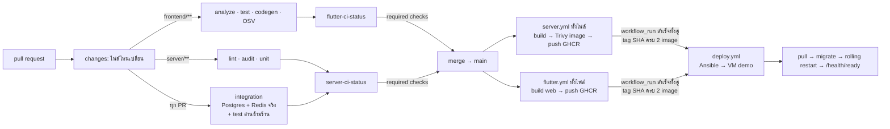

# 07 — CI/CD และการ deploy (เอกสารเจ้าของเรื่อง)

> เอกสารนี้เป็น**เจ้าของ**เรื่อง pipeline, environment, secret, การ deploy และ rollback —
> ช่องว่างที่เปิดค้างตั้งแต่ `docs/BACKEND_DEPLOYMENT.md` ถูกลบใน `ec24f79` (ดู `00_INDEX.md`)
> การตัดสินใจอยู่ใน [ADR-0013](adr/0013-cicd-toolchain.md) · ศัพท์ที่ใช้ตรงกับ [`CONTEXT.md`](../../CONTEXT.md)
> ที่ root (gate / status check / artefact / image / release / deploy / rollback / provision)
> **เอกสารนี้ขัดกับ ADR เมื่อไร ยึด ADR**

สถานะ 2026-09-10: **ออกแบบเสร็จ ผ่าน scrutinize 3 รอบ (แบบ / spec / ticket) · #61 และ #62 มี PR แล้ว (ผ่าน code-review 2 แกน)** — spec = **#60**,
ticket ใต้ #10: #61 `ci.4` · #62 `ci.5` · #63 `ops.1` · #64 `ops.2` · #65 `cd.1` (รอ #61 #62) · #66 `ops.3` (รอ #64) ·
#67 `cd.2` (รอ #65) · #39 และ #44 ได้ comment ปรับขอบเขต

---

## 1. แผนที่ 7 บล็อก (ตารางบนสไลด์ ↔ ของจริงใน repo)

| บล็อก | เครื่องมือ | อยู่ที่ไหนใน repo | สถานะ |
|---|---|---|---|
| Code & SCM | Git / GitHub | repo นี้ · branch protection บน `main` (§4) | มี / protection ยังไม่ตั้ง |
| Build & Test (CI) | GitHub Actions · vitest (server) · `flutter test` (client) | `.github/workflows/server.yml`, `flutter.yml` | ✅ |
| Security Scan | Trivy (fs + **image**) · `pnpm audit` · OSV-Scanner | job `audit`, `deps-audit`, และ scan ใน job build image | fs ✅ · image ฝั่ง server อยู่ใน PR ของ #61 |
| Package / Storage | Docker + **GHCR** (public) | job build image ทั้งสอง workflow → `ghcr.io/nuimanlp/srisurart-pos-server`, `…-web` | server: PR ของ #61 (tarball artefact ถูกยกเลิก) · web: PR #69 (#62) |
| Config & Deploy (CD) | **Ansible** ผ่าน SSH | `deploy/ansible/`, `.github/workflows/deploy.yml` | ยังไม่มี |
| KV Storage | **etcd** | service ใน compose + `RuntimeConfigService` ฝั่ง NestJS | ยังไม่มี |
| Monitoring & Operate | Node Exporter + Prometheus + Grafana | `deploy/compose/monitoring.yml`, dashboard JSON | ยังไม่มี |

**สิ่งที่ตั้งใจไม่ทำ:** Jenkins (มีเครื่องยนต์อยู่แล้ว), Kubernetes (VM เดียว), Alertmanager,
exporter ของ Postgres/Redis, image signing, WAF, DB backup อัตโนมัติ (ADR-0005 มี export job),
เลือก production host (ครบกำหนดก่อน `q4`)

---

## 2. ภาพรวมการไหลของ commit



กติกา 4 ข้อที่ทำให้ภาพนี้ไม่ค้าง (ที่มา: #39, #40 AC4, scrutinize 2026-09-10):

1. **`paths:` ใช้กับ `pull_request` เท่านั้น และกรอง*ภายใน* workflow** (job `changes` +
   `if:` ราย job) ไม่ใช่ที่ระดับ trigger — PR ที่แตะแค่ `server/` จึงยังได้ `flutter-ci-status` สีเขียว
   (job ฝั่ง Flutter ถูก *skip* ไม่ใช่ *ไม่รัน*) ไม่งั้น required check ค้างตลอดกาล
2. **`push` ขึ้น `main` ไม่กรองเลย** — ทุก commit บน main รันทั้งสอง workflow เต็ม จึงได้ image
   ครบ 2 ตัวสำหรับ SHA เดียวเสมอ (= 1 release) และ job ปล่อยของใช้ `needs:` ธรรมดาได้
3. **job `integration` รันทุก PR ไม่ดู path** — เป็น job ที่ถือ test อ่านข้ามร้าน (กติกา multi-tenant ข้อ 6
   ใน `03_ARCHITECTURE §5`) ~90 วินาที
4. **status job ชื่อไม่ซ้ำกัน** (`flutter-ci-status`, `server-ci-status`) ใช้ `if: ${{ !cancelled() }}`
   และแดงเมื่อ job ที่ต้องพึ่งเป็น `failure` **หรือ `cancelled`** — `always()` เฉย ๆ จะทำให้ run ที่ถูก
   cancel (PR push ซ้อน) รายงานเขียวปลอม

---

## 3. Release = image 2 ตัวที่ SHA เดียวกัน

| image | สร้างจาก | ข้างใน | tag |
|---|---|---|---|
| `ghcr.io/nuimanlp/srisurart-pos-server` | `server/Dockerfile` (job build image ใน `server.yml`) | node + `dist/` + prod deps — **ไม่มี npm/npx** | `<sha>`, `main` |
| `ghcr.io/nuimanlp/srisurart-pos-web` | `deploy/web.Dockerfile` (ต่อจาก build web ใน `flutter.yml`) | **ไฟล์ static อย่างเดียว** ที่ `/web` (ไม่มี nginx ไม่มี conf) | `<sha>`, `main` |

* **Trivy สแกน image server ก่อน push** — HIGH/CRITICAL, `ignore-unfixed: true`, `exit-code 1` →
  ไม่ผ่านไม่ push · ทำให้ผ่านได้ด้วย (1) `rm -rf` npm ใน runtime stage **ก่อน** `USER node`
  (2) pin base image ด้วย digest (3) `apk upgrade --no-cache` ใน runtime stage สำหรับ CVE ของ alpine เอง
  (openssl) — reproducibility มาจาก digest pin ไม่ใช่จากการไม่อัปเดต · **ไม่มี `.trivyignore`**
  (ปิดข้อ image-scan ของ #44)
* runtime ไม่มีอะไรเรียก npm อยู่แล้ว: CMD และทุก `command:` ใน compose เป็น `node dist/…`,
  healthcheck ใช้ `wget`, corepack อยู่แค่ stage `deps`
* job ปล่อยของต้องมี `permissions: { contents: read, packages: write }` **ระดับ job** — ทั้งสอง
  workflow ประกาศ `permissions: contents: read` ระดับไฟล์ ซึ่ง*แทน* default ทั้งหมด (packages กลายเป็น none)
* **tarball artefact เดิม (`docker save`) ถูกยกเลิก** — เหลือทางปล่อยทางเดียว · web artefact (`pos-web-<sha>`) คงไว้ให้คนโหลดดูได้
* 🔴 **ครั้งแรกหลัง push ต้องสลับ package ทั้งสองเป็น public ด้วยมือ** (package ที่ `GITHUB_TOKEN`
  สร้างเป็น private โดย default และไม่มี API สำหรับ package ของ user) — อยู่ใน runbook §7

---

## 4. Branch protection บน `main` (บันทึกไว้ที่นี่ ไม่ใช่แค่ใน GitHub settings)

| ตั้งค่า | ค่า | เหตุผล |
|---|---|---|
| Require a pull request before merging | ✅ (approval 0 — ทีม 3 คน, ปรับได้) | ทุกการเปลี่ยนผ่าน CI |
| Required status checks | **`flutter-ci-status`, `server-ci-status`** เท่านั้น | ชื่อสองตัวนี้รายงานเสมอ (§2 ข้อ 1, 4) — **ห้าม** require job อื่นที่ถูก skip ได้ |
| Require branches up to date | ❌ | หลีกเลี่ยงการ re-run ทั้งชุดทุกครั้งที่ main ขยับ (3 คน merge ถี่) |
| Allow force pushes / deletions | ❌ | `main` เป็นแหล่งเดียวของ release |
| Secret scanning + push protection | ✅ (repo public ฟรี) | gate ที่ถูกที่สุดในระบบ |

ถ้าเพิ่ม job ใหม่ใน workflow: ให้มันเป็น `needs:` ของ status job ไม่ใช่ required check เพิ่ม

---

## 5. Environment, secret และเครื่อง

**`demo` = VM คณะ** (4 vCPU · 6 GB · 30 GB, รับ inbound จากนอกมหาวิทยาลัยได้ — ยืนยัน 2026-09-04)
ใช้สาธิต/ส่งงานเท่านั้น ไม่ใช่ที่ของร้าน · **production host ยังไม่เลือก** เมื่อเลือกจะเป็น inventory
ที่สอง + GitHub Environment ใหม่ที่เปิด *required reviewer*

GitHub Environment `demo` ถือ secret ทั้งหมด (ไม่มีอะไรอยู่ใน repo):

| secret | ใช้ทำอะไร |
|---|---|
| `DEMO_SSH_HOST`, `DEMO_SSH_USER`, `DEMO_SSH_KEY` | Ansible เข้าเครื่อง (user แรกต้องมี sudo — เจ้าของโปรเจกต์ใส่เอง) |
| `DEMO_ENV_FILE` | เนื้อหา `server/.env` ทั้งไฟล์ (Postgres/Redis password, JWT keys, `CORS_ORIGINS`, Grafana admin, etcd root) — Ansible template ลง VM ด้วย mode 0600 |

**งบ RAM บน VM** (mem_limit ปัจจุบันรวม 3,136 MB): เพิ่ม etcd 256m · Prometheus 512m
(`--storage.tsdb.retention.time=7d --storage.tsdb.retention.size=2GB`) · Grafana 256m ·
node-exporter 64m → **≈ 4.2 GB จาก 6 GB** — ทุกตัวต้องมี `mem_limit` ห้ามปล่อยว่าง

**TLS:** self-signed จาก service `certgen` ต่อไป (ไม่มี DNS name; Let's Encrypt ไม่ออก cert ให้ IP)

**สิ่งที่ห้ามเปิดออกอินเทอร์เน็ต** (ufw เปิดแค่ 22/80/443): Postgres, Redis ×2, etcd, Bull-Board (3100),
Prometheus (9090), Grafana (3000), node-exporter — ทั้งหมดผูก loopback หรืออยู่บน compose network
เท่านั้น เข้าผ่าน `ssh -L` · `docker-compose.dev.yml` **ห้ามใช้บน VM**

---

## 6. การ deploy (Ansible) — ทำอะไรทีละขั้น

`deploy/ansible/` มี 2 playbook, idempotent ทั้งคู่ (รันซ้ำได้ ไม่เปลี่ยนอะไรถ้าตรงอยู่แล้ว):

**`provision.yml`** (เครื่องเปล่า → พร้อม deploy): ติด Docker Engine + compose plugin · สร้าง user
`deploy` (docker group, key ของ CI) · ufw allow 22/80/443 · สร้าง `/opt/pos/` · วาง `server/.env`
จาก secret (0600)

**`deploy.yml`** (release หนึ่ง → environment หนึ่ง) รับ `image_tag=<sha>`:
1. ถ้า VM รัน SHA นี้อยู่แล้ว → จบ (ทำให้ `workflow_run` ที่ยิงซ้ำไม่ deploy สองรอบ)
2. วาง `docker-compose.yml` (จาก `server/`) + `deploy/compose/vm.override.yml` + `monitoring.yml`
   — override นี้ **แทน** `image:` ทั้ง 4 จุด (`migrate`, `api-1..3`, `worker`, `bull-board`) ด้วย
   `ghcr.io/…-server:${IMAGE_TAG}` และ **ถอด `build:`** ของ `api-1` (ไม่งั้น compose จะพยายาม build
   จาก source ที่ไม่มีบน VM)
3. `docker compose pull`
4. `docker compose run --rm web-sync` — copy `/web` จาก image web ลง volume `web` ที่ Nginx mount อ่าน
   (แบบเดียวกับ `certgen`) · Nginx ยังเป็น `nginx:1.29-alpine` + `server/docker/nginx/nginx.conf` เดิม
5. `docker compose run --rm migrate` — **schema ก่อนโค้ด** ครั้งเดียว
6. rolling: `up -d --no-deps api-1` → รอ healthy → `api-2` → `api-3` → `worker`, `bull-board`, etcd, monitoring
7. seed key etcd ที่ยังไม่มี (§8) — ไม่ทับค่าที่มีอยู่
8. `GET /health/ready` ต้อง 200 จาก Nginx ไม่งั้น playbook fail (สีแดงใน Actions)

**กติกา migration ที่ตามมา (expand/contract):** เพราะ migrate รันก่อน restart และ**ไม่มี down-migration**
โค้ดเวอร์ชันเก่าต้องยังรันบน schema ใหม่ได้ระหว่าง rolling — เพิ่มคอลัมน์ได้ ลบ/rename ต้องแยกเป็น
2 release

**Rollback** = รัน `deploy.yml` ด้วย `image_tag` ของ release ก่อนหน้า (`workflow_dispatch` ของ
`deploy.yml` รับ SHA) · schema ไม่ถอย

**ข้อจำกัดที่รู้แล้วยอมรับบน `demo`:** rolling restart ไม่มี drain — Nginx เตะ instance หลัง
`max_fails=2` ใน 10 วินาที และ**ไม่ retry POST** จึงมี 502 กับ `POST /sales` ที่ค้างอยู่บน instance
ที่กำลัง restart ได้ · ทางแก้ทีหลัง: `proxy_next_upstream non_idempotent` เมื่อ idempotency (#18)
คลุมทุก write แล้ว

### 6.1 trigger ของ `deploy.yml`

```yaml
on:
  workflow_run:
    workflows: ["Server CI", "Flutter CI"]
    types: [completed]
  workflow_dispatch:
    inputs: { image_tag: { description: SHA ที่จะ deploy (rollback) } }
```

* job รันเมื่อ `conclusion == 'success' && head_branch == 'main' && event == 'push'`
* **ใช้ `github.event.workflow_run.head_sha` เสมอ** — ทั้ง checkout และค้นหา tag (`github.sha` ใน
  `workflow_run` = head ของ default branch *ตอนนั้น* ไม่ใช่ commit ที่ trigger)
* เช็คว่า GHCR มี tag `<head_sha>` **ครบทั้ง 2 image** (registry API, anonymous token ได้เพราะ public)
  ถ้ายังไม่ครบ → จบเฉย ๆ (neutral) — workflow อีกตัวที่จบทีหลังจะยิงมาอีกรอบแล้วเจอครบ
* `concurrency: { group: deploy-demo, cancel-in-progress: false }` — **ห้าม** cancel กลาง rolling restart ·
  กรณีสอง run เห็นครบพร้อมกัน ข้อ 1 ของ playbook กันไว้อีกชั้น
* PR ที่แตะ `deploy/**` มี gate เล็ก: `ansible-lint` + `docker compose config` ของ override

---

## 7. Runbook

| งาน | ทำอย่างไร |
|---|---|
| ครั้งแรก | สร้าง Environment `demo` + secret 4 ตัว (§5) → รัน `provision.yml` ด้วยมือครั้งเดียว → merge อะไรก็ได้ขึ้น main → **สลับ package GHCR ทั้งสองเป็น public** (Packages → Package settings → Change visibility) → deploy ถัดไปจะ pull ได้ |
| ดู Grafana / Prometheus / Bull-Board | `ssh -L 3000:127.0.0.1:3000 -L 9090:127.0.0.1:9090 -L 3100:127.0.0.1:3100 deploy@<vm>` |
| rollback | Actions → Deploy → Run workflow → `image_tag` = SHA ก่อนหน้า |
| VM พัง/ย้ายเครื่อง | เครื่องใหม่ + `provision.yml` + `deploy.yml` — ข้อมูลใน volume ของ Postgres **ไม่ได้ย้ายตาม** (demo ไม่มีข้อมูลจริง; production ต้องมีแผน backup ก่อน — ยังไม่มีเอกสาร) |
| เพิ่ม required check | **อย่า** — ต่อ job ใหม่เป็น `needs:` ของ status job แทน (§4) |
| bump base image | base ถูก pin ด้วย digest และ Dependabot ตั้งเป็น **security-only** จึงไม่มีอะไรมาอัปเดตให้เอง — **CVE ที่ประกาศทีหลังจะทำให้ gate แดงตอน push ขึ้น `main` ครั้งถัดไป ซึ่งมักเป็น commit ที่ไม่เกี่ยวกับ image เลย** คนที่เจอบิลด์แดงจึงไม่ใช่คนก่อเหตุ · แก้ด้วยการ**เปลี่ยน digest**: `docker buildx imagetools inspect node:22-alpine` แล้ววาง index digest ลงทั้งสอง `FROM` ใน `server/Dockerfile` → Trivy ใน CI เป็นคนตัดสิน · **ห้ามแก้ด้วย `.trivyignore` หรือไฟล์ยกเว้นใด ๆ** (ADR-0013) |

---

## 8. etcd — dynamic config (ไม่ใช่ข้อมูล ไม่ใช่ความลับ)

* service `etcd` บน compose network เท่านั้น, auth เปิด (root password จาก `.env`), `mem_limit 256m`
* ฝั่ง NestJS: `RuntimeConfigService` อ่านตอน boot แล้ว **watch** ผ่าน gRPC-gateway HTTP ของ etcd v3
  (`/v3/kv/range`, `/v3/watch`) ด้วย `fetch` — ไม่ใช้แพ็กเกจ `etcd3` (CJS + grpc-js บน build ESM)
* **ไม่มี etcd แอปต้อง boot ได้** — log เตือนครั้งเดียว ใช้ค่าจาก env · การเช็ค `required()` ของ env เดิม
  ไม่เปลี่ยน (smoke ใน `server.yml` พึ่งพฤติกรรมนั้น)
* key แรกและตัวเดียวในรอบนี้: **`/pos/config/log_level`** (`info`/`debug`) — service ต้องเรียก
  `logger.level = …` ให้เห็นผลใน log ทันที (สาธิตได้: `etcdctl put` แล้วดู log เปลี่ยน)
* **ไม่ทำ:** maintenance mode (ต้องมีข้อความไทยหน้าเคาน์เตอร์ใหม่ — `CLAUDE.md` ห้ามแต่งเอง),
  ค่า rate limit (ไม่มีผู้ใช้ — ADR-0006 เก็บโควตาใน `tenants.plan`), อะไรก็ตามที่เป็นข้อมูลธุรกิจ

---

## 9. Nginx เมื่อเสิร์ฟทั้ง web และ API (origin เดียว ไม่ต้อง CORS ตอน `q1`)

บล็อก `location` ที่ต้องมี (เรียงจากเฉพาะเจาะจงไปทั่วไปเพื่อให้อ่านง่าย — ตัวตัดสินจริงคือ **longest-prefix match** ของ Nginx ไม่ใช่ลำดับในไฟล์ ลำดับจะมีผลก็ต่อเมื่อมี regex location):

1. `/health/` → upstream api
2. `/api/v1/platform/` → upstream api **พร้อม allow/deny list เดิม** — 🔴 บล็อก `/platform/` ที่มีอยู่
   ตอนนี้**ไม่มีทางถูกเรียกถึง** เพราะ `setGlobalPrefix('api/v1')` วาง admin plane ไว้ที่
   `/api/v1/platform/*` (บั๊กเดิม พบตอน scrutinize) · #44 ต้องมี test ว่า IP นอก allowlist ได้ 403 จาก Nginx
3. `/api/` → upstream api
4. `/` → `root /usr/share/nginx/html; try_files $uri $uri/ /index.html;`

และต้องเพิ่ม `include /etc/nginx/mime.types; default_type application/octet-stream;` ใน `http {}` —
conf ปัจจุบันไม่มี ทำให้ `.js`/`.wasm` ของ Flutter จะถูกส่งเป็น `text/plain` และแอปไม่ boot

หน้า web บน VM คือ **build Drift ตัวปัจจุบัน** — POS เดี่ยวที่คุยกับใครไม่ได้ ใช้สาธิต pipeline
เท่านั้น ไม่มีข้อมูลร้าน · จะเปลี่ยนเมื่อ `q1` ต่อ `ApiRepository` เสร็จ (#52)

---

## 10. Monitoring

* `deploy/compose/monitoring.yml`: `node-exporter` (host metrics), `prometheus` (scrape node-exporter +
  `api-1..3` ที่ `/api/v1/metrics` เมื่อ #34/#35 ทำ `/metrics` เสร็จ — ก่อนหน้านั้น scrape `/health/ready` ได้แค่ up/down),
  `grafana` (provisioning จาก `deploy/grafana/` — datasource + dashboard JSON 1 อัน)
* dashboard เดียว: CPU / RAM / disk ของ VM + **SLI จาก `02_API_SCREENS §9`**: success rate และ p95
* ไม่มี Alertmanager · ทุกอย่างผูก `127.0.0.1` เข้าผ่าน SSH tunnel (§7)

---

## 11. ใครทำอะไร (กฎคอร์ส: ทุกคนแตะ CI/CD)

| ทีม | งาน CI/CD รอบนี้ | ticket |
|---|---|---|
| `team/1` NuimanLP | GHCR push + Trivy image gate + ถอด npm + digest pin (ยกเลิก tarball) · web image + Nginx origin เดียว | **#61** `ci.4`, **#62** `ci.5` (ต่อจาก #40) |
| `team/2` LomerAlloys | #39: `changes` job + status jobs + integration ทุก PR + branch protection · monitoring stack · **service etcd** (compose + auth + mem_limit) | **#39**, **#63** `ops.1`, **#64** `ops.2` |
| `team/3` PattaraponKitcharoen | `deploy/`: Ansible provision + override + PR gate · deploy อัตโนมัติ + rollback (รวม seed key etcd, monitoring overlay) · `RuntimeConfigService` ที่อ่าน/watch etcd | **#65** `cd.1`, **#67** `cd.2`, **#66** `ops.3` (+ #44, image-scan item ย้ายไป #61) |

> แก้ 2026-09-10 หลัง scrutinize ticket: service etcd ย้ายจาก `team/3` → `team/2` เพื่อกระจายงาน
> (`team/3` ถือ Ansible ×2 + #44 อยู่แล้ว) — ตัวอ่าน (`RuntimeConfigService`) ยังเป็นของ `team/3`

รายละเอียด ticket อยู่ใน GitHub ใต้ parent #10 · spec ทั้งชุด = #60
