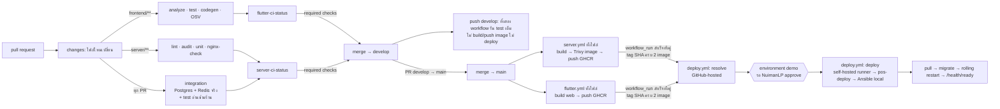

# 07 — CI/CD และการ deploy (เอกสารเจ้าของเรื่อง)

> เอกสารนี้เป็น**เจ้าของ**เรื่อง pipeline, environment, secret, การ deploy และ rollback —
> ช่องว่างที่เปิดค้างตั้งแต่ `docs/BACKEND_DEPLOYMENT.md` ถูกลบใน `ec24f79` (ดู `00_INDEX.md`)
> การตัดสินใจอยู่ใน [ADR-0013](adr/0013-cicd-toolchain.md) · ศัพท์ที่ใช้ตรงกับ [`CONTEXT.md`](../../CONTEXT.md)
> ที่ root (gate / status check / artefact / image / release / deploy / rollback / provision)
> **เอกสารนี้ขัดกับ ADR เมื่อไร ยึด ADR**

สถานะ 2026-09-10: **ออกแบบเสร็จ ผ่าน scrutinize 3 รอบ (แบบ / spec / ticket) · #61 และ #62 merge แล้ว (#70, #69) — image ทั้งสองอยู่บน GHCR และ public แล้ว** — spec = **#60**,
ticket ใต้ #10: #61 `ci.4` · #62 `ci.5` · #63 `ops.1` · #64 `ops.2` · #65 `cd.1` (รอ #61 #62) · #66 `ops.3` (รอ #64) ·
#67 `cd.2` (รอ #65) · #39 และ #44 ได้ comment ปรับขอบเขต

สถานะ 2026-09-14 (ปิดรอบ): 🔴 **`.github/workflows/deploy.yml` ยังไม่มีจริง** — #67 ถูกปิดไป 2026-09-13 โดยไม่เคยมี
workflow ใน git history (branch `feat/67-auto-deploy` ก็ไม่มี) จึงเปิด #67 ใหม่แล้ว · ลูกศร "merge → deploy.yml"
ใน §2 และ §6.1 จึงเป็น**แบบ** ไม่ใช่ของที่ทำงานอยู่ — ตอนนี้ deploy คือรัน `ansible-playbook` ด้วยมือ ·
ตั้งแต่ #147 ขั้น POS ใน `deploy.yml` (playbook) ใช้ `pos_compose_files` ไม่มี `monitoring.yml` ส่วน overlay อยู่ใน
`block`/`rescue` ทั้งหมด · ยังไม่เคยรันบน VM จริง (**แก้ 2026-09-30:** ไม่จริงแล้ว — runner #67 deploy `e50f4fa` ถึง `mob04` จริงครั้งแรก 2026-09-30, `.current_sha` + `/health/ready` 200 — `docs/handoff_log/session-2026-09-30-first-runner-deploy.md`)

สถานะ 2026-09-15 (**#67** `cd.2`): **`.github/workflows/deploy.yml` มีแล้ว** แต่รันไม่ได้จนกว่าเจ้าของจะทำ §6.2 ครบ ·
VM `demo` อยู่ในเครือข่ายมหาวิทยาลัย GitHub-hosted runner ต่อไม่ถึง → เจ้าของเลือก **self-hosted runner บน VM**
([ADR-0013 addendum 2026-09-15](adr/0013-cicd-toolchain.md)) · runner รันเป็น `gha-runner` (ไม่มี docker) และสั่งได้แค่
`sudo -u deploy /usr/local/bin/pos-deploy` ซึ่งรัน `deploy/ansible/deploy.yml` ตัวเดิมแบบ `ansible_connection=local` บน VM และ
rollback อัตโนมัติเมื่อ playbook fail · ส่วนใดของ §2/§5/§6 ที่พูดถึง "SSH จาก Actions" ให้อ่านตาม addendum

สถานะ 2026-09-21 (**#366** `cd.decision`): เจ้าของเลือก **option 3** — คง auto-trigger เดิม (`workflow_run`
ทุก green `main`) แต่เปิด **required reviewer (`NuimanLP`) บน GitHub Environment `demo`** ก่อน job `deploy`
จะถูกส่งให้ runner (เปิดจริงแล้วผ่าน `gh api`, ไม่ใช่แค่เอกสาร — ดู [ADR-0013 addendum 2026-09-21](adr/0013-cicd-toolchain.md))
· นี่คือกลไกกัน deploy ทับเดโม: merge ยัง trigger workflow เหมือนเดิมทุกครั้ง แต่ job `deploy` ค้างที่สถานะ
*Waiting for review* จนกว่าจะมีคนกด approve — ไม่กด = ไม่มีอะไรถึง VM · เคยขัดกับ #335 D9 ("deploy ด้วย
Ansible ด้วยมือ") จนกระทั่งตีความใหม่แล้วว่า D9 คือ runbook สำรองตอน runner ของ #67 ยัง offline (ซึ่ง §6.1
บันทึกไว้อยู่แล้ว) ไม่ใช่นโยบาย trigger — ไม่ขัดกันจริง 🔴 §6.2 ข้อ 2 ด้านล่างเขียนไว้ตอน "demo deploy
อัตโนมัติไม่มีคนอนุมัติ" — ค่านั้นล้าสมัยแล้ว อ่านหมายเหตุตรงนั้นก่อนรันคำสั่งซ้ำ

สถานะ 2026-09-23 (**ตรวจกับของจริง** — ไฟล์ใน repo + `gh api` แบบอ่านอย่างเดียว ไม่ได้แตะ setting ใด ๆ):
🔴 **CD ยังไม่เคยส่ง release ถึง `mob04` สักครั้ง** — ห้ามอ่านส่วนใดของเอกสารนี้ว่า "deploy ทำงานอยู่บน VM"
**อัปเดต 2026-09-30:** ข้อความนี้ล้าสมัยแล้ว — runner ลงทะเบียนและ deploy จริงครั้งแรกสำเร็จ (ดูข้อ "runner" ด้านล่าง) · ข้อความสถานะ 2026-09-23 ที่เหลือเก็บไว้เป็นประวัติ ยกเว้นที่มีเครื่องหมายอัปเดตกำกับ
* ~~**ทางตันหลักอยู่นอก repo:**~~ **คลี่คลายแล้ว 2026-09-29:** `docker pull ghcr.io/…:<SHA เต็ม>` จาก `mob04` สำเร็จจริง และ TLS
  จาก VM ไป `ghcr.io`, `registry-1.docker.io`, `gcr.io`, `github.com`, `api.github.com`, `*.actions.githubusercontent.com`
  verify ผ่านหมด — ใบของ FortiGate ตอนนี้มี SAN `*.ghcr.io`/`ghcr.io` · ข้อความเดิม (2026-09-23) เก็บไว้ด้านล่างเป็นประวัติ ·
  ถ้าอาการกลับมา ดูแถว `x509` ใน §7 — FortiGate ของคณะทำ SSL deep inspection ขาออกของ `mob04` แล้วตอบ `ghcr.io` ด้วยใบประจำเครื่อง
  (`O=Fortinet, OU=FortiGate, CN=FG3K4ETB19900078`) ที่**ไม่มี SAN** → `docker compose pull` ตายด้วย
  `x509: certificate is not valid for any names` · trust CA ของ Fortinet ก็ไม่ช่วย (hostname verification ล้มอยู่ดี) ·
  ปิดทั้งสองทางพร้อมกัน — Ansible ด้วยมือ (#335 D9) และ runner ของ #67 (ใช้ Docker daemon ตัวเดียวกัน) · ทางแก้จริงทางเดียว
  คือฝ่ายเครือข่ายยกเว้น `ghcr.io` (และ `registry-1.docker.io`, `gcr.io`) ให้ `172.30.58.20` · `docker save`/`load` ด้วยมือ
  เป็นแค่ทางกู้วันเดโม **ไม่ใช่ CD** ห้ามบันทึกว่าเป็น CD · หลักฐาน:
  [`handoff_demo-335-merge-and-cd-blocked_21_09_2026.md`](../handoff_log/handoff_demo-335-merge-and-cd-blocked_21_09_2026.md) §4.7
* **runner ติดตั้งแล้ว 2026-09-30:** `mob04-demo` (v2.337.0 linux-x64, ตรวจ sha256; label `self-hosted`/`Linux`/`X64`/`srisurart-demo-deploy`;
  service user `gha-runner` กลุ่มเดียว; `/etc/sudoers.d/pos-deploy` ลงแล้ว sudo self-test ผ่าน) ผ่าน `deploy/scripts/setup-mob04-runner.sh` ·
  `gh api …/actions/runners` = 1 online · **deploy จริงครั้งแรก:** run `36591519465` (`e50f4fa`) `NuimanLP` อนุมัติ, job ทั้งสองเขียว
  (deploy 2m3s, hook อนุญาต), Ansible `ok=48 changed=27 failed=0 ignored=2` (ignored 1 = ไม่มี `.current_sha` ครั้งแรก — คาดไว้),
  pull จาก GHCR ผ่าน · หลักฐานบน VM: `/opt/pos/.current_sha` = `e50f4fa983cada763e1e6ba4d7c84509682f58e0`, `/health/ready` = 200
  (postgres, redisCache, redisQueue up) · **rollback ด้วย `workflow_dispatch` พิสูจน์แล้ว** (run `36687687309`, ภาคบ่ายในไฟล์เดียวกัน) · ~~ยังไม่พิสูจน์: auto-rollback เมื่อ deploy ล้ม~~ (**แก้ 2026-09-30:** พิสูจน์แล้ว run `36720675552` แดงตามออกแบบ) ·
  [`session-2026-09-30-first-runner-deploy.md`](../handoff_log/session-2026-09-30-first-runner-deploy.md)
* **Environment `demo`:** `required_reviewers` [`NuimanLP`] ✅ (ตรงกับ #366) · **2026-09-30:** `deployment_branch_policy` =
  `{protected_branches:false, custom_branch_policies:true}` + branch policy `main` (เจ้าของอนุมัติ) — ข้อ 2 ของ §6.2 มีผลแล้ว
* **fork PR approval** = `all_external_contributors` ตั้งแล้ว 2026-09-30 (เจ้าของอนุมัติ; เดิม `first_time_contributors`) — ครบตามที่ §6.2 ข้อ 1 และ ADR-0013 addendum 2026-09-15 บังคับก่อนมี runner
* **run สีเขียวของ *Deploy (demo)* ไม่ใช่หลักฐานว่า deploy แล้ว** — ถ้า GHCR ยังไม่มี image ครบ job `deploy` ถูก skip
  (`needs.resolve.outputs.images_ready == 'true'`, `.github/workflows/deploy.yml:140`) แต่ workflow ยังรายงาน *success* โดยมีแค่
  `resolve release` ที่รัน · หลักฐานเดียวคือ `/opt/pos/.current_sha` บน VM
* **สังเกตจริง 2026-09-23 (ไม่ใช่ข้อพิสูจน์):** run ของ `d3a2801` มี job `deploy` ค้างสถานะ *waiting* (รออนุมัติ) มาตั้งแต่
  2026-09-22 และ run ของ `616c187` ที่ใหม่กว่ามี job `deploy` เป็น *pending* ต่อคิวอยู่ข้างหลัง — คือ run ที่รออนุมัติ**ไม่ถูกแทน**
  ด้วย run ใหม่ ตรงกับ "ผลเสียที่แย่สุด" ที่ ADR-0013 addendum 2026-09-21 คาดไว้ (ต้อง approve ทีละตัว, SHA เก่า deploy ก่อน) ·
  (2026-09-30: คิวนี้เคลียร์แล้ว — run เก่าถูกยกเลิก, deploy `e50f4fa` อนุมัติและผ่าน) · ก่อนกด approve ให้ดูว่า run ไหนเป็น head ของ `main`

สถานะ 2026-09-14 (**#39** `ci.2`): §2 กติกา 4 ข้อและ §4 ทำจริงแล้วใน
`.github/workflows/flutter.yml` / `server.yml` — job `changes` (`dorny/paths-filter@v4`,
ทำงานเฉพาะ `pull_request`, มี `permissions: pull-requests: read` เพราะเรียก PR-files API) กรอง
เฉพาะ job ฝั่งของตัวเอง (`analyze-and-test`/`deps-audit`/`codegen-check` ในไฟล์แรก,
`lint`/`audit`/`unit` ในไฟล์ที่สอง) ด้วย `if: ${{ !cancelled() && (... || needs.changes.outputs.… == 'true') }}`
— `!cancelled()` จำเป็นเพราะ `needs: [changes]` เฉย ๆ จะทำให้ job ถูก skip ตามไปด้วยเมื่อ `changes`
เอง skip (ทุก push); `integration` (ถือ cross-tenant isolation test ใน `test/security.e2e-spec.ts`)
ไม่ถูกกรองเลย; `push` ขึ้น `main` ไม่มี `paths:` อีกต่อไปทั้งสองไฟล์ ทุก commit บน main จึงรันเต็มเสมอ
(ปิดช่องว่าง AC4 ของ #40 ไปด้วย). `flutter-ci-status` / `server-ci-status` ท้ายไฟล์ของตัวเอง `needs`
ทุก job รวม `changes`, ใช้ `if: always()` + loop เช็คผลตามกติกาข้อ 4 ข้างบน. concurrency group บน
`main` คีย์ด้วย SHA ไม่ใช่ ref เดียว กัน merge ถี่แล้ว run กลางถูก evict. **Branch protection บน
GitHub ตั้งแล้ว 2026-09-15** (#186) — ค่าอยู่ใน §4 ข้างล่างนี้
· **แก้ 2026-09-23:** `server.yml` มี job ที่สี่ที่กรองตาม `changes` แล้ว คือ **`nginx-check`** (`nginx -t`, #270 —
`.github/workflows/server.yml:145`) และอยู่ใน `needs:` ของทั้ง `build-image` และ `server-ci-status` · job ปล่อยของ
(`build-image`, `build-web`) ก็อยู่ใน `needs:` ของ status job ด้วย (skip บน PR = ผ่าน) · trigger `push` จำกัด
`branches: [main]` ทั้งสองไฟล์ (push ไป branch อื่นไม่รัน — PR เป็นตัวรัน)

---

## 1. แผนที่ 7 บล็อก (ตารางบนสไลด์ ↔ ของจริงใน repo)

| บล็อก | เครื่องมือ | อยู่ที่ไหนใน repo | สถานะ |
|---|---|---|---|
| Code & SCM | Git / GitHub | repo นี้ · branch protection บน `main` (§4) | มี / protection ตั้งแล้ว 2026-09-15 (#186) |
| Build & Test (CI) | GitHub Actions · vitest (server) · `flutter test` (client) | `.github/workflows/server.yml`, `flutter.yml` | ✅ |
| Security Scan | Trivy (fs + **image**) · `pnpm audit` · OSV-Scanner | job `audit`, `deps-audit`, และ scan ใน job build image | fs ✅ · image ฝั่ง server: PR #70 (#61) |
| Package / Storage | Docker + **GHCR** (public) | job build image ทั้งสอง workflow → `ghcr.io/nuimanlp/srisurart-pos-server`, `…-web` | server: PR #70 (#61, tarball artefact ถูกยกเลิก) · web: PR #69 (#62) |
| Config & Deploy (CD) | **Ansible** — รันโดย self-hosted runner บน VM (local, addendum ADR-0013 2026-09-15) · มือ: ผ่าน SSH | `deploy/ansible/`, `.github/workflows/deploy.yml` | playbook ✅ · workflow มีแล้ว (#67) · required reviewer `NuimanLP` บน `demo` เปิดแล้ว (#366) · ~~**แก้ 2026-09-23:** runner ยังไม่ติดตั้ง (0 runner) — ยังไม่เคย deploy ถึง VM~~ **แก้ 2026-09-30:** runner `mob04-demo` online · deploy จริงครั้งแรก `e50f4fa` ถึง VM (ดูสถานะด้านบน) · rollback ยังไม่พิสูจน์ (**แก้ 2026-09-30 เย็น:** พิสูจน์แล้วทั้งแบบ dispatch `36687687309` และอัตโนมัติ `36720675552` — #67 ปิด 15/15) · ~~`pull` จาก `ghcr.io` บน VM ถูก FortiGate ตัด~~ คลี่คลาย 2026-09-29 (`docker pull` SHA เต็มจาก `mob04` สำเร็จ) |
| KV Storage | **etcd** | service ใน compose + `RuntimeConfigService` ฝั่ง NestJS | ✅ service etcd + auth (#64) · `RuntimeConfigService` merge มาก่อนแล้ว (#66, PR #109; watch แก้ใน #120, PR #129) · **แก้ 2026-09-23:** บน `mob04` auth ของ etcd **ยังไม่เคยเปิด** (#365 เปิดอยู่ — §7 runbook แถว etcd, §8) |
| Monitoring & Operate | **Node Exporter + Prometheus + Grafana (Monitoring)** | `deploy/compose/monitoring.yml`, `deploy/prometheus/`, `deploy/grafana/` | overlay #63 `ops.1` · ต่อเข้า `deploy/ansible/deploy.yml` แล้วใน #121 `ops.5` (ยังไม่ได้รันจริงบน VM) · ปฏิเสธ Wazuh/ELK เพราะกิน RAM 4–5 GB เกินงบ 6 GB |

**สิ่งที่ตั้งใจไม่ทำ:** Jenkins (มีเครื่องยนต์อยู่แล้ว), Kubernetes (VM เดียว), Wazuh / ELK (กิน RAM 4–5 GB ชนเพดาน VM 6 GB), Alertmanager,
exporter ของ Postgres/Redis, image signing, WAF, ~~DB backup อัตโนมัติ (ADR-0005 มี export job)~~,
~~เลือก production host (ครบกำหนดก่อน `q4`)~~
· **แก้ 2026-09-23:** สองข้อที่ขีดทิ้งล้าสมัยแล้ว — DB backup รายวันมีแล้ว (`deploy/scripts/backup-db.sh` + cron 03:00 ที่
`provision.yml` ตั้งให้ user `deploy`, Slice 23 / #288, #346 — `deploy/ansible/provision.yml:187`) แต่ **ยังไม่ออกนอก VM** (§7a) ·
production host เคาะแล้ว = `mob04` ตัวเดียว (#242, ADR-0013 addendum 2026-09-15 รอบ 2)

---

## 2. ภาพรวมการไหลของ commit


```mermaid
flowchart LR
  PR[pull request] --> CH[changes: ไฟล์ไหนเปลี่ยน]
  CH -->|frontend/**| F[analyze · test · codegen · OSV]
  CH -->|server/**| S[lint · audit · unit · nginx-check]
  CH -->|ทุก PR| I[integration<br/>Postgres + Redis จริง<br/>+ test อ่านข้ามร้าน]
  F --> FS[flutter-ci-status]
  S --> SS[server-ci-status]
  I --> SS
  FS & SS -->|required checks| DV[merge → develop]
  DV --> DR[push develop: ทั้งสอง workflow รัน test เต็ม<br/>ไม่ build/push image ไม่ deploy]
  DV -->|PR develop → main| M[merge → main]
  M --> R1[server.yml ทั้งไฟล์<br/>build → Trivy image → push GHCR]
  M --> R2[flutter.yml ทั้งไฟล์<br/>build web → push GHCR]
  R1 & R2 -->|workflow_run สำเร็จทั้งคู่<br/>tag SHA ครบ 2 image| RS[deploy.yml: resolve<br/>GitHub-hosted]
  RS --> AP{{environment demo<br/>รอ NuimanLP approve}}
  AP --> D[deploy.yml: deploy<br/>self-hosted runner → pos-deploy → Ansible local]
  D --> V[pull → migrate → rolling restart → /health/ready]
```

> **แก้ 2026-09-23:** เพิ่ม `nginx-check` (#270) และด่านอนุมัติของ environment `demo` (#366) ลงในภาพ ·
> ขั้น `D`/`V` เกิดขึ้นจริงครั้งแรก 2026-09-30 (runner `mob04-demo`, deploy `e50f4fa` — ดูต้นไฟล์; เดิม 2026-09-23 ไม่มี runner ลงทะเบียน) · ~~`pull` จาก `ghcr.io` บน VM
> ถูก FortiGate ตัด~~ คลี่คลาย 2026-09-29 · ภาพนี้คือ pipeline ที่ออกแบบและ merge แล้ว ไม่ใช่ของที่ทำงานอยู่ครบทั้งเส้น

กติกา 4 ข้อที่ทำให้ภาพนี้ไม่ค้าง (ที่มา: #39, #40 AC4, scrutinize 2026-09-10):

1. **`paths:` ใช้กับ `pull_request` เท่านั้น และกรอง*ภายใน* workflow** (job `changes` +
   `if:` ราย job) ไม่ใช่ที่ระดับ trigger — PR ที่แตะแค่ `server/` จึงยังได้ `flutter-ci-status` สีเขียว
   (job ฝั่ง Flutter ถูก *skip* ไม่ใช่ *ไม่รัน*) ไม่งั้น required check ค้างตลอดกาล
2. **`push` ขึ้น `main` และ `develop` กรองแค่ "docs ล้วน" (2026-10-01; `develop` เพิ่ม 2026-10-07)** —
   commit ที่มี code รันทั้งสอง workflow เต็ม บน `main` จึงได้ image ครบ 2 ตัวสำหรับ SHA เดียวเสมอ (= 1 release)
   และ job ปล่อยของใช้ `needs:` ธรรมดาได้. **บน `develop` รัน test/audit/integration/`secrets` ครบเหมือนกัน
   แต่ไม่ push image ขึ้น GHCR** — `build-image`/`build-web` มี `if:` เป็น `github.ref == 'refs/heads/main'`
   (`build-web` ยอมให้ `workflow_dispatch` ด้วย แต่ได้แค่ tag SHA ของ web — ไม่มี server image คู่กัน
   `resolve` จึงไม่มีทาง deploy) และ `deploy.yml` ฟังแค่ `workflow_run` ของ `main` (`branches: [main]` + `if:` ของ job
   `resolve`/`deploy` เช็ค `workflow_run.head_branch == 'main'` — ตัวนี้คือประตูจริง เพราะ commit ของ `develop`
   ที่ merge เข้า `main` แล้วก็ผ่าน `merge-base --is-ancestor origin/main` ได้). เหตุผล: PR สองอันที่เขียวเดี่ยว ๆ
   อาจแดงเมื่อรวมกัน — head ของ `develop` ต้องมีผล CI เต็มเสมอ. `concurrency.group` ของ push ทั้งสอง branch
   คือ `<ref>-<sha>` และไม่ cancel กัน (run ที่ถูก cancel ทำให้ status job แดงบน commit นั้น) · merge commit
   ของ `develop → main` เป็น SHA ใหม่บน ref อื่น จึงไม่ชนกลุ่มกัน.
   แต่ถ้าช่วง `before..sha` เปลี่ยนแค่ `*.md` หรือ `docs/**` (ยกเว้น `docs/Backend_design/fixtures/**` ที่ test
   อ่าน) — `deploy/scripts/push-changes-kind.sh` ใน job `changes` ตอบ `code=false` → job test/audit/
   integration/`build-image`/`build-web` ถูก skip, **ไม่มี image ของ SHA นั้น**, `deploy.yml` `resolve` เจอ
   `images_ready=false` แล้วจบเอง → job `deploy` (ที่ติด environment `demo`) ไม่ถูกเข้า ไม่มี "Waiting for review"
   · ไฟล์อื่นทุกชนิด (รวม `.yml`, `.json` นอก docs) นับเป็น code · `before` เป็นศูนย์/หาไม่เจอ/diff พัง = รันทั้งหมด ·
   `workflow_dispatch` ไม่กรอง · `secrets` (gitleaks) รันทุกครั้งและ status job ยังรายงานเขียวเสมอ
   · VM อยู่ที่ SHA ของ code ล่าสุด ไม่ใช่ head ของ `main` · ถ้า docs commit ตามหลัง code commit ทันที `resolve` ของ
   code commit จะดูช่วงระหว่าง SHA นั้นกับ head ด้วยสคริปต์เดียวกัน: docs ล้วน = ยัง deploy SHA นั้น, มี code = ข้าม
   ("main has moved on") เหมือนเดิม
3. **job `integration` รันทุก PR ไม่ดู path** — เป็น job ที่ถือ test อ่านข้ามร้าน (กติกา multi-tenant ข้อ 6
   ใน `03_ARCHITECTURE §5`) ~90 วินาที
4. **status job ชื่อไม่ซ้ำกัน** (`flutter-ci-status`, `server-ci-status`) ใช้ `if: always()`
   บวกกับ loop เช็ค `needs.<job>.result` ของทุก job ใน `needs:` (รวม `changes` เอง) แบบ explicit —
   ผ่านเฉพาะ `success`/`skipped`, อย่างอื่น (`failure`, `cancelled`) คือ `exit 1`. **`always()` ปลอดภัย
   ก็ต่อเมื่อมี loop เช็คผลแบบนี้คู่กันเท่านั้น** — `always()` เฉย ๆ (ไม่เช็คผล) คือเขียวปลอมที่ข้อนี้เตือน
   เดิม เพราะ status job จะรันและ "ผ่าน" แม้ job ที่มันพึ่งพาถูก cancel หรือ fail ก็ตาม. เหตุผลที่ต้องเป็น
   `always()` ไม่ใช่ `!cancelled()`: ถ้า workflow run ทั้งอันถูก cancel (เช่น PR push ซ้อนกันแล้ว
   concurrency evict run เดิม) `!cancelled()` จะทำให้ status job เอง**ถูก skip** ไม่ใช่รันแล้วรายงาน
   fail — และ required check ที่ "ถูก skip" GitHub นับเป็นผ่าน (เขียวปลอมอีกแบบหนึ่ง) `always()` การันตี
   ว่า status job รันจริงเสมอ แล้วให้ loop เป็นคนตัดสินสีแทน

### 2a. Secret scan — gitleaks (2026-10-01)

job `secrets` ใน `server.yml` รัน **gitleaks** (binary release pin เวอร์ชัน + ตรวจ sha256, ไม่ใช้
`gitleaks-action`) ทุก PR/push **ไม่ดู path** และ `server-ci-status` ต้องการผล `success` เท่านั้น
(`skipped` ไม่นับผ่าน) · `build-image` ก็รอมันด้วย. สแกนเฉพาะ commit ที่ event นั้นเพิ่ม (PR:
`base..head`, push: `before..sha`; `workflow_dispatch` = ทั้ง history) ด้วย `-v --redact` (ล้มแล้วบอก
file/line/rule/fingerprint แต่ค่าถูกปิด). ประวัติทั้งหมด
ถูกสแกนและคัดแยกครั้งเดียว 2026-10-01 — ไม่พบ secret จริง. allowlist อยู่ 2 ที่: `.gitleaks.toml`
(pattern ของ placeholder ใน test/dev) และ `.gitleaksignore` (fingerprint ที่ review แล้ว ผูกกับ commit).
**ห้าม allowlist secret จริง — ให้ rotate แทน** (history ไม่ rewrite).

- **บน PR, CI อ่านสองไฟล์นี้จาก commit ของ base ไม่ใช่จาก PR** (ไม่มีไฟล์บน base = กฎ default
  ไม่มี ignore) — PR จึง allowlist secret ของตัวเองไม่ได้ และ **การแก้ allowlist มีผลหลัง merge เท่านั้น**:
  PR ที่ต้องเพิ่ม allowlist ให้ placeholder ใหม่ของตัวเองจะแดงจนกว่าจะแยก PR allowlist ไป merge ก่อน.
- event ที่ไม่ใช่ PR อ่าน config จาก commit ที่ถูกสแกนเอง: push (`server.yml` trigger push เฉพาะ `main`
  = ของที่ merge แล้ว) และ `workflow_dispatch` บน branch อื่น = ใช้ config ของ head ของ branch นั้น
  (ไม่ใช่ของ `main`) — ผลของ dispatch บน branch ที่ไม่ใช่ `main` จึงไม่ใช่หลักฐานว่า allowlist ผ่าน review.
- comment `gitleaks:allow` ใน code **ไม่มีผล** (`--ignore-gitleaks-allow`).
- ข้อจำกัดที่รู้อยู่: push ที่ `before` เป็นศูนย์/หาไม่เจอ (เช่น force-push) จะสแกนทั้ง history ·
  บน PR สแกนเฉพาะ commit ใน `base..head` ด้วย `git log -p` ซึ่งไม่แสดง diff ของ merge commit —
  ของที่เข้ามาตอนแก้ conflict ใน merge commit จึงไม่ถูกสแกนบน PR (push ขึ้น `main` ก็เช่นกัน) ·
  ถ้าเปิด merge queue เมื่อไร ต้องเพิ่ม trigger `merge_group` ให้ `server.yml` ไม่งั้น required check ค้าง.

### 2b. Android APK — workflow มือกด (`android-apk.yml`)

`.github/workflows/android-apk.yml` เป็น `workflow_dispatch` อย่างเดียว (ไม่ใช่ required check, push ธรรมดาไม่ปล่อยอะไร) และ job รันเฉพาะเมื่อกดบน `main`:

- build APK **ตัวเดียว** = รุ่น API (`USE_API_WRITES=true`, `API_BASE_URL=https://172.30.58.20` = `mob04`) · **ไม่มี** APK ออฟไลน์ล้วนจาก `main` เพราะบน `main` `useApiRepositories` ค่าเริ่มต้นเป็น true
- เซ็นด้วย secret `ANDROID_KEYSTORE_B64` (กุญแจถาวร → รุ่นใหม่ติดตั้งทับรุ่นเก่าได้) · ล้มทันทีถ้า secret ว่าง · ผู้ถือ secret ต้องเก็บ keystore สำรองส่วนตัวเอง **ห้าม commit** (หายแล้วติดตั้งทับไม่ได้)
- ปล่อยเป็น prerelease `apk-<sha7>` พร้อมไฟล์ `srisurart-pos-<sha7>.apk` · ล้มถ้า release ชื่อนั้นมีอยู่แล้ว (ลบก่อน หรือ build commit ที่ใหม่กว่า)
- แอปต้องมี `INTERNET` permission (เพิ่มแล้ว) และเครื่องต้องอยู่ในเครือข่ายคณะ/VPN · จะต่อ `mob04` ได้ก็ต่อเมื่อ PR #552 (ดู §5 TLS) deploy แล้วและ CA cert ถูก commit ที่ `frontend/assets/certs/pos-ca.crt` — ก่อนนั้นแอปต่อเซิร์ฟเวอร์ไม่ได้
- ขั้นตอนสำหรับคนใช้: `docs/tutorial/VM-dploy-full-stack-tutorial.md` §6.7

### 2c. Quality gates (2026-10-03, PR #579 / #581 / #582)

| ด่าน | job | จับอะไร | ผ่านยังไง |
|---|---|---|---|
| silent-failure guard | Flutter `analyze-and-test` (`frontend/test/silent_failure_guard_test.dart`) | `await` ที่**เขียน**ผ่าน repo/cubit ใน `lib/presentation/` โดยไม่มี `try` ที่ catch-all แล้วแสดง error (SnackBar/dialog/`setState`/`emit`/`_warn`/rethrow) — ปุ่มที่ "กดแล้วเงียบ" | ห่อด้วย catch ที่แสดงผล · method ที่เป็นการอ่านเพิ่มใน `_readPrefixes` · error ที่ caller จัดการเองใส่ `_allowlist` พร้อมเหตุผล (entry ที่ไม่ match อะไรแล้วทำให้ test ล้ม) · เป็น heuristic เชิงข้อความ — ข้อจำกัดอยู่หัวไฟล์ |
| lint เข้มขึ้น | Flutter `dart analyze --fatal-infos` (มีมาแต่เดิม) | #579 เปิด `unawaited_futures`, `avoid_void_async` ใน `frontend/analysis_options.yaml` (`discarded_futures` ปิดโดยตั้งใจ) | แก้ตาม lint |
| coverage ratchet (Flutter) | `tool/coverage_check.sh` ↔ `frontend/coverage_baseline.txt` (จำนวนเต็ม %, ไม่นับ `*.g.dart`) | line coverage ต่ำกว่า baseline | baseline **ขึ้นอย่างเดียว** — ยกด้วยมือเมื่อ coverage โตครบ 1 จุด ห้ามลดเพื่อให้เขียว |
| coverage ratchet (server) | `unit` → `pnpm test:coverage` + `server/scripts/check-coverage.mjs` ↔ `server/coverage-baseline.json` (`lines`) | line coverage ของ `src/` ต่ำกว่า floor | เหมือนกัน — ยกได้ ห้ามลด |
| client↔server request contract | Flutter: `frontend/test/contract/client_requests_contract_test.dart` · server `integration`: `server/test/client-request-fixtures.e2e-spec.ts` | client ส่ง method/path/body/`Idempotency-Key` ไม่ตรง fixture ใน `docs/Backend_design/fixtures/client-requests/` · server ตอบ 400/5xx/ไม่มี route กับ fixture | เปลี่ยน request โดยตั้งใจ → `UPDATE_CLIENT_REQUEST_FIXTURES=1 flutter test test/contract/client_requests_contract_test.dart` แล้ว commit fixture · `flutter.yml` ดู path นี้ด้วย (#582) |
| migrations append-only | `ci-guards` (`deploy/scripts/check-migrations-immutable.sh`, เทียบ merge-base ของ PR) | แก้/ลบ/rename migration ที่มีอยู่บน base | แก้ของที่ ship แล้ว = migration **ใหม่** |
| actionlint + shellcheck | `ci-guards` (binary pin + sha256) | workflow ผิด · shell ใน `run:` และ `deploy/scripts/**/*.sh` | ปิดเฉพาะจุดด้วย `# shellcheck disable=SCxxxx` + เหตุผล |

`ci-guards` บน PR รันเมื่อ `.github/workflows/**`, `deploy/scripts/**` หรือ `server/src/db/migrations/**` เปลี่ยน · บน push ขึ้น `main` รันทุก commit ที่มี code (ข้ามเฉพาะ docs ล้วน — กติกาข้อ 2) และขั้นเทียบ migration ข้ามไปเพราะไม่มี base ให้เทียบ · `workflow_dispatch` รันเสมอ · `server-ci-status` ต้องการผลของมัน.
⚠️ ช่องว่างที่รู้อยู่: filter `frontend` ของ `flutter.yml` ดู `fixtures/client-requests/**` แต่**ไม่ดู** `docs/Backend_design/fixtures/drawer-cash/**` (อ่านโดย `frontend/test/drawer_cash_out_limit_test.dart`) — PR ที่แก้แค่ fixture นั้นไม่รัน `flutter test` (ฝั่ง server ยังรันเพราะ `integration` รันทุก PR).
🔴 **PR สองตัวที่เขียวแยกกันอาจแดงเมื่อ merge คู่กัน (2026-10-03):** #579 (guard) กับ #580 (เรียก `shiftsRepo.drawerCash` ใน `closing_report.dart`) merge ห่างกัน ~30 วินาที → Flutter CI บน `main` แดงที่ `2411ebf`/`a8a8080` เพราะ guard นับ `drawerCash` เป็นการเขียน — แก้โดย #582 (เพิ่ม `drawerCash` ใน `_readPrefixes`). หลัง merge ด่านใหม่ ให้ rebase PR ที่เปิดค้างก่อน merge

---

## 3. Release = image 2 ตัวที่ SHA เดียวกัน

| image | สร้างจาก | ข้างใน | tag |
|---|---|---|---|
| `ghcr.io/nuimanlp/srisurart-pos-server` | `server/Dockerfile` (job build image ใน `server.yml`) | node + `dist/` + prod deps — **ไม่มี npm/npx** | `<sha>`, `main` |
| `ghcr.io/nuimanlp/srisurart-pos-web` | `deploy/web.Dockerfile` (ต่อจาก build web ใน `flutter.yml`) | **ไฟล์ static อย่างเดียว** ที่ `/web` (ไม่มี nginx ไม่มี conf) | `<sha>`, `main` |

* **Trivy สแกน image server ก่อน push** — HIGH/CRITICAL, `ignore-unfixed: true`, `exit-code 1` →
  ไม่ผ่านไม่ push · ทำให้ผ่านได้ด้วย (1) `rm -rf` npm ใน runtime stage **ก่อน** `USER node`
  (2) pin base image ด้วย digest (3) `apk upgrade --no-cache` ใน runtime stage สำหรับ CVE ของ alpine เอง
  (openssl) — reproducibility มาจาก digest pin ไม่ใช่จากการไม่อัปเดต · **ไม่มี `.trivyignore`**
  (ปิดข้อ image-scan ของ #44)
* runtime ไม่มีอะไรเรียก npm อยู่แล้ว: CMD และทุก `command:` ใน compose เป็น `node dist/…`,
  healthcheck ใช้ `wget`, corepack อยู่แค่ stage `deps`
* **`GIT_SHA` ถูกอบเข้า image server (#443, 2026-10-03):** `build-image` สั่ง
  `docker build --build-arg GIT_SHA=$GITHUB_SHA` และ `server/Dockerfile` ตั้ง `ENV GIT_SHA` ไว้ท้าย runtime stage
  → `GET /api/v1/platform/system` ตอบ `gitSha` ได้ (container มองไม่เห็น `/opt/pos/.current_sha` ของ VM) ·
  ค่าอยู่ใน image ที่ tag ด้วย SHA เดียวกัน จึง**ไม่ต้องแก้ Ansible/`.env`/`provision.yml`** และ rollback (รัน tag เก่า)
  ก็รายงาน SHA เก่าตามจริง · image ที่ build เองในเครื่องไม่มีค่า → API ตอบ `gitSha: null` (ไม่เดา) ·
  ยังใช้ `.current_sha` บน VM เป็นหลักฐานการ deploy ตามเดิม — `gitSha` บอกแค่ว่า container ที่ตอบอยู่มาจาก commit ไหน
* job ปล่อยของต้องมี `permissions: { contents: read, packages: write }` **ระดับ job** — ทั้งสอง
  workflow ประกาศ `permissions: contents: read` ระดับไฟล์ ซึ่ง*แทน* default ทั้งหมด (packages กลายเป็น none)
* **แก้ 2026-09-23 (ตรวจกับ workflow จริง):** Trivy image scan มีเฉพาะ image **server** (`server.yml:280`) — image web
  (`busybox` ที่ pin digest + ไฟล์ static, `deploy/web.Dockerfile:11`) **ไม่มี** Trivy scan ใน `flutter.yml` · job
  `build-image` ของ server รันเฉพาะ `refs/heads/main` แต่ `build-web` รันเมื่อ `main` **หรือ `workflow_dispatch`** (`flutter.yml:184`)
  — dispatch จาก branch อื่นจึง push tag `<sha>` ของ web ได้ (tag `main` push เฉพาะบน `main`) · ไม่เป็นปัญหากับ deploy เพราะ
  `resolve` รับเฉพาะ commit บน `main` และต้องมี image **ครบทั้งสอง** ที่ SHA นั้น · web image build ด้วย
  `--dart-define=USE_API_WRITES=true --dart-define=API_BASE_URL=` ตั้งแต่ #342 (`flutter.yml` ขั้น *flutter build web*) — ดู §9
* **tarball artefact เดิม (`docker save`) ถูกยกเลิก** — เหลือทางปล่อยทางเดียว · web artefact (`pos-web-<sha>`) คงไว้ให้คนโหลดดูได้
* ~~ครั้งแรกหลัง push ต้องสลับ package ทั้งสองเป็น public ด้วยมือ~~ — **ไม่ต้อง (ตรวจแล้ว 2026-09-10):**
  package ที่ `GITHUB_TOKEN` push จาก repo public จะผูกกับ repo และเป็น public ตั้งแต่ push แรก
  (pull แบบ anonymous สำเร็จทั้ง 2 image ทันทีหลัง run แรกบน main) · ถ้า repo เปลี่ยนเป็น private เมื่อไร
  package จะตามไปด้วย และ VM ต้องมี pull token — ดู §7

---

## 4. Branch protection บน `main` (บันทึกไว้ที่นี่ ไม่ใช่แค่ใน GitHub settings)

| ตั้งค่า | ค่า | เหตุผล |
|---|---|---|
| Require a pull request before merging | ✅ (approval 0 — ทีม 3 คน, ปรับได้) | ทุกการเปลี่ยนผ่าน CI |
| Required status checks | **`flutter-ci-status`, `server-ci-status`** เท่านั้น | ชื่อสองตัวนี้รายงานเสมอ (§2 ข้อ 1, 4) — **ห้าม** require job อื่นที่ถูก skip ได้ |
| Require branches up to date | ❌ | หลีกเลี่ยงการ re-run ทั้งชุดทุกครั้งที่ main ขยับ (3 คน merge ถี่) |
| Allow force pushes / deletions | ❌ | `main` เป็นแหล่งเดียวของ release |
| Secret scanning + push protection | ✅ (repo public ฟรี) | gate ที่ถูกที่สุดในระบบ |

ถ้าเพิ่ม job ใหม่ใน workflow: ให้มันเป็น `needs:` ของ status job ไม่ใช่ required check เพิ่ม

**คำสั่งตั้งค่าจริง** (ตั้งแล้ว 2026-09-15 โดย agent ตามคำสั่งเจ้าของ repo, #186 — รันซ้ำได้ ค่าเดิม) ·
ใช้ `--input` JSON เพราะ `required_pull_request_reviews=null` ของคำสั่งเดิม**ไม่บังคับ PR** ซึ่งขัดกับแถวแรกของตาราง:

```bash
gh api repos/NuimanLP/srisurart-pos-flutter/branches/main/protection \
  --method PUT -H "Accept: application/vnd.github+json" --input - <<'JSON'
{
  "required_status_checks": { "strict": false, "contexts": ["flutter-ci-status", "server-ci-status"] },
  "enforce_admins": false,
  "required_pull_request_reviews": { "required_approving_review_count": 0 },
  "restrictions": null,
  "allow_force_pushes": false,
  "allow_deletions": false
}
JSON
```

`strict=false` คือแถว "Require branches up to date" ข้างบน; `contexts` สองตัวคือแถว "Required status
checks" เท่านั้น — ห้ามเพิ่มชื่อ job อื่น (ดูเหตุผลบรรทัดบน)

**`develop` (เจ้าของโปรเจกต์ตัดสิน 2026-10-06):** PR งานทุกตัวเข้า `develop` (CI ทั้งสองไฟล์รันบน `pull_request` ทุก base
จึงได้ status job เหมือนเดิม · push ขึ้น `develop` ไม่สร้าง image ไม่ deploy) แล้ว `develop` → `main` เป็น PR เดียว
ด้วย **merge commit หรือ fast-forward เท่านั้น** — squash/rebase เขียน SHA ใหม่ `bedd328` (`ROLLBACK_FLOOR` §6.1)
จะไม่เป็น ancestor ของ `main` แล้ว `pos-deploy` ปฏิเสธทุก SHA · **บังคับจริงแล้ว 2026-10-06:** repository ruleset
`24564072` "main: merge commit only" (target `refs/heads/main`, active, ไม่มี bypass actor) ปฏิเสธ squash/rebase บน PR เข้า `main`
(PR เข้า `develop` ยัง squash ได้ · ไม่มี bypass จึง push ตรงเข้า `main` ไม่ได้แม้เป็น admin) และ `develop` มี branch protection
เหมือน `main` (PR 0 approvals, required checks `flutter-ci-status` + `server-ci-status`, ห้าม force-push/ลบ, admin ไม่ถูกบังคับ)
· ตรวจ: `gh api repos/NuimanLP/srisurart-pos-flutter/rules/branches/main` (#628 = merge commit `65861ea`)

---

## 5. Environment, secret และเครื่อง

**`demo` = VM คณะ** (`mob04`, `172.30.58.20`, 4 vCPU · 6 GB · 48 GB) — ~~รับ inbound จากนอกมหาวิทยาลัยได้ (2026-09-04)~~
**แก้ 2026-09-15:** address อยู่ในเครือข่ายมหาวิทยาลัย ต่อจากนอกไม่ได้ ไม่มี public address/port · ขาออกผ่าน NAT ได้ →
Actions ต่อ VM ด้วย self-hosted runner บน VM (ADR-0013 addendum, §6.2)
ใช้สาธิต/ส่งงานเท่านั้น ไม่ใช่ที่ของร้าน · ~~**production host ยังไม่เลือก** เมื่อเลือกจะเป็น inventory
ที่สอง + GitHub Environment ใหม่ที่เปิด *required reviewer*~~ — **แก้:** #242 (2026-09-15) เคาะแล้วว่า
`mob04`/`demo` **คือ** production ตัวเดียว ไม่มี host ที่สองรอ · required reviewer จึงเปิดอยู่บน
`demo` ตัวนี้เลย ไม่ใช่ environment ใหม่ (#366, 2026-09-21 — ADR-0013 addendum)

GitHub Environment `demo` ถือ secret ทั้งหมด (ไม่มีอะไรอยู่ใน repo):

| secret | ใช้ทำอะไร |
|---|---|
| `DEMO_SSH_HOST`, `DEMO_SSH_USER`, `DEMO_SSH_KEY` | Ansible เข้าเครื่อง (user แรกต้องมี sudo — เจ้าของโปรเจกต์ใส่เอง) · **addendum 2026-09-15: `deploy.yml` (workflow) ไม่ใช้ตัวไหนเลย** — runner อยู่บน VM แล้ว จึงไม่ต้องเก็บ key ของ VM ใน GitHub; ใช้แค่ตอนรัน playbook ด้วยมือจากเครื่องคน |
| `DEMO_ENV_FILE` | เนื้อหา `server/.env` ทั้งไฟล์ (Postgres/Redis password, JWT keys, `CORS_ORIGINS`, Grafana admin, `ETCD_ROOT_PASSWORD`) — Ansible template ลง VM ด้วย mode 0600. 🔴 **#64 merge แล้ว (PR #113) — ก่อน deploy ครั้งถัดไปต้องเพิ่ม `ETCD_ROOT_PASSWORD` และ `GRAFANA_ADMIN_PASSWORD` เข้าไปในค่านี้ แล้วรัน `provision.yml` ใหม่** — ไม่มี `ETCD_ROOT_PASSWORD` = ทุกคำสั่ง `docker compose` บน VM (รวม `deploy.yml` เอง) fail ตั้งแต่ interpolation · ไม่มี `GRAFANA_ADMIN_PASSWORD` = monitoring ขึ้นไม่ได้ (WARNING, §6 ข้อ 9) · **addendum 2026-09-21 (#367): `CORS_ORIGINS` และ `PLATFORM_ADMIN_IPS` เพิ่งส่งเข้า container ได้จริงตั้งแต่ #367** (ก่อนหน้านั้นไม่มี compose ไฟล์ไหนส่งสองคีย์นี้ ใส่ไว้ก็ไม่มีผล) · สองตัวนี้ optional — ว่างไว้สแตกขึ้นได้ (CORS คงเป็น `'*'`) แต่ **จะปิด CORS บน VM ได้ก็ต่อเมื่อเพิ่มสองคีย์นี้ในค่านี้ แล้วรัน `provision.yml` ใหม่** · ค่าที่ตั้งแล้วไม่มี entry เลย (เช่น `,`) ทำให้ API boot fail ดัง ๆ แทนการเปิด CORS เงียบ · **addendum 2026-09-27 (#443 PR4):** `server/docker-compose.yml` เปลี่ยน default ของ `PLATFORM_ADMIN_IPS` จากว่างเป็น `172.30.0.20` (IP ของ container `platform-ui` ใหม่) แล้ว — ถ้า `DEMO_ENV_FILE` **ไม่มี**คีย์นี้เลยไม่ต้องทำอะไรเพิ่ม (`.env` ไม่มีคีย์ = compose ใช้ default `172.30.0.20` เอง) แต่ถ้า `DEMO_ENV_FILE` เคยตั้ง `PLATFORM_ADMIN_IPS=` เป็นค่าอื่นไว้อยู่แล้ว (เช่น IP แอดมินภายนอก) ต้องเติม `172.30.0.20` เข้าไปในลิสต์นั้นด้วย ไม่งั้น `platform-ui` จะผ่าน nginx `allow` แต่ไปตายที่ guard (`PLATFORM_IP_FORBIDDEN`) เงียบ ๆ — ดูแถว "ดู platform-ui" ใน §7 · **addendum 2026-09-28 (#443):** คีย์ optional ใหม่ `PLATFORM_ADMINS=user:password,user:password` (placeholder เช่น `admin:<อย่างน้อย 12 ตัวอักษร>` — ห้าม commit ค่าจริง) — api ทุกตัว upsert platform admin ตอน boot: ไม่มี → สร้าง · รหัสไม่ตรง → hash ใหม่ · ชื่อที่ลบออกจากลิสต์ **ไม่ถูกลบ/ไม่ถูกปิด** ใน DB · แยก entry ด้วย `,` แยก user/รหัสที่ `:` ตัวแรก (รหัสมี `:` ได้ มี `,` ไม่ได้) · entry ผิดรูป/user ว่าง/user ซ้ำ/รหัสสั้นกว่า 12 = api boot fail ดัง ๆ · ว่างไว้ = ไม่ทำอะไร · ต้องเพิ่มในค่านี้แล้วรัน `provision.yml` ใหม่เหมือนคีย์อื่น · **fix round 2026-09-28:** เปลี่ยนรหัสผ่านทาง env = ตั้ง `platform_admins.password_changed_at = now()` → platform token เก่าของคนนั้นใช้ไม่ได้ทันที (migration `1788652804600`) · admin ที่ถูกปิด (`is_active = false`) ไม่ถูกแตะ รายงานเป็น `inactive` ใน log · 🔴 **deploy รอบนี้เอง (migration `1788652804600`) บังคับ logout platform admin ที่มีอยู่ก่อนแล้วทุกคนครั้งเดียว** — `UPDATE platform_admins SET password_changed_at = now()` ทั้งตาราง ไม่ใช่แค่คนที่รหัสเปลี่ยนรอบนี้ ดังนั้น token เก่าทุกใบ (ที่ไม่มี `iat`) ใช้ไม่ได้ทันทีที่ migration รันเสร็จ ทุกคนต้อง login ใหม่รอบเดียวหลัง deploy นี้ · cache key ของ `PlatformAuthGuard` เปลี่ยนชื่อจาก `pa:<id>:exists` เป็น `pa:<id>:cutoff` พร้อมกัน (ฟังก์ชันเดียว `platformAdminCacheKey()`) กัน replica เก่าฝากค่า `'1'` ไว้ใน key เดิมแล้วโดนตีความเป็น "ไม่มี cutoff" ช่วง ≤ 60 วิหลัง deploy · **หน้าต่าง ≤ 60 วิ (Redis TTL) ที่ owner ยอมรับ (2026-09-28) ยังเหลืออยู่สองทาง ไม่ได้ปิดสนิท**: `bootstrap-admin --force` ไม่ลบ cache เลย และ rolling deploy ที่ replica ยังไม่ restart อาจตอบด้วยค่าที่แคชไว้ก่อน sync จนกว่า TTL หมดหรือ replica นั้นเอง sync เสร็จ — รายละเอียดเต็มอยู่ที่ ADR-0009 addendum 2026-09-28 (fix round) · 🔴 **ถ้าตั้ง `PLATFORM_ADMINS` ไว้ api ต้องต่อ Postgres ได้ตอน boot** (**owner-approved 2026-09-28**) — Postgres ล่ม/ยังไม่พร้อม = api `exit 1` แล้ว `restart: unless-stopped` วนสตาร์ตใหม่ (crash-loop) จนกว่า Postgres กลับมา ไม่ใช่ขึ้นมาแบบ degraded · log ตอน fail มีแค่ message/code ไม่มีรหัสผ่านหรือ hash · **addendum 2026-10-04 (PR #596):** คีย์ optional ใหม่ `HEALTHCHECKS_PING_URL=https://hc-ping.com/<uuid>` (ห้าม commit ค่าจริง — ใครมี URL ก็ ping แทนได้) — อ่านโดย `healthcheck-ping.sh` จาก cron บน VM เท่านั้น ไม่มี container ไหนใช้ · ว่างไว้ = `::warning::` + exit 0 ไม่ส่ง heartbeat · ต้องเพิ่มในค่านี้แล้วรัน `provision.yml` ใหม่เหมือนคีย์อื่น (หรือติดตั้งด้วยมือ, §7b) |

**งบ RAM บน VM** (mem_limit ปัจจุบันรวม 3,424 MB — รวม etcd 256m แล้ว, #64, + platform-ui 32m, #443 PR4): เพิ่ม Prometheus 512m
(`--storage.tsdb.retention.time=7d --storage.tsdb.retention.size=2GB`) · Grafana 256m ·
node-exporter 64m → **≈ 4.2 GB จาก 6 GB** — ทุกตัวต้องมี `mem_limit` ห้ามปล่อยว่าง
🔴 **พิจารณาแล้วไม่ใช้ Wazuh / ELK:** Wazuh Server/Indexer (OpenSearch) ต้องการ RAM ขั้นต่ำ 4–5 GB ซึ่งหากนำมารันบน VM 6 GB จะเกิด Out-Of-Memory (OOM) ชนกับ POS stack (~3.4 GB) ทันที ดังนั้นสถาปัตยกรรมจึงเลือกชุดประหยัดทรัพยากรคือ **Node Exporter + Prometheus + Grafana** (~832 MB) ที่พอดีกับงบและทำงานได้อย่างปลอดภัย

**TLS (แก้ 2026-10-03, owner-approved):** ยังไม่มี DNS name (Let's Encrypt ไม่ออก cert ให้ IP) จึงใช้
**CA ส่วนตัว** จาก one-shot `certgen` (`server/docker/certgen/certgen.sh`) แทนใบ self-signed `CN=localhost` เดิม —
แอป Android (API build) ต่อ `https://172.30.58.20` ได้ก็ต่อเมื่อ trust ผู้ออกใบ **และ** SAN มี IP นั้น
* **CA** อยู่ใน volume `certs-ca` (mount เฉพาะ `certgen`) — สร้างครั้งแรกครั้งเดียว อายุ 10 ปี **ไม่สร้างใหม่เอง**
  เพราะทุก APK ฝัง public cert ของมันไว้ · `ca.key` ไม่ออกจาก VM: ไม่อยู่ใน git, ไม่อยู่ใน CI, nginx/platform-ui ก็อ่านไม่ได้
* **server cert** ใน volume `certs` (`server.crt`/`server.key` ที่ nginx เสิร์ฟ + สำเนา `ca.crt` ให้ platform-ui trust)
  SAN = `DNS:localhost, IP:127.0.0.1, IP:172.30.58.20` อายุ 825 วัน · `certgen` ออกใบใหม่เองทุกครั้งที่รัน (= ทุก deploy)
  ถ้าใบไม่มี / CA นี้ไม่ได้เซ็น / SAN ไม่ตรงลิสต์ / เหลือ < 30 วัน — volume `certs` เดิมบน `mob04` (ใบ `CN=localhost`)
  จึงได้ใบใหม่ใน deploy แรกหลัง merge โดยไม่ต้องแตะ volume อื่น และ nginx/platform-ui ถูก force-recreate ในรอบเดียวกันอยู่แล้ว
* **แอป** (`frontend/lib/core/network/pos_trust_io.dart`): build native ทั้งหมดเชื่อ system roots **บวก** CA ใน asset
  `frontend/assets/certs/pos-ca.crt` ผ่าน `SecurityContext` — ไม่มี `badCertificateCallback` ไม่ปิด verify, hostname/IP ยังถูกเช็ค
  (`frontend/test/pos_trust_test.dart`: IP ผิด = `IP address mismatch`) · asset commit ไว้**ว่าง** = trust แค่ system roots ·
  web build ใช้ trust ของเบราว์เซอร์ตามเดิม (เบราว์เซอร์ยังเตือนใบจนกว่าจะติดตั้ง `ca.crt` ในเครื่องนั้นเอง)
* 🔴 **ห้าม `down -v` / ลบ `certs-ca`** — CA หาย = `certgen` สร้าง CA ใหม่ → ทุก APK ที่ออกไปแล้วต่อ VM ไม่ได้จนกว่าจะ
  commit `ca.crt` ใหม่แล้ว build APK ใหม่ (ทำตาม runbook ข้างล่างอีกรอบ)
* **rollback ไป SHA ก่อนหน้า fix นี้ปลอดภัย** (compose/platform-ui `nginx.conf` เก่า): `certgen` เก่าเห็นว่ามี `server.crt` แล้วไม่ทำอะไร ·
  `server.crt` เขียนเป็น full chain (leaf + CA) platform-ui เก่าที่ trust `server.crt` ตรง ๆ จึงยัง verify ผ่าน CA ในไฟล์นั้น
  (`certgen.test.sh`: `openssl verify -CAfile server.crt server.crt`) · nginx/แอปใช้ได้ตามเดิม

**Runbook ครั้งเดียว (owner) — ให้ APK ต่อ `mob04` ได้:**
1. merge PR นี้ → approve *Deploy (demo)* → ยืนยัน `cat /opt/pos/.current_sha` = SHA ที่ merge (run เขียวอย่างเดียวไม่นับ)
2. บน VM ตรวจใบที่ nginx เสิร์ฟจริง:
   `cd /opt/pos && IMAGE_TAG=$(cat .current_sha) docker compose -f docker-compose.yml -f vm.override.yml logs certgen`
   (ต้องเห็น `issued a new server certificate`) แล้ว
   `IMAGE_TAG=$(cat .current_sha) docker compose -f docker-compose.yml -f vm.override.yml exec -T nginx cat /etc/nginx/certs/ca.crt > /tmp/pos-ca.crt`
   `openssl s_client -connect 127.0.0.1:443 -servername localhost -CAfile /tmp/pos-ca.crt </dev/null 2>/dev/null | grep 'Verify return code'`
   → `Verify return code: 0 (ok)` · `openssl x509 -in /tmp/pos-ca.crt -noout -subject -fingerprint -sha256` → จด fingerprint
3. ก๊อปออกจาก VM ทาง SSH (ช่องทางที่ยืนยันตัวตนแล้ว — **ไม่ใช่** ดึงจาก `s_client` ผ่านเครือข่าย):
   `scp deploy@172.30.58.20:/tmp/pos-ca.crt frontend/assets/certs/pos-ca.crt` แล้ว fingerprint ต้องตรงข้อ 2
4. ตรวจจากเครื่องตัวเอง (อยู่ในเครือข่ายคณะ):
   `openssl s_client -connect 172.30.58.20:443 -CAfile frontend/assets/certs/pos-ca.crt -verify_ip 172.30.58.20 </dev/null 2>/dev/null | grep 'Verify return code'`
   → `0 (ok)` (เช็คทั้ง chain และ IP SAN แบบเดียวกับแอป)
5. commit `frontend/assets/certs/pos-ca.crt` (public cert ไม่ใช่ความลับ — `ca.key` ห้ามออกจาก VM) ผ่าน PR → merge
6. Actions → *Android APK* → Run workflow บน `main` → ลง APK `srisurart-pos-api-*` → login ได้ = จบ · ลบ `/tmp/pos-ca.crt` บน VM

**สิ่งที่ห้ามเปิดออกอินเทอร์เน็ต** (ufw เปิดแค่ 22/80/443): Postgres, Redis ×2, etcd, Bull-Board (3100),
Prometheus (9090), Grafana (3000), node-exporter — ทั้งหมดผูก loopback หรืออยู่บน compose network
เท่านั้น เข้าผ่าน `ssh -L` · `docker-compose.dev.yml` **ห้ามใช้บน VM**

---

## 6. การ deploy (Ansible) — ทำอะไรทีละขั้น

`deploy/ansible/` มี 2 playbook, idempotent ทั้งคู่ (รันซ้ำได้ ไม่เปลี่ยนอะไรถ้าตรงอยู่แล้ว):

**`provision.yml`** (เครื่องเปล่า → พร้อม deploy): ติด Docker Engine + compose plugin · สร้าง user
`deploy` (docker group, key ของ CI) · ufw allow 22/80/443 · สร้าง `/opt/pos/` · วาง `server/.env`
จาก secret (0600)
· **แก้ 2026-09-23 (ตรงกับ `deploy/ansible/provision.yml` จริง):** public key ของ `deploy` มาจาก env `DEMO_SSH_KEY_PUB`
(ไม่ตั้ง = `~/.ssh/id_rsa.pub` ของเครื่องที่รัน) ไม่ใช่ "key ของ CI" — workflow ไม่ใช้ SSH เลยตั้งแต่ addendum 2026-09-15 ·
`.env` มาจาก env `DEMO_ENV_FILE` ของเครื่องคนที่รัน · playbook ยังติดตั้ง ops scripts ลง `/opt/pos/scripts/`, สร้าง
`/opt/pos/backups` (0700) และตั้ง **cron backup รายวัน 03:00** ของ user `deploy` (`provision.yml:133–193`, §7a) ·
🔴 **เพิ่ม 2026-09-30:** `provision.yml` เป็นตัวติดตั้ง `/opt/pos/scripts` **ทางเดียว** — CD (`deploy.yml`) ไม่อัปเดต `backup-db.sh` บน VM · แก้สคริปต์ใน `main` (เช่น PR #519) แล้วต้องรัน `provision.yml` หรือ `sudo install -o deploy -g deploy -m 0755` ลงเอง แล้วเทียบ sha256 ·
🔴 **2026-10-10 (รูปสินค้า):** `backup-db.sh` เก็บ volume `product-images` เพิ่มเป็น `pos_images_<ts>.tar.gz` (+ `.sha256`, อ่านผ่าน mount `:ro` ของ container `nginx`) — กฎ `.partial`/prune/offsite เดียวกับ dump · ไม่มี volume = `::warning::` แล้ว exit 0, เก็บพลาด = `::error::` + exit 1 · **ต้อง install สคริปต์ใหม่บน `mob04` เอง** ตามบรรทัดข้างบน · 🔴 สำเนาก่อนนำเข้าแบบ replace (`/app/exports/<tenant>/pre-import/<jobId>.zip`, volume `exports`) **มีรูปสินค้าทั้งร้านอยู่ในไฟล์ด้วย** และ**ไม่มีวันถูก prune** — ทั้ง `pruneExportFiles` และ `backup-db.sh` ไม่แตะ (PDPA: ระยะเก็บเป็นการตัดสินของเจ้าของร้าน) จึงกินดิสก์ VM เพิ่มทุกครั้งที่ replace ·
**ไม่**ติดตั้ง `ansible-core`/`git`/`rclone` (§6.2 ข้อ 3, §7a)

🔴 **SSH user ของสอง playbook ต่างกันและสลับกันไม่ได้ (แก้ 2026-09-23):** `deploy.yml` รันเป็น **`deploy`** (เจ้าของ
`/opt/pos`, อยู่ใน group `docker`, **ไม่มี sudo** — playbook เป็น `become: false`) · `provision.yml` รันเป็น **`cloud`**
(มี sudo — playbook เป็น `become: true` — แต่**ไม่**อยู่ใน group `docker` และเขียน `/opt/pos` ไม่ได้) · inventory
(`deploy/ansible/inventory`) อ่าน user จาก `DEMO_SSH_USER` (ไม่ตั้ง = `deploy`) จึงต้องตั้งให้ถูกทุกครั้งที่รัน `provision.yml` ·
**ห้ามใส่ `--diff` กับ `provision.yml`** — มันพิมพ์ `/opt/pos/.env` ทั้งไฟล์ · **`--check` พิสูจน์แทบไม่ได้อะไร:**
`ansible.builtin.command` ไม่มี check mode จึงถูกข้าม แล้ว assertion ของ network pre-flight ก็ fail เพราะ `stdout` ว่าง
(false positive ที่ดูเหมือนหายนะ) และไม่เคยไปถึง task หลัง `command` ตัวแรก · `copy` ใน check mode แค่เทียบ checksum
ไม่เขียนจริง จึงซ่อนปัญหาสิทธิ์ของ user ผิดตัวด้วย — **ห้ามอ้าง run `--check` เป็นหลักฐาน**

**`deploy.yml`** (release หนึ่ง → environment หนึ่ง) รับ `image_tag=<sha>` (ว่าง = commit ล่าสุดบน `main` ที่แตะ code — เดินย้อน first-parent ด้วย `push-changes-kind.sh`; head ที่เป็น docs ล้วนไม่มี image):
1. ถ้า VM รัน SHA นี้อยู่แล้ว → จบ (ทำให้ `workflow_run` ที่ยิงซ้ำไม่ deploy สองรอบ) · `-e force_redeploy=true` ข้ามข้อนี้
   (#67 — rollback อัตโนมัติใช้ เพราะหลัง deploy fail `.current_sha` ยังชี้ release ก่อนหน้า) · อย่าลบ `.current_sha` เพื่อบังคับ
   · **เพิ่ม 2026-09-30:** `workflow_dispatch` ด้วย SHA เดิม (และ `.env` ไม่เปลี่ยน) จบตรงข้อนี้ *ก่อน* `etcd-init` และ `deploy.yml` ไม่มี input `force` — จึงทดสอบ seed `log_level` ซ้ำไม่ได้ ต้องเปลี่ยน SHA จริง (#67 comment 5912257527)
2. วาง `docker-compose.yml` (จาก `server/`) + `deploy/compose/vm.override.yml` + `nginx.conf` + config/ไฟล์หน้าเว็บของ
   `platform-ui` + init script ของ Postgres + `etcd-init.sh` — **ไม่มี `monitoring.yml`** (copy ในข้อ 9 เท่านั้น)
   — override นี้ **แทน** `image:` ทั้ง 4 จุด (`migrate`, `api-1..3`, `worker`, `bull-board`) ด้วย
   `ghcr.io/…-server:${IMAGE_TAG}` และ **ถอด `build:`** ของ `api-1` (ไม่งั้น compose จะพยายาม build
   จาก source ที่ไม่มีบน VM)
3. `docker compose pull`
4. `docker compose run --rm migrate` — **schema ก่อนโค้ด** ครั้งเดียว
5. `run --rm --no-deps certgen` (รอผล — ออกใบไม่สำเร็จ = deploy fail, 2026-10-03) แล้ว `up -d postgres redis-cache redis-queue htpasswd-gen etcd` (ทุกขั้นหลังจากนี้ใช้ `--no-deps` จึงต้องอยู่ในบรรทัดนี้)
   → seed key etcd ที่ยังไม่มี (§8) — ไม่ทับค่าที่มีอยู่ · ของจริง: ทำใน `etcd-init.sh` ซึ่ง playbook รันแบบ
   `docker compose run --rm etcd-init` **ก่อน** rolling restart (ข้อ 6) — enable auth → assert → txn
   `create_revision == 0` put `/pos/config/log_level` = `LOG_LEVEL` ของ `.env` (ไม่ตั้ง = `info`) · exit ≠ 0 =
   deploy fail · ตามด้วย task ที่ยิง `kv/range` แบบไม่มี credential จาก container ใหม่ ต้องได้ **400** (200 = auth ปิด)
6. rolling: `up -d --no-deps api-1` → รอ healthy → `api-2` → `api-3` → `worker`, `bull-board`
7. `docker compose run --rm web-sync` — copy `/web` จาก image web ลง volume `web` ที่ Nginx mount อ่าน
   (แบบเดียวกับ `certgen`) · Nginx ยังเป็น `nginx:1.29-alpine` + `server/docker/nginx/nginx.conf` เดิม ·
   🔴 **รันหลัง API ทุกตัวเป็น release ใหม่แล้ว** (ต่อจาก `worker`/`bull-board` ในข้อ 6, 2026-09-28) — web ใหม่
   คู่ API เก่าอาจเรียก endpoint/field ที่ยังไม่มี ส่วน web เก่าคู่ API ใหม่เป็นกรณีที่ server ต้องรับอยู่แล้ว
   (outbox ของ build เก่าที่ offline) · ห้ามย้ายกลับไปก่อน `migrate` · **ไม่ล้าง volume ก่อน copy**: ทุกไฟล์
   เขียนเป็นชื่อชั่วคราวแล้ว rename ทับ, ไฟล์ที่อ้างถึงไฟล์อื่นไปท้ายสุดตามลำดับ `flutter_bootstrap.js` →
   `sw.js` → `index.html`, แล้วค่อยลบไฟล์ที่ไม่อยู่ใน release — ไม่มีช่วงที่ไฟล์หาย/ครึ่งไฟล์ (ของเดิม `rm -rf` +
   `cp` วัดได้ 25 read เสียใน 10 รอบ sync, ของใหม่ 0) · **entry point มีเวอร์ชัน (2026-09-28):** CI เปลี่ยนชื่อ
   `main.dart.js` → `main.<sha12>.dart.js` และแก้ชื่อใน `flutter_bootstrap.js` + `sw.js` (`deploy/version-web-build.sh`,
   ขั้น *version the entry point* ใน `flutter.yml`) · ตอนลบ web-sync **เก็บ `main.*.dart.js` ของ release ก่อนหน้าไว้
   หนึ่ง release** (ชื่อที่ `flutter_bootstrap.js` เดิมบน volume อ้างถึง) — page load ที่ได้ bootstrap เก่าก่อนการสลับ
   จึงยังโหลด main ของตัวเองได้ ไม่ปน release · ของ release ก่อนหน้านั้นถูกลบ · ยังเหลือ: ไฟล์ที่ไม่มีเวอร์ชัน
   (`assets/`, `drift_worker.js`, `sqlite3.wasm`) ยังปนข้าม release ได้ถ้า load คร่อมการสลับพอดี (เปลี่ยนน้อย —
   `drift_worker.js`/`sqlite3.wasm` เปลี่ยนเฉพาะตอน bump drift/sqlite3) · deploy SHA เดิมซ้ำจะทำให้ main ของ release
   ก่อนหน้าหลุด (prev = ตัวเอง)
   → validate `nginx.conf` ที่เพิ่ง copy (`run --rm --no-deps nginx nginx -t` ในคอนเทนเนอร์แยก ไม่แตะตัวที่รันอยู่) →
   `up -d --no-deps --force-recreate nginx` **ทุกครั้ง** (#249 — bind mount ไฟล์เดี่ยวยึด inode เก่าหลัง
   `copy` เหมือนกรณี Prometheus/Grafana ข้อ 9 ด้านล่าง แม้แต่ `nginx -s reload` ก็ไม่ช่วยเพราะ reload
   อ่านผ่าน mount เดิม; พิสูจน์กับ Linux bind mount จริงใน `docker:27-dind` — bind mount ของ Docker Desktop
   บน Windows path ไม่โชว์บั๊กนี้เพราะ resolve ด้วย path ไม่ใช่ inode) ถ้า config พังจะ fail deploy ตั้งแต่
   ข้อ validate โดยที่ Nginx ตัวเดิมยังรันอยู่ → validate `nginx.conf` ของ `platform-ui` แบบเดียวกัน (ในคอนเทนเนอร์
   `nginx` ด้วย `-c` — ห้าม `run … platform-ui` เพราะ IP คงที่ชนตัวที่รันอยู่) → `up -d --no-deps --force-recreate platform-ui`
8. `GET /health/ready` ต้อง 200 จาก Nginx ไม่งั้น playbook fail (สีแดงใน Actions) → บันทึก SHA ลง `.current_sha`
9. monitoring overlay (#121) **หลัง**ข้อ 8 เสมอ และ **ไม่ทำให้ deploy fail** — Grafana/Prometheus
   ช้าหรือพังแค่พิมพ์ WARNING (`block`/`rescue`) เพราะ release ของ POS ผ่าน gate และถูกบันทึกไปแล้ว
   (ตัดสินใจรอบ review PR #135: monitoring ไม่ใช่ gate ของเคาน์เตอร์) · ข้อ 2–8 ใช้แค่
   `-f docker-compose.yml -f vm.override.yml` **ไม่โหลด `monitoring.yml`** — การ copy `monitoring.yml` +
   config, prune, pull image ของ Prometheus/Grafana และ `up` อยู่ใน block ทั้งหมด ดังนั้น Docker Hub ล่ม
   หรือไม่มี `GRAFANA_ADMIN_PASSWORD` ไม่กัน release ของ POS (ตอน `up` ของ POS compose จะเตือน
   "orphan containers" ของ monitoring — ไม่มี `--remove-orphans` จึงไม่ลบ) · deploy SHA เดิมซ้ำจบที่ข้อ 1
   ดังนั้นแก้ monitoring แล้วรอ release ถัดไป หรือรัน tag เดิมด้วย `-e force_redeploy=true` (rollout POS ทั้งรอบ)

**กติกา migration ที่ตามมา (expand/contract):** เพราะ migrate รันก่อน restart และ**ไม่มี down-migration**
โค้ดเวอร์ชันเก่าต้องยังรันบน schema ใหม่ได้ระหว่าง rolling — เพิ่มคอลัมน์ได้ ลบ/rename ต้องแยกเป็น
2 release

**Rollback** = รัน `deploy.yml` ด้วย `image_tag` ของ release ก่อนหน้า (`workflow_dispatch` ของ
`deploy.yml` รับ SHA — ต้องมี runner #67 — ติดตั้งแล้ว 2026-09-30 และเส้นทาง rollback ด้วย dispatch พิสูจน์แล้ว 2026-09-30 (run `36687687309`; auto-rollback พิสูจน์แล้วเย็นวันเดียวกัน run `36720675552`); playbook ด้วยมือเป็นทางสำรอง ดู §7 แถว rollback) · schema ไม่ถอย

**ข้อจำกัดที่รู้แล้วยอมรับบน `demo`:** rolling restart ไม่มี drain — Nginx เตะ instance หลัง
`max_fails=2` ใน 10 วินาที และ**ไม่ retry POST** จึงมี 502 กับ `POST /sales` ที่ค้างอยู่บน instance
ที่กำลัง restart ได้ · ทางแก้ทีหลัง: `proxy_next_upstream non_idempotent` เมื่อ idempotency (#18)
คลุมทุก write แล้ว · **Nginx เองก็ถูก force-recreate ทุก deploy ตั้งแต่ #249** (ไม่ใช่แค่ตอน
`nginx.conf` เปลี่ยน) ด้วยเหตุผลเดียวกับ Prometheus/Grafana ข้อ 9 ด้านล่าง — connection ที่ค้างอยู่ตอน
recreate เจอ blip สั้น ๆ แบบเดียวกับย่อหน้านี้ ทุกครั้งที่ deploy ไม่ใช่แค่ตอน config เปลี่ยน; config ถูก
validate ด้วย `nginx -t` ในคอนเทนเนอร์แยกก่อนเสมอ ถ้าพังจะ fail deploy โดย Nginx ตัวที่รันอยู่ไม่โดนแตะ

### 6.1 trigger ของ `deploy.yml`

```yaml
on:
  workflow_run:
    workflows: ["Server CI", "Flutter CI"]
    types: [completed]
    branches: [main]          # แก้ 2026-09-23: มีในไฟล์จริง (.github/workflows/deploy.yml:37)
  workflow_dispatch:
    inputs: { image_tag: { description: SHA ที่จะ deploy (rollback) } }
```

> **แก้ 2026-09-23:** ชื่อ workflow จริงคือ **`Deploy (demo)`** · job คือ `resolve` (ชื่อแสดง *resolve release*) และ `deploy`
> (ชื่อแสดง *deploy to demo*) · 🔴 **run สีเขียวไม่ได้แปลว่ามีอะไรถึง VM** — เมื่อ `images_ready != 'true'` job `deploy` ถูก
> skip แต่ทั้ง run ยังเป็น *success* (`deploy.yml:140`) · และตั้งแต่ #366 ทุก run ที่ผ่าน `resolve` จะค้าง *Waiting* ที่ environment
> `demo` จนกว่า `NuimanLP` จะ approve — run ที่ค้างรออนุมัติ**ไม่ถูกแทน**ด้วย run ใหม่ (สังเกต 2026-09-23 — ดูสถานะต้นไฟล์) ·
> หลักฐานเดียวว่า deploy แล้วคือ `/opt/pos/.current_sha` บน VM

* job รันเมื่อ `conclusion == 'success' && head_branch == 'main' && event == 'push'`
* **ใช้ `github.event.workflow_run.head_sha` เสมอ** — ทั้ง checkout และค้นหา tag (`github.sha` ใน
  `workflow_run` = head ของ default branch *ตอนนั้น* ไม่ใช่ commit ที่ trigger)
* เช็คว่า GHCR มี tag `<head_sha>` **ครบทั้ง 2 image** (registry API, anonymous token ได้เพราะ public)
  ถ้ายังไม่ครบ → จบเฉย ๆ (neutral) — workflow อีกตัวที่จบทีหลังจะยิงมาอีกรอบแล้วเจอครบ
  (ทุก merge ที่มี code จึงเห็น Deploy **2 run** — run แรกมัก skip เขียวเพราะ image อีกตัวยังไม่มา · approve run ที่สอง, 2026-10-06)
* `concurrency: { group: deploy-demo, cancel-in-progress: false }` — **ห้าม** cancel กลาง rolling restart ·
  กรณีสอง run เห็นครบพร้อมกัน ข้อ 1 ของ playbook กันไว้อีกชั้น
* PR ที่แตะ `deploy/**` มี gate เล็ก: `ansible-lint` + `docker compose config` ของ override — **ยังไม่ได้ทำ**
  (ไม่อยู่ใน #67; ตอนนี้มีแค่ `deploy/scripts/validate.sh` ที่รันด้วยมือ)

**ของจริง (#67) — `.github/workflows/deploy.yml` + `deploy/scripts/pos-deploy.sh` ตรงกับข้างบน บวกสิ่งที่ addendum ADR-0013 เพิ่ม:**

* job `resolve` (GitHub-hosted): หา SHA (`workflow_run.head_sha` หรือ input ของ `workflow_dispatch`, ว่าง = head ของ `main`)
  → **ต้องเป็น commit บนประวัติของ `main`** → **`workflow_run` deploy เฉพาะ head ปัจจุบันของ `main`** → `verify-ghcr-tags.sh`:
  exit 0 = ครบ · exit 1 (404) ใน `workflow_run` = `::notice` จบเขียว, ใน `workflow_dispatch` = แดง · exit 2 (ถาม GHCR ไม่ได้) =
  **แดงเสมอ** — registry ล่มต้องไม่ดูเหมือน "image ยังไม่มา"
  * เหตุผลของ "head เท่านั้น": concurrency ของ GitHub เก็บ run ที่*รอ*ได้ตัวเดียวต่อ group — ถ้าไม่มีกฎนี้ การ re-run CI ของ
    commit เก่าจะเข้าไปแทน deploy ของ release ใหม่ที่รออยู่ แล้ว release ใหม่ไม่ถูก deploy จนกว่าจะ merge ครั้งถัดไป ·
    ผลที่ยอมรับ: merge สองครั้งติดกัน deploy แค่ตัวหลัง และถ้า CI ของตัวหลังแดง ไม่มีอะไร deploy จน merge ถัดไป (หรือสั่งมือ)
* job `deploy` (`runs-on: [self-hosted, srisurart-demo-deploy]`, `environment: demo`, concurrency `deploy-demo`
  `cancel-in-progress: false` ระดับ job, `timeout-minutes: 50`): **ไม่ checkout อะไร** ขั้นเดียวคือ
  `sudo -n -u deploy /usr/local/bin/pos-deploy auto|manual <sha>` (`auto` = `workflow_run`, `manual` = `workflow_dispatch`)
* `pos-deploy` (รันเป็น `deploy`, lock ด้วย `flock` รอสูงสุด 5 นาที — งบของ job 50 นาที = 2 รอบ × (20 + 1 นาที grace) + 8 นาทีสำหรับ
  lock/fetch/checkout): fetch `main` ลง `/home/deploy/pos-deploy/repo` เอง → ปฏิเสธ commit ที่
  ไม่อยู่บน `main` หรือเก่ากว่า `ROLLBACK_FLOOR` (= merge ของ #617 `bedd328` ตั้งแต่ #616 — โค้ดก่อนนั้นเขียน id แบบ text ลง schema UUID ไม่ได้, ทุก write 22P02/500 · เดิม = merge ของ #233 `4f3a244` · ใช้ได้ต่อเมื่อ `develop` เข้า `main` แบบ **merge commit** — ดู `handoff_log/runbook-616-uuid-cutover-mob04.md`) →
  `auto` และ SHA นี้เป็น ancestor ของ `.current_sha` → ไม่ deploy → checkout SHA นั้น (compose/nginx.conf/playbook ตรงกับ image
  ของ release นั้น — rollback ได้ไฟล์เก่ากลับมาด้วย) → `ansible-playbook -i 'vm-demo,' -e ansible_connection=local deploy.yml`
  **จำกัด 20 นาทีต่อรอบ** (compose ที่ค้างจึงเป็น fail ของรอบนั้นแล้วยัง rollback ได้ — ถ้าปล่อยให้ชน timeout ของ job, job ถูก
  cancel และไม่มีอะไรรันต่อ) · ข้อที่ยอมรับ: ถ้าค้างใน monitoring block (§6 ข้อ 9) ซึ่งรัน**หลัง**เขียน `.current_sha` แล้ว watchdog
  จะ kill แล้ว rollback release ที่ healthy อยู่ทิ้ง
* **rollback อัตโนมัติ:** รอบ deploy fail และ `.current_sha` มีค่าอื่น → checkout release นั้น → playbook
  `-e force_redeploy=true` (§6 ข้อ 1) · **ไม่ลบ `.current_sha`** · run ยัง**แดง** · ปฏิเสธถ้า playbook ของ release นั้นยังไม่รู้จัก
  `force_redeploy` (release ก่อน PR #237 merge) — ต้อง rollback ด้วยมือ · rollback หลัง fail ที่เกิด**ก่อน**แตะ container
  (pull ไม่ได้, network pre-flight ของ #148) = rolling restart release เดิมฟรีหนึ่งรอบ ไม่เสียหาย · pre-flight fail เหมือนกันทุก SHA
  จึง rollback fail ด้วย และ `.current_sha` ไม่ถูกแตะ
* 🔴 **กด Cancel ใน Actions ไม่หยุด deploy ที่เริ่มแล้ว** — ตั้งแต่ checkout release แรก `pos-deploy` ไม่รับ INT/TERM/HUP และ
  playbook รันใน session ของตัวเอง (`setsid`) จึงรันจนจบ **รวม rollback** · run ใน Actions ขึ้น cancelled ทันที แต่ผลจริงอยู่ที่
  `/home/deploy/pos-deploy/last-deploy.log` และ `/opt/pos/.current_sha` · ตั้งใจ: หยุดกลาง rolling restart = VM รันสอง version ·
  run ถัดไปที่เริ่มระหว่างนั้นรอ lock 5 นาทีแล้วแดงถ้ายังไม่เสร็จ — สั่งใหม่เมื่อ log จบ (ทดสอบแล้ว: INT+TERM ถึง sudo, process group
  ของมัน และ `pos-deploy` แล้ว KILL sudo ระหว่าง deploy และระหว่าง rollback — ทั้งสองรันจนจบ)
* 🔴 **job ที่รอ approval ถือ slot `deploy-demo` อยู่แล้ว** (ตรวจ 2026-09-30, runs `36720120003`/`36720131701`) — ตราบที่ยังไม่ approve/reject job อื่นไม่ได้ deploy ซ้อน
* **concurrency:** run ที่*รอ*อยู่ถูกแทนด้วย run ใหม่ได้ (ตัวที่*กำลังรัน*ไม่ถูกแตะ) — **rollback ด้วยมือที่รออยู่อาจถูก deploy อัตโนมัติ
  ของ merge ใหม่แซง** ดูว่า run ของตัวเองขึ้น cancelled หรือไม่ แล้วสั่งใหม่
* 🔴 **`pos-deploy.sh` และ `runner-job-started.sh` บน VM เป็นสำเนาที่เจ้าของติดตั้ง** — PR ที่แก้สองไฟล์นี้ไม่มีผลจนกว่าจะติดตั้งใหม่
  (§6.2 ข้อ 4)

### 6.2 self-hosted runner บน VM `demo` — ติดตั้งครั้งเดียว (เจ้าของโปรเจกต์)

ทำตามลำดับ **ข้อ 1 และ 4 ต้องเสร็จก่อนข้อ 5** (repo public — ADR-0013 addendum 2026-09-15 ข้อบังคับความปลอดภัย)

> **หมายเหตุ 2026-09-30:** ข้อ 1–6 ทำเสร็จบน `mob04` แล้ว (ข้อ 7: rollback พิสูจน์แล้วทั้งสองทาง — ดูแถว rollback §6.3) (fork approval = `all_external_contributors`, branch policy `main`, runner `mob04-demo` online, deploy จริงครั้งแรกสำเร็จ) — ข้อความ 2026-09-23 เดิมที่ว่า "ยังไม่มีข้อไหนทำเสร็จ / 0 runner" ล้าสมัยแล้ว · FortiGate คลี่คลาย 2026-09-29 (ดูต้นไฟล์) ·
> มีสคริปต์ `deploy/scripts/setup-mob04-runner.sh` (commit `b687411`) ที่รวมข้อ 4–5 ไว้ในคำสั่งเดียว — **ตรวจก่อนใช้:**
> สคริปต์นั้น~~**ไม่ได้**ตรวจ sha256 ของ tarball runner ตามข้อ 5~~ (แก้แล้ว #67 2026-09-29: รับ version + sha256 เป็น argument บังคับ
> และ `sha256sum -c` ก่อนแตกไฟล์) และ**ไม่ได้**ตั้งข้อ 1 (fork approval) ให้ — ข้อ 1 ยังต้องทำก่อนเสมอ

1. **กัน fork PR ไม่ให้รันเองได้** — Settings → Actions → General → *Approval for running fork pull request workflows
   from contributors* = **Require approval for all external contributors** (✅ ตั้งแล้ว 2026-09-30; เดิม 2026-09-23 เป็น
   `first_time_contributors` — ตรวจด้วย `gh api …/actions/permissions/fork-pr-contributor-approval`) หรือ:
   ```bash
   gh api -X PUT repos/NuimanLP/srisurart-pos-flutter/actions/permissions/fork-pr-contributor-approval \
     -f approval_policy=all_external_contributors
   ```
2. **Environment `demo` + deployment branch `main` + required reviewer** — 🔴 **แก้ 2026-09-21 (#366,
   ADR-0013 addendum):** ตอนเขียนขั้นตอนนี้ครั้งแรก `demo` ยังตั้งใจให้ deploy อัตโนมัติไม่มีคนอนุมัติ ตอนนี้
   **ไม่ใช่แล้ว** — เจ้าของเลือก option 3 ของ #366: auto-trigger เดิมอยู่ แต่ `demo` ต้องมี **required
   reviewer (`NuimanLP`, user id `64192543`) เปิดอยู่เสมอ** คำสั่งด้านล่างใส่ `reviewers` ไว้ใน `PUT` เดียวกับ
   deployment branch policy แล้ว (ไม่ใช่คนละคำสั่ง) เพื่อไม่ให้การรันซ้ำครั้งไหนพลาดตัดมันทิ้ง — ยังไม่เคย
   พิสูจน์ว่า endpoint นี้คง field ที่ไม่ได้ส่งไว้เสมอ ใส่ตรง ๆ ทุกครั้งปลอดภัยกว่าเดา — **หลังรันให้ตรวจ**
   `gh api repos/NuimanLP/srisurart-pos-flutter/environments/demo --jq '.protection_rules'` ต้องเห็น
   `required_reviewers` ที่มี `NuimanLP`:
   ```bash
   gh api -X PUT repos/NuimanLP/srisurart-pos-flutter/environments/demo --input - <<'JSON'
   {
     "deployment_branch_policy": { "protected_branches": false, "custom_branch_policies": true },
     "reviewers": [{ "type": "User", "id": 64192543 }]
   }
   JSON
   gh api -X POST repos/NuimanLP/srisurart-pos-flutter/environments/demo/deployment-branch-policies \
     -f name=main -f type=branch
   ```
   ✅ **2026-09-30:** `deployment_branch_policy` ตั้งเป็น `custom_branch_policies:true` + branch `main` แล้ว (ข้อความถัดไปคือสถานะเดิม 2026-09-23 เก็บเป็นประวัติ)
   ~~🔴 **สถานะจริง 2026-09-23 (`gh api` อ่านอย่างเดียว):** `required_reviewers` = `NuimanLP` ✅ แต่
   `deployment_branch_policy` = **`null`** — คำสั่ง `POST …/deployment-branch-policies` ด้านบน**ไม่ได้มีผล**อยู่ (หรือไม่เคยรัน)
   ADR-0013 addendum 2026-09-21 บันทึกค่า `null` นี้ไว้ตอนเปิด reviewer · ตอนนี้กันด้วย `if:` ใน workflow + hook + `pos-deploy`
   ที่รับเฉพาะ `main` อยู่แล้ว แต่ branch policy ที่ขั้นนี้ตั้งใจไว้ไม่มี — **เจ้าของตัดสินว่าจะรันซ้ำหรือไม่** (agent ไม่แตะ setting)~~
   workflow **ไม่ต้องใช้ secret** — ไม่ต้องใส่ `DEMO_SSH_*` ลง GitHub (addendum) · `DEMO_ENV_FILE` ยังเป็นค่าที่
   `provision.yml` ใช้ตอนรันด้วยมือ
3. **ของที่ VM ต้องมี** (ในฐานะ user ที่มี sudo เช่น `cloud`): `sudo apt-get install -y ansible-core git` ·
   `.env` ต้องครบตาม §5 และ handoff 2026-09-15 §5 (รวม `JWT_PLATFORM_SECRET`) — ไม่งั้น deploy แรกจะ fail แล้ว rollback
   ไม่มีที่ไป (ยังไม่มี `.current_sha`)
4. **user `gha-runner` + wrapper + sudoers + hook** (ในฐานะ user ที่มี sudo · ใช้ไฟล์จาก `main` ที่ merge แล้ว ไม่ใช่จาก branch ·
   **ทำซ้ำสาม `install` เมื่อ PR ที่ merge แก้ `pos-deploy.sh` หรือ `runner-job-started.sh`**):
   ```bash
   git clone --depth 1 https://github.com/NuimanLP/srisurart-pos-flutter.git /tmp/pos-src
   sudo useradd --create-home --shell /bin/bash gha-runner        # ไม่มีรหัสผ่าน, ไม่อยู่ใน group docker/deploy
   sudo install -o root -g root -m 0755 /tmp/pos-src/deploy/scripts/pos-deploy.sh /usr/local/bin/pos-deploy
   sudo install -d -o root -g root -m 0755 /usr/local/lib/pos-runner
   sudo install -o root -g root -m 0755 /tmp/pos-src/deploy/scripts/runner-job-started.sh /usr/local/lib/pos-runner/job-started.sh
   # sudoers: ตรวจไฟล์ชั่วคราวก่อน แล้วค่อยวางเข้าที่ — ไฟล์ผิดใน /etc/sudoers.d ทำให้ sudo ใช้ไม่ได้ทั้งเครื่อง (VM ไม่มีรหัส root)
   t=$(mktemp) \
     && printf '%s\n' 'Defaults!/usr/local/bin/pos-deploy env_reset' \
          'gha-runner ALL=(deploy) NOPASSWD: /usr/local/bin/pos-deploy' > "$t" \
     && sudo visudo -cf "$t" \
     && sudo install -o root -g root -m 0440 "$t" /etc/sudoers.d/pos-deploy \
     && rm -f "$t"
   sudo chmod 0750 /home/deploy                                   # gha-runner อ่าน clone ของ deploy ไม่ได้
   rm -rf /tmp/pos-src
   id gha-runner                                                  # ต้องไม่มี docker ในรายการ group
   ```
5. **ติดตั้ง runner เป็น `gha-runner`** และตั้ง hook:
   ```bash
   # เครื่องเจ้าของ: token ลงทะเบียน (อายุ 1 ชั่วโมง, ใช้ครั้งเดียว) — อย่าวางลง chat/issue/commit
   gh api -X POST repos/NuimanLP/srisurart-pos-flutter/actions/runners/registration-token --jq .token

   # บน VM
   sudo -iu gha-runner
   mkdir -p ~/actions-runner && cd ~/actions-runner
   # ดาวน์โหลด + ตรวจ sha256 ตามเวอร์ชันที่หน้า Settings → Actions → Runners → New self-hosted runner (Linux x64) แสดง
   curl -fsSLo runner.tar.gz https://github.com/actions/runner/releases/download/v<VER>/actions-runner-linux-x64-<VER>.tar.gz
   echo "<SHA256 จากหน้านั้น>  runner.tar.gz" | sha256sum -c
   tar xzf runner.tar.gz && rm runner.tar.gz
   ./config.sh --unattended --url https://github.com/NuimanLP/srisurart-pos-flutter \
     --token <TOKEN> --name mob04-demo --labels srisurart-demo-deploy --work _work
   echo 'ACTIONS_RUNNER_HOOK_JOB_STARTED=/usr/local/lib/pos-runner/job-started.sh' >> .env
   sudo -n -u deploy /usr/local/bin/pos-deploy 2>&1 | grep -q usage && echo "sudoers ok"   # ต้องพิมพ์ sudoers ok
   exit

   # กลับเป็น user ที่มี sudo: ติดตั้งเป็น systemd service ที่รันในนาม gha-runner
   cd /home/gha-runner/actions-runner
   sudo ./svc.sh install gha-runner && sudo ./svc.sh start && sudo ./svc.sh status
   ```
   ลงทะเบียนกับ **repo** (URL ข้างบน) ไม่ใช่ระดับ account · ไม่เปิด port ใดเพิ่ม — runner ต่อขาออก 443 ไป `github.com`,
   `api.github.com`, `*.actions.githubusercontent.com` และ `pos-deploy` fetch จาก `github.com` (ufw `default allow outgoing`
   อยู่แล้ว) · ห้ามใส่ label นี้ให้ runner อื่น
6. **ตรวจ:** `gh api repos/NuimanLP/srisurart-pos-flutter/actions/runners --jq '.runners[] | {name,status,labels:[.labels[].name]}'`
   ต้องเห็น `online` + `srisurart-demo-deploy` → Actions → *Deploy (demo)* → Run workflow (ว่าง = head ของ `main`) · ใน log ของ
   job `deploy` ต้องยืนยันสามข้อ:
   * ขั้น hook พิมพ์ `runner-job-started: repository=NuimanLP/srisurart-pos-flutter workflow_ref=…/deploy.yml@refs/heads/main
     event=workflow_dispatch` — ถ้ามี `<unset>` แปลว่า runner ไม่ส่งตัวแปรนั้นให้ hook: hook จะปฏิเสธ**ทุก** deploy (fail-closed)
     ต้องแก้ hook ก่อนใช้งาน ห้ามปิด hook เฉย ๆ
   * run แรกของ `workflow_run` ที่จบด้วย notice "GHCR does not have both images yet" ต้องแสดง job `deploy` เป็น **skipped** และ
     **ไม่**ไปยึดช่อง `deploy-demo` (run ที่สองของ merge เดียวกันต้องเริ่มได้ทันที ไม่ขึ้น "waiting for a pending job")
   * `pos-deploy: running=… release=… mode=…` แล้ว playbook recap `failed=0`
7. **พิสูจน์ AC ของ #67** ด้วย run จริง: merge หนึ่งครั้ง = run แรกจบ notice "not deploying", run ที่สอง deploy · run ซ้ำ SHA
   เดิม = playbook จบที่ข้อ 1 · manual run SHA เก่า = rollback · แนบลิงก์ run ใน #67

ถอด runner: `sudo ./svc.sh stop && sudo ./svc.sh uninstall` แล้ว `./config.sh remove --token <token จาก .../runners/remove-token>`
ในนาม `gha-runner` · ลบ `/etc/sudoers.d/pos-deploy`

---

## 7. Runbook

| งาน | ทำอย่างไร |
|---|---|
| ครั้งแรก | รัน `provision.yml` ด้วยมือครั้งเดียว (ค่าจาก `DEMO_ENV_FILE`, §5) → §6.2 ข้อ 1–6 (fork approval, Environment `demo` **ไม่มี secret**, `ansible-core`, `gha-runner` + wrapper + hook, runner) → merge อะไรก็ได้ขึ้น main → image ทั้งสองอยู่บน GHCR และ **public อยู่แล้ว** (ไม่ต้องสลับด้วยมือ — ตรวจแล้ว 2026-09-10) → ~~deploy อัตโนมัติ~~ **แก้ 2026-09-23:** job `deploy` ค้าง *Waiting* จน `NuimanLP` approve (#366) แล้วจึง deploy · ~~🔴 บน `mob04` runner ยังไม่ติดตั้ง~~ (ติดตั้งแล้ว 2026-09-30) · ~~`pull` จาก `ghcr.io` ถูก FortiGate ตัด~~ คลี่คลาย 2026-09-29 (แถวถัดไป) · `provision.yml` รันเป็น `cloud`, `deploy.yml` รันเป็น `deploy` (§6) |
| **`docker compose pull` บน VM fail ด้วย `x509: certificate is not valid for any names` (เพิ่ม 2026-09-23 · คลี่คลาย 2026-09-29)** | **2026-09-29:** `docker pull` SHA เต็มจาก `mob04` สำเร็จ และ TLS ไป `ghcr.io`, `registry-1.docker.io`, `gcr.io`, `github.com`, `api.github.com`, `*.actions.githubusercontent.com` verify ผ่าน (ใบ FortiGate มี SAN `*.ghcr.io`/`ghcr.io` แล้ว) — แถวนี้เก็บไว้เผื่อ inspection กลับมา · ไม่ใช่บั๊กใน repo — FortiGate ของคณะทำ SSL inspection กับ `ghcr.io` จาก `172.30.58.20` ด้วยใบที่ไม่มี SAN · trust CA ของ Fortinet **ไม่ช่วย** · ทางแก้จริง: ฝ่ายเครือข่ายยกเว้น `ghcr.io`, `registry-1.docker.io`, `gcr.io` ให้ `172.30.58.20` (งานเจ้าของ/ฝ่ายเครือข่าย ไม่ใช่ PR) · `docker save`/`load` ด้วยมือ = ทางกู้วันเดโมเท่านั้น **ห้ามบันทึกว่าเป็น CD** และไม่เขียน `.current_sha` ผ่าน pipeline · หลักฐาน: `docs/handoff_log/handoff_demo-335-merge-and-cd-blocked_21_09_2026.md` §4.7 |
| ดู Grafana / Prometheus / Bull-Board | `ssh -L 3000:127.0.0.1:3000 -L 9090:127.0.0.1:9090 -L 3100:127.0.0.1:3100 deploy@<vm>` |
| ดู platform-ui (#443 PR4, แผงควบคุมแพลตฟอร์มแบบเว็บ) | `ssh -L 3200:127.0.0.1:3200 deploy@<vm>` แล้วเปิดเบราว์เซอร์ที่ `http://127.0.0.1:3200` (เหมือน Grafana ข้างบน — SSH tunnel เข้ารหัสอยู่แล้ว, publish แค่ host loopback) · login ด้วย platform admin ที่มีอยู่ (สร้างผู้ดูแลใหม่ทำผ่าน CLI บนเซิร์ฟเวอร์ หรือคีย์ `PLATFORM_ADMINS` ใน `.env` ตอน api boot (#443, ดู §5 `DEMO_ENV_FILE`) — หน้าเว็บนี้ไม่มีปุ่มนั้น) · token เก็บใน `sessionStorage` ของเบราว์เซอร์ อายุ 1 ชม. ไม่มี refresh — หมดอายุแล้ว login ใหม่ · 🔴 **สามอย่างต้องเปลี่ยนพร้อมกันเสมอ** ถ้าจะย้าย/เปลี่ยน IP ของ `platform-ui`: (1) `ipv4_address: 172.30.0.20` ของ service `platform-ui` ใน `server/docker-compose.yml`, (2) `allow 172.30.0.20;` ใน `location /api/v1/platform/` ของ `server/docker/nginx/nginx.conf`, (3) `PLATFORM_ADMIN_IPS` (ต้องมี IP เดียวกันอยู่ในลิสต์ — ค่า default ใน `.env.example`/compose คือ `172.30.0.20` อยู่แล้ว แต่ถ้า host ไหน override ค่านี้ทับ ต้องใส่ `.20` กลับเข้าไปด้วย ไม่งั้นผ่าน nginx แล้วไปตายที่ guard เงียบ ๆ) · **ข้อควรระวังเรื่อง network recreate:** เหมือนกับ api-1..3 ทุกตัว — ถ้า network `srisurart-pos_default` ถูกสร้างใหม่ (ดูแถว "ครั้งเดียว: network สร้างก่อน `ip_range`" ด้านล่าง) `platform-ui` จะเสีย `ipv4_address` ไปด้วย แล้วกลายเป็น 403 เงียบ ๆ ที่ nginx โดยไม่มี error ชัดเจนว่าเพราะอะไร — เช็คด้วย `docker inspect "$(docker ps -qf name=srisurart-pos-platform-ui)" --format '{{(index .NetworkSettings.Networks "srisurart-pos_default").IPAddress}}'` (compose ไม่ได้ตั้ง `container_name` ชื่อจริงคือ `srisurart-pos-platform-ui-1` · ต้องใช้ `index` เพราะ Go template อ่าน `-` ในชื่อ network แบบ `.a.b` ไม่ได้) ว่ายังเป็น `172.30.0.20` อยู่หลัง network recreate ทุกครั้ง · **วัดแล้ว 2026-09-27 (review PR4, stack แยก subnet 172.31.247.0/24, Docker Desktop 27.3 / compose 2.30):** ผ่าน port 3200 ของ host → platform-ui เห็น `$remote_addr` = gateway (`.1`) → login + `GET /tenants` = 200 (XFF ปลอมจาก browser ถูกเขียนทับ ยัง 200) · container อื่น → `https://nginx/api/v1/platform/` = 403 ที่ nginx · container อื่น → `.20:80` = 403 ที่ platform-ui · container อื่น → gateway `:3200` = connection refused (publish แค่ loopback) · ตรงเข้า api `:3000` ด้วย XFF rightmost `203.0.113.9` (หรือ `127.0.0.1, 203.0.113.9`) = 403 `PLATFORM_IP_FORBIDDEN` ที่ guard · บน Linux (`mob04`, docker-proxy/iptables จริง) **ยังไม่ได้วัด** (**แก้ 2026-09-30:** วัดบน `mob04` แล้ว — 403 ทั้งที่ nginx และที่ guard, #443 comment 5913452241) · 🔴 platform-ui trust `ca.crt` (CA ส่วนตัวของ `certgen`, §5 "TLS") + `proxy_ssl_name localhost` (**แก้ 2026-10-03** — เดิม trust `server.crt` ตรง ๆ) — ถ้าเปลี่ยน volume `certs` เป็นใบจาก CA อื่น หรือเอา `DNS:localhost` ออกจาก SAN ใน `certgen.sh` platform-ui จะ 502 ต้องแก้ `nginx.conf` ของ platform-ui พร้อมกัน · แอดมินทุกคนที่เข้าผ่านหน้าเว็บใช้ bucket login `platform:ip:172.30.0.20` (10 ครั้ง/60 วิ) ร่วมกัน — คนหนึ่งพิมพ์ผิดรัว ๆ ทำให้คนอื่น 429 ไปหนึ่งนาที |
| rollback | 🔴 **ทั้งแบบอัตโนมัติและแบบ Actions ต้องมี self-hosted runner (#67) บน VM — runner ติดตั้งแล้ว 2026-09-30 (เดิม 0 runner, 2026-09-23) · **แก้ 2026-09-30:** rollback พิสูจน์ด้วย run จริงแล้วทั้งสองทาง — มือ (`workflow_dispatch`, run `36687687309`) และอัตโนมัติเมื่อ readiness ล้ม (run `36720675552`, run แดง) · กลไกอัตโนมัติคือ `pos-deploy` รัน playbook ของ release ก่อนหน้าซ้ำ **ไม่ใช่** `rescue:` ของ Ansible (readiness พึ่ง `redis-cache` แต่ `/health/live` ไม่พึ่ง) · **ทางสำรองที่พิสูจน์ได้แน่นอน — playbook ด้วยมือ:** สร้าง `git worktree` สะอาดของ SHA เก่า (playbook + config ที่ copy ขึ้น VM มาจาก checkout ที่รัน ไม่ใช่จาก image — ใช้ checkout ปัจจุบันจะได้ compose/`nginx.conf` ของวันนี้คู่ image เก่า) แล้วรัน `deploy.yml` จาก worktree นั้นเป็น user **`deploy`** ด้วย `-e image_tag=<SHA เก่า> -e force_redeploy=true` (`force_redeploy` ใส่เสมอ — ไม่ใส่แล้ว SHA ที่ตรง `.current_sha` จะจบที่ §6 ข้อ 1) · ยืนยันด้วย `/opt/pos/.current_sha` + `GET /health/ready` · ขั้นเต็ม: `docs/handoff_log/ticket-343-vm-deploy.md` §8 (และ `docs/tutorial/VM-dploy-full-stack-tutorial.md` เมื่อ PR #499 merge) · **เมื่อมี runner แล้ว:** **อัตโนมัติ** เมื่อ playbook fail หรือเกิน 20 นาที (`pos-deploy` deploy SHA ใน `.current_sha` ซ้ำด้วย `-e force_redeploy=true`, run ยังแดง — §6.1) · **มือ:** Actions → *Deploy (demo)* → Run workflow (branch `main`) → `image_tag` = SHA ก่อนหน้า (ต้องอยู่บน `main`, ใหม่กว่า #233 และมี image ครบทั้งสองบน GHCR) · **แก้ 2026-09-23:** rollback ด้วยมือผ่าน Actions ก็ต้องรอ `NuimanLP` approve เหมือนกัน (environment `demo`, #366) · schema ไม่ถอย · ถ้า runner offline หรือ release ปลายทางเก่ากว่า `force_redeploy`: ใช้ทาง playbook ด้วยมือข้างต้น |
| runner ของ deploy offline / ต้องลงใหม่ | §6.2 ข้อ 4–6 · job ที่รอ runner ค้างในคิว (ไม่ fail ทันที) — ดูใน Actions |
| 🔴 **ครั้งเดียว: network สร้างก่อน `ip_range` (#148)** | `docker-compose.yml` เพิ่ม `ip_range: 172.30.0.128/25` + `gateway: 172.30.0.1` ให้ network `default` (IP คงที่ `.11–.13` อยู่นอกช่วง dynamic) · Docker เปลี่ยน IPAM ของ network ที่มี container ต่ออยู่ไม่ได้ — วัดกับ compose v5.0.2: `run --rm` สลับ network ใต้ container ที่รันอยู่แล้วต่อกลับ**โดยไม่มี `ipv4_address`** (api-N เสีย `.11–.13` → Nginx ไม่มี upstream) ส่วน `up -d <บาง service>` หยุด service นั้นแล้ว error · `deploy.yml` จึงเช็ค `srisurart-pos_default` ก่อนแตะอะไรและ **fail ทันที**ถ้ายังไม่มี `ip_range` · ทางแก้ (POS ดับสั้น ๆ, volume ไม่หาย — **ห้าม `-v`**): บน VM `cd /opt/pos && IMAGE_TAG=$(cat .current_sha) docker compose -f docker-compose.yml -f vm.override.yml down --remove-orphans` (orphans = container monitoring) แล้วรัน `deploy.yml` ด้วย **SHA ใหม่** ทันที — SHA เดิมจบที่ข้อ 1 ของ §6 และไม่ start อะไรเลย (ถ้าจำเป็นต้องใช้ SHA เดิม ใส่ `-e force_redeploy=true`) · เครื่อง dev ที่รัน stack อยู่: `docker compose down` (ไม่ใส่ `-v`) ครั้งเดียวใน `server/` · VM ที่ยังไม่เคยมี network นี้ผ่านเช็คเอง |
| 🔴 **etcd ไม่มี auth บน VM ที่ deploy ก่อน fix `etcd-init`** | บั๊กเดิม: `deploy.yml` ไม่เคย copy `server/docker/etcd/etcd-init.sh` ไป VM → Docker สร้าง path bind mount นั้นเป็น**ไดเรกทอรีว่างของ root** (`/opt/pos/docker/etcd/` ก็เป็นของ root) → `etcd-init` รัน `sh <ไดเรกทอรี>` แล้ว **exit 0 ไม่มี log** → auth ไม่เคยเปิด (ใครอยู่บน compose network อ่าน/เขียน etcd ได้) และ `up -d` ไม่รอ one-shot job จึงเขียวตลอด · **ตรวจ** (บน VM): `ls -la /opt/pos/docker/etcd` (`etcd-init.sh` ต้องเป็น**ไฟล์** `-rwxr-xr-x deploy`, ไม่ใช่ `d… root`) · `cd /opt/pos && IMAGE_TAG=$(cat .current_sha) docker compose -f docker-compose.yml -f vm.override.yml logs etcd-init` (บั๊ก = ว่างเปล่า) · `docker run --rm --network srisurart-pos_default curlimages/curl:8.16.0 -sS -X POST http://etcd:2379/v3/kv/range -d '{"key":"Lw=="}'` ต้องได้ `user name is empty` (บั๊ก = ได้ `{"header":…}`) · **fix ทำเองตอน deploy ถัดไป ไม่ต้องทำมือ:** เจอ `etcd-init.sh` เป็นไดเรกทอรี → `rmdir` มันกับ `docker/etcd` ผ่าน container root (user `deploy` ไม่มี sudo; `rmdir` ลบแค่ไดเรกทอรีว่าง มีของอื่นอยู่ = fail ดัง ๆ แทนการลบ) → สร้าง `docker/etcd` ของ `deploy` → copy สคริปต์ 0755 → `run --rm etcd-init` เปิด auth + seed key → assert anonymous ถูกปฏิเสธ · deploy ด้วย **SHA ใหม่** (SHA เดิมจบที่ข้อ 1 ของ §6 — หรือใส่ `-e force_redeploy=true`) · ถ้า `etcd-init` fail ด้วย `root cannot authenticate` = รหัสใน volume ไม่ตรง `ETCD_ROOT_PASSWORD` ใน `.env` (§8) — ไม่ใช่บั๊กนี้ · 🟢 **แก้ 2026-09-30:** fix นี้รันบน `mob04` แล้วตั้งแต่ deploy แรกของ runner — auth เปิดและพิสูจน์ทั้งสองทาง, #365 ปิดแล้ว (ข้อความ 2026-09-23 ต่อจากนี้เป็นสถานะเดิม) · 🔴 **แก้ 2026-09-23 (#365 ยังเปิด):** fix นี้**ยังไม่เคยรันบน `mob04`** เพราะยังไม่มี deploy ไหนถึง VM — บน VM `etcd-init.sh` ยังเป็นไดเรกทอรีของ root และ auth ยังไม่เปิด · ทุก AC ของ #365 ต้องพิสูจน์บน VM (ทำรอบเดียวกับ #343) · AC1 ต้องพิสูจน์**สองทาง**: คำสั่งที่ใช้รหัสผ่านสำเร็จ **และ** คำสั่งที่ไม่ใส่รหัสถูกปฏิเสธ — `etcd-init` exit 0 ไม่ใช่หลักฐาน · รหัสใน `.env` ไม่ตรงกับที่ volume `etcd-data` bake ไว้จะโผล่เป็น "service ไม่เขียว" ไม่ใช่ข้อความเรื่องรหัสผ่าน · ทางรีเซ็ตโดยไม่เสียข้อมูลคือ `etcdctl user passwd root` (**ห้าม `down -v`**) แต่ยังไม่มีลำดับคำสั่งที่รันได้จริง |
| VM พัง/ย้ายเครื่อง | เครื่องใหม่ + `provision.yml` + `deploy.yml` — ข้อมูลใน volume ของ Postgres **ไม่ได้ย้ายตาม** (demo ไม่มีข้อมูลจริง; production ต้องมีแผน backup ก่อน — กลไก offsite upload มีแล้วในโค้ด แต่**ยังไม่เปิดใช้งานจริงบน VM ไหนเลย** ดู §7a) |
| 🔴 **`nginx.conf` เปลี่ยนแล้วไม่มีผลตอน deploy (#249, กลไกเดียวกับ #148)** | `nginx.conf` เป็น single-file bind mount · `ansible.builtin.copy` เขียนไฟล์ temp แล้ว rename ทับ — inode ใหม่ path เดิม — ส่วน container ที่รันอยู่ mount ค้างที่ inode ตอน start จึง**ไม่เห็น**ไฟล์ใหม่เลย; `up -d --no-deps nginx` เป็น no-op เพราะ compose service definition ไม่เปลี่ยน และ `nginx -s reload` ก็ช่วยไม่ได้เพราะ reload อ่านผ่าน mount เดิม (พิสูจน์กับ bind mount ของ Linux จริงใน `docker:27-dind` — bind mount ของ Docker Desktop บน Windows host path **ไม่โชว์บั๊กนี้** เพราะ resolve ด้วย path ไม่ใช่ inode ปักหมุด ห้ามใช้เป็น local repro) · **fix (merge แล้ว, #249):** `deploy.yml` แยก task "Restart worker and bull-board" ออกจาก Nginx แล้วเพิ่ม "Validate the copied Nginx configuration" (`docker compose run --rm --no-deps nginx nginx -t` ในคอนเทนเนอร์แยกทิ้ง ไม่แตะตัวที่รันอยู่ — config พังจะ fail deploy โดย Nginx เดิมยังเสิร์ฟอยู่) ตามด้วย "Recreate Nginx so it loads the copied config" (`up -d --no-deps --force-recreate nginx` **ทุกครั้ง** ไม่ใช่แค่ตอน copy เปลี่ยนไฟล์ในรอบนั้น — เหตุผลเดียวกับ #148: รอบที่ copy แล้ว fail งานถัดไป (เช่น health check ของ rolling restart) รอบต่อไป copy จะไม่เห็นความต่างและถ้า gate ด้วย "เปลี่ยนไหม" จะข้าม Nginx ตลอดไป) · **ผลข้างเคียงที่ยอมรับ:** Nginx blip สั้น ๆ ทุก deploy แม้ `nginx.conf` ไม่เปลี่ยน (§6 ย่อหน้า "ข้อจำกัดที่รู้แล้วยอมรับ") |
| ตรวจว่า deploy ถึง VM จริงไหม (เพิ่ม 2026-09-23) | ดู `/opt/pos/.current_sha` บน VM เท่านั้น — run สีเขียวของ *Deploy (demo)* อาจมีแค่ `resolve release` ที่รัน (§6.1) · run `ansible-playbook --check` ก็ไม่ใช่หลักฐาน (§6) |
| แก้ `.env` บน VM ด้วยมือ (เพิ่ม 2026-09-23) | ตรวจทุกคีย์ด้วย `grep -c '^KEY='` (มี `^` เสมอ — `grep -c KEY` นับบรรทัดที่*มี*ชื่อนั้น คีย์ที่ติดท้ายบรรทัดก่อนเพราะไม่มี newline จะดูเหมือนมี แต่ Compose ยังบอกว่าขาด) และเติมบรรทัดว่างก่อน append (`provision.yml` เติม newline ท้ายไฟล์ให้เองแล้วตั้งแต่ 2026-09-28 — แต่ `.env` ที่เขียนก่อนหน้านั้นยังไม่มี จนกว่าจะรัน `provision.yml` ใหม่ ครั้งแรกที่รันใหม่จึงขึ้น `changed` หนึ่งครั้ง เป็นเรื่องปกติ) · `pgdata`/`etcd-data`/`nginx-auth` bake secret ไว้ตอน bootstrap ครั้งแรก — เปลี่ยนรหัสใน `.env` ไม่ re-key volume เดิม และการ re-key เป็นการตัดสินใจของเจ้าของ ไม่ใช่ขั้นที่ทำเองได้ |
| เพิ่ม required check | **อย่า** — ต่อ job ใหม่เป็น `needs:` ของ status job แทน (§4) |
| bump base image | base ถูก pin ด้วย digest และ Dependabot ตั้งเป็น **security-only** จึงไม่มีอะไรมาอัปเดตให้เอง — **CVE ที่ประกาศทีหลังจะทำให้ gate แดงตอน push ขึ้น `main` ครั้งถัดไป ซึ่งมักเป็น commit ที่ไม่เกี่ยวกับ image เลย** คนที่เจอบิลด์แดงจึงไม่ใช่คนก่อเหตุ · แก้ด้วยการ**เปลี่ยน digest**: `docker buildx imagetools inspect node:22-alpine` แล้ววาง index digest ลงทั้งสอง `FROM` ใน `server/Dockerfile` → Trivy ใน CI เป็นคนตัดสิน · **ห้ามแก้ด้วย `.trivyignore` หรือไฟล์ยกเว้นใด ๆ** (ADR-0013) |

---

## 7a. Offsite backup upload — กลไกพร้อมแล้ว แต่ยังไม่เปิดใช้งาน (#363, 2026-09-21)

`deploy/scripts/backup-db.sh` (Slice 23 / #288) เดิมจบที่ prune ในเครื่อง — ไฟล์ backup ไม่เคยออกนอก VM
เลย แม้ #288 จะปิดไปแล้ว (พบตอนทำ #346, เปิดเป็น #363) สคริปต์เพิ่ม**ขั้น upload ที่เสียบปลายทางได้**
(`offsite_upload()`) ผ่าน `rclone` — เลือก `rclone` เพราะครอบคลุม**ทั้งสามตัวเลือกที่ #363 AC1 ให้เจ้าของ
เลือก**อยู่แล้วในตัวมันเอง (remote เดียวกันของ rclone ตั้งเป็น Supabase Storage, bucket S3-compatible ใด
ก็ได้, หรือ SFTP ไปเครื่องในคณะ ก็ได้ทั้งหมด) โดยตัว `backup-db.sh` เองไม่ต้องรู้ความต่าง — ปลายทาง
เปลี่ยนแค่ที่ `rclone.conf` เท่านั้น ไม่ต้องแก้สคริปต์

> 🔴 **แก้ 2026-09-23 — ปลายทางและสถานะงานเปลี่ยนแล้ว (มติเจ้าของ 2026-09-22):**
> * **ปลายทาง = NAS ของร้านเอง ไม่ใช่ cloud** (Supabase/S3 ในย่อหน้าบนและตัวอย่าง `supabase-backup:` ด้านล่างล้าสมัย) —
>   cloud ต้องผ่าน FortiGate ตัวเดียวกับที่เคยตัด `ghcr.io` (คลี่คลาย 2026-09-29)
> * **protocol ยังไม่ settle:** เลือก SFTP ไปแล้วแต่งานวิจัยล้มมัน — Synology **BeeStation รัน BSM ไม่ใช่ DSM และไม่มี SSH/SFTP
>   ที่ใช้ได้** · ทางเลือกที่เหลือ: backend `smb` ของ rclone กับ BeeStation หรือซื้อ NAS ที่รัน DSM (DS-series) เพื่อใช้ SFTP ·
>   หลักฐาน + ตัวอย่าง config ทั้งสองแบบ: [`research-363-sftp-nas-offsite.md`](../handoff_log/research-363-sftp-nas-offsite.md)
> * **พักงานไว้จนหลังเดโมบน `mob04` (เจ้าของ 2026-09-22)** — #363/#288 ยังเปิด แต่ถอด `ready-for-agent` จาก #288 แล้ว **ห้ามเริ่ม**
>   (#343 → #344 มาก่อน) · ผลที่ยอมรับโดยรู้ตัว: **ไม่มี backup ใดออกนอก VM เลยระหว่างนี้** — ดิสก์ `mob04` ตาย = demo tenant หาย ·
>   ห้ามเขียนว่า "backup พร้อมแล้ว" ที่ไหนทั้งนั้น
> * เมื่อกลับมาทำ: #363 ถือเส้น offsite ทั้งหมด (เลือก protocol → **พิสูจน์เส้นทางเครือข่ายจาก `mob04` ไปร้านก่อนสร้าง credential
>   ใด ๆ** → credential → ติดตั้ง `rclone` → upload จริงครั้งแรก → กู้จากสำเนานอก VM) · #288 เป็น parent ปิดทีหลังตามหลักฐานของ #363

**ตัวแปร env ใหม่ (ไม่ตั้ง = offsite ปิดโดย default):**

| ตัวแปร | ใช้ทำอะไร |
|---|---|
| `BACKUP_RCLONE_REMOTE` | `remote:path` ของ rclone เช่น `supabase-backup:pos-backups/mob04` — ไม่ตั้ง = offsite **ปิด** |
| `BACKUP_RCLONE_CONFIG` | path ไปยังไฟล์ credential ของ rclone (`rclone.conf`) — **ต้องอยู่นอก repo เสมอ**, mode `0600`; ไม่ตั้ง = ใช้ที่ rclone หาเองตามปกติ (`$HOME/.config/rclone/rclone.conf`) |

🔴 **`BACKUP_RCLONE_REMOTE` ต้องเป็นชื่อ remote ที่นิยามไว้ใน `rclone.conf` เท่านั้น**
(`ชื่อ:path`) — ห้ามใช้ "connection string" แบบใส่ค่าในบรรทัดเดียวของ rclone
(`:s3,access_key_id=…,secret_access_key=…:bucket`) เพราะค่านั้นคือ secret และตัวแปรนี้ถูก log ·
สคริปต์ป้องกันไว้ชั้นหนึ่งแล้ว (`OFFSITE_LABEL` ตัดทุกอย่างหลัง `,` ตัวแรกออกก่อน echo) แต่อย่าพึ่ง
ชั้นนั้นแทนการตั้งค่าให้ถูกตั้งแต่ต้น

ไม่มี credential ตัวไหนอยู่ใน repo หรือใน `.env.example` — `rclone.conf` ตั้งอยู่บนดิสก์ VM เท่านั้น
(เจ้าของสร้างเอง เมื่อเลือกปลายทางแล้ว) และสคริปต์ log แค่**ชื่อ** remote (`BACKUP_RCLONE_REMOTE`) ไม่ log
เนื้อหาไฟล์ credential

**🔴 offsite upload เป็น "ของเสริม" ไม่ใช่ข้อบังคับ (คำสั่งเจ้าของ 2026-09-21 — แก้พฤติกรรมเดิมของ PR #372):**
สรุปเป็น 3 สถานะ

| สถานะ | log | exit code |
|---|---|---|
| **ยังไม่ตั้งค่า** (`BACKUP_RCLONE_REMOTE` ไม่ได้ตั้ง/ว่าง) — สถานะจริงบน `mob04` ตอนนี้ | `::warning::` บรรทัดเดียวบอกว่า offsite ปิดอยู่ | **0** |
| **ตั้งค่าแล้วและ upload สำเร็จ** | `-> Offsite upload confirmed (…)` + เขียน marker `.uploaded` | **0** |
| **ตั้งค่าแล้วแต่พัง** (ไม่มี `rclone` / `BACKUP_RCLONE_CONFIG` ชี้ไปไฟล์ที่ไม่มี / `rclone copyto` fail) | `::error::OFFSITE BACKUP FAILED — …` | **ไม่ใช่ 0** |

ทั้งสามสถานะ dump + checksum ในเครื่องยังสำเร็จและถูกเก็บไว้ตามเดิม

เหตุผลที่สถานะ "ยังไม่ตั้งค่า" **ไม่** fail (เดิมใน PR #372 มันเป็น `::error::` + exit ไม่ใช่ 0):
cron รายคืนบน `mob04` จะแดงทุกคืนตั้งแต่วันนี้ไปจนถึงวันที่เจ้าของเลือกปลายทาง ซึ่งสอนให้ทุกคนเลิกอ่าน
`backup-cron.log` — แย่กว่าการเตือนตรง ๆ แล้ว exit 0 · ส่วนครึ่งที่ยัง**ต้องดังและ fail** คือ "ตั้งค่าแล้ว
แต่พัง" เพราะปลายทางที่ตั้งค่าไว้แล้วล้มเหลวเงียบ ๆ คือบั๊กที่ #363 มีอยู่เพื่อจับ — ห้ามผ่อนครึ่งนี้
("ยังไม่ตั้งค่า" เข้าถึงได้จากเงื่อนไข `BACKUP_RCLONE_REMOTE` ว่างเท่านั้น ทางอื่นทั้งหมดผ่าน
`offsite_upload()` จึงไม่มีทางที่ปลายทางที่ตั้งค่าแล้วจะถูก "ข้ามเงียบ ๆ") · วันนี้ไม่มีอะไร page เมื่อ
backup fail อยู่แล้ว (#346)

**local prune ปลอดภัยขึ้นด้วย:** ตราบใดที่ `BACKUP_RCLONE_REMOTE` ยังไม่ตั้ง prune ทำงานแบบเดิมทุกประการ
(ตัดตามอายุ, ไม่เปลี่ยนพฤติกรรมเดิมก่อน #363) — เมื่อไหร่ตั้งค่าแล้ว prune จะลบเฉพาะไฟล์ที่มี marker
`*.sql.gz.uploaded` (สร้างหลัง upload สำเร็จเท่านั้น) ไฟล์เก่าที่ยัง upload ไม่สำเร็จจะถูก**เก็บไว้**พร้อม
`::warning::` แทนการลบทิ้งเงียบ ๆ — นี่คือประเด็นหลักที่ #363 ชี้ไว้ ("local prune ต้องไม่ลบ dump ที่ upload
ยังไม่สำเร็จ") · ข้อยกเว้นเล็ก ๆ ในโหมด "ยังไม่ตั้งค่า": prune ตามอายุลบ marker `*.sql.gz.uploaded` ที่
ค้างจากรอบที่เคยตั้งค่าไว้ด้วย (ลบพร้อม dump ของมัน) ไม่ให้ marker กำพร้าค้างในโฟลเดอร์ตลอดไป — marker
ไม่มีอยู่ก่อน #363 จึงยังนับว่า "prune เหมือนก่อน #363"

🔴 **วันแรกที่เปิด offsite ใช้จริง ต้องเก็บกวาดด้วยมือหนึ่งครั้ง:** dump เก่าที่เกิดในช่วง "ยังไม่ตั้งค่า"
ไม่มี marker และจะไม่ได้ marker ย้อนหลัง (upload ทำเฉพาะไฟล์ของรอบนั้น) จึงถูก**เก็บไว้เลยกำหนด
retention พร้อม `::warning::` ตลอดไป** — เมื่อเปิด offsite แล้วให้เจ้าของ upload ไฟล์เก่าด้วยมือ
(`rclone copy`) หรือลบทิ้งเองครั้งเดียว ไม่ใช่บั๊กของสคริปต์แต่เป็นผลของกฎ "ไม่ลบสิ่งที่ยัง confirm ไม่ได้"

**พิสูจน์แล้วด้วย dry-run ในเครื่อง dev** (stub `rclone` ที่ทำ `copyto` จริงไปยังโฟลเดอร์ปลอมแทนปลายทาง —
ไม่ใช่ปลายทางจริง เพราะยังไม่มี credential ตามคำสั่งเจ้าของ) ครบ 4 สถานการณ์ — รันซ้ำทั้งหมดอีกครั้งตอนแก้
ให้เป็น optional (2026-09-21): **ยังไม่ตั้งค่า (exit 0** + `::warning::` บรรทัดเดียว, backup ในเครื่อง
ยังอยู่**)** · ตั้งค่าแต่ไม่มี `rclone` ติดตั้ง (exit 1) · ตั้งค่าแล้ว upload ล้มเหลว (exit 1, ไม่มี marker,
ไฟล์เก่าที่ยังไม่ confirm ไม่ถูกลบ) · ตั้งค่าแล้วสำเร็จ (exit 0, มี marker, prune ลบเฉพาะของเก่าที่ confirm
แล้ว) — คำสั่งและ output เต็มของรอบ optional อยู่ใน **PR #377** (branch `fix/363-offsite-optional` ถูกลบแล้ว — แก้อ้างอิง 2026-09-23) (รอบแรกอยู่ใน PR #372
ซึ่งสถานการณ์ที่ 1 ยังเป็น exit 1 — อ่านรอบใหม่เป็นหลัก)

🔴 **ยังไม่ได้ทำ (เปิดค้างไว้ตามคำสั่งเจ้าของ 2026-09-21 — ห้ามอ้างว่าทำแล้ว):**
- เจ้าของยังไม่เลือกปลายทางจริงและยังไม่สร้าง credential (#363 AC1) — **แก้ 2026-09-23:** ปลายทางเคาะแล้วว่าเป็น NAS ของร้าน
  (2026-09-22) แต่ protocol ยังไม่เคาะและยังไม่มี credential จึง AC1 ยังไม่ติ๊ก · งานพักไว้จนหลังเดโม (กล่องด้านบน)
- ยังไม่มี upload จริงออกนอก VM สักครั้ง (#363 AC2) — บน `mob04` วันนี้ `BACKUP_RCLONE_REMOTE` ไม่ได้ตั้ง
  ค่า cron จึง exit 0 พร้อม `::warning::` ทุกคืนจนกว่าเจ้าของจะตั้งค่า (ตั้งใจ — ดูตาราง 3 สถานะบน)
  ⚠️ แปลว่า `backup-cron.log` ที่ "เขียว" **ไม่ได้**หมายความว่า backup ออกนอก VM แล้ว — ต้องอ่าน
  บรรทัด `::warning::`/`::error::` ประกอบ
- ยังไม่มีการกู้จริงจากสำเนานอก VM (#363 AC3) — เมื่อมีปลายทางจริงแล้ว วิธีกู้คือ
  `rclone copy <remote>/<ไฟล์> .` แล้วรัน `restore-db.sh` ตามเดิม (`restore-db.sh` ไม่ต้องแก้โค้ดเพิ่ม)
- `rclone` ต้องถูกติดตั้งบน `mob04` เอง (เช่น `apt install rclone`) — `provision.yml`/`deploy.yml` ยังไม่ได้
  เพิ่ม package นี้ (ยังไม่จำเป็นเพราะ offsite ยังไม่เปิดใช้งาน)

อ่านคู่กับ §7 (runbook แถว "VM พัง/ย้ายเครื่อง")

---

## 7b. Uptime heartbeat — Healthchecks.io (ติดตั้งบน `mob04` แล้ว 2026-10-04)

**สถานะ 2026-10-04 15:14 UTC:** ติดตั้งด้วยมือตามขั้น "ด้วยมือ" ข้างล่าง — สคริปต์ sha256 `77f79d62…` ตรงกับ
`origin/main` (`/opt/pos/scripts/healthcheck-ping.sh`, `deploy:deploy` 0755) · เพิ่มคีย์ใน `/opt/pos/.env`
ทาง stdin (ไม่ผ่าน argv; ไฟล์ยัง 0600 `deploy:deploy`, คีย์บรรทัดเดียว) · cron ของ `deploy` มีบรรทัด
`#Ansible: Srisurart POS Uptime Heartbeat` นำ · รันมือใน env แบบ cron → `rc=0` เงียบ (= ping ปกติ) · cron รอบแรก
15:20 UTC รันแล้ว ไม่มี log ใน `journalctl -t pos-healthcheck` (= ปกติ) · ยังไม่ได้ทดสอบเคส `/fail` บน VM
(ข้อ "ตรวจบน VM" ท้ายหัวข้อ) · 🔴 CD deploy ไม่อัปเดตสคริปต์ — แก้สคริปต์เมื่อไหร่ต้องติดตั้งซ้ำ

VM เป็นฝ่าย **ส่งสัญญาณออกไป** ทุก 5 นาที ถ้าสัญญาณหยุด Healthchecks.io แจ้งเตือน — จึงรู้ได้แม้ VM
ดับทั้งเครื่อง (ตัวเฝ้าที่รันบน VM เดียวกันทำไม่ได้)

| ส่วน | ที่อยู่ |
|---|---|
| สคริปต์ | `deploy/scripts/healthcheck-ping.sh` — เช็ก `https://127.0.0.1/health/ready` ผ่าน Nginx แล้ว ping `<URL>` (ผ่าน) หรือ `<URL>/fail` (ไม่ผ่าน พร้อมข้อความ error) |
| เทสต์ | `deploy/scripts/test/healthcheck-ping.test.sh` (stub `curl`, รันใน CI job `nginx-check`) |
| ติดตั้ง | `provision.yml` — copy สคริปต์ + cron `*/5` ของ user `deploy`; **CD deploy ไม่ติดตั้งให้** (เหมือน `backup-db.sh`) · หรือติดตั้งด้วยมือ (ด้านล่าง) |
| ค่า | `HEALTHCHECKS_PING_URL=` ใน `/opt/pos/.env` (ผ่าน `DEMO_ENV_FILE`) — **เป็นความลับ** ใครมี URL ก็ ping แทนได้ ห้าม commit · สคริปต์ส่ง URL ให้ `curl` ทาง config บน stdin (`-K -`) ไม่ใช่ argv — ไม่โผล่ใน `ps` ของ user อื่น · มีคีย์ซ้ำ = บรรทัดสุดท้ายชนะ (เหมือน Compose) |
| log | `sudo journalctl -t pos-healthcheck` |

3 สถานะ (กฎเดียวกับ offsite ของ `backup-db.sh`):

| สถานะ | ผล |
|---|---|
| ยังไม่ตั้ง `HEALTHCHECKS_PING_URL` | `::warning::` + exit 0 — ไม่ส่งอะไร **และไม่มีใครถูกแจ้งเมื่อ VM ดับ** |
| ตั้งแล้ว ส่งถึง | ping ผ่าน/`/fail` ตามผล `/health/ready` |
| ตั้งแล้ว ส่งไม่ถึง (FortiGate/DNS) | `::error::` + exit 1 — ฝั่ง Healthchecks.io จะเห็นเป็น "เงียบ" แล้วแจ้งเตือนเอง |

ก่อนเปิดใช้: (1) ✅ 2026-10-04 — `curl -v https://hc-ping.com/` จาก `mob04` ผ่าน FortiGate (TLS verify ผ่าน, issuer
Sectigo ไม่ใช่ใบของ FortiGate; ถ้าวันหนึ่งกลับมาเป็น `x509`/SSL error ให้สงสัยตรงนี้ก่อน — เคยบล็อก `ghcr.io` จนถึง 2026-09-29) (2) ทีมสมัคร Healthchecks.io สร้าง check period 5 นาที + grace ตามต้องการ ตั้งช่องทางแจ้งเตือน
(3) เพิ่ม `HEALTHCHECKS_PING_URL=https://hc-ping.com/<uuid>` ใน `DEMO_ENV_FILE` (`mob04-demo.env`) แล้วติดตั้งด้วยวิธีใดวิธีหนึ่งข้างล่าง — ต้องได้รับอนุมัติจากเจ้าของก่อน

- **`provision.yml`** (รันเป็น `cloud`) — 🔴 playbook นี้ **เขียนทับ `/opt/pos/.env` ทั้งไฟล์** จาก `DEMO_ENV_FILE` ดังนั้น
  `DEMO_ENV_FILE` ต้องมี **ทุกคีย์** ที่ VM ใช้อยู่ ไม่ใช่แค่คีย์ใหม่
- **ด้วยมือ** — (a) `sudo install -o deploy -g deploy -m 0755` สคริปต์จาก `origin/main` ลง `/opt/pos/scripts/`
  (b) `sudoedit /opt/pos/.env` เพิ่มคีย์ (c) `sudo crontab -u deploy -e` เพิ่มบรรทัด cron โดยมีบรรทัด
  `#Ansible: Srisurart POS Uptime Heartbeat` นำหน้า — `provision.yml` รอบหลังจะรับ entry นั้นไปดูแลแทนการเพิ่มซ้ำ

🔴 **อย่ากด *Ping now* ใน Healthchecks.io ก่อนที่ cron จะมีอยู่จริง** — check ถูก pause ไว้ ping แรกจะ resume มัน
ถ้า ping ด้วยมือก่อน cron มี check จะกลับมานับเวลาแล้วแจ้งเตือนเมื่อไม่มี ping ถัดไป

ตรวจบน VM: `sudo -u deploy /opt/pos/scripts/healthcheck-ping.sh; echo rc=$?` ได้ `rc=0` และ check เป็นสีเขียว ·
`HEALTHCHECK_READY_URL=https://127.0.0.1/health/nope` ทำให้แดง + แจ้งเตือน แล้ว cron รอบถัดไปกลับเป็นเขียว ·
log ดูที่ `sudo journalctl -t pos-healthcheck` · probe ลองซ้ำ 3 × 15 วิก่อนรายงาน — กรณีแย่สุด ~2 นาที
(probe ≈85 วิ + ping ≈47 วิ) ยังอยู่ในรอบ cron 5 นาที

---

## 8. etcd — dynamic config (ไม่ใช่ข้อมูล ไม่ใช่ความลับ)

สถานะ 2026-09-14: **ทั้งสองฝั่งอยู่บน `main` แล้ว** — service (#64) และ `RuntimeConfigService` (#66,
merge มาก่อนตามแผนใน PR #109) มาบรรจบกันที่ `x-app-env` ใน `docker-compose.yml`

* service `etcd` บน compose network เท่านั้น (ไม่มี `ports:`), auth เปิดผ่าน job แยก `etcd-init`
  (ดูข้อถัดไป) ด้วย root password จาก `.env` ตัวแปร `ETCD_ROOT_PASSWORD` — ตัวเดียวกับที่
  `x-app-env` ส่งให้ api/worker ทุกตัวใช้ authenticate, `mem_limit 256m`
* image: `gcr.io/etcd-development/etcd:v3.6.12` — image ทางการของโปรเจกต์ etcd เอง ปักหมุด tag
  แบบเดียวกับ image อื่นในไฟล์นี้ ทำให้ CVE แก้ด้วยการ**บั๊มป์ tag**ได้ (กติกาเดิม "bump, never
  suppress") แทนที่จะเป็น image เวนเดอร์ที่ frozen ไม่มีอะไรให้บั๊มป์ · **ยังเสิร์ฟ gRPC-gateway HTTP
  API อยู่** (`/v3/kv/range`, `/v3/watch`) — ตรวจด้วย `curl` ตรง ๆ กับ tag นี้แล้ว ไม่ได้เดาจาก
  changelog (ฉบับก่อนของเอกสารนี้เข้าใจผิดว่า etcd 3.6+ ตัด gRPC-gateway ทิ้งทั้งสาย ซึ่งไม่จริง —
  v3.6.12 ยังเสิร์ฟให้)
* image ทางการไม่มี shell (มีแค่ไบนารี `etcd`/`etcdctl`/`etcdutl`) และ etcd ก็ไม่มี hook แบบ
  `docker-entrypoint-initdb.d` ที่ `docker/postgres/init/` ใช้ — การสร้าง root user + เปิด RBAC
  จึงเป็น job แยก `etcd-init` (image `curlimages/curl`, รูปแบบเดียวกับ `certgen`) ที่ยิง HTTP API
  ตรง (`/v3/auth/user/add`, `/v3/auth/role/add`, `/v3/auth/user/grant`, `/v3/auth/enable`) แล้ว
  **assert ผลจริง** (root authenticate ได้, อ่านแบบไม่ auth ถูกปฏิเสธ) ไม่ใช่เชื่อว่าคำสั่ง bootstrap
  ผ่านเฉย ๆ · idempotent — รันซ้ำกับ volume ที่ bootstrap แล้วจะ short-circuit ที่ authenticate ครั้งแรก
* ฝั่ง NestJS: `RuntimeConfigService` อ่านตอน boot แล้ว **watch** ผ่าน gRPC-gateway HTTP ของ etcd v3
  (`/v3/kv/range`, `/v3/watch`) ด้วย `fetch` — ไม่ใช้แพ็กเกจ `etcd3` (CJS + grpc-js บน build ESM)
* **watch ต่อจาก revision เสมอ (#120, PR #129):** เก็บ `header.revision` จาก range และ `mod_revision`
  ของทุก event แล้วเปิด watch ที่ `+1` · boot แล้วต่อ etcd ไม่ได้ → ยัง retry ต่อ (อ่าน key ใหม่ก่อน watch) ·
  compact → อ่านใหม่ · ทุกการต่อใหม่ (รวม stream ที่ปิดเองแบบปกติ) ผ่าน backoff 1–30 s ที่ reset เมื่อได้
  event จริงเท่านั้น · "เตือนครั้งเดียว" = warn ครั้งแรกของแต่ละช่วงที่ etcd ล่ม ที่เหลือเป็น debug
* **ไม่มี etcd แอปต้อง boot ได้** — log เตือนครั้งเดียว ใช้ค่าจาก env · การเช็ค `required()` ของ env เดิม
  ไม่เปลี่ยน (smoke ใน `server.yml` พึ่งพฤติกรรมนั้น) · ไม่มี `depends_on` จาก `api-*`/`worker` ไปยัง
  `etcd`/`etcd-init` และ `/health/ready` **ไม่** เช็ค etcd ด้วยเหตุผลเดียวกัน (`server/README.md`
  *Invariants*)
* 🔴 **root password ถูกใช้ตอน bootstrap ครั้งแรกเท่านั้น** — เปลี่ยน `ETCD_ROOT_PASSWORD` ใน `.env`
  ทีหลัง**ไม่**ทำให้รหัสผ่านจริงใน etcd เปลี่ยนตาม (ทดสอบจริงแล้ว): healthcheck ของ `etcd` เองจะเริ่ม
  fail auth ("invalid user ID or password"), และ `etcd-init` ที่รันซ้ำจะ fail ดัง ๆ (exit 1) — แต่ไม่มี
  อะไร depends_on `etcd-init` จึงเห็นได้แค่ใน `docker compose ps`/log ไม่ใช่ health ของ API · ฝั่ง
  `RuntimeConfigService` ก็ authenticate ไม่ได้เหมือนไม่มี etcd เลย คือ fail-open เงียบ ๆ ด้วย log
  เตือนครั้งเดียว แล้ว retry ด้วย backoff (#120) ที่ fail ต่อไปจนกว่ารหัสผ่านจะตรง · จะหมุนรหัสผ่านจริงต้อง `etcdctl user passwd root` กับ store ที่รันอยู่
  (ยังไม่มี ticket) หรือรีเซ็ต volume `etcd-data` ให้ `etcd-init` bootstrap ใหม่ — ดูรายละเอียดใน
  `server/README.md` *Dynamic config*
* key แรกและตัวเดียวในรอบนี้: **`/pos/config/log_level`** (`info`/`debug`) — service ต้องเรียก
  `logger.level = …` ให้เห็นผลใน log ทันที (สาธิตได้: `etcdctl put` แล้วดู log เปลี่ยน — คำสั่งจริงอยู่ใน
  `server/README.md` *Dynamic config (etcd, #64/#66)*)
* **ไม่ทำ:** maintenance mode (ต้องมีข้อความไทยหน้าเคาน์เตอร์ใหม่ — `CLAUDE.md` ห้ามแต่งเอง),
  ค่า rate limit (ไม่มีผู้ใช้ — ADR-0006 เก็บโควตาใน `tenants.plan`), อะไรก็ตามที่เป็นข้อมูลธุรกิจ ·
  seed key แรกตอน deploy ยังเป็นของ `cd.2` (#67) ไม่ใช่ของรอบนี้ — #64 ส่งมอบ store เปล่าที่ทำงานได้
* **VM (`demo`):** `deploy/ansible/deploy.yml`'s "Ensure backing datastores, htpasswd-gen and etcd
  are running" step (certgen ย้ายไปเป็น task `run --rm` ของตัวเอง 2026-10-03) now also brings up `etcd` — ทุก step หลังจากนั้นใน playbook ใช้
  `--no-deps` ดังนั้น service ที่ไม่อยู่ใน `up -d` บรรทัดนี้จะไม่มีวันถูกสร้างขึ้นเลยบน VM · `etcd-init` ไม่อยู่ใน
  `up -d` แล้ว: playbook copy สคริปต์ไป `/opt/pos/docker/etcd/` แล้วรัน `run --rm etcd-init` แบบรอผล (fail = deploy
  fail) และ assert ว่า etcd ปฏิเสธ request ที่ไม่มี credential — ก่อน fix นี้ auth ไม่เคยเปิดบน VM (§7 runbook) · **ก่อน deploy
  ครั้งถัดไป (merge แล้ว) ต้องเพิ่ม `ETCD_ROOT_PASSWORD` ลงใน secret `DEMO_ENV_FILE`** (§5) ไม่งั้นทุกคำสั่ง `docker compose`
  บน VM จะ fail ตั้งแต่ interpolation (`required variable ETCD_ROOT_PASSWORD is missing a value`)
  · 🔴 **แก้ 2026-09-23:** ทั้งหมดในข้อนี้คือสิ่งที่ playbook *จะ*ทำ — ยังไม่เคยรันบน `mob04` (ไม่มี deploy ไหนถึง VM) ·
  auth ของ etcd บน VM ยังปิดอยู่ (#365 เปิด — §7 runbook แถว etcd)

---

## 9. Nginx เมื่อเสิร์ฟทั้ง web และ API (origin เดียว ไม่ต้อง CORS ตอน `q1`)

บล็อก `location` ที่ต้องมี (เรียงจากเฉพาะเจาะจงไปทั่วไปเพื่อให้อ่านง่าย — ตัวตัดสินจริงคือ **longest-prefix match** ของ Nginx ไม่ใช่ลำดับในไฟล์ ลำดับจะมีผลก็ต่อเมื่อมี regex location):

1. `/health/` → upstream api
2. `/api/v1/platform/` → upstream api **พร้อม allow/deny list เดิม** — 🔴 บล็อก `/platform/` ที่มีอยู่
   ตอนนี้**ไม่มีทางถูกเรียกถึง** เพราะ `setGlobalPrefix('api/v1')` วาง admin plane ไว้ที่
   `/api/v1/platform/*` (บั๊กเดิม พบตอน scrutinize) · #44 ต้องมี test ว่า IP นอก allowlist ได้ 403 จาก Nginx
3. `/api/` → upstream api
4. `/` → `root /usr/share/nginx/html; try_files $uri $uri/ /index.html;`

และต้องเพิ่ม `include /etc/nginx/mime.types; default_type application/octet-stream;` ใน `http {}` —
conf ปัจจุบันไม่มี ทำให้ `.js`/`.wasm` ของ Flutter จะถูกส่งเป็น `text/plain` และแอปไม่ boot

> **แก้ 2026-09-23 (ตรวจกับ `server/docker/nginx/nginx.conf`):** สองจุด 🔴 ข้างบนแก้แล้ว — `include /etc/nginx/mime.types`
> อยู่ที่บรรทัด 7 และ `location /api/v1/platform/` พร้อม allow loopback + `deny all` อยู่ที่บรรทัด 87 (#270, PR #308) ·
> IP แอดมินจากนอกเครื่องยังเป็น `TODO(owner)` ในไฟล์ (Nginx ไม่อ่าน `PLATFORM_ADMIN_IPS` — ตัวแปรนั้นเป็นชั้นของแอป, #367) · ไฟล์จริงยังมี `location = /metrics` (404), `location = /sw.js` (no-cache) และ
> `location = /prometheus-remote-write/api/v1/write` (§10.3) นอกเหนือจากสี่บล็อกข้างบน

**Cache ของ web (2026-09-28):** `location /` ส่ง `Cache-Control: no-cache` ทุกไฟล์ (browser ต้อง revalidate —
ไม่เปลี่ยนได้ 304 ถูก ๆ) เพราะชื่อไฟล์ Flutter ไม่เปลี่ยนข้าม release · ข้อยกเว้นเดียวคือ regex location
`^/main\.[0-9a-z]+\.dart\.js$` → `public, max-age=31536000, immutable` และ `try_files $uri =404` (ห้าม fallback เป็น
`index.html` — main ที่หายต้องเป็น 404 ไม่ใช่ HTML ที่ไป parse เป็น JS) · `sw.js` มี `CACHE_NAME = srisurart-pos-<sha12>`
ต่อ release (byte เปลี่ยน → browser ติดตั้ง SW ตัวใหม่ แล้วขึ้นแถบ "มีเวอร์ชันใหม่") — ของเดิม `srisurart-pos-v1` คงที่
ทำให้ SW แบบ cache-first เสิร์ฟ release เก่าตลอดไป

🔴 **Nginx ต้องเป็น proxy ตัวเดียวหน้า API (#134):** `configureApp` ตั้ง `trust proxy` = 1 ให้ `req.ip` คือ
ค่าขวาสุดของ `X-Forwarded-For` ที่ Nginx ต่อท้ายจาก `$remote_addr` — rate limit ของ login (`auth:ip:*`) และ IP ใน
`audit_log` พึ่งค่านี้ · ถ้าวาง proxy อีกตัวหน้า Nginx (CDN, TLS terminator ของคณะ) ค่านั้นจะกลายเป็น IP ของ proxy
ทุก client ใช้ bucket เดียวกันอีก = บั๊ก #134 กลับมา → ต้องเพิ่มจำนวน hop หรือใช้ `real_ip` ของ Nginx ก่อนเปิดใช้

~~หน้า web บน VM คือ **build Drift ตัวปัจจุบัน** — POS เดี่ยวที่คุยกับใครไม่ได้ ใช้สาธิต pipeline
เท่านั้น ไม่มีข้อมูลร้าน · จะเปลี่ยนเมื่อ `q1` ต่อ `ApiRepository` เสร็จ (#52)~~ — **แก้ 2026-09-23:** ตั้งแต่ #342 image web
build ด้วย `--dart-define=USE_API_WRITES=true --dart-define=API_BASE_URL=` (`flutter.yml` ขั้น *flutter build web*) คือ
**โหมด server** ที่เขียนผ่าน API origin เดียวกับ Nginx · ยังไม่มีข้อมูลร้าน (demo tenant) · ~~และยังไม่เคย deploy ถึง VM~~ (**แก้ 2026-09-30:** deploy ถึง `mob04` แล้ว `e50f4fa`)

---

## 10. Monitoring: Node Exporter + Prometheus + Grafana (#63 `ops.1` — shipped as a compose overlay)

สแต็ก Monitoring กำหนดบทบาทชัดเจนคือ **Node Exporter (Host Metrics) + Prometheus (Metric Collector & TSDB) + Grafana (Dashboard)** เพื่อควบคุมการใช้งานทรัพยากรให้อยู่ในงบ RAM:

| ส่วนประกอบ | บทบาทหน้าที่ | เครื่องมือ | แหล่งข้อมูล / กลไก |
|---|---|---|---|
| **Host Metrics** | วัด CPU, RAM, Disk I/O, Network ของ VM | **Node Exporter** | Scrape host `/proc`, `/sys`, `/rootfs` (พอร์ต 9100 เข้าถึงเฉพาะใน compose network) |
| **Metrics Collector** | Scrape time-series metrics และเก็บใน TSDB | **Prometheus** | Scrape Node Exporter และ NestJS application metrics (`/metrics` เช่น RPS, latency p95, error rate) |
| **Unified Visualization** | แดชบอร์ดแสดงผลรวมศูนย์หน้าเดียว ปลอดภัยผ่าน SSH Loopback | **Grafana** | แสดงแดชบอร์ด host resources + business SLIs (พอร์ต 3000 ผูก 127.0.0.1) |

`docker compose -f server/docker-compose.yml -f deploy/compose/monitoring.yml up -d` (บน VM
เพิ่ม `-f deploy/compose/vm.override.yml` — ลำดับ `-f` ต้องขึ้นต้นด้วย `docker-compose.yml`
เสมอ เพราะ path สัมพัทธ์ในทุกไฟล์ที่ compose เอามารวมกันอิงกับ *project directory* = โฟลเดอร์ของ
ไฟล์ `-f` ตัวแรก คือ `server/` ไม่ใช่โฟลเดอร์ของไฟล์ override เอง):

* `deploy/compose/monitoring.yml`: `node-exporter` (host metrics, ไม่มี `ports:` เลย — ถูก scrape
  ผ่าน compose network เท่านั้น), `prometheus` (config ที่ `deploy/prometheus/prometheus.yml`,
  ผูก `127.0.0.1:9090`), `grafana` (provisioning จาก `deploy/grafana/` — datasource + dashboard
  JSON 1 อัน ที่ `deploy/grafana/dashboards/pos-overview.json`, ผูก `127.0.0.1:3000`) — ทั้งสามมี
  `mem_limit` (64m / 512m / 256m ตาม §5) และ `healthcheck` แบบเดียวกับ service อื่นในสแต็ก
* Prometheus scrape สอง job: `node` (node-exporter, ให้ 3 panel แรกของ dashboard) และ
  `api-readiness` (`/health/ready` บน `api-1..3:3000` ตรง ๆ ไม่ผ่าน Nginx — endpoint ยังไม่มี
  prefix `api/v1` เหมือน `/health/live`) — job ที่สาม `api-metrics` (`/metrics`, unprefixed ตาม
  `02_API_SCREENS.md` แถว `GET /metrics | internal`) เปิดใช้งานใน #339/#340
  🔴 **พบระหว่างสร้างไฟล์นี้ (วัดจริงกับ Prometheus container):** `up` ของ Prometheus วัดจากว่า
  parse body เป็น Prometheus text-exposition format ได้ไหม ไม่ใช่แค่ HTTP 200 — `/health/ready`
  ตอบ JSON ซึ่ง parse ไม่ผ่าน ทำให้ target ทั้งสามขึ้น **DOWN ใน Prometheus UI ตลอดเวลา แม้ API จะ
  รันอยู่จริง** จนกว่า job `api-metrics` จะเปิดใช้งาน — เป็นข้อจำกัดที่รับทราบแล้ว ไม่ใช่บั๊กของ
  overlay นี้ (ตั้งใจไม่เพิ่ม `blackbox_exporter` หรือ exporter อื่นเพื่อแก้ ตามสโคปของ #63)
* dashboard เดียว (provisioned): CPU / RAM / disk ของ VM (query จาก node-exporter,
  มีค่าจริงทันทีที่ stack รัน) + **SLI จาก `02_API_SCREENS §9`**: success rate และ p95 —
  สอง panel นี้มีข้อมูลจริงแล้วตั้งแต่ #339/#340 (ชื่อ metric ที่ผูกไว้ตามธรรมเนียม prom-client —
  `http_requests_total` / `http_request_duration_seconds_bucket` — ยืนยันตรงกับที่ API ส่งออกแล้ว)
  🔴 middleware **ไม่นับ** `/metrics` และ `/health/live` `/health/ready` เพราะ scrape ของ Prometheus
  (15 วิ × 3 instance) กับ healthcheck ของ compose (15 วิ × 3) เป็น 200 ที่การันตี ถ้านับรวม
  จะกลบอัตราพลาดของคำขอจริงบน panel ทั้งสอง (`server/src/metrics/metrics.middleware.ts`)
  + panel error rate แยก status code และ panel `pos_idempotency_replay_total` เพิ่มใน #341
  + **2026-10-04: +17 panel (12 → 29)** — ใช้แค่ Prometheus + API ที่มีบน VM อยู่แล้ว ไม่ต้องเพิ่ม service:
  - กลุ่ม API (id 13–19): `up{job="api-metrics"}` ต่อ instance, request rate รวม/ต่อ route, p95 ต่อ route,
    5xx ต่อ route, RSS และ event-loop lag p99 ต่อ instance (`process_*`/`nodejs_*` จาก prom-client)
  - กลุ่มงานร้าน/ภายใน (id 20–26): `pos_documents_total` (บิล/ยกเลิก/คืน — ยอดรวมและต่อนาที),
    `pos_db_pool_connections` in use เทียบ `pos_db_pool_max_connections` และ waiting (#162: pool เต็ม + มีคนรอ
    = ใกล้ deadlock), login refusals (`/auth/token` 4xx), `pos_queue_jobs` ที่รอ/กำลังทำ/เลื่อน และที่ล้ม
    (`max() by (queue,…)` — ทั้ง 3 instance อ่านคิวเดียวกันใน Redis)
  - read vs write (id 27–29): rate, p95, success แยกตาม method — read = `GET|HEAD`, write = ที่เหลือยกเว้น
    `OPTIONS` · ค่ารวมของ id 4/5 กลบกรณีขายพังแต่ดูข้อมูลได้
  - k6 (id 6–10) ย้ายลงล่างสุด · `NaN` ใน panel rate/p95 = ไม่มี request ในช่วงนั้น ไม่ใช่เสีย
* ไม่มี Alertmanager · ทุกอย่างผูก `127.0.0.1` เข้าผ่าน SSH tunnel (§7) · Grafana admin password
  ต้องมาจาก `GRAFANA_ADMIN_PASSWORD` ใน `.env` (`.env.example` มีตัวอย่าง) — stack fail fast ถ้าไม่ตั้ง
  เหมือน secret ของ datastore ตัวอื่น
* `deploy/scripts/validate.sh` เช็ค overlay นี้ด้วย (`docker compose config` ของ base + vm.override
  + monitoring, และ `promtool check config` ของ `prometheus.yml`)
* **ต่อเข้า Ansible แล้ว (#121):** `deploy/ansible/deploy.yml` ใส่ `-f monitoring.yml` เฉพาะคำสั่ง
  compose ของ monitoring (คำสั่งของ POS ไม่โหลดไฟล์นี้ — §6 ข้อ 9), copy `monitoring.yml` ไป `/opt/pos/` และ copy `deploy/prometheus/` + `deploy/grafana/`
  ไป `/opt/pos/deploy/` (ไฟล์ที่ถูกลบ/rename ใน repo ถูกลบบน VM ด้วย — เทียบ path แบบ `relpath` สองฝั่ง
  ห้าม `realpath` ฝั่งเดียว ไม่งั้นรันผ่าน path ที่มี symlink จะลบ config ทั้งหมด), `up -d` ทั้งสาม service
  **หลัง** `/health/ready` ผ่านและบันทึก SHA แล้ว · `--force-recreate prometheus grafana` **ทุกครั้ง**ที่ block
  นี้รัน (bind mount ไฟล์เดี่ยวยึด inode เก่าหลัง copy และ config hash ของ compose ไม่เปลี่ยน) — #148: เดิม
  recreate เฉพาะเมื่อ copy รอบนั้นเปลี่ยนไฟล์ ถ้ารอบนั้น copy แล้วไปพังทีหลังใน block release ถัดไป copy ไม่เปลี่ยน
  อะไร Prometheus จึงค้าง config เก่าไปตลอด · checksum ของไฟล์ที่ mount ก็แทนไม่ได้ เพราะ provisioning ของ
  Grafana เป็น mount แบบโฟลเดอร์ ที่เห็นไฟล์ใหม่ทันทีแต่ Grafana ยังใช้ของที่อ่านตอน start · block รันเฉพาะ
  `image_tag` ใหม่ ต้นทุนคือ monitoring หายไปไม่กี่วินาทีต่อ release (TSDB/Grafana state อยู่ใน named volume) · probe
  `127.0.0.1:9090/-/healthy` + `127.0.0.1:3000/api/health` ไม่ผ่าน = **WARNING ไม่ fail** (§6 ข้อ 9) ·
  ปิดได้ด้วย `-e enable_monitoring=false` (หรือ `ENABLE_MONITORING=false`) ซึ่ง `rm -sf` container
  monitoring ที่ค้างจาก deploy ก่อน (`rm` พังไม่ทำให้ deploy fail แต่พิมพ์ WARNING — #148) · สลับ flag บน VM ที่รัน SHA นั้นอยู่แล้วไม่มีผลจน release ถัดไป
  (§6 ข้อ 1 จบ play ก่อน)
* 🔴 **ก่อน deploy ครั้งแรกหลัง #121 (merge แล้ว, PR #135):** เพิ่ม `GRAFANA_ADMIN_PASSWORD` ใน secret `DEMO_ENV_FILE`
  แล้วรัน `provision.yml` ใหม่ (`.env` บน VM มาจาก secret นี้ทางเดียว) ไม่งั้น monitoring ขึ้นไม่ได้
  (WARNING, release ของ POS ยังผ่าน) — คู่กับ `ETCD_ROOT_PASSWORD` ของ PR #113 ซึ่ง**ยัง**ทำให้ deploy fail
  ถ้าไม่มี เพราะอยู่ใน `docker-compose.yml` ฐาน
* 🔴 **path ของ bind mount คือ `${MONITORING_CONFIG_DIR:-../deploy}/…`** — path สัมพัทธ์ resolve กับ
  project directory ซึ่งจาก repo คือ `server/` แต่บน VM คือ `/opt/pos/` แบนราบ (`../deploy/…` จะเป็น
  `/opt/deploy/…` และ Docker สร้างโฟลเดอร์ว่างให้เงียบ ๆ) — playbook ตั้ง `MONITORING_CONFIG_DIR=./deploy`
  ให้ ถ้ารัน compose **ด้วยมือบน VM** ต้องตั้งตัวแปรนี้เองด้วย

### 10.2 การประเมินและปฏิเสธ Wazuh / SIEM หนัก (Architectural Evaluation on Memory Footprint)

ในการออกแบบเบื้องต้น มีการพิจารณาการใช้ Wazuh สำหรับ Security Monitoring และ Log Ingestion แต่จากการประเมิน (Scrutinize) เชิงลึก พบว่า:
1. **กิน RAM สูงเกินงบ (Excessive Footprint):** Wazuh Server ประกอบด้วย Wazuh Manager, Indexer (OpenSearch), และ Dashboard ซึ่งต้องการ RAM รวมอย่างน้อย 4–5 GB (เฉพาะ JVM Heap ของ OpenSearch ต้องการ 2–4 GB)
2. **ความเสี่ยงต่อระบบหลัก (OOM Risk):** VM คณะ (`demo`) มี RAM เพียง 6 GB และระบบ POS ทั้งหมด (Postgres, Redis ×2, API ×3, Worker, Bull-Board, etcd) ใช้ RAM ไปแล้ว ~3.4 GB หากรัน Wazuh ร่วมด้วยจะทำให้ RAM เกิน 6 GB ทันที ส่งผลให้ Linux OOM Killer ยิง Database หรือ API Container ดับ
3. **ข้อสรุปทางสถาปัตยกรรม:** จึงปฏิเสธการติดตั้ง Wazuh และเลือกใช้ **Node Exporter + Prometheus + Grafana** ซึ่งกิน RAM รวมเพียง ~832 MB อยู่ในงบรวม ~4.2 GB / 6 GB อย่างปลอดภัย ส่วนความปลอดภัยด้านช่องโหว่ (CVE) มอบหมายให้ Trivy สแกนใน CI Pipeline ล่วงหน้าแทน

### 10.3 k6 remote-write receiver (#251 — distributed load-test evidence)

`server/test/k6/README.md` เป็น runbook เต็ม; ที่นี่คือสิ่งที่ต่อเข้า Ansible/compose จริง

* **เส้นทาง:** Prometheus ใน `deploy/compose/monitoring.yml` เปิด `--web.enable-remote-write-receiver`
  (endpoint จริงของ Prometheus คือ `POST /api/v1/write`) แต่ **ไม่ publish port ใหม่ใด ๆ** — เข้าถึงได้
  ทางเดียวคือผ่าน `location = /prometheus-remote-write/api/v1/write` ใน
  `server/docker/nginx/nginx.conf` ซึ่งเป็น **exact match บน path เดียว ไม่ใช่ prefix** (proxy แค่
  `/api/v1/write` เส้นเดียว — path อื่นใต้ prefix เดียวกัน เช่น `/api/v1/query` ตอบ `404` เสมอจาก
  location อีกอันที่จับ prefix นี้ไว้ทั้งหมด) ป้องกันไม่ให้ query/series/status/config/federate/metrics
  API ทั้งชุดของ Prometheus หลุดออกไปให้ใครก็ได้ที่มี credential เดียวกัน — การอ่านผล (query) ทำผ่าน
  Grafana เท่านั้น (SSH tunnel ตามปกติ, §7)
* **การเข้าถึง:** ต้องผ่านทั้งสองชั้น (Nginx's default `satisfy all`) — IP allowlist (RFC1918 +
  campus CIDR ที่ owner ต้องเติมเอง ดู `TODO(owner)` ใน `nginx.conf`) **และ** HTTP Basic Auth
  * credential มาจาก `K6_REMOTE_WRITE_BASIC_AUTH_USER`/`_PASSWORD` ใน `server/.env`
    (`.env.example` มีค่า dev-only เท่านั้น — **ห้าม commit ค่าจริง**) — บน VM ต้องเพิ่มสอง key นี้
    ใน secret `DEMO_ENV_FILE` แล้วรัน `provision.yml` ใหม่ ก่อนการยิง k6 จริงครั้งแรก เหมือนที่
    `ETCD_ROOT_PASSWORD`/`GRAFANA_ADMIN_PASSWORD` ต้องทำมาก่อนหน้านี้
  * htpasswd ไฟล์ถูกสร้างโดย `htpasswd-gen` (`server/docker-compose.yml`) — one-shot container
    รูปแบบเดียวกับ `certgen` ของ cert TLS, idempotent, ต้องรัน**ก่อน** Nginx ทุกครั้ง
    (`deploy/ansible/deploy.yml`: อยู่ใน task "Ensure backing datastores, htpasswd-gen
    and etcd are running" ซึ่งมาก่อน task "Validate the copied Nginx configuration"/
    "Recreate Nginx" เสมอ — ไม่งั้น `auth_basic_user_file` จะหาไฟล์ไม่เจอ)
* 🔴 **receiver เปิดค้างถาวร ไม่มี toggle อัตโนมัติระหว่างช่วงที่ไม่ได้ยิง k6** — `--web.enable-
  remote-write-receiver` เป็น flag คงที่ใน `monitoring.yml`'s `command:` list ของ compose ปิด/เปิด
  แบบมี env var ตรง ๆ ไม่ได้ง่าย ๆ (compose ไม่รองรับ "ใส่ arg นี้เมื่อเงื่อนไขจริง" ในลิสต์ ต้องมี
  wrapper script ถึงจะทำแบบนั้นได้ — สโคปนี้ไม่ทำ) **เกตจริงคือ Nginx** (allowlist + Basic Auth
  ด้านบน) ไม่ใช่ตัว flag ของ Prometheus เอง — endpoint เปิดอยู่ตลอดแต่ยิงไม่ถึงถ้าไม่ผ่านทั้งสองชั้นนั้น
  วิธี "ปิด" ระหว่างช่วงพักการทดสอบที่ทำได้จริงตอนนี้:
  1. **หมุน credential** — รัน `htpasswd-gen` ใหม่ด้วย `K6_REMOTE_WRITE_BASIC_AUTH_PASSWORD` ค่าใหม่
     ใน `.env`/`DEMO_ENV_FILE` แล้ว re-deploy (บังคับให้ container เก่าที่ยังมีรหัสเดิมใช้งานไม่ได้)
  2. **ถอด flag ออกจริง** — ลบบรรทัด `--web.enable-remote-write-receiver` ออกจาก
     `deploy/compose/monitoring.yml` แล้ว deploy ใหม่ (Prometheus recreate ตามปกติของ block
     monitoring ใน `deploy.yml`) — วิธีนี้ปิด endpoint จริง ไม่ใช่แค่ปิดกั้นที่ Nginx แต่ต้องแก้โค้ด
     แล้ว deploy ทุกครั้งที่จะเปิด/ปิด จึงไม่เหมาะกับรอบทดสอบสั้น ๆ บ่อย ๆ — ใช้ทาง (1) สำหรับงานประจำวัน

---

### 10.4 Overlay สำหรับเครื่อง dev: log + infrastructure metrics (`observability.yml`, 2026-10-04)

**ใช้บนเครื่องผู้พัฒนาเท่านั้น — ไม่อยู่ใน deploy ของ VM** (`deploy.yml` ไม่โหลดไฟล์นี้) การเอาขึ้น `mob04` เป็น
owner decision: เพดาน RAM เพิ่ม ~1.1 GB (loki 512m + alloy 256m + postgres-exporter 64m + redis-exporter 64m +
cadvisor 256m) ขณะที่เพดานรวมของ stack บน VM ตอนนี้ 4,256 MB จาก RAM 5,920 MB **ไม่มี swap** (วัด 2026-10-04,
ใช้จริงรวม ~460 MB) — ควรวัดโหลด k6 (#380) ก่อน

| ส่วน | ไฟล์ | ทำอะไร |
|---|---|---|
| Loki | `deploy/loki/loki.yml` | เก็บ log 7 วัน (tsdb v13) · `127.0.0.1:3101` (3100 คือ Bull-Board) |
| Alloy | `deploy/alloy/config.alloy` | อ่าน log ทุก container ของ compose project นี้ผ่าน `docker.sock` → Loki · UI `127.0.0.1:12345` |
| exporters | `observability.yml` | postgres-exporter (superuser — **dev เท่านั้น**, VM ต้องใช้ role `pg_monitor`), redis_exporter (multi-target), cAdvisor |
| Grafana/Prometheus | `deploy/grafana-local/`, `deploy/prometheus-local/` | datasource Loki + dashboard *POS — infrastructure (local)* 15 panel + scrape job 3 ตัว |
| API จากโค้ดในเครื่อง | `deploy/compose/local-api.yml` | ทุก service ที่ใช้ image server (migrate, api-1..3, worker, bull-board) ใช้ image ที่ build เอง (ต้องอยู่หลัง `vm.override.yml`) |

* 🔴 ไฟล์ของ overlay นี้ **ห้ามวางใน `deploy/grafana/` หรือ `deploy/prometheus/`** — `deploy.yml` copy สองโฟลเดอร์นั้น
  ขึ้น VM ทั้งก้อน จะได้ datasource ที่ไม่มี Loki อยู่หลัง และ dashboard ที่ "No data" ทั้งหน้า
* Grafana ใต้ overlay ใช้ `volumes: !override` (Compose ≥ 2.24) mount provisioning ทีละไฟล์ เพราะ bind-mount ไฟล์ลงใน
  โฟลเดอร์ provisioning ที่ mount `:ro` ไม่ได้ → **เพิ่มไฟล์ใน `deploy/grafana/provisioning/` ต้องเพิ่มใน
  `observability.yml` ด้วย** ไม่งั้น Grafana ใต้ overlay จะไม่เห็น
* `prometheus.yml` มี `scrape_config_files: /etc/prometheus/scrape.d/*.yml` — บน VM ไม่มีโฟลเดอร์นี้เลย จึงไม่โหลดอะไรเพิ่ม · CI (`nginx-check`) รัน `promtool check config` ทั้งแบบ VM และแบบมี overlay
* 🔴 `docker.sock:ro` **ไม่จำกัด Docker API** — Alloy และ cAdvisor สั่ง start/stop container ได้ · cAdvisor ยังรัน `privileged: true` และ mount `/` ทั้งเครื่อง — ใช้บนเครื่อง dev เท่านั้น
* วิธีค้น log: [`deploy/loki/README.md`](../../deploy/loki/README.md)

## 11. ใครทำอะไร (กฎคอร์ส: ทุกคนแตะ CI/CD)

| ทีม | งาน CI/CD รอบนี้ | ticket |
|---|---|---|
| `team/1` NuimanLP | GHCR push + Trivy image gate + ถอด npm + digest pin (ยกเลิก tarball) · web image + Nginx origin เดียว | **#61** `ci.4`, **#62** `ci.5` (ต่อจาก #40) |
| `team/2` LomerAlloys | #39: `changes` job + status jobs + integration ทุก PR + branch protection · monitoring stack · **service etcd** (compose + auth + mem_limit) | **#39**, **#63** `ops.1`, **#64** `ops.2` |
| `team/3` PattaraponKitcharoen | `deploy/`: Ansible provision + override + PR gate · deploy อัตโนมัติ + rollback (รวม seed key etcd, monitoring overlay) · `RuntimeConfigService` ที่อ่าน/watch etcd | **#65** `cd.1`, **#67** `cd.2`, **#66** `ops.3` (+ #44, image-scan item ย้ายไป #61) |

> แก้ 2026-09-10 หลัง scrutinize ticket: service etcd ย้ายจาก `team/3` → `team/2` เพื่อกระจายงาน
> (`team/3` ถือ Ansible ×2 + #44 อยู่แล้ว) — ตัวอ่าน (`RuntimeConfigService`) ยังเป็นของ `team/3`

รายละเอียด ticket อยู่ใน GitHub ใต้ parent #10 · spec ทั้งชุด = #60
