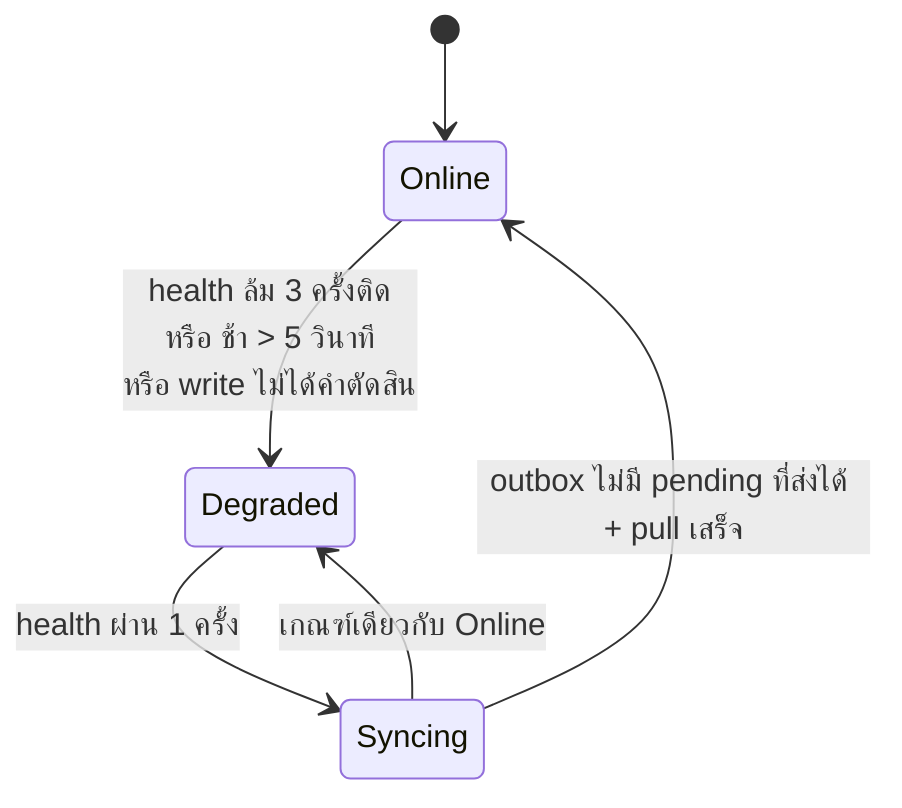

# 08 — Phase 2 spec: offline shell + production ในมหาวิทยาลัย

> **เอกสารเจ้าของสเปกเฟส 2** (Architecture C — `03_ARCHITECTURE.md §4`)
> ที่มา: เจ้าของโปรเจกต์ใน #240 — **D1–D15** (รอบ 1) · **E1–E11** (รอบ 2) · **F1–F10** (รอบ 3) · **F4′** (รอบ 4: กลับ F4) — **รอบหลังชนะรอบก่อนเมื่อขัดกัน** ·
> host: #242 (owner 2026-09-15) · แผนที่งาน #243 (ปิด 2026-09-22) · review รอบ 1–2 ของ PR #254
> ADR ที่แก้ตาม: [0004](adr/0004-device-roles.md) · [0007](adr/0007-receipt-numbering.md) · [0009](adr/0009-jwt-session-lifetime.md) · [0010](adr/0010-client-write-through-cache.md) · [0013](adr/0013-cicd-toolchain.md)
> **ขัดกับ ADR → ยึด ADR** · ไฟล์นี้เก็บกติกา + ตัวอย่าง + เกณฑ์รับงาน เหตุผลยาวอยู่ใน ADR
>
> 🔴 **ห้ามแต่งข้อความไทยใหม่** (`02 §8.1`) — ทุกคำไทยที่เป็นป้าย/ปุ่ม/ชื่อแท็บในไฟล์นี้เป็น **placeholder** รอ ticket ข้อความ (F10, §18)

สถานะ 2026-09-15: รอบ 3 · ยังไม่มีโค้ด

> **สถานะ 2026-09-23** (ข้อเท็จจริง ไม่ใช่การตัดสินใจใหม่): slice 0a–21 และ 24 merge แล้ว — รายใบ + PR ที่ §16 · ที่ยังเปิด: slice 22/23/25 (ops บน `mob04`) และ #231 · migration server ที่ไฟล์นี้ทำให้เกิด: `1788652803001-SingleOwnerRole` (§3) · `…3002-OwnerReviewItems` (C6) · `…3003-SyncPushColumns` (C3, C12, §12) · `…4000-CustomersMechanicsSyncIndex` (slice 13a) — DDL อยู่ที่ `01_DATABASE.md §5` · ⚠️ `01 §11` บันทึกบั๊กสองข้อของ `…3002` (policy RLS ไม่มี `NULLIF`, FK `ON DELETE SET NULL` ทั้งสองคอลัมน์) — ยังไม่แก้
>
> 📚 **งงกับ key?** อ่าน [`00_BASICS.md#keys`](00_BASICS.md#keys) หรือฉบับย่อ [`01_DATABASE.md#keys`](01_DATABASE.md#keys) —
> `(tenant_id, id)` คือ composite primary key อันเดียว ไม่ใช่ PK สองอัน
> สเปกนี้ยังมี **partial unique index** เช่น `uq_users_one_active ON users (tenant_id) WHERE is_active` — คนละเรื่องกับ PK แต่หลักการ constraint คล้ายกัน

---

## 0. สรุปหน้าเดียว

| เรื่อง | กติกา | ที่มา |
|---|---|---|
| บทบาทคน | **role `owner` เดียว + บัญชีร้านเดียว** (user active ได้คนเดียวต่อร้าน) · device role `pos`/`backoffice` เหมือนเดิม | E1, E2, F9 |
| งานเสี่ยงฝั่งเครื่อง | retire / enrol / export ต้องมี **device token ที่ enrol แล้ว** (รหัสผ่านอย่างเดียวไม่พอ) | F6 |
| เปิดแอปไม่มีเน็ต | PWA + service worker เขียนเอง · `storage.persist()` | D2, F8, #241 |
| แท็บ | `pos` แท็บเดียว (Web Locks) | D10 |
| สถานะ | Online / Degraded / Syncing + ป้าย "มีรายการรอ owner" | D5 |
| ขายออฟไลน์ | สต็อกในเครื่องพอก็ขาย · ลบ `offlineOk` | D3, E10 |
| op ในคิว / ออนไลน์เท่านั้น / ในเครื่องอย่างเดียว | §6 | E6 |
| push | replay → ตรวจ · ตามลำดับ หยุดที่ผลแรกที่ไม่ใช่คำตัดสิน · op หัวคิวล้ม 3 ครั้ง → หน้า "รอ owner" | B1–B4 (F1), F2 |
| ผู้กระทำใน push | user active คนเดียวของร้าน หาที่ server | F3 |
| เลข RC/CN | เครื่อง `pos` ออกเอง · ขึ้นเดือนใหม่ออฟไลน์เริ่ม `0001` · period จากนาฬิกาเครื่อง | D4, E8 |
| วันที่บิล | นาฬิกาเครื่อง · server clamp + ติดธงทุกครั้งที่ clamp | E9 |
| กะ | หลายกะต่อวัน · เปิดออฟไลน์ได้ · ปิดต้องออนไลน์ + outbox ว่าง · กะที่ไม่ได้ปิด = archive "ไม่ได้นับเงิน" | E7 |
| void | ออนไลน์: เหตุผล ไม่มี PIN · ออฟไลน์: เฉพาะบิลที่ขายออฟไลน์ + เหตุผล → รายการตรวจ | E3, E4 |
| PIN ออฟไลน์ | 1 PIN ต่อเครื่อง `pos` · ไม่ซ้ำรหัสผ่าน · 3 วัน **ตรวจที่เครื่องเท่านั้น** | E5, F5 |
| retire เครื่องที่ยังมี op ค้าง | ปฏิเสธ · มีปุ่มบังคับ + หมายเหตุ → รายการตรวจ | F7 |
| storage ของเครื่องถูกล้าง | ยอมรับว่า op ค้างหาย · enrol ใหม่ได้ `device_no` ใหม่เสมอ · คีย์บิลใหม่มือ | F8 |
| หน้าจอ | หน้า "รอ owner" 2 แท็บ · discard = ออนไลน์ + หมายเหตุ | E10 |
| production | `mob04` สภาพแวดล้อมเดียว · deploy ด้วย **self-hosted runner ที่ PR #237 merge แล้ว** (hook + `gha-runner` + `pos-deploy`) · ไม่มี pull timer | #242, F4′ |

---

## 1. ขอบเขต

| อยู่ในเฟส 2 | ไม่อยู่ |
|---|---|
| offline shell, `POST /sync/push`, เลข RC/CN ที่เครื่อง, PIN ออฟไลน์, หน้า "รอ owner", production บน `mob04` | cutover ร้านจริงจากนอกมหาวิทยาลัย (#231 — เฟสถัดไป; ผลเทียบ cloud: `docs/research/production-host.md` — ย้ายขึ้น `main` แล้ว PR #386, branch เดิมถูกลบ 2026-09-22 · แนะนำ cloud host ที่เจ้าของไม่เอาแล้ว 2026-09-15 เก็บไว้เป็น input เท่านั้น) · หลาย `pos` ต่อร้าน · `change_log`/CRDT (#191) · CouchDB (ADR-0012) · ใบกำกับภาษีเต็มรูป |

ข้อเท็จจริงที่ทั้งไฟล์ยืนอยู่: ร้านมี `pos` เครื่องเดียว (`one_pos_per_tenant`) = ผู้ขาย ผู้ถือลิ้นชัก ผู้ออก RC/CN คนเดียว · ความขัดแย้งมาจาก `backoffice` แก้ข้อมูลระหว่างนั้นเท่านั้น

---

## 2. การตัดสินใจทางออกแบบ

**B1–B4 อนุมัติแล้ว (F1).** แถว C เป็นทางที่ spec เลือกเอง (ทางง่ายที่ปลอดภัย ตรวจกับโค้ดแล้ว) ตามคำตอบรอบ 2–3 — ไม่ต้องให้เจ้าของเคาะเพิ่ม เว้นแต่อ่านแล้วค้าน

| # | ปัญหา | เลือก | ตัดทิ้ง (1 บรรทัด) |
|---|---|---|---|
| **B1** ✅ F1 | ตรวจก่อน replay → บิลที่ commit แล้วถูกปฏิเสธ | replay ด้วย key → replay ด้วย client id → ค่อยตรวจ (§8.3) | ตรวจก่อน + รายการยกเว้น |
| **B2** ✅ F1 | key หมดอายุ 24 ชม. (`idempotency.service.ts:28`) | ทุก op ที่สร้างแถวพก client id · server replay ด้วย id · เทียบ**เฉพาะฟิลด์ที่ไม่เปลี่ยน** (§6.1) · ไม่ตรง → `CLIENT_ID_REUSED` code เดียว | ยืด TTL |
| **B3** ✅ F1 | `retry` กลาง batch | ตามลำดับ หยุดที่ผลแรกที่ไม่ใช่คำตัดสิน · + ทางออก F2 (§8.4) | ประมวลผลต่อ |
| **B4** ✅ F1 | cursor จากนาฬิกาเครื่อง | `meta.nextCursor` ของ server เก็บใน Drift · ถอย 30 วินาทีครั้งเดียวต่อรอบ **และล้าง `afterId`** (§15) | `MAX(updatedAt)` ในเครื่อง |
| C1 | วันที่บิล (E9) | ออนไลน์: `now()` · push: อยู่ในหน้าต่าง `[opened_at − 5 นาที, now() + 5 นาที]` → เก็บตามเครื่อง · นอกนั้น → clamp เข้า `[opened_at, now()]` **+ ติดธงทุกครั้ง** | clamp เงียบเมื่อต่าง < 5 นาที |
| C2 | period ของเลข | **แหล่งเดียว: นาฬิกาเครื่อง** (ออนไลน์และออฟไลน์) · period ≠ เดือนของวันที่หลัง clamp → ธง `date_flag` ไม่ปฏิเสธ | สองแหล่ง (server ตอนออนไลน์) |
| C3 | บิลไหน "ขายออฟไลน์" (E4) | server: `sales.sold_offline` = บิล **commit ครั้งแรกผ่าน push** (รวมบิลที่ขายตอน Syncing) · client: `soldOffline` = บิลที่สร้างลงคิว · บิลที่ยิงออนไลน์แล้ว timeout **แต่ commit แล้ว** นับเป็นบิลออนไลน์ → void ต้องออนไลน์ (ทางที่ปลอดภัย) | เชื่อป้ายจากเครื่อง |
| C4 | PIN ≠ รหัสผ่าน (E5) | หน้าตั้ง PIN พิมพ์รหัสผ่านซ้ำ → `POST /auth/token` ตัวเดิม → เทียบในหน่วยความจำ แล้วล้าง | endpoint ใหม่ · ส่ง PIN ขึ้น server |
| C5 | หน้าต่าง 3 วัน (F5) | **เครื่องตรวจอย่างเดียว** นับจาก `iat` ของ token ที่ได้จาก **`/auth/token`** (ไม่ใช่ `/auth/refresh` ซึ่งออก `iat` ใหม่ `auth.service.ts:325`) · **ไม่มี `devices.last_online_login_at`, ไม่มี `authMode`, ไม่มี `OFFLINE_PIN_REJECTED`** | ตรวจซ้ำที่ server — `date` มาจากเครื่อง จึงกันคนปลอมไม่ได้ ได้แต่ตีกลับบิลจริง |
| C6 | ของที่ owner ต้องตรวจ | ตารางเดียว `owner_review_items` (`kind`, `ref_id`, `details`, `reviewed_at`) | คอลัมน์ต่อชนิด |
| C7 | `customer.update` replay หลัง key หมดอายุ | ยอมรับ: เขียนค่าเดิมซ้ำ อาจทับการแก้ของ backoffice | version/conflict |
| C8 | เลขขาดช่วง | เลขถูกใช้เมื่อ 2xx หรือเข้าคิว · 4xx ออนไลน์ใช้เลขเดิมซ้ำ | กินเลขทิ้ง |
| C9 | `users.pin_hash` ไม่มีผู้ใช้ | ลบ | เก็บไว้ |
| C10 | ตัวกระตุ้น Degraded | ล้ม 3 ครั้งติด หรือ ช้า > 5 วินาทีครั้งเดียว หรือ write ไม่ได้คำตัดสิน | "ช้า" นับรวมในสามครั้ง |
| C11 | ธง "ไม่ได้นับเงิน" | `shifts.auto_archived` ที่มีอยู่ + รายการตรวจ `shift_uncounted` | คอลัมน์ใหม่ |
| C12 | เครื่องรายงาน op ค้าง (F7) | ทุกคำขอ push ส่ง `outboxRemaining` · server เก็บ `devices.unsynced_ops` + `unsynced_reported_at` · ออนไลน์ไม่มี op ก็ส่ง push ว่าง `{ops:[], outboxRemaining:0}` เมื่อค่าเปลี่ยน | heartbeat endpoint แยก |
| C13 | ผู้กระทำใน push (F3) | server หา user `is_active` คนเดียวของ tenant (unique index F9) → `actor.userId` ทุก service/audit · ไม่เจอ → 403 ระดับคำขอ | `userId` จาก body |
| C14 | op หัวคิวติด (F2) | client นับผลไม่ใช่คำตัดสินติดกันต่อ op · ครบ 3 → `status='stuck'` แสดงในหน้า "รอ owner" · op ที่ **aggregate ชนกัน** รอ · ที่เหลือส่งต่อ (§8.4) | รอ developer แก้ |
| C15 | discard แถวที่ server อาจมีอยู่ | `POST /sync/discards` ตอบ `serverHasRow` · `true` → ไม่ลบในเครื่อง ดึงแถวนั้นจาก server แทน | ลบในเครื่องเสมอ |
| C16 | switch-over ของเลข (§9) | server **ยัง fallback ออกเลขให้** ถ้า body ไม่มีเลข จน flag `DOC_NUMBER_FALLBACK=false` (ปิดหลังแท็บทุกแท็บของ `pos` เป็นรุ่นใหม่) · client รุ่นใหม่ต้อง seed ออนไลน์หนึ่งครั้งหลังอัปเกรดก่อนออกเลขออฟไลน์ | `400` ทันที — ตีแท็บเก่าที่ §4 ข้อ 6 ไม่รีโหลดให้ |

**ของที่ spec เพิ่มเอง (ไม่มีใน D/E/F — ให้เห็น):** `POST /sync/discards` · ล็อก PIN หลังผิด 5 ครั้ง · 50 op ต่อคำขอ · `DOC_NUMBER_EXHAUSTED` · `is_active` ตรวจทุกคำขอ push (C13) · ล้าง `doc_counter_seeds` ตอนอัปเกรด (C16) · ลองขอ lock ซ้ำ 2 วินาที · allowlist ของ platform plane (slice 24) · `devices.unsynced_ops` (C12)

---

## 3. บัญชี บทบาท และงานเสี่ยงฝั่งเครื่อง (E1, E2, E3, F6, F9)

**กติกา**

| | |
|---|---|
| `users.role` | `'owner'` เท่านั้น — migration: ทุกแถว → `owner`, CHECK `('owner')` |
| user active | **หนึ่งคนต่อร้าน** — migration เก็บ owner แถวแรก (`created_at` เก่าสุด) active, ที่เหลือ `is_active=false` (ประวัติคง `user_id`) · `CREATE UNIQUE INDEX uq_users_one_active ON users (tenant_id) WHERE is_active` |
| guard | ลบทุกตัวที่เช็ค role คน · เหลือ "ล็อกอินแล้ว" + device role |
| void ออนไลน์ | เหตุผลบังคับ ไม่มี PIN · ลบ `users.pin_hash` |
| **retire / enrol / export** (F6) | ต้องมี `did` ใน JWT (ล็อกอินพร้อม device token ที่ enrol แล้ว — `pos` หรือ `backoffice`) · ไม่มี → `403 DEVICE_ROLE_FORBIDDEN` · เครื่องแรกของร้านใช้ enrolment code จาก provisioning (ADR-0001) |

**ทำไม F6:** บัญชีร้านเดียว = ทุกคนรู้รหัสผ่าน · ถ้าไม่บังคับ device token ใครก็ retire `pos` (op ค้างหาย), enrol `pos` ของตัวเอง, หรือโหลดข้อมูลลูกค้าจาก browser ไหนก็ได้ในมหาวิทยาลัย · route เงินปลอดภัยอยู่แล้ว (`@RequireDeviceRole('pos')`)

**จุดที่ต้องแก้ (`main` @ `8e873cd`)**

| ไฟล์ | |
|---|---|
| `sales/void.service.ts` | ลบ `ROLES_THAT_MAY_VOID`, `authorise` (PIN + argon2 + `consumeAttempt`), `AuthorisedVoid` → รับ `reason` |
| `products.controller.ts` (4) · `catalogue.controllers.ts` (5) · `mechanics.controller.ts` (3) · `purchase-orders.controller.ts` (4) · `purchasing.controller.ts` (3) · `settings.controller.ts` (1) · `quotes.controller.ts` purge (1) | ลบ `requireManager` |
| `devices.controller.ts:116` · `backup.controller.ts:54,91` | `role !== 'owner'` → **ต้องมี `did`** (F6) |
| `idempotency-routes.spec.ts` | regex ของ void ที่ปักรูป `authorise` |
| `server/test` ~41 ไฟล์ · `frontend/test` 5 ไฟล์ | fixture role |

> สถานะ 2026-09-23: ตารางข้างบนเป็นภาพของ `8e873cd` (ก่อนลงมือ) · slice 1 (#278) merge แล้ว PR #300 → migration `1788652803001-SingleOwnerRole` (CHECK `role = 'owner'`, `uq_users_one_active`, ลบ `pin_hash`) · commit `225ecf7` แก้ `InitialSchema.ts` ด้วย (ดูข้อควรระวังใน `01 §11`) · slice 2 (#279) merge แล้ว PR #301 · checkbox ข้างล่างไม่ได้ติ๊กในไฟล์นี้ — หลักฐานอยู่ที่ issue/PR

**เกณฑ์รับงาน**
- [ ] migration: ร้านที่มี 3 user → 1 active (เก่าสุด) · สร้าง user active คนที่สอง → 23505
- [ ] grep `'manager'`/`'cashier'` ใน `server/src` + `frontend/lib` = 0
- [ ] void ไม่มีเหตุผล 400 · มีเหตุผล 200 · บิลนอกกะเปิด `409 SALE_NOT_IN_OPEN_SHIFT`
- [ ] ล็อกอินไม่มี device token → `POST /devices`, `/devices/:id/retire`, `/backup/export` = 403 · มี token = ผ่าน

---

## 4. PWA shell + แท็บเดียว (D2, D10, F8)

ผลวิจัย #241: `docs/research/pwa-offline-shell.md` (อยู่บน `main` แล้ว — PR #386, 2026-09-22; branch `research/pwa-offline-shell` ถูกลบ)
· สถานะ 2026-09-23: slice 3 (#273) merge แล้ว PR #322 · ข้อ 8 (`/sw.js` no-cache) มากับ #270 PR #308 · ข้อ 9 (#245) PR #267 · web DB LinkError #266 แก้ใน PR #310 (issue ปิด 2026-09-19)

| # | ต้องมี | เหตุผลย่อ |
|---|---|---|
| 1 | service worker เขียนเอง (Workbox) | Flutter 3.44 ไม่สร้าง SW (flutter#156910) |
| 2 | precache shell + `sqlite3.wasm` + `drift_worker.js` + CanvasKit ในเครื่อง | |
| 3 | build `--no-web-resources-cdn` | ต้องพิสูจน์บน 3.44.3 (flutter#148713) |
| 4 | bundle ฟอนต์ Sarabun/Barlow | flutter#163554 |
| 5 | ชื่อ cache = `github.sha` · ลบของเก่าตอน activate | |
| 6 | ถามก่อนโหลดรุ่นใหม่ ไม่ `skipWaiting` อัตโนมัติ | ห้ามรีโหลดกลางบิล — **server ต้องรับ client รุ่นก่อนหน้าได้หนึ่งรุ่น** (C16) |
| 7 | `navigator.storage.persist()` ตอนบูต + บันทึก `persisted()` | F8 |
| 8 | nginx `Cache-Control: no-cache` ที่ `/sw.js` | `deploy.yml` สร้าง nginx ใหม่ทุก deploy แล้ว (#256) — แก้ `nginx.conf` มีผลทันที |
| 9 | แก้ skew asset web ก่อน (#245) | |
| 10 | cert ที่ browser เชื่อบนเครื่องที่ใช้ | `mob04` self-signed — Chrome ไม่ register SW |
| 11 | แท็บเดียว: `navigator.locks.request('srisurart-pos-writer', {ifAvailable:true})` · ไม่ได้ → ลองซ้ำ ~2 วินาที → หน้า "เปิดอยู่แล้ว" (placeholder) · ไม่เขียนอะไร | D10 |

**เกณฑ์รับงาน**
- [ ] ปิดเน็ต → รีโหลด → แอปขึ้น, DB เปิด, ไม่มี request ไป gstatic/googleapis
- [ ] deploy รุ่นใหม่ → แท็บเดิมถาม และยังขายต่อได้ด้วยรุ่นเดิม
- [ ] แท็บที่สอง → หน้า "เปิดอยู่แล้ว" · รีโหลดแท็บแรกไม่ติดหน้านั้น
- [ ] `persisted() == true` บนเครื่องที่ติดตั้ง

---

## 5. สถานะ (D5)



ป้าย "มีรายการรอ owner" = `count(rejected) + count(stuck) > 0` แสดงได้ทุกสถานะ

| สถานะ | write ใหม่ |
|---|---|
| Online | ยิง endpoint ออนไลน์ |
| Degraded | op ในคิว (§6) → outbox · ออนไลน์เท่านั้น → ปุ่มปิด |
| Syncing | ต่อท้าย outbox · ออนไลน์เท่านั้น → รอ |

ค่าคงที่ (ปรับใน PR ได้): health = `GET /health/ready` (probe ใช้ pool ของตัวเองขนาด 1 ตั้งแต่ #253 — health เขียวไม่ได้แปลว่า pool ของ request ว่าง; write ที่ค้างยังทำให้ Degraded ตามข้อ "ไม่ได้คำตัดสิน") · ตรวจทุก 5 วินาที timeout 5 วินาที · "ไม่ได้คำตัดสิน" = ที่ `isVerdict` ไม่นับ (timeout, socket, 5xx, 429, `503 IDEMPOTENCY_KEY_IN_FLIGHT`) → เข้า outbox ด้วย id + key เดิม · 4xx = คำตัดสิน

กติกาลำดับ: มี op `pending` ที่ส่งได้ → write ใหม่ต่อท้าย outbox (op `stuck` และ op ที่รอมันไม่นับ — §8.4)

**เกณฑ์รับงาน**
- [ ] health ปลอม: ล้ม 3 ครั้ง / ช้า 6 วินาทีครั้งเดียว → Degraded · ผ่าน → Syncing → Online
- [ ] write timeout → Degraded + op ใน outbox ด้วย key เดิม
- [ ] 409 ไม่เปลี่ยนสถานะ

---

## 6. Op catalogue (E6)

### 6.1 เข้าคิว

| `type` | endpoint ออนไลน์ | client id (B2) | ฟิลด์ที่เทียบตอน replay by id | aggregate (C14) |
|---|---|---|---|---|
| `shift.open` | `POST /shifts/open` | `shifts.id` — **เพิ่ม** (`shifts.service.ts:186`) | `startingCash` | `shift:<id>` |
| `sale.create` | `POST /sales` | `sales.id` ✅ | `total` ✅ (`sales.service.ts:634`) · บิลถูก void แล้ว → **`applied`** บน push (ออนไลน์ยังเป็น `409 SALE_VOIDED`) | `sale:<id>` · รอ `shift`, `customer` |
| `return.create` | `POST /returns` | `returns.id` — **เพิ่ม** (`returns.service.ts:264`) | `saleId` + รายการ (`productId`, `qty`, `price`) | `return:<id>` · รอ `sale:<saleId>`, `shift` |
| `drawer.entry` | `POST /shifts/current/entries` | `drawer_entries.id` — **เพิ่ม** (`shifts.service.ts:370`) | `type` + `amount` | `drawer:<id>` · รอ `shift` |
| `credit_payment.create` | `POST /mechanics/:id/credit-payments` | ✅ (#24) | ช่าง + ยอด + วิธีจ่าย ✅ | `cp:<id>` · รอ `shift` |
| `customer.create` | `POST /customers` | `customers.id` — **เพิ่ม** (`customers.service.ts:150`) | **ไม่เทียบ** — id อย่างเดียว (C7) | `customer:<id>` |
| `customer.update` | `PATCH /customers/:id` | – | เขียนซ้ำ (C7) | `customer:<id>` |
| `sale.void_offline` | push เท่านั้น | – | บิล void แล้ว → `applied` | `sale:<saleId>` · รอ `shift` |

- override วงเงิน = `overrideCreditLimit` ใน `sale.create` · ทาง push → รายการตรวจ `credit_override`
- id ชน + ฟิลด์ที่เทียบไม่ตรง → `rejected` **`CLIENT_ID_REUSED`** `details: {type, id}` (code เดียวแทน `SALE_ID_REUSED`/`CREDIT_PAYMENT_ID_REUSED` บนทาง push; ทางออนไลน์คง code เดิม)

### 6.2 ออนไลน์เท่านั้น
สินค้า · หมวด · ซัพพลายเออร์ · PO · ช่าง · **ใบเสนอราคาทั้งหมด** · settings · การลบ · void บิลออนไลน์ · ปิดกะ · discard · ตั้ง PIN ออฟไลน์ · import · จัดการเครื่อง · export

### 6.3 ในเครื่องอย่างเดียว
พักบิล (`parked_sales`) — ไม่ sync

### 6.4 กติการ่วม
- 🔴 **body ออนไลน์ = payload ของ op** (fingerprint `idempotency.runner.ts:40`) · ฟิลด์ใหม่ `id`, `date`, `receiptNo`/`cnNo`, `openedAt` อยู่ใน body ออนไลน์ด้วย · ไม่มี `shiftId`, ไม่มี `userId`
- `api_*.dart`: ทุก write เป็น op หรือถูกปฏิเสธ — fallback `super.<write>()` หาย (#229)

**เกณฑ์รับงาน**
- [ ] ต่อ type: key เดิม = ผลเดิม · ลบ key แล้วส่ง id เดิม = ผลเดิม · id เดิมฟิลด์ต่าง = `CLIENT_ID_REUSED` · `customer.create` ที่ backoffice แก้แล้ว + key หมดอายุ → `applied`
- [ ] push `sale.create` ของบิลที่ void แล้ว → `applied`
- [ ] Degraded: ปุ่ม §6.2 ปิด · พักบิลใช้ได้

---

## 7. Outbox ในเครื่อง

`outbox_ops` ตารางเดียว (รวม `pending_credit_payments` ของ #24):

| คอลัมน์ | |
|---|---|
| `opId` PK · `idempotencyKey` · `type` · `payload` (= body ออนไลน์) · `aggregates` (JSON: ของตัวเอง + ที่รอ) · `createdAt` | |
| `status` `pending`/`stuck`/`rejected` · `attempts` (นับไม่ใช่คำตัดสินติดกัน) · `lastCode` · `lastMessage` · `lastDetails` | |

- id + key สร้างก่อนส่ง · แถวที่ op สร้าง + แถว outbox ใน **local transaction เดียว** · ห้ามเรียก transactional service ของ Drift
- ลบ op เมื่อ `applied` และ patch สำเร็จ · patch ไม่เขียนทับ `stock` ของสินค้าที่ยังมี op ค้าง
- เลข schema ของ Drift ใส่ตอน merge
  · สถานะ 2026-09-23: `outbox_ops` + `SyncService` merge แล้ว (#228, PR #324) · `pending_credit_payments` ย้ายเข้า (#275, PR #329) · Drift บน `main` = **schema v11** (v7 = ลบ `offlineOk`, #272 PR #310)

**เกณฑ์รับงาน**
- [ ] kill แอประหว่างขาย → บิลกับ op มีทั้งคู่หรือไม่มีทั้งคู่
- [ ] `pending_credit_payments` ย้ายเข้า `outbox_ops` ไม่มีแถวหาย

---

## 8. `POST /sync/push`

> สถานะ 2026-09-23: ครึ่ง server merge แล้ว (#283, PR #313 — `server/src/sync/`) · ครึ่ง client (#228, PR #324) · e2e จาก fixture ทั้งสองฝั่ง (#287 PR #323 · #193 PR #331) · คอลัมน์ `devices.unsynced_ops`/`unsynced_reported_at` + `sales.sold_offline` + ฟังก์ชัน `auth_lookup_device_and_active_user` (C13) อยู่ใน migration `1788652803003-SyncPushColumns` · fixture อยู่ที่ `fixtures/sync-push/` (18 ไฟล์, #269 PR #307)

### 8.1 การยืนยันตัวและผู้กระทำ (D8, F3)
- `X-Device-Token` → `tid`/`did`/`drole` · `drole = pos` · tenant active · endpoint เดียวที่รับ device token แทน access token
- **ผู้กระทำ = user `is_active` คนเดียวของ tenant** (C13) ใช้กับ `actor.userId`, `opened_by`/`created_by` (`shifts.service.ts:180,365`), และทุกแถว `audit_log` (CHECK `user_id IS NOT NULL …` `InitialSchema.ts:128`) · ไม่เจอ → 403 ระดับคำขอ
- ล้มระดับคำขอ (401/403/429/5xx/timeout) → ไม่เปลี่ยนสถานะ op · log redact `X-Device-Token`

### 8.2 รูปคำขอ/คำตอบ (แทน `02 §7`)

```jsonc
// POST /sync/push   สูงสุด 50 op
{ "outboxRemaining": 12,
  "ops": [ { "opId": "op_1", "idempotencyKey": "k1", "type": "sale.create",
             "payload": { "id": "s_1", "receiptNo": "RC01-2569-09-0042", "date": "2026-09-15T02:00:00Z", "items": [] } } ] }

// 200
{ "status": "success", "data": { "results": [
  { "opId": "op_1", "status": "applied", "response": { /* = คำตอบของ POST /sales */ } },
  { "opId": "op_2", "status": "rejected", "code": "INSUFFICIENT_STOCK", "message": "…", "details": {} },
  { "opId": "op_3", "status": "retry" },
  { "opId": "op_4", "status": "retry" }   // ไม่ถูกประมวลผล (B3)
] } }
```

`outboxRemaining` = จำนวน op ที่ยังไม่ `applied` ในเครื่อง **หลัง** batch นี้ (รวม `stuck`/`rejected`) → `devices.unsynced_ops` (C12)

### 8.3 ลำดับต่อ op (B1)

| ขั้น | ทำอะไร | ผล |
|---|---|---|
| 1 | `runIdempotent` ด้วย key + fingerprint **เหมือน route ออนไลน์** (method + path ออนไลน์ + body) | replay → `applied` จบ |
| 2 | replay ด้วย client id (§6.1) ใน transaction เดียวกัน | replay → `applied` จบ · ฟิลด์ไม่ตรง → `CLIENT_ID_REUSED` |
| 3 | service ตัวเดียวกับ controller ออนไลน์ · lock order เดิม: บิล → `shifts FOR SHARE` → ช่าง → สินค้า (เรียง id) → `doc_counters` → ลูกค้า | ปฏิเสธใน service → `rejected` (claim ย้อน → ส่งใหม่ด้วย key เดิมได้) |
| 4 | ผลพลอยของ push: `sold_offline` (C3), วันที่ (§10), รายการตรวจ (§14) | ใน transaction เดียวกัน |

- `runTx` ของตัวเองต่อ op ต่อกันทีละตัว — ห้าม `Promise.all` (#162), ห้ามรวมทั้ง batch
- `IN_FLIGHT`, `CommitCeilingExceededError`, 5xx → `retry` แล้ว**หยุด**
- guard 25 วินาทีของ #213 ตรวจก่อน `COMMIT` — fsync ที่ค้างตอน COMMIT ไม่อยู่ในนั้น

### 8.4 ฝั่ง client — ส่งทีละคำขอ + ทางออกของหัวคิวที่ติด (F2)

| กติกา | |
|---|---|
| single flight | `SyncService` ส่งทีละคำขอ · timeout → รอ health รอบถัดไป |
| นับ | op ที่ได้ `retry` (หรือคำขอล้มขณะมันเป็นหัว batch) → `attempts += 1` · ได้คำตัดสิน → `attempts = 0` |
| ติด | `attempts = 3` → `status='stuck'` → แสดงในหน้า "รอ owner" แท็บถูกปฏิเสธ พร้อม code ล่าสุด |
| ใครรอ | op ที่ `aggregates` ของตัวเองหรือที่มันรอ **ตรงกับ aggregate ของ op ที่ติด** (ตาราง §6.1) — ต่อกันเป็นทอด |
| ใครไปต่อ | op อื่นทั้งหมด — batch ถัดไปข้าม op ที่ติดและที่รอมัน |
| owner | ส่งใหม่ (`attempts = 0`, key เดิม) หรือ discard + หมายเหตุ (§14) |

**ตัวอย่าง:** คิว `[open S] [sale A] [void A] [sale B] [drawer d]` · `sale A` ติด → `void A` รอ (aggregate `sale:A`) · `sale B`, `drawer d` ส่งต่อ · ถ้า `open S` ติด → ทุก op ใน S รอ

**เกณฑ์รับงาน**
- [ ] e2e B1: บิล `overrideCreditLimit` commit ออนไลน์แล้วตอบหาย → push → `applied` บิลเดิม + **หนึ่ง** แถว `audit_log` ที่ `user_id` = บัญชีร้าน
- [ ] e2e B2: ลบแถว `idempotency_keys` แล้ว push ทุก type → `applied`, stock/เงินไม่ขยับซ้ำ
- [ ] e2e B3: op N ติด `IN_FLIGHT` → op N+1 ได้ `retry` ไม่ประมวลผล
- [ ] ปลอม server ให้ `sale A` ตอบ 500 สามรอบ → `stuck` · `void A` ไม่ถูกส่ง · `sale B` ถูกส่ง
- [ ] ร้านไม่มี user active → 403 ไม่มี op เปลี่ยน
- [ ] `idempotency-routes.spec.ts` ครอบ `/sync/push`

---

## 9. เลข RC/CN (D4, E8, C2, C16)

| | |
|---|---|
| ใครออก | เครื่อง `pos` จาก `DocCounters` (key `deviceId`, #188) ออนไลน์+ออฟไลน์ · PO/QT/CP server ออก |
| period | **นาฬิกาเครื่องเท่านั้น** (C2) |
| server ตรวจ | prefix ตรง type · `device_no` ตรง `did` · 0001..9999 → ไม่ผ่าน `400 DOC_NUMBER_INVALID` · ไม่ตรวจ period |
| high-water mark | `INSERT INTO doc_counters … ON CONFLICT (tenant_id, device_id, doc_type, period) DO UPDATE SET last_no = GREATEST(doc_counters.last_no, EXCLUDED.last_no)` |
| ชน UNIQUE | ออนไลน์ (ยังไม่พิมพ์) → `409 RECEIPT_NO_CONFLICT` → ขยับเลข ส่งใหม่ key เดิม · push → `rejected` ห้ามเปลี่ยนเลข (#190) · ตรวจหลัง replay (B1/B2) |
| ขึ้นเดือนใหม่ออฟไลน์ | เริ่ม `0001` (E8) |
| ห้ามออกเลขออฟไลน์ | เครื่องที่ยังไม่มี seed marker (เพิ่ง enrol **หรือเพิ่งอัปเกรดเป็นรุ่นที่ออกเลขเอง** — C16) |
| เลขถูกใช้เมื่อ | 2xx หรือเข้าคิว (C8) |
| `DOC_NUMBER_EXHAUSTED` | `9999` → error ไม่วนกลับ |

**Switch-over (C16) — ไม่ตีแท็บเก่า**

| ขั้น | |
|---|---|
| 1 | deploy server: รับเลขจาก client · **body ไม่มีเลข → server ออกให้เหมือนเดิม** (`DOC_NUMBER_FALLBACK=true`) |
| 2 | deploy client รุ่นใหม่: migration ลบ `doc_counter_seeds` → seed ออนไลน์หนึ่งครั้งก่อนออกเลขออฟไลน์ (marker ก่อนสลับเชื่อไม่ได้ — hazard #188) |
| 3 | เมื่อเครื่อง `pos` รายงานรุ่นใหม่ (header `X-Client-Version`) → ตั้ง `DOC_NUMBER_FALLBACK=false` → body ไม่มีเลข = `400 DOC_NUMBER_REQUIRED` |

**ตัวอย่าง:** ออฟไลน์ 30 ก.ย. เลขล่าสุด `RC01-2569-09-0141` → เที่ยงคืน (นาฬิกาเครื่อง) → `RC01-2569-10-0001`

**เกณฑ์รับงาน**
- [ ] `device_no` ผิด 400 · บิลแรกของ period → `GET /doc-counters` เห็นเลข
- [ ] fallback เปิด + body ไม่มีเลข → server ออกเลข · fallback ปิด → 400
- [ ] ไม่มี marker + ออฟไลน์ → ปฏิเสธก่อนเขียน/พิมพ์ · มี marker + ขึ้นเดือน → `0001`
- [ ] push ใบลดหนี้ที่ commit แล้ว (key หมดอายุ) → `applied`

---

## 10. วันที่บิล (E9, C1)

| ทาง | `sales.date` / `returns.date` / `drawer_entries.created_at` / `shifts.opened_at` |
|---|---|
| route ออนไลน์ | `now()` (ไม่อ่าน `date` ใน body) |
| `/sync/push` | ใน `[opened_at − 5 นาที, now() + 5 นาที]` → ใช้ของเครื่อง · นอกนั้น → clamp เข้า `[opened_at, now()]` + รายการตรวจ `date_flag` · period ≠ เดือนหลัง clamp → `date_flag` |

รายงานนับตาม `date` — บิลออฟไลน์ 30 ก.ย. ที่ push 1 ต.ค. อยู่ในเดือนกันยายน

**กรณีขอบ (owner 2026-09-25)** — `server/src/sync/sync.service.ts` `clampOpDate`
| กรณี | ผล |
|---|---|
| ไม่มีฟิลด์วันที่ใน payload | ใช้ `now()` ของ server (§10 ไม่ได้สั่งให้ปฏิเสธ) |
| มีฟิลด์แต่ parse ไม่ได้ (รวมสตริงว่าง หรือไม่ใช่ string) | op → `rejected` `BAD_REQUEST` (400) · **ไม่** แทนด้วย `now()` เงียบๆ |
| กะที่ใช้วัด | กะ**ที่เปิดอยู่**ของเครื่อง (`is_active AND closed_at IS NULL`) — กะเดียวที่บิล/คืนเงินสดลงได้ (`requireOpenShiftIdFor`) · กะที่ปิดแล้วแต่ยังไม่ถูก archive (`is_active` ยังจริง) **ไม่ใช่หน้าต่าง** → ถือเป็น "ไม่มีกะ" |
| period ของเลข RC/CN ≠ ปี พ.ศ.-เดือนของวันที่ที่เก็บ (timezone ร้าน, ไม่มีวันที่ = `now()`) | ไม่ปฏิเสธ · `date_flag` (`details` + `docNo`, `docPeriod`, `datePeriod`) · clamp กับ period ผิดพร้อมกัน = ธง**เดียว**ต่อ op |
| เครื่องไม่มีกะที่เปิดอยู่ | ตรวจแค่ขาอนาคต: `> now() + 5 นาที` → `now()` + `date_flag` (`openedAt: null`) · วันที่ย้อนหลังเก็บตามเครื่อง ไม่มีธง (ไม่มี `opened_at` ให้วัด) |
| `shift.open` | ไม่ clamp ขาอดีต (วัดกับกะ*ก่อนหน้า*จะดึงการเปิดกะออฟไลน์ที่ถูกต้องไปข้างหน้า) · `openedAt > now() + 5 นาที` → เก็บ `now()` + `date_flag` — เพราะ `opened_at` ในอนาคตทำให้ทุก op ในกะหลุดหน้าต่าง |
| push replay (key หรือ client id) | ไม่รันซ้ำ → ไม่มี `date_flag` ซ้ำ · op ที่ถูกปฏิเสธ rollback ธงไปด้วย |

**เลขเอกสารถูกเปลี่ยน (owner 2026-09-25):** push replay `sale.create`/`return.create` ของเอกสารที่ commit ออนไลน์แล้ว (คำตอบหาย, #409) โดย `receiptNo`/`cnNo` ใน payload ≠ เลขที่ server เก็บ → รายการตรวจ `receipt_renumbered` `details { opId, type, id, offlineNo, serverNo }` หนึ่งรายการต่อเอกสาร (unique index บางส่วน, replay ซ้ำไม่เพิ่ม) · คำตอบ `applied` มีเลขของ server ให้เครื่อง patch

**เกณฑ์รับงาน**
- [ ] push `date` เมื่อวานในกะเมื่อวาน → เก็บเมื่อวาน ไม่มีธง
- [ ] push `date` อนาคต 3 นาที → เก็บตามเครื่อง ไม่มีธง · อนาคต 10 นาที → `now()` + ธง
- [ ] รายงานรายวันนับบิลตาม `date`

---

## 11. กะ (E7, D6)

| | |
|---|---|
| หลายกะต่อวัน | ได้ · `uq_shift_active` (active ละหนึ่งต่อเครื่อง) คงเดิม |
| `POST /shifts/open` | body `{ id, startingCash, openedAt }` · id มีแล้ว → คืนกะนั้น · มีกะ active อื่น → archive (`auto_archived=true`, ไม่มี `physical_cash`) + `shift_uncounted` · insert ด้วย id ของ client · `date_str` จาก `opened_at` (§10) ตาม `tenants.timezone` |
| ลบของเดิม | "active วันเดียวกัน → คืนกะเดิม" + `today()` (`shifts.service.ts:160-176`) |
| ⚠️ ผลข้างออนไลน์ | กด "เปิดกะ" ขณะมีกะ active → กะเดิมถูก archive ไม่ได้นับเงิน (เดิมคืนกะเดิม) · หลังปิดกะ ใบลดหนี้เงินสด (#100) ไม่ต้องรอพรุ่งนี้แล้ว เปิดกะใหม่ได้เลย |
| ปิดกะ | ออนไลน์ + outbox ไม่มี `pending`/`stuck`/`rejected` — **client บังคับ** (server ไม่เห็น outbox) |
| รายการในคิว | server ประทับกะ active ณ ตอนนั้น — ลำดับ push ทำให้ตรง |
| กะที่มาจาก import (#244) | ถูก archive ทุกกะ (`auto_archived` ถ้าไม่เคยปิด) โดย import เอง — **ไม่สร้าง** `shift_uncounted` (รายการตรวจเกิดจาก `open` เท่านั้น) · บิลที่ import ไม่มี `shift_id` → void ไม่ได้ ต้องออกใบลดหนี้ (#94 เดิม) |

**ตัวอย่าง:** เน็ตล่มสองวัน: `open A`(15) → 20 บิล → `open B`(16) → 30 บิล → push ตามลำดับ → A archive + `shift_uncounted` · บิลลงกะของตัวเองครบ

**เกณฑ์รับงาน**
- [ ] e2e ตัวอย่าง: A `date_str` = 15, B = 16, ไม่มีบิลถูกปฏิเสธ
- [ ] `open` ซ้ำ id เดิม → กะเดิม ไม่ archive
- [ ] ปุ่มปิดกะปิดเมื่อ outbox ไม่ว่าง

---

## 12. Void (E3, E4, C3)

| | ออนไลน์ | ออฟไลน์ |
|---|---|---|
| บิลไหน | บิลในกะที่เปิดอยู่ของเครื่อง (#94) | client: `soldOffline` · server: `sold_offline` + ในกะที่เปิดอยู่ ณ ลำดับนั้น |
| ต้องมี | เหตุผล | เหตุผล |
| ผล | void | void + `void_offline` |
| undo | ไม่มี | ไม่มี |

- `sales.void_reason TEXT` (ทั้งสองทาง) · `sales.sold_offline BOOLEAN NOT NULL DEFAULT false` · Drift `Sales.soldOffline`
  (2026-09-23: ทั้งสองคอลัมน์มาใน migration `1788652803003-SyncPushColumns` · server #284 PR #316 · client #276 PR #334)
- ข้อตรวจเดิมคงอยู่ · push void ของบิลที่ไม่ใช่ `sold_offline` → `rejected` `VOID_NEEDS_ONLINE`

**เกณฑ์รับงาน**
- [ ] push `sale.create` แล้ว void ของบิลนั้น → void + 1 รายการตรวจ
- [ ] push void ของบิลออนไลน์ → `VOID_NEEDS_ONLINE` · ปุ่ม void ออฟไลน์ไม่แสดงบนบิลออนไลน์

---

## 13. PIN ออฟไลน์ (E5, F5, C4, C5)

| | |
|---|---|
| กี่ PIN | 1 ต่อเครื่อง `pos` สำหรับบัญชีร้าน |
| ตั้ง | ออนไลน์ · ไม่ซ้ำรหัสผ่าน (C4) |
| เก็บ | hash ช้าผูกเครื่องใน Drift · ไม่ส่งขึ้น server |
| อายุ | 3 วันนับจาก `iat` ของ token จาก `/auth/token` ครั้งล่าสุดบนเครื่องนี้ (refresh ไม่นับ) — **ตรวจที่เครื่องเท่านั้น** (F5) |
| ใช้ได้ | Degraded เท่านั้น · ผิด 5 ครั้งล็อกในแอป |
| เน็ตกลับ (D8) | ขายต่อ · op เข้า outbox จนล็อกอินจริง · write ออนไลน์เท่านั้นต้องล็อกอินก่อน |

**ข้อจำกัดที่ยอมรับ:** คนที่ได้ storage + device token ปลอม op ในคิวได้ · กันด้วย `/retire` (ต้องมี device token — F6) · void ออฟไลน์เฉพาะบิลออฟไลน์ · ของเสี่ยงลงรายการตรวจ · เปลี่ยนรหัสผ่านทีหลังให้ตรง PIN ระบบรู้ไม่ได้

**เกณฑ์รับงาน**
- [ ] ตั้ง PIN = รหัสผ่าน → ปฏิเสธ (ไม่มี PIN/hash ใน request)
- [ ] ออนไลน์ → ไม่มีตัวเลือก PIN · Degraded + `/auth/token` ล่าสุด 4 วันก่อน (refresh เมื่อวาน) → ไม่มีตัวเลือก

---

## 14. หน้า "รอ owner" (E10, F2, F7, C15)

ป้าย/ปุ่ม/ชื่อแท็บด้านล่าง = **placeholder** (F10)

| แท็บ (placeholder) | แหล่ง | ปุ่ม (placeholder) |
|---|---|---|
| ถูกปฏิเสธ/ค้าง | `outbox_ops` `rejected` + `stuck` (ในเครื่อง) — code, ข้อความ, payload, เลขที่พิมพ์ | ส่งใหม่ (key เดิม · ห้ามเปลี่ยนเลข) · ทิ้ง |
| รอตรวจ | `GET /review-items?status=pending` — `void_offline` · `credit_override` · `shift_uncounted` · `date_flag` · `device_force_retired` · `receipt_renumbered` (owner 2026-09-25, §10) | ตรวจแล้ว `POST /review-items/:id/reviewed` (idempotent, `audit_log`, ไม่แตะเงิน/สต็อก) |

**ส่งใหม่ลงกะปัจจุบัน:** payload ไม่มี `shiftId` → บิลที่ถูกปฏิเสธในกะ A แล้วส่งใหม่ระหว่างกะ B จะลงกะ B, วันที่ถูก clamp + `date_flag` — ยอมรับ

**ทิ้ง (discard)** — ออนไลน์ + ล็อกอินจริง + หมายเหตุบังคับ · ไม่มี PIN

| ขั้น | |
|---|---|
| 1 | `POST /sync/discards` `{opId, type, clientId?, payload, lastCode, note}` + `Idempotency-Key` → `audit_log` `sync.op.discarded` |
| 2 | server ตอบ `serverHasRow` (มีแถวที่ `clientId` นั้นอยู่ไหม) |
| 3 | `false` → client ลบ op + แถวในเครื่องที่ op สร้าง ใน local tx → pull รอบหน้าแก้สต็อก |
| 3′ | `true` → client ลบ op **แต่ไม่ลบแถว** · ดึงแถวนั้นจาก server มาทับ (C15) |

**retire เครื่องที่มี op ค้าง (F7)**

| | |
|---|---|
| server | `POST /devices/:id/retire` · `devices.unsynced_ops > 0` → `409 DEVICE_HAS_UNSYNCED_OPS` `details {unsyncedOps, reportedAt}` |
| บังคับ | `{force: true, note}` → retire + รายการตรวจ `device_force_retired` |
| ข้อจำกัด | ค่าเป็น "ล่าสุดที่เครื่องรายงาน" — เครื่องที่ออฟไลน์แล้วมี op เพิ่มหลังรายงานครั้งสุดท้าย server ไม่เห็น |

> สถานะ 2026-09-23: ตาราง `owner_review_items` = migration `1788652803002-OwnerReviewItems` (#281, PR #303 — มีคอลัมน์ `created_at`, `reviewed_by` เพิ่มจาก C6) · หน้า "รอ owner" + `POST /sync/discards` (#230, PR #318) · retire guard (#286, PR #314) · หน้าจัดการเครื่อง (#192, PR #326)

**เกณฑ์รับงาน**
- [ ] ป้ายนับถูก · ส่งใหม่ผ่าน → หายจากแท็บ
- [ ] ทิ้ง `customer.create` ที่ server มีแถว → แถวในเครื่องยังอยู่ ค่าตรง server
- [ ] ทิ้งบิลที่ server ไม่มี → บิลในเครื่องหาย pull ถัดไปสต็อกตรง
- [ ] retire เครื่องที่รายงาน 3 op → 409 · force ไม่มี note → 400 · force + note → retire + รายการตรวจ

---

## 15. Pull (#191, B4)

| | |
|---|---|
| ลำดับ | push ก่อน แล้ว pull |
| cursor | `meta.nextCursor` ของ server เก็บใน Drift (`sync_cursors` ต่อ entity) · ห้ามคำนวณจากแถวในเครื่อง (`api_products/customers/mechanics_repository.dart` วันนี้ใช้ `MAX(updatedAt)`) |
| ถอย | หน้าแรกของรอบ: `updatedSince = cursor − 30 วินาที` **และไม่ส่ง `afterId`** · หน้าต่อไปเดิน `nextCursor` จนหมด |
| entity | products มี keyset แล้ว (#16) · **customers, mechanics ต้องได้ keyset + `nextCursor`** (วันนี้ `updated_at > $x` + OFFSET, `customers.service.ts:93`) · categories/settings โหลดทั้งก้อน |
| tombstone | `deleted_at IS NOT NULL` → ลบ/ซ่อน · รวมแถว `import-tombstone` ที่ import สร้างให้ประวัติที่อ้างแถวที่ลบไปแล้ว (#238/#252) — ห้ามแสดงในรายการเลือกสินค้า/ลูกค้า |
| สต็อก | ไม่เขียนทับสินค้าที่มี op ค้าง |
| ปลอดภัยเพราะ | commit ceiling 25 วินาที (#213) · import ประทับ `clock_timestamp()` (#217 ปิดแล้ว PR #224) |

> สถานะ 2026-09-23: คำว่า "วันนี้" ในตารางข้างบนเป็นภาพก่อนลงมือ — keyset + `nextCursor` ของ customers/mechanics merge แล้ว (#277, PR #309) พร้อม index `idx_customers_sync`/`idx_mechanics_sync` (migration `1788652804000-CustomersMechanicsSyncIndex`) · `sync_cursors` ใน Drift + ไม่ทับสต็อกใต้ op ค้าง (#212, PR #347)

**เกณฑ์รับงาน**
- [ ] นาฬิกาเครื่องเร็ว 10 นาที + backoffice แก้ราคา → pull เห็น
- [ ] แถวสองแถวเวลาเดียวกัน id ต่างกัน ข้ามรอยต่อ cursor → ดึงครบ
- [ ] 250 แถวใน 1 วินาที → pull จบ ไม่วน

---

## 16. ลำดับ slice (ticket)

"NEW:" = ยังไม่มี ticket · ticket เดิมแก้ AC ตามไฟล์นี้ก่อนลงมือ

> **ใครทำใบไหน:** [`09_PHASE2_LANES.md`](09_PHASE2_LANES.md) — เจ้าของเคาะ 2026-09-16 (ทาง C: ผ่าฮับ
> ตามฝั่ง client/server) · slice 4, 8, 11, 14, 20 ถูกผ่าเป็น `-client` / `-server` คนละ lane ที่นั่น

| # | slice | ticket | บล็อกโดย |
|---|---|---|---|
| 0a | skew asset web | #245 | – |
| 0b | bundle ฟอนต์ | NEW `fe.fonts` | – |
| 0c | ข้อความไทยเฟส 2 (ร่าง 2–3 ตัวเลือก ให้เจ้าของเลือก → `02 §8.1`) | NEW `copy.phase2` (F10) | – · ไม่บล็อก merge spec · บล็อกการ ship UI ของ slice ที่มีข้อความ |
| 1 | **role `owner` เดียว + บัญชีร้านเดียว** (§3: migration F9, ลบ guard, void เหตุผล, ลบ `pin_hash`) | NEW `role.1` | – |
| 2 | งานเสี่ยงต้องมี device token (F6) | NEW `sec.device-gate` | 1 |
| 3 | PWA + SW + persist + แท็บเดียว (§4) | NEW `pwa.1` | 0a, 0b |
| 4 | เครื่องออก RC/CN + upsert + fallback window (§9) | NEW `num.1` | – |
| 5 | ห้ามออกเลขออฟไลน์เมื่อไม่มี marker | #189 | 4 |
| 6 | `owner_review_items` + `GET /review-items` + reviewed (C6) — ยังไม่มีผู้เขียน | NEW `review.1` | – |
| 7 | **หลายกะต่อวัน** ฝั่ง server (client id, `openedAt`, archive uncounted) (§11) | NEW `shift.multi` | 6 |
| 8 | outbox + `SyncService` + สถานะ + `/sync/push` (sale/return/drawer/**shift.open**) + client-id replay + ผู้กระทำ F3 + วันที่ + stuck head F2 + `outboxRemaining` | #228 | **3** (single writer), 4, 6, 7 |
| 9 | ย้ายชำระเครดิตเข้า outbox | NEW `q2.cp` | 8 |
| 10 | PIN ออฟไลน์ (เครื่องเท่านั้น) | #211 | 8 |
| 11 | void ออฟไลน์ + `sold_offline` | NEW `q2.void` | 1, 8 |
| 12 | ลูกค้าเข้าคิว · ของออนไลน์เท่านั้น · พักบิลในเครื่อง · ลบ fallback | #229 | 8 |
| 13a | cursor ของ server + keyset customers/mechanics | #212 (ส่วน A) | – |
| 13b | ไม่เขียนทับสต็อกใต้ op ค้าง | #212 (ส่วน B) | 8, 13a |
| 14 | override วงเงินออฟไลน์ → รายการตรวจ | #194 | 8 |
| 15 | `RECEIPT_NO_CONFLICT` ใน push | #190 | 4, 8 |
| 16 | หน้า "รอ owner" + discard (`serverHasRow`) (§14) | #230 | 6, 8 |
| 17 | retire ปฏิเสธเมื่อมี op ค้าง + force (F7) | NEW `dev.retire-guard` | 2, 6, 8 |
| 18 | **ลบ `Products.offlineOk`** (Drift + `api_products_repository.dart:37`, `bootstrap_service.dart:188`; Postgres ไม่มีคอลัมน์) | NEW `fe.drop-offlineok` | – |
| 19 | แถบสถานะ + คู่มือร้าน (รวมคีย์บิลใหม่มือเมื่อ storage หาย — F8) | #195 | 3, 8, 0c |
| 20 | ทดสอบสอง code path ใน CI | #193 | 8–16 |
| 21 | จัดการเครื่อง · re-enrol = `device_no` ใหม่เสมอ (F8) | #192 | 2, 4 |
| 22 | deploy `mob04` + วัด RAM | #184 | – |
| 23 | `pg_dump --create` รายวันออกนอก VM + ซ้อม restore | NEW `ops.backup` | 22 |
| 24 | ปิด `/api/v1/platform/` ให้เหลือ loopback/IP admin | NEW `sec.platform-allowlist` | – |
| 25 | run จริงของ `deploy.yml` บน runner ของ #237 (ตั้ง runner + hook + wrapper ตาม `07 §6.2`, ตรวจ log run แรกว่า hook เห็นตัวแปรครบ) | #67 | 22 |
| – | cutover ร้านจริง | #231 — เฟสถัดไป | – |

**สถานะ 2026-09-23** — "NEW:" ข้างบนออกเลขแล้วทุกใบ (เลขครบที่ `09 §12`) · เทียบ `gh issue view` + `git log --grep` (ไม่เชื่อ `closedByPullRequestsReferences` อย่างเดียว) · merge = มี PR บน `main` ไม่ได้แปลว่า AC ในไฟล์นี้ติ๊กแล้ว

| slice | issue | สถานะ |
|---|---|---|
| 0a · 0b · 0c | #245 · #271 · #268 | merge แล้ว — PR #267 · #299 · #305 (0c 2026-09-17) |
| 1 · 2 | #278 · #279 | merge แล้ว — PR #300 · #301 |
| 3 · 4-c · 5 | #273 · #274 · #189 | merge แล้ว — PR #322 |
| 4-s | #280 | merge แล้ว — PR #312 |
| 6 · 7 | #281 · #282 | merge แล้ว — PR #303 · #311 |
| 8-c · 8-s | #228 · #283 | merge แล้ว — PR #324 · #313 (ทั้งสองครึ่ง) |
| 9 · 10 · 11-c · 11-s | #275 · #211 · #276 · #284 | merge แล้ว — PR #329 · #332 · #334 · #316 |
| 12 | #229 | merge แล้ว — PR #330 |
| 13a · 13b | #277 · #212 | merge แล้ว — PR #309 · #347 |
| 14-c · 14-s · 15 | #194 · #285 · #190 | merge แล้ว — PR #328 · #317 · #315 |
| 16 · 17 · 19 · 21 | #230 · #286 · #195 · #192 | merge แล้ว — PR #318 · #314 · #321 · #326 |
| 18 | #272 | merge แล้ว — PR #310 (2026-09-17) → Drift v7 |
| 20-c · 20-s | #193 · #287 | merge แล้ว — PR #331 · #323 |
| 24 | #270 | merge แล้ว — PR #308 (2026-09-17) |
| 22 | #184 | 🔴 **ปิดโดยเจ้าของ 2026-09-21 โดยไม่มี AC ติ๊กเลย** — การวัดย้ายไป **#380** (ยังไม่มีตัวเลข) · deploy จริง = #343/#344 · **ห้ามเปิด #184 ใหม่** |
| 23 | #288 | 🔴 **เปิดอยู่** (reopen 2026-09-21) · ส่วน offsite อยู่ที่ #363 — **พักไว้หลังเดโม `mob04`** (เจ้าของ 2026-09-22) · ยังไม่มี backup ออกนอก VM |
| 25 | #67 | ปิดแล้ว (PR #348 2026-09-20) แต่ 🔴 runner ยังไม่ได้ติดตั้งบน `mob04` — AC run จริงยังไม่พิสูจน์ · CD ติด FortiGate ของคณะ (`ghcr.io`) ดู `CLAUDE.md` "Still open" |
| map | #243 | ปิด 2026-09-22 — ช่องว่าง RAM ขณะโหลดย้ายไป #380 |

---

## 17. Production ในมหาวิทยาลัย (#242, F4)

`mob04` (4 vCPU / 6 GB / 48 GB, `172.30.58.20`) = production เดียว · ร้านจริงยังใช้ Drift build

> สถานะ 2026-09-23 (ตารางข้างล่างคือเกณฑ์ ไม่ได้เปลี่ยน): deploy+rollback/RAM — #184 ปิดโดยไม่มีการวัด → **#380** (k6 + RSS สามเครื่อง ยังไม่มีตัวเลข) และ deploy จริง #343/#344 (ยังไม่มี AC ติ๊ก) · วิธีวัด `03 §8.1` ยืนยันแล้วใน #251 (ปิด 2026-09-22) — **ห้ามยกเว้น IP ตัวยิงโหลดจาก `perip`** · backup — #288 เปิดอยู่, #363 พักหลังเดโม, ปลายทางเคาะแล้วเป็น NAS ที่ร้าน แต่โปรโตคอลยังไม่ตัดสิน · deploy F4′ — #67 ปิดแต่ runner ยังไม่ติดตั้ง และ FortiGate ของคณะตัด `ghcr.io` (ต้องให้ฝ่ายเครือข่ายยกเว้น) · platform plane — #270 merge แล้ว (PR #308) · `CORS_ORIGINS`/`PLATFORM_ADMIN_IPS` ส่งเข้า container แล้ว (#367) แต่บน `mob04` ยังเป็น `'*'` จนกว่าจะรัน `provision.yml` ใหม่

| ต้องมี | เกณฑ์รับงาน |
|---|---|
| deploy + rollback (#184) | `/health/ready` เขียว · `.current_sha` ถูก · rollback แล้วกลับได้ |
| RAM 6 GB | ตอนว่าง stack + monitoring ใช้ ~1.1 GB / 5.9 GB (#246, `handoff_log/close3-demo-deploy-2026-09-15.md`) · ยังต้องวัดขณะมีโหลด: k6 ตาม `02 §9` ด้วยวิธีหลายเครื่อง `03 §8.1` (#251/#257) · RSS ต่อ container · ไม่พอ → บอกเจ้าของก่อนตัด |
| backup | **`pg_dump --create`** รายวัน ส่งออกนอก VM · ซ้อม restore 1 ครั้ง · `--create` พา `ALTER ROLE pos_app IN DATABASE … SET` (#213, migration `1788652802131`) มาด้วย — `pg_dumpall --roles-only` **ไม่พา** (หรือรัน migration ซ้ำ) · หลัง restore `DbModule` ไม่เตือน |
| **deploy (F4′)** | ใช้ **self-hosted runner ของ PR #237** ตามที่เขียนใน ADR-0013 หัวข้อ *Actions เข้าถึง VM อย่างไร* (ไม่คัดลอกซ้ำ) · ✅ AC (#67): push `main` ที่ CI เขียว → `deploy.yml` รันบน `mob04` → `.current_sha` = sha ใหม่ · job จาก branch อื่น/fork ถูก hook ปฏิเสธก่อนขั้นแรก · playbook fail → rollback อัตโนมัติ run ยังแดง |
| platform plane | allowlist `/api/v1/platform/` เหลือ loopback/IP admin |
| PWA | cert ถูกเชื่อ · `persisted() == true` |
| เลข | ปิด `DOC_NUMBER_FALLBACK` หลัง `pos` เป็นรุ่นใหม่ (§9) |

---

## 18. คำถามที่เหลือ

| Q1 | **ticket ข้อความไทย (F10)** — เจ้าของโปรเจกต์เลือก Option A แล้ว (2026-09-17, #268) บันทึกลง `02 §8.1` & `§8.1.1` และ `server_error_resolver.dart` | ปิดแล้ว (#268) |

---

## 19. จุดขัดที่พบ (ย่อ)

| # | จุด | ผล |
|---|---|---|
| X1 | E10 สั่งลบ `offlineOk` "Drift + Postgres" แต่ Postgres ไม่มีคอลัมน์ (`sales.service.ts:351`) | slice 18 ลบฝั่ง Drift — ✅ merge แล้ว (#272, PR #310, Drift v7) |
| X2 | D15 ใน #240 เขียน "ยังไม่เคาะ" — การตัดสินอยู่ที่ #242 | อ้าง #242 |
| X3 | ADR-0013/07 เรียก environment `demo` แต่ `mob04` คือ production · E11 → F4 (pull) → **F4′ กลับไปใช้ runner ของ #237** | addendum ADR-0013 (#237 + รอบ 4) · ชื่อ environment คงไว้ตาม #237 |
| X4 | `audit_log` CHECK ต้องมี `user_id` แต่ push ไม่มีผู้ใช้ | F3 / C13 |
| X5 | `sales.date DEFAULT now()` + `ShiftsService.open` ใช้ `today()` | §10, §11 |
| X6 | customers/mechanics sync ไม่มี keyset | §15, slice 13a |
| X7 | F8 "คีย์บิลใหม่มือจากใบเสร็จ" + §9 `device_no` ต้องตรง `did` → บิลที่คีย์ใหม่ได้**เลขใหม่** ไม่ใช่เลขบนใบเดิม | คู่มือร้าน (slice 19): เขียนเลขใบเดิมในหมายเหตุบิล |
| X8 | #192 เดิมเสนอ "ออกโค้ดใหม่คงเลข `device_no` เดิม" ขัด F8 | slice 21: `device_no` ใหม่เสมอ |

---

## 20. แทนที่อะไร (Superseded)

| เดิม | ที่อยู่ | แทนด้วย |
|---|---|---|
| scarcity rule / `offlineOk` / ป้ายเทา | `03 §4`, ADR-0004 #191, `00_INDEX` ข้อ 2, #195 | D3 + E10 |
| role 3 ชนิด, manager PIN, `users.pin_hash`, owner-only guard | `01 §5`, `InitialSchema.ts:57-58`, ADR-0009, #163 | E1–E3 + F6 (device token แทน role) |
| หลาย user ต่อร้าน | provisioning เดิม | F9 |
| รอบ 1 ของไฟล์นี้ (`owner`+`staff`, สิทธิ์ staff, PIN ต่อคน, verify-pin, `OWNER_POWER_NOT_QUEUEABLE`, discard ต้อง PIN, `SHIFT_MISMATCH`, `DEVICE_RETIRED`, Conflict, void 4 คอลัมน์) | PR #254 commit แรก | E1–E5, E10, B1–B4 |
| รอบ 3 ของไฟล์นี้: deploy แบบ pull (timer บน `mob04`) | PR #254 `57b75d8` | F4′ — runner ของ #237 |
| รอบ 2 ของไฟล์นี้: server ตรวจ 3 วัน (`devices.last_online_login_at`, `authMode`, `OFFLINE_PIN_REJECTED`) · `*_ID_REUSED` 4 code · period สองแหล่ง · C1 clamp เงียบ · C12 "คีย์จากใบเสร็จ" · `pg_dumpall --roles-only` · self-hosted runner · ถอยโดยคง `afterId` | PR #254 `f0b17f3` | F5/C5 · C2/`CLIENT_ID_REUSED` · C2 · C1 · F7/F8 · §17 · F4 · B4 |
| D7 · D9 · D12 · D13 · D14 · E11 · F4 | #240 | E4 · E6 · E1 · E5 · E10 · F4 → F4′ (#237) |
| PIN ออฟไลน์เฉพาะ `cashier` + server ตรวจซ้ำ | ADR-0009 #187 | E5 + F5 |
| ห้ามออกเลขทุกเดือนใหม่ที่ยังไม่ seed | ADR-0007 ข้อ 2 | E8 |
| `sync.apply` · `/sync/pull` · `/sync/bootstrap` · `serverSeq` · `change_log` | `02 §4.2/§6/§7` | §8, §15 |
| `sales.sync_status` · `pending_credit_payments` แยก | `01 §11`, `03 §4`, #24 | §7 |
| production host ก่อน `q4` / VM สาธิตเท่านั้น | `03 §8`, `00_INDEX` ข้อ 7 | #242 |

---

**ก่อนหน้า:** [`07_CICD_DEPLOY.md`](07_CICD_DEPLOY.md) · **ADR:** [`adr/README.md`](adr/README.md)
