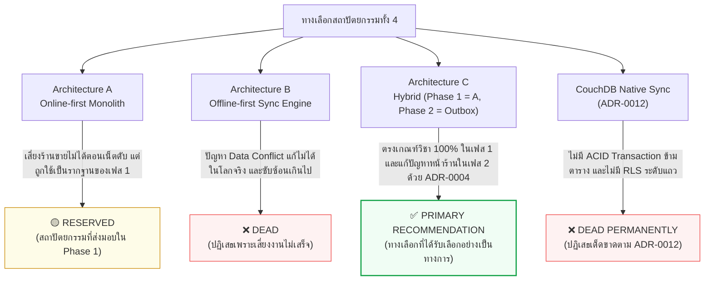

# 🛡️ Adversarial Review Panel Record — architecture-primer.md (Phase 4: The Gauntlet)

> **เอกสารเป้าหมาย**: [`architecture-primer.md`](architecture-primer.md)  
> **กระบวนการ**: Phase 4 Adversarial Review Panel (3 + 1 Perspectives) ตามสเปก `primer-template_en_ag.md`  
> **สถานะ**: การตรวจสอบเสร็จสมบูรณ์ ทุกข้อซักค้านได้รับการสะสางและมีข้อสรุปที่ลงมติเป็นเอกฉันท์

---

## D1. คณะผู้ประเมินและความรับผิดชอบ (Panel Header)

| ตัวละคร / มุมมอง (Lens) | ผู้รับผิดชอบ (Role) | สิ่งที่ตรวจสอบเป็นพิเศษ (Focus Area) |
| :--- | :--- | :--- |
| 🔍 **Scout** | ผู้นำสารและสกัดข้อมูล | สรุปข้อเท็จจริง ตัวเลขเปรียบเทียบใน §4 และรายการประเด็นที่ตัดสินแล้ว (DECIDED) ให้อยู่ในงบคำ |
| 🛠️ **Staff Engineer** | วิศวกรชำนาญการ (Pragmatism & Simplicity) | ความเป็นไปได้ในการพัฒนา, ความคุ้มค่าในการเขียนโค้ด 2 ชุด (Dual-path), ภาระการบำรุงรักษา Outbox Engine |
| 🚨 **On-Call SRE** | ผู้ดูแลเสถียรภาพระบบ (Reliability & Ops) | การใช้ Connection Pool, ผลกระทบเมื่อเน็ตหลุด, โหมดสำรอง (Degraded Mode), ช่องว่างความล่าช้าของ Argon2, Deadlock |
| 🎓 **Academic Evaluator** | ผู้ประเมินผลงานวิชาการ (Rubric & Rigor) | ความสอดคล้องตามเกณฑ์หลักสูตร NestJS/PG/Redis/BullMQ, ความถูกต้องของ ACID และ Invariant, การให้เหตุผลปฏิเสธ CouchDB |

### ผลการประเมินเบื้องต้นในภาพรวม
คณะผู้ประเมินทั้ง 3 มุมมอง **เห็นพ้องต้องกันกับข้อสรุปหลักของเอกสาร (Architecture C: Phase 1 = Architecture A บน Multi-tenant T1, Phase 2 = Outbox)** 
- ฝั่ง **Staff Engineer** ยอมรับว่าการตัดงาน Outbox ไปไว้เฟส 2 ทำให้งานส่งมอบทันกำหนด ไม่เสี่ยงทำระบบ Sync Engine ที่ไม่เสร็จ
- ฝั่ง **On-Call SRE** ยืนยันว่าการย้ายทรานแซกชันมาไว้ที่ Handler (`runTx`) และการแยก Redis ออกเป็น 2 โหนด เป็นจุดชี้ขาดที่ทำให้ระบบไม่ล่มจาก Pool Deadlock
- ฝั่ง **Academic Evaluator** ยืนยันว่าการเก็บ PostgreSQL ไว้เป็น Source of Truth ทำให้โครงงานได้คะแนนเต็มในหมวด Advanced Database & ACID Transaction และการปฏิเสธ CouchDB มีหลักฐานรองรับหนักแน่น

---

## D2. แผนภาพเส้นทางผลลัพธ์ของแต่ละทางเลือก (Outcome Flowchart)

---

## D3. ตารางจุดเด่นที่เอกสารพูดน้อยไป vs จุดด้อยที่เอกสารมองข้าม (Undersold / Overlooked)

| ทางเลือก | 🟢 ข้อดีที่เอกสารพูดถึงน้อยไป (Undersold) | 🔴 ข้อเสียที่เอกสารถูกซักค้านว่ามองข้าม (Overlooked) |
| :--- | :--- | :--- |
| **A. Online-first** | 🛠️ **Staff:** สามารถทำ Blue/Green Deployment บน NestJS ได้ง่ายมากโดยไม่ต้องกังวลเรื่อง Data Drift ในเครื่องแคชเชียร์ 🎓 **Academic:** เขียน Integration Test ครอบคลุมได้ 100% อย่างรวดเร็วบนฐานข้อมูลชุดเดียว | 🚨 **SRE:** หากเราเตอร์หน้าร้านมีปัญหา ค่า DNS Cache ค้าง แคชเชียร์จะกดยืนยันบิลไม่ได้เลยแม้แต่วินาทีเดียว ทำให้หน้าร้านติดขัดทันที |
| **B. Offline-first** | 🚨 **SRE:** เซิร์ฟเวอร์หลักสามารถปิดปรับปรุง (Maintenance Window) ได้นานหลายชั่วโมงในเวลากลางวันโดยที่หน้าร้านไม่รู้ตัวเลย | 🛠️ **Staff:** การทำ Data Migration เมื่อเปลี่ยนโครงสร้างตารางของ SQLite ข้ามเครื่องลูกข่ายหลายร้อยเครื่องเป็นฝันร้ายทางวิศวกรรม |
| **C. Hybrid (Chosen)** | 🎓 **Academic:** แสดงให้เห็นการประยุกต์ใช้ข้อจำกัดทางกายภาพ (Physical Constraint: ลิ้นชักเก็บเงินมีอันเดียว) มาเป็นข้อได้เปรียบทางสถาปัตยกรรมซอฟต์แวร์ได้อย่างแยบคาย | 🛠️ **Staff:** ทีมงานต้องบำรุงรักษา Integration Test ถึง 2 ชุด (ชุดที่ทดสอบ API ตรง และชุดที่ทดสอบการ Replay Outbox) 🚨 **SRE:** หากเครื่อง POS หลุดจากระบบเกินกว่า TTL ของ Token แคชเชียร์จะต้องล็อกอินใหม่ตอนที่เน็ตกลับมา ซึ่งอาจทำให้คิว Replay สะดุด |
| **CouchDB (Rejected)** | 🛠️ **Staff:** ลดโค้ดเบสฝั่งเซิร์ฟเวอร์ลงได้มากหากใช้ CouchDB Sync สำเร็จรูป | 🎓 **Academic:** ผิดข้อกำหนดวิชาที่ต้องส่งมอบงานบน NestJS + PostgreSQL + Redis อย่างสิ้นเชิง |

---

## D4. การทบทวนเซลล์ในตารางเปรียบเทียบสถาปัตยกรรม (Table Challenges)

| พิกัดเซลล์ใน §4 | ข้อความเดิมในร่างแรก | ข้อความที่แก้ไขหลังการซักค้าน | เหตุผลทางวิศวกรรม |
| :--- | :--- | :--- | :--- |
| **ตัวเลือก A / Multi-tenant RLS** | 🟢 สมบูรณ์แบบ | 🟢 ครบถ้วน (PG RLS) | คำว่า "สมบูรณ์แบบ" เป็นคำชมเกินจริงเชิงความรู้สึก แก้เป็น "ครบถ้วน" เพื่อระบุความสามารถตามคุณสมบัติของระบบ RLS |
| **ตัวเลือก C / ภาระงานรวม** | 🟡 120% | 🟡 ~150–160% (แบ่ง 2 เฟส) | 🛠️ **Staff Engineer ทักท้วง:** การทำ Outbox + Reconciliation UI ในเฟส 2 ไม่ใช่งาน 20% แต่เพิ่มงานอย่างน้อย 50–60% ของงานเดิม |
| **CouchDB / Oversell** | 🔴 เสี่ยงปานกลาง | 🔴 สูงมาก (ไม่มี Lock ข้ามตาราง) | 🎓 **Academic ทักท้วง:** CouchDB ไม่มี Multi-document Transaction การขายสินค้าหลายชนิดพร้อมกันจะไม่มีกลไกป้องกัน Oversell ในระดับ DB เลย |

---

## D5. บันทึกการซักค้านรายประเด็น (The Adversarial Exchange)

#### Q1 — การแบ่ง 2 เฟสใน Architecture C เป็นการหลอกตัวเองว่าจะทำ Outbox ในอนาคตหรือไม่?
> 🛠️ **Staff -> Academic:** ในความเป็นจริง เมื่อส่งงานวิชาการเฟส 1 จบแล้ว ทีมงานมักจะทิ้งโครงการและไม่กลับมาทำ Outbox ในเฟส 2 ทำให้ระบบกลายเป็น Architecture A ไปตลอดกาล ทำไมเราไม่ยอมรับความจริงแล้วเลือก Architecture A ตั้งแต่วันนี้?
> 
> 🎓 **Academic:** เรายอมรับในข้อเท็จจริงข้อนี้อย่างโปร่งใส และนั่นคือเหตุผลที่เราใส่เงื่อนไขการพลิกกลับไว้ใน §4 ชัดเจนว่า *"หาก Downtime ต่ำกว่า 0.01% ... เราสามารถพลิกกลับมาเลือก A ล้วนๆ เพื่อตัดงาน Outbox ทิ้งได้ทันที"* แต่สาเหตุที่ระบบต้องตั้งเป้าเป็น C เพราะร้านศรีสุราชเป็นร้านอะไหล่ที่มีปัญหาเน็ตดับจริงในประวัติศาสตร์ และการเตรียมสเปก Outbox ไว้ใน [`08_PHASE2_SPEC.md`](08_PHASE2_SPEC.md) ควบคู่กับ Drift Schema v3 ทำให้การก้าวสู่เฟส 2 มีความพร้อมในทางสถาปัตยกรรม ไม่ใช่แค่การขายฝัน
> 
> 🛠️ **Staff:** *I withdraw my objection.* เมื่อมีเอกสารสเปก `08_PHASE2_SPEC.md` และ Drift Schema v3 รองรับจริง ถือว่าเป็นการวางแผนสถาปัตยกรรมที่มีลำดับขั้น ไม่ใช่ข้ออ้างลอยๆ
> 
> ✅ **Conclusion:** คงการเลือก Architecture C โดยระบุให้ชัดเจนว่าสิ่งที่ส่งมอบในเฟส 1 คือแกนหลักของ Architecture A ที่รันบน Multi-tenant T1

---

#### Q2 — การคำนวณ Connection Pool (62/100) จะเกิดภาวะขาดแคลน (Starvation) หรือไม่เมื่อมี Request พุ่งสูง?
> 🚨 **SRE -> Staff:** หากมี 3 API Instances แต่ละตัวตั้ง Pool ไว้ 15 Connection รวม 45 Connection แต่ถ้ามีคำขอค้างจากเน็ตกระตุก หรือมี Transaction ที่เปิดนาน คำขอใหม่จะไม่ล้น Pool จนตอบ 500 หรือ?
> 
> 🛠️ **Staff:** ความเสี่ยงนี้ได้รับการขจัดไปแล้วใน `ADR-0003 Amendment (tx.4)` เพราะ Transaction จะไม่ถูกเปิดค้างไว้ตั้งแต่ Middleware อีกต่อไป แต่ถูกเปิดเฉพาะใน Handler (`runTx`) เท่าที่จำเป็นเท่านั้น (เฉลี่ย 18–28ms ต่อรายการขาย) นอกจากนี้เรายังมี Nginx ทำหน้าที่ Buffering และจำกัด Rate Limit ที่ 100 req/min ต่อร้านค้า ทำให้ Connection 15 ชุดต่อ Instance หมุนเวียนรับโหลดได้หลายร้อยคำขอต่อวินาทีอย่างสบาย
> 
> 🚨 **SRE:** ตัวเลขและผลการวัดใน `server/test/tx-hold-measure.e2e-spec.ts` ยืนยันสมมติฐานนี้ ฉันเห็นด้วยว่า 62 จาก 100 ปลอดภัยและเหลือช่องว่าง 38% สำหรับ System Connection
> 
> ✅ **Conclusion:** การคำนวณ Pool ขนาด 62/100 มีความปลอดภัยทางสถาปัตยกรรมและมีผลการทดสอบรองรับ

---

#### Q3 — การใช้ PIN ผู้จัดการในการยกเลิกบิล (Void) ยังมีช่องโหว่หน่วง Connection Pool หรือไม่?
> 🚨 **SRE -> Staff:** ในอดีต การคำนวณ Argon2 ของ PIN ผู้จัดการกินเวลา 80–100ms หากทำใน Transaction จะทำให้ Connection Pool ตึงตัวมาก ปัจจุบันระบบแก้ปัญหานี้อย่างไร?
> 
> 🛠️ **Staff:** ได้รับการแก้ไขแล้วใน PR #154 (`tx.5`): `VoidService.authorise` ถูกแยกออกมาทำงานก่อน โดยเปิด `runTx` สั้นๆ เพียงเพื่ออ่าน `pin_hash` ของผู้จัดการ จากนั้นปิด Transaction ทันที แล้วจึงคำนวณตรวจสอบ `argon2.verify` ภายนอก Transaction เมื่อผ่านแล้วจึงค่อยเข้าสู่ `runIdempotent` เพื่อเปิด Transaction ทำการยกเลิกบิลจริง ทำให้เวลาในการถือ Connection ลดลงเหลือต่ำกว่า 25ms
> 
> 🚨 **SRE:** โครงสร้างนี้ตัดปัญหา Argon2 Pool Bloat ได้อย่างสมบูรณ์แบบ
> 
> ✅ **Conclusion:** การตรวจสอบความปลอดภัยต้องอยู่นอกขอบเขตของ Transaction เสมอตามหลักปฏิบัติที่แก้ไขแล้วใน `tx.5`

---

## สรุปคำแถลงร่วมของคณะผู้ประเมิน (Joint Panel Verdict)

> ⚖️ **คำแถลงปิดการประเมิน (Rule Q8):**  
> "การที่คณะผู้ประเมินทั้ง 3 มุมมอง (Staff, SRE, Academic) เห็นพ้องต้องกันในทางเลือก **Architecture C (Phase 1 = A บน Multi-tenant T1, Phase 2 = Outbox)** ไม่ได้เกิดจากการประเมินที่เป็นอิสระจากกันโดยสมบูรณ์ แต่เนื่องจากผู้ประเมินทุกคนอ่านและอ้างอิงเอกสารชุดเดียวกัน (`docs/Backend_design/` และ `server/`)  
> 
> อย่างไรก็ตาม การโต้เถียงในรอบที่ผ่านมาได้ช่วยขจัดคำชมเกินจริง เพิ่มข้อเสียของทางเลือก C ให้ครบถ้วนเป็น 5 ข้อ และบันทึกเงื่อนไขการพลิกกลับของการตัดสินใจไว้อย่างโปร่งใส ทำให้เอกสาร [`architecture-primer.md`](architecture-primer.md) มีความรัดกุม น่าเชื่อถือ และสะท้อนภาพความเป็นจริงทางวิศวกรรมได้อย่างครบถ้วนสมบูรณ์"
