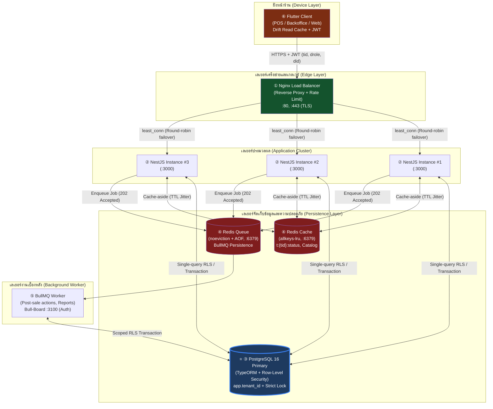
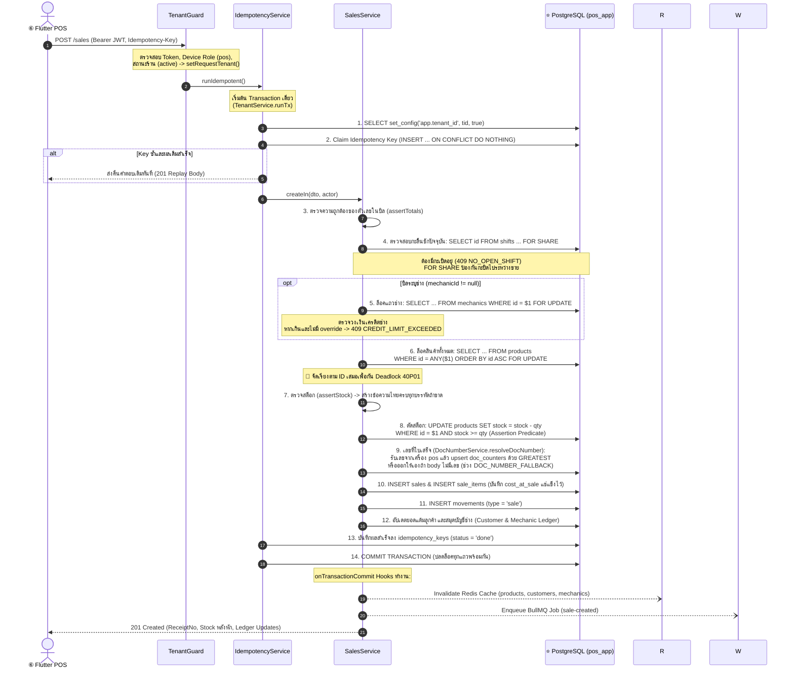
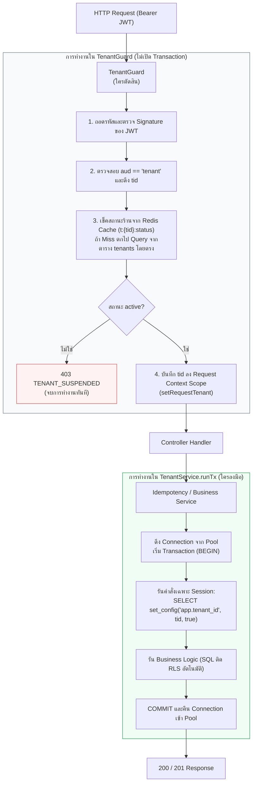
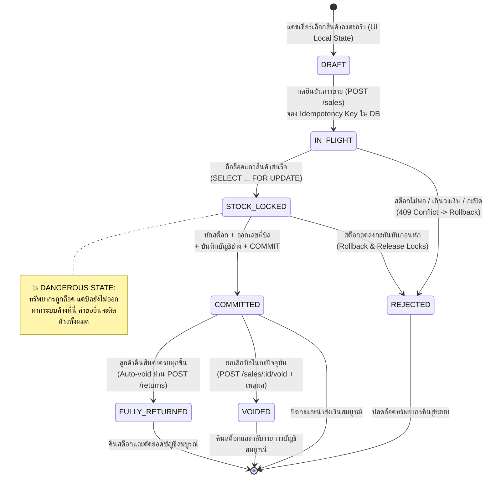

# 🎓 Architecture Primer — สถาปัตยกรรม Backend ระบบขายหน้าร้านหลายร้าน (Multi-Tenant POS)

> <สัญญาของเอกสาร>
> - **เอกสารนี้ตอบ "ทำไม" ก่อน "อะไรอยู่ตรงไหน"**
> - **ไม่ใช่สเปก** — เมื่อข้อความขัดแย้งกับสเปกหลักหรือ ADR ให้ยึดเอกสารต้นฉบับ ([`docs/Backend_design/`](00_INDEX.md) และ ADR-0001 ถึง ADR-0013) เป็นสำคัญ
> - **อ่านจบแล้วต้องทำได้**: อธิบายสถาปัตยกรรม Multi-Tenant POS ของ Srisurart Autopart, เข้าใจแก่นของ Concurrency & Invariants (Sale, Void, Return, Shifts), ลำดับการถือ Lock (Lock Hierarchy) เพื่อป้องกัน Deadlock, กลไกแยกร้านระดับแถว (RLS + Handler-level `runTx`), และวิเคราะห์ความคุ้มค่าของแต่ละเลเยอร์ในระบบ
> - **เนื้อหาอ้างอิง**: โค้ดเบสจริงในโฟลเดอร์ `server/src/`, `server/docker-compose.yml`, [`01_DATABASE.md`](01_DATABASE.md), [`02_API_SCREENS.md`](02_API_SCREENS.md), [`03_ARCHITECTURE.md`](03_ARCHITECTURE.md), และ ADR-0001 ถึง ADR-0013 ณ วันที่ 2026-09-21
> - **ทบทวนกับโค้ดและ ADR อีกรอบ 2026-09-23** — จุดที่แก้มีหมายเหตุ `🔄 แก้ 2026-09-23` กำกับ เรื่องหลักคือ: DB จริงมี 29 ตาราง (RLS 26), void ออนไลน์ใช้แค่เหตุผลไม่ใช้ PIN แล้ว (08 E3), และเฟส 2 ให้เครื่อง `pos` ออกเลข RC/CN เอง (ADR-0007 addendum D4)
> </สัญญาของเอกสาร>

---

## 🗺️ §0 แผนที่การอ่าน (Reading Map)

| § | หัวข้อ | จำเป็นตอนนี้ไหม |
| :---: | :--- | :---: |
| [§0](#️-0-แผนที่การอ่าน-reading-map) | แผนที่การอ่าน, ขอบเขตความรู้ (FLOOR/FROM_ZERO), และบันไดความรู้ | ⭐ **ต้องอ่านก่อน** |
| [§1](#1--โจทย์นี้ยากตรงไหน--แก่นเดียวของทั้งระบบ) | โจทย์นี้ยากตรงไหน — แก่นเดียวของทั้งระบบ | ⭐ **ต้องอ่านก่อน** |
| [§2](#2--ตัวละครทั้ง-6-ในระบบ-the-cast) | ตัวละครทั้ง 6 ในระบบ และศัพท์ประจำตัวละคร | ⭐ **ต้องอ่านก่อน** |
| [§3](#3-️-เส้นทางหลัก-main-paths) | เส้นทางหลัก: การขาย (§3.1), การคืนและยกเลิกบิล (§3.2), กะและลิ้นชัก (§3.3) | ⭐ **ต้องอ่านก่อน** |
| [§4](#4--ทางเลือกและข้อแลกเปลี่ยน-options--trade-offs) | ทางเลือกสถาปัตยกรรม (A vs B vs C) และเหตุผลที่ปฏิเสธ CouchDB | อ่านเพื่อเข้าใจการตัดสินใจ |
| [§5](#5--เจาะลึกระบบแยกข้อมูลร้าน-tenancy-isolation--handler-level-runtx) | เจาะลึก Tenancy Isolation & Handler-level `runTx` (ADR-0003 Amendment) | อ่านเมื่อแก้โค้ดฐานข้อมูล |
| [§6](#6--ทำไมต้องแบ่งเป็นหลายชั้น-why-the-layers) | ทำไมต้องแบ่งเป็นหลายชั้น (ถอดชั้นไหนออกแล้วพังอย่างไร) | อ่านเมื่อตั้งค่าระบบและ Deploy |
| [§7](#7--วงจรชีวิตของใบสั่งขาย-lifecycle-of-sale-artifact) | วงจรชีวิตของใบสั่งขาย (State Machine & Dangerous State) | ⭐ **ต้องอ่านก่อน** |
| [§8](#8--ตารางรวมความล้มเหลว-ถ้าทำผิดจะเกิดอะไรขึ้น) | ตารางรวมความล้มเหลว: ถ้าทำผิดจะเกิดอะไรขึ้น (เรียงจาก ❌ ไป ✅) | เปิดดูเมื่อเขียนโค้ด / Debug |
| [§9](#9--สิ่งที่เอกสารนี้ตัดออกไป-what-this-document-leaves-out) | สิ่งที่เอกสารนี้ตัดออกไป (+เหตุผลและแหล่งอ่านต่อ) | อ่านเสริม |
| [§10](#10--ประมวลศัพท์-glossary) | ประมวลศัพท์รวมจัดหมวดหมู่ตามบริบทที่ปรากฏ | เปิดดูเมื่อลืมความหมาย |
| [§11](#11--คำถามทดสอบตัวเอง-self-test) | คำถามทดสอบตัวเอง 10 ข้อ (พร้อมเฉลยดักทางผิด) | ⭐ **ทำหลังอ่านจบ** |
| [§12](#12--อ่านอะไรต่อ-what-to-read-next) | แผนการอ่านเอกสารชิ้นถัดไป | — |

---

### ขอบเขตความรู้เดิมและสิ่งที่จะสอน (Pedagogical Baseline)

- **พื้นฐานที่สมมติว่าคุณมีอยู่แล้ว (FLOOR — เอกสารนี้จะไม่สอนซ้ำ)**:
  1. การเขียน REST API ด้วย TypeScript / Node.js
  2. HTTP Methods (`GET`, `POST`) และ HTTP Status Codes พื้นฐาน (`200 OK`, `201 Created`, `400 Bad Request`, `401 Unauthorized`, `403 Forbidden`, `404 Not Found`, `409 Conflict`, `500 Internal Server Error`)
  3. คำสั่ง SQL พื้นฐาน (`SELECT`, `INSERT`, `UPDATE`, `DELETE`, `WHERE`, `PRIMARY KEY`, `FOREIGN KEY`, `BEGIN`, `COMMIT`, `ROLLBACK`)
  4. ไวยากรณ์ภาษา TypeScript (`async/await`, `Promise`, `try/catch`, `Map`, `Set`, `JSON.parse`)
  5. พื้นฐาน Node.js Event Loop (Single-threaded execution, Non-blocking I/O)

- **สิ่งที่จะสอนให้ตั้งแต่ศูนย์ (FROM_ZERO — 16 ศัพท์สำคัญ)**:
  1. *Race Condition & Oversell*, 2. *Multi-Tenancy*, 3. *Row-Level Security (RLS)*, 4. *Deadlock (`40P01`)*, 5. *Idempotency & Idempotency-Key*, 6. *Reverse Proxy & Load Balancer*, 7. *Least-Connection Algorithm*, 8. *Modular Monolith*, 9. *Connection Pool Starvation*, 10. *Pessimistic Locking (`FOR UPDATE` / `FOR SHARE`)*, 11. *Lock Ordering / Lock Hierarchy*, 12. *Cache Eviction Policy (`allkeys-lru` vs `noeviction`)*, 13. *Message Queue & Worker*, 14. *Device Binding & Device Role (`role='pos'` vs `'backoffice'`)*, 15. *Ledger & Movement Invariant*, 16. *Handler-level `runTx` & Transaction Scope*

---

### 🪜 ตารางบันไดความรู้ (Knowledge Ladder — กติกา ป1)

ตารางนี้แสดงลำดับการพึ่งพาของศัพท์ทุกคำ เพื่อรับประกันว่า **"ศัพท์ทุกคำจะถูกสอนก่อนถูกนำไปใช้เสมอ"**:

| ลำดับ | คำศัพท์ (Term) | ต้องรู้อะไรก่อน (Prerequisites) | สอนที่ (Section) | ใช้ครั้งแรกที่ (First Used) |
| :---: | :--- | :--- | :---: | :---: |
| 1 | **Race Condition & Oversell** | Node.js Event Loop (FLOOR), Concurrent Traffic (FLOOR) | §1.1, §1.2 | §1.1 ✅ |
| 2 | **Multi-Tenancy** | SQL WHERE clause (FLOOR), Database Isolation | §1.2 | §1.2 ✅ |
| 3 | **Row-Level Security (RLS)** | Multi-Tenancy, PostgreSQL Security Rules | §1.2 | §1.2 ✅ |
| 4 | **Deadlock (`40P01`)** | SQL Transactions (FLOOR), Concurrent Locking | §1.2 | §1.2 ✅ |
| 5 | **Idempotency & Idempotency-Key** | HTTP POST (FLOOR), Network Retries | §1.4 | §1.4 ✅ |
| 6 | **Reverse Proxy & Load Balancer** | HTTP Traffic Routing (FLOOR) | §2.1 | §2.1 ✅ |
| 7 | **Least-Connection Algorithm** | Load Balancer, HTTP Requests | §2.1 | §2.1 ✅ |
| 8 | **Modular Monolith** | REST API Architecture (FLOOR) | §2.2 | §2.2 ✅ |
| 9 | **Connection Pool Starvation** | Database Connections, SQL Transactions (FLOOR) | §2.2 | §2.2 ✅ |
| 10 | **Pessimistic Locking (`FOR UPDATE`/`SHARE`)** | SQL SELECT (FLOOR), Race Condition | §1.2 | §1.2 ✅ |
| 11 | **Lock Ordering / Lock Hierarchy** | Pessimistic Locking, Deadlock | §2.3 | §2.3 ✅ |
| 12 | **Cache Eviction (`allkeys-lru`/`noeviction`)** | Memory Caching, Key-Value Storage | §2.4 | §2.4 ✅ |
| 13 | **Message Queue & Worker** | Asynchronous Processing, Background Jobs | §2.5 | §2.5 ✅ |
| 14 | **Device Binding & Device Role** | JWT Token (FLOOR), POS vs Backoffice Authorization | §2.6 | §2.6 ✅ |
| 15 | **Ledger & Movement Invariant** | SQL INSERT/UPDATE (FLOOR), Financial Audit | §3.1 | §3.1 ✅ |
| 16 | **Handler-level `runTx` & Transaction Scope** | SQL Transaction (FLOOR), RLS, Connection Pool | §1.2 | §1.2 ✅ |

---

## 1. 💥 โจทย์นี้ยากตรงไหน — แก่นเดียวของทั้งระบบ

### 1.1 วิธีเขียนแบบธรรมดาที่ใครๆ ก็คิดถึง (The Naive Obvious Approach)

เมื่อต้องสร้าง API ขายของหน้าร้าน (`POST /sales`) โค้ดแรกที่โปรแกรมเมอร์ส่วนใหญ่เขียนมักหน้าตาประมาณนี้:

```typescript
// ❌ ตัวอย่างโค้ดแบบ Naive: ดูเหมือนทำงานได้ แต่พังทันทีเมื่อเจอทราฟฟิกจริง
@Post('/sales')
async createSale(@Body() body: any) {
  // 1. อ่านข้อมูลสินค้าจากฐานข้อมูลขึ้นมาตรวจในหน่วยความจำของ Node.js
  for (const item of body.items) {
    const product = await this.productRepo.findOneBy({ id: item.productId });
    if (!product || product.stock < item.qty) {
      throw new BadRequestException(`สินค้า ${item.productId} สต็อกไม่พอ`);
    }
  }

  // 2. เชื่อตัวเลขที่ Client ส่งมาทั้งหมด
  const total = body.total;
  const points = Math.floor(total / 10);

  // 3. ตัดสต็อกทีละแถว
  for (const item of body.items) {
    await this.productRepo.update(item.productId, {
      stock: product.stock - item.qty, // คำนวณจากค่าเดิมที่อ่านไว้
    });
  }

  // 4. บันทึกใบเสร็จ
  const sale = await this.salesRepo.save({
    receiptNo: body.receiptNo,
    total: total,
    pointsGranted: points,
    customerId: body.customerId,
    items: body.items,
  });

  return sale;
}
```

> 📖 **Race Condition & Oversell (การแย่งชิงทรัพยากรและการขายสินค้าเกินสต็อก)**
> - **T1 (ปัญหาเดิม):** เมื่อคำขอหลายรายการเข้ามาพร้อมกันแบบ Asynchronous หากอ่านค่าสต็อกมาตรวจสอบก่อนแล้วค่อยสั่งบันทึกทีหลัง ช่วงเวลาระหว่าง "อ่าน" กับ "เขียน" จะเปิดช่องว่างให้คำขออื่นเข้ามาอ่านค่าเดียวกัน
> - **T2 (นิยาม):** สภาวะที่ความถูกต้องของผลลัพธ์ขึ้นอยู่กับจังหวะเวลาและความเร็วของกระบวนการที่ทำงานคู่ขนานกัน ส่งผลให้สต็อกติดลบหรือขายของที่ไม่มีอยู่จริงออกไป (Oversell)
> - **T3 (อุปมา):** เหมือนคนสองคนเปิดดูสมุดเช็คพร้อมกัน เห็นว่ามีเงินเหลือ 1,000 บาท ทั้งสองคนจึงออกไปกดเงินคนละ 800 บาทพร้อมกัน ธนาคารจ่ายเงินออกไป 1,600 บาทจนบัญชีติดลบ
> - **T4 (ในระบบจริง):** เกิดขึ้นที่ `POST /sales` บนตาราง `products.stock` หากไม่มีการล็อคแถวเพื่อป้องกันการเข้าถึงพร้อมกัน ([`server/src/sales/sales.service.ts`](../../server/src/sales/sales.service.ts))
> - **T5 (กับดัก):** คิดว่า JavaScript รันแบบ Single-threaded แล้วจะไม่มี Race Condition — จริงๆ แล้ว Event Loop สลับไปรันคำขออื่นระหว่างรอ I/O ของฐานข้อมูล (`await`) ได้เสมอ!

---

### 1.2 จุดที่โค้ดข้างต้นพังทลาย (Where it Breaks with Concrete Numbers)

โค้ดข้างต้นสร้างความเสียหาย 3 ชั้นในระบบร้านอะไหล่จริง:

1. **สต็อกติดลบ (Stock Underflow / Oversell):**
   สมมติซีลยางเบอร์ 10 มีสต็อกเหลือในฐานข้อมูล **10 ชิ้น**
   แคชเชียร์ 2 เครื่อง (หรือ 2 แท็บของเบราว์เซอร์) กดขายพร้อมกันในเสี้ยววินาทีเดียวกัน:
   - Request A ขอซื้อ **8 ชิ้น** → อ่าน DB ได้ `stock = 10` (พอขาย)
   - Request B ขอซื้อ **8 ชิ้น** → อ่าน DB ได้ `stock = 10` (พอขายเหมือนกัน เพราะ A ยังไม่ทันบันทึก)
   - Request A สั่งบันทึก: `stock = 10 - 8 = 2`
   - Request B สั่งบันทึก: `stock = 10 - 8 = 2` (เขียนทับค่าของ A กลายเป็น Lost Update) หรือถ้าเป็น `stock - 8` สต็อกจะกลายเป็น `2 - 8 = -6`!
   - ผลลัพธ์: ร้านขายซีลยางไป **16 ชิ้น** จากของจริงที่มีแค่ **10 ชิ้น** พนักงานวิ่งไปหยิบของที่ชั้นวางแล้วพบว่าไม่มีของส่งให้ลูกค้า

> 📖 **Multi-Tenancy & Row-Level Security (RLS)**
> - **T1 (ปัญหาเดิม):** ระบบแบบ SaaS ที่ให้บริการหลายร้านบนฐานข้อมูลเดียวกัน หากพึ่งพาแค่โปรแกรมเมอร์ไม่ลืมเขียน `WHERE tenant_id = :tid` ในทุก SQL query หากมีใครลืมแม้แต่จุดเดียว ข้อมูลของร้านหนึ่งจะรั่วไหลไปยังอีกร้านทันที
> - **T2 (นิยาม):** Multi-Tenancy คือสถาปัตยกรรมที่หลายองค์กร/ร้านค้าใช้ทรัพยากรระบบร่วมกันอย่างเป็นอิสระ ส่วน Row-Level Security (RLS) คือกลไกความปลอดภัยระดับ Engine ของ PostgreSQL ที่กรองแถวข้อมูลตามตัวแปร Session ของฐานข้อมูลโดยอัตโนมัติ ไม่ว่า Query จะเขียนอย่างไร
> - **T3 (อุปมา):** เหมือนตู้ล็อกเกอร์ฝากของที่มีกุญแจส่วนตัว แม้ตู้จะตั้งอยู่ในห้องโถงรวมเดียวกัน แต่ลูกค้าแต่ละคนจะเปิดดูและแตะต้องได้เฉพาะช่องล็อกเกอร์ของตัวเองเท่านั้น
> - **T4 (ในระบบจริง):** นโยบาย RLS บน 26 ตารางใน PostgreSQL *(🔄 แก้ 2026-09-23: เดิมเขียน 25 — 25 ตารางจาก migration `…0001-RowLevelSecurity` + `owner_review_items`; ส่วน `tenants`, `platform_admins` เป็นตาราง global และ `import_jobs` ตั้งใจไม่ติด RLS เพราะอ่านจาก platform plane เท่านั้น)* ควบคุมด้วยคำสั่ง `SELECT set_config('app.tenant_id', $1, true)` ภายใน `TenantService.runTx` ([`server/src/common/database/tenant.service.ts`](../../server/src/common/database/tenant.service.ts))
> - **T5 (กับดัก):** เข้าใจผิดว่าสร้างตารางแยก schema หรือแยกฐานข้อมูลต่อร้านจะปลอดภัยกว่าเสมอ — การแยก schema ทำให้การรัน Database Migration ซับซ้อนมหาศาล (100 ร้าน = รัน migration 100 รอบ) และกิน Connection Pool จนระบบล่ม

> 📖 **Handler-level `runTx` & Transaction Scope**
> - **T1 (ปัญหาเดิม):** การเปิด Transaction ไว้ตั้งแต่ Middleware เพื่อเรียก `SET LOCAL` จะยึด Connection Pool แช่ทิ้งไว้ข้ามการทำงานภายนอก (เช่น Hash รหัสผ่าน) จน Pool เต็ม และเสี่ยงเกิด Pool Deadlock ข้ามคำขอ
> - **T2 (นิยาม):** รูปแบบการเปิดทรานแซกชันในระดับ Handler ฟังก์ชันภายใน Service เพื่อจำกัดอายุการถือ Connection ฐานข้อมูลให้สั้นที่สุดเฉพาะตอนรัน SQL เท่านั้น
> - **T3 (อุปมา):** การเปิดก๊อกน้ำเฉพาะตอนที่ฟอกสบู่เสร็จและพร้อมจะล้างมือทันที ไม่ใช่เปิดน้ำไหลทิ้งไว้ตั้งแต่เริ่มก้าวเท้าเดินเข้าห้องน้ำ
> - **T4 (ในระบบจริง):** เมธอด `TenantService.runTx(fn)` ใน [`server/src/common/database/tenant.service.ts`](../../server/src/common/database/tenant.service.ts) ที่รันคำสั่ง `set_config('app.tenant_id', ...)` ภายในบล็อกเดียวกัน
> - **T5 (กับดัก):** เผลอเพิ่มพารามิเตอร์ `tenantId` ให้ฟังก์ชัน `runTx(tid, fn)` ซึ่งจะเปิดช่องให้โค้ดแอบส่ง UUID ของร้านอื่นเข้ามาและทำลายความปลอดภัยของ RLS โดยสมบูรณ์!

2. **ข้อมูลลูกค้ารั่วไหลข้ามร้าน (Cross-Tenant Data Leakage):**
   ในระบบ Multi-Tenant ร้านอะไหล่ A และร้านอะไหล่ B เป็นคู่แข่งทางธุรกิจกัน หากโค้ดด้านบนรับ `customerId` หรือ `items` มาโดยไม่มีการตรวจสอบสิทธิ์ความปลอดภัยระดับแถว (Row-Level Security) หรือ Connection ที่ดึงมาจาก Pool มีค่า Context ของร้านก่อนหน้าค้างอยู่ ร้าน B อาจสามารถตัดสต็อกหรือเห็นยอดสะสมของลูกค้าประจำร้าน A ได้ทันที

> 📖 **Deadlock (`40P01`) (การติดตายของกระบวนการล็อค)**
> - **T1 (ปัญหาเดิม):** เมื่อคำขอหลายรายการพยายามล็อคทรัพยากรหลายชิ้นพร้อมกัน แต่สลับลำดับกัน คำขอทั้งสองจะถือล็อคคนละชิ้นแล้วรอให้อีกฝ่ายปล่อยล็อค กลายเป็นสภาวะหยุดนิ่งถาวรจนฐานข้อมูลต้องตัดจบด้วย Error `40P01`
> - **T2 (นิยาม):** สภาวะที่ Transaction สองตัวขึ้นไปต่างฝ่ายต่างถือ Lock ที่อีกฝ่ายต้องการ และไม่สามารถดำเนินการต่อได้
> - **T3 (อุปมา):** รถสองคันขับมาถึงสะพานเลนเดียวแคบๆ จากคนละฝั่ง แต่ละคันจอดขวางหัวสะพานฝั่งตัวเองไว้และไม่มีใครยอมถอยหลัง
> - **T4 (ในระบบจริง):** เกิดขึ้นเมื่อบิลหนึ่งล็อคสินค้า 1 แล้วจะล็อคสินค้า 2 ขณะที่อีกลำดับหนึ่งล็อคสินค้า 2 แล้วจะล็อคสินค้า 1 ป้องกันด้วยการเรียงลำดับ ID เสมอ (`ORDER BY id ASC FOR UPDATE`) ใน [`server/src/sales/sales.service.ts`](../../server/src/sales/sales.service.ts)
> - **T5 (กับดัก):** คิดว่าใช้ Transaction ครอบแล้วทุกอย่างจะปลอดภัย — การเปิด Transaction โดยไม่มีการจัดลำดับการถือ Lock (Lock Ordering) ที่เคร่งครัดคือบ่อเกิดหลักของ Deadlock!

3. **ระบบติดตาย (Deadlock Explosion):**
   ถ้าแก้ปัญหาข้อ 1 ด้วยการใส่ล็อคแถว (`SELECT ... FOR UPDATE`) แบบไม่ระวัง:

> 📖 **Pessimistic Locking (`FOR UPDATE` / `FOR SHARE`)**
> - **T1 (ปัญหาเดิม):** เมื่อแคชเชียร์ 2 คนขายสินค้าชิ้นสุดท้ายพร้อมกัน การอ่านข้อมูลขึ้นมาตรวจแบบธรรมดาไม่สามารถยับยั้งอีกคนได้
> - **T2 (นิยาม):** การสั่งให้ฐานข้อมูลจองล็อคแถวข้อมูลทันทีที่อ่าน ห้ามทรานแซกชันอื่นเข้ามาแก้ไขจนกว่าจะ Commit (`FOR UPDATE`) หรือยอมให้อ่านร่วมกันแต่ห้ามแก้ไข (`FOR SHARE`)
> - **T3 (อุปมา):** การเดินเข้าห้องลองเสื้อแล้วลงกลอนประตู คนอื่นที่มาถึงต้องยืนรอหน้าห้องจนกว่าคนข้างในจะเปิดประตูออกมา
> - **T4 (ในระบบจริง):** คำสั่ง `SELECT ... FOR UPDATE` บนตารางสินค้าและช่างใน [`server/src/sales/sales.service.ts`](../../server/src/sales/sales.service.ts)
> - **T5 (กับดัก):** คิดว่า `FOR UPDATE` จะบล็อกการอ่านปกติ (`plain SELECT`) บน PostgreSQL — ในระบบ MVCC ของ Postgres คำสั่ง plain SELECT จะยังอ่าน snapshot เดิมได้โดยไม่ติดบล็อก!

   - บิล 1 ขายหัวเทียน (ID: 101) และผ้าเบรค (ID: 202) → ล็อค 101 สำเร็จ กำลังจะล็อค 202
   - บิล 2 ขายผ้าเบรค (ID: 202) และหัวเทียน (ID: 101) → ล็อค 202 สำเร็จ กำลังจะล็อค 101
   - ทั้งสองบิลรอซึ่งกันและกัน เกิดข้อผิดพลาดรหัส `40P01 (deadlock_detected)` ใน PostgreSQL ทันที ทรานแซกชันล่ม และคำสั่งซื้อถูกยกเลิกทั้งคู่

---

### 1.3 คำถามแก่นเดียวของทั้งระบบ (The Single Core Question)

> **"จะรับประกันความถูกต้องของสต็อก ยอดเงินบัญชีช่าง และการแยกข้อมูลข้ามร้าน (Multi-Tenant) ให้แม่นยำ 100% ได้อย่างไร เมื่อมีคำสั่งซื้อ คำขอยกเลิก และการคืนสินค้า ยิงเข้ามาพร้อมกันจากหลายเครื่อง บนการเชื่อมต่อเครือข่ายที่ไม่เสถียร?"**

เอกสารทั้งฉบับนี้มีขึ้นเพื่อตอบคำถามข้อนี้ข้อเดียว

---

### 1.4 เกณฑ์ความถูกต้องที่รันตรวจสอบได้จริง (Runnable Correctness Criterion)

> 📖 **Idempotency & Idempotency-Key (คุณสมบัติความไม่เปลี่ยนรูปจากการทำซ้ำ)**
> - **T1 (ปัญหาเดิม):** เมื่อเน็ตหน้าร้านกระตุก แคชเชียร์กดปุ่ม "ยืนยันการขาย" แล้วหน้าจอหมุนค้าง พนักงานจะกดปุ่มซ้ำ หากระบบไม่มีการตรวจสอบ คำสั่งซื้อจะถูกตัดเงินและตัดสต็อกซ้ำสองครั้ง
> - **T2 (นิยาม):** คุณสมบัติของการทำงานที่การส่งคำขอเดิมซ้ำหลายครั้ง จะให้ผลลัพธ์ต่อสถานะของระบบเท่ากับการส่งคำขอนั้นเพียงครั้งเดียว
> - **T3 (อุปมา):** ปุ่มเรียกลิฟต์ — ไม่ว่าคุณจะกดย้ำไป 10 ครั้ง ลิฟต์ก็ยังคงถูกเรียกมารับคุณแค่ตัวเดียวเหมือนเดิม ไม่ได้ส่งลิฟต์มา 10 ตัว
> - **T4 (ในระบบจริง):** Header `Idempotency-Key` ที่ควบคุมผ่าน `IdempotencyService.runIdempotent` ([`server/src/idempotency/idempotency.service.ts`](../../server/src/idempotency/idempotency.service.ts)) บันทึกลงตาราง `idempotency_keys`
> - **T5 (กับดัก):** คิดว่าแค่ดัก Key ซ้ำใน Redis ก็พอ — ถ้า Redis ล่ม หรือ Key ถูกลบก่อนงานใน DB จะเสร็จ หรือระบบตัดสต็อกใน DB สำเร็จแต่บันทึก Redis ล้มเหลว คำสั่งซื้อจะถูกคิดเงินซ้ำได้อยู่ดี! การจอง Key และการตัดสต็อกต้องทำใน Database Transaction เดียวกันเสมอ

ความถูกต้องของระบบนี้ไม่ใช่คำอธิบายเลื่อนลอย แต่พิสูจน์ได้ด้วยคำสั่งทดสอบจริง:

```bash
# คำสั่งรัน Concurrency & Invariant Test สำหรับการขาย
cd server
pnpm test:e2e test/sales.e2e-spec.ts
```

การทดสอบนี้สร้างสถานการณ์จำลอง: **ยิงคำขอ `POST /sales` พร้อมกัน 200 ครั้ง บนสินค้าชิ้นเดียวกันที่มีสต็อกในระบบเพียง 50 ชิ้น**:

- **(a) ค่าที่ถูกต้องแม่นยำ:**
  - ได้รับการตอบกลับ `201 Created` สำเร็จ **50 บิลพอดี**
  - ได้รับการตอบกลับ `409 Conflict` (รหัสข้อผิดพลาด `INSUFFICIENT_STOCK`) **150 บิลพอดี**
  - สต็อกสินค้าคงเหลือในตาราง `products` ต้องเท่ากับ **0 ชิ้นพอดี**
  - ไม่มีข้อผิดพลาดระดับ `5xx` หรือ Deadlock `40P01` เกิดขึ้นแม้แต่ครั้งเดียว (Error count = 0)
- **(b) ความหมายของการเบี่ยงเบนทั้งสองทิศทาง:**
  - **ถ้าได้ `201 Created` เกิน 50 บิล:** เกิด **Oversell (ขายเกินสต็อก)** ข้อมูลคงคลังติดลบ ระบบสูญเสียความน่าเชื่อถือ
  - **ถ้าได้ `201 Created` น้อยกว่า 50 บิล:** เกิด **Deadlock หรือ False Conflict** คำสั่งซื้อที่ควรขายได้กลับถูกระบบปฏิเสธทิ้ง ยอดขายของร้านสูญหายโดยไม่จำเป็น
- **(c) เป้าหมายของระบบ:** โครงสร้างทั้งหมดที่อธิบายหลังจากนี้ (Nginx, Idempotency, Lock Hierarchy, RLS, Handler-level `runTx`) สร้างขึ้นมาเพื่อให้การทดสอบนี้ผ่านเกณฑ์ 100% เสมอ

---

### 1.5 ดักข้อโต้แย้งแรกที่มักเกิดขึ้น (Pre-answering the First Objection)

> *"ทำไมเราไม่ให้ Flutter Client ตรวจสอบสต็อก คำนวณแต้มสะสม หักเงินมัดจำช่าง แล้วส่งยอดสุดท้ายมาให้ Backend บันทึกลงฐานข้อมูลตรงๆ เพื่อความรวดเร็วและลดภาระเซิร์ฟเวอร์?"*

**คำตอบ:** ในระบบหน้าร้านจริง **Client ไม่ใช่ผู้ถือความจริง (Client is NEVER the source of truth):**
1. **นาฬิกาและแคชของเครื่องหน้าร้านไม่ตรงกัน:** หากร้านมีเครื่อง POS 1 เครื่อง และเครื่องหลังร้าน (Backoffice) อีก 2 เครื่อง ข้อมูลสต็อกบนเครื่องหน้าร้านเป็นเพียงแคชที่อาจล้าสมัยไปแล้ว 10 วินาที
2. **การทุจริตและการปลอมแปลงข้อมูล:** หาก Server เชื่อยอดเงินหรือราคาสินค้าที่ส่งมาจาก Client อุปกรณ์ที่ถูกดัดแปลง (หรือคำขอที่ถูกยิงผ่าน Postman) สามารถส่งบิลราคา 0.01 บาท หรือส่งใบลดหนี้คืนเงิน 999,999 บาทเข้ามาได้
3. **Server ต้องเป็นผู้อนุมัติขั้นสุดท้าย:** ข้อมูลราคาทุนตอนขาย (`cost_at_sale`), ยอดหนี้ช่าง, และการตัดสต็อก ต้องคำนวณและยืนยันบน PostgreSQL ที่มี ACID Transaction ภายใต้การควบคุมของ Server เท่านั้น ([ADR-0008](adr/0008-cost-at-sale.md))
   > 🔄 **แก้ 2026-09-23 — เลขใบเสร็จ (`receipt_no`) เป็นข้อยกเว้น:** ตาม [ADR-0007 addendum D4](adr/0007-receipt-numbering.md) เครื่อง `pos` ออกเลข RC/CN **เอง** ทั้งออนไลน์และออฟไลน์ server แค่ตรวจ prefix/`device_no` แล้วยก high-water mark ของ `doc_counters` (`GREATEST`) · ระหว่างช่วงสลับ server ยังออกเลขให้เมื่อ body ไม่มีเลข จนกว่าจะปิด `DOC_NUMBER_FALLBACK` (C16 — `server/src/documents/doc-number.service.ts`) · เลข PO/QT/CP server ยังออกเองตลอด

---

## 2. 👥 ตัวละครทั้ง 6 ในระบบ (The Cast)

แผนภาพแสดงสถาปัตยกรรมระบบและตัวละครทั้ง 6 ตัว โดยกำกับหมายเลข ① ถึง ⑥ ตรงกับหัวข้อย่อย:



---

### ① Nginx Load Balancer (Reverse Proxy & Edge Gateway)

- **a. ปัญหาเดิมที่บีบให้ต้องมีตัวละครนี้:** หากให้ Client ยิงตรงเข้า Node.js ตัวเดียว เมื่อมีคำขอเข้ามารัวๆ Node.js Event Loop จะรับภาระการถอดรหัส TLS (HTTPS), การบีบอัด Gzip, และการรับมือ Slowloris Attack จนหมดแรง ไม่สามารถประมวลผล Business Logic ได้
- **b. นิยาม 1 ประโยค:** เซิร์ฟเวอร์ด่านหน้าทำหน้าที่รับทราฟฟิก HTTPS จากภายนอก ป้องกันการโจมตี และกระจายคำขอไปยัง NestJS หลายอินสแตนซ์อย่างสม่ำเสมอ
- **c. ในระบบจริงคือตัวไหน:** คอนเทนเนอร์ `nginx` (Image: `nginx:1.29-alpine`) ใน `server/docker-compose.yml` เปิดพอร์ต `80` และ `443` คอนฟิกอยู่ที่ [`server/docker/nginx/nginx.conf`](../../server/docker/nginx/nginx.conf)
- **d. ศัพท์ที่มากับตัวละครนี้:**

> 📖 **Reverse Proxy & Load Balancer (Least-Connection Algorithm)**
> - **T1 (ปัญหาเดิม):** หากเซิร์ฟเวอร์หลังบ้านมีหลายตัว แต่ไม่มีตัวกลางแจกจ่ายงาน เซิร์ฟเวอร์ตัวแรกอาจทำงานหนักจนล่ม ขณะที่ตัวอื่นว่างงาน
> - **T2 (นิยาม):** ตัวกลางที่รับคำขอจากผู้ใช้แล้วส่งต่อให้เซิร์ฟเวอร์ภายใน โดยใช้อัลกอริทึมเลือกส่งไปยังเครื่องที่มีการเชื่อมต่อค้างอยู่น้อยที่สุด ณ ขณะนั้น (`least_conn`)
> - **T3 (อุปมา):** ผู้จัดการคิวหน้าร้านอาหารที่คอยมองดูว่าบริกรคนไหนกำลังว่าง แล้วพาแขกโต๊ะใหม่ไปให้บริกรคนนั้นดูแล
> - **T4 (ในระบบจริง):** Directive `upstream api { least_conn; server 172.30.0.11:3000; server 172.30.0.12:3000; server 172.30.0.13:3000; }` ใน [`server/docker/nginx/nginx.conf`](../../server/docker/nginx/nginx.conf)
> - **T5 (กับดัก):** คิดว่า Nginx ทำ Rate Limit ระดับร้านค้า (Per-Tenant) ได้ — Nginx ไม่สามารถถอดรหัสและอ่าน JSON Payload ใน JWT ได้ง่ายๆ การจำกัดความถี่ระดับร้านค้าต้องทำที่ Application Layer ([ADR-0006](adr/0006-per-tenant-rate-limit.md))

---

### ② NestJS API Cluster (Application Logic)

- **a. ปัญหาเดิมที่บีบให้ต้องมีตัวละครนี้:** การเขียนตรรกะทางธุรกิจที่ซับซ้อน (การคำนวณแต้ม, การคุมวงเงินเครดิตช่าง, การออกเลขที่ใบเสร็จ) กระจัดกระจายโดยไม่มีโครงสร้างที่ชัดเจน จะทำให้โค้ดบำรุงรักษายาก และไม่สามารถ Scale ขยายอินสแตนซ์เพื่อรองรับงานพร้อมกันได้
- **b. นิยาม 1 ประโยค:** กลุ่มเซิร์ฟเวอร์ประมวลผล Business Logic แบบ Modular Monolith จำนวน 3 อินสแตนซ์ที่ไร้สถานะ (Stateless) ทำงานแยกโพรเซสกันโดยสมบูรณ์
- **c. ในระบบจริงคือตัวไหน:** คอนเทนเนอร์ `api-1`, `api-2`, `api-3` ใน `server/docker-compose.yml` จำกัดหน่วยความจำตัวละ `384m` รันด้วยคำสั่ง `node dist/main.js`
- **d. ศัพท์ที่มากับตัวละครนี้:**

> 📖 **Modular Monolith & Connection Pool Starvation**
> - **T1 (ปัญหาเดิม):** หากแยกเป็น Microservices ทีมต้องแบกรับ Network Latency และ Distributed Transaction ข้ามบริการ แต่หากเขียนโค้ดผูกติดกันจนดึง Connection จากฐานข้อมูลค้างไว้นาน คำขออื่นจะเปิด Connection ไม่ได้จนระบบล่ม (`504 Gateway Timeout`)
> - **T2 (นิยาม):** Modular Monolith คือโครงสร้างระบบที่รวมทุกโมดูลไว้ในโปรเจกต์เดียวกันแต่แบ่งขอบเขตชัดเจน ส่วน Connection Pool Starvation คือสภาวะที่โควตาการเชื่อมต่อฐานข้อมูลถูกจองจนหมด ทำให้คำขอใหม่ต้องเข้าคิวรอจนหมดเวลา
> - **T3 (อุปมา):** เหมือนห้างสรรพสินค้าที่มีแผนกต่างๆ ในอาคารเดียว (ไม่ต้องนั่งรถข้ามเมือง) แต่มีประตูทางเข้าลานจอดรถจำกัด หากใครจอดแช่ไว้ คนข้างนอกก็ขับเข้าห้างไม่ได้
> - **T4 (ในระบบจริง):** โมดูลใน `server/src/` แบ่งเป็น `sales`, `returns`, `shifts`, `products` โดยตั้งค่า `DB_POOL_SIZE=15` ต่ออินสแตนซ์ รวม 3 ตัว = 45 Connections (อยู่ในงบไม่เกิน 80% ของ `max_connections=100` ของ Postgres)
> - **T5 (กับดัก):** สั่งเปิด Transaction ทิ้งไว้ตั้งแต่ Middleware ก่อนตรวจสอบสิทธิ์ — คำขอจะถือ Connection ค้างไว้ตั้งแต่เริ่มอ่าน Request Header ส่งผลให้ Connection หมดทันทีเมื่อมีโหลดสูง!

---

### ⭐ ③ PostgreSQL 16 Primary (The Source of Truth & RLS)

- **a. ปัญหาเดิมที่บีบให้ต้องมีตัวละครนี้:** หากไม่มีฐานข้อมูลที่รองรับ ACID Transaction ข้ามหลายตาราง ข้อมูลการขาย การหักสต็อก และการบันทึกสมุดบัญชีรายวันจะไม่มีวันสอดคล้องกันอย่างสมบูรณ์เมื่อระบบล่มกึ่งกลางคัน
- **b. นิยาม 1 ประโยค:** ฐานข้อมูลเชิงสัมพันธ์ตัวหลักที่เป็นผู้ถือสิทธิ์ขาดของข้อมูลทั้งหมด มีระบบความปลอดภัยระดับแถว (RLS) และระบบตรวจสอบความถูกต้อง (Constraints) ที่เคร่งครัด
- **c. ในระบบจริงคือตัวไหน:** คอนเทนเนอร์ `postgres` (Image: `postgres:16-alpine`) เมมโมรี `1024m` ฐานข้อมูลชื่อ `pos` รันสิทธิ์แอปด้วย Role `pos_app` (ไม่ใช่ Superuser) คอนฟิกใน `server/docker-compose.yml`
- **d. ศัพท์ที่มากับตัวละครนี้:**

> 📖 **Lock Ordering / Lock Hierarchy (ลำดับการถือล็อค)**
> - **T1 (ปัญหาเดิม):** เมื่อทรานแซกชันหลายตัวพยายามถือล็อคในทรัพยากรหลายตาราง แต่ขอถือล็อคสลับลำดับกัน (เช่น บิลหนึ่งล็อคช่างก่อนสินค้า อีกบิลล็อคสินค้าก่อนช่าง) จะทำให้เกิดภาวะติดตาย (Deadlock) ทันที
> - **T2 (นิยาม):** กฎเหล็กระดับสถาปัตยกรรมที่กำหนดทิศทางและลำดับขั้นของการขอถือล็อคทรัพยากรทุกชนิดในระบบ ให้เป็นทิศทางเดียวกันทั้งหมดเสมอ
> - **T3 (อุปมา):** ประตูหมุนทางเข้าออกสถานีรถไฟ — ทุกคนต้องเดินวนไปในทิศทางตามเข็มนาฬิกาเท่านั้น ห้ามมีใครเดินย้อนศรเพื่อไม่ให้คนเดินชนและติดขัดกัน
> - **T4 (ในระบบจริง):** ลำดับการล็อค: `Sale → Shift (FOR SHARE) → Mechanic → Products (ORDER BY id) → DocCounters → Customer` ใน [`server/src/sales/sales.service.ts`](../../server/src/sales/sales.service.ts)
> - **T5 (กับดัก):** คิดว่าใส่ `SELECT ... FOR UPDATE` ที่ไหนก็ได้ — หากไม่มีการระบุ `ORDER BY id` คำสั่งล็อคสินค้าหลายแถวจะล็อคตามลำดับที่ Index สแกนเจอ ซึ่งไม่รับประกันลำดับเดิมในแต่ละคำขอ ทำให้เกิด Deadlock ได้ในที่สุด!

---

### ④ Redis Cache & Redis Queue (In-Memory Datastore)

- **a. ปัญหาเดิมที่บีบให้ต้องมีตัวละครนี้:** หากนำคำขออ่านแคชและคิวงานเบื้องหลังไปรวมไว้ใน Redis ตัวเดียวกัน เมื่อหน่วยความจำเต็ม นโยบายล้างแคช (`allkeys-lru`) จะเผลอลบงานในคิวทิ้ง ทำให้คำสั่งซื้อที่รับเงินไปแล้วสูญหายอย่างเงียบสนิท
- **b. นิยาม 1 ประโยค:** ระบบจัดเก็บข้อมูลในหน่วยความจำที่แยกขาดเป็น 2 คอนเทนเนอร์เพื่อวัตถุประสงค์ที่ต่างกัน: ตัวหนึ่งสำหรับแคชที่ลบได้ และอีกตัวสำหรับคิวงานที่ห้ามหายเด็ดขาด
- **c. ในระบบจริงคือตัวไหน:**
  - `redis-cache`: พอร์ต internal `6379`, นโยบาย `maxmemory 192mb` + `--maxmemory-policy allkeys-lru`, ไม่เปิด AOF
  - `redis-queue`: พอร์ต internal `6379`, นโยบาย `maxmemory 192mb` + `--maxmemory-policy noeviction`, เปิด AOF (`--appendonly yes`) บันทึกลงดิสก์ทุกวินาที
  - *(🔄 แก้ 2026-09-23: `redis-cache` ปิด persistence ทั้งหมด — `--save ""` + `--appendonly no` · ทั้งสองตัวตั้ง `--requirepass` · ตัวนับ rate limit (ADR-0006) และแคช idempotency `t:{tid}:idem:{key}` อยู่ใน `redis-cache` ไม่ใช่คิว)*
- **d. ศัพท์ที่มากับตัวละครนี้:**

> 📖 **Cache Eviction Policy (`allkeys-lru` vs `noeviction`)**
> - **T1 (ปัญหาเดิม):** หน่วยความจำมีจำกัด หากระบบไม่กำหนดนโยบายการเคลียร์ข้อมูล เมื่อเมมโมรีเต็ม Redis จะหยุดรับคำสั่งใหม่ หรือลบข้อมูลสำคัญทิ้งโดยไม่เลือกหน้า
> - **T2 (นิยาม):** นโยบายการจัดการข้อมูลเมื่อหน่วยความจำเต็ม: `allkeys-lru` จะเลือกทิ้งคีย์ที่ถูกใช้งานล่าสุดน้อยที่สุดออกไปเพื่อให้มีที่ว่าง ส่วน `noeviction` จะปฏิเสธคำสั่งเขียนใหม่ทั้งหมดและรักษาข้อมูลเดิมไว้ 100%
> - **T3 (อุปมา):** `allkeys-lru` เหมือนโต๊ะทำงานที่รกจนต้องกวาดเอกสารเก่าลงถังขยะ ส่วน `noeviction` เหมือนตู้เซฟเก็บโฉนดที่ถ้าเต็มแล้วจะล็อคกุญแจไม่ให้ยัดของเพิ่ม แต่ห้ามทิ้งของเก่าเด็ดขาด
> - **T4 (ในระบบจริง):** ตั้งค่าแยกขาดกันในไฟล์ [`server/docker-compose.yml`](../../server/docker-compose.yml) บรรทัดที่ 224 (`allkeys-lru` สำหรับแคช) และบรรทัดที่ 250 (`noeviction` สำหรับคิว) *(🔄 แก้ 2026-09-23: เดิมอ้างบรรทัด 209/234 — ไฟล์ยาวขึ้นแล้ว เลขบรรทัดเลื่อนได้อีก ให้ค้นด้วยชื่อ policy)*
> - **T5 (กับดัก):** แชร์ Redis ตัวเดียวระหว่าง Cache และ Queue เพื่อประหยัดทรัพยากร — เมื่อมีโหลดค้นหาสินค้าสูง แคชจะดันพื้นที่จน Redis ทิ้ง Job ในคิวขายทิ้งไปโดยไม่มี Error แจ้งเตือน!

---

### ⑤ BullMQ Worker & Dashboard (Asynchronous Processing)

- **a. ปัญหาเดิมที่บีบให้ต้องมีตัวละครนี้:** การสร้างรายงานสรุปยอดขายประจำวัน, การส่งสัญญาณแจ้งเตือน, หรือการสำรองข้อมูลร้านค้า ใช้เวลาประมวลผลหลายวินาที หากทำบน HTTP Request หน้าร้าน หน้าจอขายจะหมุนค้างและแคชเชียร์จะทำงานต่อไม่ได้
- **b. นิยาม 1 ประโยค:** โพรเซสทำงานเบื้องหลัง (Background Worker) ที่ดึงงานออกจาก Redis Queue ไปประมวลผลแบบอะซิงโครนัส พร้อมแดชบอร์ดตรวจสอบสถานะงาน
- **c. ในระบบจริงคือตัวไหน:** คอนเทนเนอร์ `worker` (`node dist/worker.js`) เมมโมรี `256m` จำกัด `DB_POOL_SIZE=5` และ `bull-board` บนพอร์ต `3100` (จำกัดสิทธิ์เข้าถึงผ่าน Internal Network และ Basic Auth)
- **d. ศัพท์ที่มากับตัวละครนี้:**

> 📖 **Message Queue & Background Worker**
> - **T1 (ปัญหาเดิม):** หากเซิร์ฟเวอร์หลักเกิด Crash ขณะกำลังสร้างรายงาน PDF ขนาดใหญ่ คำขอนั้นจะล้มเหลวทันทีและผู้ใช้ต้องเริ่มต้นใหม่
> - **T2 (นิยาม):** รูปแบบการส่งต่องานโดยบันทึกคำสั่งลงคิวที่มีความคงทน แล้วให้ Worker ทยอยประมวลผลตามลำดับ พร้อมระบบลองใหม่อัตโนมัติ (Retry Mechanism) เมื่อเกิดข้อผิดพลาดชั่วคราว
> - **T3 (อุปมา):** กล่องรับจดหมายของแผนกจัดส่งเอกสาร — พนักงานหน้าร้านหย่อนใบสั่งงานลงกล่องแล้วกลับไปขายของต่อได้ทันที โดยมีเจ้าหน้าที่จัดส่งคอยหยิบเอกสารไปวิ่งส่งตามคิว
> - **T4 (ในระบบจริง):** โค้ดลงทะเบียนคิว `QUEUE_SALE_POST` ใน [`server/src/queue/queue.constants.ts`](../../server/src/queue/queue.constants.ts) และรันประมวลผลใน `server/src/worker.ts`
> - **T5 (กับดัก):** ส่ง Job ข้ามร้านโดยไม่ผูก `tenant_id` เข้าไปใน Payload — Worker ที่หยิบงานไปทำจะไม่มีสิทธิ์ RLS หรืออาจเขียนข้อมูลผิดร้านได้หากไม่ครอบด้วย `TenantService.runTx`!

---

### ⑥ Flutter Device Client (Point of Sale & Backoffice)

- **a. ปัญหาเดิมที่บีบให้ต้องมีตัวละครนี้:** หากให้หน้าเว็บเปิดผ่านเบราว์เซอร์ทั่วไปโดยไม่มีการผูกอุปกรณ์ เครื่องคอมพิวเตอร์เครื่องไหนในโลกที่มีรหัสผ่านก็สามารถยิงบิลขายและเปิดลิ้นชักเก็บเงินได้ ส่งผลให้ยอดเงินสดในลิ้นชักไม่ตรงกับระบบบัญชี
- **b. นิยาม 1 ประโยค:** แอปพลิเคชันฝั่งเครื่องลูกข่าย (Flutter Multi-platform) ที่ทำงานร่วมกับฐานข้อมูล Drift ภายในเครื่อง และสื่อสารกับเซิร์ฟเวอร์ผ่านสิทธิ์อุปกรณ์ที่ผูกมัดชัดเจน
- **c. ในระบบจริงคือตัวไหน:** โค้ดในโฟลเดอร์ `frontend/lib/` รันเป็น POS App บนแท็บเล็ต/เดสก์ท็อป และ Flutter Web สำหรับหลังร้าน
- **d. ศัพท์ที่มากับตัวละครนี้:**

> 📖 **Device Binding & Device Role (`role='pos'` vs `role='backoffice'`)**
> - **T1 (ปัญหาเดิม):** หากพนักงานหลังร้านล็อกอินผ่านมือถือแล้วสามารถกดขายตัดเงินสดได้ ลิ้นชักหน้าร้านจะเกิดความสับสนเพราะเงินไม่ได้เข้าลิ้นชักจริง
> - **T2 (นิยาม):** กลไกการออกสิทธิ์ที่ระดับอุปกรณ์ (Device Token) โดยจำกัดให้ 1 ร้านค้ามีเครื่องขายหน้าร้านได้ไม่เกิน 1 เครื่อง (`role='pos'`) ส่วนเครื่องอื่นจะเป็นเครื่องจัดการข้อมูลหลังร้าน (`role='backoffice'`)
> - **T3 (อุปมา):** บัตรผ่านเข้าห้องนิรภัย — มีกุญแจเปิดตู้เซฟได้เพียงดอกเดียวมอบให้หัวหน้าแคชเชียร์ ส่วนพนักงานคนอื่นได้คีย์การ์ดสำหรับเข้าตรวจนับเอกสารบนโต๊ะเท่านั้น
> - **T4 (ในระบบจริง):** Partial Unique Index `one_pos_per_tenant` ในฐานข้อมูล ([ADR-0004](adr/0004-device-roles.md)) และการตรวจสิทธิ์ผ่าน `TenantGuard` ([`server/src/common/guards/tenant.guard.ts`](../../server/src/common/guards/tenant.guard.ts))
> - **T5 (กับดัก):** คิดว่าอ่าน `role` จาก Request Body — ค่า Device Role ต้องอ่านจาก Claims ที่เข้ารหัสใน JWT เท่านั้น ห้ามเชื่อค่าจาก Body เป็นอันขาด!

> 🔄 **แก้ 2026-09-23 — ADR-0004 addenda เฟส 2 (2026-09-15, #240):** role ของ**คน**เหลือ `owner` ค่าเดียวและบัญชีร้านที่ active ได้ 1 บัญชี (E1/E2 — migration `…3001-SingleOwnerRole`) แต่ role ของ**เครื่อง** `pos`/`backoffice` เหมือนเดิมทุกข้อ · `POST /devices`, `POST /devices/{id}/retire`, `POST /backup/export` ต้องล็อกอินจากเครื่องที่ enrol แล้ว (มี `did`) (F6) · `POST /sync/push` ยืนยันตัวด้วย device token ไม่ใช่ JWT ของคน (D8) · เครื่อง `pos` เปิดได้แท็บเดียว (D10)

---

## 3. 🛣️ เส้นทางหลัก (Main Paths)

ความลึกและระดับความยากของ 3 เส้นทางนี้ไม่เท่ากัน: **เส้นทางการขาย (§3.1) และการคืนเงิน (§3.2) มีความซับซ้อนสูงมาก และต้องอธิบายลึกกว่าเส้นทางกะลิ้นชัก (§3.3) เกิน 2 เท่า** เพื่อให้เห็นจุดวิกฤตของความถูกต้องทางการเงิน

---

### §3.1 การสร้างรายการขาย (POST /sales) พร้อม Idempotency และ Strict Lock Order

#### 1. ปัญหาเฉพาะของเส้นทางนี้
การขายสินค้าหน้าร้านเกี่ยวข้องกับการเปลี่ยนแปลง 5 ตารางพร้อมกัน: หักสต็อกสินค้า, เพิ่มยอดสะสมแต้มลูกค้า, บันทึกยอดหนี้ในสมุดบัญชีช่าง, ออกเลขที่ใบเสร็จทางการ และบันทึกประวัติการเคลื่อนไหวสินค้า (Stock Movement) หากเกิด Race Condition หรือการส่งซ้ำระหว่างทาง ยอดเงินและสต็อกจะพังทลายทันที

#### 2. ลำดับเหตุการณ์จริงในโค้ด (Chronological Execution Sequence)
ทุกขั้นตอนทำงานภายใน Transaction เดียวกันผ่าน `TenantService.runTx` ([`server/src/sales/sales.service.ts`](../../server/src/sales/sales.service.ts)):



> 🔄 **แก้ 2026-09-23 (ขั้นที่ 9):** ฉบับก่อนวาดว่า server `SELECT … FOR UPDATE` นับเลขใบเสร็จเองเสมอ — ตั้งแต่ [ADR-0007 addendum D4/C16](adr/0007-receipt-numbering.md) เครื่อง `pos` เป็นผู้ออกเลข RC/CN และ server รับเลขนั้นแล้วยก `last_no` ด้วย `INSERT … ON CONFLICT … DO UPDATE SET last_no = GREATEST(…)` · ลำดับล็อค `… → DocCounters → Customer` ไม่เปลี่ยน

#### 3. สี่จุดตายทางสถาปัตยกรรมที่ต้องเข้าใจให้ครบถ้วน
1. **ลำดับการถือล็อคที่ห้ามสลับเด็ดขาด (Strict Lock Hierarchy):**
   - **`Mechanic → Products (เรียงตาม ID) → DocCounters`**
   - ทำไมต้องล็อคช่างก่อนสินค้า? เพราะบิลขายเชื่อต้องเช็ควงเงิน หากวงเงินไม่พอจะต้อง Rollback ทันทีโดยไม่ต้องเสียเวลาไปแย่งถือล็อคสินค้า และหากบิลเงินสดล็อคสินค้าก่อนแล้วไปหาช่าง จะเกิด Deadlock ชนกับบิลเครดิตช่างที่ล็อคช่างแล้วมาขอสินค้าตัวเดียวกัน!
2. **การแช่แข็งต้นทุนขาย (`cost_at_sale`):**
   - ต้นทุนสินค้าในตาราง `products.cost` จะถูกคำนวณแบบถัวเฉลี่ยถ่วงน้ำหนัก (Weighted Average Cost) ใหม่ทุกครั้งที่มีการรับของเข้าโกดัง (PO Receive)
   - หากตาราง `sale_items` ไม่บันทึกต้นทุน ณ เสี้ยววินาทีที่ขายไว้ ในอนาคตเมื่อย้อนดูรายงานกำไร-ขาดทุน ตัวเลขจะเพี้ยนทั้งระบบ ([ADR-0008](adr/0008-cost-at-sale.md))
3. **การป้องกัน Deadlock ด้วย `ORDER BY id ASC FOR UPDATE`:**
   - เมื่อบิลมีสินค้า 5 ชนิด คำสั่ง SQL จะต้องจัดเรียง ID ของสินค้าจากน้อยไปมากเสมอก่อนสั่ง `FOR UPDATE` เพื่อรับประกันว่าทุกทรานแซกชันในระบบจะขอคิวล็อคในทิศทางเดียวกันเสมอ
4. **การรวมข้อความเตือนสต็อกไม่พอเป็นก้อนเดียว:**
   - หากสินค้าขาดสต็อก 3 รายการ ระบบต้องตรวจให้ครบทั้ง 3 รายการและส่งข้อความภาษาไทยกลับไปพร้อมกันในครั้งเดียว เช่น *"สต็อกไม่พอ: ซีลยาง มี 2 ต้องการ 5, ผ้าเบรค มี 0 ต้องการ 2"* ไม่ใช่ตอบทีละบรรทัดให้แคชเชียร์กดลองทีละรอบ ([`02_API_SCREENS.md §3.1`](02_API_SCREENS.md#31-หน้าจอขาย--บันทึกรายการขาย-pos))

---

### §3.2 การยกเลิกบิลและการคืนสินค้า (POST /returns & POST /sales/:id/void)

#### 1. ปัญหาเฉพาะของเส้นทางนี้
การคืนเงินและยกเลิกบิลคือจุดที่มีการทุจริตและการสูญหายของเงินสดบ่อยที่สุด ปัญหาคลาสสิกที่เกิดขึ้นในระบบ POS ทั่วไปคือ:
- **Client ส่งยอดเงินคืนมาเอง:** ส่งใบลดหนี้ขอคืนเงิน 1,000 บาท สำหรับสินค้าที่ซื้อไปในราคาโปรโมชั่น 100 บาท
- **การใช้ฟังก์ชันปัดเศษเงียบ `GREATEST(0, ...)`:** เมื่อคำนวณยอดเงินหรือแต้มติดลบ ระบบแอบปัดเป็น 0 ทำให้ความผิดพลาดกลายเป็นความเสียหายเงียบที่ตรวจสอบไม่พบ

#### 2. ลำดับเหตุการณ์จริงในโค้ด
การคืนสินค้า (`POST /returns`) ควบคุมใน [`server/src/returns/returns.service.ts`](../../server/src/returns/returns.service.ts):

1. **ล็อคบิลแม่ทันที:** `SELECT ... FROM sales WHERE id = $1 FOR UPDATE` เพื่อเป็นจุดควบคุมลำดับ (Serialisation Point) ป้องกันแคชเชียร์ 2 คนกดคืนบิลเดียวกันพร้อมกัน
2. **ตรวจสอบสถานะบิล:** ถ้าบิลถูก Void ไปแล้ว จะตอบกลับ `409 SALE_VOIDED` ทันที
3. **Server คำนวณมูลค่าการคืนจากฐานข้อมูลเท่านั้น (Anti-Corruption):**
   - ดึงข้อมูล `sale_items` ของบิลจริงขึ้นมาดูราคาขายจริง (`soldLines`)
   - ดึงยอดที่เคยคืนไปแล้วในอดีต (`refundedSoFar`)
   - คำนวณว่าจำนวนชิ้นที่ขอคืนรวมกับอดีตต้องไม่เกินจำนวนที่เคยขาย (`assertRefundable`)
   - **ราคาต่อชิ้นดึงจากประวัติการขายใน DB เท่านั้น** ไม่เชื่อราคาที่ Client ส่งมาเด็ดขาด!
4. **ล็อคลิ้นชักกะ (`FOR SHARE`):** หากเป็นการคืนเงินสด (`refundMethod = 'เงินสด'`) ต้องมีกะเปิดอยู่บนเครื่องนั้น (`409 NO_OPEN_SHIFT`) เพราะเงินสดต้องไหลออกจากลิ้นชักจริง
5. **ลำดับการถือล็อคย้อนกลับ:** `Sale → Shift (FOR SHARE) → Mechanic → Products (เรียงตาม ID) → DocCounters`
6. **บันทึกสต็อกคืนและกลับรายการบัญชี:**
   - คืนสต็อกสินค้ากลับเข้าตาราง `products`
   - บันทึก `movements` โดยระบุ `type = 'return'` (ห้ามใช้ปนกับ `'void'` เพราะรายงานทางบัญชีจะนับยอดผิด)
   - หักแต้มลูกค้าและลดยอดหนี้ช่างตามสัดส่วนจริง
   - **หากคืนสินค้าครบทุกชิ้นในบิล:** ระบบจะ Auto-void บิลแม่ให้โดยอัตโนมัติ (`sales.voided = true`)

#### 3. ความแตกต่างอย่างยิ่งยวดระหว่าง Void และ Return

| มิติการเปรียบเทียบ | การยกเลิกบิล (POST /sales/:id/void) | การคืนสินค้า / ใบลดหนี้ (POST /returns) |
| :--- | :--- | :--- |
| **ความหมายทางธุรกิจ** | พิมพ์บิลผิด / ลูกค้าเปลี่ยนใจหน้าเคาน์เตอร์ทันที | ลูกค้านำของมาเปลี่ยน/คืนหลังจบการขายไปแล้ว |
| **เงื่อนไขเวลาและกะ** | **ต้องอยู่ในกะปัจจุบันของเครื่องเดิมเท่านั้น** (หากกะปิดแล้วห้าม Void เด็ดขาด) | ทำข้ามกะ ข้ามวัน หรือข้ามสาขาได้ |
| **การตรวจสอบสิทธิ์** | ~~ต้องใส่ PIN ผู้จัดการ ตรวจสอบผ่าน Argon2 นอก Transaction ก่อนเสมอ~~ **🔄 แก้ 2026-09-23: ใส่เหตุผล (`void_reason`) อย่างเดียว ไม่ใช้ PIN** — ต้องเป็นเครื่อง `role='pos'` (08 E3, migration `…3001-SingleOwnerRole` ลบ `users.pin_hash`) | ต้องเป็นเครื่อง `role='pos'` เช่นกัน (ADR-0004) |
| **ผลต่อรายงานกะ** | บิลถูกตัดออกจากการนับเงินของกะ เสมือนไม่เคยเกิดขึ้น | บันทึกเป็นเงินไหลออกจากลิ้นชักกะปัจจุบัน |
| **บันทึกใน Stock Movement** | บันทึกประเภทแถวเป็น `'void'` | บันทึกประเภทแถวเป็น `'return'` |
| **กรณีมีใบลดหนี้บางส่วนแล้ว** | ❌ **ห้าม Void เด็ดขาด (`409 SALE_HAS_RETURNS`)** ต้องออกใบลดหนี้ต่อเท่านั้น | ✅ สามารถคืนสินค้าส่วนที่เหลือได้จนครบ |

---

### §3.3 กะการขายและลิ้นชักเก็บเงิน (Shifts & Cash Drawer)

#### 1. ปัญหาเฉพาะของเส้นทางนี้
ลิ้นชักเก็บเงินหน้าร้านมีตัวตนทางกายภาพเพียงใบเดียวต่อ 1 ร้านค้า (`one_pos_per_tenant` ตาม [ADR-0004](adr/0004-device-roles.md)) การเปิดกะ ปิดกะ และการนับเงินสดต้องผูกมัดกับรอบการขายจริงอย่างเคร่งครัด

#### 2. กลไกการทำงานที่สำคัญ ([`server/src/shifts/shifts.service.ts`](../../server/src/shifts/shifts.service.ts))
1. **`is_active` ไม่ได้แปลว่า "กะกำลังเปิดอยู่":**
   - เมื่อสั่งปิดกะ (`closeShift`) ระบบจะบันทึกเวลาปิด `closed_at = NOW()` และยอดเงินที่นับได้ แต่ **`is_active` ยังคงเป็น `true`**
   - สาเหตุเพราะกะนั้นยังคงสถานะเป็น "กะล่าสุดของเครื่องนี้" เพื่อให้สามารถพิมพ์ใบสรุปปิดกะย้อนหลังได้
   - สถานะ "กะเปิดอยู่จริง" ดูจากเงื่อนไข: `is_active = true AND closed_at IS NULL`
2. **ระบบจัดเก็บประวัติอัตโนมัติ (Auto-Archive Previous Shift):**
   - เมื่อพนักงานกดเปิดกะใหม่ในวันถัดไป (`openShift`) ระบบจะตรวจสอบว่ามีกะเก่าที่ค้างอยู่หรือไม่
   - หากมี กะเก่าจะถูกปรับเป็น `is_active = false` (Archive)
   - หากกะเก่าถูกทิ้งไว้โดยไม่เคยกดปิดกะ ระบบจะตีตราว่า `auto_archived = true` และส่งรายการไปยัง `owner_review_items` เพื่อให้เจ้าของร้านตรวจสอบเงินที่ไม่ได้นับ
3. **การประทับตรา `shift_id` บนทุกบิลขายและการคืนเงิน:**
   - ทุกบิลขาย (`POST /sales`) และการคืนเงินสด จะต้องประทับตรา `shift_id` ของกะที่เปิดอยู่ ณ ขณะนั้นเสมอ
   - หากไม่มีกะเปิดอยู่ จะถูกปฏิเสธด้วย `409 NO_OPEN_SHIFT` เพื่อป้องกันเงินสดที่รับเข้ามาลอยอยู่นอกระบบรายงาน

---

## 4. ⚖️ ทางเลือกและข้อแลกเปลี่ยน (Options & Trade-offs)

แกนหลักทางสถาปัตยกรรมที่แบ่งแยกทางเลือกออกจากกันคือ:
> **"ข้อมูลสต็อกและเงินตัวจริง (Source of Truth) อยู่ที่ไหน และตอนอินเทอร์เน็ตล่มใครรับผิดชอบ?"**

---

### ทางเลือก A: Online-first Modular Monolith (PostgreSQL เป็นเจ้าของข้อมูล 100%)

- **a. นิยาม:** ตัดฟังก์ชันการเขียนออฟไลน์ทิ้งทั้งหมด เครื่องหน้าร้านกลายเป็น Thin-client ยิงคำขอผ่านเครือข่ายเข้ามายัง NestJS และ PostgreSQL ตลอดเวลา
- **b. ข้อดี:**
  1. **สอดคล้องกับหลักสูตรวิชาและเกณฑ์ประเมิน 100%:** ส่งงานตรงตามสแตก NestJS + PostgreSQL + Redis + BullMQ + Nginx
  2. **ความสอดคล้องของข้อมูลระดับ ACID (Zero Sync Conflict):** สต็อกถูกตัดในจุดเดียวด้วย ACID Transaction ไม่มีการขายของชนกัน
  3. **การพัฒนาและ Debug ง่ายที่สุด:** โครงสร้างไม่ซับซ้อน สามารถวัดผล Load Test ด้วย k6 ได้ตรงไปตรงมา
- **c. ข้อเสีย (จุดตาย):**
  1. 🔴 **อินเทอร์เน็ตล่ม = ร้านหยุดขายทันที:** สำหรับร้านอะไหล่ต่างจังหวัดที่เน็ตบ้านหรือสัญญาณมือถือดับเป็นประจำ นี่คือความล้มเหลวทางธุรกิจร้ายแรง
  2. **ถอยหลังลงคลองเมื่อเทียบกับระบบเดิม:** เดิมระบบทำงานแบบ Drift/SQLite ออฟไลน์ได้ 100% การเปลี่ยนมาเป็นแบบ A ทำให้ผู้ใช้เดิมสูญเสียฟังก์ชันสำคัญที่สุด
  3. **แรงกระแทกเมื่อเซิร์ฟเวอร์ล่มกว้างขวาง (High Blast Radius):** หากเซิร์ฟเวอร์ล่ม ทุกร้านค้าในระบบจะหยุดขายพร้อมกันทันที
  4. **หน่วงเวลาตามเครือข่าย (Network Latency):** ความเร็วในการกดจบการขายขึ้นอยู่กับค่า Ping ของเน็ตร้าน
- **d. เหมาะสำหรับ:** ร้านค้าในเมืองที่มีโครงข่ายใยแก้วนำแสงเสถียร หรือการสาธิตโครงงานในห้องเรียนที่ไม่มีความเสี่ยงเรื่องอินเทอร์เน็ตหลุด

---

### ทางเลือก B: Offline-first + Custom Sync Engine (Drift/SQLite เป็นเจ้าของข้อมูล)

- **a. นิยาม:** ให้เครื่องหน้าร้านบันทึกข้อมูลลง Drift/SQLite ในเครื่องก่อนเสมอ ออกใบเสร็จได้ทันทีแม้ไม่มีเน็ต แล้วสร้างระบบ Sync Engine คอยนำข้อมูลขึ้น PostgreSQL เบื้องหลัง
- **b. ข้อดี:**
  1. 🟢 **ร้านไม่มีวันหยุดขาย:** เน็ตดับ ไฟตก เราเตอร์พัง หน้าร้านยังเปิดเครื่องออกบิลรับเงินได้ต่อเนื่อง
  2. **ความเร็วระดับ 0 มิลลิวินาที:** หน้าจอ UI ตอบสนองทันทีเพราะเขียนลง SQLite ในเครื่อง
  3. **แทบไม่ต้องรื้อ Repository ฝั่ง Flutter:** คงโค้ดเดิมของ 13 Repositories ไว้เกือบทั้งหมด
- **c. ข้อเสีย (จุดตาย):**
  1. 🔴 **ปัญหาความขัดแย้งของข้อมูล (Data Conflict) แก้ไม่ได้จริง:** สินค้าเหลือ 1 ชิ้น หน้าร้าน 2 เครื่องขายพร้อมกันตอนออฟไลน์ เซิร์ฟเวอร์จะปฏิเสธบิลที่สองตอน Sync **แต่เงินรับมาแล้ว ใบเสร็จพิมพ์แจกลูกค้าไปแล้ว**
  2. **ความซับซ้อนทางวิศวกรรมมหาศาล:** ต้องพัฒนากลไก Vector Clock, Tombstone สำหรับรายการที่ลบ, และการจัดการ Replay ตามลำดับเวลา
  3. **ตรวจสอบและทดสอบยากที่สุด:** บั๊กในการ Sync มักเกิดขึ้นเฉพาะสภาวะเน็ตกระตุกแบบสุ่ม ซึ่งทำซ้ำ (Reproduce) ได้ยากมาก
  4. **ภาระการพัฒนายาวนาน:** ประเมินปริมาณงานสูงกว่าแบบ A ถึง 80% และเสี่ยงส่งงานไม่ทันกำหนด
- **d. เหมาะสำหรับ:** ธุรกิจที่มีหน้าร้านสาขาเดียวโดดเดี่ยว และมีทีมวิศวกรถาวรคอยดูแลระบบ Sync ระยะยาว

---

### ทางเลือก C: Hybrid Architecture — Online-first + Limited Degraded Mode (ทางเลือกที่เลือก)

- **a. นิยาม:** สถาปัตยกรรมลูกผสม: **ในสภาวะปกติทำงานแบบ A (Online-first บน PostgreSQL)** แต่เมื่อตรวจพบว่าเน็ตหลุด เครื่อง `role='pos'` เครื่องเดียวของร้านจะเข้าสู่ **โหมดสำรองจำกัด (Degraded Mode)** สามารถขายต่อได้ตามสต็อกที่มีอยู่ในแคช โดยบันทึกลง Outbox เพื่อรอ Sync เมื่อเน็ตกลับมา ([`08_PHASE2_SPEC.md`](08_PHASE2_SPEC.md))
- **b. ข้อดี:**
  1. 🟢 **แก้ปัญหาขัดแย้งเชิงโครงสร้างด้วยกฎ ADR-0004:** แต่ละร้านมีเครื่อง `role='pos'` ได้เครื่องเดียว ทำให้ไม่มีทางเกิดการขายของตัดหน้ากันเองในโหมดออฟไลน์
  2. **แบ่งระยะการพัฒนาได้จริง (Two-Phase Rollout):** **เฟส 1 ส่งงานอาจารย์ด้วยสถาปัตยกรรมแบบ A** และร้านค้ายังใช้แอปเดิมได้ → **เฟส 2 จึงเปิดใช้งาน Outbox และตัดถ่ายข้อมูล (Cutover)**
  3. **ไม่ต้องสร้างกลไกจองสต็อก (No Stock Lease):** ไม่ต้องมีระบบจองโควตาสต็อกที่มีปัญหาเรื่องเวลาหมดอายุ (TTL) และความซับซ้อนของฐานข้อมูล
- **c. ข้อเสีย (จุดตาย — เขียนครบถ้วนตามข้อเท็จจริง):**
  1. 🔴 **มี 2 Code Paths ที่ต้องบำรุงรักษา:** ต้องพัฒนาและทดสอบทั้งเส้นทาง Online บน Server และเส้นทาง Degraded บน Client ซึ่งเสี่ยงต่อพฤติกรรมที่ไม่ตรงกัน
  2. 🔴 **ต้องมีหน้าจอสะสางรายการผิดพลาด (Reconciliation UI):** หากมีการแก้ไขข้อมูลจากเครื่องหลังร้านระหว่างที่หน้าร้านออฟไลน์ เมื่อ Sync กลับมาเจ้าของร้านต้องมานั่งกดยืนยันด้วยมือ
  3. 🔴 **ภาระงานรวมสูงที่สุด:** ต้องรื้อ 13 Repositories ในเฟส 1 และต้องมาเขียน Sync Engine + Outbox เพิ่มในเฟส 2 ปริมาณงานประเมินอยู่ที่ 150–160% ของแบบ A
  4. 🔴 **การควบคุมวงเงินเครดิตช่างทำไม่ได้สมบูรณ์ตอนออฟไลน์:** หน้าร้านทำได้เพียงแจ้งเตือนและบันทึกประวัติ Override เท่านั้น
  5. 🔴 **ความซับซ้อนของ Migration ตอน Cutover:** การโอนย้ายข้อมูลจาก SQLite ของเดิมขึ้นสู่ PostgreSQL บนเซิร์ฟเวอร์ *(🔄 แก้ 2026-09-23: เดิมเขียน "บนคลาวด์" — production คือ VM ของภาควิชา `mob04` ตามที่เจ้าของโปรเจกต์เคาะ 2026-09-15 ไม่ใช่คลาวด์)* ต้องมีสคริปต์ตรวจสอบความถูกต้องและแปลงโครงสร้างข้อมูลที่ใช้เวลาเตรียมการสูง
- **d. เหมาะสำหรับ:** ระบบที่ต้องการทั้งการส่งมอบงานทางวิชาการที่สอดคล้องตามเกณฑ์ และสามารถนำไปใช้งานในชีวิตจริงกับร้านค้าได้โดยไม่ล่มสลาย

---

### 🚫 กรณีศึกษาพิเศษ: ทำไมจึงปฏิเสธ CouchDB อย่างเด็ดขาด (ADR-0012)

ในระหว่างการพัฒนา มีข้อเสนอให้นำ **CouchDB** มาใช้แทน PostgreSQL เพื่อแก้ปัญหา Sync ออฟไลน์ โดยอ้างว่าเป็นฐานข้อมูลที่มี Sync Protocol ในตัว แต่ทีมงานได้ทำ Adversarial Review และปฏิเสธข้อเสนอนี้ทันที ([ADR-0012](adr/0012-couchdb-replaces-postgres.md)) ด้วยเหตุผล 5 ประการ:

1. **สูญเสียคุณสมบัติ ACID Transaction ข้าม 5 ตาราง:** CouchDB ไม่มี Multi-document Transaction คำสั่ง `_bulk_docs` ไม่รับประกันความปลอดภัยระดับ Atomic หากคำสั่งซื้อมีสินค้า 5 รายการแล้วระบบล่มกึ่งกลาง จะต้องเขียนระบบชดเชย (Saga/Compensation) ขึ้นมาเองทั้งหมด
2. **เครื่องลูกข่าย Flutter Web ใช้งานไม่ได้:** ในผับเดฟ (pub.dev) ไม่มีไลบรารี CouchDB Sync ที่สมบูรณ์สำหรับ Flutter Web (ไลบรารี `foodb` รองรับเฉพาะ Mobile แต่ร้านรันแอปบนเว็บเป็นหลัก)
3. **ระบบสิทธิ์ไม่มี Row-Level Security (RLS):** สิทธิ์ความปลอดภัยของ CouchDB อยู่ที่ระดับ Database หากใช้โมเดล Multi-Tenant แบบฐานข้อมูลเดียว ร้านค้าทุกร้านจะมองเห็นข้อมูลของกันและกันทั้งหมด ซึ่งผิดกฎหมาย PDPA ทันที
4. **ความปลอดภัยของสต็อกไม่ได้มาจากตัว CouchDB:** การป้องกัน Oversell ใน CouchDB ต้องพึ่งพาการกำหนดให้มี Writer เครื่องเดียวตาม ADR-0004 อยู่ดี ไม่ได้เกิดจากความสามารถของฐานข้อมูล
5. **ผิดข้อกำหนดของหลักสูตรอย่างสิ้นเชิง:** การถอด PostgreSQL ทิ้งจะทำให้งาน TypeORM, Connection Pooling, Database Migration และคำสั่งล็อคขั้นสูงที่เรียนมาสูญเปล่าทั้งหมด

---

### ตารางเปรียบเทียบสถาปัตยกรรม (Traceable Comparison Table)

| เกณฑ์การตัดสิน | A. Online-first (Modular Monolith) | B. Offline-first (Sync Engine) | C. Hybrid (Phase 1 = A, Phase 2 = Outbox) | CouchDB Native (Rejected ADR-0012) |
| :--- | :---: | :---: | :---: | :---: |
| **ขายได้ไหมเมื่อเน็ตล่ม** | ❌ ขายไม่ได้เลย | ✅ ขายได้ 100% | 🟡 ขายได้จำกัดบนเครื่อง POS | ✅ ขายได้บน Local Replica |
| **ความเสี่ยงสต็อกขายเกิน (Oversell)** | 🟢 ต่ำสุด (ACID Lock) | 🔴 สูงมาก (เกิด Conflict) | 🟢 ต่ำมาก (มี Writer เดียว) | 🔴 สูงมาก (ไม่มี Lock ข้ามตาราง) |
| **การรองรับ Multi-Tenant RLS** | 🟢 ครบถ้วน (PG RLS) | 🟡 ปานกลาง (กรองที่ App) | 🟢 ครบถ้วน (PG RLS) | ❌ ไม่มี RLS ระดับแถว ([ADR-0012](adr/0012-couchdb-replaces-postgres.md)) |
| **ตรงตามเกณฑ์วิชา/อาจารย์** | 🟢 ตรง 100% | 🟡 นอกขอบเขตบทเรียน | 🟢 ตรง 100% ในเฟส 1 | ❌ ตกเกณฑ์วิชาบังคับ |
| **ความซับซ้อนและภาระงาน** | 🟢 100% (งานฐาน) | 🔴 ~180% | 🟡 ~150–160% (แบ่ง 2 เฟส) | 🔴 สูงมาก (รื้อระบบใหม่หมด) |
| **สถานะการตัดสินใจ** | 🟡 ฐานของเฟส 1 | ❌ ปฏิเสธ (ซับซ้อนเกินไป) | 🟢 **ได้รับเลือก (Accepted)** | ❌ **ปฏิเสธถาวร ([ADR-0012](adr/0012-couchdb-replaces-postgres.md))** |

> **บทสรุปการตัดสินใจ:** ระบบเลือก **Architecture C โดยในเฟส 1 พัฒนาสถาปัตยกรรม A ให้เสร็จสมบูรณ์ 100% บนโมเดล Multi-Tenant T1 (Shared DB + RLS)** เพื่อส่งงานและพิสูจน์ความสมบูรณ์ของระบบธุรกรรม โดยร้านค้าจริงยังคงรันแอป Drift เดิมต่อไปจนกว่าเฟส 2 (Outbox Shell) จะสร้างเสร็จสมบูรณ์
>
> ⚠️ **ข้อมูลที่ยังขาดอยู่ซึ่งอาจทำให้การตัดสินใจนี้พลิกกลับได้:** หากผลการเก็บสถิติการใช้งานจริงของร้านค้าตลอด 6 เดือนพบว่าระบบอินเทอร์เน็ตมี Downtime ต่ำกว่า 0.01% (ไม่เคยหลุดเลย) หรือเจ้าของร้านยินดีหยุดการขายชั่วคราวเมื่อเน็ตดับเพื่อแลกกับการไม่ต้องดูแลโค้ด 2 ชุด การตัดสินใจสามารถพลิกกลับมาเลือก **Architecture A ล้วนๆ** เพื่อตัดภาระการดูแลรักษา Outbox Engine และหน้าจอ Reconciliation ในเฟส 2 ทิ้งไปได้ทันที

---

## 5. 🛡️ เจาะลึกระบบแยกข้อมูลร้าน: Tenancy Isolation & Handler-level `runTx`

การรักษาความปลอดภัยของข้อมูลข้ามร้าน (Multi-Tenant) บนโมเดล Shared Database ถูกปรับปรุงครั้งใหญ่ตาม **ADR-0003 Amendment (tx.4, 2026-09-14)** ภายใต้หลักการ:
> **"ใครเป็นคนตัดสิน (Guard) แยกขาดจาก ใครเป็นคนลงมือ (Service)"**



> *คำอธิบายแผนภาพ (Rule W9): แผนภาพนี้แสดงการแยกจังหวะการตัดสินใจใน TenantGuard (ไม่ถือ Connection) กับการลงมือใน runTx (ถือ Connection เท่าที่จำเป็น) โดยไม่ได้แสดงรายละเอียดคำสั่ง SQL ของแต่ละโมดูล*

### เหตุผลที่ยกเลิกการเปิด Transaction ใน Middleware
ในสถาปัตยกรรมดั้งเดิม ระบบเคยเปิด Transaction ไว้ตั้งแต่ Middleware เพื่อเรียกคำสั่ง `SET LOCAL app.tenant_id` แต่ถูกยกเลิกเพราะปัญหา 3 ประการ:
1. **การยึดครอง Connection นานเกินไป (Connection Pool Waste):** คำขอที่ต้องรอการประมวลผลภายนอก (เช่น การถอดรหัส Argon2 ของ PIN ผู้จัดการ — *🔄 2026-09-23: PIN ของ void ถูกถอดไปแล้วในเฟส 2 (08 E3) แต่บทเรียนเรื่อง "งานช้าต้องอยู่นอกทรานแซกชัน" ยังใช้กับ argon2 ของการล็อกอิน*) จะดึง Connection จาก Pool แช่ทิ้งไว้ ทำให้ระบบรับคำขอพร้อมกันได้น้อยลงมาก (วัดจริง: ลำดับการ Void 4 รายการที่ `DB_POOL_SIZE=2` กินเวลาค้างทรานแซกชันลดลงจาก 112ms เหลือเพียง 18–28ms เมื่อย้ายมาเปิดใน Handler)
2. **ปัญหา Deadlock ใน Connection Pool (#162):** หาก Middleware ถือ Connection แรกไว้ แล้ว Guard หรือ Service พยายามขอ Connection ที่สองเพื่ออ่านข้อมูลร้าน ระบบจะเกิดภาวะติดตายภายใน Pool ตัวเองทันทีเมื่อมีโหลดพร้อมกัน
3. **การเชื่อมต่อทรานแซกชันซ้อน (Joins, Never Nests):** `TenantService.runTx` ถูกออกแบบให้หากตรวจพบว่ามี Transaction เปิดอยู่แล้วใน Scope เดียวกัน คำสั่งภายในจะเข้าร่วมกับ Transaction เดิมทันที ไม่เปิด Connection ซ้ำ และ **ห้ามส่งพารามิเตอร์ `tenant_id` เข้ามาในฟังก์ชันเด็ดขาด** เพื่อป้องกันไม่ให้โค้ดส่วนใดแอบอ้างสิทธิ์ข้ามร้าน

---

## 6. 🧱 ทำไมต้องแบ่งเป็นหลายชั้น (Why the Layers)

ระบบนี้ไม่ได้แบ่งเลเยอร์ตามความสวยงาม แต่ทุกชั้นมีบทบาทในการป้องกันความล้มเหลวที่เฉพาะเจาะจง:

| ชั้นของระบบ | หากถอดชั้นนี้ออกไประบบจะพังอย่างไร | จะรู้ตัวตอนไหน |
| :--- | :--- | :---: |
| **Nginx Load Balancer** | คำขอ HTTPS หลายร้อยคำขอจะรุมถล่ม Node.js โดยตรง ทำให้ CPU หมดไปกับการ Handshake TLS จนเกิด Event Loop Lag คำขอทั้งหมดล่ม | ✅ ทันที (Node.js CPU 100%, 502 Bad Gateway) |
| **NestJS Multiple Instances (≥3)** | หากเกิด Uncaught Exception หรือการทำงานที่กิน CPU หนักในโพรเซสเดียว เซิร์ฟเวอร์จะดับวูบและไม่มีอินสแตนซ์สำรองคอยรับช่วงต่อ | ✅ ทันที (ระบบหยุดให้บริการชั่วขณะ) |
| **PostgreSQL RLS (Row-Level Security)** | หากโปรแกรมเมอร์เขียน SQL ลืมใส่ `WHERE tenant_id = ...` ข้อมูลสต็อก ยอดขาย และรายชื่อลูกค้าจะรั่วไหลข้ามร้านค้าทันที | ❌ **เงียบสนิท** (ข้อมูลรั่วโดยไม่มี Error แจ้งเตือน) |
| **Redis Cache (`allkeys-lru`)** | คำขออ่านรายการสินค้าและหมวดหมู่ทั้งหมดจะวิ่งตรงเข้าสู่ PostgreSQL ทุกตัวอักษรที่พิมพ์ค้นหา ทำให้ Database Connection เต็มและระบบหน่วง | 🟡 เห็นอาการ (ค้นหาช้าลงเรื่อยๆ จนระบบค้าง) |
| **Redis Queue (`noeviction` + AOF)** | หากไม่มีคิวแยกเฉพาะ งานสร้างรายงานขนาดใหญ่หรืองานหักแต้มเบื้องหลังจะถูกลบทิ้งเมื่อหน่วยความจำเต็ม ข้อมูลธุรกรรมสูญหาย | ❌ **เงียบสนิท** (งานในคิวหายไปโดยไม่แจ้งเตือน) |
| **BullMQ Background Worker** | การประมวลผลที่ใช้เวลานานจะถูกดึงมารันบนเส้นทาง HTTP Request หลัก ทำให้หน้าจอขายของแคชเชียร์หมุนค้างและกดยืนยันบิลไม่ได้ | ✅(สาย) เกิดขึ้นตอนลูกค้าต่อคิวยาวหน้าร้าน |

> **ข้อสรุปเชิงสถาปัตยกรรม:** Nginx และ Redis Cache มีอยู่เพื่อ **"ความเร็วและการกระจายภาระ" (Fast)** ในขณะที่ PostgreSQL, RLS, และ Redis Queue/BullMQ มีอยู่เพื่อ **"ความถูกต้องสมบูรณ์และความคงทนของข้อมูล" (Correct)** โดยในระบบ POS ความถูกต้องจะไม่มีวันถูกประนีประนอมเพื่อแลกกับความเร็ว

---

## 7. 🔄 วงจรชีวิตของใบสั่งขาย (Lifecycle of Sale Artifact)

ใบสั่งขาย (Sale Transaction) เป็นวัตถุศูนย์กลางของระบบ ซึ่งมีสถานะการเปลี่ยนแปลงดังแผนภาพ:



> *คำอธิบายแผนภาพ (Rule W9): แผนภาพนี้แสดงสถานะของใบสั่งขายตั้งแต่การสร้างจนถึงการยกเลิกหรือปิดกะ โดยไม่ได้แสดงรายละเอียดระดับฟิลด์ข้อมูลหรือสเตทของระบบจัดส่งสินค้าภายนอก*

### ตารางวิเคราะห์สถานะและกลไกการเปลี่ยนผ่าน

| สถานะ (State) | เข้าสู่สถานะนี้เมื่อไหร่ | สามารถเปลี่ยนไปยังสถานะใดได้บ้าง | ใครเป็นผู้เปลี่ยนสถานะ |
| :--- | :--- | :--- | :--- |
| **DRAFT** | แคชเชียร์ยิงบาร์โค้ดเลือกสินค้าบนหน้าจอ | `IN_FLIGHT`, ยกเลิกตะกร้า | พนักงานหน้าร้าน (Flutter Client) |
| **IN_FLIGHT** | ส่งคำขอมายังเซิร์ฟเวอร์ และจอง `Idempotency-Key` สำเร็จ | `STOCK_LOCKED`, `REJECTED` | `IdempotencyService` / Controller |
| **💥 STOCK_LOCKED** | ระบบสั่ง `SELECT ... FOR UPDATE` บนสินค้าครบทุกชิ้น | `COMMITTED`, `REJECTED` | `SalesService` (ภายใน Transaction) |
| **COMMITTED** | Transaction บันทึกข้อมูลครบ 5 ตารางและ Commit สำเร็จ | `VOIDED`, `FULLY_RETURNED`, จบกระบวนการ | PostgreSQL Engine |
| **REJECTED** | เงื่อนไขไม่ผ่าน (สต็อกไม่พอ, กะปิด, ทรานแซกชันล้มเหลว) | สิ้นสุดกระบวนการ (`[*]`) | Exception Filters / Database Rollback |
| **VOIDED** | เครื่อง `pos` ยกเลิกบิลของกะที่เปิดอยู่พร้อมใส่เหตุผล *(🔄 แก้ 2026-09-23: เดิมเขียน "ผู้จัดการใส่ PIN" — PIN ถูกถอดใน 08 E3)* | สิ้นสุดกระบวนการ (`[*]`) | `VoidService` |
| **FULLY_RETURNED** | ใบลดหนี้รับคืนสินค้าครบตามจำนวนเดิมของบิลทั้งหมด | สิ้นสุดกระบวนการ (`[*]`) | `ReturnsService` (Auto-void Invariant) |

### 💥 การพิสูจน์ความปลอดภัยของ Dangerous State (`STOCK_LOCKED`)
สภาวะ `STOCK_LOCKED` เป็นสภาวะที่อันตรายที่สุด เพราะมีการยึดครองสิทธิ์ในแถวสินค้าและสมุดบัญชีช่าง หากระบบค้างอยู่ที่สถานะนี้ คำขอการขายอื่นที่เกี่ยวข้องจะติดค้างเป็นลูกโซ่:
1. **ทางออกสู่ความสำเร็จ (`COMMITTED`):** หากการทำงานราบรื่น ระบบจะตัดสต็อก ออกเลขที่เอกสาร และสั่ง Commit ทันที ปลดล็อคทรัพยากรทั้งหมดในเวลาเฉลี่ยไม่เกิน 20 มิลลิวินาที
2. **ทางออกสู่การยกเลิก (`REJECTED`):** หากเกิดข้อผิดพลาดใดๆ ขึ้นกลางคัน บล็อก `try ... catch` ใน `TenantService.runTx` จะสั่ง `qr.rollbackTransaction()` ทันที
3. **การป้องกันกรณีเครื่องค้างถาวร (Statement & Commit Ceiling):** หากโพรเซสของเซิร์ฟเวอร์หยุดนิ่ง ระบบมีกลไกป้องกัน 2 ชั้น:
   - `statement_timeout = 25s` ของ PostgreSQL จะตัดจบคำสั่งที่ค้างเกิน 25 วินาที
   - การตรวจสอบ `TX_COMMIT_CEILING_MS = 25s` ([#213](../../server/src/common/database/commit-ceiling.ts)) จะปฏิเสธการ Commit ทรานแซกชันที่มีอายุเกินเพดานเวลา เพื่อป้องกันปัญหา Timestamp คลาดเคลื่อน

---

## 8. ⚠️ ตารางรวมความล้มเหลว: ถ้าทำผิดจะเกิดอะไรขึ้น (Failure Table)

ตารางนี้รวบรวมข้อผิดพลาดทางสถาปัตยกรรม เรียงลำดับจาก **❌ เงียบสนิท (อันตรายที่สุด)** ไปยัง **✅ พังทันที (ปลอดภัยที่สุด)**:

| ถ้าคุณ... | สิ่งที่เกิดขึ้นจริงในระบบ | รู้ตัวไหม? และทำไมจึงเงียบ |
| :--- | :--- | :---: |
| **ใช้ Redis ตัวเดียวร่วมกันระหว่าง Cache และ BullMQ Queue** | เมื่อมีคำขออ่านแคชสินค้าจำนวนมาก นโยบาย `allkeys-lru` จะแอบลบ Job งานขายในคิวทิ้ง | ❌ **เงียบสนิท** — ไม่มี Error พ่นออกมา แต่งานออกรายงานและงานตัดยอดบัญชีเบื้องหลังสูญหายอย่างถาวร |
| **ใช้คำสั่ง `GREATEST(0, ...)` ปัดเศษยอดเงินคืนในใบลดหนี้โดยไม่ตรวจสอบก่อน** | หาก Client ส่งยอดคืนที่ผิดพลาดเข้ามา ระบบจะกดตัวเลขหนี้ช่างให้เหลือ 0 บาทแทนที่จะแจ้งเตือนความผิดพลาด | ❌ **เงียบสนิท** — ตัวเลขในระบบไม่ฟ้อง Error ใดๆ แต่เงินในบัญชีช่างหายไปจริง ร้านสูญเสียรายได้ |
| **เขียน `runTx` โดยรับค่า `tenantId` จากภายนอกเข้ามาตรงๆ** | โค้ดส่วนอื่นสามารถส่ง UUID ของร้านอื่นเข้ามาเพื่อดึงข้อมูลข้ามร้านค้าได้ โดยที่ระบบ RLS ไม่สามารถป้องกันได้ | ❌ **เงียบสนิท** — ฐานข้อมูลคืนแถวข้อมูลให้ตามปกติ แต่เป็นข้อมูลของร้านคู่แข่ง ผิดความปลอดภัยร้ายแรง |
| **ใช้ `req.route.path` เป็นส่วนหนึ่งของ Idempotency Fingerprint** | `req.route.path` ส่งค่าเป็น Pattern เช่น `/:id/void` ทำให้บิลคนละใบที่ใช้ Key ซ้ำกันได้คำตอบของบิลแรกกลับไป | ❌ **เงียบสนิท** — ได้ HTTP 200 กลับไป แต่บิลเป้าหมายตัวจริงไม่ได้ถูกยกเลิก และสต็อกไม่ได้รับการคืน |
| **ลืมใส่ `ORDER BY id ASC` ตอนล็อคสินค้าหลายแถว (`FOR UPDATE`)** | เมื่อมีสองบิลขายสินค้าชุดเดียวกันพร้อมกัน จะเกิดการล็อคสลับลำดับจนเกิด Deadlock | 🟡 **เห็นอาการแต่หายาก** — ฐานข้อมูลพ่น Error `40P01` แบบสุ่มภายใต้ทราฟฟิกสูง แต่ทดสอบเครื่องเดี่ยวไม่เจอ |
| **เปิด Transaction แช่ไว้ตั้งแต่ระดับ Middleware** | Connection Pool ของฐานข้อมูลจะถูกจองจนเต็มอย่างรวดเร็ว ส่งผลให้คำขออื่นๆ ทั้งหมดติดค้าง | 🟡 **เห็นอาการแต่หายาก** — เกิด `504 Gateway Timeout` กระจายทั่วทั้งระบบ โดยหาสาเหตุใน Controller ไม่พบ |
| **ยกเลิกบิล (Void) ที่เกิดขึ้นในกะที่ปิดไปแล้ว** | ยอดเงินในใบสรุปปิดกะเดิมจะคลาดเคลื่อนทันที เพราะเงินสดถูกจ่ายออกแต่ไม่มีบันทึกในกะใหม่ | ✅(สาย) **รู้ตัวตอนสาย** — รู้ตัวตอนสิ้นวันเมื่อเจ้าของร้านนำเงินสดจริงมานับเทียบกับใบรายงานปิดกะ |
| **พยายามขายสินค้าโดยไม่มีการเปิดกะบนเครื่อง POS** | ระบบจะปฏิเสธคำขอการขายทันทีด้วยรหัสข้อผิดพลาด `409 NO_OPEN_SHIFT` | ✅ **พังทันที** — หน้าจอแจ้งเตือนให้แคชเชียร์เปิดกะและบันทึกเงินทอนเริ่มต้นก่อนเริ่มขาย |
| **ส่งคำขอขายซ้ำด้วยบอดี้เดิมและ `Idempotency-Key` เดิม** | ระบบตรวจพบประวัติในตาราง `idempotency_keys` และส่งคืนผลลัพธ์เดิมทันทีโดยไม่ตัดสต็อกซ้ำ | ✅ **พังทันทีอย่างถูกต้อง** — ได้รับผลลัพธ์การขายเดิมสมบูรณ์ ไม่เกิดการคิดเงินซ้ำ |

> 📢 **ข้อคิดเตือนใจ:** สังเกตว่าความผิดพลาดที่สร้างความเสียหายระดับวิกฤติต่อธุรกิจเกือบทั้งหมดอยู่ในกลุ่ม **❌ เงียบสนิท** ดังนั้นการเขียนเทสต์เพื่อดักจับสิ่งเหล่านี้ (เช่น Cross-tenant integration test และ Concurrency load test) จึงเป็นสิ่งที่ขาดไม่ได้เด็ดขาด

---

## 9. 📦 สิ่งที่เอกสารนี้ตัดออกไป (What this document leaves out)

| หัวข้อที่ตัดออกไป | เหตุผลที่ไม่ได้ลงลึกในเอกสารนี้ | เอกสารที่ต้องไปอ่านต่อ |
| :--- | :--- | :--- |
| **โครงสร้าง DDL และชนิดข้อมูลของทั้ง 29 ตาราง** *(🔄 2026-09-23: เดิม 27 — เพิ่ม `import_jobs`, `owner_review_items`)* | เอกสารนี้เน้นที่การไหลของทรานแซกชันและสถาปัตยกรรม ไม่ใช่พจนานุกรมข้อมูล | [`docs/Backend_design/01_DATABASE.md`](01_DATABASE.md) |
| **รายละเอียด Request/Response JSON ของทุก Endpoint** | สเปกของ API แต่ละหน้าจอมีระบุไว้อย่างละเอียดตามคู่มือหน้าจอขายแล้ว | [`docs/Backend_design/02_API_SCREENS.md`](02_API_SCREENS.md) |
| **ขั้นตอนการติดตั้ง Pipeline CI/CD และการตั้งค่าเซิร์ฟเวอร์** | เป็นเรื่องของการ Deploy และ Infrastructure จัดการผ่าน GitHub Actions | [`docs/Backend_design/07_CICD_DEPLOY.md`](07_CICD_DEPLOY.md) |
| **ข้อกำหนดทางเทคนิคของการ Sync ออฟไลน์ในเฟส 2** | เป็นขอบเขตการทำงานของเฟส 2 *(🔄 แก้ 2026-09-23: เฟส 2 เริ่มแล้ว — server มี `POST /sync/push` (`server/src/sync/`) และ `owner_review_items` แล้ว ไม่ต้องรอ cutover · ร้านยังรัน Drift build อยู่)* | [`docs/Backend_design/08_PHASE2_SPEC.md`](08_PHASE2_SPEC.md) |

---

## 10. 📖 ประมวลศัพท์ (Glossary)

จัดหมวดหมู่ตามบริบทที่ปรากฏในระบบ:

### หมวด Concurrency & Database Locking
- **Race Condition:** สภาวะการทำงานที่ผลลัพธ์ผิดพลาดเนื่องจากจังหวะเวลาของคำขอที่เข้ามาพร้อมกัน
- **Pessimistic Locking:** การล็อคแถวข้อมูลในระดับฐานข้อมูลทันทีที่อ่าน เพื่อป้องกันไม่ให้ผู้อื่นแก้ไขจนกว่าจะ Commit
- **Deadlock (`40P01`):** สภาวะที่กระบวนการสองตัวต่างรอคอยการปลดล็อคทรัพยากรซึ่งกันและกันจนระบบหยุดนิ่ง
- **Lock Hierarchy:** การจัดลำดับความสำคัญของทรัพยากรที่ต้องถูกล็อคตามลำดับก่อน-หลังอย่างเคร่งครัด
- **Connection Pool Starvation:** สภาวะที่จำนวนการเชื่อมต่อฐานข้อมูลถูกใช้งานจนหมด ทำให้คำขอใหม่ไม่สามารถทำงานได้

### หมวด Multi-Tenancy & Security
- **Multi-Tenancy:** สถาปัตยกรรมระบบที่ให้บริการร้านค้าหลายร้านอย่างเป็นอิสระบนทรัพยากรชุดเดียวกัน
- **Row-Level Security (RLS):** นโยบายความปลอดภัยระดับฐานข้อมูลของ PostgreSQL ที่จำกัดการมองเห็นข้อมูลตาม Tenant ประจำ Session
- **Device Role:** สิทธิ์ของอุปกรณ์ที่ระบุใน JWT เพื่อแยกระหว่างเครื่องขายหน้าร้าน (`pos`) กับเครื่องจัดการหลังร้าน (`backoffice`)
- **Idempotency-Key:** ค่าเอกลักษณ์ที่ส่งมาใน Header เพื่อป้องกันไม่ให้คำสั่งซื้อเดิมถูกประมวลผลซ้ำเมื่อเกิดการส่งใหม่

### หมวด Infrastructure & Asynchronous Processing
- **Reverse Proxy / Load Balancer:** ตัวกลางด่านหน้าคอยกระจายทราฟฟิกเครือข่ายไปยังเซิร์ฟเวอร์หลายตัว
- **Least-Connection:** อัลกอริทึมกระจายโหลดที่ส่งคำขอใหม่ไปยังเครื่องที่มีการเชื่อมต่อค้างอยู่น้อยที่สุด
- **Modular Monolith:** การรวมโค้ดทุกระบบไว้ในแอปพลิเคชันชุดเดียวแต่แบ่งขอบเขตของแต่ละโมดูลอย่างเป็นระเบียบ
- **Cache Eviction (`allkeys-lru`):** การลบข้อมูลแคชที่ใช้งานน้อยที่สุดออกไปเมื่อหน่วยความจำในหน่วยเก็บข้อมูลชั่วคราวเต็ม
- **AOF (Append-Only File):** กลไกบันทึกคำสั่งเขียนทั้งหมดลงดิสก์ของ Redis เพื่อป้องกันข้อมูลในคิวสูญหายเมื่อเครื่องดับ

---

## 11. ❓ คำถามทดสอบตัวเอง (Self-Test)

<details>
<summary><b>1. ทำไมเราจึงไม่ควรใส่คำสั่งล็อคแถว <code>SELECT ... FOR UPDATE</code> ลงบนทุกคำสั่ง Query ในระบบเพื่อความปลอดภัยสูงสุด?</b></summary>

**คำตอบที่ถูกต้อง:**
การใส่ `FOR UPDATE` พร่ำเพรื่อจะทำลายความสามารถในการทำงานแบบ Concurrency ของระบบ:
1. การอ่านข้อมูลทั่วไป (เช่น การค้นหาสินค้าหน้าจอ) จะไปบล็อกคำสั่งขายของแคชเชียร์ ทำให้ระบบตอบสนองช้าลงอย่างมาก
2. เพิ่มความเสี่ยงของการเกิด Deadlock เป็นทวีคูณเมื่อมีทรานแซกชันหลายตัวพยายามถือล็อคในตารางต่างๆ
3. ยึด Connection Pool ไว้นานเกินความจำเป็นจนเกิดปัญหา Connection Pool Starvation

📍 *อ่านทบทวนได้ที่ [§2.3](#-postgresql-16-primary-the-source-of-truth--rls) และ [§1.2](#12-จุดที่โค้ดข้างต้นพังทลาย-where-it-breaks-with-concrete-numbers)*
</details>

<details>
<summary><b>2. ในเมื่อ JavaScript / Node.js ทำงานแบบ Single-threaded ทำไมจึงยังเกิด Race Condition และสต็อกติดลบได้?</b></summary>

**คำตอบที่ถูกต้อง:**
เพราะ Node.js เป็น Single-threaded เฉพาะในส่วนของ **Execution Stack** แต่การทำงานกับฐานข้อมูลเป็นการทำงานแบบ Asynchronous ผ่าน Non-blocking I/O เมื่อโค้ดเจอคำสั่ง `await this.productRepo.findOneBy(...)` โพรเซสจะปล่อยให้ Event Loop ไปรับคำขอถัดไปเข้ามาทำงานทันที ทำให้เกิดช่องว่างเวลาระหว่างการ "อ่านค่า" กับการ "อัปเดตค่า" ซึ่งเปิดโอกาสให้คำขออื่นเข้ามาอ่านข้อมูลเดิมที่ยังไม่ได้ตัดสต็อก

📍 *อ่านทบทวนได้ที่ [§1.1](#11-วิธีเขียนแบบธรรมดาที่ใครๆ-ก็คิดถึง-the-naive-obvious-approach)*
</details>

<details>
<summary><b>3. ทำไมระบบจึงบังคับให้ล็อคข้อมูลช่าง (Mechanic) ก่อนที่จะล็อคข้อมูลสินค้า (Products) เสมอ?</b></summary>

**คำตอบที่ถูกต้อง:**
เพื่อป้องกัน Deadlock และลดการถือล็อคโดยไม่จำเป็น:
1. หากบิลเงินสดล็อคสินค้า A แล้วไปหาช่าง M ขณะที่บิลเครดิตช่างล็อคช่าง M แล้วมาขอสินค้า A ทรานแซกชันทั้งสองจะติดตาย (Deadlock) ทันที
2. บิลขายเชื่อต้องตรวจสอบวงเงินเครดิตช่าง หากเกินวงเงินระบบจะปฏิเสธได้ทันทีโดยที่ยังไม่ได้ยึดล็อคสินค้าไว้ในมือ ทำให้คำขอขายของผู้อื่นไม่สะดุด

📍 *อ่านทบทวนได้ที่ [§3.1](#31-การสร้างรายการขาย-post-sales-พร้อม-idempotency-และ-strict-lock-order)*
</details>

<details>
<summary><b>4. หากเน็ตกระตุกและแคชเชียร์กดปุ่มขายซ้ำโดยส่ง <code>Idempotency-Key</code> เดิมเข้ามา แต่แก้ไขรายการสินค้าใน Body ระบบจะตอบสนองอย่างไร?</b></summary>

**คำตอบที่ถูกต้อง:**
ระบบจะตอบกลับด้วยข้อผิดพลาด **`409 Conflict` พร้อมรหัส `IDEMPOTENCY_KEY_REUSED`** ทันที เพราะระบบนำ Path ของ Endpoint รวมกับ SHA-256 Hash ของ Request Body ไปตรวจสอบกับค่าที่เคยบันทึกไว้ หากตรวจพบว่า Key เดิมถูกนำมาใช้กับบอดี้ที่เปลี่ยนไป ระบบจะถือว่าเป็นการนำ Key มาใช้ผิดวัตถุประสงค์และปฏิเสธคำขอเพื่อป้องกันข้อมูลเพี้ยน

📍 *อ่านทบทวนได้ที่ [§1.4](#14-เกณฑ์ความถูกต้องที่รันตรวจสอบได้จริง-runnable-correctness-criterion) และ [§3.1](#31-การสร้างรายการขาย-post-sales-พร้อม-idempotency-และ-strict-lock-order)*
</details>

<details>
<summary><b>5. ทำไมการแชร์เซิร์ฟเวอร์ Redis ตัวเดียวร่วมกันระหว่าง Cache และ BullMQ Queue จึงจัดเป็นข้อผิดพลาดระดับวิกฤติ (❌ เงียบสนิท)?</b></summary>

**คำตอบที่ถูกต้อง:**
เพราะ Redis Cache ต้องใช้นโยบาย `maxmemory-policy allkeys-lru` เพื่อทิ้งข้อมูลเก่าเมื่อหน่วยความจำเต็ม แต่ BullMQ Queue ต้องการนโยบาย `noeviction` พร้อม AOF Persistence เพื่อรับประกันว่างานจะไม่สูญหาย หากแชร์ร่วมกัน เมื่อมีโหลดการค้นหาแคชสูง Redis จะแอบลบ Job ของคิวงานขายทิ้งไปอย่างเงียบสนิทโดยไม่มี Error แจ้งเตือน

📍 *อ่านทบทวนได้ที่ [§2.4](#-redis-cache--redis-queue-in-memory-datastore) และ [§8](#8-ตารางรวมความล้มเหลว-ถ้าทำผิดจะเกิดอะไรขึ้น-failure-table)*
</details>

<details>
<summary><b>6. เหตุใดระบบจึงไม่อนุญาตให้ทำการยกเลิกบิล (POST /sales/:id/void) ข้ามกะ หรือยกเลิกบิลที่อยู่ในกะที่ปิดไปแล้ว?</b></summary>

**คำตอบที่ถูกต้อง:**
เพราะรายงานสรุปยอดปิดกะคำนวณจาก `shift_id` โดยตรง การยกเลิกบิลที่อยู่ในกะที่ปิดไปแล้วจะทำให้ตัวเลขยอดขายในอดีตถูกลบออกไป ยอดเงินที่เคยตรวจนับและเซ็นรับรองไปแล้วจะไม่ตรงกับความเป็นจริง หากต้องการคืนเงินในกรณีนี้ ต้องใช้การออก **ใบลดหนี้ (POST /returns)** เท่านั้น เพื่อให้ยอดเงินสดที่จ่ายคืนถูกบันทึกเป็นรายจ่ายในกะปัจจุบัน

📍 *อ่านทบทวนได้ที่ [§3.2](#32-การยกเลิกบิลและการคืนสินค้า-post-returns--post-salesidvoid) และ [§3.3](#33-กะการขายและลิ้นชักเก็บเงิน-shifts--cash-drawer)*
</details>

<details>
<summary><b>7. ทำไมใน ADR-0003 จึงห้ามไม่ให้ฟังก์ชัน <code>TenantService.runTx</code> รับพารามิเตอร์ <code>tenantId</code> จากภายนอกเข้ามาตรงๆ?</b></summary>

**คำตอบที่ถูกต้อง:**
เพื่อป้องกันการแอบอ้างสิทธิ์ข้ามร้านค้า (Privilege Escalation / Cross-tenant access) ค่า `tenantId` ต้องถูกดึงมาจาก Request Scope ที่ได้รับการตรวจสอบและอนุมัติจาก `TenantGuard` ผ่าน JWT Token ที่ถูกต้องแล้วเท่านั้น หากเปิดให้ส่ง `tenantId` เป็นพารามิเตอร์ได้ โค้ดใน Controller หรือ Service อาจเผลอส่ง UUID ของร้านอื่นเข้ามา ทำให้ RLS ดึงข้อมูลผิดร้านโดยไม่มีการแจ้งเตือน

📍 *อ่านทบทวนได้ที่ [§5](#5--เจาะลึกระบบแยกข้อมูลร้าน-tenancy-isolation--handler-level-runtx)*
</details>

<details>
<summary><b>8. ทำไมการคืนสินค้า (POST /returns) จึงต้องนำราคาขายเดิมมาจากฐานข้อมูลเสมอ โดยไม่เชื่อราคาที่ Client ส่งมา?</b></summary>

**คำตอบที่ถูกต้อง:**
เพื่อป้องกันการทุจริตและการส่งข้อมูลผิดพลาด (Anti-Corruption): หากเชื่อราคาที่ Client ส่งมา ผู้ใช้อาจแก้ไข Request เพื่อขอเงินคืน 1,000 บาทสำหรับสินค้าที่ซื้อมาในราคา 100 บาท และหากระบบใช้สูตรหักเงินแบบ `GREATEST(0, balance - refund)` ความผิดพลาดนี้จะถูกกลืนหายไปกลายเป็นความเสียหายเงียบที่ตามรอยยาก

📍 *อ่านทบทวนได้ที่ [§3.2](#32-การยกเลิกบิลและการคืนสินค้า-post-returns--post-salesidvoid) และ [§8](#8-ตารางรวมความล้มเหลว-ถ้าทำผิดจะเกิดอะไรขึ้น-failure-table)*
</details>

<details>
<summary><b>9. ความแตกต่างระหว่าง <code>is_active = true</code> กับ <code>closed_at IS NULL</code> ในตาราง shifts คืออะไร?</b></summary>

**คำตอบที่ถูกต้อง:**
- `closed_at IS NULL` หมายถึง **"กะกำลังเปิดทำการอยู่จริง"** สามารถขายและรับเงินเข้าลิ้นชักได้
- `is_active = true` หมายถึง **"เป็นกะล่าสุดของเครื่องนี้"** แม้จะกดปิดกะไปแล้ว (`closed_at` มีค่า) แต่ `is_active` จะยังเป็น `true` ต่อไปเพื่อใช้พิมพ์รายงาน จนกว่าจะมีการสั่งเปิดกะใหม่ในวันถัดไปจึงจะถูกปรับเป็น `false` (Archived)

📍 *อ่านทบทวนได้ที่ [§3.3](#33-กะการขายและลิ้นชักเก็บเงิน-shifts--cash-drawer)*
</details>

<details>
<summary><b>10. สถาปัตยกรรมแบบ C (Hybrid) เหนือกว่าแบบ B (Offline-first) ในบริบทของโครงงานนี้อย่างไร ทั้งที่แบบ B ดูเหมือนจะขายตอนเน็ตล่มได้อิสระกว่า?</b></summary>

**คำตอบที่ถูกต้อง:**
แบบ B อนุญาตให้ทุกเครื่องขายออฟไลน์ได้อย่างอิสระ ซึ่งทำให้เกิดปัญหา **Data Conflict ที่แก้ไม่ได้ในทางธุรกิจ** (เงินรับมาแล้ว ของแจกไปแล้ว แต่เซิร์ฟเวอร์ปฏิเสธตอน Sync) ในขณะที่แบบ C ใช้ข้อได้เปรียบของ ADR-0004 ที่จำกัดให้ 1 ร้านค้ามีเครื่อง POS ได้เครื่องเดียว ทำให้การขายออฟไลน์ในโหมด Degraded มีผู้เขียนข้อมูลเพียงคนเดียว ขจัดปัญหา Conflict เชิงโครงสร้างได้อย่างเด็ดขาด

📍 *อ่านทบทวนได้ที่ [§4](#4--ทางเลือกและข้อแลกเปลี่ยน-options--trade-offs)*
</details>

---

## 12. 📚 อ่านอะไรต่อ (What to Read Next)

### ตารางที่ 1: อ่านเรียงตามลำดับการพัฒนา (Ordered Reading Path)

| ลำดับ | เอกสารที่ต้องอ่าน | สิ่งที่คุณจะได้รับจากเอกสารนั้น |
| :---: | :--- | :--- |
| **1** | [`docs/Backend_design/01_DATABASE.md`](01_DATABASE.md) | โครงสร้าง DDL ของทั้ง 29 ตาราง (🔄 2026-09-23: เดิม 27), ดัชนี (Indexes), และนโยบาย RLS — ถ้า DDL ในเอกสารไม่ตรง migration ให้เชื่อ `server/src/db/migrations/` |
| **2** | [`docs/Backend_design/02_API_SCREENS.md`](02_API_SCREENS.md) | สเปก Request / Response และรหัสข้อผิดพลาดของทั้ง 11 หน้าจอ |
| **3** | [`docs/Backend_design/adr/0003-tenant-lifecycle.md`](adr/0003-tenant-lifecycle.md) | บันทึกการตัดสินใจเรื่อง Tenant Isolation และการปรับปรุงสถาปัตยกรรมสู่ `runTx` |
| **4** | [`docs/Backend_design/07_CICD_DEPLOY.md`](07_CICD_DEPLOY.md) | สเปกการติดตั้งระบบบน Docker Compose, การตั้งค่าความปลอดภัย, และการ Deploy |
| **5** | [`docs/Backend_design/08_PHASE2_SPEC.md`](08_PHASE2_SPEC.md) | รายละเอียดทางเทคนิคของเฟส 2: Outbox Pattern และโหมด Degraded เมื่อเน็ตล่ม |

---

### ตารางที่ 2: อ่านเจาะจงตามความสนใจ (Reading by Interest)

| หัวข้อที่คุณสนใจ | เอกสารแนะนำ | จุดที่ต้องสังเกตเป็นพิเศษ |
| :--- | :--- | :--- |
| **ต้องการแก้โค้ดการขายและคืนเงิน** | [`server/src/sales/sales.service.ts`](../../server/src/sales/sales.service.ts)<br/>[`server/src/returns/returns.service.ts`](../../server/src/returns/returns.service.ts) | ดูฟังก์ชัน `lockProducts` และการเรียงลำดับการถือ Lock เพื่อกัน Deadlock |
| **ต้องการเข้าใจระบบ Idempotency** | [`server/src/idempotency/idempotency.service.ts`](../../server/src/idempotency/idempotency.service.ts) | ดูกลไกการ Hash Request Body และการทำงานของ `CLAIM_LOCK_TIMEOUT` |
| **ต้องการดูการตั้งค่า Docker และ Nginx** | [`server/docker-compose.yml`](../../server/docker-compose.yml)<br/>[`server/docker/nginx/nginx.conf`](../../server/docker/nginx/nginx.conf) | ตรวจดูการแยก Redis 2 ตัว และการจำกัดสิทธิ์ Internal Network ของ Bull-Board |
| **ต้องการทำความเข้าใจเรื่องสิทธิ์เครื่อง POS** | [`docs/Backend_design/adr/0004-device-roles.md`](adr/0004-device-roles.md) | ดูเหตุผลทางกายภาพของลิ้นชักเก็บเงินและการบังคับ `one_pos_per_tenant` |
