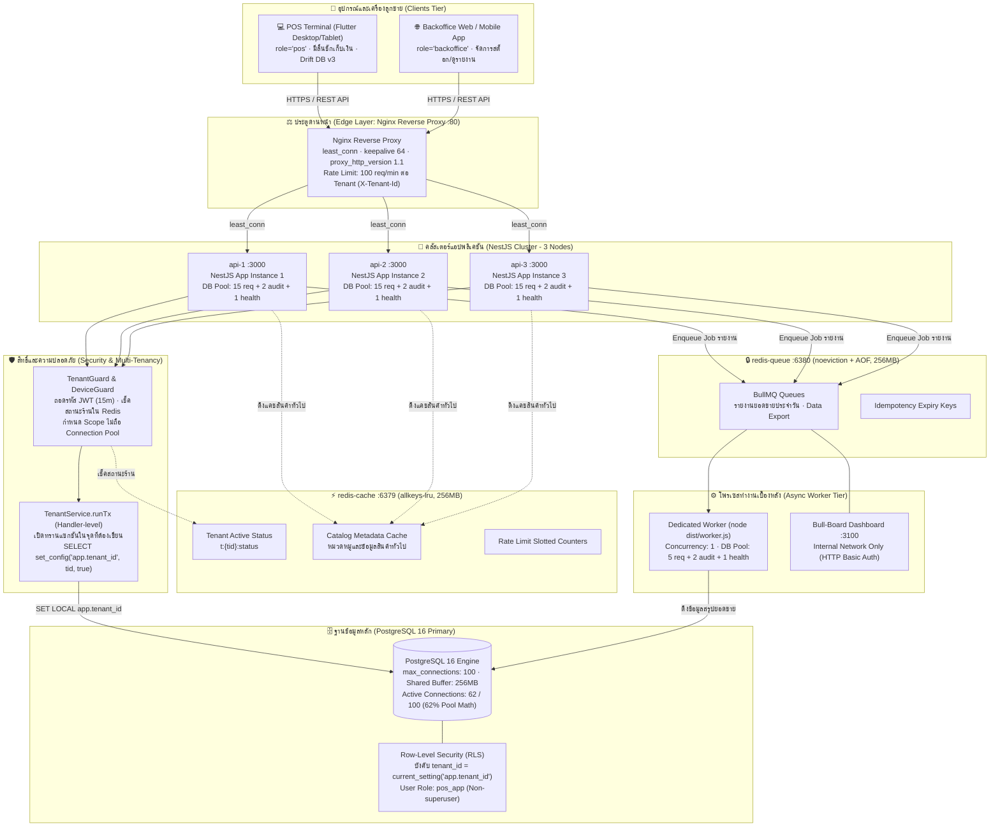
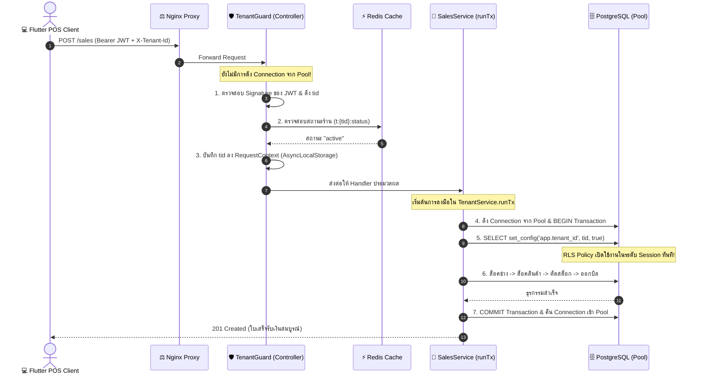
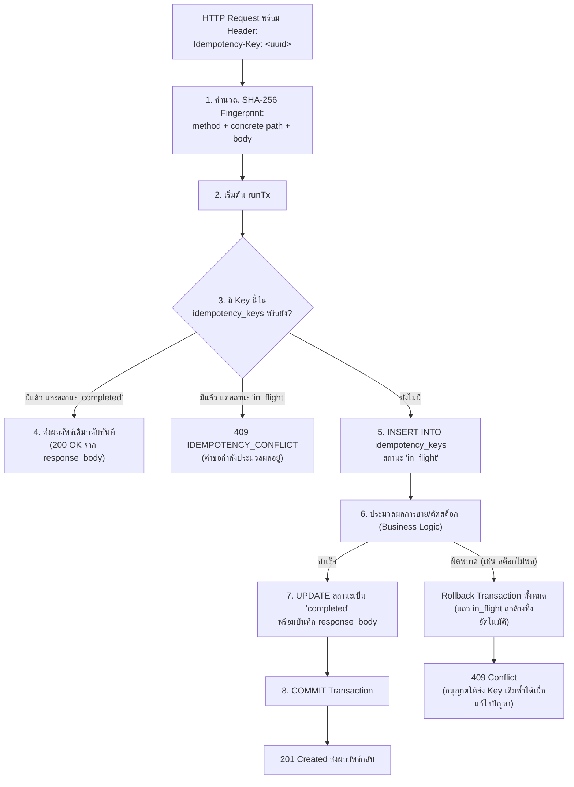
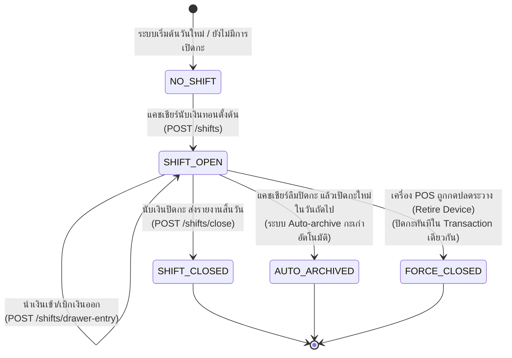

# 🏛️ Srisurart Autopart POS — Multi-Tenant Backend Architecture & Concurrency Blueprint

> **โจทย์ & บริบท**: ระบบบริหารจัดการงานขายหน้าร้านอะไหล่ยนต์ (Thai Auto-parts POS) สถาปัตยกรรมแบบ **Multi-Tenant (หลายร้านค้าในฐานข้อมูลเดียว)** รองรับการขายหน้าร้าน (Point of Sale), สต็อก, ลูกค้า/ช่างเครดิต, และการปิดกะลิ้นชัก
> **สแตกเทคโนโลยีหลัก**: NestJS + PostgreSQL 16 (Row-Level Security) + Redis (Cache & BullMQ Queue) + Nginx + Flutter Client (Phase 1 = Architecture A บนโมเดล T1)
> **เป้าหมายหลัก**:
> 1. **Zero Overselling & Zero Race Condition**: จัดการสต็อกและการตัดวงเงินเครดิตช่างอย่างเข้มงวดตามหลัก ACID ด้วย Pessimistic Row Locking
> 2. **Multi-Tenant Isolation 100%**: แยกข้อมูลระหว่างร้านค้าด้วย PostgreSQL Row-Level Security (RLS) ผ่าน Handler-level `TenantService.runTx` (ADR-0003 Amendment)
> 3. **Strict Idempotency**: รับประกันว่าการส่งซ้ำของคำขอ (Network Glitch / Retry) จะไม่เกิดการหักเงิน ซ้ำบิล หรือตัดสต็อกเบิ้ล (#18)
> 4. **Physical Device Role & Security**: ควบคุมเครื่องที่มีสิทธิ์เปิดลิ้นชักและออกบิลขายจริง (`role='pos'`) ตามข้อจำกัดทางกายภาพ (ADR-0004)
>
> งงกับ key? อ่าน [`00_BASICS.md#keys`](00_BASICS.md#keys) (ฉบับเต็ม) หรือ [`01_DATABASE.md#keys`](01_DATABASE.md#keys) (ฉบับย่อ) —
> `(tenant_id, id)` คือ **composite primary key** อันเดียวที่ประกอบจาก 2 คอลัมน์ ไม่ใช่ PK สองอัน
> 🔴 DDL ในไฟล์นี้เป็น **ร่างรุ่นเก่า** (`id ... PRIMARY KEY` เดี่ยว + `tenant_id` แยก) ฉบับที่ผูกพันคือ [`01_DATABASE.md §5`](01_DATABASE.md#5-ddl-เต็ม) — ขัดกันเมื่อไหร่ให้ยึด `01`

---

## 0. 🎯 Requirement Traceability & Architectural Invariants (สเปก → สถาปัตยกรรม)

### 0.1 ตารางเชื่อมโยงข้อกำหนดทางธุรกิจและหลักสูตร (Requirement Traceability)

| # | ข้อกำหนดทางสถาปัตยกรรม | การนำไปใช้จริงในโปรเจกต์ Srisurart POS | ที่อยู่ในเอกสารนี้ |
| :-- | :--- | :--- | :--- |
| **1.1** | **Load Balancer & Edge**: Nginx Reverse Proxy (≥ 3 API nodes) | รัน Nginx 1 ตัว ทำหน้าที่เป็น Reverse Proxy กระจายโหลดแบบ `least_conn` ไปยัง NestJS 3 instances (`api-1`, `api-2`, `api-3`) พร้อม Rate Limiting per Tenant | §2 |
| **1.2** | **Backend Structure**: NestJS Modular Monolith | จัดโครงสร้างแบบ Feature-based Modules ครอบคลุม 29 โมดูลหลักใน `server/src/` (198 ไฟล์) | §3 |
| **1.3** | **Database & RLS**: PostgreSQL 16 + TypeORM + Pool Math | จัดการ Connection Pool คำนวณตายตัว 62/100 connections พร้อมบังคับใช้ Row-Level Security (RLS) ทุกตารางของ Tenant | §5, §8 |
| **1.4** | **Caching & Invalidation**: Redis Dual-Node | แยกโหนดเด็ดขาดระหว่าง `redis-cache` (LRU 256MB สำหรับ Read Cache) และ `redis-queue` (noeviction + AOF สำหรับ BullMQ) | §8 |
| **1.5** | **Message Queue**: BullMQ + Dedicated Worker | แยกคอนเทนเนอร์ `worker` (Concurrency 1, Pool 5) ดึงงานประมวลผลอะซิงโครนัส เช่น รายงานสรุปยอดขาย และแดชบอร์ด Bull-Board | §9 |
| **1.6** | **Stateless Auth & Device Roles**: JWT + Device Tokens | JWT HS256 อายุสั้น 15 นาที ตรวจ `devices.retired_at` ตอน Refresh (ADR-0009) และออก Device Token ผูกบทบาท `pos`/`backoffice` จากเซิร์ฟเวอร์เท่านั้น (ADR-0004) | §4 |
| **1.7** | **Concurrency & Race Condition Safety** | ป้องกันสต็อกติดลบและวงเงินเครดิตช่างทะลุด้วย Strict Row Lock Order (`Sale → Mechanic → Products → DocCounters → Customer`) | §6 |
| **1.8** | **Idempotency Module**: Transactional Safety | โมดูล `IdempotencyService` ตรวจจับคำขอซ้ำด้วย SHA-256 Request Fingerprint และ Rollback การเคลมพร้อม Business Transaction | §7 |
| **1.9** | **Shifts & Cash Drawer Mechanics** | ควบคุมลิ้นชักเก็บเงินหน้าร้าน บังคับผูก `shift_id` กับทุกการขายและการคืน Auto-archive กะเก่า และตัดสิทธิ์เมื่อเครื่อง POS ถูกปลดระวาง | §10 |
| **1.10** | **Observability & Probes**: Prom-client + Health Checks | แยก `/health/live` และ `/health/ready` ส่งออก Metrics ตามมาตรฐาน Prometheus และ JSON Logging ผ่าน Pino | §11 |

---

### 0.2 กฎเหล็กที่ไม่สามารถประนีประนอมได้ 5 ข้อ (Core Architectural Invariants)

1. **สต็อกห้ามติดลบเด็ดขาด (Strict Stock Decrement):**
   การขายหน้าร้านไม่อนุญาตให้ใช้ `GREATEST(0, stock - qty)` บนฐานข้อมูลหลัก หากสต็อกมีไม่พอ ทรานแซกชันต้องถูกปฏิเสธทันทีด้วย `409 INSUFFICIENT_STOCK` พร้อมระบุรายการสินค้าที่ขาดให้ครบถ้วนในครั้งเดียว
2. **ลำดับการถือล็อคต้องเคร่งครัดเสมอ (Strict Lock Hierarchy):**
   ทุกทรานแซกชันที่เกี่ยวข้องกับเงินและสต็อกต้องขอคิวล็อคตามลำดับ:
   $$\text{Sale} \longrightarrow \text{Mechanic} \longrightarrow \text{Products (เรียงตาม id ASC)} \longrightarrow \text{DocCounters} \longrightarrow \text{Customer}$$
   การสลับลำดับล็อคแม้แต่ตำแหน่งเดียวจะนำไปสู่ภาวะ Deadlock (`40P01`) ในระดับฐานข้อมูล
3. **บิลเป็นตัวกำหนดราคาคืน (Bill Decides Price):**
   ในการออกใบลดหนี้/คืนสินค้า (`POST /returns`) ระบบจะไม่อนุญาตให้ไคลเอนต์ระบุราคาคืนเอง แต่ต้องอ่านราคาและต้นทุนขายจาก `sale_items` ของบิลเดิม (`cost_at_sale` ตาม ADR-0008) หากราคาไม่ตรงกันระบบจะปฏิเสธด้วย `409 RETURN_PRICE_MISMATCH`
4. **หนึ่งร้านค้ามีเครื่อง POS ที่เปิดลิ้นชักได้เพียง 1 เครื่อง (`one_pos_per_tenant`):**
   ตามข้อจำกัดทางกายภาพ ลิ้นชักเก็บเงินสดของร้านค้ามีเพียงชุดเดียว จึงอนุญาตให้มีอุปกรณ์ที่มีสิทธิ์ `drole='pos'` ได้เพียง 1 เครื่องต่อร้านค้า เพื่อขจัดปัญหาการขายของแย่งสต็อกและการเปิดลิ้นชักชนกัน (ADR-0004)
5. **สต็อกและยอดเงินสดต้องสดจาก PostgreSQL เสมอ (PostgreSQL as Authority):**
   ข้อมูลสต็อกคงเหลือ ยอดเงินในลิ้นชัก และยอดหนี้เครดิตช่าง **ห้ามถูกนำไปแคชใน Redis เด็ดขาด** ทุกคำขอที่มีผลต่อยอดเงินต้อง Query ผ่าน PostgreSQL พร้อมสิทธิ์ RLS เสมอ

---

## 1. 🏗️ ภาพรวมสถาปัตยกรรมทั้งระบบ (System Architecture Diagram)



---

### 1.1 การคำนวณ Connection Pool (Database Pool Math)

ระบบออกแบบ Connection Pool ให้ทำงานได้อย่างมีเสถียรภาพภายใต้ขีดจำกัด `max_connections = 100` ของ PostgreSQL บน VM โดยมีสูตรคำนวณที่แน่นอน:

$$\text{Total Connections} = (N_{\text{api}} \times (\text{Pool}_{\text{req}} + \text{Pool}_{\text{audit}} + \text{Pool}_{\text{health}})) + (N_{\text{worker}} \times (\text{Pool}_{\text{work}} + \text{Pool}_{\text{audit}} + \text{Pool}_{\text{health}}))$$

แทนค่าตามการตั้งค่าจริงใน [`server/docker-compose.yml`](../../server/docker-compose.yml):
- **API Instances (3 ตัว):** $3 \times (15 + 2 + 1) = 54$ connections
- **Worker Instance (1 ตัว):** $1 \times (5 + 2 + 1) = 8$ connections
- **ยอดรวม Connection สูงสุด:** $54 + 8 = \mathbf{62\text{ connections}}$

> 💡 **การวิเคราะห์ความปลอดภัย**: 62 connections คิดเป็น **62%** ของขีดจำกัดสูงสุด (100) ซึ่งต่ำกว่าเกณฑ์เพดานอันตราย (80%) เหลือพื้นที่ว่าง 38 connections สำหรับการทำงานของ System Administrator, การรัน Migration, และ Health Check ฉุกเฉิน

---

### 1.2 การจัดสรรงบประมาณหน่วยความจำ (Memory Budget)

ระบบถูกออกแบบให้รันได้อย่างราบรื่นบนฮาร์ดแวร์จำกัด เช่น Virtual Machine ขนาด **4 vCPU / 6 GB RAM**:

| คอนเทนเนอร์ (Container) | บทบาทหน้าที่ | เมมโมรีที่จำกัด (Limit) | หมายเหตุ |
| :--- | :--- | :---: | :--- |
| **postgres** | ฐานข้อมูลหลัก (PostgreSQL 16) | **1024 MB** | `shared_buffers = 256MB`, `work_mem = 16MB` |
| **api-1, api-2, api-3** | โหนดประมวลผลคำขอ (NestJS) | **3 × 384 MB = 1152 MB** | Node.js V8 Heap ขนาด 256MB + Overhead |
| **redis-cache** | แคชข้อมูลทั่วไป (LRU) | **256 MB** | `maxmemory-policy allkeys-lru` |
| **redis-queue** | คิวงาน BullMQ (AOF) | **256 MB** | `maxmemory-policy noeviction` |
| **worker** | โพรเซสประมวลผลงานเบื้องหลัง | **256 MB** | Single process สำหรับงานสรุปยอดและรีพอร์ต |
| **bull-board** | แดชบอร์ดมอนิเตอร์คิว | **128 MB** | Express UI หลังระบบรักษาความปลอดภัย |
| **nginx** | ตัวกระจายภาระและ Reverse Proxy | **64 MB** | Event-driven C architecture กินแรมน้อยมาก |
| **etcd** | ระบบ Configuration / Coordination | **256 MB** | Metadata coordination สำหรับงานสเกล |
| **รวมทั้งระบบ (Total)** | **สแตกบริการทั้งหมด** | **~3,368 MB (~3.3 GB)** | **คิดเป็น 56% ของ RAM 6 GB** (ปลอดภัยจาก OOM Killer) |

---

## 2. ⚖️ Edge Layer: Nginx Reverse Proxy

Nginx ทำหน้าที่เป็นปราการด่านหน้าในการรับคำขอจากเครือข่ายภายนอก จัดการ SSL Handshake, บัฟเฟอร์คำขอ, ควบคุมอัตราการยิงคำขอ (Rate Limiting) และกระจายไปยังคลัสเตอร์ NestJS

### 2.1 โครงสร้างการตั้งค่าจริง (`server/docker/nginx/nginx.conf`)

```nginx
# server/docker/nginx/nginx.conf

# 1. การจำกัดอัตราเร็วคำขอรายร้านค้า (Per-tenant Rate Limiting - ADR-0006)
limit_req_zone $http_x_tenant_id zone=tenant_limit:10m rate=100r/m;
limit_req_status 429;

upstream nestjs_backend {
    least_conn;                         # กระจายไปยังอินสแตนซ์ที่มี in-flight connection น้อยที่สุด

    server api-1:3000 max_fails=2 fail_timeout=10s;
    server api-2:3000 max_fails=2 fail_timeout=10s;
    server api-3:3000 max_fails=2 fail_timeout=10s;

    keepalive 64;                       # รักษา TCP connection pool คุยกับ backend
}

server {
    listen 80;
    server_name localhost;

    # บัฟเฟอร์ขนาดคำขอ ป้องกัน Slowloris attack
    client_body_buffer_size 128k;
    client_max_body_size 10m;
    proxy_buffers 8 16k;
    proxy_buffer_size 16k;

    # ปิดการแสดงเวอร์ชันของ Nginx
    server_tokens off;

    # Health check endpoint ไม่ติด rate limit และไม่บันทึก access log บ่อยเกินจำเป็น
    location /health/ {
        proxy_pass http://nestjs_backend;
        proxy_http_version 1.1;
        proxy_set_header Connection "";
        access_log off;
    }

    # API endpoints หลัก
    location / {
        # บังคับใช้ Rate Limit แยกตาม Tenant ID
        limit_req zone=tenant_limit burst=20 nodelay;

        proxy_pass http://nestjs_backend;

        # บังคับ HTTP/1.1 และล้าง Header Connection เพื่อให้ keepalive ทำงานจริง
        proxy_http_version 1.1;
        proxy_set_header Connection "";

        proxy_set_header Host $host;
        proxy_set_header X-Real-IP $remote_addr;
        proxy_set_header X-Forwarded-For $proxy_add_x_forwarded_for;
        proxy_set_header X-Forwarded-Proto $scheme;
        proxy_set_header X-Tenant-Id $http_x_tenant_id;

        # การตั้งเวลาตัดการเชื่อมต่อที่รัดกุม
        proxy_connect_timeout 5s;
        proxy_send_timeout 15s;
        proxy_read_timeout 15s;

        # ไม่ retry ซ้ำหากเกิดความล่าช้า (ป้องกัน duplicate write multiplier)
        proxy_next_upstream error invalid_header http_502 http_503;
    }

    # บล็อกเส้นทางบริหารจัดการภายใน ไม่ให้เข้าถึงจากภายนอกโดยตรง
    location /admin/queues {
        # บังคับให้เข้าผ่าน Internal Network หรือผ่าน SSH Tunnel พอร์ต 3100 เท่านั้น
        deny all;
    }
}
```

---

## 3. 🧱 NestJS Modular Structure & Domain Design

เซิร์ฟเวอร์ถูกพัฒนาด้วย NestJS โดยจัดระเบียบตาม **Domain-Driven Modular Monolith** แยกฟังก์ชันการทำงานออกเป็น 29 โดเมนโมดูลที่เป็นอิสระต่อกัน:

```
server/src/
├── main.ts                        # จุดเริ่มต้นของระบบ, Global Pipes, Shutdown Hooks
├── app.module.ts                  # Root Module รวบรวม Dependencies ทั้งหมด
├── app.setup.ts                   # การตั้งค่า Middleware, Filters, Interceptors, Pino Logger
├── common/                        # โมดูลและยูทิลิตี้ส่วนกลาง
│   ├── database/
│   │   ├── database.module.ts     # TypeOrmModule.forRootAsync และ Connection Pooling
│   │   └── tenant.service.ts      # 🌟 TenantService.runTx (หัวใจของ Multi-Tenancy RLS)
│   ├── guards/
│   │   ├── auth.guard.ts          # ตรวจสอบความถูกต้องของ JWT Token
│   │   ├── tenant.guard.ts        # ตรวจสอบสถานะร้านค้า (Active) และผูก Request Context
│   │   └── device.guard.ts        # ตรวจสอบสิทธิ์เครื่อง POS / Backoffice (ADR-0004)
│   ├── interceptors/
│   │   └── logging.interceptor.ts # Pino Structured Request Logging
│   └── request-context.ts         # AsyncLocalStorage สำหรับเก็บ State ของ Request ปัจจุบัน
├── idempotency/                   # 🌟 ระบบ Idempotency-Key Module (#18)
│   ├── idempotency.service.ts     # SHA256 Fingerprint, Claim Lock, Transactional Safety
│   └── idempotency.module.ts
├── sales/                         # 🌟 โดเมนการขายหน้าร้าน (POST /sales, Void, Lock Products)
│   ├── sales.service.ts           # Strict Lock Order, ตัดสต็อก, คำนวณยอดเงิน
│   ├── void.service.ts            # การยกเลิกบิล, ตรวจสอบ PIN ผู้จัดการ, คืนสต็อก
│   └── sales.controller.ts
├── returns/                       # 🌟 โดเมนการคืนสินค้าและใบลดหนี้ (POST /returns)
│   ├── returns.service.ts         # Over-refund Guard, คืนเงินตามบิลเดิม, คำนวณบัญชีช่าง
│   └── returns.controller.ts
├── shifts/                        # 🌟 โดเมนกะและลิ้นชักเก็บเงิน (POST /shifts, Drawer Entries)
│   ├── shifts.service.ts          # Auto-archive กะเก่า, บันทึกเงินเข้า-ออก, ปิดกะ
│   └── shifts.controller.ts
├── products/                      # จัดการสินค้าและสต็อก (Query, ปรับปรุง, ประวัติการเคลื่อนไหว)
├── customers/                     # จัดการข้อมูลลูกค้าและแต้มสะสม
├── mechanics/                     # จัดการข้อมูลช่าง ยอดหนี้เครดิต และวงเงินสูงสุด
├── po/                            # การสั่งซื้อสินค้าและรับของเข้าโกดัง (คำนวณ Weighted Average Cost)
├── devices/                       # จัดการการลงทะเบียนและปลดระวางเครื่อง POS (ADR-0004, ADR-0009)
├── queue/                         # BullMQ Queues, Worker Processor และ Constants
│   ├── queue.constants.ts         # นิยามชื่อคิว QUEUE_DAILY_REPORT, QUEUE_DATA_SYNC
│   └── worker.ts                  # Worker Process Entry Point
├── metrics/                       # Prometheus Metrics Service (prom-client)
└── health/                        # Health Checks Controller (/health/live, /health/ready)
```

---

### 3.1 สเปกฐานข้อมูลและตารางหลัก (Core Database Tables & DDL)

ฐานข้อมูลของระบบถูกออกแบบอย่างรัดกุม โดยมี **27 ตารางหลัก** ที่สร้างผ่าน TypeORM Migrations ตารางทุกตัวที่ขึ้นตรงกับร้านค้าจะมีคอลัมน์ `tenant_id` และถูกคุ้มครองด้วยนโยบาย Row-Level Security:

```sql
-- ตัวอย่าง DDL ตารางสำคัญและการตั้งค่านโยบาย RLS

-- 1. ตารางร้านค้า (Tenants) - อยู่ในระดับ Global ไม่ติด RLS
CREATE TABLE tenants (
    id            UUID PRIMARY KEY DEFAULT gen_random_uuid(),
    code          VARCHAR(32) NOT NULL UNIQUE,
    name          VARCHAR(255) NOT NULL,
    status        VARCHAR(16) NOT NULL DEFAULT 'active',    -- 'active', 'suspended', 'closed'
    plan          VARCHAR(32) NOT NULL DEFAULT 'standard',
    created_at    TIMESTAMPTZ NOT NULL DEFAULT now(),
    updated_at    TIMESTAMPTZ NOT NULL DEFAULT now()
);

-- 2. ตารางสินค้า (Products) - ติด RLS
CREATE TABLE products (
    id            UUID PRIMARY KEY DEFAULT gen_random_uuid(),
    tenant_id     UUID NOT NULL REFERENCES tenants(id) ON DELETE CASCADE,
    code          VARCHAR(64) NOT NULL,
    name          VARCHAR(255) NOT NULL,
    price         NUMERIC(12,2) NOT NULL,
    cost          NUMERIC(12,2) NOT NULL DEFAULT 0.00,      -- Weighted Average Cost
    stock         INTEGER NOT NULL DEFAULT 0,
    min_stock     INTEGER NOT NULL DEFAULT 0,
    offline_ok    BOOLEAN NOT NULL DEFAULT false,           -- Drift Sync Support (ADR-0010)
    created_at    TIMESTAMPTZ NOT NULL DEFAULT now(),
    updated_at    TIMESTAMPTZ NOT NULL DEFAULT now(),

    CONSTRAINT uq_product_tenant_code UNIQUE (tenant_id, code),
    CONSTRAINT chk_positive_stock CHECK (stock >= 0),       -- สต็อกห้ามติดลบเด็ดขาด
    CONSTRAINT chk_positive_price CHECK (price >= 0)
);

-- 3. ตารางการขาย (Sales) - ติด RLS
CREATE TABLE sales (
    id              UUID PRIMARY KEY DEFAULT gen_random_uuid(),
    tenant_id       UUID NOT NULL REFERENCES tenants(id) ON DELETE CASCADE,
    doc_no          VARCHAR(32) NOT NULL,                   -- เช่น 'INV-202609-0001'
    shift_id        UUID NOT NULL,                          -- ผูกกับกะลิ้นชักเสมอ
    customer_id     UUID,
    mechanic_id     UUID,
    payment_method  VARCHAR(32) NOT NULL,                   -- 'cash', 'transfer', 'credit_mechanic'
    total_amount    NUMERIC(12,2) NOT NULL,
    discount_amount NUMERIC(12,2) NOT NULL DEFAULT 0.00,
    net_amount      NUMERIC(12,2) NOT NULL,
    points_granted  INTEGER NOT NULL DEFAULT 0,
    status          VARCHAR(16) NOT NULL DEFAULT 'completed', -- 'completed', 'voided'
    void_reason     TEXT,
    voided_at       TIMESTAMPTZ,
    created_at      TIMESTAMPTZ NOT NULL DEFAULT now(),

    CONSTRAINT uq_sale_tenant_docno UNIQUE (tenant_id, doc_no)
);

-- 4. ตารางรายการสินค้าในบิล (Sale Items) - แช่แข็งต้นทุนขาย (ADR-0008)
CREATE TABLE sale_items (
    id            UUID PRIMARY KEY DEFAULT gen_random_uuid(),
    tenant_id     UUID NOT NULL REFERENCES tenants(id) ON DELETE CASCADE,
    sale_id       UUID NOT NULL REFERENCES sales(id) ON DELETE CASCADE,
    product_id    UUID NOT NULL REFERENCES products(id),
    qty           INTEGER NOT NULL,
    price         NUMERIC(12,2) NOT NULL,
    cost_at_sale  NUMERIC(12,2) NOT NULL,                   -- แช่แข็งต้นทุน ณ เสี้ยววินาทีที่ขาย
    total_amount  NUMERIC(12,2) NOT NULL,

    CONSTRAINT chk_sale_item_qty CHECK (qty > 0)
);

-- 5. การเปิดใช้งาน Row-Level Security (RLS) และบังคับใช้
ALTER TABLE products ENABLE ROW LEVEL SECURITY;
ALTER TABLE products FORCE ROW LEVEL SECURITY;

CREATE POLICY tenant_isolation_products ON products
    FOR ALL
    USING (tenant_id = NULLIF(current_setting('app.tenant_id', true), '')::uuid)
    WITH CHECK (tenant_id = NULLIF(current_setting('app.tenant_id', true), '')::uuid);
```

---

## 4. 🔐 Authentication, Authorization & Device Boundary

ระบบรักษาความปลอดภัยถูกแบ่งออกเป็น 2 ชั้นอย่างเคร่งครัดตามข้อกำหนดทางสถาปัตยกรรม:

### 4.1 สิทธิ์ผู้ใช้งาน: User Stateless JWT (15-Minute Lifetime - ADR-0009)
- **Token Signing**: ลงลายมือชื่อด้วยอัลกอริทึม `HS256` โดยใช้ค่าความลับจาก `JWT_SECRET`
- **Zero I/O Verification**: การตรวจสอบ Token ใน `AuthGuard` ไม่มีการอ่านฐานข้อมูลหรือ Redis ในคำขอปกติ เพื่อรักษาประสิทธิภาพที่ความเร็วสูงสุด
- **อายุ Token สั้นพิเศษ (15 นาที)**: ป้องกันความเสียหายในกรณีที่ Token รั่วไหล
- **การเพิกถอนสิทธิ์เมื่อ Refresh**: เมื่อ Access Token หมดอายุ ไคลเอนต์ต้องส่ง Refresh Token กลับมาที่ `/auth/refresh` ซึ่งในจุดนี้เซิร์ฟเวอร์จะตรวจสอบสถานะของร้านค้าใน `tenants` และตรวจสอบว่าเครื่องดังกล่าวถูกปลดระวางหรือไม่ผ่าน `devices.retired_at` (ADR-0009)

### 4.2 สิทธิ์เครื่องลูกข่าย: Device Token & Role Boundary (ADR-0004)
ในระบบ POS หน้าร้าน ข้อผิดพลาดที่ร้ายแรงที่สุดคือการอนุญาตให้คอมพิวเตอร์เครื่องใดก็ได้ในเครือข่ายยิงคำขอเปิดลิ้นชักและออกบิลขาย:
- **Server-issued Token Only**: ค่า `did` (Device ID) และ `drole` (Device Role) **ต้องถูกออกโดยเซิร์ฟเวอร์เท่านั้น** ผ่านขั้นตอนการผูกเครื่อง (`POST /devices` และ `POST /auth/device`) ไคลเอนต์ไม่มีสิทธิ์ส่งค่า `drole` มาใน Request Body เองเด็ดขาด
- **บทบาทอุปกรณ์ (Device Roles):**
  - `role='pos'`: สิทธิ์ของเครื่องขายหน้าร้าน ได้รับอนุญาตให้เปิดกะลิ้นชัก (`POST /shifts`), บันทึกรายการขายเงินสด (`POST /sales`), และสั่งพิมพ์ใบเสร็จ (จำกัด 1 เครื่องต่อร้านค้า)
  - `role='backoffice'`: สิทธิ์ของเครื่องหลังร้าน ได้รับอนุญาตให้ดูรายงาน, จัดการสต็อก, แก้ไขข้อมูลลูกค้า แต่ **ไม่มีสิทธิ์เปิดกะหรือออกบิลขายเงินสดหน้าร้าน**

---

## 5. 🛡️ Multi-Tenancy & Tenancy Isolation (ADR-0003 Amendment)

เดิมทีระบบเคยเปิด Transaction ไว้ตั้งแต่ Middleware เพื่อเรียกคำสั่ง `SET LOCAL app.tenant_id` แต่ก่อให้เกิดปัญหา Connection Pool Starvation และ Deadlock เมื่อคำขอต้องรอฟังก์ชัน CPU-intensive เช่น Argon2 

สถาปัตยกรรมปัจจุบันใช้หลักการ **ADR-0003 Amendment (tx.4, tx.5)** ซึ่งแยกบทบาทหน้าที่อย่างชัดเจน:
> **"ใครเป็นคนตัดสิน (Guard) แยกขาดจาก ใครเป็นคนลงมือ (Service)"**



### 5.1 โค้ดหลักการทำงานของ `TenantService.runTx` (`server/src/common/database/tenant.service.ts`)

```typescript
// server/src/common/database/tenant.service.ts

@Injectable()
export class TenantService {
  constructor(
    @InjectDataSource() private readonly dataSource: DataSource,
    private readonly requestContext: RequestContextService,
  ) {}

  /**
   * รันฟังก์ชันทางธุรกิจภายใน Transaction ที่ถูกผูกมัดด้วย Tenant ID และ RLS เสมอ
   * ⚠️ ห้ามรับ tid เป็นพารามิเตอร์เด็ดขาด เพื่อป้องกันการแอบอ้างสิทธิ์ข้ามร้าน
   */
  async runTx<T>(work: (entityManager: EntityManager) => Promise<T>): Promise<T> {
    const tenantId = this.requestContext.getTenantId();
    if (!tenantId) {
      throw new ForbiddenException('TENANT_CONTEXT_MISSING');
    }

    // หากมี Transaction เปิดอยู่แล้วใน Scope เดียวกัน ให้ Join ทันที ไม่เปิด Connection ซ้ำ
    const existingManager = this.requestContext.getEntityManager();
    if (existingManager) {
      return work(existingManager);
    }

    // ดึง Connection จาก Pool และเริ่มต้น Transaction
    const queryRunner = this.dataSource.createQueryRunner();
    await queryRunner.connect();
    await queryRunner.startTransaction();

    try {
      // 🌟 ตั้งค่า Session Config สำหรับ RLS (พารามิเตอร์ที่ 3 = true หมายถึงมีผลเฉพาะในทรานแซกชันนี้)
      await queryRunner.query(
        `SELECT set_config('app.tenant_id', $1, true)`,
        [tenantId],
      );

      // บันทึก EntityManager ลง Context เพื่อให้คำสั่งภายในแชร์ Transaction เดียวกัน
      this.requestContext.setEntityManager(queryRunner.manager);

      const result = await work(queryRunner.manager);

      await queryRunner.commitTransaction();
      return result;
    } catch (error) {
      await queryRunner.rollbackTransaction();
      throw error;
    } finally {
      this.requestContext.setEntityManager(null);
      await queryRunner.release(); // คืน Connection กลับสู่ Pool เสมอ
    }
  }
}
```

---

## 6. ⚡ Concurrency Control & Strict Lock Ordering (หัวใจสำคัญ)

ในการขายอะไหล่รถยนต์ สินค้าชิ้นเดียวกันอาจถูกขายให้ลูกค้าเงินสดหน้าร้าน พร้อมๆ กับที่ช่างประจำกำลังเบิกไปซ่อม หรือมีการรับคืนสินค้าเข้ามาในเวลาเดียวกัน

### 6.1 สถานการณ์จำลองการเกิด Race Condition หากไม่มีการล็อคที่ดี
1. **สินค้าเหลือ 1 ชิ้น:** แคชเชียร์เครื่องที่ 1 และเครื่องที่ 2 ตรวจพบว่าสต็อกเหลือ 1 เท่ากัน กดยืนยันการขายพร้อมกัน ระบบตัดสต็อกเหลือ 0 ทั้งคู่ เกิดการขายเกินจริง (Overselling) ลูกค้าคนหนึ่งจ่ายเงินแล้วแต่ไม่มีของให้
2. **วงเงินช่างใกล้เต็ม:** ช่างมียอดหนี้ 48,000 บาท จากวงเงิน 50,000 บาท (เหลือเบิกได้ 2,000 บาท) มีการยิงบิล 2 ใบพร้อมกัน ใบละ 1,500 บาท หากไม่มีการล็อคแถวข้อมูลของช่าง ทั้งสองบิลจะผ่านการตรวจสอบ เกิดหนี้เสียเกินวงเงินที่ร้านอนุมัติ

### 6.2 ลำดับการถือล็อคระดับแถว (Strict Global Lock Hierarchy)

เพื่อขจัดปัญหา Race Condition และรับประกันว่าจะ **ไม่เกิด Deadlock (`40P01`) 100%** ทรานแซกชันทั้งหมดในระบบต้องเข้าคิวล็อคตามลำดับขั้นสากล:

```
[1. Sale Record]  (เฉพาะกรณี Void หรือ Return บิลเดิม)
       │
       ▼
[2. Mechanic Record] (SELECT ... FOR UPDATE แถวข้อมูลช่าง เพื่อล็อคยอดหนี้)
       │
       ▼
[3. Product Records] (SELECT ... FOR UPDATE แถวสินค้า โดยต้องเรียงตาม ID จากน้อยไปมากเสมอ!)
       │
       ▼
[4. DocCounters]  (SELECT ... FOR UPDATE เพื่อออกเลขที่เอกสารเรียงลำดับ)
       │
       ▼
[5. Customer Record] (SELECT ... FOR UPDATE เพื่อสะสมแต้มและยอดซื้อสะสม)
```

```typescript
// server/src/sales/sales.service.ts
// ฟังก์ชันการล็อคสินค้าที่ป้องกัน Deadlock ได้อย่างเด็ดขาด

private async lockProducts(
  manager: EntityManager,
  items: Array<{ productId: string; qty: number }>,
): Promise<Map<string, Product>> {
  // 🌟 จุดตายที่ 1: ต้องดึงเฉพาะ ID ที่ไม่ซ้ำ และเรียงลำดับจากน้อยไปมากเสมอ!
  const productIds = Array.from(new Set(items.map((i) => i.productId))).sort();

  // 🌟 จุดตายที่ 2: ใช้คำสั่ง SELECT FOR UPDATE เพื่อจองคิวล็อคตามลำดับ ID
  const lockedProducts = await manager
    .createQueryBuilder(Product, 'p')
    .setLock('pessimistic_write')
    .where('p.id IN (:...ids)', { ids: productIds })
    .orderBy('p.id', 'ASC') // บังคับทิศทางการล็อค
    .getMany();

  // ตรวจสอบความถูกต้องของสต็อกและรวบรวม Error
  const productMap = new Map(lockedProducts.map((p) => [p.id, p]));
  const insufficientErrors: string[] = [];

  for (const item of items) {
    const product = productMap.get(item.productId);
    if (!product) {
      throw new NotFoundException(`PRODUCT_NOT_FOUND: ${item.productId}`);
    }
    if (product.stock < item.qty) {
      insufficientErrors.push(
        `${product.name} (มี ${product.stock} ต้องการ ${item.qty})`,
      );
    }
  }

  // ส่งแจ้งเตือนครั้งเดียวครบทุกรายการขาด
  if (insufficientErrors.length > 0) {
    throw new ConflictException(
      `สต็อกไม่พอ: ${insufficientErrors.join(', ')}`,
    );
  }

  return productMap;
}
```

---

## 7. 🔁 Idempotency Module & Retry Safety (#18, ADR-0003)

ในสภาพแวดล้อมเครือข่ายของร้านค้าต่างจังหวัด สัญญาณเน็ตมือถือหรือ Wi-Fi มักจะกระตุก หากแคชเชียร์กดยืนยันการขายแล้วระบบเกิดหลุดช่วงรอการตอบกลับ แคชเชียร์จะกดยืนยันซ้ำ

ระบบป้องกันปัญหาการตัดสต็อกซ้ำด้วยโมดูล **`Idempotency-Key`** ที่ทำงานสอดคล้องกับทรานแซกชันในฐานข้อมูล:



> 💡 **ความปลอดภัยระดับธุรกรรม (Transactional Rollback Safety):**  
> เนื่องจากแถวข้อมูลในตาราง `idempotency_keys` ถูกบันทึกภายใน Transaction เดียวกันกับคำสั่งขาย หากคำขอขายล้มเหลว (เช่น วงเงินช่างไม่พอ หรือสต็อกขาด) แถว Idempotency จะถูก Rollback ไปด้วย ทำให้แคชเชียร์สามารถส่งคำขอซ้ำด้วยคีย์เดิมได้ทันทีหลังจากปรับยอดสินค้า

---

## 8. ⚡ Caching Strategy & Redis Dual-Node Architecture

การแคชข้อมูลในระบบ POS มีข้อกำหนดพิเศษ: **ข้อมูลสต็อกและยอดเงินห้ามผิดพลาดแม้แต่ชิ้นเดียว** ดังนั้นระบบจึงแยกสถาปัตยกรรม Redis ออกเป็น 2 คอนเทนเนอร์เด็ดขาด:

| มิติการเปรียบเทียบ | โหนดที่ 1: `redis-cache` (Port 6379) | โหนดที่ 2: `redis-queue` (Port 6380) |
| :--- | :--- | :--- |
| **นโยบายหน่วยความจำ** | `maxmemory-policy allkeys-lru` | `maxmemory-policy noeviction` |
| **ความคงทน (Persistence)** | RDB Snapshot ทั่วไป (ยอมรับข้อมูลหายได้) | เปิด **AOF (`appendonly yes`)** เพื่อป้องกัน Job หาย |
| **ชนิดข้อมูลที่จัดเก็บ** | 1. สถานะร้านค้า (`t:{tid}:status`)<br/>2. แคชหมวดหมู่สินค้าทั่วไป<br/>3. อัตราการยิงคำขอ (Rate Limit Counters) | 1. คิวงานเบื้องหลังของ BullMQ<br/>2. ข้อมูลการแจ้งเตือนและการซิงค์ข้อมูล |
| **ผลกระทบหากโหนดนี้ล่ม** | ระบบสลับไปอ่าน PostgreSQL ตรงทันที (Fail-Open) หน้าจอขายทำงานต่อได้ปกติ | งานพิมพ์รายงานจะค้างอยู่ในคิว แต่ไม่กระทบการขายหน้าร้าน |

### 8.1 การล้างแคชด้วย Post-Commit Hooks (ป้องกัน Stale Read - B04-89)
เมื่อมีการแก้ไขข้อมูลสินค้าหรือเปลี่ยนสถานะร้านค้า การสั่งล้างแคชใน Redis (`DEL`) **จะต้องเกิดขึ้นหลังจาก Transaction ในฐานข้อมูล COMMIT สำเร็จแล้วเท่านั้น** หากสั่งล้างแคชภายใน Transaction แล้วเกิด Rollback แคชที่ถูกลบไปจะถูกเติมใหม่ด้วยข้อมูลเก่าทันที

---

## 9. ⚙️ Background Worker & Async Queue (BullMQ)

เพื่อป้องกันไม่ให้คำขอประมวลผลหนักๆ (เช่น การสร้างรายงานยอดขายสิ้นวัน PDF ขนาดหลายสิบหน้า หรือการสำรองข้อมูลร้าน) มาดึง CPU ของ Event Loop หน้าร้าน ระบบจึงส่งต่องานเหล่านี้ไปยัง **Dedicated Worker**:

```typescript
// server/src/queue/queue.constants.ts
export const QUEUE_DAILY_REPORT = 'queue_daily_report';
export const QUEUE_DATA_SYNC    = 'queue_data_sync';

// server/src/queue/daily-report.processor.ts
@Processor(QUEUE_DAILY_REPORT)
export class DailyReportProcessor extends WorkerHost {
  constructor(private readonly tenantService: TenantService) {
    super();
  }

  async process(job: Job<{ tenantId: string; shiftId: string }>): Promise<any> {
    const { tenantId, shiftId } = job.data;

    // 🌟 บังคับรันงาน Worker ภายใต้ Context ของร้านค้านั้นๆ เสมอ
    return this.tenantService.runTx(async (manager) => {
      // ดึงข้อมูลยอดขายประจำกะภายใต้สิทธิ์ RLS
      const sales = await manager.find(Sale, { where: { shiftId } });
      // สร้างไฟล์ PDF และบันทึกผลลัพธ์
      return this.generateReportPdf(sales);
    });
  }
}
```

- **คอนฟิกของ Worker:** คอนเทนเนอร์ `worker` ถูกจำกัด Concurrency ไว้ที่ `1` และมีขนาด Pool แยกต่างหากที่ `5 connections` เพื่อรับประกันว่าจะไม่รุมแย่ง CPU หรือแย่ง Connection จนกระทบการขายหน้าร้าน

---

## 10. 🗄️ Shifts & Cash Drawer Mechanics (การจัดการเงินสดหน้าร้าน)

การจัดการเงินสดหน้าร้านต้องมีความแม่นยำสูง เงินในลิ้นชักต้องตรงกับยอดขายทุกบาททุกสตางค์:



- **Auto-archive Prior Shift:** หากแคชเชียร์ลืมปิดกะในวันก่อนหน้า แล้วมาเปิดกะใหม่ในเช้าวันรุ่งขึ้น ระบบจะไม่ปฏิเสธ แต่จะทำการปิดและจัดเก็บกะก่อนหน้าให้อัตโนมัติ (`auto_archived = true`) เพื่อให้หน้าร้านเปิดขายต่อได้ทันทีโดยที่ประวัติทางการเงินไม่สูญหาย
- **การบล็อกเงินลอย:** หากไม่มีกะเปิดอยู่ คำสั่งเพิ่มรายการเงินเข้า-ออกลิ้นชัก (`drawer-entry`) จะถูกปฏิเสธด้วย `409 NO_OPEN_SHIFT`

---

## 11. 📊 Observability, Health Probes & Metrics

### 11.1 Health Check Endpoints
ระบบแยกจุดตรวจวัดสุขภาพของคอนเทนเนอร์ออกเป็น 2 ระดับอย่างชัดเจนใน [`server/src/health/health.controller.ts`](../../server/src/health/health.controller.ts):
1. **Liveness Probe (`/health/live`):** ตรวจสอบว่าโพรเซส Node.js ยังมีชีวิตอยู่และ Event Loop ไม่ติดขัด (คืนค่า `200 OK` ทันทีโดยไม่แตะฐานข้อมูล)
2. **Readiness Probe (`/health/ready`):** ตรวจสอบว่าระบบมีความพร้อมในการรับทราฟฟิก โดยทดสอบการเชื่อมต่อกับ PostgreSQL Pool และ Redis หากจุดใดจุดหนึ่งขาดการเชื่อมต่อ จะตอบกลับ `503 Service Unavailable` เพื่อให้ Nginx ตัดโหนดนั้นออกจาก Upstream ชั่วคราว

### 11.2 Prometheus Metrics (`/metrics`)
ระบบติดตั้ง `prom-client` เพื่อส่งออกข้อมูลมอนิเตอร์ระดับโปรดักชัน:
- `http_request_duration_seconds`: Histogram บันทึกความล่าช้าของคำขอ (p50, p95, p99)
- `http_requests_total`: Counter นับจำนวนคำขอแยกตาม Method, Route, และ HTTP Status
- `nodejs_heap_size_used_bytes`: ขนาดหน่วยความจำที่ Node.js ใช้งานจริง
- `db_pool_active_connections`: จำนวน Connection ที่กำลังถูกใช้งานอยู่ใน Pool

---

## 12. 🧪 Testing Strategy & Verification Pipeline

ความน่าเชื่อถือของสถาปัตยกรรมถูกพิสูจน์ด้วยชุดการทดสอบอัตโนมัติหลายระดับ:

| ระดับการทดสอบ | เครื่องมือที่ใช้ | จำนวนที่ครอบคลุม | วัตถุประสงค์ในการตรวจสอบ |
| :--- | :---: | :---: | :--- |
| **Unit Tests** | Vitest | **397 passed / 47 files** | ตรวจสอบ Business Invariants, กฎการคำนวณแต้ม, การถัวเฉลี่ยต้นทุน, และ DTO Validations |
| **E2E Tests** | Vitest E2E | **51 test files** | ทดสอบการทำงานจริงบน PostgreSQL และ Redis (RLS isolation, Idempotency rollback, Strict lock order) |
| **Stress / Load Tests** | k6 | **4 test suites** | จำลองการแย่งซื้อสินค้าเดียวกัน (Concurrent Sales) และการส่งคำขอซ้ำภายใต้โหลดจำลอง |
| **Static Verification** | Oxlint + `tsc --noEmit` | **Clean (0 errors)** | รับประกันความถูกต้องของ Type และโครงสร้างโค้ดตามมาตรฐาน TypeScript ล่าสุด |

---

## 13. ⚠️ Failure Matrix & Disaster Recovery (ตารางวิเคราะห์ความล้มเหลว)

| เหตุการณ์ความล้มเหลว | ผลกระทบต่อระบบ | ระบบตรวจจับได้อย่างไร | กลยุทธ์การฟื้นฟูและการรับมือ |
| :--- | :--- | :---: | :--- |
| **Nginx ล่ม** | ทราฟฟิกทั้งหมดจากภายนอกเข้าสู่ระบบไม่ได้ | ✅ ทันที (Docker Healthcheck) | Docker Compose Restart Policy (`unless-stopped`) สตาร์ท Nginx ตัวใหม่ขึ้นมาแทนที่ในเวลา < 2 วินาที |
| **API Instance ดับ (1 ตัว)** | กำลังการประมวลผลลดลง 33% | ✅ ทันที (Nginx Passive Failover) | Nginx ตรวจพบผ่าน `max_fails=2` และเบนทราฟฟิกไปยังอีก 2 ตัวที่เหลือทันทีโดยผู้ใช้ไม่รู้สึกถึงความสะดุด |
| **PostgreSQL คอนเนกชันเต็ม** | คำขอใหม่ต้องรอใน Pool Queue | 🟡 Latency สูงขึ้นชั่วขณะ | Nginx ควบคุม Rate Limit ไว้ที่ 100 req/min ต่อร้านค้า และ Pool Math (62/100) ป้องกันไม่ให้เกิดปัญหานี้ตั้งแต่ต้น |
| **Redis Cache ดับ** | แคชสถานะร้านค้าและ Metadata หาย | 🟡 ตกไป Query ที่ DB | โค้ดถูกเขียนแบบ **Fail-Open**: หากอ่านแคชไม่สำเร็จจะตกไปอ่านจาก PostgreSQL โดยตรง ระบบไม่ล่ม |
| **Redis Queue ดับ** | งานพิมพ์รายงานเบื้องหลังหยุดชะงัก | ❌ งานค้างในคิว | เปิดโหมด **AOF (`appendonly yes`)** เมื่อ Redis รีบูตกลับมา BullMQ จะดึง Job เดิมมาทำต่อได้อย่างถูกต้อง |
| **เน็ตหน้าร้านหลุด (Internet Outage)** | เครื่อง POS ส่งข้อมูลขึ้นเซิร์ฟเวอร์ไม่ได้ | 🟡 หน้าจอแจ้งเตือน Offline | **เฟส 1:** หยุดรอสัญญาณเน็ตและกดยืนยันใหม่<br/>**เฟส 2 (ADR-0010):** สลับเข้าสู่โหมด Degraded บันทึกลง Outbox ชั่วคราว |

---

> 📌 **บทสรุปทางวิศวกรรม**: เอกสารสถาปัตยกรรมฉบับนี้เป็นข้อกำหนดผูกพัน (Binding Architectural Contract) สำหรับระบบ **Srisurart Autopart POS** ทุกการแก้ไขโค้ดใน `server/` และ `frontend/` ต้องสอดคล้องกับลำดับการถือล็อค, การจัดการสิทธิ์ Multi-Tenant RLS, และการคำนวณ Connection Pool ที่ระบุไว้ในเอกสารนี้เสมอ
