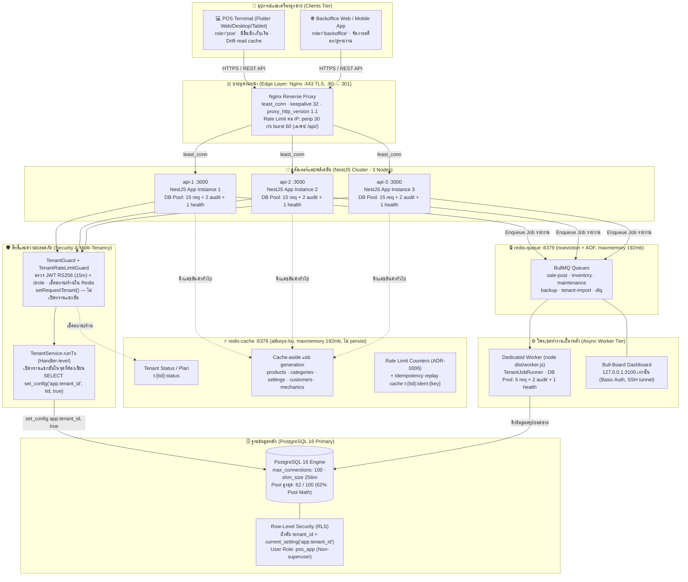
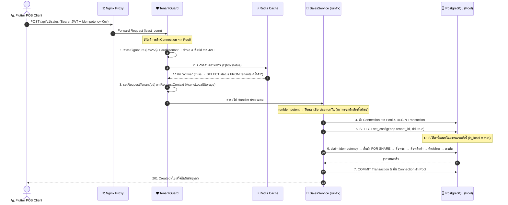
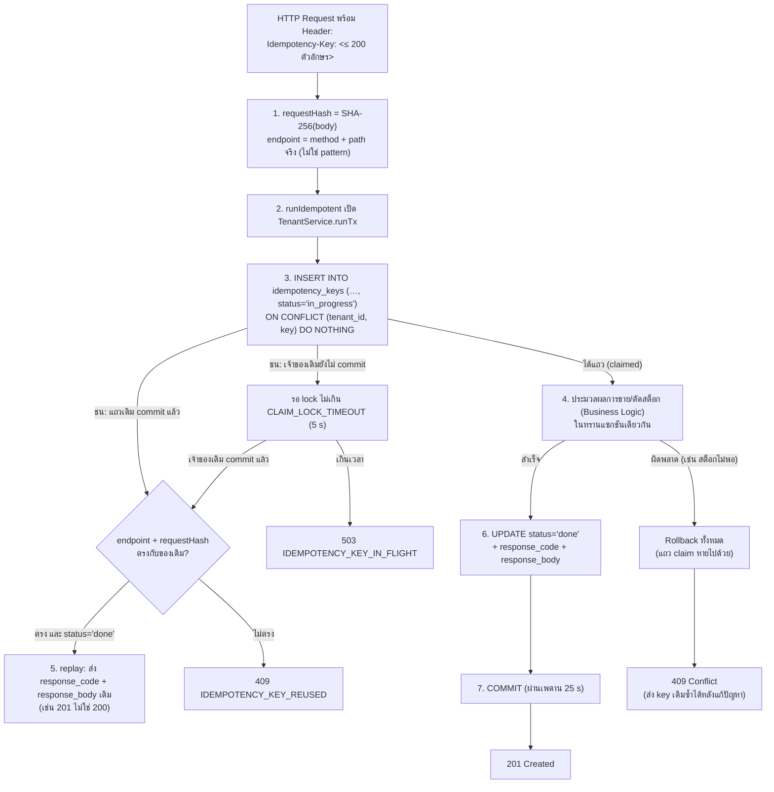
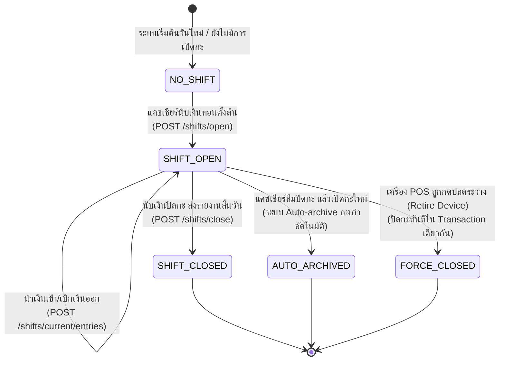

# 🏛️ Srisurart Autopart POS — Multi-Tenant Backend Architecture & Concurrency Blueprint

> **โจทย์ & บริบท**: ระบบบริหารจัดการงานขายหน้าร้านอะไหล่ยนต์ (Thai Auto-parts POS) สถาปัตยกรรมแบบ **Multi-Tenant (หลายร้านค้าในฐานข้อมูลเดียว)** รองรับการขายหน้าร้าน (Point of Sale), สต็อก, ลูกค้า/ช่างเครดิต, และการปิดกะลิ้นชัก
> **สแตกเทคโนโลยีหลัก**: NestJS + PostgreSQL 16 (Row-Level Security) + Redis (Cache & BullMQ Queue) + Nginx + Flutter Client (Phase 1 = Architecture A บนโมเดล T1)
> **เป้าหมายหลัก**:
> 1. **Zero Overselling & Zero Race Condition**: จัดการสต็อกและการตัดวงเงินเครดิตช่างอย่างเข้มงวดตามหลัก ACID ด้วย Pessimistic Row Locking
> 2. **Multi-Tenant Isolation 100%**: แยกข้อมูลระหว่างร้านค้าด้วย PostgreSQL Row-Level Security (RLS) ผ่าน Handler-level `TenantService.runTx` (ADR-0003 Amendment)
> 3. **Strict Idempotency**: รับประกันว่าการส่งซ้ำของคำขอ (Network Glitch / Retry) จะไม่เกิดการหักเงิน ซ้ำบิล หรือตัดสต็อกเบิ้ล (#18)
> 4. **Physical Device Role & Security**: ควบคุมเครื่องที่มีสิทธิ์เปิดลิ้นชักและออกบิลขายจริง (`role='pos'`) ตามข้อจำกัดทางกายภาพ (ADR-0004)
>
> งงกับ key? อ่าน [`00_BASICS.md#keys`](00_BASICS.md#keys) (ฉบับเต็ม) หรือ [`01_DATABASE.md#keys`](01_DATABASE.md#keys) (ฉบับย่อ) —
> `(tenant_id, id)` คือ **composite primary key** อันเดียวที่ประกอบจาก 2 คอลัมน์ ไม่ใช่ PK สองอัน
> 🔴 DDL ในไฟล์นี้เป็น **ร่างรุ่นเก่า** (`id ... PRIMARY KEY` เดี่ยว + `tenant_id` แยก) ฉบับที่ผูกพันคือ [`01_DATABASE.md §5`](01_DATABASE.md#5-ddl-เต็ม) — ขัดกันเมื่อไหร่ให้ยึด `01`

> 🔄 **ทบทวนกับโค้ด, migration และ ADR เมื่อ 2026-09-23** — ฉบับก่อนมีคอนฟิกและโค้ดหลายก้อนที่เขียนขึ้นเองไม่ตรงกับ repo
> (`nginx.conf`, โครงไฟล์ `server/src/`, DDL, `TenantService.runTx`, ชื่อคิว BullMQ, สถานะ idempotency, อัลกอริทึม JWT, พอร์ต Redis)
> ทุกจุดที่แก้มีหมายเหตุ `🔄 แก้ 2026-09-23` กำกับ · **เอกสารนี้ไม่ใช่สเปก:** ขัดกับ ADR ให้ยึด ADR ([`adr/README.md`](adr/README.md)),
> ขัดกับ schema ให้ยึด `server/src/db/migrations/` และ [`01_DATABASE.md`](01_DATABASE.md), ขัดกับคอนฟิกให้ยึด `server/docker-compose.yml` / `server/docker/nginx/nginx.conf`
> · สถานะที่ยัง**ไม่เสร็จ**และห้ามอ่านจากเอกสารนี้ว่าเสร็จ: CD ขึ้น VM `mob04` (ติด FortiGate ของคณะ), การวัด k6 (#380), backup ออกนอก VM (#363/#288 พักไว้)

---

## 0. 🎯 Requirement Traceability & Architectural Invariants (สเปก → สถาปัตยกรรม)

### 0.1 ตารางเชื่อมโยงข้อกำหนดทางธุรกิจและหลักสูตร (Requirement Traceability)

| # | ข้อกำหนดทางสถาปัตยกรรม | การนำไปใช้จริงในโปรเจกต์ Srisurart POS | ที่อยู่ในเอกสารนี้ |
| :-- | :--- | :--- | :--- |
| **1.1** | **Load Balancer & Edge**: Nginx Reverse Proxy (≥ 3 API nodes) | รัน Nginx 1 ตัว (TLS ที่ `:443`, `:80` redirect) กระจายโหลดแบบ `least_conn` ไปยัง NestJS 3 instances (`api-1`, `api-2`, `api-3`) · Nginx จำกัด**ต่อ IP** (`perip`) ส่วนจำกัด**ต่อร้าน**อยู่ที่ NestJS guard + Redis (ADR-0006) *(🔄 แก้ 2026-09-23: เดิมเขียนว่า Nginx จำกัดต่อ tenant)* | §2 |
| **1.2** | **Backend Structure**: NestJS Modular Monolith | จัดโครงสร้างแบบ Feature-based Modules — 29 โฟลเดอร์ใน `server/src/` (201 ไฟล์ `.ts` รวม spec, นับ 2026-09-23) | §3 |
| **1.3** | **Database & RLS**: PostgreSQL 16 + TypeORM + Pool Math | จัดการ Connection Pool คำนวณตายตัว 62/100 connections พร้อมบังคับใช้ Row-Level Security (RLS) บน 26 ตาราง (จากทั้งหมด 29 — `tenants`/`platform_admins` เป็น global, `import_jobs` ไม่ติด RLS โดยตั้งใจ) *(🔄 แก้ 2026-09-23)* | §1.1, §5 |
| **1.4** | **Caching & Invalidation**: Redis Dual-Node | แยกโหนดเด็ดขาดระหว่าง `redis-cache` (`allkeys-lru`, `maxmemory 192mb`, ไม่ persist) และ `redis-queue` (`noeviction` + AOF สำหรับ BullMQ) — คอนเทนเนอร์ละ `mem_limit 256m` | §8 |
| **1.5** | **Message Queue**: BullMQ + Dedicated Worker | แยกคอนเทนเนอร์ `worker` (`node dist/worker.js`, Pool 5) ดึงงานจากคิว `sale-post`, `inventory`, `maintenance`, `backup`, `tenant-import`, `dlq` · ดูคิวผ่าน Bull-Board (`127.0.0.1:3100` + Basic Auth) *(🔄 แก้ 2026-09-23: เดิมอ้างคิว "รายงานสรุปยอดขาย" ที่ไม่มีอยู่จริง)* | §9 |
| **1.6** | **Stateless Auth & Device Roles**: JWT + Device Tokens | JWT **RS256** อายุ access 15 นาที ตรวจ `devices.retired_at` ตอน Refresh (ADR-0009) และออก Device Token ผูกบทบาท `pos`/`backoffice` จากเซิร์ฟเวอร์เท่านั้น (ADR-0004) *(🔄 แก้ 2026-09-23: เดิมเขียน HS256 — ADR-0009 ห้าม HS256 สำหรับ token ของร้าน; HS256 ใช้เฉพาะ token ของ platform admin ผ่าน `JWT_PLATFORM_SECRET`)* | §4 |
| **1.7** | **Concurrency & Race Condition Safety** | ป้องกันสต็อกติดลบและวงเงินเครดิตช่างทะลุด้วย Strict Row Lock Order (`Sale → Mechanic → Products → DocCounters → Customer` โดยอ่าน `shifts` แบบ `FOR SHARE` คั่นระหว่าง Sale กับ Mechanic) | §6 |
| **1.8** | **Idempotency Module**: Transactional Safety | โมดูล `IdempotencyService` ตรวจจับคำขอซ้ำด้วย SHA-256 ของ body + method/path **จริง** (ไม่ใช่ pattern) และ Rollback การเคลมพร้อม Business Transaction | §7 |
| **1.9** | **Shifts & Cash Drawer Mechanics** | ควบคุมลิ้นชักเก็บเงินหน้าร้าน บังคับผูก `shift_id` กับทุกการขายและการคืน Auto-archive กะเก่า และตัดสิทธิ์เมื่อเครื่อง POS ถูกปลดระวาง | §10 |
| **1.10** | **Observability & Probes**: Prom-client + Health Checks | แยก `/health/live` และ `/health/ready` ส่งออก Metrics ตามมาตรฐาน Prometheus และ JSON Logging ผ่าน Pino | §11 |

---

### 0.2 กฎเหล็กที่ไม่สามารถประนีประนอมได้ 5 ข้อ (Core Architectural Invariants)

1. **สต็อกห้ามติดลบเด็ดขาด (Strict Stock Decrement):**
   การขายหน้าร้านไม่อนุญาตให้ใช้ `GREATEST(0, stock - qty)` บนฐานข้อมูลหลัก หากสต็อกมีไม่พอ ทรานแซกชันต้องถูกปฏิเสธทันทีด้วย `409 INSUFFICIENT_STOCK` พร้อมระบุรายการสินค้าที่ขาดให้ครบถ้วนในครั้งเดียว
2. **ลำดับการถือล็อคต้องเคร่งครัดเสมอ (Strict Lock Hierarchy):**
   ทุกทรานแซกชันที่เกี่ยวข้องกับเงินและสต็อกต้องขอคิวล็อคตามลำดับ:
   $$\text{Sale} \longrightarrow \text{Mechanic} \longrightarrow \text{Products (เรียงตาม id ASC)} \longrightarrow \text{DocCounters} \longrightarrow \text{Customer}$$
   การสลับลำดับล็อคแม้แต่ตำแหน่งเดียวจะนำไปสู่ภาวะ Deadlock (`40P01`) ในระดับฐานข้อมูล
   *(🔄 แก้ 2026-09-23: บน path void/return มีการอ่าน `shifts` แบบ `FOR SHARE` แทรกระหว่าง Sale กับ Mechanic — ส่วน `POST /sales` อ่านลิ้นชัก `FOR SHARE` ก่อนล็อคช่าง · ดู §6.2)*
3. **บิลเป็นตัวกำหนดราคาคืน (Bill Decides Price):**
   ในการออกใบลดหนี้/คืนสินค้า (`POST /returns`) ระบบจะไม่อนุญาตให้ไคลเอนต์ระบุราคาคืนเอง แต่ต้องอ่านราคาและต้นทุนขายจาก `sale_items` ของบิลเดิม (`cost_at_sale` ตาม ADR-0008) หากราคาไม่ตรงกันระบบจะปฏิเสธด้วย `409 RETURN_PRICE_MISMATCH`
4. **หนึ่งร้านค้ามีเครื่อง POS ที่เปิดลิ้นชักได้เพียง 1 เครื่อง (`one_pos_per_tenant`):**
   ตามข้อจำกัดทางกายภาพ ลิ้นชักเก็บเงินสดของร้านค้ามีเพียงชุดเดียว จึงอนุญาตให้มีอุปกรณ์ที่มีสิทธิ์ `drole='pos'` ได้เพียง 1 เครื่องต่อร้านค้า เพื่อขจัดปัญหาการขายของแย่งสต็อกและการเปิดลิ้นชักชนกัน (ADR-0004)
5. **สต็อกและยอดเงินสดต้องสดจาก PostgreSQL เสมอ (PostgreSQL as Authority):**
   ข้อมูลสต็อกคงเหลือ ยอดเงินในลิ้นชัก และยอดหนี้เครดิตช่าง **ห้ามใช้ค่าจาก Redis ในการตัดสินใจเขียน** ทุกคำขอที่มีผลต่อยอดเงินต้อง Query ผ่าน PostgreSQL พร้อมสิทธิ์ RLS (และล็อคแถว) เสมอ
   *(🔄 แก้ 2026-09-23: ฝั่ง**อ่าน**มีแคช — `GET /products` / customers / mechanics เป็น cache-aside ใน `redis-cache` (products 300 s ± 60 s, customers/mechanics 60 s) ล้างด้วยการขยับ generation หลัง commit (`server/src/infra/tenant-cache.service.ts`) · ตัวตัดสินตอนขายยังเป็นแถวที่ `FOR UPDATE` ใน PostgreSQL เสมอ)*

---

## 1. 🏗️ ภาพรวมสถาปัตยกรรมทั้งระบบ (System Architecture Diagram)



> 🔄 **แก้ 2026-09-23 (แผนภาพ):** Nginx ฟัง `:443` ไม่ใช่ `:80` อย่างเดียว, `keepalive 32`, จำกัดต่อ IP ไม่ใช่ต่อ tenant ·
> `redis-queue` ฟังพอร์ต `6379` ภายใน compose (เดิมเขียน `6380`) และไม่มี Redis ตัวใดเปิดพอร์ตออก host ·
> idempotency ไม่ได้อยู่ในคิว — แถวจริงอยู่ในตาราง `idempotency_keys` ของ PostgreSQL ส่วนใน `redis-cache` เป็นแค่แคชสำหรับ replay ·
> ชื่อคิวตาม `server/src/queue/queue.constants.ts` · PostgreSQL ไม่ได้ตั้ง `shared_buffers` เอง (ใช้ค่า default)

---

### 1.1 การคำนวณ Connection Pool (Database Pool Math)

ระบบออกแบบ Connection Pool ให้ทำงานได้อย่างมีเสถียรภาพภายใต้ขีดจำกัด `max_connections = 100` ของ PostgreSQL บน VM โดยมีสูตรคำนวณที่แน่นอน:

$$\text{Total Connections} = (N_{\text{api}} \times (\text{Pool}_{\text{req}} + \text{Pool}_{\text{audit}} + \text{Pool}_{\text{health}})) + (N_{\text{worker}} \times (\text{Pool}_{\text{work}} + \text{Pool}_{\text{audit}} + \text{Pool}_{\text{health}}))$$

แทนค่าตามการตั้งค่าจริงใน [`server/docker-compose.yml`](../../server/docker-compose.yml):
- **API Instances (3 ตัว):** $3 \times (15 + 2 + 1) = 54$ connections
- **Worker Instance (1 ตัว):** $1 \times (5 + 2 + 1) = 8$ connections
- **ยอดรวม Connection สูงสุด:** $54 + 8 = \mathbf{62\text{ connections}}$

> 💡 **การวิเคราะห์ความปลอดภัย**: 62 connections คิดเป็น **62%** ของขีดจำกัดสูงสุด (100) ซึ่งต่ำกว่าเกณฑ์เพดานอันตราย (80%) เหลือพื้นที่ว่าง 38 connections สำหรับการทำงานของ System Administrator, การรัน Migration, และ Health Check ฉุกเฉิน

---

### 1.2 การจัดสรรงบประมาณหน่วยความจำ (Memory Budget)

ระบบถูกออกแบบให้รันได้อย่างราบรื่นบนฮาร์ดแวร์จำกัด เช่น Virtual Machine ขนาด **4 vCPU / 6 GB RAM**:

| คอนเทนเนอร์ (Container) | บทบาทหน้าที่ | เมมโมรีที่จำกัด (Limit) | หมายเหตุ |
| :--- | :--- | :---: | :--- |
| **postgres** | ฐานข้อมูลหลัก (PostgreSQL 16) | **1024 MB** | `max_connections=100`, `shm_size: 256m` (ไม่ได้ตั้ง `shared_buffers`/`work_mem` — ค่า default) |
| **api-1, api-2, api-3** | โหนดประมวลผลคำขอ (NestJS) | **3 × 384 MB = 1152 MB** | Node.js V8 Heap ขนาด 256MB + Overhead |
| **redis-cache** | แคชข้อมูลทั่วไป (LRU) | **256 MB** | `maxmemory 192mb` + `allkeys-lru`, ไม่ persist |
| **redis-queue** | คิวงาน BullMQ (AOF) | **256 MB** | `maxmemory 192mb` + `noeviction`, `appendfsync everysec` |
| **worker** | โพรเซสประมวลผลงานเบื้องหลัง | **256 MB** | Single process สำหรับงานสรุปยอดและรีพอร์ต |
| **bull-board** | แดชบอร์ดมอนิเตอร์คิว | **128 MB** | Express UI หลังระบบรักษาความปลอดภัย |
| **nginx** | ตัวกระจายภาระและ Reverse Proxy | **64 MB** | Event-driven C architecture กินแรมน้อยมาก |
| **etcd** | KV สำหรับ config ที่ไม่ใช่ความลับ (ADR-0013) | **256 MB** | วันนี้มีคีย์เดียว `/pos/config/log_level` (`RuntimeConfigService`) — ไม่ใช่ coordination ของงานสเกล |
| **รวมทั้งระบบ (Total)** | **สแตกบริการทั้งหมด** | **~3,392 MB (~3.3 GB)** | **คิดเป็น ~55% ของ RAM 6 GB** |

> 🔄 **แก้ 2026-09-23:** ผลรวมเดิม 3,368 MB บวกเลขผิด — ตาม `mem_limit` ใน `server/docker-compose.yml` ได้ 1024 + 3×384 + 2×256 + 256 + 128 + 64 + 256 = **3,392 MB**
> (ไม่นับ one-shot `migrate` 128m / `etcd-init` 32m และไม่นับ overlay monitoring `deploy/compose/monitoring.yml`) ·
> ตัวเลขนี้คือ**เพดานที่ตั้งไว้ ไม่ใช่ค่าที่วัดได้** — RAM จริงของทั้งสแตกบน `mob04` ยังไม่เคยวัด (ย้ายไปอยู่ใน #380)

---

## 2. ⚖️ Edge Layer: Nginx Reverse Proxy

Nginx ทำหน้าที่เป็นปราการด่านหน้าในการรับคำขอจากเครือข่ายภายนอก จัดการ SSL Handshake, บัฟเฟอร์คำขอ, ควบคุมอัตราการยิงคำขอ (Rate Limiting) และกระจายไปยังคลัสเตอร์ NestJS

### 2.1 โครงสร้างการตั้งค่าจริง (`server/docker/nginx/nginx.conf`)

> 🔄 **แก้ 2026-09-23:** ฉบับก่อนแสดง config ที่ไม่มีอยู่จริง (`limit_req_zone $http_x_tenant_id … rate=100r/m`, `upstream nestjs_backend`, `listen 80` อย่างเดียว,
> `proxy_next_upstream … http_502 http_503`, `location /admin/queues`) — ข้างล่างคือ**ตัดตอน**จากไฟล์จริง อ่านฉบับเต็มในไฟล์
> ข้อที่ต่างจากเดิมและสำคัญ: (1) Nginx **อ่าน `X-Tenant-Id` ไม่ได้และไม่ควรอ่าน** — header นี้ปลอมได้ การจำกัดต่อร้านจึงอยู่ที่ `TenantRateLimitGuard`
> ซึ่งอ่าน `tid` จาก JWT ที่ตรวจแล้วเท่านั้น (ADR-0006, ค่าเริ่มต้น 300 ครั้ง/60 วินาทีต่อร้านต่อ route, plan `loadtest` ไม่จำกัด)
> (2) failover **เฉพาะ connection-level (`error timeout`) ไม่เคยใช้ `http_5xx`** เพราะ `/health/ready` ตอบ 503 โดยตั้งใจตอน outage
> (3) Nginx ต้องเป็น proxy ตัวเดียวหน้า API (`trust proxy = 1`, `clientIp()` อ่าน `X-Forwarded-For` ตัวขวาสุด)
> 🔴 การยกเว้น IP ของเครื่องยิง k6 ออกจาก `perip` **ถูกพิจารณาแล้วและปฏิเสธ** — ห้ามเพิ่มโดยไม่ถามเจ้าของโปรเจกต์

```nginx
# server/docker/nginx/nginx.conf (ตัดตอน)
limit_req_zone $binary_remote_addr zone=perip:10m rate=30r/s;   # ต่อ IP — ต่อ tenant อยู่ใน NestJS (#33, ADR-0006)
limit_req_status 429;

upstream api {
  least_conn;
  server 172.30.0.11:3000 max_fails=2 fail_timeout=10s;   # IP คงที่ (docker-compose.yml) — DNS ไม่อยู่ใน path failover
  server 172.30.0.12:3000 max_fails=2 fail_timeout=10s;
  server 172.30.0.13:3000 max_fails=2 fail_timeout=10s;
  keepalive 32;
}

server { listen 80; return 301 https://$host$request_uri; }

server {
  listen 443 ssl;
  http2 on;
  client_max_body_size 10m;
  proxy_connect_timeout 2s;  proxy_send_timeout 30s;  proxy_read_timeout 30s;
  proxy_next_upstream error timeout;      # ไม่เคย http_5xx — /health/ready ตอบ 503 โดยตั้งใจ
  proxy_next_upstream_tries 3;            # POST ที่ส่งไปแล้วไม่ถูก retry
  proxy_http_version 1.1;
  proxy_set_header Connection "";
  proxy_set_header X-Forwarded-For $proxy_add_x_forwarded_for;
  proxy_set_header X-Correlation-ID $corr_id;

  location /health/            { proxy_pass http://api; }                       # ไม่ติด rate limit
  location /api/v1/platform/   { allow 127.0.0.1; allow ::1; deny all;          # admin plane (ADR-0002, #270)
                                 limit_req zone=perip burst=60 nodelay; proxy_pass http://api; }
  location /api/               { limit_req zone=perip burst=60 nodelay; proxy_pass http://api; }
  location = /metrics          { return 404; }   # Prometheus scrape ตรงจาก compose network
  location = /sw.js            { add_header Cache-Control "no-cache"; … }        # service worker ห้ามแคช
  location = /prometheus-remote-write/api/v1/write { … }   # k6 remote-write: allowlist + Basic Auth (#251)
  location /                   { root /usr/share/nginx/html; try_files $uri $uri/ /index.html; }  # Flutter web
}
```

Bull-Board **ไม่ผ่าน Nginx เลย** — publish แค่ `127.0.0.1:3100` บน host ต้องเข้าผ่าน SSH tunnel

---

## 3. 🧱 NestJS Modular Structure & Domain Design

เซิร์ฟเวอร์ถูกพัฒนาด้วย NestJS โดยจัดระเบียบตาม **Domain-Driven Modular Monolith** — `server/src/` มี 29 โฟลเดอร์ (รวมโฟลเดอร์โครงสร้างพื้นฐานอย่าง `common/`, `infra/`, `config/`, `db/`)

> 🔄 **แก้ 2026-09-23:** ต้นไม้ฉบับก่อนมีไฟล์ที่ไม่มีอยู่จริง (`common/database/database.module.ts`, `guards/auth.guard.ts`, `guards/device.guard.ts`,
> `interceptors/logging.interceptor.ts`, `po/`, `queue/worker.ts`) — ข้างล่างเขียนใหม่จาก `ls` ของ repo (เลือกเฉพาะไฟล์ที่เกี่ยวกับเอกสารนี้)

```
server/src/
├── main.ts / worker.ts / bull-board.ts  # entry point ของ api-N, worker และ bull-board (คนละ process)
├── app.module.ts / app.setup.ts         # root module · global prefix 'api/v1', trust proxy, filters, envelope
├── common/
│   ├── database/
│   │   ├── tenant.service.ts          # 🌟 TenantService.runTx(fn) — ประตูเดียวสู่ EntityManager ที่ติด RLS
│   │   └── commit-ceiling.ts          # เพดาน 25 s ก่อน COMMIT (#213)
│   ├── guards/
│   │   ├── tenant.guard.ts            # ตรวจ JWT + aud + drole + tenants.status → setRequestTenant()
│   │   ├── device-token.guard.ts      # ยืนยันตัวด้วย device token (POST /sync/push — ADR-0004 D8)
│   │   └── tenant-or-device.guard.ts
│   ├── request-context.ts             # AsyncLocalStorage: tenant ที่ guard อนุมัติ + ทรานแซกชันที่เปิดอยู่ + post-commit hooks
│   ├── envelope.interceptor.ts / http-exception.filter.ts
│   ├── password.ts                    # MIN_PASSWORD_LENGTH ที่เดียว (#364)
│   └── tenant-door.spec.ts / tenant-wrapper.spec.ts   # architecture spec ที่เฝ้า seam นี้
├── infra/                              # db.module (pool), redis.module (REDIS_CACHE/REDIS_QUEUE), tenant-cache.service, logger
├── auth/                               # login/refresh/device token · JwtSigner/JwtVerifier (RS256)
├── rate-limit/                         # TenantRateLimitGuard + RateLimitService (ADR-0006)
├── idempotency/                        # 🌟 IdempotencyService.runIdempotent · idempotency-routes.spec.ts
├── sales/                              # 🌟 sales.service.ts (lock order), void.service.ts, sale-reads.service.ts
├── returns/                            # 🌟 returns.service.ts — over-refund guard, ราคาจากบิลเดิม
├── shifts/                             # 🌟 เปิด/ปิดกะ, auto-archive, drawer entries
├── documents/                          # doc-number.service.ts — รับเลข RC/CN จากเครื่อง pos / fallback (ADR-0007)
├── sync/                               # POST /sync/push, /sync/discards (เฟส 2, 08_PHASE2_SPEC)
├── review-items/                       # owner_review_items (เฟส 2)
├── products/ customers/ mechanics/ purchasing/ quotes/ parked-sales/ settings/ reports/ people/
├── devices/                            # enrol / retire (ADR-0004, ADR-0009)
├── platform/ backup/ audit/            # admin plane (ADR-0002), export/import, audit_log
├── queue/                              # queue.constants.ts, tenant-job-runner.ts, processors/*.processor.ts
├── metrics/                            # prom-client — middleware ไม่ใช่ interceptor
├── health/                             # /health/live, /health/ready
├── config/                             # config.ts, runtime-config.service.ts (etcd)
└── db/                                 # data-source.ts, migrate.ts, migrations/ (14 ไฟล์), seed.ts, bootstrap-admin.ts
```

---

### 3.1 สเปกฐานข้อมูลและตารางหลัก (Core Database Tables & DDL)

> 🔄 **แก้ 2026-09-23:** ฉบับก่อนเขียน "27 ตาราง" และแสดง DDL ที่ไม่ตรง schema จริง (`id UUID` เดี่ยว, `products.code/price/offline_ok`,
> `sales.doc_no/status/net_amount`, `CHECK (stock >= 0)`) — ลบออกแล้ว เพื่อไม่ให้มีสำเนา DDL ที่สองซึ่งเพี้ยนจากของจริง
> **แหล่งความจริงคือ `server/src/db/migrations/`** · ภาพอธิบายพร้อมเหตุผลอยู่ที่ [`01_DATABASE.md`](01_DATABASE.md) (อัปเดต 2026-09-23)

ข้อเท็จจริงที่เอกสารนี้ต้องใช้ (ตรวจกับ migration 2026-09-23):

- **29 ตาราง** = 27 จาก `InitialSchema` + `import_jobs` (#239) + `owner_review_items` (เฟส 2) · `change_log` **ไม่สร้าง** (#191)
- **RLS 26 ตาราง** (`FORCE ROW LEVEL SECURITY` + policy `tenant_isolation`) · global 2 ตาราง (`tenants`, `platform_admins`) · `import_jobs` ไม่ติด RLS โดยตั้งใจ (อ่านจาก platform plane เท่านั้น)
- ทุกตารางของร้านมี PK ขึ้นต้นด้วย `tenant_id` — `PRIMARY KEY (tenant_id, id)` และ `id` ส่วนใหญ่เป็น `TEXT` (id จาก client/`newId`) ไม่ใช่ `UUID` เดี่ยว
- `users.role` เหลือ `CHECK (role = 'owner')` และ active ได้ 1 บัญชีต่อร้าน · `users.pin_hash` **ถูกลบแล้ว** (migration `…3001-SingleOwnerRole`, 08 E1/E2/E3)
- `sales.void_reason`, `sales.sold_offline`, `devices.unsynced_ops` มาจาก migration `…3003-SyncPushColumns`
- `movements.type` มี 6 ค่า (`sale`, `return`, `void`, `receive`, `adjustment-in`, `adjustment-out`) และ `pos_app` ได้แค่ `SELECT, INSERT` (append-only)
- สินค้าฝั่ง server **ไม่มี** `offline_ok` — คอลัมน์ `offlineOk` เป็นของ Drift ฝั่ง client และถูกยกเลิกในเฟส 2 (ADR-0004 D3, #272)

นโยบาย RLS จริง (`server/src/db/migrations/1788652800001-RowLevelSecurity.ts`) ใช้ประโยคเดียวกันทุกตาราง:

```sql
ALTER TABLE <t> ENABLE ROW LEVEL SECURITY;
ALTER TABLE <t> FORCE ROW LEVEL SECURITY;
CREATE POLICY tenant_isolation ON <t>
  USING      (tenant_id = NULLIF(current_setting('app.tenant_id', true), '')::uuid)
  WITH CHECK (tenant_id = NULLIF(current_setting('app.tenant_id', true), '')::uuid);
-- ไม่มี app.tenant_id = NULL → ไม่เห็นแถวไหนเลย (fail closed)
```

---

## 4. 🔐 Authentication, Authorization & Device Boundary

ระบบรักษาความปลอดภัยถูกแบ่งออกเป็น 2 ชั้นอย่างเคร่งครัดตามข้อกำหนดทางสถาปัตยกรรม:

### 4.1 สิทธิ์ผู้ใช้งาน: User Stateless JWT (15-Minute Lifetime - ADR-0009)
- **Token Signing**: ลงลายมือชื่อด้วย **`RS256`** — `JWT_PRIVATE_KEY` อยู่เฉพาะใน `api-*` (ตัวที่มี `/auth/*`), ตัวตรวจใช้ `JWT_PUBLIC_KEYS` (หลายตัว key ด้วย `kid`) และล็อก `algorithms: ['RS256']` (`server/src/auth/jwt-keys.service.ts`) · claim `typ` แยก `access`/`refresh`
  *(🔄 แก้ 2026-09-23: เดิมเขียน `HS256` + `JWT_SECRET` ซึ่งขัดกับ ADR-0009 หัวข้อ "การเซ็นและที่เก็บ token" — HS256 เหลือเฉพาะ token ของ platform admin ที่เซ็นด้วย `JWT_PLATFORM_SECRET`)*
- **การตรวจ Token ไม่แตะ DB**: ลายเซ็นตรวจด้วย public key ในหน่วยความจำ แต่ `TenantGuard` ยังอ่านสถานะร้าน `t:{tid}:status` จาก `redis-cache` ทุกคำขอ (TTL 300 s + jitter) — cache miss หรือ Redis ล่มจะตกไปอ่าน `tenants` ตรงหนึ่งครั้งด้วย connection แรกของคำขอ ก่อนที่ handler จะขอ connection *(🔄 แก้ 2026-09-23: เดิมเขียนว่า "ไม่อ่านฐานข้อมูลหรือ Redis")*
- **อายุ Token สั้นพิเศษ (15 นาที)**: ป้องกันความเสียหายในกรณีที่ Token รั่วไหล
- **การเพิกถอนสิทธิ์เมื่อ Refresh**: เมื่อ Access Token หมดอายุ ไคลเอนต์ต้องส่ง Refresh Token กลับมาที่ `/auth/refresh` ซึ่งในจุดนี้เซิร์ฟเวอร์จะตรวจ `users.is_active`, สถานะของร้านค้าใน `tenants` และตรวจสอบว่าเครื่องดังกล่าวถูกปลดระวางหรือไม่ผ่าน `devices.retired_at` (ADR-0009) · refresh หมดอายุตี 4 ตามเวลาร้าน
- 🔄 **เฟส 2 (ADR-0009 addenda 2026-09-15, เพิ่ม 2026-09-23):** role ของคนเหลือ `owner` เดียว + บัญชีร้าน active 1 บัญชี · เข้าระบบตอนออฟไลน์ด้วย **PIN 1 ตัวต่อเครื่อง `pos`** ซึ่งบังคับที่ฝั่งเครื่องเท่านั้น (ดู [`08_PHASE2_SPEC.md`](08_PHASE2_SPEC.md))

### 4.2 สิทธิ์เครื่องลูกข่าย: Device Token & Role Boundary (ADR-0004)
ในระบบ POS หน้าร้าน ข้อผิดพลาดที่ร้ายแรงที่สุดคือการอนุญาตให้คอมพิวเตอร์เครื่องใดก็ได้ในเครือข่ายยิงคำขอเปิดลิ้นชักและออกบิลขาย:
- **Server-issued Token Only**: ค่า `did` (Device ID) และ `drole` (Device Role) **ต้องถูกออกโดยเซิร์ฟเวอร์เท่านั้น** ผ่านขั้นตอนการผูกเครื่อง (`POST /devices` และ `POST /auth/device`) ไคลเอนต์ไม่มีสิทธิ์ส่งค่า `drole` มาใน Request Body เองเด็ดขาด
- **บทบาทอุปกรณ์ (Device Roles):**
  - `role='pos'`: สิทธิ์ของเครื่องขายหน้าร้าน — เปิด/ปิดกะ (`POST /shifts/open`, `POST /shifts/close`), เงินเข้า-ออกลิ้นชัก (`POST /shifts/current/entries`), ขาย (`POST /sales`), ยกเลิกบิล (`POST /sales/:id/void`), รับคืน (`POST /returns`) และทำทุกอย่างที่ `backoffice` ทำได้ (จำกัด 1 เครื่องต่อร้านค้าด้วย partial unique index `one_pos_per_tenant`) — บังคับด้วย `@RequireDeviceRole('pos')`
  - `role='backoffice'`: สิทธิ์ของเครื่องหลังร้าน ได้รับอนุญาตให้ดูรายงาน, จัดการสต็อก, แก้ไขข้อมูลลูกค้า แต่ **ไม่มีสิทธิ์แตะลิ้นชัก — เปิดกะ ขาย ยกเลิกบิล หรือรับคืน** (กฎจำง่ายของ ADR-0004: "อะไรก็ตามที่เกี่ยวกับบิล ทำที่เครื่องขาย")
  - *(🔄 แก้ 2026-09-23: ชื่อ route เดิม `POST /shifts` ไม่มีอยู่จริง)*
- 🔄 **เฟส 2 (ADR-0004 addenda 2026-09-15, เพิ่ม 2026-09-23):** device role `pos`/`backoffice` **ไม่เปลี่ยน** (E1) · `POST /devices`, `POST /devices/{id}/retire`, `POST /backup/export` ต้องล็อกอินจากเครื่องที่ enrol แล้ว (F6) · retire เครื่องที่ยังมี op ค้าง (`devices.unsynced_ops > 0`) → `409 DEVICE_HAS_UNSYNCED_OPS` เว้นแต่ `force` (F7) · `POST /sync/push` ยืนยันตัวด้วย device token (D8) · `pos` เปิดได้แท็บเดียว (D10)

---

## 5. 🛡️ Multi-Tenancy & Tenancy Isolation (ADR-0003 Amendment)

เดิมทีระบบเคยเปิด Transaction ไว้ตั้งแต่ Middleware เพื่อเรียกคำสั่ง `SET LOCAL app.tenant_id` แต่ก่อให้เกิดปัญหา Connection Pool Starvation และ Deadlock เมื่อคำขอต้องรอฟังก์ชัน CPU-intensive เช่น Argon2 

สถาปัตยกรรมปัจจุบันใช้หลักการ **ADR-0003 Amendment (tx.4, tx.5)** ซึ่งแยกบทบาทหน้าที่อย่างชัดเจน:
> **"ใครเป็นคนตัดสิน (Guard) แยกขาดจาก ใครเป็นคนลงมือ (Service)"**



> 🔄 **แก้ 2026-09-23 (แผนภาพ):** ไม่มี header `X-Tenant-Id` ในระบบ — ร้านมาจาก `tid` ใน JWT ที่ตรวจแล้วเท่านั้น (header ปลอมถูกเมินโดยตั้งใจ, ADR-0006) ·
> `set_config(…, true)` มีผล**ระดับทรานแซกชัน** ไม่ใช่ระดับ session (ถ้าเป็น session ค่าจะติดไปกับ connection ถัดไปใน pool)

### 5.1 โค้ดหลักการทำงานของ `TenantService.runTx` (`server/src/common/database/tenant.service.ts`)

> 🔄 **แก้ 2026-09-23:** ฉบับก่อนแสดงคลาสที่เขียนขึ้นเอง (`RequestContextService`, `ForbiddenException('TENANT_CONTEXT_MISSING')`,
> ตั้ง `setEntityManager` เอง) — ข้างล่างคือ**ตัดตอนจากไฟล์จริง** (ตัดคอมเมนต์ยาวออก) · หลักที่ ADR-0003 amendment (Accepted, มีผลตั้งแต่ `tx.4`) บังคับ:
> (1) ทรานแซกชันอยู่ใน **handler** ไม่ใช่ middleware/guard/interceptor · (2) `runTx(fn)` **ไม่รับ tenant id** — ห้ามกลับไปเป็น `runTx(tid, fn)` ·
> (3) `TenantGuard` ทำแค่ `setRequestTenant()` · (4) **ห้ามขอ pool connection ใบที่สองภายในคำขอเดียว** (#162) — `Promise.all([runTx(a), runTx(b)])` ก็เป็นรูปเดียวกัน ให้รวมไว้ใน `runTx` เดียว

```typescript
// server/src/common/database/tenant.service.ts (ตัดตอน)
async runTx<T>(fn: (manager: EntityManager) => Promise<T>): Promise<T> {
  const tenantId = authorisedTenantId();      // มาจาก scope ที่ TenantGuard ตั้ง — ไม่มีก็ throw ก่อนแตะ pool
  const open = currentTransaction();
  if (open) return fn(open);                  // joins, never nests: ไม่มี connection ที่สอง ไม่มี savepoint

  const qr = this.ds.createQueryRunner();
  let value: T;
  let hooks: ReturnType<typeof takePostCommitHooks> = [];
  try {
    await qr.connect();
    const startedAt = commitClockStart();
    await qr.startTransaction();
    value = await runInTransaction({ tenantId, manager: qr.manager }, async () => {
      await qr.query(`SELECT set_config('app.tenant_id', $1, true)`, [tenantId]);
      const result = await fn(qr.manager);
      hooks = takePostCommitHooks();
      return result;
    });
    assertWithinCommitCeiling(startedAt, this.commitCeilingMs);   // #213: เกิน 25 s → rollback + CommitCeilingExceededError
    await qr.commitTransaction();
  } catch (err) {
    if (qr.isTransactionActive) await qr.rollbackTransaction();
    throw err;
  } finally {
    if (!qr.isReleased) await qr.release();
  }
  await executePostCommitHooks(                        // invalidate cache / enqueue job — หลัง COMMIT เท่านั้น
    (err) => this.logger.warn({ err }, 'post-commit hook failed'),
    hooks,
  );
  return value;
}
```

ข้อควรรู้ที่โค้ดข้างบนไม่ได้บอกเอง: การเรียก `runTx` ซ้อนที่ join เข้ามา **ไม่ rollback เอง** — ถ้าไป catch error ของมัน แถวที่มันเขียนไปแล้วจะ commit ไปกับเจ้าของทรานแซกชัน ·
`pos_app` มี `statement_timeout = 25s` และต้องมากกว่า `CLAIM_LOCK_TIMEOUT` (5 s) เสมอ · สเปกสถาปัตยกรรม 3 ตัวเฝ้า seam นี้: `tenant-door.spec.ts`, `tenant-wrapper.spec.ts`, `idempotency-routes.spec.ts`

---

## 6. ⚡ Concurrency Control & Strict Lock Ordering (หัวใจสำคัญ)

ในการขายอะไหล่รถยนต์ สินค้าชิ้นเดียวกันอาจถูกขายให้ลูกค้าเงินสดหน้าร้าน พร้อมๆ กับที่ช่างประจำกำลังเบิกไปซ่อม หรือมีการรับคืนสินค้าเข้ามาในเวลาเดียวกัน

### 6.1 สถานการณ์จำลองการเกิด Race Condition หากไม่มีการล็อคที่ดี
1. **สินค้าเหลือ 1 ชิ้น:** แคชเชียร์เครื่องที่ 1 และเครื่องที่ 2 ตรวจพบว่าสต็อกเหลือ 1 เท่ากัน กดยืนยันการขายพร้อมกัน ระบบตัดสต็อกเหลือ 0 ทั้งคู่ เกิดการขายเกินจริง (Overselling) ลูกค้าคนหนึ่งจ่ายเงินแล้วแต่ไม่มีของให้
2. **วงเงินช่างใกล้เต็ม:** ช่างมียอดหนี้ 48,000 บาท จากวงเงิน 50,000 บาท (เหลือเบิกได้ 2,000 บาท) มีการยิงบิล 2 ใบพร้อมกัน ใบละ 1,500 บาท หากไม่มีการล็อคแถวข้อมูลของช่าง ทั้งสองบิลจะผ่านการตรวจสอบ เกิดหนี้เสียเกินวงเงินที่ร้านอนุมัติ

### 6.2 ลำดับการถือล็อคระดับแถว (Strict Global Lock Hierarchy)

เพื่อขจัดปัญหา Race Condition และรับประกันว่าจะ **ไม่เกิด Deadlock (`40P01`) 100%** ทรานแซกชันทั้งหมดในระบบต้องเข้าคิวล็อคตามลำดับขั้นสากล:

```
[1. Sale Record]  (เฉพาะกรณี Void หรือ Return บิลเดิม)
       │
       ▼
[1½. Shift / ลิ้นชัก]  (SELECT ... FOR SHARE — ให้การปิดกะรอบิลที่กำลังเขียนอยู่ · POST /sales อ่านตรงนี้เป็นขั้นแรก)
       │
       ▼
[2. Mechanic Record] (SELECT ... FOR UPDATE แถวข้อมูลช่าง เพื่อล็อคยอดหนี้)
       │
       ▼
[3. Product Records] (SELECT ... FOR UPDATE แถวสินค้า โดยต้องเรียงตาม ID จากน้อยไปมากเสมอ!)
       │
       ▼
[4. DocCounters]  (แถว counter ของเครื่อง — เฟส 2 เป็น upsert GREATEST ของเลขที่เครื่อง pos ส่งมา, ADR-0007 D4)
       │
       ▼
[5. Customer Record] (SELECT ... FOR UPDATE เพื่อสะสมแต้มและยอดซื้อสะสม)
```

> 🔄 **แก้ 2026-09-23:** เพิ่มขั้น `shifts FOR SHARE` ที่ขาดไป (ตรงกับกฎ lock order ใน `CLAUDE.md`) · โค้ดฉบับก่อนตรงนี้เป็น QueryBuilder ที่เขียนขึ้นเอง
> และรวมการตรวจสต็อกไว้ในฟังก์ชันล็อค — ของจริงแยกเป็นสองขั้น: `lockProducts` (SQL ดิบ `ORDER BY id FOR UPDATE`) แล้วค่อยสร้างข้อความ `สต็อกไม่พอ…` ครบทุกบรรทัดจากแถวที่ล็อคแล้ว
> จากนั้นตัดสต็อกด้วย `UPDATE … WHERE stock >= qty` ซึ่งเป็น assertion ไม่ใช่ตัวตรวจหลัก

```typescript
// server/src/sales/sales.service.ts (ตัดตอน)
private lockProducts(manager: EntityManager, tenantId: string, demands: Demand[]): Promise<LockedProduct[]> {
  return manager.query(
    `SELECT id, part_no, name, name_th, cost, stock
       FROM products
      WHERE tenant_id = $1::uuid AND id = ANY($2::text[]) AND deleted_at IS NULL
      ORDER BY id
        FOR UPDATE`,                       // ลำดับคือตัวกัน deadlock ไม่ใช่ของประดับ
    [tenantId, demands.map((d) => d.productId)],
  ) as Promise<LockedProduct[]>;
}
// ต่อด้วย: สร้างข้อความ `สต็อกไม่พอ…` ครั้งเดียวครบทุกบรรทัด → 409 INSUFFICIENT_STOCK
```

ลำดับเต็มของ `POST /sales` อยู่ในคอมเมนต์หัวคลาส `SalesService`: idempotency claim → replay ด้วย client `id` → ลิ้นชัก `FOR SHARE` (`409 NO_OPEN_SHIFT`) → ช่าง `FOR UPDATE` + วงเงิน (`409 CREDIT_LIMIT_EXCEEDED`) → สินค้า `ORDER BY id FOR UPDATE` → ตัดสต็อก → เลขใบเสร็จ → header + lines (`cost_at_sale`) → `movements` → ledger ลูกค้า/ช่าง → commit

---

## 7. 🔁 Idempotency Module & Retry Safety (#18, ADR-0003)

ในสภาพแวดล้อมเครือข่ายของร้านค้าต่างจังหวัด สัญญาณเน็ตมือถือหรือ Wi-Fi มักจะกระตุก หากแคชเชียร์กดยืนยันการขายแล้วระบบเกิดหลุดช่วงรอการตอบกลับ แคชเชียร์จะกดยืนยันซ้ำ

ระบบป้องกันปัญหาการตัดสต็อกซ้ำด้วยโมดูล **`Idempotency-Key`** ที่ทำงานสอดคล้องกับทรานแซกชันในฐานข้อมูล:



> 🔄 **แก้ 2026-09-23:** สถานะจริงในตารางคือ `'in_progress'` / `'done'` (CHECK ยอม `'failed'` แต่ไม่มีใครเขียน) ไม่ใช่ `'in_flight'` / `'completed'` ·
> คำขอที่ชนกับเจ้าของที่ยังไม่ commit ได้ **`503 IDEMPOTENCY_KEY_IN_FLIGHT`** หลังรอ 5 s ไม่ใช่ `409 IDEMPOTENCY_CONFLICT` (ไม่มีรหัสนี้) ·
> key เดิมกับคำขอต่างกัน → **`409 IDEMPOTENCY_KEY_REUSED`** · replay ส่งสถานะเดิมที่เก็บไว้ ไม่ใช่ 200 เสมอ ·
> ฝั่ง client: 4xx เท่านั้นที่เป็นคำตัดสิน — 5xx/429/หมดเวลาแปลว่า "ไม่รู้ผล" ห้าม fallback ไปเขียนในเครื่อง และ bill id + key ออก**ครั้งเดียวต่อตะกร้า**

> 💡 **ความปลอดภัยระดับธุรกรรม (Transactional Rollback Safety):**  
> เนื่องจากแถวข้อมูลในตาราง `idempotency_keys` ถูกบันทึกภายใน Transaction เดียวกันกับคำสั่งขาย หากคำขอขายล้มเหลว (เช่น วงเงินช่างไม่พอ หรือสต็อกขาด) แถว Idempotency จะถูก Rollback ไปด้วย ทำให้แคชเชียร์สามารถส่งคำขอซ้ำด้วยคีย์เดิมได้ทันทีหลังจากปรับยอดสินค้า
> ตัวนับ `pos_idempotency_replay_total` เพิ่มเฉพาะใน `onTransactionCommit` ของ replay เท่านั้น

---

## 8. ⚡ Caching Strategy & Redis Dual-Node Architecture

การแคชข้อมูลในระบบ POS มีข้อกำหนดพิเศษ: **ข้อมูลสต็อกและยอดเงินห้ามผิดพลาดแม้แต่ชิ้นเดียว** ดังนั้นระบบจึงแยกสถาปัตยกรรม Redis ออกเป็น 2 คอนเทนเนอร์เด็ดขาด:

| มิติการเปรียบเทียบ | โหนดที่ 1: `redis-cache` (`redis-cache:6379`) | โหนดที่ 2: `redis-queue` (`redis-queue:6379`) |
| :--- | :--- | :--- |
| **นโยบายหน่วยความจำ** | `maxmemory-policy allkeys-lru` | `maxmemory-policy noeviction` |
| **ความคงทน (Persistence)** | **ไม่ persist เลย** (`--save ""`, `--appendonly no`) — ทุกอย่างในนี้สร้างใหม่ได้ | เปิด **AOF (`appendonly yes`, `appendfsync everysec`)** บน volume `redis-queue-data` |
| **ชนิดข้อมูลที่จัดเก็บ** | 1. สถานะ/plan ร้านค้า (`t:{tid}:status`)<br/>2. cache-aside แบบ generation: products, categories, settings, customers, mechanics<br/>3. ตัวนับ rate limit (ADR-0006)<br/>4. แคช replay ของ idempotency (`t:{tid}:idem:{key}`, ตัวจริงอยู่ใน Postgres) | คิว BullMQ: `sale-post`, `inventory`, `maintenance`, `backup`, `tenant-import`, `dlq` |
| **ผลกระทบหากโหนดนี้ล่ม** | ระบบตกไปอ่าน PostgreSQL ตรง (Fail-Open) — `GET /products` และ `POST /sales` ยังทำงาน, ร้านที่ `suspended` ยังถูกปฏิเสธ (พิสูจน์ใน `server/test/redis-cache-outage.e2e-spec.ts`, #383) | งานเบื้องหลังค้างในคิว (/health/ready ตอบ 503) แต่ไม่กระทบการขายหน้าร้าน |

> 🔄 **แก้ 2026-09-23 (ตาราง):** `redis-queue` ฟังพอร์ต `6379` ภายใน compose (เดิมเขียน `6380`) · `redis-cache` ไม่มี RDB snapshot · ทั้งสองตัวตั้ง `--requirepass` และไม่เปิดพอร์ตออก host · ชื่อคิวตาม `queue.constants.ts`

### 8.1 การล้างแคชด้วย Post-Commit Hooks (ป้องกัน Stale Read - B04-89)
เมื่อมีการแก้ไขข้อมูลสินค้าหรือเปลี่ยนสถานะร้านค้า การล้างแคชใน Redis **จะต้องเกิดขึ้นหลังจาก Transaction ในฐานข้อมูล COMMIT สำเร็จแล้วเท่านั้น** (`onTransactionCommit` → hook ที่ `TenantService.runTx` รันหลัง commit) หากล้างแคชภายใน Transaction แล้วมีคำขออื่นอ่านระหว่างนั้น แคชจะถูกเติมใหม่ด้วยข้อมูลก่อน commit

> 🔄 **แก้ 2026-09-23:** กลไกจริงไม่ใช่ `DEL` ทีละคีย์ แต่เป็นการขยับ **generation** ต่อร้านต่อ namespace ที่ฝังอยู่ในทุกคีย์ (`server/src/infra/tenant-cache.service.ts`)
> เพราะ `redis-cache` เป็น `allkeys-lru` — tag set ที่ถูก evict จะทำให้คีย์ลูกกลายเป็นกำพร้าแบบเงียบ ๆ คีย์รุ่นเก่าหมดอายุไปเองตาม TTL

---

## 9. ⚙️ Background Worker & Async Queue (BullMQ)

เพื่อป้องกันไม่ให้งานหนักหรืองานที่ไม่ต้องรอ (หลังขาย, ตรวจสต็อก, ล้าง idempotency เก่า, export/import ข้อมูลร้าน) มาดึง CPU ของ Event Loop หน้าร้าน ระบบจึงส่งต่องานเหล่านี้ไปยัง **Dedicated Worker** (`node dist/worker.js`):

> 🔄 **แก้ 2026-09-23:** ฉบับก่อนแสดง `QUEUE_DAILY_REPORT` / `QUEUE_DATA_SYNC` / `DailyReportProcessor` ที่สร้าง PDF — **ไม่มีอยู่จริง** และ worker **ไม่ได้ใช้ `TenantService.runTx`**
> (ไม่มี request scope ใน worker) แต่ใช้ `TenantJobRunner.runWithTenantContext` ข้างล่างคือของจริง

```typescript
// server/src/queue/queue.constants.ts (ตัดตอน)
export const QUEUE_SALE_POST     = 'sale-post';      // job 'sale.created', 'return.created'
export const QUEUE_INVENTORY     = 'inventory';      // 'inventory.check'
export const QUEUE_MAINTENANCE   = 'maintenance';    // 'idem.cleanup' (ทุกชั่วโมง), 'quotes.purge'
export const QUEUE_BACKUP        = 'backup';         // 'tenant.export'
export const QUEUE_TENANT_IMPORT = 'tenant-import';  // 'tenant.import' — คิวแยก (#239) กัน Worker สองตัวแย่ง job กัน
export const QUEUE_DLQ           = 'dlq';

export interface BaseJobPayload { tenantId: string; correlationId: string; [key: string]: unknown }

export const DEFAULT_JOB_OPTIONS: JobsOptions = {
  attempts: 3,
  backoff: { type: 'exponential', delay: 1000, jitter: 1 },   // full jitter แบบ builtin ของ BullMQ (#201)
  removeOnComplete: { age: 3600, count: 1000 },
  removeOnFail: false,
};
```

- **`TenantJobRunner.runWithTenantContext(job, fn)`** (`server/src/queue/tenant-job-runner.ts`): payload ต้องมี `tenantId` · อ่าน `tenants.status` ก่อน — ร้าน `suspended`/ไม่พบ → ข้าม job · แล้วเปิดทรานแซกชันที่ตั้ง `app.tenant_id` ให้ `fn` · throw → rollback · ผ่านเพดาน commit 25 s เดียวกับ `runTx` (มีแค่ tenant export ที่ขอยกเว้น)
- **job ถูก enqueue หลัง COMMIT เท่านั้น** (post-commit hook) — ทรานแซกชันที่ rollback จะไม่ทิ้ง job ผีไว้ในคิว
- **คอนฟิกของ Worker:** คอนเทนเนอร์ `worker` มี Pool แยก `DB_POOL_SIZE=5` และไม่ได้ตั้ง `concurrency` เอง (ใช้ค่า default ของ BullMQ = 1 ต่อ processor) เพื่อไม่ให้แย่ง connection จนกระทบการขายหน้าร้าน

---

## 10. 🗄️ Shifts & Cash Drawer Mechanics (การจัดการเงินสดหน้าร้าน)

การจัดการเงินสดหน้าร้านต้องมีความแม่นยำสูง เงินในลิ้นชักต้องตรงกับยอดขายทุกบาททุกสตางค์:



- **Auto-archive Prior Shift:** หากแคชเชียร์ลืมปิดกะ แล้วมาเปิดกะใหม่ ระบบจะไม่ปฏิเสธ แต่จะจัดเก็บกะก่อนหน้าให้อัตโนมัติ (`auto_archived = true`) และลงรายการ `shift_uncounted` ใน `owner_review_items` ให้เจ้าของตรวจ เพื่อให้หน้าร้านเปิดขายต่อได้ทันทีโดยที่ประวัติทางการเงินไม่สูญหาย
- **`is_active` ไม่ได้แปลว่า "เปิดอยู่":** ปิดกะแล้ว `is_active` ยังเป็น `true` (เป็น "กะล่าสุดของเครื่องนี้") — "เปิดอยู่" คือ `closed_at IS NULL`
- **การบล็อกเงินลอย:** หากไม่มีกะเปิดอยู่ การขายและการคืนเงินสดจะถูกปฏิเสธด้วย `409 NO_OPEN_SHIFT` และการบันทึกเงินเข้า-ออกหลังปิดกะถูกปฏิเสธเช่นกัน
- **ยกเลิกบิลได้เฉพาะบิลของกะที่เปิดอยู่บนเครื่องนี้** (`409 SALE_NOT_IN_OPEN_SHIFT`) · บิลที่มีใบลดหนี้แล้ว void ไม่ได้ (`409 SALE_HAS_RETURNS`) · void ออนไลน์ใช้**เหตุผลอย่างเดียว ไม่ใช้ PIN** (08 E3)
- *(🔄 แก้ 2026-09-23: route เดิม `POST /shifts` / `/shifts/drawer-entry` ไม่มีอยู่จริง · เฟส 2 อนุญาตหลายกะต่อวัน — [`08_PHASE2_SPEC.md`](08_PHASE2_SPEC.md) · ตัวอย่าง "เปิดกะใหม่วันถัดไป" จึงไม่ใช่เงื่อนไข)*

---

## 11. 📊 Observability, Health Probes & Metrics

### 11.1 Health Check Endpoints
ระบบแยกจุดตรวจวัดสุขภาพของคอนเทนเนอร์ออกเป็น 2 ระดับอย่างชัดเจนใน [`server/src/health/health.controller.ts`](../../server/src/health/health.controller.ts):
1. **Liveness Probe (`/health/live`):** ตรวจสอบว่าโพรเซส Node.js ยังมีชีวิตอยู่และ Event Loop ไม่ติดขัด (คืนค่า `200 OK` ทันทีโดยไม่แตะฐานข้อมูล)
2. **Readiness Probe (`/health/ready`):** ตรวจสอบการเชื่อมต่อกับ PostgreSQL และ Redis ทั้งสองตัว หากจุดใดจุดหนึ่งขาดการเชื่อมต่อ จะตอบกลับ `503 NOT_READY`
   *(🔄 แก้ 2026-09-23: Nginx **ไม่ได้**ใช้ 503 นี้ตัดโหนด — Nginx ฟรีทำได้แค่ passive health (`max_fails` บน connection error) และตั้งใจไม่ failover บน `http_5xx` เพราะตอน Postgres/Redis ล่ม ทุก instance จะตอบ 503 พร้อมกัน · Docker healthcheck ของ `api-*` ใช้ `/health/live`)*

### 11.2 Prometheus Metrics (`/metrics`)
ระบบติดตั้ง `prom-client` เพื่อส่งออกข้อมูลมอนิเตอร์ระดับโปรดักชัน:
- `http_request_duration_seconds`: Histogram บันทึกความล่าช้าของคำขอ (p50, p95, p99)
- `http_requests_total`: Counter นับจำนวนคำขอแยกตาม Method, Route (**pattern** ไม่ใช่ path จริง), และ HTTP Status — ชื่อทั้งสองนี้ถูกอ้างโดย panel ใน Grafana ห้ามเปลี่ยนชื่อ
- `pos_idempotency_replay_total`: Counter จำนวน replay (ไม่มี label `tenant_id`, นับหลัง commit เท่านั้น)
- ค่า default ของ `prom-client` (`collectDefaultMetrics`) เช่น `nodejs_heap_size_used_bytes`

> 🔄 **แก้ 2026-09-23:** ไม่มี metric `db_pool_active_connections` ในโค้ด (ลบออกแล้ว) · การนับอยู่ใน **middleware** ไม่ใช่ interceptor เพื่อให้คำขอที่ guard ปฏิเสธ (401/429) ถูกนับด้วย ·
> `/metrics`, `/health/live`, `/health/ready` ไม่ถูกนับใน SLI (`UNMEASURED_PATHS`) · `GET /metrics` ไม่ห่อ envelope และ Nginx ตอบ `location = /metrics` ด้วย 404 — Prometheus scrape ตรงจาก compose network (`deploy/prometheus/`)

---

## 12. 🧪 Testing Strategy & Verification Pipeline

ความน่าเชื่อถือของสถาปัตยกรรมถูกพิสูจน์ด้วยชุดการทดสอบอัตโนมัติหลายระดับ:

| ระดับการทดสอบ | เครื่องมือที่ใช้ | จำนวนที่ครอบคลุม | วัตถุประสงค์ในการตรวจสอบ |
| :--- | :---: | :---: | :--- |
| **Unit Tests** | Vitest | **49 ไฟล์ `*.spec.ts`** (`server/src/` + `server/test/`) | ตรวจสอบ Business Invariants, กฎการคำนวณแต้ม, การถัวเฉลี่ยต้นทุน, DTO Validations และ architecture spec ของ seam ทรานแซกชัน |
| **E2E Tests** | Vitest E2E | **53 ไฟล์ `*.e2e-spec.ts`** (`server/test/`) | ทดสอบการทำงานจริงบน PostgreSQL และ Redis (RLS isolation, Idempotency rollback, Strict lock order, 200 บิลแย่งของ 50 ชิ้นใน `sales.e2e-spec.ts`, Redis cache ล่มจริงใน `redis-cache-outage.e2e-spec.ts`) |
| **Stress / Load Tests** | k6 | **4 สคริปต์** (`server/test/k6/01`–`04`) | จำลองการอ่านสินค้า, การแย่งซื้อสินค้าเดียวกัน, การส่งคำขอซ้ำ และ workload ผสม — 🔴 **ยังไม่เคยวัดจริงบน `mob04`** (#380): ช่อง k6 ใน `03_ARCHITECTURE.md §8` ยังไม่ติ๊ก |
| **Static Verification** | Oxlint + `tsc --noEmit` | ต้องผ่านใน CI (`server-ci-status`) | รับประกันความถูกต้องของ Type และโครงสร้างโค้ด |

> 🔄 **แก้ 2026-09-23:** ตัวเลขเดิม (397 passed / 47 files, 51 e2e files, "Clean 0 errors") เป็นภาพ ณ วันเขียนครั้งแรก — ตอนนี้นับเป็น**จำนวนไฟล์** จาก repo แทน
> เพราะจำนวน test ที่ผ่านขึ้นกับเครื่องที่รัน · หลักฐานที่ใช้อ้างได้คือผลของ required check `server-ci-status` / `flutter-ci-status` บน `main` · k6 มีแค่เครื่องมือและ runbook ยังไม่มีตัวเลข (PR #357 ไม่ใช่หลักฐานการวัด)

---

## 13. ⚠️ Failure Matrix & Disaster Recovery (ตารางวิเคราะห์ความล้มเหลว)

| เหตุการณ์ความล้มเหลว | ผลกระทบต่อระบบ | ระบบตรวจจับได้อย่างไร | กลยุทธ์การฟื้นฟูและการรับมือ |
| :--- | :--- | :---: | :--- |
| **Nginx ล่ม** | ทราฟฟิกทั้งหมดจากภายนอกเข้าสู่ระบบไม่ได้ | ✅ ทันที (process ตาย) | Restart Policy (`unless-stopped`) สตาร์ท Nginx ใหม่ *(🔄 2026-09-23: `nginx` ไม่มี healthcheck ใน compose และตัวเลข "< 2 วินาที" ไม่เคยวัด — ตัดออก)* |
| **API Instance ดับ (1 ตัว)** | กำลังการประมวลผลลดลง 33% | ✅ ทันที (Nginx Passive Failover) | Nginx ตรวจพบผ่าน `max_fails=2` และเบนทราฟฟิกไปยังอีก 2 ตัวที่เหลือทันทีโดยผู้ใช้ไม่รู้สึกถึงความสะดุด |
| **PostgreSQL คอนเนกชันเต็ม** | คำขอใหม่ต้องรอใน Pool Queue | 🟡 Latency สูงขึ้นชั่วขณะ | Pool Math (62/100), ห้ามถือ connection ใบที่สองต่อคำขอ (#162), `statement_timeout 25s` + เพดาน commit 25 s และ rate limit (Nginx ต่อ IP `30r/s`, NestJS ต่อร้าน ADR-0006) *(🔄 2026-09-23: เดิมเขียน "Nginx 100 req/min ต่อร้าน" ซึ่งไม่มีจริง)* |
| **Redis Cache ดับ** | แคชสถานะร้านค้าและ Metadata หาย | 🟡 ตกไป Query ที่ DB | โค้ดถูกเขียนแบบ **Fail-Open**: หากอ่านแคชไม่สำเร็จ (รวมกรณีเปิดพอร์ตแต่เงียบจน `commandTimeout` — #140) จะตกไปอ่านจาก PostgreSQL โดยตรง · พิสูจน์ด้วย Redis ที่ต่อไม่ได้จริงใน `redis-cache-outage.e2e-spec.ts` (#383) |
| **Redis Queue ดับ** | งานเบื้องหลัง (หลังขาย, ตรวจสต็อก, export) หยุดชะงัก | 🟡 `/health/ready` ตอบ 503 | เปิดโหมด **AOF (`appendonly yes`, fsync ทุกวินาที)** เมื่อ Redis รีบูตกลับมา BullMQ จะดึง Job เดิมมาทำต่อ (อาจเสีย job ในวินาทีสุดท้าย) |
| **เน็ตหน้าร้านหลุด (Internet Outage)** | เครื่อง POS ส่งข้อมูลขึ้นเซิร์ฟเวอร์ไม่ได้ | 🟡 หน้าจอแจ้งเตือน Offline | **เฟส 1:** ร้านยังรัน Drift build แบบออฟไลน์อยู่ (ไม่มี cutover) · client โหมด API ห้ามเขียนในเครื่องเมื่อผลไม่แน่นอน<br/>**เฟส 2 ([`08_PHASE2_SPEC.md`](08_PHASE2_SPEC.md), ADR-0004/0007/0010 addenda):** เครื่อง `pos` ขายต่อถ้าสต็อกในเครื่องพอ ออกเลข RC/CN เอง ลง outbox แล้ว `POST /sync/push` ด้วย device token — กำลังทำ |

---

> 📌 **บทสรุปทางวิศวกรรม**: เอกสารนี้เป็น**ภาพรวมเพื่ออธิบาย** สถาปัตยกรรมของ **Srisurart Autopart POS** — ลำดับการถือล็อค, การแยกร้านด้วย RLS + handler-level `runTx`, และ Pool Math ที่เล่าไว้ต้องถูกเคารพเมื่อแก้โค้ดใน `server/` และ `frontend/`
> แต่**ตัวผูกพันจริง**คือ ADR ใน [`adr/`](adr/README.md) (ADR ชนะเอกสารอื่นเสมอ), migration ใน `server/src/db/migrations/`, และกฎใน `CLAUDE.md`
> *(🔄 แก้ 2026-09-23: ฉบับก่อนประกาศตัวเองเป็น "Binding Architectural Contract" ซึ่งขัดกับกติกา "ADR ชนะ" ของ repo)*
