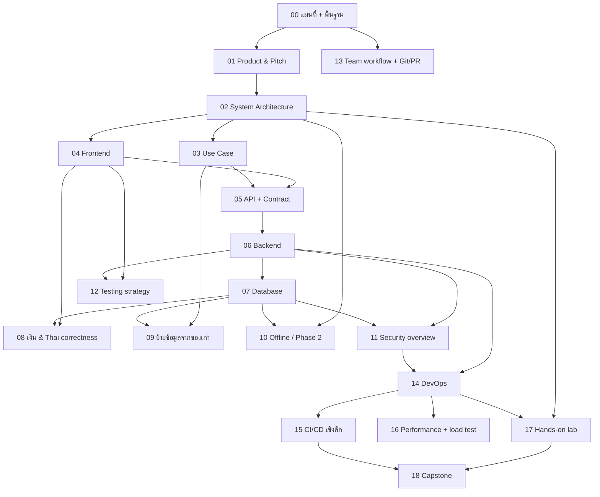

# 00 — แผนที่ + พื้นฐานที่ต้องรู้ก่อนอ่านทั้งชุด

บทนี้ตอบคำถาม: "โปรเจกต์นี้คืออะไร, จะอ่านชุดเอกสารนี้ยังไง, และต้องรู้ concept พื้นฐานอะไรบ้างก่อนไปบทถัดไป"

---

## 🧭 ก่อนอ่าน

- ไม่ต้องมีพื้นฐานอะไรมาก่อน — บทนี้คือจุดเริ่มต้น
- ใช้เวลาอ่านประมาณ **60–90 นาที** (ยาวเพราะเป็นบทปูพื้นสำหรับทั้งชุด)
- อ่านจบแล้วคุณจะ:
  - รู้ว่าโปรเจกต์นี้คือ POS (ระบบขายหน้าร้าน) ของร้านอะไหล่รถยนต์ไทยชื่อ "ศรีสุรัตน์" และมันวิวัฒนาการมายังไง
  - แยกออกว่า branch `main` กับ `POC_sample_offline_first` ต่างกันตรงไหน และทำไมทั้งคู่ยังอยู่
  - อธิบาย client–server, HTTP, JSON, Git, terminal แบบพื้นฐานได้ — พอให้อ่านบทอื่นในชุดนี้รู้เรื่อง
  - รู้ว่าไฟล์ไหนในโฟลเดอร์ repo จริงคืออะไร และควรไปเปิดบทไหนต่อ
  - บอกได้ตรงๆ ว่าโปรเจกต์นี้ "เสร็จ" แค่ไหน ไม่ใช่แค่ท่องสไลด์

---

## 1. ยินดีต้อนรับ: โปรเจกต์นี้คืออะไร

**ศรีสุรัตน์ อะไหล่ยนต์** เป็นร้านขายอะไหล่รถยนต์จริงในไทย ที่ต้องการระบบขายหน้าร้าน (Point of
Sale หรือ **POS** — ระบบคิดเงิน ตัดสต็อก ออกใบเสร็จ) แทนสมุดบัญชีหรือ Excel

โปรเจกต์นี้ผ่านมา 3 ยุคแล้ว เล่าเป็นเส้นเวลาได้แบบนี้:

```
ยุค 1: เว็บหน้าเดียว (single-page)          ยุค 2: แอป Flutter แบบ offline-first        ยุค 3: multi-tenant + server + CI/CD
┌─────────────────────────────┐            ┌──────────────────────────────┐            ┌───────────────────────────────────┐
│ React (รันในเบราว์เซอร์)      │  ย้ายมา     │ Flutter app                   │  ขยายเป็น    │ Flutter client (เหมือนเดิม)          │
│ + localStorage เก็บข้อมูล     │ ─────────► │ + Drift/SQLite เก็บในเครื่อง    │ ─────────► │ + NestJS backend (server จริง)       │
│ (ข้อมูลอยู่ในเบราว์เซอร์เท่านั้น) │            │ (ข้อมูลอยู่ในเครื่องพีซีหน้าร้าน)   │            │ + PostgreSQL + Redis + CI/CD pipeline│
└─────────────────────────────┘            └──────────────────────────────┘            └───────────────────────────────────┘
  "Srisurart Autopart Design            แช่แข็งไว้ที่ branch                            คือ branch `main` ตอนนี้ —
   System" repo (คนละ repo)             POC_sample_offline_first                        "phase 1" (backend) เสร็จแล้ว,
                                                                                          "phase 2" (offline+server ผสมกัน)
                                                                                          กำลังทำอยู่
```

อธิบายแต่ละยุค:

1. **ยุค 1 — JS + localStorage**: ร้านเริ่มจากเว็บเพจเดียวที่เขียนด้วย React รันในเบราว์เซอร์
   ข้อมูลทุกอย่าง (สินค้า ลูกค้า บิลขาย) เก็บใน `localStorage` ของเบราว์เซอร์เครื่องนั้น — ถ้าเปิด
   คนละเครื่อง หรือล้าง cache ข้อมูลหาย โค้ดนี้อยู่คนละ repo ชื่อ "Srisurart Autopart Design
   System" (`github.com/NuimanLP/Sri-SuRat_Store`) ไม่ใช่ repo ที่คุณกำลังอ่านอยู่นี้ แต่เป็น
   "ต้นแบบพฤติกรรม" (behavioural reference) — กติกาการขาย การคืนสินค้า ฯลฯ ถูกก็อปมาจากไฟล์
   `pos/db.js` ของยุคนี้ทุกตัวอักษร (ข้อความภาษาไทยในโปรแกรมต้องตรงเป๊ะ ห้ามแปลใหม่)

2. **ยุค 2 — Flutter offline-first**: เขียนใหม่เป็นแอป Flutter (framework สร้างแอปข้ามแพลตฟอร์ม
   จากบริษัท Google) ที่รันได้ทั้ง Android/iOS/Web ข้อมูลเก็บด้วย **Drift** (ตัวช่วยจัดการฐานข้อมูล
   SQLite ในเครื่อง) ตรง "เครื่องพีซีหน้าร้าน" เอง ไม่ต้องต่อเน็ต ไม่ต้อง login — เรียกว่า
   **offline-first** เพราะออกแบบให้ทำงานได้แม้ไม่มีอินเทอร์เน็ตเป็นค่าเริ่มต้น ยุคนี้ถูก "แช่แข็ง"
   ไว้ที่ branch ชื่อ `POC_sample_offline_first` เป็นข้อมูลอ้างอิงเฉยๆ ห้ามพัฒนาต่อบน branch นี้

3. **ยุค 3 — multi-tenant + server + CI/CD (ตอนนี้)**: ตั้งแต่ 2026-09-04 เป็นต้นมา `main` กลาย
   เป็นสาย "ทำให้ระบบรองรับได้หลายร้าน" (**multi-tenant** — ฐานข้อมูลเดียว รองรับหลายร้านค้าพร้อม
   กัน แยกข้อมูลกันเด็ดขาด) โดยเพิ่ม backend เขียนด้วย **NestJS** (framework ฝั่ง server) คุยกับ
   **PostgreSQL** (ฐานข้อมูลจริง กลายเป็น "แหล่งความจริง" แทน SQLite ในเครื่อง) พร้อมทั้งวาง
   **CI/CD** (ระบบทดสอบ+ส่งโค้ดขึ้น production อัตโนมัติ — อธิบายละเอียดใน 14/15) กติกาการขาย/คืน/
   รับของเข้าที่เคยเขียนไว้ใน Dart (ฝั่ง Flutter) ถูก **ย้าย (port)** ไปเขียนใหม่ฝั่ง server
   ไม่ใช่คิดกติกาใหม่ — เพื่อให้พฤติกรรมเหมือนเดิมทุกตัวอักษร (ข้อความ error ภาษาไทยก็ต้องตรงกัน)

**Phase 1 vs Phase 2** (คำว่า "phase" ในเอกสารนี้ = ช่วงงานใหญ่ ไม่ใช่ sprint):
- **Phase 1** = สร้าง backend multi-tenant + CI/CD ให้เสร็จ (ระบบยังต้อง**เชื่อมเน็ตตลอดเวลา**
  ถึงจะขายของได้ — ยังไม่มี offline)
- **Phase 2** (กำลังทำ) = เอาความสามารถ offline ของยุค 2 กลับมาใส่ในระบบยุค 3 — ใช้กลไกที่เรียกว่า
  **outbox** (คิวเก็บงานที่ยังส่งไม่สำเร็จ รอส่งซ้ำภายหลัง — อธิบายละเอียดในบท 10)

**สำคัญที่สุดที่ต้องจำไว้ตลอดการอ่านชุดนี้**: **ร้านจริงยังใช้ตัวเก่า (offline build, ยุค 2) ขายของ
อยู่ทุกวัน** — ยังไม่มีการ "ตัดสลับ" (cutover) มาใช้ตัวใหม่ ระบบ multi-tenant กำลังพัฒนาคู่ขนานไป
โดยทดสอบกับ "ร้านตัวอย่าง" (demo tenant) เท่านั้น

---

## 2. แผนที่การอ่าน

> 🟢 **สถานะ ณ 2026-09-25** (ตรวจจาก `ls docs/study/` จริง): ชุดเอกสารนี้เขียนครบแล้วทั้ง **19 บท
> (00–18)** ตามลำดับสุดท้ายด้านล่าง ทุกไฟล์ใช้ชื่อไฟล์เลขบทสุดท้ายแล้ว (ไม่มี temp filename เหลืออยู่)

ชุดเอกสารนี้มี 19 บท (00–18) แต่ละบทตอบคำถามคนละมุมของระบบ

| บท | ชื่อ | ตอบคำถามอะไร | เวลาอ่าน | ต้องอ่านมาก่อน | ไฟล์ปัจจุบัน |
|---|---|---|---|---|---|
| **00** | แผนที่ + พื้นฐาน (บทนี้) | โปรเจกต์นี้คืออะไร, ศัพท์พื้นฐานที่ต้องรู้ก่อน | 60–90 นาที | ไม่มี | `00_index.md` |
| **01** | Product & Pitch | เราสร้างอะไร ทำไม เพื่อใคร ต่างจากคนอื่นยังไง | 40–60 นาที | 00 | `01_pitch.md` |
| **02** | System Architecture | ชิ้นส่วนทั้งหมด (Flutter, NestJS, Postgres, Redis, Nginx…) เชื่อมกันยังไง | 90–120 นาที | 00, 01 | `02_architecture.md` |
| **03** | Use Case | ใครใช้ระบบบ้าง (เจ้าของร้าน, พนักงาน, เครื่อง POS, เครื่อง backoffice, platform admin) ทำอะไรได้บ้าง | 40–50 นาที | 00, 02 | `03_use_case.md` |
| **04** | Frontend | แอป Flutter ทำงานยังไง, เทคโนโลยีอะไรบ้าง | 50–70 นาที | 00, 02 | `04_frontend.md` |
| **05** | API design + Contract | ออกแบบ endpoint/DTO/contract ระหว่าง client-server ยังไง ทำไมต้องมี "สัญญา" ที่ผูกมัด | ~2 ชั่วโมง (+1 ชม. ถ้าลอง `curl`) | 00, 02, 04 | `05_api.md` |
| **06** | Backend | server NestJS ทำงานยังไง, tenant/transaction/idempotency คืออะไร | ~2–3 ชั่วโมง | 00, 02 | `06_backend.md` |
| **07** | Database | ทำไมต้องมี database, RLS คืออะไร, ทำไมใช้ Postgres/Drift/Redis/etcd | ~2–3 ชั่วโมง | 00, 02, 06 | `07_database.md` |
| **08** | เงิน & ความถูกต้องแบบไทย | ทำไมเงินส่งเป็น string, ปัดเศษยังไงให้ตรง `db.js`, ปี พ.ศ., Thai string parity | ~35 นาที | 04, 06, 07 | `08_money_thai.md` |
| **09** | ย้ายข้อมูลจากของเก่า | ย้ายข้อมูลจากยุค JS/localStorage เข้า multi-tenant Postgres ยังไง | ~35 นาที | 03, 07 | `09_data_migration.md` |
| **10** | Offline & Phase 2 | จาก offline-first (POC) ไปสู่ outbox/sync ของ phase 2 | ~100–130 นาที | 00, 02, 07 | `10_offline_phase2.md` |
| **11** | Security overview | ภาพรวมความปลอดภัยทั้งระบบ (RLS, JWT, rate limit, secrets) ต่อกันเป็นภาพเดียว | 90–120 นาที (ประมาณ) | 02, 06, 07, 14 | `11_security.md` |
| **12** | Testing strategy | ทดสอบ frontend/backend ยังไง, unit/e2e/contract test ต่างกันตรงไหน | ~75–100 นาที | 00, 04, 06 | `12_testing.md` |
| **13** | Team workflow + Git/PR | ทีมทำงานร่วมกันยังไง, branch/PR/review ผูกกับ CI ตรงไหน | ~70–90 นาที | 00, 02 | `13_team_workflow.md` |
| **14** | DevOps | Docker, Compose, Nginx, Ansible, Prometheus/Grafana, GHCR, Trivy คืออะไรและทำงานยังไง | 50–70 นาที | 00, 02, 06 | `14_devops.md` |
| **15** | CI/CD เชิงลึก | ทุก stage ของ pipeline, ผลลัพธ์จริง, กรณี deploy ติด FortiGate | ~90–120 นาที | 00, 02, 14 | `15_cicd.md` |
| **16** | Performance + load test | วัด throughput/latency/RAM ของ stack ยังไง, k6 คืออะไร | ~70–90 นาที | 00, 02, 06, 14 | `16_performance.md` |
| **17** | Hands-on lab | ลงมือ clone/รัน/ทดสอบทั้งระบบเองบนเครื่องตัวเอง | ~2–3 ชั่วโมง | 00, 02 | `17_lab.md` |
| **18** | Capstone: บทเรียนวิศวกรรม | สรุปบทเรียนวิศวกรรมที่เอาไปใช้กับโปรเจกต์อื่นได้ | 60–90 นาที (+1–2 ชม. ถ้าทำแบบฝึกหัด) | ทุกบทก่อนหน้า | `18_capstone.md` |

### ลำดับการอ่าน (Mermaid)



### สองเส้นทางอ่าน

**เส้นทาง A — อยากรู้ภาพรวมเร็ว (ประมาณ 5 ชั่วโมง)**
`00 → 01 → 02 → 11 → 15 → 18` (อ่านหัวข้อสรุป/status ของแต่ละบทเป็นหลัก ข้าม "🔍 ของจริงใน repo" ที่ลงโค้ดลึก)

**เส้นทาง B — อยากเข้าใจลึกทั้งระบบ (ประมาณ 15–18 ชั่วโมง)**
`00 → 01 → 02 → 03 → 04 → 05 → 06 → 07 → 08 → 09 → 10 → 11 → 12 → 13 → 14 → 15 → 16 → 17 → 18`
อ่านทุกส่วนรวม "🔍 ของจริงใน repo" และ "⚠️ บทเรียนจากของจริง" — เหมาะกับคนที่จะเริ่มแก้โค้ดในนี้จริงๆ

---

## 3. วิธีอ่านเอกสารชุดนี้

แต่ละบทใช้สัญลักษณ์ชุดเดียวกัน:

| สัญลักษณ์ | ความหมาย |
|---|---|
| 🧭 | ก่อนอ่าน — สรุปว่าต้องรู้อะไรมาก่อน ใช้เวลาเท่าไหร่ |
| 🧱 | ปูพื้นฐาน — สอน concept ทั่วไปก่อนพูดถึงโปรเจกต์ |
| 🔥 | ปัญหาจริงของร้าน — โจทย์ที่ทำให้ต้องมีสิ่งนี้ |
| ⚖️ | ทางเลือก → ทำไมเลือกอันนี้ — เทียบ option, trade-off |
| 🔍 | ของจริงใน repo — โค้ด/config จริง พร้อมคำอธิบาย |
| 📚 | Tech stack ของบทนั้น |
| ⚠️ | บทเรียนจากของจริง — bug/เหตุการณ์จริงที่เคยเกิด |
| 🛠️ | เทคนิคในบทนี้ — สรุป pattern/technique ที่บทนั้นใช้จริง พร้อมเหตุผลที่เลือกเทียบกับทางเลือกอื่น |
| ✅ | สรุปท้ายบท |
| ❓ | Quiz ท้ายบท |

**`file:line` คืออะไร**: เวลาบทอื่นเขียนว่า `server/src/sales/sales.dto.ts:63` หมายถึง "เปิดไฟล์
`server/src/sales/sales.dto.ts` แล้วดูที่บรรทัดที่ 63" — เป็นวิธีอ้างอิงโค้ดจริงแบบไม่ต้องก็อปมาแปะ
ทั้งไฟล์ เปิดได้จาก root ของ repo (โฟลเดอร์ที่มีไฟล์ `CLAUDE.md` กับ `README.md` อยู่) ด้วยโปรแกรม
แก้โค้ดอะไรก็ได้ (VS Code, editor อื่นๆ) หรือคำสั่ง `sed -n '63,70p' server/src/sales/sales.dto.ts`
ใน terminal

**`<details>` quiz**: ท้ายแต่ละบทมีคำถามแบบนี้ — คลิกที่คำว่า "เฉลย" เพื่อเปิดดูคำตอบ (ซ่อนไว้ก่อน
เพื่อให้ลองคิดเองก่อน):

<details><summary>เฉลย</summary>

นี่คือตัวอย่างกล่องเฉลยที่จะเจอท้ายทุกบท คำตอบกับเหตุผลจะอยู่ในนี้

</details>

**หัวข้อ 🛠️ เทคนิคในบทนี้ คืออะไร**: ทุกบท (ยกเว้นบทนี้ที่เป็นแผนที่รวม) มีหัวข้อชื่อ "🛠️ เทคนิคในบทนี้"
วางไว้ **หลัง** "🔍 ของจริงใน repo" และ **ก่อน** "📚 Tech stack" เสมอ — เหตุผลที่แยกจาก "🔍 ของจริงใน repo"
คือ "🔍" ตอบว่า "โค้ดตรงนี้ทำอะไร" ส่วน "🛠️" ตอบคำถามที่ลึกกว่านั้นคือ "ชื่อ pattern นี้คืออะไรในศัพท์
วิศวกรรมทั่วไป (ไม่ใช่แค่ในโปรเจกต์นี้), ถ้าไม่ใช้จะพังยังไงเป็นตัวเลข/สถานการณ์จริง, ทำไมเลือกท่านี้แทน
ท่าอื่นอย่างน้อย 1 ท่า, และราคาที่ต้องจ่าย — เพื่อให้ผู้อ่านเอาชื่อ pattern (เช่น "repository pattern",
"idempotency key", "row lock", "RLS", "outbox") ไปคุยกับวิศวกรที่อื่น หรือค้นต่อเองได้ ไม่ใช่รู้แค่
"โค้ดบรรทัดนี้ของร้านศรีสุรัตน์ทำแบบนี้" เฉยๆ ทุกบทปิดท้ายหัวข้อนี้ด้วยตารางสรุป: เทคนิค | แก้ปัญหาอะไร |
ราคาที่จ่าย | file

ตารางข้างล่างนี้คือ "แผนที่ทางลัด" รวมเทคนิคหลักที่ใช้ **ซ้ำมากกว่า 1 บท** ทั่วทั้งโปรเจกต์ — ถ้าจำชื่อ
เทคนิคได้แต่ลืมว่าอยู่บทไหน เปิดตารางนี้ก่อน:

| เทคนิค | แก้ปัญหาอะไร (สรุปสั้น) | อยู่บทไหน |
|---|---|---|
| Repository pattern + Dependency Injection | จอไม่ผูกติดกับ "ข้อมูลมาจากไหน" สลับ Drift ↔ API ได้โดยไม่แก้จอ | 04 Frontend |
| Cubit (state container, flutter_bloc) | รวม state ไว้ที่เดียว ไม่ให้แต่ละจอเห็นข้อมูลไม่ตรงกัน | 04 Frontend |
| Device-role guard (2 ชั้น: user role + device role) | แยกสิทธิ์ "คน" กับ "เครื่อง" — เครื่องหลังร้านสั่งขาย/เปิดกะไม่ได้แม้ login ถูก | 03 Use Case, 05 API+Contract, 06 Backend |
| Idempotency-Key + verdict-based retry (`isVerdict`) | กันขายซ้ำ/เก็บเงินซ้ำเวลาเน็ตหลุดกลางทาง โดยแยก "คำตอบสุดท้าย" (4xx) กับ "ไม่รู้ผล" (5xx/429/timeout) | 04 Frontend, 05 API+Contract, 06 Backend |
| Row lock (`FOR UPDATE`/`FOR SHARE`) | กันสองคำขอพร้อมกันอ่าน/แก้แถวเดียวกันแล้วผลลัพธ์ผิด (เช่นคืนสินค้าเกิน) | 03 Use Case, 06 Backend, 07 Database |
| Row-Level Security (RLS) | ให้ Postgres เองกรองไม่ให้ร้าน A เห็นแถวของร้าน B แม้โค้ด backend มีบั๊ก | 07 Database, 11 Security |
| Outbox pattern | เก็บงานที่ยังส่ง server ไม่สำเร็จไว้ในเครื่อง รอส่งซ้ำเมื่อเน็ตกลับมา (ไม่ทำของฝั่ง POS หาย) | 10 Offline/Phase 2 |
| Reverse proxy + load balancing (`least_conn`) | กระจาย request ไป NestJS 3 ตัว โดยจอ/เครื่องขายไม่ต้องรู้ว่ามีกี่ตัว | 02 Architecture |
| Rate limiting (`limit_req_zone`) | กันสคริปต์ยิงถล่ม endpoint เดียวกินทรัพยากรของทุกร้าน | 02 Architecture, 11 Security, 14 DevOps |
| Cache กับ Queue แยกนโยบาย eviction กันคนละขั้ว | ให้ของที่ "หายได้" (cache) หายได้จริงเพื่อความเร็ว แต่ของที่ "ห้ามหาย" (คิวงาน) ไม่หายแม้ memory เต็ม | 02 Architecture, 07 Database |
| Migration-as-separate-step ก่อน replica ตัวไหนเริ่ม | กัน api หลายตัวแย่งกันเปลี่ยน schema พร้อมกัน (race) | 02 Architecture, 07 Database |
| ADR (Architecture Decision Record) | บันทึกว่า "ตัดสินใจอะไร เพราะอะไร" ไม่ให้ต้องเถียงซ้ำเรื่องเดิม | ใช้ทั่วทั้งชุด — เริ่มอธิบายที่ 02 Architecture |
| Money-as-string บนสาย network | เลี่ยงปัญหาความแม่นยำของ floating point กับเงิน | 00 (บทนี้), 04 Frontend, 08 เงิน & Thai correctness |
| Manual-approval deploy gate (`demo` environment) | กันโค้ดที่เพิ่ง merge หลุดขึ้นเครื่อง production กลางงาน demo โดยไม่มีใครอนุมัติ | 13 Team workflow, 15 CI/CD |

---

## 4. 🧱 พื้นฐานรวมที่ทุกบทใช้

ส่วนนี้ยาวและตั้งใจสอนแบบไม่รีบ เพราะเป็นฐานของทุกบทถัดไป ถ้าคุณรู้เรื่องพวกนี้อยู่แล้วข้ามไปอ่าน
หัวข้อ 5 ได้เลย

### 4.1 คอมพิวเตอร์ + program + process

**Program** (โปรแกรม) คือไฟล์คำสั่งที่เขียนไว้ล่วงหน้า (เช่นไฟล์ `.dart`, `.ts` ที่ถูกแปลงเป็นโค้ด
รันได้) **Process** (โพรเซส) คือตอนที่โปรแกรมนั้น "กำลังรันอยู่จริง" ในหน่วยความจำของเครื่อง —
เหมือนสูตรอาหาร (program) กับตอนที่กำลังทำอาหารจริงในครัว (process) โปรแกรมเดียวรันพร้อมกันหลาย
process ได้ (เปิดแอปเดียวกันสองหน้าต่าง) และเครื่องหนึ่งเครื่องรันได้หลาย process พร้อมกัน (เบราว์
เซอร์, เพลง, แอปแชท — พร้อมกัน)

ในโปรเจกต์นี้: แอป Flutter บนพีซีหน้าร้านคือ process หนึ่ง, server NestJS ที่รันอยู่บน VM (เครื่อง
เซิร์ฟเวอร์) เป็นอีก process หนึ่ง (จริงๆ รันพร้อมกัน 3 ชุด เรียกว่า `api-1/api-2/api-3` — ดูบท 02)
— คนละเครื่อง คนละ process คุยกันผ่านเครือข่าย

### 4.2 Network, IP, port, DNS

- **Network** (เครือข่าย) คือสายไฟ/สัญญาณที่เชื่อมคอมพิวเตอร์หลายเครื่องให้คุยกันได้ อินเทอร์เน็ต
  คือเครือข่ายที่ใหญ่ที่สุด
- **IP address** คือ "ที่อยู่" ของเครื่องหนึ่งบนเครือข่าย เหมือนบ้านเลขที่ เช่น `172.30.58.20` (ที่
  อยู่ของ VM ชื่อ `mob04` ที่ใช้รันระบบนี้จริง — จะเจอในบท 14/15)
- **Port** คือ "ประตูย่อย" ของเครื่องนั้นๆ เครื่องเดียวเปิดได้หลายประตู แต่ละโปรแกรมจับจองประตูของ
  ตัวเอง เช่น server NestJS ในโปรเจกต์นี้ฟังที่ port `3000` เป็นค่าเริ่มต้น (ดู `README.md` หัวข้อ
  Environment) เว็บทั่วไปใช้ port `443` (HTTPS) หรือ `80` (HTTP) — เหมือนตึกเดียวมีหลายห้อง เลขห้อง
  คือ port
- **DNS** (Domain Name System) คือสมุดโทรศัพท์ที่แปลงชื่อที่จำง่าย (เช่น `ghcr.io`) ให้เป็น IP
  address ที่เครื่องจริงเข้าใจ — ไม่ต้องจำตัวเลขยาวๆ

### 4.3 Client–server

**Client** คือฝั่งที่ "ขอ" ข้อมูล/บริการ **Server** คือฝั่งที่ "ให้" ข้อมูล/บริการ — เหมือนลูกค้า
(client) เดินเข้าร้านอาหารสั่งเมนู แล้วครัว (server) ทำอาหารส่งกลับมา ลูกค้าเป็นฝ่ายเริ่มการสนทนา
เสมอ ร้าน (server) ไม่โทรหาลูกค้าเองก่อน

ในโปรเจกต์นี้: แอป Flutter (บนพีซีหน้าร้าน) เป็น **client** ที่ยิงคำขอไปหา server NestJS (บน VM)
ซึ่งเป็น **server** — server คุยกับ PostgreSQL อีกที (ตรงนี้ server กลับกลายเป็น "client" ของ
ฐานข้อมูล — คำว่า client/server เป็นบทบาท ไม่ใช่ประเภทเครื่องตายตัว)

### 4.4 HTTP

**HTTP** (HyperText Transfer Protocol) คือ "ภาษากลาง" ที่ client กับ server คุยกัน คำขอหนึ่งครั้ง
ประกอบด้วย:

- **Method** — "ประเภทคำขอ" ที่ใช้บ่อยคือ
  - `GET` = ขอดูข้อมูล (เหมือนถามพนักงาน "มีของชิ้นนี้ไหม") ไม่เปลี่ยนแปลงอะไรในระบบ
  - `POST` = ขอสร้าง/ทำอะไรบางอย่าง (เหมือนยื่นใบสั่งซื้อ) เช่น "ขายของชิ้นนี้ให้หน่อย"
- **URL** — "ที่อยู่" ของสิ่งที่ขอ เช่น `POST /api/v1/sales` แปลว่า "ขอสร้างการขาย (sale) ใหม่"
  (endpoint จริงของระบบนี้ — ดูรายชื่อทั้งหมดใน `README.md` หัวข้อ Architecture)
- **Status code** — ตัวเลข 3 หลักที่ server ตอบกลับ บอกว่าสำเร็จหรือไม่
  - `2xx` = สำเร็จ (เช่น `201 Created` = สร้างสำเร็จ — ใช้ตอนขายของสำเร็จ)
  - `4xx` = ฝั่ง client ทำผิด (เช่น `400 Bad Request` = ส่งข้อมูลผิดรูปแบบ, `409 Conflict` =
    ขัดแย้งกับสถานะปัจจุบัน เช่น สต็อกไม่พอ)
  - `5xx` = ฝั่ง server มีปัญหา (เช่น `500 Internal Server Error` = server พังเอง ไม่ใช่ความผิด
    client)
  - กติกาสำคัญของโปรเจกต์นี้ (จะเจอในบท 06): "มีแค่ `4xx` เท่านั้นที่ถือเป็นคำตอบที่แน่นอน — ส่วน
    `5xx` หรือคำขอที่หลุดหาย ถือว่ายัง**ไม่รู้ผล**" (`CLAUDE.md` หัวข้อ Idempotency)
- **Header** — ข้อมูลกำกับคำขอ/คำตอบ ที่ไม่ใช่เนื้อหาหลัก เช่น "ฉันคือใคร" (token ยืนยันตัวตน),
  "เนื้อหาเป็นรูปแบบอะไร" (`Content-Type: application/json`)
- **Body** — เนื้อหาจริงของคำขอ/คำตอบ เช่น รายการสินค้าที่จะขาย (ดูตัวอย่าง JSON ด้านล่าง)

### 4.5 JSON

**JSON** (JavaScript Object Notation) คือรูปแบบข้อความมาตรฐานสำหรับส่งข้อมูลมีโครงสร้างระหว่าง
โปรแกรม อ่านง่าย เครื่องก็แปลงกลับเป็นข้อมูลได้ง่าย

ตัวอย่างด้านล่าง**ไม่ใช่โค้ดสมมติ** — ชื่อ field มาจาก interface `CreateSale` จริงในไฟล์
`server/src/sales/sales.dto.ts:16-33` (คำขอ) และ `CreateSaleResult` ใน
`server/src/sales/sales.service.ts:23-53` (คำตอบ) เพียงแต่ตัดบาง field ที่ไม่จำเป็นต่อการเข้าใจออก

คำขอ `POST /api/v1/sales` (ขายของ 1 บิล มีสินค้า 1 ชิ้น) หน้าตาประมาณนี้:

```json
{
  "id": "sale_9f2a...",
  "subtotal": "150.00",
  "discount": "0.00",
  "total": "150.00",
  "paymentMethod": "เงินสด",
  "customerId": null,
  "mechanicId": null,
  "overrideCreditLimit": false,
  "items": [
    {
      "lineNo": 1,
      "productId": "prod_552b...",
      "partNo": "OIL-5W30",
      "name": "Engine oil 5W-30",
      "qty": 2,
      "price": "75.00"
    }
  ]
}
```

คำตอบที่ server ส่งกลับ (ถ้าสำเร็จ, status `201 Created`) หน้าตาประมาณนี้:

```json
{
  "id": "sale_9f2a...",
  "receiptNo": "RC-000123",
  "total": "150.00",
  "pointsGranted": 15,
  "date": "2026-09-25T09:30:00.000Z",
  "shiftId": "shift_1120...",
  "products": [
    { "id": "prod_552b...", "stock": 18 }
  ]
}
```

สังเกต: ตัวเลขเงิน (`total`, `price`) เป็น**สตริง** (`"150.00"`) ไม่ใช่ตัวเลข — เพราะเลขทศนิยมแบบ
ตัวเลขจริงในคอมพิวเตอร์มีปัญหาเรื่องความแม่นยำ (0.1 + 0.2 อาจไม่เท่ากับ 0.3 เป๊ะ) การส่งเป็นสตริง
ตัดปัญหานี้ทิ้งไปเลย (กติกานี้เขียนไว้ตรงๆ ใน `CLAUDE.md`: "Money crosses the wire as the string
`"1234.50"`")

### 4.6 API / REST

**API** (Application Programming Interface) คือ "เมนูอาหาร" ที่ server เปิดให้ client เรียกใช้ —
บอกว่ามีคำสั่งอะไรให้เรียกได้บ้าง (เช่น "ขายของ", "ดูรายชื่อสินค้า") โดยไม่ต้องรู้ว่าข้างในครัวทำ
งานยังไง

**REST** เป็นแนวทาง (ไม่ใช่กฎตายตัว) ในการออกแบบ API โดยใช้ URL แทน "สิ่งของ" (resource) และใช้
HTTP method แทน "การกระทำ" เช่น `GET /products` = ดูรายการสินค้า, `POST /sales` = สร้างการขายใหม่
— รายชื่อ endpoint ทั้งหมดของระบบนี้อยู่ใน `README.md` หัวข้อ Architecture (`auth`, `products`,
`sales`, `returns`, `shifts` ฯลฯ)

### 4.7 HTTPS/TLS แบบเข้าใจง่าย

HTTP ธรรมดาส่งข้อมูลแบบเปิดเผย ใครดักฟังสายก็อ่านได้ **HTTPS** คือ HTTP ที่ห่อด้วยการเข้ารหัสชื่อ
**TLS** (Transport Layer Security) — เหมือนใส่จดหมายในซองที่ล็อกกุญแจ มีแค่ผู้รับที่มีกุญแจถูกต้อง
เท่านั้นที่แกะอ่านได้ ระบบนี้บังคับให้ทุกคำขอเข้า Nginx (ตัวรับคำขอหน้าด่านของ server) ต้องเป็น
HTTPS พอร์ต 443 เท่านั้น (ดูบท 02/14)

### 4.8 Terminal เบื้องต้น

**Terminal** (หรือ command line) คือหน้าต่างพิมพ์คำสั่งข้อความล้วนคุยกับคอมพิวเตอร์โดยตรง แทนการ
คลิกเมาส์ คำสั่งพื้นฐานที่จะเจอในเอกสารชุดนี้:

- `cd <โฟลเดอร์>` — ย้ายเข้าไปในโฟลเดอร์นั้น (cd = change directory) เช่น `cd frontend`
- `ls` — แสดงรายชื่อไฟล์/โฟลเดอร์ในตำแหน่งปัจจุบัน
- คำสั่งรันโปรแกรม เช่น `flutter test` (รันชุดทดสอบฝั่ง Flutter), `pnpm test` (รันชุดทดสอบฝั่ง
  server) — บทหลังๆ จะมีคำสั่งพวกนี้เต็มไปหมด ไม่ต้องกลัวเวลาเห็น เอามาก็อปรันตามได้เลย

### 4.9 Git เบื้องต้น

**Git** คือโปรแกรมบันทึกประวัติการแก้ไขไฟล์ ทำให้ย้อนดูได้ว่าใครแก้อะไรเมื่อไหร่ และแก้พร้อมกันได้
หลายคนโดยไม่ทับกัน

- **Repo (repository)** = โฟลเดอร์โปรเจกต์ทั้งหมดที่ Git ดูแลอยู่ — โฟลเดอร์ที่คุณกำลังอ่านเอกสารนี้
  อยู่คือ repo ชื่อ `srisurart-pos-flutter`
- **Commit** = "จุดบันทึก" หนึ่งจุด บอกว่าไฟล์ไหนเปลี่ยนอะไรไปบ้าง พร้อมข้อความอธิบายสั้นๆ
- **Branch** = "เส้นทางคู่ขนาน" ของงาน แก้ไฟล์ชุดเดียวกันได้หลายเวอร์ชันพร้อมกันโดยไม่ชนกัน จนกว่า
  จะเอามารวม
- **Merge** = เอาการแก้ไขจาก branch หนึ่งไปรวมเข้ากับอีก branch หนึ่ง
- **Remote** = สำเนาของ repo ที่อยู่บนเซิร์ฟเวอร์ (ที่นี่คือ GitHub) ใช้ synchronize กับเครื่องของ
  แต่ละคน
- **Pull Request (PR)** = คำขอ "รวมงานของฉันเข้า branch หลักหน่อย" เปิดให้คนอื่นตรวจสอบ (review)
  ก่อนรวมจริง

ภาพ branch ของ repo นี้เอง (มีแค่ 2 branch ที่อยู่ถาวร — บังคับใช้ตั้งแต่ 2026-09-22 ตาม
`CLAUDE.md`):

```
main                    ──●──●──●──●──●──●──●──►  (สาย multi-tenant + backend + CI/CD, งานใหม่ทั้งหมดมาที่นี่)
                          │
POC_sample_offline_first ●  (แยกออกจาก main ที่ commit 4dae2f0 แล้วแช่แข็งไว้ — ไม่พัฒนาต่อ)
```

PR แต่ละอันจะถูกสร้างเป็น branch ย่อยชั่วคราว แก้เสร็จ ผ่านการตรวจสอบและ CI (ดูบท 15) แล้วค่อย
merge เข้า `main`

### 4.10 GitHub

**GitHub** คือเว็บที่ใช้ฝาก remote ของ Git repo พร้อมเครื่องมือเสริม เช่น ที่เก็บ **issue** (บันทึก
งาน/บั๊กที่ต้องทำ — ในโปรเจกต์นี้อ้างเป็นเลข เช่น `#380`), หน้าจอ Pull Request, และ **GitHub
Actions** (ระบบรันงานอัตโนมัติเมื่อมีการ push/PR — คือเครื่องมือ CI/CD ที่ใช้ในบท 14/15) repo นี้
อยู่ที่ `github.com/NuimanLP/srisurart-pos-flutter`

---

## 5. โครงสร้างโฟลเดอร์ repo แบบย่อ

ตรวจสอบด้วย `ls` จริงในโฟลเดอร์ root ของ repo:

```
frontend/                  แอป Flutter ทั้งหมด → บท 04
server/                    backend NestJS ทั้งหมด → บท 06
deploy/                    สคริปต์/config การ deploy (Ansible, Prometheus, Grafana) → บท 14
docs/                      เอกสารทุกชนิด (รวมโฟลเดอร์ study/ ที่คุณกำลังอ่านอยู่นี้)
  Backend_design/          สเปกผูกพันของ backend + adr/ (บันทึกการตัดสินใจ) → บท 06, 07
  handoff_log/             บันทึกเหตุการณ์จริงรายวัน (บั๊กที่เจอ, การตัดสินใจของเจ้าของโปรเจกต์)
  tutorial/                คู่มือผู้ใช้ภาษาไทย (สำหรับพนักงานร้าน ไม่ใช่โปรแกรมเมอร์)
.github/workflows/         ไฟล์ config ของ GitHub Actions (flutter.yml, server.yml, deploy.yml) → บท 15
CLAUDE.md                  "ความจริงล่าสุด" ของโปรเจกต์ — อ่านก่อนแก้อะไรก็ตาม
CONTRACT.md                สเปกผูกพันของฝั่ง client (ตาราง, repo signature, route, กติกาข้อความไทย)
README.md                  ภาพรวมทั้งระบบ ภาษาอังกฤษ
```

โฟลเดอร์อื่นที่เจอ (`android/`, `ios/` = โปรเจกต์ native ของ Flutter สำหรับ build มือถือ, ไม่ต้อง
แตะในชุดเอกสารนี้) ไม่ได้อยู่ใน scope ของบทไหนโดยตรง

---

## 6. Glossary ใหญ่

ศัพท์ต่อไปนี้ทุกคำ **มีอยู่จริงในโปรเจกต์** (ตรวจแล้วด้วย grep ใน repo จริง) เรียงตามหมวด บทที่ระบุ
คือบทที่จะอธิบายละเอียดกว่านี้

### หมวด Web

| ศัพท์ | ความหมายง่ายๆ | บทที่เจอ |
|---|---|---|
| HTTP | ภาษากลางคุยกันของ client/server | 00 |
| HTTPS/TLS | HTTP แบบเข้ารหัส | 00, 07 |
| REST | แนวทางออกแบบ API ด้วย URL + method | 00, 04 |
| JSON | รูปแบบข้อความส่งข้อมูลมีโครงสร้าง | 00, 03, 04 |
| endpoint | จุดปลายทาง URL หนึ่งจุดของ API เช่น `/api/v1/sales` | 04 |
| CORS | กติกาเบราว์เซอร์ว่าเว็บโดเมนไหนยิง API ข้ามโดเมนได้ (`CORS_ORIGINS` ใน `README.md`) | 04, 07 |
| JWT | Token ยืนยันตัวตนแบบเข้ารหัสลายเซ็น (`JWT_PRIVATE_KEY` ฯลฯ) | 04 |

### หมวด Frontend

| ศัพท์ | ความหมายง่ายๆ | บทที่เจอ |
|---|---|---|
| Flutter | framework สร้างแอป Android/iOS/Web จากโค้ดชุดเดียว | 03 |
| Dart | ภาษาโปรแกรมที่ Flutter ใช้เขียน | 03 |
| widget | ชิ้นส่วน UI ใน Flutter (ปุ่ม, ช่องกรอก, การ์ด) | 03 |
| state management | วิธีจัดการ "ข้อมูลที่เปลี่ยนแปลงบนหน้าจอ" | 03 |
| flutter_bloc / Cubit | ไลบรารีจัดการ state ที่ใช้ในโปรเจกต์นี้ | 03 |
| go_router | ไลบรารีจัดการเส้นทางหน้าจอ (routing) | 03 |
| Drift | ตัวช่วยจัดการฐานข้อมูล SQLite ในเครื่อง Flutter | 03, 05 |
| SQLite | ฐานข้อมูลไฟล์เดียวที่รันอยู่ในเครื่อง ไม่ต้องมี server แยก | 03, 05 |
| offline-first | ออกแบบให้ทำงานได้แม้ไม่มีเน็ตเป็นค่าเริ่มต้น | 00, 06 |
| outbox | คิวเก็บงานที่ยังส่งไปยัง server ไม่สำเร็จ รอส่งซ้ำ | 00, 06 |
| repository (pattern) | ชั้นโค้ดที่รวบรวมวิธีอ่าน/เขียนข้อมูลของ "เรื่องหนึ่ง" (เช่น sales) | 03, 04 |

### หมวด Backend

| ศัพท์ | ความหมายง่ายๆ | บทที่เจอ |
|---|---|---|
| NestJS | framework เขียน server ด้วย TypeScript | 04 |
| tenant | "ร้านหนึ่งร้าน" ในระบบที่รองรับหลายร้าน (multi-tenant) | 00, 04, 05 |
| multi-tenant | สถาปัตยกรรมที่หลายร้าน (tenant) ใช้ระบบเดียวกัน แยกข้อมูลกัน | 00, 04, 05 |
| transaction | กลุ่มการเปลี่ยนแปลงข้อมูลที่ต้อง "สำเร็จทั้งหมดหรือไม่ทำเลย" | 04, 05 |
| runTx | ฟังก์ชันในโค้ดจริง (`TenantService.runTx`) ที่เปิด transaction แบบปลอดภัยต่อ tenant | 04 |
| idempotency | คุณสมบัติ "ยิงคำขอซ้ำแล้วผลลัพธ์ไม่เปลี่ยน" — กันบิลซ้ำตอนเน็ตหลุด | 04 |
| Idempotency-Key | ค่าที่ client แนบมากับคำขอ เพื่อให้ server รู้ว่าคำขอนี้เคยทำไปแล้วหรือยัง | 04 |
| DTO | (Data Transfer Object) รูปร่างข้อมูลที่ตกลงกันไว้ระหว่าง client/server เช่น `CreateSale` | 04 |
| guard | โค้ดที่ดักตรวจคำขอก่อนเข้าถึง endpoint จริง (เช่น `TenantGuard`) | 04 |
| queue / BullMQ | คิวงานที่ทำทีหลัง ไม่บล็อกคำขอหลัก (ใช้ Redis เก็บ) | 04, 05 |
| device token | token เฉพาะของเครื่อง POS หนึ่งเครื่อง (ไม่ใช่ token ของคน) | 04, 06 |
| ADR (Architecture Decision Record) | เอกสารบันทึกการตัดสินใจเชิงสถาปัตยกรรมพร้อมเหตุผล เก็บที่ `docs/Backend_design/adr/` — ชนะเอกสารอื่นเสมอถ้าขัดกัน | 00, 01, 04, 05 |

### หมวด Database

| ศัพท์ | ความหมายง่ายๆ | บทที่เจอ |
|---|---|---|
| PostgreSQL (Postgres) | ระบบฐานข้อมูลเชิงสัมพันธ์ที่เป็น "แหล่งความจริง" ของระบบนี้ | 05 |
| RLS (Row-Level Security) | กติกาฐานข้อมูลที่บังคับกรองแถวข้อมูลตาม tenant อัตโนมัติ | 04, 05 |
| schema | โครงสร้างตาราง/คอลัมน์ของฐานข้อมูล | 05 |
| migration | ไฟล์บันทึกการเปลี่ยนโครงสร้างฐานข้อมูลทีละขั้น (ย้อนดูประวัติได้) | 05 |
| primary key (PK) | คอลัมน์ (หรือชุดคอลัมน์) ที่ระบุแถวหนึ่งแถวได้ไม่ซ้ำ | 05 |
| composite key | primary key ที่ประกอบจากหลายคอลัมน์รวมกัน (เช่น `tenant_id` + `id`) | 05 |
| foreign key (FK) | คอลัมน์ที่ชี้ไปยังแถวของตารางอื่น | 05 |
| Redis | ฐานข้อมูลแบบเก็บในหน่วยความจำ ใช้ทำ cache และ queue | 04, 05 |
| cache | ที่พักข้อมูลที่ดึงมาบ่อยๆ ให้เรียกเร็วขึ้นโดยไม่ต้องถามฐานข้อมูลจริงทุกครั้ง | 05 |
| etcd | ระบบเก็บ config แบบกระจาย ใช้ตั้งค่า runtime ที่เปลี่ยนได้โดยไม่ต้อง deploy ใหม่ | 05, 07 |
| weighted-average cost | วิธีคำนวณต้นทุนเฉลี่ยถ่วงน้ำหนักเมื่อรับสินค้าเข้าสต็อกใหม่ | 05 |

### หมวด DevOps

| ศัพท์ | ความหมายง่ายๆ | บทที่เจอ |
|---|---|---|
| Docker | เครื่องมือ "ห่อ" โปรแกรมพร้อมสภาพแวดล้อมเป็นกล่องเดียว (container) | 07 |
| container | โปรแกรมที่รันอยู่ในกล่อง Docker แยกจากเครื่องจริง | 07 |
| Docker Compose | เครื่องมือสั่งรัน container หลายตัวพร้อมกันด้วยไฟล์ config เดียว | 07 |
| Nginx | โปรแกรม reverse proxy — รับคำขอหน้าด่านแล้วส่งต่อให้ server จริง | 01, 07 |
| reverse proxy | ตัวกลางรับคำขอแทน server จริง (ซ่อน/กระจายโหลด) | 07 |
| Ansible | เครื่องมือสั่งงานอัตโนมัติบนเครื่องเซิร์ฟเวอร์ระยะไกล (เช่น deploy) | 07, 08 |
| VM (Virtual Machine) | "เครื่องเสมือน" หนึ่งเครื่อง — ในที่นี้คือ `mob04` เครื่องเดียวที่รัน production | 01, 07 |
| Prometheus | ระบบเก็บตัวเลขวัดผล (metrics) ตามเวลา | 07 |
| Grafana | เว็บแสดงกราฟจากข้อมูลของ Prometheus | 07 |

### หมวด CI/CD

| ศัพท์ | ความหมายง่ายๆ | บทที่เจอ |
|---|---|---|
| CI (Continuous Integration) | ทดสอบโค้ดอัตโนมัติทุกครั้งที่มีการเปลี่ยนแปลง | 08 |
| CD (Continuous Deployment) | ส่งโค้ดที่ผ่านทดสอบขึ้น production อัตโนมัติ | 08 |
| pipeline | ลำดับขั้นตอนอัตโนมัติตั้งแต่ push โค้ดจนถึง deploy | 08 |
| GitHub Actions | ระบบรัน pipeline ของ GitHub | 08 |
| workflow | ไฟล์ config หนึ่งไฟล์ที่นิยาม pipeline (`flutter.yml`, `server.yml`, `deploy.yml`) | 08 |
| GHCR (GitHub Container Registry) | ที่เก็บ Docker image บน GitHub (`ghcr.io`) | 07, 08 |
| Trivy | เครื่องมือสแกนช่องโหว่ความปลอดภัยของ image/โค้ด | 07, 08 |
| self-hosted runner | เครื่องที่รับงานจาก GitHub Actions มารันเอง (ในที่นี้คือ VM `mob04`) | 08 |
| rollback | การย้อนกลับไป version ก่อนหน้าเมื่อ deploy มีปัญหา | 08 |

---

## 7. สถานะความจริงของโปรเจกต์ตอนนี้

เอกสารชุดนี้ยึดกติกาว่า **บอกตรงๆ ว่าอะไรเสร็จ อะไรยังไม่เสร็จ** — เพราะ `CLAUDE.md` เองก็เขียนแบบ
นี้ ("Recount the DoD boxes before claiming phase 1 is 'done' — this sentence has gone stale
twice") การพูดเกินจริงเรื่องสถานะงานเป็นสาเหตุที่ทำให้เอกสารในโปรเจกต์นี้เคยผิดมาแล้วซ้ำๆ

**สิ่งที่เสร็จแล้วจริง** (ตรวจจาก `CLAUDE.md`/`README.md`):
- Frontend: ทั้ง 13 หน้าจอ, data layer, unit test ผ่านหมด, `dart analyze` สะอาด
- Backend phase 1: tenancy + transaction/idempotency seam, ทุก lane (A/B/C) ของ phase-1 merge แล้ว
- CI/CD ระดับ 1–3: Flutter CI, backend CI, GHCR release image + Trivy gating — ทำงานทุกครั้งที่ push
- Definition-of-Done ของ phase 1 นับใหม่ล่าสุด 2026-09-22: **17 ข้อ ผ่านแล้ว 16 ข้อ เหลือ 1 ข้อ**

**สิ่งที่ยังไม่เสร็จ** (พูดตรงๆ ไม่ปิดบัง):
- 🔴 **k6 load test (#380)** — ยังไม่มีการวัดผลจริงเลยสักตัวเลข แม้ "วิธีการวัด" จะตัดสินใจแล้ว
- 🔴 **Deploy ไป VM `mob04` ยังไม่เคยสำเร็จจริงสักครั้ง** — ติดที่ไฟร์วอลล์ของมหาวิทยาลัย
  (FortiGate) สอด SSL ทำให้ VM ดึง Docker image จาก `ghcr.io` ไม่ได้ (certificate ไม่มี SAN ที่
  ถูกต้อง) เป็นปัญหาเรื่อง**เครือข่าย** ไม่ใช่บั๊กในโค้ด — ต้องรอทีมเครือข่ายเปิดทางให้
- 🔴 **Self-hosted runner ยังไม่ได้ติดตั้งจริงบน VM** — แม้ issue จะถูกปิดไปแล้ว (`gh api` ยืนยันว่า
  runner = 0 ตัว) — CLAUDE.md เตือนไว้ตรงๆ ว่าอย่าอ่าน "issue ปิดแล้ว" เป็น "งานเสร็จแล้ว"
- 🔴 **Backup ออกนอก VM (offsite backup) ถูก parked (พักไว้)** จนกว่าจะ deploy demo เสร็จก่อน —
  ระหว่างนี้ถ้าดิสก์ของ VM พัง ข้อมูลร้านตัวอย่างหายหมด ยอมรับความเสี่ยงนี้ไว้อย่างรู้ตัว ไม่ใช่มอง
  ข้าม
- 🔴 **บั๊กที่ยังเปิดอยู่**: migration `OwnerReviewItems.ts` มี 2 บั๊กจริง (RLS cast พลาด NULLIF,
  foreign key ทำให้ tenant_id ถูก null ผิดที่) และ `/sync/push` ของ phase 2 มีบั๊ก HIGH 2 ตัวที่ยัง
  ไม่มี issue เปิดด้วยซ้ำ — รายละเอียดอยู่ใน `CLAUDE.md` หัวข้อ "Still open"

**ทำไมการบอกตรงๆ แบบนี้เป็นนิสัยวิศวกรที่ดี**: ถ้าเอกสารบอกว่า "deploy อัตโนมัติทำงานแล้ว" ทั้งที่
ยังไม่เคยสำเร็จจริง คนที่มาอ่านทีหลัง (รวมถึงตัวคุณเองอีก 3 เดือนข้างหน้า) จะเชื่อผิด แล้ววางแผนงาน
บนความเชื่อผิดนั้น — เสียเวลาสองต่อ (ทั้งตอนพบว่าโดนหลอก และตอนแก้ผลกระทบที่ตามมา) `CLAUDE.md` ของ
โปรเจกต์นี้ผ่านบทเรียนแบบนี้มาแล้วหลายครั้ง (เช่น "A green `Deploy (demo)` run is not evidence
that anything was deployed") — engineer ที่ดีแยกระหว่าง "ทำเสร็จแล้ว วัดผลแล้ว" กับ "ตั้งใจจะทำ
ยังไม่ได้วัด" อยู่เสมอ และเขียนมันแยกกันชัดเจน

---

## ✅ สรุป

- โปรเจกต์นี้คือ POS ร้านอะไหล่รถยนต์ไทย "ศรีสุรัตน์" ผ่านมา 3 ยุค: JS+localStorage → Flutter
  offline-first → multi-tenant client+server+CI/CD
- `main` คือสายงานปัจจุบัน (multi-tenant); `POC_sample_offline_first` คือภาพนิ่งของยุค offline-first
  แช่แข็งไว้อ้างอิง ห้ามพัฒนาต่อ
- ร้านจริงยังใช้ตัวเก่า (offline) ขายของทุกวัน — ยังไม่มีการตัดสลับมาใช้ตัวใหม่
- ชุดเอกสารนี้มี 19 บท (00–18) เขียนเสร็จครบแล้วทุกบท (ตรวจจาก `ls docs/study/` 2026-09-25) อ่านตามลำดับ
  dependency ใน flowchart ด้านบน มี 2 เส้นทาง (เร็ว/ลึก) — ดูคอลัมน์ "ไฟล์ปัจจุบัน" ในตารางข้างบน
- พื้นฐานที่ต้องรู้ก่อนอ่านต่อ: process, network/IP/port, client–server, HTTP (method/status/
  header/body), JSON, API/REST, HTTPS/TLS, terminal, Git (repo/commit/branch/merge/remote/PR),
  GitHub
- Glossary รวม 6 หมวด ครอบคลุมศัพท์ที่จะเจอตลอดทั้งชุด — ทุกคำตรวจแล้วว่ามีอยู่จริงในโค้ด/เอกสาร
- Phase 1 (backend multi-tenant) เกือบเสร็จ (16/17 DoD) แต่ deploy จริงยังไม่เคยสำเร็จ — เพราะ
  ปัญหาเครือข่าย ไม่ใช่โค้ด — และมีบั๊ก/งานค้างหลายจุดที่ยังไม่ปิด บอกตรงๆ ไว้ในหัวข้อ 7

---

## ❓ Quiz

**1. ทำไม repo นี้ถึงมี branch `POC_sample_offline_first` ค้างอยู่ ทั้งที่ `main` พัฒนาต่อไปไกล
แล้ว? ถ้าลบทิ้งจะเกิดปัญหาอะไร?**

<details><summary>เฉลย</summary>

`POC_sample_offline_first` คือภาพนิ่งของระบบที่ร้านจริงใช้งานอยู่ทุกวัน (offline-first, ยังไม่มี
server) เก็บไว้เพื่อพิสูจน์กติกา "ร้านยังต้องใช้ตัว Drift ได้ ไม่มีการตัดสลับ" (phase-1 rule)
ถ้าลบทิ้งจะไม่มีจุดอ้างอิงว่าระบบที่ร้านใช้จริงตอนนี้หน้าตาเป็นยังไง และ phase 2 (ที่เอา offline
กลับมาใส่ในระบบใหม่) ก็อ้างอิงจุดเริ่มต้นจาก branch นี้ด้วย

</details>

**2. คำขอ `POST /api/v1/sales` กับ `GET /api/v1/products` ต่างกันยังไงในแง่ "ผลข้างเคียง" ต่อระบบ?**

<details><summary>เฉลย</summary>

`GET` ใช้เพื่อ "อ่าน" ข้อมูลอย่างเดียว ไม่ควรเปลี่ยนแปลงอะไรในระบบ (เรียกกี่ครั้งก็ได้ผลเหมือนเดิม)
ส่วน `POST /sales` คือการ "สร้าง" การขายใหม่ — มีผลข้างเคียงจริง (ตัดสต็อก, ออกเลขที่ใบเสร็จ) ถ้า
เรียกซ้ำโดยไม่มีการป้องกัน (idempotency) จะขายซ้ำโดยไม่ตั้งใจ — นี่คือเหตุผลที่ระบบนี้บังคับใช้
`Idempotency-Key` กับคำขอที่มีผลข้างเคียง

</details>

**3. ทำไมตัวเลขเงินในตัวอย่าง JSON ของบท 00 ถึงเป็นสตริง `"150.00"` ไม่ใช่ตัวเลข `150.00`?**

<details><summary>เฉลย</summary>

เพราะเลขทศนิยมแบบตัวเลขจริงในคอมพิวเตอร์ (floating point) มีปัญหาความแม่นยำ — การบวก/ลบซ้ำๆ อาจ
คลาดเคลื่อนทีละนิด ซึ่งอันตรายมากกับเงิน ส่งเป็นสตริงตัดปัญหานี้ทิ้งไปตั้งแต่ต้นทาง เป็นกติกาที่
`CLAUDE.md` ระบุไว้ตรงๆ

</details>

**4. ถ้า status code ที่ server ตอบกลับคือ `500` ฝั่ง client ควรทำอะไรกับคำขอที่เพิ่งส่งไป (เช่น
ขายของ) — ลองส่งซ้ำได้เลยไหม?**

<details><summary>เฉลย</summary>

ไม่ควรถือว่า `500` คือ "คำตอบที่แน่นอน" — มันแปลว่า server มีปัญหาเอง ไม่รู้ว่าคำขอไปถึงและถูก
ประมวลผลไปแล้วหรือยัง (ต่างจาก `4xx` ที่ถือว่าเป็นคำตอบแน่นอนแล้ว) กติกาของระบบนี้คือ "ถือว่าผลลัพธ์
ยังไม่รู้" และต้องอาศัย `Idempotency-Key` เดิมตอนลองใหม่ ไม่ใช่สร้างคำขอใหม่ทั้งหมด (รายละเอียดเต็ม
อยู่บท 06)

</details>

**5. โปรเจกต์นี้ "เสร็จแล้ว" หรือยัง? ตอบให้ตรงกับสิ่งที่เอกสารนี้บอกไว้ในหัวข้อ 7**

<details><summary>เฉลย</summary>

ไม่ใช่คำตอบใช่/ไม่ใช่เดียว — ต้องแยกส่วน: backend phase 1 เกือบเสร็จ (16/17 DoD) แต่ยังไม่เคย deploy
ไป production จริงสักครั้ง (ติดปัญหาเครือข่าย FortiGate ไม่ใช่โค้ด) มี load test ที่ยังไม่วัดผล
(#380), backup offsite ที่ parked ไว้, และบั๊กหลายจุดที่ยังเปิดอยู่ (migration RLS/FK, `/sync/push`
fingerprint) — การตอบว่า "เสร็จแล้ว" เฉยๆ ถือว่าผิดกติกาความซื่อสัตย์ของเอกสารชุดนี้

</details>

---

## ➡️ อ่านต่อ

บทถัดไป: [`01_pitch.md`](01_pitch.md) — โปรเจกต์นี้คืออะไร แก้ปัญหาอะไร ก่อนลงรายละเอียดว่าชิ้นส่วน
ทั้งหมด (Flutter, NestJS, PostgreSQL, Redis ×2, Nginx, etcd) เชื่อมกันเป็นระบบเดียวได้ยังไง

อยากเจาะลึกกว่านี้ระหว่างทาง: `docs/Backend_design/00_INDEX.md` (จุดเริ่มของสเปก backend ทั้งหมด)
และ `docs/Backend_design/adr/README.md` (บันทึกการตัดสินใจที่ผูกพัน — ชนะเอกสารอื่นเสมอถ้าขัดกัน)
