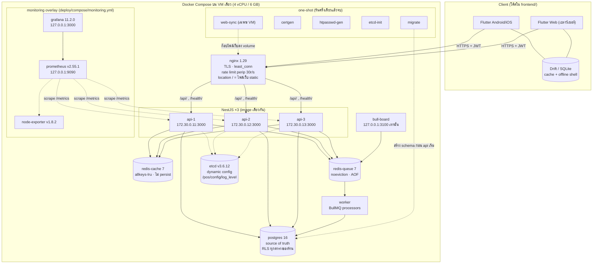
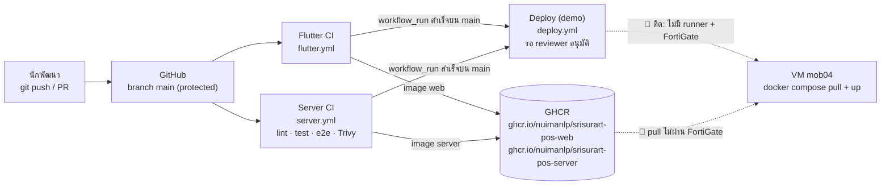
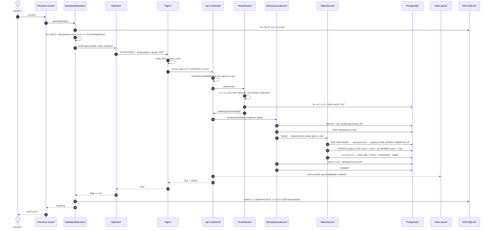

# 01 — System Architecture Overview: ทุกชิ้นส่วนเชื่อมกันยังไง

> บทนี้ตอบคำถามเดียว: **"ตอนแคชเชียร์กดปุ่มขาย 1 ครั้ง มีกล่องอะไรบ้างที่ทำงาน แต่ละกล่องมีไว้ทำไม และถ้าเอากล่องไหนออกจะพังยังไง"**

---

## 🧭 ก่อนอ่าน

- **ต้องอ่านก่อน:** [00_index.md](00_index.md) — พื้นฐาน client/server, HTTP, JSON, terminal, Git และ glossary
- **เวลาที่ใช้:** ~90–120 นาที (ส่วนปูพื้นฐานใช้เวลาครึ่งหนึ่ง ไม่ต้องรีบ)
- **อ่านจบแล้วคุณจะ…**
  - อธิบายได้ว่าทำไมโปรแกรมเดียวบนเครื่องเดียว "พอ" สำหรับร้านเดียว แต่ "ไม่พอ" สำหรับหลายร้าน
  - วาดภาพใหญ่ของระบบนี้ได้เอง: Flutter → Nginx → NestJS ×3 → PostgreSQL / Redis ×2 / etcd / worker
  - ตามรอย "บิล 1 ใบ" จากปุ่มบนจอจนถึงแถวในฐานข้อมูลและกลับมา โดยชี้ไฟล์จริงได้ทุกขั้น
  - ตอบได้ว่าถ้าถอดกล่องใดกล่องหนึ่งออก ระบบจะเสียอะไร
  - เข้าใจว่า "งบหน่วยความจำ" และ "งบ connection" เป็นข้อจำกัดทางวิศวกรรมที่บังคับการออกแบบ

---

## 🧱 ปูพื้นฐาน

ส่วนนี้ยังไม่พูดถึงโปรเจกต์ — สอน concept ทั่วไปก่อน ทุกหัวข้อจะจบด้วย "แล้วมันแก้ปัญหาอะไร"

### 1. จุดเริ่ม: โปรแกรมเดียว บนเครื่องเดียว

ลองนึกถึงโปรแกรมแรกที่คุณเขียน — เก็บตัวแปรในหน่วยความจำ อ่านไฟล์ เขียนไฟล์ ทุกอย่างอยู่ในเครื่องเดียว

```
┌──────────────── คอมเครื่องเดียว ────────────────┐
│  หน้าจอ (UI)  ←→  logic (if/loop)  ←→  ไฟล์ข้อมูล  │
└──────────────────────────────────────────────────┘
```

สำหรับ **ร้านเดียว เครื่องเดียว** แบบนี้ดีมาก: เร็ว (ไม่มี network), ไม่มีค่า server, เน็ตล่มก็ยังขายได้

แต่ลองเพิ่มโจทย์ทีละข้อ:

| โจทย์ใหม่ | ปัญหาที่เกิด |
|---|---|
| ร้านมี 2 เครื่อง (หน้าร้าน + หลังร้าน) | ข้อมูลอยู่ในเครื่องใครเครื่องมัน สต็อก 2 เครื่องไม่ตรงกัน |
| เครื่องพัง/ฮาร์ดดิสก์เสีย | ข้อมูลทั้งร้านหายไปพร้อมเครื่อง |
| อยากขายระบบให้ **หลายร้าน** | ต้องไปติดตั้ง/อัปเดตทีละร้าน และร้าน A ต้องมองไม่เห็นข้อมูลร้าน B |
| เจ้าของอยากดูยอดจากบ้าน | ข้อมูลอยู่ในเครื่องที่ร้าน เข้าไม่ถึง |

ทุกปัญหามีรากเดียวกัน: **ข้อมูลอยู่ผิดที่** — มันอยู่กับเครื่องที่ใช้งาน แทนที่จะอยู่ในที่ที่ทุกคนเข้าถึงได้และดูแลได้

### 2. แยก client / server — เพราะข้อมูลต้องมี "บ้าน" ที่เดียว

> **Analogy — ร้านอาหาร:** ลูกค้า (client) ไม่เดินเข้าครัวไปหยิบของเอง ลูกค้า **สั่ง** ผ่านพนักงาน ครัว (server) เป็นที่เดียวที่มีวัตถุดิบและเป็นคนตัดสินว่า "ของหมดแล้ว" ถ้าลูกค้า 10 โต๊ะเข้าครัวเองพร้อมกัน วัตถุดิบจะนับไม่ถูกทันที

- **client** (ฝั่งผู้ใช้) — โปรแกรมที่คนกดใช้: ในโปรเจกต์นี้คือแอป Flutter บนมือถือ/เว็บ
- **server** (ฝั่งให้บริการ) — โปรแกรมที่รันอยู่บนเครื่องกลาง รอรับคำขอ และเป็นคน **ตัดสิน** ว่าอะไรถูก

สิ่งที่ได้: ข้อมูลอยู่ที่เดียว → ทุกเครื่องเห็นตรงกัน → backup ที่เดียว → อัปเดตโค้ดที่เดียว
ราคาที่จ่าย: ต้องมี **network** และถ้า network ล่ม client ทำอะไรไม่ได้ (เรื่องนี้จะกลับมาเป็นประเด็นใหญ่ใน "ทางเลือก A/B/C")

### 3. Network แบบย่อที่สุด (ตัวเต็มอยู่ใน [00_index.md](00_index.md))

- **IP address** (ที่อยู่ของเครื่องบน network) — เหมือนเลขที่บ้าน เช่น `172.30.0.11`
- **port** (ช่องประตูของโปรแกรมบนเครื่องนั้น) — บ้านหลังเดียวมีหลายประตู แต่ละโปรแกรมฟังประตูของตัวเอง เช่น `:3000`, `:5432`
- **HTTP request/response** (คำขอ/คำตอบ) — client ส่ง "method + path + header + body" ไป เช่น `POST /api/v1/sales` แล้ว server ตอบ "status code + body" เช่น `201 Created`
- **JSON** (รูปแบบข้อความสำหรับส่งข้อมูล) — `{"total": "1234.50", "items": [...]}`
- **HTTPS / TLS** (HTTP ที่เข้ารหัส) — คนดักกลางทางอ่านไม่ออก

### 4. Monolith vs Microservice

- **monolith** (โปรแกรมก้อนเดียว) — ทุกฟีเจอร์ (ขาย, สต็อก, รายงาน) อยู่ในโปรแกรมเดียว deploy ทีเดียว
- **modular monolith** — ยังเป็นก้อนเดียว แต่ข้างในแบ่ง **module** ชัดเจน (โฟลเดอร์ `sales/`, `products/`, `shifts/`…)
- **microservice** (แยกเป็นหลายโปรแกรมเล็ก) — แต่ละฟีเจอร์เป็น server ของตัวเอง คุยกันผ่าน network

| | Monolith (modular) | Microservice |
|---|---|---|
| transaction ข้ามฟีเจอร์ (ตัดสต็อก + ออกใบเสร็จ + บวกแต้ม ในทีเดียว) | ง่าย — DB เดียว transaction เดียว | ยาก — ต้องประสานข้าม service (saga) |
| deploy | ก้อนเดียว | หลายก้อน หลาย pipeline |
| เหมาะกับทีม | เล็ก (เช่น 3 คน) | ใหญ่ หลายทีม |

เพราะ "ขาย 1 บิล" ต้องแตะ 5+ ตารางพร้อมกันแบบ **ทั้งหมดหรือไม่มีเลย** → modular monolith จึงเหมาะกว่า → ราคาที่จ่ายคือ scale ทีละฟีเจอร์ไม่ได้ (ต้อง scale ทั้งก้อน) ซึ่งสำหรับร้านอะไหล่ไม่ใช่ปัญหา

> ⚠️ ระวังสับสน: ระบบนี้มี **api-1, api-2, api-3** — นั่น **ไม่ใช่** microservice มันคือ monolith ก้อนเดียวกัน **copy 3 ตัว** (โค้ดเหมือนกันเป๊ะ) เพื่อรับโหลดและกันตัวใดตัวหนึ่งตาย

### 5. Layer (ชั้น) คืออะไร

**layer** = การแบ่งโค้ดเป็นชั้น ให้แต่ละชั้นคุยกับชั้นติดกันเท่านั้น

> **Analogy — ไปรษณีย์:** คนเขียนจดหมาย (presentation) ไม่ต้องรู้ว่ารถขนส่งวิ่งเส้นไหน (data) เขาแค่หย่อนตู้ (repository) — ถ้าวันหนึ่งไปรษณีย์เปลี่ยนจากรถเป็นเครื่องบิน คนเขียนจดหมายไม่ต้องเปลี่ยนอะไร

ในฝั่ง Flutter ของโปรเจกต์นี้แบ่งเป็น `data → domain → presentation` (ดู CLAUDE.md) และจุดที่คุ้มที่สุดคือ **repository** — หน้าจอเรียก `saveSale(...)` โดยไม่รู้ว่าข้างหลังเขียนลง SQLite ในเครื่อง หรือยิง HTTP ไป server ส่วนนี้คือสิ่งที่ทำให้สลับจาก offline-first ไปใช้ server ได้โดยไม่รื้อหน้าจอ (จะเห็นของจริงใน "ตามรอย 1 บิล")

### 6. Stateless — server ที่ "ไม่จำ" ใคร

**stateless** (ไร้สถานะ) = server ไม่เก็บอะไรเกี่ยวกับผู้ใช้ไว้ในหน่วยความจำของตัวเองระหว่าง request

> **Analogy:** พนักงานธนาคารที่ไม่จำหน้าลูกค้า แต่ลูกค้าต้องยื่นบัตรประชาชนทุกครั้ง → จะไปช่องไหนก็ได้ พนักงานคนไหนก็บริการได้

ในระบบนี้ "บัตรประชาชน" คือ **JWT** (JSON Web Token — ตั๋วที่ server เซ็นลายเซ็นดิจิทัลไว้ ข้างในบอกว่าเป็นใคร ร้านไหน เครื่องไหน) client แนบมากับทุก request ใน header `Authorization: Bearer …`

ทำไมสำคัญ: เพราะ server stateless → request ไหนไปตก api-1, api-2 หรือ api-3 ก็ได้ผลเหมือนกัน → **จึง** วาง load balancer หน้า 3 ตัวได้ → ราคาที่จ่าย: ยกเลิก token กลางคันยาก (ต้องรอหมดอายุ — **ADR** ย่อจาก Architecture Decision Record คือเอกสารบันทึกการตัดสินใจเชิงสถาปัตยกรรมพร้อมเหตุผล เก็บไว้ที่ `docs/Backend_design/adr/`; ADR-0009 เรื่องอายุ token)

### 7. Load balancer และ Reverse proxy

- **reverse proxy** (ตัวรับหน้าประตูแทน server) — client คุยกับมันตัวเดียว มันส่งต่อให้ server ข้างหลัง client ไม่รู้ว่าข้างหลังมีกี่ตัว
- **load balancer** (ตัวกระจายงาน) — reverse proxy ที่เลือกว่าจะส่งแต่ละ request ไปตัวไหน

> **Analogy:** พนักงานต้อนรับหน้าร้านอาหาร ลูกค้าไม่ต้องรู้ว่ามีเชฟกี่คน พนักงานดูว่าเชฟคนไหนมือว่างที่สุดแล้วส่งออเดอร์ให้

งานที่มักรวมไว้ที่ reverse proxy ตัวเดียว: เข้ารหัส **TLS**, **rate limit** (จำกัดจำนวน request ต่อวินาที กันคนยิงถล่ม), เสิร์ฟไฟล์ static (HTML/JS ของเว็บ), บล็อก path ที่ห้ามคนนอกเข้า

### 8. Cache — "โน้ตแปะ" ที่ลบทิ้งได้เสมอ

**cache** (ที่เก็บสำเนาชั่วคราวเพื่อความเร็ว) — เก็บคำตอบที่ถามบ่อยไว้ในหน่วยความจำ ครั้งหน้าตอบได้โดยไม่ต้องไปถาม database

> **Analogy — ห้องสมุด:** บรรณารักษ์จดเลขชั้นหนังสือยอดนิยมไว้ในโพสต์อิทข้างโต๊ะ ถ้าโพสต์อิทหาย ก็แค่เดินไปเปิดแคตตาล็อกใหม่ — ช้าลง แต่ **ไม่มีอะไรเสียหาย**

กฎทองของ cache: **ของใน cache ต้องหายได้โดยไม่มีอะไรเสีย** ถ้าหายแล้วเสียข้อมูล มันไม่ใช่ cache แล้ว

### 9. Queue — "ตะกร้างานค้าง" ที่ห้ามหาย

**queue** (คิวงาน) — ใส่งานที่ไม่ต้องทำทันทีไว้ แล้วให้โปรแกรมอีกตัว (**worker**) หยิบไปทำทีหลัง

> **Analogy:** ร้านอาหารรับออเดอร์ "ส่งใบกำกับภาษีทางอีเมล" — แคชเชียร์ไม่ต้องยืนรอส่งอีเมลให้เสร็จ ลูกค้ารับของกลับบ้านได้ทันที ใบงานไปรอในตะกร้า

ต่างจาก cache ตรงที่ **งานในคิวห้ามหาย** — ตะกร้าใบงานหาย = งานที่สัญญาไว้ไม่เกิดขึ้น

### 10. Source of truth — ใครคือ "ตัวจริง"

**source of truth** (แหล่งข้อมูลตัวจริง) = ถ้าสองที่บอกไม่ตรงกัน ให้เชื่อที่นี่

ระบบที่มีหลายที่เก็บข้อมูล (DB, cache, สำเนาในมือถือ) ต้องประกาศให้ชัดว่า **ที่ไหนคือตัวจริง** ที่เหลือเป็นสำเนา ถ้าไม่ประกาศ → วันที่สองที่ขัดกัน จะไม่มีใครตอบได้ว่าเงินในลิ้นชักควรเป็นเท่าไร

คำถามนี้คือแกนของทั้งบท — ดูใน "ทางเลือก A/B/C" ด้านล่าง

---

## 🔥 ปัญหาจริงของร้าน

### ขั้นที่ 1: เว็บแอป JS + localStorage

ร้านศรีสุรัตน์อะไหล่ยนต์เริ่มจากแอป React รันในเบราว์เซอร์ เก็บข้อมูลใน **localStorage** (ที่เก็บข้อมูลเล็กๆ ในเบราว์เซอร์ ผูกกับเครื่อง+เบราว์เซอร์นั้น) พฤติกรรมทั้งหมดอยู่ในไฟล์ `pos/db.js` ของ repo เดิม (tag `v1.0-js-localstorage` ใน repo "Srisurart Autopart Design System" — ตาม CLAUDE.md)

ข้อดี: ไม่มี server เลย เปิดเบราว์เซอร์ก็ขายได้
ข้อจำกัด: ข้อมูลผูกกับเบราว์เซอร์เดียว, ไม่มี transaction จริง (JS ต้องทำ snapshot/rollback เอง)

### ขั้นที่ 2: Flutter offline-first (Drift/SQLite)

ย้ายมา Flutter เพื่อให้ได้ Android/iOS + Web จากโค้ดชุดเดียว และเปลี่ยนที่เก็บเป็น **Drift** (library ที่ห่อ **SQLite** — ฐานข้อมูลแบบไฟล์ที่อยู่ในเครื่อง) ได้ **transaction** จริง (ทำหลายอย่าง "ทั้งหมดหรือไม่มีเลย" — จบด้วยการ **commit** คือยืนยันบันทึกการเปลี่ยนแปลงทั้งหมดจริง หรือ **rollback** คือยกเลิกกลับให้เหมือนไม่เคยทำอะไรเลย — คนละความหมายกับ "commit" ของ Git ในบท 00 ที่แปลว่า "จุดบันทึกประวัติไฟล์") แทน snapshot/rollback ของ JS

แอปนี้ **offline-first** = ฐานข้อมูลในเครื่องคือตัวจริง ขายได้แม้เน็ตล่ม — และ **ร้านยังรัน build นี้อยู่ทุกวันจนถึงตอนนี้** (CLAUDE.md: "the shop still runs the Drift build") สำเนาของ build นี้ถูกแช่ไว้ใน branch `POC_sample_offline_first`

### ขั้นที่ 3: ทำไมต้องมี server

แรงผลักมาจาก 4 ทาง:

1. **หลายร้าน (multi-tenant)** — โจทย์เปลี่ยนเป็น SaaS ขายให้ร้านอะไหล่หลายร้านที่ **คนละเจ้าของกัน** (ยืนยัน 2026-09-03 ใน `03_ARCHITECTURE.md §5`) → ข้อมูลต้องอยู่ที่กลาง และต้องแยกกันเด็ดขาด
2. **อาจารย์กำหนด stack** — โจทย์วิชากำหนด **NestJS + PostgreSQL + Redis + BullMQ + Nginx** (บันทึกไว้ใน ADR-0012 ตาราง "เสี่ยงคะแนนคอร์ส" และย่อหน้าแรกของ `03_ARCHITECTURE.md`)
3. **backup** — ข้อมูลที่อยู่ในเครื่องเดียวพังพร้อมเครื่อง (แต่ขอบอกตรงๆ: backup ฝั่ง server เองก็ **ยังไม่ออกจาก VM** — ดู "บทเรียนจากของจริง")
4. **หลายเครื่อง** — ร้านมีเครื่องขาย (`pos`) และเครื่องหลังร้าน (`backoffice`) ที่ต้องเห็นสต็อกเดียวกัน (ADR-0004)

> 🔑 จุดที่ต้องจำ: การมี server **ไม่ได้แปลว่าร้านย้ายไปใช้แล้ว** เฟส 1 คือ "ไม่ cutover" — server พัฒนาบน **tenant สาธิต** ส่วนร้านจริงยังใช้ Drift build (`03_ARCHITECTURE.md §7`)

---

## ⚖️ ทางเลือก → ทำไมเลือกอันนี้

### คำถามแกน: "สต็อกตัวจริงอยู่ที่ server หรือที่เครื่อง?"

`03_ARCHITECTURE.md §1` บีบทุกอย่างเหลือคำถามเดียวนี้ แล้วให้คำตอบเลือกสถาปัตยกรรมเอง

| | **A. Online-first** | **B. Offline-first + sync** | **C. Hybrid** |
|---|---|---|---|
| source of truth | PostgreSQL ที่ server | SQLite ในแต่ละเครื่อง | PostgreSQL ที่ server |
| เน็ตล่มขายได้ไหม | ❌ ไม่ได้ | ✅ ได้ทุกอย่าง | ✅ ได้แบบจำกัด |
| สต็อกแม่นไหม | 🟢 แม่นเสมอ (lock ใน DB) | 🔴 อาจขายเกิน ต้องตามแก้ | 🟢 แม่น |
| ความซับซ้อน | 🟢 ต่ำ | 🔴 สูง (sync engine, conflict) | 🟡 กลาง |
| ตรงโจทย์อาจารย์ | ✅ ตรงเป๊ะ | 🟡 sync ไม่อยู่ในคอร์ส | ✅ path หลักตรง |
| ทำเป็นเฟสได้ไหม | – | ❌ ต้องคิดครบตั้งแต่แรก | ✅ A ก่อน เติมทีหลัง |

(ย่อจาก `03_ARCHITECTURE.md §6`)

**ตัดสิน: เลือก C และ "เฟส 1 ของ C = A เป๊ะๆ"** (`03_ARCHITECTURE.md §7`)

- เพราะเฟส 1 = A → ส่งงานอาจารย์ได้ตรงทุกข้อโดยไม่ต้องรอ sync engine
- เพราะเป็น C → ไม่ทิ้งความสามารถ "ขายตอนเน็ตล่ม" ที่ร้านมีอยู่แล้ว มันกลับมาใน **เฟส 2** (outbox + sync — ดู [06_offline_phase2.md](06_offline_phase2.md))
- ราคาที่จ่าย: ต้องรื้อ repository ฝั่ง Flutter ให้เรียก API และในเฟส 2 ต้องดูแล 2 code path (ออนไลน์/ออฟไลน์)

### Multi-tenant: แยกข้อมูลแต่ละร้านยังไง

**tenant** (ผู้เช่า) = ร้าน 1 ร้านในระบบที่ให้บริการหลายร้าน

| | **T1. Shared schema + RLS** | **T2. Schema ต่อร้าน** | **T3. Database ต่อร้าน** |
|---|---|---|---|
| วิธีแยก | ทุกตารางมีคอลัมน์ `tenant_id` + ให้ DB กรองแถวเอง | ร้านละ schema | ร้านละ DB |
| ต้นทุน/ร้าน | ต่ำมาก | กลาง | สูง |
| migration | รันครั้งเดียวจบทุกร้าน | วนทุก schema | วนทุก DB |
| ความเสี่ยงรั่ว | 🔴 สูงสุด ถ้าไม่มี RLS | 🟡 | 🟢 ต่ำสุด |

(ย่อจาก `03_ARCHITECTURE.md §5`)

**ตัดสิน: T1** — เพราะเป็น SaaS ร้านเล็กจำนวนมาก ต้นทุนต่อร้านต้องต่ำ → **จึง** ต้องจ่าย "ค่าความปลอดภัย" ให้ครบ: `tenant_id` มาจาก JWT เท่านั้น, เปิด **RLS** (Row-Level Security — ให้ PostgreSQL ซ่อนแถวที่ไม่ใช่ของร้านตัวเองโดยอัตโนมัติ) แบบ FORCE ทุกตาราง, key ใน Redis ขึ้นต้น `t:{tid}:` เสมอ และมี test ที่พยายามอ่านข้ามร้านต้องได้ 0 แถว → ราคาที่จ่าย: ความผิดพลาดครั้งเดียวทำข้อมูลรั่วข้ามร้านได้ จึงต้องมี "ตาข่ายชั้นสุดท้าย" คือ RLS

### ทางเลือกที่ถูกปฏิเสธ: CouchDB (ADR-0012)

วันที่ 2026-09-08 มีข้อเสนอให้เปลี่ยน database ตัวจริงเป็น **CouchDB** (DB ที่ sync ลงเครื่องได้ในตัว) — **ถูกปฏิเสธวันเดียวกัน** เหตุผลหลักจาก ADR-0012:
- เสีย transaction ข้ามหลายตาราง / `SELECT FOR UPDATE` / FK / RLS — บิลหลายบรรทัดต้องเขียน saga เอง
- ไม่มี PouchDB สำหรับ Flutter และตัวเลือกที่มีไม่รองรับ Web ซึ่งร้านใช้
- เสี่ยงคะแนนคอร์ส เพราะโจทย์กำหนด PostgreSQL
- ความสามารถ "sync ตอนเน็ตล่ม" มีที่อยู่แล้วในแผน = เฟส 2

บทเรียนเชิงวิธีคิด: ADR ถูก **เก็บไว้แม้ถูกปฏิเสธ** เพื่อที่ถ้าหัวข้อนี้โผล่มาอีก จะไม่ต้องวิเคราะห์ใหม่ทั้งรอบ

---

## 🔍 ของจริงใน repo

### 1. ภาพใหญ่ — ทุกกล่องใน stack

ข้อเท็จจริงทั้งหมดในภาพนี้มาจาก `server/docker-compose.yml`, `server/docker/nginx/nginx.conf`, `deploy/compose/monitoring.yml`, `deploy/compose/vm.override.yml` และ `deploy/web.Dockerfile`



อ่านภาพนี้ทีละชั้น:

1. **Client** — แอป Flutter ตัวเดียว build ออกได้ทั้งมือถือและเว็บ ในเครื่องมี Drift/SQLite เป็น cache (และเป็นตัวจริงใน build ที่ร้านใช้อยู่)
2. **Nginx** — ประตูเดียวที่เปิดสู่โลกภายนอก (port 80/443) ทำ TLS, กระจายงาน, rate limit และเสิร์ฟไฟล์เว็บ Flutter เอง (ไม่ต้องมี web server แยก)
3. **api-1..3** — NestJS ก้อนเดียวกัน 3 ตัว แต่ละตัวมี IP ตายตัว (Nginx ชี้ตาม IP ไม่ใช่ตามชื่อ — เหตุผลอยู่ในคอมเมนต์ nginx.conf บรรทัด 28–32)
4. **ที่เก็บข้อมูล** — Postgres = ตัวจริง, Redis 2 ตัวที่ตั้งค่า **ตรงข้ามกัน** (ตัวหนึ่งลบได้ อีกตัวห้ามลบ), etcd = config ที่เปลี่ยนได้ตอนรัน
5. **งานเบื้องหลัง** — worker หยิบงานจาก redis-queue, bull-board เป็นหน้าเว็บดูคิว (เข้าได้เฉพาะ loopback ผ่าน SSH tunnel)
6. **one-shot** — คอนเทนเนอร์ที่รันครั้งเดียวตอนเริ่ม stack แล้วจบ: `migrate` สร้าง/อัปเดต schema, `certgen` ทำ TLS cert แบบ self-signed, `htpasswd-gen` ทำรหัสผ่านให้ endpoint ของ k6, `etcd-init` เปิด auth ของ etcd, `web-sync` (มีเฉพาะใน `vm.override.yml`) ก๊อปไฟล์เว็บจาก image `srisurart-pos-web` ลง volume ที่ Nginx เสิร์ฟ
7. **monitoring** — overlay แยกไฟล์ ไม่ได้รันใน dev/CI; Prometheus ดึงตัวเลขจาก `/metrics` ของ api และ node-exporter แล้ว Grafana วาดกราฟ

> 📝 **เรื่องจริงที่ต้องรู้:** คอมเมนต์ของ `bull-board` ใน `server/docker-compose.yml:178-179` บอกว่า "No Redis connection yet — it registers no queue until #34" แต่โค้ดปัจจุบัน `server/src/bull-board.ts:62` สร้าง `Queue` ครบทุกตัวใน `ALL_QUEUES` แล้ว — **คอมเมนต์ล้าสมัยกว่าโค้ด** เชื่อโค้ดเสมอ

### 2. Nginx — ประตูหน้า

`server/docker/nginx/nginx.conf:24-39`

```nginx
  # Coarse per-IP limit (floods, pre-auth). Per-tenant limiting is a NestJS guard (#33).
  limit_req_zone $binary_remote_addr zone=perip:10m rate=30r/s;
  limit_req_status 429;

  # Passive health only (free Nginx): an upstream is ejected after max_fails
  # connection-level failures within fail_timeout. Docker HEALTHCHECK has no
  # effect here. Static IPs (docker-compose.yml) keep DNS out of the failover
  # path: a recreated container keeps its address, and a stopped one fails
  # fast instead of resolving to nothing.
  upstream api {
    least_conn;
    server 172.30.0.11:3000 max_fails=2 fail_timeout=10s;
    server 172.30.0.12:3000 max_fails=2 fail_timeout=10s;
    server 172.30.0.13:3000 max_fails=2 fail_timeout=10s;
    keepalive 32;
  }
```

- **ทำอะไร:** `limit_req_zone … rate=30r/s` = แต่ละ IP ยิงได้ 30 request/วินาที เกินได้ 429 (Too Many Requests) · `upstream api` = รายชื่อ api 3 ตัว · `least_conn` = ส่ง request ใหม่ไปตัวที่ถือ connection ค้างน้อยที่สุด
- **ทำไมท่านี้:** `least_conn` แทน round-robin เพราะ request ขายช้ากว่า request อ่านมาก (ต้องรอ lock) ตัวที่ติดงานหนักจะไม่ถูกยัดเพิ่ม · rate limit ที่ Nginx เป็นแค่ "หยาบ ต่อ IP" เพราะ **Nginx อ่าน JWT ไม่ได้** จึงไม่รู้ว่า request เป็นของร้านไหน — การจำกัดต่อร้านทำใน NestJS guard + Redis (ADR-0006)
- **ถ้าไม่ทำ:** ไม่มี rate limit → สคริปต์ยิงถล่มตัวเดียวกิน connection ของทุกร้าน · ไม่มี `max_fails` → Nginx ส่งงานไปหา api ที่ตายแล้วซ้ำๆ

`server/docker/nginx/nginx.conf:59-64` — กฎ "retry" ที่สำคัญมากกับการขาย

```nginx
    # Fail over only on connection-level failures. Never on http_5xx: the app
    # answers 503 from /health/ready on purpose during an outage, and counting
    # that as a failure would eject every instance at once. Nginx never retries
    # a non-idempotent request (POST) once it has been sent.
    proxy_next_upstream error timeout;
    proxy_next_upstream_tries 3;
```

- ถ้าต่อ api ตัวแรก **ไม่ติด** Nginx ลองตัวถัดไปได้ (ปลอดภัย เพราะ request ยังไม่ถึงใครเลย)
- แต่ถ้า POST **ส่งไปแล้ว** Nginx จะไม่ส่งซ้ำ — เพราะไม่รู้ว่าตัวแรกตัดสต็อกไปแล้วหรือยัง การส่งซ้ำอาจ "ขายซ้ำ" → การกันขายซ้ำจึงเป็นหน้าที่ของ **Idempotency-Key** ที่ client ส่งมา (ดูตามรอยบิลด้านล่าง)

`server/docker/nginx/nginx.conf:97-100` และ `175-178` — แยก API กับไฟล์เว็บ

```nginx
    location /api/ {
      limit_req zone=perip burst=60 nodelay;
      proxy_pass http://api;
    }
    ...
    location / {
      root /usr/share/nginx/html;
      try_files $uri $uri/ /index.html;
    }
```

- `/api/…` → ส่งต่อให้ NestJS พร้อม rate limit
- ทุก path อื่น → ไฟล์เว็บ Flutter จาก disk; `try_files … /index.html` ทำให้ URL อย่าง `/sales` (route ของแอป ไม่ใช่ไฟล์) ได้ `index.html` แล้วให้ Flutter router จัดการเอง
- ไฟล์เว็บ **ไม่ rate limit** เพราะการเปิดแอปครั้งแรกดึงไฟล์ static เป็นชุดใหญ่พร้อมกัน จะชน `perip` ทันที (คอมเมนต์บรรทัด 169–174)
- เว็บกับ API อยู่ **origin เดียวกัน** → ไม่ต้องตั้ง CORS สำหรับการใช้งานปกติ

### 3. Redis 2 ตัวที่ตั้งค่าตรงข้ามกัน

`server/docker-compose.yml:212-228` (redis-cache) กับ `238-254` (redis-queue) — ตัดมาเฉพาะส่วนที่ต่างกัน

```yaml
  # Cache: evict freely, nothing here is authoritative.
  redis-cache:
    ...
      - --maxmemory-policy
      - allkeys-lru
      - --save
      - ""
      - --appendonly
      - "no"

  # Queue: never evict (a dropped job is a lost sale), persist with AOF.
  redis-queue:
    ...
      - --maxmemory-policy
      - noeviction
      - --appendonly
      - "yes"
      - --appendfsync
      - everysec
```

นี่คือกฎทองจาก "ปูพื้นฐาน" ข้อ 8 และ 9 กลายเป็น config จริง:

| | redis-cache | redis-queue |
|---|---|---|
| memory เต็มแล้วทำไง | `allkeys-lru` — ลบ key ที่ไม่ได้ใช้นานสุดทิ้ง | `noeviction` — **ปฏิเสธการเขียน** ดีกว่าแอบลบงาน |
| เขียนลง disk | ไม่ (`--save ""`, `appendonly no`) | ใช่ AOF (append-only file) flush ทุกวินาที |
| ถ้าหายหมด | ช้าลงชั่วคราว ไม่มีอะไรเสีย | งานที่ค้างหาย |

ทำไมไม่ใช้ Redis ตัวเดียว: เพราะ policy ของ memory ตั้งได้ **ค่าเดียวต่อ instance** ถ้ารวมกัน ต้องเลือกระหว่าง "cache ใช้ memory เต็มแล้วเขียนไม่ได้" กับ "คิวงานโดนลบ" → แยกสองตัว → ราคาคือ memory เพิ่มอีก 256 MB

### 4. `migrate` — schema ต้องเปลี่ยนครั้งเดียว ก่อนทุกคน

`server/docker-compose.yml:123-133`

```yaml
  # Schema comes only from migrations (#15), applied once here as the table owner
  # before any api/worker starts — never on boot, where three instances would race.
  migrate:
    image: srisurart-pos/server:local
    command: ["node", "dist/db/migrate.js", "up"]
    restart: "no"
    mem_limit: 128m
    depends_on:
      postgres: { condition: service_healthy }
    environment:
      DATABASE_URL: postgres://postgres:${POSTGRES_PASSWORD:?POSTGRES_PASSWORD is required}@postgres:5432/pos
```

- **migration** (สคริปต์เปลี่ยนโครงสร้างตาราง ที่มีลำดับเวอร์ชัน) รันใน container แยก
- ทำไมไม่ให้ api รันเองตอนเปิด: มี api **3 ตัว** เปิดพร้อมกัน → แย่งกันเปลี่ยน schema (race) → จึงรันครั้งเดียวก่อน และ api ทุกตัวมี `depends_on: migrate: service_completed_successfully` (บรรทัด 60–61)
- สังเกต: `migrate` ต่อด้วย user `postgres` (เจ้าของตาราง) ส่วน api ต่อด้วย `pos_app` (บรรทัด 19) ซึ่ง **ไม่ใช่เจ้าของตาราง** — สำคัญมาก เพราะ RLS ไม่บังคับกับเจ้าของตาราง (เว้นแต่ FORCE) การใช้ user คนละตัวคือชั้นป้องกันอีกชั้น

### 5. เส้นทางโค้ด: dev → GitHub → CI → GHCR → VM

รายละเอียดทุก stage อยู่ใน [07_devops.md](07_devops.md) และ [08_cicd.md](08_cicd.md) ตรงนี้แค่ภาพรวม:



พูดตรงๆ ว่าสถานะจริง (ตาม CLAUDE.md ณ 2026-09-23):
- CI (level 1–3) **ทำงานแล้ว**: build, test, สแกนช่องโหว่ด้วย Trivy, push image ขึ้น GHCR
- **CD ไป `mob04` ยังไม่เกิดจริง** — firewall FortiGate ของคณะทำ SSL deep inspection บน HTTPS ขาออกของ VM และตอบแทน `ghcr.io` ด้วย certificate ของตัวเองที่ไม่มี SAN → `docker compose pull` ล้มด้วย `x509: certificate is not valid for any names` ทางแก้จริงมีทางเดียวคือทีม network ยกเว้น `ghcr.io` ให้ VM
- self-hosted runner (#67) ยัง **ไม่ได้ติดตั้ง** (0 runners) แม้ issue จะถูกปิดไปแล้ว
- job `deploy` ต้องรอผู้อนุมัติ (`NuimanLP`) ก่อนแตะ VM — และ run ที่ "เขียว" ไม่ได้แปลว่า deploy แล้ว ข้อพิสูจน์เดียวคือไฟล์ `/opt/pos/.current_sha` บน VM

---

### 6. 🧾 ตามรอย 1 บิล — ตั้งแต่กดปุ่มจนถึงแถวใน Postgres

นี่คือหัวใจของบท ทุกขั้นตรวจกับโค้ดจริงแล้ว

**สมมติ:** แคชเชียร์ที่เครื่อง `pos` กด "ยืนยัน" บิลน้ำมันเครื่อง 2 ขวด แอปถูก build ด้วย `--dart-define=USE_API_WRITES=true`



ต่อไปคือของจริงทีละขั้น

#### ขั้น 1–2: Flutter เลือก repository ตาม flag

`frontend/lib/presentation/repositories/repository_providers.dart:112-121`

```dart
  final salesRepository = useApi
      ? ApiSalesRepository(
          api: client,
          db: db,
          drift: driftSales,
          syncService: realSyncService,
          syncFacade: syncFacade,
          docNumberService: docNumberService,
        )
      : driftSales;
```

- **ทำอะไร:** ถ้า `useApi` (มาจาก `const bool.fromEnvironment('USE_API_WRITES')` บรรทัด 58) เป็นจริง ใช้ตัวที่ยิง server ไม่งั้นใช้ตัวที่เขียน Drift ตรงๆ
- **เชื่อมกับอะไร:** หน้าจอขายเรียกแค่ `saveSale(...)` ของ interface เดียวกัน ไม่รู้ว่าได้ตัวไหน — นี่คือประโยชน์ของ **layer** ที่พูดไว้ในปูพื้นฐานข้อ 5
- **ถ้าไม่ทำท่านี้:** ต้องแก้ทุกหน้าจอเมื่อเปลี่ยนจาก offline-first มาใช้ server

#### ขั้น 3–5: repository ไม่คำนวณเอง แค่ส่ง แล้วลอกคำตอบ

`frontend/lib/data/repositories/api/api_sales_repository.dart:3-10` — คอมเมนต์หัวไฟล์อธิบายปรัชญาทั้งหมด

```dart
// The whole point of this class is what it does NOT do. `SalesRepository.saveSale`
// is a Drift transaction that pre-checks stock, decrements it, grants points and
// moves the customer/mechanic ledgers. Every one of those is now the server's job
// (`server/src/sales/sales.service.ts`), so calling the Drift service after a `201`
// would decrement the stock a second time, and pre-checking stock locally would
// refuse a bill the server would have taken — local stock is a cache, and a cache
// that vetoes the truth is worse than a stale one. So: send, then copy the
// server's answer into the local rows. ADR-0010 §3.
```

นี่คือ "source of truth" ในทางปฏิบัติ: เมื่อ server เป็นตัวจริง client ห้ามตัดสินแทน — สต็อกในเครื่องเป็นแค่ **cache** ถ้า cache บอก "หมด" แต่ server บอก "มี" ต้องเชื่อ server

`frontend/lib/data/repositories/api/api_sales_repository.dart:133-147`

```dart
      final Map<String, dynamic> res;
      try {
        res = await _post(body, attempt.headers);
      } on ApiException catch (e) {
        // Closed ONLY if this is a verdict: a 409 for insufficient stock or a
        // credit limit is an answer, and the next press is a NEW bill that must
        // not replay this one's id. A 5xx (nginx's own 504 included) or a 429 is
        // NOT an answer — the bill may be committed — so the attempt stays
        // parked for the retry. See [isVerdict].
        _pending.closeIfVerdict(attempt, e);
        // The cache said open, the server says closed: same words as the pre-check.
        if (e.code == 'NO_OPEN_SHIFT') {
          throw PosException(e.code, noOpenShiftForSale, e.details);
        }
        rethrow;
```

- `attempt` มาจาก `_pending.of(_cartKey(input))` (บรรทัด 118) — **bill id และ `Idempotency-Key` ถูกสร้างครั้งเดียวต่อตะกร้า** ไม่ใช่ต่อการกด
- **ทำไม:** เน็ตร้านไม่เสถียร กรณีที่เจอบ่อยคือ "server บันทึกบิลแล้ว แต่คำตอบหายระหว่างทาง" ถ้ากดซ้ำแล้วสร้าง key ใหม่ server จะคิดว่าเป็นบิลใหม่ → ลูกค้าโดนคิดเงินสองรอบ สต็อกหายสองเท่า (คอมเมนต์บรรทัด 179–189 อธิบายไว้ละเอียด)
- **verdict** (คำตัดสิน) = คำตอบ 4xx เช่น 409 สต็อกไม่พอ → server ตอบชัดแล้วว่า "ไม่รับ" จึงปิด attempt ได้ ส่วน 5xx/429/timeout = **ไม่รู้ชะตากรรม** ต้องเก็บ id+key เดิมไว้ retry
- ส่วน `catch (_)` ถัดไป (บรรทัด 148–164) คือเส้นทางเฟส 2: เมื่อ network ล้มแบบไม่มีคำตัดสิน จะเก็บบิลลง outbox ด้วย id+key เดิม — รายละเอียดอยู่ใน [06_offline_phase2.md](06_offline_phase2.md)

`frontend/lib/core/network/api_client.dart:36-45` — ทำไมรอ write ได้นานถึง 40 วินาที

```dart
  /// How long every other method — the money/stock writes — waits before
  /// failing (#183).
  ///
  /// Above nginx's own worst case (`server/docker/nginx/nginx.conf`):
  /// `proxy_next_upstream error timeout` retries a failed 2 s connect, so a
  /// slow API answers through nginx after about 2 + 2 + 30 s. At 40 s the
  /// proxy's own 504 normally ends the wait first, and this only fires when the
  /// link to nginx is what hung. Waiting that long for a write is deliberate —
  /// a real answer is worth more to the counter than an early "fate unknown".
  static const Duration defaultWriteTimeout = Duration(seconds: 40);
```

ตัวอย่างที่ดีของ "กล่องสองกล่องต้องรู้จักกัน": timeout ฝั่ง client ถูกคำนวณจาก timeout ของ Nginx (`proxy_connect_timeout 2s`, `proxy_read_timeout 30s`) ถ้าตั้ง client สั้นกว่า Nginx → client ยอมแพ้ทั้งที่ server อาจกำลังจะตอบสำเร็จ

#### ขั้น 6–9: Nginx → api ตัวหนึ่ง → middleware

Nginx ส่งต่อตาม `location /api/` (ดูข้างบน) ไปยัง api ตัวใดตัวหนึ่ง เมื่อถึง NestJS:
- global prefix คือ `api/v1` (`server/src/app.setup.ts:120`) — controller ประกาศแค่ `@Controller('sales')` แต่ URL จริงคือ `/api/v1/sales`
- **middleware** (โค้ดที่แทรกทำงานก่อนถึง handler จริงของทุก route) `TenantScopeMiddleware` ถูกผูกกับทุก route (`server/src/app.module.ts:70`) เปิด "request scope" (ที่พักตัวแปรของ request นี้ ใช้ร่วมกันได้ตลอดทาง) ว่างๆ ไว้ — **ยังไม่มีร้าน ยังไม่แตะ DB**

#### ขั้น 10–13: TenantGuard — "ใครตัดสิน"

`server/src/sales/sales.controller.ts:38-40` — controller ทั้งตัวถูกเฝ้าด้วย guard

```ts
@Controller('sales')
@UseGuards(TenantGuard)
export class SalesController {
```

**guard** (ด่านตรวจ) = โค้ดที่รันก่อน handler และตัดสินว่า request นี้ผ่านได้ไหม

`server/src/common/guards/tenant.guard.ts:124-137`

```ts
    if (status !== 'active') {
      throw new HttpException(
        { code: 'TENANT_SUSPENDED', message: 'ร้านนี้ถูกระงับการใช้งาน' },
        HttpStatus.FORBIDDEN,
      );
    }

    // 7. Only now name the tenant on the request scope (ADR-0003 — this guard is the ONE
    //    component allowed to). `TenantService.runTx` reads it from there and does the
    //    `set_config`; doing this after the status check means a suspended tenant is never
    //    named, so no transaction can ever be opened for it.
    setRequestTenant(payload.tid);

    return true;
  }
```

ก่อนถึงบรรทัดนี้ guard ทำ (ดูบรรทัด 40–122 ในไฟล์เดียวกัน): ดึง token จาก `Authorization: Bearer`, ตรวจลายเซ็น (`JwtVerifier` ใช้ `RS256` — `server/src/auth/jwt-keys.service.ts:102`), เช็ค `aud === 'tenant'`, เช็คว่า route ที่ต้องการ `pos` ได้ token ที่ `drole === 'pos'` จริง, แล้วอ่านสถานะร้านจาก **redis-cache** (key `t:{tid}:status`) — ถ้าไม่มีใน cache ค่อยอ่านจากตาราง `tenants`

- **ทำไม tenant มาจาก token เท่านั้น:** ถ้ารับ `tenantId` จาก body ใครก็ส่ง id ร้านอื่นมาได้
- **ทำไมตั้งหลังเช็คสถานะ:** ร้านที่ถูกระงับจะไม่ถูก "ตั้งชื่อ" บน scope เลย → เปิด transaction ให้ร้านนั้นไม่ได้โดยโครงสร้าง
- **ถ้า redis-cache ล่ม:** `try/catch` รอบ `redisCache.get` (บรรทัด 93–98) ทำให้ตกไปอ่าน Postgres แทน — ช้าลงแต่ไม่พัง ตรงกับกฎ "cache ต้องหายได้"

#### ขั้น 14–15: handler เปิด transaction — "ใครลงมือ"

`server/src/sales/sales.controller.ts:53-75`

```ts
  @Post()
  @RequireDeviceRole('pos')
  create(
    @Body() body: unknown,
    @Req() req: AuthenticatedRequest,
    @Res({ passthrough: true }) res: Response,
  ): Promise<CreateSaleResult> {
    return this.idempotency.runIdempotent(
      idempotencyParamsOf(req, 201),
      res,
      () => {
        // A `pos` token always carries `did` — the guard refuses this route otherwise —
        // but the receipt number depends on it, so it is checked rather than asserted.
        if (!req.user.deviceId) {
          throw new DeviceRoleForbiddenException();
        }
        return this.sales.create(parseCreateSale(body), {
          userId: req.user.userId,
          deviceId: req.user.deviceId,
        });
      },
    );
  }
```

- `@RequireDeviceRole('pos')` — เฉพาะเครื่องขายเท่านั้นที่ขายได้ (ADR-0004: ลิ้นชักเงินมีใบเดียว)
- `idempotencyParamsOf(req, 201)` อ่าน header `Idempotency-Key` และทำ fingerprint ของ request — `server/src/idempotency/idempotency.runner.ts:40`:
  ```ts
      endpoint: `${req.method} ${req.baseUrl}${req.path}`,
  ```
  ใช้ **path จริง** (เช่น `/api/v1/sales/abc/void`) ไม่ใช่ pattern (`/sales/:id/void`) — ไม่งั้น key เดียวกันบนสองบิลต่างกันจะชนกัน (คอมเมนต์บรรทัด 34–39)
- `parseCreateSale(body)` = ตรวจรูปแบบข้อมูลก่อนใช้ (body เป็น `unknown` จนกว่าจะผ่านตรงนี้)

`server/src/idempotency/idempotency.service.ts:143-149`

```ts
  runIdempotent<T>(
    params: IdempotencyParams,
    res: Response,
    work: () => T | Promise<T>,
  ): Promise<T> {
    return this.tenants.runTx(() => this.runIdempotentIn(params, res, work));
  }
```

และ `runIdempotentIn` (บรรทัด 157–188) ทำตามลำดับ: **claim** key → ถ้า key เคยใช้กับ request อื่น = 409 `IDEMPOTENCY_KEY_REUSED` → ถ้าเคยสำเร็จแล้ว = **replay** คำตอบเดิม (ไม่ตัดสต็อกซ้ำ) → ไม่งั้นรัน `work()` แล้วบันทึกคำตอบ — **ทั้งหมดใน transaction เดียว** เพื่อให้ "บันทึกว่าทำแล้ว" กับ "งานที่ทำ" commit พร้อมกันหรือไม่ commit เลย

#### ขั้น 15 (ต่อ): `runTx` — ตั้งชื่อร้านให้ Postgres

`server/src/common/database/tenant.service.ts:71-97`

```ts
  async runTx<T>(fn: (manager: EntityManager) => Promise<T>): Promise<T> {
    const tenantId = authorisedTenantId();
    const open = currentTransaction();
    if (open) return fn(open);

    const qr = this.ds.createQueryRunner();
    let value: T;
    let hooks: ReturnType<typeof takePostCommitHooks> = [];
    try {
      await qr.connect();
      const startedAt = commitClockStart();
      await qr.startTransaction();
      value = await runInTransaction(
        { tenantId, manager: qr.manager },
        async () => {
          await qr.query(`SELECT set_config('app.tenant_id', $1, true)`, [
            tenantId,
          ]);
          const result = await fn(qr.manager);
          hooks = takePostCommitHooks();
          return result;
        },
      );
      // #213: never commit a transaction older than the ceiling — its `now()` stamps could
      // land behind a client's rewound cursor. Throwing here rolls it back below.
      assertWithinCommitCeiling(startedAt, this.commitCeilingMs);
      await qr.commitTransaction();
```

อธิบายทีละส่วน:
- `authorisedTenantId()` — อ่านร้านจาก request scope ที่ guard ตั้งไว้ **ไม่รับเป็นพารามิเตอร์** (ถ้ารับ ใครก็ส่ง uuid ร้านอื่นเข้ามาได้ — ดูคอมเมนต์บรรทัด 39–42)
- `if (open) return fn(open)` — ถ้ามี transaction เปิดอยู่แล้วใน scope นี้ ให้ **join** ตัวเดิม ไม่เอา connection ที่สอง (เหตุผลอยู่ในบทเรียน #162 ด้านล่าง) · `SalesService.create` เรียก `runTx` อีกรอบก็จะ join อันที่ `runIdempotent` เปิดไว้
- `set_config('app.tenant_id', $1, true)` — บอก Postgres ว่า "transaction นี้เป็นของร้านนี้" (`true` = มีผลแค่ใน transaction นี้) — นี่คือค่าที่ RLS policy อ่าน
- `assertWithinCommitCeiling` — transaction ที่นานเกิน 25 วินาทีถูก rollback แทน commit (#213)
- ท้ายฟังก์ชัน (บรรทัด 108–111) รัน **post-commit hooks** หลัง commit แล้วเท่านั้น

#### RLS — ตาข่ายชั้นสุดท้ายใน Postgres

`server/src/db/migrations/1788652800001-RowLevelSecurity.ts:56-64`

```ts
  async up(q: QueryRunner): Promise<void> {
    for (const t of TENANT_SCOPED_TABLES) {
      await q.query(`ALTER TABLE ${t} ENABLE ROW LEVEL SECURITY`);
      await q.query(`ALTER TABLE ${t} FORCE ROW LEVEL SECURITY`);
      await q.query(`
        CREATE POLICY tenant_isolation ON ${t}
          USING      (tenant_id = NULLIF(current_setting('app.tenant_id', true), '')::uuid)
          WITH CHECK (tenant_id = NULLIF(current_setting('app.tenant_id', true), '')::uuid)`);
    }
```

- ทุกตารางของร้านได้ policy: "เห็น/เขียนได้เฉพาะแถวที่ `tenant_id` ตรงกับ `app.tenant_id`"
- ถ้าลืม `set_config` → `current_setting` ได้ค่าว่าง → `NULLIF` แปลงเป็น NULL → เงื่อนไขเป็น NULL → **ได้ 0 แถว** (fail-closed) ไม่ใช่เห็นทุกร้าน
- ดังนั้นต่อให้โปรแกรมเมอร์ลืม `WHERE tenant_id = …` ในโค้ดสักที่ DB ก็ยังไม่ปล่อยข้อมูลร้านอื่นออกมา
- ⚠️ ของจริงที่ยังไม่แก้: migration `1788652803002-OwnerReviewItems.ts` เขียน policy **โดยไม่มี `NULLIF`** → ถ้าไม่ได้ตั้ง tenant จะได้ error 500 แทน 0 แถว (บันทึกใน CLAUDE.md "Still open") — และคอมเมนต์บรรทัด 45–46 ของไฟล์ RLS เองยังเขียนว่า "TenantGuard does `SET LOCAL`" ซึ่งล้าสมัยแล้ว (ปัจจุบัน `runTx` เป็นคนทำ `set_config`) — อีกตัวอย่างของคอมเมนต์ที่ตามโค้ดไม่ทัน

#### ขั้น 16–18: SalesService — ตัดสต็อกแบบไม่มีวันขายเกิน

`server/src/sales/sales.service.ts:173-198` — คอมเมนต์ที่เป็นสารบัญของการขายทั้งหมด (ตัดมาเฉพาะลำดับ)

```ts
/**
 * The sale transaction — the heart of the system.
 *
 * Everything below runs inside one transaction (the route's `runIdempotent` opens it with
 * `TenantService.runTx`, and this service's own `runTx` joins it), in the order #20 fixes:
 *
 *   1. the idempotency claim (`runIdempotent`, before this method is called)
 *      — then the client-`id` replay, then the device's open drawer `FOR SHARE`,
 *      `409 NO_OPEN_SHIFT` when there is none (owner's decision, 2026-09-13)
 *   2. lock the mechanic's row, if the bill names one, and for a credit sale check
 *      the limit — refused here, the bill holds no product lock
 *   3. `SELECT ... ORDER BY id FOR UPDATE` — the ordering is the deadlock guard
 *   4. build the *complete* Thai error from that locked read
 *   5. deduct, keeping `stock >= qty` in the predicate as an assertion
 *   6. issue the receipt number
 *   7. insert the header and the lines, `cost_at_sale` from the same locked read
 *   8. insert the `movements` rows
 *   9. the ledger: customer points and spend, the mechanic's tab and statistics
 *      (#21, rule for rule from `sales_repository.dart`), and the audit row when
 *      the bill went past the credit limit on `overrideCreditLimit`
 *  10. commit — and only then may anything external happen
```

`server/src/sales/sales.service.ts:510-522` — lock สินค้าตามลำดับ id

```ts
  private lockProducts(
    manager: EntityManager,
    tenantId: string,
    demands: Demand[],
  ): Promise<LockedProduct[]> {
    return manager.query(
      `SELECT id, part_no, name, name_th, cost, stock
         FROM products
        WHERE tenant_id = $1::uuid AND id = ANY($2::text[]) AND deleted_at IS NULL
        ORDER BY id
          FOR UPDATE`,
      [tenantId, demands.map((d) => d.productId)],
    ) as Promise<LockedProduct[]>;
```

- **row lock** (`FOR UPDATE` — ล็อกแถวไว้ คนอื่นที่จะแก้แถวเดียวกันต้องรอจน transaction นี้จบ) → สองเครื่องขายน้ำมันขวดสุดท้ายพร้อมกัน คนที่สองต้องรอ แล้วเห็นสต็อกที่ถูกตัดไปแล้ว → ได้ 409 สต็อกไม่พอ ไม่ใช่ขายเกิน
- `ORDER BY id` — ทุกบิล lock ตามลำดับเดียวกัน → ไม่มีกรณี "A ถือ X รอ Y, B ถือ Y รอ X" (**deadlock**)
- สังเกต: มี `tenant_id = $1` ใน WHERE ด้วย แม้ RLS จะกรองให้อยู่แล้ว — ชั้นป้องกันซ้อน และช่วยให้ index ทำงาน

`server/src/sales/sales.service.ts:599-617` — ตัดสต็อก

```ts
    for (const d of demands) {
      const rows = returning<{ stock: number }>(
        await manager.query(
          `UPDATE products
              SET stock = stock - $3, updated_at = now()
            WHERE tenant_id = $1::uuid AND id = $2 AND stock >= $3
        RETURNING stock`,
          [tenantId, d.productId, d.qty],
        ),
      );

      if (rows.length === 0) {
        const before = locked.find((p) => p.id === d.productId)?.stock;
        throw new Error(
          `Stock underflow on ${d.productId}: locked at ${before}, wanted ${d.qty}.`,
        );
      }
      stockAfter.set(d.productId, rows[0].stock);
    }
```

- `stock = stock - $3` ให้ DB ลบเอง (ไม่ใช่อ่านมาลบใน JS แล้วเขียนกลับ)
- `AND stock >= $3` เป็น **assertion** — แถวถูก lock แล้ว จึงไม่ควรล้มเลย ถ้าล้มแปลว่าโค้ดข้างบนมีบั๊ก → throw → ทั้ง transaction rollback
- **ไม่ clamp เป็น 0** — การขายต้องเข้มงวด (กฎที่พอร์ตมาจาก `db.js`) การ clamp จะซ่อนสต็อกหาย

#### ขั้น 19–21: commit แล้วค่อยแตะโลกภายนอก

`server/src/sales/sales.service.ts:327-341` (ตัดมาบางส่วน)

```ts
    // #32: every line's stock moved, and the customer's spend/points and the mechanic's
    // totals/tab with it — stale once this commits. A refusal above (409) or a rollback
    // below never runs the hooks.
    this.cache.invalidateAfterCommit(tenantId, 'products');
    if (dto.customerId !== null) this.cache.invalidateAfterCommit(tenantId, 'customers');
    if (dto.mechanicId !== null) this.cache.invalidateAfterCommit(tenantId, 'mechanics');

    if (this.salePostQueue) {
      const queue = this.salePostQueue;
      const productIds = demands.map((d) => d.productId);
      const saleId = dto.id;
      onTransactionCommit(async () => {
        try {
          await queue.add(
            JOB_SALE_CREATED,
```

- ล้าง cache สินค้า/ลูกค้า/ช่าง **หลัง commit เท่านั้น** — ถ้าล้างก่อนแล้ว rollback คนอื่นอาจเติม cache ด้วยค่าที่ยังไม่ commit
- ใส่งาน `sale-created` ลง **redis-queue** หลัง commit — worker (`server/src/queue/processors/sale-post.processor.ts`) หยิบไปต่อคิวตรวจสต็อก (queue `inventory`) โดยห่อด้วย `TenantJobRunner` ให้ job อยู่ใน transaction ของร้านนั้นเสมอ
- ทำไมต้องหลัง commit: ถ้าใส่คิวก่อน แล้ว transaction rollback → worker ทำงานกับบิลที่ไม่มีอยู่จริง

#### ขั้น 22–27: คำตอบกลับ → Drift ถูก patch

`frontend/lib/data/repositories/api/api_sales_repository.dart:273-293` (บางส่วน)

```dart
    final sale = SaleRow(
      id: res['id'] as String? ?? saleId,
      // Server's, always (ADR-0007). `checkout_screen.dart` prints this.
      receiptNo: res['receiptNo'] as String,
      // The bill's own three totals are the client's numbers, stored verbatim by
      // the server within its one-satang tolerance (`assertTotals`); only `total`
      // is echoed, so subtotal/discount come back from the input they were sent as.
      subtotal: input.subtotal,
      discount: input.discount,
      total: money(res['total']),
      paymentMethod: input.paymentMethod,
      customerId: input.customerId,
      customerName: input.customerName,
      mechanicId: input.mechanicId,
      mechanicName: input.mechanicName,
      mechanicDelta: input.mechanicDelta,
      // Server's floor(total/10) — never recomputed here, or a rounding
      // difference silently shows the customer a points balance the shop's
      // books disagree with.
      pointsGranted: res['pointsGranted'] as int,
```

- เลขใบเสร็จ แต้ม สต็อกใหม่ — **อ่านจากคำตอบ ไม่คำนวณเอง** (ADR-0010) แล้วเขียนลง Drift ใน `db.transaction` เดียว (บรรทัด 320) เพื่อไม่ให้ cache ครึ่งๆ กลางๆ
- จากนั้น `_pending.close(attempt)` (บรรทัด 172) — ปิด attempt **หลัง** patch สำเร็จ ถ้า patch ล้ม attempt ยังค้าง → กดใหม่จะ replay บิลเดิม ไม่ใช่เปิดบิลใหม่

**สรุปการตามรอย:** บิล 1 ใบผ่าน 3 ภาษา (Dart → nginx config → TypeScript → SQL), 2 ฐานข้อมูล (SQLite, Postgres), 2 Redis และมีกลไกกันพลาดซ้อนกัน 4 ชั้น: Idempotency-Key (กันขายซ้ำ), row lock (กันขายเกิน), RLS (กันรั่วข้ามร้าน), post-commit hooks (กันโลกภายนอกเห็นของที่ยังไม่จริง)

---

### 7. ถ้าเอากล่องนี้ออกจะเกิดอะไร

| กล่อง | หน้าที่ | ถ้าเอาออก |
|---|---|---|
| **Nginx** | TLS, กระจายงาน, rate limit, เสิร์ฟเว็บ, กัน `/api/v1/platform/` ให้แค่ loopback | ต้องเปิด api ออกเน็ตตรง: ไม่มี HTTPS กลาง, ไม่มี failover, ไม่มีที่เสิร์ฟเว็บ, สคริปต์ถล่มยิงเข้า Node ตรง |
| **api ×3** (เหลือ 1) | รับ request, บังคับกฎธุรกิจ | ตัวเดียวตาย = ร้านทุกร้านขายไม่ได้; deploy ต้องปิดระบบ |
| **PostgreSQL** | source of truth, transaction, lock, RLS | ไม่มีตัวจริง → ไม่มีระบบ |
| **redis-cache** | cache สถานะร้าน/รายการ, rate limit ต่อร้าน | **ยังขายได้** ช้าลง (มี e2e พิสูจน์: `server/test/redis-cache-outage.e2e-spec.ts`, #383) |
| **redis-queue** | คิวงานเบื้องหลัง | งานหลัง commit (ตรวจสต็อก ฯลฯ) ไม่เกิด; ถ้าใช้ Redis ตัวเดียวกับ cache → งานอาจถูก evict หาย |
| **worker** | ทำงานจากคิว | งานค้างสะสมในคิว (ไม่หาย เพราะ `noeviction` + AOF) จนกว่า worker กลับมา |
| **bull-board** | หน้าเว็บดูคิว | ระบบทำงานปกติ แต่ ops มองไม่เห็นว่างานค้าง |
| **etcd** | config ที่เปลี่ยนได้ตอนรัน (ตอนนี้มี key เดียว `log_level`) | ระบบบูตได้ปกติ — `RuntimeConfigService` ออกแบบ **fail-open** (คอมเมนต์ compose บรรทัด 325–327) แค่เปลี่ยน log level สดไม่ได้ |
| **migrate** | สร้าง schema ครั้งเดียว | api 3 ตัวแย่งกัน migrate ตอนบูต → race |
| **Prometheus/Grafana** | เห็นตัวเลขสุขภาพระบบ | ขายได้ปกติ แต่ "ตาบอด" — รู้ว่าพังเมื่อลูกค้าโทรมา |
| **Drift ในเครื่อง** | cache + offline shell | ทุกหน้าจอต้องรอ network ทุกครั้ง; เฟส 2 ขายตอนเน็ตล่มไม่ได้ |

เห็นแพทเทิร์น: กล่องที่ถือ "ความจริง" (Postgres, redis-queue) ถูกออกแบบให้ **ห้ามหาย** ส่วนกล่องที่เป็น "ความสะดวก" (cache, etcd, monitoring) ถูกออกแบบให้ **หายได้โดยระบบยังขายต่อ**

---

### 8. งบหน่วยความจำ & งบ connection — ข้อจำกัดทางวิศวกรรม

`server/docker-compose.yml:11-14`

```yaml
# Memory budget (faculty VM 4 vCPU / 6 GB): 1024 + 2×256 + 3×384 + 256 + 128 + 64 + 256 (etcd)
# ≈ 3.3 GB.
# Connections: max_connections=100 → 3 api × (15 request + 2 audit + 1 health) + worker ×
# (5 + 2 + 1) = 62 ≤ 80 (80%). The admin pool is platform-plane only (server/README.md *Invariants this stack enforces*).
```

**งบหน่วยความจำ** — แต่ละกล่องมี `mem_limit` ถ้าเกิน Docker ฆ่าทิ้ง

| กล่อง | `mem_limit` |
|---|---|
| postgres | 1024m |
| redis-cache + redis-queue | 2 × 256m |
| api-1..3 | 3 × 384m |
| worker | 256m |
| bull-board | 128m |
| nginx | 64m |
| etcd | 256m |
| **รวม** | **3,392 MB ≈ 3.3 GB** |
| + monitoring overlay (node-exporter 64 + prometheus 512 + grafana 256) | +832 MB → ≈ 4.2 GB |

VM มี 6 GB → เหลือ ~1.8 GB ให้ OS, Docker และ one-shot → การเพิ่ม api ตัวที่ 4 (+384m) ทำได้ แต่ต้องคิดก่อน ไม่ใช่เพิ่มเล่นๆ (คอมเมนต์ใน `monitoring.yml:16-17` ยังพูดถึง "base stack ~3.1 GB" ซึ่งเป็นตัวเลขก่อนเพิ่ม etcd — ตัวเลขใน compose หลัก 3.3 GB คือปัจจุบัน)

Prometheus ตั้ง retention ทั้งเวลาและขนาด (`7d` และ `2GB` — `monitoring.yml:56-57`) เพราะ "service ที่ไม่มีเพดาน คือสิ่งที่ทำให้ disk เต็มแล้ว POS ตาย"

**งบ connection** — Postgres รับได้ `max_connections=100` (compose บรรทัด 195)

```
api   : 3 ตัว × (15 pool request + 2 audit + 1 health) = 54
worker: 1 ตัว × ( 5 pool         + 2 audit + 1 health) =  8
                                                  รวม = 62  ≤ 80 (80% ของ 100)
```

- **connection pool** (กลุ่ม connection ที่เปิดค้างไว้ให้ request หยิบใช้) — เปิด connection ใหม่ทุก request แพงมาก จึงเปิดไว้ก่อน 15 เส้นต่อ api (`DB_POOL_SIZE: 15`)
- ทำไมเผื่อ 20%: สำหรับ `migrate`, admin plane และคนต่อเข้าไปดูตอนเกิดเหตุ
- ผลต่อการออกแบบ: api ตัวหนึ่งทำงานพร้อมกันได้สูงสุด 15 transaction → ถ้า request เดียว **ยึด 2 เส้น** pool จะหมดเร็วกว่าที่คิดสองเท่า และอาจ deadlock ได้ (ดูบทเรียน #162)

บทเรียน: ตัวเลขเหล่านี้ **ถูกเขียนไว้หัวไฟล์** ไม่ใช่ในหัวคน — ใครแก้ `mem_limit` หรือ `DB_POOL_SIZE` จะเห็นสมการก่อนเสมอ

---

## 📚 Tech stack ของบทนี้ (ภาพรวม — เจาะลึกในบทถัดไป)

version มาจาก `frontend/pubspec.yaml`, `frontend/.fvmrc`, `server/package.json`, `server/Dockerfile`, `server/docker-compose.yml`, `deploy/compose/monitoring.yml`, `.github/workflows/*.yml`

| ชั้น | เครื่องมือ | version จริง | หน้าที่ | ทำไมเลือก | ทางเลือกที่ไม่เลือก | เจาะลึก |
|---|---|---|---|---|---|---|
| Client UI | Flutter / Dart | Flutter 3.44.3, Dart SDK ^3.12.2 | แอปเดียว Android/iOS/Web | โค้ดชุดเดียวหลายแพลตฟอร์ม | React (แอปเดิม), native แยก | [03](03_frontend.md) |
| Client state | flutter_bloc | ^9.1.1 | จัดการ state หน้าจอ | ย้ายมาจาก Riverpod (2026-07-14) | Riverpod | [03](03_frontend.md) |
| Client routing | go_router | ^17.3.0 | เส้นทางหน้าจอ | รองรับ URL บนเว็บ | Navigator ดิบ | [03](03_frontend.md) |
| Client DB | Drift (SQLite) | ^2.34.0 | cache / offline shell | transaction จริง, type-safe | localStorage (เดิม) | [03](03_frontend.md), [05](05_database.md) |
| Client HTTP | http | ^1.5.0 | ยิง API | เรียบง่าย | dio (ความเห็นผู้เขียน — ไม่มี ADR/เอกสารบันทึกการเทียบนี้) | [03](03_frontend.md) |
| Edge | Nginx | `nginx:1.29-alpine` | TLS, LB, rate limit, static | อาจารย์กำหนด, เบา (64m) | HAProxy, Traefik (ความเห็นผู้เขียน — ไม่มี ADR/เอกสารบันทึกการเทียบนี้) | [07](07_devops.md) |
| Runtime | Node.js | 22 (`node:22-alpine` pin digest) | รัน NestJS | LTS | Bun, Deno | [04](04_backend.md) |
| Backend | NestJS | ^12.0.1 | framework API (module, guard, DI) | อาจารย์กำหนด | Express เปล่า | [04](04_backend.md) |
| ORM / driver | TypeORM + pg | ^1.1.1 / ^8.23.0 | ต่อ Postgres, transaction | อาจารย์กำหนด TypeORM | Prisma (ความเห็นผู้เขียน — `checklist.md` มีแค่กรณีตัวอย่างโค้ดสไลด์ใช้ Prisma ผิดหลักสูตรแล้วแก้กลับ ไม่ใช่การเทียบเลือกสถาปัตยกรรม) | [04](04_backend.md) |
| Auth | jsonwebtoken (RS256) + argon2 | ^9.0.3 / ^0.45.1 | ออก/ตรวจ JWT, hash รหัสผ่าน | stateless | session ใน DB | [04](04_backend.md) |
| Queue | BullMQ + ioredis | ^6.3.4 / ^6.0.0 | คิวงานบน Redis | อาจารย์กำหนด | RabbitMQ (ความเห็นผู้เขียน — ไม่มี ADR/เอกสารบันทึกการเทียบนี้) | [04](04_backend.md) |
| Database | PostgreSQL | `postgres:16-alpine` | source of truth, RLS | transaction + row lock + RLS | CouchDB (ADR-0012 ปฏิเสธ) | [05](05_database.md) |
| Cache / queue store | Redis | `redis:7-alpine` ×2 | cache (lru) / queue (AOF) | อาจารย์กำหนด | Memcached | [05](05_database.md) |
| Dynamic config | etcd | `gcr.io/etcd-development/etcd:v3.6.12` | config เปลี่ยนตอนรัน | ADR-0013 | env var อย่างเดียว | [05](05_database.md), [07](07_devops.md) |
| Metrics | prom-client, Prometheus, Grafana, node-exporter | ^15.1.3, v2.55.1, 11.2.0, v1.8.2 | วัดและแสดงผล | มาตรฐานวงการ | — | [07](07_devops.md) |
| Container | Docker Compose | — | รันทุกกล่องด้วยคำสั่งเดียว | อาจารย์กำหนด | Kubernetes — ปฏิเสธจริง (ADR-0013 §Config & Deploy: "ไม่ใช้ Kubernetes — 1 VM, 4 vCPU"; ไม่ใช่เพราะ RAM ไม่พอ) | [07](07_devops.md) |
| CI/CD | GitHub Actions, GHCR, Trivy, Ansible | trivy-action v0.36.0 | build/test/scan/ส่งของ | ADR-0013 | Jenkins | [08](08_cicd.md) |

---

## ⚠️ บทเรียนจากของจริง

### บทเรียน 1 — #162: connection ที่สองใน request เดียว = pool deadlock

**เหตุการณ์** (CLAUDE.md, "Transactions & tenancy"): มี global guard ตัวหนึ่งอ่าน `tenants.plan` ตอน cache ว่าง โดยเอา connection เส้นใหม่ **ในขณะที่ request ถือเส้นแรกอยู่แล้ว** → เมื่อมี request พร้อมกันเท่ากับ `DB_POOL_SIZE` pool ค้างทั้งหมด

ทำไมถึงค้าง (สมมติ pool = 2 เพื่อให้เห็นภาพ):

```
request A: ถือ conn#1 ── ขอ conn เพิ่ม ── รอ...
request B: ถือ conn#2 ── ขอ conn เพิ่ม ── รอ...
pool: ว่าง 0 เส้น → ไม่มีใครได้ → ไม่มีใครคืน → ค้างตลอดไป
```

**กฎที่ออกมา:** "No component may take a second pool connection inside one request" — จึงเห็นในโค้ดว่า
- `runTx` **join** transaction ที่เปิดอยู่แทนเปิดใหม่ (`tenant.service.ts:73-74`)
- `TenantGuard` อ่าน `tenants` ด้วย connection ที่ **คืนก่อน** handler จะขอเส้นของตัวเอง (คอมเมนต์ `tenant.guard.ts:101-104`)
- ห้าม `Promise.all([runTx(a), runTx(b)])` — รวมเป็น `runTx` เดียว (คอมเมนต์ `tenant.service.ts:57-59`)

### บทเรียน 2 — transaction อยู่ใน handler ไม่ใช่ middleware (ADR-0003 amendment)

แบบเดิม: เปิด transaction ครอบ **ทั้ง request** ตั้งแต่ต้นทาง ง่ายดี แต่ทุก request ยึด connection ตั้งแต่ก่อนรู้ด้วยซ้ำว่าจะผ่าน guard ไหม และงานช้าที่ไม่ใช่การเขียน (เช่น argon2 ตรวจ PIN) ก็ยึด connection ไปด้วย

แบบใหม่ (Accepted, มีผลตั้งแต่ `tx.4` #153): แบ่ง **"ใครตัดสิน กับ ใครลงมือ"**
- guard **ตัดสิน** (ตั้งชื่อร้านบน scope) ไม่แตะ transaction
- handler **ลงมือ** ผ่าน `TenantService.runTx(fn)` ซึ่ง **ไม่รับ tenant id เป็น argument** — เพราะนั่นคือสิ่งที่ทำให้ปลอดภัย
- การตรวจ PIN ของ void รัน **ก่อน** `runIdempotent` นอก transaction

แผนการย้ายทั้งหมดอยู่ใน `docs/Backend_design/adr/0003-handler-scoped-migration-plan.md` (แตกเป็น 6 slice `tx.0`–`tx.5`)

### บทเรียน 3 — `trust proxy = 1`: ต้องมี proxy ตัวเดียวเท่านั้น

`server/src/app.setup.ts:30-36`

```ts
  // Exactly one trusted hop: nginx, which appends $remote_addr to X-Forwarded-For. Without
  // this `req.ip` is nginx's container address for every client, so the per-IP login
  // limit was one bucket for everyone. Never `true` — that trusts the leftmost entry,
  // which the client writes. If another proxy (CDN, TLS terminator) is ever put in front of
  // nginx, `req.ip` becomes that proxy's address and #134 comes back: raise the hop count or
  // use nginx `real_ip` instead.
  app.getHttpAdapter().getInstance().set('trust proxy', 1);
```

- เมื่อมี Nginx คั่นกลาง api เห็น IP ของ **Nginx** แทนลูกค้าทุกคน → rate limit login ต่อ IP กลายเป็นถังเดียวของทุกคน
- Nginx จึงต่อ IP จริงไว้ท้าย header `X-Forwarded-For` และ `clientIp()` (`server/src/common/client-ip.ts:23-28`) อ่าน **ตัวขวาสุด** เพราะตัวซ้ายเป็นอะไรก็ได้ที่ client พิมพ์มาเอง
- ถ้าวันหนึ่งเอา CDN มาวางหน้า Nginx → ตัวขวาสุดกลายเป็น IP ของ CDN → ทุกคนกลับมาอยู่ถังเดียว → **Nginx ต้องเป็น reverse proxy ตัวเดียว**

บทเรียนเชิงสถาปัตยกรรม: การเพิ่มกล่องหนึ่งกล่อง (เช่น CDN) ไม่ได้ "แค่เพิ่ม" — มันเปลี่ยนสมมติฐานของกล่องอื่น

### บทเรียน 4 — สิ่งที่ยังไม่เสร็จ (บอกตรงๆ)

ตาม CLAUDE.md ณ 2026-09-23/24:
- **CD ไป `mob04` ติด FortiGate** ของคณะ (อธิบายแล้วข้างบน) — `docker save/load` ด้วยมือเป็นแค่ทางกู้วันสาธิต ไม่ใช่ CD
- **backup ยังไม่ออกจาก VM** — `backup-db.sh` มีกลไก offsite ผ่าน `rclone` แล้วแต่ยังไม่ได้ต่อปลายทางจริง (#363, พักไว้จนหลังสาธิต) — VM disk พัง = tenant สาธิตหาย
- **k6 load test (#380) ยังไม่ได้วัด** — ยังไม่มีตัวเลข latency จริงของ stack นี้
- **บั๊ก HIGH เฟส 2 สองตัว** (รีวิว 2026-09-24): fingerprint ของ `/sync/push` ใช้ `POST /sales` แต่ทางออนไลน์เก็บเป็น `POST /api/v1/sales` → บิลที่ขายออนไลน์แล้วคำตอบหาย จะถูกปฏิเสธ `IDEMPOTENCY_KEY_REUSED` ตอน push; และ route ออนไลน์รับ `date` จาก body ของ client — ยังไม่แก้
- **RLS policy ใน migration `OwnerReviewItems` ไม่มี `NULLIF`** — ยังไม่แก้ และต้องแก้ด้วย migration **ใหม่** ห้ามแก้ไฟล์ที่ apply ไปแล้ว

---

## ✅ สรุป

> - เหตุผลที่มี server คือ **ข้อมูลต้องมีบ้านเดียว** เมื่อมีหลายร้าน หลายเครื่อง และต้อง backup — ไม่ใช่เพราะ "server ทันสมัยกว่า"
> - เลือก **Architecture C** (hybrid) โดย **เฟส 1 = A** (online-first, Postgres เป็นตัวจริง) และ **T1** (shared schema + RLS); ร้านจริงยังใช้ Drift build — **ไม่ cutover**
> - ภาพใหญ่: Flutter → **Nginx** (TLS, least_conn, perip 30r/s, เสิร์ฟเว็บ) → **NestJS ×3** (stateless, JWT) → **Postgres 16** / **redis-cache** (lru) / **redis-queue** (noeviction+AOF) / **etcd** + **worker** + monitoring overlay
> - บิล 1 ใบมีกลไกซ้อน 4 ชั้น: **Idempotency-Key** (กันขายซ้ำ) · **row lock ORDER BY id** (กันขายเกิน + deadlock) · **RLS** (กันรั่วข้ามร้าน) · **post-commit hooks** (โลกภายนอกเห็นเฉพาะของที่ commit แล้ว)
> - client **ไม่คำนวณตัวเลขที่ server เป็นเจ้าของ** — ส่ง แล้วลอกคำตอบลง Drift (ADR-0010)
> - กล่อง "ความจริง" ห้ามหาย; กล่อง "ความสะดวก" หายได้โดยยังขายต่อ
> - ข้อจำกัดจริง (6 GB RAM, 100 connections) ถูกเขียนเป็นสมการไว้หัว compose และบังคับการออกแบบ เช่นกฎ "ห้ามยึด connection ที่สอง"
> - CI ทำงาน แต่ **CD ไป VM ยังติด FortiGate** และ backup ยังไม่ออกจาก VM

---

## ❓ Quiz

**1. ถ้าเปลี่ยน `redis-queue` ให้ใช้ `allkeys-lru` เหมือน redis-cache เพื่อประหยัดการตั้งค่า จะเกิดอะไร?**

<details><summary>เฉลย</summary>

ตอน memory เต็ม Redis จะลบ key ที่ไม่ได้ใช้นานสุด ซึ่งอาจเป็น **งานที่ยังไม่ถูกทำ** → งานหลังขาย (เช่นตรวจสต็อก) หายเงียบๆ ไม่มี error ให้เห็น คอมเมนต์ compose เขียนไว้ว่า "a dropped job is a lost sale" `noeviction` เลือกให้ **ปฏิเสธการเขียนอย่างเสียงดัง** ดีกว่า **หายอย่างเงียบ** — ตรงกับบทเรียน "validate แล้วค่อย clamp: อย่าเปลี่ยน error ดังให้เป็นความเสียหายเงียบ"

</details>

**2. ทำไม `ApiSalesRepository` ถึงไม่ตรวจ "สต็อกไม่พอ" จาก Drift ในเครื่องก่อนส่ง ทั้งที่จะช่วยประหยัด network?**

<details><summary>เฉลย</summary>

เพราะสต็อกในเครื่องเป็นแค่ **cache** ที่อาจเก่า — เครื่อง backoffice อาจเพิ่งรับของเข้า ถ้าให้ cache ปฏิเสธ จะไม่ขายของที่มีจริง ("a cache that vetoes the truth is worse than a stale one") และถ้าไปเรียก Drift transactional service หลังได้ 201 จะตัดสต็อกซ้ำสองรอบ source of truth คือ Postgres จึงต้องให้ server ตัดสิน

</details>

**3. ถ้าแคชเชียร์กด "ยืนยัน" แล้วเน็ตหลุดก่อนได้คำตอบ จากนั้นกดซ้ำ ระบบรู้ได้ยังไงว่าไม่ใช่บิลใหม่? และถ้า client สร้าง `Idempotency-Key` ใหม่ทุกครั้งที่กดจะเกิดอะไร?**

<details><summary>เฉลย</summary>

client เก็บ bill id + key ไว้ต่อ **ตะกร้า** (`PendingWrites`) และไม่ปิดจนกว่าจะได้ verdict (4xx) หรือ patch สำเร็จ → กดซ้ำส่ง id+key เดิม → server เจอ claim เดิมที่ commit แล้ว → **replay** คำตอบเดิม ไม่ตัดสต็อกซ้ำ ถ้าสร้าง key ใหม่ทุกครั้ง server จะเห็นเป็นบิลใหม่ (id ก็ใหม่) → คิดเงินลูกค้าสองรอบ สต็อกหายสองเท่า

</details>

**4. `runTx` ไม่รับ tenant id เป็น argument แต่ไปอ่านจาก request scope แทน ทำไมนี่ถึง "ปลอดภัยกว่า" ทั้งที่ดูยืดหยุ่นน้อยกว่า?**

<details><summary>เฉลย</summary>

ถ้ามี `runTx(tid, fn)` โค้ดตรงไหนก็ได้ส่ง uuid ร้านอื่นเข้าไปแล้วได้แถวของร้านนั้นกลับมา **โดยไม่มี error** (RLS เชื่อค่า `app.tenant_id` ที่ตั้งให้) การบังคับให้ค่ามาจากที่เดียว — scope ที่ **TenantGuard** ตั้งหลังตรวจ JWT และสถานะร้าน — ทำให้ "ร้านไหน" ถูกตัดสินจุดเดียวและตรวจสอบได้จุดเดียว ความยืดหยุ่นที่หายไปคือความยืดหยุ่นในการทำผิด

</details>

**5. ถ้าทีมตัดสินใจเอา Cloudflare (CDN) มาวางหน้า Nginx เพื่อความเร็ว โดยไม่แก้อะไรอื่น จะพังตรงไหนก่อน?**

<details><summary>เฉลย</summary>

`trust proxy` ตั้งไว้ `1` และ `clientIp()` อ่าน IP **ตัวขวาสุด** ของ `X-Forwarded-For` ซึ่งตอนนี้จะกลายเป็น IP ของ CDN → rate limit ต่อ IP (login throttle, `perip` ของ Nginx) รวมทุกคนเป็นถังเดียว → ลูกค้าคนหนึ่งยิงรัว ทุกร้านโดน 429 หรือกลับกัน ผู้โจมตีกลืนไปกับทุกคน (#134 กลับมา) ต้องเพิ่ม hop count หรือใช้ `real_ip` ของ Nginx ก่อน

</details>

**6. VM มี RAM 6 GB และ stack ใช้ ~3.3 GB (+0.8 GB monitoring) — ถ้าอยากเพิ่ม `DB_POOL_SIZE` จาก 15 เป็น 30 เพื่อรับโหลดมากขึ้น ต้องคิดเรื่องอะไรก่อน?**

<details><summary>เฉลย</summary>

ไม่ใช่ RAM ของ api แต่เป็น **งบ connection ของ Postgres**: 3 × (30+2+1) + 8 = 107 > `max_connections=100` → api บางตัวต่อ DB ไม่ได้เลย และ `migrate`/admin ไม่เหลือที่ ต้องเพิ่ม `max_connections` (ซึ่งกิน RAM ของ Postgres ที่จำกัด 1024m) หรือคิดใหม่ว่าคอขวดอยู่ที่ pool จริงไหม — สมการหัว compose มีไว้ให้คิดข้อนี้ก่อนแก้ตัวเลข

</details>

---

## ➡️ อ่านต่อ

- **บทถัดไป:** [02_use_case.md](02_use_case.md) — ใครใช้ระบบนี้บ้าง (owner, พนักงาน, เครื่อง pos/backoffice, platform admin)
- เจาะแต่ละชั้น: [03_frontend.md](03_frontend.md) · [04_backend.md](04_backend.md) · [05_database.md](05_database.md) · [06_offline_phase2.md](06_offline_phase2.md) · [07_devops.md](07_devops.md) · [08_cicd.md](08_cicd.md)
- เอกสารลึกสำหรับคนอยากเจาะ:
  - [`../Backend_design/03_ARCHITECTURE.md`](../Backend_design/03_ARCHITECTURE.md) — ทางเลือก A/B/C และ T1/T2/T3 ฉบับเต็ม
  - [`../Backend_design/architecture-primer.md`](../Backend_design/architecture-primer.md) — race condition, lock แบบต่างๆ, ตัวละคร 6 ตัว, เส้นทาง `POST /sales` ละเอียด
  - [`../Backend_design/00_BASICS.md`](../Backend_design/00_BASICS.md) — transaction, RLS, JWT, cache, queue, idempotency ตั้งแต่ศูนย์
  - [`../Backend_design/adr/README.md`](../Backend_design/adr/README.md) — บันทึกการตัดสินใจ (**ADR ชนะเอกสารอื่นเสมอ**) โดยเฉพาะ ADR-0003, 0004, 0006, 0010, 0012, 0013
  - [`../Backend_design/07_CICD_DEPLOY.md`](../Backend_design/07_CICD_DEPLOY.md) — การ deploy และ monitoring
  - [`../handoff_log/handoff_demo-335-merge-and-cd-blocked_21_09_2026.md`](../handoff_log/handoff_demo-335-merge-and-cd-blocked_21_09_2026.md) — หลักฐานเต็มเรื่อง CD ติด FortiGate
