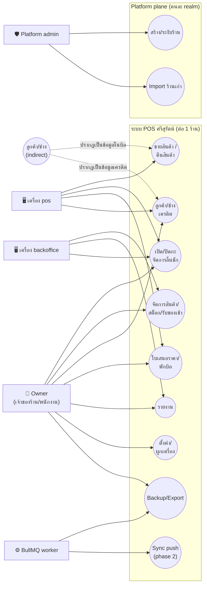
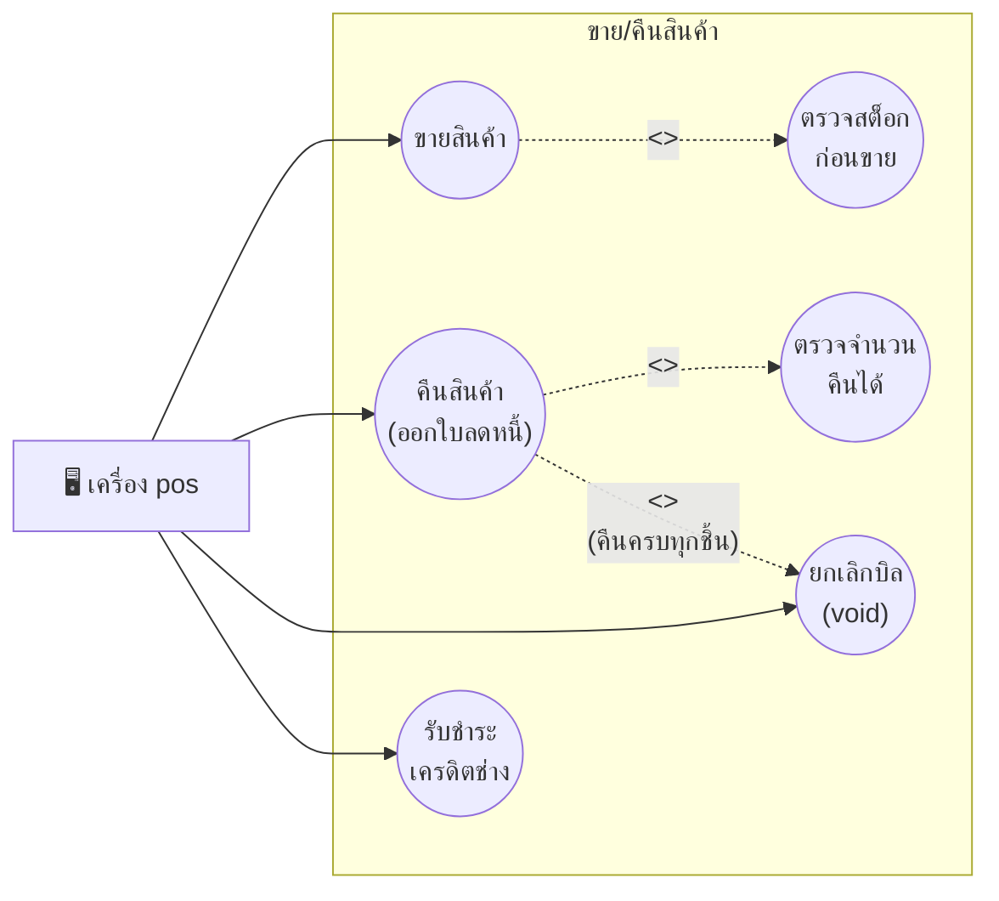
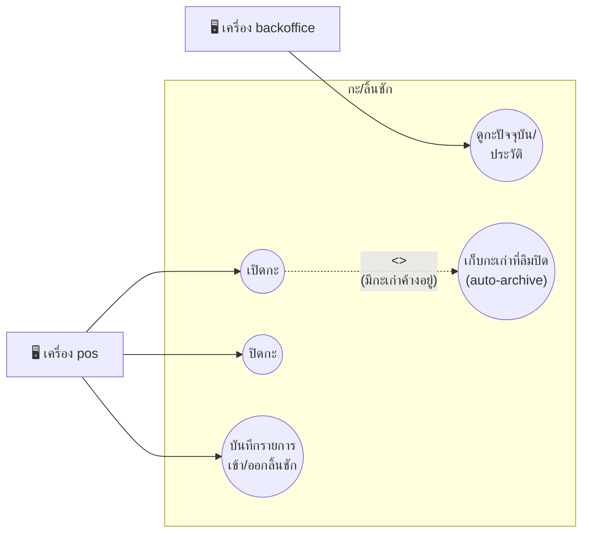
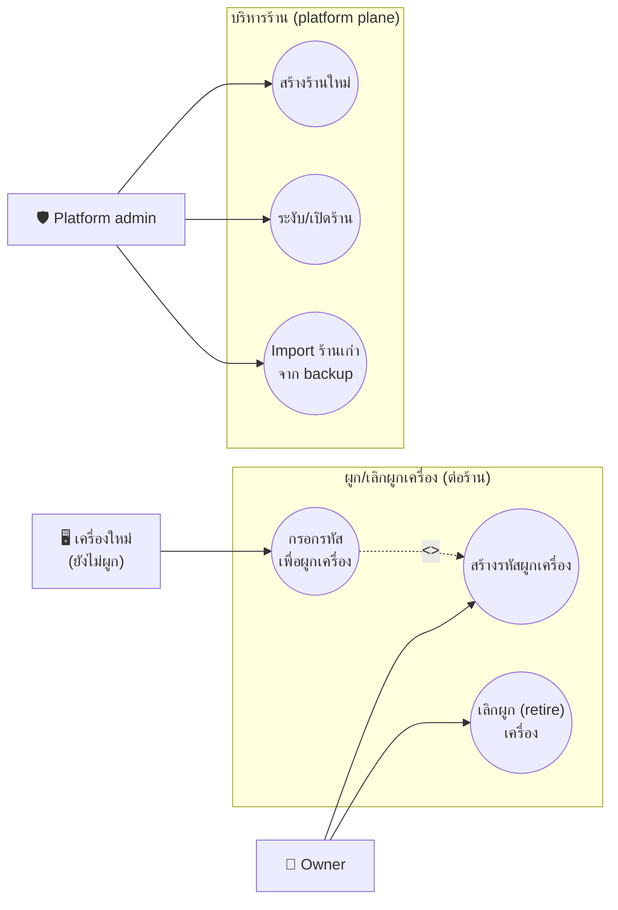

# 03 — Use Case: ใครใช้ระบบนี้บ้าง และทำอะไรได้บ้าง

บทนี้ตอบคำถาม: **"มีใครบ้างที่เข้ามายุ่งกับระบบนี้ (ไม่ใช่แค่ 'พนักงาน' เฉยๆ), แต่ละคน/แต่ละเครื่อง
ทำอะไรได้บ้าง และทำไมวิศวกรต้องวาดภาพนี้ก่อนเขียนโค้ดสักบรรทัด"**

---

## 🧭 ก่อนอ่าน

- **ต้องอ่านก่อน:** [00_index.md](00_index.md) (พื้นฐาน client/server, HTTP, JSON), [02_architecture.md](02_architecture.md) (รู้จักกล่องต่างๆ: Flutter, Nginx, NestJS, Postgres มาก่อน)
- **เวลาที่ใช้:** ~40–50 นาที
- **อ่านจบแล้วคุณจะ…**
  - อธิบายได้ว่า requirement คืออะไร ต่างจาก "โค้ด" ยังไง และทำไมต้องเขียนก่อนเขียนโปรแกรม
  - อ่าน/วาด use case diagram แบบง่ายได้ (actor, use case, boundary, include, extend)
  - บอกได้ว่าระบบนี้มี actor กี่ประเภทจริงๆ (ไม่ใช่แค่ "user" เดียว) — พร้อมชี้ไฟล์โค้ดที่พิสูจน์แต่ละอัน
  - อ่าน use case specification แบบเต็ม (precondition/flow/postcondition) ของการขาย/คืนของ/เปิดปิดกะ พร้อมข้อความ error ภาษาไทยตัวจริงจากโค้ด
  - โยง use case → หน้าจอ Flutter → API endpoint → service method ได้เป็นเส้นเดียว

---

## 🧱 ปูพื้นฐาน

ส่วนนี้ยังไม่พูดถึงโปรเจกต์ศรีสุรัตน์เลย — สอน concept ทั่วไปของวิศวกรรมซอฟต์แวร์ก่อน

### 1. Requirement คืออะไร

ก่อนเขียนโค้ดสักบรรทัด ทีมต้องตอบคำถามให้ได้ก่อนว่า **"ระบบที่จะสร้างต้องทำอะไรได้บ้าง"** —
คำตอบของคำถามนี้เรียกว่า **requirement** (ข้อกำหนดความต้องการ) เปรียบเหมือนก่อนสร้างบ้าน
สถาปนิกต้องรู้ก่อนว่าเจ้าของบ้านต้องการกี่ห้องนอน มีที่จอดรถไหม งบเท่าไหร่ — ถ้าเริ่มก่อสร้างเลย
โดยไม่ถามอะไร บ้านที่ได้อาจจะสวยแต่ใช้งานไม่ได้จริง (ห้องน้ำอยู่ไกลห้องนอนเกินไป, จอดรถไม่ได้)

Requirement แบ่งเป็น 2 ประเภทหลัก:

- **Functional requirement** (ข้อกำหนดเชิงหน้าที่) — "ระบบต้องทำอะไรได้" เช่น "แคชเชียร์ต้องขาย
  สินค้าและตัดสต็อกได้", "ต้องคืนสินค้าและคืนเงินได้" — พูดง่ายๆ คือ **feature**
- **Non-functional requirement (NFR)** — "ระบบต้องทำได้ดีแค่ไหน" ไม่ใช่ทำอะไร แต่เป็น
  "ทำยังไง/เร็วแค่ไหน/ปลอดภัยแค่ไหน" เช่น "ต้องขายของได้ภายใน 25 วินาทีต่อบิล", "ข้อมูลร้าน A ต้อง
  มองไม่เห็นจากร้าน B", "ระบบต้องรับโหลด 200 บิลพร้อมกันได้" NFR มักซ่อนอยู่ ถ้าลืมเขียนไว้ตั้งแต่
  แรก ระบบอาจ "ทำงานได้" แต่ "ใช้งานจริงไม่ได้" (เช่น ช้าเกินไปตอนคนต่อคิวเยอะ)

บทนี้พูดถึง **functional requirement เท่านั้น** — "ใครทำอะไรได้บ้าง" ส่วน NFR (เช่นเรื่อง
transaction, lock order, commit ceiling) เก็บไว้พูดในบท [06_backend.md](06_backend.md) และ
[07_database.md](07_database.md)

### 2. UML คืออะไร

เวลาทีมวิศวกรคุยกันเรื่องระบบ ถ้าอธิบายด้วยคำพูดล้วนๆ แต่ละคนจะนึกภาพไม่ตรงกัน — **UML**
(Unified Modeling Language) คือชุด "สัญลักษณ์มาตรฐาน" สำหรับวาดภาพระบบซอฟต์แวร์ ให้ทุกคนตีความ
รูปเดียวกันแบบเดียวกัน เหมือนผังไฟฟ้าในบ้านที่ใช้สัญลักษณ์เดียวกันทั่วโลก (สวิตช์รูปหนึ่ง หลอดไฟ
รูปหนึ่ง) ช่างไฟคนไหนอ่านก็เข้าใจ ไม่ต้องเขียนบรรยายยาวๆ

UML มีหลายชนิดของแผนภาพ (diagram) แต่ละชนิดตอบคำถามคนละมุม บทนี้ใช้ชนิดที่ชื่อ
**use case diagram** — ตอบคำถาม **"ใคร (actor) ทำอะไร (use case) กับระบบได้บ้าง"** โดยไม่สนใจ
เลยว่าข้างในทำงานยังไง (นั่นเป็นเรื่องของแผนภาพชนิดอื่น เช่น sequence diagram ที่จะเจอในบท 02/06)

### 3. Use case diagram — สัญลักษณ์

ลองนึกภาพร้านอาหารเล็กๆ ก่อน (ยังไม่เกี่ยวกับร้านอะไหล่) มี "ลูกค้า" กับ "พนักงานเสิร์ฟ" ใช้ระบบ
สั่งอาหารหน้าร้าน:

```
                    ┌─────────── ระบบสั่งอาหาร (system boundary) ───────────┐
                    │                                                        │
                    │   ( สั่งอาหาร )                                        │
                    │        │                                               │
    👤 ลูกค้า ───────┼────────┘                                               │
                    │        \                                              │
                    │         <<include>>                                   │
                    │           \                                           │
                    │      ( เลือกเมนู )                                     │
                    │                                                        │
                    │   ( ชำระเงิน ) ───<<extend>>──── ( ใช้คูปองส่วนลด )      │
                    │        │                                               │
    👤 พนักงานเสิร์ฟ ─┼────────┘                                               │
                    │                                                        │
                    └────────────────────────────────────────────────────────┘
```

อ่านสัญลักษณ์ทีละอย่าง:

| สัญลักษณ์ | รูปร่างมาตรฐาน UML | ความหมาย | ตัวอย่างในร้านอาหาร |
|---|---|---|---|
| **Actor** (ผู้กระทำ) | รูปคนแท่ง (stick figure) | ใครหรืออะไรก็ตามที่ "อยู่นอกระบบ" แต่มาสั่งงานหรือรับผลจากระบบ — ไม่จำเป็นต้องเป็นมนุษย์ (อาจเป็นระบบอื่น, เครื่องจักร, ตัวจับเวลา) | ลูกค้า, พนักงานเสิร์ฟ |
| **Use case** (กรณีการใช้งาน) | วงรี | "สิ่งที่ระบบทำให้ actor ได้" หนึ่งอย่าง — เขียนเป็นวลีกริยา ("สั่งอาหาร" ไม่ใช่ "ระบบสั่งอาหาร") | สั่งอาหาร, ชำระเงิน |
| **System boundary** (ขอบเขตระบบ) | กรอบสี่เหลี่ยมใหญ่ครอบ use case ทั้งหมด | เส้นแบ่งว่า "ข้างในนี้คือสิ่งที่เรากำลังสร้าง" actor อยู่นอกกรอบเสมอ | กรอบรอบระบบสั่งอาหาร |
| **Association** (เส้นเชื่อม) | เส้นตรงเชื่อม actor กับ use case | actor คนนี้ "เกี่ยวข้องกับ" use case นี้ | เส้นจากลูกค้าไปหา "สั่งอาหาร" |
| **`<<include>>`** | เส้นประ ลูกศรชี้จาก use case แม่ไปหา use case ลูก | use case แม่ "ต้องเรียก" use case ลูกเสมอ ทุกครั้งไม่มีข้อยกเว้น (บังคับ) | "สั่งอาหาร" ต้อง "เลือกเมนู" เสมอ — สั่งโดยไม่เลือกเมนูไม่ได้ |
| **`<<extend>>`** | เส้นประ ลูกศรชี้จาก use case เสริมไปหา use case หลัก | use case เสริม "อาจถูกเรียกเพิ่ม" จาก use case หลัก **แบบมีเงื่อนไข** ไม่ใช่ทุกครั้ง | "ใช้คูปองส่วนลด" เกิดขึ้นเฉพาะตอนลูกค้ามีคูปอง — ไม่ใช่ทุกบิล |
| **Generalization** (เส้นสามเหลี่ยมกลวง) | เส้นตรงหัวเป็นสามเหลี่ยมกลวง ชี้จาก actor ลูกไปหา actor แม่ | actor คนหนึ่ง "เป็นกรณีเฉพาะของ" actor อีกคน (สืบทอดสิทธิ์ทั้งหมดของแม่ + มีของตัวเองเพิ่ม) | "ลูกค้าสมาชิก" เป็นกรณีเฉพาะของ "ลูกค้า" (ทำทุกอย่างที่ลูกค้าทำได้ บวกสะสมแต้มเพิ่ม) |

**ข้อควรระวังที่คนมักสับสน:** `<<include>>` กับ `<<extend>>` ทิศลูกศรกลับกันในทางความหมาย —
`<<include>>` ลูกศรชี้ไปหา "สิ่งที่ถูกเรียกเสมอ" (บังคับ), `<<extend>>` ลูกศรชี้ไปหา
"สิ่งที่ถูกเรียกแบบมีเงื่อนไข" (ทางเลือก) จำง่ายๆ ว่า **include = ต้องมี, extend = อาจมีเพิ่ม**

### 4. Use case vs user story vs หน้าจอ (screen)

สามคำนี้มักถูกใช้ปนกัน ทั้งที่ตอบคำถามคนละระดับ:

| | ตอบคำถาม | ตัวอย่าง | รายละเอียด |
|---|---|---|---|
| **Use case** | "ระบบทำอะไรให้ actor ได้" (มุมมองจากธุรกิจ) | "ขายสินค้า" | กว้าง ครอบคลุมทั้ง flow ตั้งแต่ต้นจนจบ รวม error case |
| **User story** | "ในฐานะ [ใคร] ฉันอยากทำ [อะไร] เพื่อ [ทำไม]" (มุมมองการวางแผนงาน) | "ในฐานะแคชเชียร์ ฉันอยากสแกนบาร์โค้ดแทนพิมพ์ชื่อสินค้า เพื่อขายเร็วขึ้น" | เล็กกว่า มักเป็นหน่วยงานที่ทีมหยิบไปทำในหนึ่ง sprint |
| **Screen / UI** | "หน้าตาบนจอเป็นยังไง" (มุมมองการออกแบบหน้าจอ) | หน้า Checkout มีปุ่มอะไรตรงไหน | เจาะจงที่สุด อาจเปลี่ยนบ่อยโดย use case เดิมไม่เปลี่ยน |

หนึ่ง use case (เช่น "ขายสินค้า") อาจถูกพัฒนาผ่านหลาย user story (สแกนบาร์โค้ด, พิมพ์ค้นหาชื่อ,
ใส่ discount) และแสดงผลผ่านหลายหน้าจอ (หน้า checkout, popup เลือกลูกค้า) — use case คือ
"เจตนาทางธุรกิจ" ที่อยู่คงทนกว่า ส่วน UI เปลี่ยนได้บ่อยกว่ามาก

### 5. ทำไมวิศวกรวาด use case diagram ก่อนเขียนโค้ด

เหตุผลเชิงปฏิบัติ ไม่ใช่พิธีกรรม:

1. **จับคนตกหล่นตั้งแต่ต้น** — ถ้าไม่วาด "actor" ทุกตัวออกมาก่อน มักจะลืมว่ามี actor ที่ไม่ใช่
   มนุษย์ (เช่นระบบจับเวลา, worker พื้นหลัง) จนกว่าจะเขียนโค้ดไปแล้วครึ่งทางแล้วเจอเคสแปลกๆ ที่
   ไม่มีใคร "login" มาทำ (ในบทนี้จะเห็นว่าระบบศรีสุรัตน์มี actor ที่เป็นแค่ "คิวงานพื้นหลัง" ด้วย)
2. **แยกสิทธิ์ตั้งแต่แบบร่าง** — ถ้ารู้ตั้งแต่ต้นว่า "เครื่องขายหน้าร้าน" กับ "เครื่องหลังร้าน" ทำ
   ได้ไม่เท่ากัน การออกแบบ authentication/authorization (บท 06) จะไม่ต้องมาแก้ทีหลัง
3. **เป็นภาษากลางคุยกับเจ้าของร้าน** — เจ้าของร้านไม่รู้ SQL ไม่รู้ REST API แต่ดู use case diagram
   แล้วชี้ได้ว่า "อ้าว ลืม 'คืนสินค้า' ไปนี่" ก่อนที่จะเสียเวลาเขียนโค้ดผิดทิศ
4. **เป็นจุดเริ่มของ traceability** — เมื่อรู้ว่ามี use case อะไรบ้าง จะสืบไปหา endpoint/หน้าจอที่
   รองรับมันได้ (ดูตาราง traceability ท้ายบท) เวลาแก้บั๊กจะรู้ว่า "หน้าจอนี้พังเพราะ use case ไหน
   ทำงานผิด"

---

## 🔥 ปัญหาจริงของร้าน

ร้านศรีสุรัตน์ตอนยัง export ระบบเป็นเว็บ localStorage (ยุค 1 — ดูบท 00) ไม่มีแนวคิด "actor" เลย
เพราะเครื่องเดียว คนเดียวใช้ ไม่ต้อง login — พอระบบย้ายมาเป็น multi-tenant (ยุค 3, ตอนนี้)
เกิดคำถามที่ยุค 1 ไม่เคยต้องตอบ:

- ร้านมีเครื่องขายหน้าร้าน (POS) กับเครื่องหลังร้าน (จัดการสต็อก/รายงาน) — **สองเครื่องนี้ควรทำ
  อะไรได้ต่างกันไหม?** (คำตอบ: ต่างกัน — ดู ADR-0004 ด้านล่าง)
- ใครเป็นคนตั้งร้านใหม่ในระบบ (tenant ใหม่)? เจ้าของร้านศรีสุรัตน์เองทำได้ไหม หรือต้องเป็นทีมงาน
  ของแพลตฟอร์ม? (คำตอบ: ต้องเป็นทีมแพลตฟอร์มเท่านั้น — ดู ADR-0002)
- ลูกค้าที่มาซื้อของ กับช่างที่เอาบิลไปตัดเครดิต — **เขาต้อง "login" เข้าระบบไหม?** (คำตอบ: ไม่ต้อง
  — เขาไม่ใช่ผู้ใช้ระบบ เขาเป็นแค่ "ข้อมูล" ที่พนักงานพิมพ์เข้าไปในบิล)
- มีงานที่ต้องเกิดขึ้น "เอง" โดยไม่มีใครกดปุ่ม เช่น ส่ง backup ทุกคืน — **นี่นับเป็น actor ไหม?**
  (คำตอบ: นับ — เป็น actor ที่ไม่ใช่มนุษย์)

ถ้าไม่แยกให้ชัดตั้งแต่ต้น จะเกิดโค้ดที่ authorization สับสน (เช่น endpoint ที่ควรจำกัดเฉพาะเครื่อง
ขาย ดันเปิดให้เครื่องหลังร้านเรียกได้ด้วย) — โปรเจกต์นี้เจอปัญหานี้จริง: `03_ARCHITECTURE.md §5`
เคยเขียนขัดกันเองสองจุดเรื่องสิทธิ์ของ platform admin จนต้องออก ADR-0002 มาเคลียร์ (อ่านรายละเอียด
ในหัวข้อ actor ด้านล่าง)

---

## ⚖️ ทางเลือก → ทำไมออกแบบ actor แบบนี้

โปรเจกต์นี้ตัดสินใจสำคัญ 2 เรื่องที่กระทบ use case diagram โดยตรง — ทั้งคู่มีบันทึกเป็น ADR
(Architecture Decision Record — เอกสารบันทึกว่า "ตัดสินใจอะไร เพราะอะไร" ให้คนอ่านทีหลังเข้าใจ
โดยไม่ต้องถามซ้ำ)

### เรื่องที่ 1: กี่ role ต่อร้าน — `owner` เดียว หรือหลาย role (manager/cashier)?

| ทางเลือก | ข้อดี | ข้อเสีย |
|---|---|---|
| **หลาย role ต่อร้าน** (owner/manager/cashier แยกสิทธิ์กัน) | ยืดหยุ่น เจ้าของมอบสิทธิ์บางส่วนให้ลูกน้องได้ | ร้านอะไหล่เล็กๆ ที่มีคนคุมร้านคนเดียวไม่ต้องใช้ — ซับซ้อนเกินจำเป็น ต้องดูแล PIN แยกแต่ละคน |
| **owner role เดียว ต่อร้าน 1 คน (ที่เลือกใช้จริง)** | เรียบง่าย ตรงกับพฤติกรรมจริงของร้านเล็ก (เจ้าของ/ผู้จัดการคนเดียวคุมบัญชี login เดียว) | ถ้าร้านขยายจนต้องมีหลายคนแยกสิทธิ์ ต้องออกแบบใหม่ทีหลัง (ยอมรับ trade-off นี้) |

**เพราะ** ร้านอะไหล่ขนาดนี้มีคนคุมบัญชีเดียวจริง (owner) **จึงต้อง** บังคับที่ระดับฐานข้อมูลว่า
1 ร้าน (tenant) มี user ที่ active ได้แค่คนเดียว และ role ต้องเป็น `'owner'` เท่านั้น — เห็นได้จาก
migration `1788652803001-SingleOwnerRole.ts:38,43` ที่สร้าง unique index
`uq_users_one_active ON users (tenant_id) WHERE is_active` และ constraint
`CHECK (role = 'owner')` **ราคาที่จ่ายคือ** ฟีเจอร์ manager-PIN ของยุคเก่าถูกตัดทิ้งไปพร้อมกัน
(คอลัมน์ `pin_hash` ถูก drop ในไฟล์เดียวกัน บรรทัด 46) — การ void บิลออนไลน์เปลี่ยนจาก "ต้องใส่ PIN
ผู้จัดการ" เป็น "ใส่เหตุผลอย่างเดียว" แทน (ดู 08_PHASE2_SPEC.md, สรุปไว้ใน CLAUDE.md ส่วน Phase 2)

### เรื่องที่ 2: กี่เครื่อง POS ต่อร้าน และแยกบทบาทเครื่องยังไง

ADR-0004 (`docs/Backend_design/adr/0004-device-roles.md`) เล่าไว้ตรงๆ ว่าเอกสารรุ่นแรกเคย
"เดา" ว่าร้านมีเครื่องขายเดียว เพื่อเลี่ยงปัญหา stock ชนกัน — แต่พบว่า **เหตุผลนั้นผิด**: ในโหมด
ออนไลน์ server ล็อกแถวสินค้าด้วย transaction อยู่แล้ว ต่อให้มีเครื่องขาย 10 เครื่องพร้อมกัน stock
ก็ไม่ชนกัน (ดูบท 06/07 เรื่อง row lock)

| ทางเลือก | ข้อดี | ข้อเสีย |
|---|---|---|
| **1 ร้าน = 1 เครื่องตายตัว (ไม่มี role แยก)** | ง่ายต่อการคิด ไม่ต้องกังวลเรื่อง lock | ขัดกับ schema จริงที่มี `devices.device_no` รองรับหลายเครื่องอยู่แล้ว (`01_DATABASE.md §7.2`), และร้านจริงมีทั้งเครื่องขายกับเครื่องหลังร้าน |
| **แยกบทบาทเครื่อง `pos` / `backoffice`, จำกัด `pos` ไม่เกิน 1 เครื่อง active ต่อร้าน (ที่เลือกใช้จริง)** | ตรงกับพฤติกรรมจริง (ขายที่หน้าร้าน, จัดการของหลังร้าน), ยังกันสองเครื่อง "ขาย" พร้อมกันด้วย unique index ที่ฐานข้อมูล | ต้องมีระบบ "ผูกเครื่อง" (device enrolment) เพิ่มเข้ามา เพิ่มความซับซ้อนของ auth |

**เพราะ** เครื่องขาย (`pos`) เป็นเครื่องเดียวที่แตะเงินสดในลิ้นชักจริง (พิมพ์ใบเสร็จ, เปิด/ปิดกะ)
**จึงต้อง** จำกัดด้วย unique index `one_pos_per_tenant ON devices (tenant_id) WHERE role='pos'
AND retired_at IS NULL` (ADR-0004) ให้ active ได้ทีละเครื่อง ส่วนเครื่อง `backoffice` (จัดการ
สินค้า/รายงาน) เปิดได้กี่เครื่องก็ได้ **ราคาที่จ่ายคือ** endpoint ที่แตะเงิน (ขาย/คืน/กะ) ต้องเช็ค
`drole` (device role) ทุกครั้งผ่าน decorator `@RequireDeviceRole('pos')` — เพิ่ม guard อีกชั้นที่
ทุก endpoint ใหม่ต้องจำใส่ ไม่ใส่แล้วลืมคือช่องโหว่ (ดูโค้ดจริงหัวข้อถัดไป)

---

## 🔍 ของจริงใน repo — Actors

ตารางนี้ตรวจแล้วทีละแถวกับโค้ด/ADR จริง (ไม่ใช่เดา):

| Actor | Login ยังไง | ทำอะไรได้ | หลักฐานในโค้ด |
|---|---|---|---|
| **Owner** (เจ้าของร้าน — role เดียวที่มีในระบบตอนนี้) | `POST /auth/token` ด้วย username/password ของร้านตัวเอง — 1 ร้านมี user active ได้แค่คนเดียว | ทำได้ทุกอย่างในร้านของตัวเอง (ขาย/คืน/สต็อก/รายงาน/ตั้งค่า/ผูกเครื่อง) แต่แยกกันด้วย device role อีกชั้น (ดูแถวถัดไป) | `server/src/auth/auth.controller.ts:15-23` (login), migration `1788652803001-SingleOwnerRole.ts:19,43` (บังคับ role='owner' + active เดียว) |
| **Shop account / พนักงานหน้าร้าน** | login ด้วย account เดียวกับ owner (ระบบยังไม่มี role พนักงานแยก) — ในทางปฏิบัติคือคนที่นั่งอยู่หน้าเครื่องที่ login ค้างไว้ | เหมือน owner ทุกประการ เพราะระบบไม่แยก role พนักงาน/เจ้าของ (ตาม 08_PHASE2_SPEC E1 "one `owner` role + one active shop account per tenant") | เดียวกับแถว Owner — ไม่มี role แยกในโค้ดจริง |
| **เครื่อง `pos`** (device role, ไม่ใช่คน) | เครื่องต้องถูก "ผูก" (enrol) ก่อน: owner กดสร้างรหัส (`POST /devices`) แล้วเอาโค้ดไปกรอกที่เครื่องใหม่ผ่าน `POST /auth/device` — ได้ device token ที่มี `did`+`drole` | อย่างเดียวที่ทำได้: ขายสินค้า (`POST /sales`), คืนสินค้า (`POST /returns`), เปิด/ปิด/เติมเงินกะ (`POST /shifts/*`), แปลงใบเสนอราคาเป็นบิล (`POST /quotes/:id/convert`), รับชำระเครดิตช่าง (`POST /mechanics/:id/credit-payments`), ออกเลขเอกสาร (`GET /doc-counters`) — ร้านหนึ่งมีเครื่องนี้ active ได้ไม่เกิน 1 เครื่อง | `server/src/common/decorators/device-role.decorator.ts:4`, ใช้จริงที่ `sales.controller.ts:54,118`, `returns.controller.ts:51`, `shifts.controller.ts:61,83,103`, `quotes.controller.ts:208`, `mechanics.controller.ts:134`, `doc-counters.controller.ts:22`; unique-index กันเกิน 1 เครื่องอยู่ใน ADR-0004 |
| **เครื่อง `backoffice`** (device role, ไม่ใช่คน) | ผูกเครื่องแบบเดียวกับ `pos` แต่เลือก `role: "backoffice"` ตอนสร้าง | อ่านได้ทุกอย่าง (ดูบิล/กะ/รายงาน) แต่แตะเงิน/สต็อกที่ผูกกับกะไม่ได้ — จัดการสินค้า/ลูกค้า/ช่าง/PO ได้ (ไม่ได้ถูก `@RequireDeviceRole('pos')` กัน) | `devices.controller.ts:33-37` (comment: "การผูกเครื่อง... either `pos` or `backoffice`"), ADR-0004 ตารางกำหนด endpoint ต่อ role |
| **Platform admin** (ทีมงานแพลตฟอร์ม ไม่ใช่คนของร้าน) | login คนละช่องทาง: `POST /platform/auth/token` — คนละตาราง (`platform_admins`, ไม่มี `tenant_id`), คนละ JWT (`aud: "platform"` — **aud** ย่อจาก audience คือค่าใน JWT ที่บอกว่า token นี้ใช้กับระบบฝั่งไหน) | สร้างร้านใหม่ (`POST /platform/tenants`), ระงับ/เปิดร้าน (`PATCH /platform/tenants/:id/status`), ดูรายชื่อร้านทั้งหมด (`GET /platform/tenants`), import ข้อมูลร้านเก่า (`POST /platform/tenants/:id/import`) — **ห้ามเรียก `/api/*` แม้แต่ endpoint เดียว แม้จะเป็น owner ของร้านไหนก็ตาม** | `server/src/platform/platform-tenants.controller.ts:26-59`, `server/src/platform/tenant-import.controller.ts:27-48`, กติกาแยก realm ทั้งหมดอยู่ใน `docs/Backend_design/adr/0002-platform-admin-plane.md` |
| **BullMQ worker / job พื้นหลัง** (ระบบ ไม่ใช่คน) | ไม่ "login" — เป็น process แยก (`worker.ts`) ที่ดึงงานจากคิวใน Redis มาทำเอง | ประมวลผลงานเบื้องหลัง: `sale-post` (งานหลังขาย), `inventory`, `maintenance`, `backup`, `tenant-import`, `dlq` (dead-letter queue สำหรับงานที่ล้มเหลวซ้ำ) | `server/src/worker.ts:19` (log message ระบุชื่อคิวทั้ง 6), ไฟล์ processor จริงใน `server/src/queue/processors/*.ts` |
| **ลูกค้า / ช่าง** (indirect — ปรากฏเป็นข้อมูล ไม่ใช่ผู้ใช้ระบบ) | ไม่ login เลย — ไม่มีบัญชีในระบบนี้ | ไม่ "ทำ" อะไรกับระบบโดยตรง แต่ถูกอ้างถึงในบิล (`customerId`, `mechanicId`), สะสมแต้ม/เครดิต และมีบิลผูกกับเครดิตช่าง (`เครดิตช่าง`) ที่ต้องมาชำระทีหลัง | `server/src/people/people.dto.ts:4-27` (แค่ data model ไม่มี controller ให้ login), field `mechanicId`/`customerId` ใน `server/src/sales/sales.dto.ts` |

**สังเกต 3 อย่างที่ต่างจากระบบ "ปกติ" ที่ปี 1 อาจคุ้นเคย:**

1. **"คน" กับ "เครื่อง" เป็น actor คนละตัวกัน ซ้อนกันอยู่** — คำขอ `POST /sales` หนึ่งครั้งต้องผ่าน
   ทั้ง 2 ชั้น: ต้อง login เป็น owner (ชั้น user) **และ** ต้องยิงมาจากเครื่องที่ผูกเป็น `pos`
   (ชั้น device) — ขาดชั้นไหนก็ถูกปฏิเสธ ดู `sales.controller.ts:64-68` ที่เช็ค `req.user.deviceId`
   แยกจาก `@RequireDeviceRole('pos')` อีกชั้น
2. **actor ที่ไม่ใช่มนุษย์มีสิทธิ์จริงในระบบ** — BullMQ worker ไม่ใช่แค่ "โค้ดที่รันเอง" แต่เป็น
   actor ที่ธุรกิจต้องรู้จัก (ถ้ามันหยุดทำงาน backup ก็ไม่เกิด — ดู CLAUDE.md เรื่อง `#363`)
3. **Owner กับ "shop account/พนักงาน" คือ actor เดียวกันในโค้ดจริงตอนนี้** — งาน spec เดิม
   (E1 ใน 08_PHASE2_SPEC.md) ตั้งใจแยกแนวคิดสองอันนี้ไว้ แต่ implementation ปัจจุบันมี role เดียว
   ('owner') เท่านั้น ยังไม่มี role พนักงานที่สิทธิ์น้อยกว่า — บทนี้เขียนแยกไว้ในตารางเพื่อให้เห็น
   เจตนาของ spec แต่ต้องบอกตรงๆ ว่า **โค้ดยังไม่มีความต่างนี้จริง**

---

## Use case diagram — ภาพรวม

Mermaid **วาด UML use case diagram แท้ๆ ไม่ได้** (ไม่มีรูปวงรี ไม่มีสัญลักษณ์ actor มาตรฐาน) —
บทนี้ใช้ `flowchart LR` แทน โดยแทน actor ด้วยกล่องสี่เหลี่ยมชื่อคน/เครื่อง และแทนขอบเขตระบบด้วย
`subgraph` ครอบกลุ่ม use case ไว้ (วงรีจริงๆ ต้องใช้เครื่องมือ UML เฉพาะทาง เช่น PlantUML)



**อ่านภาพนี้ยังไง:** เส้นทึบ = actor เกี่ยวข้องโดยตรง (เป็นคนกด/เป็นเครื่องที่เรียก API), เส้นประ =
เกี่ยวข้องทางอ้อม (ลูกค้า/ช่างไม่ได้กดอะไรเอง แต่ข้อมูลของเขาถูกใช้) กล่อง `PLATFORM` แยกออกมาเป็น
`subgraph` คนละกรอบ เพราะ ADR-0002 บังคับว่ามันเป็นคนละ realm กันเด็ดขาด — **ไม่มีเส้นใดๆ ควรลาก
ข้ามจากกรอบ `SYS` ไปกรอบ `PLATFORM`** (ถ้าเห็นเส้นแบบนั้นในโค้ดจริง คือบั๊กร้ายแรง)

---

## Use case diagram — ซูมเข้า: การขาย/คืนของ



`S2 -.->|"<<extend>>"| S3` หมายความว่า: การคืนสินค้าไม่ได้ยกเลิกบิลเสมอไป (ส่วนใหญ่คืนแค่บางชิ้น)
แต่ **ถ้าคืนจนครบทุกชิ้นในบิล** ระบบจะยกเลิกบิลให้อัตโนมัติ (`autoVoid`) — เป็นเงื่อนไข ไม่ใช่ทุก
ครั้ง จึงเป็น `<<extend>>` ไม่ใช่ `<<include>>` (ดูโค้ดจริงที่ `returns.service.ts:309,998`)

---

## Use case diagram — ซูมเข้า: จัดการกะ (shift)



เครื่อง `backoffice` มองเห็นกะได้ (`SH4`) แต่เปิด/ปิด/บันทึกลิ้นชักไม่ได้ — เพราะมันไม่ใช่เครื่องที่
ถือเงินสดจริง (เหตุผลเดียวกับ ADR-0004 หัวข้อทางเลือกด้านบน) ดูคอมเมนต์จริงใน
`shifts.controller.ts:41-42`: *"Both device roles may read: looking at the drawer does not
touch it (ADR-0004)"*

---

## Use case diagram — ซูมเข้า: platform / อุปกรณ์



`D2` ต้อง `<<include>>` `D1` เสมอ เพราะเครื่องใหม่กรอกรหัสไม่ได้ถ้ายังไม่มีใครสร้างรหัสให้ก่อน —
flow คือ owner กด "สร้างเครื่องใหม่" (`POST /devices`) ได้รหัส `enrolCode` ที่โชว์ครั้งเดียว แล้วเอา
ไปกรอกที่เครื่องใหม่ (`POST /auth/device`) ดู `devices.controller.ts:52-55`

---

## 🔍 ของจริงใน repo — Use case ทั้งหมดแยกตามกลุ่ม (จาก route จริง)

ตารางนี้ไล่จาก controller จริงทุกไฟล์ (`grep @Post/@Get` ใน `server/src/**/*.controller.ts`) จัด
กลุ่มตามที่ prompt ขอ:

### ขาย (sale, park, quote, void, return, credit)

| Use case | Endpoint | ไฟล์ |
|---|---|---|
| ขายสินค้า | `POST /sales` | `sales.controller.ts:53` |
| ดูรายการบิล / ดูบิลใบเดียว | `GET /sales`, `GET /sales/:id` | `sales.controller.ts:78,99` |
| ดูจำนวนที่คืนไปแล้วต่อบิล | `GET /sales/:id/refunded-qty` | `sales.controller.ts:105` |
| ยกเลิกบิล (void) | `POST /sales/:id/void` | `sales.controller.ts:116` |
| คืนสินค้า (ออกใบลดหนี้) | `POST /returns` | `returns.controller.ts:50` |
| ดูประวัติการคืน | `GET /returns` | `returns.controller.ts:75` |
| พักบิล (parked sale) | `POST/GET/DELETE /parked-sales` | `parked-sales.controller.ts:42,47,63` |
| ใบเสนอราคา: สร้าง/แก้/ลบ/ทำซ้ำ/แปลงเป็นบิล | `POST/PATCH/DELETE /quotes`, `POST /quotes/:id/convert` | `quotes.controller.ts:75-207` |
| รับชำระเครดิตช่าง | `POST /mechanics/:id/credit-payments` | `mechanics.controller.ts:133` |

### สินค้า/สต็อก (products, adjust, PO receive)

| Use case | Endpoint | ไฟล์ |
|---|---|---|
| ดู/เพิ่ม/แก้/ลบสินค้า | `GET/POST/PATCH/DELETE /products` | `products.controller.ts:43-131` |
| ปรับสต็อกด้วยมือ | `POST /products/:id/adjust-stock` | `products.controller.ts:145` |
| สร้าง/ดู/ยกเลิกใบสั่งซื้อ (PO) | `POST/GET/DELETE /purchase-orders` | `purchase-orders.controller.ts:40-111` |
| รับของเข้าตาม PO | `POST /purchase-orders/:id/receive` | `purchase-orders.controller.ts:79` |

### ลูกค้า/ช่าง

| Use case | Endpoint | ไฟล์ |
|---|---|---|
| ดู/เพิ่ม/แก้/ลบลูกค้า, ดูประวัติซื้อ | `GET/POST/PATCH/DELETE /customers`, `GET /customers/:id/sales` | `customers.controller.ts:36-116` |
| ดู/เพิ่ม/แก้/ลบช่าง, ดูประวัติซื้อ | `GET/POST/PATCH/DELETE /mechanics`, `GET /mechanics/:id/sales` | `mechanics.controller.ts:48-158` |

### กะ/ลิ้นชัก

| Use case | Endpoint | ไฟล์ |
|---|---|---|
| ดูกะปัจจุบัน/ประวัติ | `GET /shifts/current`, `GET /shifts/history` | `shifts.controller.ts:44,49` |
| เปิดกะ / ปิดกะ | `POST /shifts/open`, `POST /shifts/close` | `shifts.controller.ts:59,81` |
| บันทึกรายการเข้า/ออกลิ้นชัก | `POST /shifts/current/entries` | `shifts.controller.ts:102` |

### รายงาน

| Use case | Endpoint | ไฟล์ |
|---|---|---|
| สรุปยอด/ปิดร้าน/สินค้าขายดี/แยกหมวด/มูลค่าสต็อก/สต็อกใกล้หมด/ยอดขายรายสินค้า | `GET /reports/*` (7 endpoint) | `reports.controller.ts:31-82` |

### ตั้งค่า/อุปกรณ์

| Use case | Endpoint | ไฟล์ |
|---|---|---|
| ดู/แก้ค่าตั้งค่าร้าน | `GET/PATCH /settings` | `settings.controller.ts:29,36` |
| ดูข้อมูลเริ่มต้นตอนเปิดแอป | `GET /bootstrap` | `bootstrap.controller.ts:12` |
| ดูรายชื่อเครื่อง / สร้างรหัสผูกเครื่องใหม่ | `GET/POST /devices` | `devices.controller.ts:46,57` |
| เลิกผูก (retire) เครื่อง | `POST /devices/:id/retire` | `devices.controller.ts:89` |
| ผูกเครื่องด้วยรหัส (จากเครื่องใหม่) | `POST /auth/device` | `auth.controller.ts:53` |
| ล็อกอิน / ต่ออายุ token / ดูตัวเอง | `POST /auth/token`, `POST /auth/refresh`, `GET /auth/me` | `auth.controller.ts:15,25,62` |
| ออกเลขเอกสาร (receipt/CN No.) | `GET /doc-counters` | `doc-counters.controller.ts:21` |
| รายการที่รอเจ้าของตรวจ (owner review) | `GET /review-items`, `POST /review-items/:id/reviewed` | `review-items.controller.ts:41,52` |

### Platform (คนละ realm)

| Use case | Endpoint | ไฟล์ |
|---|---|---|
| Login ทีมแพลตฟอร์ม | `POST /platform/auth/token` | `platform-auth.controller.ts:10` |
| สร้างร้านใหม่ / ดูรายชื่อร้าน / ระงับ-เปิดร้าน | `POST/GET/PATCH /platform/tenants` | `platform-tenants.controller.ts:31,40,55` |
| Import ข้อมูลร้านเก่า + ดูสถานะงาน import | `POST /platform/tenants/:id/import`, `GET .../import/:jobId` | `tenant-import.controller.ts:37,48` |

### Backup/export

| Use case | Endpoint | ไฟล์ |
|---|---|---|
| สั่ง export ข้อมูลร้าน (async job) | `POST /backup/export` | `backup.controller.ts:46` |
| ดูสถานะงาน export | `GET /backup/jobs/:id` | `backup.controller.ts:80` |

### Sync push (phase 2 — ยังกำลังพัฒนา)

| Use case | Endpoint | ไฟล์ |
|---|---|---|
| ส่งงานที่ค้าง (outbox) กลับขึ้น server ตอนต่อเน็ตได้ | `POST /sync/push` | `sync.controller.ts:54` |
| ทิ้งงานที่ค้างโดยตั้งใจ (discard) | `POST /sync/discards` | `sync.controller.ts:75` |

> 🔴 **ต้องบอกตรงๆ:** `/sync/push` เป็น phase 2 ที่ยังไม่นิ่ง — CLAUDE.md บันทึกบั๊ก HIGH ที่ยังไม่
> แก้ (2026-09-24): fingerprint ที่ `/sync/push` ใช้เทียบ (`POST /sales`) ไม่ตรงกับที่ online runner
> เก็บจริง (`POST /api/v1/sales`) ทำให้บิลที่ commit ออนไลน์แล้วแต่คำตอบหาย จะถูกปฏิเสธผิดพลาดตอน
> sync กลับมา — ห้ามเขียนว่า sync push "ใช้งานได้สมบูรณ์แล้ว"

### หน้าจอ Flutter ที่สอดคล้องกัน (จาก `app_router.dart`)

`frontend/lib/core/router/app_router.dart:35-53` ประกาศ route ทั้งหมด (**13 หน้าจอในเชลล์หลัก** +
`/login` เฉพาะ build ที่เปิด API — ตรงกับ `CLAUDE.md` ที่เขียนว่า "13 shell routes + /login";
ตัวคอมเมนต์ในโค้ดเองที่ `app_router.dart:55` ยังเขียนค้างว่า "the 11 routes" ซึ่ง**ล้าสมัยกว่าโค้ดจริง**
— เหมือนกรณี `repository_providers.dart` ด้านบนที่คอมเมนต์เขียนไว้ 13 แต่ของจริงมี 21 บทเรียนซ้ำ:
นับ `AppRoutes` ในโค้ดจริง อย่าเชื่อคอมเมนต์):

```
/                → Checkout (ขายสินค้า)         /products        → จัดการสินค้า
/purchase-orders → ใบสั่งซื้อ                    /vehicle-search  → ค้นหาตามรุ่นรถ  
/customers       → ลูกค้า                        /mechanics       → ช่าง
/returns         → คืนสินค้า                     /quotes          → ใบเสนอราคา
/reports         → รายงาน                        /settings        → ตั้งค่า
/cash-drawer     → ลิ้นชัก/กะ                     /owner-review    → รายการรอตรวจ
/devices         → จัดการเครื่อง                  /login           → เข้าสู่ระบบ (เฉพาะ build ที่ใช้ API)
```

---

## 📋 Use case specification เต็ม 1: ขายสินค้า

| หัวข้อ | รายละเอียด |
|---|---|
| **ชื่อ** | ขายสินค้า (Create Sale) |
| **Actor หลัก** | เครื่อง `pos` (ต้องมี user login เป็น owner ด้วย) |
| **Precondition** | 1) เครื่องถูกผูกเป็น `pos` และยังไม่ถูก retire · 2) มีกะเปิดอยู่บนเครื่องนี้ (ในทางปฏิบัติ ต้องเปิดกะก่อนขาย แม้ endpoint จะไม่บังคับเช็คตรงๆ ที่ตัวมันเอง) |
| **Main flow** | 1. แคชเชียร์สแกน/เลือกสินค้าใส่ตะกร้าบนหน้า Checkout · 2. กด "ชำระเงิน" → แอปยิง `POST /sales` พร้อม `id`+`Idempotency-Key` ที่สร้างครั้งเดียวตอนเปิดตะกร้า (กัน double-submit) · 3. Server ล็อกแถวสินค้าที่เกี่ยวข้องทั้งหมด (`FOR UPDATE`) แล้วตรวจสต็อกทุกบรรทัดพร้อมกัน (ไม่ใช่ทีละบรรทัด) · 4. ตัดสต็อก, คำนวณแต้มสะสม `floor(total/10)`, บันทึกบิล, อัปเดตยอดใช้จ่าย/แต้มลูกค้า และสถิติช่าง (ถ้าจ่ายด้วยเครดิตช่าง) ทั้งหมดในทรานแซกชันเดียว · 5. ตอบกลับ `201 Created` พร้อมเลขที่ใบเสร็จ (`receiptNo`), แต้มที่ได้, สต็อกคงเหลือ |
| **Alternative/Exception flow** | **สต็อกไม่พอ** — ถ้ามีบรรทัดใดสต็อกไม่พอ **หรือ** หาสินค้าไม่เจอ ระบบไม่ตัดอะไรเลยทั้งบิล (all-or-nothing) และโยน `409 Conflict` พร้อมข้อความไทยรวมทุกบรรทัดที่ผิดในครั้งเดียว รูปแบบ:<br>`สต็อกไม่พอ:\n<ชื่อสินค้า>: สต็อก <จำนวนคงเหลือ> แต่ต้องการ <จำนวนที่ขอ>` (หรือ `<ชื่อสินค้า>: ไม่พบในสต็อก` ถ้าหาไม่เจอ) — ข้อความนี้คัดลอกมาจาก `db.js` เดิม ห้ามแปล<br>**เครื่องไม่ใช่ `pos`** — `403 DEVICE_ROLE_FORBIDDEN`<br>**ส่งคำขอซ้ำ (retry)** — ถ้า `Idempotency-Key` ซ้ำกับที่เคยสำเร็จ ระบบไม่ขายซ้ำ ตอบผลเดิมกลับไปเฉยๆ |
| **Postcondition** | สต็อกลด, มีบิลใหม่ในตาราง `sales`, ลูกค้า/ช่างที่เกี่ยวข้องมียอดสะสม/เครดิตอัปเดต, มีเลขที่ใบเสร็จออกใหม่ |
| **Business rules (อ้างโค้ด)** | R1: ตรวจสต็อกทั้งบิลพร้อมกัน สร้าง error รวมครั้งเดียว — `sales.service.ts:527-565` (ฟังก์ชัน `assertStock`, ข้อความจริงบรรทัด 559-561)<br>R2: แต้มสะสม = `floor(total/10)` — อธิบายไว้ใน `CLAUDE.md` หัวข้อ "Data layer" (`saveSale`)<br>R3: เฉพาะเครื่อง `pos` เท่านั้นที่ขายได้ — `sales.controller.ts:53-54` (`@RequireDeviceRole('pos')`)<br>R4: การขายเป็น idempotent-by-force เพราะใบเสร็จอาจพิมพ์ไปแล้วก่อนคำตอบจะกลับมา (comment `sales.controller.ts:49-51`) |

---

## 📋 Use case specification เต็ม 2: คืนสินค้า

| หัวข้อ | รายละเอียด |
|---|---|
| **ชื่อ** | คืนสินค้า (Create Return / ใบลดหนี้) |
| **Actor หลัก** | เครื่อง `pos` |
| **Precondition** | มีบิลขายเดิม (`saleId`) ที่ยังไม่ถูก void และยังมีของเหลือให้คืนอย่างน้อย 1 บรรทัด |
| **Main flow** | 1. แคชเชียร์เปิดหน้า "คืนสินค้า" ค้นหาบิลเดิม · 2. เลือกบรรทัดสินค้า+จำนวนที่จะคืน · 3. ยิง `POST /returns` (idempotent เหมือนการขาย) · 4. Server ตรวจว่าราคาต่อหน่วยที่ขอคืนตรงกับที่บิลเดิมขายจริง (`RETURN_PRICE_MISMATCH` ถ้าไม่ตรง) แล้วตรวจ over-refund guard (ดู alternative flow) · 5. คืนสต็อกกลับ, ลดยอดสะสม/แต้มลูกค้าตามสัดส่วน, ย้อนสถิติช่าง, และ **ถ้าวิธีคืนเงินคือ "หักจากเครดิต" เท่านั้น** จึงลดยอดเครดิตช่างลง · 6. ถ้าคืนจนครบทุกชิ้นในบิล → auto-void บิลเดิมให้เอง |
| **Alternative/Exception flow** | **คืนเกินจำนวนที่ขาย (over-refund guard)** — คำนวณ "คืนได้อีกเท่าไหร่" จากทั้งจำนวนที่เหลือ ณ ราคานั้น และจำนวนที่เหลือรวมทุกราคาของสินค้านั้น (กันเคสนำเข้าข้อมูลเก่าที่ราคาไม่ตรง) ถ้าเกิน โยน `409 Conflict` โค้ด `OVER_REFUND` ข้อความ:<br>`คืนเกินจำนวนที่ขาย:\n<ชื่อสินค้า>: คืนได้อีก <จำนวน> แต่ขอคืน <จำนวนที่ขอ>`<br>(หรือ `<ชื่อสินค้า>: ไม่อยู่ในบิลนี้` ถ้าสินค้านั้นไม่มีในบิลเลย)<br>**ราคาไม่ตรงบิลเดิม** — `409 Conflict` โค้ด `RETURN_PRICE_MISMATCH`<br>**เครื่องไม่ใช่ `pos`** — `403 DEVICE_ROLE_FORBIDDEN` |
| **Postcondition** | สต็อกเพิ่มกลับ, มีใบลดหนี้ใหม่ผูกกับบิลเดิม, ยอดสะสม/เครดิตของลูกค้า-ช่างถูกปรับตามสัดส่วน, บิลเดิมอาจถูก void อัตโนมัติถ้าคืนครบ |
| **Business rules (อ้างโค้ด)** | R1: over-refund guard คำนวณจาก "บิลที่ล็อกไว้ + credit note ก่อนหน้าทั้งหมด" ไม่ใช่แค่ตัวเลขสะสม — คอมเมนต์อธิบายเหตุผล race condition ที่ `returns.service.ts:164-178`<br>R2: ข้อความ error ที่แน่นอน — `returns.service.ts:636-639`<br>R3: ลดเครดิตช่างเฉพาะวิธีคืน `'หักจากเครดิต'` เท่านั้น — ค่าคงที่ `DEDUCT_FROM_CREDIT` ที่ `returns.service.ts:150`, ใช้จริงบรรทัด 957<br>R4: auto-void เมื่อคืนครบทุกชิ้น — `returns.service.ts:174,309,998` |

---

## 📋 Use case specification เต็ม 3: เปิด/ปิดกะ

| หัวข้อ | รายละเอียด |
|---|---|
| **ชื่อ** | เปิดกะ / ปิดกะ (Open/Close Shift) |
| **Actor หลัก** | เครื่อง `pos` |
| **Precondition** | **เปิดกะ:** เครื่องยังไม่ถูก retire · **ปิดกะ:** มีกะที่เปิดอยู่บนเครื่องนี้ (`closed_at IS NULL`) |
| **Main flow (เปิดกะ)** | 1. แคชเชียร์กดเปิดกะ ใส่เงินทอนตั้งต้น (`startingCash`) · 2. ยิง `POST /shifts/open` · 3. Server ล็อกแถว device ก่อน (เช็คว่าไม่ถูก retire) แล้วล็อกกะที่ active อยู่ของเครื่องนี้ (ถ้ามี) · 4. ถ้ามีกะเก่าค้างอยู่ (เช่นลืมปิดเมื่อวาน) → เก็บ (archive) กะเก่าให้อัตโนมัติ และถ้ากะเก่านั้น "ยังไม่เคยถูกปิด" (`closed_at` ยังเป็น null) จะสร้างรายการเข้าคิว "รอเจ้าของตรวจ" (`owner_review_items`, kind `shift_uncounted`) · 5. สร้างกะใหม่ พร้อม `startingCash` |
| **Main flow (ปิดกะ)** | 1. แคชเชียร์นับเงินสดจริงในลิ้นชัก (`physicalCash`) · 2. ยิง `POST /shifts/close` · 3. Server ประทับ `closed_at` และบันทึกจำนวนเงินที่นับได้จริง — **กะยังคง `is_active = true` ต่อไป** (มันยังเป็น "ลิ้นชักปัจจุบัน" ของเครื่องนี้ จนกว่าการเปิดกะครั้งถัดไปจะ archive มันจริงๆ) |
| **Alternative/Exception flow** | **ปิดกะที่ปิดไปแล้ว** — โยน error ภาษาอังกฤษ `"This shift is already closed."` (คอมเมนต์ในโค้ดบอกตรงๆ ว่าไม่มีข้อความไทยเพราะเคสนี้ไม่ควรเกิดจาก UI ปกติ) — `shifts.service.ts:281,284`<br>**เครื่องถูก retire แล้ว** — เปิดกะไม่ได้ โยน `403 DEVICE_ROLE_FORBIDDEN`, กันด้วย `FOR NO KEY UPDATE` เพื่อไม่ให้แข่งกับ retire ที่กำลังเกิดพร้อมกัน — `shifts.service.ts:154-163`<br>**เลิกผูกเครื่องทั้งที่กะยังเปิดอยู่** — ต้องส่ง `physicalCash` มาปิดกะให้เสร็จก่อน ไม่งั้น `409 PHYSICAL_CASH_REQUIRED` (`devices.controller.ts:84-87`) |
| **Postcondition** | **เปิดกะ:** มีแถวใหม่ในตาราง `shifts` ผูกกับเครื่องนี้ กะเก่า (ถ้ามี) ถูก archive · **ปิดกะ:** กะปัจจุบันมี `closed_at`+`physical_cash` แต่ยังนับเป็นกะปัจจุบันของเครื่องอยู่จนกว่าจะเปิดกะใหม่ |
| **Business rules (อ้างโค้ด)** | R1: `"is_active" ไม่ได้แปลว่า "เปิดอยู่"` — คำว่าเปิด/ปิดจริงดูจาก `closed_at IS NULL` เท่านั้น (คำเตือนตรงในคอมเมนต์ `shifts.service.ts:70-73`)<br>R2: กะที่ลืมปิดถูก flag เป็น `shift_uncounted` ให้เจ้าของมาตรวจทีหลัง ไม่ใช่ปล่อยข้อมูลหาย — `shifts.service.ts:192-200`<br>R3: Lock order คือ device ก่อน shift (`shifts.service.ts:157` คอมเมนต์ "Lock order: devices → shifts") — สอดคล้องกับกติกา lock order ทั่วทั้ง backend ที่ระบุใน CLAUDE.md |

---

## 🔍 Traceability — Use case → หน้าจอ → API → service method

| Use case | หน้าจอ Flutter | API endpoint | Service method (server) |
|---|---|---|---|
| ขายสินค้า | Checkout (`/`) | `POST /sales` | `SalesController.create` → `SalesService.create` (`sales.controller.ts:53`, `sales.service.ts`) |
| คืนสินค้า | Returns (`/returns`) | `POST /returns` | `ReturnsController.create` → `ReturnsService.create` (`returns.controller.ts:50`) |
| ยกเลิกบิล | Checkout / ประวัติบิล | `POST /sales/:id/void` | `SalesController.voidSale` → `VoidService.void` (`sales.controller.ts:116-130`) |
| เปิดกะ | Cash Drawer (`/cash-drawer`) | `POST /shifts/open` | `ShiftsController` → `ShiftsService.open` (`shifts.controller.ts:59`, `shifts.service.ts:141`) |
| ปิดกะ | Cash Drawer (`/cash-drawer`) | `POST /shifts/close` | `ShiftsController` → `ShiftsService.close` (`shifts.controller.ts:81`, `shifts.service.ts:259`) |
| จัดการสินค้า | Products (`/products`) | `GET/POST/PATCH/DELETE /products` | `ProductsController` (`products.controller.ts:43-131`) |
| รับของเข้า PO | Purchase Orders (`/purchase-orders`) | `POST /purchase-orders/:id/receive` | `PurchaseOrdersController.receive` (`purchase-orders.controller.ts:79`) |
| ลูกค้า | Customers (`/customers`) | `GET/POST/PATCH/DELETE /customers` | `CustomersController` (`customers.controller.ts:36-116`) |
| ช่าง + รับชำระเครดิต | Mechanics (`/mechanics`) | `GET/POST/PATCH /mechanics`, `POST /mechanics/:id/credit-payments` | `MechanicsController` (`mechanics.controller.ts:48-158`) |
| ใบเสนอราคา → แปลงเป็นบิล | Quotes (`/quotes`) | `POST /quotes/:id/convert` | `QuotesController.convert` (`quotes.controller.ts:207`) |
| รายงาน | Reports (`/reports`) | `GET /reports/*` | `ReportsController` (`reports.controller.ts:31-82`) |
| ตั้งค่าร้าน | Settings (`/settings`) | `GET/PATCH /settings` | `SettingsController` (`settings.controller.ts:29,36`) |
| จัดการเครื่อง | Devices (`/devices`) | `GET/POST /devices`, `POST /devices/:id/retire` | `DevicesController` → `DevicesService` (`devices.controller.ts:46,57,89`) |
| ผูกเครื่องใหม่ | Login/enrol flow | `POST /auth/device` | `AuthController.enrolDevice` → `AuthService.enrolDevice` (`auth.controller.ts:53`) |
| รายการรอตรวจ | Owner Review (`/owner-review`) | `GET /review-items`, `POST /review-items/:id/reviewed` | `ReviewItemsController` (`review-items.controller.ts:41,52`) |
| สร้าง/ระงับร้าน (platform) | — (ไม่มีหน้าจอใน Flutter app นี้ เป็นเครื่องมือทีมแพลตฟอร์มแยก) | `POST/PATCH /platform/tenants` | `PlatformTenantsController` (`platform-tenants.controller.ts:31,40`) |
| Sync push (phase 2) | — (ยังไม่มีหน้าจอ UI แสดงผลโดยตรง — ทำงานเป็น background sync) | `POST /sync/push` | `SyncController.push` → `SyncService.processPush` (`sync.controller.ts:54-70`) |

---

## 🛠️ เทคนิคในบทนี้

### 1. Device-role guard — สิทธิ์สองชั้นซ้อนกัน (user role + device role)

**คืออะไร**: การเช็คสิทธิ์ **สองชั้นที่เป็นอิสระต่อกัน** ก่อนให้ทำอะไรสักอย่าง — ชั้นแรกคือ "คนนี้คือใคร"
(login เป็น owner หรือยัง) ชั้นสองคือ "เครื่องที่ยิง request มานี้ได้รับอนุญาตให้ทำสิ่งนี้ไหม"
(`drole` ใน JWT ต้องเป็น `pos`) เหมือนธนาคารที่เช็คทั้ง "บัตรประชาชนของคุณ" (ตัวคน) และ "ตู้ ATM
เครื่องนี้ได้รับอนุญาตให้ถอนเงินสดจริงไหม" (ตัวเครื่อง) — มีบัตรถูกต้องอย่างเดียวไม่พอถ้าตู้ ATM ใช้ไม่ได้

**ปัญหาที่มันแก้**: ถ้าเช็คแค่ "login เป็น owner" อย่างเดียว เครื่องหลังร้าน (`backoffice`) ที่ owner
ใช้ login ค้างไว้ก็จะสั่งขาย/เปิดกะได้เหมือนกับเครื่องขายหน้าร้าน — ทั้งที่มันไม่ได้แตะเงินสดจริงในลิ้นชัก
ถ้าพนักงานหลังร้านกดขายผิด ๆ จากเครื่องนั้น เงินสดจริงจะไม่ตรงกับที่ระบบบันทึก เพราะไม่มีลิ้นชักที่ตู้นั้น
จริง ๆ

**ทำไมเลือกท่านี้ (เทียบกับใช้แค่ user role อย่างเดียว)**: ถ้าใช้แค่ user role ต้องสร้าง role ใหม่แยก
"คนที่ขายได้" กับ "คนที่ดูอย่างเดียว" — แต่ปัญหาจริงไม่ได้อยู่ที่ "คนไหน" แต่อยู่ที่ "เครื่องไหนถือเงินสด
จริง" (คนคนเดียวกัน อาจนั่งที่เครื่องไหนก็ได้) การผูกสิทธิ์กับ**เครื่อง**แทนที่จะผูกกับ**คน**เพิ่มเติม
จึงตรงกับความเป็นจริงของร้านมากกว่า — ดู ADR-0004 ที่บันทึกไว้ตรงๆ ว่าเคย "เดา" ผิดมาก่อนว่าจะจำกัดที่
จำนวนเครื่องขาย ไม่ใช่บทบาทเครื่อง

**ดียังไง / ราคาที่จ่าย**: แม้ token ของ owner จะรั่ว/ถูกใช้จากเครื่องผิด ก็ยังทำรายการที่แตะเงินสดไม่ได้
ถ้าเครื่องนั้นไม่ใช่ `pos` — ราคาคือทุก endpoint ใหม่ที่แตะเงิน/สต็อกต้องจำใส่ `@RequireDeviceRole('pos')`
เอง ไม่มีอะไรบังคับอัตโนมัติถ้าลืมใส่ (เป็นช่องโหว่แบบ "ลืมแปะ" ไม่ใช่ compile error)

**อยู่ตรงไหนใน repo**: `server/src/common/decorators/device-role.decorator.ts:4` (ตัว decorator),
ใช้จริงที่ `sales.controller.ts:54`, `returns.controller.ts:51`, `shifts.controller.ts:61,83,103`

### 2. บังคับ invariant ที่ระดับฐานข้อมูล (CHECK + partial unique index) แทนเช็คแค่ในโค้ด

**คืออะไร**: กติกาทางธุรกิจบางข้อ (เช่น "1 ร้านมี user active ได้แค่คนเดียว", "1 ร้านมีเครื่อง `pos`
active ได้แค่เครื่องเดียว") ถูกเขียนเป็น constraint ที่ตัวฐานข้อมูลเอง (`CHECK`, unique **partial
index** — ดัชนีที่บังคับ unique เฉพาะแถวที่ผ่านเงื่อนไข ไม่ใช่ทุกแถว) แทนที่จะเช็คแค่ใน service code

**ปัญหาที่มันแก้**: ถ้าเช็คแค่ในโค้ด (เช่น "ก่อน insert user ใหม่ ให้ query ก่อนว่ามี active user
อยู่แล้วหรือยัง") จะมีช่องว่างเวลา (race window) ระหว่าง "เช็ค" กับ "insert จริง" — สอง request ที่มาพร้อม
กันอาจเช็คผ่านทั้งคู่ก่อนจะ insert ซ้ำ ทำให้กติกา "1 ร้าน 1 คน" พังได้จริงภายใต้โหลดสูง (มี api 3 ตัวรับ
พร้อมกันอีกด้วย — ดูบท 02)

**ทำไมเลือกท่านี้ (เทียบกับเช็คใน service layer อย่างเดียว)**: การเช็คใน service ยังจำเป็นอยู่ (ให้
error message ภาษาไทยที่อ่านรู้เรื่อง) แต่ database constraint คือ **ตาข่ายชั้นสุดท้าย** ที่ทำงานแบบ
atomic จริง (Postgres รับประกันเองว่าจะไม่มีสอง transaction insert แถวที่ชน constraint พร้อมกันได้สำเร็จ
ทั้งคู่) — สองชั้นทำงานเสริมกัน ไม่ใช่แทนกัน

**ดียังไง / ราคาที่จ่าย**: การันตีว่ากติกาจะไม่มีวันพังไม่ว่าโค้ด service จะมีบั๊กแค่ไหน — ราคาคือ error
ที่มาจาก DB constraint (เช่น `duplicate key value violates unique constraint`) เป็นข้อความ generic ของ
Postgres ไม่ใช่ Thai string ที่อ่านง่าย ต้อง catch แล้วแปลเป็นข้อความที่คนอ่านรู้เรื่องเองอีกที

**อยู่ตรงไหนใน repo**: `server/src/db/migrations/1788652803001-SingleOwnerRole.ts:38,43` (unique index
+ CHECK ของ user), unique index `one_pos_per_tenant` ตาม ADR-0004 (`docs/Backend_design/adr/0004-device-roles.md`)

### 3. Idempotent-by-force สำหรับ action ที่มีผลข้างเคียงทางกายภาพ (พิมพ์ใบเสร็จ)

**คืออะไร**: บังคับให้ endpoint ที่สร้างผลลัพธ์ซึ่ง "ย้อนกลับไม่ได้ในโลกจริง" (ใบเสร็จถูกพิมพ์ออกมาแล้ว)
ต้องรองรับการถูกเรียกซ้ำด้วย `Idempotency-Key` เดิมโดยไม่ทำงานซ้ำ ไม่ใช่แค่ "ควรจะทำ" แต่เป็นกติกาบังคับ
ของทุก endpoint ที่แตะเงิน

**ปัญหาที่มันแก้**: ใบเสร็จกระดาษถูกพิมพ์ออกจากเครื่องไปแล้วก่อนที่แอปจะรู้ผลลัพธ์ด้วยซ้ำ (เช่น
เน็ตหลุดหลัง server บันทึกสำเร็จแต่ก่อนคำตอบจะกลับมาถึงจอ) ถ้าแคชเชียร์กดขายซ้ำเพราะคิดว่าบิลไม่ผ่าน
ระบบต้องไม่ขายซ้ำเป็นบิลที่สอง เพราะใบเสร็จใบแรกอยู่ในมือลูกค้าไปแล้วจริง

**ทำไมเลือกท่านี้ (เทียบกับให้ผู้ใช้ตรวจสอบเองว่าขายไปแล้วหรือยัง)**: การพึ่งพนักงานให้ไปเช็คประวัติบิล
ก่อนกดซ้ำทุกครั้งไม่สมจริง (ช้า กดผิดได้ง่ายเวลาลูกค้ารอต่อคิว) ระบบจึงต้องออกแบบให้ "กดซ้ำแล้วปลอดภัย
โดยอัตโนมัติ" แทนที่จะฝากความหวังไว้กับวินัยของคน

**ดียังไง / ราคาที่จ่าย**: แคชเชียร์กดซ้ำได้อย่างสบายใจเวลาจอค้าง/ไม่แน่ใจ — ราคาคือ client ต้องมีวินัย
สร้าง id + Idempotency-Key **ครั้งเดียวต่อบิล** ไม่ใช่ครั้งเดียวต่อการกด (รายละเอียดเต็มอยู่บท 04) ถ้า
ทำผิดจุดนี้ กลไกทั้งหมดจะไม่มีประโยชน์เลย

**อยู่ตรงไหนใน repo**: คอมเมนต์ `sales.controller.ts:49-51` ("idempotent by force — a retry after a
timeout must not ring the bill up twice, because the receipt has already been printed")

### 4. Over-refund guard ด้วย row lock (pessimistic concurrency control)

**คืออะไร**: ก่อนอนุญาตให้คืนสินค้า ระบบ**ล็อกแถวบิลเดิมไว้ก่อน** (`SELECT ... FOR UPDATE` — บอก
Postgres ว่า "ห้าม transaction อื่นแตะแถวนี้จนกว่าฉันจะจบ") แล้วค่อยคำนวณว่าคืนได้อีกเท่าไหร่จากแถวที่
ล็อกไว้แล้วเท่านั้น เรียกว่า **pessimistic locking** (ล็อกไว้ก่อนเผื่อชน แทนที่จะปล่อยให้ทำแล้วค่อยเช็ค
ทีหลังว่าชนไหม)

**ปัญหาที่มันแก้**: ถ้าไม่ล็อก สองคำขอคืนสินค้าบิลเดียวกันที่มาพร้อมกัน (เช่นแคชเชียร์กดคืนซ้ำเพราะจอค้าง)
จะอ่าน "จำนวนที่คืนไปแล้ว" เป็นค่าเดิมทั้งคู่ (เช่นทั้งคู่เห็นว่ายังไม่มีใครคืนเลย) แล้วทั้งคู่ผ่าน guard
พร้อมกัน ทำให้ร้านคืนสินค้า/เงินเกินกว่าที่ขายจริงไปสองเท่า

**ทำไมเลือกท่านี้ (เทียบกับ optimistic locking / retry เมื่อชน)**: **optimistic locking** (ปล่อยให้ทำ
ก่อน แล้วเช็คตอน commit ว่ามีคนแก้ข้อมูลเดียวกันไปก่อนหรือเปล่า ถ้าใช่ก็ retry) เหมาะกับกรณีที่การชนกัน
เกิดไม่บ่อย — แต่การคืนสินค้าเป็น action ที่เกี่ยวกับเงินโดยตรง โปรเจกต์นี้เลือกความชัวร์ (บล็อกไว้ก่อน)
มากกว่าความเร็ว เพราะการคืนสินค้าไม่ใช่ operation ที่ต้องการ throughput สูง (ไม่ใช่ทุกวินาทีจะมีคนคืนของ
พร้อมกันหลายสิบครั้งเหมือน read ทั่วไป)

**ดียังไง / ราคาที่จ่าย**: การันตี 100% ว่าไม่มีทางคืนเกิน แม้จะมีคำขอชนกันพอดี — ราคาคือ transaction
ที่สองต้อง **รอ** จนกว่าตัวแรกจะปล่อยล็อก (ไม่ทำงานพร้อมกันได้จริง) ถ้ามีคนคืนสินค้าบิลเดียวกันถี่มากๆ
(ผิดปกติ) อาจเห็นความหน่วงสะสม แต่ในทางปฏิบัติของร้านค้าปลีกแทบไม่เกิด

**อยู่ตรงไหนใน repo**: `returns.service.ts:164-178` (คอมเมนต์อธิบายลำดับ lock ทั้งหมด), เงื่อนไข
over-refund จริงที่ `returns.service.ts:636-639`

### 5. แยก realm การยืนยันตัวตนของ platform admin ออกจากร้าน (ไม่ใช้ role ธรรมดา)

**คืออะไร**: platform admin (ทีมงานแพลตฟอร์ม) ไม่ได้เป็นแค่ "role พิเศษ" ในตาราง `users` ของร้านไหน
สักร้าน แต่มีตาราง (`platform_admins`), endpoint login (`POST /platform/auth/token`), และ JWT คนละชนิด
เลย (`aud: "platform"` ต่างจาก `aud: "tenant"`) — เรียกว่าแยกเป็นคนละ **realm** (โลกการยืนยันตัวตนคนละ
ใบ ไม่เกี่ยวกันเลย)

**ปัญหาที่มันแก้**: ถ้า platform admin เป็นแค่ role พิเศษในตาราง `users` ธรรมดา (เช่น `role='platform'`)
แถวนั้นก็ยังต้องมี `tenant_id` (เพราะ `users.tenant_id` เป็น `NOT NULL` ทุกแถวตามกติกาที่ระบบวางไว้เอง)
ซึ่งขัดกันเอง เพราะ platform admin ต้องดูแลได้ **หลายร้านพร้อมกัน** ไม่ได้ผูกกับร้านใดร้านหนึ่ง

**ทำไมเลือกท่านี้ (เทียบกับ role พิเศษในตารางเดิม + endpoint guard เพิ่ม)**: การใช้ role พิเศษในตาราง
เดิมทำให้ต้องเขียน guard คอยเช็คทุก endpoint ว่า "role นี้ห้ามเข้าทางนี้" ซึ่งพลาดง่าย (ลืมเช็คจุดเดียว
ก็รั่ว) การแยกเป็นคนละตาราง + คนละ JWT `aud` ทำให้ token ของ platform admin **ไม่มีทางพกข้อมูลที่จะ
ผ่าน guard ของฝั่งร้านได้เลยตั้งแต่ต้น** เพราะ guard เช็ค `aud` ก่อนอย่างอื่นเสมอ

**ดียังไง / ราคาที่จ่าย**: ข้อมูลรั่วข้ามร้าน (ร้าน A เห็นข้อมูลร้าน B ผ่านสิทธิ์ platform) เป็นไปไม่ได้
โดยโครงสร้าง ไม่ใช่แค่ "ตั้งใจไม่ทำ" — ราคาคือต้องดูแลระบบ auth สองชุดคู่ขนาน (คนละตาราง คนละ endpoint
login คนละ JWT schema) เพิ่มงาน maintenance เป็นสองเท่าในส่วนนี้

**อยู่ตรงไหนใน repo**: `server/src/platform/platform-tenants.controller.ts:26-59`,
`docs/Backend_design/adr/0002-platform-admin-plane.md`

---

## 🛠️ ตารางสรุปเทคนิคของบทนี้

| เทคนิค | แก้ปัญหาอะไร | ราคาที่จ่าย | file |
|---|---|---|---|
| Device-role guard (2 ชั้น) | แยกสิทธิ์ "คน" กับ "เครื่องที่ถือเงินสด" | ต้องจำใส่ decorator เองทุก endpoint ใหม่ | `device-role.decorator.ts:4` |
| DB-level invariant (CHECK + partial unique index) | กัน race condition ที่เช็คแค่ใน service code กันไม่ได้ | error message จาก DB อ่านยาก ต้องแปลเอง | `SingleOwnerRole.ts:38,43` |
| Idempotent-by-force สำหรับ action ที่พิมพ์ใบเสร็จ | กันขาย/พิมพ์ใบเสร็จซ้ำเมื่อกดซ้ำหลังเน็ตหลุด | client ต้องมินต์ id+key ครั้งเดียวต่อบิลอย่างมีวินัย | `sales.controller.ts:49-51` |
| Over-refund guard ด้วย row lock (pessimistic) | กันคืนสินค้า/เงินเกินเมื่อมีคำขอชนกัน | transaction ที่สองต้องรอคิว ไม่ทำงานพร้อมกันได้จริง | `returns.service.ts:164-178` |
| แยก realm auth ของ platform admin | กันข้อมูลรั่วข้ามร้านโดยโครงสร้าง ไม่ใช่แค่ guard | ดูแลระบบ auth สองชุดคู่ขนาน | `platform-tenants.controller.ts:26-59` |

---

## ⚠️ บทเรียนจากของจริง

1. **เอกสารเคยเขียน "1 user = 1 tenant" กับ "endpoint ข้ามร้านมีไว้ให้ platform ops" ไว้ในหน้า
   เดียวกัน — ขัดกันเอง** เพราะ `users.tenant_id` เป็น `NOT NULL` ทุกแถว แปลว่าคนที่ควรเห็นทุกร้าน
   ใส่ลงตาราง `users` ไม่ได้ตามกติกาที่เขียนเอง ทางแก้คือแยกเป็นตาราง `platform_admins` คนละ realm
   เด็ดขาด (ADR-0002) — บทเรียนคือ **การนิยาม actor ให้ชัดตั้งแต่ต้นป้องกันข้อขัดแย้งแบบนี้ได้**
   ถ้าวาด use case diagram แยก platform ออกเป็นกรอบของตัวเองตั้งแต่แรก ปัญหานี้จะเห็นเร็วกว่านี้
2. **ฉบับแรกของ ADR-0004 เคยอ้างหลักฐานผิด** — เขียนไว้ว่า "ยิง `POST /sales` พร้อมกัน 200 ครั้ง
   ได้ 50 บิลพอดี" เป็นข้อพิสูจน์ว่าหลายเครื่องขายพร้อมกันปลอดภัย แต่ ADR เดียวกันนั้นเองกลับจำกัด
   `POST /sales` ให้เครื่อง `pos` เครื่องเดียวเท่านั้น — แปลว่าเทสต์ 200 ครั้งพิสูจน์แค่เรื่อง row
   lock ทำงานถูก ไม่ได้พิสูจน์เรื่อง "หลายเครื่องขายพร้อมกัน" เลย (เพราะระบบห้ามมีเครื่องขายมากกว่า
   1 เครื่องอยู่ดี) — เคสแข่งกันจริงที่ต้องทดสอบคือ `pos` ขาย พร้อมกับ `backoffice` รับของเข้า/ปรับ
   สต็อกบนสินค้าแถวเดียวกัน ถูกแก้เป็นเกณฑ์ DoD ใหม่หลัง scrutinize (`0004-device-roles.md`)
3. **`is_active` ในตาราง `shifts` ไม่ได้แปลว่า "กะเปิดอยู่"** เป็นชื่อที่ทำให้เข้าใจผิดได้ง่าย
   ถ้าอ่านโค้ดผิวเผิน — โค้ดจริงเตือนตรงๆ ด้วยคอมเมนต์ตัวหนา (`shifts.service.ts:70-73`) ว่าต้องดู
   `closed_at IS NULL` เท่านั้นถึงจะรู้ว่า "เปิด" จริงไหม — บทเรียนนี้ทั่วไปกว่าตัวโปรเจกต์: ชื่อ
   field ที่ดูเหมือนสื่อความหมายชัด อาจไม่ตรงกับที่ธุรกิจใช้จริง ต้องอ่านคอมเมนต์/เทสต์ประกอบเสมอ

---

## ✅ สรุป

- **Requirement** แบ่งเป็น functional (ทำอะไรได้) กับ non-functional (ทำได้ดีแค่ไหน) — บทนี้พูดถึง
  functional เท่านั้น
- **Use case diagram** ใช้สัญลักษณ์: actor (คนแท่ง), use case (วงรี), system boundary (กรอบ),
  association (เส้น), `<<include>>` (บังคับเรียก), `<<extend>>` (เรียกแบบมีเงื่อนไข),
  generalization (สามเหลี่ยมกลวง)
- **Use case ≠ user story ≠ screen** — use case คือเจตนาทางธุรกิจที่คงทน, user story คือหน่วยงาน
  ของทีม, screen คือหน้าตา UI ที่เปลี่ยนบ่อยกว่า
- ระบบนี้มี actor **7 ประเภท**: Owner/shop account (คนละ role ตามชื่อ แต่โค้ดจริงยังเป็น role
  เดียว), เครื่อง `pos`, เครื่อง `backoffice`, Platform admin (คนละ realm เด็ดขาดตาม ADR-0002),
  BullMQ worker (ไม่ใช่คน), และลูกค้า/ช่าง (indirect — เป็นข้อมูล ไม่ใช่ผู้ใช้)
- **"คน" กับ "เครื่อง" เป็น actor ซ้อนกันคนละชั้น** — endpoint ที่แตะเงินต้องผ่านทั้งสองชั้น (login
  เป็น owner + เครื่องต้องเป็น `pos`) ตาม ADR-0004
- Use case สำคัญ 3 อัน (ขาย, คืนสินค้า, เปิด/ปิดกะ) มี business rule ที่ผูกกับข้อความ error ภาษาไทย
  ตรงตัวจากโค้ด (`สต็อกไม่พอ`, `คืนเกินจำนวนที่ขาย`) — ห้ามแปลใหม่ตามกติกา "Thai UI strings =
  behaviour parity" ใน CLAUDE.md
- Sync push (phase 2) และหน้า platform admin ยังไม่นิ่ง/ไม่มี UI ในแอปนี้ — ต้องบอกสถานะจริงเสมอ

---

## ❓ Quiz

**1.** ทำไม "ขายสินค้า" กับ "เลือกสินค้าเข้าตะกร้า" ถึงไม่ควรวาดเป็น use case คนละอันที่เชื่อมด้วย
`<<extend>>`?

<details><summary>เฉลย</summary>

เพราะเลือกสินค้าเข้าตะกร้าเป็นส่วนที่ "ต้องเกิดขึ้นเสมอ" ก่อนขายได้สำเร็จ ไม่มีทางขายโดยไม่เลือก
สินค้าก่อนเลย — นี่คือความสัมพันธ์แบบ `<<include>>` (บังคับ) ไม่ใช่ `<<extend>>` (มีเงื่อนไข)
ตัวอย่างที่ควรเป็น `<<extend>>` ของ "ขายสินค้า" คือสิ่งที่เกิดเฉพาะบางบิล เช่น "ใช้ส่วนลด" หรือ
"จ่ายด้วยเครดิตช่าง"

</details>

**2.** ถ้าเครื่อง `backoffice` ยิง `POST /sales` ตรงๆ ผ่าน token ที่ login ถูกต้อง (เป็น owner จริง)
จะเกิดอะไรขึ้น เพราะอะไร?

<details><summary>เฉลย</summary>

ถูกปฏิเสธด้วย `403 DEVICE_ROLE_FORBIDDEN` เพราะ `sales.controller.ts:54` มี
`@RequireDeviceRole('pos')` กำกับไว้ — การ login เป็น owner ถูกต้องเป็นแค่ชั้นแรก (user) แต่ระบบเช็ค
อีกชั้นคือ device role (`drole` ใน JWT) ต้องเป็น `pos` เท่านั้นถึงจะขายได้ ตาม ADR-0004 ที่ถือว่า
เฉพาะเครื่องขายเท่านั้นที่แตะเงินสดในลิ้นชักได้

</details>

**3.** ทำไม platform admin ถึง "ต้องห้าม" เรียก `/api/*` แม้จะเป็น owner ของร้านนั้นจริงๆ ก็ตาม
(สมมติว่ามีคนพยายามให้สิทธิ์นี้เพื่อความสะดวก)?

<details><summary>เฉลย</summary>

เพราะ platform admin ดูแลได้หลายร้านพร้อมกัน (ไม่มี `tenant_id` ผูกตัวเอง) ถ้าอนุญาตให้ token
ฝั่ง platform เรียก `/api/*` ได้ จะเปิดช่องให้ข้อมูลรั่วข้ามร้าน — ร้าน A กับร้าน B เป็นคู่แข่งกันจริง
ในโลกจริง ข้อมูลรั่วข้ามร้านเท่ากับรั่วให้คู่แข่งของลูกค้าอีกราย ADR-0002 จึงบังคับว่าไม่มี role ของ
ร้านไหนเรียก `/platform/*` ได้ และในทางกลับกัน token ฝั่ง platform ก็ต้องถูก guard ปฏิเสธถ้าพยายาม
เรียก `/api/*` เช่นกัน (เช็คที่ `aud` ใน JWT)

</details>

**4.** สมมติแคชเชียร์คืนสินค้าชิ้นเดียวกัน 2 ครั้งติดกันเร็วมาก (กดปุ่มซ้ำเพราะจอค้าง) ระบบป้องกัน
การคืนซ้ำเกินจำนวนที่ขายได้ยังไง โดยไม่ต้องพึ่ง idempotency key?

<details><summary>เฉลย</summary>

ผ่าน over-refund guard ที่คำนวณ "จำนวนที่คืนได้อีก" จากบิลที่ถูกล็อก (`FOR UPDATE`) บวกกับใบลดหนี้
ก่อนหน้าทั้งหมด ณ เวลานั้น ถ้าคำขอที่สองมาถึงหลังคำขอแรก commit แล้ว จำนวนที่เหลือให้คืนจะกลาย
เป็น 0 และคำขอที่สองจะโดน `409 OVER_REFUND` ทันที — การล็อกแถวบิลระหว่างทรานแซกชันคือกลไกหลักที่กัน
เคสนี้ ไม่ใช่ idempotency key (idempotency key กันแค่กรณี "คำขอเดียวกันถูกส่งซ้ำ" เช่น retry
เครือข่าย ไม่ใช่กรณี "ผู้ใช้กดสองครั้งจริงเป็นคำขอคนละอัน")

</details>

**5.** ทำไมการ "ปิดกะ" ไม่ทำให้ `is_active` เป็น `false` ทันที?

<details><summary>เฉลย</summary>

เพราะกะที่ปิดแล้วยังคงเป็น "ลิ้นชักปัจจุบัน" ของเครื่องนั้นไปจนกว่าจะมีการเปิดกะใหม่ในวันถัดไป —
ถ้าเซ็ต `is_active = false` ทันทีตอนปิดกะ ระบบจะไม่มีทางรู้ได้ว่า "กะล่าสุดของเครื่องนี้" คือกะไหน
เมื่อมีคนถาม (เช่น ดูยอดขายวันนี้ก่อนเปิดกะพรุ่งนี้) การเก็บ (archive) จริงๆ เกิดตอนเปิดกะครั้งถัดไป
เท่านั้น ทำให้ประวัติกะไม่ขาดตอน — นี่คือเหตุผลที่โค้ดต้องเตือนไว้ว่า "เปิด/ปิด" ต้องดูจาก `closed_at`
ไม่ใช่ `is_active`

</details>

**6.** ถ้าจะเพิ่ม use case ใหม่ "พนักงานหน้าร้านที่ไม่ใช่เจ้าของ login ได้" เข้าไปในระบบตอนนี้ คุณคาด
ว่าต้องแก้อะไรบ้าง โดยดูจากสิ่งที่ ADR/migration ปัจจุบันบังคับไว้?

<details><summary>เฉลย</summary>

ต้องแก้อย่างน้อย: (1) migration `1788652803001-SingleOwnerRole.ts` ที่บังคับ
`CHECK (role = 'owner')` และ unique index "1 ร้าน 1 user active" — ต้องผ่อนทั้งสองอย่างถ้าจะให้มี
มากกว่า 1 คน login ได้พร้อมกัน (2) ต้องคิดเรื่องสิทธิ์ที่ต่างกันระหว่าง owner กับพนักงาน (ตอนนี้ยัง
ไม่มี role ระดับกลาง) (3) ต้องคิดเรื่อง manager-PIN ที่เคยมีแล้วถูกตัดออกไปตอนย้ายมาเป็น
single-owner (คอลัมน์ `pin_hash` ถูก drop ไปแล้ว) — ถ้าจะแยกสิทธิ์พนักงาน อาจต้องเอากลไกทำนอง PIN
กลับมา หรือออกแบบ role ใหม่ทั้งชุด นี่คือ trade-off ที่ยอมรับไว้ตอนเลือก "owner เดียวต่อร้าน" ตาม
หัวข้อ ⚖️ ด้านบน

</details>

---

## ➡️ อ่านต่อ

- **บทถัดไป:** [04_frontend.md](04_frontend.md) — แอป Flutter ทำงานยังไง หน้าจอที่เห็นในบทนี้แต่ละ
  หน้าเรียก repository/bloc ไหนจริง
- **อ่านลึกเพิ่ม:**
  - `docs/Backend_design/adr/0002-platform-admin-plane.md` — เหตุผลเต็มที่แยก platform admin
  - `docs/Backend_design/adr/0004-device-roles.md` — ตารางเต็มว่า endpoint ไหนจำกัด device role
    ไหนบ้าง (บทนี้หยิบมาเฉพาะที่ verify แล้วว่ามีจริงใน controller)
  - `docs/Backend_design/08_PHASE2_SPEC.md` — ที่มาของ "one `owner` role + one active shop
    account per tenant" (E1) และของ sync push
  - `CONTRACT.md` (repo root) — สัญญาที่แท้จริงของ routes/screens/repos ฝั่ง Flutter
