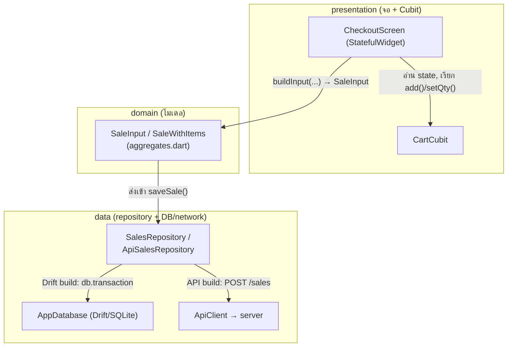
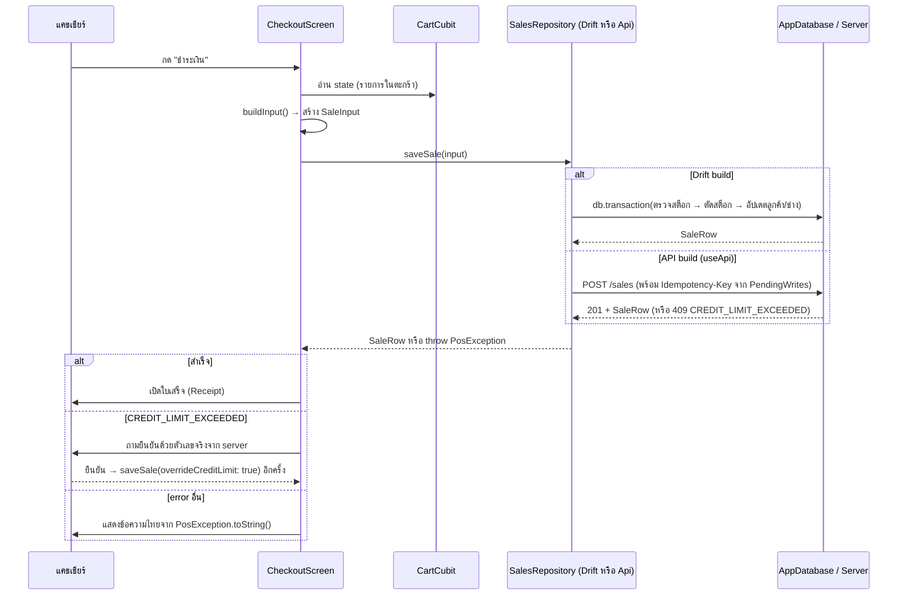

# 04 — Frontend: แอป Flutter ทำงานยังไง

บทนี้ตอบคำถาม: "แอปที่แคชเชียร์กดใช้ทุกวันสร้างจากอะไร, โครงสร้างข้างในเป็นยังไง, และทำไมเลือก Flutter/state
management/routing แบบนี้"

---

## 🧭 ก่อนอ่าน

- **ต้องอ่านมาก่อน:** [00_index.md](00_index.md) (พื้นฐาน client/server, HTTP, JSON, Git, terminal),
  [02_architecture.md](02_architecture.md) (ภาพรวมระบบ — Flutter คือกล่องไหนในภาพนั้น)
- **เวลาที่ใช้:** ~50–70 นาที
- **อ่านจบแล้วคุณจะ…**
  - อธิบายได้ว่า declarative UI / widget tree / state ต่างจาก imperative UI ที่คุณอาจเคยเห็นยังไง
  - รู้ว่า StatelessWidget กับ StatefulWidget ต่างกันตรงไหน และ Cubit เก็บ state ตรงไหน
  - ตามรอยได้ว่ากดปุ่ม "ชำระเงิน" 1 ครั้ง โค้ดไฟล์ไหนทำงานบ้าง ตามลำดับ
  - อธิบายได้ว่าทำไม repo นี้ทิ้ง Riverpod ไปใช้ flutter_bloc และทำไมมี "สลับได้สองโหมด" (Drift-only / API)
  - รู้ข้อจำกัดจริงของเครื่องมือ (build_runner บน path ภาษาไทย, web DB asset skew) และวิธีเลี่ยง

---

## 🧱 ปูพื้นฐาน

ส่วนนี้ยังไม่พูดถึงโปรเจกต์ — เป็น concept ทั่วไปที่ต้องมีก่อนอ่านโค้ดจริงในหัวข้อถัดไป

### 1. UI คืออะไร, frontend vs backend

**UI** (User Interface — ส่วนติดต่อผู้ใช้) คือทุกอย่างที่คนเห็นและกดได้บนจอ: ปุ่ม, ช่องกรอกข้อมูล,
ตาราง, ข้อความ **Frontend** คือโปรแกรมที่วาด UI และรันอยู่ **บนเครื่องของผู้ใช้** (มือถือ, พีซี,
เบราว์เซอร์) ส่วน **backend** (server) คือโปรแกรมที่รันอยู่บนเครื่องกลาง คอยตอบคำถามและ "ตัดสิน" ว่าอะไร
ถูก (อธิบายละเอียดใน [02_architecture.md](02_architecture.md) หัวข้อ client/server)

> **Analogy — ร้านอาหาร**: frontend คือโต๊ะ+เมนู+พนักงานเสิร์ฟที่ลูกค้าเห็น backend คือครัวที่ลูกค้าไม่เห็น
> แต่เป็นคนตัดสินว่า "วัตถุดิบหมดหรือยัง" บทนี้พูดถึงฝั่ง "โต๊ะ+เมนู" — บทที่ 06 พูดถึง "ครัว"

โปรเจกต์นี้ frontend คือแอป **Flutter** ตัวเดียวที่รันได้ 3 แบบ: แอป Android, แอป iOS, และเว็บเพจ (บน
เบราว์เซอร์) — คนละยุคกับ backend ที่อยู่คนละ repo คนละภาษา (บทที่ 06)

### 2. Native vs Web vs Cross-platform

การสร้างแอปมือถือ/เดสก์ท็อปมีอย่างน้อย 3 แนวทาง:

| แนวทาง | ทำงานยังไง | ตัวอย่าง |
|---|---|---|
| **Native** | เขียนโค้ดแยกทุกแพลตฟอร์ม ใช้ภาษา/SDK ของแพลตฟอร์มนั้นตรงๆ | Swift (iOS), Kotlin (Android) |
| **Web** | เขียนเว็บเพจ (HTML/CSS/JS) รันในเบราว์เซอร์ ไม่ต้องติดตั้งอะไร | ยุค 1 ของโปรเจกต์นี้ (React ใน browser) |
| **Cross-platform** | เขียนโค้ดชุดเดียว คอมไพล์ออกได้หลายแพลตฟอร์ม | Flutter, React Native |

> **Analogy**: native เหมือนตัดชุดสูทสั่งตัดให้แต่ละคน (พอดีที่สุด แต่ทำใหม่ทุกครั้ง) web เหมือนเสื้อคลุม
> ผ้าเดียวใส่ได้ทุกคน (ง่าย เร็ว แต่ไม่พอดีเป๊ะ) cross-platform เหมือนชุดฟรีไซส์คุณภาพดีที่ปรับได้หลาย
> รูปร่าง — ไม่พอดีเป๊ะเท่าสั่งตัด แต่ตัดครั้งเดียวใช้ได้เกือบทุกคน ประหยัดแรงกว่ามาก

**Flutter** (framework จาก Google) คือ cross-platform ตัวที่ 3: เขียนด้วยภาษา **Dart** ชุดเดียว
คอมไพล์ออกเป็นแอป Android, iOS จริง (ไม่ใช่เว็บครอบ) และเว็บได้ในตัว — เหตุผลที่โปรเจกต์นี้เลือกอยู่ใน
หัวข้อ "ทางเลือก" ด้านล่าง

### 3. Declarative UI และ widget tree

UI มี 2 แนวคิดหลัก:

- **Imperative** (สั่งทีละขั้น) — โค้ดบอกทีละคำสั่งว่า "ไปหาปุ่มนี้ แล้วเปลี่ยนสีมันเป็นแดง" เหมือนสั่ง
  ช่างวาดรูปทีละจังหวะ
- **Declarative** (บอกผลลัพธ์ที่อยากได้) — โค้ดบอกแค่ "ตอนนี้ข้อมูลเป็นแบบนี้ หน้าตาควรเป็นแบบนี้" แล้ว
  framework ไปคำนวณเองว่าต้องเปลี่ยนอะไรบนจอบ้าง เหมือนบอกสถาปนิกว่า "อยากได้บ้านหน้าตาแบบนี้" แล้ว
  ปล่อยให้เขาคิดเองว่าต้องก่อ/ทุบผนังตรงไหน

Flutter เป็น declarative: ทุกอย่างบนจอคือ **widget** (ชิ้นส่วน UI — ปุ่ม, ข้อความ, ช่องว่าง ก็เป็น
widget หมด) และ widget ประกอบกันเป็น **widget tree** (โครงต้นไม้ — widget ใหญ่ห่อ widget เล็กๆ ไว้ข้างใน
ซ้อนกันเป็นชั้นๆ) เวลาข้อมูลเปลี่ยน เราไม่ไปสั่ง "เปลี่ยนสีปุ่มนี้" ตรงๆ แต่บอกว่า "state เปลี่ยนแล้ว" แล้ว
Flutter จะ **rebuild** (สร้างใหม่) เฉพาะส่วนของ tree ที่ต้องเปลี่ยน

Widget มี 2 แบบหลัก:

```dart
// ตัวอย่างสมมติ — StatelessWidget: ไม่มี state ของตัวเอง วาดตามค่าที่ส่งเข้ามา (props) เท่านั้น
class PriceTag extends StatelessWidget {
  final double price;
  const PriceTag(this.price, {super.key});

  @override
  Widget build(BuildContext context) => Text('฿$price');
}

// ตัวอย่างสมมติ — StatefulWidget: มี state ภายในที่เปลี่ยนได้ และต้อง rebuild เมื่อ state เปลี่ยน
class Counter extends StatefulWidget {
  const Counter({super.key});
  @override
  State<Counter> createState() => _CounterState();
}

class _CounterState extends State<Counter> {
  int _count = 0;
  void _increment() => setState(() => _count++); // บอก Flutter ว่า "state เปลี่ยนแล้ว ช่วย rebuild ที"

  @override
  Widget build(BuildContext context) => ElevatedButton(
    onPressed: _increment,
    child: Text('กดแล้ว $_count ครั้ง'),
  );
}
```

- **StatelessWidget** — ไม่มีอะไรเปลี่ยนแปลงภายในตัวมันเอง วาดซ้ำได้เหมือนเดิมทุกครั้งถ้า input เดิม
- **StatefulWidget** — มีตัวแปรภายใน (`_count`) ที่เปลี่ยนค่าได้ระหว่างที่แอปรันอยู่ และเรียก
  `setState(...)` เพื่อบอก Flutter ว่า "ข้อมูลเปลี่ยนแล้ว ไป rebuild widget นี้ใหม่"

### 4. State คืออะไร และทำไมมันยาก

**State** (สถานะ) คือข้อมูลที่ "จำ" อยู่ระหว่างที่โปรแกรมรัน แล้วมีผลต่อสิ่งที่แสดงบนจอ — เช่น ตะกร้าสินค้า
ตอนนี้มีอะไรบ้าง, ผู้ใช้ login อยู่หรือยัง, กะ (shift) เปิดอยู่ไหม

ทำไมมันยาก: เพราะ **หลายจอ (screen) ต้องเห็น state เดียวกัน** เช่น ตะกร้าสินค้าที่หน้า checkout ต้อง
ตรงกับยอดรวมที่แสดงในบิล ถ้าแต่ละ widget เก็บ state ของตัวเองแยกกัน จอหนึ่งจะเห็นข้อมูลเก่า อีกจอเห็นข้อมูล
ใหม่ — เหมือนพนักงาน 2 คนจดออเดอร์ลูกค้าคนละกระดาษ แล้วไม่บอกกัน ครัวจะสับสนว่าใครสั่งอะไรกันแน่

ทางแก้ทั่วไปคือแยก **state ไว้ที่เดียว ห่างจาก widget** (ไม่ผูกกับ widget ใดโดยเฉพาะ) แล้วให้ทุก widget
ที่ต้องการ "อ่าน" หรือ "แจ้งเปลี่ยน" ไปคุยกับที่เดียวกันนั้น — โปรเจกต์นี้ใช้รูปแบบที่เรียกว่า **Cubit**
(อธิบายในหัวข้อทางเลือกและของจริงด้านล่าง)

### 5. Reactive / Stream และ async / Future

- **Stream** (สายข้อมูลที่ไหลมาเรื่อยๆ) — เหมือนท่อน้ำที่มีข้อมูลใหม่ไหลเข้ามาเป็นระลอกๆ ไม่ใช่ครั้งเดียวจบ
  ตัวอย่าง: ยอดในลิ้นชักเงินสดที่อัปเดตทุกครั้งที่มีการขาย widget ที่ "ฟัง" (listen) stream จะรีเฟรชเองทุก
  ครั้งที่มีค่าใหม่ไหลเข้ามา — เรียกว่า **reactive** (ตอบสนองอัตโนมัติต่อข้อมูลที่เปลี่ยน)
- **Future** (ค่าที่ "จะได้" ในอนาคต) — ตัวแทนของงานที่ยังไม่เสร็จตอนนี้ แต่จะเสร็จทีหลัง เช่น "ขอข้อมูล
  สินค้าจากฐานข้อมูล" ใช้เวลาสักครู่ กว่าจะได้คำตอบ
- **async/await** — วิธีเขียนโค้ดที่ "รอ" Future โดยไม่ทำให้จอค้าง: `await` แปลว่า "รอผลลัพธ์ตรงนี้ก่อนไป
  บรรทัดถัดไป" แต่ระหว่างรอ แอปยังตอบสนองการกดปุ่มอื่นได้ตามปกติ (ต่างจากภาษาที่ไม่มี async ซึ่งถ้ารอ
  แบบ blocking จอจะค้างทั้งแอป)

```dart
// ตัวอย่างสมมติ
Future<List<Product>> loadProducts() async {
  final rows = await database.query('products'); // รอผลลัพธ์ ไม่ทำให้ UI ค้าง
  return rows.map(Product.fromRow).toList();
}
```

### 6. Routing

**Routing** (การนำทาง) คือการสลับหน้าจอ — กด "สินค้า" แล้วไปหน้าสินค้า, กด "ลูกค้า" แล้วไปหน้าลูกค้า
แต่ละหน้าจอมี "ที่อยู่" ของตัวเองเรียกว่า **route** (เส้นทาง) เช่น `/products`, `/customers` — คล้ายกับ URL
บนเว็บ (`https://shop.com/products`) เพราะจริงๆ แล้ว build เป็นเว็บได้ด้วย ที่อยู่พวกนี้ก็กลายเป็น URL จริง
บน address bar

### 7. Layered architecture (data → domain → presentation)

**Layered architecture** (สถาปัตยกรรมแบบแบ่งชั้น) คือการแบ่งโค้ดเป็นชั้นๆ แต่ละชั้นรู้แค่ชั้นที่อยู่ติด
กัน ไม่ยุ่งข้ามชั้น:

```
presentation (จอ, widget)   →  สิ่งที่คนเห็นและกด
        ↓ เรียกใช้
domain (โมเดล, กติกาธุรกิจ)  →  "การขาย 1 ครั้งประกอบด้วยอะไรบ้าง", DTO/Aggregate
        ↓ เรียกใช้
data (ฐานข้อมูล, network)   →  ที่เก็บข้อมูลจริง (SQLite ในเครื่อง / เรียก API)
```

> **Analogy — ร้านอาหาร**: presentation คือพนักงานเสิร์ฟที่รับออเดอร์และเสิร์ฟจาน domain คือใบสั่งอาหาร
> มาตรฐาน (นิยามว่า "ผัดกะเพราหมู" ประกอบด้วยอะไรบ้าง ไม่สนใจว่าใครทำ) data คือครัวจริงที่ผัดและวัตถุดิบ
> ในสต็อก พนักงานเสิร์ฟไม่เดินเข้าไปเปิดตู้เย็นเอง — สั่งผ่านใบสั่งเสมอ

เหตุผลที่แบ่งแบบนี้: ถ้าจอ (presentation) ไปยุ่งกับฐานข้อมูลตรงๆ พอวันหนึ่งเปลี่ยนที่เก็บข้อมูล (เช่นจาก
SQLite ในเครื่องเป็นเรียก server) ต้องไปแก้ทุกจอที่แตะฐานข้อมูล แต่ถ้ามีชั้นกลาง (**repository**) คั่นไว้
จอไม่ต้องรู้เลยว่าข้อมูลมาจากไหน แค่เรียก `repo.getProducts()` เหมือนเดิม — สลับของจริงข้างในได้โดยจอไม่
ต้องแก้แม้แต่บรรทัดเดียว (ดู "ของจริงใน repo" หัวข้อ `useApi` ด้านล่าง — นี่คือเหตุผลที่โปรเจกต์นี้ทำแบบ
นี้ได้จริง ไม่ใช่แค่ทฤษฎี)

### 8. Repository pattern และ dependency injection

- **Repository pattern** (รูปแบบที่เก็บ) — สร้าง class หนึ่งตัวต่อ "กลุ่มข้อมูล" หนึ่งกลุ่ม (เช่น
  `ProductsRepository`, `SalesRepository`) เป็นประตูเดียวที่จอต้องผ่านเพื่อเข้าถึง/แก้ข้อมูลนั้น จอไม่รู้
  ว่าข้างในเก็บยังไง (ฐานข้อมูลในเครื่อง หรือยิง network ไป server)
- **Dependency injection (DI)** (การฉีดของที่ต้องใช้เข้ามาจากภายนอก แทนที่จะสร้างเองข้างใน) — แทนที่จอจะ
  เขียน `final repo = ProductsRepository()` เองข้างใน (ผูกติดกับ implementation ตัวใดตัวหนึ่งตายตัว) จอ
  ขอ (`context.read<ProductsRepository>()`) จากจุดกลางที่ "ประกอบ" (wire) ให้ตอนแอปเริ่มทำงาน จุดกลางนั้น
  จะเลือกว่าจะยื่นตัวไหนให้ (ดูหัวข้อ `useApi` ด้านล่าง — สลับได้โดยจอไม่รู้ตัว)

> **Analogy**: DI เหมือนร้านอาหารที่ไม่ให้พนักงานแต่ละคนไปเดินซื้อวัตถุดิบเอง (ต่างคนต่างไปคนละร้าน ราคา
> ไม่นิ่ง) แต่มีคนกลาง (ผู้จัดการ) สั่งวัตถุดิบมาให้ทุกคนจากที่เดียวกัน — เปลี่ยนซัพพลายเออร์ทีเดียว
> ทุกคนก็ได้ของใหม่พร้อมกัน โดยไม่ต้องบอกพนักงานแต่ละคน

### 9. Local database on device

**Local database** (ฐานข้อมูลในเครื่อง) คือที่เก็บข้อมูลถาวรบนตัวอุปกรณ์เอง (ไม่ใช่แค่ตัวแปรในหน่วยความจำ
ที่หายเมื่อปิดแอป) เหมาะกับแอปที่ต้องทำงานได้แม้ไม่มีเน็ต ตัวเลือกที่ใช้กันทั่วไปมีหลายระดับ ตั้งแต่ไฟล์
key-value ง่ายๆ ไปจนถึงฐานข้อมูลเชิงสัมพันธ์ (relational database) เต็มรูปแบบแบบ SQLite — โปรเจกต์นี้ใช้
**Drift** ซึ่งเป็นตัวช่วยเขียน/อ่าน SQLite ด้วยภาษา Dart แทนการเขียน SQL string ตรงๆ (รายละเอียดเปรียบเทียบ
ตัวเลือกอยู่ด้านล่าง และรายละเอียดฐานข้อมูลเชิงลึกอยู่ในบท [07_database.md](07_database.md))

---

## 🔥 ปัญหาจริงของร้าน

โปรเจกต์นี้ไม่ได้เริ่มจาก Flutter ตั้งแต่แรก — มันย้ายมาจากของเดิม เหตุผลที่ต้องย้าย (จาก
[00_index.md](00_index.md) และ `CLAUDE.md`):

1. **ยุค 1 คือเว็บ React รันในเบราว์เซอร์ เก็บข้อมูลใน `localStorage`** — มีปัญหาจริงหลายข้อ:
   - **Storage limit**: `localStorage` ของเบราว์เซอร์ทั่วไปเก็บได้จำกัด (มักไม่กี่ MB ต่อ origin) ร้านที่
     มีสินค้าเป็นพัน มีบิลสะสมเป็นปี ข้อมูลจะเต็มพื้นที่นี้ได้จริง
   - **ไม่มี type (no types)**: JavaScript ธรรมดาไม่บังคับชนิดข้อมูล ตัวแปรที่ควรเป็นตัวเลขอาจกลายเป็น
     string โดยไม่มีใครเตือนจนกว่าจะพังตอนรัน (runtime) ต่างจาก Dart ที่มี type system ตรวจตอน compile
   - **Testing ยาก**: โค้ดยุค 1 ผสม UI กับ logic ธุรกิจ (การคิดสต็อก, แต้มสะสม) ปนกันในไฟล์เดียว
     (`pos/db.js` + `.jsx`) ทำให้เขียน automated test แยกทดสอบ logic ธุรกิจโดยไม่ต้องเปิดหน้าเว็บได้ยาก
   - **ข้อมูลอยู่กับเครื่อง/เบราว์เซอร์เดียว** — เปิดคนละเครื่องหรือล้าง cache ข้อมูลหาย (ปัญหาเดียวกับที่
     อธิบายไว้ใน [02_architecture.md](02_architecture.md) หัวข้อ "จุดเริ่ม: โปรแกรมเดียว บนเครื่องเดียว")
2. **ต้องการรันได้ทั้ง Android/iOS/Web จาก "โค้ดชุดเดียว"** — ร้านอะไหล่ต้องการทั้งแอปมือถือให้พนักงานพก
   เดินสแกนสต็อก และหน้าจอพีซีหน้าเคาน์เตอร์ ถ้าเขียนแยกทุกแพลตฟอร์ม (native) ต้องดูแลโค้ด 2-3 ชุดคู่ขนาน
   แก้บั๊กหนึ่งจุดต้องไปแก้ซ้ำหลายที่
3. **Thai UI parity กับ `db.js`** — ร้านใช้งานจริงมาก่อนแล้วด้วยยุค 1 ข้อความภาษาไทยทุกจุด (ข้อความ error,
   ป้ายสถานะ, ชื่อปุ่ม) ต้อง **เหมือนเดิมทุกตัวอักษร** ไม่งั้นพนักงานที่คุ้นมือกับของเก่าจะสับสน — นี่คือ
   เหตุผลที่ CLAUDE.md ย้ำว่า "ห้ามแปล Thai string ใหม่ ต้องก็อปจาก `db.js`/`.jsx` เป๊ะ"

---

## ⚖️ ทางเลือก → ทำไมเลือกอันนี้

### Flutter vs React Native vs Native vs คงเว็บเดิมไว้

| ทางเลือก | ข้อดี | ข้อเสีย/เหตุผลที่ไม่เลือก |
|---|---|---|
| **Flutter** (เลือก) | โค้ด Dart ชุดเดียว → Android/iOS/Web จริง (compile เป็น native ไม่ใช่ webview ครอบ); widget/render engine ของตัวเอง หน้าตาเหมือนกันทุกแพลตฟอร์ม | ต้องเรียนภาษา Dart ใหม่; app size ใหญ่กว่า native ล้วน |
| **React Native** | ถ้าทีมถนัด JavaScript/React มาก่อนอยู่แล้ว (ยุค 1 ก็เป็น React) จะย้ายง่ายกว่า | ใช้ native component ของแต่ละแพลตฟอร์มจริง ต่างจาก Flutter ที่วาดเองทั้งหมด — โปรเจกต์นี้ไม่ได้เลือกทาง React Native; ไม่มีบันทึกเหตุผลเปรียบเทียบเจาะจงใน CLAUDE.md/docs ที่ตรวจสอบได้ ณ ตอนเขียนบทนี้ |
| **Native แยกแพลตฟอร์ม** (Swift+Kotlin) | ประสิทธิภาพ/เข้าถึง hardware ดีที่สุด | ต้องเขียน+ดูแลโค้ด 2 ชุดคู่ขนาน ทีมเล็ก (owner คนเดียวดูแล) ทำไม่ไหว |
| **คงเว็บ React + localStorage เดิม** | ไม่ต้องเขียนใหม่ | ปัญหาที่อธิบายไว้ในหัวข้อก่อนหน้า (storage limit, no types, testing) ยังอยู่ครบ |

เหตุผล: เพราะต้องการ **หลายแพลตฟอร์มจากทีมเล็ก** + **แก้ปัญหา storage/type/testing ของยุค 1** → จึงต้องใช้
framework cross-platform ที่คอมไพล์เป็นแอปจริง → **ราคาที่จ่าย** คือทีมต้องเรียน Dart/Flutter ใหม่ทั้งหมด

### State management: Riverpod → flutter_bloc

โปรเจกต์เริ่มด้วย **Riverpod** ก่อน แล้วย้ายมา **flutter_bloc** เมื่อ 2026-07-14
(`docs/handoff_log/riverpod-to-bloc.md`) migration เสร็จสมบูรณ์ครบ 12 ขั้นตามแผน — แต่**เอกสารที่ตรวจสอบได้
ในบันทึกนี้ไม่ได้บันทึกเหตุผลเชิงเปรียบเทียบว่า "ทำไมทิ้ง Riverpod"** (`docs/handoff_log/riverpod-to-bloc.md`
เล่าแค่ว่าทำอะไรไปแล้วและ verify ยังไง ไม่มีย่อหน้าอธิบายแรงจูงใจ) — ไฟล์แผนต้นทาง
`docs/plans/riverpod-to-bloc.md` ที่ควรมีเหตุผลก็ไม่มีอยู่ในโค้ด ณ วันที่เขียนบทนี้ (2026-09-25) แล้ว
(ถูกอ้างถึงในบันทึกว่า archived) จึงบอกตรงๆ ตามกฎของชุดเอกสารนี้ว่า **ไม่พบเหตุผลที่บันทึกไว้จริง** — รู้
แค่ว่าย้ายไปแล้วและ `flutter_riverpod` ถูกถอดออกจาก `pubspec.yaml` ทั้งหมด

สิ่งที่ยืนยันได้จริงจากไฟล์นั้น: หลังย้าย `dart analyze` สะอาด, `flutter test` ผ่าน 122/122, ไฟล์ provider
เก่า (`providers.dart`, `shift_providers.dart`, `pending_quote_provider.dart`) ถูกลบทั้งโฟลเดอร์ และแทนที่
ด้วย `lib/presentation/repositories/repository_providers.dart` (ใช้ flutter_bloc `RepositoryProvider`) กับ
`lib/presentation/blocs/` (เก็บ Cubit)

### go_router

เลือก **go_router** (package ทางการจากทีม Flutter สำหรับ routing แบบ declarative, มี URL/deep-link
support) — โปรเจกต์นี้ต้อง route ทับ nested shell (nav bar คงอยู่ ส่วนเนื้อหาเปลี่ยน) และต้องรองรับทั้งเว็บ
(URL ใน address bar) ทำให้ router แบบ built-in ของ `Navigator` เดิม (imperative, push/pop เอง) เขียน
guard/redirect (เช่นบังคับ login ก่อนเข้าทุกหน้า) ได้ยากกว่า go_router ที่มี `redirect` callback ในตัว
(ดูโค้ดจริงหัวข้อถัดไป)

### Local database: Drift vs raw sqlite3 vs Hive vs shared_preferences

| ทางเลือก | เหมาะกับ | ทำไมไม่เลือก (สำหรับ POS นี้) |
|---|---|---|
| **Drift** (เลือก) | ข้อมูลเชิงสัมพันธ์ (ตาราง มี foreign key, join, transaction) เขียน query เป็น Dart type-safe, generate โค้ดให้ | ต้องมีขั้นตอน codegen (`build_runner`) เพิ่ม |
| **raw `sqlite3` package ตรงๆ** | ควบคุมทุกอย่างเอง | ต้องเขียน SQL string เอง ไม่มี type-safety, เสี่ยง SQL injection/พิมพ์ผิดคอลัมน์ตอน runtime |
| **Hive** | เก็บ object แบบ key-value เร็ว เหมาะข้อมูลไม่ซับซ้อน | ไม่เหมาะกับข้อมูลที่ต้อง join/transaction ข้ามตารางแบบ POS (บิล 1 ใบแตะหลายตาราง — สินค้า ลูกค้า ช่าง แต้มสะสม พร้อมกัน) |
| **`shared_preferences`** | เก็บค่าตั้งค่าเล็กๆ (true/false, string สั้นๆ) | ไม่ใช่ฐานข้อมูล เก็บข้อมูลจำนวนมาก/มีโครงสร้างซับซ้อนไม่ได้ |

เหตุผล: เพราะการขาย 1 บิลต้องแตะหลายตารางพร้อมกันแบบ "ทั้งหมดหรือไม่มีเลย" (atomic transaction — อธิบาย
ต่อในหัวข้อ `saveSale` ด้านล่าง) → ต้องมีฐานข้อมูลเชิงสัมพันธ์ที่รองรับ transaction จริง → Drift ให้ทั้ง
SQLite (รองรับ transaction) และ type-safety (คอลัมน์ผิดชนิด/ผิดชื่อ compile ไม่ผ่านเลย ไม่ต้องรอไปพังตอน
รัน) ราคาที่จ่ายคือต้องรัน `build_runner` ทุกครั้งที่แก้ตาราง (และมีข้อจำกัดเรื่อง path ภาษาไทย — ดูหัวข้อ
"บทเรียนจากของจริง")

`shared_preferences` ก็ยังใช้อยู่ในโปรเจกต์นี้ (ดู `pubspec.yaml`) แต่ใช้เก็บของเล็กๆ อย่าง token เท่านั้น
ไม่ใช่แทน Drift

---

## 🔍 ของจริงใน repo

### 1. `main.dart` + `app.dart` — จุดเริ่มต้นของแอปและ provider tree

`frontend/lib/main.dart:22-62`:

```dart
void main() {
  WidgetsFlutterBinding.ensureInitialized();
  GoogleFonts.config.allowRuntimeFetching = false;
  final db = AppDatabase.open();
  runApp(
    MultiRepositoryProvider(
      providers: repositoryProviders(db),
      child: MultiBlocProvider(
        providers: [
          BlocProvider<ThemeModeCubit>(create: (_) => ThemeModeCubit()),
          BlocProvider<FontScaleCubit>(create: (_) => FontScaleCubit()),
          BlocProvider<PendingQuoteCubit>(create: (_) => PendingQuoteCubit()),
          BlocProvider<CartCubit>(create: (_) => CartCubit()),
          BlocProvider<AuthCubit>(create: (ctx) { /* ... */ }),
        ],
        child: const SrisurartApp(),
      ),
    ),
  );
}
```

อธิบายทีละส่วน:
- `AppDatabase.open()` เปิดฐานข้อมูล Drift/SQLite จริงบนเครื่อง (ตัวเดียวทั้งแอป) แล้วส่งต่อให้ทุก
  repository ใช้ร่วมกัน
- `MultiRepositoryProvider` คือจุด **dependency injection** ตามที่อธิบายในหัวข้อปูพื้นฐาน — ประกอบ
  (`repositoryProviders(db)`) แล้ววางไว้เหนือ widget tree ทั้งหมด จอไหนก็ตามที่อยู่ใต้จุดนี้เรียก
  `context.read<ProductsRepository>()` ได้เลย โดยไม่ต้องรู้ว่าตัวจริงมาจากไหน
- `MultiBlocProvider` วาง Cubit หลักๆ ของแอปไว้ที่ระดับบนสุดเช่นกัน — `CartCubit` (ตะกร้าสินค้า) ต้องอยู่
  ตรงนี้เพราะถูกใช้ทั้งจากหน้า checkout และหน้าใบเสนอราคา (quote → checkout)
- ทำไมทำท่านี้: ถ้าไม่ทำ ทุกจอต้องสร้าง repository/Cubit ของตัวเอง ข้อมูลจะไม่ตรงกันข้ามจอ (ตรงปัญหา
  "state ทำไมยาก" ที่อธิบายไว้ข้างต้น) — ถ้าไม่ทำแบบนี้ ตะกร้าที่หน้า checkout กับยอดที่แสดงในใบเสร็จจะ
  คนละชุดกัน

`frontend/lib/app.dart:65-90` (ส่วน build ของ `SrisurartApp`):

```dart
Widget build(BuildContext context) {
  final fontScale = context.watch<FontScaleCubit>().state;
  return MaterialApp.router(
    title: 'Srisurart POS',
    debugShowCheckedModeBanner: false,
    routerConfig: _router,
    theme: widget.themeOverride ?? AppTheme.light,
    darkTheme: widget.themeOverride ?? AppTheme.dark,
    themeMode: context.watch<ThemeModeCubit>().state,
    // ... localizationsDelegates (Material/Widgets/Cupertino) ...
    supportedLocales: const [Locale('th'), Locale('en')],
    locale: const Locale('th'),
    builder: (context, child) {
      return MediaQuery(
        data: MediaQuery.of(context).copyWith(textScaler: TextScaler.linear(fontScale)),
        child: child!,
      );
    },
  );
}
```

`context.watch<FontScaleCubit>()` คือจุด **reactive**: ทุกครั้งที่ค่า font scale เปลี่ยน (ผู้ใช้ปรับขนาด
ตัวอักษรในตั้งค่า) widget นี้จะ rebuild อัตโนมัติ ไม่ต้องมีใครไปสั่ง `setState` เอง — `watch` ต่างจาก
`read` (ที่ใช้ใน `main.dart`) ตรงที่ `watch` จะ "subscribe" ให้ widget รีเฟรชเมื่อค่าเปลี่ยน ส่วน `read` แค่
"หยิบมาใช้ครั้งเดียวตอนนี้" ไม่ subscribe

### 2. `app_router.dart` — ShellRoute และ AppShell

`frontend/lib/core/router/app_router.dart:140-151`:

```dart
ShellRoute _buildShell() => ShellRoute(
  builder: (context, state, child) => AppShell(child: child),
  routes: [
    GoRoute(
      path: AppRoutes.checkout,
      builder: (context, state) => const CheckoutScreen(),
    ),
    // ... อีก 12 GoRoute สำหรับหน้าอื่น (products, customers, mechanics, ...)
  ],
);
```

`ShellRoute` คือ route พิเศษที่ "ห่อ" route ลูกทั้งหมดไว้ในโครงเดียวกัน — ในที่นี้คือ `AppShell` (แถบนำ
ทาง/เมนูซ้าย) แถบนี้จะ**อยู่คงที่เสมอ** ไม่ว่าจะสลับไปหน้าไหนในลิสต์ (`checkout`, `products`, `customers`
...) เปลี่ยนแค่ `child` ตรงกลาง — ถ้าไม่มี ShellRoute แต่ละหน้าจะต้องวาดแถบเมนูเองซ้ำๆ และเมนูจะกระพริบ/
สร้างใหม่ทุกครั้งที่เปลี่ยนหน้า

ส่วนการล็อกอิน (`app_router.dart:63-102`): `buildAppRouter({AuthCubit? auth, ...})` — ถ้า build แบบ
Drift-only (ร้านใช้จริงตอนนี้) `auth` เป็น `null` ก็ไม่มี redirect เลย เข้าทุกหน้าได้ตรงๆ (ร้านเดียว ไม่มี
ใครอื่นใช้เครื่องนี้) แต่ถ้า build แบบ API (`USE_API_WRITES=true`, phase-1 multi-tenant) จะมี
`redirect: (context, state) => authRedirect(auth.state, state.uri)` คอยเช็คทุกครั้งที่เปลี่ยนหน้าว่า
login อยู่หรือยัง ถ้ายังไม่ login จะเด้งไป `/login` พร้อมจำหน้าที่ตั้งใจจะไปไว้ใน `?from=` — เชื่อมกับ
`useApi` switch ในหัวข้อถัดไป: นี่คือตัวอย่างที่ "flag เดียว" เปลี่ยนพฤติกรรมทั้งแอปโดยไม่ต้องแก้โค้ดจอ
อื่นเลย

### 3. `CartCubit` — ตัวอย่าง Cubit และการใช้ในจอ

`frontend/lib/presentation/blocs/cart_cubit.dart:49-91`:

```dart
class CartCubit extends Cubit<List<CartLine>> {
  CartCubit() : super(const []);

  double get subtotal => state.fold(0, (s, i) => s + i.price * i.qty);

  void clear() => emit(const []);

  /// เพิ่มสินค้า 1 ชิ้น คืนข้อความ error ถ้าเกินสต็อก มิฉะนั้นคืน null
  String? add(ProductRow p) {
    final existing = state.where((i) => i.productId == p.id).firstOrNull;
    final newQty = (existing?.qty ?? 0) + 1;
    if (newQty > p.stock) {
      return 'สต็อก "${p.name}" เหลือเพียง ${p.stock} ชิ้น';
    }
    if (existing != null) {
      emit([for (final i in state) i.productId == p.id ? i.copyWith(qty: newQty) : i]);
    } else {
      emit([...state, CartLine(productId: p.id, /* ... */ qty: 1)]);
    }
    return null;
  }
}
```

- `Cubit<List<CartLine>>` แปลว่า Cubit นี้เก็บ **state** เป็น `List<CartLine>` (รายการบรรทัดในตะกร้า) —
  ทุกครั้งที่เรียก `emit(...)` คือการ "ประกาศ state ใหม่" ให้ทุก widget ที่ subscribe อยู่รู้และ rebuild
- สังเกตว่า `emit` ทุกจุดสร้าง **List ใหม่เสมอ** (`[...state, ...]` หรือ `[for (...) ...]`) ไม่แก้ list
  เดิมในที่ (in-place) — คอมเมนต์ในไฟล์ (`cart_cubit.dart:1-6`) บอกเหตุผลตรงๆ ว่า "ทุก mutation สร้าง
  List instance ใหม่ (ไม่งั้น Cubit's `==` emit-skip จะกลืน rebuild ไป)" — ถ้าแก้ list เดิมในที่แล้ว
  emit ตัวเดิม Cubit จะเปรียบเทียบ (`==`) แล้วเห็นว่า "เหมือนเดิม" (เพราะเป็น object เดียวกัน) แล้ว**ไม่
  rebuild ให้** ตะกร้าจะไม่อัปเดตบนจอทั้งที่ข้อมูลเปลี่ยนจริง
- `add()` คืนค่า `String?` (ข้อความ error หรือ null) แทนที่จะ throw exception — เพราะการเกินสต็อกตอนกด
  "+1" ในตะกร้าเป็นกรณีปกติที่ต้องเตือนเฉยๆ ไม่ใช่ข้อผิดพลาดร้ายแรงที่ต้องหยุดทั้งแอป จอ (checkout_screen)
  เอาค่านี้ไปแสดงเป็น snackbar/ข้อความเตือน

### 4. `repository_providers.dart` — `useApi` switch (Drift vs API)

`frontend/lib/presentation/repositories/repository_providers.dart:50-124`:

```dart
List<RepositoryProvider> repositoryProviders(
  AppDatabase db, {
  // ...
  bool useApi = const bool.fromEnvironment('USE_API_WRITES'),
  bool useApiRepositories = true,
}) {
  // ...
  final driftSales = SalesRepository(db);
  final driftReturns = ReturnsRepository(db);
  final driftShifts = ShiftsRepository(db);

  final salesRepository = useApi
      ? ApiSalesRepository(api: client, db: db, drift: driftSales, /* ... */)
      : driftSales;
  final returnsRepository = useApi
      ? ApiReturnsRepository(api: client, db: db, drift: driftReturns)
      : driftReturns;
  // ...
}
```

- `bool.fromEnvironment('USE_API_WRITES')` อ่านค่าจากตอน build (`--dart-define=USE_API_WRITES=true`) —
  ไม่ใช่ตัวแปรที่เปลี่ยนตอนแอปกำลังรัน แต่ตัดสินใจตอน **compile** ว่าจะ build แอปสำหรับร้านจริง
  (Drift-only, ค่า default เป็น `false`) หรือ build สำหรับทดสอบ multi-tenant backend
  (`useApi = true`)
- ทั้งสองกรณีสร้าง `SalesRepository`/`ReturnsRepository`/`ShiftsRepository` (ตัว Drift) ไว้เสมอ — เพราะ
  `ApiSalesRepository` ยัง**ใช้ตัว Drift ข้างในสำหรับอ่านและ patch แถวในเครื่อง** เพียงแต่การเขียน
  (บันทึกบิลจริง) ไปที่ server ก่อน คอมเมนต์ในไฟล์ระบุชัดว่า `ApiRepository` ห้ามเรียก transactional
  service ของ Drift ตรงๆ (จะตัดสต็อกซ้ำสองครั้ง — อธิบายต่อในบทที่ 06)
- นี่คือตัวอย่างจริงของ **repository pattern + DI** ที่อธิบายไว้ในหัวข้อปูพื้นฐาน: จอ (`CheckoutScreen`)
  เรียก `context.read<SalesRepository>().saveSale(...)` เหมือนเดิมทุกประการ ไม่ว่า flag จะเป็น
  Drift หรือ API — จอไม่รู้และไม่ต้องรู้ว่าฝั่งไหนทำงานอยู่จริง
- คอมเมนต์บนสุดของไฟล์ (`repository_providers.dart:1-3`) เขียนว่า "the 13 repository providers" —
  แต่ค่านี้เป็นคอมเมนต์เก่าที่ตกยุคแล้ว: `CLAUDE.md` (ปรับปรุงล่าสุด) นับได้ **21 entries** (17 repos
  รวม `AuthRepository`, บวก `ApiClient`/`BootstrapService`/`DocCounterSeeder`/`SyncFacade`) ซึ่งนับ
  list ที่ return จริงในไฟล์นี้ก็ได้ 21 รายการตรงกัน — เป็นตัวอย่างเตือนใจว่า comment ในโค้ดไม่ใช่ความ
  จริงเสมอไป ต้องนับของจริง

### 5. `data/db/tables.dart` — หนึ่งตารางกับ schemaVersion

`frontend/lib/data/db/tables.dart:14-36`:

```dart
@DataClassName('ProductRow')
class Products extends Table {
  TextColumn get id => text()();
  TextColumn get partNo => text()();
  TextColumn get name => text()();
  TextColumn get nameTH => text()();
  TextColumn get category => text()();
  TextColumn get brand => text()();
  RealColumn get price => real()();
  RealColumn get cost => real()();
  IntColumn get stock => integer()();
  IntColumn get minStock => integer()();
  TextColumn get compat => text().nullable()();
  TextColumn get zone =>
      text().nullable()(); // legacy field, migrated to category on read
  DateTimeColumn get updatedAt => dateTime().nullable()();

  /// Schema v4 (#55): soft delete timestamp จาก server กันไม่ให้ cursor
  /// `?updatedSince=` ไปรื้อฟื้น product ที่ถูกลบไปแล้วกลับมา
  DateTimeColumn get deletedAt => dateTime().nullable()();

  @override
  Set<Column> get primaryKey => {id};
}
```

`Products extends Table` คือการนิยามตาราง SQLite หนึ่งตารางด้วยโค้ด Dart แทนการเขียน
`CREATE TABLE products (...)` เป็น SQL ตรงๆ — Drift จะอ่านคลาสนี้แล้ว **generate** โค้ด SQL จริงให้ตอนรัน
`build_runner` (ไฟล์ผลลัพธ์คือ `database.g.dart` ที่ commit ไว้ในโปรเจกต์)

`zone` เป็นฟิลด์เก่าที่ค้างไว้เฉยๆ (คอมเมนต์ในโค้ดเขียนตรงๆ ว่า "legacy field, migrated to category on
read") — ข้อมูลเก่าที่เคยเก็บโซนในร้าน ถูกย้ายไปใช้ `category` แทนแล้ว แต่คอลัมน์เดิมยังไม่ถูกลบออกจาก schema
(เก็บไว้กันพังกับข้อมูลเก่าที่ยัง migrate ไม่ครบ)

`price`/`cost` เป็น `real()` (จำนวนจริงมีทศนิยม) ส่วน `stock`/`minStock` เป็น `integer()` — ตรงกับ
คอมเมนต์บนสุดของไฟล์ที่ระบุ convention: "Currency/cost → real(); stock/qty/points → integer()"
`updatedAt`/`deletedAt` เป็น `.nullable()` เพราะ field พวกนี้เพิ่งมาทีหลัง (schema v4) และเขียนโดย server
เท่านั้น — แถวที่สร้างก่อนหน้านั้นไม่มีค่า ต้องเป็น null ได้

`frontend/lib/data/db/database.dart:72`: `int get schemaVersion => 11;` — เลขนี้คือเวอร์ชันของ "โครงสร้าง
ตาราง" ทั้งหมด ทุกครั้งที่เพิ่ม/แก้คอลัมน์ต้องเพิ่มเลขนี้ และ Drift จะรัน migration (โค้ดที่บอกวิธีแปลง
ฐานข้อมูลเวอร์ชันเก่าเป็นใหม่) ให้อัตโนมัติตอนเปิดแอปครั้งถัดไป — ถ้าลืมเพิ่มเลขนี้ตอนแก้ตาราง เครื่องที่มี
ฐานข้อมูลเก่าอยู่แล้วจะไม่รู้ว่าต้อง migrate และพัง

### 6. `SalesRepository.saveSale` — transaction จริงพร้อม Thai error

`frontend/lib/data/repositories/sales_repository.dart:36-71`:

```dart
Future<SaleRow> saveSale(SaleInput input) async {
  // 1. ตรวจสต็อกทุกบรรทัดก่อน (นอก transaction)
  final products = await db.select(db.products).get();
  final byId = {for (final p in products) p.id: p};

  final insufficient = <String>[];
  for (final item in input.items) {
    final p = byId[item.productId];
    if (p == null) {
      insufficient.add('${item.name}: ไม่พบในสต็อก');
    } else if (p.stock < item.qty) {
      insufficient.add('${p.name}: สต็อก ${p.stock} แต่ต้องการ ${item.qty}');
    }
  }
  if (insufficient.isNotEmpty) {
    throw Exception('สต็อกไม่พอ:\n${insufficient.join('\n')}');
  }

  // 2. ทุกอย่างข้างในนี้อยู่ใน transaction — throw ตรงไหนก็ rollback หมด
  return db.transaction(() async {
    final pointsGranted = pointsFor(input.total);
    // ตัดสต็อกแบบเข้มงวด (ห้าม clamp ที่ 0 — underflow คือบั๊ก ต้อง throw)
    for (final item in input.items) {
      final p = byId[item.productId]!;
      final newStock = p.stock - item.qty;
      if (newStock < 0) {
        throw Exception('Stock underflow on ${p.partNo} — race condition?');
      }
      await (db.update(db.products)..where((t) => t.id.equals(p.id)))
          .write(ProductsCompanion(stock: Value(newStock)).stamped);
    }
    // ... อัปเดตลูกค้า (totalSpend, points), ช่าง (totalSales, creditBalance) ต่อในโค้ดจริง
  });
}
```

- ทำอะไร: ตรวจสต็อกทุกบรรทัดก่อน (**pre-validate**) แล้วค่อยตัดสต็อกจริงข้างใน `db.transaction(...)`
- ทำไมแยกเป็น 2 ขั้น: การตรวจก่อนช่วยให้ error message ละเอียด (บอกได้ว่าสินค้าตัวไหนขาดเท่าไหร่ ก่อนจะ
  แตะฐานข้อมูลจริงเลย) ส่วน `db.transaction(...)` รับประกันว่า **ถ้ามีจุดไหน throw กลางทาง ทุกอย่างที่
  ทำไปแล้วในนั้นจะ rollback หมดอัตโนมัติ** (ตัดสต็อกไปแล้วครึ่งหนึ่ง แล้วเจอปัญหาช่วงอัปเดตลูกค้า → ต้อง
  ไม่เหลือสต็อกที่ตัดไปครึ่งทางค้างอยู่)
- ข้อความ `'สต็อกไม่พอ:\n...'` และ `'<name>: ไม่พบในสต็อก'` / `'<name>: สต็อก X แต่ต้องการ Y'` เป็นข้อความ
  ที่ต้อง**ตรงกับ `pos/db.js` เป๊ะ** ตามกฎ Thai parity — ห้ามแก้คำแม้แต่นิดเดียว เพราะพนักงานที่คุ้นเคยกับ
  ของเก่าจะสับสน
- ถ้าไม่ทำแบบนี้ (ไม่มี transaction): กรณีเน็ตไฟกระพริบ/แอปแครชกลางขั้นตอน อาจเหลือสต็อกที่ตัดไปแล้วแต่
  ไม่มีบิลบันทึกคู่กัน ข้อมูลจะไม่ตรงกับความจริงถาวร

### 7. `ApiClient` + `rethrowThai` — `ApiException` ต้องไม่ถึงจอ

`frontend/lib/data/repositories/api/api_wire.dart:77-99`:

```dart
/// รัน [body] แล้วแปลง [ApiException] เป็น Exception ธรรมดาที่จอรู้จักอยู่แล้ว
Future<T> rethrowThai<T>(Future<T> Function() body) async {
  try {
    return await body();
  } on ApiException catch (e) {
    throw PosException(e.code, e.thaiMessage, e.details);
  }
}

/// เฉพาะ 4xx เท่านั้นที่ถือเป็น "คำตอบสุดท้าย" จาก server
bool isVerdict(ApiException e) => e.statusCode < 500 && e.statusCode != 429;
```

คอมเมนต์ต้นไฟล์ (`api_wire.dart:11-22`) อธิบายเหตุผลตรงๆ ว่าทำไมต้องมีฟังก์ชันนี้: จอ (เช่น
`returns_screen.dart:242`, `cash_drawer_screen.dart:211`) แสดง error ด้วย
`e.toString().replaceFirst('Exception: ', '')` — ถ้าปล่อยให้ `ApiException` ดิบๆ หลุดไปถึงจอ ผู้ใช้จะเห็น
ข้อความแบบ `ApiException(status: 409, code: ...)` ที่หน้าเคาน์เตอร์ ซึ่งไม่มีความหมายกับแคชเชียร์เลย
`rethrowThai` จึงแปลงทุก `ApiException` เป็น `PosException` ที่ `toString()` คืนประโยคภาษาไทยล้วนๆ ก่อน
โดยกฎนี้บังคับผ่าน `api_repository_contract_test.dart` (หนึ่งใน 65 test — ดูหัวข้อ testing) ให้ครอบคลุม
ทุกไฟล์ใน `data/repositories/api/` และ `data/repositories/api_*.dart`

`isVerdict` คือกฎสำคัญอีกข้อ: **เฉพาะ HTTP 4xx (ยกเว้น 429) เท่านั้นที่ถือว่า server ตอบขาดแล้ว** ส่วน 5xx
หรือ 429 หรือ timeout แปลว่า "ไม่รู้ว่าบิลไปถึง server แล้วหรือยัง" — ถ้าปฏิบัติเหมือน 5xx เป็นคำตอบสุดท้าย
แล้วให้แคชเชียร์กดขายซ้ำ อาจเกิดบิลซ้อนสอง (double-charge) เพราะบิลแรกอาจบันทึกสำเร็จแล้วแค่คำตอบหายไป
ระหว่างทาง

### 8. `PendingWrites` — id + Idempotency-Key มินต์ครั้งเดียวต่อตะกร้า

`frontend/lib/data/repositories/api/api_sales_repository.dart:81, 106-141` (ย่อ):

```dart
/// id + Idempotency-Key ของความพยายามที่ยังไม่ได้คำตอบสุดท้าย คีย์ด้วยตะกร้า
final PendingWrites _pending = PendingWrites('s');

Future<SaleRow> saveSale(SaleInput input) {
  return rethrowThai(() async {
    final attempt = _pending.of(_cartKey(input));   // มินต์ครั้งเดียวต่อตะกร้า
    // ...
    try {
      res = await _post(body, attempt.headers);       // ส่ง Idempotency-Key เดิมทุกครั้งที่ retry
    } on ApiException catch (e) {
      _pending.closeIfVerdict(attempt, e);            // ปิดเฉพาะเมื่อเป็นคำตอบสุดท้าย (isVerdict)
      // ...
    }
  });
}
```

`_pending.of(_cartKey(input))` คือหัวใจของกฎ "id และ `Idempotency-Key` มินต์ครั้งเดียวต่อตะกร้า ไม่ใช่
ครั้งเดียวต่อการกดปุ่ม" — ถ้าแคชเชียร์กด "ชำระเงิน" แล้วจอค้าง (เน็ตหลุดกลางทาง) แล้วกดซ้ำอีกครั้งสำหรับ
ตะกร้าใบเดิม การกดซ้ำนั้นจะได้ id/Idempotency-Key **ตัวเดิม** ที่ยังไม่ปิด (`_pending.closeIfVerdict` ปิด
เฉพาะตอนได้ 4xx จริง) — server เห็น Idempotency-Key ซ้ำก็รู้ว่า "นี่คือความพยายามเดิม" ไม่ใช่บิลใหม่
ถ้ามินต์ id ใหม่ทุกครั้งที่กด จะเลี่ยงกลไกกันบิลซ้ำของ server ไปเลย และเสี่ยงคิดเงินซ้ำจริงๆ

### 9. `money.dart` / `dates.dart` / `thai_format.dart`

`frontend/lib/core/utils/money.dart:12-23`:
```dart
String baht(num v) => '฿${_bahtFormat.format(v)}';           // ฿1,250.5
double round2(num v) => (v * 100).round() / 100;               // Math.round(v*100)/100 เป๊ะ
int pointsFor(num total) => (total / 10).floor();               // Math.floor(total/10)
```
ทั้งสามฟังก์ชันนี้มีอยู่เพื่อ **ให้ผลลัพธ์ตัวเลขตรงกับสูตรใน `pos/db.js` เป๊ะ** — ทำไมสำคัญ: ถ้าเขียนสูตร
ปัดเศษเองใหม่ (เช่นใช้ `toStringAsFixed` ตรงๆ) อาจได้ผลต่างจาก JS ในบางค่า (การปัดเศษ half-to-even vs
half-up ต่างกันได้) ยอดเงินที่ไม่ตรงกันแม้แค่สตางค์เดียวก็เป็นปัญหาการเงินจริง — ทั้งแอปจึงห้าม inline
`'฿${...toStringAsFixed(...)}'` เอง ต้องผ่านฟังก์ชันกลางเหล่านี้เท่านั้น (กฎใน "Conventions" ของ
`CLAUDE.md`)

`frontend/lib/core/utils/dates.dart:6-12` ใช้ **local time** ไม่ใช่ UTC (`d.toIso8601String().substring(0,10)`
บน `DateTime` local) — เพราะ "วันนี้" ต้องตรงกับนาฬิการ้าน ไม่ใช่นาฬิกา UTC ที่อาจเป็นคนละวันกับเวลาไทย

`frontend/lib/presentation/widgets/thai_format.dart:17-19` แปลงปี ค.ศ. เป็น พ.ศ. เอง (`d.year + 543`) เพื่อ
ให้ใบเสร็จ/รายงานแสดงปีแบบไทย (`thaiDate`, `thaiDateSlash`) — ทั้งสามไฟล์นี้คือตัวอย่างของหลักการ "เขียน
ที่เดียว ใช้ทุกที่" (single source of truth) ที่ CLAUDE.md ย้ำว่าห้ามมี formatter ส่วนตัวแยกในแต่ละไฟล์จอ

### 10. `setState` กับ arrow form + `Future` — บั๊กที่เคยซ่อนอยู่

CLAUDE.md ระบุกฎ: `setState(() { x = ...; })` ต้องใช้ brace form เสมอเมื่อค่าที่ assign เป็น `Future` ห้าม
ใช้ arrow form (`setState(() => x = ...)`) เพราะ arrow form จะ **return ค่าของ Future นั้นออกจากตัว
callback**, และ `setState` มี assertion (เฉพาะ debug build) ที่เช็คว่า callback ต้องไม่ return ค่าอะไร —
ถ้า return มันจะ throw assertion error

โค้ดจริงในโปรเจกต์ทำถูกตามกฎอยู่แล้ว — `frontend/lib/presentation/screens/checkout_screen.dart:129-131`:

```dart
void _refreshParked() => setState(() {          // ตัวเมธอดเองใช้ arrow ได้ (ไม่ได้ return Future)
  _parkedFuture = context.read<ParkedRepository>().getParked();   // ข้างใน setState ใช้ brace {}
});
```

จุดที่ต้องสังเกตให้ถูก: **`void _refreshParked() =>` เป็น arrow form ของเมธอด** (แค่ทางลัดเขียนฟังก์ชัน
บรรทัดเดียว ไม่เกี่ยวกับกฎนี้) ส่วน `setState(() { ... })` ที่อยู่ข้างใน — นี่ต่างหากที่ต้องเป็น **brace
form** เพราะข้างในมีการ assign ค่าที่เป็น `Future` (`_parkedFuture = ...`) ให้กับตัวแปร state — ถ้าเขียน
เป็น `setState(() => _parkedFuture = context.read<...>().getParked())` (arrow form ของตัว callback เอง)
จะ trip assertion นั้นทันที

`docs/handoff_log/riverpod-to-bloc.md` (ผ่าน `AGENTS.md:465-469`) บันทึกไว้ว่าเคยมี **6 จุดที่พลาดกฎนี้จริง
ในโค้ด** และถูกแก้ในรอบ migration — จุดหนึ่งซ่อนอยู่ใน catch ของบิลที่ถูกปฏิเสธใน checkout_screen ซึ่งแปล
ว่า**ทุกครั้งที่บิลถูกปฏิเสธในโหมด debug จะชน assertion นี้** — แต่ไม่มีใครสังเกตเห็นตอนใช้งานจริงเพราะ
ร้านรัน **release web build** ซึ่ง assertion แบบนี้ (debug-only) จะถูกคอมไพล์ทิ้งไปเลย บทเรียนคือ: บั๊กที่
"หายไปเอง" ใน release build ไม่ได้แปลว่าไม่มีบั๊ก — มันแค่ไม่มีใครมองเห็นตอนใช้งานจริง (ดูหัวข้อ "บทเรียน
จากของจริง" ด้านล่างเพิ่มเติม)

### แผนภาพ: layer diagram ของ frontend



### แผนภาพ: sequence ของการกด "ชำระเงิน" (checkout_screen.dart)

`frontend/lib/presentation/screens/checkout_screen.dart:612-635` เรียก `salesRepo.saveSale(...)` แล้วดัก
`PosException` เพื่อถามยืนยันใหม่กรณีเครดิตเกินวงเงิน (`CREDIT_LIMIT_EXCEEDED`):



---

## 🛠️ เทคนิคในบทนี้

### 1. Repository pattern + Dependency Injection (DI)

**คืออะไร**: สร้าง class ประตูเดียว (`SalesRepository`, `ProductsRepository`, …) ที่จอทุกจอต้องผ่านเพื่อ
อ่าน/เขียนข้อมูลกลุ่มหนึ่ง แล้ว "ฉีด" (inject) instance จริงเข้ามาจากจุดกลาง (`main.dart`) แทนที่จอจะสร้าง
เองตรงๆ — เหมือนร้านอาหารที่มีผู้จัดการสั่งวัตถุดิบให้ทุกคนจากที่เดียว แทนที่พนักงานแต่ละคนจะไปซื้อเอง

**ปัญหาที่มันแก้**: ถ้าจอ (เช่น `CheckoutScreen`) เขียน `AppDatabase.open()` และ query SQLite ตรงๆ เอง
วันที่ต้องเปลี่ยนจาก Drift-only ไปยิง API (phase 1 ของโปรเจกต์นี้) ต้องไปแก้ **ทุกจอ** ที่เคยแตะฐานข้อมูล
ตรงๆ — งานย้ายระบบทั้งก้อนจะกลายเป็นงานแก้โค้ดหลายสิบไฟล์พร้อมกัน เสี่ยงพลาดบางจุด

**ทำไมเลือกท่านี้ (เทียบกับให้จอสร้าง dependency เอง)**: ถ้าจอสร้าง `SalesRepository()` เองตรงๆ
(`final repo = SalesRepository(db)`) จอจะผูกติดกับ implementation ตัวเดียวตายตัว สลับไม่ได้เลยโดยไม่แก้
โค้ดจอ — การฉีดจากภายนอกทำให้จุดตัดสินใจ "จะใช้ตัวไหน" อยู่ที่**เดียว** (`repository_providers.dart`)

**ดียังไง / ราคาที่จ่าย**: สลับ Drift ↔ API ได้ด้วยธง (`useApi`) เดียวโดยไม่แตะโค้ดจอเลยสักบรรทัด (ดู
เทคนิคที่ 3) — ราคาคือมี layer พิเศษ (interface + provider tree) ที่ต้องเข้าใจก่อนจะรู้ว่า "ข้อมูลจริงๆ
มาจากไหน" อ่านโค้ดจอเพียวๆ ไม่พอ ต้องตามไปดู `main.dart`/`repository_providers.dart` ด้วย

**อยู่ตรงไหนใน repo**: `frontend/lib/main.dart:22-62` (`MultiRepositoryProvider`),
`frontend/lib/presentation/repositories/repository_providers.dart:50-124`

### 2. Cubit (state container ของ flutter_bloc)

**คืออะไร**: class ที่เก็บ state หนึ่งก้อน (เช่น `CartCubit` เก็บ `List<CartLine>`) และประกาศ state ใหม่
ด้วย `emit(...)` — widget ที่ "ฟัง" (`context.watch`) จะ rebuild อัตโนมัติทุกครั้งที่มี state ใหม่ประกาศ
เข้ามา โดยไม่ต้องมีใครไปสั่ง "รีเฟรชจอนี้" ตรงๆ

**ปัญหาที่มันแก้**: ถ้าแต่ละ widget เก็บ state ของตัวเอง (เช่นตะกร้าสินค้าเก็บใน `State` ของ
`CheckoutScreen` ตรงๆ) หน้าอื่นที่ต้องรู้ว่าตะกร้ามีอะไรบ้าง (เช่น badge จำนวนสินค้าบน nav bar) จะไม่มี
ทางเห็นข้อมูลเดียวกันได้ ต้องส่งผ่าน constructor/callback กันเป็นทอดๆ ซับซ้อนขึ้นเรื่อยๆ ตามจำนวนจอ

**ทำไมเลือกท่านี้ (เทียบกับ `setState` ธรรมดาในแต่ละ widget)**: `setState` ใช้ได้ดีกับ state ที่อยู่ใน
widget เดียวและไม่มีใครอื่นต้องรู้ (เช่น "แท็บไหนถูกเลือกอยู่ในจอนี้") แต่ state ที่ต้อง**ใช้ร่วมกันข้าม
จอ** (ตะกร้า, สถานะ login, กะที่เปิดอยู่) ต้องยกออกมาไว้ที่จุดกลางที่ทุกจอ subscribe ร่วมกันได้ — Cubit
คือทางเลือกที่เบากว่า Bloc เต็มรูป (ไม่มี event mapping ซับซ้อน) เหมาะกับ state ที่เปลี่ยนแบบตรงไปตรงมา

**ดียังไง / ราคาที่จ่าย**: ทุกจอเห็น state เดียวกันเสมอ ไม่มีทาง "จอหนึ่งเห็นข้อมูลเก่า อีกจอเห็นใหม่" —
ราคาคือทุก mutation ต้องสร้าง object/List **ใหม่เสมอ** (ห้ามแก้ของเดิม in-place) เพราะ Cubit เช็ค `==`
ก่อน rebuild ถ้า emit object เดิมที่แค่ถูกแก้ค่าข้างใน มันจะเข้าใจผิดว่า "ไม่มีอะไรเปลี่ยน" แล้วไม่
rebuild ให้ (บั๊กเงียบที่หาสาเหตุยาก ถ้าไม่รู้กฎนี้มาก่อน)

**อยู่ตรงไหนใน repo**: `frontend/lib/presentation/blocs/cart_cubit.dart:49-91` (คอมเมนต์บรรทัด 1-6
อธิบายกฎ "ทุก mutation สร้าง List ใหม่" ตรงๆ)

### 3. Layered architecture + compile-time strategy swap (`useApi` flag)

**คืออะไร**: แบ่งโค้ดเป็นชั้น `data → domain → presentation` และให้ชั้น `data` มี **สอง
implementation** ของ interface เดียวกัน (`SalesRepository` แบบ Drift กับ `ApiSalesRepository`) แล้ว
เลือกว่าจะประกอบตัวไหนเข้าแอป **ตอน build** ด้วยค่าคงที่จาก `--dart-define` — พูดง่ายๆ คือรูปแบบหนึ่งของ
**strategy pattern** (เปลี่ยนพฤติกรรมได้โดยสลับ object ที่ implement interface เดียวกัน) แต่สลับกัน
"ตอน compile" ไม่ใช่ "ตอนรัน"

**ปัญหาที่มันแก้**: โปรเจกต์นี้ต้องมีแอปสองแบบพร้อมกันชั่วคราว — แบบที่ร้านใช้จริงตอนนี้ (Drift-only,
ไม่มี server) กับแบบที่ทีมพัฒนาทดสอบ backend คู่ขนาน (ยิง API) ถ้าเขียนโค้ดจอแยกกันสองชุดสำหรับสองโหมด
จะดูแลยากขึ้นเป็นสองเท่า และพฤติกรรม (Thai error message, business rule) จะเบี้ยวไม่ตรงกันได้ง่าย

**ทำไมเลือกท่านี้ (เทียบกับสลับตอนรัน runtime toggle)**: การสลับตอน runtime (เช่นอ่านค่าจาก settings
ตอนเปิดแอป) ทำให้ต้องรองรับทั้งสองโหมดในไบนารีเดียวกันตลอดเวลา (โค้ดทั้งสองฝั่งถูกรวมอยู่ในแอปเดียว เพิ่ม
ขนาดไฟล์และความเสี่ยงว่าโหมดที่ "ไม่ได้ตั้งใจใช้" จะถูกเผลอเปิดในร้านจริง) การสลับตอน compile ทำให้
build ของร้านจริงไม่มีโค้ดฝั่ง API ปนอยู่เลยแม้แต่บรรทัดเดียวถ้าไม่ได้ตั้ง flag

**ดียังไง / ราคาที่จ่าย**: build ของร้านจริง (`USE_API_WRITES` default `false`) ปลอดภัยจากการเผลอยิง
network โดยไม่ได้ตั้งใจ — ราคาคือมี "สอง path" ที่ต้องทดสอบแยกกันจริงจัง (Drift path กับ API path) และ
บั๊กที่เกิดเฉพาะ path ใด path หนึ่งจะไม่โผล่จนกว่าจะมีคน build ด้วย flag นั้นจริงๆ

**อยู่ตรงไหนใน repo**: `frontend/lib/presentation/repositories/repository_providers.dart:58`
(`bool.fromEnvironment('USE_API_WRITES')`), ใช้สลับที่บรรทัด 112-124

### 4. Type-safe ORM + codegen (Drift)

**คืออะไร**: **ORM** (Object-Relational Mapping — ตัวช่วยแปลงระหว่างตารางฐานข้อมูลกับ object ในภาษา
โปรแกรมมิ่ง ไม่ต้องเขียน SQL ตรงๆ) ที่ตรวจชนิดข้อมูล/ชื่อคอลัมน์ตอน compile ได้ (**type-safe**) — Drift
คือ ORM แบบนี้สำหรับ SQLite ในโปรเจกต์นี้ นิยามตาราง SQLite ด้วยโค้ด Dart ธรรมดา (`class Products extends Table { ... }`) แทนการ
เขียน SQL string ตรงๆ แล้วให้เครื่องมือ (`build_runner`) **generate** โค้ด SQL/query จริงให้อัตโนมัติ
ตอน build

**ปัญหาที่มันแก้**: ถ้าเขียน SQL string เอง (เช่น `db.rawQuery("SELECT * FROM prodcuts")` พิมพ์ชื่อ
ตารางผิด) โปรแกรมจะ compile ผ่านสบายๆ แล้วไปพังตอนรันจริงเท่านั้น (runtime error) ยิ่งแอปมีหลายสิบ query
กระจายอยู่หลายไฟล์ ยิ่งเสี่ยงพิมพ์ผิดโดยไม่มีใครจับได้จนกว่าจะมีคนกดปุ่มที่ตรงกับ query นั้นพอดี

**ทำไมเลือกท่านี้ (เทียบกับเขียน SQL string เอง)**: การให้ Dart type system ตรวจสอบคอลัมน์/ชนิดข้อมูล
ตอน compile เปลี่ยน "บั๊กที่เจอตอนใช้งานจริงหน้าร้าน" ให้กลายเป็น "error สีแดงในตอนเขียนโค้ด" — เจอเร็ว
กว่าและแก้ถูกจุดกว่ามาก

**ดียังไง / ราคาที่จ่าย**: คอลัมน์ผิดชนิด/ผิดชื่อ compile ไม่ผ่านเลย ไม่ต้องรอไปพังตอนรัน — ราคาคือต้องรัน
`build_runner` ทุกครั้งที่แก้ตาราง (ขั้นตอนเพิ่ม, และมีข้อจำกัดเรื่อง path ภาษาไทยตามที่อธิบายด้านล่าง)

**อยู่ตรงไหนใน repo**: `frontend/lib/data/db/tables.dart:14-36`,
`frontend/lib/data/db/database.dart:72` (`schemaVersion`)

### 5. DB transaction: pre-validate ก่อน แล้วค่อย commit-or-rollback ทั้งก้อน

**คืออะไร**: แบ่งการขาย 1 บิลเป็น 2 ขั้น — ขั้นแรกตรวจสต็อกทุกบรรทัด**นอก** transaction (เพื่อสร้าง
error message ที่ละเอียดครบทุกจุดที่ผิดในครั้งเดียว) ขั้นสองค่อยทำการเปลี่ยนแปลงจริงทั้งหมด**ใน**
`db.transaction(...)` ที่ throw ตรงไหนก็ rollback ทุกอย่างที่ทำไปแล้วในนั้นให้กลับเป็นเหมือนไม่เคยทำอะไร

**ปัญหาที่มันแก้**: ถ้าตัดสต็อกทีละบรรทัดแบบ query แยกอิสระกัน (ไม่มี transaction) แล้วแอปแครชหรือเน็ต
กระพริบกลางทาง (เช่นตัดสต็อกไปแล้ว 2 ใน 3 บรรทัด) จะเหลือสต็อกที่ตัดไปแล้วครึ่งทางค้างอยู่ **โดยไม่มีบิล
บันทึกคู่กัน** — ของหายไปจากระบบโดยไม่มีร่องรอยว่าขายอะไรไปจริง

**ทำไมเลือกท่านี้ (เทียบกับตรวจสต็อกในทรานแซกชันเดียวกับการตัด)**: การแยกตรวจก่อน (pre-validate) ออกจาก
ทรานแซกชันทำให้สร้างข้อความ error ที่บอกได้ว่า "สินค้าตัวไหนขาดเท่าไหร่" ครบทุกบรรทัดในครั้งเดียว โดยยัง
ไม่ต้องแตะฐานข้อมูลจริงเลย ถ้าตรวจไปด้วยตัดไปด้วยในทรานแซกชันเดียว การเจอบรรทัดแรกที่พังจะทำให้ throw
ทันทีโดยไม่รู้ว่าบรรทัดถัดไปพังด้วยหรือเปล่า

**ดียังไง / ราคาที่จ่าย**: รับประกัน "ทั้งหมดหรือไม่มีเลย" (all-or-nothing) และให้ error message ที่มีประโยชน์
ครบในครั้งเดียว — ราคาคือมีการอ่านข้อมูล (pre-validate) สองรอบ (ตรวจ + อ่านจริงตอน transaction) ซึ่งมี
ช่องว่างเล็กๆ ที่ข้อมูลอาจเปลี่ยนระหว่างสองรอบนั้นได้ในทางทฤษฎี (จึงต้องมี "strict decrement — ห้าม clamp
ที่ 0" เป็นแนวป้องกันชั้นที่สองซ้อนอยู่ข้างในอีกที)

**อยู่ตรงไหนใน repo**: `frontend/lib/data/repositories/sales_repository.dart:36-71`

### 6. Idempotency-Key ที่มินต์ครั้งเดียวต่อ "ความพยายาม" ไม่ใช่ต่อการกด (`PendingWrites`)

**คืออะไร**: สร้าง `id` ของบิลกับ `Idempotency-Key` (ค่าที่บอก server ว่า "นี่คือคำขอเดิมหรือคำขอใหม่")
**ครั้งเดียว** ตอนเริ่มยิงบิลนั้น แล้วถือค่าเดิมไว้ใช้ซ้ำทุกครั้งที่ retry จนกว่าจะได้คำตอบที่เป็น
"คำตัดสินสุดท้าย" (verdict) จริงๆ — ไม่ใช่สร้างใหม่ทุกครั้งที่ผู้ใช้กดปุ่ม

**ปัญหาที่มันแก้**: เน็ตร้านไม่เสถียร กรณีที่เจอบ่อยคือ server บันทึกบิลสำเร็จแล้วแต่คำตอบหายระหว่างทาง
กลับมา ถ้าแคชเชียร์กดปุ่มซ้ำแล้วระบบสร้าง id+key **ใหม่** ทุกครั้ง server จะเห็นเป็นคนละคำขอ แล้วขาย
ซ้ำสอง (ตัดสต็อกสองเท่า คิดเงินลูกค้าสองเท่า)

**ทำไมเลือกท่านี้ (เทียบกับสร้าง key ใหม่ทุกครั้งที่กด)**: การผูก key เข้ากับ "ตะกร้า/ความพยายามหนึ่งครั้ง"
แทนที่จะผูกกับ "การกดปุ่มหนึ่งครั้ง" ทำให้ server รู้จำได้ว่านี่คือการพยายามส่งบิลเดิมซ้ำ ไม่ใช่บิลใหม่ —
กลไกนี้ทำงานคู่กับเทคนิคที่ 7 (`isVerdict`) เพื่อรู้ว่า "เมื่อไหร่ถึงควรปิดความพยายามนี้แล้วเริ่มใหม่ได้จริง"

**ดียังไง / ราคาที่จ่าย**: กดซ้ำได้อย่างปลอดภัยแม้เน็ตกระพริบ — ราคาคือ client ต้องมีตัวจัดการสถานะ
เพิ่ม (`PendingWrites`) คอยจำว่า "ตะกร้าไหนมี attempt ค้างอยู่" ถ้า implement ผิด (เผลอสร้าง key ใหม่
ตอน retry) กลไกทั้งหมดจะไร้ประโยชน์ทันทีโดยไม่มี error ให้เห็นชัดๆ ตอน dev

**อยู่ตรงไหนใน repo**: `frontend/lib/data/repositories/api/api_sales_repository.dart:81,106-141`

### 7. Verdict-based error classification (`isVerdict`) + กันไม่ให้ error ดิบหลุดถึงจอ (`rethrowThai`)

**คืออะไร**: แบ่ง error ที่ได้จาก server เป็น 2 กลุ่มอย่างเคร่งครัด — กลุ่มที่เป็น **verdict** (คำตัดสิน
สุดท้าย, เฉพาะ HTTP 4xx ที่ไม่ใช่ 429) กับกลุ่มที่ **ไม่รู้ผล** (5xx, 429, timeout) แล้วแปลง
`ApiException` ทุกตัวให้เป็น `PosException` ที่มีแต่ประโยคภาษาไทยล้วนๆ ก่อนถึงจอเสมอ

**ปัญหาที่มันแก้**: ถ้าปฏิบัติกับ 5xx/timeout เหมือนเป็นคำตอบสุดท้าย (เช่น "server บอกว่าไม่ได้ ลองบิล
ใหม่ได้เลย") ทั้งที่จริงๆ บิลอาจ commit สำเร็จไปแล้วแค่คำตอบหายกลางทาง จะเกิดบิลซ้อนสอง (double-charge)
และถ้าปล่อยให้ `ApiException` ดิบๆ ไปถึงจอ ผู้ใช้ (แคชเชียร์) จะเห็นข้อความแบบ `ApiException(status:
409, code: ...)` ที่ไม่มีความหมายกับคนหน้าร้านเลย

**ทำไมเลือกท่านี้ (เทียบกับถือว่า error ทุกชนิดคือ "ไม่สำเร็จ" เหมือนกันหมด)**: การแยกละเอียดตาม HTTP
status สะท้อนความจริงของโปรโตคอล HTTP เอง (4xx = server ประมวลผลจบแล้วปฏิเสธ, 5xx = server พังเอง
ไม่รู้ว่าประมวลผลไปถึงไหน) — ถ้าไม่แยก จะต้องเลือกฝั่งใดฝั่งหนึ่งแบบสุดโต่ง (ถือว่าทุก error คือ verdict
= เสี่ยง retry ไม่ได้ทั้งที่ควรได้, หรือถือว่าไม่มี error ไหนเป็น verdict = ไม่มีทาง "ปิดจบ" บิลที่ถูก
ปฏิเสธจริงได้เลย)

**ดียังไง / ราคาที่จ่าย**: ปลอดภัยจากบิลซ้อนสอง และหน้าจอแสดงข้อความที่คนอ่านเข้าใจได้เสมอ — ราคาคือทุก
`ApiRepository` ต้องเรียกผ่าน `rethrowThai` ให้ครบทุกจุด (มี test บังคับ —
`api_repository_contract_test.dart`) ถ้ามีจุดไหนลืม ApiException จะหลุดถึงจอโดยไม่มีใครเตือนจน QA
มาเจอเอง

**อยู่ตรงไหนใน repo**: `frontend/lib/data/repositories/api/api_wire.dart:77-99`

---

## 🛠️ ตารางสรุปเทคนิคของบทนี้

| เทคนิค | แก้ปัญหาอะไร | ราคาที่จ่าย | file |
|---|---|---|---|
| Repository pattern + DI | สลับที่เก็บข้อมูลจริงได้โดยจอไม่ต้องแก้ | มี layer พิเศษที่ต้องตามอ่านเพิ่ม | `repository_providers.dart:50-124` |
| Cubit (state container) | ทุกจอเห็น state เดียวกันเสมอ ไม่มีข้อมูลไม่ตรงกันข้ามจอ | ต้อง emit object ใหม่เสมอ ห้ามแก้ของเดิม in-place | `cart_cubit.dart:49-91` |
| Compile-time strategy swap (`useApi`) | สอง build (Drift/API) ใช้โค้ดจอชุดเดียวกัน | ต้องทดสอบสอง path แยกกันจริงจัง | `repository_providers.dart:58` |
| Type-safe ORM + codegen (Drift) | คอลัมน์/ชื่อผิด compile ไม่ผ่าน ไม่ต้องรอพังตอนรัน | ต้องรัน `build_runner` ทุกครั้งที่แก้ตาราง | `tables.dart:14-36` |
| DB transaction: pre-validate → commit/rollback | กันของหายกลางทางเมื่อแอปแครช/เน็ตหลุด | อ่านข้อมูลสองรอบ (ตรวจ + ทำจริง) | `sales_repository.dart:36-71` |
| Idempotency-Key มินต์ครั้งเดียวต่อบิล | กันขาย/คิดเงินซ้ำเมื่อกดซ้ำหลังเน็ตหลุด | ต้องมี state จัดการ attempt ที่ค้างอยู่ (`PendingWrites`) | `api_sales_repository.dart:81` |
| Verdict-based error (`isVerdict`/`rethrowThai`) | กันบิลซ้อนสอง + กัน error ดิบหลุดถึงจอ | ทุก ApiRepository ต้องเรียกผ่าน `rethrowThai` ให้ครบ | `api_wire.dart:77-99` |

---

## ⚠️ บทเรียนจากของจริง

### Build path constraint: path ภาษาไทยทำ build_runner พัง

`CLAUDE.md` บันทึกไว้ว่า **`build_runner`** (ตัว generate โค้ดของ Drift) และ **`flutter analyze`** (ตัว
วิเคราะห์โค้ดแบบ LSP) รันไม่ได้บน path ที่มีตัวอักษรไม่ใช่ ASCII (เช่นโฟลเดอร์ไทย `ร้านศรี`) — AOT compiler
จะแปลง path เป็น `???????` แล้ว fail ด้วย error ประมาณ *"Unable to write file …build.dart.aot"* แม้แต่การ
สร้าง Windows junction (ลิงก์โฟลเดอร์) ก็ไม่ช่วย เพราะ `build_runner` จะ canonicalize กลับไปเป็น path จริง
อยู่ดี

**บทเรียนเชิงวิศวกรรม**: เครื่องมือ build ไม่ใช่ทุกตัวจะรองรับ Unicode ใน path เท่ากัน — คำสั่งง่ายๆ อย่าง
`flutter create`/`pub get`/`dart analyze`/`flutter test`/`flutter build` ทำงานได้ปกติบน path ภาษาไทย แต่
เครื่องมือที่ทำงานผ่าน compiler ระดับต่ำกว่า (AOT) อย่าง `build_runner` และ LSP-based `flutter analyze`
กลับพังเงียบๆ ด้วย error ที่ไม่บอกสาเหตุตรงๆ วิธีแก้ที่ใช้จริงคือ **clone repo ไปไว้ path ASCII ล้วน**
(เช่น `C:\srisurart_pos`) ก่อนรัน `build_runner` แล้วค่อย commit ไฟล์ `*.g.dart` ที่ generate ได้กลับเข้า
repo เดิม — และใช้ **`dart analyze` แทน `flutter analyze` เสมอ** (ไม่ใช่แค่เวิร์กอราวด์ path แต่ยังเลี่ยง
LSP channel ที่ crash บนเครื่องนี้ไปด้วย — ดู `CONTRACT.md §0.3`)

### Web DB assets: sqlite3.wasm/drift_worker.js version skew + ticket #266

Build เว็บของแอปนี้ต้องพึ่งไฟล์ 2 ไฟล์ที่ commit ไว้ตรงๆ ใน `frontend/web/`: `sqlite3.wasm` และ
`drift_worker.js` — ไฟล์เหล่านี้เป็นไบนารี/JS ที่ **compile แยกต่างหาก** จากแพ็กเกจ `sqlite3`/`drift` ใน
`pubspec.lock` และต้อง**ตรงเวอร์ชันกันเป๊ะ** `frontend/web/WEB_DB_ASSET_VERSIONS.txt` บันทึกไว้ว่าตอนนี้คือ
`sqlite3=3.4.0`, `drift=2.34.1` และ CI (`flutter.yml`) เช็คไฟล์นี้กับ `pubspec.lock` ทุกครั้ง — ถ้าอัปเกรด
`drift`/`sqlite3` แล้วไม่ไปโหลดสองไฟล์นี้ใหม่จาก GitHub release ที่ตรง tag เว็บ DB จะพังตอนเปิดแอปในเบราว์
เซอร์ (พฤติกรรมของ SQLite core หรือการยกเลิก worker เปลี่ยนไป ไม่ใช่แค่เรื่องความสวยงาม)

**เคสจริง — ticket #266** (`docs/handoff_log/ticket-266-web-db-linkerror.md`): เบราว์เซอร์บางตัวที่ไม่รองรับ
`dedicatedWorkersInSharedWorkers` (เช่น Chrome/Edge แบบ sandbox บางค่า) จะให้ Drift ตกลงไปใช้เส้นทางสำรอง
(non-OPFS fallback) ซึ่งไป call `xFileControl` ที่ `drift_worker.js` เวอร์ชันขณะนั้นไม่ได้ผูก stub ให้ —
ทำให้เกิด `LinkError: ... "xFileControl": function import requires a callable` ตอนโหลด WebAssembly เว็บ
DB จึงไม่เปิดเลย ทางแก้ (merge 2026-09-17 โดย `LomerAlloys`, PR #310) คือเพิ่ม stub เข้าไปใน
`drift_worker.js`: `q.xFileControl=function(file,op,pArg){return 12}` (คืนค่า `SQLITE_NOTFOUND` ตาม
สเปก VFS ของ SQLite เมื่อไม่รู้จัก opcode) — แก้ที่ตัวไฟล์ generated เอง ไม่ต้องเปลี่ยนเวอร์ชัน
`sqlite3`/`drift` แต่อย่างใด ประเด็นนี้ถูกปิด (issue ปิด 2026-09-19) และปลดล็อกให้ #241 (PWA precache
manifest) เดินหน้าต่อได้

---

## 📚 Tech stack ของบทนี้

| เครื่องมือ | version จริงจาก repo | หน้าที่ | ทำไมเลือก | ทางเลือกที่ไม่เลือก |
|---|---|---|---|---|
| **Flutter SDK** | `3.44.3` (`frontend/.fvmrc`, ตรงกับ `FLUTTER_VERSION` ใน `.github/workflows/flutter.yml:31`) | framework คอมไพล์ UI ข้ามแพลตฟอร์ม | ดูหัวข้อ "ทางเลือก" ด้านบน | React Native, native แยกแพลตฟอร์ม, เว็บล้วน |
| **Dart SDK** | `^3.12.2` (`frontend/pubspec.yaml` `environment.sdk`) | ภาษาที่ Flutter ใช้เขียน | มาคู่กับ Flutter | — |
| **drift** | `^2.34.0` | ORM/toolkit สำหรับ SQLite ในเครื่อง | type-safe, รองรับ transaction จริง | raw `sqlite3`, Hive |
| **sqlite3_flutter_libs** | `^0.6.0+eol` | โหลด native SQLite library ให้ Drift ใช้บนมือถือ/เดสก์ท็อป | ทำงานคู่ Drift | — |
| **drift_flutter** | `^0.3.0` | ตัวช่วย `AppDatabase.open()` ให้ทำงานถูกต้องบนแต่ละแพลตฟอร์ม (รวมเว็บ) | — | — |
| **flutter_bloc** | `^9.1.1` | state management (Cubit/Bloc + RepositoryProvider) | ย้ายมาจาก Riverpod 2026-07-14 — เหตุผลเปรียบเทียบไม่มีบันทึกในเอกสารที่ตรวจสอบได้ (ดูหัวข้อทางเลือก) | Riverpod (ของเดิม), Provider เปล่า, GetX |
| **bloc** | `^9.2.1` | แพ็กเกจแกนที่ flutter_bloc พึ่งพา | มาคู่กัน | — |
| **go_router** | `^17.3.0` | routing แบบ declarative รองรับ ShellRoute, redirect, URL บนเว็บ | มี redirect/guard ในตัว ใช้กับ login-gate ของ phase 1 ได้ตรงๆ | `Navigator` แบบ imperative ล้วน |
| **google_fonts** | `^6.2.1` | โหลดฟอนต์ (แต่ปิด runtime fetch แล้ว — ใช้ asset ที่ bundle เอง #271) | คงไว้เพื่อ API เดิม แต่ตั้ง `allowRuntimeFetching = false` กัน network fetch | — |
| **intl** | `^0.20.2` | จัดรูปแบบตัวเลข/วันที่ (ใช้ใน `money.dart`, `thai_format.dart`) | มาตรฐาน Dart official | — |
| **uuid** | `^4.5.3` | สร้าง id สุ่ม (ผ่าน `ids.dart` เท่านั้น ไม่เรียกตรง) | — | — |
| **http** | `^1.5.0` | HTTP client สำหรับ `ApiClient` เรียก backend | มาตรฐาน Dart official | `dio` และอื่นๆ |
| **shared_preferences** | `^2.5.5` | เก็บค่าเล็กๆ เช่น token บนเครื่อง | เบาสำหรับ key-value ง่ายๆ | ไม่ใช้ Drift สำหรับของแบบนี้ (เกินความจำเป็น) |
| **pdf** / **printing** | `^3.13.0` / `^5.15.0` | สร้าง/พิมพ์ใบเสร็จ, ใบเสนอราคา A4 | — | — |
| **flutter_lints** (dev) | `^6.0.0` | กฎ lint มาตรฐาน | — | — |
| **build_runner** / **drift_dev** (dev) | `^2.15.0` / `^2.34.0` | codegen ของ Drift (`database.g.dart`) | ดูหัวข้อ build path constraint | — |

---

## ✅ สรุป

- Frontend คือแอป Flutter เดียว (Dart) ที่ compile ออกเป็น Android/iOS/Web จริง — ไม่ใช่เว็บครอบ
- UI เป็น declarative: widget tree + StatelessWidget/StatefulWidget, rebuild ตาม state ที่เปลี่ยน ไม่ใช่
  สั่งทีละคำสั่งแบบ imperative
- State อยู่รวมศูนย์ผ่าน Cubit (flutter_bloc) และ repository ถูกฉีดเข้ามาผ่าน DI
  (`MultiRepositoryProvider` ใน `main.dart`) — จอไม่รู้ว่า repository ตัวจริงเก็บข้อมูลที่ไหน
- Layered architecture (data → domain → presentation) ทำให้สลับ Drift ↔ API ได้ด้วย flag เดียว
  (`useApi`/`USE_API_WRITES`) โดยจอไม่ต้องแก้เลย
- `saveSale` เป็นตัวอย่างของ transaction จริง: ตรวจก่อน → ทำใน `db.transaction` → throw ที่ไหนก็ rollback
  หมด, Thai error message ต้องตรงกับ `pos/db.js` เป๊ะ
- ฝั่ง API เพิ่มกฎเงินสำคัญ: `ApiException` ต้องไม่ถึงจอ (`rethrowThai`), เฉพาะ 4xx ถือเป็นคำตอบสุดท้าย
  (`isVerdict`), และ id/Idempotency-Key มินต์ครั้งเดียวต่อตะกร้า (`PendingWrites`) กันบิลซ้ำ
- ข้อจำกัดเครื่องมือจริง: path ภาษาไทยทำ `build_runner`/`flutter analyze` พัง (ใช้ `dart analyze` แทน),
  web DB assets (`sqlite3.wasm`/`drift_worker.js`) ต้องตรงเวอร์ชันกับ `pubspec.lock` เป๊ะ (เคส #266)
- Riverpod → flutter_bloc ย้ายเสร็จ 2026-07-14 แต่เหตุผลเปรียบเทียบไม่มีบันทึกไว้ในเอกสารที่ตรวจสอบได้
- มีเทสต์ 65 ไฟล์ใน `frontend/test/` ครอบคลุมทั้ง repository unit test, route smoke test, และ
  `api_repository_contract_test.dart` ที่บังคับกฎ `rethrowThai`

---

## ❓ Quiz

<details><summary>1. ทำไม `CartCubit.add()` ต้อง `emit([...state, newLine])` แทนที่จะแก้ `state` list เดิมแล้ว `emit(state)`?</summary>

เพราะ Cubit เช็ค `==` ก่อน rebuild — ถ้า emit object เดิม (แค่แก้ค่าข้างในโดยไม่สร้าง list ใหม่) Cubit จะ
เห็นว่า "เหมือนเดิม" (เป็น instance เดียวกัน) แล้วข้ามการ rebuild ไปเลย ตะกร้าจะไม่อัปเดตบนจอทั้งที่ข้อมูล
เปลี่ยนจริงในหน่วยความจำ ต้องสร้าง list ใหม่ทุกครั้งเพื่อให้ Cubit เห็นว่า state เปลี่ยน

</details>

<details><summary>2. ถ้าลบ `db.transaction(() async {...})` ออกจาก `saveSale` แล้วปล่อยให้แต่ละ query รันแยกกันตรงๆ จะเกิดอะไรได้บ้าง?</summary>

ถ้าเกิดข้อผิดพลาดกลางทาง (เช่น แอปแครช หรือมี exception ระหว่างอัปเดตลูกค้า) การตัดสต็อกที่ทำไปแล้วก่อน
หน้าจะ**ค้างอยู่** โดยไม่มีบิลบันทึกคู่กัน สต็อกจะหายไปโดยไม่มีร่องรอยว่าขายอะไรไป — transaction รับประกัน
ว่า "ทั้งหมดหรือไม่มีเลย" (all-or-nothing)

</details>

<details><summary>3. ทำไม `isVerdict` ถึงตัดสินว่า HTTP 5xx และ 429 ไม่ใช่ "คำตอบสุดท้าย" แต่ 4xx อื่นๆ ใช่?</summary>

4xx (เช่น 409 สต็อกไม่พอ) คือ server ประมวลผลคำขอจบแล้วและตอบปฏิเสธชัดเจน — ถือเป็นคำตอบที่ปลอดภัยจะปิด
ความพยายามนั้น ส่วน 5xx/429/timeout หมายความว่า **ไม่รู้ว่าบิลถูกบันทึกไปแล้วหรือยัง** (คำตอบอาจหายไป
ระหว่างทางหลังจาก server บันทึกสำเร็จแล้วก็ได้) ถ้าปฏิบัติเหมือนเป็นคำตอบสุดท้ายแล้วให้กดขายใหม่ อาจเกิด
บิลซ้ำสอง (double-charge) จริง

</details>

<details><summary>4. ทำไม `setState(() => _future = repo.getSomething())` (arrow form) ถึงมีปัญหา แต่ `setState(() { _busy = true; })` ไม่มี?</summary>

Arrow form (`=>`) จะ **return ค่าที่ expression นั้นประเมินได้ออกจาก callback** — ถ้า expression คือการ
assign `Future` ให้ตัวแปร ค่าที่ return ออกไปคือ `Future` นั้น และ `setState` มี assertion (debug-only) ที่
ห้าม callback return ค่าใดๆ เลย ส่วน `_busy = true` เป็น `bool` — assignment ยัง return ค่ากลับมาเหมือนกัน
แต่กฎที่บันทึกในโปรเจกต์ระบุเจาะจงว่าปัญหานี้เกิดกับกรณี "ค่าที่ assign เป็น Future" เท่านั้น (`bool`/`int`
ไม่ trip assertion เพราะเหตุผลที่เกี่ยวกับวิธีที่ Flutter เช็ค return type)

</details>

<details><summary>5. ถ้าอัปเกรด `drift` ใน `pubspec.yaml` แต่ลืมโหลด `drift_worker.js` ใหม่จาก release ที่ตรง tag จะเกิดอะไรกับ build เว็บ?</summary>

`WEB_DB_ASSET_VERSIONS.txt` จะไม่ตรงกับ `pubspec.lock` อีกต่อไป และ `.github/workflows/flutter.yml` มี job
เช็คค่านี้กับ lock file — build เว็บจะถูกบล็อกใน CI ถ้าไม่ทันเช็ค หรือถ้าหลุดไปได้ เว็บ DB อาจพังตอนรันจริง
ในเบราว์เซอร์ (พฤติกรรมของ SQLite core/worker เปลี่ยนไปจริง ไม่ใช่แค่เลขเวอร์ชันไม่ตรง) — ตัวอย่างจริงคือ
ticket #266 ที่ `xFileControl` ขาด stub ทำให้เกิด `LinkError` ตอนโหลด WebAssembly

</details>

<details><summary>6. ทำไมจอ (เช่น `CheckoutScreen`) ถึงเรียก `context.read<SalesRepository>()` แทนที่จะสร้าง `SalesRepository()` เองตรงๆ ในจอ?</summary>

เพราะเป็น dependency injection: repository ตัวจริงถูกประกอบไว้ล่วงหน้าที่ `main.dart`
(`repositoryProviders(db)`) และอาจเป็นได้ทั้ง `SalesRepository` (Drift) หรือ `ApiSalesRepository` แล้วแต่ค่า
`useApi` — ถ้าจอสร้าง instance เองตรงๆ จอจะผูกติดกับ implementation ตัวใดตัวหนึ่งตายตัว ไม่สามารถสลับ
Drift ↔ API ได้โดยไม่แก้โค้ดจอ ซึ่งขัดกับทั้ง repository pattern และ layered architecture ที่อธิบายไว้ใน
บทนี้

</details>

---

## ➡️ อ่านต่อ

- บทถัดไป: [05_api.md](05_api.md) — มอง `ApiClient` จาก "ข้างนอก" คือ endpoint/route ทั้งหมดที่แอปเรียก
  ก่อนลงลึกฝั่ง server ใน [06_backend.md](06_backend.md) (transaction/idempotency, และเหตุผลที่
  `ApiRepository` ห้ามเรียก transactional service ของ Drift ตรงๆ)
- เจาะลึกเพิ่มเติม: `CONTRACT.md` (สเปกผูกมัดของ repository/route/screen ทั้งหมด),
  `docs/handoff_log/riverpod-to-bloc.md` (บันทึกการย้าย state management),
  `docs/handoff_log/ticket-266-web-db-linkerror.md` (เคส web DB LinkError เต็ม),
  `docs/Backend_design/adr/` (ADR-0010 — wire conventions ระหว่าง client/server)
