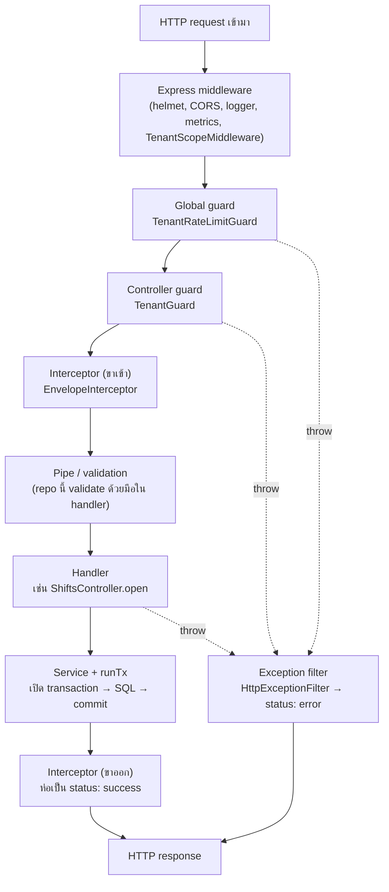

# 06 — Backend + tech stack (NestJS)

> บทนี้ตอบคำถาม: **"server ของร้านทำงานข้างในยังไง ทำไมต้องเขียนแบบนี้ และถ้าเขียนแบบที่ดูง่ายกว่าจะพังตรงไหน"**

---

## 🧭 ก่อนอ่าน

- **ต้องอ่านก่อน:** [00_index.md](00_index.md) (HTTP, JSON, REST, glossary) และ [02_architecture.md](02_architecture.md) — โดยเฉพาะหัวข้อ *"🧾 ตามรอย 1 บิล"* ซึ่งเดินผ่าน `TenantGuard` → `runTx` → `SalesService` ไปแล้วหนึ่งรอบ บทนี้**ไม่เดินซ้ำ** แต่เจาะลงไปว่าแต่ละชั้นคืออะไร และทำไมต้องมี
- **เวลาที่ใช้:** ~2–3 ชั่วโมง (ส่วนปูพื้นฐานยาว ตั้งใจให้ยาว)
- **อ่านจบแล้วคุณจะ…**
  - อธิบายได้ว่า server program ต่างจากโปรแกรมที่คุณเขียนในวิชา programming ยังไง และทำไม Node.js คนเดียวรับลูกค้าได้หลายร้อยคน
  - รู้จักชิ้นส่วนของ NestJS (module, controller, service, DI, decorator, guard, interceptor, pipe, middleware) และลำดับที่ request วิ่งผ่าน
  - เข้าใจปัญหา "ขายของชิ้นสุดท้ายให้ 2 คนพร้อมกัน" และ "กดปุ่มขายซ้ำเพราะเน็ตหลุด" และรู้ว่า repo นี้ป้องกันยังไง
  - อ่านไฟล์ใน `server/src/` แล้วชี้ได้ว่าไฟล์ไหนทำหน้าที่อะไร
  - รู้ว่าอะไรในฝั่ง backend **ยังพังอยู่** (มี bug จริงที่ยังไม่แก้)

---

## 🧱 ปูพื้นฐาน

ส่วนนี้ยังไม่พูดถึงโปรเจกต์ — สอน concept ทั่วไปก่อน

### 1. Server program คืออะไร

โปรแกรมที่คุณเขียนตอนเรียน programming มักมีรูปแบบ **"รัน → ทำงาน → จบ"**:

```
อ่าน input → คำนวณ → print ผล → exit
```

**Server program** (โปรแกรมที่รอรับคำขอจากเครื่องอื่นผ่าน network) ต่างออกไป — มัน **ไม่จบ** มันนั่งรอตลอดเวลา:

```
เปิด port 3000 → รอ… → มี request มา → ตอบ → รอ… → มี request มา → ตอบ → รอ… (ไม่มีวันจบเอง)
```

เทียบกับร้านอะไหล่: โปรแกรมทั่วไปเหมือน "ช่างที่ถูกเรียกมาซ่อมรถหนึ่งคันแล้วกลับบ้าน" ส่วน server เหมือน "เคาน์เตอร์หน้าร้านที่เปิดทั้งวัน ใครเดินเข้ามาก็ต้องมีคนรับ"

สิ่งที่ตามมาจากการ "ไม่จบ":

| โปรแกรมทั่วไป | Server |
|---|---|
| ผู้ใช้คนเดียว | ผู้ใช้หลายคน **พร้อมกัน** |
| ถ้า crash ก็แค่รันใหม่ | ถ้า crash ร้านทั้งร้านขายไม่ได้ |
| ตัวแปรอยู่ได้ถึงตอนจบ | ตัวแปรที่ค้างไว้ = ข้อมูลของ user คนหนึ่งอาจรั่วไปหาอีกคน |
| input เชื่อได้ (คุณพิมพ์เอง) | input มาจากใครก็ได้บน network — **ห้ามเชื่อ** |

แถวสุดท้ายสำคัญมาก ทั้งบทนี้คือการรับมือกับ "หลายคนพร้อมกัน" และ "input ที่ไม่น่าเชื่อ"

### 2. Node.js และ event loop — พนักงานเสิร์ฟคนเดียว

**Node.js** (โปรแกรมที่รัน JavaScript นอก browser ได้) ทำงานด้วย **thread** (สายการทำงาน) หลักแค่ **เส้นเดียว** ฟังดูน่ากลัว — คนเดียวรับลูกค้าหลายร้อยคนได้ยังไง?

ลองนึกถึงร้านอาหารที่มี **พนักงานเสิร์ฟคนเดียว**:

```
โต๊ะ 1 สั่งข้าว  → พนักงานส่งใบสั่งเข้าครัว → ไม่ยืนรอ! เดินไปโต๊ะ 2
โต๊ะ 2 สั่งน้ำ   → ส่งเข้าครัว → เดินไปโต๊ะ 3
ครัวตะโกน "ข้าวโต๊ะ 1 เสร็จ" → พนักงานยกไปเสิร์ฟ → กลับไปรับโต๊ะถัดไป
```

พนักงานไม่ทำอาหารเอง แค่ **ส่งงานที่ช้า (ครัว) ออกไป แล้วกลับมารับงานใหม่** พอครัวเสร็จค่อยมาจัดการต่อ นี่คือ **event loop** (วงรอบที่คอยหยิบงานที่ "พร้อมแล้ว" มาทำทีละชิ้น)

ใน server ของจริง "ครัว" คือ:
- ฐานข้อมูล (ส่ง SQL ไป รอคำตอบ)
- Redis (cache/queue)
- network (รอ client ส่ง body มาให้ครบ)

ใน JavaScript เราเขียน "ส่งเข้าครัวแล้วไม่ยืนรอ" ด้วย `await`:

```ts
// ตัวอย่างสมมติ
const rows = await db.query('SELECT ...'); // ระหว่างรอ DB, event loop ไปรับ request อื่น
return rows;
```

**จุดอ่อนของพนักงานคนเดียว:** ถ้าพนักงาน **ลงมือทำอาหารเอง** (งานที่ใช้ CPU หนักๆ เช่นคำนวณ hash รหัสผ่าน) ทั้งร้านต้องรอ นี่คือเหตุผลที่ repo นี้ระวังเรื่อง **argon2** (hash รหัสผ่าน ใช้ RAM 64 MiB และ CPU เยอะโดยตั้งใจ) — จะเห็นในหัวข้อ ⚠️ ว่าการเอา argon2 ไปไว้ผิดที่ทำให้ทั้ง pool ต้องรอ

### 3. TypeScript vs JavaScript

**JavaScript** ไม่บังคับ **type** (ชนิดของข้อมูล):

```js
// ตัวอย่างสมมติ — JavaScript
function total(price, qty) { return price * qty; }
total("100", 2);   // ได้ 200 (JS แปลง "100" เป็นตัวเลขให้เอง)
total("100", "x"); // ได้ NaN — ไม่มีใครเตือนจนลูกค้าเห็นบิล NaN บาท
```

**TypeScript** คือ JavaScript + type ที่ตรวจตอน compile (ก่อนรัน):

```ts
// ตัวอย่างสมมติ — TypeScript
function total(price: number, qty: number): number { return price * qty; }
total("100", 2); // ❌ compile error: string ใส่ช่อง number ไม่ได้
```

ข้อควรรู้ที่คนมักเข้าใจผิด: **type ของ TypeScript หายไปตอนรันจริง** มันเช็คแค่โค้ดที่ *คุณ* เขียน ไม่ได้เช็คข้อมูลที่ *client ส่งมา* ถ้า client ส่ง `{"amount": "abc"}` มา TypeScript ไม่รู้เรื่อง — เราต้อง **validate** (ตรวจความถูกต้องของ input) เองตอนรัน จะเห็นในหัวข้อ "pipe/validation" ว่า repo นี้ validate ด้วยมือทุก field

ใน repo นี้ `pnpm typecheck` (= `tsc --noEmit`) คือการสั่งให้ TypeScript ตรวจทั้งโปรเจกต์โดยไม่สร้างไฟล์ output

### 4. Framework คืออะไร

**Library** = กล่องเครื่องมือที่ *คุณ* เรียกใช้ (คุณคุมจังหวะ)
**Framework** = โครงบ้านสำเร็จรูป ที่ *มัน* เรียกโค้ดของคุณ (มันคุมจังหวะ) — เรียกว่า **inversion of control**

เทียบ: library = ซื้อค้อน ตะปู ไม้ มาสร้างบ้านเอง / framework = ซื้อบ้านโครงสำเร็จ แล้วเลือกแค่ว่าห้องไหนทาสีอะไร

ข้อดีของ framework: ทุกคนในทีมวางโค้ดที่เดียวกัน ("controller อยู่ไหน? อยู่ใน `*.controller.ts` เสมอ") ข้อเสีย: ต้องเรียนกติกาของมัน และบางครั้งกติกาของมันขัดกับที่เราต้องการ (หัวข้อ ⚠️ จะเล่าเรื่องที่ repo นี้ต้องย้าย transaction ออกจาก "ที่ที่ framework ชวนให้วาง")

### 5. ชิ้นส่วนของ NestJS

**NestJS** คือ framework สำหรับเขียน server ด้วย TypeScript ที่วางอยู่บน **Express** (library server รุ่นเก่าแก่ของ Node.js) เปรียบร้านอะไหล่ทั้งร้าน:

| ชิ้นส่วน | หน้าที่ | เทียบร้านอะไหล่ |
|---|---|---|
| **Module** | กล่องจัดกลุ่มโค้ดของเรื่องเดียวกัน | แผนก (แผนกขาย, แผนกคลัง) |
| **Controller** | รับ HTTP request ที่ URL หนึ่งๆ แล้วส่งต่อ | พนักงานหน้าเคาน์เตอร์ — รับใบสั่ง ไม่ได้ไปหยิบของเอง |
| **Service / Provider** | logic จริง (คำนวณ, คุยกับ DB) | คนในคลังที่หยิบของ ตัดสต็อก |
| **Dependency Injection (DI)** | framework สร้าง object ให้ แล้ว "ฉีด" เข้า constructor | ผู้จัดการจัดคนมาประจำเคาน์เตอร์ให้ พนักงานไม่ต้องไปจ้างเอง |
| **Decorator** | ป้าย `@Something` ที่แปะบน class/method เพื่อบอก framework | ป้ายติดประตู "เฉพาะพนักงาน" |
| **Middleware** | โค้ดที่ทำงานกับ *ทุก* request ก่อนถึงจุดอื่น | รปภ.ที่จดเวลาคนเข้าออกทุกคน |
| **Guard** | ตัดสิน "ให้ผ่านหรือไม่" | คนเช็คบัตรพนักงาน |
| **Interceptor** | ห่อก่อน/หลัง handler (แปลงผลลัพธ์) | คนห่อของใส่ถุงก่อนส่งให้ลูกค้า |
| **Pipe** | แปลง/ตรวจ input ก่อนเข้า handler | คนตรวจใบสั่งว่ากรอกครบไหม |
| **Exception filter** | แปลง error เป็นคำตอบ HTTP | คนบอกลูกค้าอย่างสุภาพว่า "ของหมดครับ" แทนการตะโกน stack trace |

#### Dependency Injection ทำไมต้องมี

ไม่มี DI (ตัวอย่างสมมติ):

```ts
class ShiftsController {
  private shifts = new ShiftsService(new TenantService(new DataSource(/* config... */)));
}
```

ปัญหา: controller ต้องรู้วิธีสร้างทุกอย่างลงไปจนถึง DB, ถ้าอยากเทสด้วย DB ปลอมก็ต้องแก้โค้ด, และแต่ละ controller อาจสร้าง DB connection pool ของตัวเองซ้อนกันหลายชุด

มี DI:

```ts
constructor(private readonly shifts: ShiftsService) {}
```

แค่ "ประกาศว่าต้องการอะไร" framework จะสร้าง `ShiftsService` **ตัวเดียว** (singleton) แล้วแจกทุกคนที่ขอ เวลาเทสก็สลับตัวจริงเป็นตัวปลอมได้จากข้างนอก

#### Decorator คืออะไร

`@Controller('shifts')`, `@Post('open')`, `@UseGuards(TenantGuard)` คือ **decorator** — function พิเศษที่แนบ "ข้อมูลเสริม" (metadata) ไว้บน class/method NestJS อ่าน metadata นั้นตอนบูต แล้วรู้ว่า "method `open` ต้องรับ `POST /shifts/open` และต้องผ่าน `TenantGuard` ก่อน"

#### Request lifecycle — request วิ่งผ่านอะไรบ้าง



จำลำดับนี้ไว้: **middleware → guard → interceptor → pipe → handler** — จะใช้ตอบคำถาม "ทำไม metrics ต้องเป็น middleware" และ "ทำไม transaction ต้องอยู่ใน handler" ในส่วนหลัง

### 6. REST, envelope และ error code

**REST** (ทบทวนจาก [00_index.md](00_index.md)) = ใช้ URL เป็น "ของ" และ HTTP method เป็น "การกระทำ": `GET /shifts/current` (ดูกะปัจจุบัน), `POST /shifts/open` (เปิดกะ)

**Envelope** (ซองจดหมาย) = ห่อทุกคำตอบด้วยรูปแบบเดียวกัน เพื่อให้ client เขียนโค้ดอ่านได้แบบเดียว:

```json
{ "status": "success", "data": { ... } }
{ "status": "error", "error": { "code": "INSUFFICIENT_STOCK", "message": "สต็อกไม่พอ: ..." } }
```

ทำไมต้องมี **error code** (เช่น `INSUFFICIENT_STOCK`) แยกจากข้อความ? เพราะข้อความภาษาไทยอาจเปลี่ยนคำได้ แต่โค้ดของ client ต้องตัดสินใจจากสิ่งที่ไม่เปลี่ยน — "ถ้า code เป็น `DRAWER_CLOSED` ให้เด้งหน้าเปิดกะ" รายการ code ทั้งหมดอยู่ใน `docs/Backend_design/02_API_SCREENS.md §8`

**HTTP status code** ที่ต้องรู้ในบทนี้:

| กลุ่ม | ความหมาย | ตัวอย่างใน repo |
|---|---|---|
| 2xx | สำเร็จ | 200, 201 (สร้างของใหม่) |
| 4xx | **client ผิด** — ส่งซ้ำแบบเดิมก็ผิดเหมือนเดิม | 400 input ผิด, 401 ไม่ได้ login, 403 ไม่มีสิทธิ์, 409 ขัดแย้ง (สต็อกไม่พอ), 429 ยิงถี่เกิน |
| 5xx | **server มีปัญหา** — ไม่รู้ว่างานสำเร็จหรือยัง | 500, 502/504 จาก Nginx, 503 |

ความต่างระหว่าง 4xx กับ 5xx จะกลายเป็นเรื่องใหญ่ในหัวข้อ idempotency

### 7. Authentication vs Authorization

- **Authentication** (ยืนยันตัวตน) = "คุณคือใคร?" — login ด้วย username/password
- **Authorization** (ตรวจสิทธิ์) = "คุณทำสิ่งนี้ได้ไหม?" — เครื่อง `backoffice` เปิดลิ้นชักเงินได้ไหม? (ไม่ได้)

เทียบ: บัตรประชาชนยืนยันว่าคุณคือนาย ก. (authentication) แต่ไม่ได้แปลว่านาย ก. เข้าห้องนิรภัยของธนาคารได้ (authorization)

ใน repo นี้ authorization มีหลายชั้น: token เป็นของร้านไหน (`tid`), เป็น token แบบไหน (`aud: tenant` หรือ platform admin), เครื่องมี role อะไร (`drole: pos` หรือ `backoffice` — ADR-0004)

### 8. JWT — บัตรผ่านที่ server ไม่ต้องจำ

หลัง login สำเร็จ server ต้องให้ "บัตรผ่าน" กับ client เพื่อไม่ต้องส่งรหัสผ่านทุก request มีสองแบบใหญ่:

| แบบ | วิธี | ข้อเสีย |
|---|---|---|
| **Session** | server เก็บตาราง "บัตรเลข 123 = นาย ก." | server ต้องจำ — มี 3 instance ก็ต้องแชร์ตารางนี้กัน |
| **JWT** (JSON Web Token) | ข้อมูล "นาย ก., ร้าน X, หมดอายุ 10:15" + **ลายเซ็นดิจิทัล** ใส่ในบัตรเลย | ยกเลิกบัตรกลางคันยาก |

JWT หน้าตาแบบนี้ (3 ส่วนคั่นด้วยจุด): `header.payload.signature`

**Stateless** (ไม่เก็บสถานะ) = server ไม่ต้องจำอะไร แค่ตรวจลายเซ็นก็รู้ว่าบัตรจริง instance ไหนก็ตรวจได้

**RS256** = ลายเซ็นแบบ **กุญแจคู่** (asymmetric): มี **private key** (ใช้เซ็น เก็บลับ) กับ **public key** (ใช้ตรวจ แจกได้) เทียบ: ตราประทับของร้าน (private) ใช้ประทับได้คนเดียว แต่ใครก็ดูออกว่าตราจริงหรือปลอมจากตัวอย่างตรา (public) ต่างจาก HS256 ที่ใช้ความลับตัวเดียวทั้งเซ็นและตรวจ — ใครตรวจได้ก็ปลอมได้

ราคาของ stateless: ถ้าเครื่องถูกปลด (retire) token เดิมยังใช้ได้จนหมดอายุ repo นี้จึงให้ access token อายุ **15 นาที** และไม่มี denylist (ADR-0009) — แล้วไปอุดช่อง 15 นาทีนั้นที่ตัว endpoint แทน (จะเห็นใน `shifts.service.ts`)

### 9. Password hashing — argon2

**ห้ามเก็บรหัสผ่านตรงๆ** ถ้า DB รั่ว ทุกคนโดนหมด เราเก็บ **hash** (ผลของ function ทางเดียว — จากรหัสผ่านคำนวณ hash ได้ แต่จาก hash ย้อนกลับไม่ได้)

แต่ hash ธรรมดา (เช่น SHA-256) **เร็วเกินไป** — คนร้ายเดาได้เป็นพันล้านครั้งต่อวินาที **argon2** จึงออกแบบให้ **ช้าและกิน RAM โดยตั้งใจ** (repo นี้ตั้ง 64 MiB, 3 รอบ) เดาได้น้อยครั้งต่อวินาที

ราคาที่จ่าย: argon2 กิน CPU ของ event loop (พนักงานเสิร์ฟต้องลงมือทำอาหารเอง) ต้องระวังว่าเรียกมันตอนไหน

### 10. Multi-tenancy

**Tenant** (ผู้เช่า) = ร้านหนึ่งร้าน **Multi-tenant** = ร้านหลายร้านใช้ server และ database ชุดเดียวกัน เทียบ: คอนโดตึกเดียว หลายห้อง — ท่อน้ำไฟร่วมกัน แต่ห้ามเดินเข้าห้องคนอื่น

ทุกแถวในตารางมีคอลัมน์ `tenant_id` และสิ่งที่น่ากลัวที่สุดคือ **ข้อมูลร้าน A โผล่ในจอร้าน B** รายละเอียดฝั่ง database (RLS) อยู่ใน [07_database.md](07_database.md) บทนี้ดูฝั่ง server ว่า "ใครเป็นคนบอกว่า request นี้เป็นของร้านไหน"

### 11. Concurrency & race condition — ของชิ้นสุดท้าย

**Concurrency** (ภาวะพร้อมกัน) = หลายงานทำงานซ้อนเวลากัน **Race condition** (สภาวะแข่ง) = ผลลัพธ์ผิดเพราะลำดับที่งานสลับกัน

ตัวอย่างจริงที่ร้านเจอได้: **หัวเทียนเหลือ 1 ชิ้น** เครื่อง POS กับอีกทาง (เช่น sync จากเครื่องที่ออฟไลน์) ขายพร้อมกัน:

```
เวลา   request A                      request B
t1     อ่าน stock = 1
t2                                    อ่าน stock = 1
t3     1 >= 1 ✅ ขายได้
t4                                    1 >= 1 ✅ ขายได้
t5     เขียน stock = 0
t6                                    เขียน stock = 0     ← ขายไป 2 ชิ้น แต่ stock บอก 0
```

ของมี 1 ชิ้น ออกบิลไป 2 ใบ — ลูกค้าคนที่สองมารับของแล้วไม่มี นี่คือ **oversell** (ขายเกินของที่มี)

ต้นเหตุ: "อ่าน → ตัดสินใจ → เขียน" ไม่ได้เป็นก้อนเดียวกัน (ไม่ **atomic**) ทางแก้คือ **lock** (ล็อก) — ให้ request B ต้อง *รอ* จน A เสร็จ แล้วค่อยอ่านค่าใหม่ (`0`) ใน Postgres ทำด้วย `SELECT ... FOR UPDATE` ([02_architecture.md](02_architecture.md) ขั้น 16–18 แสดงโค้ดจริงแล้ว)

**Deadlock** (ต่างคนต่างรอกัน) เกิดเมื่อ A ล็อกสินค้า X แล้วรอ Y ขณะที่ B ล็อก Y แล้วรอ X — ทางแก้คือ **ล็อกตามลำดับเดียวกันเสมอ** (lock order) ซึ่ง repo นี้กำหนดไว้เป็นกฎ

### 12. Transaction & ACID (ย่อ — บท 07 ลงลึก)

**Transaction** = กลุ่มคำสั่ง DB ที่ "สำเร็จทั้งหมด หรือไม่เกิดอะไรเลย" การขาย 1 บิล = ตัดสต็อก + เขียนบิล + เขียนรายการ + บวกแต้มลูกค้า ถ้าตัดสต็อกแล้วไฟดับก่อนเขียนบิล ต้อง **rollback** (ย้อนกลับ) ให้สต็อกกลับมา

**ACID** = Atomic (ทั้งก้อนหรือไม่มีเลย), Consistent (กฎไม่ถูกละเมิด), Isolated (transaction ไม่เห็นของที่อีกอันยังไม่ commit), Durable (commit แล้วไม่หาย) — รายละเอียดใน [07_database.md](07_database.md)

**Connection pool** (สระ connection) — เปิด connection ไป DB แพง server จึงเปิดค้างไว้จำนวนหนึ่ง (repo นี้: `DB_POOL_SIZE` ค่า default ใน compose = 15 ต่อ instance) แล้วยืมคืนกัน เทียบ: ร้านมีรถเข็นส่งของ 15 คัน ใครจะขนของต้องยืมรถ ถ้ารถหมด คนต่อไปต้องยืนรอ

### 13. Idempotency — กดลิฟต์ซ้ำ vs ส่งพัสดุซ้ำ

**Idempotent** = ทำซ้ำกี่ครั้งผลก็เหมือนทำครั้งเดียว

- **กดปุ่มลิฟต์ซ้ำ 5 ครั้ง** → ลิฟต์มาครั้งเดียว ✅ idempotent โดยธรรมชาติ
- **ไปส่งพัสดุที่ไปรษณีย์ซ้ำ 2 ครั้ง** (เพราะไม่แน่ใจว่าครั้งแรกส่งหรือยัง) → ผู้รับได้ของ 2 กล่อง จ่ายเงิน 2 รอบ ❌

การขายบิลเหมือนการส่งพัสดุ ปัญหาจริง:

```
แคชเชียร์กด "ขาย" → request ถึง server → server ตัดสต็อก + commit สำเร็จ
                                          → คำตอบกลับมาระหว่างทาง... เน็ตหลุด ❌
จอแคชเชียร์: "เชื่อมต่อไม่ได้"  → แคชเชียร์กดใหม่ → ขายซ้ำ! ลูกค้าจ่ายสองรอบ
```

ทางแก้ = **Idempotency-Key** (เลขอ้างอิงของ "ความตั้งใจ" หนึ่งครั้ง) client สร้างเลขสุ่ม 1 ตัวต่อบิล ส่งไปกับ request ถ้า server เคยเห็นเลขนี้แล้ว → **ไม่ทำใหม่** แต่ส่งคำตอบเดิมกลับไป (**replay**) เทียบ: ไปรษณีย์ดูเลขพัสดุแล้วบอก "เลขนี้ส่งไปแล้วครับ นี่ใบเสร็จเดิม"

แล้ว client ควร "ลืม" บิลที่ค้างเมื่อไร? เมื่อได้ **คำตัดสินสุดท้าย** เท่านั้น:
- **4xx** = server ตอบชัดว่า "ไม่รับ" (เช่นสต็อกไม่พอ) → ลืมได้
- **5xx / 429 / timeout** = **ไม่รู้ว่า commit แล้วหรือยัง** → ห้ามลืม ต้องส่งซ้ำด้วย **key เดิม**

### 14. Background jobs & queue

บางงานไม่ต้องทำให้เสร็จก่อนตอบลูกค้า เช่น "เช็คว่าหลังขายแล้วสินค้าไหนต่ำกว่าจุดสั่งซื้อ" ถ้าทำในทาง request ลูกค้ารอนานขึ้นเปล่าๆ

**Queue** (คิวงาน) = ตะกร้าที่ server หย่อนงานไว้ แล้ว **worker** (โปรเซสแยกที่คอยหยิบงานจากคิวมาทำ) ค่อยทำทีหลัง เทียบ: แคชเชียร์เขียนโน้ต "เช็คสต็อกหัวเทียน" หย่อนใส่ตะกร้า แล้วบริการลูกค้าคนต่อไป คนในคลังค่อยมาหยิบโน้ตไปทำ

ข้อดีอีกอย่าง: ถ้างานล้ม queue **ลองใหม่** (retry) ให้ได้ และงานไม่หายแม้ server รีสตาร์ต (เพราะคิวเก็บใน Redis ที่ตั้งค่าให้ไม่ทิ้งข้อมูล — [02_architecture.md](02_architecture.md) หัวข้อ Redis 2 ตัว)

### 15. Caching

**Cache** = สำเนาที่อ่านเร็ว ลบทิ้งได้เสมอ เทียบ: โพสต์อิทแปะหน้าจอ "ร้าน X สถานะ active" แทนการเดินไปเปิดแฟ้มทุกครั้ง

สองคำถามที่ต้องตอบทุกครั้งที่ใช้ cache:
1. **หมดอายุเมื่อไร** (TTL — time to live) — ข้อมูลเก่าได้นานแค่ไหน
2. **ถ้า cache ล่ม** ระบบยังทำงานไหม — repo นี้ตอบว่า **ต้องทำงานได้** (อ่าน DB แทน) เรียกว่า **fail-open**

### 16. Rate limiting

**Rate limit** = จำกัดจำนวน request ต่อช่วงเวลา กันสองเรื่อง:
- **Brute force** — คนร้ายเดารหัสผ่านวนไปเรื่อยๆ
- **Noisy neighbor** — ร้านหนึ่งยิงถี่จนร้านอื่นช้า

วิธีนับแบบง่ายที่สุด: เก็บตัวนับใน Redis ต่อ "หน้าต่างเวลา" (เช่น 60 วินาที) ทุก request `+1` ถ้าเกินเพดานตอบ **429 Too Many Requests**

กับดักคลาสสิก — **check-then-increment** (ตัวอย่างสมมติ):

```ts
const count = await redis.get(key);  // 2 request อ่านได้ 9 พร้อมกัน
if (count >= 10) throw tooMany();    // ทั้งคู่ผ่าน
await redis.incr(key);               // กลายเป็น 11 — เกินเพดานไปแล้ว
```

race condition แบบเดียวกับการขายของชิ้นสุดท้าย! ทางแก้คือ **INCR ก่อน แล้วค่อยเช็คผลที่ได้** ในขั้นตอนเดียว (atomic) — จะเห็นโค้ดจริงข้างล่าง

### 17. Config & secrets

**Config** = ค่าที่เปลี่ยนตามสภาพแวดล้อม (port, URL ของ DB) **Secret** = config ที่เป็นความลับ (รหัส DB, private key)

กฎ: **ห้ามเขียน secret ลงในโค้ด** — อ่านจาก **environment variable** (ตัวแปรที่ระบบปฏิบัติการส่งให้โปรแกรมตอนเริ่ม) แทน repo นี้อ่านทั้งหมดในที่เดียว (`loadConfig()` ใน `server/src/config/config.ts`) แล้วฉีดผ่าน DI

**Dynamic config** = ค่าที่อยากเปลี่ยน *โดยไม่ต้องรีสตาร์ต* เช่นระดับ log repo นี้ใช้ **etcd** (ฐานข้อมูล key-value เล็กๆ สำหรับ config) เฉพาะเรื่องนี้ (ADR-0013)

### 18. Logging & metrics

- **Log** = บันทึกเหตุการณ์ทีละบรรทัด ("request X ล้มเพราะ Y") — ไว้ตอบ "เกิดอะไรขึ้นกับ request นี้"
- **Metric** = ตัวเลขสรุปรวม ("5 นาทีที่แล้วมี request 1,200 ครั้ง, error 2%") — ไว้ตอบ "ระบบโดยรวมสุขภาพดีไหม"

**Correlation ID** = เลขติดตาม request ที่พาไปทุก log บรรทัด ค้นเลขเดียวเห็นทุกอย่างของ request นั้น (repo นี้ใช้ header `X-Correlation-ID`)

**Health check** = endpoint ที่ระบบภายนอกถามว่า "ยังมีชีวิตอยู่ไหม" แบ่งเป็น
- **liveness** — process ยังไม่ค้าง (ถ้าตอบไม่ได้ → restart)
- **readiness** — พร้อมรับงานไหม (DB/Redis ต่อได้ไหม ถ้าไม่ → หยุดส่งงานมาชั่วคราว แต่ *ไม่* restart)

---

## 🔥 ปัญหาจริงของร้าน

แอป Flutter แบบ offline-first (Drift/SQLite ในเครื่อง) ทำงานดีสำหรับ *ร้านเดียวเครื่องเดียว* — `saveSale` ใน Dart ทำทุกอย่างใน transaction ของ SQLite ในเครื่อง ไม่มีใครมาแย่ง

พอย้ายขึ้น server (เหตุผลอยู่ใน [02_architecture.md](02_architecture.md) หัวข้อ "ทำไมต้องมี server") ปัญหาใหม่ที่ Dart ไม่เคยเจอเกิดขึ้นทันที:

| ปัญหา | ทำไมตอนเป็นแอปในเครื่องไม่เจอ | บทนี้ตอบที่หัวข้อ |
|---|---|---|
| 2 request ขายของชิ้นสุดท้ายพร้อมกัน | เครื่องเดียว process เดียว ทำทีละบิล | lock order, e2e 200 บิล |
| เน็ตหลุดหลัง commit → กดซ้ำ | ไม่มี network ระหว่างปุ่มกับ DB | idempotency |
| ร้าน A เห็นข้อมูลร้าน B | มีร้านเดียว | TenantGuard + runTx |
| คนเดารหัสผ่านจากอินเทอร์เน็ต | ไม่มีใครเข้าถึงจากข้างนอก | rate limit + argon2 |
| server 1 ตัวล่ม = ทุกร้านหยุด | ไม่มี server | 3 instance แบบ stateless |
| transaction ค้างนาน ทำให้ sync ข้ามแถว | ไม่มี sync | commit-ceiling 25 วินาที |

และข้อที่สำคัญที่สุด: **กฎธุรกิจของ Dart ต้องย้ายมาอยู่บน server โดยไม่เพี้ยน** (CLAUDE.md: *"port them, don't reinvent"*) — ข้อความ `สต็อกไม่พอ…`, การคิดแต้ม `floor(total/10)`, การคืนเงินตามสัดส่วน ต้องตรงกันทุกตัวอักษร

---

## ⚖️ ทางเลือก → ทำไมเลือกอันนี้

### 1. Framework: NestJS vs Express เปล่า vs อื่นๆ

ข้อเท็จจริงก่อน: stack นี้ **ถูกกำหนดโดยโจทย์วิชา** — `docs/Backend_design/adr/0012-couchdb-replaces-postgres.md:17` เขียนว่าโจทย์กำหนด NestJS + PostgreSQL + Redis + BullMQ + Nginx และ `docs/Backend_design/06_COUCHDB_REVISION.md:25` ระบุ "NestJS ≥3" (instance) เป็นข้อกำหนด แต่ก็ยังควรเข้าใจว่าถ้าเลือกเองได้ จะชั่งอะไร:

| ตัวเลือก | ข้อดี | ข้อเสีย | สำหรับ repo นี้ |
|---|---|---|---|
| **NestJS** | โครงสร้างบังคับ (module/controller/service), DI, guard/interceptor มีที่วางชัด, ทีม 3 คนวางโค้ดตรงกัน | เรียนเยอะ, magic เยอะ (decorator), บางกติกาของมันขัดกับที่เราต้องการ | ✅ **ใช้** — โจทย์กำหนด และทีมหลายคนได้ประโยชน์จากโครงบังคับ |
| Express เปล่า | เล็ก เข้าใจง่าย ไม่มี magic | ทุกทีมต้องคิดโครงเอง, DI ต้องทำเอง | NestJS ก็รันบน Express อยู่แล้ว (`@nestjs/platform-express`) — ได้ความเร็วเท่ากัน |
| Fastify / Hono | เร็วกว่า Express | ecosystem เล็กกว่า | ไม่ใช่คอขวด — คอขวดคือ DB lock และ argon2 |
| Go / Java Spring | เร็ว, thread จริง | ภาษาใหม่ทั้งทีม, นอกโจทย์ | ❌ |

เพราะ **ทีม 3 คนต้องแตะ backend ทุกคน** (CLAUDE.md, course rule 2026-09-05) → จึงต้องมีโครงที่บังคับให้ทุกคนวางโค้ดเหมือนกัน → ราคาที่จ่ายคือต้องเข้าใจกติกา NestJS ลึกพอจะรู้ว่าเมื่อไรต้อง *ไม่ทำตาม* มัน (เช่นเรื่อง transaction ข้างล่าง)

### 2. TypeORM — แต่เขียน SQL เอง

**ORM** (Object-Relational Mapper) = library ที่แปลง class ↔ ตาราง ให้เขียน `repo.save(sale)` แทน SQL

repo นี้ใช้ **TypeORM 1.1.1** แต่ใช้แค่ 3 อย่าง: `DataSource` (connection pool), `QueryRunner` (คุม transaction) และระบบ **migration** (`server/src/db/data-source.ts:18-33` รายการ migration 14 ตัวแบบเขียนชื่อตรงๆ ไม่ใช้ glob) — **ไม่มี `@Entity` สักตัวใน `server/src`** query ธุรกิจเขียนเป็น SQL ตรงผ่าน `manager.query(...)`

| ทางเลือก | ทำไมไม่ / ทำไมใช่ |
|---|---|
| ORM เต็มรูป (entity + `save()`) | ซ่อน SQL — แต่งานนี้ต้องคุม `FOR UPDATE`, ลำดับ lock, `set_config` ของ RLS เองทุกบรรทัด ORM ทำให้มองไม่เห็นว่า lock อะไรไปบ้าง |
| **SQL ตรง + TypeORM เฉพาะ pool/tx/migration** | ✅ เห็นทุก lock ด้วยตา, `EXPLAIN` ได้ตรงๆ, และ migration เป็นแหล่งความจริงของ schema (`synchronize` ไม่เคยเป็น `true` — `data-source.ts:36-38`) |
| query builder อื่น (Knex, Kysely) | เพิ่ม dependency โดยไม่ได้อะไรเพิ่มจากที่มี |

ราคาที่จ่าย: SQL ผิดเจอตอนรัน ไม่ใช่ตอน compile → จึงต้องมี e2e test ที่รันกับ Postgres จริง (หัวข้อ Testing)

### 3. Instance: 1 ตัว vs ≥3 ตัวแบบ stateless

compose รัน `api-1`, `api-2`, `api-3` (`server/docker-compose.yml:135-151`) หลัง Nginx ตัวเดียว

เพราะ **instance ไหนก็ได้ต้องตอบ request ไหนก็ได้** → จึงต้องไม่เก็บอะไรใน memory ของ process (session อยู่ใน JWT, cache/rate-limit อยู่ใน Redis, ข้อมูลอยู่ใน Postgres) → ราคาที่จ่ายคือ ทุกอย่างที่ต้อง "จำ" ต้องวิ่งไป Redis/Postgres และงบ connection ต้องหารด้วย 3 ([02_architecture.md](02_architecture.md) หัวข้อ งบ connection: `3 api × 20 + worker 10 = 70 ≤ 80`)

### 4. Transaction อยู่ที่ไหน: middleware/interceptor vs handler

นี่คือการตัดสินใจที่สำคัญที่สุดในบทนี้ (ADR-0003 addendum *"ใครตัดสิน กับ ใครลงมือ"*, Accepted มีผล 2026-09-14)

**รูปเดิม (PR #75):** middleware เปิด transaction → guard ตั้ง tenant → interceptor commit ดูเป็นระเบียบตามแบบฉบับ NestJS ทุกอย่างอัตโนมัติ

**ปัญหาที่วัดได้** (`docs/Backend_design/adr/0003-tenant-lifecycle.md:74-80`): connection ถูกยึด **ตั้งแต่ก่อน guard จนหลังส่ง response** — ครอบทั้ง argon2, JSON serialise และ client เน็ตช้า วัดบน `POST /sales/{id}/void` 4 request พร้อมกัน pool 2:

| | transaction ยาวสุด | latency ราย request |
|---|---|---|
| รูปเดิม | 112–116 ms | 119 / 126 / 229 / 234 ms (ขั้นบันได = เข้าคิว) |
| ย้ายเข้า handler (prototype) | 18–28 ms | 142 / 143 / 157 / 157 ms (เรียบ) |

**การตัดสินใจ:** guard ยัง "ตัดสิน" ว่าเป็นร้านไหน (เหมือนเดิม) แต่เก็บคำตัดสินไว้ใน request scope; **handler เป็นคน "ลงมือ"** เปิด transaction ผ่าน `TenantService.runTx` ตอนที่จำเป็นจริงๆ เท่านั้น

เพราะ **connection เป็นทรัพยากรที่มีจำกัดที่สุด** → จึงต้องถือมันสั้นที่สุด → ราคาที่จ่ายคือทุก service method ต้องเขียน wrapper `runTx(() => this.xxxIn())` เอง (ลืมไม่ได้ — จึงมี architecture spec คอยจับ)

### 5. Validation: `ValidationPipe` + class-validator vs เขียนเอง

NestJS มี `ValidationPipe` ที่ใช้คู่กับ library `class-validator` (แปะ decorator `@IsNumber()` บน field) แต่ repo นี้ **ไม่ใช้** — `server/src/sales/sales.dto.ts:53` บอกตรงๆ ว่า *"Validates the body by hand"* เพราะไม่ได้ depend `class-validator`

ผลคือ controller รับ `@Body() body: unknown` (ยอมรับว่าไม่รู้อะไรเลย) แล้ว validate เองทุก field — ละเอียดกว่า (เช่นเงินต้องเป็น satang จำนวนเต็ม ไม่เป็น float) แต่ต้องเขียนเยอะ ดูตัวอย่างใน `shifts.controller.ts` ข้างล่าง

---

## 🔍 ของจริงใน repo

### 0. แผนที่โฟลเดอร์ `server/src/`

ตรวจด้วย `ls server/src` (2026-09-25):

```
server/src/
├── main.ts              ← จุดเริ่มของ process api (ดูข้อ 1)
├── worker.ts            ← จุดเริ่มของ process worker (BullMQ)
├── bull-board.ts        ← หน้าเว็บดูคิว (process แยกอีกตัว)
├── app.module.ts        ← ประกอบ module ทั้งหมด (CoreModule / AppModule / WorkerModule)
├── app.setup.ts         ← ตั้งค่าที่ main.ts กับ e2e ต้องเหมือนกัน (trust proxy, CORS, prefix…)
├── common/              ← ของใช้ร่วม: guards, TenantService/runTx, envelope, filter, money, password
├── config/              ← loadConfig (env) + RuntimeConfigService (etcd)
├── infra/               ← DbModule (pool), RedisModule (cache/queue), TenantCacheModule, logger
├── db/                  ← migrations, data-source, migrate.ts, seed, bootstrap-admin
├── auth/                ← login/refresh/device enrol, JwtSigner/JwtVerifier (RS256)
├── rate-limit/          ← RateLimitService (Lua INCR) + TenantRateLimitGuard (global)
├── idempotency/         ← IdempotencyService (claim/replay) + idempotencyParamsOf
├── metrics/             ← Prometheus middleware + GET /metrics
├── health/              ← /health/live, /health/ready
├── queue/               ← BullMQ queues, processors/, TenantJobRunner, scheduler
├── audit/               ← เขียน audit_log
├── platform/            ← admin plane: สร้าง/ระงับร้าน, import snapshot (ADR-0001/0002/0005)
├── sales/               ← ขาย, อ่านบิล, void
├── returns/             ← คืนสินค้า (credit note)
├── shifts/              ← เปิด/ปิดกะ, เงินเข้าออกลิ้นชัก
├── products/            ← สินค้า, หมวด, ผู้ขาย, movement ของสต็อก
├── purchasing/          ← ใบสั่งซื้อ + รับของ (weighted-average cost)
├── customers/ mechanics/← ลูกค้า, ช่าง + ชำระเครดิตช่าง
├── people/              ← DTO ที่ customers/products ใช้ร่วม (มีแค่ people.dto.ts)
├── quotes/ parked-sales/← ใบเสนอราคา, บิลพัก (ไม่แตะสต็อก)
├── documents/           ← เลขที่เอกสาร (doc_counters)
├── settings/            ← ตั้งค่าร้าน + GET /bootstrap
├── reports/             ← รายงาน
├── devices/             ← enrol/retire เครื่อง (ADR-0004)
├── backup/              ← POST /backup/export (async job)
├── review-items/        ← owner_review_items (เรื่องที่เจ้าของต้องตรวจ)
└── sync/                ← POST /sync/push (phase 2 — outbox จากเครื่องออฟไลน์)
```

หลักการตั้งชื่อ: **1 โฟลเดอร์ = 1 เรื่องธุรกิจ = 1 module** และในโฟลเดอร์มี `*.module.ts` / `*.controller.ts` / `*.service.ts` เสมอ

---

### 1. `main.ts` — จุดเริ่มต้น

`server/src/main.ts:8-26`

```ts
const config = loadConfig();
const logger = createLogger({
  level: config.logLevel,
  instanceId: config.instanceId,
});

const app = await NestFactory.create(AppModule.forRoot(config, logger), {
  logger: new PinoNestLogger(logger),
});
await configureApp(app, logger);

// Keep-alive must outlive Nginx's upstream keepalive (60s) or Nginx reuses a
// socket Node just closed and answers 502.
const server = app.getHttpServer() as Server;
server.keepAliveTimeout = 65_000;
server.headersTimeout = 66_000;

await app.listen(config.port, '0.0.0.0');
```

- **ทำอะไร:** อ่าน config จาก env → สร้าง logger → ให้ NestJS ประกอบ module ทั้งหมด → ตั้งค่าร่วม → เปิด port
- **ทำไม `configureApp` แยกไฟล์:** e2e test ต้องบูตแอปแบบ *เดียวกันเป๊ะ* กับ production (คอมเมนต์ใน `app.setup.ts:24` *"Everything main.ts and the e2e tests must configure identically"*) ถ้าเขียนซ้ำสองที่ วันหนึ่งจะไม่ตรงกัน แล้ว test ผ่านทั้งที่ production พัง
- **`keepAliveTimeout = 65_000`:** ต้อง *ยาวกว่า* ของ Nginx (60 วินาที) ถ้าสั้นกว่า Node จะปิด socket ก่อน แต่ Nginx ยังคิดว่าใช้ได้ ส่ง request ถัดไปเข้า socket ที่ตายแล้ว → ลูกค้าได้ **502** แบบสุ่มๆ ที่ reproduce ยากมาก
- **`0.0.0.0`:** ฟังทุก network interface ใน container (ถ้า `127.0.0.1` Nginx ที่อยู่อีก container จะต่อไม่ได้)

### 2. `app.setup.ts` — ตั้งค่าที่ต้องเหมือนกันทุกที่

`server/src/app.setup.ts:29-36`

```ts
app.getHttpAdapter().getInstance().disable('x-powered-by');
// Exactly one trusted hop: nginx, which appends $remote_addr to X-Forwarded-For. Without
// this `req.ip` is nginx's container address for every client, so the per-IP login
// limit was one bucket for everyone. Never `true` — that trusts the leftmost entry,
// which the client writes. ...
app.getHttpAdapter().getInstance().set('trust proxy', 1);
```

- **`x-powered-by`:** ปิด header ที่บอกโลกว่า "ฉันคือ Express" — ลดข้อมูลให้คนร้าย
- **`trust proxy = 1`:** ทุก request มาถึง Node ผ่าน Nginx ดังนั้น IP ที่ Node เห็นคือ IP ของ Nginx เสมอ ต้องบอก Express ว่า "เชื่อ proxy **1 ชั้น**" เพื่อให้อ่าน IP จริงจาก header `X-Forwarded-For`
  - ถ้า **ไม่ตั้ง:** ทุกคนมี IP เดียวกัน (ของ Nginx) → rate limit login ต่อ IP กลายเป็น **ถังเดียวทั้งโลก** — คนร้ายคนเดียวล็อกทุกคนออกได้ (นี่คือ bug #134 ที่เคยเกิดจริง)
  - ถ้า **ตั้ง `true`:** เชื่อค่าซ้ายสุดของ header ซึ่ง *client พิมพ์เองได้* → คนร้ายปลอม IP ใหม่ทุกครั้ง หลบ rate limit ได้
  - ราคา: ถ้าวันหนึ่งเอา CDN มาวางหน้า Nginx ตัวเลขนี้ผิดทันที (CLAUDE.md: *"Nginx must be the only reverse proxy"*) — [02_architecture.md](02_architecture.md) บทเรียน 3 ขยายเรื่องนี้

`server/src/app.setup.ts:120-131`

```ts
app.setGlobalPrefix('api/v1', {
  exclude: [
    { path: 'health/live', method: RequestMethod.GET },
    { path: 'health/ready', method: RequestMethod.GET },
    { path: 'metrics', method: RequestMethod.GET },
  ],
});
// The envelope wraps whatever comes back, a replayed idempotent body included. There is
// no transaction interceptor (tx.4 #153): each handler's `TenantService.runTx` commits
// before it returns, so the envelope only ever wraps committed data.
app.useGlobalInterceptors(new EnvelopeInterceptor());
app.useGlobalFilters(new HttpExceptionFilter(logger));
```

- **global prefix `api/v1`:** controller เขียนแค่ `@Controller('shifts')` แต่ URL จริงคือ `/api/v1/shifts` — มีเลขเวอร์ชันไว้ เผื่อวันหนึ่งต้องเปลี่ยน API โดยไม่ทำ client เก่าพัง
- **health/metrics ไม่อยู่ใต้ prefix:** เพราะไม่ใช่ API ธุรกิจ และ Docker/Prometheus เรียกตรง
- **`EnvelopeInterceptor` + `HttpExceptionFilter`:** สองชิ้นนี้ทำให้ *ทุก* คำตอบเป็นรูป `{status, data}` หรือ `{status, error}` คอมเมนต์ย้ำว่า "ไม่มี transaction interceptor แล้ว" — ร่องรอยของการตัดสินใจในหัวข้อ ⚖️ ข้อ 4

ตัว interceptor จริงสั้นมาก — `server/src/common/envelope.interceptor.ts:15-28`:

```ts
@Injectable()
export class EnvelopeInterceptor implements NestInterceptor {
  intercept(_ctx: ExecutionContext, next: CallHandler): Observable<unknown> {
    return next
      .handle()
      .pipe(
        map((data) =>
          data instanceof Paginated
            ? { status: 'success', data: data.items, meta: data.meta }
            : { status: 'success', data },
        ),
      );
  }
}
```

`next.handle()` = "เรียก handler" แล้ว `map` แปลงผลลัพธ์ก่อนส่งออก — นี่คือความหมายของ "interceptor ห่อก่อน/หลัง handler" handler จึงคืนแค่ข้อมูลดิบ ไม่ต้องสนใจซอง

### 3. `app.module.ts` — ประกอบร่าง

`server/src/app.module.ts:61-106` (ตัดรายการ import บางส่วน)

```ts
@Module({})
export class AppModule implements NestModule {
  configure(consumer: MiddlewareConsumer): void {
    consumer.apply(TenantScopeMiddleware).forRoutes('*');
  }

  static forRoot(config: AppConfig, logger: Logger): DynamicModule {
    return {
      module: AppModule,
      imports: [
        CoreModule.forRoot(config, logger),
        DbModule,
        RedisModule,
        TenantCacheModule,
        HealthModule,
        MetricsModule,
        // ... PlatformModule, AuditModule, AuthModule, RateLimitModule,
        SalesModule,
        ReturnsModule,
        ShiftsModule,
        // ... อีก 13 module ธุรกิจ
        SyncModule,
      ],
    };
  }
}
```

- **`forRoot(config, logger)`:** รูปแบบ **dynamic module** — module ที่รับค่าตอนสร้าง ทำให้ส่ง config ที่อ่านแล้วเข้าไปได้ แทนที่แต่ละ module จะไปอ่าน env เอง
- **`TenantScopeMiddleware` กับทุก route:** เปิด "request scope" ว่างๆ (ที่พักข้อมูลเฉพาะ request นี้ ใช้ `AsyncLocalStorage` ของ Node) **ไม่แตะ DB** — คอมเมนต์ใน `app.module.ts:63-68` บอกว่า controller ใหม่ไม่ต้องลงทะเบียนอะไรเพิ่ม (รูปเดิมก่อน tx.4 ต้องไล่เพิ่มชื่อ route ในรายการ `TENANT_ROUTES` ด้วยมือ)
- ไฟล์เดียวกันมี **`WorkerModule`** (`app.module.ts:109-128`) ที่ import แค่ core + DB + Redis + queue — **ไม่มี controller เลย** เพราะ worker ไม่รับ HTTP ภาพเดียวกัน โค้ดเดียวกัน แต่ประกอบเป็น 2 process คนละหน้าที่

### 4. Controller + Service: เรื่องกะ (shifts)

[02_architecture.md](02_architecture.md) เดินตาม `sales` ไปแล้ว บทนี้ดู `shifts` ซึ่งเล็กกว่าแต่มีทุกชิ้นส่วนครบ

**Module** — `server/src/shifts/shifts.module.ts:7-15`

```ts
@Module({
  imports: [IdempotencyModule, ReviewItemsModule],
  controllers: [ShiftsController],
  providers: [ShiftsService],
  // `SalesService` stamps `shift_id` on every bill (#28), so the service leaves this
  // module; the controller does not.
  exports: [ShiftsService],
})
export class ShiftsModule {}
```

`exports` = "ของที่ module อื่นยืมได้" `SalesModule` ต้องรู้ว่าตอนนี้กะไหนเปิดอยู่ (เพื่อแปะ `shift_id` บนบิล) จึงยืม `ShiftsService` แต่ไม่ยืม controller — DI ทำให้ความสัมพันธ์ระหว่าง module **เขียนเป็นลายลักษณ์อักษร** ไม่ใช่ `import` มั่วข้ามโฟลเดอร์

**Controller** — `server/src/shifts/shifts.controller.ts:32-79`

```ts
@Controller('shifts')
@UseGuards(TenantGuard)
export class ShiftsController {
  constructor(
    private readonly shifts: ShiftsService,
    private readonly idempotency: IdempotencyService,
  ) {}

  @Get('current')
  current(): Promise<ShiftWithEntries | null> {
    return this.shifts.current();
  }
  // ... history ...

  @Post('open')
  @HttpCode(200)
  @RequireDeviceRole('pos')
  open(
    @Body() body: unknown,
    @Req() req: AuthenticatedRequest,
    @Res({ passthrough: true }) res: Response,
  ): Promise<ShiftWithEntries> {
    return this.idempotency.runIdempotent(
      idempotencyParamsOf(req, 200),
      res,
      () => {
        const b = asObject(body);
        return this.shifts.open(actorOf(req), {
          id: asOptionalString(b.id, 'id'),
          startingCashSatang: cash(b.startingCash, 'startingCash'),
          openedAt: asOptionalIsoDate(b.openedAt, 'openedAt'),
        });
      },
    );
  }
```

อ่านทีละส่วน:
- **`@UseGuards(TenantGuard)` บน class:** ทุก method ใน controller นี้ต้องมี token ของร้านที่ active
- **`@RequireDeviceRole('pos')`:** decorator ที่ *ไม่ได้ทำอะไรเอง* แค่แปะป้าย — `TenantGuard` อ่านป้ายนี้ด้วย `Reflector` (`tenant.guard.ts:75-84`) แล้วปฏิเสธถ้า token ไม่ใช่เครื่อง `pos` สังเกตว่า `GET current` **ไม่มี** ป้ายนี้ — เครื่อง `backoffice` ดูได้ว่ากะเปิดไหม แต่เปิด/ปิดไม่ได้ (ADR-0004 แยก "อ่าน" กับ "เขียน")
- **`@Body() body: unknown`:** ยอมรับตรงๆ ว่าไม่รู้ว่า client ส่งอะไรมา แล้ว validate ด้วย `asObject` / `cash` / `asOptionalIsoDate` ในบรรทัดถัดมา
- **`runIdempotent(idempotencyParamsOf(req, 200), res, () => ...)`:** ห่องานทั้งก้อนด้วย idempotency — `idempotencyParamsOf` อ่าน header `Idempotency-Key` **ก่อน** ทำอะไรเลย (key ผิด = 400 ทันที) ตัวเลข `200` คือ status ที่จะเก็บไว้ replay ถ้าพิมพ์ผิดเป็น 201 คนกดซ้ำจะได้ status ไม่ตรงกับครั้งแรก — architecture spec คอยจับเรื่องนี้
- **`@Res({ passthrough: true })`:** ขอ object response มาเพื่อ *ตั้ง status* ตอน replay แต่ยังให้ NestJS ส่งคำตอบเอง ถ้าลืม `passthrough` request จะ **ค้างตลอดกาล** เพราะ NestJS คิดว่า handler จะส่งเอง

**Validation ด้วยมือ** — `server/src/shifts/shifts.controller.ts:147-163`

```ts
/**
 * Cash counted into or out of the drawer. Required and non-negative, both on purpose:
 * a defaulted `0` closes the day at zero counted cash, and the closing report then
 * shows a shortfall the size of the day's takings — ...
 */
function cash(value: unknown, field: string): number {
  if (value === undefined || value === null || value === '') {
    throw new BadRequestException(`${field} is required`);
  }
  const satang = toSatang(value, field);
  if (satang < 0)
    throw new BadRequestException(`${field} must not be negative`);
  return satang;
}
```

- ทำไม **ห้าม default เป็น 0:** ถ้า client ลืมส่ง `physicalCash` แล้ว server ใส่ 0 ให้ รายงานปิดกะจะบอกว่า "เงินขาดเท่ากับยอดขายทั้งวัน" — พนักงานจะเลิกเชื่อรายงานไปเลย การ throw 400 ดังๆ ดีกว่าตัวเลขเงียบๆ ที่ผิด
- **`toSatang`:** แปลงเงินเป็น **สตางค์จำนวนเต็ม** (`server/src/common/money.ts`) ไม่ใช้ float เพราะ `0.1 + 0.2 !== 0.3` ในคอมพิวเตอร์ บิลเงินห้ามคลาดแม้แต่สตางค์เดียว

**Service** — `server/src/shifts/shifts.service.ts:141-167`

```ts
open(actor: Actor, input: OpenShiftInput): Promise<ShiftWithEntries> {
  return this.tenants.runTx(() => this.openIn(actor, input));
}

private async openIn(actor: Actor, input: OpenShiftInput): Promise<ShiftWithEntries> {
  const deviceId = actor.deviceId;
  const { tenantId, manager } = currentRequestContext();

  // 🔴 A retired machine may not open a drawer (#144). Its access token lives up to 15
  // minutes past the retirement (ADR-0009 — no denylist), and a drawer opened in that
  // window is exactly the stranded shift retirement archived away ...
  // Lock order: devices → shifts.
  const device = (await manager.query(
    `SELECT retired_at FROM devices
      WHERE tenant_id = $1::uuid AND id = $2
        FOR NO KEY UPDATE`,
    [tenantId, deviceId],
  )) as { retired_at: Date | null }[];
  if (device.length === 0 || device[0].retired_at !== null) {
    throw new DeviceRoleForbiddenException();
  }
```

- **รูป wrapper `open → runTx(() => openIn)`:** public method เปิด transaction แล้วเรียก private `*In` ที่ทำงานจริง — รูปนี้คือ "the one accepted shape" ที่ `tenant-wrapper.spec.ts` บังคับ (หัวข้อ Testing)
- **`currentRequestContext()`:** ดึง `tenantId` กับ `manager` (ตัวส่ง SQL ที่อยู่ใน transaction แล้ว) จาก request scope — service **ไม่รับ tenantId เป็น parameter** เลย
- **ปิดรูโหว่ของ JWT stateless:** จำหัวข้อพื้นฐาน 8 ได้ไหม — token ของเครื่องที่ถูกปลดยังใช้ได้ 15 นาที โค้ดนี้จึงเช็ค `retired_at` ใน DB **ทุกครั้งที่เปิดกะ** อุดช่องนั้นเฉพาะ endpoint ที่สำคัญ แทนการทำ denylist ทั้งระบบ
- **`$1`, `$2`:** **parameterized query** — ค่าส่งแยกจาก SQL เสมอ ไม่เอา string มาต่อกัน กัน **SQL injection** (คนร้ายส่ง `'; DROP TABLE ...` มาใน input)
- **`FOR NO KEY UPDATE` + "Lock order: devices → shifts":** ล็อกแถวเครื่องก่อนแถวกะเสมอ ถ้าการปลดเครื่องทำพร้อมกัน จะไม่ deadlock

### 5. `TenantGuard` — ส่วนที่บท 02 ยังไม่ได้เล่า: cache ของสถานะร้าน

บท 02 แสดงบรรทัด 124–137 (เช็ค `active` แล้ว `setRequestTenant`) ไปแล้ว ส่วนนี้ดูว่าก่อนถึงตรงนั้น guard อ่านสถานะร้านมาจากไหน

`server/src/common/guards/tenant.guard.ts:89-122`

```ts
// 6. Check Tenant Status (ADR-0003) with Redis caching (t:{tid}:status, TTL 300s + jitter)
const cacheKey = `t:${payload.tid}:status`;
let status: string | null = null;

try {
  status = await this.redisCache.get(cacheKey);
} catch (err) {
  this.logger.warn(`Redis cache error reading tenant status: ${err}`);
  status = null;
}

if (!status) {
  // A plain pool read, with no transaction: `tenants` is one of the GLOBAL_TABLES with no
  // RLS, so it needs no `app.tenant_id`. It is the request's FIRST connection, returned
  // before the handler's `runTx` asks for one — never a second connection taken while a
  // first is held, which is the pool-deadlock shape of #162.
  const res = (await this.ds.query(`SELECT status FROM tenants WHERE id = $1`, [
    payload.tid,
  ])) as { status: string }[];
  // ... ไม่เจอ → 403 ...
  status = res[0].status as string;

  try {
    const ttl = 300 + Math.floor(Math.random() * 30);
    await this.redisCache.set(cacheKey, status, 'EX', ttl);
  } catch (err) { /* warn */ }
}
```

- **Cache แบบ fail-open:** Redis ล่ม → `catch` แล้วอ่าน DB แทน ร้านยังขายได้ (ช้าลงนิด) มี e2e พิสูจน์ (`server/test/redis-cache-outage.e2e-spec.ts`, #383)
- **TTL `300 + random(0..29)`:** เรียกว่า **jitter** (สุ่มเผื่อ) ถ้าทุก key หมดอายุพร้อมกันเป๊ะที่ 300 วินาที request ทั้งหมดจะแห่ไปอ่าน DB ในวินาทีเดียวกัน (**cache stampede**) การสุ่มกระจายให้หมดอายุไม่พร้อมกัน
- **"FIRST connection":** คอมเมนต์นี้คือหัวใจของบทเรียน #162 (ดู ⚠️) — guard ยืม connection, ใช้, **คืน** แล้ว handler ค่อยยืมใหม่ ไม่เคยถือ 2 อันพร้อมกัน
- **ราคาของ cache:** ร้านที่ถูกระงับอาจยังขายได้อีกไม่เกิน ~5 นาที จนกว่า cache หมดอายุ (เว้นแต่ platform ลบ key ตอนระงับ — เรื่อง cache invalidation มี e2e `cache-invalidation.e2e-spec.ts`)

### 6. `runTx` + commit ceiling 25 วินาที

โค้ดหลักของ `runTx` (`server/src/common/database/tenant.service.ts:71-113`) 01 อธิบายไปแล้ว ที่นี่ดู "ข้อห้าม" ที่เขียนไว้ในคอมเมนต์ของมัน — `tenant.service.ts:39-59`

```ts
 * 🔴 **The tenant is not a parameter, and never will be.** It comes from the request
 * scope, where only `TenantGuard` puts it. A `runTx(tid, fn)` would let any call site
 * pass another shop's uuid and get its rows back with no error. ...
 *
 * 🔴 **Joins, never nests.** If this scope already has a transaction open ... `fn` runs on that
 * same manager: no second connection (holding one while waiting for another is the pool
 * deadlock of #162), no savepoint, and the outer owner commits. ...
 *
 * 🔴 **Calls in parallel do not join each other.** `Promise.all([runTx(a), runTx(b)])`
 * with no transaction open takes two connections at once — the #162 pool-deadlock shape
 * under a burst, and two snapshots instead of one. Run them in one `runTx` instead.
```

- **ไม่มี `tenantId` parameter:** ออกแบบให้ *ทำผิดไม่ได้* แทนที่จะหวังว่าทุกคนจะระวัง ถ้ามี `runTx(tid, fn)` โค้ดสักบรรทัดที่ส่ง id ผิดร้านจะได้ข้อมูลร้านอื่นกลับไป **โดยไม่มี error**
- **join ไม่ nest:** ถ้า service A (อยู่ใน `runTx`) เรียก service B ที่ก็เรียก `runTx` → B ใช้ transaction เดิมของ A ไม่ยืม connection ใหม่

`server/src/common/database/commit-ceiling.ts:8-39` (ตัดบางส่วน)

```ts
/** A transaction older than this (from just before `BEGIN`) is rolled back, not committed. */
export const TX_COMMIT_CEILING_MS = 25_000;

export const APP_ROLE_TIMEOUTS = {
  statement_timeout: '25s',
  idle_in_transaction_session_timeout: '5s',
} as const;

/** A monotonic start mark. Take it BEFORE `startTransaction()`, so Postgres `now()` is later. */
export function commitClockStart(): number {
  return performance.now();
}

/** Throws when the transaction started at `startedAt` is past `ceilingMs`. Call right before `COMMIT`. */
export function assertWithinCommitCeiling(startedAt: number, ceilingMs: number): void {
  const elapsed = performance.now() - startedAt;
  if (elapsed > ceilingMs) throw new CommitCeilingExceededError(elapsed, ceilingMs);
}
```

**ทำไมต้องมีเพดาน 25 วินาที?** (`server/README.md` หัวข้อ *The transaction ceiling (#213)*)

- เครื่อง client ดึงข้อมูลใหม่ด้วย `?updatedSince=<เวลาล่าสุดที่เห็น>` และ **ถอยเวลา cursor 30 วินาที** เผื่อไว้
- แถวที่เขียนใน transaction ได้ `updated_at = now()` = เวลา *เริ่ม* transaction แต่คนอื่นเห็นแถวนั้นตอน *commit*
- ถ้า transaction ค้าง 40 วินาทีแล้วค่อย commit → แถวมีเวลาเก่ากว่า cursor ที่ client เดินผ่านไปแล้ว → **client ไม่มีวันดึงแถวนั้น** (ข้อมูลหายเงียบๆ)
- เพดาน 25 วินาที (< 30) รับประกันว่าไม่เกิด ถ้าเกิน → rollback + 500 → client เห็น 5xx → ส่งซ้ำด้วย key เดิม (ไม่เสียข้อมูล)
- Postgres 16 ไม่มี `transaction_timeout` (เพิ่งมีใน 17) จึงต้องเช็คเองในโค้ด
- `performance.now()` = นาฬิกา **monotonic** (เดินหน้าอย่างเดียว ไม่ถูกปรับตาม NTP) — ถ้าใช้ `Date.now()` แล้วนาฬิกาเครื่องถูกปรับย้อน การวัดจะผิด

### 7. Idempotency — ของจริง

**Fingerprint** — `server/src/idempotency/idempotency.runner.ts:32-43`

```ts
return {
  key,
  // The CONCRETE target, not `req.route.path`: that is the route pattern, so every
  // bill sent to `POST /sales/:id/void` — whose whole body is `{pin}` — would share
  // one fingerprint, and a reused key would replay the first bill's receipt while
  // the bill the clerk meant to void stayed live. ...
  endpoint: `${req.method} ${req.baseUrl}${req.path}`,
  requestHash: IdempotencyService.requestHash(req.body),
  successCode,
};
```

- **concrete path vs pattern:** pattern = `/sales/:id/void` (เหมือนกันทุกบิล), concrete = `/sales/RC01-.../void` (ต่างกันทุกบิล) ถ้าใช้ pattern + client บั๊กใช้ key ซ้ำกับ 2 บิล → server คิดว่า "เคยทำแล้ว" แล้ว replay ผลของบิลแรก — **บิลที่ตั้งใจจะ void ยังไม่ถูก void** แต่จอบอกว่าสำเร็จ
- (หมายเหตุ: คอมเมนต์ยังพูดถึง body `{pin}` ซึ่งเป็นรูปของ phase 1 — phase 2 เปลี่ยน void ออนไลน์เป็น "เหตุผลอย่างเดียว ไม่มี PIN" ตาม `08_PHASE2_SPEC.md` แต่หลักการ concrete path ยังเหมือนเดิม)

**ตัดสิน replay หรือ reused** — `server/src/idempotency/idempotency.service.ts:326-345`

```ts
/** Same key, same endpoint, same body → replay. Anything else → 409. */
private decide(stored: CachedResponse, params: { endpoint: string; requestHash: string }): ClaimResult {
  // The endpoint matters as much as the body: the same key and body against
  // POST /sales and then POST /returns would otherwise replay the sale and
  // silently perform no return. ...
  if (
    stored.hash !== params.requestHash ||
    stored.endpoint !== params.endpoint
  ) {
    return { outcome: 'reused' };
  }
  return { outcome: 'replay', response: { code: stored.code, body: stored.body } };
}
```

**กรณีที่ request แรกยังทำงานอยู่** — `server/src/idempotency/idempotency.service.ts:297-321`

```ts
await em.query(`SET LOCAL lock_timeout = '${CLAIM_LOCK_TIMEOUT}'`);
let inserted: unknown[];
try {
  inserted = (await em.query(
    `INSERT INTO idempotency_keys (tenant_id, key, endpoint, request_hash, status)
          VALUES ($1::uuid, $2, $3, $4, 'in_progress')
     ON CONFLICT (tenant_id, key) DO NOTHING
       RETURNING 1`,
    [params.tenantId, params.key, params.endpoint, params.requestHash],
  )) as unknown[];
} catch (err) {
  if ((err as { code?: string }).code === LOCK_NOT_AVAILABLE) {
    // The original is still running. Retrying later is right; executing now is not.
    throw new ServiceUnavailableException({
      code: 'IDEMPOTENCY_KEY_IN_FLIGHT', ...
```

- การ "จอง key" คือ `INSERT` แถวลงตาราง `idempotency_keys` **ใน transaction เดียวกับงานจริง** — ถ้างานล้ม rollback แถวจองก็หายไปด้วย ส่งซ้ำได้เหมือนครั้งแรก ถ้างานสำเร็จ แถวจองกับบิล commit พร้อมกัน ไม่มีช่วงไหนที่ "บิลมีแต่ key ไม่มี" หรือกลับกัน
- ถ้า request แรกยังไม่ commit request ที่สองที่ใช้ key เดียวกันจะ **ติด lock** ของ unique `(tenant_id, key)` รอได้ไม่เกิน `CLAIM_LOCK_TIMEOUT = '5s'` แล้วได้ **503 `IDEMPOTENCY_KEY_IN_FLIGHT`** — "ต้นฉบับยังวิ่งอยู่ ลองใหม่ทีหลัง"
- **ทำไม 5s ต้องน้อยกว่า `statement_timeout` 25s:** (`idempotency.service.ts:35-37`) ถ้าเท่ากัน statement timeout จะยิงก่อน ได้ 500 แทน 503 — client ยังส่งซ้ำได้อยู่ แต่เสียความหมาย "ยังวิ่งอยู่" ไป

**ฝั่ง client — 4xx เท่านั้นคือคำตัดสิน** — `frontend/lib/data/repositories/api/api_wire.dart:88-99`

```dart
/// 🔴 Only a 4xx is a verdict. A 5xx (including nginx's own 502/504 — ...
/// the likeliest shape of a lost reply) and a 429 both leave the bill's fate
/// UNKNOWN: the transaction may have committed and only the reply was lost.
/// Forgetting the attempt there means the counter's next press mints a fresh
/// id and a fresh `Idempotency-Key`, which misses both of the server's defences
/// at once and rings the customer up twice.
///
/// 503 `IDEMPOTENCY_KEY_IN_FLIGHT` is the sharpest case ...
bool isVerdict(ApiException e) => e.statusCode < 500 && e.statusCode != 429;
```

server กับ client ต้องเข้าใจตรงกัน: server ยอมให้ส่งซ้ำได้ปลอดภัย *ก็ต่อเมื่อ* client ส่งด้วย key เดิม ถ้า client ตีความ 502 ว่า "ล้มเหลว ลืมได้" แล้วสร้าง key ใหม่ → ระบบ idempotency ทั้งระบบไร้ความหมาย ที่ 429 ไม่นับเป็นคำตัดสิน เพราะมันแปลว่า "ยังไม่ได้ดู" ไม่ใช่ "ไม่รับ" (รายละเอียดฝั่ง Flutter อยู่ใน [04_frontend.md](04_frontend.md))

### 8. Rate limit — Lua INCR แบบ atomic

`server/src/rate-limit/rate-limit.service.ts:16-33`

```ts
// Lua script to atomically increment and set expire if key is new
const RATE_LIMIT_LUA = `
local current = redis.call('INCR', KEYS[1])
if current == 1 then
  redis.call('EXPIRE', KEYS[1], ARGV[1])
end
local ttl = redis.call('TTL', KEYS[1])
return { current, ttl }
`;

// Gives back one attempt, but never creates the key: a refund that lands after the window rolled
// over must not start the new window at -1.
const REFUND_LUA = `
if redis.call('EXISTS', KEYS[1]) == 1 then
  return redis.call('DECR', KEYS[1])
end
return 0
`;
```

- **Lua ใน Redis:** Redis รัน script ทั้งก้อนโดยไม่มีคำสั่งอื่นแทรก (atomic) — `INCR` + `EXPIRE` + `TTL` เป็นขั้นตอนเดียว ไม่มี race แบบ check-then-increment ในหัวข้อพื้นฐาน 16
- **`INCR` ก่อนเช็ค:** ทุก attempt ถูกนับทันที ผลลัพธ์ที่ได้คือ "ฉันเป็นคนที่เท่าไร" ถ้าเกินเพดาน → ปฏิเสธ
- **`REFUND_LUA` ไม่สร้าง key:** ถ้าคืน attempt หลังหน้าต่างเวลาเปลี่ยนแล้ว ห้ามเริ่มหน้าต่างใหม่ที่ -1 (ไม่อย่างนั้นได้ attempt ฟรี 1 ครั้ง)

ใช้ตอน login — `server/src/auth/auth.service.ts:38-60` (คอมเมนต์ + บรรทัดนับ IP)

```ts
// Brute-force checks (OWASP A07). The IP bucket needs no tenant, so it is checked before a
// pool connection is taken: a locked-out IP must not cost a connection and a device lookup.
// `clientIp` is the real client only because `configureApp` sets `trust proxy` to 1.
//
// Every attempt is counted up front, atomically (#138): ... So every refusal counts — ...
// and only a successful login gives its own attempt back. The IP bucket is never cleared on
// success: that let one valid account reset the bucket every 9 failures and spray usernames
// with no IP limit.
const ipKey = clientIp ? `auth:ip:${clientIp}` : null;
if (ipKey) {
  const ipStatus = await this.rateLimit.consumeAttempt(ipKey, 10, 60);
  if (!ipStatus.allowed) {
    throw new HttpException({ code: 'RATE_LIMITED', ... }, HttpStatus.TOO_MANY_REQUESTS);
  }
}
```

- **นับก่อนยืม connection:** IP ที่โดนล็อกแล้วไม่ควรทำให้ server เสีย connection DB ฟรีๆ (กันถูกใช้เป็นช่องทาง DoS)
- **10 ครั้ง/60 วินาทีต่อ IP** และ (บรรทัด 97) **5 ครั้ง/60 วินาทีต่อ username**
- **login สำเร็จคืนแค่ attempt ของตัวเอง** (`refundAttempt`) ไม่ล้างถัง — เคยมีช่องที่คนร้ายมีบัญชีจริง 1 บัญชี login ถูกทุกๆ 9 ครั้งเพื่อล้างถัง แล้วเดา username คนอื่นได้ไม่จำกัด
- **fail-open** (`rate-limit.service.ts:215-218`): Redis ล่ม → อนุญาต (log warning) ตาม ADR-0006 — "POS cannot stop selling" ราคาที่ยอมจ่าย: ช่วง Redis ล่ม ไม่มี rate limit ต่อร้าน (ยังมี Nginx จำกัดต่อ IP อยู่ชั้นนอก)

**ชั้นที่สอง:** `TenantRateLimitGuard` ลงทะเบียนเป็น **global guard** (`APP_GUARD` ใน `server/src/rate-limit/rate-limit.module.ts:14-15`) จำกัดต่อร้าน default 300 ครั้ง/60 วินาที (`rate-limit.service.ts:12-13`) global guard รัน *ก่อน* `TenantGuard` ของ controller มันจึงยังไม่มี `req.user` ต้องตรวจ JWT เองอีกรอบ (`tenant-rate-limit.guard.ts` ขั้น 3)

### 9. Auth: JWT RS256 + argon2 + `MIN_PASSWORD_LENGTH`

**ตรวจ token** — `server/src/auth/jwt-keys.service.ts:93-112`

```ts
const kid = decoded.header.kid;
const publicKey = this.publicKeys.get(kid);
if (!publicKey) {
  throw new UnauthorizedException(`Unknown key id: ${kid}`);
}

try {
  // Verify signature with RS256 only, 30s clock tolerance
  const payload = jwt.verify(token, publicKey, {
    algorithms: ['RS256'],
    clockTolerance: 30, // 30 seconds skew allowed
  }) as JwtPayload;

  if (payload.iss !== 'srisurart-pos') {
    throw new UnauthorizedException('Invalid token issuer');
  }
  if (payload.typ !== expectedTyp) {
    throw new UnauthorizedException(`Expected token of type ${expectedTyp}`);
  }
```

- **`kid`** (key id) ใน header บอกว่าเซ็นด้วยกุญแจดอกไหน — ทำให้ **หมุนกุญแจ** ได้: เพิ่มกุญแจใหม่ เก็บกุญแจเก่าไว้ตรวจ token ที่ยังไม่หมดอายุ
- **`algorithms: ['RS256']` แบบระบุตายตัว:** กันการโจมตีคลาสสิกที่คนร้ายเปลี่ยน header เป็น `alg: none` หรือ `HS256` แล้วใช้ public key เป็นความลับเซ็นเอง
- **`typ` access vs refresh:** access token (15 นาที, `auth.service.ts:194`) ใช้เรียก API; refresh token (หมดอายุ **ตี 4** ตามเวลาร้าน — ADR-0009) ใช้ขอ access ใหม่เท่านั้น ถ้าไม่เช็ค `typ` refresh token ที่อายุยาวจะใช้เรียก API ได้ตรงๆ

**Hash รหัสผ่าน + นโยบายความยาว** — `server/src/common/password.ts:4-11` และ `:44`, `:60-66`

```ts
export async function hashPassword(password: string): Promise<string> {
  return argon2.hash(password, {
    type: argon2.argon2id,
    memoryCost: 65536, // 64 MiB (ADR-0009)
    timeCost: 3,
    parallelism: 1,
  });
}
// ...
export const MIN_PASSWORD_LENGTH = 12;
// ...
export function passwordPolicyViolation(password: unknown): PasswordPolicyViolation | null {
  if (typeof password !== 'string' || !password.trim()) return 'required';
  if (password.length < MIN_PASSWORD_LENGTH) return 'too_short';
  return null;
}
```

- **`argon2id`:** รุ่นที่แนะนำ ผสมการกันโจมตีทั้งแบบ GPU และ side-channel
- **`MIN_PASSWORD_LENGTH = 12` อยู่ที่เดียว:** #364 เกิดเพราะมี 2 ทางสร้างบัญชี (CLI `bootstrap:admin` บังคับ 12, แต่ `POST /platform/tenants` ไม่บังคับเลย) — แก้โดยย้ายเงื่อนไขมาไว้ที่เดียวแล้วให้ทั้งสองทางเรียก คอมเมนต์ `password.ts:39-42` ถึงกับเขียนว่า *"do not re-inline the comparison"*
- **`typeof password !== 'string'` มาก่อน `.length`:** ถ้า client ส่งตัวเลข `1234` มา — validate ชนิดก่อนแล้วค่อยวัด (กฎ *validate first, then clamp* ใน CLAUDE.md)
- ใน `createTenant` การเช็คนี้เกิด **ก่อน** `hashPassword` และก่อนเปิด transaction (CLAUDE.md #364) — ไม่เปลือง argon2 กับรหัสที่จะถูกปฏิเสธอยู่แล้ว และไม่ถือ connection ระหว่าง argon2

### 10. Queue: worker process + processor

**Process แยก** — `server/src/worker.ts:12-19`

```ts
const app = await NestFactory.createApplicationContext(
  WorkerModule.forRoot(config, logger),
  { logger: new PinoNestLogger(logger) },
);
app.enableShutdownHooks();
logger.info('worker ready (BullMQ queues registered: sale-post, inventory, maintenance, backup, tenant-import, dlq)');
```

`createApplicationContext` (ไม่ใช่ `create`) = บูต NestJS **โดยไม่เปิด HTTP server** — DI ทำงานครบ แต่ไม่รับ request ใช้ไฟล์ Docker image เดียวกับ api แต่สั่ง `node dist/worker.js` (`package.json` script `start:worker`)

**Processor** — `server/src/queue/processors/sale-post.processor.ts:17-51` (ตัด)

```ts
@Injectable()
@Processor(QUEUE_SALE_POST)
export class SalePostProcessor extends WorkerHost {
  // ...
  async process(job: Job<SaleCreatedJobPayload | ReturnCreatedJobPayload>): Promise<unknown> {
    const { name, data } = job;
    // ...
    return this.tenantJobRunner.runWithTenantContext(job, async (em) => {
      if (name === JOB_SALE_CREATED || name === JOB_RETURN_CREATED) {
        const productIds = data.productIds ?? [];
        if (productIds.length > 0 && this.inventoryQueue) {
          const lowStockProducts = await em.query(
            `SELECT id, stock, min_stock
               FROM products
              WHERE tenant_id = $1::uuid
                AND id = ANY($2::text[])
                AND stock <= min_stock
                AND deleted_at IS NULL`,
            [data.tenantId, productIds],
          );
```

- **`@Processor(QUEUE_SALE_POST)`:** decorator บอก BullMQ ว่า class นี้หยิบงานจากคิว `sale-post`
- **`TenantJobRunner.runWithTenantContext`:** worker ไม่มี HTTP request ไม่มี `TenantGuard` — แต่ต้องการ RLS + commit ceiling เหมือนกัน runner นี้คือ "`runTx` ฉบับ worker" ที่เอา `tenantId` จาก payload ของ job
- **job ถูกหย่อนเมื่อไร:** *หลัง commit* ของบิล (01 ขั้น 19–21) — ถ้าหย่อนก่อน commit แล้ว transaction rollback worker จะไปเช็คสต็อกของบิลที่ไม่มีอยู่จริง
- คิวทั้ง 6 ตัว: `sale-post`, `inventory`, `maintenance`, `backup`, `tenant-import`, `dlq` (`server/src/queue/queue.constants.ts:3-23`) — `dlq` = **dead letter queue** ที่ไว้ของงานที่ล้มซ้ำจนหมดโควตา retry

### 11. Metrics: ต้องเป็น middleware ไม่ใช่ interceptor

`server/src/metrics/metrics.middleware.ts:16-56` (ตัดคอมเมนต์บางส่วน)

```ts
 * Hook choice: Express middleware with `res.on('finish')`:
 * NestJS execution order is Express middleware -> Guards -> Interceptors.
 * If a request is rejected by a Guard (e.g. 401 Unauthorized, 403 Forbidden, 429 Rate Limited),
 * Nest interceptors never execute. ...
 */
const UNMEASURED_PATHS = new Set(['/metrics', '/health/live', '/health/ready']);

export function createMetricsMiddleware(metricsService: MetricsService) {
  return (req: Request, res: Response, next: NextFunction): void => {
    if (UNMEASURED_PATHS.has(req.path)) {
      next();
      return;
    }
    const start = process.hrtime.bigint();
    res.on('finish', () => {
      const duration = Number(process.hrtime.bigint() - start) / 1e9;
      const routePath = req.route?.path;
      let route: string;
      if (routePath !== undefined) {
        route = `${req.baseUrl || ''}${routePath}`;
      } else {
        route = 'unmatched';
      }
      metricsService.recordRequest(req.method, route, res.statusCode, duration);
    });
    next();
  };
}
```

ย้อนดู request lifecycle diagram: interceptor อยู่ *หลัง* guard ถ้าวัดด้วย interceptor request ที่โดน 401/403/429 จะ **ไม่ถูกนับเลย** — dashboard จะบอกว่า "error rate 0%" ทั้งที่คนร้ายกำลังยิง login รัวๆ middleware อยู่หน้าสุด เห็นทุก request

สองจุดที่ตรงข้ามกับ idempotency อย่างตั้งใจ (คอมเมนต์บรรทัด 5-14):
- **metrics ใช้ route *pattern*** (`/api/v1/sales/:id`) — ถ้าใช้ concrete path ทุกบิลจะสร้าง time series ใหม่ 1 ชุด Prometheus จะกิน RAM ไม่จบ (**cardinality explosion**)
- **idempotency ใช้ *concrete* path** — เหตุผลในข้อ 7

**`UNMEASURED_PATHS`:** Prometheus scrape 3 instance ทุก 15 วินาที + health check = request "200 แน่นอน" ~36 ครั้ง/นาที ถ้านับรวม วันที่ทุกบิลล้มจะยังเห็น success rate ~92% (owner อนุมัติ 2026-09-21 — CLAUDE.md หัวข้อ Metrics)

**ห้ามเปลี่ยนชื่อ metric:** `http_requests_total` และ `http_request_duration_seconds` ถูกอ้างโดย expression ของ panel ใน Grafana — เปลี่ยนชื่อ = dashboard ว่างเปล่าเงียบๆ

### 12. Health: live vs ready

`server/src/health/health.controller.ts:31-67` (ตัด)

```ts
@Controller('health')
export class HealthController {
  constructor(
    // Its own pool of one, never the request pool (#248): a saturated request pool is a
    // busy instance, not a dead database.
    @Inject(HEALTH_DATA_SOURCE) private readonly ds: DataSource,
    @Inject(REDIS_CACHE) private readonly cache: Redis,
    @Inject(REDIS_QUEUE) private readonly queue: Redis,
  ) {}

  /** Liveness: touches nothing. A DB outage must not restart every instance. */
  @Get('live')
  live() {
    return { status: 'up' };
  }

  /** Readiness: Postgres + both Redis. 503 NOT_READY if any is down. */
  @Get('ready')
  async ready() {
    const [postgres, redisCache, redisQueue] = await Promise.all([
      probe(() => this.ds.query('SELECT 1')),
      probe(() => this.cache.ping()),
      probe(() => this.queue.ping()),
    ]);
```

- **live ไม่แตะอะไรเลย:** ถ้า live เช็ค DB แล้ว DB ล่ม → Docker restart api ทั้ง 3 ตัว → ตัวที่ไม่ได้ผิดอะไรก็ถูก restart วนไม่จบ ปัญหาเดียวกลายเป็นหลายปัญหา
- **ready ใช้ pool ของตัวเอง 1 connection (#248):** ถ้าใช้ pool ของ request ตอนร้านขายยุ่ง (pool เต็ม) ready จะ timeout → ระบบคิดว่า DB ตาย ทั้งที่แค่ยุ่ง
- **`probe` มี timeout 2 วินาที** (`health.controller.ts:14-29`) — health check ที่ค้างนานไม่มีประโยชน์

### 13. etcd `RuntimeConfigService` — fail-open

`server/src/config/runtime-config.service.ts:96-125`

```ts
async start(): Promise<void> {
  const rawUrl = this.config.etcdUrl;
  if (!rawUrl) {
    return;
  }
  // ...
  try {
    if (this.config.etcdPassword) {
      await this.authenticate(etcdUrl);
    }
    await this.fetchInitialLogLevel(etcdUrl);
  } catch (err: any) {
    this.logger.warn(
      { err: err?.message || String(err) },
      'etcd unavailable, using environment configuration',
    );
    // Keep trying in the background instead of stranding on env defaults (#120).
    this.needsSync = true;
    this.warnedUnavailable = true;
  }

  // 3. Start background watch loop for real-time updates
  void this.runWatchLoop(etcdUrl);
}
```

- ใช้ etcd **เรื่องเดียว**: ระดับ log (`/pos/config/log_level`) เปลี่ยนได้สดๆ ไม่ต้องรีสตาร์ต — ADR-0013 ย้ำว่า etcd ไม่ใช่ที่เก็บข้อมูลธุรกิจ
- **fail-open:** etcd ไม่มี/ต่อไม่ได้ → ใช้ `LOG_LEVEL` จาก env แล้วลองใหม่เบื้องหลัง server **บูตได้เสมอ** — การเปลี่ยนระดับ log ไม่ใช่เหตุผลที่ร้านควรขายไม่ได้
- คุยกับ etcd ผ่าน HTTP gateway ด้วย `fetch` ของ Node เอง ไม่ต้องลง library gRPC (`runtime-config.service.ts:59-61`)
- 🔴 สถานะจริงบน VM: `etcd-init.sh` บน `mob04` เป็น directory ที่ root เป็นเจ้าของ ทำให้ **etcd ไม่เคยเปิด auth** (#365 ยังเปิดอยู่) — ตัว fail-open ทำให้ปัญหานี้ไม่แสดงอาการเป็น error เลย

---

## 🛠️ เทคนิคในบทนี้

หัวข้อข้างบนอธิบายแต่ละอย่างละเอียดอยู่แล้ว ส่วนนี้แค่รวบเป็น "การ์ดอ้างอิงเร็ว" ตามสูตร **คืออะไร → ปัญหาที่แก้ → ทำไมเลือกท่านี้ → ดี/ราคา → อยู่ตรงไหน** — ไม่ลอกคำอธิบายซ้ำ อ่านรายละเอียดที่หัวข้อซึ่งอ้างไว้

### Dependency Injection (DI)
- **คืออะไร:** framework สร้าง object แล้ว "ฉีด" เข้า constructor แทนที่ class จะสร้างเอง (ปูพื้นฐาน ข้อ 5)
- **แก้ปัญหา:** controller ไม่ต้องรู้วิธีสร้าง service ลึกลงไปถึง DB, ทดสอบด้วยของปลอมได้จากข้างนอก, ไม่มี connection pool ซ้อนหลายชุดจากการสร้าง service ซ้ำ
- **ทำไมท่านี้ vs เขียน `new` เอง:** เขียน `new` เองทำให้ทุก controller ผูกกับวิธีสร้าง DB โดยตรง เปลี่ยนที่เดียวกระทบทุกที่
- **ดี/ราคา:** ดี — โค้ดแยกส่วนได้จริง, เทสง่าย ราคา — ต้องเข้าใจ "lifecycle" ของ NestJS (module ไหน export ให้ใคร)
- **อยู่ตรงไหน:** `server/src/shifts/shifts.controller.ts:622-625` (constructor รับ `ShiftsService`), `server/src/shifts/shifts.module.ts:7-15` (`exports`)

### Guard
- **คืออะไร:** ชั้นที่ตัดสิน "ให้ผ่านหรือไม่" ก่อนถึง handler (ปูพื้นฐาน ข้อ 5, request lifecycle)
- **แก้ปัญหา:** แยก "ใครมีสิทธิ์เข้า endpoint นี้" ออกจาก logic ทางธุรกิจ ไม่ต้องเช็ค token ซ้ำในทุก handler
- **ทำไมท่านี้ vs เช็คในตัว handler เอง:** ถ้าเช็คในทุก handler เอง สักวันมีคนลืมเช็คสักจุดหนึ่ง — guard บังคับให้ผ่านด่านเดียวกันทุก route ที่แปะ `@UseGuards`
- **ดี/ราคา:** ดี — จุดเดียวคุมสิทธิ์ทั้ง class ราคา — guard ไม่มี `req.user` จนกว่าจะรันเสร็จ (ทำให้ `TenantRateLimitGuard` ต้องตรวจ JWT เองอีกรอบ เพราะมันเป็น global guard ที่รันก่อน `TenantGuard`)
- **อยู่ตรงไหน:** `TenantGuard` cache สถานะร้าน `server/src/common/guards/tenant.guard.ts:89-122` · `@UseGuards(TenantGuard)` ที่ `shifts.controller.ts:620`

### Interceptor
- **คืออะไร:** ห่อก่อน/หลัง handler ด้วย `next.handle().pipe(...)` (ปูพื้นฐาน ข้อ 5)
- **แก้ปัญหา:** ทุก response ต้องมีรูปเดียวกัน (`{status, data}` / `{status, error}`) โดย handler ไม่ต้องรู้เรื่องซองเลย เขียนแค่ return ข้อมูลดิบ
- **ทำไมท่านี้ vs ให้แต่ละ handler ห่อเอง:** ถ้าห่อเอง สักวันมี handler ลืมห่อหรือห่อผิดรูป client แยกกรณีสำเร็จ/ล้มเหลวไม่ได้
- **ดี/ราคา:** ดี — รูปคำตอบสม่ำเสมอทั้งระบบ ราคา — ต้องรู้ว่า interceptor ทำงาน "หลัง guard" (ดูหัวข้อ metrics ว่าทำไมสิ่งที่ต้องเห็น *ทุก* request รวมที่ถูก guard ปฏิเสธ ต้องเป็น middleware แทน)
- **อยู่ตรงไหน:** `server/src/common/envelope.interceptor.ts:15-28`

### Handler-scoped transaction (runTx ใน handler ไม่ใช่ middleware)
- **คืออะไร:** เปิด/ปิด transaction ข้างใน handler เอง ผ่าน `TenantService.runTx`, ไม่ใช่ middleware/interceptor ที่ครอบทั้ง request (⚖️ ข้อ 4)
- **แก้ปัญหา:** ของเดิม (PR #75) transaction ยึด connection ตั้งแต่ก่อน guard จนหลังส่ง response ครอบทั้ง argon2 และ network ช้าของ client — วัดได้ transaction ยาวสุด 112–116 ms
- **ทำไมท่านี้ vs ตัวเดิม:** ย้ายเข้า handler ลดเหลือ 18–28 ms เพราะ connection ถูกถือเฉพาะช่วง SQL จริง ไม่รวม argon2/serialise/เน็ตช้า
- **ดี/ราคา:** ดี — connection (ทรัพยากรจำกัดสุด) ถูกถือสั้นสุด ราคา — ทุก service method ต้องเขียน wrapper `public → runTx(() => this.xIn())` เอง ลืมไม่ได้ (มี spec คอยจับ)
- **อยู่ตรงไหน:** `server/src/shifts/shifts.service.ts:688-690` (`open → runTx(() => openIn)`), เกณฑ์วัดที่ `docs/Backend_design/adr/0003-tenant-lifecycle.md:74-80`

### Idempotency key + fingerprint
- **คืออะไร:** เลขอ้างอิง "ความตั้งใจ" หนึ่งครั้งที่ client สร้างต่อบิล + "concrete path" (`req.method req.baseUrl req.path`) ที่ผูกกับ key นั้น (🔍 ข้อ 7)
- **แก้ปัญหา:** เน็ตหลุดหลัง commit แล้วกดขายซ้ำ = ขายซ้ำจริง; ถ้าใช้ fingerprint แบบ pattern (`/sales/:id/void`) แทน concrete path บิลสองใบจะชนกันและ replay ผิดบิล
- **ทำไมท่านี้ vs เชื่อ "กดซ้ำแปลว่ายกเลิกของเก่า":** client ไม่มีทางรู้จริงว่า request แรก commit ไปหรือยัง (5xx/timeout = ไม่รู้ผล) ต้องให้ server เป็นคนตัดสินจาก key เดิม ไม่ใช่ client เดา
- **ดี/ราคา:** ดี — กดซ้ำปลอดภัยเสมอ ราคา — ทุก route ที่เขียนข้อมูลต้องผ่าน `runIdempotent` และห้ามลืม `@Res({passthrough:true})` ไม่งั้น request ค้าง
- **อยู่ตรงไหน:** `server/src/idempotency/idempotency.runner.ts:32-43`, ตัดสิน replay/reused ที่ `idempotency.service.ts:326-345`

### Commit ceiling (25 วินาที)
- **คืออะไร:** เพดานเวลาต่อ transaction วัดจากก่อน `BEGIN` ถ้าเกินก่อนจะ `COMMIT` ให้ throw แล้ว rollback แทน (🔍 ข้อ 6)
- **แก้ปัญหา:** client sync ด้วย cursor ที่ถอยเวลา 30 วินาที ถ้า transaction ค้างเกิน 30 วินาทีแล้วค่อย commit แถวนั้นจะมีเวลาเก่ากว่า cursor ที่ client เดินผ่านไปแล้ว = ข้อมูลหายเงียบๆ ตลอดกาล
- **ทำไมท่านี้ vs ปล่อยให้ transaction ค้างได้:** Postgres 16 ยังไม่มี `transaction_timeout` (มีใน 17) และปล่อยค้างจะชนปัญหา sync ข้างบนแบบเงียบ ต้องเช็คเองในโค้ดด้วย `performance.now()` (monotonic ไม่ถูก NTP ปรับย้อน)
- **ดี/ราคา:** ดี — รับประกันว่าไม่มีแถวหลุด cursor ราคา — transaction ที่ตั้งใจนานเกิน 25 วินาทีต้อง fail ด้วย 500 แล้วให้ client ส่งซ้ำด้วย key เดิม (พึ่ง idempotency ข้างบน)
- **อยู่ตรงไหน:** `server/src/common/database/commit-ceiling.ts:8-39`

### Lua atomic throttle (rate limit)
- **คืออะไร:** สคริปต์ Lua ที่ Redis รันทั้งก้อนแบบ atomic (`INCR` + `EXPIRE` + `TTL` ในคำสั่งเดียว) (🔍 ข้อ 8)
- **แก้ปัญหา:** ถ้าเขียนเป็น "อ่านค่า → เช็ค → ค่อยบวก" (check-then-increment) สองคำขอที่มาพร้อมกันจะอ่านค่าเดิมได้ทั้งคู่แล้วผ่านทั้งคู่ ทั้งที่รวมกันเกินเพดานแล้ว (race condition แบบเดียวกับขายของชิ้นสุดท้าย)
- **ทำไมท่านี้ vs เช็คแล้วค่อยบวกที่ฝั่ง Node:** Node กับ Redis คนละ process คั่นด้วย network — ระหว่าง "เช็ค" กับ "บวก" มี request อื่นแทรกได้เสมอ Lua ทำให้ทั้งก้อนเป็นคำสั่งเดียวที่ Redis ไม่แทรกอะไรระหว่างกลาง
- **ดี/ราคา:** ดี — นับถูกเป๊ะแม้ยิงพร้อมกัน ราคา — debug ยากกว่าโค้ด Node ธรรมดา (ต้อง log ผลลัพธ์ script)
- **อยู่ตรงไหน:** `server/src/rate-limit/rate-limit.service.ts:16-33`

### Fail-open config/cache
- **คืออะไร:** เมื่อของที่ "ไม่ใช่ความจริง" (cache, rate-limit counter, dynamic config) ต่อไม่ได้ ให้ระบบ **ทำงานต่อ** ด้วยค่า fallback แทนที่จะปฏิเสธทุก request (ปูพื้นฐาน ข้อ 15–16, 17)
- **แก้ปัญหา:** ถ้า Redis/etcd ล่มแล้วระบบหยุดขาย ร้านเสียรายได้จากความล่มของ "ของเสริม" ที่ไม่ควรมีสิทธิ์หยุดร้านได้ (ADR-0006: "POS cannot stop selling")
- **ทำไมท่านี้ vs fail-closed (ปฏิเสธทุกอย่างถ้า Redis ล่ม):** fail-closed เหมาะกับของที่ "ผิดแล้วอันตราย" (เช่น RLS — ดู [07_database.md](07_database.md)) แต่ cache/rate-limit/config ผิดแล้วแค่ "ช้าลงนิด" หรือ "ป้องกันน้อยลงชั่วคราว" ไม่ใช่ข้อมูลพัง
- **ดี/ราคา:** ดี — Redis/etcd ล่มไม่ทำร้านหยุดขาย ราคา — ช่วงที่ล่ม rate limit ต่อร้าน/brute-force protection หายไปชั่วคราว (เหลือแค่ Nginx ต่อ IP)
- **อยู่ตรงไหน:** cache ของ `TenantGuard` ที่ `tenant.guard.ts:89-122`, rate limit ที่ `rate-limit.service.ts:215-218`, etcd ที่ `runtime-config.service.ts:96-125`; พิสูจน์ด้วย e2e `server/test/redis-cache-outage.e2e-spec.ts` (#383)

### Middleware สำหรับ metrics (ไม่ใช่ interceptor)
- **คืออะไร:** วัดทุก request ด้วย Express middleware + `res.on('finish')` แทนการวัดใน interceptor (🔍 ข้อ 11)
- **แก้ปัญหา:** interceptor รันอยู่ *หลัง* guard — request ที่โดน 401/403/429 ไม่เคยไปถึง interceptor เลย ถ้าวัดตรงนั้น dashboard จะโชว์ "error rate 0%" ตอนที่คนร้ายกำลังยิง login รัว
- **ทำไมท่านี้ vs interceptor:** middleware อยู่หน้าสุดของ request lifecycle เห็นทุก request ไม่ว่าจะถูกปฏิเสธที่ชั้นไหน
- **ดี/ราคา:** ดี — เห็น error จริงทุกจุดรวม guard ราคา — ต้องแยก `UNMEASURED_PATHS` เอง (`/metrics`, health) ไม่งั้น scrape ทุก 15 วินาที × 3 instance จะดันตัวเลข success rate ให้ดูดีเกินจริง และต้องใช้ route *pattern* ไม่ใช่ concrete path (สวนทางกับ idempotency ข้างบน) ไม่งั้น Prometheus คาร์ดินาลิตี้ระเบิด
- **อยู่ตรงไหน:** `server/src/metrics/metrics.middleware.ts:16-56`

**สรุป**

| เทคนิค | แก้ปัญหาอะไร | ราคาที่จ่าย | file |
|---|---|---|---|
| DI | controller ผูกกับวิธีสร้าง DB โดยตรง | ต้องเข้าใจ module/export | `shifts.module.ts:7-15` |
| Guard | สิทธิ์เข้าถึงกระจายไปทุก handler | global guard ไม่มี `req.user` | `tenant.guard.ts:89-122` |
| Interceptor | รูป response ไม่สม่ำเสมอ | ทำงานหลัง guard เท่านั้น | `envelope.interceptor.ts:15-28` |
| Handler-scoped transaction | connection ถูกยึดยาวเกินจำเป็น | ต้องเขียน `runTx` wrapper เอง ลืมไม่ได้ | `shifts.service.ts:688-690` |
| Idempotency key + fingerprint | กดซ้ำ = ขายซ้ำ | ทุก route เขียนข้อมูลต้องผ่าน `runIdempotent` | `idempotency.runner.ts:32-43` |
| Commit ceiling | แถวหลุดจาก sync cursor | transaction ยาวเกิน 25s ต้อง fail แล้วส่งซ้ำ | `commit-ceiling.ts:8-39` |
| Lua atomic throttle | race ใน check-then-increment | debug script ยากกว่าโค้ดปกติ | `rate-limit.service.ts:16-33` |
| Fail-open config/cache | ของเสริมล่มแล้วร้านขายไม่ได้ | ป้องกัน brute-force ลดลงชั่วคราวตอนล่ม | `tenant.guard.ts:89-122` |
| Middleware metrics | interceptor พลาด request ที่ถูก guard ปฏิเสธ | ต้องกัน `UNMEASURED_PATHS` เอง | `metrics.middleware.ts:16-56` |

---

## 🧪 Testing ฝั่ง backend

repo นี้มี test 2 ชั้น (ตัวเลขจาก `ls`/`find` 2026-09-25):

| ชั้น | คำสั่ง | ไฟล์ | จำนวน | ต่ออะไรจริง |
|---|---|---|---|---|
| **unit** | `pnpm test` (`vitest.config.ts` include `**/*.spec.ts`) | `src/**/*.spec.ts` + บางไฟล์ใน `test/` | 40 ใน `src/` + 7 ใน `test/` | ไม่ต่อ DB — ใช้ของปลอม (fake/mock) |
| **e2e** (end-to-end) | `pnpm test:e2e` (`vitest.config.e2e.ts` include `**/*.e2e-spec.ts`) | `server/test/*.e2e-spec.ts` | **53** | บูตแอปจริง ต่อ Postgres + Redis จริงของ compose |

**ทำไมต้องมี e2e เยอะ:** SQL เขียนด้วยมือ, RLS, lock, transaction — ของพวกนี้ mock ไม่ได้ ตัวอย่างที่ตอบโจทย์ "ของชิ้นสุดท้าย" ตรงๆ — `server/test/sales.e2e-spec.ts:581-606`:

```ts
it('200 concurrent bills against 50 units yield exactly 50 bills and zero stock', async () => {
  await seedProduct(admin, TENANT, { id: 'hot', /* ... */ stock: 50 });

  const attempts = Array.from({ length: 200 }, () =>
    post(bill([{ productId: 'hot', name: 'Hot Part', qty: 1, price: '100.00' }])),
  );
  const settled = await Promise.allSettled(attempts);
  // ...
  const created = results.filter((r) => r.status === 201);
  const refused = results.filter((r) => r.status === 409);
  expect(created).toHaveLength(50);
  expect(refused).toHaveLength(150);
  for (const r of refused) expect(r.body.error.code).toBe('INSUFFICIENT_STOCK');

  expect(await stockOf('hot')).toBe(0);
```

ยิง 200 บิลพร้อมกันใส่ของ 50 ชิ้น → ต้องสำเร็จ **เป๊ะ 50** ปฏิเสธ **เป๊ะ 150** และสต็อกเหลือ **0 ไม่ติดลบ** (และบรรทัดถัดไปเช็คว่าเลขใบเสร็จไม่ซ้ำ) — ถ้าลบ `FOR UPDATE` ใน `sales.service.ts` ออก test นี้แดงทันที

กติกาการรัน e2e (`server/README.md` หัวข้อ *The e2e suite*):
- **`fileParallelism: false`** — แต่ละไฟล์บูตแอปทั้งตัว (มี pool ของตัวเอง) ถ้ารันพร้อมกันหลายไฟล์จะเกิน `max_connections=100` ของ Postgres
- **ห้ามรัน 2 ชุดพร้อมกันบน Postgres เดียว (#141)** — มี advisory lock กันไว้ ชุดที่สองปฏิเสธทันที

### Architecture specs — test ที่อ่าน *source code* แทนการรัน

สามไฟล์นี้เป็น unit test แปลกๆ: มันไม่เรียก function แต่ **อ่านไฟล์ `.ts` ทั้ง `src/` แล้วตรวจรูปแบบโค้ด**

| spec | ตรวจอะไร | ถ้าไม่มีจะพังยังไง |
|---|---|---|
| `server/src/common/tenant-door.spec.ts` | ไฟล์ไหนถือ `DataSource` (pool ดิบ) ได้ ต้องอยู่ใน allowlist พร้อมเหตุผล | service ที่ query pool ตรงๆ ไม่ผ่าน `runTx` → RLS คืน **200 กับ 0 แถว** และ UPDATE บอกว่าสำเร็จทั้งที่ไม่ได้แก้อะไร — ไม่มี endpoint test ไหนเห็น (`tenant-door.spec.ts:21-33`) |
| `server/src/common/tenant-wrapper.spec.ts` | ทุก public method ที่อ่าน `currentRequestContext()` ต้องเป็นรูป `return this.tenants.runTx(() => this.xIn(...))` | ลืม `runTx` → 500 แต่ *เฉพาะทางที่ test บังเอิญเดินผ่าน* (`tenant-wrapper.spec.ts:10-18`) |
| `server/src/idempotency/idempotency-routes.spec.ts` | route ไหนต้อง idempotent (รายการตายตัว), handler ต้อง claim **ก่อน** ทำอย่างอื่น, status ที่ส่งให้ `idempotencyParamsOf` ต้องตรง `@HttpCode`, ต้องมี `@Res({ passthrough: true })` | route ที่เผลอลบ `runIdempotent` → **คิดเงินลูกค้าซ้ำ**; ลืม `passthrough` → request ค้าง (`idempotency-routes.spec.ts:11-23`) |

ทำไมต้องเป็น source scan? เพราะ bug พวกนี้ **mock test มองไม่เห็น** และ e2e ก็เห็นเฉพาะ route ที่มี e2e ครอบ scan ครอบทุกไฟล์ทุกครั้ง CLAUDE.md กำชับ: *"change them deliberately, never just to turn them green"* — และมีจุดบอด: route เขียนใหม่ที่ **ไม่มี idempotency เลย** ทั้ง 3 ตัวมองไม่เห็น (ต้องเพิ่มเข้ารายการตายตัวเอง)

---

## 📚 Tech stack ของบทนี้

version จาก `server/package.json` + ค่าที่ resolve จริงใน `server/pnpm-lock.yaml`, Node จาก `server/Dockerfile` (`node:22-alpine` pin digest) และ `.github/workflows/server.yml` (`node-version: 22`) — repo ไม่มี `.nvmrc`

| เครื่องมือ | version จริง | หน้าที่ | ทำไมเลือก | ทางเลือกที่ไม่เลือก |
|---|---|---|---|---|
| Node.js | 22 (`engines: >=22`) | runtime | LTS, event loop เหมาะกับงาน I/O | Deno, Bun |
| TypeScript | 6.0.3 | type checking | จับ bug ตอน compile, ทีมอ่านโค้ดง่ายขึ้น | JS เปล่า |
| pnpm | 10.34.5 (`packageManager`) | ติดตั้ง package | เร็ว, lockfile เข้มงวด | npm, yarn |
| NestJS (`@nestjs/core`, `common`, `platform-express`) | 12.0.1 | framework | โจทย์กำหนด (ADR-0012:17), โครงบังคับ + DI | Express เปล่า, Fastify |
| Express | 5.2.1 | HTTP layer ใต้ NestJS | default ของ Nest | Fastify adapter |
| TypeORM | 1.1.1 | pool, transaction, migration (ไม่ใช้ entity) | อยู่ในโจทย์วิชา; ใช้แค่ส่วนที่ไม่ซ่อน SQL | Prisma, Knex, Kysely |
| pg | 8.23.0 | driver Postgres | มาตรฐาน | — |
| ioredis | 6.0.0 | client Redis | รองรับ Lua `eval`, ใช้คู่ BullMQ | node-redis |
| BullMQ + `@nestjs/bullmq` | 6.3.4 / ^12.0.0 | queue + worker | โจทย์กำหนด, retry/backoff ในตัว | RabbitMQ, pg-boss |
| `@bull-board/*` | ^9.8.0 | หน้าเว็บดูคิว | debug คิวได้ด้วยตา | — |
| jsonwebtoken | 9.0.3 | เซ็น/ตรวจ JWT RS256 | เล็ก, ใช้ตรงๆ ได้ | `@nestjs/jwt`, passport |
| argon2 | 0.45.1 | hash รหัสผ่าน (argon2id, 64 MiB) | มาตรฐาน OWASP ปัจจุบัน | bcrypt, PBKDF2 (ยังรองรับ hash PBKDF2 เก่าใน `verifyPassword`) |
| helmet | 8.3.0 | security headers | บรรทัดเดียว ได้ header ครบ | ตั้งเอง |
| pino / pino-http | 10.3.1 / ^11.0.0 | log แบบ JSON | เร็ว, redact field ลับได้ | winston |
| prom-client | 15.1.3 | metrics Prometheus | มาตรฐาน | OpenTelemetry |
| vitest | 4.1.11 | test runner (unit + e2e) | เร็ว, ESM ใช้ง่าย | Jest |
| supertest | ^7.0.0 | ยิง HTTP ใส่แอปใน test | มาตรฐานคู่ Express | — |
| oxlint | 1.81.0 | lint | เร็วมาก | ESLint |
| Postgres / Redis (image) | `postgres:16-alpine` / `redis:7-alpine` | DB / cache+queue | → ดู [07_database.md](07_database.md) | — |

สังเกตสิ่งที่ **ไม่มี**: ไม่มี `class-validator`, ไม่มี `@nestjs/passport`, ไม่มี `@nestjs/jwt`, ไม่มี `@nestjs/typeorm` — ทุกอย่างเขียนตรงเพื่อให้เห็นว่าเกิดอะไรขึ้น

---

## ⚠️ บทเรียนจากของจริง

### บทเรียน 1 — #162: guard ยืม connection ที่สอง = pool deadlock

ก่อน tx.4 middleware เปิด transaction (ยืม connection #1) ตั้งแต่ต้น request แล้ว rate-limit guard ตอน cache ของ `tenants.plan` ว่าง ไปอ่าน DB ด้วย **connection #2** ขณะยังถือ #1

```
pool = 15   request 1..15 มาพร้อมกัน
แต่ละ request: ถือ conn #1 แล้ว ขอ conn #2 → pool หมด → ทุกตัวรอ → ไม่มีใครคืน → ค้างจน timeout
```

ความรู้สึกเหมือนร้านมีรถเข็น 15 คัน ทุกคนเข็นรถคันหนึ่งไว้แล้วยืนรอรถคันที่สอง ไม่มีใครขยับได้

ตอนนี้ (`server/src/rate-limit/rate-limit.service.ts:279-298`) guard อ่าน DB ได้เพราะเป็น connection **แรกและเดียว** ของ request ณ ตอนนั้น (ยืม-ใช้-คืน ก่อน handler ยืมใหม่) และมี e2e `server/test/rate-limit-pool.e2e-spec.ts` เป็นด่าน กฎถาวรใน CLAUDE.md: *"No component may take a second pool connection inside one request"* — รวมถึง `Promise.all([runTx(a), runTx(b)])` ด้วย

### บทเรียน 2 — argon2 ในที่ผิดทำให้ทั้ง pool รอ (tx.5, #154)

การ void บิลเคยเช็ค PIN ผู้จัดการ (argon2 ~75 ms) **ข้างใน** transaction ของ `runIdempotent` — connection ถูกถือระหว่างที่ CPU คำนวณ hash วัดได้ transaction ยาวสุด ~101–131 ms แก้โดยย้ายเช็ค PIN ไป **ก่อน** `runIdempotent` เหลือ ~14–22 ms (`docs/Backend_design/adr/0003-handler-scoped-migration-plan.md` สถานะ 2026-09-15)

บทเรียนทั่วไป: **อะไรที่ช้าแต่ไม่ต้องใช้ DB ให้ทำนอก transaction** (argon2, เรียก network ภายนอก, คำนวณหนัก)

### บทเรียน 3 — #364: กฎเดียวกันเขียนสองที่ แล้วค่อยๆ ไม่เหมือนกัน

CLI สร้าง admin บังคับรหัส 12 ตัว แต่ API สร้างร้านไม่บังคับเลย → ย้ายไป `password.ts` ที่เดียว (ดูข้อ 9 ข้างบน) และเพิ่ม error `WEAK_PASSWORD` ที่ owner ยืนยันข้อความไทยแล้ว 2026-09-21

### บทเรียน 4 — validate ก่อน แล้วค่อย clamp (ยังมีจุดที่ผิดกฎอยู่)

`Math.max(1, x)` หรือ `GREATEST(0, x)` บนค่าที่ยังไม่ validate เปลี่ยน "ข้อมูลเสียที่ควรร้องดัง" ให้กลายเป็น "ข้อมูลเสียเงียบๆ" รีวิวทั้ง codebase 2026-09-24 (`docs/handoff_log/session-2026-09-24-whole-codebase-review.md` §3 ข้อ 1) พบว่า **ยังมีจุดที่ละเมิด**: `quotes.controller.ts:113` ทำ `Math.max(1, Number(dto?.olderThanDays ?? 90))` บน body ที่ไม่ได้ validate — ส่ง `-30` มาจะกลายเป็น 1 วัน แล้ว **ลบใบเสนอราคาเกือบทั้งหมด** (และมีรูปเดียวกันใน `maintenance.processor.ts:100`) ยังไม่แก้

### บทเรียน 5 — bug ที่ยังเปิดอยู่ (บอกตรงๆ)

ทุกข้อนี้ **ยังไม่ได้แก้** ณ 2026-09-25 (ที่มา: CLAUDE.md "Still open" + review 2026-09-24):

**(ก) migration `1788652803002-OwnerReviewItems.ts` มี bug 2 จุด**

`server/src/db/migrations/1788652803002-OwnerReviewItems.ts:34` และ `:55-56`

```sql
FOREIGN KEY (tenant_id, reviewed_by) REFERENCES users (tenant_id, id) ON DELETE SET NULL
...
USING (tenant_id = current_setting('app.tenant_id', true)::uuid)
WITH CHECK (tenant_id = current_setting('app.tenant_id', true)::uuid)
```

1. **ไม่มี `NULLIF(…, '')`** — ถ้า request ไม่ได้ตั้ง tenant `current_setting` คืน `''` แล้ว `''::uuid` ระเบิด (error 22P02) → **HTTP 500** แทนที่จะเป็น "0 แถว" แบบปลอดภัย (policy ตัวอื่นทุกตัวใช้ `NULLIF`)
2. **`ON DELETE SET NULL` แบบไม่ระบุคอลัมน์** — ลบ user → Postgres พยายาม set ทั้ง `tenant_id` และ `reviewed_by` เป็น NULL แต่ `tenant_id` เป็น NOT NULL → ลบ user ที่เคย review ไม่ได้ ต้องเป็น `ON DELETE SET NULL (reviewed_by)`

วิธีแก้ที่ถูก: **เขียน migration ใหม่** ห้ามแก้ไฟล์ migration ที่ apply ไปแล้ว (DB ที่รันไปแล้วจะไม่รันซ้ำ แก้ไฟล์เดิม = DB ใหม่กับ DB เก่ามี schema ไม่ตรงกัน)

**(ข) HIGH — `/sync/push` fingerprint ไม่ตรงกับ route ออนไลน์**

`server/src/sync/sync.service.ts:201`

```ts
return { endpoint: 'POST /sales', successCode: 201 };
```

เทียบกับ `idempotency.runner.ts:40` ที่เก็บ `${req.method} ${req.baseUrl}${req.path}` = **`POST /api/v1/sales`** สองสตริงไม่เท่ากัน → `decide()` ตอบ `reused`

สถานการณ์ที่พัง: ขายบิลออนไลน์ → server commit แล้ว → คำตอบหาย → เครื่องเข้าโหมดออฟไลน์ เก็บบิลเข้า outbox → ภายหลัง push ด้วย key เดิม → ได้ **409 `IDEMPOTENCY_KEY_REUSED`** แทน "applied" (`08_PHASE2_SPEC.md §8.4` AC B1) test ที่มีอยู่ครอบแค่ push→push ไม่ได้ครอบ online→push — เป็นตัวอย่างชัดว่าทำไมกฎ "fingerprint = concrete path" ต้องใช้ *เหมือนกันทุกทางเข้า*

**(ค) HIGH — route ออนไลน์เชื่อ `date` ที่ client ส่งมา**

`server/src/sales/sales.service.ts:777`

```sql
VALUES (..., $17, COALESCE($18::timestamptz, now()))
```

`COALESCE(a, b)` = ใช้ `a` ถ้าไม่ใช่ NULL ไม่งั้นใช้ `b` → ถ้า client ส่ง `date` มา server ใช้วันที่ของ client แต่ `08 §10` กำหนดว่า route **ออนไลน์** ต้องใช้ `now()` ของ server เสมอ (client ส่ง `date` มาจริง — `api_sales_repository.dart:233`) returns และ shifts (`openedAt`, `createdAt` — เห็นใน controller ข้อ 4 ข้างบน) ก็เป็นแบบเดียวกัน และ body ที่มี `soldOffline: true` ยังข้ามการตรวจ `SALE_VOIDED` ของทางออนไลน์ได้ด้วย

ทั้ง (ข) และ (ค) ยังไม่มี GitHub issue (review บันทึกไว้ว่า "Open GitHub issues … not done this session")

**(ง) ของ phase 1 ที่ยังค้าง:** k6 load test (#380) ยังไม่มีตัวเลขจริง — ไม่มีใครรู้ว่า backend นี้รับได้กี่บิล/วินาทีบน VM จริง และ CD ไป `mob04` ยังติด FortiGate (รายละเอียดใน [14_devops.md](14_devops.md) / [15_cicd.md](15_cicd.md))

---

## ✅ สรุป

> - **Server = โปรแกรมที่ไม่จบ** รับหลายคนพร้อมกัน input เชื่อไม่ได้ Node.js ใช้ event loop (พนักงานเสิร์ฟคนเดียว) ห้ามให้งาน CPU หนักอย่าง argon2 ไปขวางผิดที่
> - **NestJS** = module / controller / service + DI + decorator; request วิ่ง **middleware → guard → interceptor → pipe → handler** — ลำดับนี้อธิบายว่าทำไม metrics ต้องเป็น middleware
> - **"ใครตัดสิน กับ ใครลงมือ"** (ADR-0003): `TenantGuard` ตัดสินร้าน, `runTx` ใน handler ลงมือ — `runTx` ไม่รับ tenantId, join ไม่ nest, ไม่มีวันยืม connection ที่สอง (#162)
> - **Idempotency**: key ต่อความตั้งใจ, fingerprint = concrete path + hash ของ body, claim อยู่ใน transaction เดียวกับงาน; client ถือว่า **4xx เท่านั้นคือคำตัดสิน**
> - **Concurrency**: ป้องกันขายเกินด้วย `FOR UPDATE` + lock order คงที่ พิสูจน์ด้วย e2e 200 บิล/50 ชิ้น
> - **Commit ceiling 25 วินาที** กันแถวหลุดจาก cursor ที่ถอย 30 วินาที; rate limit ใช้ Lua INCR atomic; cache/rate-limit/etcd **fail-open** เพื่อให้ร้านขายต่อได้
> - **Test**: unit (vitest) + e2e 53 ไฟล์กับ Postgres จริง + architecture spec 3 ตัวที่ scan source code
> - **แก้แล้ว 2026-09-25**: migration OwnerReviewItems (NULLIF, ON DELETE — #420), `/sync/push` fingerprint (#413), `COALESCE(dto.date)`/`soldOffline` ทางออนไลน์ (#414) — **ยังพังอยู่**: clamp ใน quotes — อย่าเขียนที่ไหนว่า "backend เสร็จแล้ว"

---

## ❓ Quiz

**1. ถ้าย้ายการเช็ค argon2 ของ login เข้าไปไว้ใน `runTx` จะเกิดอะไรขึ้นตอนร้านหลายร้าน login พร้อมกันตอนเช้า?**

<details><summary>เฉลย</summary>

connection ถูกถือระหว่างที่ argon2 กิน CPU + RAM 64 MiB ต่อครั้ง ถ้า login พร้อมกันเท่ากับ `DB_POOL_SIZE` pool ของ instance นั้นหมด request อื่น (แม้แต่การขายหรือค้นสินค้า) ต้องรอ argon2 ของคนอื่น — เป็นปัญหาเดียวกับที่ tx.5 (#154) แก้ในการ void: ของที่ช้าแต่ไม่ต้องใช้ DB ต้องทำนอก transaction (จริงๆ แล้ว `login` เคยมีปัญหาคล้ายกันมาก่อน — เดิมเปิด `QueryRunner` เดียวค้างไว้ตลอดทั้ง method รวมช่วง argon2 ด้วย แก้แล้วด้วย #421 ให้แต่ละ lookup ใช้ `this.ds.query(...)` แยกกัน ไม่มี connection ไหนถูกถือคร่อม argon2 อีก)

</details>

**2. ทำไม metrics middleware ใช้ route *pattern* แต่ idempotency ใช้ *concrete path*? ถ้าสลับกันจะพังยังไง?**

<details><summary>เฉลย</summary>

- ถ้า metrics ใช้ concrete path: ทุกบิลสร้าง time series ใหม่ใน Prometheus → cardinality explosion → Prometheus กิน RAM ไม่จบ
- ถ้า idempotency ใช้ pattern: void บิล A กับบิล B ด้วย key เดียวกัน (บั๊กฝั่ง client) จะ fingerprint ตรงกัน → server replay ผลของ A ให้ B → จอบอก void สำเร็จ แต่บิล B ยังไม่ถูก void

สองเรื่องมีเป้าหมายตรงข้ามกัน: metrics ต้องการ "รวมกลุ่ม", idempotency ต้องการ "แยกให้ละเอียดที่สุด"

</details>

**3. แคชเชียร์กดขาย server commit สำเร็จ แต่ Nginx ตอบ 504 เพราะ timeout ถ้าแอป Flutter ถือว่า 504 = "ล้มเหลว" แล้วล้างบิลที่ค้าง จะเกิดอะไร? และทำไม 429 ก็ไม่ใช่คำตัดสิน?**

<details><summary>เฉลย</summary>

แคชเชียร์กดใหม่ → แอปสร้าง bill id และ `Idempotency-Key` **ใหม่** → server ไม่รู้ว่าเป็นบิลเดิม → ขายซ้ำ ตัดสต็อกสองรอบ ลูกค้าจ่ายสองรอบ ทั้งที่ server มีระบบ idempotency ครบ เพราะ client ทิ้ง key ไปเอง จึงต้องใช้ `isVerdict` = `statusCode < 500 && != 429`

429 แปลว่า "ยิงถี่เกิน ยังไม่ได้ดูคำขอ" ไม่ได้แปลว่า "คำขอนี้ผิด" — ส่งซ้ำทีหลังด้วย key เดิมอาจสำเร็จ จึงห้ามลืม

</details>

**4. ถ้าใครสักคนเพิ่ม method `runTx(tenantId, fn)` เข้าไปใน `TenantService` "เพื่อความสะดวกของ worker" อะไรคือความเสี่ยง? และ worker ควรทำอย่างไรแทน?**

<details><summary>เฉลย</summary>

โค้ดใน request path สักบรรทัดที่ส่ง tenantId ผิด (เช่นอ่านจาก body แทน token) จะได้ข้อมูลร้านอื่นกลับไป **โดยไม่มี error** — RLS ยอมเพราะ `app.tenant_id` ถูกตั้งเป็นร้านนั้นจริง การที่ `runTx` ไม่มี parameter ทำให้ทางเดียวที่ tenant เข้า scope ได้คือผ่าน `TenantGuard` ที่ตรวจ JWT แล้ว

worker มีทางของตัวเองอยู่แล้วคือ `TenantJobRunner.runWithTenantContext(job, fn)` ซึ่งอ่าน tenant จาก payload ของ job ที่ server หย่อนเองหลัง commit และมี commit ceiling เหมือนกัน

</details>

**5. Redis-cache ล่มกลางวัน ร้านยังขายได้ไหม? ส่วนไหนของระบบเปลี่ยนพฤติกรรมบ้าง?**

<details><summary>เฉลย</summary>

ขายได้ (มี e2e `redis-cache-outage.e2e-spec.ts` พิสูจน์ #383):
- `TenantGuard` อ่านสถานะร้านจาก cache ไม่ได้ → `catch` → อ่านจากตาราง `tenants` แทน (ช้าลงนิด ร้านที่ถูกระงับยังถูกปฏิเสธถูกต้อง)
- rate limit (`consumeAttempt`, `checkRateLimit`) → fail-open อนุญาตทุก request — ช่วงนี้ไม่มี rate limit ต่อร้าน/ต่อ login เหลือแค่ Nginx จำกัดต่อ IP
- idempotency ยังถูกต้อง เพราะความจริงอยู่ในตาราง `idempotency_keys` ใน Postgres (Redis เป็นแค่ cache ของคำตอบ)

ราคาที่ยอมรับ: ความปลอดภัยด้าน brute force ลดลงชั่วคราว แลกกับ "ร้านขายต่อได้"

</details>

**6. ทำไม liveness ห้ามเช็ค Postgres แต่ readiness ต้องเช็ค? ถ้า readiness ใช้ pool เดียวกับ request จะเกิดอะไรตอนร้านยุ่ง?**

<details><summary>เฉลย</summary>

liveness ตอบ "ควร restart ไหม" — ถ้าเช็ค DB แล้ว DB ล่ม Docker จะ restart api ทั้ง 3 ตัว ซึ่งไม่ช่วยอะไร (DB ก็ยังล่ม) แถมเพิ่มความวุ่นวาย readiness ตอบ "ควรส่งงานมาไหม" จึงต้องรู้ว่า DB/Redis พร้อมหรือไม่

ถ้า readiness ใช้ pool ของ request: ตอนขายยุ่งจน pool เต็ม `SELECT 1` ต้องรอคิว → timeout 2 วินาที → ถูกมองว่า "ไม่พร้อม" ทั้งที่ DB สบายดี → instance ถูกถอดออกตอนที่ต้องการมันที่สุด (#248) จึงใช้ `HEALTH_DATA_SOURCE` ที่มี connection ของตัวเอง 1 ตัว

</details>

---

## ➡️ อ่านต่อ

- **บทถัดไป:** [07_database.md](07_database.md) — Postgres, RLS, transaction/ACID เชิงลึก, lock, Drift, Redis, etcd
- ย้อนดูภาพรวม: [02_architecture.md](02_architecture.md) (ตามรอย 1 บิล) · ฝั่ง client ของ idempotency: [04_frontend.md](04_frontend.md) · phase 2 และ `/sync/push`: [10_offline_phase2.md](10_offline_phase2.md)
- เอกสารลึก:
  - [`server/README.md`](../../server/README.md) — คำอธิบายละเอียดทุก slice (Idempotency, transaction ceiling, cache, login limits, e2e suite)
  - [`../Backend_design/adr/README.md`](../Backend_design/adr/README.md) — โดยเฉพาะ ADR-0003 (+ addendum *ใครตัดสิน กับ ใครลงมือ*), 0004, 0006, 0009, 0013 · **ADR ชนะเอกสารอื่นเสมอ**
  - [`../Backend_design/adr/0003-handler-scoped-migration-plan.md`](../Backend_design/adr/0003-handler-scoped-migration-plan.md) — เรื่องย้าย transaction เข้า handler แบบละเอียด พร้อมตัวเลขที่วัด
  - [`../Backend_design/02_API_SCREENS.md`](../Backend_design/02_API_SCREENS.md) — endpoint ทั้งหมด, envelope (§1.2), error code (§8)
  - [`../Backend_design/08_PHASE2_SPEC.md`](../Backend_design/08_PHASE2_SPEC.md) — spec ที่ bug (ข)/(ค) ละเมิด
  - [`../handoff_log/session-2026-09-24-whole-codebase-review.md`](../handoff_log/session-2026-09-24-whole-codebase-review.md) — รีวิวที่พบ bug ในบทเรียน 5
