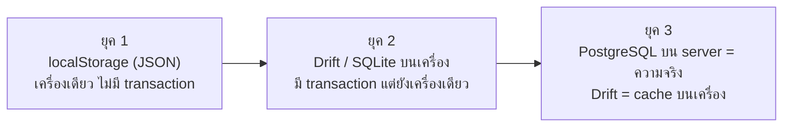
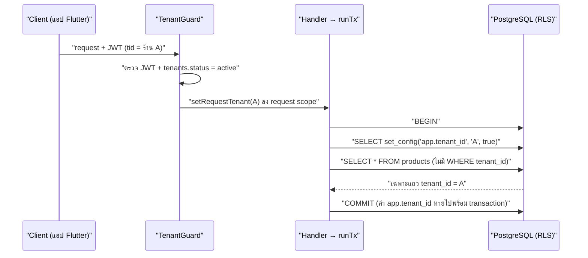

# 07 — Database: เริ่มตั้งแต่ "ทำไมต้องมีฐานข้อมูล" จนถึง PostgreSQL + RLS ของร้านจริง

> บทนี้ตอบคำถามว่า **"ข้อมูลของร้านต้องเก็บไว้ที่ไหน เก็บยังไงถึงไม่หาย ไม่เพี้ยน และร้าน A มองไม่เห็นข้อมูลร้าน B"** และทำไมโปรเจกต์นี้ถึงเลือก PostgreSQL + Drift + Redis + etcd ในหน้าที่ที่ต่างกัน

---

## 🧭 ก่อนอ่าน

- **ต้องอ่านก่อน:** [00_index.md](00_index.md) (client/server, JSON, terminal) และ [02_architecture.md](02_architecture.md) (ภาพใหญ่ว่า Postgres / Redis / etcd อยู่ตรงไหน)
- **เวลาที่ใช้:** ~2–3 ชั่วโมง ส่วน "ปูพื้นฐาน" ยาวที่สุดและสำคัญที่สุด ไม่ต้องรีบ อ่านทีละหัวข้อได้
- **อ่านจบแล้วคุณจะ…**
  - อธิบายได้ว่าทำไมเก็บข้อมูลร้านในตัวแปรหรือไฟล์ธรรมดาถึง "ไม่พอ" และ DBMS แก้ปัญหาอะไร
  - อ่าน `CREATE TABLE` จริงของโปรเจกต์ออก รู้ว่า primary key, foreign key, composite key, index, `CHECK` แต่ละตัวกันพังเรื่องอะไร
  - เล่าได้ว่า transaction + row lock กันไม่ให้ "อะไหล่ชิ้นสุดท้ายถูกขายสองครั้ง" ได้ยังไง และทำไมลำดับการล็อกถึงสำคัญ
  - อธิบาย Row-Level Security (RLS) ได้ตั้งแต่ศูนย์ และรู้ว่าทำไม app ต้องต่อฐานข้อมูลด้วย role `pos_app` ไม่ใช่ `postgres`
  - บอกได้ว่า Postgres, Drift/SQLite, `redis-cache`, `redis-queue` และ etcd แต่ละตัวเก็บอะไร และตัวไหน "เป็นความจริง"

---

## 🧱 ปูพื้นฐาน

ส่วนนี้ยังไม่พูดถึงโปรเจกต์ เราจะเริ่มจากคำถามพื้นๆ ว่า "เก็บข้อมูลยังไง" แล้วค่อยๆ เพิ่มโจทย์จนเห็นเองว่าทำไมโลกนี้ต้องมีสิ่งที่เรียกว่า database

### 1. Data กับ Information ไม่ใช่สิ่งเดียวกัน

- **data** (ข้อมูลดิบ): ข้อเท็จจริงทีละชิ้น เช่น `ผ้าเบรกหน้า`, `2`, `450.00`, `2026-09-25 10:31`
- **information** (สารสนเทศ): data ที่ถูกจัดวางจนตอบคำถามได้ เช่น "วันนี้ขายผ้าเบรกหน้าไป 2 ชุด ได้เงิน 900 บาท เหลือในสต็อก 3 ชุด ควรสั่งเพิ่ม"

> **Analogy (ร้านอะไหล่):** สลิปใบเสร็จที่ยัดอยู่ในลิ้นชักคือ data เป็นร้อยใบ ส่วนคำตอบว่า "เดือนนี้ช่างสมชายค้างเครดิตเท่าไหร่" คือ information ที่คุณจะได้ก็ต่อเมื่อ data ถูกเก็บ **อย่างเป็นระเบียบพอให้ค้นและรวมได้**

ทั้งบทนี้คือเรื่องเดียว: **เก็บ data ยังไงให้เปลี่ยนเป็น information ได้เร็ว ถูกต้อง และไม่หาย**

### 2. ขั้นที่ 0: เก็บในตัวแปร → ปิดโปรแกรมแล้วหาย

โปรแกรมแรกๆ ที่คุณเขียนเก็บข้อมูลแบบนี้ (ตัวอย่างสมมติ):

```dart
// ตัวอย่างสมมติ — ไม่ใช่โค้ดใน repo
final stock = {'ผ้าเบรกหน้า': 5, 'หัวเทียน': 20};
stock['ผ้าเบรกหน้า'] = stock['ผ้าเบรกหน้า']! - 2;   // ขาย 2 ชุด
```

ตัวแปรอยู่ใน **RAM** (หน่วยความจำหลัก) ซึ่งเป็นหน่วยความจำแบบ **volatile** (ไฟดับหรือปิดโปรแกรมแล้วล้างหมด) พรุ่งนี้เปิดร้านมา สต็อกกลับเป็น 5 เหมือนไม่เคยขายอะไรเลย

→ ข้อสรุปแรก: ข้อมูลที่ต้องอยู่เกินอายุโปรแกรมต้องไปอยู่ใน **persistent storage** (ที่เก็บถาวร: ดิสก์, SSD, flash) ซึ่งเป็นสิ่งที่ยังอยู่หลังปิดเครื่อง

### 3. ขั้นที่ 1: เขียนลงไฟล์ (CSV / JSON)

วิธีที่ง่ายที่สุดคือเขียนลงไฟล์ข้อความ

**CSV** (Comma-Separated Values: ข้อความที่คั่นแต่ละช่องด้วยจุลภาค เปิดใน Excel ได้):

```
part_no,name,stock,price
BP-001,ผ้าเบรกหน้า,5,450.00
SP-010,หัวเทียน,20,85.00
```

**JSON** (ข้อความที่มีโครงสร้าง ซ้อนกันได้):

```json
{"products":[{"partNo":"BP-001","name":"ผ้าเบรกหน้า","stock":5,"price":450.0}]}
```

ข้อดีมีจริง คือเข้าใจง่าย เปิดอ่านด้วย text editor ได้ ไม่ต้องติดตั้งอะไรเพิ่ม แอปเดิมของร้านนี้ (เวอร์ชัน JavaScript) ก็ใช้แนวคิดเดียวกัน โดยเก็บ JSON ไว้ใน **localStorage** (ที่เก็บข้อความเล็กๆ ของ browser) เป็นกองๆ ชื่อ `sa_products`, `sa_sales`, … ซึ่งเราจะกลับมาดูในส่วน "ปัญหาจริงของร้าน"

### 4. ปัญหาของไฟล์ เมื่อร้านเริ่มโตขึ้น

ลองเพิ่มโจทย์ทีละข้อ แล้วดูว่าไฟล์รับไหวไหม:

| โจทย์ | เกิดอะไรกับไฟล์ |
|---|---|
| **ค้นหา**: "หาอะไหล่ที่ชื่อมีคำว่า เบรก" จากสินค้า 20,000 รายการ | ต้องอ่านไฟล์ **ทั้งไฟล์** ทุกครั้ง แล้ว loop เทียบทีละบรรทัด ยิ่งข้อมูลมากยิ่งช้า |
| **แก้ 1 แถว**: ขายผ้าเบรก 2 ชุด | ต้องโหลดทั้งไฟล์ แก้ตัวเลขหนึ่งตัว แล้ว **เขียนทับทั้งไฟล์** กลับไป |
| **เขียนพร้อมกัน**: เครื่องหน้าร้านกับหลังร้านขายพร้อมกัน | เครื่อง A อ่าน stock=5 → เครื่อง B อ่าน stock=5 → A เขียน 3 → B เขียน 4 → **การขายของ A หายไปเฉยๆ** (เรียกว่า *lost update*) |
| **ไฟดับกลางทาง**: กำลังเขียนไฟล์อยู่ครึ่งหนึ่ง | ไฟล์เหลือครึ่งเดียว JSON ปิดวงเล็บไม่ครบ → **เปิดไม่ได้ทั้งไฟล์** ข้อมูลทั้งร้านหาย |
| **ไม่มีกฎ**: โค้ดมีบั๊ก เขียน `stock = -3` หรือ `price = "abc"` | ไฟล์ยอมรับหมด ไม่มีใครห้าม ความผิดพลาดเงียบอยู่ในนั้นจนมีคนมาเจอเอง |
| **ความสัมพันธ์**: บิลอ้างถึงลูกค้ารหัส `C-07` แต่ลูกค้าคนนั้นถูกลบไปแล้ว | ไฟล์ไม่รู้ว่าสองไฟล์เกี่ยวกัน บิลชี้ไปที่ลูกค้าที่ไม่มีอยู่จริง |

ทุกข้อในตารางนี้ **คุณแก้เองได้** ด้วยการเขียนโค้ดเพิ่ม (ทำ index เอง, ทำ lock เอง, เขียนไฟล์ชั่วคราวแล้วค่อย rename, ตรวจค่าเอง …) แต่พอแก้ครบทุกข้อ คุณจะพบว่าตัวเองเพิ่งเขียน database ขึ้นมาใหม่ทั้งตัว และน่าจะมีบั๊กมากกว่าของที่คนทั้งโลกใช้กันมา 30 ปี

### 5. DBMS แก้อะไรให้เรา

**DBMS** (Database Management System: โปรแกรมที่ดูแลข้อมูลแทนเรา เช่น PostgreSQL, SQLite, MySQL) คือโปรแกรมที่รวมคำตอบของทุกปัญหาข้างบนไว้ในที่เดียว:

| ปัญหาของไฟล์ | DBMS แก้ด้วย |
|---|---|
| ค้นหาช้า | **index** (เหมือนสารบัญ ไม่ต้องอ่านทุกหน้า) |
| แก้ 1 แถวต้องเขียนทั้งไฟล์ | เก็บเป็น **page** เล็กๆ แก้เฉพาะ page ที่เกี่ยว |
| เขียนพร้อมกันพัง | **lock** และ **transaction isolation** (ให้คนหนึ่งรอจนอีกคนเสร็จ) |
| ไฟดับกลางทาง | **WAL** (Write-Ahead Log: จดบันทึกว่า "กำลังจะทำอะไร" ก่อนลงมือจริง เปิดเครื่องใหม่จะอ่าน log แล้วทำต่อให้จบหรือย้อนกลับ) |
| ไม่มีกฎ | **constraint** (`NOT NULL`, `CHECK`, `UNIQUE`, foreign key) |
| ความสัมพันธ์ขาด | **foreign key** (ห้ามชี้ไปที่ของที่ไม่มีอยู่) |
| อยากได้ information | **query language** (SQL: ภาษาถามข้อมูล) |

> **Analogy (ห้องสมุด):** ไฟล์คือการกองหนังสือไว้บนพื้น ส่วน DBMS คือบรรณารักษ์ที่มีตู้บัตรรายการ (index), มีกฎยืมคืน (constraint), ไม่ยอมให้สองคนยืมเล่มเดียวกันพร้อมกัน (lock) และจดสมุดยืมคืนไว้ก่อนทุกครั้ง ถ้าไฟดับก็รู้ว่าค้างอยู่ตรงไหน (WAL)

### 6. Relational model: ข้อมูลเป็นตาราง

ฐานข้อมูลแบบ **relational** (เชิงสัมพันธ์) เก็บทุกอย่างเป็น **ตาราง** (table)

```
ตาราง products
┌────────┬─────────────┬───────┬────────┐   ← column (คอลัมน์) = คุณสมบัติหนึ่งอย่าง
│ id     │ name_th     │ stock │ price  │
├────────┼─────────────┼───────┼────────┤
│ p1     │ ผ้าเบรกหน้า  │   5   │ 450.00 │   ← row (แถว) = ของหนึ่งชิ้น
│ p2     │ หัวเทียน     │  20   │  85.00 │
└────────┴─────────────┴───────┴────────┘
```

- **table**: กลุ่มของสิ่งชนิดเดียวกัน (สินค้า, บิล, ลูกค้า)
- **row** (แถว หรือ record): ของหนึ่งชิ้น
- **column** (คอลัมน์ หรือ field): คุณสมบัติหนึ่งอย่าง และทุกคอลัมน์มี **data type** (ชนิดข้อมูล) ตายตัว เช่น `INT` (จำนวนเต็ม), `TEXT` (ข้อความ), `NUMERIC(12,2)` (ทศนิยมแบบแม่นยำ 2 ตำแหน่ง เหมาะกับเงิน), `TIMESTAMPTZ` (วันเวลาพร้อม timezone), `UUID` (รหัส 128 บิตที่สุ่มจนแทบไม่มีทางซ้ำ)
- **schema** (โครงสร้าง): คำอธิบายว่ามีตารางอะไร แต่ละตารางมีคอลัมน์อะไร ชนิดอะไร มีกฎอะไร

> 💡 ทำไมเงินต้องเป็น `NUMERIC` ไม่ใช่ `double`? ลองพิมพ์ `0.1 + 0.2` ในภาษาไหนก็ได้ จะได้ `0.30000000000000004` เพราะ `double` เก็บเลขฐานสองแบบประมาณ พอบวกเงินหลายพันบิลเข้าด้วยกัน เศษพวกนี้สะสมจนยอดปิดกะไม่ตรง `NUMERIC(12,2)` เก็บเลขฐานสิบแบบตรงเป๊ะ

### 7. Key: ป้ายชื่อที่ทำให้หาแถวเจอ

เอกสารโปรเจกต์มีบทอธิบาย key แบบเต็มอยู่แล้วที่ [`00_BASICS.md#keys`](../Backend_design/00_BASICS.md#keys) (และฉบับย่อใน [`01_DATABASE.md#keys`](../Backend_design/01_DATABASE.md#keys)) ตรงนี้สรุปเฉพาะที่ต้องใช้ในบทนี้

- **primary key (PK)**: คอลัมน์ (หรือชุดคอลัมน์) ที่ **ไม่ซ้ำและไม่ว่าง** ใช้ชี้แถวหนึ่งแถวได้แน่นอน เหมือนเลขบัตรประชาชน
- **foreign key (FK)**: คอลัมน์ในตารางหนึ่งที่ **ต้องชี้ไปหา PK ที่มีอยู่จริง** ในอีกตาราง เช่น `sale_items.sale_id` ต้องเป็นบิลที่มีอยู่จริง DBMS จะไม่ยอมให้คุณใส่รหัสบิลมั่ว
- **composite key** (key ประกอบ): key ที่ใช้ **หลายคอลัมน์รวมกัน** จึงจะไม่ซ้ำ เช่น "บ้านเลขที่ 12" ซ้ำได้ทั่วประเทศ แต่ "(ตำบล, บ้านเลขที่ 12)" ไม่ซ้ำ ในโปรเจกต์นี้ แทบทุกตารางใช้ `PRIMARY KEY (tenant_id, id)` คือ "(ร้านไหน, รหัสอะไร)" ด้วยกันถึงจะไม่ซ้ำ
- **natural key** กับ **surrogate key**: natural key มีความหมายในโลกจริง (เลขอะไหล่ `BP-001` ที่พิมพ์บนกล่อง) ส่วน surrogate key เป็นรหัสที่ระบบสร้างขึ้นเองโดยไม่มีความหมาย (`id`) เราใช้ surrogate เป็น PK เพราะเลขอะไหล่ **เปลี่ยนได้** และซ้ำได้หลังสินค้าถูกลบ ส่วน PK ห้ามเปลี่ยนตลอดชีวิตแถว

### 8. Relationship: ตารางเกี่ยวกันแบบไหน

| แบบ | ความหมาย | ตัวอย่างในร้าน |
|---|---|---|
| **1:1** (หนึ่งต่อหนึ่ง) | แถวหนึ่งคู่กับอีกแถวหนึ่งพอดี | ร้าน 1 ร้าน มี `settings` 1 แถว |
| **1:N** (หนึ่งต่อหลาย) | แถวหนึ่งมีลูกได้หลายแถว | บิล 1 ใบ มีรายการสินค้าหลายบรรทัด |
| **N:M** (หลายต่อหลาย) | ทั้งสองฝั่งมีได้หลายตัว | บิลหนึ่งใบมีสินค้าหลายชิ้น และสินค้าหนึ่งชิ้นอยู่ในหลายบิล |

N:M เก็บตรงๆ ในสองตารางไม่ได้ ต้องมี **ตารางกลาง** (junction table) ที่แต่ละแถวบอกว่า "บิลนี้ มีสินค้านี้ กี่ชิ้น ราคาเท่าไหร่" ในร้านนี้ตารางกลางคือ `sale_items`

```
 sales (บิล)            sale_items (บรรทัดในบิล)          products (สินค้า)
┌──────────┐ 1       N ┌───────────────────────┐ N      1 ┌──────────────┐
│ id = S1  │───────────│ sale_id=S1 product=p1 │──────────│ id = p1      │
│          │           │ sale_id=S1 product=p2 │──┐       ├──────────────┤
└──────────┘           └───────────────────────┘  └───────│ id = p2      │
                                                          └──────────────┘
```

### 9. Normalization: อย่าเก็บเรื่องเดียวกันไว้หลายที่

สมมติเราเก็บใบเสร็จแบบ "ตารางเดียวจบ" (ตัวอย่างสมมติ):

| receipt_no | customer_name | customer_phone | product | qty | price |
|---|---|---|---|---|---|
| RC-0001 | ช่างสมชาย | 081-111-1111 | ผ้าเบรกหน้า | 2 | 450 |
| RC-0001 | ช่างสมชาย | 081-111-1111 | หัวเทียน | 4 | 85 |
| RC-0002 | ช่างสมชาย | 081-111-1111 | น้ำมันเครื่อง | 1 | 320 |

ดูเหมือนไม่มีอะไร แต่ปัญหามี 3 แบบที่เรียกรวมว่า **anomaly** (ความผิดปกติจากข้อมูลซ้ำ):

1. **update anomaly**: ช่างสมชายเปลี่ยนเบอร์โทร ต้องแก้ 3 แถว ถ้าลืมแก้แถวเดียว ระบบจะมีเบอร์ของสมชายสองเบอร์ แล้วไม่รู้ว่าเบอร์ไหนถูก
2. **insert anomaly**: อยากบันทึกลูกค้าใหม่ที่ยังไม่เคยซื้อ ทำไม่ได้ เพราะแถวต้องมีใบเสร็จด้วย
3. **delete anomaly**: ลบบิล RC-0002 (ยกเลิก) แล้วถ้านั่นเป็นบิลเดียวของลูกค้าคนนั้น ข้อมูลลูกค้าหายไปด้วย

**Normalization** (การแยกตารางให้ข้อมูลแต่ละเรื่องอยู่ที่เดียว) แก้ด้วยการแยก:

```
customers                 sales                              sale_items
┌────┬───────────┬──────┐ ┌─────────┬─────────────┐ ┌──────────┬──────────────┬─────┬───────┐
│ id │ name      │phone │ │ id      │ customer_id │ │ sale_id  │ product_id   │ qty │ price │
│ C1 │ ช่างสมชาย │081…  │ │ RC-0001 │ C1          │ │ RC-0001  │ p1 ผ้าเบรก   │ 2   │ 450   │
└────┴───────────┴──────┘ │ RC-0002 │ C1          │ │ RC-0001  │ p2 หัวเทียน  │ 4   │ 85    │
                          └─────────┴─────────────┘ │ RC-0002  │ p3 น้ำมัน    │ 1   │ 320   │
                                                    └──────────┴──────────────┴─────┴───────┘
```

ตอนนี้เบอร์ของสมชายอยู่ที่เดียว แก้ครั้งเดียวจบ

> ⚠️ **แต่บางครั้งเราจงใจ "ไม่ normalize"** ดูตาราง `sale_items` ของจริงในหัวข้อ "ของจริงใน repo" จะเห็นว่ามันเก็บ `name`, `price`, `cost_at_sale` ซ้ำจาก `products` ด้วย ทั้งที่ดูผิดหลักข้างบน เหตุผลคือ **ใบเสร็จเป็นเอกสารประวัติ** ถ้าพรุ่งนี้ร้านขึ้นราคาผ้าเบรกเป็น 500 บาท ใบเสร็จของเมื่อวานต้องยังเขียน 450 บาทเหมือนเดิม ข้อมูลแบบนี้เรียกว่า **snapshot** (ภาพถ่าย ณ เวลานั้น) กฎที่ใช้ตัดสินคือ: ถ้าอยากให้การแก้ของต้นทางไหลไปถึงทุกที่ ให้ normalize แต่ถ้าอยากให้แต่ละที่ "จำค่า ณ วันนั้น" ให้เก็บ snapshot

### 10. SQL เบื้องต้น: ภาษาที่ใช้คุยกับฐานข้อมูล

**SQL** (Structured Query Language) เป็นภาษาแบบ **declarative** (บอกว่า *อยากได้อะไร* ไม่ต้องบอกว่า *ทำยังไง*) คุณไม่ต้องเขียน loop เอง DBMS จะเลือกวิธีที่เร็วที่สุดให้ ตัวอย่างทั้งหมดในหัวข้อนี้เป็น **ตัวอย่างสมมติ** ที่ตัดคอลัมน์ให้สั้นลงเพื่อให้อ่านง่าย

```sql
-- ตัวอย่างสมมติ: สร้างตาราง
CREATE TABLE sales (
  id          TEXT PRIMARY KEY,
  customer_id TEXT,
  total       NUMERIC(12,2) NOT NULL
);

-- INSERT: เพิ่มแถว
INSERT INTO sales (id, customer_id, total) VALUES ('S1', 'C1', 1240.00);
INSERT INTO sale_items (sale_id, product_id, qty, price)
VALUES ('S1', 'p1', 2, 450.00), ('S1', 'p2', 4, 85.00);

-- SELECT: อ่าน (WHERE = เงื่อนไข, ORDER BY = เรียง)
SELECT id, total FROM sales WHERE total > 1000 ORDER BY total DESC;

-- UPDATE: แก้แถวที่ตรงเงื่อนไข (ลืม WHERE = แก้ทุกแถวในตาราง!)
UPDATE products SET stock = stock - 2 WHERE id = 'p1';

-- DELETE: ลบแถวที่ตรงเงื่อนไข (ลืม WHERE = ลบทั้งตาราง!)
DELETE FROM parked_sales WHERE id = 'X9';
```

**JOIN** (เอาสองตารางมาต่อกันตามคอลัมน์ที่ตรงกัน) คือที่มาของคำว่า "relational":

```sql
-- ตัวอย่างสมมติ: บิล S1 มีสินค้าอะไรบ้าง ชื่ออะไร
SELECT s.id, p.name_th, i.qty, i.price, i.qty * i.price AS line_total
FROM   sales s
JOIN   sale_items i ON i.sale_id = s.id
JOIN   products   p ON p.id      = i.product_id
WHERE  s.id = 'S1';
```

```
 id │ name_th     │ qty │ price  │ line_total
────┼─────────────┼─────┼────────┼───────────
 S1 │ ผ้าเบรกหน้า  │  2  │ 450.00 │   900.00
 S1 │ หัวเทียน     │  4  │  85.00 │   340.00
```

และ **aggregate** (รวมค่า) คือที่ที่ data กลายเป็น information:

```sql
-- ตัวอย่างสมมติ: ยอดขายรวมต่อวัน
SELECT date_trunc('day', date) AS day, count(*) AS bills, sum(total) AS revenue
FROM   sales WHERE NOT voided GROUP BY 1 ORDER BY 1;
```

### 11. Index: สารบัญของตาราง

ถ้าไม่มี index การหา `WHERE part_no = 'BP-001'` ในสินค้า 20,000 แถว DBMS ต้องอ่านทีละแถวจนครบ เรียกว่า **sequential scan** (อ่านไล่ทั้งตาราง)

> **Analogy:** หนังสือ 500 หน้า ถ้าอยากหาคำว่า "RLS" โดยไม่มีดัชนีท้ายเล่ม คุณต้องพลิกอ่านทุกหน้า ดัชนีท้ายเล่มบอกเลยว่าอยู่หน้า 212 และ 340

**index** คือโครงสร้างข้อมูลแยกต่างหาก (ส่วนใหญ่เป็น **B-tree** ต้นไม้ที่เรียงค่าไว้ ค้นได้ในเวลาประมาณ log n) ที่ชี้ว่าค่านี้อยู่แถวไหน

```sql
-- ตัวอย่างสมมติ
CREATE INDEX idx_products_partno ON products (part_no);
```

**ราคาที่จ่าย:** index ไม่ฟรี ทุกครั้งที่ `INSERT`/`UPDATE`/`DELETE` DBMS ต้องแก้ index ด้วย และ index กินพื้นที่ดิสก์ จึงสร้างเฉพาะคอลัมน์ที่ถูก **ค้นบ่อย** เท่านั้น (ในโปรเจกต์นี้ `01_DATABASE.md §6` มีตารางสรุป index ทุกตัวพร้อมเหตุผลว่ามีไว้ตอบหน้าจอไหน)

index ยังทำหน้าที่เป็นกฎได้ด้วย: **unique index** ห้ามค่าซ้ำ และ **partial index** (index ที่มี `WHERE` ครอบเฉพาะบางแถว) เช่น "ห้ามเลขอะไหล่ซ้ำ **เฉพาะสินค้าที่ยังไม่ถูกลบ**" เดี๋ยวเราจะเห็นของจริง

### 12. Constraint: กฎที่ฐานข้อมูลบังคับเอง

| constraint | ความหมาย | กันอะไร |
|---|---|---|
| `NOT NULL` | ห้ามว่าง | บิลที่ไม่มียอดรวม |
| `CHECK (stock >= 0)` | ค่าต้องผ่านเงื่อนไข | สต็อกติดลบจากบั๊ก |
| `UNIQUE (tenant_id, receipt_no)` | ห้ามซ้ำ | ใบเสร็จเลขซ้ำในร้านเดียวกัน |
| `PRIMARY KEY` | `NOT NULL` + `UNIQUE` | สองแถวที่แยกไม่ออก |
| `FOREIGN KEY` | ต้องชี้ไปที่ของที่มีจริง | บรรทัดบิลที่ไม่มีบิลแม่ |

ทำไมต้องให้ **ฐานข้อมูล** บังคับ ไม่ใช่เช็คใน `if` ของโค้ด? เพราะโค้ดมีหลายทาง: API, worker, สคริปต์ import, คนที่ต่อ DB เข้าไปแก้มือ ฯลฯ ถ้ากฎอยู่ในโค้ดทางเดียว ทางอื่นเลี่ยงได้ แต่ถ้ากฎอยู่ใน DB **ทุกทางต้องผ่านด่านเดียวกัน** (เราจะเห็นกรณีจริงเรื่องเลขอะไหล่ซ้ำตัวพิมพ์เล็ก/ใหญ่ ซึ่งเช็คในโค้ดอย่างเดียวปิดไม่ได้)

### 13. Transaction และ ACID: "ทั้งหมด หรือไม่มีเลย"

#### เรื่องเล่า: ขายของแล้วไฟดับกลางทาง

การขาย 1 บิลไม่ใช่การเขียนครั้งเดียว มันคือหลายขั้น:

```
1. ตัดสต็อกผ้าเบรก 2 ชุด           UPDATE products …
2. ตัดสต็อกหัวเทียน 4 หัว           UPDATE products …
3. สร้างหัวบิล                     INSERT INTO sales …
4. สร้างบรรทัดบิล                  INSERT INTO sale_items …
5. บวกแต้มสะสมให้ลูกค้า             UPDATE customers …
                     ⚡ ไฟดับตรงนี้
6. บวกยอดเครดิตให้ช่าง              UPDATE mechanics …
```

ถ้าไม่มีอะไรคุม: สต็อกถูกตัดไปแล้ว บิลถูกสร้างแล้ว แต่ยอดเครดิตช่างไม่ถูกบวก ร้านเสียเงินเงียบๆ และไม่มีใครรู้ เคสโอนเงินธนาคารก็หน้าตาเดียวกัน: หักบัญชี A แล้วไฟดับก่อนเติมบัญชี B เงินหายไปกลางอากาศ

**transaction** (ธุรกรรม: กลุ่มคำสั่งที่ถือเป็นหน่วยเดียว) แก้ปัญหานี้:

```sql
BEGIN;                     -- เริ่ม
  UPDATE products …;
  INSERT INTO sales …;
  UPDATE mechanics …;
COMMIT;                    -- ยืนยันทั้งหมดพร้อมกัน
-- ถ้ามีอะไรพังก่อน COMMIT (error, ไฟดับ, เน็ตหลุด) → ROLLBACK อัตโนมัติ = เหมือนไม่เคยเกิด
```

#### ACID: 4 สัญญาของ transaction

| ตัวอักษร | ชื่อ | ความหมายแบบบ้านๆ | ตัวอย่างร้าน |
|---|---|---|---|
| **A** | Atomicity | ทั้งหมด หรือไม่มีเลย | ไม่มีบิลที่ตัดสต็อกแล้วแต่ไม่บวกเครดิต |
| **C** | Consistency | ก่อนและหลัง transaction ข้อมูลผ่านกฎ (constraint) ทุกข้อ | ถ้าขั้นไหนทำให้ `stock < 0` ทั้ง transaction ถูกปฏิเสธ |
| **I** | Isolation | transaction ที่วิ่งพร้อมกันไม่เห็นงานครึ่งๆ กลางๆ ของกันและกัน | เครื่องหลังร้านไม่เห็นบิลที่หน้าร้านยังขายไม่เสร็จ |
| **D** | Durability | `COMMIT` แล้ว = อยู่ถาวร ไฟดับก็ไม่หาย (เพราะ WAL) | ลูกค้าได้ใบเสร็จแล้ว บิลต้องอยู่ในระบบแน่นอน |

### 14. Concurrency: เมื่อสองคนแย่งของชิ้นเดียวกัน

**concurrency** (การทำงานพร้อมกัน) คือที่มาของบั๊กที่หายากที่สุด เพราะมันเกิดเฉพาะเมื่อจังหวะเวลาตรงกันพอดี

#### Race condition: อะไหล่ชิ้นสุดท้าย

สต็อกผ้าเบรกเหลือ 1 ชุด ลูกค้าสองคนที่สองเครื่องกดขายพร้อมกัน:

```
เวลา  เครื่อง A                         เครื่อง B
 t1   อ่าน stock → 1  ✅ พอ
 t2                                    อ่าน stock → 1  ✅ พอ
 t3   เขียน stock = 0, ออกใบเสร็จ
 t4                                    เขียน stock = 0, ออกใบเสร็จ
      ────────────────────────────────────────────────
      ผล: ขายของ 1 ชิ้นให้ลูกค้า 2 คน (oversell) ชิ้นที่สองไม่มีจริง
```

นี่คือ **race condition** (ผลลัพธ์ขึ้นกับว่าใครวิ่งถึงก่อน) transaction อย่างเดียวไม่พอ เพราะทั้งสองเครื่องอยู่ใน transaction ของตัวเองแต่ก็ยังอ่านได้ 1 เหมือนกัน

#### Row lock: `SELECT … FOR UPDATE`

วิธีแก้คือ **ล็อกแถว** ก่อนอ่าน:

```sql
BEGIN;
SELECT stock FROM products WHERE id = 'p1' FOR UPDATE;  -- จองแถวนี้ไว้
-- ใครอีกคนมา FOR UPDATE แถวเดียวกัน ต้อง "รอ" จนเรา COMMIT/ROLLBACK
UPDATE products SET stock = stock - 1 WHERE id = 'p1';
COMMIT;                                                  -- ปลดล็อก
```

```
เวลา  เครื่อง A                          เครื่อง B
 t1   FOR UPDATE → ได้ล็อก, stock=1
 t2                                     FOR UPDATE → ⏳ รอ…
 t3   ตัดเป็น 0, COMMIT (ปลดล็อก)
 t4                                     ได้ล็อก, อ่าน stock=0 → ❌ "สต็อกไม่พอ"
```

> **Analogy:** ห้องลองเสื้อมีห้องเดียว เข้าไปแล้วล็อกประตู คนถัดไปต้องยืนรอหน้าห้อง ไม่ใช่เปิดประตูเข้ามาลองตัวเดียวกัน

มีล็อกสองระดับที่โปรเจกต์นี้ใช้:

| ล็อก | ความหมาย | คนอื่นอ่านแบบล็อกได้ไหม | คนอื่นแก้ได้ไหม | ใช้ตอน |
|---|---|---|---|---|
| `FOR UPDATE` | "ฉันจะแก้แถวนี้" | ❌ รอ | ❌ รอ | ตัดสต็อก, แก้ยอดเครดิตช่าง |
| `FOR SHARE` | "ฉันกำลังพึ่งแถวนี้ ห้ามใครแก้จนกว่าฉันจะเสร็จ" | ✅ (`FOR SHARE` ด้วยกันอยู่ร่วมกันได้) | ❌ รอ | อ่านกะ (shift) ที่เปิดอยู่ตอนขาย กันไม่ให้มีคนปิดกะ **ระหว่างที่** บิลกำลังจะนับเข้าลิ้นชัก |

`FOR SHARE` ใช้เมื่อเราไม่ได้จะแก้แถวนั้น แต่ความถูกต้องของเราขึ้นกับว่ามัน "ต้องไม่เปลี่ยนระหว่างทาง" หลายบิลขายพร้อมกันบนกะเดียวกันได้ (share ร่วมกัน) แต่การปิดกะ (ซึ่งต้อง `UPDATE` แถวกะ) ต้องรอให้ทุกบิลเสร็จก่อน

#### Deadlock: ต่างคนต่างรอกัน

ล็อกแก้ปัญหาหนึ่ง แต่สร้างปัญหาใหม่:

```
บิล X ขาย [ผ้าเบรก, หัวเทียน]          บิล Y ขาย [หัวเทียน, ผ้าเบรก]
 t1  ล็อก ผ้าเบรก ✅                    ล็อก หัวเทียน ✅
 t2  ขอล็อก หัวเทียน ⏳ (Y ถืออยู่)      ขอล็อก ผ้าเบรก ⏳ (X ถืออยู่)
      → X รอ Y, Y รอ X → รอกันตลอดกาล = DEADLOCK
```

PostgreSQL ตรวจเจอ deadlock เองแล้วฆ่า transaction หนึ่งทิ้ง (ได้ error) ลูกค้าคนหนึ่งจึงขายไม่ผ่านโดยไม่มีเหตุผลที่เข้าใจได้

**วิธีแก้ที่ง่ายและได้ผล: ทุกคนล็อกตามลำดับเดียวกันเสมอ** ถ้าทั้ง X และ Y ล็อก "เรียงตาม id" ทั้งคู่จะไปแย่งผ้าเบรกก่อน คนแพ้ก็แค่รอ ไม่มีวงกลม

> **Analogy:** นักปรัชญา 5 คนนั่งรอบโต๊ะ มีตะเกียบ 5 อัน ถ้าทุกคนหยิบข้างซ้ายก่อน ทุกคนถือหนึ่งอันแล้วรอข้างขวาตลอดไป แต่ถ้ากำหนดว่า "หยิบอันที่เลขน้อยกว่าก่อนเสมอ" วงกลมการรอจะเกิดไม่ได้

โปรเจกต์นี้จึงมี **กฎลำดับการล็อก** ที่เขียนไว้ใน CLAUDE.md สำหรับการเขียนที่แตะเงินหรือสต็อก:

```
sales → mechanic → products (เรียงตาม id) → doc_counters → customer
        ↑ บนเส้นทาง void/คืนของ มีการอ่าน shifts แบบ FOR SHARE แทรกระหว่าง sales กับ mechanic
```

ใครเขียน transaction ใหม่ที่แตะตารางเหล่านี้มากกว่าหนึ่งตาราง ต้องล็อกตามลำดับนี้ ไม่งั้นวันหนึ่งจะเจอ deadlock กับ transaction ที่เขียนไว้ก่อนแล้ว

### 15. SQL vs NoSQL

ฐานข้อมูลไม่ได้มีแค่แบบตาราง คำว่า **NoSQL** หมายถึงฐานข้อมูลที่ไม่ได้ใช้โมเดลตาราง มีหลายตระกูล:

| ชนิด | เก็บแบบไหน | ตัวอย่าง | เก่งเรื่อง | อ่อนเรื่อง |
|---|---|---|---|---|
| **Relational (SQL)** | ตาราง + FK + transaction ข้ามตาราง | PostgreSQL, SQLite, MySQL | ข้อมูลที่เกี่ยวกันแน่น, เงิน, สต็อก, กฎเยอะ | ต้องออกแบบ schema ล่วงหน้า |
| **Document** | ก้อน JSON ทั้งก้อน (1 document = 1 บิลพร้อมบรรทัด) | CouchDB, MongoDB | โครงสร้างยืดหยุ่น, sync ระหว่างเครื่อง (CouchDB) | transaction ข้าม document อ่อนหรือไม่มี |
| **Key-value** | `key → value` ล้วนๆ | Redis, etcd | เร็วมาก, cache, คิว, config | query ซับซ้อนไม่ได้ ไม่มี JOIN |

**เลือกยังไง:**
- ข้อมูลที่ "ต้องถูกเสมอ" และหนึ่งการกระทำแตะหลายเรื่องพร้อมกัน (ขาย = สต็อก + บิล + แต้ม + เครดิต + เลขใบเสร็จ) → **relational**
- ข้อมูลที่หายแล้วสร้างใหม่ได้ ต้องการความเร็ว → **key-value** (cache)
- ข้อมูลที่แต่ละก้อนเป็นอิสระต่อกันและต้อง sync ระหว่างอุปกรณ์เป็นหัวใจหลัก → **document** อาจเหมาะ

ระบบจริงส่วนใหญ่ใช้ **หลายตัวร่วมกัน** ตามหน้าที่ ซึ่งเป็นสิ่งที่โปรเจกต์นี้ทำเช่นกัน

---

## 🔥 ปัญหาจริงของร้าน

### ยุคที่ 1: localStorage ใน browser

แอปเดิมของร้านเป็น React ที่รันใน browser เก็บข้อมูลทุกอย่างเป็น JSON ใน localStorage แยกเป็นกอง `sa_products`, `sa_sales`, … (โค้ดหลักอยู่ใน `pos/db.js` ของ repo เก่า) มันใช้งานได้จริงสำหรับร้านเดียวเครื่องเดียว แต่มีปัญหาทุกข้อในตาราง "ปัญหาของไฟล์" ข้างบน:

- ไม่มี transaction จริง `db.js` ต้องทำ "snapshot แล้ว rollback เอง" เวลาขายไม่ผ่าน
- ล้าง cache browser = ข้อมูลทั้งร้านหาย
- เครื่องที่สองมองไม่เห็นข้อมูลของเครื่องแรก

### ยุคที่ 2: Drift/SQLite บนเครื่อง (build ที่ร้านใช้อยู่ตอนนี้)

ตอนย้ายมา Flutter ทีมเปลี่ยนที่เก็บเป็น **SQLite** (ฐานข้อมูล relational ขนาดเล็กที่เป็นแค่ไฟล์เดียว ฝังอยู่ในแอป) ผ่านไลบรารี **Drift** (ตัวช่วยเขียน SQLite จาก Dart แบบมี type) ได้ transaction จริง (`transaction(() async {…})` throw เมื่อไหร่ย้อนกลับทั้งหมด) ได้ constraint และได้ SQL

แต่ยังอยู่ **บนเครื่องเดียว** ปัญหา "เครื่องที่สองมองไม่เห็น" และ "ฮาร์ดดิสก์พัง = ข้อมูลหาย" ยังอยู่ครบ และมีรอยร้าวที่คอมเมนต์ใน `sales.service.ts` ชี้ไว้ตรงๆ ว่า repository ฝั่ง Dart **เช็คสต็อกนอก transaction** แล้วค่อยเปิด transaction มาตัด ซึ่งเป็น race condition แบบในหัวข้อ 14 "มันไม่เคยกัด เพราะร้านมีเครื่องเดียว" พอมีหลายเครื่องมันจะกัดแน่นอน

### ยุคที่ 3: PostgreSQL บน server เป็น source of truth

โจทย์ใหม่คือ **หลายร้าน (multi-tenant) หลายเครื่องต่อร้าน** จึงต้องมีที่เก็บข้อมูลกลางที่:

1. ทุกเครื่องของร้านเห็นข้อมูลชุดเดียวกัน
2. ตัดสต็อกพร้อมกันจากหลายเครื่องได้โดยไม่ oversell (ต้องมี row lock)
3. ร้าน A **มองไม่เห็น** ข้อมูลร้าน B ต่อให้โค้ดมีบั๊ก (ร้านเป็นธุรกิจคนละเจ้าของ บางร้านอาจเป็นคู่แข่งกัน)
4. backup ได้ที่เดียว

คำตอบคือ **PostgreSQL บน server เป็น source of truth** (แหล่งความจริงหนึ่งเดียว: ถ้าสองที่ขัดกัน ที่นี่ชนะ) ส่วน Drift บนเครื่องลดบทบาทเป็น **read cache** (สำเนาไว้อ่านเร็วๆ) และ offline shell (ส่วนที่ทำให้แอปยังเปิดได้ตอนเน็ตล่ม) กฎทางธุรกิจที่เคยอยู่ใน repository ฝั่ง Dart (`saveSale`, `createReturn`, `receivePO`, กะ) ถูก **พอร์ต** ขึ้นไปฝั่ง server โดยใช้โค้ด Dart เป็นต้นแบบพฤติกรรม ไม่ใช่เขียนกฎใหม่

> ⚠️ ข้อเท็จจริงสำคัญ: **ยังไม่มีการ cutover** ร้านจริงยังรัน Drift build อยู่ ส่วน server พัฒนากับ tenant ทดลอง (demo tenant)



---

## ⚖️ ทางเลือก → ทำไมเลือกอันนี้

### ตัดสินใจที่ 1: ฐานข้อมูลตัวจริงคืออะไร

| เกณฑ์ | **PostgreSQL** (เลือก) | CouchDB (เสนอแล้วถูกปฏิเสธ) | SQLite บนแต่ละเครื่องต่อไป |
|---|---|---|---|
| transaction ข้าม 5 ตาราง (ขาย 1 บิล) | ✅ `BEGIN…COMMIT` | ❌ transaction ได้แค่ document เดียว | ✅ แต่เฉพาะในเครื่องตัวเอง |
| row lock `SELECT … FOR UPDATE` | ✅ | ❌ มีแค่ `_rev` ต่อ document | ใช้กับหลายเครื่องไม่ได้ |
| FK / CHECK / UNIQUE | ✅ | ❌ | ✅ |
| แยกร้านระดับแถว (RLS) | ✅ | ❌ สิทธิ์ระดับ database เท่านั้น → ต้องแยก DB ต่อร้าน | ไม่เกี่ยว (ไม่มีหลายร้าน) |
| เงินแบบ `NUMERIC` | ✅ | ❌ JSON number = double | SQLite ไม่มีทศนิยมแบบตรงเป๊ะ (Drift ใช้ `real`) |
| sync ลงเครื่องตอนออฟไลน์ | ต้องสร้างเอง (outbox, เฟส 2) | ✅ มากับตัว | ไม่มีอะไรให้ sync |
| ตรงกับโจทย์คอร์ส (NestJS + PostgreSQL + Redis + BullMQ + Nginx) | ✅ | ❌ | ❌ |

ADR-0012 ([`adr/0012-couchdb-replaces-postgres.md`](../Backend_design/adr/0012-couchdb-replaces-postgres.md)) บันทึกว่าเคยมีข้อเสนอให้เปลี่ยนเป็น CouchDB (2026-09-08) และ **ถูกปฏิเสธในวันเดียวกัน** เหตุผลหลักคือจะเสียทุกอย่างที่ส่วนปูพื้นฐานหัวข้อ 12–14 สอนไป (transaction ข้ามตาราง, row lock, FK, RLS) เพื่อแลกกับ sync engine ที่ยังพิสูจน์ไม่ได้ว่าใช้กับ Flutter Web ได้ ส่วนความสามารถ offline ที่ CouchDB ให้ มีที่อยู่ในแผนแล้วคือเฟส 2

**เพราะ** การขาย 1 บิลต้องแตะหลายตารางแบบ "ทั้งหมดหรือไม่มีเลย" และต้องกัน oversell จากหลายเครื่อง → **จึงต้อง** เป็น relational DB ที่มี row lock → **ราคาที่จ่าย** คือต้องสร้าง sync/offline เองในเฟส 2 (ดู [10_offline_phase2.md](10_offline_phase2.md))

### ตัดสินใจที่ 2: หลายร้านอยู่ร่วมกันยังไง (multi-tenant)

**tenant** (ผู้เช่า) ในที่นี้คือ "ร้านหนึ่งร้าน" ระบบ SaaS ที่ให้หลายร้านใช้โปรแกรมเดียวกันเรียกว่า **multi-tenant** มี 3 แบบหลัก (ฉบับเต็มอยู่ใน [`03_ARCHITECTURE.md §5`](../Backend_design/03_ARCHITECTURE.md)):

```
T1 Shared schema              T2 Schema-per-tenant         T3 Database-per-tenant
┌──────── DB เดียว ────────┐   ┌──────── DB เดียว ───────┐   ┌─ DB ร้าน A ─┐ ┌─ DB ร้าน B ─┐
│ products                 │   │ shop_a.products         │   │ products    │ │ products    │
│  tenant_id=A  ผ้าเบรก    │   │ shop_b.products         │   │ sales       │ │ sales       │
│  tenant_id=B  หัวเทียน   │   │ shop_a.sales …          │   └─────────────┘ └─────────────┘
└──────────────────────────┘   └─────────────────────────┘
```

| | **T1 Shared schema + `tenant_id` + RLS** (เลือก) | T2 Schema ต่อร้าน | T3 Database ต่อร้าน |
|---|---|---|---|
| ต้นทุนต่อร้าน | ต่ำมาก | กลาง | สูง (connection pool ต่อ DB) |
| migration | รันครั้งเดียว ครบทุกร้าน | วนทุก schema | วนทุก DB |
| ความเสี่ยงข้อมูลรั่ว | 🔴 สูงสุด ถ้าลืม `WHERE tenant_id` | 🟡 | 🟢 ต่ำสุด |
| backup/restore รายร้าน | ยาก (export รายร้านได้ แต่ไม่รับปาก restore รายร้าน) | กลาง | ง่าย |
| เหมาะกับ | SaaS ร้านเล็ก-กลางจำนวนมาก | 10–100 ร้านที่อยากแยกชัด | ลูกค้าองค์กร |

**เพราะ** ลูกค้าคือร้านอะไหล่เล็ก-กลางจำนวนมาก และทีมมี 3 คน → **จึงเลือก** T1 ที่ถูกและ migrate ครั้งเดียว → **ราคาที่จ่าย** คือความเสี่ยงรั่วสูงสุด ซึ่งต้องจ่ายคืนด้วยมาตรการหลายชั้น โดยชั้นสุดท้ายคือ RLS

### RLS จากศูนย์

**Row-Level Security** (ความปลอดภัยระดับแถว) คือกฎที่แปะไว้ **บนตาราง** ใน Postgres ว่า "connection นี้เห็นได้เฉพาะแถวที่ผ่านเงื่อนไขนี้" ต่อให้ query ไม่มี `WHERE` เลย Postgres ก็จะเติมเงื่อนไขให้เอง

> **Analogy (บัตรพนักงาน):** ห้างมีตู้เก็บของเรียงกันเป็นร้อยตู้ ของทุกร้านอยู่ในห้องเดียวกัน (T1) พนักงานร้าน A ถือบัตรที่ **เปิดได้เฉพาะตู้ที่ติดป้าย A** ต่อให้เขาเดินไปผิดตู้ หรือหัวหน้าสั่งผิดว่า "ไปหยิบของตู้ 57 มา" บัตรก็ไม่เปิดให้ ความปลอดภัยไม่ได้มาจากความระวังของพนักงาน แต่มาจากตัวล็อกที่ตู้
>
> - ป้ายบนตู้ = คอลัมน์ `tenant_id` ของแต่ละแถว
> - บัตรพนักงาน = ค่า `app.tenant_id` ที่ตั้งไว้บน transaction
> - ตัวล็อกที่ตู้ = policy RLS
> - ถ้าไม่มีบัตรเลย = เปิดไม่ได้สักตู้ (**fail-closed**: พังแบบปิด ไม่ใช่พังแบบเปิดโล่ง)

ขั้นตอนในระบบนี้:



สองจุดที่ต้องจำ:

1. `tenant_id` มาจาก **JWT เท่านั้น** ไม่เคยมาจาก body ของ request (ไม่งั้นใครก็พิมพ์ uuid ร้านอื่นเข้ามาได้)
2. RLS เป็น **ตาข่ายชั้นสุดท้าย** ไม่ใช่ชั้นเดียว โค้ดฝั่ง server ก็ยังใส่ `WHERE tenant_id = $1` เองด้วย (เห็นได้ใน `sales.service.ts`) ถ้าชั้นแรกพลาด ชั้นสุดท้ายยังรับไว้

### ทำไม app ต้องต่อด้วย `pos_app` ไม่ใช่ `postgres`

RLS มีช่องโหว่โดยธรรมชาติสองช่อง:
- **superuser** ข้าม RLS ได้เสมอ
- **เจ้าของตาราง** (table owner) ข้าม RLS โดย default (เว้นแต่ใส่ `FORCE ROW LEVEL SECURITY`)

ถ้า API ต่อ DB ด้วย `postgres` (superuser) RLS ทั้งระบบคือกระดาษ ระบบนี้จึงแยก role:

| role | ใครใช้ | สิทธิ์ |
|---|---|---|
| `postgres` | job `migrate` เท่านั้น (สร้าง/แก้ตาราง) | superuser, เจ้าของตาราง |
| `pos_app` | api ทั้ง 3 ตัว + worker | `NOSUPERUSER … NOBYPASSRLS`, ได้แค่ `SELECT/INSERT/UPDATE/DELETE` (ตาราง `movements` ได้แค่ `SELECT, INSERT` เพราะเป็นสมุดบัญชีที่ห้ามแก้ย้อนหลัง) |

ผลข้างเคียงที่ต้องรู้: **แผนการ query (`EXPLAIN`) ของ `pos_app` กับของ `postgres` ไม่เหมือนกัน** เพราะ RLS เติมเงื่อนไขเข้าไปในทุก query เวลาตรวจว่า index ถูกใช้ไหม ต้องรัน `EXPLAIN` ในฐานะ `pos_app` ไม่งั้นจะเห็นแผนที่ production ไม่ได้ใช้จริง

### ตัดสินใจที่ 3: แล้ว Redis กับ etcd มาทำอะไร

ระบบนี้มี "ที่เก็บข้อมูล" มากกว่าหนึ่งตัว แต่ **มีความจริงแค่ที่เดียว**:

| ที่เก็บ | ชนิด | เก็บอะไร | ถ้าข้อมูลหาย | ตั้งค่าสำคัญ |
|---|---|---|---|---|
| **PostgreSQL** | relational | ทุกอย่างที่ร้านพึ่ง: สินค้า, บิล, กะ, ลูกค้า, เลขเอกสาร | 🔴 หายนะ | `max_connections=100` |
| **redis-cache** | key-value | ของที่อ่านบ่อยและสร้างใหม่ได้ (เช่น สถานะร้าน, รายการสินค้า) key ขึ้นต้นด้วย `t:{tid}:` เสมอ | 🟢 ช้าลงนิดหน่อย แล้วโหลดใหม่จาก Postgres | `allkeys-lru`, ไม่เซฟลงดิสก์ |
| **redis-queue** | key-value (ใช้เป็นคิวงานของ BullMQ) | งานที่ต้องทำหลังขาย | 🔴 งานหายเงียบๆ | `noeviction` + AOF |
| **etcd** | key-value แบบ strongly consistent | config ที่เปลี่ยนได้ตอนระบบรันอยู่ และ **ไม่ใช่ความลับ** (ตอนนี้มีแค่ `/pos/config/log_level`) | 🟢 ใช้ค่า default | ไม่มีข้อมูลธุรกิจ |
| **Drift/SQLite** (บนเครื่อง) | relational | สำเนาไว้อ่าน + (เฟส 2) คิวงานที่ยังไม่ส่ง | 🟡 ดึงใหม่จาก server ได้ ยกเว้นของที่ยังไม่ได้ส่ง | schema v11 |

ศัพท์ที่ต้องรู้:
- **eviction policy** (นโยบายไล่ของออก): Redis เก็บทุกอย่างใน RAM พอ RAM เต็มจะทำยังไง `allkeys-lru` = ลบ key ที่ไม่ได้ใช้นานที่สุดทิ้ง (**LRU**, Least Recently Used) เหมาะกับ cache ที่ของหายก็โหลดใหม่ได้ ส่วน `noeviction` = ไม่ลบอะไรเลย ปฏิเสธการเขียนใหม่ให้เห็นเป็น error แทน
- **AOF** (Append-Only File: จดทุกคำสั่งเขียนต่อท้ายไฟล์) ทำให้ Redis รีสตาร์ทแล้วงานในคิวยังอยู่

ทำไมต้องแยก Redis สองตัวแทนที่จะใช้ตัวเดียว? เพราะ **นโยบายสองแบบนี้ขัดกันตรงๆ** cache อยาก "ลบได้ตามใจ" แต่คิวต้อง "ห้ามลบเด็ดขาด" ถ้าใช้ตัวเดียวกับ `allkeys-lru` วันที่ RAM เต็ม Redis อาจเลือกลบงานในคิวทิ้ง คอมเมนต์ใน compose เขียนไว้ว่า *"a dropped job is a lost sale"* (งานหาย 1 งาน = ยอดขายหาย 1 บิล)

**เพราะ** แต่ละข้อมูลมี "ราคาของการหาย" ต่างกัน → **จึง** แยกที่เก็บตามราคานั้น และให้ Postgres เป็นความจริงหนึ่งเดียว → **ราคาที่จ่าย** คือมี container ให้ดูแลมากขึ้น และต้องมีวินัยว่า "ห้ามเอาข้อมูลธุรกิจไปไว้ใน Redis หรือ etcd"

---

## 🔍 ของจริงใน repo

### 1. ภาพรวมตาราง (ER diagram)

**ER diagram** (Entity-Relationship: ภาพที่แสดงตารางและความสัมพันธ์) ข้างล่างวาดจาก migration จริงใน `server/src/db/migrations/*.ts` เลือกเฉพาะตารางหลักและคอลัมน์สำคัญ (ไม่ครบทุกคอลัมน์)

**Postgres มีทั้งหมด 29 ตาราง** นับจาก `CREATE TABLE` ใน migration: 27 ตารางจาก `1788652800000-InitialSchema.ts` + `import_jobs` (`1788652802200-ImportJobs.ts`) + `owner_review_items` (`1788652803002-OwnerReviewItems.ts`)

การอ่าน:
- ตามกติกาของโปรเจกต์ **key ที่มีหลายคอลัมน์จะไม่ติดป้าย `PK`/`UK`** แต่เขียนเป็นคอมเมนต์ เช่น `"PK ร่วม (tenant_id, id)"` เพราะ Mermaid ติดป้ายได้ทีละคอลัมน์ ถ้าติด `PK` สองแถวคนจะเข้าใจผิดว่ามีสอง primary key
- `tenant_id` ติดป้าย `FK` **เฉพาะตารางที่ migration มี `REFERENCES tenants(id)` จริง** (เช่น `users`, `products`) ตารางอื่นอย่าง `sales` มี `tenant_id` แต่ไม่ได้ประกาศ FK ไป `tenants` การแยกร้านของตารางพวกนั้นมาจาก RLS และ composite FK
- เส้นความสัมพันธ์วาดเฉพาะ FK ที่ประกาศจริงใน migration

```mermaid
erDiagram
  TENANTS {
    uuid id PK
    text code UK
    text shop_name
    text status "active / suspended / closed"
    text timezone "default Asia/Bangkok"
  }
  USERS {
    uuid tenant_id FK "PK ร่วม (tenant_id, id)"
    uuid id "PK ร่วม (tenant_id, id)"
    text username "UNIQUE (tenant_id, username)"
    text role "CHECK role = owner"
    boolean is_active "active ได้ 1 คนต่อร้าน"
  }
  DEVICES {
    uuid tenant_id "PK ร่วม (tenant_id, id)"
    text id "PK ร่วม (tenant_id, id)"
    smallint device_no "CHECK 1..99, UNIQUE (tenant_id, device_no)"
    text role "pos / backoffice, pos ได้ 1 เครื่อง"
    timestamptz retired_at
  }
  PRODUCTS {
    uuid tenant_id FK "PK ร่วม (tenant_id, id)"
    text id "PK ร่วม (tenant_id, id)"
    text part_no "ห้ามซ้ำในร้าน (partial unique index)"
    numeric price "CHECK >= 0"
    numeric cost "CHECK >= 0"
    int stock "CHECK >= 0"
    timestamptz updated_at "cursor ของ sync"
    timestamptz deleted_at "soft delete"
  }
  MOVEMENTS {
    uuid tenant_id "PK ร่วม (tenant_id, id)"
    text id "PK ร่วม (tenant_id, id)"
    text product_id "FK ร่วม (tenant_id, product_id)"
    int delta
    text type "sale / return / receive / adjustment-in / adjustment-out"
    int stock_after
  }
  CUSTOMERS {
    uuid tenant_id "PK ร่วม (tenant_id, id)"
    text id "PK ร่วม (tenant_id, id)"
    text code "UNIQUE (tenant_id, code)"
    int points "CHECK >= 0"
    numeric total_spend
  }
  MECHANICS {
    uuid tenant_id "PK ร่วม (tenant_id, id)"
    text id "PK ร่วม (tenant_id, id)"
    numeric credit_limit
    numeric credit_balance "CHECK >= 0"
  }
  SALES {
    uuid tenant_id "PK ร่วม (tenant_id, id)"
    text id "PK ร่วม (tenant_id, id)"
    text receipt_no "UNIQUE (tenant_id, receipt_no)"
    numeric total
    text payment_method
    text customer_id "FK ร่วม → customers"
    text mechanic_id "FK ร่วม → mechanics"
    text shift_id "ไม่มี FK ประกาศไว้"
    boolean voided
  }
  SALE_ITEMS {
    uuid tenant_id "PK ร่วม (tenant_id, sale_id, line_no)"
    text sale_id "PK ร่วม + FK ร่วม → sales"
    int line_no "PK ร่วม (tenant_id, sale_id, line_no)"
    text product_id "snapshot ไม่มี FK ไป products"
    int qty "CHECK > 0"
    numeric price
    numeric cost_at_sale
  }
  RETURNS {
    uuid tenant_id "PK ร่วม (tenant_id, id)"
    text id "PK ร่วม (tenant_id, id)"
    text cn_no "UNIQUE (tenant_id, cn_no)"
    text sale_id "FK ร่วม → sales"
    numeric refund_total
  }
  SHIFTS {
    uuid tenant_id "PK ร่วม (tenant_id, id)"
    text id "PK ร่วม (tenant_id, id)"
    text device_id "active ได้ 1 กะต่อเครื่อง"
    numeric starting_cash
    boolean is_active
  }
  DRAWER_ENTRIES {
    uuid tenant_id "PK ร่วม (tenant_id, id)"
    text id "PK ร่วม (tenant_id, id)"
    text shift_id "FK ร่วม → shifts"
    text type "CHECK in / out"
    numeric amount "CHECK > 0"
  }
  DOC_COUNTERS {
    uuid tenant_id "PK ร่วม (tenant_id, device_id, doc_type, period)"
    text device_id "PK ร่วม"
    text doc_type "receipt / po / quote / cn / cp"
    text period "ปี พ.ศ.-เดือน"
    int last_no "CHECK <= 9999"
  }
  IDEMPOTENCY_KEYS {
    uuid tenant_id "PK ร่วม (tenant_id, key)"
    text key "PK ร่วม (tenant_id, key)"
    text request_hash
    text status "in_progress / done / failed"
    jsonb response_body
  }
  AUDIT_LOG {
    uuid tenant_id "PK ร่วม (tenant_id, id)"
    bigint id "BIGSERIAL, PK ร่วม (tenant_id, id)"
    text action
    jsonb before
    jsonb after
  }

  TENANTS ||--o{ USERS : "มีเจ้าของร้าน"
  TENANTS ||--o{ PRODUCTS : "มีสินค้า"
  PRODUCTS ||--o{ MOVEMENTS : "ประวัติการเคลื่อนไหว"
  CUSTOMERS |o--o{ SALES : "ซื้อ"
  MECHANICS |o--o{ SALES : "รับของ/ค้างเครดิต"
  SALES ||--|{ SALE_ITEMS : "มีบรรทัด"
  SALES ||--o{ RETURNS : "ถูกคืน"
  SHIFTS ||--o{ DRAWER_ENTRIES : "เงินเข้า/ออกลิ้นชัก"
```



สังเกต 3 อย่าง:
1. **เกือบทุก PK ขึ้นต้นด้วย `tenant_id`** (ยกเว้น `tenants`, `platform_admins`, `settings`, `import_jobs`) นี่คือกติกาที่ว่าทุกตารางของร้านต้องพา `tenant_id` อยู่ใน key และ FK ก็เป็น **composite FK** เช่น `FOREIGN KEY (tenant_id, sale_id) REFERENCES sales (tenant_id, id)` ผลคือบรรทัดบิลของร้าน A **ชี้ไปที่บิลของร้าน B ไม่ได้ในทางกายภาพ** เพราะ `tenant_id` ต้องตรงกันด้วย
2. **`sale_items.product_id` ไม่มี FK ไป `products`** และเก็บ `name`, `price`, `cost_at_sale` ซ้ำ นี่คือ snapshot ที่คุยกันในหัวข้อ normalization ใบเสร็จต้องจำราคา ณ วันขาย
3. **`sales.shift_id` ไม่มี FK ประกาศไว้** ความถูกต้องของการผูกบิลกับกะจึงมาจากโค้ด (อ่านกะแบบ `FOR SHARE` ก่อนขาย) ไม่ใช่จาก constraint

### 2. `CREATE TABLE products`: composite PK, CHECK และ partial unique index

`server/src/db/migrations/1788652800000-InitialSchema.ts:151-171`

```ts
    // No FK products.category → categories: orphaned names are legacy behaviour (§10).
    await q.query(`
      CREATE TABLE products (
        tenant_id  UUID NOT NULL REFERENCES tenants(id) ON DELETE CASCADE,
        id         TEXT NOT NULL,
        part_no    TEXT NOT NULL,
        name       TEXT NOT NULL,
        name_th    TEXT NOT NULL,
        category   TEXT NOT NULL,
        brand      TEXT NOT NULL,
        price      NUMERIC(12,2) NOT NULL CHECK (price >= 0),
        cost       NUMERIC(12,2) NOT NULL CHECK (cost  >= 0),
        stock      INT  NOT NULL CHECK (stock >= 0),
        min_stock  INT  NOT NULL DEFAULT 0,
        compat     TEXT,
        updated_at TIMESTAMPTZ NOT NULL DEFAULT now(),
        deleted_at TIMESTAMPTZ,
        PRIMARY KEY (tenant_id, id)
      )`);
    await q.query(`
      CREATE UNIQUE INDEX uq_products_partno ON products (tenant_id, part_no)
        WHERE deleted_at IS NULL`);
```

อ่านทีละส่วน:
- **`PRIMARY KEY (tenant_id, id)`**: composite key สินค้า `p1` ของร้าน A กับ `p1` ของร้าน B เป็นคนละแถวกันได้
- **`REFERENCES tenants(id) ON DELETE CASCADE`**: ลบร้าน = ลบสินค้าของร้านตามไปด้วย
- **`NUMERIC(12,2)`**: เงินแบบตรงเป๊ะ (ไม่ใช่ `double`)
- **`CHECK (stock >= 0)`**: ต่อให้โค้ดทุกบรรทัดมีบั๊ก ฐานข้อมูลก็ไม่ยอมให้สต็อกติดลบ transaction ที่พยายามทำจะถูก rollback ทั้งก้อน
- **`deleted_at`**: **soft delete** (ลบแบบแปะป้ายว่าลบ ไม่ได้ลบแถวจริง) จำเป็นสำหรับ sync เพราะเครื่องอื่นต้องรู้ว่า "ของชิ้นนี้ถูกลบแล้ว" ถ้าลบแถวทิ้งจริง เครื่องที่ยังมีสำเนาเก่าจะไม่มีวันรู้
- **ไม่มี FK จาก `category` ไป `categories`**: ตั้งใจ เพราะแอปเดิม "ลบหมวด" แล้วไม่แตะสินค้า สินค้าที่หมวดกำพร้าเป็นพฤติกรรมที่ต้องรักษาไว้
- **`uq_products_partno … WHERE deleted_at IS NULL`**: partial unique index "เลขอะไหล่ห้ามซ้ำในร้านเดียวกัน **เฉพาะสินค้าที่ยังไม่ถูกลบ**" ถ้าไม่มี `WHERE` สินค้าที่ลบไปแล้วจะกันไม่ให้เอาเลขเดิมกลับมาใช้

แต่ `uq_products_partno` มีรูหนึ่ง: มันเทียบแบบแยกตัวพิมพ์ใหญ่-เล็ก `BP-1` กับ `bp-1` จึงอยู่ด้วยกันได้ ทั้งที่แอปเดิมถือว่าซ้ำ migration ถัดมาจึงปิดรูนี้

`server/src/db/migrations/1788652800007-ProductsPartNoCaseInsensitive.ts:20-24`

```ts
  async up(q: QueryRunner): Promise<void> {
    await q.query(
      `CREATE UNIQUE INDEX uq_products_partno_ci ON products (tenant_id, lower(part_no))
         WHERE deleted_at IS NULL`,
    );
  }
```

index นี้สร้างบน **expression** `lower(part_no)` ไม่ใช่บนคอลัมน์ตรงๆ คอมเมนต์หัวไฟล์อธิบายว่าทำไมต้องให้ **DB** บังคับ: การ import ของ platform เขียนสินค้าโดยไม่ผ่านโค้ดเช็คตัวนี้ และ `toLowerCase()` ของ JS กับ `lower()` ของ Postgres ให้ผลไม่ตรงกันนอกช่วงตัวอักษร ASCII ตอนนี้ **ทั้งสอง index มีอยู่จริงใน DB** และตัวที่บังคับจริงคือ `uq_products_partno_ci` (ครอบตัวเดิมไว้แล้ว) ฝั่ง API แปลง error ของ constraint นี้เป็น `409 DUPLICATE_PART_NO` (`server/src/products/products.service.ts:496-497` จับชื่อ constraint ทั้งสองตัว)

### 3. Constraint ตัวอื่นที่ควรรู้จัก

`server/src/db/migrations/1788652800000-InitialSchema.ts:82-84`

```ts
    await q.query(`
      CREATE UNIQUE INDEX one_pos_per_tenant ON devices (tenant_id)
        WHERE role = 'pos' AND retired_at IS NULL`);
```

partial unique index บน `tenant_id` อย่างเดียว แปลว่า "ในบรรดาเครื่องที่ `role='pos'` และยังไม่ปลดระวาง ร้านหนึ่งมีได้ **ไม่เกิน 1 แถว**" กฎทางธุรกิจ "ร้านมีเครื่องแคชเชียร์ได้เครื่องเดียว" (ADR-0004) ถูกเขียนเป็น index ไม่ใช่ `if` ในโค้ด สอง request ที่พยายามลงทะเบียนเครื่อง pos พร้อมกันจะผ่านได้แค่หนึ่ง ต่อให้ race กันแค่ไหน

ในไฟล์เดียวกันยังมี `uq_shift_active ON shifts (tenant_id, device_id) WHERE is_active` (หนึ่งเครื่องมีกะที่ active ได้กะเดียว) และ `CHECK (qty > 0)` บน `sale_items` / `return_items` / `po_items` (ไม่มีบรรทัดที่ขาย 0 ชิ้นหรือติดลบ)

### 4. RLS policy ของจริง

`server/src/db/migrations/1788652800001-RowLevelSecurity.ts:57-64`

```ts
    for (const t of TENANT_SCOPED_TABLES) {
      await q.query(`ALTER TABLE ${t} ENABLE ROW LEVEL SECURITY`);
      await q.query(`ALTER TABLE ${t} FORCE ROW LEVEL SECURITY`);
      await q.query(`
        CREATE POLICY tenant_isolation ON ${t}
          USING      (tenant_id = NULLIF(current_setting('app.tenant_id', true), '')::uuid)
          WITH CHECK (tenant_id = NULLIF(current_setting('app.tenant_id', true), '')::uuid)`);
    }
```

แกะทีละชิ้น:
- `TENANT_SCOPED_TABLES` คือรายชื่อ 25 ตารางที่มี `tenant_id` (ประกาศไว้ต้นไฟล์เดียวกัน) migration วนสร้าง policy เดียวกันให้ทุกตาราง
- **`ENABLE`** เปิด RLS / **`FORCE`** บังคับให้มีผลกับเจ้าของตารางด้วย (ปิดช่องโหว่ข้อ 2 ที่พูดถึงข้างบน)
- **`USING (…)`** กรองแถวที่ **อ่าน/แก้/ลบ** ได้ / **`WITH CHECK (…)`** ตรวจแถวที่ **เขียนลงไป** (กัน `INSERT` แถวที่ติดป้ายร้านอื่น)
- **`current_setting('app.tenant_id', true)`** อ่าน "บัตรพนักงาน" ตัวที่สอง `true` คือ `missing_ok` ถ้ายังไม่เคยตั้งค่าจะได้ `NULL` แทนที่จะ error
- **`NULLIF(…, '')`** แปลงสตริงว่างเป็น `NULL` ทำไมต้องมี? เพราะ connection ใน pool ถูกใช้ซ้ำ connection ที่ **เคย** ตั้งค่า `app.tenant_id` แบบ transaction-local ไปแล้ว พอ transaction จบ ค่าของตัวแปรที่เคยถูกตั้งจะกลายเป็น `''` แทนที่จะเป็น `NULL` แล้ว `''::uuid` คือ error `22P02` (รูปแบบ uuid ไม่ถูกต้อง) ซึ่งกลายเป็น HTTP 500 การมี `NULLIF` ทำให้ทั้งสองกรณีกลายเป็น `NULL` → `tenant_id = NULL` เป็น `NULL` (ไม่ใช่ `true`) → **0 แถว** ไม่มีบัตร = เปิดไม่ได้สักตู้ นี่คือ **fail-closed**

### 5. ใครเป็นคนตั้ง "บัตรพนักงาน": `runTx`

`server/src/common/database/tenant.service.ts:71-90`

```ts
  async runTx<T>(fn: (manager: EntityManager) => Promise<T>): Promise<T> {
    const tenantId = authorisedTenantId();
    const open = currentTransaction();
    if (open) return fn(open);

    const qr = this.ds.createQueryRunner();
    let value: T;
    let hooks: ReturnType<typeof takePostCommitHooks> = [];
    try {
      await qr.connect();
      const startedAt = commitClockStart();
      await qr.startTransaction();
      value = await runInTransaction(
        { tenantId, manager: qr.manager },
        async () => {
          await qr.query(`SELECT set_config('app.tenant_id', $1, true)`, [
            tenantId,
          ]);
          const result = await fn(qr.manager);
```

- **`runTx` ไม่รับ tenant id เป็น argument** มันอ่านจาก `authorisedTenantId()` ซึ่งมีค่าเฉพาะเมื่อ `TenantGuard` ตรวจ JWT และสถานะร้านแล้ว ถ้ามี `runTx(tid, fn)` โค้ดที่ไหนก็ส่ง uuid ร้านอื่นเข้าไปได้แล้ว RLS จะเชื่อทันที การมีทางเดียวคือสิ่งที่ทำให้ปลอดภัย
- **`if (open) return fn(open)`** ถ้ามี transaction เปิดอยู่แล้วให้ "เข้าร่วม" อันเดิม ไม่เปิดอันใหม่ เพราะการยึด connection ที่สองใน request เดียวเคยทำให้ pool ตัน (#162)
- **`set_config('app.tenant_id', $1, true)`** ตัวที่สาม `true` = transaction-local ค่าหายเองตอน `COMMIT`/`ROLLBACK` ไม่ค้างไปถึง request ถัดไปที่ได้ connection เดียวกัน

> 💡 ในเอกสารคุณจะเห็นคำว่า `SET LOCAL app.tenant_id` บ่อย มันมีความหมายเดียวกัน แต่โค้ดจริงใช้ `set_config(…, true)` เพราะ **`SET LOCAL` รับ bind parameter (`$1`) ไม่ได้** เขียน `SET LOCAL app.tenant_id = $1` จะได้ syntax error `42601` ทางเลือกเดียวคือต่อสตริงเอง ซึ่งเปิดช่อง SQL injection (`tenant.service.ts` อ้างถึงเรื่องนี้ และ `tenant-scope.spec.ts` มีเทสกันไว้)

role `pos_app` ถูกสร้างตอน volume ของ Postgres ว่างครั้งแรก:

`server/docker/postgres/init/01-app-role.sh:6-9`

```sh
psql -v ON_ERROR_STOP=1 -U "$POSTGRES_USER" -d "$POSTGRES_DB" <<EOSQL
CREATE ROLE pos_app LOGIN PASSWORD '${POS_APP_PASSWORD}'
  NOSUPERUSER NOCREATEDB NOCREATEROLE NOINHERIT NOBYPASSRLS;
GRANT CONNECT ON DATABASE "${POSTGRES_DB}" TO pos_app;
```

ทุกคำที่ขึ้นต้นด้วย `NO` คือการถอดสิทธิ์ โดยเฉพาะ `NOBYPASSRLS` ที่ทำให้ role นี้ข้าม RLS ไม่ได้ และ migration `1788652802131-AppRoleTransactionCeiling.ts` ยังตั้ง `statement_timeout = 25s` ให้ role นี้ด้วย กันไม่ให้ query ที่วิ่งไม่จบถือล็อกไว้ตลอดกาล

### 6. ตัดสต็อกแบบไม่ oversell: `FOR UPDATE` + `WHERE stock >= qty`

ขั้นที่ 1: ล็อกสินค้าทุกชิ้นในบิล **เรียงตาม id**

`server/src/sales/sales.service.ts:510-523`

```ts
  private lockProducts(
    manager: EntityManager,
    tenantId: string,
    demands: Demand[],
  ): Promise<LockedProduct[]> {
    return manager.query(
      `SELECT id, part_no, name, name_th, cost, stock
         FROM products
        WHERE tenant_id = $1::uuid AND id = ANY($2::text[]) AND deleted_at IS NULL
        ORDER BY id
          FOR UPDATE`,
      [tenantId, demands.map((d) => d.productId)],
    ) as Promise<LockedProduct[]>;
  }
```

- `FOR UPDATE` ล็อกทุกแถวที่อ่านได้ บิลอื่นที่มีสินค้าเดียวกันต้องรอ
- `ORDER BY id` คือ **ตัวกัน deadlock** คอมเมนต์เหนือฟังก์ชันเขียนไว้ว่า "the ordering is the deadlock guard, not decoration" สองบิลที่มีสินค้าสองชิ้นเดียวกันจะล็อกตามลำดับเดียวกันเสมอ
- `WHERE tenant_id = $1` อยู่ในโค้ดด้วย แม้จะมี RLS (ชั้นป้องกันซ้อน)
- หลังอ่าน โค้ดสร้างข้อความ error ภาษาไทย **ครบทุกบรรทัดที่ขาด** ในครั้งเดียว (`สต็อกไม่พอ:` ตามด้วยทุกรายการ) แทนที่จะหยุดที่ชิ้นแรก ไม่งั้นพนักงานต้องกดขายซ้ำทีละรอบเพื่อค้นหาว่าอะไรขาดบ้าง

ขั้นที่ 2: ตัดสต็อกจริง

`server/src/sales/sales.service.ts:599-617`

```ts
    for (const d of demands) {
      const rows = returning<{ stock: number }>(
        await manager.query(
          `UPDATE products
              SET stock = stock - $3, updated_at = now()
            WHERE tenant_id = $1::uuid AND id = $2 AND stock >= $3
        RETURNING stock`,
          [tenantId, d.productId, d.qty],
        ),
      );

      if (rows.length === 0) {
        const before = locked.find((p) => p.id === d.productId)?.stock;
        throw new Error(
          `Stock underflow on ${d.productId}: locked at ${before}, wanted ${d.qty}.`,
        );
      }
      stockAfter.set(d.productId, rows[0].stock);
    }
```

- `SET stock = stock - $3` คำนวณ **ใน DB** จากค่าปัจจุบัน ไม่ได้เอาค่าที่อ่านมาไปลบในโค้ดแล้วเขียนกลับ (ซึ่งเป็นรูปแบบของ lost update)
- `AND stock >= $3` เป็น **assertion** (การยืนยันว่าสิ่งที่ควรจริงยังจริงอยู่) แถวถูกล็อกไว้แล้ว เงื่อนไขนี้จึงพังได้ก็ต่อเมื่อโค้ดข้างบนมีบั๊ก ถ้าพังจะ throw ทำให้ทั้ง transaction rollback
- **ห้าม clamp ไปที่ 0** (เช่น `GREATEST(stock - $3, 0)`) คอมเมนต์เหนือฟังก์ชันบอกว่า "a silent clamp to zero would hide inventory loss" ถ้า clamp ของที่ขายเกินจะหายเงียบๆ จากบัญชี ต่างจาก `adjustStock` (ปรับสต็อกด้วยมือ) ซึ่งเป็นทางเดียวที่ clamp ได้
- `updated_at = now()` ทำให้ sync ของเครื่องอื่นรู้ว่าสินค้านี้เปลี่ยน (ดูข้อ 9)
- `RETURNING stock` ได้ค่าสต็อกหลังตัดกลับมาในคำสั่งเดียว ไม่ต้องอ่านซ้ำ

ลำดับการล็อกของทั้งบิลเขียนไว้ในคอมเมนต์ `server/src/sales/sales.service.ts:174-197`: idempotency claim → อ่านกะของเครื่องแบบ `FOR SHARE` → ล็อกแถวช่าง (ถ้ามี) → ล็อกสินค้าเรียงตาม id → ตัดสต็อก → ออกเลขใบเสร็จ (`doc_counters`) → เขียนหัวบิลและบรรทัด → `movements` → แต้มลูกค้าและเครดิตช่าง → commit ตรงกับกฎลำดับการล็อกในหัวข้อ 14

### 7. เลขใบเสร็จไม่ซ้ำ ไม่ข้าม: `doc_counters` (ADR-0007)

ตาราง:

`server/src/db/migrations/1788652800000-InitialSchema.ts:102-110`

```ts
    await q.query(`
      CREATE TABLE doc_counters (
        tenant_id     UUID NOT NULL,
        device_id     TEXT NOT NULL,
        doc_type      TEXT NOT NULL CHECK (doc_type IN ('receipt','po','quote','cn','cp')),
        period        TEXT NOT NULL,
        last_no       INT  NOT NULL DEFAULT 0 CHECK (last_no <= 9999),
        PRIMARY KEY (tenant_id, device_id, doc_type, period)
      )`);
```

PK มี **4 คอลัมน์** ตัวนับแยกตาม (ร้าน, เครื่อง, ชนิดเอกสาร, เดือน) หน้าตาเลขที่ได้คือ `RC01-2569-08-0042` = ใบเสร็จ, เครื่องที่ 01, ปี พ.ศ. 2569 เดือน 08, ลำดับที่ 0042 (`doc-number.service.ts` มี `formatDocNumber` และ regex ของรูปแบบนี้) `CHECK (last_no <= 9999)` คือเพดานต่อเดือน

การออกเลข:

`server/src/documents/doc-number.service.ts:247-258`

```ts
      rows = (await manager.query(
        `WITH p AS (
           SELECT ${TENANT_PERIOD_SQL} AS period
             FROM tenants t
            WHERE t.id = $1::uuid
         )
         INSERT INTO doc_counters (tenant_id, device_id, doc_type, period, last_no)
         SELECT $1::uuid, $2, $3, p.period, 1 FROM p
         ON CONFLICT (tenant_id, device_id, doc_type, period)
         DO UPDATE SET last_no = doc_counters.last_no + 1
         RETURNING period, last_no`,
```

- **`INSERT … ON CONFLICT … DO UPDATE`** (เรียกกันว่า **upsert**) = ถ้ายังไม่มีแถวของเดือนนี้ ให้สร้างด้วยเลข 1 ถ้ามีแล้วให้บวก 1 ทำในคำสั่งเดียว
- ทำไมไม่ใช้ `SELECT max(receipt_no) + 1`? เพราะสองบิลพร้อมกันจะอ่านได้ค่าเดียวกันแล้วได้เลขซ้ำ (race condition อีกแบบ) ส่วน `ON CONFLICT DO UPDATE` ล็อกแถวตัวนับไว้ บิลที่สองต้องรอให้บิลแรก commit แล้วอ่านค่าใหม่ คอมเมนต์ในโค้ดบอกว่า "No gaps but rolled-back ones" (ไม่มีเลขข้าม ยกเว้นบิลที่ rollback)
- **period คำนวณตาม timezone ของร้าน** (`TENANT_PERIOD_SQL` ใช้ `tenants.timezone` และบวก 543 เป็น พ.ศ.) บิลที่ขายตอนตีครึ่งในกรุงเทพต้องนับเข้าเดือนของกรุงเทพ ไม่ใช่เดือนตามเวลา UTC
- ถ้าเกิน 9999 `CHECK` จะ error ด้วยรหัส `23514` โค้ดแปลงเป็น `409 DOC_NUMBER_EXHAUSTED`
- ตัวนับถูกล็อก **หลัง** สินค้า ตรงตามลำดับ `products → doc_counters` เพราะตัวนับเป็นแถวที่ทุกบิลของเครื่องนั้นแย่งกัน ยิ่งล็อกช้าเท่าไหร่ ยิ่งถือไว้สั้นเท่านั้น

### 8. ต้นทุนเฉลี่ยถ่วงน้ำหนักตอนรับของ (`receivePO`)

เวลารับของเข้า ต้นทุนของสินค้าไม่ได้ถูกแทนด้วยราคาล็อตใหม่ แต่เป็น **ค่าเฉลี่ยถ่วงน้ำหนัก**: `(สต็อกเดิม × ทุนเดิม + จำนวนใหม่ × ทุนใหม่) / จำนวนรวม`

ฝั่ง server:

`server/src/purchasing/weighted-average.ts:23-37`

```ts
export function weightedAverageCostSatang(
  oldStock: number,
  oldCostSatang: number,
  newQty: number,
  lineCostSatang: number,
): number {
  const effective = lineCostSatang > 0 ? lineCostSatang : oldCostSatang;
  const totalQty = oldStock + newQty;
  if (totalQty <= 0) return effective;
  const numerator =
    BigInt(oldStock) * BigInt(oldCostSatang) +
    BigInt(newQty) * BigInt(effective);
  const total = BigInt(totalQty);
  return Number((numerator * 2n + total) / (2n * total));
}
```

ฝั่ง client (Dart):

`frontend/lib/core/utils/money.dart:20`

```dart
double round2(num v) => (v * 100).round() / 100;
```

ความต่างที่ตั้งใจ:
- server คิดเป็น **สตางค์ (จำนวนเต็ม)** ด้วย `BigInt` เพราะ `สต็อก × ทุน` เป็นสตางค์ อาจเกิน 2^53 ซึ่งเป็นขอบที่ `number` ของ JS ยังเก็บจำนวนเต็มได้ตรง
- `(numerator * 2n + total) / (2n * total)` คือการหารแล้ว **ปัดครึ่งขึ้น** ด้วยเลขจำนวนเต็มล้วน (บวกครึ่งหนึ่งของตัวหารก่อนหาร)
- client ใช้ `double` ซึ่งที่ขอบครึ่งสตางค์บางค่าจะปัดเพี้ยน (คอมเมนต์ยกตัวอย่าง `1.005 * 100 = 100.4999…`) คอมเมนต์บอกว่านั่นคือ "an artefact, not a rule" (สิ่งที่เกิดจากเครื่องมือ ไม่ใช่กฎทางธุรกิจ) server จึงเลือกไม่เลียนแบบ ผลของสองฝั่งอาจต่างกันได้ 1 สตางค์ในกรณีขอบ และเพราะ Postgres เป็นความจริง ค่าของ server จึงชนะ
- `lineCostSatang > 0 ? … : oldCostSatang` ถ้ารับของที่ทุน 0 (ของแถม) ให้ถือว่าเป็นทุนเดิม ไม่งั้นค่าเฉลี่ยจะถูกลากลงหา 0 และรายงานกำไรจะสูงเกินจริงไปตลอด

### 9. Sync สินค้าด้วย keyset cursor ระดับไมโครวินาที

เครื่องลูกดึงสินค้าที่เปลี่ยนด้วย `GET /products?updatedSince=&afterId=` ปัญหาคือ **หลายแถวมี `updated_at` เท่ากันเป๊ะ** (บิลเดียวตัดสต็อก 5 ชิ้นใน transaction เดียว ทุกแถวได้ `now()` เดียวกัน, import ทั้งแคตตาล็อกยิ่งหนัก) ถ้าใช้แค่ `updated_at > X` แล้วหน้าหนึ่งถูกตัดกลางกลุ่มที่เวลาเท่ากัน ส่วนที่เหลือของกลุ่มจะถูกข้ามไปตลอดกาล

`server/src/products/products.service.ts:214-225`

```ts
    if (query.updatedSince && query.afterId) {
      // Keyset on (updated_at, id): many rows share one `updated_at` (a sale stamps
      // every line with the transaction's `now()`, an import stamps a whole catalogue),
      // so `updated_at > $ts` alone skips the rest of a tie that a page boundary cut.
      params.push(query.updatedSince, query.afterId);
      where.push(
        `(updated_at, id) > ($${params.length - 1}::timestamptz, $${params.length})`,
      );
    } else if (query.updatedSince) {
      params.push(query.updatedSince);
      where.push(`updated_at > $${params.length}::timestamptz`);
    }
```

- **keyset pagination** (แบ่งหน้าด้วย "ค่าของแถวสุดท้ายที่เห็น" แทนเลขหน้า) ใช้คู่ `(updated_at, id)` ซึ่งไม่มีวันเท่ากันสองแถว Postgres เทียบ tuple ได้ตรงๆ: เวลามากกว่า หรือเวลาเท่ากันแต่ id มากกว่า
- **ต้องละเอียดระดับไมโครวินาที** Postgres เก็บเวลาละเอียด 6 หลักหลังจุด แต่ `toISOString()` ของ JS ให้แค่มิลลิวินาที (3 หลัก) ถ้าส่ง cursor แบบมิลลิวินาทีกลับไป มันจะต่ำกว่าทุกแถวในมิลลิวินาทีนั้น แล้ว client จะได้ของซ้ำวนไปไม่จบ server จึงสร้าง cursor เองด้วย format ที่มี `.US` (microseconds):

`server/src/products/products.service.ts:97`

```ts
const CURSOR_TIMESTAMP = `to_char(updated_at AT TIME ZONE 'UTC', 'YYYY-MM-DD"T"HH24:MI:SS.US"Z"')`;
```

### 10. Migration: schema เปลี่ยนได้แค่ทางเดียว

**migration** (ไฟล์ที่บรรยายการเปลี่ยน schema ทีละขั้น ตั้งชื่อด้วย timestamp เพื่อให้รันตามลำดับ) ตอนนี้มี 14 ไฟล์ใน `server/src/db/migrations/` Postgres จำไว้ในตารางของ TypeORM ว่ารันไฟล์ไหนไปแล้ว ครั้งหน้าจะรันเฉพาะไฟล์ใหม่

`server/docker-compose.yml:123-133`

```yaml
  # Schema comes only from migrations (#15), applied once here as the table owner
  # before any api/worker starts — never on boot, where three instances would race.
  migrate:
    image: srisurart-pos/server:local
    command: ["node", "dist/db/migrate.js", "up"]
    restart: "no"
    mem_limit: 128m
    depends_on:
      postgres: { condition: service_healthy }
    environment:
      DATABASE_URL: postgres://postgres:${POSTGRES_PASSWORD:?POSTGRES_PASSWORD is required}@postgres:5432/pos
```

- `migrate` เป็น **one-shot job** (รันครั้งเดียวแล้วจบ `restart: "no"`) api ทั้ง 3 ตัวรอให้มัน `service_completed_successfully` ก่อนค่อยเริ่ม
- ทำไมไม่ให้ api migrate ตอนบูต? เพราะมี api 3 ตัว บูตพร้อมกันจะ migrate แข่งกันเอง
- ต่อด้วย `postgres` (เจ้าของตาราง) ไม่ใช่ `pos_app` เพราะต้อง `CREATE TABLE` ได้
- `migrate.ts` รันด้วย `transaction: 'each'` แต่ละไฟล์อยู่ใน transaction ของตัวเอง พังกลางไฟล์ = ไฟล์นั้นย้อนกลับทั้งไฟล์

**กฎเหล็ก: migration ที่รันไปแล้ว ห้ามแก้ ให้เพิ่มไฟล์ใหม่เสมอ** ดูบทเรียน commit `225ecf7` ในหัวข้อ "บทเรียนจากของจริง"

### 11. ฝั่งเครื่อง: Drift schema v11, 25 ตาราง

`frontend/lib/data/db/database.dart:72`

```dart
  int get schemaVersion => 11;
```

`frontend/lib/data/db/tables.dart` มี 25 คลาสที่ `extends Table` (นับจาก `grep`) ส่วนใหญ่เป็นตารางที่พอร์ตมาจากกอง `sa_*` ของแอป JS (`Products`, `Sales`, `SaleItems`, `Shifts`, …) บวกตารางใหม่ของการ sync เช่น `PendingCreditPayments`, `OutboxOps`, `SyncCursors`, `DocCounterSeeds`

ตัวอย่างตาราง `Products` ฝั่งเครื่อง (`tables.dart:14-37` ย่อ):

```dart
class Products extends Table {
  TextColumn get id => text()();
  ...
  RealColumn get price => real()();
  IntColumn get stock => integer()();
  ...
  DateTimeColumn get deletedAt => dateTime().nullable()();

  @override
  Set<Column> get primaryKey => {id};
}
```

เทียบกับ Postgres:
- **ไม่มี `tenant_id`** เครื่องหนึ่งเป็นของร้านเดียวอยู่แล้ว
- เงินเป็น `real` (ทศนิยมแบบประมาณ) ไม่ใช่ `NUMERIC` นี่คือเหตุผลที่ server ไม่เชื่อตัวเลขจาก client ตรงๆ และตรวจยอดรวมเองโดยยอมให้ต่างได้ไม่เกิน 1 สตางค์ (`assertTotals` ใน `sales.service.ts`)
- `schemaVersion` เพิ่มทุกครั้งที่โครงสร้างเปลี่ยน แล้ว Drift จะรัน migration บนเครื่องของผู้ใช้ (การเปลี่ยน schema ของ Drift ทุกครั้งเป็นหน้าที่ของ lane B ตามที่ CLAUDE.md กำหนด)

> ⚠️ Drift ใช้ codegen (`build_runner`) ซึ่ง **รันไม่ได้บน path ที่มีอักษรไทย** ไฟล์ `database.g.dart` ที่ generate แล้วจึงถูก commit ไว้ ถ้าจะแก้ตาราง ต้อง clone ไปไว้ใน path ภาษาอังกฤษก่อน (ดู CLAUDE.md)

### 12. Redis สองตัว

`server/docker-compose.yml:212-252` (ย่อ)

```yaml
  # Cache: evict freely, nothing here is authoritative.
  redis-cache:
    image: redis:7-alpine
    command:
      - redis-server
      ...
      - --maxmemory
      - 192mb
      - --maxmemory-policy
      - allkeys-lru
      - --save
      - ""
      - --appendonly
      - "no"

  # Queue: never evict (a dropped job is a lost sale), persist with AOF.
  redis-queue:
    image: redis:7-alpine
    command:
      - redis-server
      ...
      - --maxmemory-policy
      - noeviction
      - --appendonly
      - "yes"
      - --appendfsync
      - everysec
```

- cache: `allkeys-lru` + ไม่เซฟลงดิสก์เลย (`--save ""`, `--appendonly no`) เพราะ "nothing here is authoritative" ของในนี้ไม่ใช่ความจริง หายก็โหลดใหม่จาก Postgres
- queue: `noeviction` + `appendonly yes` + `appendfsync everysec` (เขียน AOF ลงดิสก์ทุกวินาที) ยอมเสียได้แค่ราวหนึ่งวินาทีล่าสุดถ้าเครื่องดับ
- ถ้า `redis-cache` ล่มทั้งตัว ระบบต้องยังขายได้ issue **#383** มีเทส `server/test/redis-cache-outage.e2e-spec.ts` ที่ทำให้ `redis-cache` ติดต่อไม่ได้จริง แล้วพิสูจน์ว่า `GET /products` และ `POST /sales` ยังทำงาน

---

## 🛠️ เทคนิคในบทนี้

ทุกเทคนิคข้างล่างมีคำอธิบายเต็มอยู่แล้วในหัวข้อ "ปูพื้นฐาน" และ "🔍 ของจริงใน repo" ข้างบน ที่นี่รวบเป็นการ์ดอ้างอิงเร็วตามสูตร **คืออะไร → ปัญหาที่แก้ → ทำไมเลือกท่านี้ → ดี/ราคา → อยู่ตรงไหน**

### Normalization (และ snapshot ที่ตั้งใจไม่ normalize)
- **คืออะไร:** แยกแต่ละเรื่องให้อยู่ตารางเดียว ไม่เก็บซ้ำ (ปูพื้นฐาน ข้อ 9)
- **แก้ปัญหา:** update/insert/delete anomaly — แก้เบอร์ลูกค้าต้องแก้หลายแถว, เพิ่มลูกค้าใหม่ไม่ได้ถ้ายังไม่มีบิล, ลบบิลเดียวแล้วข้อมูลลูกค้าหายไปด้วย
- **ทำไมท่านี้ vs เก็บซ้ำทุกที่:** เก็บซ้ำเร็วตอนอ่านแต่พังตอนแก้ไข ส่วน `sale_items` **ตั้งใจ** เก็บ `name`/`price`/`cost_at_sale` ซ้ำจาก `products` เพราะใบเสร็จเป็นเอกสารประวัติ ต้องจำค่า ณ วันขาย ไม่ใช่ไหลตามราคาปัจจุบัน
- **ดี/ราคา:** ดี — แก้ข้อมูลจุดเดียว ราคา — ต้อง `JOIN` เพื่ออ่านข้อมูลที่เกี่ยวกัน (และต้องรู้ว่าจุดไหน "ควร" เก็บซ้ำเป็น snapshot)
- **อยู่ตรงไหน:** `server/src/db/migrations/1788652800000-InitialSchema.ts:330-348` (`sale_items` มี `name`, `price`, `cost_at_sale`)

### Composite key `(tenant_id, id)`
- **คืออะไร:** primary/foreign key ที่ใช้หลายคอลัมน์รวมกันแทนคอลัมน์เดียว (ปูพื้นฐาน ข้อ 7, 🔍 ข้อ 2)
- **แก้ปัญหา:** ถ้า PK เป็น `id` เดียว สินค้า `p1` ของร้าน A กับ `p1` ของร้าน B จะชนกัน (ต้องสร้าง id ไม่ซ้ำข้ามทุกร้านในโลก) และ FK ธรรมดาไม่การันตีว่าบรรทัดบิลชี้ไปบิล **ของร้านเดียวกัน**
- **ทำไมท่านี้ vs generate id ให้ไม่ซ้ำข้ามร้าน (เช่น UUID สุ่มล้วน):** composite FK (`FOREIGN KEY (tenant_id, sale_id) REFERENCES sales (tenant_id, id)`) ทำให้ "ชี้ข้ามร้าน" เป็นไปไม่ได้ **ในทางกายภาพ** ไม่ใช่แค่ทางกฎเกณฑ์ ส่วน UUID สุ่มอย่างเดียวป้องกันแค่ชนกัน ไม่ได้ป้องกันการชี้ข้ามร้านโดยบั๊ก
- **ดี/ราคา:** ดี — กันข้อมูลข้ามร้านที่ระดับ constraint ราคา — ทุก FK ต้องเขียนสองคอลัมน์เสมอ, query ต้อง join ด้วยสองเงื่อนไข
- **อยู่ตรงไหน:** `server/src/db/migrations/1788652800000-InitialSchema.ts:152-171` (`products` PK), ผลที่สังเกตได้ที่ 🔍 ข้อ 1 จุดที่ 1

### Index (unique / partial)
- **คืออะไร:** โครงสร้างแยกต่างหาก (ส่วนใหญ่ B-tree) ที่ชี้ว่าค่าหนึ่งอยู่แถวไหน ทำให้ค้นไม่ต้องไล่อ่านทุกแถว (ปูพื้นฐาน ข้อ 11)
- **แก้ปัญหา:** sequential scan บนสินค้า 20,000 แถวช้า และไม่มีกลไกห้ามค่าซ้ำ
- **ทำไมท่านี้ vs unique index ธรรมดาไม่มี `WHERE`:** `uq_products_partno_ci` เป็น **partial** (`WHERE deleted_at IS NULL`) เพราะสินค้าเลขอะไหล่เดิมต้องใช้ซ้ำได้ **หลังถูกลบ** ถ้าไม่มี `WHERE` แถวที่ลบไปแล้วจะยังกันเลขนั้นไว้ตลอดกาล และเป็น **expression index** บน `lower(part_no)` เพราะการเทียบต้องไม่สนตัวพิมพ์เล็ก/ใหญ่ แต่คอลัมน์เก็บค่าดิบไว้ตามที่พิมพ์จริง
- **ดี/ราคา:** ดี — ค้นเร็ว + กันซ้ำโดย DB เอง (import ก็เลี่ยงไม่ได้) ราคา — ทุก write ต้องอัปเดต index ด้วย เปลืองพื้นที่ดิสก์
- **อยู่ตรงไหน:** `server/src/db/migrations/1788652800007-ProductsPartNoCaseInsensitive.ts:20-24`

### Constraint (`CHECK`, `UNIQUE`, `FOREIGN KEY`)
- **คืออะไร:** กฎที่ฐานข้อมูลบังคับเอง ไม่ใช่แค่เช็คใน `if` ของโค้ด (ปูพื้นฐาน ข้อ 12)
- **แก้ปัญหา:** โค้ดมีหลายทางเข้าถึงข้อมูล (API, worker, สคริปต์ import, คนต่อ DB มือ) ถ้ากฎอยู่ในโค้ดทางเดียว ทางอื่นเลี่ยงได้
- **ทำไมท่านี้ vs เช็คใน service layer อย่างเดียว:** `CHECK (stock >= 0)` กันสต็อกติดลบได้ **ทุกทางเข้า** รวมทางที่คนเขียนโค้ดยังไม่ทันคิดถึง ต่างจากเช็คใน service ที่ป้องกันได้แค่ทางที่ผ่าน service นั้น
- **ดี/ราคา:** ดี — ด่านเดียวครอบทุกทาง ราคา — error message จาก constraint ดิบมาก (ต้องแปลงเป็น error code ที่อ่านง่ายฝั่ง API เช่น `409 DUPLICATE_PART_NO`)
- **อยู่ตรงไหน:** `server/src/db/migrations/1788652800000-InitialSchema.ts:704-706` (`CHECK (price >= 0)`, `CHECK (stock >= 0)`), แปลง error ที่ `server/src/products/products.service.ts:496-497`

### Transaction (ACID)
- **คืออะไร:** กลุ่มคำสั่ง SQL ที่ถือเป็นหน่วยเดียว สำเร็จทั้งหมดหรือไม่มีเลย (ปูพื้นฐาน ข้อ 13)
- **แก้ปัญหา:** การขาย 1 บิลแตะ 5+ ตาราง ถ้าไฟดับกลางทางโดยไม่มี transaction จะได้สต็อกถูกตัดแต่บิลไม่ถูกสร้าง (หรือกลับกัน) เงินหายกลางอากาศแบบเดียวกับโอนเงินธนาคารพลาด
- **ทำไมท่านี้ vs "เขียนทีละขั้นแล้วเช็ค error เอง":** เช็ค error เองต้องเขียน rollback logic เองทุกจุด (แบบที่ `db.js` เดิมทำ "snapshot แล้ว rollback เอง") DB ทำ WAL + rollback อัตโนมัติให้ ไม่มีทางลืม
- **ดี/ราคา:** ดี — ไม่มีสถานะครึ่งๆ กลางๆ ราคา — transaction ที่ถือ connection นานทำให้ resource อื่นรอ (ต้องคุมด้วย commit ceiling — ดู [06_backend.md](06_backend.md))
- **อยู่ตรงไหน:** ตัวอย่าง `BEGIN…COMMIT` แนวคิดที่ 🧱 ข้อ 13, ของจริงที่ `server/src/common/database/tenant.service.ts:71-90` (`runTx`)

### Row lock: `FOR UPDATE` / `FOR SHARE`
- **คืออะไร:** จองแถวก่อนอ่าน ให้คนอื่นที่อยากทำแบบเดียวกันต้อง "รอ" (ปูพื้นฐาน ข้อ 14, 🔍 ข้อ 6)
- **แก้ปัญหา:** race condition แบบ "อ่าน 1 → ตัดสินใจว่าพอ → เขียน 0" ที่สองเครื่องอ่านค่าเดิมพร้อมกันแล้วขายเกิน (oversell)
- **ทำไมท่านี้ vs เช็คในโค้ดแอปแล้วค่อยเขียน (แบบที่ Dart เคยทำ):** เช็คนอก transaction ปลอดภัยแค่ตอนมีเครื่องเดียว พอมีหลายเครื่อง (multi-tenant, หลายเครื่องต่อร้าน) ต้องล็อกแถวจริงใน DB ให้ request ที่สองอ่านค่า **หลัง** commit ของ request แรกเท่านั้น `FOR SHARE` ใช้ต่างจาก `FOR UPDATE` ตรงที่ยอมให้อ่านพร้อมกันได้ (หลายบิลขายบนกะเดียวกัน) แต่ยังกันไม่ให้ใครมา `UPDATE` แถวนั้น (ปิดกะ) ระหว่างทาง
- **ดี/ราคา:** ดี — กัน oversell ได้เป๊ะ พิสูจน์ด้วย e2e 200 บิล/50 ชิ้น ([06_backend.md](06_backend.md)) ราคา — request ที่แพ้ต้องรอ (latency สูงขึ้นตอนแย่งของชิ้นเดียวกัน) และเปิดช่อง deadlock ถ้าไม่คุมลำดับ
- **อยู่ตรงไหน:** `server/src/sales/sales.service.ts:510-523` (`FOR UPDATE`), `FOR SHARE` อ่านกะที่ `sales.service.ts:174-197` (คอมเมนต์ลำดับล็อก)

### Lock ordering (กัน deadlock)
- **คืออะไร:** กฎตายตัวว่าต้องล็อกตารางไหนก่อนหลัง เมื่อ transaction หนึ่งแตะมากกว่าหนึ่งแถว/ตาราง (ปูพื้นฐาน ข้อ 14)
- **แก้ปัญหา:** deadlock — บิล X ล็อกผ้าเบรกแล้วรอหัวเทียน ขณะบิล Y ล็อกหัวเทียนแล้วรอผ้าเบรก ทั้งคู่รอกันตลอดกาล Postgres ต้องฆ่าตัวหนึ่งทิ้ง ลูกค้าขายไม่ผ่านแบบสุ่ม
- **ทำไมท่านี้ vs ปล่อยให้ Postgres detect แล้ว retry เอง:** detect-then-retry ทำงานได้แต่ทำให้ลูกค้าบางคน "โชคร้าย" โดยไม่มีเหตุผลที่เข้าใจได้ และเพิ่ม latency จากการ retry ส่วนล็อกตามลำดับเดียวกันเสมอ (`ORDER BY id`, กฎ `sales → mechanic → products → doc_counters → customer`) ทำให้วงกลมการรอเกิดไม่ได้ตั้งแต่ต้น
- **ดี/ราคา:** ดี — ไม่มี deadlock เลยถ้าทุกจุดทำตามกฎ ราคา — ต้องมีวินัย: transaction ใหม่ที่แตะหลายตารางต้องเช็คกฎนี้ก่อนเขียน ไม่มีเครื่องมือบังคับอัตโนมัติ (เป็นกฎใน CLAUDE.md ไม่ใช่ code)
- **อยู่ตรงไหน:** `server/src/sales/sales.service.ts:510-523` (`ORDER BY id`), กฎเต็มใน CLAUDE.md หัวข้อ "Lock order"

### Conditional UPDATE (`WHERE stock >= qty`)
- **คืออะไร:** ใส่เงื่อนไขความถูกต้องไว้ใน `WHERE` ของ `UPDATE` เอง แทนที่จะเชื่อค่าที่อ่านมาก่อนหน้า (🔍 ข้อ 6)
- **แก้ปัญหา:** "lost update" — อ่านค่ามาคำนวณในโค้ดแล้วเขียนกลับ อาจเขียนทับการเปลี่ยนแปลงที่เกิดขึ้นระหว่างทาง
- **ทำไมท่านี้ vs อ่านค่ามาลบในโค้ดแล้ว UPDATE ทับ:** `SET stock = stock - $3 WHERE stock >= $3` คำนวณจากค่าล่าสุด **ใน DB เอง** ในคำสั่งเดียว และเป็น assertion ในตัว (ถ้าเงื่อนไขเท็จ = ไม่มีแถวถูกแก้ = โค้ดข้างบนมีบั๊ก เพราะแถวถูกล็อกไว้แล้ว) แทนที่จะ clamp ที่ 0 ซึ่งซ่อนความเสียหายไว้เงียบๆ
- **ดี/ราคา:** ดี — ไม่มี lost update, บั๊กแสดงตัวเป็น error ทันทีแทนที่จะเงียบ ราคา — เขียน SQL ยากกว่า `x = x - 1` ธรรมดา ต้องคิดเผื่อกรณี "เงื่อนไขเท็จ" เสมอ
- **อยู่ตรงไหน:** `server/src/sales/sales.service.ts:599-617`

### Row-Level Security (RLS)
- **คืออะไร:** policy ที่แปะบนตาราง บังคับให้ connection เห็น/แก้ได้เฉพาะแถวที่ผ่านเงื่อนไข ต่อให้ query ไม่มี `WHERE` เลย (🔍 ข้อ 4–5)
- **แก้ปัญหา:** multi-tenant แบบ shared-table (T1) มีความเสี่ยงสูงสุดคือ query ลืม `WHERE tenant_id` แล้วข้อมูลร้าน A โผล่ในจอร้าน B
- **ทำไมท่านี้ vs เชื่อว่าโค้ดจะไม่ลืม `WHERE tenant_id`:** โค้ดคนเขียนมีบั๊กได้เสมอ RLS เป็น **ตาข่ายชั้นสุดท้าย** ที่ทำงานแม้โค้ดชั้นบนพลาด ต้องคู่กับ `NULLIF(current_setting(...), '')` เพื่อให้ fail-**closed** (พังแบบ 0 แถว) แทนที่จะ error 500 หรือแย่กว่านั้นคือ fail-open
- **ดี/ราคา:** ดี — รั่วข้ามร้านได้ยากขึ้นมากแม้โค้ดชั้นบนพลาด ราคา — ต้องแยก role `pos_app` (`NOBYPASSRLS`) ออกจาก `postgres`, และ `EXPLAIN` ต้องรันในฐานะ `pos_app` ไม่งั้นเห็นแผนผิด
- **อยู่ตรงไหน:** `server/src/db/migrations/1788652800001-RowLevelSecurity.ts:57-64`, ตั้งค่าที่ `tenant.service.ts:71-90`; บั๊กจริงที่ไม่มี `NULLIF` อยู่ที่ `1788652803002-OwnerReviewItems.ts` (ดูบทเรียนข้อ 2)

### Keyset cursor (pagination แบบ `(updated_at, id)`)
- **คืออะไร:** แบ่งหน้าด้วย "ค่าของแถวสุดท้ายที่เห็น" (tuple `(updated_at, id)`) แทนเลขหน้าหรือ `OFFSET` (🔍 ข้อ 9)
- **แก้ปัญหา:** หลายแถวมี `updated_at` เท่ากันเป๊ะ (บิลเดียวตัดสต็อกหลายชิ้นได้ `now()` เดียวกัน) ถ้าใช้ `updated_at > X` อย่างเดียว หน้าที่ตัดกลางกลุ่มเวลาเท่ากันจะทำให้ส่วนที่เหลือถูกข้ามไปตลอดกาล
- **ทำไมท่านี้ vs `OFFSET`/เลขหน้า:** `OFFSET` ต้องนับข้ามแถวทุกครั้ง (ช้าเมื่อข้อมูลเยอะ) และถ้ามีแถวใหม่แทรกระหว่างพลิกหน้า แถวจะเลื่อนตำแหน่งจนซ้ำ/ข้าม ส่วน `(updated_at, id)` เป็น tuple ที่ไม่มีวันเท่ากันสองแถว (เพราะ `id` ไม่ซ้ำ) จึงไม่มีช่องให้ข้าม
- **ดี/ราคา:** ดี — sync ไม่มีวันพลาดแถว ราคา — cursor ต้องละเอียดระดับไมโครวินาทีเท่า Postgres (`toISOString()` ของ JS ให้แค่มิลลิวินาที ต้องสร้าง cursor เองด้วย `to_char(...'.US')`)
- **อยู่ตรงไหน:** `server/src/products/products.service.ts:214-225`, `:97` (`CURSOR_TIMESTAMP`)

### Upsert counter (`INSERT … ON CONFLICT DO UPDATE`)
- **คืออะไร:** คำสั่งเดียวที่ "สร้างถ้ายังไม่มี ไม่งั้นอัปเดต" ใช้ออกเลขที่เอกสาร (🔍 ข้อ 7)
- **แก้ปัญหา:** `SELECT max(receipt_no) + 1` แล้วค่อย `INSERT` แยกคำสั่งกัน สองบิลพร้อมกันอ่านค่าเดิมได้เหมือนกัน แล้วได้เลขที่ซ้ำ
- **ทำไมท่านี้ vs `SELECT max() + 1`:** `ON CONFLICT DO UPDATE` ล็อกแถวตัวนับไว้ในคำสั่งเดียว บิลที่สองต้องรอบิลแรก commit ก่อนถึงจะอ่านค่าที่อัปเดตแล้ว ไม่มีช่องให้อ่านค่าเดิมพร้อมกัน
- **ดี/ราคา:** ดี — เลขที่เอกสารไม่ซ้ำ ไม่ข้าม (ยกเว้นบิลที่ rollback) ราคา — ตัวนับกลายเป็นจุดที่ทุกบิลของเครื่องนั้น "แย่งกัน" ต้องล็อกให้ช้าที่สุดในลำดับ (หลังสินค้า) เพื่อถือสั้นสุด
- **อยู่ตรงไหน:** `server/src/documents/doc-number.service.ts:247-258`

### Forward-only migration
- **คืออะไร:** ไฟล์ migration ที่รันไปแล้วห้ามแก้ไข ต้องการเปลี่ยนอะไรให้เพิ่มไฟล์ใหม่เสมอ (🔍 ข้อ 10)
- **แก้ปัญหา:** Postgres จำแค่ **ชื่อไฟล์** ที่รันแล้ว ไม่ได้จำเนื้อหา ถ้าแก้ไฟล์เก่า DB ที่รันไปแล้วจะไม่รันเนื้อหาใหม่ ส่วน DB ที่เพิ่งสร้างจะได้เนื้อหาใหม่ตั้งแต่ต้น — schema ของแต่ละเครื่องค่อยๆ ไม่ตรงกันแบบไม่มีใครเห็น (เกิดขึ้นจริงกับ commit `225ecf7`)
- **ทำไมท่านี้ vs แก้ไฟล์เดิมให้ "ดูสะอาด":** แก้ไฟล์เดิมดูสะอาดกว่าในระยะสั้น แต่พังทันทีที่มี DB มากกว่าหนึ่งชุด (dev, CI, VM demo) ที่ migrate มาคนละเวลา
- **ดี/ราคา:** ดี — ทุก DB เดินผ่านขั้นตอนเดียวกันเป๊ะไม่ว่าจะสร้างเมื่อไร ราคา — ไฟล์ migration สะสมเพิ่มเรื่อยๆ (ตอนนี้ 14 ไฟล์) แก้บั๊กเล็กๆ ก็ต้องเป็นไฟล์ใหม่เสมอ
- **อยู่ตรงไหน:** บทเรียนจริงที่ `1788652803001-SingleOwnerRole.ts` เทียบกับ `InitialSchema.ts` ที่ถูกแก้ผิดกฎในบทเรียนข้อ 1

### Cache eviction policy (`allkeys-lru` vs `noeviction`)
- **คืออะไร:** กฎที่ Redis ใช้ตัดสินใจว่าจะลบ key ไหนทิ้งเมื่อ RAM เต็ม (🔍 ข้อ 12)
- **แก้ปัญหา:** Redis เก็บทุกอย่างใน RAM ซึ่งมีจำกัด ต้องมีนโยบายว่า "เต็มแล้วทำไง" — และคำตอบต่างกันตามว่าของหายแล้ว "แค่ช้าลง" หรือ "เสียงานจริง"
- **ทำไมท่านี้ vs ใช้ Redis ตัวเดียวนโยบายเดียวกัน:** `redis-cache` ใช้ `allkeys-lru` (ลบของเก่าสุดทิ้งได้ เพราะโหลดจาก Postgres ใหม่ได้) ส่วน `redis-queue` ใช้ `noeviction` + AOF (ห้ามลบเด็ดขาด เพราะ "a dropped job is a lost sale") สองนโยบายขัดกันตรงๆ ใช้ตัวเดียวกันแล้ววัน RAM เต็ม Redis อาจเลือกลบงานในคิวทิ้ง
- **ดี/ราคา:** ดี — แต่ละข้อมูลถูกจัดการตาม "ราคาของการหาย" จริง ราคา — ต้องดูแล container Redis สองตัวแทนตัวเดียว
- **อยู่ตรงไหน:** `server/docker-compose.yml:212-252`

**สรุป**

| เทคนิค | แก้ปัญหาอะไร | ราคาที่จ่าย | file |
|---|---|---|---|
| Normalization + snapshot | anomaly เมื่อแก้/เพิ่ม/ลบข้อมูลที่ซ้ำกันหลายที่ | ต้อง join, ต้องรู้ว่าจุดไหนควรเป็น snapshot | `InitialSchema.ts:330-348` |
| Composite key `(tenant_id, id)` | ข้อมูลข้ามร้านชนกัน/ชี้ผิดร้าน | ทุก FK ต้องเขียนสองคอลัมน์ | `InitialSchema.ts:152-171` |
| Index (unique/partial) | ค้นช้า, ค่าซ้ำที่ไม่ควรซ้ำ | เปลือง write + ดิสก์ | `1788652800007-...ts:20-24` |
| Constraint | โค้ดหลายทางเข้า เลี่ยงกฎได้ | error message ดิบ ต้องแปลง | `products.service.ts:496-497` |
| Transaction (ACID) | สถานะครึ่งๆ กลางๆ ตอนไฟดับ | ถือ connection นาน ต้องคุมเวลา | `tenant.service.ts:71-90` |
| Row lock `FOR UPDATE`/`FOR SHARE` | oversell จากหลายเครื่องพร้อมกัน | request ที่แพ้ต้องรอ, เสี่ยง deadlock | `sales.service.ts:510-523` |
| Lock ordering | deadlock จากล็อกคนละลำดับ | ต้องมีวินัยเช็คกฎเอง ไม่มีเครื่องมือบังคับ | CLAUDE.md "Lock order" |
| Conditional UPDATE | lost update จากอ่าน-คำนวณ-เขียนแยกขั้น | เขียน SQL ซับซ้อนขึ้น | `sales.service.ts:599-617` |
| RLS | query ลืม `WHERE tenant_id` แล้วรั่วข้ามร้าน | ต้องแยก role `pos_app`, `EXPLAIN` ต้องรันเป็น `pos_app` | `RowLevelSecurity.ts:57-64` |
| Keyset cursor | หน้าตัดกลางกลุ่มเวลาเท่ากัน ทำให้ sync ข้ามแถว | cursor ต้องละเอียดระดับไมโครวินาที | `products.service.ts:214-225` |
| Upsert counter | เลขที่เอกสารซ้ำจากสองบิลพร้อมกัน | ตัวนับเป็นจุดแย่งชิงร่วม | `doc-number.service.ts:247-258` |
| Forward-only migration | schema ของแต่ละ DB ไม่ตรงกันแบบไม่มีใครเห็น | ไฟล์ migration สะสมเพิ่มเรื่อยๆ | บทเรียนข้อ 1 (`225ecf7`) |
| Cache eviction policy | RAM เต็มแล้วลบผิดของ (งานในคิวหาย) | ดูแล Redis สองตัวแทนตัวเดียว | `docker-compose.yml:212-252` |

---

## 📚 Tech stack ของบทนี้

| เครื่องมือ | version จริงจาก repo | ที่มา | หน้าที่ | ทำไมเลือก | ทางเลือกที่ไม่เลือก |
|---|---|---|---|---|---|
| **PostgreSQL** | `postgres:16-alpine` | `server/docker-compose.yml` | source of truth ของทุกร้าน | transaction ข้ามตาราง, row lock, FK/CHECK, RLS, `NUMERIC`, `pg_trgm` สำหรับค้นภาษาไทย, ตรงโจทย์คอร์ส | CouchDB (ADR-0012 Rejected), MySQL (ไม่ได้ถูกประเมินในเอกสาร) |
| **TypeORM** | `1.1.1` (`^1.1.1` ใน `package.json`, lock = 1.1.1) | `server/package.json`, `pnpm-lock.yaml` | รัน migration, จัดการ transaction/connection (`QueryRunner`) | มากับ NestJS ecosystem; โค้ดจริงส่วนใหญ่เขียน SQL ตรงผ่าน `manager.query` | Prisma, Drizzle (ไม่ได้ถูกประเมินในเอกสาร) |
| **pg** (driver) | `^8.23.0` | `server/package.json` | ตัวต่อ Postgres ของ Node | driver มาตรฐาน | — |
| **Redis** | `redis:7-alpine` ×2 | `server/docker-compose.yml` | `redis-cache` (LRU) + `redis-queue` (BullMQ, AOF) | เร็ว, BullMQ ต้องใช้ Redis | ใช้ Redis ตัวเดียว (นโยบาย eviction ขัดกัน) |
| **etcd** | `gcr.io/etcd-development/etcd:v3.6.12` | `server/docker-compose.yml` | config แบบ dynamic ที่ไม่ใช่ความลับ (`/pos/config/log_level`) | ADR-0013; image ทางการของโปรเจกต์ etcd | เก็บ config ใน Postgres หรือ env var (เปลี่ยนตอนรันไม่ได้) |
| **Drift** | `2.34.1` (pubspec `^2.34.0`) | `frontend/pubspec.lock` | ORM/SQL ของ SQLite ฝั่ง Flutter | type-safe, มี transaction, ใช้บน Web ได้ | localStorage แบบเดิม |
| **drift_flutter** | `0.3.1` | `frontend/pubspec.lock` | เปิด DB ในแอป (`AppDatabase.open()`) | ตัวเปิดทางการของ Drift | — |
| **sqlite3** (Dart) | `3.4.0` | `frontend/pubspec.lock`, `frontend/web/WEB_DB_ASSET_VERSIONS.txt` | engine SQLite; บน Web ใช้ `sqlite3.wasm` | version ต้องตรงกับไฟล์ wasm ที่ commit ไว้ ไม่งั้น DB บน Web พังตอนบูต (CI ตรวจ) | — |

> 🔴 ถ้าจะ bump `drift` หรือ `sqlite3` ต้องดาวน์โหลด `web/sqlite3.wasm` และ `web/drift_worker.js` จาก release ที่ตรง version ใหม่ แล้วแก้ `WEB_DB_ASSET_VERSIONS.txt` ด้วย CI จะ fail ถ้าไม่ตรง

---

## ⚠️ บทเรียนจากของจริง

### 1. แก้ migration ที่รันไปแล้ว (commit `225ecf7`)

commit `225ecf7` (ปิด #278, ทำ "เจ้าของร้านคนเดียว") เพิ่ม migration ใหม่ `1788652803001-SingleOwnerRole.ts` ซึ่งถูกต้อง แต่ **แก้ `InitialSchema.ts` ที่รันไปแล้วด้วย** (เปลี่ยน `CHECK (role IN ('owner','manager','cashier'))` เป็น `CHECK (role = 'owner')` และลบคอลัมน์ `pin_hash`)

ผล: DB ที่ migrate มาตั้งแต่ก่อน commit นี้ ได้ schema ใหม่ผ่านไฟล์ `…3001` ส่วน DB ที่สร้างใหม่หลัง commit ได้ schema ใหม่ตั้งแต่ไฟล์แรก **ปลายทางเหมือนกัน แต่เดินมาคนละทาง** รอดมาได้เพราะ `…3001` เขียน `DROP COLUMN IF EXISTS` / `DROP CONSTRAINT IF EXISTS` ไว้ ถ้าไม่มี `IF EXISTS` DB ใหม่จะ migrate ไม่ผ่าน

บทเรียน: Postgres จำแค่ **ชื่อ** ไฟล์ที่รันแล้ว ไม่ได้จำเนื้อหา แก้ไฟล์เก่าแล้ว DB ที่รันไปแล้วจะไม่มีวันรันเนื้อหาใหม่ schema ของแต่ละเครื่องจะค่อยๆ ไม่ตรงกันแบบที่ไม่มีใครเห็น **กฎ: migration ที่ apply แล้วห้ามแก้ ให้เพิ่มไฟล์ใหม่เสมอ**

### 2. บั๊กสองตัวใน `OwnerReviewItems` ที่ยังไม่แก้

`server/src/db/migrations/1788652803002-OwnerReviewItems.ts:33-34, 52-57`

```ts
        CONSTRAINT pk_owner_review_items PRIMARY KEY (tenant_id, id),
        FOREIGN KEY (tenant_id, reviewed_by) REFERENCES users (tenant_id, id) ON DELETE SET NULL
...
      CREATE POLICY tenant_isolation_policy ON owner_review_items
        FOR ALL
        USING (tenant_id = current_setting('app.tenant_id', true)::uuid)
        WITH CHECK (tenant_id = current_setting('app.tenant_id', true)::uuid)
```

เทียบกับ policy มาตรฐานในหัวข้อ "ของจริง" ข้อ 4 แล้วหาจุดต่าง:

1. **ไม่มี `NULLIF(…, '')`** บน connection ที่เคยถูกตั้ง `app.tenant_id` มาก่อน ค่าจะเป็น `''` แล้ว `''::uuid` → error `22P02` → **HTTP 500** แทนที่จะได้ 0 แถวอย่างสงบ (ผิดหลัก fail-closed ที่ทุก policy อื่นทำ) ชื่อ policy ก็ไม่ตรงกับตัวอื่น (`tenant_isolation_policy` แทน `tenant_isolation`)
2. **`ON DELETE SET NULL` บน FK สองคอลัมน์** จะตั้ง **ทั้ง** `tenant_id` และ `reviewed_by` เป็น `NULL` แต่ `tenant_id` เป็น `NOT NULL` → ลบ user ที่เคยรีวิวรายการจะ error วิธีที่ถูกคือ `ON DELETE SET NULL (reviewed_by)` (ระบุเฉพาะคอลัมน์ ใช้ได้ตั้งแต่ Postgres 15)

ทั้งสองข้อบันทึกไว้ใน `01_DATABASE.md §11` และ CLAUDE.md "Still open" ว่า **ยังไม่แก้** และเมื่อแก้ต้องทำด้วย **migration ใหม่** ไม่ใช่แก้ไฟล์นี้ (บทเรียนข้อ 1)

บทเรียน: policy ที่ "เขียนเองแยกจากลูป" คือจุดที่หลุดมาตรฐาน migration `…0001` มีลูปเดียวสร้าง policy ให้ทุกตาราง ตารางที่เพิ่มทีหลังควรใช้รูปแบบเดียวกันเป๊ะ

### 3. เอกสารกับ migration ไม่ตรงกัน: `audit_log`

ในเอกสารออกแบบ `audit_log` มี PK เป็น `id BIGSERIAL PRIMARY KEY` คอลัมน์เดียว แต่ migration จริง (`InitialSchema.ts:113-128`) ใช้ `PRIMARY KEY (tenant_id, id)` คอมเมนต์หัวไฟล์ migration ให้เหตุผลว่าทุกตารางของร้านต้องมี `tenant_id` อยู่ใน PK ความต่างนี้บันทึกไว้ท้าย `adr/README.md` แล้ว แต่ยังไม่ได้ปรับเอกสารให้ตรง

บทเรียน: **migration คือความจริงของ schema** DDL ในเอกสารเป็นแค่ภาพประกอบ อยากรู้ว่า DB จริงหน้าตายังไง ให้เปิด `server/src/db/migrations/` ไม่ใช่เอกสาร

### 4. race ที่ "ไม่เคยกัด" ในโค้ด Dart

คอมเมนต์หัว `SalesService` (`sales.service.ts:195-197`) บันทึกว่า repository ฝั่ง Dart เช็คสต็อก **นอก** transaction แล้วค่อยเปิด transaction มาตัด เป็น race condition แบบในหัวข้อ 14 มันไม่เคยเกิดเพราะร้านมีเครื่องเดียว ตอนพอร์ตขึ้น server ทีมจึงไม่ลอกมาตรงๆ แต่ย้ายการตรวจไปอยู่หลัง `FOR UPDATE` ในคำสั่งเดียวกัน

บทเรียน: "พอร์ตพฤติกรรม" ไม่ได้แปลว่า "ลอกบั๊ก" โค้ดที่ถูกต้องบนเครื่องเดียวอาจผิดทันทีเมื่อมีผู้เขียนหลายคน

### 5. Backup ยังไม่ออกจาก VM (#363, parked)

สคริปต์ `backup-db.sh` dump Postgres ทุกคืนบน VM `mob04` ได้แล้ว แต่ **ยังไม่มี backup ใบไหนออกจาก VM เลย** กลไกอัปโหลด offsite (`rclone`) ถูกสร้างไว้แต่ยังไม่ได้ต่อกับปลายทางจริง ปลายทางที่เลือกคือ NAS ของร้าน แต่ **ยังไม่ได้เลือก protocol** (BeeStation ไม่มี SFTP ให้ใช้) และงานนี้ถูก **พักไว้จนกว่าจะ demo บน `mob04` เสร็จ** (owner ตัดสิน 2026-09-22) ราคาที่ยอมจ่ายโดยรู้ตัวคือ ถ้าดิสก์ของ `mob04` เสีย ข้อมูลของ demo tenant หายหมด รายละเอียดใน [`../handoff_log/ticket-363-backup-offsite.md`](../handoff_log/ticket-363-backup-offsite.md) และ [`../handoff_log/research-363-sftp-nas-offsite.md`](../handoff_log/research-363-sftp-nas-offsite.md)

บทเรียน: Durability ใน ACID ปกป้องแค่ "ไฟดับ" ไม่ได้ปกป้อง "ดิสก์พังทั้งลูก" ฐานข้อมูลที่ไม่มี backup นอกเครื่องยังไม่ปลอดภัย และ log ของ cron ที่เป็นสีเขียวก็ไม่ได้พิสูจน์ว่า backup ออกไปแล้ว ต้องอ่านบรรทัด `::warning::`/`::error::` ด้วย

### 6. connection ที่สองใน request เดียว = pool ตัน (#162)

เคยมี guard ตัวหนึ่งอ่าน `tenants.plan` ตอน cache ว่าง โดยยึด connection ใหม่จาก pool ทั้งที่ request ถือ connection อยู่แล้วหนึ่งตัว พอมี request พร้อมกันเท่ากับขนาด pool (`DB_POOL_SIZE`) ทุก request ถือหนึ่งตัวและรออีกหนึ่งตัวที่ไม่มีวันว่าง ระบบค้างทั้งหมด นี่คือ deadlock อีกแบบ (ไม่ใช่ระดับแถว แต่ระดับ connection) กฎที่ได้: **ห้ามยึด connection ที่สองใน request เดียว** ซึ่งเป็นเหตุผลของบรรทัด `if (open) return fn(open)` ใน `runTx`

---

## ✅ สรุป

> - ตัวแปรหายเมื่อปิดโปรแกรม ไฟล์ธรรมดาค้นช้า เขียนพร้อมกันพัง ไฟดับกลางทางเสียทั้งไฟล์ และไม่มีกฎ **DBMS** รวมทางแก้ทั้งหมดไว้ (index, lock, WAL, constraint, SQL)
> - Relational model = ตาราง + key ใช้ **composite PK `(tenant_id, id)`** และ **composite FK** ทำให้ข้อมูลข้ามร้านชี้หากันไม่ได้ในทางกายภาพ
> - Normalize เพื่อให้แต่ละเรื่องอยู่ที่เดียว แต่ **ใบเสร็จเป็น snapshot** (`sale_items` เก็บชื่อ/ราคา/ทุน ณ วันขาย) โดยตั้งใจ
> - **Transaction (ACID)** = ทั้งหมดหรือไม่มีเลย **`FOR UPDATE`** กัน oversell, **`FOR SHARE`** กันกะถูกปิดกลางบิล, **ลำดับการล็อกที่ตายตัว** (`sales → mechanic → products เรียง id → doc_counters → customer`) กัน deadlock
> - ร้านเดินทางจาก localStorage → Drift/SQLite → **PostgreSQL เป็น source of truth** (Drift เหลือเป็น cache) และยังไม่ได้ cutover
> - Multi-tenant แบบ **T1** (ตารางร่วม + `tenant_id`) ถูกที่สุดแต่รั่วง่ายที่สุด จึงต้องมี **RLS แบบ fail-closed** (`NULLIF` + `set_config(…, true)` ใน `runTx`) และ app ต้องต่อด้วย **`pos_app`** ที่ `NOBYPASSRLS`
> - **Redis-cache** (`allkeys-lru`, ไม่มีอะไรเป็นความจริง) แยกจาก **redis-queue** (`noeviction` + AOF) **etcd** เก็บแค่ config ที่ไม่ใช่ความลับ **CouchDB ถูกปฏิเสธ** (ADR-0012)
> - Migration คือความจริงของ schema (29 ตารางบน Postgres, 25 ตารางบนเครื่อง Drift v11) **ห้ามแก้ migration ที่รันแล้ว** และยังมีบั๊กเปิดอยู่ใน `OwnerReviewItems` กับ backup ที่ยังไม่ออกจาก VM

---

## ❓ Quiz

**1. ถ้าเปลี่ยน `UPDATE products SET stock = stock - $3 WHERE … AND stock >= $3` เป็น `SET stock = GREATEST(stock - $3, 0)` เพื่อ "ไม่ให้ error" จะเกิดอะไรขึ้น?**

<details><summary>เฉลย</summary>

ขายของที่ไม่มีได้โดยไม่มีใครรู้ สมมติสต็อก 1 แต่บิลขอ 3 สต็อกจะกลายเป็น 0 แทนที่จะ error ร้านออกใบเสร็จ 3 ชิ้นแต่มีของแค่ชิ้นเดียว และตัวเลขสต็อกดูปกติดี เป็นการเปลี่ยน error ที่ดังให้กลายเป็นความเสียหายเงียบๆ ตรงกับบทเรียนของโปรเจกต์ว่า "validate input ก่อน แล้วค่อย clamp" การขายจึงต้อง strict ส่วน `adjustStock` (ปรับมือ) เป็นทางเดียวที่ clamp ได้

</details>

**2. `lockProducts` ใส่ `ORDER BY id` ไว้ก่อน `FOR UPDATE` ถ้ามีคนลบออกเพราะคิดว่า "ไม่ต้องเรียงก็ได้ แค่ล็อก" จะพังตอนไหน?**

<details><summary>เฉลย</summary>

พังตอนสองบิลที่มีสินค้าอย่างน้อยสองชิ้นซ้ำกันขายพร้อมกัน แล้วแต่ละบิลล็อกตามลำดับที่ต่างกัน (X ล็อกผ้าเบรกก่อนหัวเทียน Y ล็อกหัวเทียนก่อนผ้าเบรก) ทั้งคู่ถือหนึ่งแถวและรออีกแถว = deadlock Postgres จะฆ่า transaction หนึ่งทิ้ง ลูกค้าคนหนึ่งจะขายไม่ผ่านแบบสุ่มๆ บั๊กนี้หายากเพราะเกิดเฉพาะเมื่อจังหวะเวลาตรงกัน การเรียงลำดับทำให้ทุกคนแย่งแถวแรกเดียวกัน คนแพ้แค่รอ ไม่มีวงกลม

</details>

**3. ถ้าวันหนึ่งมีคนตั้ง `DATABASE_URL` ของ api ให้ต่อด้วย `postgres` แทน `pos_app` เพราะ "สิทธิ์ไม่พอ ขี้เกียจ grant" ระบบยังทำงานไหม และเสียอะไรไป?**

<details><summary>เฉลย</summary>

ทำงานได้ปกติ ทุกหน้าจอยังใช้ได้ ซึ่งทำให้อันตรายมาก เพราะไม่มีใครสังเกต แต่ `postgres` เป็น superuser ที่ **ข้าม RLS ได้เสมอ** ตาข่ายชั้นสุดท้ายหายไปทั้งระบบ ถ้ามี query ไหนลืม `WHERE tenant_id` ข้อมูลร้านหนึ่งจะโผล่ในอีกร้านทันที นอกจากนี้ `statement_timeout = 25s` ที่ตั้งไว้กับ `pos_app` ก็หายไปด้วย

</details>

**4. ทำไม RLS policy ต้องมี `NULLIF(current_setting('app.tenant_id', true), '')` ทั้งที่ `true` (missing_ok) ก็คืน `NULL` ให้อยู่แล้วเมื่อไม่ได้ตั้งค่า? ถ้าไม่มี `NULLIF` จะเจออาการอะไร?**

<details><summary>เฉลย</summary>

`missing_ok` ช่วยแค่กรณีที่ connection ไม่เคยตั้งค่านี้เลย แต่ connection ใน pool ถูกใช้ซ้ำ connection ที่เคยตั้งค่าแบบ transaction-local ไปแล้ว หลัง transaction จบจะอ่านได้ `''` (สตริงว่าง) ไม่ใช่ `NULL` แล้ว `''::uuid` คือ error `22P02` → HTTP 500 แบบสุ่มๆ ขึ้นกับว่าได้ connection ตัวไหน `NULLIF` แปลง `''` เป็น `NULL` → เงื่อนไขไม่เป็นจริง → 0 แถว (fail-closed) บั๊กนี้มีอยู่จริงใน policy ของ `owner_review_items`

</details>

**5. ทำไมระบบถึงใช้ Redis สองตัว (`redis-cache` กับ `redis-queue`) แทนตัวเดียวที่ประหยัด RAM กว่า? ถ้ารวมเป็นตัวเดียวด้วย `allkeys-lru` จะเกิดอะไรในวันที่ RAM เต็ม?**

<details><summary>เฉลย</summary>

สองหน้าที่ต้องการนโยบายตรงข้ามกัน cache อยากให้ลบของเก่าได้เรื่อยๆ (`allkeys-lru`) เพราะหายแล้วโหลดใหม่จาก Postgres ได้ ส่วนคิวงานต้องห้ามลบ (`noeviction`) และต้องรอดจากการรีสตาร์ท (AOF) ถ้ารวมกันเป็น `allkeys-lru` วันที่ RAM เต็ม Redis อาจเลือกลบ **งานในคิวที่ยังไม่ได้ทำ** ทิ้ง โดยไม่มี error ให้ใครเห็น "a dropped job is a lost sale"

</details>

**6. ถ้าพบว่า migration `1788652803002-OwnerReviewItems.ts` มีบั๊ก ทำไมไม่เปิดไฟล์แก้ policy ให้มี `NULLIF` แล้ว deploy ใหม่ให้จบ?**

<details><summary>เฉลย</summary>

เพราะ DB ที่รันไฟล์นี้ไปแล้ว (เครื่อง dev, CI, VM demo) จำไว้แค่ว่า "ไฟล์ชื่อนี้รันแล้ว" จะ **ไม่รันซ้ำ** บั๊กจึงยังอยู่ใน DB เหล่านั้น ส่วน DB ที่สร้างใหม่จะได้เวอร์ชันแก้แล้ว schema ของแต่ละที่จะไม่ตรงกันแบบที่ไม่มีใครเห็น (บทเรียนจาก commit `225ecf7`) วิธีที่ถูกคือเขียน **migration ใหม่** ที่ `DROP POLICY` ตัวเดิมแล้วสร้างใหม่แบบมี `NULLIF` และเปลี่ยน FK เป็น `ON DELETE SET NULL (reviewed_by)` ทุก DB จะเดินผ่านขั้นเดียวกัน

</details>

---

## ➡️ อ่านต่อ

- **บทถัดไป:** [08_money_thai.md](08_money_thai.md) — เงิน สตางค์ แต้ม และสตริงไทย ที่ผูกกับ
  `NUMERIC`/RLS ในบทนี้ ก่อนไปถึง [10_offline_phase2.md](10_offline_phase2.md): จาก POC offline-first
  ไปสู่ outbox/sync ของเฟส 2 (ส่วนที่ PostgreSQL ไม่ได้ให้มาฟรีเหมือน CouchDB)
- บทก่อนหน้า: [06_backend.md](06_backend.md) (NestJS, guard, handler ที่เรียก `runTx`)
- เอกสารลึกสำหรับคนอยากเจาะ:
  - [`../Backend_design/00_BASICS.md#keys`](../Backend_design/00_BASICS.md#keys): key ทุกชนิดแบบละเอียด
  - [`../Backend_design/01_DATABASE.md`](../Backend_design/01_DATABASE.md): ER diagram แยกหมวด (§3), DDL (§5), index ทุกตัว (§6), invariant ของการขาย/เลขเอกสาร/รับของ (§7), RLS (§8), สิ่งที่ยังขาด (§11)
  - [`../Backend_design/03_ARCHITECTURE.md`](../Backend_design/03_ARCHITECTURE.md) §5: T1/T2/T3 และ 3 กับดักของ T1
  - [`../Backend_design/adr/0012-couchdb-replaces-postgres.md`](../Backend_design/adr/0012-couchdb-replaces-postgres.md): ทำไมไม่ใช้ CouchDB
  - [`../Backend_design/adr/0007-receipt-numbering.md`](../Backend_design/adr/0007-receipt-numbering.md): รูปแบบเลขเอกสาร
  - [`../Backend_design/adr/0004-device-roles.md`](../Backend_design/adr/0004-device-roles.md): ทำไม `pos` มีได้เครื่องเดียว
  - ของจริง: `server/src/db/migrations/` (schema), `server/src/sales/sales.service.ts` (transaction ขาย), `server/src/common/database/tenant.service.ts` (`runTx`)
