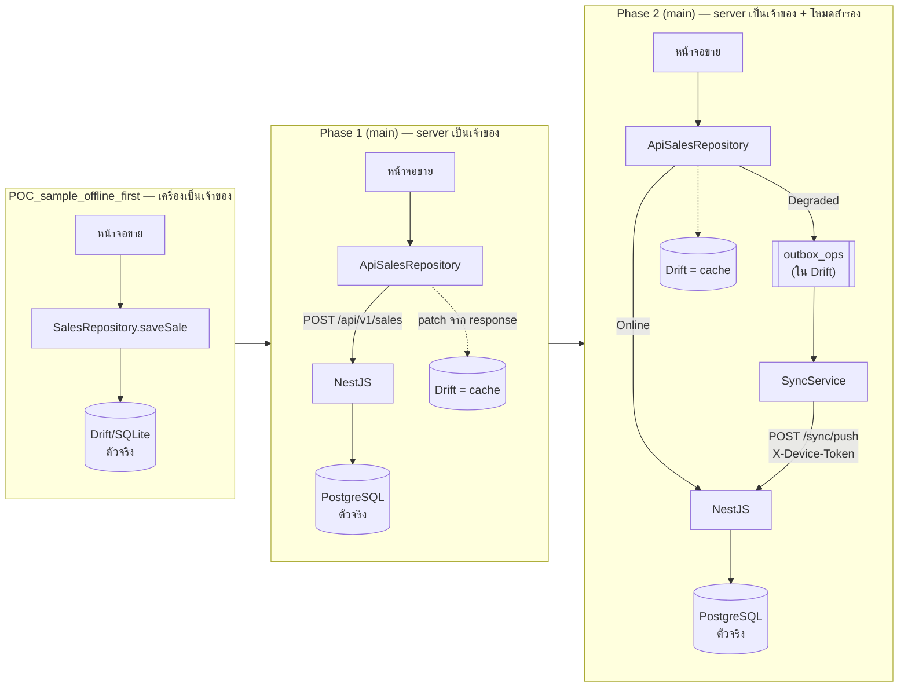
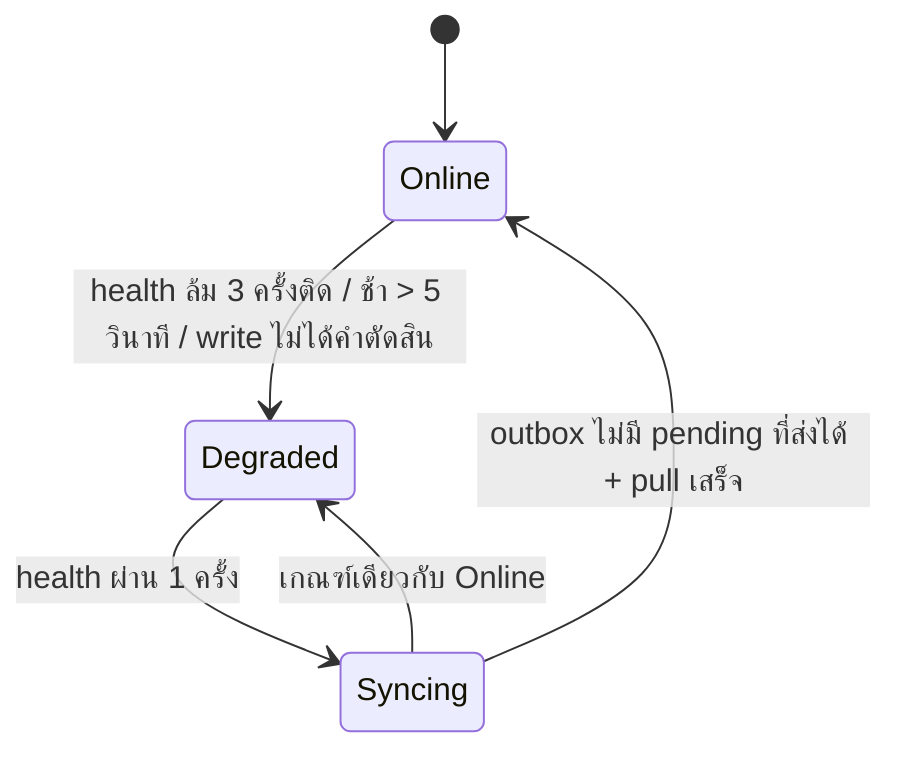
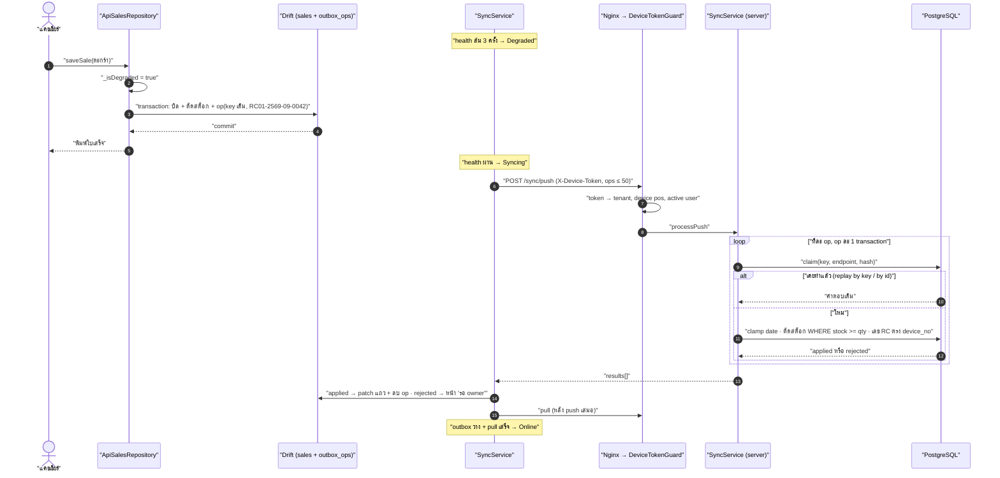

# 10 — จาก POC offline-first → phase 1 online → phase 2 outbox/sync

> บทนี้ตอบคำถามเดียว: **"ถ้าเน็ตร้านล่มกลางวัน ร้านยังขายได้ไหม และพอเน็ตกลับมา ระบบรู้ได้ยังไงว่าบิลไหนส่งแล้ว บิลไหนยัง โดยไม่ขายซ้ำ ไม่ทำบิลหาย"**

---

## 🧭 ก่อนอ่าน

- **ต้องอ่านก่อน:** [00_index.md](00_index.md) (client/server, HTTP, JSON) และ [02_architecture.md](02_architecture.md) (ทางเลือก A/B/C, source of truth, idempotency ในบิลออนไลน์) — บทนี้ต่อยอดจากหัวข้อ "ตามรอย 1 บิล" ของบท 02 โดยตรง
- **ถ้ามีเวลา:** [07_database.md](07_database.md) (transaction, unique index)
- **เวลาที่ใช้:** ~100–130 นาที (ปูพื้นฐานกินครึ่งหนึ่ง — ส่วนนี้คือวิชา distributed systems ฉบับย่อ)
- **อ่านจบแล้วคุณจะ…**
  - อธิบายได้ด้วยภาษาคนว่าทำไม "มีข้อมูลสองสำเนา" ถึงยากกว่า "มีสำเนาเดียว" มาก (CAP, eventual consistency, conflict)
  - บอกได้ว่าทำไม **นาฬิกาของเครื่องลูกค้าเชื่อไม่ได้** และระบบนี้รับมือยังไง
  - เข้าใจ **outbox pattern** + **idempotency** ว่าทำงานคู่กันยังไงให้ "ส่งซ้ำได้ แต่ไม่เกิดผลซ้ำ"
  - เล่าเส้นทางของโปรเจกต์ได้: POC (เครื่องเป็นเจ้าของ) → phase 1 (server เป็นเจ้าของ) → phase 2 (server เป็นเจ้าของ + เครื่องขายสำรองได้)
  - อ่านบั๊กจริง 2 ตัวของ phase 2 แล้วชี้ได้ว่ามันละเมิด concept ข้อไหน

---

## 🧱 ปูพื้นฐาน

ส่วนนี้ยังไม่พูดถึงโปรเจกต์ — สอน concept ทั่วไปก่อน ทุกหัวข้อจบด้วย "แล้วมันแก้/สร้างปัญหาอะไร"

### 1. Online กับ Offline — ต่างกันแค่ "สายหลุด" จริงหรือ?

- **online** (ออนไลน์) = client คุยกับ server ได้ ส่ง request ไปแล้วได้ response กลับมา
- **offline** (ออฟไลน์) = คุยไม่ได้ — แต่ **"คุยไม่ได้" มีหลายหน้าตา** และนี่คือจุดที่มือใหม่พลาดบ่อยที่สุด:

| อาการ | client เห็นอะไร | server ได้รับ request ไหม? |
|---|---|---|
| สาย LAN หลุด / Wi-Fi ดับ | error ทันที "ต่อไม่ได้" | **ไม่ได้รับแน่นอน** |
| เน็ตช้ามาก | รอจน **timeout** (หมดเวลารอ) | **ไม่รู้** — อาจได้รับแล้วกำลังทำอยู่ |
| server รับไป ทำเสร็จ แต่คำตอบหายกลางทาง | timeout เหมือนข้อบน | **ได้รับ และทำเสร็จแล้ว** |
| server ล่ม (5xx) | ได้ error 500/502/503/504 | **ไม่รู้** — อาจ commit ไปแล้วก่อนพัง |

> **Analogy — โทรสั่งอะไหล่:** คุณโทรหาร้านส่ง สั่งผ้าเบรก 10 ชุด แล้วสายตัดตอนเขาพูดว่า "ได้ครับ จด…" — คุณ **ไม่รู้** ว่าเขาจดแล้วหรือยัง ถ้าโทรไปสั่งใหม่ อาจได้ผ้าเบรก 20 ชุด ถ้าไม่โทร อาจไม่ได้เลย

บทเรียนแรกของระบบกระจาย: **"ไม่ได้คำตอบ" ≠ "ไม่สำเร็จ"** ในโปรเจกต์นี้มีคำเรียกเฉพาะ:
- **verdict** (คำตัดสิน) = server ตอบกลับมาชัดเจน เช่น `409 สต็อกไม่พอ` (4xx) — รู้ผลแน่นอน
- **ไม่ใช่ verdict** = timeout, socket หลุด, 5xx, 429 — **ชะตากรรมของ write ไม่รู้** ห้ามเดาว่าล้ม

### 2. ทำไมเน็ตร้านถึงล่ม (และทำไมเราต้องสนใจ)

ร้านอะไหล่ไม่ใช่ data center — เหตุผลทั่วไปที่เน็ตหน้าร้านหาย (ตัวอย่างทั่วไป ไม่ใช่ log จริงของร้าน):
- เราเตอร์ค้าง / ไฟตกแล้วเราเตอร์รีบูต
- ผู้ให้บริการอินเทอร์เน็ตล่มทั้งย่าน
- server ปลายทางเองมีปัญหา (ในโปรเจกต์นี้ server อยู่บน VM ของคณะ `mob04` ซึ่งอยู่หลัง firewall ของมหาวิทยาลัย — ดู CLAUDE.md หัวข้อ "Still open")

ลูกค้ายืนถือกล่องหัวเทียนอยู่หน้าเคาน์เตอร์ **ไม่รอ** ให้เน็ตกลับ ถ้าระบบบอก "ขายไม่ได้" ร้านจะกลับไปจดสมุด แล้วข้อมูลในระบบก็ผิดทันที → นี่คือแรงผลักทั้งหมดของ phase 2

### 3. ข้อมูลสองสำเนา — ต้นเหตุของความยากทั้งหมด

ถ้าอยากขายได้ตอนออฟไลน์ เครื่องหน้าร้านต้องมี **สำเนาข้อมูลของตัวเอง** (สินค้า, สต็อก, ลูกค้า) — ทันทีที่มีสองสำเนา คำถามเกิด:

```
   ┌────────── server ──────────┐          ┌────── เครื่องหน้าร้าน ──────┐
   │  หัวเทียน NGK  stock = 10   │   ✂ เน็ตขาด │  หัวเทียน NGK  stock = 10   │
   └─────────────────────────────┘          └─────────────────────────────┘
        หลังร้านรับของเข้า +5                       หน้าร้านขาย −3
   ┌─────────────────────────────┐          ┌─────────────────────────────┐
   │  stock = 15                 │          │  stock = 7                  │
   └─────────────────────────────┘          └─────────────────────────────┘
                   ความจริงคือ 12 — แต่ไม่มีใครเห็นเลข 12 เลย
```

- **replica** (สำเนา) = ข้อมูลชุดเดียวกันที่อยู่หลายที่
- **source of truth** (ตัวจริง) = สำเนาที่ถือว่า "ถูก" เมื่อสองสำเนาไม่ตรงกัน (ทบทวนจากบท 02 หัวข้อ 10)

ถ้าไม่กำหนด source of truth ไว้ล่วงหน้า พอเน็ตกลับมาจะไม่มีใครตัดสินได้ว่า 15 หรือ 7 ถูก (คำตอบคือไม่ถูกทั้งคู่ — ต้องเอา "การกระทำ" มารวมกัน ไม่ใช่เอา "ตัวเลข" มาทับกัน) → จำประโยคนี้ไว้ เพราะ outbox คือคำตอบของมัน

### 4. CAP แบบภาษาคน — ร้านสองสาขาที่โทรหากันไม่ได้

> **Analogy:** ร้านศรีสุรัตน์มีสองสาขา แชร์สต็อกโช้คอัพรุ่นหนึ่งที่เหลือ **1 ชิ้น** ปกติก่อนขาย พนักงานโทรเช็กกันก่อน วันหนึ่ง **สายโทรศัพท์ระหว่างสาขาขาด** แล้วลูกค้าเดินเข้ามาทั้งสองสาขาพร้อมกัน แต่ละสาขาต้องเลือก:
> - **(ก) ปฏิเสธลูกค้า** "ขอโทษครับ เช็กสต็อกไม่ได้" → ข้อมูลไม่มีวันผิด แต่ร้าน **ขายไม่ได้**
> - **(ข) ขายไปเลย** → ร้าน **ขายได้** แต่อาจขายชิ้นเดียวให้ลูกค้าสองคน

**CAP theorem** (ทฤษฎีบทที่บอกว่าเลือกได้ไม่ครบ 3 อย่างพร้อมกัน):
- **C — Consistency** (ทุกคนเห็นข้อมูลเดียวกันเสมอ) — แบบ (ก)
- **A — Availability** (ทุกคำขอได้คำตอบ ไม่ถูกปฏิเสธ) — แบบ (ข)
- **P — Partition tolerance** (ระบบยังทำงานเมื่อ network ถูกตัดเป็นสองฝั่ง) — **สายขาดเกิดขึ้นจริงเสมอ ไม่ใช่ตัวเลือก**

เพราะ P เลี่ยงไม่ได้ → **ตอนสายขาด ต้องเลือกระหว่าง C กับ A** → ราคาที่จ่าย: เลือก C ร้านหยุดขาย เลือก A ต้องมีกระบวนการเก็บกวาดความไม่ตรงกันทีหลัง

สังเกตว่า CAP พูดถึง **ตอนสายขาดเท่านั้น** — ตอนเน็ตปกติ ระบบให้ทั้ง C และ A ได้ Architecture C ของโปรเจกต์นี้ใช้ความจริงข้อนี้ตรงๆ: ปกติเป็น online (ได้ C) และเฉพาะตอนเน็ตล่มค่อยสลับไปเลือก A **แบบมีขอบเขต**

### 5. Eventual consistency — "เดี๋ยวก็ตรงกัน"

**eventual consistency** (ความสอดคล้องในท้ายที่สุด) = สำเนาอาจไม่ตรงกันชั่วคราว แต่ **ถ้าหยุดเขียนและ network กลับมา สุดท้ายทุกสำเนาจะตรงกัน**

> **Analogy — สมุดบัญชีสองเล่ม:** พนักงานกะเช้าจดในสมุดเล่ม A ระหว่างที่เจ้าของถือเล่ม B ไปธนาคาร ตอนเย็นเอาสองเล่มมาวางคู่กันแล้วลอกรายการที่ขาด — ระหว่างวันไม่ตรง ตอนเย็นตรง

คำสำคัญคือ **"ลอกรายการ"** ไม่ใช่ "ลอกยอดคงเหลือ" — ถ้าลอกยอด (stock = 7 ทับ 15) ข้อมูลของอีกฝั่งหายไป ถ้าลอกรายการ ("ขาย 3") แล้วให้ตัวจริงคำนวณใหม่ (15 − 3 = 12) จะได้ความจริง

### 6. Conflict — เมื่อมีคนเขียนสองคน

**conflict** (ความขัดแย้ง) เกิดเมื่อ **สองผู้เขียน (writer)** แก้ข้อมูลเดียวกันโดยไม่เห็นกัน เช่น:
- หน้าร้านขายโช้คชิ้นสุดท้ายตอนออฟไลน์ ขณะที่หลังร้าน (ออนไลน์) ลบสินค้าตัวนั้นออก
- สองเครื่องออกเลขใบเสร็จ `0042` พร้อมกัน

วิธีจัดการ conflict มีตั้งแต่ง่ายไปยาก:

| วิธี | ใช้ยังไง | ราคา |
|---|---|---|
| **ห้ามไม่ให้เกิด** (มี writer เดียว) | กำหนดว่าออฟไลน์เขียนได้แค่เครื่องเดียว | ยอมเสียความยืดหยุ่น |
| **ให้ตัวจริงตัดสินแล้วส่งคนดู** (reconciliation) | server ปฏิเสธรายการที่ขัด แล้วเอาไปรอให้คนเคลียร์ | คนต้องมาดู |
| **Last-write-wins** | ใครเขียนหลังชนะ | ข้อมูลของอีกคนหายเงียบๆ |
| **CRDT** (โครงสร้างข้อมูลที่ merge เองได้เสมอ) | คณิตศาสตร์รับประกันว่ารวมแล้วได้ผลเดียวกัน | ซับซ้อนมาก ไม่เหมาะกับ "สต็อกห้ามติดลบ" |

โปรเจกต์นี้ใช้สองแถวแรกผสมกัน (จะเห็นใน "เรื่องจริง")

### 7. นาฬิกาโกหก — ทำไมเชื่อเวลาจากเครื่องลูกค้าไม่ได้

ทุกเครื่องมีนาฬิกาของตัวเอง และมัน **เพี้ยนได้เสมอ**:
- แบตนาฬิกาบนเมนบอร์ดหมด → เปิดเครื่องมาเป็นปี 2001
- มีคนตั้งเวลาเองผิด / ตั้ง timezone ผิด
- **clock drift** (นาฬิกาเดินเร็ว/ช้าสะสม) — เครื่องที่ไม่ได้ sync เวลานานๆ ต่างกันเป็นนาทีได้
- และที่สำคัญ: **ใครก็แก้ได้** — client คือเครื่องที่ผู้ใช้ควบคุม ถ้า server เชื่อ `date` ที่ client ส่งมา ใครก็ส่งบิล "ย้อนไปเมื่อวาน" เพื่อแต่งยอดรายวันได้

กฎของวิศวกร: **เวลาจาก client เป็น "ข้อมูลอ้างอิง" ไม่ใช่ "ความจริง"** — ถ้าจำเป็นต้องใช้ (เช่นบิลที่ขายตอนออฟไลน์จริงๆ เมื่อ 2 ชั่วโมงก่อน) ต้อง **ตรวจกรอบ** และ **ติดธงให้คนดู** เมื่อผิดปกติ ส่วนตอน online ให้ server ใช้ `now()` ของตัวเองเสมอ

### 8. At-least-once delivery + Idempotency — ส่งซ้ำได้ แต่ห้ามเกิดผลซ้ำ

กลับไปที่ตาราง "offline มีหลายหน้าตา" ในหัวข้อ 1 — เมื่อไม่ได้คำตอบ client มีสองทาง:
- **at-most-once** (ส่งอย่างมากครั้งเดียว) = ไม่ส่งซ้ำ → เสี่ยง **บิลหาย**
- **at-least-once** (ส่งอย่างน้อยครั้งเดียว) = ส่งซ้ำจนกว่าจะได้ verdict → เสี่ยง **บิลซ้ำ**

ในร้านค้า "บิลหาย" แย่กว่า (เงินเข้าลิ้นชักแล้วแต่ระบบไม่มีบันทึก) จึงเลือก at-least-once แล้วแก้ปัญหา "ซ้ำ" ด้วย **idempotency** (ทำกี่ครั้งผลก็เท่าเดิม):

> **Analogy — ใบสั่งซื้อมีเลขกำกับ:** คุณแฟกซ์ใบสั่ง "PO-0042 ผ้าเบรก 10 ชุด" ไปร้านส่ง ไม่แน่ใจว่าถึงไหม เลยแฟกซ์ซ้ำ ร้านส่งเห็นเลข PO-0042 ซ้ำ → "อันนี้จัดไปแล้ว" ไม่จัดซ้ำ แต่ตอบยืนยันใบเดิมกลับมา

ในทางเทคนิค client ติดป้าย **`Idempotency-Key`** (รหัสสุ่มที่สร้าง **ครั้งเดียวต่อการกระทำหนึ่งครั้ง**) มากับ request server จำว่า "key นี้ + request หน้าตานี้ → ตอบอะไรไป" ถ้ามาซ้ำก็ **replay** (ตอบของเดิม) ไม่ทำใหม่ (บท 02 อธิบายเวอร์ชันออนไลน์ไว้แล้ว)

สองจุดที่ต้องเข้าใจให้ขาด:
1. server เก็บ **fingerprint** (ลายนิ้วมือ) ของ request คู่กับ key — ถ้า key เดิมแต่ fingerprint ต่าง = มีคนเอา key เดิมไปใช้กับงานอื่น → ปฏิเสธ (`IDEMPOTENCY_KEY_REUSED`) **fingerprint ต้องคำนวณแบบเดียวกันทุกทางที่ request เดียวกันจะเข้ามาได้** ไม่งั้นการส่งซ้ำของจริงจะถูกมองว่าเป็นการขโมย key (จำข้อนี้ไว้ — บั๊ก HIGH ตัวแรกของบทนี้เคยพลาดตรงข้อนี้พอดี ก่อนแก้ด้วย #413)
2. key มีอายุ (ในโปรเจกต์นี้ 24 ชม. — `08_PHASE2_SPEC.md §2` B2) ถ้าเน็ตล่มนานกว่านั้น key หมดอายุ → ต้องมีตาข่ายชั้นที่สอง: **id ของแถวที่ client สร้างเอง** (client-generated id) ถ้า server เจอ id บิลนี้อยู่แล้ว ก็รู้ว่าเป็นบิลเดิม

### 9. Outbox pattern — ตะกร้าจดหมายรอส่ง

ปัญหา: ตอนขายออฟไลน์ต้องทำ 2 อย่าง — (1) บันทึกบิลลงเครื่อง (2) จำไว้ว่า "ต้องส่งบิลนี้ขึ้น server" ถ้าทำอย่างแรกแล้วแอปดับก่อนทำอย่างที่สอง → บิลอยู่ในเครื่องแต่ไม่มีวันถูกส่ง (**dual-write problem** — ปัญหาการเขียนสองที่ที่ไม่พร้อมกัน)

> **Analogy — ตะกร้าจดหมายขาออกบนโต๊ะเลขา:** เลขาเขียนจดหมายเสร็จ **ถ่ายสำเนาเก็บแฟ้ม และหย่อนต้นฉบับลงตะกร้าขาออก ในจังหวะเดียว** บุรุษไปรษณีย์ผ่านมาเมื่อไหร่ก็หยิบตะกร้าไปทั้งใบ ถ้าวันนั้นไปรษณีย์ไม่มา จดหมายก็ยังนอนอยู่ในตะกร้า ไม่หาย ไม่ต้องจำว่าต้องส่งอะไร และจดหมายถูกส่ง **ตามลำดับ** ที่หย่อน

**outbox pattern** (รูปแบบกล่องขาออก):
1. เขียน "ผลของการกระทำ" (แถวบิล + ตัดสต็อกในเครื่อง) **และ** "รายการรอส่ง" (แถวใน outbox) ใน **transaction เดียว** → ได้ทั้งคู่หรือไม่ได้ทั้งคู่
2. มี worker อีกตัว (ในที่นี้ `SyncService`) คอยอ่าน outbox แล้วส่ง **ตามลำดับ** ขึ้น server
3. ได้ verdict แล้วค่อยลบรายการออกจาก outbox

outbox + idempotency = คู่หู: outbox รับประกัน "ส่งอย่างน้อยครั้งเดียว" idempotency รับประกัน "เกิดผลครั้งเดียว"

### 10. Sync: push แล้ว pull

- **push** (ดันขึ้น) = ส่งรายการใน outbox ขึ้น server
- **pull** (ดึงลง) = ขอข้อมูลที่เปลี่ยนบน server (ที่คนอื่นแก้) ลงมาทับ cache ในเครื่อง
- **cursor** (ที่คั่นหนังสือ) = "ดึงถึงตรงไหนแล้ว" ครั้งหน้าเริ่มต่อจากตรงนั้น

ลำดับสำคัญ: **push ก่อน แล้วค่อย pull** — ถ้า pull ก่อน เครื่องจะได้สต็อกจาก server ที่ยังไม่รู้จักบิลออฟไลน์ของเรา แล้วเอามาทับ ตัวเลขหน้าจอจะเด้งขึ้นหลอกพนักงาน ("อ้าว มีของตั้ง 10") ทั้งที่เพิ่งขายไป

และ cursor ต้องเป็น **ค่าที่ server ให้มา** ไม่ใช่คำนวณจากนาฬิกาเครื่อง (กลับไปหัวข้อ 7 — นาฬิกาโกหก)

### 11. Service Worker และ PWA — เปิดแอปได้ทั้งที่ไม่มีเน็ต

แอปนี้รันบน **web** ได้ด้วย ปัญหาคือเว็บปกติ "เปิดไม่ขึ้น" ถ้าไม่มีเน็ต เพราะ browser ต้องไปโหลด HTML/JS จาก server ทุกครั้ง

- **PWA** (Progressive Web App — เว็บที่ติดตั้งเหมือนแอปได้และทำงานออฟไลน์ได้)
- **service worker** (สคริปต์ที่ browser รันแยกไว้เบื้องหลัง ดักทุก request ของหน้าเว็บได้) — ใช้เก็บไฟล์ของแอป (**precache**) ไว้ในเครื่อง พอเน็ตหายก็เสิร์ฟจากในเครื่องแทน
- ข้อควรระวังที่สำคัญของ POS: service worker รุ่นใหม่ **ห้ามรีโหลดหน้าเองกลางบิล** — ต้องถามก่อน

> **Analogy:** service worker เหมือนผู้ช่วยที่ถ่ายสำเนาคู่มือร้านเก็บไว้ในลิ้นชัก วันไหนห้องสมุดปิด ก็หยิบสำเนามาใช้ได้

### 12. สรุปคำศัพท์ของหมวดนี้ (ใช้ตลอดบท)

| คำ | ความหมายสั้น |
|---|---|
| verdict | server ตอบชัด (4xx) → รู้ผลแน่ |
| non-verdict | timeout/5xx/429/socket → ผลไม่รู้ |
| outbox / op | ตะกร้ารายการรอส่ง / รายการหนึ่งในตะกร้า (operation) |
| replay | ส่งซ้ำแล้ว server ตอบผลเดิม ไม่ทำซ้ำ |
| degraded | โหมดสำรอง: เน็ตมีปัญหา เขียนลง outbox แทน |
| reconciliation | กระบวนการเคลียร์ความไม่ตรงกันหลังเน็ตกลับ (มักต้องมีคน) |
| device token | "บัตรประจำเครื่อง" ที่ server ออกให้ browser เครื่องหนึ่ง |

---

## 🔥 ปัญหาจริงของร้าน

### ขั้นที่ 1: POC — เครื่องเป็นเจ้าของทุกอย่าง

แอปนี้ **เกิดมาเป็น offline-first** — ย้ายจากเว็บ JS + localStorage มาเป็น Flutter + **Drift** (ไลบรารีจัดการ SQLite บนเครื่อง) ทุกอย่างอยู่ในเครื่องเดียว สภาพนั้นถูกแช่แข็งไว้ใน branch **`POC_sample_offline_first`** (แตกจาก `main` ที่ commit `4dae2f0`, 2026-09-04) — ร้านจริงยังรัน build แบบนี้อยู่ทุกวัน

ข้อดี: เน็ตล่มก็ขายได้ 100% เพราะไม่เคยใช้เน็ตเลย
ข้อเสีย (จากบท 02): หลายเครื่องเห็นสต็อกไม่ตรงกัน, เครื่องพัง = ข้อมูลหาย, ขายให้หลายร้านไม่ได้

### ขั้นที่ 2: Phase 1 — server เป็นเจ้าของ (Architecture A)

เพิ่ม backend (NestJS + PostgreSQL) แล้วย้าย "ความจริง" ไปที่ Postgres — ตอนนี้ **เน็ตล่ม = ขายไม่ได้** (เลือก C ในภาษา CAP) แต่ phase 1 **ไม่ cutover**: ร้านจริงยังใช้ Drift build ต่อ server พัฒนากับ tenant สาธิต — จึงยังไม่มีใครเจ็บจาก "เน็ตล่มขายไม่ได้"

### ขั้นที่ 3: Phase 2 — ต้องขายได้ตอนเน็ตล่ม โดย server ยังเป็นเจ้าของ

โจทย์ของ phase 2 จึงเป็นการ **ขอ A คืนมาบางส่วน** โดยไม่เสีย "server เป็นตัวจริง":
1. เปิดแอปได้ทั้งที่ไม่มีเน็ต (PWA)
2. ขายได้ตอนเน็ตล่ม → บิลเข้า outbox
3. เน็ตกลับ → ส่งขึ้นโดย **ไม่ซ้ำ ไม่หาย ไม่ผิดลำดับ**
4. ของที่ server ปฏิเสธ (เช่นสต็อกจริงไม่พอ) → ต้องมีที่ให้เจ้าของร้านมาเคลียร์ **ห้ามซ่อนไว้ใน log** เพราะใบเสร็จพิมพ์ให้ลูกค้าไปแล้ว

และทั้งหมดนี้ต้องตอบคำถาม conflict จากหัวข้อ 6 ให้ได้

---

## ⚖️ ทางเลือก → ทำไมเลือกอันนี้

### ทางเลือกระดับสถาปัตยกรรม (สรุปจาก `03_ARCHITECTURE.md §1–§4`)

| | A. Online-first | B. Offline-first + sync engine | **C. Hybrid** ✅ |
|---|---|---|---|
| ตัวจริง | server | เครื่อง (server เป็นตัวรวม) | server |
| เน็ตล่ม | ขายไม่ได้ | ขายได้ทุกอย่าง | ขายได้ในขอบเขต |
| conflict | ไม่มี | มีทุกที่ ต้องมี `change_log`/merge ทั่วระบบ | จำกัดไว้ที่จุดเดียว |
| ความซับซ้อน | ต่ำ | สูงสุด | กลาง |

เพราะ ร้านต้องขายตอนเน็ตล่ม (ตัด A ออก) และทีม 3 คนไม่ควรสร้าง sync engine เต็มรูปแบบ (ตัด B) → **จึงเลือก C โดยทำ phase 1 = A ก่อน แล้ว phase 2 เติมโหมดสำรอง** → ราคาที่จ่ายคือ ต้องเขียนโค้ดสองเส้นทาง (online + push) ที่ต้องให้ผลตรงกัน ซึ่งบั๊ก HIGH สองตัวท้ายบทเกิดตรงรอยต่อนี้พอดี

### ทางเลือกเรื่อง "ใครเขียนออฟไลน์ได้" — หัวใจของ phase 2

| ตัวเลือก | กลไก | ทำไมตก / ทำไมเลือก |
|---|---|---|
| ทุกเครื่องเขียนออฟไลน์ได้ | merge ทุกอย่าง | conflict ทุกตาราง — กลายเป็น B |
| **stock lease** (จองโควตาสต็อกให้เครื่องล่วงหน้า) | server แบ่ง "โควตา" ให้เครื่อง ขายเกินโควตาไม่ได้ | ❌ ตกด้วย 3 เหตุผล (ด้านล่าง) |
| **scarcity rule / `offlineOk`** | server ติดป้ายสินค้าที่ "ของเหลือเยอะ ขายออฟไลน์ได้" | ❌ ใช้ใน phase 1 design แล้ว **ยกเลิก** (D3) — ไม่จำเป็นเมื่อมี writer เดียว |
| **writer ออฟไลน์เดียวต่อร้าน** (`role='pos'`) ✅ | ฐานข้อมูลบังคับว่าร้านหนึ่งมีเครื่อง `pos` ได้เครื่องเดียว | ✅ ไม่เพิ่ม state ฝั่ง server เลย |

**stock lease ถูกตีตก 3 ข้อ** (`03_ARCHITECTURE.md §4`, บรรทัด ~267–278):
1. **ไม่ได้ทำให้ conflict เป็นศูนย์จริง** — lease มี TTL (อายุ) ถ้าหมดอายุตอนเครื่องยังออฟไลน์ server คืนของเข้ากองกลาง เครื่องอื่นขายซ้ำได้ → ขายเกินแบบ *เงียบกว่าเดิม* เพราะการต่ออายุต้องใช้เน็ต ซึ่งเป็นสิ่งเดียวที่ไม่มี
2. **กลับหัวกับความเสี่ยง** — ของที่มี 200 ชิ้น (ไม่มีทางขายเกิน) ขายไม่ได้เพราะไม่ได้จอง ส่วนของขายดีที่เสี่ยงจริงกลับจองไว้
3. **ทำให้ `stock` มีสองความหมาย** — พอมี `reserved` ขึ้นมา `CHECK (stock >= 0)`, แถบเตือนของใกล้หมด, `movements.stock_after` จะตีความคนละแบบทันที

**ทำไมต้อง `pos` เครื่องเดียว — ไม่ใช่เพราะสต็อก!** ADR-0004 เขียนไว้ชัด (`adr/0004-device-roles.md:99-109`) ว่าเหตุผลเรื่องสต็อกหายไปทันทีที่มี server (Postgres จัดการ lock ให้) แต่มีของสองอย่างที่ **มีชิ้นเดียวทางกายภาพ**:
1. **ลิ้นชักเก็บเงินมีใบเดียว** — ถ้าสองเครื่องรับเงินสด ตอนปิดกะนับเงินไม่ตรง **โดยไม่มีบั๊กสักตัว**
2. **เลขใบเสร็จควรเป็นชุดเดียว** — สองเครื่องขาย = สองชุดเลข = บัญชีต้องไล่สองเล่ม

เหตุผลสองข้อนี้ **จริงแม้ระบบออนไลน์ 100%** → เป็นฐานที่มั่นคงกว่า → และได้คำตอบของ phase 2 มาฟรี: "ใครเขียนออฟไลน์ได้" = "เครื่องที่ `role='pos'`" ไม่ต้องมีแฟล็กที่สอง ไม่ต้องมี lease

แล้ว conflict หายหมดไหม? **ไม่** — เครื่อง `backoffice` (หลังร้าน, ออนไลน์เสมอ) ยังรับของเข้า/ปรับสต็อก/ลบสินค้าได้ระหว่างที่ `pos` ออฟไลน์ ความขัดแย้งจึง **เหลือแหล่งเดียว** และตัดสินที่ server ตอน push (`UPDATE … WHERE stock >= qty`) → ถ้าไม่ผ่าน = `rejected` → ไปหน้า "รอ owner" (reconciliation)

### ทางเลือกเรื่องวันที่บิล (08 §10, C1)

| ตัวเลือก | ปัญหา |
|---|---|
| ใช้ `now()` ของ server เสมอ | บิลที่ขายออฟไลน์ 30 ก.ย. แต่ push 1 ต.ค. จะไปอยู่เดือนตุลา — รายงานผิด |
| เชื่อ `date` จากเครื่องเสมอ | นาฬิกาโกหก (หัวข้อ 7) |
| **online = `now()` · push = เชื่อเครื่องถ้าอยู่ในกรอบ `[opened_at − 5 นาที, now() + 5 นาที]` นอกนั้น clamp + ติดธง** ✅ | ต้องมีคนดูธง `date_flag` |

เพราะ บิลออฟไลน์มี "เวลาจริง" ที่ server ไม่รู้ → จึงยอมเชื่อเครื่องแบบมีกรอบ → ราคาที่จ่ายคือ ต้องมีรายการให้เจ้าของตรวจ และ **route ออนไลน์ต้องไม่อ่าน `date` ใน body เลย** (ข้อนี้เคยถูกละเมิดในโค้ดจริงช่วงหนึ่ง แก้แล้วด้วย #414 — ดูบทเรียนท้ายบท)

---

## 🧭 เรื่องจริง: สามยุคของบิลใบเดียว

### ภาพก่อน / หลัง



สิ่งที่ **ไม่เปลี่ยน** ทั้งสามยุค: หน้าจอเรียก `saveSale(...)` บน repository เสมอ (บท 02 หัวข้อ Layer) — นี่คือเหตุผลที่เปลี่ยนเจ้าของข้อมูลได้ถึงสองรอบโดยไม่รื้อหน้าจอ

### ยุค POC: `saveSale` บนเครื่อง — ตัวแม่แบบของกฎทั้งหมด

`lib/data/repositories/sales_repository.dart:33-68` (บน branch `origin/POC_sample_offline_first` — ตอนนั้นยังไม่มีโฟลเดอร์ `frontend/`)

```dart
  Future<SaleRow> saveSale(SaleInput input) async {
    // ── 1. Pre-validate stock against current Products (db.js productsSnapshot) ──
    final products = await db.select(db.products).get();
    final byId = {for (final p in products) p.id: p};

    final insufficient = <String>[];
    for (final item in input.items) {
      final p = byId[item.productId];
      if (p == null) {
        insufficient.add('${item.name}: ไม่พบในสต็อก');
      } else if (p.stock < item.qty) {
        insufficient.add('${p.name}: สต็อก ${p.stock} แต่ต้องการ ${item.qty}');
      }
    }
    if (insufficient.isNotEmpty) {
      throw Exception('สต็อกไม่พอ:\n${insufficient.join('\n')}');
    }

    // ── 2. Inside a Drift transaction: any throw rolls everything back. ──
    return db.transaction(() async {
      final pointsGranted = pointsFor(input.total);
      final receiptNo = docNo('RC');
      final saleId = newId('s');
      final date = DateTime.now();
```

- **ทำอะไร:** ตรวจสต็อกทุกบรรทัดก่อน → ถ้าไม่พอโยนข้อความไทยที่ลอกมาจาก `db.js` ตัวเดิม → แล้วทำทุกอย่างใน `db.transaction` (ตัดสต็อก, บวกแต้มลูกค้า, ยอดช่าง)
- **สังเกต 3 อย่างที่จะกลายเป็นปัญหาใน phase 2:**
  - `receiptNo = docNo('RC')` — เลขใบเสร็จแบบสุ่ม (ไม่ต่อเนื่อง) ใช้ได้เพราะมีเครื่องเดียว
  - `saleId = newId('s')` — id สร้างที่ client (ข้อนี้ดี — phase 2 เอาไปใช้เป็นตาข่ายชั้นที่สองของ idempotency)
  - `date = DateTime.now()` — เชื่อนาฬิกาเครื่อง เพราะในยุคนี้เครื่อง **คือ** ความจริง
- **ทำไมสำคัญ:** CLAUDE.md กำหนดว่า Dart repositories เหล่านี้เป็น **behavioural reference** — server ต้อง port กฎไปให้ตรง ไม่คิดใหม่

### ยุค Phase 1: server ถือกฎ, เครื่องแค่ลอกผล (ADR-0010)

ADR-0010 ตัดสินว่า Drift **ยังอยู่** ในฐานะ **write-through cache** (ยิง server แล้วเขียนผลลงเครื่อง) และมีกฎเหล็ก: `ApiRepository` **ห้ามเรียก** transactional service ของ Drift (`saveSale` ฯลฯ) หลัง server ตอบ ไม่งั้นสต็อกจะถูกตัดสองรอบ — ให้ **patch แถว** จาก response แทน (รายละเอียดอยู่ในบท 02 "ตามรอย 1 บิล")

### ยุค Phase 2: กติกาหลักจากเจ้าของโปรเจกต์ (#240)

สเปกอยู่ที่ `docs/Backend_design/08_PHASE2_SPEC.md` เจ้าของตัดสินเป็นรอบ D1–D15 → E1–E11 → F1–F10 (**รอบหลังชนะรอบก่อน**, และ **ADR ชนะ 08**) ที่เกี่ยวกับบทนี้:

| รหัส | กติกา | ผูกกับ concept |
|---|---|---|
| **ADR-0004** | `one_pos_per_tenant` — `pos` เครื่องเดียวต่อร้าน | conflict: มี writer ออฟไลน์เดียว |
| **D3 / E10** | ยกเลิก `offlineOk` และลบคอลัมน์ (#272, PR #310 → Drift schema v7) — **ออฟไลน์ขายได้ถ้าสต็อกในเครื่องพอ** | ไม่ต้องใช้ scarcity เมื่อมี writer เดียว |
| **D5 / C10** | เข้า Degraded เมื่อ health ล้ม **3 ครั้งติด** หรือ **ช้า > 5 วินาทีครั้งเดียว** หรือ **write ไม่ได้ verdict** · ออกด้วย health check เท่านั้น | verdict vs non-verdict |
| **D4 / ADR-0007** | เครื่อง `pos` ออกเลข RC/CN เอง ทั้งออนไลน์และออฟไลน์ | conflict ของเลข: ผู้ออกคนเดียว |
| **E8** | ขึ้นเดือนใหม่ตอนออฟไลน์ เริ่ม `0001` ได้เลย | |
| **D8** | `POST /sync/push` ยืนยันตัวด้วย **device token** ไม่ใช่ JWT ของคน | |
| **B1** | push: replay ด้วย key → replay ด้วย client id → **ค่อยตรวจ** | idempotency ก่อนกฎธุรกิจ |
| **B3** | ประมวลผลตามลำดับ หยุดที่ผลแรกที่ไม่ใช่ verdict | ลำดับใน outbox |
| **F2** | op หัวคิวไม่ได้ verdict 3 ครั้ง → `stuck` → หน้า "รอ owner" | |
| **E5 / F5** | PIN ออฟไลน์ 1 อันต่อเครื่อง อายุ 3 วัน **ตรวจที่เครื่องเท่านั้น** | |
| **E9 / C1** | วันที่บิล = นาฬิกาเครื่อง แต่ server clamp + ติดธง | นาฬิกาโกหก |
| **E10 / C6** | หน้า "รอ owner" + ตาราง `owner_review_items` | reconciliation |

#### สถานะของเครื่อง (08 §5)



| สถานะ | write ใหม่ไปไหน |
|---|---|
| Online | ยิง endpoint ออนไลน์ตรงๆ |
| Degraded | op ที่เข้าคิวได้ → outbox · op "ออนไลน์เท่านั้น" (เช่น แก้สินค้า, PO, ใบเสนอราคา, ปิดกะ) → ปุ่มถูกปิด |
| Syncing | ต่อท้าย outbox (ห้ามแซงคิว) |

ทำไม Syncing ยังต้องต่อท้าย outbox แทนที่จะยิงออนไลน์? เพราะถ้าบิลใหม่แซงไปก่อน บิลเก่าที่ยังค้างในคิวอาจถูกตัดสินกับสต็อกที่บิลใหม่ตัดไปแล้ว → **ลำดับของความจริงเพี้ยน**

#### เลข RC/CN ตอนออฟไลน์ (ADR-0007)

รูปแบบเลข (`adr/0007-receipt-numbering.md`):

```
RC01-2569-09-0042
│ │  │       └── ลำดับในเดือนนั้นของเครื่องนั้น (0001..9999)
│ │  └────────── พ.ศ.-เดือน (period) — มาจากนาฬิกาเครื่องแหล่งเดียว (C2)
│ └───────────── device_no 2 หลัก
└─────────────── RC ใบเสร็จ / CN ใบลดหนี้
```

ทำไมเลขนี้ไม่ชนกันแม้ออกตอนออฟไลน์? เพราะ `device_no` อยู่ในเลข และ `pos` มีเครื่องเดียว → **มีผู้ออกเลขชุดนี้คนเดียว** (conflict แบบ "ห้ามไม่ให้เกิด") ถ้าเครื่องถูกล้าง storage จนต้อง enrol ใหม่ → ได้ **`device_no` ใหม่เสมอ** (F8) ชุดเลขเก่าปิดตัวไปโดยไม่ชนใคร

กฎที่ต้องจำ: **เลขที่พิมพ์ให้ลูกค้าไปแล้วห้ามเปลี่ยน** — ถ้าชน UNIQUE ตอน push ต้อง `rejected` + `RECEIPT_NO_CONFLICT` ไปให้คนเคลียร์ (#190) เพราะกระดาษในมือลูกค้าคือเอกสารทางบัญชี

> ⚠️ **ข้อสังเกต:** คู่มือร้าน `docs/Shop_manual/01_offline_sync_and_recovery.md` §3.3 ยกตัวอย่างเลขเป็น `RC670919_02_0001` ซึ่ง **ไม่ตรง** กับรูปแบบใน ADR-0007 (`RC02-2569-09-0001`) — ตามกติกาของ repo ADR ชนะ ตัวอย่างในคู่มือน่าจะต้องแก้ (ยังไม่มีใครแก้ ณ วันที่เขียน)

#### PIN ออฟไลน์ — ตรวจที่เครื่องเท่านั้น (08 §13, C5)

ตอนออฟไลน์ ล็อกอินกับ server ไม่ได้ จึงมี PIN 1 อันต่อเครื่อง `pos` เก็บเป็น hash ใน Drift **ไม่ส่งขึ้น server** ใช้ได้เฉพาะตอน Degraded และหมดอายุ 3 วันนับจาก `iat` (เวลาออก) ของ token ที่ได้จาก `/auth/token` ครั้งล่าสุด

ทำไมไม่ให้ server ตรวจซ้ำตอน push? สเปกตอบไว้ตรงๆ (08 §2 C5): การตรวจที่ server ต้องอาศัย `date` ซึ่ง **มาจากเครื่อง** — จึงกันคนปลอมไม่ได้ ได้แต่ตีกลับบิลจริง → นี่คือบทเรียน "นาฬิกาโกหก" อีกมุม: ถ้าหลักฐานมาจาก client การตรวจที่ server ก็ไม่ได้ปลอดภัยขึ้น แค่ดูปลอดภัยขึ้น ข้อจำกัดที่ยอมรับถูกเขียนไว้ใน 08 §13

#### Reconciliation: หน้า "รอ owner" + `owner_review_items`

สองแท็บ (08 §14):
- **ถูกปฏิเสธ/ค้าง** — จาก `outbox_ops` ในเครื่อง (`rejected` + `stuck`) → ปุ่ม "ส่งใหม่" (key เดิม, **ห้ามเปลี่ยนเลข**) หรือ "ทิ้ง" (ต้องออนไลน์ + หมายเหตุบังคับ)
- **รอตรวจ** — จากตาราง server `owner_review_items` ที่บันทึกของเสี่ยงที่ **ผ่านเข้าระบบแล้ว** แต่ต้องให้เจ้าของรับทราบ: `void_offline`, `credit_override`, `shift_uncounted`, `date_flag`, `device_force_retired`

แยกสองแท็บเพราะความหมายต่างกัน: แท็บแรกคือ "ความจริงยังไม่ยอมรับ" แท็บสองคือ "ความจริงยอมรับแล้ว แต่มีคนควรรู้"

---

## 🔍 ของจริงใน repo

### 1. `one_pos_per_tenant` — กฎ "writer เดียว" ที่ฐานข้อมูลบังคับ

`server/src/db/migrations/1788652800000-InitialSchema.ts:65-84`

```ts
    await q.query(`
      CREATE TABLE devices (
        tenant_id        UUID NOT NULL,
        id               TEXT NOT NULL,
        label            TEXT NOT NULL,
        device_no        SMALLINT NOT NULL CHECK (device_no BETWEEN 1 AND 99),
        role             TEXT NOT NULL DEFAULT 'backoffice'
                         CHECK (role IN ('pos','backoffice')),
        retired_at       TIMESTAMPTZ,
        enrol_code_hash  TEXT,
        enrol_expires_at TIMESTAMPTZ,
        token_hash       TEXT,
        last_pull_seq    BIGINT NOT NULL DEFAULT 0,
        last_seen_at     TIMESTAMPTZ,
        PRIMARY KEY (tenant_id, id),
        UNIQUE (tenant_id, device_no),
        UNIQUE (token_hash)
      )`);
    await q.query(`
      CREATE UNIQUE INDEX one_pos_per_tenant ON devices (tenant_id)
        WHERE role = 'pos' AND retired_at IS NULL`);
```

- **ทำอะไร:** **partial unique index** (index ที่บังคับ "ห้ามซ้ำ" เฉพาะแถวที่ตรงเงื่อนไข `WHERE`) — ในแถวที่เป็น `pos` และยังไม่ retire ค่า `tenant_id` ห้ามซ้ำ = ร้านหนึ่งมี `pos` ที่ใช้งานอยู่ได้ไม่เกินหนึ่ง ส่วน `backoffice` มีกี่เครื่องก็ได้ และ `pos` ที่ retire แล้วก็ไม่นับ
- **`PRIMARY KEY (tenant_id, id)`** คือ composite key **อันเดียว** (สองคอลัมน์รวมกัน) ไม่ใช่ PK สองอัน
- **ทำไมบังคับที่ DB ไม่ใช่ใน if ของโค้ด:** ถ้าเช็คในโค้ด request สองตัวที่มาพร้อมกันอาจผ่าน if ทั้งคู่ (race condition) — unique index ตัดสินในจังหวะ commit ไม่มีทางหลุด โค้ดใน `server/src/devices/devices.service.ts:~181` เรียกมันว่า **backstop** (ตาข่ายสุดท้าย): มีการเช็คก่อนใน service แต่ถ้า writer ไหนเลี่ยงไป (เช่น provisioning, import) DB จะโยน unique violation แล้ว service แปลงเป็น error "มี pos อยู่แล้ว"
- **ถ้าไม่มี:** สองเครื่องเป็น `pos` → สองลิ้นชัก สองชุดเลข สอง writer ออฟไลน์ → ทุกเหตุผลใน ADR-0004 พังพร้อมกัน

### 2. `OutboxOps` — ตะกร้าจดหมายในเครื่อง

`frontend/lib/data/db/tables.dart:427-445`

```dart
/// Schema v9 (#228, Slice 8-c, 08_PHASE2_SPEC.md §7): local outbox table for
/// background synchronization and single-flight push.
@DataClassName('OutboxOpRow')
class OutboxOps extends Table {
  TextColumn get opId => text()();
  TextColumn get idempotencyKey => text()();
  TextColumn get type => text()();
  TextColumn get payload => text()();
  TextColumn get aggregates => text()();
  DateTimeColumn get createdAt => dateTime()();
  TextColumn get status => text()();
  IntColumn get attempts => integer().withDefault(const Constant(0))();
  TextColumn get lastCode => text().nullable()();
  TextColumn get lastMessage => text().nullable()();
  TextColumn get lastDetails => text().nullable()();

  @override
  Set<Column> get primaryKey => {opId};
}
```

อธิบายทีละคอลัมน์:
- `opId` — id ของรายการในตะกร้า (PK)
- `idempotencyKey` — **สร้างก่อนส่ง และไม่เปลี่ยนตลอดชีวิตของ op** — ส่งซ้ำกี่รอบก็ key เดิม
- `type` — ชนิด เช่น `sale.create`, `return.create`, `shift.open` (รายการเต็ม 08 §6.1)
- `payload` — body ที่จะส่ง (JSON เป็น text) — 08 §6.4 กำหนดว่า **ต้องเหมือน body ของ route ออนไลน์** เพื่อให้ fingerprint ตรงกัน
- `aggregates` — "op นี้แตะก้อนข้อมูลไหน" เช่น `sale:s_1`, `shift:sh_1` ใช้ตัดสินว่าถ้า op หนึ่งติด op ไหนต้องรอ op ไหนไปต่อได้ (08 §8.4)
- `status` — `pending` / `stuck` / `rejected` — ไม่มี `applied` เพราะ op ที่สำเร็จถูก **ลบออก**
- `attempts` — นับครั้งที่ **ไม่ได้ verdict ติดกัน** ครบ 3 → `stuck`
- `lastCode/lastMessage/lastDetails` — เหตุผลล่าสุด เอาไปโชว์ในหน้า "รอ owner"

ทำไมไม่เพิ่มคอลัมน์ `sales.sync_status` แทน? ADR-0010 addendum ตอบ: สถานะของบิลอ่านจาก op ของมันใน outbox **ที่เดียว** — มีสองที่เก็บสถานะเดียวกัน = วันหนึ่งจะไม่ตรงกัน (Drift ตอนนี้อยู่ schema v11 — `database.dart:72`)

### 3. บิลตอน Degraded: เขียนบิล + op ใน transaction เดียว

`frontend/lib/data/repositories/api/api_sales_repository.dart:119-128` — ทางแยก

```dart
      if (_isDegraded) {
        final sale = await _saveOffline(
          saleId: attempt.id,
          idempotencyKey: attempt.headers['Idempotency-Key']!,
          input: input,
          shiftId: shiftId,
        );
        _pending.close(attempt);
        return sale;
      }
```

`_isDegraded` (บรรทัด 83-102) ถือว่าเป็นโหมดสำรองเมื่อสถานะเป็น `degraded` **หรือ `syncing`** **หรือ outbox ยังเหลือของ** — ตรงกับกติกา "มีของค้างในคิว บิลใหม่ต้องต่อท้าย ห้ามแซง"

และถ้ายิงออนไลน์แล้ว **ไม่ได้คำตอบ** (transport failure) — บรรทัด 148-164:

```dart
      } catch (_) {
        // Non-verdict network failure (timeout, dropped socket, 5xx):
        // Transition to Degraded and queue offline into outbox with same attempt id & key.
        final sync = syncService ??
            (syncFacade is SyncService ? syncFacade as SyncService : null);
        if (sync != null) {
          sync.recordNonVerdictWrite();
          final sale = await _saveOffline(
            saleId: attempt.id,
            idempotencyKey: attempt.headers['Idempotency-Key']!,
```

- **จุดที่ต้องสังเกตมาก:** op ที่เข้าคิวใช้ **id + key เดิม** ของความพยายามออนไลน์ครั้งนั้น เพราะบิลนั้น **อาจ commit ที่ server ไปแล้ว** (หัวข้อ 1: ไม่ได้คำตอบ ≠ ไม่สำเร็จ) ตอน push server ต้องจำได้ว่าเป็นบิลเดียวกันแล้ว replay — **fingerprint ของสองทางต้องตรงกัน** (เคยพังตรงนี้ — บั๊ก HIGH #1, แก้แล้ว #413)

แล้ว `_saveOffline` เขียนทุกอย่างใน transaction เดียว — `api_sales_repository.dart:536-543` และ `:616-627`

```dart
    final aggregates = [
      'sale:$saleId',
      if (effectiveShiftId != null) 'shift:$effectiveShiftId',
      if (input.customerId != null) 'customer:${input.customerId}',
      if (input.mechanicId != null) 'mechanic:${input.mechanicId}',
    ];

    await db.transaction(() async {
      await db.into(db.sales).insert(sale);
      // ... sale items, ตัดสต็อกแบบ strict, ลูกค้า, ช่าง ...
      await db.into(db.outboxOps).insert(
            OutboxOpsCompanion.insert(
              opId: opId,
              idempotencyKey: idempotencyKey,
              type: 'sale.create',
              payload: jsonEncode(payload),
              aggregates: jsonEncode(aggregates),
              createdAt: date.toUtc(),
              status: 'pending',
            ),
          );
    });
```

(ตัดตรงกลางด้วย `// ...` — โค้ดเต็มคือการ insert `saleItems`, ตัดสต็อก, อัปเดตลูกค้า/ช่าง เหมือนตัว POC)

- **นี่คือ outbox pattern ตามตำรา:** แถวบิล + ตัดสต็อกในเครื่อง + แถว outbox อยู่ใน `db.transaction` เดียว → kill แอปกลางคัน ได้ "มีทั้งคู่หรือไม่มีทั้งคู่" (AC ของ 08 §7)
- **ทำไมเขียนตัดสต็อกเองแทนเรียก `SalesRepository.saveSale`:** กฎจาก ADR-0010/CLAUDE.md — `ApiRepository` ห้ามเรียก transactional service ของ Drift เพราะ service นั้นมี transaction ของตัวเองซ้อนกับ outbox ไม่ได้ และจะสร้างเลข/ id ใหม่เอง
- **สังเกต:** กฎตรวจสต็อก (`'สต็อกไม่พอ:\n…'`) และ strict decrement ถูกเขียนซ้ำจากตัว POC แทบคำต่อคำ — POC ยังเป็น behavioural reference จริงๆ
- `date = DateTime.now()` (บรรทัด 474) — ตอนออฟไลน์ใช้นาฬิกาเครื่องเป็นเรื่องถูกต้อง เพราะไม่มีเวลาอื่นให้ใช้ แต่ server จะไม่เชื่อทั้งดุ้น (หัวข้อ `clampOpDate` ข้างล่าง)

### 4. `SyncService` — state machine ของ D5

`frontend/lib/data/sync/sync_service.dart:283-302`

```dart
  void _handleHealthSuccess() {
    _consecutiveHealthFailures = 0;
    if (_currentStatus == SyncStatus.degraded) {
      _setStatus(SyncStatus.syncing);
      unawaited(push());
    }
  }

  void _handleHealthSlow() {
    // Spec §5: response time > 5 seconds once triggers Degraded immediately.
    _setStatus(SyncStatus.degraded);
  }

  void _handleHealthFailure() {
    // Spec §5: 3 consecutive health probe failures trigger Degraded.
    _consecutiveHealthFailures++;
    if (_consecutiveHealthFailures >= 3) {
      _setStatus(SyncStatus.degraded);
    }
  }
```

- health check คือ `GET /health/ready` ทุก 5 วินาที timeout 5 วินาที (`sync_service.dart:25-26, 251`)
- **ทำไมล้ม 3 ครั้งถึงนับ แต่ช้าครั้งเดียวก็นับ?** ล้มครั้งเดียวอาจเป็นแค่แพ็กเก็ตหาย (ไม่ควรสลับโหมดวูบวาบ) แต่ "ช้า > 5 วินาที" หมายถึงแคชเชียร์กำลังยืนรอจริงๆ ต่อหน้าลูกค้า
- **ทำไมออกจาก Degraded ด้วย health check เท่านั้น** ไม่ใช่ "write สำเร็จ": เพราะใน Degraded ไม่มี write ออนไลน์ให้สำเร็จ (ทุกอย่างเข้าคิว) และออกแล้วต้องไป **Syncing** ก่อน ไม่ใช่ Online — ต้องระบายคิวให้หมดก่อน
- `recordNonVerdictWrite()` (บรรทัด 240) คือทางที่สามของ D5: write ที่ไม่ได้ verdict → Degraded ทันที

ส่วน push loop (บรรทัด 306 เป็นต้นไป) ส่งทีละคำขอ (**single flight**) ครั้งละไม่เกิน 50 op, ถ้า op ได้ `retry` → `attempts += 1` ครบ 3 → `stuck` (บรรทัด ~452-453)

### 5. `SyncFacade` — seam ที่ทำให้สามคนทำงานพร้อมกันได้

`frontend/lib/data/sync/sync_facade.dart:57-65`

```dart
/// Abstract contract for sync operations exposed to the presentation layer.
abstract class SyncFacade {
  Stream<SyncStatus> get status;
  SyncStatus get currentStatus;
  Stream<List<OutboxOpView>> get needsOwner; // rejected + stuck
  Stream<int> get outboxRemaining;
  Future<void> resend(String opId); // attempts = 0, same key, never change docNo
  Future<DiscardResult> discard(String opId, String note);
}
```

และตัวที่ใช้ตอนรันจริงก่อนเครื่องยนต์จะเสร็จ — `sync_facade.dart:71-110` (ย่อ)

```dart
class NullSyncFacade implements SyncFacade {
  const NullSyncFacade();
  // status = online เสมอ, needsOwner = [], outboxRemaining = 0
  @override
  Future<void> resend(String opId) async {
    throw UnsupportedError('ระบบซิงค์ยังไม่พร้อมใช้งาน');
  }
  // discard(...) โยนข้อความเดียวกัน
}
```

(ย่อบรรทัด stream ออก — ของจริงสร้าง `Stream.multi` ที่ปล่อยค่าเริ่มต้นหนึ่งค่า)

- **seam** (รอยต่อ) = จุดในโค้ดที่เปลี่ยน implementation ได้โดยไม่แก้คนที่เรียก — ในที่นี้คือ abstract class ที่หน้าจอพึ่ง
- **ใครอยู่ฝั่งไหน:**
  - lane A (NuimanLP) เขียนไฟล์นี้ + `NullSyncFacade` + `FakeSyncFacade` (`frontend/test/support/fake_sync_facade.dart:8`) ใน #269 / PR #307 — **ไม่มี logic เลยทั้งใบ**
  - lane B (LomerAlloys) เขียน `class SyncService implements SyncFacade` (`sync_service.dart:18`) — เครื่องยนต์จริง
  - lane C (PattaraponKitcharoen) เขียนหน้า "รอ owner" ที่อ่านแค่ `SyncFacade` — ทดสอบด้วย `FakeSyncFacade` ที่สั่ง `emitStatus(...)`, `emitNeedsOwner(...)` ได้ตามใจ
- จุดสลับมีบรรทัดเดียว — `frontend/lib/presentation/repositories/repository_providers.dart:196-201`

```dart
    // Phase 2: SyncFacade contract seam (Slice 0d / Ticket #269).
    // Swapped to real SyncService in slice 8-c (#228).
    RepositoryProvider<SyncFacade>.value(
      value: syncFacade ??
          realSyncService ??
          const NullSyncFacade(),
    ),
```

- **ทำไมต้องมี `NullSyncFacade` ที่ใช้ตอนรันไทม์จริง ไม่ใช่แค่ใน test:** `09_PHASE2_LANES.md §4.2` ระบุว่าถ้าไม่มี หน้าจอของ lane C ที่ merge เข้า `main` ก่อนจะเปิดไม่ได้จนกว่า lane B จะเสร็จ = **การรอข้าม lane** ซึ่งแผนนี้ห้าม
- **ถ้าไม่มี seam:** หน้าจอต้อง query `outbox_ops` ตรงๆ → lane C ต้องรอ schema ของ lane B → สามคนกลายเป็นคิวเดียว

### 6. `POST /sync/push` — ยืนยันตัวด้วยบัตรประจำเครื่อง

`server/src/sync/sync.controller.ts:54-73`

```ts
  @Post('push')
  @HttpCode(HttpStatus.OK)
  @UseGuards(DeviceTokenGuard)
  async push(
    @Body() body: unknown,
    @Req() req: DeviceAuthenticatedRequest,
  ): Promise<SyncPushResponse> {
    const dto = parseSyncPush(body);
    const actor = {
      userId: req.user.userId,
      tenantId: req.user.tenantId,
      deviceId: req.user.deviceId,
    };
    const device = {
      id: req.device.id,
      role: req.device.role,
    };

    return this.sync.processPush(actor, device, dto);
  }
```

`DeviceTokenGuard` — `server/src/common/guards/device-token.guard.ts:46-96` (ย่อ)

```ts
    const rawToken = request.headers['x-device-token'];
    // ... hash token แล้วถามฟังก์ชัน SECURITY DEFINER
    const rows = (await this.ds.query(
      `SELECT tenant_id, id, role, retired_at, tenant_status, active_user_id
         FROM auth_lookup_device_and_active_user($1)`,
      [tokenHash],
    ))
    // ไม่เจอ → 401 · retire แล้ว → 401 · role ≠ 'pos' → 403
    // ร้านถูกระงับ → 403 TENANT_SUSPENDED · ไม่มี user active → 403
```

- **ทำไมใช้ device token ไม่ใช่ JWT ของคน (D8):** บิลในคิวอาจอายุหลายวัน JWT ของพนักงานหมดอายุไปแล้ว แต่ **"เครื่องไหนส่ง"** ยังระบุได้เสมอ และ endpoint นี้รับได้เฉพาะ `pos` — ตรงกับ ADR-0004 ว่า writer ออฟไลน์มีเครื่องเดียว
- **ผู้กระทำ (actor) หาเองที่ server (F3/C13):** `active_user_id` = user `is_active` คนเดียวของร้าน (phase 2 มีบัญชีร้านเดียว — unique index `uq_users_one_active`) ไม่รับ `userId` จาก body เด็ดขาด เพราะ `audit_log` บังคับว่าต้องมี `user_id`
- **ทำไม `tenant_id` มาจาก token ไม่ใช่ body:** กติกาเดียวกับ `tid` ในบท 02 — ห้ามให้ client บอกว่าตัวเองเป็นร้านไหน

### 7. `processPush` — ตามลำดับ และหยุดที่ผลแรกที่ไม่ใช่ verdict (B3)

`server/src/sync/sync.service.ts:60-90`

```ts
  async processPush(
    actor: PushActor,
    device: PushDevice,
    dto: SyncPushDto,
  ): Promise<SyncPushResponse> {
    const results: SyncOpResult[] = [];
    let stopAtRetry = false;

    for (let i = 0; i < dto.ops.length; i++) {
      const op = dto.ops[i];

      if (stopAtRetry) {
        // B3: Subsequent ops are not processed and returned as retry
        results.push({ opId: op.opId, status: 'retry' });
        continue;
      }

      try {
        const result = await this.processSingleOp(actor, device, op);
        results.push(result);
        if (result.status === 'retry') {
          stopAtRetry = true;
        }
      } catch (err) {
        const mapped = this.mapOpError(op, err);
        results.push(mapped);
        if (mapped.status === 'retry') {
          stopAtRetry = true;
        }
      }
    }
```

- **ทำไม `for` ธรรมดา ไม่ใช่ `Promise.all`:** op ต้องเรียงตามลำดับที่เกิดจริง (เปิดกะก่อนขาย ขายก่อน void) และ CLAUDE.md ห้าม `Promise.all([runTx(a), runTx(b)])` เพราะเคยทำให้ pool connection deadlock (#162)
- **ทำไม op ละหนึ่ง transaction** (`processSingleOp` เรียก `this.tenants.runTx(...)` ที่บรรทัด 124) ไม่รวมทั้ง batch: ถ้า op ที่ 30 ถูกปฏิเสธ 29 ตัวแรกที่ถูกต้องไม่ควรถูกย้อนตาม
- **ทำไมหยุดเมื่อเจอ `retry`:** `retry` = ไม่รู้ผล (เช่น key กำลังถูกประมวลผลอยู่ `IN_FLIGHT`, 5xx) ถ้าประมวลผลต่อ op ถัดไปอาจพึ่งผลของตัวนี้ → ลำดับเพี้ยน แต่ `rejected` (verdict) **ไม่หยุด** เพราะรู้ผลแน่นอนแล้ว

### 8. `processSingleOpIn` — replay ก่อน ค่อยตรวจ (B1)

`server/src/sync/sync.service.ts:136-173` (ย่อเล็กน้อย)

```ts
    // Step 1: Idempotency claim & replay check (08 §8.3 step 1)
    const claim = await this.idempotency.claim(manager, {
      tenantId,
      key: op.idempotencyKey,
      endpoint: ep.endpoint,
      requestHash,
    });

    if (claim.outcome === 'replay') {
      return { opId: op.opId, status: 'applied', response: claim.response.body };
    }

    if (claim.outcome === 'reused') {
      throw new ConflictException({
        code: 'IDEMPOTENCY_KEY_REUSED',
        message: 'Idempotency-Key already used for a different request',
      });
    }

    // Step 2: Client ID replay check (08 §8.3 step 2, §6.1)
    const clientReplay = await this.checkClientIdReplay(manager, tenantId, op);
    if (clientReplay !== null) {
      // ... complete the claim with the existing response, return 'applied'
    }

    // Step 3: Domain execution with date clamping & side-effects
    const responseBody = await this.executeOp(manager, tenantId, actor, device, op);
```

- **ทำไม replay ต้องมาก่อนตรวจกฎธุรกิจ (B1):** นึกภาพบิลที่ commit ไปแล้ว ถ้าตรวจสต็อกก่อน สต็อกตอนนี้ถูกบิลนั้นตัดไปแล้ว → "สต็อกไม่พอ" → **บิลที่สำเร็จแล้วถูกรายงานว่าล้ม** ลำดับที่ถูกคือ "เคยทำแล้วไหม?" ก่อน "ทำได้ไหม?"
- **สองชั้นของ replay:**
  1. ด้วย key (ปกติ)
  2. ด้วย client id (B2) — ตาข่ายเมื่อ key หมดอายุ (เน็ตล่มนานกว่า 24 ชม.) server เทียบ **เฉพาะฟิลด์ที่ไม่เปลี่ยน** (เช่น `total` ของบิล) ถ้าไม่ตรง → `CLIENT_ID_REUSED`
- `endpoint: ep.endpoint` มาจาก `endpointForOp` — **ตรงนี้คือจุดที่เคยเป็นต้นเหตุบั๊ก HIGH #1** (แก้แล้ว #413) ดูข้างล่าง

### 9. `clampOpDate` — เชื่อนาฬิกาเครื่องแบบมีกรอบ

`server/src/sync/sync.service.ts:743-786` (ย่อ)

```ts
    const openedAt = new Date(shiftRows[0].opened_at);
    const now = new Date();
    const minWindow = new Date(openedAt.getTime() - 5 * 60 * 1000);
    const maxWindow = new Date(now.getTime() + 5 * 60 * 1000);

    if (opDate >= minWindow && opDate <= maxWindow) {
      return opDate;
    }

    const clampedDate = opDate < openedAt ? openedAt : now;

    await ReviewItemsService.insertIn(manager, tenantId, {
      kind: 'date_flag',
      refId: op.payload.id || op.opId,
      details: {
        opId: op.opId,
        type: op.type,
        originalDate: opDate.toISOString(),
        clampedDate: clampedDate.toISOString(),
        openedAt: openedAt.toISOString(),
      },
    });

    return clampedDate;
```

- **กรอบ** = ตั้งแต่ 5 นาทีก่อนเปิดกะ ถึง 5 นาทีหลัง "ตอนนี้" ของ server — ผ่อนให้ 5 นาทีเพราะนาฬิกาเครื่องเพี้ยนเล็กน้อยเป็นเรื่องปกติ
- นอกกรอบ → **clamp** (บีบเข้าขอบ) **และติดธงทุกครั้ง** (C1 เดิมเคยเสนอ "clamp เงียบถ้าต่างไม่มาก" แล้วถูกตีตก) — ตรงกับบทเรียนประจำ repo "อย่าเปลี่ยน error ดังให้เป็นความเสียหายเงียบ"
- ธงลง `owner_review_items` ใน transaction เดียวกับบิล → ไม่มีทางมีบิลที่ถูก clamp แต่ไม่มีธง

### 10. Fixture — สัญญาที่สองฝั่งอ่านไฟล์เดียวกัน

`docs/Backend_design/fixtures/sync-push/` มี 18 ไฟล์ (#269, PR #307) ตัวอย่าง `sale-create.replay-by-id.json` (ย่อ `items`):

```json
{
  "name": "sale-create.replay-by-id",
  "description": "Replay of sale creation by client id when idempotency key expired (B2)",
  "request": {
    "headers": { "X-Device-Token": "pos-device-token-01" },
    "body": {
      "outboxRemaining": 0,
      "ops": [
        {
          "opId": "op_sale_001_reid",
          "idempotencyKey": "k_sale_fresh_key",
          "type": "sale.create",
          "payload": {
            "id": "s_off_001",
            "receiptNo": "RC01-2569-09-0042",
            "date": "2026-09-15T02:00:00.000Z",
            "total": "255.00",
            "paymentMethod": "เงินสด"
          }
        }
      ]
    }
  },
  "response": {
    "status": 200,
    "body": { "status": "success", "data": { "results": [
      { "opId": "op_sale_001_reid", "status": "applied",
        "response": { "id": "s_off_001", "receiptNo": "RC01-2569-09-0042",
                      "total": "255.00", "pointsGranted": 25,
                      "products": [ { "id": "p1", "stock": 45 } ] } }
    ] } }
  }
}
```

- **อ่านยังไง:** key เป็น "ใหม่" (`k_sale_fresh_key` — จำลองว่า key เดิมหมดอายุ) แต่ `payload.id` = `s_off_001` ซึ่ง server มีอยู่แล้ว → server replay ด้วย **id** → ตอบ `applied` พร้อมผลเดิม (สต็อกไม่ถูกตัดซ้ำ)
- `outboxRemaining` — เครื่องรายงานว่าเหลือ op ค้างเท่าไหร่หลัง batch นี้ server เก็บลง `devices.unsynced_ops` (C12) เพื่อกันไม่ให้ใคร retire เครื่องที่ยังมีบิลค้าง (F7)
- เงินเป็น **string** `"255.00"` ตามกติกา wire ของ repo (ไม่ใช้ float)
- **ทำไม fixture คือหัวใจ:** `09 §4.1` สั่ง "20-c และ 20-s ต้องอ่านไฟล์ชุดเดียวกัน" — contract test ฝั่ง Flutter (fake server ที่ตอบตาม fixture) กับ e2e ฝั่ง server (ยิง request ใน fixture แล้วเทียบ response) ใช้ไฟล์เดียวกัน ถ้าฝั่งใดเปลี่ยนรูป JSON โดยไม่แก้ fixture test ของอีกฝั่งจะไม่ผ่าน และกติกาคือ **แก้ fixture ต้องแก้ `08` ใน PR เดียวกัน**

อีกไฟล์ที่ควรเปิดดู: `batch.stop-at-retry.json` — ส่ง 4 op, op แรก `applied`, op ที่สองได้ `retry` แล้ว op 3–4 ได้ `retry` โดย **ไม่ถูกประมวลผล** (B3 ในรูป JSON)

### 11. Service worker + แท็บเดียว

`frontend/web/sw.js:1-6`

```js
// Service Worker for Srisurart Autopart POS
// Offline-first PWA shell precache and lifecycle management
// Invariant: NEVER call self.skipWaiting() automatically on install.
// Cache updates must be confirmed by the cashier to prevent reloads mid-sale.

const CACHE_NAME = 'srisurart-pos-v1';
```

- precache รายการไฟล์ shell (`index.html`, `main.dart.js`, `sqlite3.wasm`, `drift_worker.js`, ฟอนต์ Sarabun/Barlow ฯลฯ) และ **ไม่ดัก `/api/`** (บรรทัด ~79) — API ต้องไปถึง server จริงเสมอ ไม่งั้น cache จะตอบข้อมูลเก่าแทนความจริง
- ห้าม `skipWaiting()` อัตโนมัติ — รุ่นใหม่ต้องรอแคชเชียร์กดยอมรับ ไม่งั้นแท็บรีโหลดกลางบิล
- **แท็บเดียว (D10):** `frontend/web/index.html:364` ใช้ `navigator.locks.request('srisurart-pos-writer', { ifAvailable: true }, …)` — **Web Locks** (กลไกล็อกข้ามแท็บของ browser) แท็บที่ได้ล็อกเป็น writer ถือ outbox แท็บที่สองได้หน้า "เปิดอยู่แล้ว" เพราะสองแท็บ = สอง `SyncService` = writer สองตัวบนเครื่องเดียว — ปิดช่องที่ ADR-0004 เตือนว่า "เปิดแท็บที่สองก็พังแล้ว"

> ⚠️ **ข้อสังเกตที่ยังไม่ได้ตรวจลึก:** 08 §4 ข้อ 5 กำหนดชื่อ cache = `github.sha` (เปลี่ยนทุก deploy) แต่ `sw.js` เขียนค่าคงที่ `'srisurart-pos-v1'` และ grep ใน `.github/` ไม่พบขั้นตอนที่แทนค่านี้ตอน build — ถ้าไม่มีที่อื่นแทนค่า รุ่นใหม่อาจไม่ล้าง cache เก่า และ 08 §4 ข้อ 10 ระบุว่า `mob04` ใช้ cert self-signed ซึ่ง Chrome จะ **ไม่ register service worker** เลย — เท่ากับบน VM สาธิต offline shell ยังพิสูจน์ไม่ได้

### 12. Sequence: บิลออฟไลน์หนึ่งใบ ตั้งแต่กดขายจนถึง server



---

## 🛠️ เทคนิคในบทนี้

รายละเอียดเต็มของแต่ละอันอยู่ใน "🔍 ของจริงใน repo" ด้านบนแล้ว — ส่วนนี้สรุปทีละเทคนิคตามโครง **คืออะไร → ปัญหาที่แก้ → ทำไมเลือกท่านี้ → ดี/ราคา → อยู่ตรงไหน**

### 1. Outbox pattern

- **คืออะไร:** เขียน "ผล" + "รายการรอส่ง" ในธุรกรรมเดียว แล้วให้ worker แยกส่งตามลำดับ (analogy ตะกร้าจดหมายขาออก หัวข้อ 🧱 9)
- **ปัญหาที่แก้:** **dual-write problem** — เขียนบิลสำเร็จแต่แอปดับก่อนบันทึก "ต้องส่งบิลนี้" ทำให้บิลค้างในเครื่องตลอดไปแบบไม่มีใครรู้
- **ทำไมเลือกท่านี้ (เทียบกับ "เขียนบิลแล้วค่อยยิง sync แยกคำสั่ง"):** สองคำสั่งแยกกัน = มีช่องให้ล้มระหว่างกลาง; ธุรกรรมเดียวรับประกัน all-or-nothing
- **ดี/ราคา:** ดี — บิลไม่มีวันหาย, ส่งตามลำดับที่หย่อนจริง; ราคา —ต้องมีตาราง `outbox_ops` เพิ่ม และต้องมี worker คอยระบายคิว
- **อยู่ตรงไหน:** `frontend/lib/data/db/tables.dart:427-445` (schema), `frontend/lib/data/repositories/api/api_sales_repository.dart:523-538` (เขียนบิล+op ใน transaction เดียว)

### 2. Idempotent replay — ด้วย key ก่อน แล้วค่อยด้วย client id

- **คืออะไร:** server จำคำตอบที่เคยตอบคู่กับ `Idempotency-Key`; ถ้า key หมดอายุ (>24 ชม.) ใช้ id ที่ client สร้างเป็นตาข่ายชั้นสอง
- **ปัญหาที่แก้:** at-least-once delivery ทำให้ client ส่งซ้ำได้เสมอ ถ้าไม่มี replay การส่งซ้ำจะตัดสต็อก/แต้มซ้ำ
- **ทำไมเลือกท่านี้ (เทียบกับ "เช็คกฎธุรกิจก่อนแล้วค่อยดู key"):** ถ้าตรวจกฎก่อน บิลที่ commit ไปแล้วจะเจอสต็อกที่ตัวเองตัดไปแล้ว แล้วถูกปฏิเสธผิดๆ ("บิลสำเร็จถูกรายงานว่าล้ม") — ต้องถาม "เคยทำหรือยัง" ก่อน "ทำได้ไหม" เสมอ (B1)
- **ดี/ราคา:** ดี — ส่งซ้ำได้อย่างปลอดภัย; ราคา — endpoint fingerprint ต้องคำนวณจากฟังก์ชันเดียวกันทุกทาง ไม่งั้นพังแบบเงียบ (เคยพังจริง — ดูบั๊ก HIGH #1 ท้ายบท, แก้แล้ว #413)
- **อยู่ตรงไหน:** `server/src/sync/sync.service.ts:136-173` (`processSingleOpIn`), ตาราง idempotency: `server/src/idempotency/idempotency.service.ts:335-340`

### 3. Single-writer (`one_pos_per_tenant`)

- **คืออะไร:** บังคับว่าร้านหนึ่งมีเครื่อง `role='pos'` ที่ใช้งานอยู่ได้เครื่องเดียว ด้วย partial unique index ที่ระดับฐานข้อมูล
- **ปัญหาที่แก้:** conflict จากสอง writer ออฟไลน์พร้อมกัน (ขายชิ้นสุดท้ายซ้ำ, ลิ้นชักเงินสองใบ, เลขใบเสร็จสองชุด)
- **ทำไมเลือกท่านี้ (เทียบกับ stock lease / scarcity flag):** ทั้งสองทางเลือกถูกตีตกเพราะเพิ่ม state ฝั่ง server และไม่ได้ทำ conflict เป็นศูนย์จริง (ดูตาราง "ทางเลือก" ด้านบน) — single-writer แก้ที่ต้นเหตุ (ของจริงที่มีชิ้นเดียว) ไม่ใช่ปะที่ปลายทาง
- **ดี/ราคา:** ดี — ไม่ต้องมี merge/reconciliation เรื่องสต็อกเลย; ราคา — ร้านมีเคาน์เตอร์ขายออฟไลน์พร้อมกันได้แค่จุดเดียว
- **อยู่ตรงไหน:** `server/src/db/migrations/1788652800000-InitialSchema.ts:65-84` (`one_pos_per_tenant`), `docs/Backend_design/adr/0004-device-roles.md:99-109`

### 4. Device-token auth (ไม่ใช่ JWT ของคน)

- **คืออะไร:** `POST /sync/push` ยืนยันตัวด้วย `X-Device-Token` ที่ผูกกับเครื่อง ไม่ใช่ JWT ที่ผูกกับผู้ใช้และหมดอายุเร็ว
- **ปัญหาที่แก้:** op ในคิวอาจอายุหลายวัน (เน็ตล่มนาน) JWT ของพนักงานหมดอายุไปแล้วตอน push แต่ "เครื่องไหนส่ง" ยังต้องพิสูจน์ได้เสมอ
- **ทำไมเลือกท่านี้ (เทียบกับให้ client แนบ JWT เดิมไปกับ op):** JWT อายุสั้นเพราะออกแบบมาให้เป็นแบบนั้น จะฝืนต่ออายุก็เสี่ยงเปิดช่องความปลอดภัย — แยกเรื่อง "เครื่องไหน" ออกจาก "ใครกดตอนนั้น" (actor หาเองจาก `active_user_id` ที่ server ไม่ใช่รับจาก body)
- **ดี/ราคา:** ดี — บิลเก่าค้างนานแค่ไหนก็ push ได้ตราบที่เครื่องยังไม่ retire; ราคา — endpoint นี้รับได้เฉพาะเครื่อง `pos` เท่านั้น ต้องมี guard แยก
- **อยู่ตรงไหน:** `server/src/common/guards/device-token.guard.ts:46-96`, `server/src/sync/sync.controller.ts:54-73`

### 5. Seam + fake (`SyncFacade` / `NullSyncFacade` / `FakeSyncFacade`)

- **คืออะไร:** abstract class ที่หน้าจอพึ่งพา แทนที่จะพึ่ง implementation จริง — สลับของจริง/ของปลอมได้โดยไม่แก้โค้ดที่เรียก
- **ปัญหาที่แก้:** สาม lane (A/B/C) ต้องทำงานพร้อมกันตั้งแต่วันแรก แต่เครื่องยนต์จริง (`SyncService`, lane B) ยังไม่เสร็จ — ถ้าไม่มี seam, lane C ต้องรอ lane B ก่อน = "blocked-by ข้าม lane" ซึ่งแผนห้าม
- **ทำไมเลือกท่านี้ (เทียบกับ "รอให้ lane B เสร็จก่อน"):** seam ทำให้สามคนขนานกันได้จริงโดยแลกกับต้องตกลง contract (interface + fixture) ล่วงหน้าให้แน่น
- **ดี/ราคา:** ดี — `NullSyncFacade` ทำให้แอปที่ merge เข้า `main` ก่อนยังบูตได้แม้เครื่องยนต์จริงยังไม่มา (ปุ่มโชว์ "ยังไม่พร้อม" แทนที่จะพัง); ราคา — ต้องมีโค้ดของปลอมสามชุด (Null/Fake/จริง) ให้ดูแลตรงกัน
- **อยู่ตรงไหน:** `frontend/lib/data/sync/sync_facade.dart:57-110`, จุดสลับ `frontend/lib/presentation/repositories/repository_providers.dart:196-201`

### 6. Service worker cache (precache, ไม่ใช่ Workbox)

- **คืออะไร:** สคริปต์ที่ browser รันแยกจากหน้าเว็บ ดักทุก request ได้ — เก็บไฟล์ shell ของแอป (`index.html`, `main.dart.js`, ฟอนต์ ฯลฯ) ไว้ล่วงหน้าเพื่อเปิดแอปได้แม้ไม่มีเน็ต
- **ปัญหาที่แก้:** เว็บปกติเปิดไม่ขึ้นถ้าไม่มีเน็ต เพราะต้องโหลด HTML/JS จาก server ทุกครั้ง
- **ทำไมเลือกท่านี้ (เทียบกับปล่อยให้ Flutter web สร้าง SW ให้เอง):** Flutter 3.44 ไม่สร้าง service worker ให้ (อ้างอิง flutter#156910 ใน 08 §4) จึงต้องเขียนเอง — เขียนเองแล้วควบคุมได้ว่าจะไม่ `skipWaiting()` อัตโนมัติ (กันแท็บรีโหลดกลางบิล)
- **ดี/ราคา:** ดี — เปิดแอปได้ทั้งที่ไม่มีเน็ต; ราคา — ต้องดูแล cache invalidation เอง และ `CACHE_NAME` ยังเป็นค่าคงที่ `'srisurart-pos-v1'` ไม่ได้ผูกกับ SHA ตามที่ 08 §4 ตั้งใจ (ดูข้อสังเกตในหัวข้อ 🔍 11) — เป็นความเสี่ยงที่ยังไม่ปิด
- **อยู่ตรงไหน:** `frontend/web/sw.js:1-60`

### 7. Degraded-mode detection (state machine ของ D5)

- **คืออะไร:** เครื่องเฝ้าดูสุขภาพการเชื่อมต่อ (`GET /health/ready` ทุก 5 วิ) แล้วสลับสถานะ Online → Degraded → Syncing → Online เอง
- **ปัญหาที่แก้:** ต้องรู้ว่า "ตอนนี้ควรเขียนตรงไปเซิร์ฟเวอร์ หรือเข้าคิว" โดยไม่ต้องให้แคชเชียร์กดสลับโหมดเอง และไม่ให้กระพริบไปมาจากปัญหาเน็ตชั่ววูบ
- **ทำไมเลือกท่านี้ (เทียบกับ "ล้มครั้งเดียวก็สลับโหมดทันที"):** ล้มครั้งเดียวอาจเป็นแค่แพ็กเก็ตหาย — ต้องล้ม 3 ครั้งติดถึงจะนับ (กันโหมดกระพริบ) แต่ "ช้า > 5 วินาที" นับทันทีครั้งเดียว เพราะนั่นคือลูกค้ายืนรอจริงอยู่หน้าเคาน์เตอร์แล้ว
- **ดี/ราคา:** ดี — เปลี่ยนโหมดอัตโนมัติ ไม่ต้องพึ่งดุลพินิจคน; ราคา —ต้องมี state machine ที่คิดครบทุกทางออก (ออกจาก Degraded ต้องผ่าน Syncing เสมอ ห้ามข้ามไป Online ตรงๆ ไม่งั้นบิลใหม่แซงคิวเก่า)
- **อยู่ตรงไหน:** `frontend/lib/data/sync/sync_service.dart:283-302`

### สรุป

| เทคนิค | แก้ปัญหาอะไร | ราคาที่จ่าย | file |
|---|---|---|---|
| Outbox pattern | dual-write problem (เขียนบิลสำเร็จแต่ไม่มีวันถูกส่ง) | ต้องมีตาราง+worker ระบายคิว | `tables.dart:427-445` |
| Idempotent replay (key → client id) | ส่งซ้ำได้โดยไม่เกิดผลซ้ำ | fingerprint ต้องคำนวณจากฟังก์ชันเดียวทุกทาง | `sync.service.ts:136-173` |
| Single-writer (`one_pos_per_tenant`) | conflict ของ 2 writer ออฟไลน์ | เคาน์เตอร์ขายออฟไลน์ได้แค่จุดเดียว | `InitialSchema.ts:65-84` |
| Device-token auth | บิลค้างคิวนานกว่าอายุ JWT ของคน | ต้องมี guard แยกเฉพาะเครื่อง `pos` | `device-token.guard.ts:46-96` |
| Seam + fake (`SyncFacade`) | 3 lane ทำงานขนานกันโดยไม่รอกัน | ต้องดูแลโค้ดปลอม 3 ชุดให้ตรงสัญญา | `sync_facade.dart:57-110` |
| Service worker precache | เปิดแอปได้ทั้งที่ไม่มีเน็ต | cache invalidation ยังไม่ผูกกับ SHA จริง | `web/sw.js:1-60` |
| Degraded-mode state machine | รู้เองว่าควรเขียนตรงหรือเข้าคิว โดยไม่กระพริบ | ต้องคิดครบทุกทางออกของ state | `sync_service.dart:283-302` |

---

## 📚 Tech stack ของบทนี้

| เครื่องมือ | version จริงจาก repo | หน้าที่ | ทำไมเลือก | ทางเลือกที่ไม่เลือก |
|---|---|---|---|---|
| Drift | `2.34.1` (`frontend/pubspec.lock`) | SQLite ในเครื่อง: cache + `outbox_ops` + `sync_cursors` | มีอยู่แล้วตั้งแต่ POC, transaction จริง, query สต็อกในเครื่องได้ | เก็บ JSON blob (ADR-0010 ทางเลือก ค — query ไม่ได้) |
| sqlite3 (+ `sqlite3.wasm`) | `3.4.0` (ต้องตรงกับ `frontend/web/WEB_DB_ASSET_VERSIONS.txt`) | SQLite บน web | CI ตรวจ version skew ทุก build | — |
| Service worker เขียนเอง | `frontend/web/sw.js` (127 บรรทัด, ไม่ใช้ Workbox แม้ 08 §4 จะเขียนว่า Workbox) | precache shell ให้เปิดแอปออฟไลน์ | Flutter 3.44 ไม่สร้าง SW ให้ (08 §4 อ้าง flutter#156910) | SW อัตโนมัติของ Flutter |
| Web Locks API | browser built-in | แท็บ writer เดียว | ไม่ต้องมี server | ไม่มีทางอื่นระดับ browser ที่ง่ายกว่า |
| NestJS `SyncModule` | `@nestjs/core ^12.0.1` (`server/package.json`) | `/sync/push`, `/sync/discards` | ใช้ service ตัวเดียวกับ route ออนไลน์ → กฎชุดเดียว | sync engine แยก (Architecture B) |
| PostgreSQL | (ดูบท 07) | ตัวจริง + partial unique index + `owner_review_items` | constraint ตัดสิน race ได้แน่นอน | CouchDB (ADR-0012 **Rejected**) |

---

## 👥 บทเรียนเชิงทีม: lane A/B/C และ "contract ไม่ใช่คิว"

Phase 2 มี 35 ใบงานแบ่งให้สามคน (`09_PHASE2_LANES.md`, เจ้าของเคาะ 2026-09-16):

| lane | คน | ถืออะไร |
|---|---|---|
| **A** `team/1` | NuimanLP | **contract ทั้งสองเส้น** (seam + fixture) + ข้อความไทย + platform allowlist — 3 ใบ |
| **B** `team/2` | LomerAlloys | **ฝั่งเครื่องทั้งหมด** — PWA/SW, outbox, `SyncService`, เลข RC/CN, PIN, pull, และ **ทุก Drift schema bump** — 15 ใบ |
| **C** `team/3` | PattaraponKitcharoen | **server + หน้าจอใหม่ + ops** — 17 ใบ |

กติกาที่ควรจำไปใช้กับงานกลุ่มทุกวิชา:

1. **"Blocked-by never crosses a lane"** — ใบงานรอกันได้ **เฉพาะภายใน lane เดียวกัน** ถ้า lane C ต้องการของจาก lane B สิ่งที่ส่งข้ามคือ **contract** (fixture JSON, interface `SyncFacade`) ไม่ใช่ "รอ B ทำเสร็จ" → สามคนเริ่มพร้อมกันได้ตั้งแต่วันแรก
2. **ผ่าใบงานเป็นสองครึ่ง** — ใบใหญ่ที่แตะทั้งสองฝั่งถูกผ่า เช่น slice 8 → `#228` (ครึ่ง client, lane B) ↔ `#283` (ครึ่ง server, lane C) คู่อื่น: `#212 ↔ #277`, `#194 ↔ #285`, `#193 ↔ #287` แต่ละครึ่งทดสอบกับ **fake ของอีกฝั่ง** เท่านั้น
3. **ห้ามเขียน AC ว่า "ใช้ได้กับของจริง"** ตราบที่อีกครึ่งยังไม่ merge — integration เกิดเองบน `main` เมื่อสองครึ่งลง ถ้าพังเปิดบั๊กให้ฝั่งที่ผิด contract
4. **เจ้าของไฟล์ชัด** (`09 §6`) — เช่น Drift schema เป็นของ lane B คนเดียว, migration ของ server จองเลขต่อ lane (C = `1788652803xxx`, B = `1788652804xxx`) กันสองคนสร้าง migration เลขเดียวกันบนสอง branch
5. **ของ A เบาแต่ต้องลงก่อน** — lane A มีแค่ 3 ใบ แต่ `0d` (seam + fixture) ปลดล็อกทุกคน ทั้งสามใบของ A merge วันที่ 2026-09-17

> **Analogy — สร้างบ้านสามทีม:** ทีมไฟฟ้าไม่ต้องรอทีมผนังฉาบเสร็จ ถ้าตกลง "แบบแปลนตำแหน่งปลั๊ก" กันก่อน (contract) ทีมไฟฟ้าซ้อมเดินสายบนผนังจำลอง (fake) ได้เลย วันประกอบจริงถ้าปลั๊กไม่ตรงรู ก็ดูแบบแปลนว่าใครผิด

ข้อควรรู้เรื่องการอ่านสถานะ: 08 §16 สรุปว่า slice 0a–21 และ 24 merge แล้ว และ `09` ว่า 32/35 ใบ merge (2026-09-23) แต่ **merge ≠ AC ติ๊กครบ** (08 §16 เขียนไว้เอง) — บั๊กสองตัวถัดไปคือหลักฐาน

---

## ⚠️ บทเรียนจากของจริง

### บทเรียน 1 — บั๊ก HIGH ที่เคยพบ: fingerprint ของสองทางไม่ตรงกัน (idempotency พัง) — แก้แล้ว

**ที่มา:** รีวิวทั้ง codebase 2026-09-24 — `docs/handoff_log/session-2026-09-24-whole-codebase-review.md §2` ข้อ 1 · **แก้แล้วด้วย PR #413** (2026-09-25, ปิด #409)

ทางออนไลน์เก็บ endpoint แบบนี้ — `server/src/idempotency/idempotency.runner.ts:40`

```ts
    endpoint: `${req.method} ${req.baseUrl}${req.path}`,
```

ซึ่งสำหรับการขายได้ `POST /api/v1/sales` (เพราะ `app.setGlobalPrefix('api/v1', …)` ที่ `server/src/app.setup.ts:120`)

แต่ทาง push **เดิม**เก็บ — `server/src/sync/sync.service.ts` (ก่อนแก้)

```ts
      case 'sale.create':
        return { endpoint: 'POST /sales', successCode: 201 };
```

และตัวตัดสิน — `server/src/idempotency/idempotency.service.ts:335-340`

```ts
    if (
      stored.hash !== params.requestHash ||
      stored.endpoint !== params.endpoint
    ) {
      return { outcome: 'reused' };
    }
```

**เล่าเป็นเหตุการณ์ (ก่อนแก้ #413):**
1. แคชเชียร์กดขายตอนออนไลน์ server **commit** บิลแล้ว เก็บ key คู่กับ `POST /api/v1/sales`
2. คำตอบหายกลางทาง (timeout) → `ApiSalesRepository` ทำถูกตามสเปก: เข้า Degraded แล้วเอาบิลเข้า outbox ด้วย **id + key เดิม** (หัวข้อ 🔍 3)
3. เน็ตกลับ → push → server claim key เดิมด้วย endpoint `POST /sales` → **endpoint ไม่ตรง** → `reused` → `409 IDEMPOTENCY_KEY_REUSED`
4. บิลที่ **สำเร็จไปแล้ว** ถูกรายงานว่าถูกปฏิเสธ → ไปโผล่ในหน้า "รอ owner" ทั้งที่ไม่มีอะไรผิด (และถ้า owner กด "ทิ้ง" แถวบิลในเครื่องจะวุ่น — ดู C15)

**ทางแก้ (#413):** `sync.service.ts` เก็บ `ONLINE_PREFIX = '/api/v1'` ไว้ตัวเดียว แล้ว `endpointForOp` คืน `` `POST ${ONLINE_PREFIX}/sales` `` (และ endpoint อื่นทุกตัวที่พอร์ตมาจาก route ออนไลน์) — เพื่อไม่ทำลายบิลที่ค้างจากก่อนแก้ `replayKeyOfSameDocument` เทียบ endpoint แบบตัด prefix `/api/v1` ออกก่อน ทำให้ key เก่าที่บันทึกเป็น `POST /sales` ยัง replay ได้ภายในอายุ 24 ชม. ของมัน

**ผูกกับ concept:** หัวข้อ 🧱 8 ข้อ 1 — "fingerprint ต้องคำนวณแบบเดียวกันทุกทาง" นี่คือ AC **B1** ของ 08 §8.4 ซึ่งตอนนี้ผ่านแล้ว และ test เดิม (`sync-push.e2e-spec.ts` ~บรรทัด 1238 ตามบันทึกรีวิว) ทดสอบแค่ push→push ซึ่งทั้งสองครั้งใช้ endpoint เดียวกัน จึงเขียวทั้งที่เส้นทางจริง (online→push) เคยพัง — นี่คือเหตุผลที่ #413 ต้องเพิ่ม test ข้ามเส้นทางด้วย

**บทเรียนทั่วไป:** ถ้ามีสองเส้นทางที่ต้อง "เป็นเรื่องเดียวกัน" ให้คำนวณจาก **ฟังก์ชันเดียว** ไม่ใช่เขียนสตริงซ้ำสองที่ และ test ต้องครอบ **เส้นทางข้ามกัน** ไม่ใช่เส้นทางเดิมซ้ำ

### บทเรียน 2 — บั๊ก HIGH ที่เคยพบ: route ออนไลน์เชื่อ `date` และ `soldOffline` จาก client — แก้แล้ว

**ที่มา:** บันทึกรีวิวเดียวกัน §2 ข้อ 2 · **แก้แล้วด้วย PR #414** (2026-09-25, ปิด #411)

08 §10 กำหนดว่า route ออนไลน์ใช้ `now()` **ไม่อ่าน `date` ใน body** แต่ `server/src/sales/sales.service.ts` **เคย** (ก่อนแก้) รับ `dto.date`/`dto.soldOffline` จาก body ของ route ออนไลน์แล้วส่งต่อให้ `insertSale`:

```ts
    const soldOffline = dto.soldOffline === true;
    const dateVal = dto.date
      ? dto.date instanceof Date
        ? dto.date.toISOString()
        : dto.date
      : null;
    // ...
       VALUES (..., $16, $17, COALESCE($18::timestamptz, now()))
```

`insertSale` นี้ใช้ร่วมทั้งทางออนไลน์และทาง push — ทาง push ส่ง `date` ที่ผ่าน `clampOpDate` มาแล้ว แต่ทางออนไลน์ **เคย**ส่ง `date` จาก body ตรงๆ → ใครก็ส่ง `POST /api/v1/sales` พร้อม `"date": "เมื่อวาน"` แล้วบิลจะลงยอดเมื่อวานโดยไม่มีธง บันทึกรีวิวระบุว่า returns (`returns.dto.ts:73`) และ shifts (`openedAt`, `createdAt`) เคยเป็นแบบเดียวกัน

**ทางแก้ (#414):** `parseCreateSale` (`server/src/sales/sales.dto.ts:67` และตาม) ไม่อ่าน `date`/`soldOffline` จาก body ของ route ออนไลน์อีกต่อไป — ค่าสองตัวนี้มาจาก `/sync/push` เท่านั้น (`sales.dto.spec.ts:111` เป็น test ที่ล็อกกฎนี้ไว้ตรงๆ: `` never reads `date` or `soldOffline` from a body: only /sync/push sets them ``) route ออนไลน์จึงลง `sold_at`/`updated_at` ด้วย `now()` ของ server เสมอ และ `soldOffline` เป็น `false` เสมอสำหรับบิลที่มาจากทางออนไลน์

**ผูกกับ concept:** 🧱 7 "นาฬิกาโกหก" + "เวลาจาก client เป็นข้อมูลอ้างอิง ไม่ใช่ความจริง" — ทาง push มีกรอบ ทางออนไลน์เคยลืมกรอบ ช่องโหว่เคยอยู่ที่ **ทางที่ดูปลอดภัยกว่า** นี่คือเหตุผลที่ CLAUDE.md มีบทเรียนซ้ำๆ ว่า **validate input ก่อน แล้วค่อย clamp** และ "field ที่ client ส่งมาได้ ไม่ได้แปลว่า server ต้องอ่าน"

### บทเรียน 3 — `offlineOk`: ออกแบบ → ใส่ schema → ลบทิ้ง

`Products.offlineOk` ถูกเพิ่มใน Drift schema v3 ตาม ADR-0010 เพื่อใช้กับ scarcity rule แล้วเจ้าของยกเลิก scarcity (D3) เมื่อเห็นว่า writer เดียวทำให้มันไม่จำเป็น แล้วสั่งลบคอลัมน์ (E10) → ลบใน #272 / PR #310 → Drift v7 ขณะลบยังพบว่า Postgres **ไม่เคยมีคอลัมน์นี้เลย** (08 §19 X1) ทั้งที่ E10 สั่งลบ "Drift + Postgres"

บทเรียน: การตัดสินใจที่ถูกกว่า (ADR-0004) ทำให้กลไกซับซ้อนชิ้นหนึ่งหายไปทั้งชิ้น — **ลบของดีกว่าเพิ่มของ** และคำสั่งในเอกสารต้องตรวจกับโค้ดจริงก่อนลงมือเสมอ

### บทเรียน 4 — สถานะที่ยังไม่เสร็จ (บอกตรงๆ)

- **ลำดับ kickoff ใน CLAUDE.md** (#228 → #229 → #212/#211/#189 → #230 → #190 → #231) เป็นแผนตอนเริ่ม — ตรวจด้วย `gh issue view` วันที่ 2026-09-25: **ปิดแล้วทุกใบยกเว้น #231** (cutover ร้านจริง = เฟสถัดไป) แต่ "ปิด" ไม่ได้แปลว่า AC ทุกข้อพิสูจน์แล้วเสมอไป — AC B1 (บั๊ก HIGH #1 เดิม) ผ่านแล้วหลัง #413
- **ร้านจริงยังรัน Drift build** — phase 2 ยังไม่เคยถูกใช้กับเน็ตล่มจริงในร้าน
- **MED 4 ข้อจากรีวิวเดียวกัน** (สรุป): push reply ของ `sale.create` บางกว่าที่ 08 §8.2 ว่า (และ fixture ก็บางเหมือนกัน — ต้องให้เจ้าของตัดสินว่าใครถูก); client ยังเข้าคิวแค่ `sale.create`, ชำระเครดิต, ลูกค้า — ยังไม่เข้าคิว `shift.open`/`return.create`/`drawer.entry` ตาม 08 §6.1; Drift `openShift` ยังคืนกะเดิมของวันเดียวกันซึ่ง 08 §11 สั่งลบ
- **migration `1788652803002-OwnerReviewItems`** (ตารางของหน้า "รอ owner") เคยมีบั๊กสองข้อ: RLS policy ไม่มี `NULLIF(…,'')` และ FK `ON DELETE SET NULL` ที่จะ null `tenant_id` ด้วย — **แก้แล้ว** ด้วย migration ใหม่ `1788652804200-OwnerReviewItemsFixes.ts` (#420)
- **ops ของ phase 2 บน `mob04`** (slice 22/23/25) ยังเปิด: การวัดโหลด #380 ยังไม่มีตัวเลข, backup offsite #363 พักไว้, CD ติด FortiGate ของคณะ (รายละเอียดบท 14/15)
- **ยังไม่อยู่ใน phase 2 เลย:** หลาย `pos` ต่อร้าน, `change_log`/CRDT, CouchDB (rejected), ใบกำกับภาษีเต็มรูป (08 §1)

---

## ✅ สรุป

> - "ไม่ได้คำตอบ" ≠ "ไม่สำเร็จ" — แยก **verdict (4xx)** ออกจาก **non-verdict (timeout/5xx/429)** และห้ามเดาว่าอย่างหลังล้ม
> - สองสำเนา = ต้องมี **source of truth** เดียว (Postgres) และต้องรวม "การกระทำ" ไม่ใช่ทับ "ตัวเลข"
> - CAP: ตอนสายขาดต้องเลือก C หรือ A — Architecture C เลือก C ตอนปกติ และเลือก A **แบบมีขอบเขต** ตอน Degraded
> - conflict ถูกจำกัดด้วย **writer ออฟไลน์เดียว** (`one_pos_per_tenant`, ADR-0004) — เหตุผลคือ **ลิ้นชักใบเดียว + เลขใบเสร็จชุดเดียว** ไม่ใช่สต็อก; stock lease ตก 3 ข้อ, `offlineOk` ถูกลบ (#272)
> - **outbox** (บิล + op ใน transaction เดียว) + **idempotency** (key + client id) = ส่งซ้ำได้ ไม่เกิดผลซ้ำ; server **replay ก่อนตรวจ** และหยุดที่ผลแรกที่ไม่ใช่ verdict
> - นาฬิกาเครื่องโกหก → push เชื่อแบบมีกรอบ ±5 นาที + clamp + `date_flag`; online ใช้ `now()` ของ server เสมอ (แก้แล้ว #414 — โค้ดเคยละเมิดอยู่ช่วงหนึ่ง)
> - `SyncFacade` + fixture เป็น **contract** ที่ให้สาม lane ทำงานขนานกัน — blocked-by ไม่ข้าม lane
> - Phase 2 ส่วนใหญ่ merge แล้ว — **บั๊ก HIGH 2 ตัวที่พบจากรีวิว 2026-09-24 (fingerprint, client date) แก้แล้วทั้งคู่** (#413, #414) และร้านจริงยังไม่ cutover

---

## ❓ Quiz

**1. ถ้าเปลี่ยน `SyncService` ให้ออกจาก Degraded ไป Online ทันทีที่ health ผ่าน (ข้าม Syncing) จะเกิดอะไร?**

<details><summary>เฉลย</summary>

บิลใหม่จะยิงออนไลน์ **แซง** บิลเก่าที่ยังค้างใน outbox → บิลเก่าถูกตัดสินกับสต็อกที่บิลใหม่ตัดไปแล้ว อาจถูก `rejected` ทั้งที่ขายก่อน และลำดับเลข/กะเพี้ยน Syncing มีไว้เพื่อ "ต่อท้ายคิวจนกว่าคิวจะว่าง" — ตรงกับที่ `_isDegraded` นับ `syncing` และ `outboxRemaining > 0` เป็นโหมดสำรองด้วย

</details>

**2. ทำไม ADR-0004 ถึงบอกว่าเหตุผลที่ต้องมี `pos` เครื่องเดียว "ไม่ใช่เรื่องสต็อก" — แล้วถ้าอนาคตร้านอยากมีเคาน์เตอร์ขายสองจุด ต้องคิดเรื่องอะไรก่อน?**

<details><summary>เฉลย</summary>

สต็อกตอนออนไลน์ Postgres จัดการ race ด้วย row lock อยู่แล้ว เหตุผลจริงคือของที่มีชิ้นเดียวทางกายภาพ: **ลิ้นชักเงิน** (กะ/ใบปิดกะ) และ **ชุดเลขใบเสร็จ** ถ้าจะมีสองเคาน์เตอร์ ต้องคิดใหม่ทั้งเรื่องกะ/ลิ้นชัก เลขเอกสารสองชุด และที่หนักที่สุดคือ **writer ออฟไลน์สองตัว** → conflict ของสต็อกจะกลับมาทันทีตอนเน็ตล่ม (ทั้งสองเครื่องขายชิ้นสุดท้ายได้) — นี่คือเหตุผลที่ "หลาย `pos` ต่อร้าน" ถูกเขียนไว้ว่าไม่อยู่ใน phase 2

</details>

**3. ในบั๊ก HIGH #1 (เคยพบ, แก้แล้วด้วย #413) ถ้าทีมแก้โดย "ให้ push ไม่ต้องเช็ค endpoint เลย เช็คแค่ hash ของ body" จะปลอดภัยไหม?**

<details><summary>เฉลย</summary>

ไม่ปลอดภัย — `idempotency.service.ts` อธิบายไว้ว่า endpoint สำคัญเท่ากับ body: key+body เดียวกันส่งไป `POST /sales` แล้ว `POST /returns` จะ replay การขายแล้วไม่ทำการคืนเงินเลยแบบเงียบๆ และ void ของสองบิลมี body แค่ `{reason}` แยกกันไม่ออก ทางแก้ที่ถูกคือทำให้ **สองทางคำนวณ endpoint จากที่เดียวกัน** (ให้ push สร้างสตริงแบบเดียวกับ runner ออนไลน์) แล้วเพิ่ม test ที่ครอบ **online → push** ไม่ใช่ลดการตรวจ

</details>

**4. ถ้านาฬิกาเครื่อง `pos` เร็วไป 2 ชั่วโมง แล้วขายออฟไลน์ 10 บิล พอ push จะเกิดอะไร และทำไมระบบไม่ปฏิเสธบิลพวกนี้ไปเลย?**

<details><summary>เฉลย</summary>

`date` ของบิลเกิน `now() + 5 นาที` → `clampOpDate` บีบเป็น `now()` ของ server และเขียน `date_flag` ลง `owner_review_items` ทุกบิล ไม่ปฏิเสธเพราะบิลเกิดขึ้นจริง เงินอยู่ในลิ้นชัก ใบเสร็จอยู่ในมือลูกค้า — การปฏิเสธจะทำให้ระบบ **ขาดข้อมูลที่จริง** เพียงเพราะเวลาเพี้ยน เลือก "รับ + ติดธงให้คนดู" ดีกว่า "เงียบ" (clamp ไม่ติดธง) และดีกว่า "ทิ้ง"

</details>

**5. ทำไม `outbox_ops` ต้องถูกเขียนใน `db.transaction` เดียวกับแถวบิล — ถ้าเขียนบิลก่อน แล้วค่อย `enqueueOp` แยกอีกคำสั่งจะพังแบบไหน?**

<details><summary>เฉลย</summary>

ถ้าแอปดับ (ไฟตก, browser ปิด) ระหว่างสองคำสั่ง จะได้บิลในเครื่องที่ **ไม่มี op** → สต็อกในเครื่องถูกตัด ใบเสร็จพิมพ์แล้ว แต่ไม่มีวันถูกส่งขึ้น server = บิลหายจากความจริงแบบเงียบ (dual-write problem) หรือกลับกัน ได้ op ที่ไม่มีบิลในเครื่อง transaction เดียวรับประกัน "มีทั้งคู่หรือไม่มีทั้งคู่" — AC ข้อแรกของ 08 §7

</details>

**6. ถ้าไม่มี `NullSyncFacade` (มีแค่ abstract class กับ fake ใน test) งานของ lane C จะติดตรงไหน?**

<details><summary>เฉลย</summary>

หน้าจอ "รอ owner" ของ lane C merge เข้า `main` แล้ว **เปิดไม่ได้ตอนรันจริง** เพราะไม่มี implementation ให้ `RepositoryProvider<SyncFacade>` จนกว่า lane B จะส่ง `SyncService` (#228) = lane C ต้องรอ lane B ซึ่งขัดหลัก "blocked-by never crosses a lane" `NullSyncFacade` ทำให้แอปบูตได้ (status online, คิวว่าง, ปุ่มโยนข้อความ "ยังไม่พร้อม") และการสลับเป็นของจริงเหลือบรรทัดเดียวใน `repository_providers.dart`

</details>

---

## ➡️ อ่านต่อ

- **บทถัดไป:** [11_security.md](11_security.md) — auth, RLS, secrets ที่ต้องคุมให้แน่นขึ้นเมื่อมี
  device token/outbox ของเฟส 2 เพิ่มเข้ามา ก่อนไปถึง [14_devops.md](14_devops.md) — Docker, Compose,
  Nginx, Ansible, monitoring และทำไม CD ไป `mob04` ยังติด
- บทก่อนหน้าที่เกี่ยวข้อง: [02_architecture.md](02_architecture.md) (ทางเลือก A/B/C, ตามรอย 1 บิลออนไลน์) · [07_database.md](07_database.md) (transaction, unique index, RLS)
- เอกสารลึกสำหรับคนอยากเจาะ:
  - [`../Backend_design/08_PHASE2_SPEC.md`](../Backend_design/08_PHASE2_SPEC.md) — สเปก phase 2 ทั้งหมด (§5 สถานะ, §6 op catalogue, §7 outbox, §8 push, §9 เลข, §10 วันที่, §14 หน้า "รอ owner")
  - [`../Backend_design/09_PHASE2_LANES.md`](../Backend_design/09_PHASE2_LANES.md) — การแบ่ง lane, contract §4, เจ้าของไฟล์ §6
  - [`../Backend_design/adr/0004-device-roles.md`](../Backend_design/adr/0004-device-roles.md) — `one_pos_per_tenant` และการผูกเครื่อง
  - [`../Backend_design/adr/0007-receipt-numbering.md`](../Backend_design/adr/0007-receipt-numbering.md) — เลข RC/CN ต่อเครื่อง
  - [`../Backend_design/adr/0010-client-write-through-cache.md`](../Backend_design/adr/0010-client-write-through-cache.md) — Drift เป็น cache, กฎ "ห้ามเรียก transactional service"
  - [`../Backend_design/03_ARCHITECTURE.md`](../Backend_design/03_ARCHITECTURE.md) §4 — Architecture C และเหตุผลที่ไม่ใช้ stock lease
  - [`../Backend_design/fixtures/sync-push/`](../Backend_design/fixtures/sync-push/) — 18 fixture ของ `/sync/push`
  - [`../Shop_manual/01_offline_sync_and_recovery.md`](../Shop_manual/01_offline_sync_and_recovery.md) — คู่มือฝั่งร้าน (มุมผู้ใช้ของทุกอย่างในบทนี้)
  - [`../handoff_log/session-2026-09-24-whole-codebase-review.md`](../handoff_log/session-2026-09-24-whole-codebase-review.md) — ที่มาของบั๊ก HIGH สองตัว (ทั้งคู่แก้แล้ว: #413, #414)
  - [`../handoff_log/phase2-lane-split-and-tickets-2026-09-16.md`](../handoff_log/phase2-lane-split-and-tickets-2026-09-16.md) — ทำไมแบ่ง lane แบบนี้
