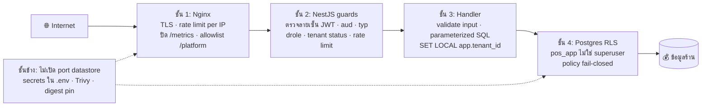

# 11 — Security: ป้องกันหลายชั้น (defense in depth) ของร้านอะไหล่ที่มีหลายร้านในระบบเดียว

> บทนี้ตอบคำถาม: **"ใครอยากทำร้ายระบบนี้ เขาจะเข้ามาทางไหน และแต่ละทางมีกำแพงกี่ชั้น ชั้นไหนยังไม่ได้สร้าง?"**

---

## 🧭 ก่อนอ่าน

- **ควรอ่านมาก่อน:** [architecture](02_architecture.md) (ภาพรวมว่ามี Nginx / api / Postgres / Redis),
  [backend](06_backend.md) (หัวข้อ 7–9 และ 16–17 สอน auth, JWT, argon2, rate limit, secrets ไว้แล้ว),
  [database](07_database.md) (หัวข้อ "RLS จากศูนย์"), [devops](14_devops.md) (หัวข้อ "Security scanning, supply chain…")
- **เวลา:** ประมาณ 90–120 นาที (ถ้าเปิดไฟล์จริงตามไปด้วย)
- **บทนี้ไม่สอนซ้ำ** กลไกที่บทอื่นลงลึกแล้ว — บทนี้ **เอามาเรียงเป็นชั้นๆ** แล้วถามว่า "ชั้นนี้กันอะไร กันไม่ได้อะไร"
  ทุกครั้งที่กลไกถูกสอนละเอียดในบทอื่น จะมีลิงก์ไปให้

**อ่านจบแล้วคุณจะ…**

- อธิบาย CIA triad, threat / vulnerability / attack surface และเขียน **threat model** ง่ายๆ ของระบบหนึ่งได้
- แยก hashing / encryption / encoding ออกจากกันได้ และบอกได้ว่าทำไมรหัสผ่านต้อง **hash แบบช้า** (argon2) ไม่ใช่ encrypt
- อ่าน JWT ออกว่าแต่ละส่วนคืออะไร และรู้ราคาของความ "stateless" (ยกเลิก token กลางคันยาก)
- ชี้ได้ว่าร้านนี้มีกำแพงกี่ชั้น อยู่ไฟล์ไหน บรรทัดไหน
- บอกได้ตรงๆ ว่า **ช่องไหนยังเปิดอยู่** — ซึ่งสำคัญกว่าการท่องว่าระบบ "ปลอดภัยแล้ว"

---

## 🧱 ปูพื้นฐาน

### 1. Security คืออะไร — CIA triad

คำว่า "ปลอดภัย" กว้างเกินไปจนใช้ตัดสินใจไม่ได้ วิศวกรจึงแตกมันเป็น 3 คุณสมบัติ เรียกว่า **CIA triad**
(ไม่เกี่ยวกับหน่วยข่าวกรอง):

| ตัวอักษร | ชื่อ | ความหมาย | ตัวอย่างในร้านอะไหล่ |
|---|---|---|---|
| **C** | **Confidentiality** (การรักษาความลับ) | คนที่ไม่มีสิทธิ์ต้อง **อ่าน** ไม่ได้ | ร้าน B ต้องไม่เห็นต้นทุนสินค้าและรายชื่อลูกค้าของร้าน A |
| **I** | **Integrity** (ความถูกต้องครบถ้วน) | คนที่ไม่มีสิทธิ์ต้อง **แก้** ไม่ได้ และแก้แล้วต้องรู้ | พนักงานต้องแก้ยอดบิลย้อนหลังเงียบๆ ไม่ได้ |
| **A** | **Availability** (ความพร้อมใช้งาน) | คนที่มีสิทธิ์ต้อง **ใช้ได้** ตอนที่ต้องใช้ | ลูกค้ายืนรอหน้าเคาน์เตอร์ ระบบต้องขายได้ ไม่ใช่ล่มเพราะมีคนยิง request ถล่ม |

ทุกกลไกในบทนี้ปกป้องอย่างน้อยหนึ่งตัวในสามตัวนี้ เวลาเจอกลไกใหม่ให้ถามตัวเองว่า "อันนี้กัน C, I หรือ A?"

> 💡 บางครั้งสามตัวนี้ขัดกันเอง: ล็อกบัญชีหลังใส่รหัสผิด 5 ครั้ง (ช่วย **C**) ก็ทำให้คนร้ายตั้งใจใส่ผิดเพื่อล็อกพนักงานตัวจริงได้ (ทำร้าย **A**)
> การออกแบบ security จริงคือการ **ชั่งน้ำหนัก** ไม่ใช่การเปิดทุกอย่างให้สุด

### 2. ศัพท์ 4 คำที่ต้องแยกให้ออก

เปรียบกับ **ร้านอะไหล่ตอนกลางคืน**:

| ศัพท์ | ความหมาย | analogy |
|---|---|---|
| **Asset** (ทรัพย์สิน) | สิ่งที่มีค่าและต้องปกป้อง | เงินในลิ้นชัก, สต็อกอะไหล่, สมุดรายชื่อลูกค้า |
| **Threat** (ภัยคุกคาม) | ใครหรืออะไรที่อาจทำร้าย asset | ขโมย, ไฟไหม้, พนักงานที่ไม่ซื่อ |
| **Vulnerability** (ช่องโหว่) | จุดอ่อนที่ threat ใช้ได้ | หน้าต่างหลังร้านกลอนเสีย |
| **Attack surface** (พื้นผิวการโจมตี) | ทุกทางเข้าที่ threat อาจลองได้ | ประตูหน้า + หน้าต่างหลัง + ช่องแอร์ + กุญแจสำรองใต้กระถาง |

**กฎข้อแรกของ security:** ลด attack surface ก่อน แล้วค่อยเสริมแต่ละทางเข้า — ทางเข้าที่ไม่มีอยู่ ไม่ต้องเฝ้า
(เดี๋ยวจะเห็นว่าร้านนี้ **ไม่เปิด port ของ Postgres/Redis ออกนอกเครื่องเลย** — นี่คือการลด attack surface)

### 3. Threat model — "ใครจะโจมตี"

**Threat model** (แบบจำลองภัยคุกคาม) คือการนั่งเขียนก่อนเขียนโค้ดว่า *ใคร* อยากทำร้ายเรา *อยากได้อะไร* *เข้าทางไหน*
ถ้าไม่ทำ เราจะป้องกันเรื่องที่นึกออกง่าย (เช่น SQL injection ที่อ่านเจอในบทความ) แล้วพลาดเรื่องที่เฉพาะกับระบบเรา
(เช่น "ร้านอื่นในระบบเดียวกันคือคู่แข่ง")

สำหรับระบบ POS แบบ multi-tenant (หลายร้านใช้ server เดียว) ผู้โจมตีมี 5 กลุ่มใหญ่:

| # | ผู้โจมตี | อยากได้อะไร | ตัวอย่าง |
|---|---|---|---|
| 1 | **Outsider บน internet** | เข้าระบบ, ทำให้ล่ม, ขโมยข้อมูล | เดารหัสผ่าน owner วนไปเรื่อยๆ, ยิง request 10,000 ครั้ง/วินาที |
| 2 | **Tenant อื่น** (ร้านอื่นที่ใช้ระบบเดียวกัน) | ข้อมูลของคู่แข่ง | แก้ `tenant_id` ใน request เป็นของร้านข้างๆ |
| 3 | **เครื่องถูกขโมย / เครื่องสาธารณะ** | ใช้ session ที่ค้างอยู่ | เดินมากดเครื่องหน้าเคาน์เตอร์ตอนพนักงานไม่อยู่, ขโมย tablet ไป |
| 4 | **Insider** (คนใน) | แก้ยอด ยักยอกเงิน | พนักงานที่ถูกไล่ออกแต่ token ยังใช้ได้, void บิลเพื่อเก็บเงินสดเอง |
| 5 | **Supply chain** (ห่วงโซ่ซอฟต์แวร์) | ฝังโค้ดร้ายผ่านของที่เราดึงมาใช้ | npm package ที่มีช่องโหว่, base image ที่ถูกเปลี่ยนเนื้อในโดยชื่อ tag เดิม |

ตารางนี้จะกลับมาอีกครั้งในหัวข้อ 🔥 พร้อม "กำแพงชั้นไหนกันมัน" และ "สถานะ"

### 4. Authentication vs Authorization

สอนไว้แล้วใน [backend หัวข้อ 7](06_backend.md) — สรุปสั้น:

- **Authentication** (ยืนยันตัวตน) = "คุณคือใคร" → login, ตรวจลายเซ็น token
- **Authorization** (ตรวจสิทธิ์) = "คุณทำสิ่งนี้ได้ไหม" → token นี้เป็นของร้านไหน, เครื่องนี้เป็น `pos` หรือ `backoffice`

**ช่องโหว่อันดับ 1 ของเว็บทั่วโลก** (ดู OWASP ด้านล่าง) ไม่ใช่การปลอมตัว แต่คือ *ยืนยันตัวตนถูกแล้ว แต่ลืมตรวจสิทธิ์* —
คุณ login เป็นร้าน A ถูกต้อง แล้วขอ `/sales/บิลของร้าน-B` ระบบดันตอบ

### 5. Hashing vs Encryption vs Encoding — สามคำที่คนสับสนที่สุด

```
Encoding   : "สวัสดี" ─► "4Liq4Lin..."  ─► "สวัสดี"   ใครก็ถอดได้ ไม่มีกุญแจ   (แปลงรูปแบบ)
Encryption : "สวัสดี" ─[กุญแจ]─► "x9$#..." ─[กุญแจ]─► "สวัสดี"  มีกุญแจถึงถอดได้  (ซ่อนความลับ)
Hashing    : "สวัสดี" ─► "a3f1..."  ─╳─► ย้อนกลับไม่ได้เลย          (ลายนิ้วมือ)
```

| | Analogy | ย้อนกลับได้ไหม | ใช้ทำอะไร |
|---|---|---|---|
| **Encoding** (เข้ารหัสรูปแบบ) เช่น Base64 | เขียนข้อความเป็นอักษรเบรลล์ — ใครมีตารางก็อ่านได้ | ได้ ทุกคน | ส่งข้อมูลผ่านช่องที่รับได้แค่ตัวอักษรบางชุด **ไม่ใช่ความปลอดภัย** |
| **Encryption** (เข้ารหัสลับ) เช่น AES, TLS | ใส่ของในตู้เซฟ — มีกุญแจถึงเปิดได้ | ได้ ถ้ามีกุญแจ | ส่งข้อมูลลับผ่านเน็ต (HTTPS), เก็บไฟล์ลับ |
| **Hashing** (แฮช) เช่น SHA-256, argon2 | ลายนิ้วมือ — ดูลายนิ้วมือแล้วสร้างคนขึ้นมาใหม่ไม่ได้ แต่เทียบได้ว่าใช่คนเดิมไหม | **ไม่ได้** | เก็บรหัสผ่าน, ตรวจว่าไฟล์ถูกแก้ไหม (digest ของ Docker image) |

⚠️ **กับดักสำหรับมือใหม่:** ส่วน payload ของ JWT เป็นแค่ **Base64url encoding** — ใครได้ token ไปก็อ่านข้างในได้หมด
(ลองแปะ token ที่เว็บ jwt.io ดูเอง) ลายเซ็นกันไม่ให้ **แก้** แต่ไม่ได้กันไม่ให้ **อ่าน** → **ห้ามใส่ความลับใน JWT**

### 6. ทำไมรหัสผ่านต้อง hash — และต้อง hash แบบ "ช้า" + มี salt

**ทำไมไม่ encrypt รหัสผ่าน?** เพราะถ้า encrypt แปลว่ามีกุญแจที่ถอดกลับได้วางอยู่สักที่ใน server
คนที่ขโมย database ได้ มักขโมยกุญแจได้ด้วย → ได้รหัสผ่านทุกคน (และคนส่วนใหญ่ใช้รหัสเดียวกับอีเมล/ธนาคาร)
hash ไม่มีกุญแจ ไม่มีทางย้อนกลับ ตอน login เราแค่ hash สิ่งที่ผู้ใช้พิมพ์ แล้วเทียบกับ hash ที่เก็บ

**Salt** (เกลือ) — ถ้า hash `"123456"` ได้ผลเดิมทุกครั้ง คนร้ายจะคำนวณตาราง "รหัสยอดนิยม → hash" ไว้ล่วงหน้า
(เรียกว่า **rainbow table**) แล้วเทียบกับทั้ง database ในทีเดียว salt คือค่าสุ่มที่ต่อท้ายรหัสก่อน hash
ต่างกันทุกบัญชี → สองคนที่ใช้ `123456` ได้ hash คนละค่า → ตารางล่วงหน้าใช้ไม่ได้ ต้องเดาทีละบัญชี

**ทำไมต้องช้า?** SHA-256 ถูกออกแบบให้ **เร็ว** — การ์ดจอหนึ่งใบเดาได้หลายพันล้านครั้งต่อวินาที
รหัส 8 ตัวอักษรตัวเล็กมีแค่ 26⁸ ≈ 2 แสนล้านแบบ → แตกในไม่กี่นาที
**argon2** (ผู้ชนะ Password Hashing Competition ปี 2015) ถูกออกแบบให้ **ช้าและกิน RAM โดยตั้งใจ**:
ถ้าหนึ่งครั้งใช้ 64 MiB การ์ดจอที่มี RAM จำกัดก็รันขนานได้น้อยลงมาก

```
             ต่อ 1 ครั้ง       ผู้ใช้จริง login 1 ครั้ง     คนร้ายเดา 1,000 ล้านครั้ง
SHA-256      ~นาโนวินาที      ไม่รู้สึก                      วินาที-นาที
argon2id     ~100 ms, 64 MiB  ไม่รู้สึก (0.1 วินาที)          หลายปี
```

ราคาที่จ่าย: server เราก็ช้าด้วย — ทุก login กิน CPU + RAM จริง ต้องระวังว่าเรียกมัน **ตรงไหน** (จะเห็นในหัวข้อ 🔍 ว่า repo นี้เคยวาง argon2 ไว้ในที่ผิดจน pool รอ)

### 7. Symmetric vs Asymmetric crypto และ Digital signature

| | **Symmetric** (กุญแจเดียว) | **Asymmetric** (กุญแจคู่) |
|---|---|---|
| analogy | กุญแจบ้านดอกเดียว ใครมีสำเนาก็เปิด-ล็อกได้ | **ตู้ไปรษณีย์**: ใครก็หย่อนจดหมายได้ (public key) แต่เจ้าของเท่านั้นไขเอาออก (private key) |
| ตัวอย่าง | AES, **HMAC-SHA256 (HS256)** | RSA, ECDSA, **RS256** |
| ข้อดี | เร็ว, กุญแจสั้น | ไม่ต้องแชร์ความลับ |
| ข้อเสีย | ทุกคนที่ต้องตรวจ ต้องถือความลับเดียวกัน | ช้ากว่า, กุญแจ/ลายเซ็นยาวกว่า |

**Digital signature** (ลายเซ็นดิจิทัล) คือการใช้ asymmetric กลับด้าน:
เซ็นด้วย **private key** (มีคนเดียว) → ใครก็ตรวจด้วย **public key** ได้ว่า "คนถือ private key เป็นคนเซ็นจริง และข้อความไม่ถูกแก้"
เทียบ: **ตราประทับของร้าน** — ร้านมีตราอันเดียว แต่ใครก็เอาตัวอย่างตราไปเทียบได้ว่าเอกสารนี้ประทับจริงไหม

ความต่างที่สำคัญสำหรับบทนี้: ใน **HS256** คนที่ *ตรวจ* ลายเซ็นได้ ก็ *ปลอม* ลายเซ็นได้ด้วย (เพราะใช้ความลับเดียวกัน)
ใน **RS256** คนที่ตรวจได้ (มีแค่ public key) ปลอมไม่ได้

### 8. TLS / HTTPS — ท่อที่ไม่มีใครแอบฟังได้

**HTTP** ธรรมดาส่งข้อความเปลือยๆ ผ่านทุกเครื่องระหว่างทาง (Wi-Fi ร้านกาแฟ, router มหาวิทยาลัย, ISP) — ใครอยู่กลางทางก็อ่านรหัสผ่านได้
**TLS** (Transport Layer Security) ห่อ HTTP ให้เป็น **HTTPS** โดยทำ 3 อย่าง:

1. **Encryption** — คนกลางทางอ่านไม่ออก (C)
2. **Integrity** — คนกลางทางแก้ไม่ได้โดยไม่ถูกจับ (I)
3. **Authentication ของ server** — ผ่าน **certificate** (ใบรับรอง): เอกสารที่ **CA** (Certificate Authority — หน่วยงานที่ browser ไว้ใจ) เซ็นรับรองว่า
   "public key นี้เป็นของโดเมนนี้จริง"

**Self-signed certificate** = ใบรับรองที่เราเซ็นรับรองตัวเอง ไม่มี CA — การเข้ารหัสยังทำงาน แต่ browser ไม่มีทางรู้ว่า
คุณคุยกับ server ตัวจริง ไม่ใช่คนกลางที่ทำ cert ปลอมขึ้นมา browser จึงขึ้นคำเตือนสีแดง
(เดี๋ยวจะเห็นว่า demo ของร้านนี้ใช้ self-signed — และบท [CI/CD](15_cicd.md) เล่าว่า FortiGate ของคณะก็ทำตัวเป็น "คนกลาง" แบบนี้จริงๆ)

### 9. JWT — กายวิภาค และราคาของ stateless

พื้นฐานอยู่ใน [backend หัวข้อ 8](06_backend.md) ตรงนี้ผ่าดูข้างใน:

```
eyJhbGciOiJSUzI1NiIsImtpZCI6ImtleS0xIn0 . eyJzdWIiOiJ1MSIsInRpZCI6InQxIiwiZXhwIjoxNz...} . Qm9ndXNTaWduYXR1cmU...
└────────────── header ──────────────┘   └────────────── payload ──────────────┘   └──── signature ────┘
{"alg":"RS256","kid":"key-1"}            {"sub":"u1","tid":"t1","aud":"tenant",        RSA-sign(header.payload,
                                           "typ":"access","exp":1789...}                 private key)
                                                                        (ตัวอย่างสมมติ — ไม่ใช่ token จริงของระบบ)
```

- **header** — บอกว่าเซ็นด้วยอัลกอริทึมอะไร (`alg`) และด้วยกุญแจดอกไหน (`kid` = key id)
- **payload** — **claims** (ข้อความยืนยัน): ใคร (`sub`), ร้านไหน (`tid`), ใช้กับฝั่งไหน (`aud`), หมดอายุเมื่อไร (`exp`)
- **signature** — ลายเซ็นของสองส่วนแรก ถ้าใครแก้ `tid` ใน payload แม้แต่ตัวเดียว ลายเซ็นจะไม่ตรง

**Stateless** — server ไม่ต้องจำว่าออก token ใบไหนไปบ้าง ตรวจลายเซ็นก็พอ → api 3 ตัวตรวจได้หมดโดยไม่ต้องคุยกัน

**ราคา: revocation (การยกเลิก) ยาก.** ไล่พนักงานออกตอน 10:00 แต่ token ของเขาหมดอายุ 10:15 → 15 นาทีนั้นเขายังใช้ได้
ทางแก้มี 3 แบบ:

| วิธี | ทำยังไง | ราคา |
|---|---|---|
| Denylist | เก็บรายการ token ที่ถูกยกเลิกใน Redis ตรวจทุก request | กลับมามี state — เสียข้อดีของ JWT |
| **อายุสั้น + refresh ตรวจ DB** | access 15 นาที, ตอนขอใบใหม่ (refresh) ค่อยตรวจ DB ว่า user ยัง active ไหม | มีช่องว่างสูงสุด 15 นาที |
| ตรวจ DB ทุก request | เหมือน session | ช้า, เสียข้อดีของ JWT ทั้งหมด |

ร้านนี้เลือกแบบที่ 2 (ADR-0009) — รายละเอียดในหัวข้อ ⚖️

### 10. Least privilege — ให้สิทธิ์น้อยที่สุดที่พอทำงาน

ช่างซ่อมแอร์ที่มาร้าน ได้กุญแจห้องแอร์ ไม่ใช่กุญแจลิ้นชักเงิน ถ้ากุญแจห้องแอร์หาย ความเสียหายจำกัดอยู่ที่ห้องแอร์
เรียกขอบเขตความเสียหายนี้ว่า **blast radius** (รัศมีระเบิด)

ในระบบนี้: app ต่อ Postgres ด้วย role `pos_app` ที่ **ไม่ใช่ superuser และไม่ใช่เจ้าของตาราง**, worker ไม่ได้ private key ของ JWT,
user `deploy` บน VM ไม่มี `sudo`

### 11. Defense in depth — ปราสาทหลายชั้น

ปราสาทยุคกลางไม่ได้พึ่งกำแพงเดียว: **คูน้ำ → กำแพงนอก → ประตูที่มียาม → กำแพงใน → หอคอยที่เก็บสมบัติ**
ข้าศึกข้ามคูน้ำได้ ก็ยังเจอกำแพง ปีนกำแพงได้ ก็ยังเจอยาม
หลักคือ **สมมติว่าแต่ละชั้นจะพังสักวัน** แล้วถามว่า "ถ้าชั้นนี้พัง ชั้นถัดไปยังกันได้ไหม"



ตัวอย่างจริง: ถ้าโปรแกรมเมอร์ลืมใส่ `WHERE tenant_id = ...` ใน query หนึ่ง (ชั้น 3 พัง) — **RLS** (ชั้น 4) ยังคืนแค่แถวของร้านตัวเอง

### 12. OWASP Top 10 — รายการภัยยอดนิยมของเว็บ

**OWASP** (Open Worldwide Application Security Project) รวบรวมช่องโหว่ที่เจอบ่อยที่สุดในเว็บจริงทุกไม่กี่ปี
ฉบับ 2021 เรียงตามนี้ — จับคู่กับของในร้านนี้:

| OWASP 2021 | ความหมายสั้น | ในร้านนี้ |
|---|---|---|
| **A01 Broken Access Control** | ยืนยันตัวตนแล้วแต่ตรวจสิทธิ์พลาด | ร้าน A อ่านของร้าน B → กันด้วย `tid` จาก JWT + RLS |
| **A02 Cryptographic Failures** | เข้ารหัสผิด/ไม่เข้ารหัส | TLS ที่ Nginx, argon2, RS256 |
| **A03 Injection** | ข้อมูลผู้ใช้กลายเป็นคำสั่ง (SQL injection) | parameterized query `$1, $2` |
| A04 Insecure Design | ออกแบบผิดตั้งแต่ต้น | ADR + threat model (เช่น ADR-0002 แยก platform admin) |
| **A05 Security Misconfiguration** | ตั้งค่าหละหลวม | CORS `'*'`, secret default, port เปิด |
| **A06 Vulnerable Components** | ใช้ library ที่มีช่องโหว่ | Trivy, `pnpm audit`, OSV-Scanner |
| **A07 Identification & Auth Failures** | login อ่อนแอ | rate limit login, รหัสขั้นต่ำ 12 ตัว |
| A08 Software & Data Integrity Failures | ของที่เราดึงมาถูกแก้ระหว่างทาง | digest pinning |
| A09 Logging & Monitoring Failures | ถูกเจาะแล้วไม่รู้ตัว | `audit_log`, Prometheus |
| A10 SSRF | หลอกให้ server ไปเรียก URL ภายใน | ไม่มี datastore port บน host ลดผลกระทบ |

โค้ดใน repo อ้าง OWASP เองด้วย เช่น `server/src/app.setup.ts:38` เขียนว่า `// Security headers via Helmet (OWASP A05)`
และ `server/src/auth/auth.service.ts:38` เขียนว่า `// Brute-force checks (OWASP A07)`

### 13. Secrets management — ความลับอยู่ที่ไหน

**Secret** (ความลับ) = รหัสผ่าน DB, private key, API key ห้าม:

- ❌ hardcode ในโค้ด (ขึ้น Git แล้วอยู่ในประวัติตลอดไป แม้ลบทีหลัง)
- ❌ ฝังใน Docker image (ใครดึง image ได้ก็ได้ความลับ)
- ❌ พิมพ์ลง log

ท่ามาตรฐาน: เก็บใน **environment variable** ที่อ่านจากไฟล์ `.env` บนเครื่องที่รันจริง ไฟล์นี้ไม่ขึ้น Git
([devops หัวข้อ "Environment variables & secrets"](14_devops.md) อธิบายไว้แล้ว) บทนี้เพิ่มอีก 2 กฎ:

1. **ขาดแล้วต้องพังดัง ไม่ใช่เงียบ** — ถ้าลืมตั้ง secret ระบบต้องไม่ยอม start (ดีกว่าใช้ค่า default ที่ทุกคนบน GitHub รู้)
2. **อย่าให้เครื่องมือพิมพ์มันออกมา** — เช่น `ansible-playbook --diff` จะพิมพ์ทั้งไฟล์ `.env`

### 14. Supply chain และ CVE

โค้ดที่ทีมเขียนเองเป็นส่วนน้อยของสิ่งที่รันจริง — ที่เหลือคือ npm package หลายร้อยตัว, Dart package, Linux ใน base image
**CVE** (Common Vulnerabilities and Exposures) คือเลขทะเบียนช่องโหว่ที่เปิดเผยแล้ว เช่น `CVE-2024-xxxxx`
เครื่องมืออย่าง **Trivy** เอารายการ library ของเราไปเทียบกับฐานข้อมูล CVE แล้วบอกว่า "ตัวนี้มีช่องโหว่ระดับ HIGH ที่แก้แล้วในเวอร์ชันใหม่"

ความเสี่ยงอีกแบบคือของที่ดึงมาถูก **เปลี่ยนเนื้อใน** ทั้งที่ชื่อเดิม — แก้ด้วย **digest pinning** ([devops](14_devops.md) สอนแล้ว)

---

## 🔥 ปัญหาจริงของร้าน

ร้านศรีสุราษฎร์เดิมรันเป็น **เว็บในเบราว์เซอร์ + localStorage** บนเครื่องเดียวในร้าน — attack surface แทบเป็นศูนย์:
ไม่มี server, ไม่มี internet เข้ามา ภัยจริงมีแค่ "คนเดินมากดเครื่อง"

พอ `main` กลายเป็นระบบ **multi-tenant บน server** (ดู [architecture](02_architecture.md)) ทุกอย่างเปลี่ยน:

1. **ระบบขึ้น internet** → outsider ทั้งโลกเข้าถึงหน้า login ได้
2. **หลายร้านอยู่ใน database เดียว** → ร้านอื่นคือคู่แข่ง ข้อมูลรั่วข้ามร้าน = หายนะทางธุรกิจ + ผิดกฎหมายคุ้มครองข้อมูลส่วนบุคคล (**PDPA**)
3. **มี platform admin ที่เห็นทุกร้าน** → บัญชีเดียวหลุด = ทุกร้านหลุด
4. **เครื่องหน้าเคาน์เตอร์เป็นเครื่องสาธารณะ** → ใครเดินมาก็กดได้
5. **ดึง dependency หลายร้อยตัว + Docker image** → supply chain

### Threat model ของ POS นี้

สถานะ: ✅ done (มีในโค้ดและมี test/หลักฐาน) · 🟡 partial (มีบางส่วน หรือมีในโค้ดแต่ยังไม่ได้เปิดบนเครื่องจริง) · 🔴 open

| # | Threat | ตัวอย่าง | ชั้นป้องกัน | file:line | สถานะ |
|---|---|---|---|---|---|
| T1 | Outsider ดักฟัง | Wi-Fi สาธารณะอ่านรหัสผ่านระหว่างทาง | TLS ที่ Nginx, redirect 80→443 | `server/docker/nginx/nginx.conf:41-51` | 🟡 เข้ารหัสจริง แต่ cert เป็น **self-signed** |
| T2 | Outsider เดารหัส (brute force) | บอทลองรหัส owner วนไป | Nginx `perip` 30r/s → IP bucket 10/นาที ก่อนแตะ DB → username bucket 5/นาที → argon2 ช้า | `nginx.conf:25`, `server/src/auth/auth.service.ts:47-60`, `:96-108` | ✅ |
| T3 | Outsider ยิงถล่ม (DoS) | 10,000 req/วินาที | `limit_req` per IP + per-tenant guard (ADR-0006) | `nginx.conf:25-26,97-100` | ✅ (ขนาด flood ใหญ่ระดับเครือข่ายเกินขอบเขต) |
| T4 | Outsider ปลอม token | แก้ `tid` ใน payload | RS256 ลายเซ็น, ล็อก `algorithms:['RS256']`, ตรวจ `iss`/`typ`/`aud` | `server/src/auth/jwt-keys.service.ts:81-112`, `server/src/common/guards/tenant.guard.ts:47-63` | ✅ |
| T5 | Outsider เจาะ platform admin | ยิง `/api/v1/platform/tenants` จากบ้าน | Nginx allow แค่ loopback + guard เช็ค IP + HS256 platform token + `aud:'platform'` | `nginx.conf:87-95`, `server/src/platform/platform-auth.guard.ts:39-82` | 🟡 ไม่มี MFA (ADR-0002 ยังไม่เคาะ) |
| T6 | Outsider SQL injection | ใส่ `'; DROP TABLE sales;--` ในช่องค้นหา | parameterized query `$1` | เช่น `auth.service.ts:110-114` | ✅ (ตรวจด้วยการอ่าน — ดู 🔍) |
| T7 | Outsider ต่อ DB/Redis ตรง | สแกน port 5432/6379 บน VM | ไม่ publish port datastore + Redis `requirepass` | `server/docker-compose.yml:190-205`, `:213-220` | ✅ |
| T8 | Tenant อื่นอ่านข้อมูล | ร้าน B เปลี่ยน id ใน URL เป็นบิลร้าน A | `tid` มาจาก JWT เท่านั้น → `SET LOCAL app.tenant_id` → RLS fail-closed | `server/src/common/database/tenant.service.ts:86-88`, `server/src/db/migrations/1788652800001-RowLevelSecurity.ts:58-63` | 🟡 ตารางหนึ่ง (`owner_review_items`) policy ไม่มี `NULLIF` |
| T9 | Tenant อื่นแย่งโควตา | ร้านหนึ่งยิงหนักจนร้านอื่นช้า | per-tenant rate limit (Redis) | `server/src/rate-limit/` (ADR-0006) | ✅ |
| T10 | เครื่องถูกขโมย / เครื่องสาธารณะ | tablet หาย, session ค้าง | access 15 นาที, refresh หมดตี 4, retire เครื่อง → refresh ถูกปฏิเสธ | ADR-0009, `auth.service.ts:226-298` | 🟡 access token ฝั่ง web ถูกเก็บถาวร (ดู ⚠️) |
| T11 | เครื่อง backoffice ปลอมเป็น pos | ส่ง `deviceId` ของเครื่องขาย | `did`/`drole` มาจาก device token ที่ server hash แล้วเท่านั้น | `auth.service.ts:71-88`, `server/src/devices/devices.service.ts:157-159` | ✅ |
| T12 | Insider ที่ถูกไล่ออก | token ยังใช้ได้ | `users.is_active` ตรวจตอน refresh ≤ 15 นาที | ADR-0009 ข้อ 3 | ✅ (ยอมรับช่อง 15 นาที) |
| T13 | Insider แก้ยอดเงียบๆ | void บิลแล้วเก็บเงินสด | `audit_log` + `movements` เป็น ledger (INSERT/SELECT เท่านั้น) | `server/src/audit/audit.service.ts:27-45`, `RowLevelSecurity.ts:70-74` | 🟡 `pos_app` ยัง UPDATE/DELETE `audit_log` ได้ |
| T14 | Supply chain — library มี CVE | npm package มีช่องโหว่ HIGH | `pnpm audit` + Trivy fs + Trivy image (block push) + OSV-Scanner | `.github/workflows/server.yml:115-124`, `:278-290` | ✅ |
| T15 | Supply chain — base image ถูกเปลี่ยน | tag `node:22-alpine` เปลี่ยนไส้ | digest pin ใน Dockerfile | `server/Dockerfile:5,17` | 🟡 image ใน compose (`postgres:16-alpine`, `redis:7-alpine`, `nginx:1.29-alpine`) ยังเป็น tag |
| T16 | Secret หลุด / ใช้ค่า default | ลืมตั้ง `JWT_PLATFORM_SECRET` → ใช้สตริง dev ที่อยู่บน GitHub | compose `:?` บังคับ | `server/docker-compose.yml:26` | 🟡 ตัวโค้ด `config.ts:113` ยังมี fallback |
| T17 | ตั้งค่าหละหลวม — CORS | เว็บอื่นเรียก API ของร้านจาก browser เหยื่อ | `CORS_ORIGINS` allowlist, list ว่างผิดรูป → throw | `server/src/config/config.ts:66-77`, `server/src/app.setup.ts:46-67` | 🟡 **mob04 ยังเป็น `'*'`** |
| T18 | etcd ไม่มี auth | อ่าน/แก้ config runtime | `etcd-init.sh` เปิด RBAC | `server/docker/etcd/etcd-init.sh` | 🔴 **#365 — บน VM auth ไม่เคยเปิด** |
| T19 | ข้อมูลหายถาวร (A ใน CIA) | ดิสก์ `mob04` พัง | backup offsite | `deploy/scripts/backup-db.sh` | 🔴 **#363 parked — ไม่มี backup ออกจาก VM** |

> ตารางนี้คือ "สัญญา" ของบท: ทุกแถวที่เป็น 🟡/🔴 จะมีคำอธิบายใน ⚠️ ท้ายบท

---

## ⚖️ ทางเลือก → ทำไมเลือกอันนี้

### ตัดสินใจ 1: token ของร้าน — Session vs JWT HS256 vs JWT RS256

| เกณฑ์ | Server session (Redis) | JWT **HS256** (ความลับเดียว) | JWT **RS256** (กุญแจคู่) ✅ |
|---|---|---|---|
| api 3 ตัวตรวจได้โดยไม่คุยกัน | ❌ ต้องถาม Redis ทุก request | ✅ | ✅ |
| ถ้า process ที่ *ตรวจ* token หลุด | – | 🔴 ปลอม token **ทุกร้าน** ได้ | 🟢 ได้แค่ public key ปลอมไม่ได้ |
| ยกเลิก token ทันที | ✅ ลบ session | ❌ | ❌ (รอ ≤15 นาที) |
| ขนาด token | เล็ก | กลาง | ~2 เท่าของ HS256 |
| ตรงกติกาอาจารย์ "JWT stateless" | ❌ | ✅ | ✅ |

**เพราะ** stack มี `api-1..3` + `worker` + Bull-Board ในเครือข่ายเดียว และ secret ของ HS256 มักถูกแปะไว้ใน `environment:` ร่วมจนทุก process ได้ไป
→ **จึง** ใช้ RS256 ให้มีแค่ process ที่มี `/auth/*` ถือ private key → **ราคาที่จ่าย** คือ token ยาวขึ้นราว 2 เท่า (ไม่มีผลกับ POS ที่ยิงไม่กี่ครั้งต่อนาที)
และต้องจัดการหมุนกุญแจเอง (ADR-0009 ส่วน "การเซ็นและที่เก็บ token")

### ตัดสินใจ 2: อายุ token — 30 วัน vs 24 ชม. vs "ตี 4"

| | refresh 30 วัน + rotation | refresh 24 ชม. นับจาก login | **refresh หมดตี 4 ทุกวัน** ✅ |
|---|---|---|---|
| เครื่องสาธารณะค้าง session | 🔴 30 วัน | 🟡 1 วัน | 🟢 ไม่ข้ามวัน |
| เด้งกลางบิลตอนลูกค้ารอ | ไม่ | 🔴 ใช่ (login บ่ายวันจันทร์ → หมดบ่ายวันอังคาร) | 🟢 หมดนอกเวลาทำการ |
| ต้องมี state เพิ่ม | Redis rotation | ไม่ | ไม่ |

**เพราะ** ร้านมีพิธีเปิดกะทุกเช้าอยู่แล้ว → **จึง** "เปิดร้าน = login" ไม่ใช่ภาระใหม่ → **ราคา:** พนักงาน login ทุกวัน
และมีสมมติฐานที่ ADR-0009 ยอมรับเองว่ายังไม่มีเอกสารยืนยัน ("ร้านไม่เปิดตอนตี 4")

### ตัดสินใจ 3: tenant isolation — WHERE อย่างเดียว vs database แยกต่อร้าน vs RLS

| | `WHERE tenant_id=` ในทุก query | database/schema แยกต่อร้าน | **WHERE + RLS** ✅ |
|---|---|---|---|
| ลืมใส่ WHERE ครั้งเดียว | 🔴 รั่วทั้งตาราง | 🟢 ไม่รั่ว | 🟢 RLS คืน 0 แถว |
| จำนวน DB ที่ต้อง migrate | 1 | N ร้าน | 1 |
| ความซับซ้อน | ต่ำ | สูง (connection ต่อร้าน) | กลาง (ต้อง `SET LOCAL` ในทุก transaction) |

รายละเอียด RLS สอนไว้ใน [database หัวข้อ "RLS จากศูนย์"](07_database.md) — บทนี้เน้นแค่มุม "ชั้นสุดท้ายเมื่อชั้นอื่นพัง"

### ตัดสินใจ 4: rate limit — Nginx ต่อ tenant vs Nginx ต่อ IP + NestJS ต่อ tenant

ADR-0006: Nginx ตัวฟรี **อ่าน JWT ไม่ได้** (`auth_jwt` เป็นของ NGINX Plus) จะ limit ต่อร้านที่ Nginx ต้องให้ client ส่ง `X-Tenant-Id` มาเอง
ซึ่งปลอมได้ และผิดกติกาข้อ 1 "`tenant_id` มาจาก JWT เท่านั้น"
→ **จึง** แบ่งเป็น 2 ชั้น: Nginx หยาบๆ ต่อ IP (กัน flood ก่อนถึง app) + NestJS แม่นๆ ต่อ `tenant_id` จาก JWT ใน Redis
→ **ราคา:** k6 load test จากเครื่องเดียวจะชน `perip` ก่อน (เรื่องนี้ไปต่อที่ #380 — ห้ามเจาะรูยกเว้น IP ของ load generator ตามคำตัดสินเจ้าของ)

### ตัดสินใจ 5: platform admin — role หนึ่งใน `users` vs ตารางแยก

ADR-0002 แยก **admin plane** ออกจาก **tenant plane** 4 ชั้น: ตาราง (`platform_admins` ไม่มี `tenant_id`), login endpoint,
JWT (`aud:"platform"` ไม่มี `tid`), DB connection (DataSource แยกที่ bypass RLS)
**เพราะ** ถ้าให้ `users.tenant_id` เป็น NULL ได้ ทุก RLS policy ต้องรับมือ NULL = ช่องที่ลืมง่ายที่สุด → **ราคา:** มี 2 ระบบ auth ต้องดูแล

---

## 🔍 ของจริงใน repo

เรียงตามทางที่ request วิ่ง: นอกสุด → ในสุด

### 1. TLS ที่ Nginx — และความจริงว่า cert เป็น self-signed

`server/docker/nginx/nginx.conf:41-51`

```nginx
  server {
    listen 80;
    return 301 https://$host$request_uri;
  }

  server {
    listen 443 ssl;
    http2 on;
    ssl_certificate     /etc/nginx/certs/server.crt;
    ssl_certificate_key /etc/nginx/certs/server.key;
    ssl_protocols TLSv1.2 TLSv1.3;
```

- **ทำอะไร:** port 80 (HTTP) ไม่ให้บริการอะไรเลย แค่ส่ง **301** (ย้ายถาวร) ไป HTTPS; port 443 เปิด TLS รับแค่ 1.2 และ 1.3
  (เวอร์ชันเก่ากว่ามีช่องโหว่ที่รู้จักแล้ว)
- **TLS จบที่ Nginx** (เรียกว่า **TLS termination**) — ระหว่าง Nginx กับ api เป็น HTTP ธรรมดาในเครือข่ายภายในของ Docker
  ยอมรับได้เพราะเครือข่ายนั้นไม่มีทางเข้าจากนอกเครื่อง

cert มาจากไหน? `server/docker-compose.yml:90-101`

```yaml
  # Self-signed TLS for dev/demo. Replace the volume contents with a real cert on the VM.
  certgen:
    image: alpine/openssl
    entrypoint: sh
    command:
      - -c
      - >
        test -f /certs/server.crt ||
        openssl req -x509 -newkey rsa:2048 -nodes -days 825 -subj "/CN=localhost"
        -keyout /certs/server.key -out /certs/server.crt
    volumes:
      - certs:/certs
```

- container ชั่วคราวที่สร้าง cert **self-signed** (`-x509` = เซ็นตัวเอง) ชื่อ `CN=localhost` อายุ 825 วัน ถ้ายังไม่มี (`test -f … ||` ทำให้รันซ้ำได้ไม่สร้างทับ)
- **พูดตรงๆ:** comment บอกว่า "Replace … with a real cert on the VM" แต่ `deploy/compose/vm.override.yml` ไม่มีอะไรเกี่ยวกับ cert เลย
  และไม่พบหลักฐานใน repo ว่าเคยเปลี่ยนเป็น cert จริง → **demo บน `mob04` ควรถือว่ายังเป็น self-signed**
  ผลคือ: ข้อมูล **ถูกเข้ารหัส** จริง แต่ browser เตือน และผู้ใช้ **ตรวจไม่ได้** ว่าคุยกับ server ตัวจริง (ช่องให้ man-in-the-middle)
- **ถ้าไม่มี TLS เลย:** รหัสผ่านและ JWT วิ่งเปลือยๆ ผ่าน Wi-Fi ของคณะ

### 2. Rate limit ชั้นนอก — Nginx `perip`

`server/docker/nginx/nginx.conf:24-26` และ `:97-100`

```nginx
  # Coarse per-IP limit (floods, pre-auth). Per-tenant limiting is a NestJS guard (#33).
  limit_req_zone $binary_remote_addr zone=perip:10m rate=30r/s;
  limit_req_status 429;
  ...
    location /api/ {
      limit_req zone=perip burst=60 nodelay;
      proxy_pass http://api;
    }
```

- จำกัด **30 request/วินาที ต่อ IP** มีถัง **burst** (กระชาก) 60 เผื่อ request ที่มาพร้อมกันเป็นชุด เกินแล้วตอบ **429** (Too Many Requests)
- ใช้กับ `/api/` เท่านั้น — `/health/` **ไม่** limit (ไม่งั้น load balancer คิดว่า instance ตาย) และหน้าเว็บ `/` ก็ไม่ limit
  เพราะโหลด Flutter ครั้งแรกเป็นไฟล์ static จำนวนมากพร้อมกัน (comment ที่ `:169-174`)
- กัน **A** (availability) จาก flood แบบง่าย ก่อนที่ request จะถึง Node.js เลย

### 3. รู้ได้ยังไงว่า IP จริงของ client คืออะไร — `trust proxy = 1` และ rightmost XFF

ปัญหา: api อยู่หลัง Nginx ดังนั้นทุก request ที่ api เห็น มาจาก IP ของ Nginx → ถ้า rate limit ด้วย IP นั้น **ทุกคนในโลกใช้ถังเดียวกัน**
(เคยเป็นแบบนี้จริง — #134) Nginx แก้โดยใส่ header `X-Forwarded-For` (XFF) บอก IP ต้นทาง:

`server/docker/nginx/nginx.conf:70` → `proxy_set_header X-Forwarded-For $proxy_add_x_forwarded_for;`

`$proxy_add_x_forwarded_for` = "ของเดิมที่ client ส่งมา" + ", " + "IP ที่ Nginx เห็นจริง" — **ต่อท้าย** ไม่ใช่เขียนทับ
แปลว่า client ใส่อะไรมาก่อนก็ได้:

```
client ปลอมส่ง:   X-Forwarded-For: 1.2.3.4
Nginx ส่งต่อ:      X-Forwarded-For: 1.2.3.4, 203.0.113.9
                                    └─ปลอมได้─┘ └─Nginx เขียน = จริง─┘
```

`server/src/common/client-ip.ts:15-28`

```ts
/**
 * The caller's address as our nginx saw it (#132).
 *
 * Assumes exactly one trusted proxy hop: nginx sets `X-Forwarded-For $proxy_add_x_forwarded_for`,
 * which APPENDS its `$remote_addr` to whatever the client sent. Only the rightmost entry is
 * nginx's; everything left of it is client-controlled. ...
 */
export function clientIp(req: { headers: IncomingHttpHeaders; ip?: string }): string | null {
  const forwarded = req.headers['x-forwarded-for'];
  const header = Array.isArray(forwarded) ? forwarded.join(',') : forwarded;
  if (header) return toInet(header.split(',').at(-1));
  return toInet(req.ip);
}
```

- **`.at(-1)`** = ตัว **ขวาสุด** = ตัวที่ Nginx เขียน ถ้าใช้ตัวซ้ายสุด คนร้ายใส่ IP สุ่มใหม่ทุก request ก็หนี rate limit ได้ตลอด

`server/src/app.setup.ts:30-36`

```ts
  // Exactly one trusted hop: nginx, which appends $remote_addr to X-Forwarded-For. Without
  // this `req.ip` is nginx's container address for every client, so the per-IP login
  // limit was one bucket for everyone. Never `true` — that trusts the leftmost entry,
  // which the client writes. If another proxy (CDN, TLS terminator) is ever put in front of
  // nginx, `req.ip` becomes that proxy's address and #134 comes back: raise the hop count or
  // use nginx `real_ip` instead.
  app.getHttpAdapter().getInstance().set('trust proxy', 1);
```

- ตั้งเป็น **`1`** (เชื่อ proxy 1 ชั้น) — ห้าม `true` เพราะ Express จะเชื่อตัวซ้ายสุดที่ client เขียนเอง
- **ข้อผูกมัด:** ถ้าวันหนึ่งเอา CDN มาไว้หน้า Nginx ทุกอย่างนี้ผิดทันที — CLAUDE.md จึงเขียนเป็นกฎว่า "Nginx ต้องเป็น reverse proxy ตัวเดียว"

### 4. Rate limit ของ login — นับ **ก่อน** รู้ผล, **ก่อน** แตะ DB

ตัว Lua script `RATE_LIMIT_LUA` (`server/src/rate-limit/rate-limit.service.ts:16-24`) และเหตุผลที่มันต้อง atomic
สอนละเอียดแล้วใน [backend หัวข้อ 8 "Rate limit — Lua INCR แบบ atomic"](06_backend.md) — ตรงนี้ไม่ขอยกโค้ดซ้ำ
เอาแค่มุม **security** ที่ backend ไม่ได้เน้น: การนับพยายาม login ก่อนรู้ผลกันอะไร

`server/src/auth/auth.service.ts:38-60` (ตัดบางส่วน)

```ts
    // Brute-force checks (OWASP A07). The IP bucket needs no tenant, so it is checked before a
    // pool connection is taken: a locked-out IP must not cost a connection and a device lookup.
    ...
    // Every attempt is counted up front, atomically (#138): a separate check then increment let N
    // concurrent attempts all pass. So every refusal counts — bad device token, unknown or ambiguous
    // username, inactive user, suspended tenant, wrong password — and only a successful login gives
    // its own attempt back. The IP bucket is never cleared on success: that let one valid account
    // reset the bucket every 9 failures and spray usernames with no IP limit.
    const ipKey = clientIp ? `auth:ip:${clientIp}` : null;
    if (ipKey) {
      const ipStatus = await this.rateLimit.consumeAttempt(ipKey, 10, 60);
      if (!ipStatus.allowed) {
        throw new HttpException( ... HttpStatus.TOO_MANY_REQUESTS, );
      }
    }

    const qr = this.ds.createQueryRunner();
    await qr.connect();
```

อ่านทีละประเด็น:

1. **ถัง IP: 10 ครั้ง/60 วินาที** เช็ค **ก่อน** `qr.connect()` — IP ที่ถูกล็อกไม่เสีย connection ของ pool เลย
   (connection มีจำกัด ถ้าคนร้ายทำให้ login กิน connection ได้ = ทำให้ทั้งร้านขายของไม่ได้ = โจมตี **A**)
2. **"นับก่อนรู้ผล" (#138):** แบบเดิม "เช็คก่อน แล้วค่อยบวก" มี **race condition** — ยิง 50 request พร้อมกัน ทุกตัวเห็นค่า 9 แล้วผ่านหมด
   `INCR` ใน Lua ทำ "บวก + อ่าน" เป็นก้อนเดียว (**atomic**) จึงไม่มีช่องให้แทรก
3. **ทุกการปฏิเสธนับ** แม้แต่ "ไม่มี username นี้" — ถ้าไม่นับ คนร้ายใช้เดาว่า username ไหนมีจริงได้ฟรี
4. **login สำเร็จ "คืน" แค่ 1 ครั้งของตัวเอง ไม่ล้างถัง** — ถ้าล้าง คนร้ายที่มีบัญชีจริง 1 บัญชี เดาบัญชีอื่นผิด 9 ครั้ง → login บัญชีตัวเอง → ถังว่าง → วนต่อได้ไม่จำกัด

ชั้นที่สองคือถัง **username** (`auth.service.ts:92-108`): 5 ครั้ง/60 วินาที โดย key มี tenant ของเครื่องด้วย
(`auth:user:${deviceTenantId ?? '-'}:${dto.username}`) เพราะชื่อ `owner` ซ้ำกันทุกร้าน — ถ้าไม่แยก คนร้ายล็อกชื่อ `owner` ของ **ทุกร้าน** ได้พร้อมกัน

> 🧅 นับชั้นของการกันเดารหัส: Nginx 30r/s → IP 10/นาที → username 5/นาที → argon2 ~100 ms/ครั้ง → รหัสขั้นต่ำ 12 ตัว (บัญชี owner/platform)

### 5. JWT RS256 — เซ็นด้วย private, ตรวจด้วย public หลายดอก (หมุนกุญแจได้)

`server/src/auth/jwt-keys.service.ts:40-43` (ฝั่งเซ็น)

```ts
    const options: SignOptions = {
      algorithm: 'RS256',
      keyid: this.keyId,
    };
```

โค้ดฝั่งตรวจ (`jwt-keys.service.ts:89-112`) และเหตุผลของ `kid`/`typ` สอนละเอียดแล้วใน
[backend หัวข้อ 9 "Auth: JWT RS256 + argon2"](06_backend.md) — สรุปมุม security สั้นๆ:

- **`algorithms: ['RS256']`** — สำคัญมาก มี **ช่องโหว่คลาสสิกของ JWT** 2 แบบที่บรรทัดนี้ปิด:
  (1) คนร้ายส่ง header `alg: none` = "ไม่มีลายเซ็น" ถ้า library เชื่อ header ก็ผ่าน
  (2) คนร้ายเปลี่ยน `alg` เป็น HS256 แล้วเซ็นด้วย **public key** (ที่เป็นของสาธารณะ) เป็นความลับ HMAC — library ที่อ่าน alg จาก header จะตรวจผ่าน
  ADR-0009 จึงสั่ง "ห้ามอ่าน alg จาก header มาตัดสินใจ"
- **`kid` → เลือก public key** — นี่คือกลไก **key rotation** (หมุนกุญแจ): `JWT_PUBLIC_KEYS` เป็น **พหูพจน์** เก็บได้หลายดอก
  ขั้นตอนตาม ADR-0009: เพิ่ม public key ใหม่ทุก process → สลับ `JWT_PRIVATE_KEY` → ถอดดอกเก่าหลังผ่านตี 4 ไป 1 รอบ
  token เก่ายังตรวจผ่านระหว่างเปลี่ยน ไม่มีใครถูกเตะออกกลางกะ
- **`typ`** — แยก access กับ refresh ถ้าไม่เช็ค refresh token (อายุถึงตี 4) ถูกเอามายิง API ตรงๆ ได้
- ข้อสังเกตจากการอ่านโค้ด: `JwtVerifier` ตั้งชื่อ kid ตาม **ลำดับ** ในรายการ (`key-1`, `key-2`, … ที่ `:73-75`) ไม่ได้อ่านจากตัว key
  → ตอนหมุนกุญแจต้องระวังลำดับใน `JWT_PUBLIC_KEYS` ให้ตรงกับ `JWT_KEY_ID` ของฝั่งเซ็น

ต่อจากนั้น guard ตรวจ **authorization**: `server/src/common/guards/tenant.guard.ts:47-63`

```ts
    const payload = this.jwtVerifier.verify(token, 'access');

    // 3. Check Audience (ADR-0002)
    if (payload.aud !== 'tenant') {
      throw new HttpException(
        { code: 'FORBIDDEN', message: 'Invalid token audience' },
        HttpStatus.FORBIDDEN,
      );
    }

    if (!payload.tid) {
      throw new HttpException(
        { code: 'FORBIDDEN', message: 'Token missing tenant id' },
        HttpStatus.FORBIDDEN,
      );
    }
```

`aud !== 'tenant'` ปิดทาง "เอา token ของ platform admin มายิง API ของร้าน" (ADR-0002 กติกาข้อ 1) และ `tid` ที่ได้ตรงนี้คือ **แหล่งเดียว** ของ tenant id ในทั้งระบบ

### 6. Platform admin — HS256 แยก + secret ต้องมี + allowlist IP

token ของ platform admin ใช้ **HS256 ด้วย `JWT_PLATFORM_SECRET`** (`server/src/common/jwt.ts:18-26`) — คนละกุญแจ คนละอัลกอริทึมกับของร้าน
เป็นข้อยกเว้นที่ยอมรับได้เพราะ process ที่ทั้งเซ็นและตรวจ platform token คือ api ตัวเดียวกัน

**#184 เจออะไร:** secret นี้เคย fallback เป็นสตริง `'dev-only-platform-secret'` ที่อยู่ใน repo สาธารณะ — ถ้า VM ลืมตั้ง ใครก็ **ปลอม token platform admin ได้** = เห็นทุกร้าน
(บันทึกใน `docs/handoff_log/session-2026-09-15-phase1-closeout.md`) แก้โดยบังคับที่ compose:

`server/docker-compose.yml:26`

```yaml
  JWT_PLATFORM_SECRET: ${JWT_PLATFORM_SECRET:?JWT_PLATFORM_SECRET is required}
```

`${VAR:?message}` = ถ้าไม่มีตัวแปรนี้ **Compose ไม่ยอมรันเลย** พร้อมพิมพ์ message — "พังดัง ดีกว่าพังเงียบ"

⚠️ **ความจริงครึ่งหลัง:** ตัวโค้ดยังมี fallback อยู่ — `server/src/config/config.ts:113`

```ts
    jwtPlatformSecret: env.JWT_PLATFORM_SECRET ?? 'dev-only-platform-secret',
```

แปลว่ากำแพงอยู่ที่ **compose ชั้นเดียว** ถ้ามีคนรัน api นอก compose (เช่นรัน `node dist/main.js` ตรงบน server) โดยไม่ตั้งตัวแปร จะกลับไปเป็นช่องเดิม
เทียบกับ `JWT_PRIVATE_KEY` บรรทัดถัดไป (`:114`) ที่ใช้ `required(env, ...)` — โยน error ในโค้ดเลย

**Allowlist IP สองชั้น:**

`server/docker/nginx/nginx.conf:87-95`

```nginx
    location /api/v1/platform/ {
      allow 127.0.0.1;
      allow ::1;
      # TODO(owner): add specific admin IP(s) here if accessing from outside the server host,
      # e.g. `allow 203.0.113.10;`
      deny  all;
      limit_req zone=perip burst=60 nodelay;
      proxy_pass http://api;
    }
```

`server/src/platform/platform-auth.guard.ts:39-63` (ตัดบางส่วน)

```ts
  private isAllowedIp(ip: string | null): boolean {
    if (!ip) return false;
    const lowerIp = ip.toLowerCase();
    const cleanIp = lowerIp.startsWith('::ffff:') ? lowerIp.slice(7) : lowerIp;
    if (cleanIp === '127.0.0.1' || cleanIp === '::1') {
      return true;
    }
    if (this.config.platformAdminIps?.includes(cleanIp)) {
      return true;
    }
    return false;
  }

  async canActivate(context: ExecutionContext): Promise<boolean> {
    const req = context.switchToHttp().getRequest();
    // IP allowlist check: platform plane is restricted to loopback and configured admin IPs
    // (sec.platform-allowlist / #270).
    const ip = clientIp(req);
    if (!this.isAllowedIp(ip)) {
      throw new ForbiddenException({ code: 'PLATFORM_IP_FORBIDDEN', ... });
    }
```

- ชั้น Nginx: รับแค่ **loopback** (คนที่ SSH เข้า VM แล้วเรียกจากในเครื่อง) ที่เหลือ `deny all`
- ชั้น app (#270): เช็คซ้ำด้วย `clientIp()` (ตัวขวาสุดของ XFF) + `PLATFORM_ADMIN_IPS`
- **ทำไมสองชั้น:** ถ้าวันหนึ่งมีคนแก้ nginx.conf ผิด หรือเรียก api ตรงไม่ผ่าน Nginx ชั้น app ยังกันอยู่ (defense in depth)
- ข้อควรรู้: การเพิ่ม IP ใน `PLATFORM_ADMIN_IPS` **อย่างเดียวไม่พอ** — Nginx ยัง `deny all` อยู่ ต้องแก้ `allow` ใน nginx.conf ด้วย
  (comment ที่ `server/docker-compose.yml:44-47` บอกไว้)
- **ไม่มี MFA** — ADR-0002 หัวข้อ "ยังไม่เคาะ" ถามเจ้าของไว้ว่า "ยอมรับได้ไหมที่บัญชี admin ซึ่งเห็นทุกร้าน มีแค่รหัสผ่านชั้นเดียว"

### 7. argon2 + รหัสขั้นต่ำ 12 ตัว + hash นอก transaction

โค้ด `hashPassword` (`server/src/common/password.ts:4-11`), `MIN_PASSWORD_LENGTH = 12` และเรื่อง #364
(สองทางสร้างบัญชีเคยเขียนกฎความยาวรหัสผ่านคนละที่) สอนละเอียดแล้วใน
[backend หัวข้อ 9 "Auth: JWT RS256 + argon2 + `MIN_PASSWORD_LENGTH`"](06_backend.md) — ตรงนี้เสริมมุมที่บทนั้นไม่ได้พูด:

- ข้อสังเกต: `verifyPassword` (`password.ts:13-30`) ยังมีทางรองรับ hash **PBKDF2 แบบเดิม** 1,000 รอบ (ต่ำมากตามมาตรฐานปัจจุบัน) — เป็นทางเข้ากันได้กับข้อมูลเก่า
  ใช้ `timingSafeEqual` เทียบ (กันการวัดเวลาเพื่อเดาทีละ byte) แต่ hash แบบนี้ที่ยังค้างอยู่ใน DB อ่อนกว่า argon2 มาก
- salt ไม่ต้องทำเอง — library สุ่มให้และฝังไว้ใน string ผลลัพธ์ (`$argon2id$v=19$m=65536,t=3,p=1$<salt>$<hash>`)

`server/src/platform/platform-tenants.service.ts:69-84` (ตัดบางส่วน) — จุดที่กฎ #364 ถูกบังคับใช้จริงตอนสร้างร้านใหม่:

```ts
    const pwViolation = passwordPolicyViolation(dto.ownerPassword);
    if (pwViolation) {
      throw new BadRequestException({
        code: 'WEAK_PASSWORD',
        message: passwordPolicyMessage(pwViolation, 'ownerPassword'),
      });
    }
    ...
    // Hashed out here rather than inside the transaction: argon2id at 64 MiB / 3 passes
    // is the slowest thing on this path, and holding an open transaction (and its pool
    // connection) across it buys nothing — the hash depends on no row we read.
    const ownerPasswordHash = await hashPassword(dto.ownerPassword);
```

ลำดับ: **ตรวจความยาว → hash → ค่อยเปิด transaction** ถ้าสลับกัน รหัสสั้นก็ยังเสีย 64 MiB + 100 ms และถือ connection ของ pool ไว้เปล่าๆ
(เรื่อง argon2 ทำให้ pool รอ เล่าไว้ใน [backend บทเรียน 2](06_backend.md))

### 8. Device token & enrolment code — "เครื่อง" คือสิ่งที่ server ออกให้ ไม่ใช่สิ่งที่ client บอก

ADR-0004 เจอว่าฉบับแรกให้ client ส่ง `deviceId` มาเอง → เครื่อง backoffice ส่ง id ของเครื่อง pos ก็กลายเป็น pos ได้
แก้เป็น 3 ขั้น: owner สร้างเครื่อง → ได้ **enrolment code** ใช้ครั้งเดียว → browser แลก code เป็น **device token** → ส่ง token ตอน login

`server/src/devices/devices.service.ts:157-159`

```ts
    // `AuthService.enrolDevice` expects: 8 upper-case hex characters, SHA-256 hex at rest.
    const enrolCode = randomBytes(4).toString('hex').toUpperCase();
    const enrolCodeHash = createHash('sha256').update(enrolCode).digest('hex');
```

`server/src/auth/auth.service.ts:354-363` (ในฟังก์ชัน `enrolDevice`)

```ts
      const normalizedCode = (code || '').trim().toUpperCase();
      const codeHash = await this.hashDeviceToken(normalizedCode);
      const rawDeviceToken = crypto.randomUUID() + '-' + crypto.randomUUID();
      const tokenHash = await this.hashDeviceToken(rawDeviceToken);

      const res = await qr.query(
        `SELECT tenant_id, id FROM auth_enrol_device($1, $2)`,
        [codeHash, tokenHash],
      );
```

- server เก็บแค่ **hash** ของ code และของ device token — DB รั่วก็เอา hash ไปใช้แทน token ไม่ได้
- **ทำไม SHA-256 (เร็ว) ได้ ทั้งที่รหัสผ่านต้อง argon2 (ช้า)?** เพราะ device token สุ่มจาก 2 UUID (~244 บิตของความสุ่ม) — เดาไม่ได้ต่อให้ hash เร็วแค่ไหน
  argon2 จำเป็นก็ต่อเมื่อ *ต้นฉบับ* เดาได้ (รหัสที่มนุษย์คิด)
- enrolment code มีแค่ 8 hex = 32 บิต สั้นเพราะต้องให้คนพิมพ์ แต่ชดเชยด้วย **ใช้ครั้งเดียว + หมดอายุ 15 นาที** (`devices.service.ts:70`)
- ตอน login: `did`/`drole` ถูกแปลงจาก device token ที่ server ตรวจเอง (`auth.service.ts:71-88`) — **ไม่รับ `deviceId` จาก body**
  กฎเดียวกับ `tid`: **ตัวตนมาจากสิ่งที่ server ตรวจแล้วเท่านั้น ไม่ใช่สิ่งที่ client อ้าง**

### 9. SQL injection — parameterized query

**SQL injection** คือเมื่อข้อความของผู้ใช้ถูกต่อเข้าไปใน SQL ตรงๆ แล้วกลายเป็นคำสั่ง:

```ts
// ❌ ตัวอย่างสมมติ — ห้ามทำ
qr.query(`SELECT * FROM users WHERE username = '${username}'`);
// username = "x' OR '1'='1"  →  WHERE username = 'x' OR '1'='1'  → คืนทุกแถว
```

ของจริงใน repo — `server/src/auth/auth.service.ts:110-114`

```ts
      // 2. Find User via SECURITY DEFINER function to respect RLS
      const userRows = await qr.query(
        `SELECT * FROM auth_lookup_user_for_login($1, $2)`,
        [dto.username, deviceTenantId ?? null],
      );
```

`$1, $2` คือ **placeholder** — ตัว SQL กับค่าถูกส่งไป Postgres **แยกกัน** Postgres ไม่มีทางตีความค่าเป็นคำสั่ง ไม่ว่าในค่าจะมี `'` กี่ตัว

**ตรวจทั้ง repo แล้วเจออะไร:** grep หา `query(\`...${...}` ใน `server/src` เจอกรณีที่ต่อ string เข้า SQL จริง แต่ทุกกรณีเป็น **ชื่อตาราง/ค่าคงที่ที่โค้ดกำหนดเอง** ไม่ใช่ input ผู้ใช้ เช่น
`server/src/platform/tenant-import.service.ts:143-145`

```ts
    const checkTables = ['sales', 'returns', 'purchase_orders', 'credit_payments', 'quotes', 'shifts'];
    for (const table of checkTables) {
      const res = await this.adminDs.query(`SELECT count(*)::int AS n FROM ${table} WHERE tenant_id = $1`, [tenantId]);
```

ชื่อตาราง **ทำเป็น placeholder ไม่ได้** (SQL ไม่อนุญาต) จึงต้องต่อ string — ปลอดภัยเพราะ `table` มาจาก array ที่ hardcode ส่วน **ค่า** `tenantId` ยังเป็น `$1`
(ผลนี้มาจากการอ่าน grep ไม่ใช่ security audit เต็มรูปแบบ)

### 10. RLS — ชั้นสุดท้าย, `pos_app` ที่ไม่ใช่ superuser, และ `NULLIF` fail-closed

สอนเต็มใน [database หัวข้อ 4 "RLS policy ของจริง"](07_database.md) ตรงนี้ดู 3 จุดที่เป็นเรื่อง security ล้วนๆ

**(ก) role ของ app อ่อนแอโดยตั้งใจ** — `server/docker/postgres/init/01-app-role.sh:7-8`

```sql
CREATE ROLE pos_app LOGIN PASSWORD '${POS_APP_PASSWORD}'
  NOSUPERUSER NOCREATEDB NOCREATEROLE NOINHERIT NOBYPASSRLS;
```

superuser และเจ้าของตาราง **ข้าม RLS ได้** ถ้า app ต่อด้วย `postgres` RLS จะไม่มีผลอะไรเลย — `NOBYPASSRLS` ทำให้ app หนี policy ไม่ได้แม้อยากหนี
(migration รันด้วย role เจ้าของแยกต่างหาก)

**(ข) tenant id มาจาก JWT → ถูกตั้งเป็นตัวแปรของ transaction** — `server/src/common/database/tenant.service.ts:86-88`

```ts
          await qr.query(`SELECT set_config('app.tenant_id', $1, true)`, [
            tenantId,
          ]);
```

`true` ตัวที่สาม = **local** ต่อ transaction นี้เท่านั้น — commit/rollback แล้วหายไป connection ถัดไปที่ได้จาก pool ไม่มีค่าของร้านก่อนหน้าค้าง

**(ค) policy ที่ "พังแบบปิด" (fail-closed)** — `server/src/db/migrations/1788652800001-RowLevelSecurity.ts:58-63`

```ts
      await q.query(`ALTER TABLE ${t} ENABLE ROW LEVEL SECURITY`);
      await q.query(`ALTER TABLE ${t} FORCE ROW LEVEL SECURITY`);
      await q.query(`
        CREATE POLICY tenant_isolation ON ${t}
          USING      (tenant_id = NULLIF(current_setting('app.tenant_id', true), '')::uuid)
          WITH CHECK (tenant_id = NULLIF(current_setting('app.tenant_id', true), '')::uuid)`);
```

**Fail-closed** (พังแล้วปิด) = เมื่อมีอะไรผิดพลาด ระบบเลือก **ปฏิเสธ** ไม่ใช่ **ปล่อยผ่าน** — เหมือนประตูนิรภัยที่ไฟดับแล้วล็อก ไม่ใช่เปิดค้าง

ถ้าโค้ดลืม `set_config` — `current_setting('app.tenant_id', true)` คืน NULL (ถ้ายังไม่เคยตั้งใน session) หรือ **สตริงว่าง `''`**
(ถ้าเคยตั้งแบบ local แล้ว transaction จบไป — ค่าจะกลับเป็น `''` บน connection เดิมที่ pool เอามาใช้ซ้ำ):

```
ไม่มี NULLIF:  ''::uuid           → ERROR 22P02 invalid input syntax for type uuid → HTTP 500
มี NULLIF:     NULLIF('', '')     → NULL → tenant_id = NULL → ไม่มีแถวไหนจริง → 0 แถว (ปลอดภัย, เงียบ)
```

ทั้งสองแบบ "ไม่รั่ว" แต่แบบไม่มี `NULLIF` ทำให้ bug กลายเป็น 500 ที่ไม่สม่ำเสมอ (ขึ้นกับว่าได้ connection ไหน) — ตรงข้ามกับหลัก "ผิดแล้วคืนผลแบบคาดเดาได้"

**กรณีที่พลาด (ยังเปิดอยู่):** `server/src/db/migrations/1788652803002-OwnerReviewItems.ts:53-57`

```ts
      CREATE POLICY tenant_isolation_policy ON owner_review_items
        FOR ALL
        USING (tenant_id = current_setting('app.tenant_id', true)::uuid)
        WITH CHECK (tenant_id = current_setting('app.tenant_id', true)::uuid)
```

ไม่มี `NULLIF` → tenant ที่ไม่ได้ตั้งค่าได้ **22P02 → HTTP 500** แทน 0 แถว (บันทึกใน CLAUDE.md และ `01_DATABASE.md §11` เมื่อ 2026-09-23 — **ยังไม่แก้**)
migration เดียวกันยังมีบั๊กที่สอง — `:34` `FOREIGN KEY (tenant_id, reviewed_by) … ON DELETE SET NULL` จะพยายาม null `tenant_id` ที่เป็น NOT NULL ด้วย
ทางแก้ต้องเป็น **migration ใหม่** ห้ามแก้ไฟล์ที่ apply ไปแล้ว

บทเรียน: กติกา "ทุกตารางต้องมี RLS" มี test ตรวจ (comment ที่ `RowLevelSecurity.ts:49-51` ว่า schema test ตรวจว่าทุกตารางมี RLS + grants)
แต่ test ตรวจแค่ว่า *มี policy* ไม่ได้ตรวจว่า *policy มีหน้าตาถูก* — ตารางใหม่ที่เขียน policy เองจึงหลุด

### 11. ไม่เปิด port ของ datastore + Redis `requirepass` + Bull-Board loopback

`server/docker-compose.yml` — Nginx เป็น service เดียวที่เปิด port สู่ภายนอก (`:76-78` → `80:80`, `443:443`)

`server/docker-compose.yml:203-205` (Postgres)

```yaml
    # No `ports:` — reachable only inside the compose network (docker-compose.dev.yml
    # publishes 127.0.0.1:5432 for local dev / e2e).
```

`server/docker-compose.yml:217-220` และ `:229-231` (Redis cache — redis-queue เหมือนกัน)

```yaml
    command:
      - redis-server
      - --requirepass
      - ${REDIS_PASSWORD:?REDIS_PASSWORD is required}
    ...
    # redis-cli reads the password from REDISCLI_AUTH, so it never lands in a command line.
    environment:
      REDISCLI_AUTH: ${REDIS_PASSWORD:?REDIS_PASSWORD is required}
```

- **ไม่มี `ports:`** = ลด attack surface: สแกน port ของ VM จากข้างนอกก็ไม่เจอ 5432/6379
- **ทำไมยังต้องมีรหัส Redis ทั้งที่ไม่เปิด port?** defense in depth — ถ้ามีช่องโหว่ **SSRF** (หลอก server ให้ยิง request ภายในแทนคนร้าย) หรือ container ตัวใดตัวหนึ่งโดนเจาะ
  คนร้ายอยู่ในเครือข่ายภายในแล้ว รหัสผ่านคือกำแพงถัดไป ([devops](14_devops.md) อ้าง sec.1 เรื่องเดียวกัน)
- `REDISCLI_AUTH` — ให้ healthcheck ใช้รหัสโดยไม่ต้องพิมพ์ใน command line (ซึ่ง `ps` มองเห็นได้)

`server/docker-compose.yml:184-188` (Bull-Board — หน้าดูคิวงาน ซึ่งเห็นข้อมูลงานของทุกร้าน)

```yaml
      BULL_BOARD_PASSWORD: ${BULL_BOARD_PASSWORD:?BULL_BOARD_PASSWORD is required}
    ports:
      # Host loopback only — never the public interface. Nginx does not proxy it, so on
      # the VM reach it through an SSH tunnel (ssh -L 3100:127.0.0.1:3100 …).
      - "127.0.0.1:3100:3100"
```

สองชั้น: bind แค่ `127.0.0.1` (ต้อง SSH เข้า VM ก่อน) + basic auth
`03_ARCHITECTURE.md` เตือนไว้ว่าการ mount Bull-Board เปล่าๆ = "ข้อมูลรั่วข้ามร้าน + ผิด PDPA"

### 12. CORS — list ว่างผิดรูปต้อง throw

**CORS** (Cross-Origin Resource Sharing) คือกติกาของ browser: เว็บ `evil.com` ที่เปิดอยู่ใน browser ของพนักงาน จะเรียก API ของร้านแล้ว **อ่านผลตอบ** ได้ก็ต่อเมื่อ API อนุญาต origin นั้น
`'*'` = อนุญาตทุกเว็บ

`server/src/config/config.ts:66-77`

```ts
function csvAllowlist(env: NodeJS.ProcessEnv, name: string): string[] | undefined {
  const raw = env[name];
  if (raw === undefined || raw.trim() === '') return undefined;
  const items = raw
    .split(',')
    .map((v) => v.trim())
    .filter(Boolean);
  if (items.length === 0) {
    throw new Error(`${name} is set but lists no entry (got '${raw}') — leave it empty to disable`);
  }
  return items;
}
```

**#367:** ถ้าพิมพ์ผิดเป็น `CORS_ORIGINS=","` แบบเก่าจะได้ list ว่าง → ตกไปใช้ default `'*'` **เงียบๆ** ไม่มี log ใดบอก
ตอนนี้ "ว่างจริง" = ไม่ได้ตั้ง (ใช้ default), "มีอะไรบางอย่างแต่ได้ 0 รายการ" = **throw ตอน boot**

ที่ `server/src/app.setup.ts:46-52` จะเห็นว่า default ยังเป็น `['*']` เมื่อไม่ได้ตั้ง:

```ts
  let allowedOrigins: string[] = ['*'];
  try {
    const cfg = app.get<AppConfig>(APP_CONFIG, { strict: false });
    if (cfg?.corsOrigins && cfg.corsOrigins.length > 0) {
      allowedOrigins = cfg.corsOrigins;
    }
```

🔴 **สถานะจริง:** CLAUDE.md บันทึกว่า **`mob04` ยังเป็น `'*'`** จนกว่า `DEMO_ENV_FILE` จะมี key นี้และรัน `provision.yml` ใหม่ — ห้ามใครอ้างว่า CORS ปิดแล้วบน VM
(ผลกระทบจำกัดลงเพราะ token ส่งผ่าน header `Authorization: Bearer` ไม่ใช่ cookie ที่ browser แนบให้อัตโนมัติ — แต่ก็ยังเป็น misconfiguration ที่ต้องปิด)

### 13. Secrets ผ่าน `.env` + `:?` — และกฎ "ห้าม `--diff`"

`server/docker-compose.yml:18-28` (ส่วนหนึ่งของ `x-app-env` — ชุดตัวแปรที่แชร์ให้ api ทุกตัว)

```yaml
x-app-env: &app-env
  DATABASE_URL: postgres://pos_app:${POS_APP_PASSWORD:?POS_APP_PASSWORD is required}@postgres:5432/pos
  ...
  POSTGRES_PASSWORD: ${POSTGRES_PASSWORD:?POSTGRES_PASSWORD is required}
  ...
  JWT_PLATFORM_SECRET: ${JWT_PLATFORM_SECRET:?JWT_PLATFORM_SECRET is required}
  REDIS_CACHE_URL: redis://:${REDIS_PASSWORD:?REDIS_PASSWORD is required}@redis-cache:6379
```

- ทุก secret ใช้รูป `${KEY:?…}` — ขาดตัวเดียว Compose ไม่รันทั้ง stack
- `JWT_PRIVATE_KEY` **ไม่อยู่ใน anchor ร่วม** แต่ใส่เฉพาะ `api-1..3` (`:143-162`) — worker และ Bull-Board ไม่ได้กุญแจเซ็น (least privilege ตาม ADR-0009)
- log ของ pino redact header `authorization`, `cookie`, `x-device-token` (`server/src/common/logger.ts:18-25`) — token ไม่ลง log
- กฎจาก CLAUDE.md: **ห้าม** `ansible-playbook provision.yml --diff` เพราะจะพิมพ์ทั้ง `/opt/pos/.env` ลง terminal/CI log และรหัสใน volume
  (`pgdata`, `etcd-data`, `nginx-auth`) ถูก "อบ" ตอน bootstrap ครั้งแรก — เปลี่ยนใน `.env` ทีหลัง **ไม่** re-key volume

### 14. Supply chain — Trivy, digest pin, dependabot security-only

`.github/workflows/server.yml:115-124`

```yaml
      - run: pnpm audit --audit-level=high
      - name: Trivy — lockfile CVEs + Dockerfile misconfig
        uses: aquasecurity/trivy-action@v0.36.0
        with:
          scan-type: fs
          scan-ref: server
          scanners: vuln,misconfig
          severity: HIGH,CRITICAL
          ignore-unfixed: true
          exit-code: '1'
```

และอีกครั้งกับ **image ที่ build เสร็จ** ก่อน push (`:278-290`) — comment บอกว่าวาง "ก่อน login และ push โดยตั้งใจ" → image ที่มี CVE ระดับ HIGH ที่แก้ได้ **ไม่มีวันได้ tag บน GHCR**
- `ignore-unfixed: true` — ไม่ fail กับช่องโหว่ที่ยังไม่มีเวอร์ชันแก้ (fail ไปก็ทำอะไรไม่ได้)
- ADR-0013 **ห้ามมี `.trivyignore`** — แก้ด้วยการ bump digest เท่านั้น ไม่ใช่ปิดตา
- ฝั่ง Flutter ใช้ OSV-Scanner กับ `frontend/pubspec.lock` (อ้างใน `.github/dependabot.yml:13-15`)

`server/Dockerfile:5` — base image pin ด้วย digest:

```dockerfile
FROM node:22-alpine@sha256:c610fcdfb1d5b4740dd70c284ed3cb16bb857e0f7166196e36a5501df7a3aa32 AS deps
```

`.github/dependabot.yml:20-25` — `open-pull-requests-limit: 0` = ปิด PR อัปเดตเวอร์ชันประจำสัปดาห์ แต่ **security update ยังเปิด**
(ประวัติใน `:7-11`: ฉบับแรกเปิด PR ทีเดียว 4 ตัว รวม Node 22→26 ที่ทำ build พัง) — รายละเอียด pipeline ดู [CI/CD](15_cicd.md)

### 15. `audit_log` — ถูกเจาะแล้วต้องรู้

`server/src/audit/audit.service.ts:22-38` (ตัดบางส่วน)

```ts
  /**
   * Writes an audit log entry. This should usually be called within a transaction (passing the manager),
   * so that if the transaction rolls back, the audit log rolls back too, EXCEPT for auth events
   * where we want to record the failure anyway (in those cases, call it outside the business transaction).
   */
  async log(manager: EntityManager, params: AuditLogParams): Promise<void> {
    ...
      await manager.query(
        `
        INSERT INTO audit_log (
          tenant_id, user_id, platform_admin_id, device_id,
          action, entity, entity_id, before, after, ip
        ) VALUES (
          $1, $2, $3, $4, $5, $6, $7, $8, $9, $10
        )
        `,
```

- บันทึก **ใคร** (user / platform admin / device) **ทำอะไร** (`action`) **กับอะไร** (`entity`) **ก่อน-หลัง** (`before`/`after`) **จาก IP ไหน**
- เขียน **ใน transaction เดียวกับงานจริง** → ขายสำเร็จ = มี log, rollback = ไม่มี log หลอก
- ยกเว้น auth event ที่ **ล้มเหลว** ต้องเขียนนอก transaction — ไม่งั้น login ผิดที่ถูก rollback จะไม่ทิ้งร่องรอย
- ADR-0002: ทุกครั้งที่ `/platform/*` ถูกเรียก ต้องเขียน `audit_log` เสมอ (คอลัมน์ `platform_admin_id` เพิ่มมาเพื่อเรื่องนี้)

ข้อจำกัดที่ต้องรู้: ใน `RowLevelSecurity.ts:70-74` มีแค่ `movements` ที่ได้สิทธิ์ `SELECT, INSERT` (เป็น ledger แก้ไม่ได้)
ส่วน `audit_log` ได้ `SELECT, INSERT, UPDATE, DELETE` เหมือนตารางทั่วไป → ถ้า app ถูกเจาะ คนร้ายลบร่องรอยตัวเองได้ (ดู ⚠️)

---

## 🛠️ เทคนิคในบทนี้

### 1. Defense in depth (ป้องกันหลายชั้น)

- **คืออะไร:** วางกำแพงหลายชั้นที่ทำงานอิสระต่อกัน แบบปราสาทที่มีคูน้ำ + กำแพง + ยาม
- **ปัญหาที่แก้:** ทุกชั้นพังได้สักวัน (โปรแกรมเมอร์ลืม WHERE, ใครแก้ nginx.conf ผิด) ถ้ามีชั้นเดียว พังครั้งเดียว = รั่วทั้งหมด
- **ทำไมเลือก:** เทียบกับ "ชั้นเดียวที่แข็งมาก" — ไม่มีชั้นไหนแข็งจนพิสูจน์ได้ว่าไม่พัง
- **ดี / ราคา:** ทนความผิดพลาดของคน / ต้องดูแลหลายที่ และชั้นซ้ำกันอาจทำให้ "คิดว่ามีอีกชั้นกันอยู่" จนแต่ละชั้นหละหลวม
- **ใน repo:** platform allowlist ที่ `nginx.conf:87-95` + `platform-auth.guard.ts:39-63`; tenant ที่ `tenant.guard.ts:58` + RLS

### 2. Fail-closed

- **คืออะไร:** เมื่อเงื่อนไขไม่ครบหรือมี error ให้ **ปฏิเสธ** เป็นค่าเริ่มต้น
- **ปัญหาที่แก้:** ลืม `SET LOCAL` แล้วระบบคืนข้อมูลทุกร้าน (fail-open) = หายนะ
- **ทำไมเลือก:** เทียบกับ fail-open (เช่น rate limit ที่ Redis ล่มแล้วปล่อยผ่าน — repo นี้ **เลือก fail-open ให้ rate limit โดยตั้งใจ** เพื่อ availability)
  การเลือกขึ้นกับว่า "ปิดผิด" หรือ "เปิดผิด" แพงกว่า: ข้อมูลรั่วข้ามร้านแพงกว่าเสมอ ส่วน rate limit ล่มชั่วคราวแพงน้อยกว่าร้านขายของไม่ได้
- **ดี / ราคา:** ปลอดภัยเมื่อพลาด / bug กลายเป็น "ไม่เห็นข้อมูล" ที่หาสาเหตุยาก
- **ใน repo:** `RowLevelSecurity.ts:62-63` (`NULLIF`), `config.ts:73-75` (CORS throw), compose `:?`

### 3. Parameterized query

- **คืออะไร:** ส่ง SQL กับค่าแยกกัน ใช้ `$1, $2` แทนการต่อ string
- **ปัญหาที่แก้:** SQL injection (OWASP A03) — ช่องค้นหาสินค้าที่รับ `'; DROP TABLE sales;--`
- **ทำไมเลือก:** เทียบกับ escape เอง — ลืม escape ครั้งเดียวก็พัง และ escape ผิดวิธีได้; placeholder ทำให้ "ผิดวิธี" เป็นไปไม่ได้
- **ดี / ราคา:** ปลอดภัยโดยโครงสร้าง / ชื่อตาราง/คอลัมน์ทำเป็น placeholder ไม่ได้ ต้องใช้ whitelist ในโค้ด
- **ใน repo:** `auth.service.ts:110-114`, `tenant-import.service.ts:143-145`

### 4. Slow salted password hashing (argon2id)

- **คืออะไร:** hash ที่ช้าและกิน RAM โดยตั้งใจ + salt สุ่มต่อบัญชี
- **ปัญหาที่แก้:** DB รั่วแล้วคนร้ายแตกรหัสด้วย GPU (SHA-256 เดาได้หลายพันล้านครั้ง/วินาที)
- **ทำไมเลือก:** เทียบกับ bcrypt (ไม่กิน RAM มาก — GPU ทำขนานได้ง่ายกว่า) และ PBKDF2 (ยิ่งเบากว่า)
- **ดี / ราคา:** แตกยากมาก / ~100 ms + 64 MiB ต่อครั้งบน server ของเราเอง ต้องวางนอก transaction
- **ใน repo:** `password.ts:4-11`, `platform-tenants.service.ts:81-84`

### 5. Asymmetric JWT (RS256) + key rotation ด้วย `kid`

- **คืออะไร:** เซ็น token ด้วย private key, ตรวจด้วย public key หลายดอกที่เลือกตาม `kid`
- **ปัญหาที่แก้:** process ที่ตรวจ token (worker, api) หลุด → ปลอม token ทุกร้าน (ถ้าเป็น HS256)
- **ทำไมเลือก:** เทียบกับ HS256 — ดูตาราง ⚖️ ตัดสินใจ 1
- **ดี / ราคา:** blast radius เล็ก, หมุนกุญแจได้ไม่มี downtime / token ยาว ~2 เท่า, ต้องจัดการ PEM หลายดอก
- **ใน repo:** `jwt-keys.service.ts:40-43, 89-112`, compose `:143-162`

### 6. Short-lived access token + revalidate on refresh

- **คืออะไร:** access token อายุ 15 นาที, ตอนขอใบใหม่ค่อยตรวจ DB (`users.is_active`, `tenants.status`, `devices.retired_at`)
- **ปัญหาที่แก้:** JWT ยกเลิกกลางคันไม่ได้ → ไล่พนักงานออกแล้วเขายังใช้ได้
- **ทำไมเลือก:** เทียบกับ denylist ใน Redis — เสีย statelessness และเพิ่มจุดพัง
- **ดี / ราคา:** ไม่มี state เพิ่ม / มีช่องสูงสุด 15 นาที
- **ใน repo:** `auth.service.ts:226-298` (refresh ตรวจ `is_active`, `retired_at`), ADR-0009

### 7. Atomic count-before-outcome rate limiting

- **คืออะไร:** บวกตัวนับด้วย Lua `INCR` ก่อนรู้ว่า login สำเร็จไหม สำเร็จแล้วค่อยคืน 1
- **ปัญหาที่แก้:** race "เช็คแล้วค่อยบวก" ที่ให้ 50 request พร้อมกันผ่านหมด (#138); การล้างถังตอนสำเร็จที่ให้คนร้ายวนเดาได้ไม่จำกัด
- **ทำไมเลือก:** เทียบกับ `GET` แล้ว `SET` สองคำสั่ง — มีช่องแทรกระหว่างกลาง
- **ดี / ราคา:** แม่นแม้ถูกยิงพร้อมกัน / ผู้ใช้จริงที่พิมพ์ผิดบ่อยก็โดนนับ
- **ใน repo:** `rate-limit.service.ts:16-32`, `auth.service.ts:47-60`

### 8. Trusted-hop client IP (rightmost X-Forwarded-For)

- **คืออะไร:** เชื่อแค่ entry ที่ proxy ของเราเขียนเอง (ตัวขวาสุด) และตั้ง `trust proxy` = จำนวนชั้นพอดี
- **ปัญหาที่แก้:** ทุกคนใช้ถัง rate limit เดียว (#134) หรือคนร้ายปลอม IP หลบ rate limit / ผ่าน allowlist
- **ทำไมเลือก:** เทียบกับ `trust proxy = true` (เชื่อตัวซ้ายสุดที่ client เขียน)
- **ดี / ราคา:** ปลอมไม่ได้ / ผูกกับโครงสร้าง "Nginx ชั้นเดียว" — ใส่ CDN เมื่อไรต้องแก้
- **ใน repo:** `client-ip.ts:23-28`, `app.setup.ts:36`

### 9. Server-issued identity (device token, `tid` จาก JWT)

- **คืออะไร:** ตัวตนทุกชนิด (ร้าน, เครื่อง) มาจากสิ่งที่ server ออกและตรวจเอง ไม่รับจาก body/header ที่ client ส่ง
- **ปัญหาที่แก้:** backoffice อ้างตัวเป็น pos, ร้าน B ส่ง `tenant_id` ของร้าน A
- **ทำไมเลือก:** เทียบกับ "ให้ client ส่ง id มา แล้วตรวจว่าเป็นของเขาไหม" — ต้องตรวจทุก endpoint ลืมที่เดียวก็รั่ว
- **ดี / ราคา:** ไม่มีช่องให้ปลอม / ล้าง IndexedDB = ต้องให้ owner ออก code ใหม่
- **ใน repo:** `auth.service.ts:71-88, 354-363`, `devices.service.ts:157-159`

### 10. Least privilege (DB role, secret distribution, port binding)

- **คืออะไร:** ทุกส่วนได้สิทธิ์น้อยที่สุดที่พอทำงาน
- **ปัญหาที่แก้:** ส่วนหนึ่งถูกเจาะ → คนร้ายได้ทุกอย่าง
- **ทำไมเลือก:** เทียบกับ "ใช้ superuser/root ให้ง่าย" — ง่ายวันนี้ แต่ blast radius ทั้งระบบ
- **ดี / ราคา:** ความเสียหายถูกจำกัด / ต้องจัดการ role/secret หลายชุด เช่น migration ต้องใช้ role แยก
- **ใน repo:** `01-app-role.sh:7-8`, compose `:143-162` (private key เฉพาะ api), `:188` (Bull-Board `127.0.0.1`)

### 11. Fail-loud required secrets (`${VAR:?}`)

- **คืออะไร:** ขาด secret แล้วระบบไม่ start พร้อมข้อความบอกชื่อตัวแปร
- **ปัญหาที่แก้:** fallback เป็นค่า dev ที่อยู่บน GitHub (#184: platform secret ปลอมได้)
- **ทำไมเลือก:** เทียบกับ default value — สะดวกตอน dev แต่ "ใช้งานได้" บน production ทั้งที่ไม่ปลอดภัย
- **ดี / ราคา:** พลาดแล้วรู้ทันที / dev ต้องตั้งตัวแปรครบก่อนรันได้
- **ใน repo:** `server/docker-compose.yml:18-36`; เทียบกับ `config.ts:113` ที่ยังมี fallback

### 12. CVE gating + digest pinning

- **คืออะไร:** CI สแกน dependency/image เทียบฐาน CVE, fail ถ้าเจอ HIGH/CRITICAL ที่แก้ได้; base image อ้างด้วย sha256
- **ปัญหาที่แก้:** ปล่อย image ที่มีช่องโหว่รู้จักแล้ว; base image เปลี่ยนไส้ใต้ชื่อ tag เดิม
- **ทำไมเลือก:** เทียบกับ Dependabot version PR ทุกสัปดาห์ — เคยเปิด 4 PR ที่ทำ build พัง
- **ดี / ราคา:** ไม่มี CVE ที่แก้ได้ขึ้น registry / ต้อง bump digest เอง และ build อาจแดงเพราะ CVE ใหม่ทั้งที่โค้ดไม่เปลี่ยน
- **ใน repo:** `.github/workflows/server.yml:115-124, 278-290`, `server/Dockerfile:5,17`, `.github/dependabot.yml:20-25`

### ตารางสรุป

| เทคนิค | แก้ปัญหาอะไร | ราคาที่จ่าย | file |
|---|---|---|---|
| Defense in depth | ชั้นเดียวพัง = รั่วหมด | ดูแลหลายที่ | `nginx.conf`, `platform-auth.guard.ts`, RLS |
| Fail-closed | ลืมตั้ง tenant แล้วรั่ว | bug เงียบหาสาเหตุยาก | `RowLevelSecurity.ts:62-63` |
| Parameterized query | SQL injection | ชื่อตารางต้อง whitelist | `auth.service.ts:110-114` |
| argon2id + salt | แตกรหัสด้วย GPU | 100 ms + 64 MiB/ครั้ง | `password.ts:4-11` |
| RS256 + `kid` | ตัวตรวจหลุด = ปลอมได้ | token ยาว, จัดการ key | `jwt-keys.service.ts` |
| Short access + refresh revalidate | revoke JWT ไม่ได้ | ช่อง 15 นาที | ADR-0009, `auth.service.ts:226-298` |
| Atomic count-before-outcome | brute force + race | ผู้ใช้จริงโดนนับด้วย | `rate-limit.service.ts:16-24` |
| Rightmost XFF + trust proxy 1 | ปลอม IP / ถังเดียว | ผูกกับ Nginx ชั้นเดียว | `client-ip.ts:23-28` |
| Server-issued identity | อ้างตัวเป็นร้าน/เครื่องอื่น | ต้อง enrol ใหม่ถ้าล้างเครื่อง | `auth.service.ts:71-88` |
| Least privilege | blast radius ใหญ่ | role/secret หลายชุด | `01-app-role.sh:7-8` |
| `${VAR:?}` | secret default ที่ทุกคนรู้ | ตั้งครบก่อนรัน | `docker-compose.yml:18-36` |
| CVE gate + digest pin | ช่องโหว่รู้จักแล้ว / tag เปลี่ยนไส้ | bump มือ, build แดงได้ | `server.yml:115-124` |

---

## 📚 Tech stack ของบทนี้

| เครื่องมือ | version จริงจาก repo | หน้าที่ | ทำไมเลือก | ทางเลือกที่ไม่เลือก |
|---|---|---|---|---|
| Nginx | `nginx:1.29-alpine` (`server/docker-compose.yml:73`) | TLS termination, `limit_req`, allowlist | ฟรี, เบา (mem_limit 64m), ทีมรู้จัก | NGINX Plus (มี `auth_jwt` แต่เสียเงิน), Traefik |
| OpenSSL (certgen) | `alpine/openssl` (ไม่ pin) | สร้าง self-signed cert | ใช้ได้ทันทีบน VM ที่ไม่มีโดเมนสาธารณะ | Let's Encrypt (ต้องมีโดเมน + ออก internet ได้ — VM อยู่หลัง FortiGate) |
| `argon2` (npm) | `^0.45.1` (`server/package.json:43`) | hash รหัสผ่าน/PIN | argon2id ตามที่ ADR-0009 สั่ง | bcrypt, PBKDF2 |
| `jsonwebtoken` | `^9.0.3` (`server/package.json:48`) | เซ็น/ตรวจ RS256 | library มาตรฐานของ Node | `jose` |
| `node:crypto` | มากับ Node 22 | HS256 platform token, SHA-256 device token, `timingSafeEqual` | ไม่ต้องเพิ่ม dependency | – |
| `helmet` | `^8.3.0` (`server/package.json:46`) | security headers (OWASP A05) | middleware มาตรฐานของ Express | ตั้ง header เองทีละตัว |
| Redis | `redis:7-alpine` | ตัวนับ rate limit (Lua `INCR`) | atomic + มีอยู่แล้วใน stack | นับใน memory ของ api (3 ตัวนับแยกกัน ผิด) |
| PostgreSQL RLS | `postgres:16-alpine` | tenant isolation ชั้นสุดท้าย | บังคับใน DB เอง ไม่พึ่งโค้ด | DB แยกต่อร้าน |
| Trivy | `aquasecurity/trivy-action@v0.36.0` | สแกน CVE fs + image | รวม vuln + misconfig ในตัวเดียว | Snyk (มีค่าใช้จ่าย), Grype |
| `pnpm audit` / OSV-Scanner | CI jobs `audit` / `deps-audit` | CVE ของ npm / pub | มากับ package manager / รองรับ pub | – |
| Dependabot | `.github/dependabot.yml` (security-only) | แจ้ง security advisory | ฟรีบน GitHub | Renovate |

---

## ⚠️ บทเรียนจากของจริง — และรายการช่องที่ยังเปิด

### บทเรียนที่ปิดแล้ว (เล่าเพื่อให้เห็นว่าช่องเกิดยังไง)

1. **#134 / #132 — ทุกคนใช้ถัง rate limit เดียวกัน:** ไม่ได้ตั้ง `trust proxy` → `req.ip` คือ IP ของ Nginx สำหรับทุกคน → ถัง login 10 ครั้ง/นาที เป็นของ **ทั้งโลก**
   คนร้ายคนเดียวยิงผิด 10 ครั้ง = ทุกร้าน login ไม่ได้ (โจมตี A) แก้ด้วย `trust proxy = 1` + rightmost XFF
2. **#138 — check-then-increment:** 50 request พร้อมกันผ่านหมด แก้ด้วย Lua `INCR` atomic
3. **#184 — platform secret fallback เป็นสตริงสาธารณะ:** ใครก็ปลอมเป็น platform admin ได้ถ้า VM ลืมตั้ง แก้ด้วย `:?` ใน compose (ครึ่งเดียว — ดูข้อ G6)
4. **#364 — รหัส owner `1234` ผ่านได้:** กฎเดียวกันเขียนสองที่แล้วเลื่อนออกจากกัน แก้ด้วยการย้ายไป `password.ts` ที่เดียว
5. **#367 — CORS ผิดรูปตกเป็น `'*'` เงียบๆ:** แก้ให้ throw ตอน boot (validate ก่อน แล้วค่อย fallback)
6. **#270 — `/platform` block ใน Nginx เดิมไม่เคยทำงาน:** path ขาด prefix `api/v1` จึงไม่ match อะไรเลย (comment ที่ `nginx.conf:85-86`) — allowlist ที่เขียนไว้ไม่ได้กันอะไร
   บทเรียน: **config security ต้องมี test ที่ยิงจริง** (ตอนนี้มี job `nginx-check` ใน CI — ดู [CI/CD](15_cicd.md))

### 🔴 ช่องที่ยังเปิด (ความจริง ณ 2026-09-25)

| # | ช่อง | ผลกระทบ | แหล่งอ้างอิง |
|---|---|---|---|
| G1 | **TLS cert บน demo เป็น self-signed** | ผู้ใช้ตรวจตัวตน server ไม่ได้ → MITM ได้ในทางทฤษฎี, browser เตือน | `docker-compose.yml:90-101`; ไม่พบ cert จริงใน `vm.override.yml` |
| G2 | **`mob04` CORS ยังเป็น `'*'`** | เว็บอื่นเรียก API ได้จาก browser | CLAUDE.md (#367) |
| G3 | **etcd auth ไม่เคยเปิดบน VM (#365)** | `etcd-init.sh` บน VM กลายเป็น directory ของ root → RBAC ไม่ถูกเปิด; ทุก AC ต้องทำบน VM | CLAUDE.md "Still open" |
| G4 | **RLS ของ `owner_review_items` ไม่มี `NULLIF`** + FK `ON DELETE SET NULL` ผิด | tenant ไม่ได้ตั้ง → 500 แทน 0 แถว; ลบ user ที่เคย review → error | `1788652803002-OwnerReviewItems.ts:34,53-57` |
| G5 | **ไม่มี backup ออกจาก VM (#363 parked)** | ดิสก์พัง = ข้อมูลร้าน demo หาย (A ใน CIA) | CLAUDE.md, [devops](14_devops.md) |
| G6 | **`config.ts:113` ยังมี fallback `'dev-only-platform-secret'`** | กันอยู่แค่ชั้น compose; รันนอก compose = ช่อง #184 กลับมา | `server/src/config/config.ts:113` |
| G7 | **Platform admin ไม่มี MFA** | รหัสผ่านเดียวหลุด = ทุกร้าน | ADR-0002 "ยังไม่เคาะ" |
| G8 | **`audit_log` แก้/ลบได้โดย `pos_app`** | app ถูกเจาะ → ลบร่องรอยได้ | `RowLevelSecurity.ts:70-74` (มีแค่ `movements` ที่ INSERT/SELECT) |
| G9 | **Flutter เก็บ access token ถาวรใน `SharedPreferences`** (บน web = localStorage) | ขัด ADR-0009 ที่สั่ง "access token อยู่ใน memory เท่านั้น ห้าม localStorage" → XSS อ่าน token ได้ | `frontend/lib/data/storage/token_storage.dart:30-58`, ใช้จริงที่ `frontend/lib/presentation/repositories/repository_providers.dart:61` |
| G10 | **image ใน compose ไม่ pin digest** | `postgres:16-alpine`, `redis:7-alpine`, `nginx:1.29-alpine`, `alpine/openssl` เปลี่ยนไส้ได้ | `server/docker-compose.yml:73,92,191,214` |
| G11 | **PDPA / hardening ยังไม่ทำ (Phase 8a)** | ยังไม่มีนโยบายเก็บ/ลบข้อมูลส่วนบุคคลลูกค้า/ช่าง | CLAUDE.md "Pending follow-ups" |
| G12 | **HIGH bug ใน `/sync/push`** (fingerprint path ไม่ตรง, ใช้ `date` จาก client) | ด้าน integrity ของบิล — เป็น bug ความถูกต้องมากกว่าช่องโหว่ แต่ client ควบคุม timestamp ได้ | CLAUDE.md, [offline/phase 2](10_offline_phase2.md) บทเรียน 1 |

> G8, G9, G10 และ fallback ใน G6 **พบระหว่างเขียนบทนี้จากการอ่านโค้ด** — ไม่พบ issue ที่บันทึกไว้ใน `docs/` ถ้าจะแก้ ควรเปิด issue ก่อน
> ส่วน G1 เป็นข้อสรุปจากการที่ไม่พบหลักฐานใน repo — สถานะจริงบน `mob04` ต้องตรวจที่เครื่อง

**บทเรียนใหญ่ที่สุดของบทนี้:** เกือบทุกช่องในตารางไม่ใช่ "ไม่มีใครคิดถึง" แต่เป็น **"คิดแล้ว เขียนแล้ว แต่ไม่ได้ไปถึงเครื่องจริง"** (CORS, etcd)
หรือ **"กฎเขียนสองที่แล้วเลื่อนออกจากกัน"** (#364, `NULLIF`, ADR-0009 vs `token_storage.dart`)
security ไม่ได้จบที่ PR merge — จบเมื่อพิสูจน์บนเครื่องที่รันจริงได้

---

## ✅ สรุป

> - **CIA triad** = Confidentiality / Integrity / Availability — ทุกกลไกปกป้องอย่างน้อยหนึ่งตัว และบางทีขัดกันเอง
> - **Threat model** ของ POS นี้มี 5 กลุ่มผู้โจมตี: outsider, tenant อื่น, เครื่องถูกขโมย/สาธารณะ, insider, supply chain
> - **Hashing ≠ encryption ≠ encoding** — รหัสผ่านใช้ hash แบบช้า+salt (argon2id); payload ของ JWT อ่านได้ทุกคน
> - **RS256** ทำให้ตัวตรวจ token ปลอม token ไม่ได้; **`kid` + `JWT_PUBLIC_KEYS`** ทำให้หมุนกุญแจได้; access 15 นาทีแลกกับ revoke ที่ยาก
> - ชั้นป้องกันเรียงจากนอกเข้าใน: **Nginx (TLS, perip, allowlist) → guard (JWT, aud, drole, rate limit) → handler (validate, `$1`) → RLS (`pos_app`, `NULLIF`)**
> - **ตัวตนมาจาก server เสมอ** — `tid` จาก JWT, `did`/`drole` จาก device token ที่ server hash เอง, IP จาก XFF ตัวขวาสุด
> - **Fail-closed / fail-loud:** RLS คืน 0 แถว, CORS ผิดรูป throw, secret ขาด compose ไม่รัน
> - **ยังเปิดอยู่:** self-signed cert, CORS `'*'` บน mob04, etcd auth (#365), `owner_review_items` RLS, ไม่มี backup offsite, ไม่มี MFA, access token ใน localStorage

---

## ❓ Quiz

**1.** ถ้า `clientIp()` ใช้ `header.split(',')[0]` (ตัวซ้ายสุด) แทน `.at(-1)` คนร้ายจะทำอะไรได้บ้าง?

<details><summary>เฉลย</summary>

ตัวซ้ายสุดคือค่าที่ **client เขียนเอง** (Nginx แค่ต่อท้าย) คนร้ายจึงส่ง `X-Forwarded-For: <IP สุ่ม>` ใหม่ทุก request
→ ทุก request ได้ถัง rate limit ใหม่ = brute force login ได้ไม่จำกัด
→ และถ้าส่ง `X-Forwarded-For: 127.0.0.1` ก็จะ **ผ่าน allowlist ชั้น app ของ `/platform`** (`platform-auth.guard.ts:43`) ได้ด้วย
(ยังติดชั้น Nginx `deny all` อยู่ — นี่คือตัวอย่างว่าทำไมต้องมีสองชั้น)

</details>

**2.** ทำไม device token ถึงเก็บเป็น SHA-256 ได้ แต่รหัสผ่านต้องใช้ argon2 ทั้งที่ทั้งสองอย่างเป็น "ความลับที่ใช้ยืนยันตัวตน"?

<details><summary>เฉลย</summary>

ความเร็วของ hash สำคัญก็ต่อเมื่อคนร้าย **เดาต้นฉบับได้** รหัสผ่านที่มนุษย์คิดมีพื้นที่เดาเล็ก (`123456`, ชื่อร้าน+ปี) — hash เร็วทำให้เดาครบได้ในเวลาสั้น
device token สุ่มจาก 2 UUID (ราว 244 บิตสุ่ม) ต่อให้ hash เร็วแค่ไหนก็เดาไม่ทันจักรวาลดับ
ดังนั้น argon2 กับ device token = จ่าย 64 MiB + 100 ms ต่อ login โดยไม่ได้ความปลอดภัยเพิ่ม

</details>

**3.** โปรแกรมเมอร์คนหนึ่งเขียน endpoint ใหม่แล้วลืมเรียก `runTx` (จึงไม่มี `set_config('app.tenant_id', …)`) แล้ว query `SELECT * FROM sales` จะเกิดอะไรขึ้น? ถ้าเป็นตาราง `owner_review_items` ล่ะ?

<details><summary>เฉลย</summary>

`sales` ใช้ policy ที่มี `NULLIF(…, '')` → ค่าที่ได้เป็น NULL → `tenant_id = NULL` ไม่จริงกับแถวไหน → **0 แถว** (fail-closed, ไม่รั่ว)
`owner_review_items` ไม่มี `NULLIF` → ถ้า connection นั้นเคยมี `app.tenant_id` ถูกตั้งแบบ local มาก่อน ค่าจะเป็น `''` → `''::uuid` → **ERROR 22P02 → HTTP 500**
ทั้งสองไม่รั่ว แต่แบบหลังให้ผลที่ขึ้นกับว่าได้ connection ไหนจาก pool = bug ที่ reproduce ยาก
(และไม่ว่ากรณีไหน RLS ทำงานได้ก็เพราะ app ต่อด้วย `pos_app` ที่ `NOBYPASSRLS` — ถ้าต่อด้วย `postgres` จะคืนทุกร้าน)

</details>

**4.** ทำไม rate limit ของ login ถึง "คืน" แค่ 1 ครั้งเมื่อ login สำเร็จ แทนที่จะล้างถังทั้งหมด? การล้างถังดูเป็นมิตรกับผู้ใช้กว่าไม่ใช่หรือ?

<details><summary>เฉลย</summary>

ถ้าล้างถังตอนสำเร็จ คนร้ายที่มีบัญชีจริงหนึ่งบัญชี (เช่น เป็นลูกค้าอีกร้าน) จะ: เดาบัญชีเหยื่อผิด 9 ครั้ง → login บัญชีตัวเองสำเร็จ → ถังเป็น 0 → วนใหม่
= เดาได้ไม่จำกัดจาก IP เดียว (comment ที่ `auth.service.ts:44-46` อธิบายตรงนี้)
การคืนแค่ 1 ทำให้ผู้ใช้จริงที่ login สำเร็จไม่เสียโควตา แต่ความผิดพลาดก่อนหน้ายังนับอยู่ — แลกความสะดวกนิดหน่อยกับการปิดช่องนี้

</details>

**5.** ถ้าทีมตัดสินใจใช้ Cloudflare (CDN) หน้า Nginx เพื่อกัน DDoS จะมีกลไกอะไรในบทนี้พังบ้าง?

<details><summary>เฉลย</summary>

- `trust proxy = 1` และ `clientIp()` ตัวขวาสุด จะได้ **IP ของ Cloudflare** แทนผู้ใช้ → ทุกคนที่ผ่าน edge เดียวกันใช้ถัง rate limit เดียว (#134 กลับมา)
- Nginx `perip` ก็ key ด้วย `$binary_remote_addr` = IP ของ Cloudflare เช่นกัน
- allowlist `/platform` ที่ดู `127.0.0.1` / `PLATFORM_ADMIN_IPS` ต้องคิดใหม่
- TLS จะจบที่ Cloudflare ก่อน — ต้องคิดเรื่อง cert ระหว่าง Cloudflare กับ Nginx
comment ที่ `app.setup.ts:33-35` และ CLAUDE.md เตือนไว้ตรงๆ ว่า "Nginx ต้องเป็น reverse proxy ตัวเดียว"

</details>

**6.** ADR-0009 สั่งให้ access token อยู่ใน memory เท่านั้น แต่ `token_storage.dart` เก็บลง `SharedPreferences` ถ้ามีช่อง XSS (สคริปต์แปลกปลอมรันในหน้าเว็บ) จะต่างกันยังไงระหว่างสองแบบ? แล้วทำไม refresh token เก็บถาวรได้?

<details><summary>เฉลย</summary>

บน web `SharedPreferences` คือ localStorage — สคริปต์ XSS อ่านได้ตรงๆ แล้วส่งออกไปใช้จากเครื่องคนร้าย **ได้นานเท่าอายุ token**
ถ้าอยู่ใน memory ของ Dart เท่านั้น สคริปต์แปลกปลอมหยิบยากกว่ามาก และ reload หน้าแล้วหายไป
(XSS ยังทำร้ายได้อยู่ดีขณะหน้าเปิด — memory-only ลดความเสียหาย ไม่ได้ป้องกันทั้งหมด)
refresh token ต้องเก็บถาวร เพราะไม่งั้น reload หน้าแล้วต้อง login ใหม่ทุกครั้ง — ADR-0009 ยอมเก็บใน IndexedDB แต่จำกัดความเสียหายด้วย
(1) หมดอายุตี 4, (2) `typ=refresh` ใช้ยิง API ไม่ได้ (`jwt-keys.service.ts:109`), (3) ตอน refresh ตรวจ `is_active`/`retired_at` ใน DB
การที่ access token ถูกเก็บถาวรด้วยจึงเป็นช่องที่ ADR ตั้งใจปิดแต่โค้ดไม่ได้ทำตาม

</details>

---

## ➡️ อ่านต่อ

- **บทถัดไป:** [testing strategy](12_testing.md) — กลไกทั้งหมดในบทนี้ถูกพิสูจน์ด้วย test แบบไหน
  (architecture specs `tenant-door.spec.ts` / `tenant-wrapper.spec.ts`, e2e ที่ทำให้ `redis-cache` ล่มจริง, `nginx-check`) และ test แบบไหนที่ **ไม่พอ** (เช่นตรวจว่ามี policy แต่ไม่ตรวจหน้าตา policy)
- **กลไกที่บทนี้แค่อ้าง:**
  [backend](06_backend.md) — auth, JWT, argon2, rate limit Lua, secrets ·
  [database](07_database.md) — RLS จากศูนย์ ·
  [devops](14_devops.md) — secrets, no-published-port, least privilege ·
  [CI/CD](15_cicd.md) — job `audit`, `build-image` + Trivy, `nginx-check`, FortiGate MITM ·
  [offline / phase 2](10_offline_phase2.md) — device token ใน `/sync/push`
- **เอกสารลึก (ADR ชนะ doc อื่นเสมอ):**
  - `docs/Backend_design/adr/0002-platform-admin-plane.md` — แยก admin plane 4 ชั้น
  - `docs/Backend_design/adr/0004-device-roles.md` — device token, enrolment code, one-pos-per-tenant
  - `docs/Backend_design/adr/0006-per-tenant-rate-limit.md` — rate limit 2 ชั้น และทำไม Nginx ทำต่อ tenant ไม่ได้
  - `docs/Backend_design/adr/0009-jwt-session-lifetime.md` — อายุ token, RS256, หมุนกุญแจ, ที่เก็บฝั่ง client, argon2 params
  - `docs/Backend_design/01_DATABASE.md` §8 (tenancy) และ §11 (บั๊ก `OwnerReviewItems`)
  - `docs/Backend_design/03_ARCHITECTURE.md` §5 — กติกา multi-tenant
- **ภายนอก:** OWASP Top 10 (owasp.org/Top10), RFC 7519 (JWT), OWASP Password Storage Cheat Sheet
