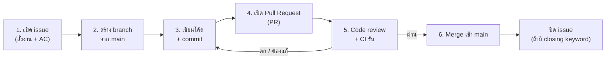
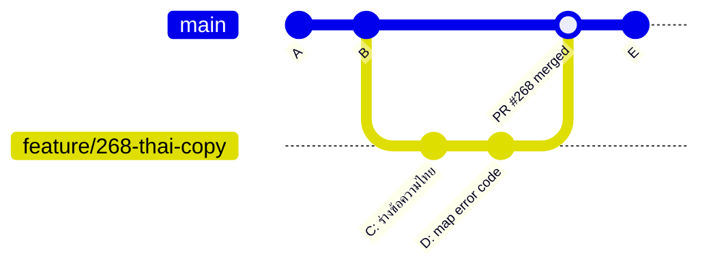
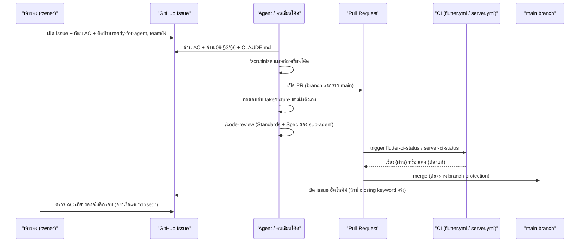

# 13 — Team Workflow: Git/PR + Decision Records

> บทนี้ตอบคำถามเดียว: **"สามคนเขียนโค้ด repo เดียวกันพร้อมกัน โดยไม่เหยียบงานกันเอง แล้วยังตรวจสอบย้อนหลังได้ว่าใครตัดสินใจอะไรตอนไหน — ทำยังไง"**

---

## 🧭 ก่อนอ่าน

- **ต้องอ่านก่อน:** [00_index.md](00_index.md) (Git พื้นฐาน: commit, branch, terminal) · [02_architecture.md](02_architecture.md) (ภาพรวมระบบ — ช่วยให้เห็นว่า "lane" ในบทนี้ตัด repo ตรงไหน)
- **เวลาที่ใช้:** ~70–90 นาที
- **อ่านจบแล้วคุณจะ…**
  - อธิบายได้ว่าทำไมทีม 3 คนต้องมี "process" ทั้งที่โค้ดคนเดียวก็เขียนได้
  - ใช้ Git ได้ลึกกว่าบท 00: commit hygiene, merge vs rebase, conflict, stacked PR
  - อ่าน GitHub flow ได้ครบวง: issue → branch → PR → review → CI → merge
  - อ่าน ADR (Architecture Decision Record) ออก และรู้ว่าทำไม "ADR ชนะเอกสารอื่นเสมอ"
  - แยกออกว่า **"PR merge แล้ว" ≠ "งานเสร็จ"** — และรู้จะเช็คของจริงตรงไหนแทนการเชื่อสถานะ GitHub เฉยๆ
  - รู้ว่า AI agent (เช่น Claude ที่เขียนโค้ดใน repo นี้) เข้ามาอยู่ตรงไหนใน workflow และทำไมต้องมีคนตรวจผลลัพธ์ทุกครั้ง

---

## 🧱 ปูพื้นฐาน

ส่วนนี้ยังไม่พูดถึงโปรเจกต์ศรีสุรัตน์ — สอน concept ทั่วไปก่อน ทุกหัวข้อจบด้วย "แล้วมันแก้ปัญหาอะไร"

### 1. ทำไมทีมต้องมี "process"

ลองนึกภาพร้านอาหารที่มีกุ๊กคนเดียว — เขาจำเองได้ว่าซอสไหนทำค้างไว้ ของสดหมดวันไหน ไม่ต้องมีใบสั่งงานเป็นกระดาษ เพราะ "ความจำ" อยู่ในหัวคนเดียว

พอร้านขยายเป็นกุ๊ก 3 คนกะเดียวกัน ปัญหาใหม่โผล่มาทันที: กุ๊กคนที่ 2 ทำซอสสูตรเดิมซ้ำโดยไม่รู้ว่าคนที่ 1 ทำไว้แล้ว (ของเสีย/ซ้ำงาน), กุ๊กคนที่ 3 หยิบวัตถุดิบที่คนที่ 1 "กันไว้" สำหรับเมนูพิเศษไปใช้แบบไม่รู้ (ชนกัน), และถ้าลูกค้าท้วงติงอาหารพลาด ไม่มีใครรู้ว่าใครทำจานนั้น (ตรวจสอบย้อนหลังไม่ได้) — **process** คือกติกาที่แก้ปัญหาสามอย่างนี้: ไม่ให้ซ้ำงาน ไม่ให้ชนกัน และตรวจสอบย้อนหลังได้ว่าใครทำอะไรตอนไหนทำไม

ในการเขียนโค้ดทีม ปัญหาชุดเดียวกันเกิดขึ้น: 3 คนแก้ไฟล์เดียวกันพร้อมกัน (ชนกัน), งานซ้ำเพราะไม่รู้ว่าเพื่อนทำไปแล้ว, และหกเดือนถัดมาไม่มีใครจำได้ว่า "ทำไมตอนนั้นเลือกวิธีนี้" (ตรวจสอบย้อนหลังไม่ได้) — Git + GitHub flow + ADR คือ 3 เครื่องมือที่ตอบ 3 ปัญหานี้ตามลำดับ

### 2. Git ลึกกว่าบท 00: commit hygiene

บท 00 สอนว่า commit คือ "snapshot ของไฟล์ ณ เวลานั้น" บทนี้เพิ่มกติกาการเขียน commit ให้มีประโยชน์กับคนอื่น (**commit hygiene** — วินัยการทำ commit ให้อ่านง่ายและย้อนรอยได้):

- **1 commit = 1 การเปลี่ยนแปลงที่อธิบายได้จบในประโยคเดียว** — ถ้าต้องใช้คำว่า "และ" สองรอบในข้อความ commit (เช่น "แก้ bug A และเพิ่ม feature B และจัดฟอร์แมตไฟล์ C") แปลว่าควรแยกเป็น 3 commit
- **ข้อความ commit บอก "ทำไม" ไม่ใช่แค่ "ทำอะไร"** — โค้ด diff บอกอยู่แล้วว่าบรรทัดไหนเปลี่ยน แต่ diff ไม่บอกว่าทำไมถึงเปลี่ยน
- **อย่า commit สิ่งที่ทำให้ประวัติ (history) โกหก** — เช่น commit ที่บอกว่า "fix bug" แต่จริงๆ ไม่ได้ทดสอบว่า fix จริง

ทำไมสำคัญ: `git log`, `git blame`, `git log --grep` (ค้นหา commit จากข้อความ) คือเครื่องมือ "ตรวจสอบย้อนหลัง" ที่กล่าวถึงข้างบน — ถ้า commit message ห่วย เครื่องมือพวกนี้ก็ใช้ไม่ได้ ตัวอย่างจริงจากท้ายบทนี้ (หัวข้อ ⚠️) จะแสดงให้เห็นว่าเมื่อ commit/PR ไม่มีคำเชื่อมโยง (เช่นไม่มีคำว่า "Closes #184") เครื่องมืออัตโนมัติของ GitHub เองก็ตามรอยไม่เจอ

### 3. Branch คืออะไร (ทวนสั้นๆ) + ทำไมต้องมีมากกว่า 1 branch

**Branch** = เส้นเวลาคู่ขนานของโค้ด แยกออกจาก `main` เพื่อทำงานโดยไม่กระทบของคนอื่น แล้วค่อยเอากลับมารวม (merge) ทีหลัง — เหมือนถ่ายเอกสารต้นฉบับมาแก้ที่โต๊ะตัวเอง แล้วค่อยเอาไปเทียบ/รวมกับต้นฉบับจริงทีหลัง แทนที่จะขีดเขียนต้นฉบับตรงๆ ให้คนอื่นเห็นระหว่างที่ยังแก้ไม่เสร็จ

ในโปรเจกต์นี้ branch ที่มีอายุยืน (long-lived) มีแค่ 2 เส้นตามที่ `CLAUDE.md` ระบุ — `main` (สายที่ active) กับ `POC_sample_offline_first` (แช่แข็งไว้อ้างอิง) ส่วน branch อื่นๆ ที่เห็นใน `git branch -a` (เช่น `docs/2026-09-24-testing-tutorial-fixes`, `experiment/quality-gate`) เป็น **feature branch อายุสั้น** — เปิดเพื่อทำงานหนึ่งชิ้น แล้วลบทิ้งหลัง merge

### 4. Merge vs Rebase

ทั้งสองคำตอบคำถามเดียวกัน: "เอาการเปลี่ยนแปลงจาก branch A มารวมเข้ากับ branch B ยังไง" แต่ทำคนละท่า

**Merge** — เอา branch สองเส้นมาต่อกันตรงๆ แล้วสร้าง commit ใหม่ที่มี "พ่อ" สอง commit (merge commit) ประวัติยังเห็นว่าเคยแยกเป็นสองเส้นจริงๆ

```
main:     A---B-------M
               \     /
feature:        C---D
```

**Rebase** — "ยกเอา" commit ของ feature branch (C, D) ไปวางต่อท้าย branch หลักใหม่ทั้งหมด เหมือนไม่เคยแยกทางกันเลย ประวัติเรียบเป็นเส้นตรงเส้นเดียว

```
main:     A---B---C'---D'
```
(C' และ D' คือ C, D เวอร์ชันที่ถูกเขียนใหม่ให้ฐาน (base) เป็น B)

**ทางเลือก → ทำไมเลือกอันไหน:**

| | Merge | Rebase |
|---|---|---|
| ประวัติ | มี merge commit, เห็นว่าเคยแยกจริง | เส้นตรง เหมือนไม่เคยแยก |
| ปลอดภัยกับ branch ที่แชร์กับคนอื่น | ปลอดภัย | 🔴 อันตราย — เขียนประวัติที่คนอื่นมีอยู่แล้วใหม่ ทำให้ branch ของเขากับของเราไม่ตรงกัน |
| ใช้เมื่อไหร่ในโปรเจกต์นี้ | รวม PR เข้า `main` (GitHub ทำ merge commit ให้อัตโนมัติตอนกด "Merge pull request") | rebase **branch ของตัวเอง** ให้ตามทันของคนอื่นก่อน merge (เช่นกติกา lane B ใน `09_PHASE2_LANES.md` §6: "หนึ่ง PR หนึ่งเวอร์ชัน rebase ก่อน merge" สำหรับไฟล์ schema ที่ใช้ร่วมกัน) |

กติกาง่ายๆ ที่ใช้ได้ทุกที่: **rebase เฉพาะ branch ที่ยังไม่มีใครอื่นดึงไปใช้ (โดยเฉพาะ branch ของตัวเองที่ยังไม่เปิด PR หรือยังไม่มีคน push ทับ)** ถ้า branch นั้นแชร์กับคนอื่นแล้ว ให้ merge เท่านั้น

### 5. Conflict คืออะไร — ตัวอย่างจิ๋ว

**Conflict (การชนกัน)** เกิดเมื่อ Git รวมสองเส้นเวลาไม่ได้เอง เพราะทั้งสองฝั่งแก้ **บรรทัดเดียวกัน** ต่างกัน

ตัวอย่างสมมติ (ไม่ใช่โค้ดจริงจาก repo): สมมติไฟล์ `config.dart` บรรทัดเดียว

```dart
const int maxRetry = 3;
```

คนที่ 1 แก้บน branch ของตัวเองเป็น `const int maxRetry = 5;` คนที่ 2 แก้บน branch ของตัวเองเป็น `const int maxRetry = 10;` แล้วทั้งคู่พยายาม merge เข้า `main` — คนที่ merge ทีหลังจะเห็น Git แสดงแบบนี้:

```
<<<<<<< HEAD
const int maxRetry = 5;
=======
const int maxRetry = 10;
>>>>>>> feature/retry-tuning
```

`<<<<<<< HEAD` ถึง `=======` คือของฝั่งที่ merge เข้ามา (ปกติคือ `main` ปัจจุบัน), `=======` ถึง `>>>>>>>` คือของ branch ที่กำลังจะรวมเข้ามา — คนแก้ conflict ต้องเลือกเอง (จะเอา 5, เอา 10, หรือคุยกับอีกคนแล้วเอาค่าที่ 3) แล้วลบเครื่องหมาย `<<<<<<<`/`=======`/`>>>>>>>` ออก ก่อน commit

นี่คือเหตุผลของกติกา **"เจ้าของไฟล์" (file ownership)** ที่ `09_PHASE2_LANES.md` §6 กำหนดไว้ (อธิบายละเอียดข้างล่าง §🔍) — ถ้ารู้ล่วงหน้าว่าไฟล์ไหนใครแตะได้ conflict แบบข้างบนจะไม่เกิดตั้งแต่แรก เพราะไม่มีสองคนแก้บรรทัดเดียวกันพร้อมกัน

### 6. Stacked PR คืออะไร

**Stacked PR (PR ต่อกันเป็นชั้น)** = branch B ที่แยกออกมาจาก branch A (ซึ่งยังไม่ merge เข้า `main`) แทนที่จะแยกจาก `main` ตรงๆ — ใช้เมื่องานชิ้นใหญ่แบ่งเป็นหลาย PR เล็กที่ต้องเรียงกัน (PR 2 ต้องมีโค้ดของ PR 1 ก่อนถึงจะรันได้)

```
main ──A── (PR #1: feature-base)
             \
              B── (PR #2: feature-part2, base = feature-base ไม่ใช่ main)
```

ปัญหาที่ CLAUDE.md เตือนไว้ตรงๆ: **"Never `gh pr merge --delete-branch` on a stacked PR."** — ถ้า PR #1 merge แล้วสั่งลบ branch `feature-base` ทันที (`--delete-branch`) GitHub จะเห็นว่า branch ที่เป็น "ฐาน" ของ PR #2 หายไป แล้ว**ปิด PR #2 ให้เองโดยอัตโนมัติ** และ PR ที่ถูกปิดไปแล้วจะ**เปลี่ยน base ไม่ได้อีก** — ทางแก้ตามที่ CLAUDE.md บันทึกไว้คือ push tip เดิมของ branch กลับขึ้นไปใหม่ → `gh pr reopen` → `gh pr edit --base main` แล้วค่อยลบ branch ทั้งหมดทีเดียวหลังทั้ง stack merge ครบ

---

## 🔥 ปัญหาจริงของร้าน

ทีมนี้มี 3 คน (`NuimanLP`, `LomerAlloys`, `PattaraponKitcharoen`) ทำ repo เดียวกันที่มีทั้ง Flutter client, NestJS server และ CI/CD pipeline พร้อมกัน — ถ้าไม่มี process ปัญหาที่จะเกิดจริงคือ:

1. **สองคนแก้ `frontend/lib/data/db/database.dart` (ไฟล์ schema ของ Drift) พร้อมกัน** — ไฟล์นี้มีตัวคู่คือ `database.g.dart` ที่ Dart **generate อัตโนมัติ** (ดูบท [Database](07_database.md)) ถ้าสอง PR ต่างขยับ schema version คนละทาง generated file จะชนกันแบบกู้คืนยาก เพราะมันไม่ใช่โค้ดที่คนเขียนเอง แก้ conflict ด้วยมือแทบเป็นไปไม่ได้
2. **งานถูกมอบหมายซ้ำ หรือไม่รู้ว่าใครทำอะไรไปแล้ว** — โปรเจกต์นี้แบ่งงานเป็น "phase 2 lanes" 35 ticket คนละ 3 คน ถ้าไม่มีป้าย (label) และ issue ชัดเจน จะเดาไม่ออกว่าใครถืออะไรอยู่
3. **AI agent (Claude) เขียนโค้ดแทนคนจำนวนมากในโปรเจกต์นี้** — ถ้าไม่มีขั้นตอนตรวจสอบ (review) ก่อน merge ผลลัพธ์ที่ agent "อ้างว่าเสร็จ" อาจไม่ตรงกับที่ spec ต้องการจริง (ตัวอย่างจริงในหัวข้อ ⚠️ ท้ายบทนี้)
4. **หกเดือนถัดมา ไม่มีใครจำได้ว่าทำไมเลือก PostgreSQL แทน CouchDB** — ถ้าการตัดสินใจสำคัญไม่ถูกบันทึกเป็นลายลักษณ์อักษร คนใหม่ที่เข้ามาจะเสียเวลาถกเถียงเรื่องเดิมซ้ำ หรือแย่กว่านั้นคือย้อนกลับไปทำสิ่งที่เคยพิสูจน์แล้วว่าไม่ดี

---

## ⚖️ ทางเลือก → ทำไมเลือกอันนี้

### การประสานงานหลายคน: 3 ทางเลือก

| ทางเลือก | หน้าตา | ข้อเสีย | ทำไมไม่เลือก / เลือก |
|---|---|---|---|
| **ไม่มี process — คุยกันปากเปล่า** | แชทบอกกันว่าใครทำอะไร | จำไม่ได้, ตรวจสอบย้อนหลังไม่ได้, scale ไม่ได้เกิน 2 คน | ไม่เลือก — ทีมนี้ 3 คน + AI agent อีกหลายตัวรันขนาน |
| **ล็อกทั้งไฟล์ทั้ง repo ระหว่างมีคนแก้ (pessimistic lock)** | คล้าย Google Docs ที่ห้ามคนอื่นแก้พร้อมกัน | ทุกคนรอคิว, งานช้าลงเยอะ | ไม่เลือก — เขียนโค้ดแบบขนานไม่ได้เลย |
| **branch แยก + PR + review + CI + file ownership (GitHub flow)** | ทุกคนแก้ branch ตัวเอง, รวมกันด้วย PR ที่ตรวจก่อน merge, กติกาบอกว่าไฟล์ไหนใครแตะได้ | ต้องมีวินัยเขียน AC/PR ให้ดี, merge conflict ยังเกิดได้ถ้าแตะไฟล์เดียวกัน | **เลือก** — เพราะแก้ 3 ปัญหาจากหัวข้อ 🧱 พร้อมกัน: ทำงานขนานได้ (ไม่ต้องรอคิว) + ชนกันน้อยลง (ด้วย ownership) + ตรวจสอบย้อนหลังได้ (ด้วย PR + issue + ADR) |

เหตุผลแบบ "เพราะ X → จึงต้อง Y → ราคาที่จ่ายคือ Z": **เพราะ 3 คนต้องแก้ repo เดียวกันพร้อมกันโดยไม่รอคิว → จึงต้องแบ่งงานเป็น lane ที่มีเจ้าของไฟล์ชัดเจน (ดู §6 ของ `09_PHASE2_LANES.md`) → ราคาที่จ่ายคือ ต้องเขียนเอกสารกติกาการแบ่งงานเยอะขึ้น (ทั้งไฟล์ `09_PHASE2_LANES.md` และบล็อกมาตรฐานท้าย issue ทุกใบ) แทนที่จะปล่อยให้ทุกคนแก้ทุกที่ตามใจ**

### Rebase vs Merge สำหรับ branch ที่ใช้ร่วมกัน

ตามที่อธิบายในหัวข้อ 🧱#4: repo นี้เลือก **merge เข้า `main` เสมอ (ผ่าน PR) แต่ rebase branch ของตัวเองก่อน merge เมื่อแตะไฟล์ที่มีคนอื่นแก้ด้วย** — เกณฑ์ตัดสิน: rebase ปลอดภัยเฉพาะ branch ที่ยังไม่มีใครอื่นดึงไปใช้เท่านั้น, merge ปลอดภัยเสมอเพราะไม่เขียนประวัติใหม่ ราคาที่จ่ายของ merge คือ ประวัติ (`git log`) จะมี merge commit เกลื่อน อ่านยากกว่าเส้นตรง แต่แลกมาด้วยความปลอดภัยที่ไม่มีใคร branch หลุดจากกัน

---

## 🔍 ของจริงใน repo

### 1. GitHub flow ที่ใช้จริง: issue → branch → PR → review → CI → merge

**GitHub flow** คือชื่อเรียกรวมๆ ของขั้นตอน 6 ก้าวนี้ (ไม่ใช่เครื่องมือชิ้นเดียว แต่เป็นชื่อ pattern การทำงาน) สองคำที่ควรรู้ความหมายก่อนอ่านต่อ: **issue** (**ตั๋วงาน** — หน้าเว็บ GitHub หนึ่งหน้าต่อหนึ่งงาน บอกว่าต้องทำอะไร มี AC ให้ตรวจว่าเสร็จหรือยัง) และ **Pull Request / PR** (**คำขอรวมโค้ด** — หน้าที่รวบ commit จาก branch หนึ่งเข้า `main` พร้อมให้คนอื่น review และให้ **CI** (**Continuous Integration** — โปรแกรมที่รันทดสอบ/ตรวจโค้ดอัตโนมัติทุกครั้งที่มีคน push โค้ด แทนที่จะรอให้คนมานั่งรันเทสต์เอง อธิบายลึกในบท CI/CD `15_cicd.md`) รันตรวจก่อนกดรวมจริง):



ตัวอย่างจริงจาก repo: issue **#268** (ป้าย `ready-for-agent`, `team/1`, ชื่อ "0c `copy.phase2` — ข้อความไทยเฟส 2") — เนื้อ issue มีหัวข้อ "ทำอะไร" และ "เกณฑ์รับงาน" (Acceptance Criteria — **AC**) เป็น checklist 3 ข้อชัดเจน เช่น

```
- [ ] `02 §8.1` มีข้อความที่เจ้าของเลือกครบทุกข้อ พร้อมวันที่ตัดสิน
- [ ] `ServerErrorResolver` map 5 code ใหม่ + unit test ว่าคืนข้อความไทย ไม่ใช่ข้อความอังกฤษของ server
- [ ] ไม่มีข้อความใหม่ที่ไม่ได้อยู่ใน `02 §8.1` หลุดเข้าโค้ด
```

นี่คือรูปแบบ **AC ที่ดี**: ตรวจได้ตรงๆ ว่าผ่านหรือไม่ผ่าน (checkbox), ไม่ใช่ประโยคกว้างๆ อย่าง "ทำให้ข้อความดูดี" issue นี้ถูกปิดแล้ว (state: `CLOSED`)

### 2. Labels: `ready-for-agent`, `team/1..3`

issue #268 มี 3 ป้าย (labels): `enhancement`, `ready-for-agent`, `team/1` — ป้าย `ready-for-agent` มีคำอธิบายจริงจาก GitHub ว่า *"Spec is complete; an agent can pick this up without further triage"* (spec เขียนครบแล้ว agent หยิบไปทำได้เลยไม่ต้องถามเพิ่ม) ป้าย `team/1` อธิบายว่า *"Member 1 — transaction path (sales, returns, drawer)"*

`CLAUDE.md` เตือนตรงๆ ว่า issue ที่**ไม่มี**ป้าย `ready-for-agent` (เช่น #3/#7/#8/#9/#10 ที่เป็น parent ticket) **ห้าม implement ตรงๆ** — เพราะยังเป็นแค่หัวข้อรวม ยังไม่ได้ตัด AC ที่ตรวจได้จริง

### 3. Parent/child ticket + sub-issue

เอกสาร `phase2-lane-split-and-tickets-2026-09-16.md` §4 ระบุว่า **ทั้ง 35 ใบเป็น sub-issue ของ #243** (map ticket ใหญ่ของ phase 2 ทั้งก้อน) — โครงสร้างนี้ตอบคำถาม "งานชิ้นเล็กนี้เป็นส่วนหนึ่งของงานใหญ่อะไร" โดยไม่ต้องยัดทุกอย่างไว้ใน issue เดียวจนอ่านไม่ไหว

### 4. Code review — reviewer ดูอะไรบ้าง

`09_PHASE2_LANES.md` §10 (บล็อกมาตรฐานที่แปะท้าย**ทุก** ticket ของ phase 2) กำหนดขั้นตอนก่อนขอ review ไว้ชัดว่า **จบด้วย `/code-review`** ก่อนเสมอ:

> "จบด้วย `/code-review` — ชี้ที่ merge-base ของ `main` · สกิลจะส่ง **sub-agent สองตัวรีวิวคู่ขนาน** (Standards = มาตรฐานโค้ดของ repo นี้ · Spec = ตรงกับ issue/`08` ไหม) · แก้ทุกข้อ 🔴 ให้จบ**ก่อน**ขอคนรีวิว"

สองแกนนี้คือสิ่งที่ reviewer (ไม่ว่าคนหรือ agent) ควรตรวจเสมอ: **(1) Standards** — โค้ดตรงกับ convention ของ repo ไหม (เช่นใช้ `baht()`/`round2()` แทนพิมพ์ `'฿${...}'` ตรงๆ ตามที่ `CLAUDE.md` หัวข้อ Conventions บอก) และ **(2) Spec** — ทำตามที่ issue/สเปกสั่งจริงไหม ไม่ใช่แค่ "ดูเหมือนถูก"

### 5. Branch protection & required checks

`CLAUDE.md` บันทึกไว้ตรงๆ ว่า branch protection บน `main` ถูกตั้งตั้งแต่ 2026-09-15: *"PR required (0 approvals), the two status jobs required, no force-push/delete, admins not enforced"* — แปลว่า:

- ห้าม push ตรงเข้า `main` ต้องผ่าน PR เท่านั้น (แต่ approval count = 0 คือไม่บังคับให้มีคนกด approve ก็ merge ได้ — เพราะทีมมี 3 คน+ agent จำนวนมาก การรอ approve ทุกใบจะช้าเกิน)
- `flutter-ci-status` และ `server-ci-status` (สอง status job สรุปผล CI — อธิบายลึกในบท [CI/CD](15_cicd.md)) **ต้องเขียวก่อน merge ได้**
- ห้าม force-push และห้ามลบ `main`
- **"admins not enforced"** หมายความว่ากติกานี้ยังข้ามได้โดยเจ้าของ repo ในกรณีฉุกเฉิน — เป็น trade-off ที่ยอมรับไว้ตรงๆ ไม่ได้ปิดประตูแน่นสนิท

### 6. ADR คืออะไร และทำไม "ADR ชนะเอกสารอื่น"

**ADR (Architecture Decision Record)** = เอกสาร 1 ไฟล์ต่อ 1 การตัดสินใจสำคัญหนึ่งเรื่อง บันทึก "ทำไม" ไม่ใช่แค่ "ทำอะไร" — `docs/Backend_design/adr/README.md` อธิบายหลักการนี้ตรงๆ:

> "ไฟล์ใน `01_`–`04_` บอกว่า **ระบบเป็นยังไง** โฟลเดอร์นี้บอกว่า **ทำไมถึงเป็นแบบนั้น** — 1 ไฟล์ = 1 การตัดสินใจ เขียนตอนตัดสินใจ ไม่ใช่เขียนย้อนหลัง"

ทุก ADR มีโครง: **บริบท** (ปัญหาคืออะไร ทำไมต้องตัดสิน) → **การตัดสินใจ** (เลือกอะไร) → **ผลที่ตามมา** (consequences — ทั้งดีและราคาที่ต้องจ่าย) → **สถานะ** (`Accepted` / `Rejected` / ยังไม่เคาะ)

ตัวอย่างจริง — **ADR-0011** (`docs/Backend_design/adr/0011-monorepo.md`) ตัดสินว่า `server/` (NestJS) อยู่ repo เดียวกับ Flutter client ไม่แยก repo เหตุผลที่บันทึกไว้ตรงๆ:

> "เหตุผลหลักคือ **การแก้ API หนึ่งครั้ง = commit เดียว** ที่แตะทั้งสองฝั่ง สำหรับคนเขียนคนเดียว สิ่งนี้มีค่ามากกว่า CI ที่สะอาด"

และผลที่ตามมาที่ ADR ยอมรับตรงๆ ว่าเป็นราคาที่ต้องจ่าย: CI ต้องรองรับสอง toolchain ในไฟล์เดียว (ต้องมี `paths:` filter แยก job — ดูบท [DevOps](14_devops.md)/[CI/CD](15_cicd.md)) และข้อจำกัด path ที่ไม่ใช่ ASCII (จากบท [Frontend](04_frontend.md)) ก็ลากมาโดนฝั่ง server ไปด้วยโดยไม่ตั้งใจ

**ทำไม ADR ชนะเอกสารอื่นเสมอ**: เอกสารอย่าง `01_ARCHITECTURE.md` หรือ `CLAUDE.md` เป็น "ภาพรวม ณ ตอนที่เขียน" ซึ่งอาจตกยุคได้ (คนแก้โค้ดแล้วลืมย้อนมาอัปเดตทุกจุด) แต่ ADR คือ**บันทึกการตัดสินใจที่เขียนตอนตัดสินใจจริง** — ถ้าเอกสารสองที่ขัดกัน ADR คือแหล่งที่เชื่อถือได้กว่าเพราะมันคือ "ต้นทาง" ของกฎ ไม่ใช่สรุปที่อาจพลาดตอนย่อ กติกานี้ปรากฏซ้ำทั้งใน `CLAUDE.md` ("where a doc contradicts an ADR, the ADR wins") และใน `09_PHASE2_LANES.md` §10 ("ถ้าใบนี้ขัดกับ `08` ให้ `08` ชนะ · ถ้า `08` ขัดกับ ADR ให้ ADR ชนะ")

### 7. Handoff log คืออะไร

**Handoff log** (บันทึกส่งไม้ต่อ) คือไฟล์ markdown ใน `docs/handoff_log/` ที่บันทึกว่า "รอบทำงานนี้ทำอะไรไปบ้าง เจอปัญหาอะไร เจ้าของตัดสินอะไร" เขียนตอนจบงานแต่ละรอบ (โดยเฉพาะรอบที่ agent ทำงาน) เพื่อให้ agent/คนรอบถัดไปไม่ต้องขุดใหม่ ตัวอย่างจริงคือ `docs/handoff_log/phase2-lane-split-and-tickets-2026-09-16.md` ที่ใช้ทำบทนี้ — มีหัวข้อ "เจ้าของตัดสินอะไรบ้าง", "ที่เกือบหลุดลงไปใน AC", และ "ข้อควรระวังของรอบถัดไป" ต่างจาก ADR ตรงที่ ADR บันทึก**การตัดสินใจ 1 เรื่อง**ถาวร ส่วน handoff log บันทึก**เรื่องเล่าของรอบงานหนึ่งรอบ** (มีบริบทเวลาแน่นกว่า อ่านเป็นลำดับเหตุการณ์)

### 8. Monorepo — ADR-0011 (ย้อนดูอีกมุม: ผลต่อ workflow)

จาก §6 ข้างบน: การเป็น **monorepo** (repo เดียวเก็บทั้ง client + server + CI/CD — ตรงข้ามกับ "polyrepo" ที่แยก repo ต่อ service) ทำให้กติกา "เจ้าของไฟล์" ใน `09_PHASE2_LANES.md` §6 สำคัญกว่าปกติ เพราะทุกคนอยู่ใน repo เดียวกันหมด ไม่มีกำแพง repo ธรรมชาติมาช่วยกันคนอื่นแตะไฟล์ผิดโซนให้

### 9. Definition of Done (DoD)

**Definition of Done (DoD)** = เกณฑ์รวมที่บอกว่า "โปรเจกต์นี้/phase นี้เสร็จจริง" ต่างจาก AC ของ ticket เดี่ยวๆ ตรงที่ DoD มองภาพรวมทั้ง phase `CLAUDE.md` อ้างถึง DoD ที่ `03_ARCHITECTURE.md §8` โดยเตือนไว้เป็นประโยคซ้ำสองรอบในเอกสารว่า **"Recount the `03_ARCHITECTURE.md §8` DoD boxes before claiming phase 1 is 'done' — this sentence has gone stale twice."** — พูดง่ายๆ คือ DoD checklist เป็นของจริงที่ต้องนับใหม่ทุกครั้งก่อนพูดว่า "เสร็จแล้ว" ห้ามเชื่อสิ่งที่เอกสารเขียนไว้ก่อนหน้าเฉยๆ เพราะมันเคยผิดมาแล้วสองรอบ (นับล่าสุด 2026-09-22: 17 ช่อง ติ๊ก 16 เหลือ 1 — รอ #380)

### 10. Working agreement (`09 §10`): `/scrutinize` → code → test own-side fake → `/code-review`

นี่คือ**ขั้นตอนบังคับ**ที่แปะท้าย ticket ทุกใบของ phase 2 (`09_PHASE2_LANES.md` §10) เขียนเป็นข้อความ markdown ที่ก๊อปวางท้าย issue body ทุกใบเหมือนกันหมด สรุป 6 ก้าว:

1. **อ่านก่อนลงมือ** — อ่านหัวข้อที่ ticket อ้างถึงใน spec (`08_PHASE2_SPEC.md`), แถวของตัวเองใน `09 §3`, กติกาเจ้าของไฟล์ใน `09 §6`, และส่วนที่เกี่ยวข้องใน `CLAUDE.md` — ticket **ไม่ใช่** spec ตัวมันเอง ถ้าขัดกับ `08` ให้ `08` ชนะ ถ้า `08` ขัดกับ ADR ให้ ADR ชนะ (ลำดับศักดิ์: ADR > `08` spec > ticket)
2. **`/scrutinize` ก่อนเขียนโค้ด** — เอาแนวทางที่คิดไว้เข้า skill ตรวจก่อน: มีทางที่เล็กกว่าไหม แผนชนของจริงตรงไหน มีอะไรที่ ticket สมมติไว้แต่ไม่จริง — เจอทางง่ายกว่าให้พูดก่อน อย่าเพิ่งเขียนโค้ด
3. **เขียนโค้ดตาม `karpathy-guidelines`** — แก้เท่าที่จำเป็น ไม่เพิ่ม abstraction ให้ของที่ใช้ที่เดียว บอกสมมติฐานออกมาเป็นข้อความ ไม่ชัดให้หยุดถาม (บทนี้เองก็ตามกติกาเดียวกัน — เรียก skill นี้ก่อนเขียนบทด้วย)
4. **ทดสอบกับของฝั่งตัวเองเท่านั้น** — ใช้ fake/fixture ตามที่ `09 §4`–`§5` กำหนด ห้ามเขียน AC หรือคำอธิบาย PR ว่า "ใช้ได้กับของจริง" ตราบใดที่อีกครึ่งของ contract ยังไม่ merge (นี่คือหัวใจของการแบ่ง lane — ดู 🛠️ ข้างล่าง)
5. **จบด้วย `/code-review`** — ตามที่อธิบายใน §4 ข้างบน แก้ทุกข้อ 🔴 (severity สูงสุด) ให้จบก่อนขอคนจริงมารีวิว
6. **ปิดงาน** — ถ้า ticket นี้ตั้งกติกาใหม่ที่ ticket อื่นต้องรู้ ต้องเขียน handoff log ใหม่ + เพิ่มบรรทัด 🔴 ใน `CLAUDE.md` ใน PR เดียวกัน ห้ามตัดสินคำถามที่ติดป้าย `question` ของเจ้าของเอง และห้าม `docker compose down -v` บน daemon ที่ใช้ร่วมกัน

### 11. AI agent ในกระบวนการนี้ — AGENTS.md

โปรเจกต์นี้ใช้ Claude (AI agent) เขียนโค้ดจำนวนมาก — ไฟล์ `AGENTS.md` ที่ root ของ repo คือสำเนาแทบเหมือน `CLAUDE.md` ทุกตัวอักษร (มีจุดต่างเล็กมากคือชี้ไปยังโฟลเดอร์ `Codex-portable` แทน `claude-portable` — เพราะเป็นทางเข้าของเครื่องมือ agent คนละตัว) วางไว้ให้ agent framework อื่น (ที่มองหาไฟล์ชื่อ `AGENTS.md` ตามธรรมเนียม) อ่านกฎเดียวกับที่ Claude ใช้

**ความรับผิดชอบของคนที่มอบงานให้ agent**: `09_PHASE2_LANES.md` §10 ข้อ 5 บังคับให้ agent เรียก `/code-review` เอง**ก่อน**ขอคนตรวจ — แต่นั่นไม่ได้แปลว่าไม่ต้องมีคนตรวจอีกที เพราะ agent ตรวจสอบตัวเองมีข้อจำกัด (agent อาจ "เชื่อ" สมมติฐานผิดที่ตัวเองตั้งไว้ตอนแรกซ้ำ) หัวข้อ ⚠️ ท้ายบทนี้มีตัวอย่างจริงที่ agent เขียน PR ว่า `Closes #184` ทั้งที่ยังไม่ได้ส่งมอบสิ่งที่ ticket ขอจริง — บทเรียนตรงนี้คือ: **agent เขียนโค้ด + ทดสอบเองได้ แต่คนต้องเป็นคนสุดท้ายที่ตัดสินว่า "เสร็จ" จริงไหม โดยเทียบกับ AC ตรงๆ ไม่ใช่เชื่อคำอธิบายของ agent เฉยๆ**

---

## 🛠️ เทคนิคในบทนี้

### เทคนิค 1: Lane split (แบ่งงานตามฝั่ง client/server แทนตามคน)

**คืออะไร**: วิธีแบ่งงาน 35 ticket ของ phase 2 ให้ 3 คนโดยตัด "จุดตัด" (hub) ที่ทั้ง client และ server ต้องแตะ ออกเป็นสองครึ่งอิสระ — เหมือนสองทีมสร้างสะพานจากคนละฝั่งแม่น้ำ มาบรรจบกันตรงกลางตาม "แบบแปลน" (contract) เดียวกัน โดยไม่ต้องรอกัน

**ปัญหาที่มันแก้**: ก่อนแบ่งแบบนี้ วิธีแบ่งงานตามความถนัดปกติ (คนนี้ทำ UI ทั้งหมด คนนี้ทำ server ทั้งหมด) จะทำให้ทุก feature ที่ต้อง "client คุยกับ server" (เช่น slice #228 — sync push) กลายเป็นงานที่คนสองคนต้องนั่งรอกันทีละขั้น ถ้า server ยังไม่เสร็จ client ก็ทดสอบจริงไม่ได้ — เกิดคอขวด (bottleneck) ที่ขยายเวลาโปรเจกต์ทั้งก้อน

**ทำไมเลือกท่านี้ (เทียบกับท่าอื่น)**: ทางเลือกที่เจ้าของพิจารณา (บันทึกใน `phase2-lane-split-and-tickets-2026-09-16.md` §2) มีการแบ่งตาม "ความถนัด" ล้วนๆ (คนนี้เก่ง UI ให้ทำ UI ทุกจอ) แต่เจ้าของเลือก **"ทาง C" = ผ่าฮับตามฝั่ง client/server ก่อน แล้วค่อยจัดตามความถนัดภายในฝั่งนั้น** เหตุผลตรงจากเอกสาร: slice ที่เป็นจุดตัด (4, 8, 11, 14, 20) ถูกผ่าเป็นคู่ `-client`/`-server` คนละ lane เพื่อให้แต่ละฝั่งสร้าง**ของตัวเองเทียบ fake ของอีกฝั่ง** ได้ทันทีโดยไม่ต้องรอ

**ดียังไง / ราคาที่จ่าย**: ดี — ทำงานขนานได้จริงตั้งแต่วันแรก (`09 §7` ระบุว่า lane A/B/C เริ่มพร้อมกันได้ทันที) ราคาที่จ่าย — ต้องมี **contract** ที่ตายตัวมาก่อน (fixture JSON ชุดเดียวที่ทั้งสองฝั่งอ่าน) และมีความเสี่ยง **contract drift** (สองฝั่งเข้าใจ contract ไม่ตรงกัน) ที่ยอมรับไว้ตรงๆ ใน `09 §9`

**อยู่ตรงไหนใน repo**: `docs/Backend_design/09_PHASE2_LANES.md` §5 (ตาราง "slice ที่ถูกผ่า") และ §6 (เจ้าของไฟล์); ตัวอย่าง sub-issue ที่ถูกผ่าจริง: **#228 (client)** ↔ **#283 (server)**, **#212 (client, 13b)** ↔ **#277 (server, 13a)**, **#194 (client)** ↔ **#285 (server)**, **#193 (client)** ↔ **#287 (server)**

### เทคนิค 2: "Blocked-by ไม่ข้าม lane" — contract แทน queue

**คืออะไร**: กติกาที่บอกว่าเส้น "ticket A ต้องเสร็จก่อน ticket B ถึงจะเริ่มได้" (blocked-by) **ห้ามลากข้ามคนละ lane** — ถ้างานสอง lane ต้องเชื่อมกัน ให้เชื่อมผ่าน **contract** (fixture, interface, fake) ที่ตกลงไว้ล่วงหน้า ไม่ใช่ให้ lane หนึ่งนั่งรออีก lane

**ปัญหาที่มันแก้**: ถ้าใช้ blocked-by ข้าม lane ตรงๆ (เช่น "งาน server ของ Pattarapon ต้องเสร็จก่อน Lomer ถึงจะเริ่ม client ได้") คนหนึ่งจะกลายเป็นคอขวดของอีกคน ทั้งที่งานทั้งสองฝั่งเขียนแยกกันได้จริง ตัวอย่างตัวเลข: ถ้า lane C (17 ใบ, หนักสุด) ต้องเสร็จก่อน lane B ถึงเริ่มได้ทั้งหมด งานของ Lomer จะค้างรอ Pattarapon เกือบทั้งโปรเจกต์

**ทำไมเลือกท่านี้ (เทียบกับท่าอื่น)**: ทางเลือกอื่นคือปล่อยให้ blocked-by ข้าม lane ตามธรรมชาติของ dependency จริง (ถ้า A ต้องใช้ผลจาก B จริงๆ ก็ให้ A รอ B) แต่ทีมนี้เลือกบังคับว่า "ของข้ามlaneเป็น *contract* ไม่ใช่ *คิว*" (คำพูดตรงจาก `09 §1`) — คือแทนที่จะรอของจริงจากอีกฝั่ง ให้สร้าง fake/fixture ของอีกฝั่งขึ้นมาเองก่อน แล้วพัฒนาคู่ขนานเทียบกับ fake นั้น

**ดียังไง / ราคาที่จ่าย**: ดี — ไม่มีใครรอใคร ราคาที่จ่ายคือสิ่งที่ AC ต้องระบุตรงๆ ว่า **"ทดสอบกับ fake/fixture เท่านั้น"** (ห้ามเขียนว่า "ใช้ได้กับของจริง" — ดู working agreement ข้อ 4 ข้างบน) และงาน "integration" (เอาสอง lane มาต่อกันจริงบน `main`) **ไม่ใช่ ticket ของใครคนใดคนหนึ่ง** — ตามที่ `09 §1` บอกไว้ตรงๆ: "integration ไม่ใช่ ticket ของใคร เกิดเองบน `main` เมื่อสองครึ่ง merge · พังให้เปิด bug ให้ฝั่งที่ผิด contract" นี่คือความเสี่ยงที่ยอมรับไว้ล่วงหน้า ไม่ใช่ทำเผื่อไม่ให้พัง

**อยู่ตรงไหนใน repo**: `docs/Backend_design/09_PHASE2_LANES.md` §1 (หลักการ), §4 (contract ระหว่าง lane), §7 (ลำดับวิกฤตของแต่ละ lane วาดแยกกันชัดเจน ไม่มีเส้นข้าม lane)

### เทคนิค 3: File ownership — กันตีกันด้วยการกำหนดเจ้าของไฟล์ล่วงหน้า

**คืออะไร**: ตารางที่กำหนดว่า "ไฟล์/โฟลเดอร์นี้ lane ไหนแตะได้" ล่วงหน้าก่อนเริ่มงาน — เหมือนแบ่งโต๊ะทำงานในครัวให้แต่ละกุ๊กมีเขตของตัวเอง ไม่ต้องเดินชนกันตอนทำงานจริง

**ปัญหาที่มันแก้**: ตามตัวอย่าง conflict จิ๋วในหัวข้อ 🧱#5 — ถ้าสองคนแก้ไฟล์เดียวกันโดยไม่รู้ตัว โดยเฉพาะไฟล์ที่ merge ด้วยมือยากมาก (generated file อย่าง `database.g.dart` ที่มีหลักหมื่นบรรทัด) conflict จะกู้คืนแทบไม่ได้ `09 §11` (รอบ `/scrutinize` ก่อนออก ticket) บันทึกไว้ตรงๆ ว่าพบปัญหานี้จริงตั้งแต่ก่อนเริ่มงาน: "Drift schema มีสองเจ้าของ" (lane A ตอนแรกจะแก้ schema ใน slice 18 พร้อมกับ lane B ที่แก้ schema ใน slice 8-c/10/11-c/13b) — ถ้าไม่แก้ตั้งแต่ตอนวางแผน สอง PR จะชนกันที่ `database.dart` + `database.g.dart` ไฟล์เดียวกันแน่นอน

**ทำไมเลือกท่านี้ (เทียบกับท่าอื่น)**: ทางเลือกอื่นคือปล่อยให้เกิด conflict แล้วค่อยแก้ทีหลัง (reactive) แต่ทีมนี้เลือก**ป้องกันล่วงหน้า** (proactive) โดยส่งแผนแบ่ง lane เข้า `/scrutinize` ก่อนออก ticket จริง แล้วย้ายความเป็นเจ้าของไฟล์ schema ทั้งหมดไปอยู่ lane เดียว (lane B) ตามที่พบปัญหา

**ดียังไง / ราคาที่จ่าย**: ดี — conflict ที่กู้คืนยากแทบไม่เกิดเลยเพราะรู้ล่วงหน้าว่าใครแตะไฟล์ไหน ราคาที่จ่ายคือไฟล์บางไฟล์ที่ "เลี่ยงการใช้ร่วมไม่ได้จริงๆ" (เช่น `server/src/customers/customers.service.ts` ที่ทั้ง lane B และ lane C ต้องแก้คนละ hunk) ต้องมีกติกาพิเศษเพิ่มเติม เช่น "ใครลงก่อน rebase ให้คนหลัง" และการจองเลข migration ต่อ lane (`C = 1788652803xxx`, `B = 1788652804xxx`) เพื่อไม่ให้เลข migration ชนกันข้าม branch

**อยู่ตรงไหนใน repo**: `docs/Backend_design/09_PHASE2_LANES.md` §6 (ตารางเจ้าของไฟล์ + ไฟล์ที่เลี่ยงร่วมไม่ได้)

### ตารางสรุป

| เทคนิค | แก้ปัญหาอะไร | ราคาที่จ่าย | file |
|---|---|---|---|
| Lane split (ผ่าฮับตามฝั่ง) | คอขวดจากรองานข้าม client/server | ต้องมี contract ตายตัวก่อนเริ่ม + เสี่ยง contract drift | `docs/Backend_design/09_PHASE2_LANES.md` §5–§6 |
| Blocked-by ไม่ข้าม lane | คนหนึ่งรออีกคนทั้งโปรเจกต์ | AC ต้องยอมรับว่าทดสอบกับ fake เท่านั้น + integration เป็นความเสี่ยงที่ไม่มีเจ้าของ | `09_PHASE2_LANES.md` §1, §4, §7 |
| File ownership | merge conflict ที่กู้คืนยาก (โดยเฉพาะ generated file) | ไฟล์ที่เลี่ยงร่วมไม่ได้ต้องมีกติกา hunk พิเศษ + จองเลข migration ต่อ lane | `09_PHASE2_LANES.md` §6 |

---

## 📚 Tech stack ของบทนี้

| เครื่องมือ | หน้าที่ | ทำไมเลือก | ทางเลือกที่ไม่เลือก |
|---|---|---|---|
| **Git** | ควบคุมเวอร์ชันโค้ด, branch, merge | มาตรฐานอุตสาหกรรม, ทำงาน offline ได้ (ต่าง SVN ที่ต้องต่อ server ตลอด) | SVN (centralized, ทำงาน offline ไม่ได้เต็มที่) |
| **GitHub** | โฮสต์ repo, PR, issue, Actions (CI), branch protection | ทีมใช้อยู่แล้ว (`github.com/NuimanLP/srisurart-pos-flutter`), ผูกกับ `gh` CLI ที่ agent ใช้ตรวจสอบสถานะจริงได้ | GitLab, Bitbucket (ไม่ได้ใช้ในโปรเจกต์นี้) |
| **`gh` CLI** | คำสั่ง terminal คุย GitHub API (`gh pr list`, `gh issue view`) | ให้ agent/คนดึงสถานะ ticket/PR จริงโดยไม่ต้องเปิดเว็บ — ใช้ตรวจ "ของจริง" แทนเชื่อเอกสารเฉยๆ | เปิดเว็บ GitHub ดูเอง (ช้ากว่า, automate ไม่ได้) |
| **ADR (markdown files ใน `docs/Backend_design/adr/`)** | บันทึกการตัดสินใจสถาปัตยกรรมพร้อมเหตุผล | รูปแบบเบา (แค่ markdown) ไม่ต้องมีเครื่องมือพิเศษ อ่านง่ายจากใน repo ตรงๆ | เครื่องมือ decision-log แยก (เช่น Confluence) — จะทำให้ ADR ไม่อยู่ใกล้โค้ดที่มันอธิบาย |

---

## ⚠️ บทเรียนจากของจริง

### บทเรียน 1: `closedByPullRequestsReferences` โกหกได้ — เชื่อ GitHub เฉยๆ ไม่พอ

GitHub มีฟีเจอร์ผูก PR กับ issue อัตโนมัติถ้า PR body มีคำอย่าง `Closes #184` — แต่ `CLAUDE.md` บันทึกไว้ตรงๆ ว่า **"93 of this repo's 201 merged PRs" ไม่มี closing keyword เลย** (นับ ณ 2026-09-22, บันทึกใน `docs/handoff_log/INDEX.md`) และอีก 4 ใบใส่คำนั้นไว้ใน**หัวข้อ PR** ซึ่ง GitHub ก็ไม่อ่าน — สรุปคือ **เกือบครึ่งของ PR ที่ merge แล้ว จะดูเหมือน "ไม่เชื่อมกับ issue ไหนเลย"** ถ้าเชื่อฟีเจอร์อัตโนมัตินี้อย่างเดียว วิธีตรวจของจริงต้องใช้ `git log --all --grep` ควบคู่ (ผู้เขียนบทนี้ตรวจซ้ำวันนี้ 2026-09-25 ด้วย `gh pr list --state merged --limit 1000 --json number` ได้ **212 PR ที่ merge แล้ว** — ตัวเลขโตขึ้นจาก 201 เพราะเวลาผ่านไปอีก 3 วัน สัดส่วน 93/201 จึงเป็นภาพ ณ วันนั้น ไม่ใช่สัดส่วนปัจจุบัน)

### บทเรียน 2: "closed" ไม่เท่ากับ "done" — เคส #184

Issue **#184** (การวัด k6 load test + container RSS หลายเครื่อง) ถูก**ปิด→เปิดใหม่→ปิด สามรอบใน 2 วัน** ก่อนเจ้าของปิดเองครั้งสุดท้าย 2026-09-21 โดยที่ AC ทั้ง 4 ข้อยังไม่ติ๊กเลยสักข้อ (`CLAUDE.md`: *"do not reopen #184 (owner decision 2026-09-22)"*) ที่หนักกว่านั้นคือ PR **#357** มีข้อความ `Closes #184` ในหัวข้อ (`git log` ยืนยัน: commit `6c99a31 feat(ops): container RSS measurement monitor and distributed k6 runner for mob04 (Closes #184)`) — แต่ตามที่ `CLAUDE.md` เขียนตรงๆ **"PR #357's `Closes #184` shipped tooling + a runbook and no measurement at all"** คือ PR นั้นส่งมอบ**เครื่องมือ**สำหรับวัด แต่**ไม่ได้วัดจริง** งานวัดจริงถูกย้ายไปเป็น ticket ใหม่ **#380** ที่ยังไม่มีตัวเลขจริงสักตัว (ณ วันที่เขียนบทนี้ 2026-09-25)

**บทเรียนตรงจากประโยคใน `CLAUDE.md`:** *"never read that PR as evidence."* — คำว่า "Closes #N" ในข้อความ commit/PR เป็นแค่**คำอธิบายความตั้งใจ** ไม่ใช่**หลักฐาน**ว่าเนื้องานตรงตาม AC จริง ต้องเปิด AC ของ issue มาเทียบกับสิ่งที่ PR ส่งมอบจริงทุกครั้ง

### บทเรียน 3: ปิด ticket ด้วยมือโดยไม่มี PR แนบ — เคส #292–#296

`docs/handoff_log/INDEX.md` (รายการ 2026-09-22) บันทึกไว้ว่า **#292–#296 ถูกปิดด้วยมือโดยไม่มี PR แนบเลย** ทั้งที่งานจริงกลับไปอยู่ใน PR **#306** ซึ่งอ้างอิงแค่ `#196` ในข้อความ — ผลคือถ้าใครลอง audit ticket โดยดูแค่ "PR ไหนปิด issue นี้" จะไม่เจอ #292–#296 เชื่อมกับอะไรเลย ทั้งที่งานถูกทำจริง วิธีตรวจที่ใช้ได้จริงคือ **grep เนื้อหา PR ด้วยเลข issue ทุกแบบที่เป็นไปได้ ไม่ใช่พึ่ง GitHub auto-link อย่างเดียว** (ตามที่ `09_PHASE2_LANES.md` §12 เขียนกำกับไว้: "เทียบ `gh issue view` + `git log --grep` / merge บน `main` (ไม่เชื่อ `closedByPullRequestsReferences` อย่างเดียว)")

### บทเรียน 4: อย่าลบ branch ที่เป็นฐานของ stacked PR — และเช็คว่า merge แล้วจริงก่อนลบ branch ไหนก็ตาม

`CLAUDE.md` เตือนตรงๆ (อธิบายกลไกไว้แล้วในหัวข้อ 🧱#6): ลบ branch ที่เป็นฐานของอีก PR จะทำให้ GitHub ปิด PR นั้นให้เองและ**เปลี่ยน base ของ PR ที่ปิดไปแล้วไม่ได้อีก** — ทางแก้บันทึกไว้คือ push tip เดิมกลับ → `gh pr reopen` → `gh pr edit --base main`

เคสที่หนักกว่านั้นเกิดขึ้นจริงตอนล้าง branch ครั้งใหญ่ 2026-09-22 (44 branch remote + worktree agent ทุกตัวถูกลบทิ้ง เหลือแค่ `main` กับ `POC_sample_offline_first`) — ก่อนลบ ทีมตรวจพบว่า **2 branch ที่ไม่เคยมี PR เลย** (`research/production-host`, `research/pwa-offline-shell`) ถือเอกสารวิจัย 424 บรรทัดรวมกัน (`production-host.md` 158 บรรทัด + `pwa-offline-shell.md` 266 บรรทัด) ที่**ไม่มีสำเนาอยู่ที่ไหนอื่นเลย** — ถ้าลบตามแผนเดิม เอกสารจะหายถาวร วิธีตรวจที่ใช้จริง (ยืนยันจาก PR #386 ที่กู้เอกสารกลับมา): `git merge-base --is-ancestor <branch> origin/main` เช็คว่า branch นั้น merge เข้า main แล้วจริงหรือยัง และ `git log --all --diff-filter=A -- '<path>'` เช็คว่าไฟล์นั้นถูกเพิ่มที่ branch ไหนบ้าง (ถ้ามีที่เดียวและยังไม่ merge = ลบ branch นั้นเท่ากับลบไฟล์ถาวร) — PR #386 cherry-pick ทั้งสอง commit เข้า `main` (คง author เดิม) พร้อมแปะแบนเนอร์บอกว่าเนื้อหาในเอกสารบางส่วนตกยุคแล้ว (เช่น `production-host.md` เสนอ cloud host ที่เจ้าของตัดสินใจตรงข้ามไปแล้วตั้งแต่ 2026-09-15) ก่อนลบ branch จริง

**กติกาสรุปจากบทเรียนนี้:** ก่อนลบ branch ใดๆ ให้ถามสองคำถามเสมอ — (1) branch นี้ merge เข้า main แล้วจริงไหม (เช็คด้วย `git merge-base --is-ancestor`) และ (2) ถ้ายังไม่ merge มีไฟล์ไหนอยู่**เฉพาะ**บน branch นี้ที่จะหายไปถาวรไหม

### บทเรียน 5: ประโยคใน `CLAUDE.md` เอง "ตกยุค" ได้ — ต้องนับใหม่ ไม่ใช่เชื่อของเก่า

`CLAUDE.md` มีประโยคเตือนตัวเองตรงๆ ว่า **"Recount the `03_ARCHITECTURE.md §8` DoD boxes before claiming phase 1 is 'done' — this sentence has gone stale twice."** — คือแม้แต่เอกสารกลางที่ควรเป็น "แหล่งความจริงล่าสุด" ก็เคยเขียนสถานะผิดมาแล้วสองรอบ เพราะคนเขียนรอบหลังเชื่อสิ่งที่รอบก่อนเขียนไว้แทนที่จะนับ checklist ใหม่จริงๆ บทเรียนนี้คือเหตุผลที่บทนี้เอง (ตามกติกา Truth rules ของชุดเอกสาร study) ต้องเปิดไฟล์อ่านสดทุกครั้งแทนที่จะอ้างอิงความจำจากบทอื่นที่เคยอ่านผ่าน

---

## Mermaid: gitGraph ของ feature branch + PR



## Mermaid: ticket lifecycle เต็มวง



---

## ✅ สรุป

- ทีมต้องมี process เพราะเขียนโค้ดคนเดียวไม่มีปัญหาชนกัน/ซ้ำงาน/ลืม แต่หลายคนมีทั้งสามปัญหา
- **Merge** ปลอดภัยกับ branch ที่แชร์กับคนอื่นเสมอ **Rebase** ใช้ได้เฉพาะ branch ของตัวเองที่ยังไม่มีใครดึงไปใช้
- **Conflict** เกิดเมื่อสองฝั่งแก้บรรทัดเดียวกันต่างกัน — ป้องกันล่วงหน้าได้ด้วย **file ownership**
- **Stacked PR** ห้ามลบ branch ฐานด้วย `--delete-branch` ก่อนทั้ง stack merge ครบ
- **GitHub flow**: issue (มี AC ตรวจได้จริง) → branch → PR → review (Standards + Spec) → CI (branch protection บังคับ) → merge
- **ADR ชนะเอกสารอื่นเสมอ** เพราะมันคือบันทึกการตัดสินใจที่เขียนตอนตัดสินใจจริง ไม่ใช่สรุปที่อาจตกยุค
- **Lane split + "blocked-by ไม่ข้าม lane" + file ownership** คือสามกลไกที่ทำให้ 3 คนทำงานขนานได้จริงในงาน phase 2 ที่มี 35 ticket
- **"Closed" ไม่เท่ากับ "done"** — ต้องเทียบ AC กับของจริงเสมอ อย่าเชื่อ label/status ของ GitHub หรือคำอธิบายของ agent เฉยๆ (เคส #184, #292–#296, `closedByPullRequestsReferences`)

---

## ❓ Quiz

<details><summary>1. ทำไม repo นี้เลือก merge PR เข้า `main` เสมอ (ไม่ rebase `main`) แต่กลับแนะนำให้ rebase branch ของตัวเองก่อน merge เมื่อแตะไฟล์ schema ร่วมกัน?</summary>

เพราะ rebase เขียนประวัติ (history) ของ commit ใหม่ — ถ้า rebase branch ที่คนอื่นมีสำเนาอยู่แล้ว (เช่น `main` ที่ทุกคนดึงไปใช้) จะทำให้ประวัติของทุกคนไม่ตรงกัน ปลอดภัยเฉพาะ rebase branch ของตัวเองที่ยังไม่มีใครอื่นดึงไปใช้ ส่วนการ rebase ก่อน merge (เช่นไฟล์ `database.dart`) ทำเพื่อให้แน่ใจว่า generated file (`database.g.dart`) ถูก regenerate ทับบนโค้ดล่าสุดก่อน ลด conflict ที่กู้คืนยาก

</details>

<details><summary>2. ถ้า PR A เป็นฐาน (base) ของ PR B (stacked PR) แล้วมีคนสั่ง `gh pr merge A --delete-branch` จะเกิดอะไรขึ้นกับ PR B และแก้ยังไง?</summary>

GitHub จะเห็นว่า branch ที่ PR B ใช้เป็นฐานหายไป แล้วปิด PR B ให้อัตโนมัติ — PR ที่ถูกปิดไปแล้วเปลี่ยน base ไม่ได้อีก วิธีแก้คือ push tip เดิมของ branch กลับขึ้นไปใหม่ → `gh pr reopen` → `gh pr edit --base main` แล้วค่อยลบ branch ทั้งหมดทีเดียวหลังทั้ง stack merge ครบ (ห้ามใช้ `--delete-branch` กับ stacked PR)

</details>

<details><summary>3. ทำไม `09_PHASE2_LANES.md` ถึงห้าม blocked-by ลากข้าม lane และให้ใช้ "contract" แทน?</summary>

ถ้า blocked-by ข้าม lane ตรงๆ คนหนึ่งจะกลายเป็นคอขวดของอีกคน (ต้องรอกันเป็นทอดๆ) ทั้งที่งานสองฝั่งเขียนแยกกันได้จริงถ้ามีข้อตกลง (contract) ล่วงหน้าว่าอีกฝั่งจะส่งอะไรมาให้ในรูปแบบไหน — การแบ่งงานตาม lane split (client/server) แล้วให้แต่ละฝั่งพัฒนาคู่ขนานกับ fake/fixture ของอีกฝั่ง ทำให้ทั้งสามคนทำงานพร้อมกันได้ตั้งแต่วันแรกโดยไม่ต้องรอ

</details>

<details><summary>4. ทำไม "PR merge แล้วเข้า main" ไม่เท่ากับ "AC ของ issue เสร็จจริง"? ยกตัวอย่างจากบทนี้</summary>

เพราะ PR อาจ merge โค้ดเข้าไปจริง แต่โค้ดนั้นอาจไม่ตรงกับสิ่งที่ AC เรียกร้องครบทุกข้อ — ตัวอย่างจากบทนี้: PR #357 มีข้อความ `Closes #184` ในหัวเรื่องและ merge เข้า `main` จริง แต่ส่งมอบแค่เครื่องมือวัด (tooling) กับ runbook ไม่ได้วัดค่าจริงตามที่ AC ของ #184 ต้องการ — `CLAUDE.md` เตือนตรงๆ ว่า "never read that PR as evidence" งานวัดจริงถูกย้ายไปเปิดใหม่เป็น #380

</details>

<details><summary>5. ทำไมก่อนลบ branch ต้องเช็คด้วย `git merge-base --is-ancestor` เสมอ ไม่ใช่แค่ดูว่า branch นั้น "เก่า" หรือไม่มีคนทำงานต่อแล้ว?</summary>

เพราะ branch ที่ดู "เก่า/ไม่มีคนแตะ" อาจไม่เคยถูก merge เข้า `main` เลย ถ้าไฟล์บางไฟล์ถูกเพิ่มไว้บน branch นั้นที่เดียวและไม่มีสำเนาอยู่ที่อื่น การลบ branch จะลบไฟล์นั้นถาวร — เคสจริงคือ `research/production-host` และ `research/pwa-offline-shell` เกือบถูกลบทิ้งพร้อมเอกสาร 424 บรรทัด เพราะไม่เคยเปิด PR เลย `git merge-base --is-ancestor <branch> origin/main` คือคำสั่งที่ตรวจสอบ "merge แล้วจริงไหม" อย่างเป็นกลาง ไม่ต้องเดาจากอายุ branch

</details>

<details><summary>6. ในฐานะคนมอบงานให้ AI agent เขียนโค้ด ทำไมยังต้องตรวจผลลัพธ์เองแม้ agent จะเรียก `/code-review` (Standards + Spec) ก่อนส่งงานแล้ว?</summary>

เพราะ `/code-review` เป็นการตรวจสอบที่ agent ทำกับตัวเอง (หรือ sub-agent ที่ยังทำงานภายใต้บริบท/สมมติฐานเดียวกัน) ซึ่งอาจพลาดจุดที่ agent เข้าใจ spec ผิดตั้งแต่ต้น หรือ "เชื่อ" ว่าทำครบแล้วทั้งที่ยังไม่ครบ (เหมือนเคส PR #357 ที่ผูก `Closes #184` แต่ไม่ได้ส่งมอบสิ่งที่ AC ต้องการจริง) — คนที่มอบงานต้องเป็นคนสุดท้ายที่เทียบ AC ของ issue กับสิ่งที่ PR ส่งมอบจริงตรงๆ ไม่ใช่เชื่อคำอธิบายหรือสถานะ "closed"/"merged" เฉยๆ

</details>

---

## ➡️ อ่านต่อ

- บทถัดไป: **DevOps** ([14_devops.md](14_devops.md)) — Docker, Compose, Nginx, Ansible, Prometheus/Grafana, GHCR, Trivy ที่ workflow ในบทนี้ (PR merge เข้า `main`) ไปกระตุ้นให้ทำงานต่อ
- อยากเจาะลึก process ของ phase 2 เต็มๆ: `docs/Backend_design/09_PHASE2_LANES.md` (ตาราง ticket ครบ 35 ใบ + contract + เจ้าของไฟล์)
- อยากอ่านเรื่องเล่ารอบแบ่งงานจริง: `docs/handoff_log/phase2-lane-split-and-tickets-2026-09-16.md`
- อยากเข้าใจ ADR ทั้งหมดของโปรเจกต์: `docs/Backend_design/adr/README.md`
- อยากรู้ว่า monorepo ตัดสินใจยังไง: `docs/Backend_design/adr/0011-monorepo.md`
