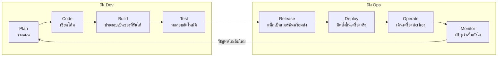

# 14 — DevOps: pipeline + infrastructure ที่ทำให้โค้ดวิ่งได้จริง

บทนี้ตอบคำถาม: "โค้ดที่เขียนเสร็จบนเครื่องเรา ต้องผ่านอะไรบ้างกว่าจะเป็นระบบที่ร้านใช้ได้จริง และเครื่องมือ/โครงสร้างพื้นฐานที่ใช้ทำเรื่องนั้นทำงานยังไง"

---

## 🧭 ก่อนอ่าน

- **ต้องอ่านมาก่อน:** [00_index.md](00_index.md) (client/server, HTTP, terminal, Git), [02_architecture.md](02_architecture.md) (ภาพรวม Nginx/NestJS×3/Postgres/Redis/etcd), และควรผ่าน [06_backend.md](06_backend.md) มาบ้าง (จะเจอคำว่า tenant, migration)
- **เวลาที่ใช้:** ~50–70 นาที
- **อ่านจบแล้วคุณจะ…**
  - อธิบายได้ว่า "works on my machine" คือปัญหาอะไร และ DevOps แก้ตรงไหน
  - วาด infinity loop ของ DevOps ได้เอง พร้อมบอกว่าแต่ละ stage ของโปรเจกต์นี้ใช้เครื่องมืออะไร
  - แยกความต่างของ server/VM/container ได้ด้วย analogy ของตัวเอง
  - อธิบาย image vs container vs registry, multi-stage Dockerfile, compose, secret ผ่าน `.env` ได้
  - อ่าน config จริงของ repo (`server/Dockerfile`, `docker-compose.yml`, Ansible, Prometheus/Grafana) และรู้ว่าทำไมเขียนท่านั้น
  - บอกสถานะจริงของ deploy ได้ตรงๆ — ไม่ใช่แค่ "deploy อัตโนมัติแล้ว"

บทนี้ **ไม่ลง** รายละเอียด GitHub Actions workflow ทีละ stage พร้อม log จริง — เรื่องนั้นเป็นของบท [15_cicd.md](15_cicd.md) บทนี้พูดถึง CI/CD แค่ในฐานะ "หนึ่ง stage ในวงจร DevOps ทั้งหมด" แล้วโฟกัสที่ตัวโครงสร้างพื้นฐาน (infra) และเครื่องมือรอบๆ มัน

---

## 🧱 ปูพื้นฐาน

### 1. ปัญหาที่มาก่อนคำว่า DevOps: "It works on my machine"

ลองนึกภาพ: นักพัฒนาคนหนึ่งเขียนโค้ดเสร็จ รันบนเครื่องตัวเองได้ปกติ ส่งให้เพื่อนอีกคนลองรัน — พัง เพื่อนถามว่าทำไม เขาตอบว่า **"แต่มันรันได้บนเครื่องผม (works on my machine)"**

ปัญหานี้เกิดจากความต่างเล็กๆ ที่คนไม่ทันสังเกต: เวอร์ชัน Node.js ต่างกัน, ลืมตั้งค่า environment variable บางตัว, ไฟล์ config ที่เครื่องคนแรกมีอยู่แล้วแต่ไม่ได้ commit เข้า Git, ระบบปฏิบัติการคนละตัว (Windows vs Linux) ที่จัดการ path ไม่เหมือนกัน — ทีละอย่างดูเล็กน้อย แต่รวมกันแล้วทำให้ "โปรแกรมเดียวกัน" กลายเป็นคนละพฤติกรรมในสองเครื่อง

ยิ่งระบบมีหลายส่วน (โปรเจกต์นี้มี Flutter + NestJS + PostgreSQL + Redis + etcd + Nginx) ยิ่งมีจุดที่ "เครื่องคนละเครื่องต่างกัน" ได้มากขึ้นเป็นทวีคูณ — และถ้าปัญหาโผล่ตอน deploy ขึ้นเครื่องจริงแล้วร้านกำลังรอขายของอยู่ ความเสียหายมันมากกว่าตอนเจอในเครื่อง dev เยอะ

### 2. กำแพงระหว่าง Dev กับ Ops → วัฒนธรรม DevOps

องค์กรไอทีดั้งเดิมมักแบ่งงานเป็นสองทีมที่มีเป้าหมายขัดกัน:

- **Dev (นักพัฒนา)** อยากปล่อยฟีเจอร์ใหม่บ่อยๆ เร็วๆ
- **Ops (ผู้ดูแลระบบ)** อยากให้ระบบ**นิ่ง** ไม่พัง — ยิ่งเปลี่ยนน้อยยิ่งเสี่ยงน้อย

สองเป้าหมายนี้ชนกัน: Dev โยนโค้ดข้ามกำแพงมาให้ Ops deploy แล้วก็จบหน้าที่ตัวเอง ถ้าพังกลางดึก Ops ต้องรับผิดชอบคนเดียวโดยไม่รู้ว่าโค้ดข้างในทำอะไร — เหมือนคนสร้างบ้าน (Dev) ส่งบ้านให้คนดูแล (Ops) โดยไม่บอกแบบแปลนอะไรเลย พอท่อน้ำแตกกลางดึก คนดูแลบ้านก็ไม่รู้ว่าท่อเดินสายไหน

**DevOps** (คำผสมจาก Development + Operations) ไม่ใช่ชื่อเครื่องมือตัวใดตัวหนึ่ง แต่เป็น**แนวคิด/วัฒนธรรม**ที่บอกว่า: คนเขียนโค้ดกับคนดูแลระบบควรทำงานเป็นทีมเดียวกัน ร่วมรับผิดชอบตั้งแต่ "เขียน" ไปจนถึง "ดูมันทำงานจริงบน production" — และเพื่อให้ทำงานร่วมกันได้อย่างสม่ำเสมอ (ไม่ใช่ทำมือทุกครั้งแล้วพลาดบ้าง) จึง**อัตโนมัติ**ทุกขั้นตอนที่ทำซ้ำได้ (build, test, deploy) ด้วยเครื่องมือ — นี่คือที่มาของทุกอย่างในบทนี้และบท 15

ในโปรเจกต์นี้ กติกาที่ยึดถือ (`docs/Backend_design/09_PHASE2_LANES.md §10`) คือ **ทุกคนในทีมต้องแตะทั้ง frontend, backend และ CI/CD** — ไม่มีใครเป็น "คนดูแล infra คนเดียว" — ตรงกับปรัชญา DevOps ข้อนี้พอดี

### 3. Infinity loop — วงจร DevOps ทั้งวง

ภาพที่ใช้อธิบาย DevOps บ่อยที่สุดคือ**เลขแปดนอน (infinity loop)** เพราะงานไม่ได้จบแล้วจบเลย มันวนกลับมาเริ่มใหม่ตลอด:



แต่ละขั้นตอบคำถามหนึ่งข้อ:

| ขั้น | คำถามที่ตอบ | ในโปรเจกต์นี้คือ |
|---|---|---|
| Plan | จะทำอะไร | GitHub Issue (`#380`, `#67` ฯลฯ) |
| Code | เขียนยังไง | โค้ดใน `frontend/`, `server/` |
| Build | ประกอบเป็นของที่รันได้ยังไง | Docker image จาก `server/Dockerfile`, `deploy/web.Dockerfile` |
| Test | มั่นใจได้ยังไงว่าไม่พัง | `pnpm test`, `flutter test`, GitHub Actions (บท 15) |
| Release | แพ็กเป็นเวอร์ชันที่ระบุตัวได้ยังไง | image ที่ tag ด้วย SHA แล้ว push ขึ้น **GHCR** |
| Deploy | เอาไปติดตั้งบนเครื่องจริงยังไง | **Ansible** playbook บน VM `mob04` |
| Operate | เดินเครื่องต่อเนื่องยังไง | Docker Compose คุมทั้ง stack, healthcheck, restart policy |
| Monitor | รู้ได้ยังไงว่ามันโอเคอยู่ | **Prometheus + Grafana** |

บทนี้ (14) เดินตามวงนี้ทีละขั้น ยกเว้นราย-ละเอียดของ Build+Test ฝั่ง CI ที่ยกไปบท 15 ทั้งหมด

---

## 🔥 ปัญหาจริงของร้าน

ร้านศรีสุรัตน์เดิมทีเป็นเว็บ React รันในเบราว์เซอร์เดียว ไม่มีแนวคิด "deploy" เลย — เปิดไฟล์ HTML ก็ใช้ได้ พอระบบขยายเป็น **multi-tenant** (backend NestJS จริง คุยกับ PostgreSQL) เกิดปัญหาใหม่ที่ไม่เคยมี:

1. **ระบบมีหลายชิ้นที่ต้องรันพร้อมกัน** — NestJS 3 ชุด (`api-1/2/3`), PostgreSQL, Redis 2 ตัว, etcd, worker, Nginx ต้องตั้งค่าให้ประสานกันถูกต้อง ทำมือทุกครั้งไม่ไหวและพลาดง่าย
2. **เครื่องพัฒนา ≠ เครื่องจริง** — เครื่อง dev ของแต่ละคน (Windows/Mac คนละรุ่น) ต้องได้ผลเหมือนกับเครื่อง VM ของคณะที่จะรัน production จริง
3. **ต้องพิสูจน์ให้อาจารย์เห็นว่าใช้ครบ 7 บล็อกของกระบวนการ DevOps** ตามที่กำหนดไว้ในคอร์ส (Code & SCM / Build & Test / Security Scan / Package & Storage / Config & Deploy / KV Storage / Monitoring — `docs/Backend_design/adr/0013-cicd-toolchain.md`)
4. **VM ที่มีจริงมีทรัพยากรจำกัดมาก** — `mob04` มีแค่ 4 vCPU และ **RAM 6 GB** ต้องรันทุกอย่างพร้อมกันในงบนี้

ข้อจำกัดข้อ 4 นี้เป็นแกนสำคัญของการเลือกเครื่องมือเกือบทุกตัวในบทนี้ — จะเห็นซ้ำๆ ว่าทางเลือกที่ "ดีกว่าในทางทฤษฎี" มักถูกปฏิเสธเพราะกิน RAM เกินงบ

---

## ⚖️ ทางเลือก → ทำไมเลือกอันนี้

### เครื่อง (compute): server จริง vs VM vs container

> **Analogy — บ้าน / คอนโด / ห้องเช่า:**
> - **Server จริง (physical server)** = **บ้านเดี่ยว** ทั้งหลัง — ซื้อที่ดินเอง สร้างเอง ดูแลทุกอย่างเอง (ไฟ น้ำ โครงสร้าง) แพงและใช้เวลาสร้างนาน แต่ควบคุมได้เต็มที่
> - **VM (Virtual Machine)** = **ห้องคอนโด** — ตึกเดียวกัน (เครื่องจริงเดียวกัน) แบ่งเป็นหลายห้อง แต่ละห้องมี "ผนัง" กั้นแยกกันจริง (ระบบปฏิบัติการของใครของมัน) ห้องหนึ่งเสีย อีกห้องไม่กระทบ แต่กว่าจะเนรมิตห้องใหม่ก็ยังช้า (ต้องติดตั้ง OS ทั้งชุด)
> - **Container** = **ห้องเช่าแบบแบ่งพาร์ทิชันในโกดังเดียว** — ใช้ "โครงสร้าง" (ระบบปฏิบัติการ, kernel) ร่วมกับห้องข้างๆ ทั้งหมด กั้นแค่ผนังเบาๆ (namespace/cgroup ของ Linux) เนรมิตห้องใหม่หรือรื้อทิ้งได้ในไม่กี่วินาที เบากว่ามาก แต่ผนังบางกว่า VM

| | Server จริง | VM | Container |
|---|---|---|---|
| แยกจากกันแค่ไหน | สมบูรณ์ที่สุด (คนละเครื่อง) | มี OS แยกกันจริง | ใช้ kernel ร่วมกัน |
| เวลาสร้างใหม่ | เป็นวัน/สัปดาห์ | นาที | วินาที |
| น้ำหนัก (ใช้ทรัพยากร) | มากที่สุด | หนัก (ต้องรัน OS เต็มทุกตัว) | เบา |
| ใช้ในโปรเจกต์นี้ | ❌ ไม่มี | ✅ `mob04` คือ VM ของคณะ 1 ตัว | ✅ ทุก service (Nginx, api, Postgres, …) เป็น container บน VM นั้น |

**ตัดสิน:** โปรเจกต์นี้ได้ **1 VM ตัวเดียว** จากคณะ (`mob04`, 4 vCPU / 6 GB) ไม่มีทางเลือกเรื่อง server จริง แล้วภายใน VM ตัวนั้นรันทุกอย่างเป็น **container** ผ่าน Docker — เพราะ **จึง**ต้องยัดหลาย service (Postgres, Redis×2, etcd, NestJS×3, Nginx, worker, monitoring) ลงเครื่องเดียว container คือทางเดียวที่ทำให้แต่ละ service แยกสภาพแวดล้อมกัน (เวอร์ชันไลบรารีไม่ชนกัน) โดยไม่ต้องมี VM ย่อยอีกชั้น (ซึ่งจะกิน RAM ซ้ำซ้อนจนเกินงบ 6 GB ทันที) — **ราคาที่จ่าย:** ทุก container แชร์ kernel เดียวกับ VM แม่ ถ้า kernel มีช่องโหว่ กระทบทุก container พร้อมกัน — เป็นเหตุผลหนึ่งที่ไม่เปิด service ไหนออกอินเทอร์เน็ตโดยตรง (ufw เปิดแค่ 22/80/443)

### Docker image vs container vs registry

> **Analogy — แม่พิมพ์ขนม / ขนม / ร้านขายแม่พิมพ์:**
> - **Image** (อิมเมจ) = **แม่พิมพ์ขนม** — สูตร+รูปทรงที่ตายตัว ก๊อปกี่ครั้งก็ได้แม่พิมพ์เหมือนเดิมทุกอัน
> - **Container** = **ขนมที่อบออกมาจากแม่พิมพ์** — รันจริง กินได้จริง (= process ที่ทำงานอยู่จริง) แม่พิมพ์เดียวกันอบขนมพร้อมกันได้หลายชิ้น (เหมือน `api-1/api-2/api-3` ที่มาจาก **image เดียวกัน** — ดูบท 02)
> - **Registry** = **ร้านขายแม่พิมพ์** — ที่เก็บแม่พิมพ์กลาง ใครมี "ที่อยู่ร้าน" ก็ไปหยิบแม่พิมพ์มาอบขนมที่บ้านตัวเองได้ ไม่ต้องแกะแม่พิมพ์เอง

ในโปรเจกต์นี้ registry คือ **GHCR** (GitHub Container Registry, `ghcr.io`) — CI build image เสร็จ (บท 15) แล้ว push ขึ้น GHCR, VM `mob04` แค่ "ไปหยิบแม่พิมพ์" มาอบเป็น container ของตัวเอง (`docker compose pull` แล้ว `up`) — ไม่ต้อง build เองบน VM เลย (VM มี CPU/RAM จำกัด build เองจะช้าและกิน RAM ที่ไม่มี)

### Multi-stage Dockerfile — ทำไมไม่ก๊อปทุกอย่างลง image เดียว

Dockerfile ใช้อธิบาย "วิธีอบขนมจากแม่พิมพ์" — เขียนเป็นชั้นๆ (layer) ทับกัน แต่ละคำสั่ง (`RUN`, `COPY`) สร้าง 1 layer

**ทางเลือกง่ายสุด:** เขียน Dockerfile ไฟล์เดียวจบ ติดตั้งทุกอย่าง (รวม compiler, dev tools) ไว้ใน image เดียว → image ใหญ่ อ้วน มีเครื่องมือที่ runtime ไม่ต้องใช้ (เช่น `npm`) ติดไปด้วย ซึ่งเป็นความเสี่ยงความปลอดภัยเปล่าๆ (ยิ่งมีโปรแกรมเยอะ ยิ่งมีช่องโหว่ให้สแกนเจอเยอะ)

**Multi-stage build** = เขียนหลาย "ด่าน" ในไฟล์เดียว ด่านแรกๆ ใช้ compile/build (มีเครื่องมือครบ) ด่านสุดท้าย **ก๊อปมาแค่ผลลัพธ์** (โค้ดที่ compile แล้ว + dependency ที่จำเป็นตอนรันจริง) ทิ้งเครื่องมือ build ทั้งหมดไว้ข้างหลัง — image สุดท้ายเล็กลงและปลอดภัยขึ้น

**ตัดสิน: ใช้ multi-stage** (ดูโค้ดจริงหัวข้อ "ของจริงใน repo") — เพราะห้อง Trivy scan (หัวข้อ security ด้านล่าง) บล็อกการ push image ที่มีช่องโหว่ HIGH/CRITICAL ที่แก้ได้ → **จึง**ต้องเอาเครื่องมืออย่าง `npm`/`npx` (ซึ่งพาช่องโหว่ของ dependency ทั้งต้นไม้ติดมาด้วย) ออกจาก image ที่รันจริง → ราคาที่จ่ายคือ Dockerfile อ่านยากขึ้นเล็กน้อย (ต้องตามว่า stage ไหนเป็นอะไร)

### Environment variables & secrets — ทำไมไม่ hardcode รหัสผ่านในโค้ด

**Environment variable (env var)** คือค่าที่ส่งเข้าโปรแกรมตอนรัน แทนที่จะเขียนฝังในโค้ด — เหมือนใบสั่งอาหารที่เขียนว่า "ใส่เกลือเท่าไรก็ได้ตามป้ายที่แปะไว้หน้าครัว" ไม่ใช่เขียนตายตัวในสูตร เวลาเปลี่ยนร้าน (เปลี่ยนเครื่อง/เปลี่ยนรหัสผ่าน) แค่เปลี่ยนป้าย ไม่ต้องแก้สูตร

**ทำไมไม่ hardcode:** ถ้ารหัสผ่านฐานข้อมูลอยู่ในโค้ดที่ push ขึ้น GitHub (ซึ่ง repo นี้เป็น **public**) ใครก็อ่านได้ทันที → ต้องแยกค่าลับออกจากโค้ดเสมอ ในโปรเจกต์นี้ค่าลับอยู่ในไฟล์ `server/.env` (ไม่ commit เข้า Git) และบน GitHub Environment `demo` (secret ที่เก็บฝั่ง GitHub ไม่ใช่ใน repo)

**`:?` required คืออะไร:** ใน `docker-compose.yml` เขียนแบบ `${POSTGRES_PASSWORD:?POSTGRES_PASSWORD is required}` — ถ้าตัวแปรนี้ไม่ถูกตั้งค่า Compose จะ**หยุดทันทีพร้อมข้อความ error** แทนที่จะปล่อยให้รันต่อด้วยค่าว่างเงียบๆ (ซึ่งจะพังแบบหาสาเหตุยาก) กฎ "validate input ก่อน แล้วค่อย clamp" ที่ `CLAUDE.md` เขียนไว้ท้ายเอกสาร ก็คือหลักการเดียวกัน — ดีกว่าที่จะ error ดังๆ ตอนแรก มากกว่าให้ไปพังเงียบๆ ทีหลัง

### Reverse proxy / TLS

อธิบายไว้แล้วในบท 02 (Nginx เป็นประตูเดียว, TLS = HTTP ที่เข้ารหัส) บทนี้เสริมมุม infra: Nginx เป็น container ตัวเดียวที่เปิด **port ออกสู่ VM ทั้งหมด** (80/443) ส่วน service อื่นทุกตัว (Postgres, Redis, etcd, Prometheus, Grafana) **ไม่เปิด port ออกอินเทอร์เน็ตเลย** — เข้าถึงได้แค่ผ่านเครือข่ายภายในของ Docker Compose เอง หรือผ่าน SSH tunnel เท่านั้น (ดูหัวข้อ "ของจริงใน repo")

### Infrastructure as Code (IaC) & Configuration Management: ทำไมใช้ Ansible

ทางเลือกที่คิดถึงได้สำหรับ "ตั้งค่าเครื่อง VM ให้พร้อมรัน":

| | ทำมือ (SSH เข้าไป พิมพ์คำสั่งเอง) | **Ansible** | Kubernetes |
|---|---|---|---|
| ทำซ้ำได้แม่นยำไหม | 🔴 พลาดง่าย จำไม่ครบ | 🟢 รันสคริปต์เดิมได้ทุกครั้ง | 🟢 |
| ต้องมี agent ติดตั้งล่วงหน้าบนเครื่องเป้าหมายไหม | – | ❌ ไม่ต้อง (ใช้ SSH ธรรมดา) | ✅ ต้องมี cluster |
| เหมาะกับกี่เครื่อง | เครื่องเดียวพอไหว (แต่เสี่ยง) | 1–สิบกว่าเครื่อง | หลักสิบ-ร้อยเครื่อง |
| เหมาะกับงบ VM 1 ตัว 6 GB | – | ✅ | ❌ ตัว control-plane ของ Kubernetes เองก็กิน RAM หลาย GB แล้ว |

**ตัดสิน: Ansible** (`docs/Backend_design/adr/0013-cicd-toolchain.md`) — เพราะมี VM แค่ **1 ตัว** Kubernetes จะเป็นการยกเครื่องมือบริหารร้อยเครื่องมาใช้กับเครื่องเดียว (กิน RAM เกินความจำเป็นมาก) → **จึง**เลือก Ansible ที่ทำงานผ่าน SSH ธรรมดา ไม่ต้องติดตั้งอะไรเพิ่มบนเครื่องเป้าหมาย → ราคาที่จ่าย: ต้องเขียน playbook เอง ไม่มี auto-scaling/self-healing แบบที่ Kubernetes ให้ฟรี (ซึ่งกับ 1 VM ก็ไม่มีอะไรให้ scale อยู่แล้ว)

**Idempotent** (ทำซ้ำได้ผลเดิม) คือคุณสมบัติสำคัญของทั้งสอง playbook ของโปรเจกต์นี้ — รันซ้ำกี่ครั้งก็ได้ผลลัพธ์เดิม ไม่ใช่ "รันซ้ำแล้วพัง" เช่น คำสั่งสร้าง user จะเช็คก่อนว่ามี user นั้นอยู่แล้วหรือยัง ถ้ามีแล้วก็ข้ามไปเฉยๆ ไม่ error — สำคัญเพราะการ deploy คือการรัน playbook **ซ้ำๆ ทุกครั้งที่มี release ใหม่** บนเครื่องเดิมที่มีการตั้งค่าจากรอบก่อนอยู่แล้ว

### Observability: logs vs metrics vs traces

สามวิธีมองเข้าไปในระบบที่กำลังรันอยู่ ตอบคำถามคนละแบบ:

| | Logs | Metrics | Traces |
|---|---|---|---|
| ตอบคำถาม | "เกิดอะไรขึ้นตรงนี้เป๊ะๆ" (เหตุการณ์เดี่ยว) | "ภาพรวมเป็นยังไงเมื่อเทียบกับเวลา" (ตัวเลขสะสม) | "request หนึ่งตัวเดินทางผ่านที่ไหนบ้าง" |
| รูปแบบ | ข้อความอิสระ ทีละบรรทัด | ตัวเลข + label เก็บตามช่วงเวลา | ลำดับ span ข้าม service |
| ตัวอย่างในโปรเจกต์นี้ | log บอก error ตอน request หนึ่งพัง | `http_requests_total`, `http_request_duration_seconds` | ยังไม่มีในโปรเจกต์นี้ |

**ทำไมโปรเจกต์นี้เลือกทำแค่ metrics (ไม่มี tracing แยก, log ยังไม่รวมศูนย์):** งบ RAM ของ VM 6 GB ไม่พอสำหรับระบบ log รวมศูนย์แบบหนัก (ดูหัวข้อ "ทางเลือกที่ถูกปฏิเสธ" ด้านล่าง) และระบบยังเป็นแค่ 1 VM ไม่มีหลายเครื่องที่ request วิ่งข้ามจริงจนต้องใช้ tracing

**Prometheus แบบ pull model:** ต่างจากระบบ log ทั่วไปที่ "ผู้ส่ง" ยิงข้อมูลเข้าหาศูนย์กลาง (**push**) — Prometheus ทำตรงข้าม: มันเป็นฝ่าย**เดินไปถาม** (**pull**) แต่ละ service เองเป็นระยะๆ ผ่าน endpoint `/metrics` (เหมือนพนักงานตรวจสต็อกเดินไปนับของแต่ละชั้นเองตามรอบเวลา แทนที่จะให้แต่ละชั้นวิ่งมารายงานเอง) ข้อดี: service ไม่ต้องรู้จัก Prometheus เลย แค่เปิด endpoint ทิ้งไว้เฉยๆ, ถ้า Prometheus ตายไปพักหนึ่งแล้วกลับมา ก็แค่พลาดการอ่านบางรอบ ไม่มีข้อมูลค้างในคิวที่ต้องส่งซ้ำ

**SLI/SLO:** **SLI** (Service Level Indicator) คือตัวเลขที่วัดได้จริง เช่น "สัดส่วน request ที่ไม่ใช่ 5xx" **SLO** (Service Level Objective) คือเป้าที่ตั้งไว้บน SLI นั้น เช่น "อยากให้ success rate ≥ 99%" — โปรเจกต์นี้มี dashboard ที่คำนวณ SLI (success rate, p95 latency) ไว้แล้วใน Grafana แต่ยังไม่เคยประกาศตัวเลข SLO อย่างเป็นทางการ (เพราะยังไม่เคย deploy ไป production จริงให้วัดได้ยาว — ดู "บทเรียนจากของจริง")

### Backups & กฎ 3-2-1

**กฎ 3-2-1** เป็นแนวปฏิบัติมาตรฐานของการสำรองข้อมูล: มีข้อมูลอย่างน้อย **3 สำเนา**, เก็บบน **2 สื่อ/ระบบที่ต่างกัน**, และอย่างน้อย **1 สำเนาอยู่นอกสถานที่ (offsite)** — เหตุผลของข้อสุดท้าย: ถ้าสำเนาสำรองอยู่เครื่องเดียวกับต้นฉบับ เครื่องพังทีเดียวข้อมูลหายหมดทั้งคู่

โปรเจกต์นี้มี**สำเนาที่ 1 (ต้นฉบับ)** คือฐานข้อมูลบน `mob04` และมีสคริปต์สำรอง (`backup-db.sh`) ที่รันทุกคืนสร้าง **สำเนาที่ 2 บนดิสก์เดียวกันของ VM** — แต่ **สำเนาที่ 3 แบบ offsite ยังไม่มีจริง** (พูดตรงๆ ในหัวข้อ "บทเรียนจากของจริง" ด้านล่าง) นั่นแปลว่ากฎ 3-2-1 ยังทำได้แค่ครึ่งเดียว — ถ้าดิสก์ VM พังพร้อมกัน ข้อมูลร้านตัวอย่างหายหมด (ความเสี่ยงที่เจ้าของโปรเจกต์ยอมรับไว้อย่างรู้ตัว ไม่ใช่มองข้าม)

### Security scanning, supply chain, digest pinning, least privilege

- **Security scanning** (สแกนหาช่องโหว่) — ก่อนปล่อย image ต้องตรวจว่าไลบรารีข้างในมีช่องโหว่ที่รู้จักแล้วหรือไม่ (**Trivy** ในโปรเจกต์นี้)
- **Supply chain** (ห่วงโซ่อุปทานของซอฟต์แวร์) — โค้ดของเราไม่ได้มีแค่ที่เราเขียนเอง มันดึง dependency มาจากคนอื่นเป็นทอดๆ (`node:22-alpine` มาจากคนอื่น, npm package มาจากคนอื่นอีกที) แต่ละทอดคือจุดที่อาจมีปัญหาซ่อนอยู่ — "ห่วงโซ่" นี้ต้องได้รับการตรวจสอบเหมือนกับโค้ดของเราเอง
- **Digest pinning** (ปักหมุดด้วย digest) — ปกติเราอ้าง image ด้วย **tag** เช่น `node:22-alpine` แต่ tag เป็นชื่อที่ **ขยับได้** (ผู้ดูแล image อาจอัปเดตของข้างในโดยไม่เปลี่ยนชื่อ tag) ทำให้ build วันนี้กับ build เดือนหน้าอาจได้ของไม่เหมือนกันทั้งที่เขียน `node:22-alpine` เหมือนเดิม **digest** (แฮชที่ระบุเนื้อหาไฟล์แบบเป๊ะๆ เช่น `sha256:c610fcd...`) ไม่เปลี่ยนตามเวลา — ปักด้วย digest แล้ว build ซ้ำเมื่อไรก็ได้ image เดียวกันเป๊ะ (**reproducibility** — ทำซ้ำได้ผลเดิม)
- **Least privilege** (สิทธิ์น้อยที่สุดที่พอใช้งาน) — ให้แต่ละส่วนมีสิทธิ์แค่เท่าที่จำเป็น เช่น container รันด้วย `USER node` (ไม่ใช่ root), user `deploy` บน VM เข้าเขียนได้แค่ `/opt/pos` ไม่มี `sudo`

---

## 🔍 ของจริงใน repo

### 1. `server/Dockerfile` — multi-stage จริง

`server/Dockerfile:1-36`

```dockerfile
# syntax=docker/dockerfile:1
FROM node:22-alpine@sha256:c610fcdfb1d5b4740dd70c284ed3cb16bb857e0f7166196e36a5501df7a3aa32 AS deps
RUN corepack enable
WORKDIR /app
COPY package.json pnpm-lock.yaml ./
RUN pnpm install --frozen-lockfile

FROM deps AS build
COPY tsconfig.json tsconfig.build.json nest-cli.json ./
COPY src ./src
RUN pnpm build && pnpm prune --prod

# node:22-alpine — same digest as the deps stage above.
FROM node:22-alpine@sha256:c610fcdfb1d5b4740dd70c284ed3cb16bb857e0f7166196e36a5501df7a3aa32 AS runtime
ENV NODE_ENV=production
WORKDIR /app
RUN apk upgrade --no-cache \
 && rm -rf /usr/local/lib/node_modules/npm /usr/local/lib/node_modules/corepack \
           /usr/local/bin/npm /usr/local/bin/npx /usr/local/bin/corepack
USER node
COPY --from=build --chown=node:node /app/node_modules ./node_modules
COPY --from=build --chown=node:node /app/dist ./dist
COPY --chown=node:node package.json ./
EXPOSE 3000
CMD ["node", "dist/main.js"]
```

- **ทำอะไร:** สามด่าน — `deps` (ติดตั้ง dependency), `build` (คอมไพล์ TypeScript เป็น `dist/`), `runtime` (image ที่จะรันจริง มีแค่ผลลัพธ์ที่ compile แล้ว)
- **เชื่อมกับอะไร:** image นี้คือ "แม่พิมพ์" เดียวที่ `api-1/api-2/api-3` ทั้งสามใน `docker-compose.yml` ใช้ร่วมกัน (บท 02) — เปลี่ยนโค้ดที `docker compose build` ครั้งเดียว ได้ image ใหม่ที่ทุก instance ใช้พร้อมกัน
- **ทำไมท่านี้:** `FROM node:22-alpine@sha256:...` ปักด้วย digest ไม่ใช่แค่ tag `node:22-alpine` (เหตุผล digest pinning ด้านบน) · `rm -rf` npm/npx/corepack ในด่าน `runtime` **ก่อน** `USER node` (ต้องทำตอนยังเป็น root เพราะไฟล์พวกนี้เจ้าของเป็น root) เพราะ runtime ไม่มีอะไรเรียก `npm` เลย (`CMD` เป็น `node dist/main.js` ตรงๆ, healthcheck ใช้ `wget`) การถอด npm ออกคือการถอด "ต้นไม้ dependency" ทั้งชุดของ npm เองที่ไม่มีใครใช้ตอนรันจริง — เหลือแต่ช่องโหว่ของแอปเราเองให้ Trivy สแกน · `apk upgrade --no-cache` แก้ CVE ของแพ็กเกจ OS (Alpine) เอง
- **ถ้าไม่ทำ:** ถ้าไม่ตัด npm ออก Trivy จะเจอช่องโหว่ HIGH/CRITICAL จากต้นไม้ dependency ของ npm เอง (ที่ไม่เกี่ยวกับแอปเราเลย) แล้ว **บล็อกการ push image ขึ้น GHCR** (นโยบายจริงของ CI — ดูบท 15) ถ้าไม่ปักด้วย digest การ build วันนี้กับเดือนหน้าอาจได้ image คนละตัวทั้งที่โค้ดเราไม่เปลี่ยนเลย ทำให้ debug ยากขึ้นเวลาพฤติกรรมเปลี่ยนโดยไม่มีใครแก้อะไร

### 2. `deploy/web.Dockerfile` — image ที่ไม่มีเซิร์ฟเวอร์อยู่ข้างใน

`deploy/web.Dockerfile:1-14`

```dockerfile
FROM busybox:stable-musl@sha256:3c6ae8008e2c2eedd141725c30b20d9c36b026eb796688f88205845ef17aa213
COPY build/web /web
```

- **ทำอะไร:** image ฝั่งเว็บ **ไม่มี** web server อยู่ข้างในเลย มีแค่ไฟล์ static ของ Flutter web (`build/web`) วางอยู่ที่ path `/web`
- **ทำไมท่านี้:** เว็บให้ **Nginx ตัวเดียวกับที่เสิร์ฟ API** เป็นคนเสิร์ฟไฟล์ static (บท 02) — image นี้แค่เป็น "ภาชนะขนย้าย" ไฟล์ไปให้ container ชื่อ `web-sync` ก๊อปออกมาลง volume ที่ Nginx อ่าน (คล้ายวิธีที่ `certgen` ทำ TLS cert) ใช้ `busybox` (1.6 MB) แทน `alpine` (8.5 MB) เพราะแค่ต้องมี shell + `cp` ใช้ตอน copy ครั้งเดียว ไม่ต้องมีอะไรมากกว่านั้น (`scratch` เล็กกว่าอีกแต่ไม่มี shell เลย ใช้ไม่ได้กับขั้นตอนนี้)
- **ถ้าไม่ทำท่านี้:** ถ้า bake `nginx.conf` ลง image เว็บเอง จะมี config การรับ HTTPS/rate-limit อยู่สองที่ (ใน image เว็บ กับใน repo `server/docker/nginx/nginx.conf`) ซึ่งจะหลุดไม่ตรงกันได้ง่าย — การให้ Nginx ตัวเดียวเสิร์ฟทั้งคู่คือความตั้งใจ (ADR-0013)

### 3. `server/docker-compose.yml` — anchor, healthcheck, depends_on แบบมีเงื่อนไข

**`x-app-env` anchor** — `server/docker-compose.yml:18-50` (ตัดมาบางส่วน)

```yaml
x-app-env: &app-env
  DATABASE_URL: postgres://pos_app:${POS_APP_PASSWORD:?POS_APP_PASSWORD is required}@postgres:5432/pos
  POSTGRES_PASSWORD: ${POSTGRES_PASSWORD:?POSTGRES_PASSWORD is required}
  JWT_PLATFORM_SECRET: ${JWT_PLATFORM_SECRET:?JWT_PLATFORM_SECRET is required}
  REDIS_CACHE_URL: redis://:${REDIS_PASSWORD:?REDIS_PASSWORD is required}@redis-cache:6379
  REDIS_QUEUE_URL: redis://:${REDIS_PASSWORD:?REDIS_PASSWORD is required}@redis-queue:6379
  LOG_LEVEL: ${LOG_LEVEL:-info}
  ETCD_URL: http://etcd:2379
  ETCD_ROOT_PASSWORD: ${ETCD_ROOT_PASSWORD:?ETCD_ROOT_PASSWORD is required}
  CORS_ORIGINS: ${CORS_ORIGINS:-}
```

ใช้ที่ `server/docker-compose.yml:140,149,158` ด้วย `<<: *app-env` (ยืมมาทั้งก้อน)

- **ทำอะไร:** `&app-env` คือ **YAML anchor** — ตั้งชื่อก้อน config ไว้ครั้งเดียว แล้ว `<<: *app-env` ใน service อื่นคือ "ยืมของ" มาทั้งก้อน แทนที่จะพิมพ์ตัวแปรเดิมซ้ำในทุก service (`api-1`, `api-2`, `api-3`, `worker`)
- **ทำไมท่านี้:** `api-1/2/3` เป็น image เดียวกันและต้องได้ environment เดียวกันเป๊ะ ถ้าพิมพ์แยกกัน 3 ที่ แก้ค่าหนึ่งแล้วลืมแก้อีกสองที่คือบั๊กที่เกิดได้ง่ายมาก anchor ทำให้แก้ที่เดียวกระจายไปทุกที่ที่ใช้
- **`:?` required vs `:-` default:** สังเกตว่า `POSTGRES_PASSWORD`/`REDIS_PASSWORD`/`ETCD_ROOT_PASSWORD`/`JWT_PLATFORM_SECRET` ใช้ `:?` (บังคับ ไม่ตั้งค่า = หยุดทันที) ส่วน `LOG_LEVEL`/`CORS_ORIGINS` ใช้ `:-` (มีค่า default ถ้าไม่ตั้ง) — เกณฑ์แบ่ง: **ตัวที่เป็นความลับ/ความปลอดภัยต้องบังคับเสมอ** ตัวที่เป็น "พฤติกรรมทั่วไป" ปล่อย default ได้ (คอมเมนต์ในไฟล์บอกตรงๆ ว่า `CORS_ORIGINS` ว่าง = คงพฤติกรรมเดิม `'*'` ไว้ ไม่ใช่ปิดเงียบ)
- **ถ้าไม่ทำ (ไม่ใช้ `:?`):** ถ้า `POSTGRES_PASSWORD` ไม่ตั้งค่าแล้วปล่อยให้ Compose ใส่ค่าว่างเงียบๆ แอปจะต่อฐานข้อมูลด้วยรหัสผ่านผิด แล้วรายงาน error แบบที่ดูไม่เกี่ยวกับสาเหตุจริงเลย (ต้องไล่ debug นาน) — คอมเมนต์ในไฟล์จริงยืนยันว่านี่เคยเป็นบั๊กจริง (`#184`, "the first VM deploy" ที่ crash-loop เพราะลืมตั้งค่าตัวแปรที่เกี่ยวข้อง)

**healthcheck + `depends_on` แบบมีเงื่อนไข** — `server/docker-compose.yml:55-88`

```yaml
x-api: &api
  image: srisurart-pos/server:local
  restart: unless-stopped
  mem_limit: 384m
  depends_on:
    migrate: { condition: service_completed_successfully }
    redis-cache: { condition: service_healthy }
    redis-queue: { condition: service_healthy }
  healthcheck:
    test: ["CMD", "wget", "-qO-", "http://127.0.0.1:3000/health/live"]
    interval: 15s
    timeout: 3s
    retries: 3
    start_period: 10s

services:
  nginx:
    ...
    depends_on:
      certgen: { condition: service_completed_successfully }
      htpasswd-gen: { condition: service_completed_successfully }
      api-1: { condition: service_healthy }
      api-2: { condition: service_healthy }
      api-3: { condition: service_healthy }
```

- **ทำอะไร:** `healthcheck` คือคำสั่งที่ Docker รันเป็นระยะ (ทุก 15 วินาที) เพื่อถามตัว container เองว่า "ยังปกติอยู่ไหม" ถ้าตอบไม่ผ่าน 3 ครั้งติด (`retries: 3`) ถือว่า **unhealthy** · `depends_on` ปกติของ Compose แปลว่า "รอให้ตัวก่อนหน้า **เริ่ม** ก่อน" เฉยๆ แต่แบบมี `condition:` คือรอให้ถึง**สถานะที่ต้องการจริง** ก่อนถึงจะเริ่มตัวถัดไป (`service_healthy` = ผ่าน healthcheck แล้ว, `service_completed_successfully` = รันจบสำเร็จแบบ container ที่ทำงานครั้งเดียวแล้วจบ)
- **ทำไมท่านี้:** `api-1/2/3` ต้องรอ `migrate` **รันจบสำเร็จ** ก่อน (ไม่ใช่แค่ "เริ่มแล้ว") เพราะถ้า api เริ่มก่อน schema จะยังไม่มีตารางให้อ่าน · Nginx ต้องรอ api ทั้ง 3 ตัว **healthy** ก่อนถึงจะเริ่ม เพราะถ้า Nginx เริ่มไล่หลัง api ที่ยังไม่พร้อม ผู้ใช้คนแรกจะเจอ error ทันที
- **ถ้าไม่ทำ:** ถ้า `depends_on` ไม่มี `condition:` เลย (แค่ตั้งชื่อ service เฉยๆ) Compose จะสั่งเริ่มทุกตัวพร้อมกันแทบจะทันที — `api` อาจเริ่มก่อน `migrate` รันจบ ทำให้ boot แรกของทุกครั้งพังแบบสุ่ม (race condition ที่ไล่จับยาก เพราะบางทีก็รอด บางทีก็ไม่)

**`mem_limit`** — grep เจอ 10 จุดใน `server/docker-compose.yml` (Nginx 64m, api ตัวละ 384m, worker/bull-board 128m/256m, migrate 128m, postgres 1024m, redis-cache/queue 256m ตัว, etcd 32m…) — ทุก service **ต้องมี** `mem_limit` เพราะ VM มี RAM แค่ 6 GB คอมเมนต์หัวไฟล์คำนวณงบไว้ตรงๆ: `1024 + 2×256 + 3×384 + 256 + 128 + 64 + 256 (etcd) ≈ 3.3 GB` — ถ้าลืมใส่ `mem_limit` สักตัว container นั้นจะใช้ RAM ได้ไม่จำกัด แล้ว "กิน" RAM ของตัวอื่นจนทั้ง VM ล้ม (**OOM** — Out Of Memory)

**Network subnet คงที่** — `server/docker-compose.yml:344-356`

```yaml
# Fixed subnet so the api instances can hold static addresses (see nginx.conf).
# Static addresses live in 172.30.0.2-.127; Docker hands out dynamic ones only from ip_range
# otherwise take from ip_range. Changing this block recreates the network on an existing host
        - subnet: 172.30.0.0/24
          ip_range: 172.30.0.128/25
          gateway: 172.30.0.1
```

`api-1/2/3` แต่ละตัวถูกปักที่อยู่ IP ตายตัว (`172.30.0.11/.12/.13` — บท 02) ส่วนที่เหลือของ subnet (`.128/25` ขึ้นไป) ปล่อยให้ Docker แจก dynamic ให้ container อื่น — เพราะ Nginx (บท 02) ชี้ upstream ด้วย **IP ตรงๆ ไม่ใช่ชื่อ** เพื่อไม่ให้ DNS อยู่ในเส้นทาง failover เลย IP จึงต้องคงที่ (**#148** คือ ticket ที่วางกฎการแบ่ง subnet นี้)

### 4. `docker-compose.dev.yml` — overlay ที่ห้ามใช้บน VM

`server/docker-compose.dev.yml:1-21`

```yaml
# 🔴 Never use this overlay on the faculty VM or any shared host: with it, any local user
# or an SSRF bug on the host can reach Postgres and both Redis directly. The base
# docker-compose.yml deliberately publishes no datastore port at all (sec.1, 2026-09-09).
services:
  postgres:
    ports:
      - "127.0.0.1:5432:5432"
  redis-cache:
    ports:
      - "127.0.0.1:6379:6379"
  redis-queue:
    ports:
      - "127.0.0.1:6380:6379"
```

- **ทำอะไร:** **overlay** (ไฟล์เสริมที่ Compose รวมเข้ากับไฟล์หลักตอนสั่ง `-f docker-compose.yml -f docker-compose.dev.yml`) เปิด port ของฐานข้อมูลออกมาที่ `127.0.0.1` (loopback — เข้าได้แค่จากเครื่องตัวเอง) เพื่อให้เครื่องมือทดสอบที่รันนอก Docker (เช่น `psql`, `pnpm test:e2e`) เชื่อมเข้าไปตรวจข้อมูลได้
- **ทำไมแยกไฟล์ต่างหาก:** compose หลัก (`docker-compose.yml`) **ตั้งใจไม่เปิด port ฐานข้อมูลเลย** เพราะบน production (VM ที่ใช้ร่วมกับคนอื่น) การเปิด port แม้จะผูก loopback ก็ยังเป็นความเสี่ยง (ผู้ใช้อื่นบนเครื่องเดียวกัน หรือบั๊กแบบ SSRF ที่หลอกให้ server เรียกกลับเข้าตัวเอง อาจเข้าถึงได้) — แยก overlay ออกมาทำให้ "เปิด port dev" เป็นการกระทำที่ต้อง**ตั้งใจเพิ่ม** ไม่ใช่ค่าเริ่มต้น
- **ถ้าใช้ผิดที่ (บน VM):** คอมเมนต์เตือนตรงๆ ว่าใครก็ตามที่ล็อกอินเข้า VM (หรือช่องโหว่ SSRF) จะต่อ Postgres/Redis ได้ตรงๆ โดยข้าม Nginx และ TenantGuard ทั้งหมด — เป็นเหตุผลที่ `CLAUDE.md` เขียนกฎนี้ไว้ชัดว่า **ห้าม** ใช้ overlay นี้บน VM

### 5. `deploy/compose/vm.override.yml` — สลับจาก "build เอง" เป็น "pull จาก GHCR"

`deploy/compose/vm.override.yml:1-44` (ทั้งไฟล์)

```yaml
name: srisurart-pos

services:
  migrate:
    image: ghcr.io/nuimanlp/srisurart-pos-server:${IMAGE_TAG:?IMAGE_TAG is required}

  api-1:
    image: ghcr.io/nuimanlp/srisurart-pos-server:${IMAGE_TAG:?IMAGE_TAG is required}
    build: !reset []

  nginx:
    volumes:
      - web:/usr/share/nginx/html:ro

  web-sync:
    image: ghcr.io/nuimanlp/srisurart-pos-web:${IMAGE_TAG:?IMAGE_TAG is required}
    restart: "no"
    command: ["sh", "-c", "rm -rf /target/* && cp -a /web/. /target/"]
    volumes:
      - web:/target

volumes:
  web:
```

- **ทำอะไร:** overlay นี้แทนที่ `image:` ของ `migrate`/`api-1..3`/`worker`/`bull-board` ให้ชี้ไป **GHCR** ด้วย tag = SHA ของ commit (`${IMAGE_TAG}`) แทนที่จะ build จาก source local · `build: !reset []` ลบค่า `build:` เดิมของ `api-1` ทิ้ง (เพราะ compose หลักมี `build:` ไว้สำหรับ dev เท่านั้น — ถ้าไม่ลบ Compose จะพยายาม build จาก source code ที่ **ไม่มีอยู่บน VM**) · `web-sync` คือ one-shot container ที่ก๊อปไฟล์เว็บจาก image web ลง volume `web` ที่ Nginx อ่าน (ตามที่อธิบายไว้ในหัวข้อ web.Dockerfile ด้านบน)
- **เชื่อมกับอะไร:** ค่า `${IMAGE_TAG}` มาจาก Ansible ที่รับ SHA มาจาก workflow deploy (บท 15) — คือกลไกที่ทำให้ "release หนึ่งตัว" ผูกกับ commit หนึ่งตัวเป๊ะๆ, rollback ก็แค่เปลี่ยนค่า `IMAGE_TAG` เป็น SHA เก่า
- **ถ้าไม่ทำ:** ถ้า VM ต้อง build image เองทุกครั้งที่ deploy จะช้ามาก (VM มี CPU จำกัด) และเสี่ยงกว่า (build environment บน VM อาจไม่ตรงกับที่ CI test ผ่านมาแล้ว) — การ build ครั้งเดียวใน CI แล้ว "pull สำเนาเดียวกันเป๊ะ" ไปทุกที่ คือหลักการเดียวกับ image vs container ที่อธิบายไว้ด้านบน

### 6. `deploy/compose/monitoring.yml` — overlay แยกที่ "ไม่กัน" release ของ POS

`deploy/compose/monitoring.yml:24-115` (ตัดมาเฉพาะจุดสำคัญ)

```yaml
  prometheus:
    image: prom/prometheus:v2.55.1
    mem_limit: 512m
    command:
      - "--storage.tsdb.retention.time=7d"
      - "--storage.tsdb.retention.size=2GB"
    healthcheck:
      test: ["CMD", "wget", "-qO-", "http://127.0.0.1:9090/-/healthy"]
    ports:
      - "127.0.0.1:9090:9090"

  grafana:
    image: grafana/grafana:11.2.0
    mem_limit: 256m
    environment:
      GF_SECURITY_ADMIN_PASSWORD: ${GRAFANA_ADMIN_PASSWORD:?GRAFANA_ADMIN_PASSWORD is required}
      GF_AUTH_ANONYMOUS_ENABLED: "false"
    ports:
      - "127.0.0.1:3000:3000"
```

- **ทำอะไร:** `--storage.tsdb.retention.time=7d` + `retention.size=2GB` = Prometheus เก็บข้อมูลย้อนหลังได้สูงสุด 7 วัน **หรือ** 2 GB (แล้วแต่อันไหนถึงก่อน) แล้วลบของเก่าทิ้งเอง — คอมเมนต์ในไฟล์บอกตรงๆ ว่า "a service without a cap is what turns a full disk into a dead POS" (เก็บไม่จำกัดจะทำให้ดิสก์เต็มจนระบบขายของพังไปด้วย)
- **`ports: "127.0.0.1:9090:9090"`** — เปิดแค่ loopback เท่านั้น ต้องเข้าผ่าน `ssh -L 9090:127.0.0.1:9090 …` (SSH tunnel) ไม่มีทางเข้าจากอินเทอร์เน็ตตรงๆ เลย — เหตุผลเดียวกับที่ Bull-Board ทำ (บท 02)
- **ทำไม overlay แยกไฟล์ต่างหาก ไม่รวมเข้า compose หลัก:** `docs/Backend_design/07_CICD_DEPLOY.md §6` บันทึกไว้ตรงๆ ว่า Ansible จงใจให้ขั้นตอน deploy หลัก (pull → migrate → rolling restart → เช็ค `/health/ready`) ใช้แค่ `-f docker-compose.yml -f vm.override.yml` **ไม่โหลด `monitoring.yml`** — การ copy config, pull image, `up` ของ Prometheus/Grafana ทำแยกใน block ต่างหาก **หลัง**จากที่ release ของ POS ผ่าน gate และถูกบันทึกไปแล้วเท่านั้น ถ้า monitoring พังหรือ Docker Hub ล่ม จะแค่พิมพ์ WARNING ไม่ทำให้ deploy ทั้งก้อนถือว่า fail — เพราะ monitoring ไม่ใช่สิ่งที่ counter ของร้านต้องใช้เพื่อขายของได้
- **ถ้าไม่แยก:** ถ้ารวม monitoring เข้า gate เดียวกับ POS แล้ววันหนึ่ง Grafana pull ไม่สำเร็จ (เช่น Docker Hub ล่มชั่วคราว) จะทำให้ release ของ POS เอง**ก็ deploy ไม่ได้ไปด้วย** ทั้งที่ไม่เกี่ยวกับการขายของเลย

### 7. `deploy/ansible/` — สอง playbook คนละ user

`docs/Backend_design/07_CICD_DEPLOY.md §6` (ยืนยันตรงกับไฟล์จริง `deploy/ansible/provision.yml:11` `become: true`, `deploy/ansible/deploy.yml:24` `become: false`):

| | `provision.yml` (เครื่องเปล่า → พร้อม deploy) | `deploy.yml` (release หนึ่ง → environment หนึ่ง) |
|---|---|---|
| รันเป็น user | `cloud` (มี sudo) | `deploy` (**ไม่มี** sudo, อยู่ใน group `docker`) |
| `become:` | `true` | `false` |
| ทำอะไร | ติดตั้ง Docker Engine, สร้าง user `deploy`, `ufw allow 22/80/443`, สร้าง `/opt/pos/`, วาง `server/.env`, ตั้ง cron backup 03:00 | pull image ใหม่ → `migrate` → rolling restart ทีละ instance → เช็ค `/health/ready` |
| เขียน `/opt/pos` ได้ไหม | ❌ ไม่ได้ (ไม่อยู่ใน group `docker`) | ✅ เป็นเจ้าของโฟลเดอร์ |

- **ทำไมแยก user กัน:** `provision.yml` ต้องมี sudo เพราะติดตั้งซอฟต์แวร์ระดับระบบ (Docker Engine เอง, ufw) แต่ **ไม่ควร**ให้ user ตัวนั้นแตะโฟลเดอร์แอป (`/opt/pos`) ได้โดยตรงระหว่างการ deploy รายวัน — ตรงข้ามกัน `deploy.yml` รันบ่อย (ทุก merge) ควรมีสิทธิ์**น้อยที่สุดที่พอทำงานได้** (least privilege) คือแค่สั่ง `docker compose` ในโฟลเดอร์ของตัวเองพอ ไม่ต้องมี sudo เลย
- **ถ้าสลับ user กัน:** `provision.yml` รันด้วย `deploy` (ไม่มี sudo) จะติดตั้ง Docker ไม่ได้ (คำสั่งที่ต้อง sudo ทั้งหมด fail) · `deploy.yml` รันด้วย `cloud` (ไม่อยู่ group `docker`) จะสั่ง `docker compose` ไม่ได้เลยเพราะไม่มีสิทธิ์คุย Docker socket

**กฎที่ CLAUDE.md เตือนไว้ตรงๆ (สำคัญมาก เพราะเข้าใจผิดง่าย):**
- **ห้ามใส่ `--diff` กับ `provision.yml`** — มันจะพิมพ์เนื้อหาไฟล์ `/opt/pos/.env` ทั้งไฟล์ (มีรหัสผ่านฐานข้อมูล/JWT อยู่ข้างใน) ออกมาที่หน้าจอ/log
- **`--check` (dry-run) พิสูจน์แทบไม่ได้อะไรกับ playbook นี้** — คำสั่งที่ใช้ Ansible module `ansible.builtin.command` (ไม่ใช่ module ที่ Ansible รู้จักโครงสร้างเนื้อหา) **ไม่มี check mode** จึงถูกข้ามไปเฉยๆ แล้ว assertion ที่ตรวจ network pre-flight จะ fail เพราะ `stdout` ว่าง (เป็น false positive ที่ดูเหมือนหายนะทั้งที่จริงๆ แค่ข้ามงานไป) และ `copy` module ใน check mode แค่เทียบ checksum ไฟล์ไม่ได้เขียนจริง — ซ่อนปัญหาเรื่องสิทธิ์ของ user ผิดตัวไปด้วย

### 8. Prometheus/Grafana metric names — ห้ามเปลี่ยนชื่อ

`server/src/metrics/metrics.service.ts:27,34`

```ts
      name: 'http_requests_total',
      ...
      name: 'http_request_duration_seconds',
```

ใช้จริงใน `deploy/grafana/dashboards/pos-overview.json:87,106,125` เช่น

```
sum(rate(http_requests_total{status_code!~"5..\"}[5m])) / sum(rate(http_requests_total[5m]))
```

- **ทำอะไร:** ชื่อ metric สอง**ตัวนี้ถูก dashboard ของ Grafana อ้างถึงตรงๆ ด้วยชื่อข้อความ (ไม่ใช่ผ่าน id หรือ mapping ใดๆ)
- **ทำไมสำคัญ:** ถ้าเปลี่ยนชื่อ metric ในโค้ด NestJS (เช่นจาก `http_requests_total` เป็น `api_requests_total`) โดยไม่แก้ query ใน dashboard JSON ด้วย panel นั้นจะ**ว่างเปล่าทันทีแบบเงียบๆ** ไม่มี error ใดๆ เตือน — เป็นเหตุผลที่ CLAUDE.md เขียนกฎนี้ไว้ชัดว่า "ตั้งชื่อโดย Grafana panel expressions ที่มีอยู่แล้ว — renaming either silently blanks the dashboard"
- **`UNMEASURED_PATHS`** — `server/src/metrics/metrics.middleware.ts:33`: `const UNMEASURED_PATHS = new Set(['/metrics', '/health/live', '/health/ready'])` — สาม path นี้ถูก**กันออกจาก**การนับ SLI โดยตั้งใจ เหตุผลตรงคอมเมนต์ในไฟล์: ถ้านับ healthcheck/scrape ด้วย (ซึ่งเกิดทุก 15 วินาที × 3 instance = ~200+ request ที่สำเร็จ 100% ต่อนาที) ตัวเลข success rate จะถูก "ตัวเลขปลอม" พวกนี้กลบจนแม้วันที่บิลขายจริงพังหมดทุกใบ dashboard ก็ยังโชว์ ~92% healthy อยู่ดี

---

## 🛠️ เทคนิคในบทนี้

รายละเอียดเต็มของแต่ละอันอยู่ใน "🔍 ของจริงใน repo" ด้านบนแล้ว — สรุปทีละเทคนิคตามโครง **คืออะไร → ปัญหาที่แก้ → ทำไมเลือกท่านี้ → ดี/ราคา → อยู่ตรงไหน**

### 1. Containerization

- **คืออะไร:** แพ็กแอป+ทุกอย่างที่ต้องใช้ไว้ในหน่วยเบา ใช้ kernel ร่วมกับเครื่องแม่ (analogy ห้องเช่าในโกดังเดียว)
- **ปัญหาที่แก้:** ต้องยัดหลาย service (Postgres, Redis×2, etcd, NestJS×3, Nginx, worker, monitoring) ลง VM ตัวเดียวโดยไม่ให้เวอร์ชันไลบรารีชนกัน และไม่มี VM ย่อยให้กินซ้ำซ้อน
- **ทำไมเลือกท่านี้ (เทียบกับ VM ย่อยต่อ service):** VM ย่อยแยกสมบูรณ์กว่าแต่กิน RAM ต่อตัวมาก — งบ `mob04` มีแค่ 6 GB ไม่พอ
- **ดี/ราคา:** ดี — สร้าง/รื้อได้ในวินาที, แยกสภาพแวดล้อมกัน; ราคา — ทุก container แชร์ kernel เดียวกับ VM แม่ ช่องโหว่ kernel กระทบทุกตัวพร้อมกัน
- **อยู่ตรงไหน:** `server/docker-compose.yml` (ทั้งไฟล์คุม container ทุกตัว)

### 2. Multi-stage build

- **คืออะไร:** เขียน Dockerfile หลาย "ด่าน" — ด่าน build มีเครื่องมือครบ ด่าน runtime ก๊อปมาแค่ผลลัพธ์
- **ปัญหาที่แก้:** image เดียวที่ยัดทุกอย่าง (รวม `npm`/compiler) จะอ้วนและมีช่องโหว่ของเครื่องมือที่ runtime ไม่ได้ใช้เลย ซึ่ง Trivy gate จะจับได้และบล็อกการ push
- **ทำไมเลือกท่านี้ (เทียบกับ Dockerfile เดียวจบ):** ง่ายกว่าแต่ image ใหญ่/ไม่ปลอดภัยกว่า — multi-stage แลกความอ่านยากขึ้นเล็กน้อยกับ image ที่เล็กและสะอาดกว่ามาก
- **ดี/ราคา:** ดี — image สุดท้ายไม่มี `npm`/`npx`/`corepack` เหลือแต่ช่องโหว่ของแอปเราเองให้สแกน; ราคา — ต้องตามว่า stage ไหนทำอะไร
- **อยู่ตรงไหน:** `server/Dockerfile:1-36` (`deps` → `build` → `runtime`)

### 3. Digest pinning

- **คืออะไร:** อ้าง base image ด้วยแฮชเนื้อหา (`sha256:…`) แทนชื่อ tag ที่ขยับได้ (`node:22-alpine`)
- **ปัญหาที่แก้:** tag เป็นชื่อที่ผู้ดูแล image อัปเดตของข้างในได้โดยไม่เปลี่ยนชื่อ — build วันนี้กับเดือนหน้าอาจได้ image คนละตัวทั้งที่โค้ดไม่เปลี่ยน ทำให้ debug ยากเวลาพฤติกรรมเปลี่ยนโดยไม่มีใครแก้อะไร
- **ทำไมเลือกท่านี้ (เทียบกับ tag ลอย):** tag อ่านง่ายกว่าแต่ไม่ reproducible — digest ยาวอ่านยากกว่าแต่ build ซ้ำได้ผลเดิมเป๊ะ
- **ดี/ราคา:** ดี — reproducibility เต็มที่; ราคา — ต้อง bump ด้วยมือเมื่อ upstream ออกเวอร์ชันใหม่ (ไม่มี auto-update)
- **อยู่ตรงไหน:** `server/Dockerfile:5,17` (`node:22-alpine@sha256:c610fcdf...`)

### 4. Compose anchor (`x-app-env`)

- **คืออะไร:** YAML anchor ตั้งชื่อก้อน config ครั้งเดียว แล้ว `<<: *app-env` ยืมมาทั้งก้อนในหลาย service
- **ปัญหาที่แก้:** `api-1/2/3` ต้องได้ environment เดียวกันเป๊ะ — ถ้าพิมพ์แยก 3 ที่ แก้ค่าหนึ่งแล้วลืมแก้อีกสองที่คือบั๊กที่เกิดง่ายมาก
- **ทำไมเลือกท่านี้ (เทียบกับพิมพ์ซ้ำทุก service):** พิมพ์ซ้ำอ่านง่ายกว่าต่อไฟล์เดียว แต่แก้ยากและพลาดง่ายเมื่อมีหลาย service ที่ต้องตรงกัน
- **ดี/ราคา:** ดี — แก้ที่เดียวกระจายทุกที่ที่ใช้; ราคา — ต้องเข้าใจ YAML anchor/merge key ก่อนจะอ่าน compose ไฟล์นี้ออก
- **อยู่ตรงไหน:** `server/docker-compose.yml:18-50` (นิยาม), ใช้ที่ `:140,149,158`

### 5. Healthcheck-gated `depends_on`

- **คืออะไร:** `depends_on` แบบมี `condition:` รอให้ service ก่อนหน้าถึง**สถานะที่ต้องการจริง** (healthy / รันจบสำเร็จ) ไม่ใช่แค่ "เริ่มแล้ว"
- **ปัญหาที่แก้:** ถ้า `api` เริ่มก่อน `migrate` รันจบ จะหา schema ไม่เจอ; ถ้า Nginx เริ่มก่อน `api` พร้อม ผู้ใช้คนแรกเจอ error ทันที
- **ทำไมเลือกท่านี้ (เทียบกับ `depends_on` เฉยๆ):** แบบเฉยๆ แค่รอให้เริ่ม ไม่รอให้พร้อม — เกิด race condition ที่บางทีรอด บางทีไม่ (ไล่จับยาก)
- **ดี/ราคา:** ดี — ลำดับ boot ถูกต้องเสมอ ไม่สุ่ม; ราคา — ต้องเขียน healthcheck ที่ตรวจ "พร้อมจริง" ให้ทุก service ที่ต้องการ
- **อยู่ตรงไหน:** `server/docker-compose.yml:55-88, 285-294`

### 6. One-shot init job

- **คืออะไร:** container ที่รันงานครั้งเดียวแล้วจบ (`service_completed_successfully`) เช่น `migrate`, `web-sync`, `certgen`
- **ปัญหาที่แก้:** งานที่ต้องทำ "ก่อน" service หลักรัน (migrate schema, ก๊อปไฟล์เว็บลง volume) แต่ไม่ควรเป็น process ที่ค้างอยู่ตลอด
- **ทำไมเลือกท่านี้ (เทียบกับให้ service หลักรันขั้นตอนนั้นเองตอน start):** ถ้าฝัง migration ไว้ใน entrypoint ของ `api` แล้วมี 3 instance จะรัน migration ซ้ำ 3 รอบพร้อมกัน (race) — แยกเป็น job ต่างหากที่รันครั้งเดียวก่อนตัดสินใจว่า service หลักพร้อมหรือยัง
- **ดี/ราคา:** ดี — งานที่ทำครั้งเดียวไม่ปนกับ process ที่รันตลอด; ราคา — ต้องมี `condition: service_completed_successfully` เชื่อมให้ถูก ไม่งั้น service หลักไม่รอ
- **อยู่ตรงไหน:** `server/docker-compose.yml:55-88` (`migrate`), `deploy/compose/vm.override.yml:1-44` (`web-sync`)

### 7. Fixed subnet (static IP ให้ upstream)

- **คืออะไร:** ปัก IP ตายตัวให้ `api-1/2/3` แทนที่จะให้ Docker แจก IP แบบสุ่ม
- **ปัญหาที่แก้:** ถ้า Nginx ชี้ upstream ด้วยชื่อ (DNS) แล้ว DNS cache ค้างหรือ resolve ผิดจังหวะ อาจส่ง request ไปยัง container ที่ตายไปแล้วหรือ container ใหม่ที่ยังไม่พร้อม
- **ทำไมเลือกท่านี้ (เทียบกับชี้ด้วยชื่อ service ผ่าน Docker DNS):** ชื่อ service ง่ายกว่าแต่เอา DNS เข้ามาอยู่ในเส้นทาง failover ซึ่งเป็นตัวแปรที่ไม่จำเป็น — IP ตรงตัดตัวแปรนั้นทิ้ง
- **ดี/ราคา:** ดี — upstream ของ Nginx แน่นอน ไม่พึ่ง DNS resolution; ราคา — ต้องจัดการ subnet เอง (`.128/25` เป็นต้นไปถึงปล่อยให้ Docker แจก dynamic)
- **อยู่ตรงไหน:** `server/docker-compose.yml:344-356` (ตัดสินใจไว้ที่ **#148**)

### 8. IaC / Ansible idempotency

- **คืออะไร:** เขียนขั้นตอนตั้งค่าเครื่องเป็น playbook ที่รันซ้ำกี่ครั้งก็ได้ผลเดิม ไม่ error ซ้ำถ้าของนั้นมีอยู่แล้ว
- **ปัญหาที่แก้:** deploy ด้วยมือ (SSH พิมพ์คำสั่งเอง) พลาดขั้นตอน/ลำดับได้ง่าย และรันซ้ำแต่ละครั้งอาจได้ผลไม่เหมือนเดิม
- **ทำไมเลือกท่านี้ (เทียบกับ Kubernetes):** Kubernetes บริหารร้อยเครื่องได้ แต่ control-plane เองก็กิน RAM หลาย GB ซึ่งเกินความจำเป็นสำหรับ VM ตัวเดียว — Ansible ทำงานผ่าน SSH ธรรมดา ไม่ต้องมี agent
- **ดี/ราคา:** ดี — รัน `deploy.yml` ซ้ำได้ทุก merge บนเครื่องเดิมที่มีการตั้งค่าจากรอบก่อนอยู่แล้วโดยไม่พัง; ราคา — ต้องเขียน playbook เอง ไม่มี auto-scaling/self-healing ให้ฟรี
- **อยู่ตรงไหน:** `deploy/ansible/provision.yml`, `deploy/ansible/deploy.yml` (แยก user `cloud`/`deploy` ตาม least privilege)

### 9. Pull-based metrics (Prometheus)

- **คืออะไร:** Prometheus เป็นฝ่ายเดินไปถามแต่ละ service เป็นระยะผ่าน `/metrics` แทนที่ service จะยิงเข้าหาศูนย์กลางเอง
- **ปัญหาที่แก้:** ถ้าใช้ push model แล้วศูนย์กลางล่มไปพัก service ต้องมีคิว/retry ของตัวเองไม่ให้ข้อมูลหาย — เพิ่มความซับซ้อนที่ service ทุกตัว
- **ทำไมเลือกท่านี้ (เทียบกับ push model):** pull model ทำให้ service ไม่ต้องรู้จัก Prometheus เลย แค่เปิด endpoint ทิ้งไว้ ถ้า Prometheus ตายไปพักหนึ่งก็แค่พลาดบางรอบการอ่าน ไม่มีข้อมูลค้างคิวที่ต้องส่งซ้ำ
- **ดี/ราคา:** ดี — service เบาลง ไม่ต้องมี client library ส่งข้อมูลออก; ราคา — Prometheus ต้องรู้ที่อยู่ของทุก service ล่วงหน้า (service discovery)
- **อยู่ตรงไหน:** `server/src/metrics/metrics.middleware.ts:33` (`UNMEASURED_PATHS`), `deploy/compose/monitoring.yml:24-115`

### 10. Loud-vs-quiet failure (backup warning/error)

- **คืออะไร:** แยกพฤติกรรมเมื่อ "ยังไม่ตั้งค่า" (เงียบแต่ซื่อสัตย์ — `::warning::` + exit 0) ออกจาก "ตั้งค่าแล้วแต่พัง" (ดังทันที — `::error::` + exit ≠ 0)
- **ปัญหาที่แก้:** ถ้าทำให้ "ยังไม่ตั้งค่า" fail ทุกคืน cron จะแดงตลอดไปจนกว่าจะมี credential จริง (noise จนไม่มีใครสนใจ) แต่ถ้าปล่อยให้ "ตั้งค่าแล้วพัง" เงียบ จะไม่มีใครรู้ว่า backup ไม่ได้ออกจาก VM จริง
- **ทำไมเลือกท่านี้ (เทียบกับ fail แบบเดียวกันทุกกรณี หรือเงียบทุกกรณี):** สองพฤติกรรมนี้มีความหมายต่างกันโดยสิ้นเชิง (ยังไม่ทำ vs ทำแล้วพัง) — ปนกันเป็นแบบเดียวจะบังคับให้เลือกระหว่าง noise หรือหลอกตัวเอง
- **ดี/ราคา:** ดี — log สีเขียวไม่หลอกว่า "มี backup ออกนอกเครื่องแล้ว" ทั้งที่ยังไม่มี; ราคา — ต้องอ่าน log ละเอียดขึ้น (ไม่ใช่ดูแค่ exit code เดียวพอ)
- **อยู่ตรงไหน:** `deploy/scripts/backup-db.sh` (`offsite_upload()`, ตาม `docs/handoff_log/ticket-363-backup-offsite.md`)

### สรุป

| เทคนิค | แก้ปัญหาอะไร | ราคาที่จ่าย | file |
|---|---|---|---|
| Containerization | ยัดหลาย service ลง VM 6 GB โดยไม่ชนกัน | แชร์ kernel เดียวกับ VM แม่ | `server/docker-compose.yml` |
| Multi-stage build | image อ้วน/มีช่องโหว่จากเครื่องมือ build ที่ runtime ไม่ใช้ | Dockerfile อ่านยากขึ้นเล็กน้อย | `server/Dockerfile:1-36` |
| Digest pinning | tag ที่ขยับได้ทำให้ build ไม่ reproducible | ต้อง bump ด้วยมือ | `server/Dockerfile:5,17` |
| Compose anchor | ตัวแปรซ้ำ 3+ service แก้ไม่ครบ | ต้องเข้าใจ YAML anchor | `docker-compose.yml:18-50` |
| Healthcheck-gated `depends_on` | boot ผิดลำดับแบบสุ่ม (race condition) | ต้องเขียน healthcheck ที่แม่นจริง | `docker-compose.yml:55-88` |
| One-shot init job | migration/copy ซ้ำกันเมื่อมีหลาย instance | ต้องผูก `condition:` ให้ถูก | `docker-compose.yml` (`migrate`) |
| Fixed subnet | DNS อยู่ในเส้นทาง failover ของ upstream | ต้องจัดการ subnet เอง | `docker-compose.yml:344-356` |
| Ansible idempotency | deploy มือพลาดลำดับ/ทำซ้ำไม่ได้ผลเดิม | ต้องเขียน playbook เอง | `deploy/ansible/*.yml` |
| Pull-based metrics | service ต้องมีคิว retry เองถ้าใช้ push | ต้องมี service discovery | `metrics.middleware.ts:33` |
| Loud-vs-quiet failure | แยก "ยังไม่ทำ" กับ "ทำแล้วพัง" ไม่ให้ปนกัน | ต้องอ่าน log ละเอียดขึ้น | `backup-db.sh` |

---

## 📚 Tech stack ของบทนี้

| เครื่องมือ | version จริงจาก repo | หน้าที่ | ทำไมเลือก | ทางเลือกที่ไม่เลือก |
|---|---|---|---|---|
| Docker | (compose spec, ไม่ระบุตัวเลขเวอร์ชัน engine ในไฟล์ที่ตรวจ) | รัน container ทุกตัวบน VM | มาตรฐานอุตสาหกรรม, มี ecosystem GHCR/compose ครบ | — |
| Docker Compose | compose file format ปัจจุบัน (`name: srisurart-pos`) | นิยาม+สั่งรัน container หลายตัวพร้อมกันด้วยไฟล์เดียว | 1 VM เดียว ไม่ต้องมี orchestrator หนัก | Kubernetes (เกินความจำเป็น, กิน RAM เกินงบ 6 GB) |
| `node:22-alpine` (digest pin) | `sha256:c610fcdfb1d5...` | base image ของ server | Alpine เล็ก, digest กัน image ขยับเอง | tag ลอย (`node:22-alpine` เฉยๆ — ไม่ reproducible) |
| `busybox:stable-musl` | `sha256:3c6ae8008e2c...` | base image ของ web (แค่ก๊อปไฟล์) | เล็กสุดที่ยังมี shell + `cp` | `alpine` (ใหญ่กว่า 5 เท่า โดยไม่จำเป็น), `scratch` (ไม่มี shell) |
| `nginx` | `1.29-alpine` | reverse proxy, TLS, เสิร์ฟไฟล์เว็บ | เบา, เร็ว, ตั้งค่า static IP upstream ได้ตรงตามต้องการ | — |
| `postgres` | 16 (จาก compose, ดูบท 07) | source of truth | บังคับโดยโจทย์คอร์ส (ADR-0012) | CouchDB (ถูกปฏิเสธ — ดูบท 02/07) |
| `redis-cache` / `redis-queue` | 7 | cache + queue (คนละ policy — บท 02) | BullMQ ต้องใช้ Redis เป็น backend | — |
| etcd | `gcr.io/etcd-development/etcd:v3.6.12` | dynamic config runtime (`RuntimeConfigService`) | เบา, มี watch API, แอป boot ได้แม้ etcd ล่ม (fallback env) | ตั้งค่าใน DB (ต้อง redeploy ถ้าจะเปลี่ยนค่า) |
| Ansible | `ansible-core` (ติดตั้งบน runner ด้วย `apt-get install`, ไม่พบเลขเวอร์ชันปักไว้ใน repo — **ไม่ยืนยัน**) | infra as code + config management บน VM | ไม่ต้องมี agent, ทำงานผ่าน SSH ธรรมดา, idempotent | Kubernetes/Chef/Puppet (ต้องมี agent หรือ control-plane หนักเกินสำหรับ 1 VM) |
| Prometheus | `v2.55.1` | เก็บ metrics ตามเวลา (pull model) | เบา (512m), เข้ากับ Grafana ตรง, retention จำกัดขนาด/เวลาได้ | Datadog/New Relic (SaaS มีค่าใช้จ่าย, ข้อมูลออกนอกเครื่อง) |
| Grafana | `11.2.0` | แสดงกราฟจาก Prometheus | เบา (256m), มี dashboard-as-JSON provision อัตโนมัติ | — |
| node-exporter | `v1.8.2` | metrics ของตัวเครื่อง VM เอง (CPU/RAM/disk) | มาตรฐานคู่ Prometheus, เบา (64m) | Postgres/Redis exporter แยก (ตั้งใจไม่ทำ — นอก scope, ADR-0013) |
| Trivy | `aquasecurity/trivy-action@v0.36.0` | สแกนช่องโหว่ของ image ก่อน push | ฟรี, บล็อกได้ตรงจุด (exit-code 1), ไม่ต้องมี service แยก | Snyk (มีรุ่นฟรีจำกัด) |
| GHCR (GitHub Container Registry) | `ghcr.io` | เก็บ Docker image ที่ build แล้ว | repo public → pull ได้ฟรีไม่ต้องจัดการ token, ผูกกับ GitHub อยู่แล้ว | Docker Hub (rate limit สำหรับ pull แบบไม่ login) |

**ทางเลือกที่ตั้งใจไม่ทำ (บันทึกไว้ใน `07_CICD_DEPLOY.md §1`):** Jenkins (มีเครื่องยนต์ CI อยู่แล้วคือ GitHub Actions), Kubernetes (VM เดียว), **Wazuh/ELK** (ต้องการ RAM 4–5 GB ซึ่งชนงบ VM 6 GB ทันทีเมื่อรวมกับ POS stack ~3.4 GB), Alertmanager, Postgres/Redis exporter แยก, image signing, WAF

---

## ⚠️ บทเรียนจากของจริง

**CD ไป `mob04` ยังไม่เคยสำเร็จสักครั้ง** — ทางตันหลักอยู่**นอก repo**: ไฟร์วอลล์ **FortiGate** ของเครือข่ายมหาวิทยาลัยทำ **SSL deep inspection** กับ HTTPS ขาออกของ `mob04` แล้วตอบแทน `ghcr.io` ด้วย certificate ของตัวเอง (`O=Fortinet, OU=FortiGate, CN=FG3K4ETB19900078`) ที่**ไม่มี SAN (Subject Alternative Name)** เลย ทำให้ `docker compose pull` ล้มด้วย `x509: certificate is not valid for any names` — การ trust CA ของ Fortinet ก็ไม่ช่วย เพราะ hostname verification ยังล้มอยู่ดี ปัญหานี้ปิดทั้งสองทางพร้อมกัน: การรัน Ansible ด้วยมือ และ self-hosted runner ของ `#67` (ใช้ Docker daemon ตัวเดียวกัน) — ทางแก้จริงมีทางเดียวคือทีมเครือข่ายยกเว้น `ghcr.io` (และ `registry-1.docker.io`, `gcr.io`) ให้ IP ของ VM (`172.30.58.20`) `docker save`/`load` ด้วยมือเป็นแค่**ทางกู้วันเดโม ไม่ใช่ CD** และต้องไม่มีใครบันทึกว่ามันคือ CD

**self-hosted runner ยังไม่ได้ติดตั้งจริง** — issue `#67` ถูกปิดไปแล้ว (2026-09-20) แต่ `gh api …/actions/runners` ยืนยันว่า `total_count: 0` — สิ่งที่ commit ที่ปิด issue ส่งมอบจริงคือแค่สคริปต์ติดตั้ง + runbook ไม่ใช่การติดตั้งจริง (**สถานะ ticket ปิด ≠ งานเสร็จ** — บทเรียนซ้ำที่ CLAUDE.md เตือนไว้หลายจุด)

**"run สีเขียว" ไม่ใช่หลักฐานว่า deploy สำเร็จ** — job `deploy` ของ workflow `Deploy (demo)` จะถูก **skip** (ไม่ใช่ fail) ถ้า image ที่ SHA นั้นยังไม่ครบทั้ง 2 ตัวบน GHCR แต่ workflow ทั้งอันยังรายงานว่า **success** ได้ (เพราะมีแค่ job `resolve release` ที่รันจริง) — หลักฐานเดียวที่พิสูจน์ได้จริงว่า deploy สำเร็จคือไฟล์ `/opt/pos/.current_sha` บน VM

**Backups ยังไม่ออกจาก VM เลย (`#363` parked)** — `backup-db.sh` มีกลไก upload ออกนอกเครื่องผ่าน `rclone` แล้ว (`BACKUP_RCLONE_REMOTE` ที่ยังไม่ตั้งค่า) แต่**ยังไม่มีการ upload จริงเกิดขึ้นแม้แต่ครั้งเดียว** เพราะยังไม่ได้เลือก protocol/ปลายทางที่แน่นอน (SFTP ถูกตัดทิ้งเพราะ BeeStation ของร้านรัน BSM ไม่ใช่ DSM จึงไม่มี SSH/SFTP ใช้งานได้จริง) และงานนี้ถูก**พักไว้ (parked)** จนกว่าจะ deploy demo สำเร็จก่อน — สคริปต์ถูกออกแบบให้ "เงียบแต่ซื่อสัตย์" เวลายังไม่ตั้งค่า (`::warning::` + exit 0) แต่ "ดังและ fail" ทันทีถ้าตั้งค่าแล้วแต่ upload พัง (`::error::` + exit ≠ 0) — เพื่อไม่ให้ log สีเขียวทุกคืนหลอกใครว่า "มี backup ออกนอกเครื่องแล้ว" ทั้งที่ยังไม่มี

**etcd auth ยังไม่เคยเปิดจริงบน `mob04` (`#365`)** — `etcd-init.sh` บน VM กลายเป็นไดเรกทอรีที่เป็นของ root แทนที่จะเป็นสคริปต์ ทำให้ auth ไม่เคยถูกเปิดใช้งานจริง — ทุก AC ของ ticket นี้ถูก block ด้วยการที่ยังไม่เคยรันบน VM จริงเลย

**CORS ยังเป็น `'*'` บน `mob04` (`#367` note)** — โค้ดที่ทำให้ `CORS_ORIGINS`/`PLATFORM_ADMIN_IPS` ส่งเข้า container ได้จริง merge แล้ว (ผ่าน `x-app-env` anchor ในหัวข้อ "ของจริงใน repo") แต่ตัว VM เองยังไม่เคยรัน `provision.yml` ใหม่พร้อมค่าเหล่านี้ — จึงยัง**เปิดกว้าง** (`'*'`) อยู่จนกว่าจะ deploy demo รอบถัดไปพร้อมตั้งค่าให้ครบ

**BeeStation cloud placeholder ทำ `docker build` พังบนเครื่องซิงก์** — เมื่อเก็บ repo ไว้ที่โฟลเดอร์ที่ sync กับ BeeStation หลัง `git pull` ไฟล์ส่วนใหญ่ใต้ `server/src/` อาจกลายเป็น**ไฟล์หลอก (dehydrated placeholder)** ที่มี attribute `Archive, ReparsePoint` ทำให้ BuildKit ปฏิเสธ context ด้วย error `load build context: invalid file request …` (`docker builder prune` ไม่ช่วย) — ทางแก้คือ build จาก git object สดๆ แทนไฟล์บนดิสก์: `git archive HEAD server | tar -x -C <ascii-tmp>/ctx` แล้วค่อย `docker build` บน context ที่ได้จากคำสั่งนั้น

**กฎที่ต้องจำ (จาก CLAUDE.md):** ห้าม `docker compose down -v` บน Docker daemon ที่ใช้ร่วมกับคนอื่น (เคยลบ volume ของอีก session ไปแล้วครั้งหนึ่ง) · ตรวจค่าใน `.env` ด้วย `grep -c` ต้อง anchor ด้วย `^` เสมอ (ไม่งั้นนับบรรทัดที่ "มีคำนั้นอยู่ที่ไหนก็ได้" ซึ่งหลอกได้ถ้าคีย์ก่อนหน้าลืมขึ้นบรรทัดใหม่) · volume ของ `pgdata`/`etcd-data`/`nginx-auth` ฝังรหัสผ่านไว้ตั้งแต่ **bootstrap ครั้งแรกเท่านั้น** — เปลี่ยนรหัสผ่านใน `.env` ทีหลังไม่ทำให้ volume ที่มีอยู่แล้วเปลี่ยนตาม ต้อง re-key เป็นขั้นตอนแยกที่เจ้าของโปรเจกต์ต้องตัดสินใจเอง ไม่ใช่ทำมือแบบด้นสด

---

## ✅ สรุป

- **DevOps** คือวัฒนธรรม/แนวทางที่รวม Dev กับ Ops ให้รับผิดชอบร่วมกันตลอดวงจร plan→code→build→test→release→deploy→operate→monitor แล้ววนกลับมาใหม่ ไม่ใช่ชื่อเครื่องมือตัวเดียว
- **Server จริง / VM / Container** ต่างกันที่ระดับการแยกจากกันกับความเบา — โปรเจกต์นี้มี VM เดียว (`mob04`) แล้วรันทุกอย่างเป็น container ข้างในเพื่อประหยัด RAM ให้พอกับงบ 6 GB
- **Image / Container / Registry** คือ แม่พิมพ์ / ขนมที่อบออกมา / ร้านขายแม่พิมพ์ — CI build image แล้ว push ขึ้น **GHCR** ครั้งเดียว VM แค่ pull มาอบ ไม่ต้อง build เอง
- **Multi-stage Dockerfile** แยกด่าน build (มีเครื่องมือครบ) ออกจากด่าน runtime (เอาแต่ผลลัพธ์) ทำให้ image สุดท้ายเล็กและปลอดภัยขึ้น ผ่าน Trivy gate ได้
- **Secret ผ่าน `.env` + `:?` required** กันรหัสผ่านหลุดเข้า Git และกันการรันด้วยค่าว่างแบบเงียบๆ
- **Ansible** (ไม่ใช่ Kubernetes) เพราะมี VM แค่ตัวเดียว, สอง playbook (`provision.yml`/`deploy.yml`) รันคนละ user โดยตั้งใจตามหลัก least privilege
- **Observability** ใช้แค่ metrics (Prometheus pull model + Grafana) ไม่มี log รวมศูนย์หรือ tracing เพราะงบ RAM ไม่พอสำหรับ Wazuh/ELK — และชื่อ metric (`http_requests_total` ฯลฯ) ห้ามเปลี่ยนเพราะ dashboard อ้างตรงๆ
- **สถานะจริงต้องพูดตรงๆ:** CD ยังไม่เคยสำเร็จ (ติด FortiGate), runner ยังไม่ติดตั้ง, backup ยังไม่ออกนอก VM, etcd auth ยังไม่เปิดจริงบน VM, CORS ยังเป็น `'*'` — ทั้งหมดนี้เป็นข้อเท็จจริงจาก CLAUDE.md ไม่ใช่การมองโลกในแง่ร้าย

---

## ❓ Quiz

**1. ทำไม `server/Dockerfile` ต้อง `rm -rf` npm/npx ออกจาก runtime stage ทั้งที่ npm เป็นเครื่องมือมาตรฐานของ Node.js?**

<details><summary>เฉลย</summary>

เพราะ runtime stage ไม่มีจุดไหนเรียกใช้ npm เลย (`CMD` เป็น `node dist/main.js` ตรงๆ, healthcheck ใช้ `wget`, ทุก `command:` ใน compose เป็น `node dist/...`) แต่ npm พาต้นไม้ dependency ของมันเองติดมาด้วย ซึ่งอาจมีช่องโหว่ HIGH/CRITICAL ที่ Trivy สแกนเจอแล้วบล็อกไม่ให้ push image ขึ้น GHCR — ถอดสิ่งที่ไม่ได้ใช้จริงออก ลดพื้นที่ให้ช่องโหว่โดยไม่กระทบการทำงาน

</details>

**2. ถ้าลืมใส่ `mem_limit` ให้ service ใดๆ ใน `docker-compose.yml` บน VM `mob04` จะเกิดอะไรได้บ้าง?**

<details><summary>เฉลย</summary>

Container นั้นจะใช้ RAM ได้ไม่จำกัด ถ้ามันรั่วหรือโหลดหนักผิดปกติ มันจะแย่ง RAM ของ container อื่นจนทั้ง VM (ที่มีแค่ 6 GB) เกิด Out-Of-Memory และ container อื่น (เช่น Postgres หรือ api) อาจถูกระบบปฏิบัติการฆ่าทิ้งไปด้วย — ทั้งที่ไม่ได้เป็นตัวที่มีปัญหาเอง

</details>

**3. ทำไม `deploy.yml` (ขั้นตอน deploy) กับ `provision.yml` (ขั้นตอนตั้งเครื่องเปล่า) ต้องรันเป็นคนละ user (`deploy` vs `cloud`) แทนที่จะใช้ user เดียวที่มี sudo ให้จบๆ ไป?**

<details><summary>เฉลย</summary>

หลัก least privilege: `provision.yml` ต้องมี sudo เพราะติดตั้งซอฟต์แวร์ระบบ (Docker Engine, ufw) แต่รันไม่บ่อย ส่วน `deploy.yml` รันทุกครั้งที่ merge (บ่อยกว่ามาก) ควรมีสิทธิ์แค่พอสั่ง `docker compose` ในโฟลเดอร์ของตัวเอง — ถ้าใช้ user เดียวที่มี sudo ทำทั้งสองงาน ทุกครั้งที่ deploy (ซึ่งเกิดบ่อยและอัตโนมัติ) จะมีความเสี่ยงเท่ากับการมีสิทธิ์ระดับระบบเต็มบนเครื่องเดิม ถ้าขั้นตอนไหนถูกโจมตีหรือมีบั๊ก ความเสียหายจะกว้างกว่ามาก

</details>

**4. ทำไม `docker-compose.dev.yml` (overlay ที่เปิด port ฐานข้อมูลออกที่ `127.0.0.1`) ถึงห้ามใช้บน VM `mob04` ทั้งที่ผูกกับ loopback แล้ว (เข้าได้แค่จากเครื่องตัวเองไม่ใช่หรือ)?**

<details><summary>เฉลย</summary>

"เครื่องตัวเอง" บน VM ที่ใช้ร่วมกับคนอื่น (shared host) ไม่ได้แปลว่าปลอดภัย เพราะผู้ใช้คนอื่นที่ล็อกอินเข้า VM เดียวกันได้ หรือช่องโหว่แบบ SSRF (หลอกให้ตัว server เรียกกลับเข้าตัวเอง) ก็ยังเข้าถึง `127.0.0.1` ของ VM นั้นได้เหมือนกัน ต่างจากเครื่อง dev ส่วนตัวที่มีแค่คนเดียวใช้ — compose หลักจึงตั้งใจไม่เปิด port ฐานข้อมูลเลยแม้แต่ loopback บน production

</details>

**5. ทำไม `deploy/compose/monitoring.yml` (Prometheus/Grafana) ถูกแยกเป็น overlay ต่างหาก และทำไมถ้ามันพังไม่ทำให้ deploy ทั้งก้อน fail?**

<details><summary>เฉลย</summary>

เพราะ monitoring ไม่ใช่สิ่งที่จำเป็นต่อการขายของของร้าน (ไม่ใช่ gate ของ "counter ต้องขายได้") ถ้ารวมเข้าไปในขั้นตอนหลักแล้ว Prometheus/Grafana pull image ไม่สำเร็จ (เช่น Docker Hub ล่มชั่วคราว) หรือลืมตั้ง `GRAFANA_ADMIN_PASSWORD` จะทำให้ release ของ POS เอง (ที่ไม่เกี่ยวกับ monitoring เลย) deploy ไม่ได้ไปด้วย — แยก overlay ออกมาและให้ WARNING แทน FAIL ทำให้ระบบขายของยังเดินต่อได้แม้ monitoring จะมีปัญหา

</details>

**6. โปรเจกต์นี้ "deploy อัตโนมัติไป production แล้ว" จริงหรือไม่ ตอบให้ตรงกับสถานะที่บันทึกไว้ใน CLAUDE.md/07_CICD_DEPLOY.md ณ วันที่ตรวจสอบล่าสุด**

<details><summary>เฉลย</summary>

ยังไม่จริง — CI (build/test/scan/push image ขึ้น GHCR) ทำงานสำเร็จแล้ว แต่ CD (การส่ง image นั้นไปติดตั้งจริงบน VM `mob04`) ไม่เคยสำเร็จสักครั้ง เพราะไฟร์วอลล์ FortiGate ของเครือข่ายมหาวิทยาลัยบล็อกการ pull จาก `ghcr.io` (ปัญหาเครือข่าย ไม่ใช่บั๊กในโค้ด) และ self-hosted runner ที่ควรจะรันขั้นตอน deploy ก็ยังไม่ได้ติดตั้งจริง แม้ ticket ที่เกี่ยวข้องจะถูกปิดไปแล้วก็ตาม การพูดว่า "deploy อัตโนมัติทำงานแล้ว" จะเป็นการรายงานสถานะที่ผิดตามกติกาความซื่อสัตย์ของเอกสารชุดนี้

</details>

---

## ➡️ อ่านต่อ

บทถัดไป: [`15_cicd.md`](15_cicd.md) — เจาะลึกทุก stage ของ GitHub Actions pipeline ที่กล่าวถึงในบทนี้แบบละเอียด พร้อมผลลัพธ์จริงจาก `gh run view` และเรื่องราวเต็มๆ ของการติดตั้งที่ติด FortiGate

อยากเจาะลึกกว่านี้: [`docs/Backend_design/07_CICD_DEPLOY.md`](../Backend_design/07_CICD_DEPLOY.md) (เอกสารเจ้าของเรื่อง pipeline/deploy ทั้งหมด) และ [`docs/Backend_design/adr/0013-cicd-toolchain.md`](../Backend_design/adr/0013-cicd-toolchain.md) (บันทึกการตัดสินใจเรื่องเครื่องมือทั้งหมดในบทนี้พร้อมเหตุผล)
