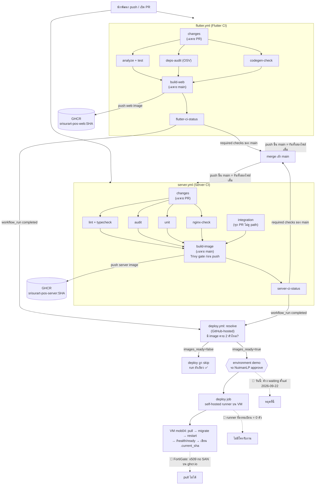

# 15 — CI/CD เชิงลึก: ทุก stage ของ pipeline และผลลัพธ์ที่ได้จริง

> บทนี้ตอบคำถาม: **"พอ push โค้ดขึ้น GitHub แล้ว มีเครื่องไหนทำอะไรต่อบ้าง ทีละขั้น ได้ผลอะไรออกมาจริง (ตัวเลขจาก log) และทำไมปุ่มเขียวทุกปุ่มยังไม่ได้แปลว่าร้านได้ของใหม่"**

---

## 🧭 ก่อนอ่าน

- **ต้องอ่านก่อน:** [00_index.md](00_index.md) (ข้อ 4.9 Git, 4.10 GitHub, 4.7 HTTPS/TLS) และ [02_architecture.md](02_architecture.md)
- **ควรอ่านคู่กัน:** [14_devops.md](14_devops.md) — บทนั้นสอน Docker, image, Compose, Nginx, Ansible, Prometheus/Grafana
  บทนี้**ไม่สอนซ้ำ** จะพูดถึงแค่ตรงที่ pipeline ไปแตะมัน
- **เวลาที่ใช้:** ~90–120 นาที (ครึ่งแรกคือปูพื้นฐาน ครึ่งหลังคืออ่าน YAML + log จริง)
- **อ่านจบแล้วคุณจะ…**
  - อธิบายได้ว่า CI, Continuous Delivery, Continuous Deployment ต่างกันยังไง และแต่ละตัวแก้ความเจ็บปวดอะไร
  - อ่านไฟล์ GitHub Actions (`.github/workflows/*.yml`) ออก: trigger, job, `needs`, `if`, concurrency, environment
  - ไล่ได้ว่า job แต่ละตัวของ repo นี้รันอะไร ใช้เวลาเท่าไร จับ bug ประเภทไหนได้ — จากตัวเลขใน log จริง
  - อธิบายได้ว่าทำไม `Deploy (demo)` เขียวแต่ VM ยังรันของเก่าอยู่ ("green ≠ deployed")
  - เข้าใจกฎแปลกๆ ของ repo นี้ (status job ตัวเดียว, `changes` gate, concurrency ตาม SHA) ว่าแต่ละข้อเกิดจากแผลอะไร

> 📅 **ตัวเลขทุกตัวในบทนี้เก็บจาก `gh run list` / `gh run view` / GitHub API วันที่ 2026-09-25**
> (อ่านอย่างเดียว ไม่ได้ rerun/approve/cancel อะไรเลย) ถ้าคุณอ่านทีหลัง ตัวเลขใหม่อาจต่างไป — วิธีเก็บเองอยู่ในหัวข้อ "เก็บผลเองยังไง"

---

## 🧱 ปูพื้นฐาน

ส่วนนี้ยังไม่พูดถึงโปรเจกต์ — สอน concept ทั่วไปก่อน

### 1. ความเจ็บปวดข้อที่ 1: "integration hell" (นรกของการรวมโค้ด)

> **Analogy — ร้านอะไหล่ทำแคตตาล็อกเล่มใหม่:** พนักงาน 3 คนแยกกันเขียนคนละหมวด (เบรก, ช่วงล่าง, ไฟ) คนละ 3 เดือน
> วันรวมเล่มพบว่า: เลขหน้าชนกัน, รหัสสินค้าซ้ำ, คนหนึ่งเปลี่ยนรูปแบบราคาจาก "฿1,200" เป็น "1200.00" โดยไม่บอกใคร
> ใช้เวลาแก้ **นานกว่าเขียน** เพราะไม่มีใครรู้ว่าปัญหาไหนมาจากการแก้ของใคร เมื่อไร

ในซอฟต์แวร์เป็นแบบเดียวกันเป๊ะ: ถ้านักพัฒนาแต่ละคนแยกทำ **branch** (สำเนาแยกของโค้ด ดู 00_index ข้อ 4.9) นานๆ แล้วค่อยรวม
จะเจอ **merge conflict** (สองคนแก้บรรทัดเดียวกัน) + **bug ที่เกิดจากการรวม** (โค้ดแต่ละฝั่งถูกเมื่ออยู่คนเดียว แต่ผิดเมื่ออยู่ด้วยกัน)

ทางแก้ทางความคิดคือ: **รวมบ่อยๆ ทีละนิด และตรวจทุกครั้งที่รวม** — ถ้ารวมวันละหลายครั้ง แต่ละครั้งเปลี่ยนนิดเดียว
พังเมื่อไรก็รู้ทันทีว่าเพราะ commit ไหน

แต่ "ตรวจทุกครั้ง" ด้วยคนไม่ไหว (รัน test 500+ ข้อ, ตรวจ lint, สแกนช่องโหว่ — วันละ 20 รอบ) → ต้องให้ **เครื่องทำให้อัตโนมัติ**

**Continuous Integration (CI — การรวมโค้ดแบบต่อเนื่อง)** = ทุกครั้งที่มีคน push โค้ดหรือเปิด **pull request** (PR — คำขอให้รวม branch เข้า main)
จะมีเครื่องอัตโนมัติดึงโค้ดชุดนั้นมา build + test ทันที แล้วรายงานผลเป็น ✅ / ❌ ก่อนที่ใครจะกดรวม

### 2. ความเจ็บปวดข้อที่ 2: deploy ด้วยมือ

> **Analogy — ย้ายของเข้าร้านสาขาใหม่ด้วยกระดาษโน้ต:** "ขนกล่อง A ก่อน ต่อปลั๊ก B แล้วค่อยเปิดไฟ C" — วันที่คนเขียนโน้ตลาป่วย
> คนแทนทำสลับขั้น ไฟช็อต. ทำซ้ำ 10 ครั้งก็พลาดคนละแบบ 10 ครั้ง

**deploy** (การเอาโปรแกรมเวอร์ชันใหม่ไปรันบนเครื่องจริงที่ผู้ใช้ใช้) ถ้าทำด้วยมือ:
- ลืมขั้นตอน / ทำสลับลำดับ (migrate ฐานข้อมูลหลังเปิดโปรแกรมใหม่ → โปรแกรมหา column ไม่เจอ)
- ไม่รู้ว่าบนเครื่องตอนนี้รันเวอร์ชันไหนอยู่
- ย้อนกลับ (**rollback**) ไม่เป็น เพราะไม่มีใครจดว่าก่อนหน้าเป็นเวอร์ชันอะไร

ทางแก้คือเขียนขั้นตอน deploy เป็น **โค้ด/สคริปต์** แล้วให้เครื่องรัน → ทำซ้ำได้เหมือนเดิมทุกครั้ง

### 3. CD มีสองความหมาย — ต้องแยกให้ออก

| คำ | แปลว่า | ใครกดปุ่มสุดท้าย |
|---|---|---|
| **Continuous Delivery** (ส่งมอบต่อเนื่อง) | ทุก commit ที่ผ่าน CI จะถูกแพ็กเป็นของที่ **พร้อม deploy** เสมอ (เช่น image ใน registry) — แต่การขึ้นเครื่องจริงยังต้องมีคนอนุมัติ | คน |
| **Continuous Deployment** (deploy ต่อเนื่อง) | ผ่าน CI แล้ว **ขึ้นเครื่องจริงเองทันที** ไม่มีคนคั่น | เครื่อง |

```
Continuous Integration   : code → build → test → ✅
Continuous Delivery      : ... → ✅ → แพ็กเป็น release พร้อมส่ง → [คนกดอนุมัติ] → deploy
Continuous Deployment    : ... → ✅ → แพ็ก → deploy อัตโนมัติ (ไม่มีคนคั่น)
```

จำไว้ก่อน: repo นี้ **ออกแบบ** เป็น Continuous Delivery (มีคนอนุมัติคั่น) — และ **ในความจริงวันนี้** ขั้น deploy ยังไม่เคยสำเร็จผ่าน pipeline เลย (จะเล่าในหัวข้อ CD case study)

### 4. ศัพท์พื้นฐานของ pipeline

> **Analogy — สายพานโรงงานประกอบรถ:** รถ 1 คัน (= commit 1 ตัว) ไหลผ่านสถานีทีละสถานี แต่ละสถานีมีคนงานทำงานย่อยตามลำดับ
> สถานีไหนเจอของเสีย สายพานหยุด รถคันนั้นไม่ไปต่อ

| ศัพท์ | ความหมาย | เทียบโรงงาน |
|---|---|---|
| **pipeline** | ลำดับขั้นอัตโนมัติทั้งหมดตั้งแต่โค้ดเข้าจนถึงของออก | สายพานทั้งเส้น |
| **stage** | ช่วงใหญ่ของ pipeline (เช่น test, package, deploy) — GitHub Actions ไม่มีคำนี้เป็น keyword แต่เราจัดกลุ่ม job เองได้ | โซนของโรงงาน |
| **workflow** | ไฟล์ YAML 1 ไฟล์ใน `.github/workflows/` = pipeline 1 เส้นของ GitHub Actions | แผนผังสายพาน 1 เส้น |
| **job** | งาน 1 ก้อนที่รันบน **เครื่องเดียว** ตั้งแต่ต้นจนจบ; job ต่างกันรันคนละเครื่อง (ขนานกันได้) | สถานี |
| **step** | คำสั่งย่อยทีละบรรทัดใน job (รันตามลำดับบนเครื่องเดียวกัน แชร์ไฟล์กันได้) | ขั้นตอนของคนงานในสถานี |
| **runner** | เครื่องที่รับ job ไปรัน — **GitHub-hosted** (GitHub ให้ยืม VM ใหม่เอี่ยมทุก job แล้วทิ้ง) หรือ **self-hosted** (เครื่องของเราเอง ติดโปรแกรม runner ไว้) | คนงาน |
| **artifact** | ไฟล์ผลผลิตที่ job ทิ้งไว้ให้คนอื่นใช้ต่อ (เช่น zip ของเว็บที่ build แล้ว) | ชิ้นส่วนที่ประกอบเสร็จ |
| **trigger / event** | เหตุการณ์ที่ทำให้ workflow เริ่ม (push, เปิด PR, กดมือ, workflow อื่นจบ) | สัญญาณเปิดสายพาน |

### 5. กายวิภาคของ GitHub Actions — เริ่มจาก YAML ของเล่น

**YAML** คือรูปแบบไฟล์ config ที่ใช้ **การย่อหน้า** บอกว่าอะไรอยู่ใต้อะไร (คล้าย Python) — `key: value`, รายการขึ้นต้นด้วย `-`

**ตัวอย่างสมมติ** (ไม่มีใน repo — เขียนให้อ่านง่ายที่สุดก่อน):

```yaml
name: Toy CI                     # ชื่อที่โชว์ในแท็บ Actions

on:                              # trigger: เมื่อไรให้รัน
  push:
    branches: [main]             #   push ขึ้น main
  pull_request:                  #   ทุก PR

jobs:
  test:                          # job ที่ 1 (ชื่อ id = test)
    runs-on: ubuntu-latest       #   ขอ runner Linux จาก GitHub
    steps:
      - uses: actions/checkout@v4        # step: ดึงโค้ดลงเครื่อง runner
      - run: echo "hello" && exit 0      # step: รันคำสั่ง shell (exit 0 = ผ่าน)

  build:                         # job ที่ 2
    needs: [test]                #   รอ test ผ่านก่อน (ไม่งั้นรันขนานกัน)
    if: github.ref == 'refs/heads/main'  #   เงื่อนไข: เฉพาะบน main
    runs-on: ubuntu-latest
    steps:
      - run: echo "building..."
```

อ่านยังไง:
- `uses:` = เรียก **action** (โปรแกรมสำเร็จรูปที่คนอื่นเขียนไว้ เช่น `actions/checkout`) — `@v4` คือเวอร์ชัน
- `run:` = รันคำสั่ง shell ตรงๆ — **exit code ≠ 0 = step ล้ม = job ล้ม** (นี่คือกลไกทั้งหมดของ "gate")
- `needs:` = สร้างลำดับ; ไม่มี `needs` = job รันขนานกัน
- `if:` = รันเฉพาะเมื่อเงื่อนไขจริง; ถ้าเท็จ job จะมีสถานะ **skipped** (ข้าม) — ไม่ใช่ failed

ส่วนประกอบอื่นที่จะเจอ:

| keyword | ทำอะไร | repo นี้ใช้ไหม |
|---|---|---|
| `workflow_dispatch` | ปุ่ม "Run workflow" กดมือได้ | ✅ ทั้ง 3 ไฟล์ |
| `workflow_run` | รันเมื่อ workflow อื่นจบ | ✅ `deploy.yml` |
| `services:` (service containers) | ให้ GitHub เปิด container ข้างๆ job (เช่น Postgres) | ❌ **จงใจไม่ใช้** — ดูเหตุผลใน job `integration` |
| `strategy.matrix` | รัน job เดียวซ้ำหลายชุดค่า (เช่น Node 20/22/24) | ❌ ไม่ใช้ — ล็อก Node 22, Flutter 3.44.3 ตัวเดียว |
| `cache` | เก็บของที่โหลดช้า (SDK, package) ข้ามรอบ | ✅ Flutter SDK (`cache: true`) — log บอก `Cache Size: ~1610 MB` |
| `secrets.*` | ค่าลับ ที่ log จะแสดงเป็น `***` | ✅ แค่ `secrets.GITHUB_TOKEN` (token ชั่วคราวที่ GitHub ออกให้ทุก run) |
| `environment:` | ผูก job กับ "สภาพแวดล้อม" ที่มีกฎ เช่นต้องมีคนอนุมัติ | ✅ `deploy.yml` → `demo` |
| `concurrency:` | กันไม่ให้ run กลุ่มเดียวกันรันซ้อน / ยกเลิกตัวเก่า | ✅ ทั้ง 3 ไฟล์ |
| `permissions:` | จำกัดสิทธิ์ของ `GITHUB_TOKEN` (หลัก least privilege) | ✅ ระดับไฟล์ `contents: read` แล้วเปิด `packages: write` เฉพาะ job ที่ push image |

### 6. Quality gate — ด่านตรวจคุณภาพ

**gate** = step/job ที่ถ้าไม่ผ่านจะ **หยุด** pipeline ไม่ให้ของเสียไหลไปขั้นต่อไป เรียงจากถูก/เร็วไปแพง/ช้า:

| ด่าน | ตรวจอะไร | ตัวอย่างสิ่งที่จับได้ | ความเร็วโดยประมาณ |
|---|---|---|---|
| **lint** | รูปแบบโค้ดที่ผิดบ่อย (ตัวแปรไม่ใช้, await หาย) โดยไม่รันโค้ด | `if (x = 1)` | วินาที |
| **typecheck / analyze** | ชนิดข้อมูลตรงกันไหม | ส่ง string ไปที่รับ number | วินาที–นาที |
| **unit test** | ฟังก์ชันเดี่ยวๆ ทำงานถูก (ไม่มี DB จริง) | สูตรแต้มสะสมผิด | วินาที–นาที |
| **integration test** | หลายชิ้นทำงานด้วยกัน (แอป + DB จริง + Redis จริง) | SQL ผิด, migration พัง, ร้าน A อ่านข้อมูลร้าน B ได้ | นาที |
| **security scan** | dependency มีช่องโหว่ที่รู้จัก (**CVE** — รหัสประจำช่องโหว่สาธารณะ) / config อันตราย | library เวอร์ชันที่มีช่องโหว่ | วินาที–นาที |

สองหลักคิดที่ใช้จัดลำดับ:
- **Fail fast** — ด่านถูกๆ อยู่หน้า ถ้า lint พังใน 15 วินาที ไม่ต้องรอ integration 3 นาที
- **Shift-left** — เลื่อนการตรวจไป "ซ้าย" ของเส้นเวลา (ใกล้ตอนเขียนโค้ดที่สุด) เพราะ bug ที่เจอตอน PR แก้ถูกกว่าเจอบนเครื่องร้านเป็นร้อยเท่า

### 7. Branch protection + required checks

เครื่องตรวจแล้วบอก ❌ — แต่ถ้าใครก็กด merge ทับได้ ก็ไร้ความหมาย

**branch protection** = กฎบน GitHub ที่ล็อก branch (เช่น `main`) ว่า "จะรวมเข้ามาได้ต้องผ่านเงื่อนไข X" เช่น
ต้องมาทาง PR, ห้าม force-push, และ **required status checks** = รายชื่อ check ที่ต้องเขียวก่อนปุ่ม Merge จะกดได้

กับดักที่คนมักตก (repo นี้ตกมาแล้ว): **check ที่ถูก skip GitHub นับว่า "ผ่าน"** และ **check ที่ไม่เคยรายงานเลย PR จะค้างรอตลอดกาล** — ทั้งสองเรื่องนี้บังคับรูปร่างของ workflow ใน repo นี้ (ดู job `*-ci-status`)

### 8. Container registry

**image** (แพ็กเกจโปรแกรม+ทุกอย่างที่มันต้องใช้ ในรูปที่รันเป็น container ได้ — สอนละเอียดใน [14_devops.md](14_devops.md)) ต้องมีที่เก็บกลาง
ให้เครื่องปลายทาง **pull** (ดึง) ไปรัน → ที่เก็บนั้นเรียก **container registry** เช่น Docker Hub, **GHCR** (GitHub Container Registry, `ghcr.io`)

แต่ละ image มี **tag** (ป้ายชื่อ อ่านง่าย ย้ายได้ เช่น `main`) และ **digest** (`sha256:…` = ลายนิ้วมือของเนื้อหา เปลี่ยนไม่ได้)
repo นี้ tag image ด้วย **commit SHA** (รหัส 40 ตัวของ commit) → "image ของ commit ไหน" ตอบได้แน่นอน และ rollback = สั่งให้รัน SHA เก่า

---

## 🔥 ปัญหาจริงของร้าน

โจทย์ที่บังคับให้ต้องมี CI/CD แบบเข้มงวด:

1. **ทีม 3 คน merge ถี่มาก** — ทุกคนต้องแตะทั้ง frontend, backend และ CI/CD (กฎคอร์ส) ถ้าไม่มีเครื่องตรวจ ทุกคนจะทำของคนอื่นพังโดยไม่รู้ตัว
2. **เงินกับสต็อกผิดไม่ได้** — bug ใน `saveSale` = ขายเกินสต็อกหรือคิดเงินผิด ต้องมี integration test ที่รันกับ PostgreSQL จริง
3. **Multi-tenant** (หลายร้านในฐานข้อมูลเดียว) — ถ้าร้าน A อ่านข้อมูลร้าน B ได้ = หายนะ ต้องมี test "อ่านข้ามร้าน" ที่รัน **ทุก PR** ไม่มีข้อยกเว้น
4. **ข้อจำกัด Thai path** — `build_runner` รันบน path ภาษาไทยไม่ได้ (ดู CLAUDE.md) ไฟล์ `*.g.dart` จึงถูก commit ไว้ — CI (path ASCII) เป็น **ที่เดียว** ที่ตรวจว่าไฟล์ที่ generate ยังตรงกับ schema
5. **repo เป็น public** — ใครก็เปิด PR ได้ → workflow ต้องไม่ยอมให้ PR ของคนนอกแตะเครื่อง VM หรือ secret
6. **VM demo อยู่ในเครือข่ายมหาวิทยาลัย** — เครื่อง GitHub ต่อเข้าไปไม่ได้ ต้องให้ VM เป็นฝ่าย "ดึงงาน" เอง (self-hosted runner)

---

## ⚖️ ทางเลือก → ทำไมเลือกอันนี้

### ก. เครื่องยนต์ CI

| ทางเลือก | ข้อดี | ข้อเสีย | ผล |
|---|---|---|---|
| **GitHub Actions** | อยู่ใน GitHub ที่ใช้อยู่แล้ว, runner ฟรีสำหรับ repo public, ไม่ต้องดูแลเครื่อง | ผูกกับ GitHub, debug ต้องอ่าน log บนเว็บ | ✅ เลือก |
| Jenkins | ยืดหยุ่นสุด, self-host ได้ทั้งหมด | ต้องมีเครื่องรัน Jenkins เอง (VM มี RAM 6 GB ที่แน่นอยู่แล้ว), เป็นเครื่องยนต์ที่ 2 ทำงานเดียวกัน | ❌ (ADR-0013) |
| GitLab CI | ดีพอๆ Actions | ต้องย้าย repo | ❌ |

เพราะโค้ดอยู่ GitHub อยู่แล้ว + ไม่มีเครื่องเหลือ → จึงเลือก Actions → ราคาที่จ่ายคือ ผูกกับ GitHub และ runner ของ GitHub เข้า VM ในมหาวิทยาลัยไม่ได้ (ต้องไปแก้ด้วย self-hosted runner)

> 🔎 **แล้ว `Jenkinsfile` ที่ root ของ repo ล่ะ?** ตรวจแล้ว: มาจาก PR #320 (commit `266a036`, "Add Jenkinsfile for Lab 03") —
> เป็น **แบบฝึกหัดของคอร์ส** (มี `jenkin-lab.pdf` มาคู่กัน) ข้างในตั้ง `APP_NAME = 'taskflow-api'` (ไม่ใช่ชื่อโปรเจกต์นี้), ใช้ `npm` ทั้งที่ server ใช้ `pnpm`,
> lint เขียน `npm run lint || true` (ไม่มีวันล้ม) และขั้น deploy แค่ `echo deploying to production...` (`Jenkinsfile:33`, `:65`)
> **ไม่มี Jenkins server ไหนรันไฟล์นี้ในระบบจริง** — pipeline จริงคือ 3 ไฟล์ใน `.github/workflows/` เท่านั้น
> มันเป็นตัวอย่างดีของ "gate ปลอม": `|| true` ทำให้ step เขียวเสมอ อย่าเอาแบบนี้ไปใช้

### ข. จะกรองว่า "PR นี้ต้องรัน job ไหน" ที่ชั้นไหน

| ทางเลือก | ปัญหา |
|---|---|
| ไม่กรองเลย รันทุกอย่างทุก PR | PR แก้เอกสารอย่างเดียวก็ต้องรอ build Flutter ~4 นาที เปลืองเวลา |
| กรองที่ trigger (`on: pull_request: paths: [server/**]`) | PR ที่แตะแค่ `docs/` → workflow **ไม่ถูกสร้างเลย** → required check ไม่เคยรายงาน → **PR ค้างตลอดกาล** |
| **กรองข้างใน workflow** ด้วย job `changes` + `if:` ราย job + status job ตัวเดียวที่รายงานเสมอ | YAML ยาวขึ้น ต้องเข้าใจ `needs`/`if` ลึก | ✅ เลือก (#39) |

### ค. ที่เก็บ release

| ทางเลือก | ผล |
|---|---|
| **GHCR** (image public, tag ด้วย SHA) | ✅ repo public อยู่แล้ว → VM pull ได้โดยไม่ต้องจัดการ token |
| tarball (`docker save`) เป็น artifact | ❌ ยกเลิกเพื่อให้เหลือทางปล่อยทางเดียว (07_CICD_DEPLOY §3) |
| Docker Hub | ❌ มี rate limit การ pull, ต้องมีบัญชีแยก |

### ง. จะ deploy ขึ้น VM ยังไง

| ทางเลือก | ผล |
|---|---|
| GitHub-hosted runner SSH เข้า VM | ❌ VM อยู่หลัง firewall มหาวิทยาลัย ต่อเข้าไม่ได้ |
| **self-hosted runner บน VM** (VM ออกไปดึงงานจาก GitHub ทาง HTTPS ขาออก) + **required reviewer** ก่อนรัน | ✅ ADR-0013 addendum 2026-09-15 + 2026-09-21 (#366) |
| deploy ด้วยมือด้วย `ansible-playbook` | เก็บไว้เป็นทางสำรอง (#335 D9) |

เพราะ VM รับการเชื่อมต่อจากข้างนอกไม่ได้ → จึงให้ VM เป็นฝ่ายดึงงาน → ราคาที่จ่ายคือ ต้องติดตั้งและดูแล runner บน VM เอง และต้องกันไม่ให้ PR จากคนนอกสั่งงานเครื่องนี้ได้ (repo public)

---

## 🗺️ ภาพรวม pipeline ทั้งเส้น (และตรงไหนที่มันหยุดอยู่วันนี้)



สรุปเป็นคำ: **CI (สองกล่องบน) ทำงานครบ 100% ทุกวัน** · **ส่วน Delivery (image ขึ้น GHCR) ทำงานจริง** · **ส่วน Deployment (ลงล่าง) ไม่เคยสำเร็จผ่าน pipeline**
และถึงจะผ่านด่านอนุมัติ ก็ยังติดอีก 2 ด่านถัดไป

---

## 🔍 ของจริงใน repo — เจาะทีละ job

### ส่วนที่ใช้ร่วมกันทั้งสองไฟล์: trigger + concurrency

`.github/workflows/server.yml:30-48`

```yaml
permissions:
  contents: read

on:
  push:
    branches: [main]
  pull_request:
  workflow_dispatch:

concurrency:
  # Keyed by SHA on main so two quick merges each keep their own run (and their own
  # release image) rather than the second evicting the first's in-progress run.
  group: server-${{ github.ref == 'refs/heads/main' && github.sha || github.ref }}
  # Never cancel a main run — it is the only producer of that commit's image.
  cancel-in-progress: ${{ github.ref != 'refs/heads/main' }}

defaults:
  run:
    working-directory: server
```

- **`on:` ไม่มี `paths:`** — trigger ไม่กรองเลย (เหตุผลในทางเลือก ข.)
- **`permissions: contents: read`** — token ของ run นี้อ่านได้อย่างเดียว; job ที่ต้อง push image ค่อยขอ `packages: write` เพิ่มเอง
- **`concurrency.group`** — นิพจน์ `A && B || C` คือ ternary ของ Actions: ถ้าเป็น main → กลุ่มชื่อ `server-<SHA>`; ถ้าเป็น PR → `server-refs/pull/N/merge`
  - บน **PR**: push ซ้ำเร็วๆ → run เก่าถูกยกเลิก (`cancel-in-progress: true`) ประหยัดเวลา เพราะโค้ดเก่าไม่มีใครสนแล้ว
  - บน **main**: ทุก commit ได้กลุ่มของตัวเอง + ห้ามยกเลิก — **เพราะ run บน main คือผู้ผลิต image ของ commit นั้นคนเดียว** ถ้าสอง merge ติดกันแล้วตัวแรกโดนยกเลิก commit แรกจะไม่มี image ตลอดไป

`flutter.yml:17-36` เหมือนกันทุกอย่าง แค่ prefix `flutter-` และ `working-directory: frontend` + `FLUTTER_VERSION: '3.44.3'   # keep in sync with frontend/.fvmrc` (`flutter.yml:31`) — ตรวจแล้ว `frontend/.fvmrc` เป็น `3.44.3` ตรงกัน

---

### Stage 0 — job `changes` (ตัวคัดกรอง ใช้ทั้งสองไฟล์)

`.github/workflows/flutter.yml:39-60`

```yaml
  changes:
    name: detect changed paths (pull_request only)
    runs-on: ubuntu-latest
    if: github.event_name == 'pull_request'
    permissions:
      contents: read
      pull-requests: read
    outputs:
      frontend: ${{ steps.filter.outputs.frontend }}
    steps:
      - uses: actions/checkout@v4
      - uses: dorny/paths-filter@v4
        id: filter
        with:
          filters: |
            frontend:
              - 'frontend/**'
              - '.github/workflows/flutter.yml'
```

- **ทำอะไร:** ถาม GitHub API ว่า PR นี้แก้ไฟล์อะไร แล้วตั้ง output `frontend = true/false`
- **รันเมื่อไร:** เฉพาะ PR — บน push ขึ้น main job นี้ถูก skip เพราะ main **ต้องรันทุกอย่างเสมอ** (จะได้ image ครบ 2 ตัวทุก commit)
- **ฝั่ง server** (`server.yml:69-74`) มี filter `server/**`, `server.yml` และไฟล์ fixture `frontend/test/fixtures/synthetic_snapshot_*.json` (เพราะ test ฝั่ง server ตรวจไฟล์นั้น — #185)

**ผลจริง** (PR #396 แก้แค่ `docs/tutorial/testing-tutorial.md`, run [35993264660](https://github.com/NuimanLP/srisurart-pos-flutter/actions/runs/35993264660), job log):

```
Received 1 items
[modified] docs/tutorial/testing-tutorial.md
Detected 1 changed files
Results:
Filter frontend = false
Matching files: none
```

แล้ว job ที่ตามมาทั้งหมดของ Flutter CI เป็น **skipped** — ทั้ง run จบใน **14 วินาที** (เทียบกับ ~4 นาทีบน main)

#### ทำไม job ถัดไปต้องเขียน `if:` ยาวแปลกๆ

`flutter.yml:62-71`

```yaml
  analyze-and-test:
    name: analyze + test
    runs-on: ubuntu-latest
    needs: [changes]
    # `needs: [changes]` on its own would implicitly require `changes` to have
    # *succeeded*; on push/workflow_dispatch it is skipped by its own `if:` above,
    # which would cascade to skip this job too. `!cancelled()` overrides that
    # implicit requirement so the second clause (the actual path gate) is what
    # decides, on both push and pull_request.
    if: ${{ !cancelled() && (github.event_name != 'pull_request' || needs.changes.outputs.frontend == 'true') }}
```

กฎลับของ GitHub Actions: **ถ้าเขียน `if:` โดยไม่มีฟังก์ชันสถานะ (`always()`, `!cancelled()`, `success()`) GitHub จะแอบเติม `success()` ให้** = "ทุก job ใน `needs` ต้อง success"
แต่บน push ขึ้น main `changes` ถูก skip → skip ไม่ใช่ success → job นี้โดน skip ต่อเป็นโดมิโน → **main ไม่ได้ test อะไรเลย**
`!cancelled()` ปิดกฎแอบเติมนั้น แล้วให้ส่วนหลัง (`push` หรือ `frontend == 'true'`) เป็นคนตัดสินจริง

> ⚠️ กับดักนี้เคยเกิดจริง ดูหัวข้อ "บทเรียน: #39 → #184"

---

### Stage 1 (Flutter) — job `analyze-and-test`

`flutter.yml:72-119` (ย่อเฉพาะแก่น)

```yaml
    steps:
      - uses: actions/checkout@v4
      - uses: subosito/flutter-action@v2
        with:
          flutter-version: ${{ env.FLUTTER_VERSION }}
          channel: stable
          cache: true
      - name: flutter pub get
        run: flutter pub get
      - name: check web DB asset versions match pubspec.lock
        run: |
          ...                              # (บรรทัด 89-113 — ดูข้างล่าง)
      - name: dart analyze
        run: dart analyze --fatal-infos
      - name: flutter test
        run: flutter test --reporter expanded
```

แยกเป็น 3 ด่าน:

**(1) web DB asset version check** (`flutter.yml:100-113`)

```yaml
          locked_sqlite3=$(locked_version sqlite3)
          locked_drift=$(locked_version drift)
          asset_sqlite3=$(grep '^sqlite3=' web/WEB_DB_ASSET_VERSIONS.txt | cut -d= -f2)
          asset_drift=$(grep '^drift=' web/WEB_DB_ASSET_VERSIONS.txt | cut -d= -f2)
          ...
          if [[ "$locked_sqlite3" != "$asset_sqlite3" || "$locked_drift" != "$asset_drift" ]]; then
            echo "::error::pubspec.lock (...) no longer matches the committed web DB assets ..."
            exit 1
          fi
```

- **ทำไมมี:** แอปเว็บใช้ไฟล์ `web/sqlite3.wasm` + `web/drift_worker.js` ที่ **โหลดมาวางเองด้วยมือ** จาก GitHub release ของ library — ถ้าวันหนึ่งมีคน bump `drift` ใน `pubspec.lock` แต่ลืมโหลดสองไฟล์นี้ใหม่
  เว็บจะ **พังตอนเปิดแอป** โดย build/test ไม่ฟ้องอะไรเลย (#245)
- **จับอะไร:** version skew (เวอร์ชันไม่ตรงกัน) ระหว่างสองที่ที่ต้องตรงกันแต่ไม่มี tool ไหนเชื่อมให้
- **ผลจริง** (run [35957475393](https://github.com/NuimanLP/srisurart-pos-flutter/actions/runs/35957475393)):
  ```
  pubspec.lock: sqlite3=3.4.0 drift=2.34.1
  web/WEB_DB_ASSET_VERSIONS.txt: sqlite3=3.4.0 drift=2.34.1
  ```

**(2) `dart analyze --fatal-infos`** — static analysis ของ Dart (ใช้ `dart analyze` ไม่ใช่ `flutter analyze` ตามกฎ Thai path ใน CLAUDE.md)
`--fatal-infos` = แม้แต่ระดับ "info" (เบาสุด) ก็ถือว่าล้ม → โค้ดต้องสะอาด 100%
ผลจริง: `Analyzing frontend...` → `No issues found!`

**(3) `flutter test`** — unit + widget + repository test (Drift บน SQLite ในหน่วยความจำ)
ผลจริง: บรรทัดสุดท้ายของ log `01:05 +533: All tests passed!` (= ผ่าน 533 test ใน 1 นาที 5 วินาที)

⏱️ **ทั้ง job: 2 นาที 1 วินาที** (04:52:16 → 04:54:17) — เป็น job ที่ยาวที่สุดของ Flutter CI และเป็น "ทางวิกฤต" (critical path) ของ `build-web`

---

### Stage 1 (Flutter) — job `deps-audit` (OSV-Scanner)

`flutter.yml:121-138`

```yaml
  deps-audit:
    name: pubspec.lock CVEs (OSV-Scanner)
    ...
    # sec.1 (2026-09-09): `pub` has no `audit` command, so the lockfile is checked
    # against OSV. Fails on any known vulnerability in a locked dependency.
    steps:
      - uses: actions/checkout@v4
      - uses: google/osv-scanner-action/osv-scanner-action@v2.5.1
        with:
          scan-args: |-
            --lockfile=frontend/pubspec.lock
```

- **ทำไมมี:** npm มี `npm audit` แต่ Dart `pub` **ไม่มีคำสั่ง audit** → ใช้ **OSV** (Open Source Vulnerabilities — ฐานข้อมูลช่องโหว่ของ Google) แทน
- **จับอะไร:** package ใน `pubspec.lock` ที่มีช่องโหว่ประกาศแล้ว
- **ผลจริง:** `Scanned /github/workspace/frontend/pubspec.lock file and found 124 packages` → `No issues found`
- ⏱️ **11 วินาที**

---

### Stage 1 (Flutter) — job `codegen-check`

`flutter.yml:150-173`

```yaml
    # The committed *.g.dart files are the build on the shop's Thai path, where
    # build_runner cannot run (CLAUDE.md). CI runners are ASCII, so this is the
    # only place the generated code is ever verified against the schema.
    steps:
      ...
      - name: dart run build_runner build
        run: dart run build_runner build --delete-conflicting-outputs

      - name: fail if generated code differs from what is committed
        run: |
          if ! git diff --quiet -- '*.g.dart'; then
            echo "::error::Generated Drift code is stale. Run 'dart run build_runner build' on an ASCII path and commit the result."
            git diff --stat -- '*.g.dart'
            exit 1
          fi
```

- **เทคนิค:** generate ใหม่บนเครื่อง CI แล้วใช้ `git diff --quiet` เทียบกับที่ commit ไว้ — ถ้าต่าง = มีคนแก้ตาราง Drift แต่ลืม regenerate
- **ทำไมสำคัญเฉพาะ repo นี้:** เครื่องร้านอยู่บน path ภาษาไทย รัน `build_runner` ไม่ได้ ไฟล์ `.g.dart` ที่ commit ไว้ **คือ** โค้ดที่ร้านใช้จริง
- **ผลจริง:** `Built with build_runner/aot in 52s; wrote 330 outputs.` แล้ว diff ว่าง → ผ่าน
- ⏱️ **1 นาที 19 วินาที**
- 🔎 **สิ่งที่ log บอกแต่ YAML ไม่รู้:** มีบรรทัด `W These options have been removed and were ignored: --delete-conflicting-outputs`
  — `build_runner` เวอร์ชันที่ lock อยู่ (log แสดง `build_runner 2.15.1`) **เลิกใช้ flag นี้แล้ว** แค่ไม่สนใจมัน job ยังผ่าน แต่ flag ใน `flutter.yml:165` ไม่มีผลอะไรแล้ว — ตัวอย่างว่าทำไมต้องอ่าน log ไม่ใช่ดูแค่สีเขียว

---

### Stage 2 (Flutter) — job `build-web` (Package → GHCR)

`flutter.yml:175-184` — เงื่อนไข

```yaml
  build-web:
    name: build web artifact
    runs-on: ubuntu-latest
    needs: [analyze-and-test, codegen-check, deps-audit]
    # The explicit results matter: with a bare `if:` GitHub applies an implicit success(), which
    # also requires every *ancestor* to have succeeded — and `changes` is always skipped on push,
    # so this job was skipped on every `main` push from #39 until #184 found no image to deploy.
    ...
    if: ${{ !cancelled() && (github.ref == 'refs/heads/main' || github.event_name == 'workflow_dispatch') && needs.analyze-and-test.result == 'success' && needs.codegen-check.result == 'success' && needs.deps-audit.result == 'success' }}
```

เขียนผลของทั้ง 3 job แบบ **explicit** (`== 'success'`) เพราะ `!cancelled()` ปิดการตรวจอัตโนมัติไปแล้ว ถ้าไม่เขียนเอง job นี้จะรันแม้ test ล้ม

`flutter.yml:213-267` — ขั้นตอนหลัก (ย่อ)

```yaml
      - name: flutter build web
        run: >-
          flutter build web --no-tree-shake-icons
          --dart-define=USE_API_WRITES=true
          --dart-define=API_BASE_URL=
      - name: check web DB assets shipped
        run: |
          test -f build/web/sqlite3.wasm || { echo "::error::sqlite3.wasm missing from build/web"; exit 1; }
          test -f build/web/drift_worker.js || { echo "::error::drift_worker.js missing from build/web"; exit 1; }
      - uses: actions/upload-artifact@v4          # เก็บ zip ไว้ให้คนโหลดดู 14 วัน
      - uses: docker/login-action@v3              # login ghcr.io ด้วย GITHUB_TOKEN
      - name: build web image                     # docker build -f ../deploy/web.Dockerfile
      - name: smoke test the web image            # ต้องมี index.html + 2 ไฟล์ DB, ต้องไม่มี nginx, ไม่เปิด port
      - name: push web image                      # push tag <sha> และ main
```

- **ทำอะไร:** compile Flutter เป็นเว็บ → เช็กว่าไฟล์ DB ติดไปด้วย → อัปโหลด artifact → ทำเป็น image (ไฟล์ static ล้วน บน `busybox` ที่ pin digest, `deploy/web.Dockerfile:11`) → **smoke test** (ทดสอบแบบหยาบว่า "เปิดติดไหม ของครบไหม") → push
- **ผลจริง** (run 35957475393):
  ```
  Compiling lib/main.dart for the Web...                             60.2s
  ✓ Built build/web
  Artifact pos-web-ec5b9a620ee87c2644bd843838d488bda27905d3 has been successfully uploaded! Final size is 16485332 bytes.
  ec5b9a620ee87c2644bd843838d488bda27905d3: digest: sha256:ed03303d64f23ae23fc830243d9cf95667c330e510576e42e20be8368a6f3992 size: 738
  main: digest: sha256:ed03303d64f23ae23fc830243d9cf95667c330e510576e42e20be8368a6f3992 size: 738
  ```
  สังเกต: tag `<sha>` และ tag `main` ชี้ **digest เดียวกัน** = image ตัวเดียวกัน แค่มีสองป้าย
- ⏱️ **1 นาที 37 วินาที** · ⚠️ image **web ไม่มี Trivy scan** (มีแค่ฝั่ง server) — บันทึกไว้แล้วใน 07_CICD_DEPLOY §3

---

### Stage 3 (Flutter) — job `flutter-ci-status` (ผู้รายงานตัวเดียว)

`flutter.yml:269-308`

```yaml
  flutter-ci-status:
    name: flutter-ci-status
    runs-on: ubuntu-latest
    needs: [changes, analyze-and-test, deps-audit, codegen-check, build-web]
    if: always()
    ...
    steps:
      - name: require every job above to have succeeded or been skipped
        run: |
          for result in \
            "${{ needs.changes.result }}" \
            "${{ needs.analyze-and-test.result }}" \
            "${{ needs.deps-audit.result }}" \
            "${{ needs.codegen-check.result }}" \
            "${{ needs.build-web.result }}"; do
            if [[ "$result" != "success" && "$result" != "skipped" ]]; then
              echo "::error::a required Flutter job did not succeed: $result"
              exit 1
            fi
          done
          # A skipped release image on a `main` push is not a pass: ...
          if [[ "${{ github.event_name }}" == "push" && "${{ github.ref }}" == "refs/heads/main" && "${{ needs.build-web.result }}" != "success" ]]; then
            echo "::error::build-web did not run on a main push: ${{ needs.build-web.result }}"
            exit 1
          fi
```

นี่คือ job ที่สำคัญที่สุดในแง่ "การออกแบบ" — ทำไมต้องมี:

1. **branch protection require ได้แค่ชื่อ check** และ check ที่ถูก skip = ผ่าน → ถ้าไป require `analyze + test` ตรงๆ PR เอกสารจะ skip มันแล้ว "ผ่าน" (โอเค) แต่ถ้า run ถูก cancel ทั้งชุดก็ "ผ่าน" ด้วย (ไม่โอเค)
2. จึงรวมทุก job ไว้ใต้ **ชื่อเดียว** ที่ **รันเสมอ** (`if: always()`) แล้วใช้ **loop ตัดสินเอง**: ยอมแค่ `success`/`skipped` อย่างอื่น (`failure`, `cancelled`) = `exit 1`
3. **ท่อนท้าย:** บน push ขึ้น main ห้าม `build-web` เป็น skipped — เพราะเคยเกิดขึ้นจริงแล้วไม่มีใครเห็น (#184)
4. ทำไม `always()` ไม่ใช่ `!cancelled()`: ถ้าทั้ง run ถูก cancel, `!cancelled()` จะทำให้ status job **ถูก skip เอง** → GitHub นับ required check ที่ skip ว่าผ่าน → เขียวปลอม

**ผลจริงบน PR เอกสาร** (run 35993264660) — loop ได้ค่าเหล่านี้:

```
for result in \
  "success" \
  "skipped" \
  "skipped" \
  "skipped" \
  "skipped"; do
```

`changes` = success, ที่เหลือ skipped → ผ่าน → PR merge ได้ใน 14 วินาที โดยไม่ต้องรอ build Flutter ที่ไม่เกี่ยว ⏱️ status job เอง ~4 วินาที

---

### Stage 1 (Server) — job `lint` (lint + typecheck)

`server.yml:76-94`

```yaml
  lint:
    name: lint + typecheck
    runs-on: ubuntu-latest
    needs: [changes]
    if: ${{ !cancelled() && (github.event_name != 'pull_request' || needs.changes.outputs.server == 'true') }}
    steps:
      - uses: actions/checkout@v4
      - uses: actions/setup-node@v4
        with:
          node-version: 22
      - run: corepack enable
      - run: pnpm install --frozen-lockfile
      - run: pnpm lint
      - run: pnpm typecheck
```

- `corepack enable` = เปิดตัวจัดการ package manager ที่มากับ Node ให้ใช้ `pnpm` ตามเวอร์ชันใน `server/package.json:8` (`"packageManager": "pnpm@10.34.5"`)
- `--frozen-lockfile` = **ห้ามแก้ lockfile** ถ้า `package.json` กับ `pnpm-lock.yaml` ไม่ตรงกัน → ล้ม (กันไม่ให้ CI ติดตั้งเวอร์ชันต่างจากที่ dev ทดสอบ)
- `pnpm lint` = **oxlint**, `pnpm typecheck` = `tsc --noEmit` (ตรวจ type ของ TypeScript โดยไม่สร้างไฟล์)
- **ผลจริง** (run [35957475404](https://github.com/NuimanLP/srisurart-pos-flutter/actions/runs/35957475404)):
  ```
  > oxlint src/ test/
  Found 0 warnings and 0 errors.
  Finished in 29ms on 276 files with 96 rules using 4 threads.
  > tsc --noEmit
  ```
  (`tsc` เงียบ = ไม่มี error)
- ⏱️ **15 วินาที** — ด่านถูกสุด = fail fast

---

### Stage 1 (Server) — job `audit` (pnpm audit + Trivy fs)

`server.yml:112-124`

```yaml
      - run: pnpm install --frozen-lockfile
      # Fails on high/critical advisories. Fix by bumping, or by a `pnpm.overrides`
      # entry in package.json when the vulnerable package is transitive (see multer).
      - run: pnpm audit --audit-level=high
      - name: Trivy — lockfile CVEs + Dockerfile misconfig
        uses: aquasecurity/trivy-action@v0.36.0
        with:
          scan-type: fs
          scan-ref: server
          scanners: vuln,misconfig
          severity: HIGH,CRITICAL
          ignore-unfixed: true
          exit-code: '1'
```

- **สองชั้น:** `pnpm audit` (ฐานข้อมูลของ npm) + **Trivy** (สแกนเนอร์ความปลอดภัยของ Aqua Security) แบบ `fs` = สแกนไฟล์ในโฟลเดอร์ ทั้ง **vuln** (ช่องโหว่ใน lockfile) และ **misconfig** (Dockerfile เขียนอันตราย เช่นรันเป็น root)
- `ignore-unfixed: true` = ช่องโหว่ที่ยังไม่มีเวอร์ชันแก้ ไม่นับ (เพราะทำอะไรไม่ได้) · `exit-code: '1'` = เจอ HIGH/CRITICAL ที่แก้ได้ → ล้ม
- **ผลจริง:**
  ```
  No known vulnerabilities found
  ...
  Report Summary
  │     Target     │    Type    │ Vulnerabilities │ Misconfigurations │
  │ pnpm-lock.yaml │    pnpm    │        0        │         -         │
  │ Dockerfile     │ dockerfile │        -        │         0         │
  ```
- ⏱️ **16 วินาที** (เริ่มช้ากว่าเพื่อน ~35 วินาทีเพราะรอคิว runner)

---

### Stage 1 (Server) — job `unit`

`server.yml:126-143` — `pnpm install --frozen-lockfile` แล้ว `pnpm test` (vitest, ไม่มี DB จริง)

**ผลจริง:**
```
 Test Files  49 passed (49)
      Tests  412 passed (412)
   Duration  10.33s (transform 1.74s, setup 0ms, import 17.03s, tests 5.89s, environment 5ms)
```
⏱️ **22 วินาที** ทั้ง job

---

### Stage 1 (Server) — job `nginx-check`

`server.yml:154-167`

```yaml
      - name: generate test TLS cert and htpasswd for syntax validation
        run: |
          mkdir -p .tmp-nginx/certs .tmp-nginx/auth
          openssl req -x509 -newkey rsa:2048 -nodes -days 1 -subj "/CN=localhost" \
            -keyout .tmp-nginx/certs/server.key -out .tmp-nginx/certs/server.crt
          printf 'dummy:%s\n' "$(openssl passwd -apr1 dummy)" > .tmp-nginx/auth/k6-remote-write.htpasswd
      - name: test nginx configuration (nginx -t)
        run: |
          docker run --rm \
            -v "$PWD/server/docker/nginx/nginx.conf:/etc/nginx/nginx.conf:ro" \
            -v "$PWD/.tmp-nginx/certs:/etc/nginx/certs:ro" \
            -v "$PWD/.tmp-nginx/auth:/etc/nginx/auth:ro" \
            nginx:1.29-alpine nginx -t
```

- **ทำไมมี:** `nginx.conf` เป็นไฟล์เดียวที่ถ้าพิมพ์ผิด (ลืม `;`) **ทั้งระบบเข้าไม่ได้เลย** — และไม่มี unit test ตัวไหนแตะมัน (#270)
- **ท่า:** `nginx -t` = โหมดตรวจ config ไม่เปิด server จริง แต่ nginx จะตรวจว่าไฟล์ cert ที่ config อ้างถึงมีอยู่จริงด้วย → จึงต้องสร้าง **cert ปลอมอายุ 1 วัน** + ไฟล์รหัสผ่าน dummy ขึ้นมาก่อน
- **ผลจริง:**
  ```
  nginx: the configuration file /etc/nginx/nginx.conf syntax is ok
  nginx: configuration file /etc/nginx/nginx.conf test is successful
  ```
- ⏱️ **9 วินาที**

---

### Stage 1 (Server) — job `integration` (ด่านที่แพงที่สุด และไม่มีวันถูกข้าม)

`server.yml:172-218` (ย่อ)

```yaml
  integration:
    name: integration (Postgres + both Redis, real migrations)
    runs-on: ubuntu-latest
    # #39: deliberately NOT gated on `changes` — this job's `pnpm test:e2e` run
    # includes the cross-tenant isolation tests (test/security.e2e-spec.ts, ...
    env:
      COMPOSE_FILE: docker-compose.yml:docker-compose.dev.yml
    steps:
      ...
      # The same compose file as prod: pos_app role from the init script, allkeys-lru
      # vs noeviction+AOF, both Redis behind --requirepass. (GitHub service containers
      # cannot set a Redis command.) The dev overlay only adds the loopback ports.
      - name: write the dev secrets compose requires
        run: cp .env.example .env
      - name: start Postgres, redis-cache, redis-queue
        run: docker compose up -d --wait postgres redis-cache redis-queue
      - run: pnpm build
      - name: apply migrations as the owner role
        run: pnpm db:migrate
      - name: e2e (app boots as pos_app; schema suite re-runs the migrations on a scratch DB)
        run: pnpm test:e2e
      - name: compose logs
        if: failure()
      - name: stop stack
        if: always()
        run: docker compose down -v
```

จุดที่ต้องเข้าใจ:

- **ไม่มี `needs: [changes]` และไม่มี `if:`** → รัน **ทุก PR** แม้ PR แก้แค่เอกสาร เพราะมันถือ test "อ่านข้ามร้าน" (`test/security.e2e-spec.ts`) ซึ่งเป็นกฎ multi-tenant ข้อ 6: ต้องรันทุก PR ไม่มีข้อยกเว้น
  → นี่คือเหตุผลที่ PR เอกสารฝั่ง Server CI ยังใช้ **3 นาที 26 วินาที** ขณะที่ฝั่ง Flutter ใช้ 14 วินาที
- **ทำไมไม่ใช้ `services:` ของ GitHub:** service container ของ GitHub **ตั้ง command ของ Redis ไม่ได้** แต่ repo นี้มี Redis 2 ตัวที่ config ต่างกันโดยเจตนา
  (`redis-cache` = `allkeys-lru` ทิ้งของเก่าเมื่อเต็ม · `redis-queue` = `noeviction` + AOF ห้ามทิ้งงาน) → ใช้ **compose ไฟล์เดียวกับ production** แทน = test กับของที่ใกล้ของจริงที่สุด
- **`pnpm db:migrate`** รัน migration จริง (ไม่ใช้ `synchronize` ที่ให้ ORM เดา schema เอง) → migration พัง = ล้มตรงนี้ก่อน test ใดๆ
- `if: failure()` = พิมพ์ log ของ database **เฉพาะตอนล้ม** (ไว้ debug) · `if: always()` = ปิด stack **เสมอ**
  (`down -v` ลบ volume ด้วย — ปลอดภัยเพราะ runner ของ GitHub เป็นเครื่องใช้แล้วทิ้ง; **ห้ามทำบนเครื่องที่ใช้ร่วมกัน** ตามกฎใน CLAUDE.md)

**ผลจริง** (run 35957475404):

```
 Container srisurart-pos-redis-cache-1  Healthy
 Container srisurart-pos-postgres-1  Healthy
 Container srisurart-pos-redis-queue-1  Healthy
> node dist/db/migrate.js up
applied: InitialSchema1788652800000, RowLevelSecurity1788652800001, AuthSecurityDefinerAndAuditFix1788652800002, ...
 ✓ test/security.e2e-spec.ts (24 tests) 1538ms
 ✓ test/cross-tenant-read.e2e-spec.ts (14 tests) 1044ms
     ✓ down() reverses every migration back to an empty schema, and up() re-applies cleanly  682ms
 Test Files  52 passed | 1 skipped (53)
      Tests  607 passed | 2 skipped (609)
   Duration  163.34s
```

(บรรทัด `applied:` มี migration 14 ตัว ตัดให้สั้น)

⏱️ **3 นาที 10 วินาที** — job ที่ยาวที่สุดของทั้งระบบ = **critical path** ของ Server CI; `build-image` ต้องรอมันเสมอ

---

### Stage 2 (Server) — job `build-image` (Package + Security gate → GHCR)

`server.yml:220-230` — เงื่อนไข: เฉพาะ `refs/heads/main` + ผลของ 5 job ข้างบนต้อง `success` ทุกตัว (เขียน explicit แบบเดียวกับ `build-web`) · `timeout-minutes: 20` กัน `docker run` ค้าง 6 ชั่วโมง (ค่า default ของ GitHub)

ลำดับขั้น (`server.yml:247-306`) — **ลำดับคือหัวใจ**:

```
docker build  →  smoke test  →  Trivy image scan  →  login GHCR  →  push <sha> + main
                                   ▲
                    ล้มตรงนี้ = registry ไม่ได้ tag ของ commit นี้เลย
```

`server.yml:280-290`

```yaml
      - name: Trivy — image CVEs (blocks the push)
        # Deliberately before the login and the push: a fixable HIGH/CRITICAL means the
        # registry gains no tag for this commit. Fix it by bumping the base digest in
        # server/Dockerfile — never by an ignore file (ADR-0013).
        uses: aquasecurity/trivy-action@v0.36.0
        with:
          scan-type: image
          image-ref: ${{ env.IMAGE }}:${{ github.sha }}
          severity: HIGH,CRITICAL
          ignore-unfixed: true
          exit-code: '1'
```

**smoke test** (`server.yml:261-278`) ตรวจ 3 อย่าง:
1. มีไฟล์ `dist/main.js`, `worker.js`, `bull-board.js`, `db/migrate.js` ครบ (compose ใช้ image เดียวรัน 4 บทบาท)
2. `npm`/`npx` **ต้องไม่มี** ใน image (ถูกลบใน Dockerfile เพื่อให้ Trivy ผ่าน — ถ้า base image ใหม่แอบใส่กลับมา ต้องรู้)
3. รัน image โดยไม่ให้ `DATABASE_URL` → ต้อง **ล้มเร็ว และข้อความต้องพูดถึง `DATABASE_URL`** — "ล้มถูกแบบ" พิสูจน์ว่า node + โค้ด + dependency ครบ

**ผลจริง** (run 35957475404):

```
#5 [internal] load metadata for docker.io/library/node:22-alpine@sha256:c610fcdf...
#11 1.295 (1/4) Upgrading alpine-release (3.24.1-r0 -> 3.24.2-r0)
#22 naming to ghcr.io/nuimanlp/srisurart-pos-server:ec5b9a620ee87c2644bd843838d488bda27905d3 done
...
Running Trivy with options: trivy image ghcr.io/nuimanlp/srisurart-pos-server:ec5b9a62...
│ ghcr.io/nuimanlp/srisurart-pos-server:ec5b9a62...   │  alpine  │        0        │    -    │
│ (alpine 3.24.1)                                     │          │                 │         │
...
ec5b9a620ee87c2644bd843838d488bda27905d3: digest: sha256:973b25f04e1d804c01b9a23d4d3898eb137d29096d1397258abc63bfa98c6288 size: 2205
main: digest: sha256:973b25f04e1d804c01b9a23d4d3898eb137d29096d1397258abc63bfa98c6288 size: 2205
```

อ่านได้ 3 เรื่อง:
- base image ถูก **pin ด้วย digest** (`node:22-alpine@sha256:c610…`, `server/Dockerfile:5`, `:17`) → build ซ้ำได้ผลเหมือนเดิม
- `apk upgrade` ใน Dockerfile (`server/Dockerfile:27`) อัปเดตแพ็กเกจ OS ของ alpine ตอน build → ปิด CVE ของ OS โดยไม่ต้องเปลี่ยน base
- Trivy รายงาน `0` ทุกแถว → push ได้ · Trivy ที่รันจริงคือ **v0.70.0** (action `v0.36.0` เป็นแค่ตัวห่อ — log แจ้งด้วยว่ามี 0.74.0 ออกแล้ว)

⏱️ **51 วินาที**

---

### Stage 3 (Server) — job `server-ci-status`

`server.yml:308-349` — แบบเดียวกับ `flutter-ci-status` ทุกประการ แต่ loop ตรวจ 7 job (`changes, lint, audit, unit, integration, build-image, nginx-check`) และท่อนท้ายห้าม `build-image` skip บน main push ⏱️ 3 วินาที

---

### Stage 4 — `deploy.yml` (Deploy (demo))

#### trigger: รอ CI ทั้งสองตัว

`deploy.yml:31-43`

```yaml
on:
  workflow_run:
    # Both release images must exist for one SHA. Each CI workflow's completion fires this once;
    # the first normally finds only its own image and ends quietly, the second deploys (07 §6.1).
    workflows: ["Server CI", "Flutter CI"]
    types: [completed]
    branches: [main]
  workflow_dispatch:
    inputs:
      image_tag:
        description: "Commit on main to deploy (full or short SHA). Empty = the head of main. An earlier SHA is a rollback; ..."
```

- `workflow_run` ยิง **ครั้งละ 1 ต่อ workflow ที่จบ** → merge 1 ครั้ง = Deploy (demo) ถูกสร้าง **2 run** เสมอ (ตัวหนึ่งตอน Flutter CI จบ อีกตัวตอน Server CI จบ)
- **ไม่มี `pull_request`** เด็ดขาด (`deploy.yml:24-26`) — repo public ถ้า PR จากคนนอกสั่ง job บนเครื่อง VM ได้ = ให้คนแปลกหน้ารันโค้ดในเครือข่ายมหาวิทยาลัย

#### job `resolve` (GitHub-hosted — ตัดสินว่า "จะ deploy อะไร")

`deploy.yml:95-108` — ตรวจว่า commit อยู่บน main และเป็น **หัวของ main ปัจจุบัน**

```yaml
          if ! git merge-base --is-ancestor "$sha" origin/main; then
            echo "::error::$sha is not on main; only commits on main are deployed"
            exit 1
          fi
          head=$(git rev-parse origin/main)
          if [[ "$EVENT" == "workflow_run" && "$sha" != "$head" ]]; then
            echo "::notice::Not deploying $sha: main has moved on to $head, whose own CI completion deploys it."
            echo "sha=" >> "$GITHUB_OUTPUT"
            exit 0
          fi
```

`deploy.yml:118-134` — ถาม GHCR ว่ามี image ครบ 2 ตัวไหม

```yaml
          deploy/scripts/verify-ghcr-tags.sh "$SHA" || rc=$?
          if [[ "$rc" == 0 ]]; then
            echo "images_ready=true" >> "$GITHUB_OUTPUT"
          elif [[ "$rc" == 1 && "$EVENT" == "workflow_run" ]]; then
            # The expected path for the first of the two CI completions — not an error.
            echo "::notice::Not deploying $SHA: GHCR does not have both images yet. ..."
            echo "images_ready=false" >> "$GITHUB_OUTPUT"
          ...
          else
            # Exit 2: the registry could not be asked. Red, so an outage never reads as "not yet".
```

สังเกตการแยก exit code: `1` = "ยังไม่มี" (ปกติ, เงียบ) กับ `2` = "ถาม registry ไม่ได้" (ต้องแดง) — **อย่าให้ "ระบบล่ม" หน้าตาเหมือน "ยังไม่พร้อม"**

**ผลจริง — merge #395, commit `ec5b9a6`, สอง run ห่างกัน 56 วินาที:**

| run | ตอนไหน | log ของ `resolve` | job `deploy` |
|---|---|---|---|
| [35957750138](https://github.com/NuimanLP/srisurart-pos-flutter/actions/runs/35957750138) | Flutter CI จบก่อน (04:56:06) | `-> Missing nuimanlp/srisurart-pos-server:ec5b9a62... (HTTP 404)`<br>`-> Found nuimanlp/srisurart-pos-web:ec5b9a62... (HTTP 200)` | **skipped** — ทั้ง run จบ **success ใน 8 วินาที** |
| [35957811225](https://github.com/NuimanLP/srisurart-pos-flutter/actions/runs/35957811225) | Server CI จบ (04:57:02) | `-> Found ...server... (HTTP 200)`<br>`-> Found ...web... (HTTP 200)` | **pending** — ค้างมาตั้งแต่ 2026-09-24 04:57 (ตอนเก็บข้อมูลแสดง 24h42m) |

run แรก **เขียว** แต่ไม่ได้ deploy อะไรเลย — นี่คือเหตุผลที่ต้องมีหัวข้อถัดไป

#### job `deploy` (self-hosted — ทำจริง)

`deploy.yml:136-169`

```yaml
  deploy:
    name: deploy to demo
    needs: resolve
    if: >-
      needs.resolve.outputs.images_ready == 'true'
      && github.repository == 'NuimanLP/srisurart-pos-flutter' && ( ... )
    runs-on: [self-hosted, srisurart-demo-deploy]
    environment: demo
    concurrency:
      group: deploy-demo
      cancel-in-progress: false
    timeout-minutes: 50
    steps:
      - name: pos-deploy (deploy, roll back on failure)
        env:
          MODE: ${{ github.event_name == 'workflow_dispatch' && 'manual' || 'auto' }}
          RELEASE: ${{ needs.resolve.outputs.sha }}
        run: |
          [[ "$RELEASE" =~ ^[0-9a-f]{40}$ ]] || { echo "::error::resolve produced no commit SHA"; exit 1; }
          sudo -n -u deploy /usr/local/bin/pos-deploy "$MODE" "$RELEASE"
```

- `runs-on: [self-hosted, srisurart-demo-deploy]` = งานนี้ต้องให้ runner **ที่ติดป้ายนี้** บน VM รับ — ไม่ใช่เครื่องของ GitHub
- `environment: demo` = ผูกกับ environment ที่มีกฎ **required reviewer** (`NuimanLP`) → GitHub จะพัก job ไว้ในสถานะ **"Waiting"** และ **ไม่ส่งให้ runner เลย** จนกว่าจะมีคนกด approve (#366)
- `concurrency: deploy-demo`, `cancel-in-progress: false` = deploy ทีละตัว และห้ามยกเลิกกลางทาง (ยกเลิกระหว่าง restart API 3 ตัว = VM รัน 2 เวอร์ชันปนกัน) · GitHub เก็บ **pending ได้แค่ 1 ตัว** ต่อกลุ่ม ตัวใหม่แทนที่ตัว pending เก่า
- ค่าจาก event ไม่ถูกแทรกลง shell ตรงๆ แต่ผ่าน `env:` และตรวจด้วย regex (`^[0-9a-f]{40}$`) → กัน **command injection** (การยัดคำสั่งเข้ามาผ่านข้อมูล)
- runner ทำได้อย่างเดียว: `sudo -u deploy /usr/local/bin/pos-deploy` → สคริปต์นั้นรัน Ansible (`deploy/ansible/deploy.yml`) บน VM เอง: pull image → migrate → rolling restart → เช็ก `/health/ready` → **เขียน `/opt/pos/.current_sha`** → ถ้าล้ม rollback อัตโนมัติ (`deploy/scripts/pos-deploy.sh:140`) — รายละเอียด Ansible ดู [14_devops.md](14_devops.md)

---

## 📊 ผลลัพธ์จริง: ตาราง stage × job

**commit:** `ec5b9a6` (merge PR #395, push ขึ้น main 2026-09-24 04:52 UTC) · **เก็บข้อมูล:** 2026-09-25

| Stage | Job | เวลาจริง | ผลลัพธ์เด่นจาก log | Run |
|---|---|---|---|---|
| 0 คัดกรอง | `changes` (ทั้งสองไฟล์) | skipped (push) | บน main ไม่กรอง | — |
| 1 Flutter | `analyze + test` | 2m01s | `sqlite3=3.4.0 drift=2.34.1` ตรงกัน · `No issues found!` · `+533: All tests passed!` | [35957475393](https://github.com/NuimanLP/srisurart-pos-flutter/actions/runs/35957475393) |
| 1 Flutter | `deps-audit` (OSV) | 11s | `found 124 packages` · `No issues found` | 35957475393 |
| 1 Flutter | `codegen-check` | 1m19s | `wrote 330 outputs` · diff ว่าง · ⚠️ flag `--delete-conflicting-outputs` ถูกเมิน | 35957475393 |
| 2 Flutter | `build-web` | 1m37s | compile 60.2s · artifact 16,485,332 bytes · push `srisurart-pos-web` digest `sha256:ed03303d…` | 35957475393 |
| 3 Flutter | `flutter-ci-status` | ~4s | ✅ · **Flutter CI รวม 3m51s** | 35957475393 |
| 1 Server | `lint + typecheck` | 15s | oxlint `0 warnings and 0 errors` (276 ไฟล์, 29ms) · `tsc --noEmit` ผ่าน | [35957475404](https://github.com/NuimanLP/srisurart-pos-flutter/actions/runs/35957475404) |
| 1 Server | `audit` | 16s | `No known vulnerabilities found` · Trivy fs: lockfile 0 / Dockerfile 0 | 35957475404 |
| 1 Server | `unit` | 22s | `49 passed (49)` files · `412 passed` tests · 10.33s | 35957475404 |
| 1 Server | `nginx-check` | 9s | `syntax is ok` / `test is successful` | 35957475404 |
| 1 Server | `integration` | 3m10s | 3 container `Healthy` · migration 14 ตัว · `607 passed \| 2 skipped` · 163.34s | 35957475404 |
| 2 Server | `build-image` | 51s | Trivy image 0 vuln (alpine 3.24.1) · push `srisurart-pos-server` digest `sha256:973b25f0…` | 35957475404 |
| 3 Server | `server-ci-status` | 3s | ✅ · **Server CI รวม 4m47s** | 35957475404 |
| 4 Deploy | `resolve` (run แรก) | 5s | server `HTTP 404` / web `HTTP 200` → `images_ready=false` | [35957750138](https://github.com/NuimanLP/srisurart-pos-flutter/actions/runs/35957750138) |
| 4 Deploy | `deploy to demo` (run แรก) | skipped | run **success 8s** — ไม่ได้ deploy | 35957750138 |
| 4 Deploy | `resolve` (run ที่สอง) | 7s | server `HTTP 200` / web `HTTP 200` → `images_ready=true` | [35957811225](https://github.com/NuimanLP/srisurart-pos-flutter/actions/runs/35957811225) |
| 4 Deploy | `deploy to demo` (run ที่สอง) | **pending** ไม่จบ | ค้างในคิว `deploy-demo` หลัง run `d3a2801` ที่ waiting อยู่ | 35957811225 |

**เปรียบเทียบ PR เอกสาร** (PR #396, 2026-09-24):

| Workflow | เวลารวม | job ที่รันจริง | Run |
|---|---|---|---|
| Flutter CI | **14s** | `changes` (6s) + `flutter-ci-status` · อีก 4 job skipped | [35993264660](https://github.com/NuimanLP/srisurart-pos-flutter/actions/runs/35993264660) |
| Server CI | **3m26s** | `changes` + `integration` (3m16s) + `server-ci-status` · lint/audit/unit/nginx/build-image skipped | [35993264518](https://github.com/NuimanLP/srisurart-pos-flutter/actions/runs/35993264518) |

อ่านตารางนี้ได้บทเรียนเชิงวิศวกรรม 3 ข้อ:
1. **ด่านถูก (lint 15s) กับด่านแพง (integration 3m10s) ต่างกัน 12 เท่า** → การจัดด่านถูกไว้หน้าคุ้มจริง
2. **เวลารวมของ pipeline = ทางวิกฤต ไม่ใช่ผลรวม** — Server CI มี job รวมกันเกิน 5 นาที แต่จบใน 4m47s เพราะรันขนานกัน และถูกกำหนดโดย integration → build-image
3. **`changes` gate ประหยัดได้จริงฝั่ง Flutter** (4 นาที → 14 วินาที) แต่ฝั่ง Server **ตั้งใจไม่ประหยัด** เพราะความปลอดภัยของ multi-tenant สำคัญกว่า 3 นาที

---

## 🧯 CD case study: "green ≠ deployed" (เรื่องจริงที่ยังไม่จบ)

นี่คือส่วนที่มีค่าที่สุดของบทสำหรับวิศวกร — เพราะมันคือความจริงที่ badge สีเขียวไม่บอก

### ข้อเท็จจริง ณ 2026-09-25 (ตรวจเองด้วยคำสั่งอ่านอย่างเดียว)

| ตรวจอะไร | คำสั่ง | ผล |
|---|---|---|
| มี self-hosted runner ลงทะเบียนไหม | `gh api repos/NuimanLP/srisurart-pos-flutter/actions/runners --jq .total_count` | **`0`** |
| กฎของ environment `demo` | `gh api .../environments/demo` | `required_reviewers: [NuimanLP]` · `deployment_branch_policy: null` |
| branch protection ของ main | `gh api .../branches/main/protection` | checks = `flutter-ci-status`, `server-ci-status` · strict=false · approvals=0 · force-push=false · admins ไม่บังคับ |
| นโยบาย approve PR จาก fork | `gh api .../actions/permissions/fork-pr-contributor-approval` | `first_time_contributors` |
| run ที่ `waiting` | `gh run list --workflow deploy.yml` | run [35702075158](https://github.com/NuimanLP/srisurart-pos-flutter/actions/runs/35702075158) ของ `d3a2801` — waiting ตั้งแต่ **2026-09-22 07:55** |
| run ที่ `pending` | ″ | run 35957811225 ของ `ec5b9a6` |
| สถิติ 60 run ล่าสุดของ Deploy (demo) | ″ | success 24 · cancelled 33 · skipped 1 · waiting 1 · pending 1 · (runner = 0 จึงอนุมานได้ว่าไม่มี job `deploy` ตัวไหนได้รันบน runner จริง — ไม่ได้เปิด log ทีละ run) |

### ชั้นที่ 1 — run เขียวที่ไม่ได้ทำอะไร

ทุก merge สร้าง 2 run; run แรกเจอ image ไม่ครบ → `deploy` ถูก **skip** → ทั้ง run รายงาน **success** (เช่น 35957750138, 8 วินาที)
ใครดูแค่หน้า Actions จะเห็นเครื่องหมายถูกเขียวเต็มไปหมด

> 📌 **กฎ:** badge ของ workflow ไม่ใช่หลักฐานการ deploy — หลักฐานเดียวคือไฟล์ **`/opt/pos/.current_sha` บน VM** ซึ่ง
> playbook เขียน **หลังจาก** `/health/ready` ตอบ 200 เท่านั้น (`deploy/scripts/pos-deploy.sh:140` อธิบาย) · handoff 2026-09-21 บันทึกว่า
> `.current_sha` ยังเป็น `8e873cd…` ซึ่ง **ตามหลัง main 188 commit** (ณ วันนั้น; บทนี้ไม่ได้ SSH เข้า VM ไปดูซ้ำ)

### ชั้นที่ 2 — ด่านอนุมัติ (ตั้งใจ)

`#366` (2026-09-21) เจ้าของเลือก **option 3**: auto-trigger เหมือนเดิม แต่ `deploy` ต้องรอคน approve — เพื่อ **กันไม่ให้ merge กลางเดโมไปเปลี่ยนเครื่องที่กำลังโชว์**
= นี่คือ **Continuous Delivery** ไม่ใช่ Continuous Deployment (ตามนิยามในปูพื้นฐานข้อ 3)

### ชั้นที่ 3 — อันตรายของคิว (deploy queue ordering hazard)

```
concurrency group "deploy-demo"  (running ได้ 1, pending ได้ 1)

  [waiting for approval]  d3a2801   ← run 35702075158 (2026-09-22)  ← ถือช่องอยู่
  [pending]               ec5b9a6   ← run 35957811225 (2026-09-24)  ← รอคิว
  (ตัว pending ก่อนหน้าทั้งหมด ถูกตัวใหม่แทนที่ → cancelled 33 run)
```

ถ้าวันหนึ่งมีคนกด approve run ที่ `waiting` อยู่ → **VM จะได้ `d3a2801` (ของเก่ากว่า) ก่อน** แล้วค่อย `ec5b9a6`
บทเรียน: **คิวที่มีด่านคนคั่น ต้องดูว่ากำลังอนุมัติ "อะไร" ไม่ใช่แค่ "อนุมัติ"** · ตัวเลข cancelled 33 ส่วนใหญ่อธิบายได้ด้วยกลไก "pending ใหม่แทน pending เก่า" (เช่น run 35957050097 ของ `85e9b3a` ถูก cancel ที่ 04:57:13 — ห่างจากที่ run 35957811225 เข้าคิวที่ 04:57:12 แค่ 1 วินาที)
แต่บางตัวอาจถูก cancel ด้วยมือ — บทนี้ไม่ได้ตรวจทีละตัว

### ชั้นที่ 4 — ไม่มีคนรับงาน

ต่อให้ approve แล้ว job ต้องการ runner ที่มีป้าย `srisurart-demo-deploy` — **runner ที่ลงทะเบียน = 0**
issue #67 ถูกปิดไปแล้ว (commit `b687411` เพิ่มแค่ setup script + runbook: `deploy/scripts/setup-mob04-runner.sh`) แต่ **runner ไม่เคยถูกติดตั้ง**
→ บทเรียน: **ticket ปิด ≠ ของทำงาน** · job จะค้างรอ runner ไปเรื่อยๆ

### ชั้นที่ 5 — กำแพงเครือข่าย (FortiGate SSL inspection)

ต่อให้มี runner แล้ว ขั้นแรกของ playbook คือ `Pull release images from GHCR` (`deploy/ansible/deploy.yml:183`) — และมันล้ม (บันทึกจากการรันด้วยมือ 2026-09-21, `docs/handoff_log/handoff_demo-335-merge-and-cd-blocked_21_09_2026.md` §4.7):

```
tls: failed to verify certificate: x509: certificate is not valid for any names, but wanted to match ghcr.io
```

วินิจฉัยจาก VM ด้วย `openssl s_client`: ใบรับรองที่ได้กลับมา **ไม่ใช่ของ GitHub**

```
subject = C=US, ST=California, L=Sunnyvale, O=Fortinet, OU=FortiGate, CN=FG3K4ETB19900078
issuer  = C=US, ST=California, L=Sunnyvale, O=Fortinet, OU=Certificate Authority, CN=fortinet-subca2001
```

เกิดอะไรขึ้น (ทบทวน TLS จาก 00_index ข้อ 4.7):

```
VM ──HTTPS──▶ [FortiGate ของคณะ]  ──HTTPS──▶ ghcr.io
                  │
                  └─ แกะ TLS ออกมาตรวจ (SSL deep inspection) แล้วส่งใบรับรองของตัวเองกลับมาแทน
                     ใบนั้นไม่มี SAN (Subject Alternative Name = รายชื่อโดเมนที่ใบนี้ใช้ได้) เลย
                     → docker ถามว่า "ใบนี้ใช้กับ ghcr.io ได้ไหม" → ไม่ได้ → ปฏิเสธ
```

- DNS ยังชี้ IP จริงของ GitHub → ไม่ใช่ DNS hijack แต่เป็น **transparent SSL inspection**
- 🔴 **เอา CA ของ Fortinet ไปใส่ trust store ก็ไม่หาย** — ปัญหาไม่ใช่ "ไม่เชื่อผู้ออกใบ" แต่เป็น "ใบนี้ไม่ได้ระบุชื่อ ghcr.io" (hostname verification ล้ม)
- ทางแก้จริงทางเดียว: ฝ่ายเครือข่ายคณะ **ยกเว้น** `ghcr.io` (และ `registry-1.docker.io`, `gcr.io`) สำหรับ IP ของ VM
- ปัญหานี้ฆ่า **ทั้งสองเส้นทาง** พร้อมกัน: deploy ด้วยมือ (Ansible) และ self-hosted runner — เพราะทั้งคู่ใช้ docker daemon เดียวกันบน VM
- `docker save`/`docker load` ขน image ด้วยมือ = ทางกู้วันเดโม **ไม่ใช่ CD** และห้ามบันทึกว่าเป็น CD (CLAUDE.md)

### ชั้นที่ 6 — กฎที่เขียนไว้ แต่ไม่ได้บังคับจริง

- `deployment_branch_policy: null` → กฎ "deploy ได้เฉพาะจาก `main`" ใน 07_CICD_DEPLOY §6.2 **ไม่ได้ถูกบังคับที่ environment** (ตอนนี้กันด้วย `if:` ใน YAML + hook บน runner แทน — ซึ่ง runner ยังไม่มี)
- fork-PR approval = `first_time_contributors` หลวมกว่า `all_external_contributors` ที่ ADR กำหนดให้ตั้ง **ก่อน** ลงทะเบียน runner
- ทั้งสองข้อเป็น **การตัดสินใจของเจ้าของ** ยังไม่ได้ทำ — ถ้าวันไหนติดตั้ง runner โดยไม่แก้สองข้อนี้ก่อน = เปิดช่องโหว่ใน repo public

### สรุป case study เป็นภาพ

```
merge → CI ✅ → image บน GHCR ✅ → Deploy run #1 ✅(skip) → Deploy run #2 ⏸ approval
                                                              ⏸ คิวมีของเก่าค้างข้างหน้า
                                                              ⛔ runner = 0
                                                              ⛔ FortiGate ตัด pull
                                                              ❓ .current_sha = ตัวเดียวที่บอกความจริง
```

**บทเรียนวิศวกรรม:** ทุกชั้นข้างบน **ดูเขียว หรือดูเหมือนทำเสร็จ** ถ้าดูจากที่เดียว (badge, ticket ที่ปิด, เอกสารที่เขียนว่า "auto-deploy") — วิธีเดียวที่ไม่หลอกตัวเองคือ **ถามปลายทางตรงๆ** ว่ารันอะไรอยู่

---

## 📜 กฎของ repo = บทเรียนที่จ่ายแพงมาแล้ว

| กฎ | ที่มา / ทำไม |
|---|---|
| trigger ไม่กรอง path + job `changes` กรองข้างใน + status job ชื่อเดียวต่อไฟล์ | กรองที่ trigger → PR ที่ไม่แตะฝั่งนั้นไม่มี check รายงาน → ค้างตลอดกาล (#39) · required check มีแค่ `flutter-ci-status`, `server-ci-status` — **ห้าม require job อื่น** เพราะ job ที่ skip ได้ = เขียวปลอม |
| `if: always()` + loop ตรวจ `needs.*.result` | `always()` เปล่าๆ = รันและ "ผ่าน" แม้ลูกล้ม · `!cancelled()` = ถูก skip เมื่อ run ถูก cancel = GitHub นับผ่าน · ต้องคู่กับ loop เท่านั้น (07 §2 ข้อ 4) |
| `concurrency.group` ตาม SHA บน main, ห้าม cancel บน main | run บน main คือผู้ผลิต image คนเดียวของ commit นั้น — ถ้าถูกยกเลิก commit นั้นไม่มี release ตลอดไป |
| pin base image ด้วย digest, bump ด้วยมือ, **ห้าม `.trivyignore`** | ตรวจแล้วไม่มีไฟล์ `.trivyignore` ใน repo · ignore file = gate ปลอม (ADR-0013) · ทำให้สะอาดจริงด้วยการลบ npm ออกจาก runtime + `apk upgrade` |
| Dependabot = security updates เท่านั้น | `.github/dependabot.yml` ตั้ง `open-pull-requests-limit: 0` · ประวัติ: ครั้งแรกมันเปิด 4 PR (#45–#48) รวม Node 22→26 และ bump Flutter 7 ตัว ที่ทำ `dart analyze`, drift codegen และ web build พัง — ปิดทิ้งหมด |
| web DB asset version check | bump drift/sqlite3 แล้วลืมโหลด `.wasm`/worker ใหม่ → เว็บพังตอนเปิดโดยไม่มี error ตอน build (#245) |
| **ห้าม `gh pr merge --delete-branch` กับ stacked PR** | 2026-09-21: merge #349 พร้อมลบ branch ซึ่งเป็น base ของ #350 → GitHub **ปิด #350 อัตโนมัติ** และเปลี่ยน base ของ PR ที่ปิดแล้วไม่ได้ · กู้: push tip เก่ากลับ → `gh pr reopen` → `gh pr edit --base main` (handoff §4.1) |
| `ansible-playbook --check` ห้ามอ้างเป็นหลักฐาน | `command` ไม่มี check mode → ถูก skip → assertion ถัดไปล้มแบบ false positive |
| deploy job ไม่รับ `pull_request`, ไม่แทรก `${{ }}` ลง shell | repo public + runner ในเครือข่ายมหาวิทยาลัย |

---

## 🛠️ เทคนิคในบทนี้

รายละเอียดเต็มของแต่ละอันอยู่ใน "🔍 ของจริงใน repo" ด้านบนแล้ว — สรุปทีละเทคนิคตามโครง **คืออะไร → ปัญหาที่แก้ → ทำไมเลือกท่านี้ → ดี/ราคา → อยู่ตรงไหน**

### 1. Path-filter gating + always-reported status job

- **คืออะไร:** job `changes` อ่าน diff ของ PR แล้วตั้ง output ให้ job อื่น `if:` ข้าม ส่วน job `*-ci-status` ตัวเดียวรันเสมอ (`if: always()`) แล้ว loop ตรวจผลลัพธ์ทุก job เอง
- **ปัญหาที่แก้:** กรองที่ trigger ตรงๆ (`on.pull_request.paths`) ทำให้ PR ที่ไม่แตะฝั่งนั้น workflow ไม่ถูกสร้างเลย → required check ไม่เคยรายงาน → ปุ่ม Merge ค้างตลอดกาล (#39)
- **ทำไมเลือกท่านี้ (เทียบกับกรองที่ trigger, หรือ require job ย่อยตรงๆ):** กรองข้างในทำให้ workflow ถูกสร้างเสมอ (status job รายงานได้แน่); require job ย่อยตรงๆ มีปัญหาเพราะ job ที่ถูก skip นับว่า "ผ่าน" ใน branch protection — ต้องมีตัวกลางที่ตัดสินเองว่า skip ไหนโอเค (`success`/`skipped`) กับ skip ไหนไม่โอเค (`failure`/`cancelled`)
- **ดี/ราคา:** ดี — PR ที่ไม่เกี่ยวไม่ต้องรอ build 4 นาที (14 วินาทีพอ) แต่ยังมี required check ที่รายงานเสมอ; ราคา — YAML ยาวขึ้น ต้องเข้าใจ `needs`/`if`/`always()` ลึก
- **อยู่ตรงไหน:** `.github/workflows/flutter.yml:39-71, 269-308`

### 2. Concurrency by SHA (ห้าม cancel บน main)

- **คืออะไร:** `concurrency.group` ผูกกับ commit SHA เฉพาะบน `main`, `cancel-in-progress` เป็น `false` บน main แต่ `true` บน PR
- **ปัญหาที่แก้:** push ซ้ำเร็วๆ บน PR ควรยกเลิก run เก่าเพื่อประหยัดเวลา แต่บน main ถ้ายกเลิก run กลางทาง commit นั้นจะไม่มี image ตลอดไป (run บน main คือผู้ผลิต image ของ commit นั้นคนเดียว)
- **ทำไมเลือกท่านี้ (เทียบกับ group เดียวทั้ง repo หรือ cancel เสมอ):** group เดียวทำให้ 2 merge ติดกันแย่งกันยกเลิก; cancel เสมอทำให้ commit บาง SHA ไม่มี release image เลย — แยกพฤติกรรมตาม ref แก้ได้ทั้งสองปัญหาพร้อมกัน
- **ดี/ราคา:** ดี — ทุก commit บน main รับประกันว่าได้ image ของตัวเอง; ราคา — PR ที่ push ถี่ๆ ยังกิน runner-minute ของ run ที่ถูกยกเลิกกลางทางไปแล้วบางส่วน
- **อยู่ตรงไหน:** `.github/workflows/server.yml:30-48` (เหมือนกันทั้ง `flutter.yml`)

### 3. Service containers ผ่าน Docker Compose (ไม่ใช้ `services:` ของ GitHub)

- **คืออะไร:** job `integration` เปิด Postgres/Redis ด้วย `docker compose up` (ไฟล์เดียวกับ production) แทนที่จะใช้ keyword `services:` ของ GitHub Actions
- **ปัญหาที่แก้:** repo นี้มี Redis 2 ตัวที่ต้อง config ต่างกันโดยเจตนา (`redis-cache` = `allkeys-lru`, `redis-queue` = `noeviction`+AOF) แต่ GitHub service container **ตั้ง command ของ container ไม่ได้**
- **ทำไมเลือกท่านี้ (เทียบกับ `services:` ของ GitHub):** `services:` ตั้งค่าง่ายกว่าในไฟล์ workflow เดียว แต่ทำ config พิเศษไม่ได้เลย — compose ให้คุมทุกอย่างเหมือน production เป๊ะ ได้ integration test ที่ใกล้ของจริงที่สุด
- **ดี/ราคา:** ดี — test กับ config เดียวกับที่ VM ใช้จริง ไม่ใช่เวอร์ชันลดทอน; ราคา — ต้องเขียน step เปิด/ปิด compose stack เอง (`up -d --wait`, `down -v` ตอน `always()`)
- **อยู่ตรงไหน:** `.github/workflows/server.yml:172-218`

### 4. Image scan gate (Trivy ก่อน push เสมอ)

- **คืออะไร:** สแกน image ด้วย Trivy **ก่อน** login/push ขึ้น GHCR เสมอ — เจอ HIGH/CRITICAL ที่แก้ได้ = ล้มก่อนที่ registry จะได้ tag ของ commit นั้นเลย
- **ปัญหาที่แก้:** ถ้าสแกน**หลัง**push ไปแล้ว image ที่มีช่องโหว่ก็ขึ้น registry ไปแล้ว — ใครก็ pull ไปใช้ได้ก่อนจะรู้ตัว
- **ทำไมเลือกท่านี้ (เทียบกับสแกนแล้วปล่อยผ่านด้วย `.trivyignore` ถ้าเจอ):** `.trivyignore` ทำให้ gate เขียวทั้งที่ช่องโหว่ยังอยู่ = gate ปลอม (ADR-0013 ห้ามชัดเจน) — วิธีที่ถูกคือทำ image ให้สะอาดจริง (ลบ npm, pin digest, `apk upgrade`) ไม่ใช่ปิดตาไม่มอง
- **ดี/ราคา:** ดี — registry ไม่มีวันมี image ที่มีช่องโหว่รู้จักแล้วค้างอยู่; ราคา — ต้องแก้ที่ base image/dependency จริง ซึ่งช้ากว่าการเขียน ignore file
- **อยู่ตรงไหน:** `.github/workflows/server.yml:280-290` (`Trivy — image CVEs (blocks the push)`)

### 5. Environment approval gate

- **คืออะไร:** ผูก job `deploy` กับ GitHub Environment ชื่อ `demo` ที่ตั้ง required reviewer ไว้ — job จะพักในสถานะ "Waiting" และไม่ถูกส่งให้ runner จนกว่าจะมีคน approve
- **ปัญหาที่แก้:** auto-trigger ทำงานอยู่แล้วทุก merge เข้า main แต่เจ้าของต้องการกันไม่ให้ merge กลางเดโมไปเปลี่ยนเครื่องที่กำลังโชว์อยู่
- **ทำไมเลือกท่านี้ (เทียบกับปิด auto-trigger แล้วให้กด `workflow_dispatch` เอง):** ปิด auto-trigger ทำให้ทุกครั้งต้องมีคนจำว่าต้องกด manual — approval gate ยังคง automation ของ trigger ไว้ แค่เพิ่มด่านคนคั่นก่อนแตะ VM จริง (Continuous **Delivery** ไม่ใช่ Deployment)
- **ดี/ราคา:** ดี — ควบคุมจังหวะ deploy ได้โดยไม่เสีย automation ของ CI; ราคา — ถ้าคิวมี run เก่าค้างอยู่ก่อน อาจ approve ผิดตัว (SHA เก่ากว่า) ได้ถ้าไม่เช็คก่อนกด (ดูชั้นที่ 3 ของ CD case study)
- **อยู่ตรงไหน:** `.github/workflows/deploy.yml:136-169` (`environment: demo`, #366)

### 6. Artifact/image promotion by SHA

- **คืออะไร:** tag ทุก image ด้วย **commit SHA เต็ม** (ไม่ใช่แค่ `main` หรือเลขเวอร์ชัน) แล้วให้ `deploy.yml` ตัดสินว่าจะ deploy SHA ไหนจากการเช็ค GHCR ตรงๆ
- **ปัญหาที่แก้:** ถ้ารู้แค่ว่า "image ล่าสุดของ main" จะไม่รู้แน่ชัดว่า image ตัวไหนตรงกับ code ตัวไหน และ rollback ก็ทำไม่ได้แม่นยำ
- **ทำไมเลือกท่านี้ (เทียบกับ tag ด้วยเลขเวอร์ชันที่ตั้งเอง):** เลขเวอร์ชันต้องมีคนดูแลกำหนดเอง (semver bump) — SHA ได้มาฟรีจาก Git ทุก commit และไม่มีทางซ้ำกัน
- **ดี/ราคา:** ดี — "image ของ commit ไหน" ตอบได้แน่นอนเสมอ, rollback = สั่งรัน SHA เก่า; ราคา — SHA อ่านไม่รู้เรื่องสำหรับคนที่ไม่คุ้น Git (ต้องมีเครื่องมือ/README ช่วยแปล)
- **อยู่ตรงไหน:** `.github/workflows/deploy.yml:95-134` (`resolve` เช็ค `verify-ghcr-tags.sh "$SHA"`)

### สรุป

| เทคนิค | แก้ปัญหาอะไร | ราคาที่จ่าย | file |
|---|---|---|---|
| Path-filter gating + status job | PR ที่ไม่เกี่ยวรอ build เปล่าๆ / required check ค้าง | YAML ยาวและซับซ้อนขึ้น | `flutter.yml:39-71,269-308` |
| Concurrency by SHA | 2 merge ติดกันแย่งยกเลิก image ของกันเอง | PR ที่ push ถี่ยังกิน runner-minute บางส่วน | `server.yml:30-48` |
| Service containers ผ่าน compose | GitHub `services:` ตั้ง Redis command ไม่ได้ | ต้องเขียน step เปิด/ปิด stack เอง | `server.yml:172-218` |
| Image scan gate ก่อน push | image ที่มีช่องโหว่ขึ้น registry ไปแล้วก่อนรู้ตัว | ต้องแก้ base image จริง ไม่ใช่ ignore file | `server.yml:280-290` |
| Environment approval gate | merge กลางเดโมไปเปลี่ยนเครื่องที่กำลังโชว์ | ต้องเช็ค SHA ก่อน approve ไม่งั้นได้ของเก่า | `deploy.yml:136-169` |
| Artifact/image promotion by SHA | ไม่รู้แน่ชัดว่า image ตรงกับ commit ไหน | SHA อ่านไม่รู้เรื่องถ้าไม่คุ้น Git | `deploy.yml:95-134` |

---

## 📚 Tech stack ของบทนี้

| เครื่องมือ | version จริงจาก repo / log | หน้าที่ | ทำไมเลือก | ทางเลือกที่ไม่เลือก |
|---|---|---|---|---|
| GitHub Actions | runner `2.337.0`, image `ubuntu-24.04` (จาก log) | เครื่องยนต์ CI/CD | อยู่กับ repo, ฟรีสำหรับ public | Jenkins (ADR-0013), GitLab CI |
| `actions/checkout` | `@v4` | ดึงโค้ด | มาตรฐาน | — |
| `actions/setup-node` | `@v4`, Node `22` | ติดตั้ง Node | — | matrix หลายเวอร์ชัน (ไม่จำเป็น) |
| `actions/upload-artifact` | `@v4` | เก็บ zip เว็บ 14 วัน | ให้คนโหลดดู build ได้โดยไม่ต้องมี registry | — |
| `subosito/flutter-action` | `@v2`, Flutter `3.44.3` (`frontend/.fvmrc`) | ติดตั้ง Flutter + cache | cache ~1.6 GB ต่อรอบ | — |
| `dorny/paths-filter` | `@v4` | job `changes` | กรองในตัว workflow ได้ | `on.paths` (ทำ required check ค้าง) |
| `docker/login-action` | `@v3` | login GHCR | ใช้ `GITHUB_TOKEN` ไม่ต้องมี secret เพิ่ม | — |
| `aquasecurity/trivy-action` | `@v0.36.0` → Trivy `0.70.0` | สแกน fs + image, block push | สแกนทั้ง OS + npm + Dockerfile ในตัวเดียว | `.trivyignore` (ห้าม) |
| `google/osv-scanner-action` | `@v2.5.1` | CVE ของ `pubspec.lock` | `pub` ไม่มี audit | — |
| pnpm | `10.34.5` (`server/package.json:8`) ผ่าน corepack | ติดตั้ง dependency server | `--frozen-lockfile` | npm (Jenkinsfile lab ใช้ — ไม่ใช่ pipeline จริง) |
| oxlint / tsc / vitest | vitest `v4.1.11` (log) | lint / typecheck / test | เร็ว (oxlint 29ms บน 276 ไฟล์) | — |
| PostgreSQL / Redis ใน CI | `postgres:16-alpine`, `redis:7-alpine` ×2 ผ่าน **docker compose** | integration test | compose เดียวกับ prod, ตั้ง Redis command ได้ | GitHub `services:` (ตั้ง command ไม่ได้) |
| `nginx:1.29-alpine` | ใน `nginx-check` | `nginx -t` | image เดียวกับที่ compose ใช้ | — |
| GHCR | `ghcr.io/nuimanlp/srisurart-pos-{server,web}` tag `<sha>` + `main` | container registry | repo public → pull ไม่ต้อง token | Docker Hub, tarball |
| GitHub Environment `demo` | required reviewer `NuimanLP` | ด่านอนุมัติ deploy | #366 | auto-deploy ล้วน |
| self-hosted runner | ป้าย `srisurart-demo-deploy` — **ยังไม่ติดตั้ง (0)** | รับงาน deploy บน VM | VM อยู่หลัง firewall | SSH จาก GitHub-hosted |
| Ansible | `ansible-core` จาก apt (`deploy/scripts/setup-mob04-runner.sh:46`) — **repo ไม่ pin เวอร์ชัน** | ขั้นตอน deploy บน VM | ดู [14_devops.md](14_devops.md) | Kubernetes (VM เดียว) |
| Dependabot | security-only | แจ้ง CVE | ลด noise | version updates รายสัปดาห์ |
| `Jenkinsfile` | — | **แบบฝึกหัดคอร์ส Lab 03 ไม่ได้ใช้จริง** | — | — |

**คำเตือนที่เห็นใน log ทุก job (deprecation):**

```
##[warning]Node.js 20 is deprecated. The following actions target Node.js 20 but are being forced to run on Node.js 24:
actions/checkout@v4, actions/setup-node@v4.
```

แปลว่า action รุ่น `@v4` เขียนไว้สำหรับ Node 20 แต่ GitHub บังคับรันบน Node 24 แล้ว — ตอนนี้ยังผ่าน แต่วันที่ GitHub ถอด Node 20 ออก action เหล่านี้ต้อง bump
(ตามนโยบาย "bump ด้วยมือ" ของ repo นี้) นอกจากนี้ยังเห็น `pnpm` แจ้ง `Update available! 10.34.5 → 12.6.0` และ Trivy แจ้งว่ามี 0.74.0 — ทั้งหมดเป็นแค่คำเตือน ไม่ใช่ gate

---

## ⚠️ บทเรียนจากของจริง

### 1. run ที่ล้มเพราะ test จับได้จริง — schema v10 (PR #276, 2026-09-20)

run [35504913192](https://github.com/NuimanLP/srisurart-pos-flutter/actions/runs/35504913192) (Flutter CI บน branch `feat/276-q2-void-client`, commit `c7eda1b`) — job `analyze + test` ล้ม:

```
No issues found!
...
00:24 +113 -1: .../test/schema_v1_to_v3_migration_test.dart: a v1 file lands on the current schema (v9) in a single open [E]
  Expected: <9>
    Actual: <10>
...
01:04 +520 -6: Some tests failed.
```

- **เกิดอะไร:** PR นี้ bump Drift schema เป็น v10 แต่ test ของ migration หลายไฟล์ยัง hard-code ว่า "schema ปัจจุบัน = 9"
- สังเกต: `dart analyze` **ผ่าน** (`No issues found!`) — type ถูกหมด; มีแต่ **test** ที่จับได้ → ด่านแต่ละชั้นจับ bug คนละชนิด
- **แก้ยังไง:** commit `8aea5e3` ("test(db): update schemaVersion expectation to 10 for v10 upgrade tests") แก้ 6 ไฟล์ test, 9 บรรทัด → run [35505251063](https://github.com/NuimanLP/srisurart-pos-flutter/actions/runs/35505251063) เขียว ห่างกัน **7 นาที**
- **บทเรียน:** นี่คือ CI ที่ทำงานตามที่ควร — ล้มบน PR ก่อน merge, คนแก้รู้ทันทีว่าไฟล์ไหน บรรทัดไหน · แต่ก็สอนด้วยว่าเลข schema ที่ hard-code ซ้ำ 6 ที่ = 6 ที่ต้องตามแก้ทุกครั้ง

### 2. run ที่ล้มบน main โดยไม่ใช่ความผิดของโค้ด — `unknown blob` (2026-09-21)

run [35566947175](https://github.com/NuimanLP/srisurart-pos-flutter/actions/runs/35566947175) (Server CI, main, merge PR #368 ที่แก้แค่ line ending ของเอกสาร) — ทุก gate ผ่าน รวมถึง Trivy (0 ทุกแถว) แต่ step push ล้ม:

```
Login Succeeded!
...
638b81696924: Pushed
5aaf64d94999: Pushed
34884abbe928: Layer already exists
unknown blob
##[error]Process completed with exit code 1.
```

- **เกิดอะไร:** GHCR ตอบ `unknown blob` ระหว่าง push layer — เป็นปัญหาฝั่ง registry/เครือข่าย ไม่ใช่โค้ด (PR นี้ไม่ได้แตะ server เลย)
- **ผล:** `server-ci-status` แดงตามกฎ "build-image ต้อง success บน main push" → commit `a2fd005` **ไม่มี server image** → deploy commit นี้ไม่ได้
- **แก้ยังไง (ตามที่ตรวจเจอ):** run นี้ `run_attempt = 1` = **ไม่มีใคร rerun** · merge ถัดไปบน main สร้าง image ของ commit ใหม่เอง ปัญหาจึง "หายไป" โดยปริยาย
- **บทเรียน:** (ก) status job ทำหน้าที่ถูก — ถ้าไม่มีกฎท่อนท้าย เราจะเห็น main เขียวทั้งที่ไม่มี release · (ข) ความล้มแบบ **transient** (ชั่วคราว) ต้องแยกให้ออกจากความล้มจากโค้ด — วิธีที่เหมาะคือ rerun job นั้น ไม่ใช่แก้โค้ด

### 3. #39 → #184: job ปล่อยของถูก skip บนทุก main push โดยไม่มีใครรู้

YAML comment ที่ `flutter.yml:179-181` และ `server.yml:224-226` เล่าไว้เอง:

> "...with a bare `if:` GitHub applies an implicit success(), which also requires every *ancestor* to have succeeded — and `changes` is always skipped on push, so this job was skipped on every `main` push from #39 until #184 found no image to deploy."

- หลัง #39 เพิ่ม job `changes` (skip บน push) → `build-web`/`build-image` ที่มี `if:` แบบไม่มีฟังก์ชันสถานะ โดน `success()` แอบเติม → skip ตาม → **ไม่มี image ใหม่ขึ้น GHCR เลย** แต่ทุก run เขียว (skip = ผ่าน)
- ถูกพบตอน #184 ไปหา image มา deploy แล้วไม่เจอ
- **แก้สองชั้น:** เขียนเงื่อนไข `needs.X.result == 'success'` แบบ explicit + เพิ่มท่อนท้ายใน status job ที่ **ห้าม** job ปล่อยของเป็น skipped บน main push
- **บทเรียน:** เวลาใส่กลไก "ข้ามได้" ต้องถามเสมอว่า "อะไรที่ **ห้าม** ข้าม" แล้วเขียน check ให้มันแดงเมื่อถูกข้าม

---

## 🛠️ เก็บผลเองยังไง (คำสั่งอ่านอย่างเดียว)

```bash
gh run list --limit 30                                   # ภาพรวม run ล่าสุด
gh run list --status failure --limit 20                  # หา run ที่ล้ม
gh run view <run-id> --json jobs --jq '.jobs[]|[.name,.conclusion,.startedAt,.completedAt]|@tsv'   # เวลาราย job
gh api repos/NuimanLP/srisurart-pos-flutter/actions/jobs/<job-id>/logs | grep -E 'passed|No issues|digest:'   # log ราย job
gh api repos/NuimanLP/srisurart-pos-flutter/actions/runners --jq .total_count        # มี runner ไหม
gh api repos/NuimanLP/srisurart-pos-flutter/environments/demo --jq '.protection_rules' # ด่านอนุมัติยังอยู่ไหม
```

> หมายเหตุ: ตอนเก็บข้อมูลบทนี้ `gh run view --log` / `--job <id> --log` คืนค่าว่างกับ run เหล่านี้ จึงใช้ `gh api .../actions/jobs/<id>/logs` แทน (ได้ log เต็ม)
> ห้ามใช้ `gh run rerun`, `cancel`, หรือ approve ใดๆ ถ้าแค่จะศึกษา — ทุกคำสั่งนั้นมีผลกับระบบจริง

---

## ✅ สรุป

> - **CI** = เครื่องตรวจทุก push/PR อัตโนมัติ แก้ integration hell · **Continuous Delivery** = ทุก commit ที่ผ่านกลายเป็น release พร้อมส่ง (มีคนกดคั่น) · **Continuous Deployment** = ขึ้นเครื่องเองไม่มีคนคั่น
> - repo นี้มี 3 workflow: `flutter.yml` (analyze/test/OSV/codegen → web image), `server.yml` (lint/audit/unit/nginx/integration → Trivy → server image), `deploy.yml` (resolve → อนุมัติ → self-hosted runner)
> - ตัวเลขจริงของ commit `ec5b9a6`: Flutter CI 3m51s (533 tests), Server CI 4m47s (412 unit + 607 e2e), integration 3m10s เป็นทางวิกฤต, Trivy 0 ช่องโหว่, image 2 ตัวขึ้น GHCR พร้อม digest
> - `changes` gate + status job ตัวเดียว (`always()` + loop) ทำให้ PR เอกสารเขียวใน 14 วินาทีฝั่ง Flutter โดยไม่มีวันค้าง — แต่ `integration` จงใจรันทุก PR เพื่อ test อ่านข้ามร้าน
> - Trivy scan **ก่อน** push: ล้ม = registry ไม่ได้ tag เลย · แก้ด้วยการทำ image ให้สะอาด (pin digest, ลบ npm, `apk upgrade`) ไม่ใช่ `.trivyignore`
> - **green ≠ deployed**: Deploy run แรกของทุก merge เขียวโดย skip · ด่านอนุมัติค้าง · runner = 0 · FortiGate ตัด TLS ไป `ghcr.io` (x509 no SAN) → หลักฐานเดียวคือ `/opt/pos/.current_sha`
> - skip ที่ไม่ควรเกิดคือ bug ที่เงียบที่สุด (#39 → #184) — ต้องเขียน check ให้แดงเมื่อของสำคัญถูกข้าม
> - `Jenkinsfile` ที่ root คือแบบฝึกหัดคอร์ส ไม่ใช่ pipeline จริง

---

## ❓ Quiz

**1.** ถ้าเปลี่ยน `flutter.yml` ให้กรองที่ trigger แบบ `on: pull_request: paths: ['frontend/**']` แล้วลบ job `changes` ทิ้ง — PR ที่แก้แค่ `server/` จะเกิดอะไรขึ้นตอนจะ merge?

<details><summary>เฉลย</summary>

Flutter CI จะ **ไม่ถูกสร้างเลย** สำหรับ PR นั้น → required check `flutter-ci-status` ไม่เคยรายงาน → ปุ่ม Merge ถูกล็อก **รอตลอดกาล** (GitHub ไม่ถือว่า "ไม่มี" = "ผ่าน")
นี่คือเหตุผลของ #39: ให้ workflow ถูกสร้างเสมอ แล้วกรองข้างในด้วย job `changes` → job ที่ไม่เกี่ยวเป็น skipped แต่ status job ยังรายงานเขียว

</details>

**2.** ทำไม `flutter-ci-status` ใช้ `if: always()` ไม่ใช่ `if: success()` หรือ `if: !cancelled()`? และทำไม `always()` ตัวเดียวไม่พอ?

<details><summary>เฉลย</summary>

- `success()` (ค่า default): ถ้า job ลูกตัวไหน skip/fail status job จะถูก **skip** → required check ที่ skip = GitHub นับผ่าน → เขียวปลอม
- `!cancelled()`: ถ้าทั้ง run ถูก cancel status job ก็ถูก skip → เขียวปลอมอีกแบบ
- `always()`: รันทุกกรณี — แต่ถ้ารันแล้วไม่ตรวจอะไร ก็ "ผ่าน" ทุกกรณีเหมือนกัน → **ต้องคู่กับ loop** ที่ยอมแค่ `success`/`skipped` และ `exit 1` กับอย่างอื่น

</details>

**3.** PR ที่แก้แค่ไฟล์ `.md` — Flutter CI ใช้ 14 วินาที แต่ Server CI ใช้ 3 นาที 26 วินาที ทำไมไม่ทำให้ฝั่ง Server เร็วเท่ากัน? ถ้าทำจะเสี่ยงอะไร?

<details><summary>เฉลย</summary>

เพราะ job `integration` **จงใจไม่ผูกกับ `changes`** — มันถือ test อ่านข้ามร้าน (`security.e2e-spec.ts`, `cross-tenant-read.e2e-spec.ts`) ซึ่งกฎ multi-tenant บังคับให้รันทุก PR
ถ้าข้ามได้ วันหนึ่งอาจมี PR ที่แก้ไฟล์นอก `server/` (เช่น fixture, compose, workflow) แล้วทำให้ร้าน A อ่านข้อมูลร้าน B ได้โดยไม่มีใครรู้ — แลก 3 นาทีกับความเสี่ยงระดับข้อมูลรั่วข้ามลูกค้า คุ้ม

</details>

**4.** Deploy (demo) run 35957750138 จบ **success ใน 8 วินาที** — แปลว่า VM ได้ commit `ec5b9a6` แล้วใช่ไหม? จะพิสูจน์ยังไง?

<details><summary>เฉลย</summary>

**ไม่ใช่.** log ของ `resolve` บอก server image `HTTP 404` (Server CI ยัง push ไม่เสร็จ) → `images_ready=false` → job `deploy` ถูก **skip** → run รายงาน success ทั้งที่ไม่ได้แตะ VM
และ run ตัวที่สองก็ค้าง pending (ด่านอนุมัติ + คิว + runner = 0 + FortiGate)
หลักฐานเดียวคืออ่าน `/opt/pos/.current_sha` บน VM ซึ่ง playbook เขียนหลัง `/health/ready` ตอบ 200 เท่านั้น

</details>

**5.** ถ้ามีคนเสนอว่า "Trivy เจอ HIGH ใน npm ที่ติดมากับ base image — ใส่ `.trivyignore` ไปก่อนแล้วค่อยแก้" ทำไม repo นี้ห้าม? และเขาแก้จริงยังไง?

<details><summary>เฉลย</summary>

`.trivyignore` ทำให้ gate เขียวโดยช่องโหว่ยังอยู่ = **gate ปลอม** และ "ค่อยแก้" มักไม่เกิด (ADR-0013 ห้าม)
repo นี้ทำ image ให้สะอาดจริง: ลบ npm/npx/corepack ออกจาก runtime stage (runtime ไม่ใช้อยู่แล้ว), `apk upgrade` สำหรับ CVE ของ alpine, pin base ด้วย digest แล้ว bump ด้วยมือ
และ smoke test ใน `build-image` ตรวจว่า npm **ไม่แอบกลับมา** เมื่อ bump base

</details>

**6.** สมมติฝ่าย IT ยกเว้น `ghcr.io` ให้แล้ว และมีคนติดตั้ง runner สำเร็จ แล้ว `NuimanLP` กด approve run ที่ค้างอยู่อันแรกที่เห็นในหน้า Actions — จะเกิดอะไรกับ VM และควรทำอะไรก่อนกด?

<details><summary>เฉลย</summary>

run ที่ waiting อยู่คือของ `d3a2801` (2026-09-22) ซึ่ง **เก่ากว่า** `ec5b9a6` ที่ pending อยู่ข้างหลัง → VM จะได้ของเก่าก่อน แล้วค่อยได้ของใหม่เมื่อ run ถัดไปถูก approve (ถ้ามีคนกดอีก)
ควรตรวจ SHA ของ run ที่กำลังจะ approve ก่อน และพิจารณา reject run เก่า / สั่ง `workflow_dispatch` ด้วย SHA ที่ต้องการแทน
นอกจากนี้ก่อนให้ runner ทำงานจริง ควรปิดสองช่องที่ยังหลวม: `deployment_branch_policy` เป็น `null` และ fork-PR approval เป็น `first_time_contributors` (ทั้งคู่เป็นการตัดสินใจของเจ้าของ)

</details>

---

## ➡️ อ่านต่อ

- บทถัดไป: [16_performance.md](16_performance.md) — load test ด้วย k6 ต่อยอดจาก pipeline/deploy ของบทนี้
- ⬅️ กลับแผนที่: [00_index.md](00_index.md) · บทก่อน: [14_devops.md](14_devops.md) (Docker, Compose, Nginx, Ansible, monitoring)
- **เอกสารเจ้าของเรื่อง CI/CD:** [`docs/Backend_design/07_CICD_DEPLOY.md`](../Backend_design/07_CICD_DEPLOY.md) — §2 กติกา 4 ข้อ, §3 release, §4 branch protection, §6.1 trigger ของ deploy, §6.2 ติดตั้ง runner
- **การตัดสินใจ (ชนะเอกสารอื่นเสมอ):** [`docs/Backend_design/adr/0013-cicd-toolchain.md`](../Backend_design/adr/0013-cicd-toolchain.md) + addendum 2026-09-15 (self-hosted runner) และ 2026-09-21 (#366 required reviewer)
- **เรื่องจริงของ CD ที่ติด:** [`docs/handoff_log/handoff_demo-335-merge-and-cd-blocked_21_09_2026.md`](../handoff_log/handoff_demo-335-merge-and-cd-blocked_21_09_2026.md) — §4.1 stacked PR, §4.7 FortiGate
- **ไฟล์ pipeline ตัวจริง:** [`.github/workflows/flutter.yml`](../../.github/workflows/flutter.yml) · [`server.yml`](../../.github/workflows/server.yml) · [`deploy.yml`](../../.github/workflows/deploy.yml)
- **คู่มือ test ที่ CI รัน:** [`docs/tutorial/testing-tutorial.md`](../tutorial/testing-tutorial.md)
