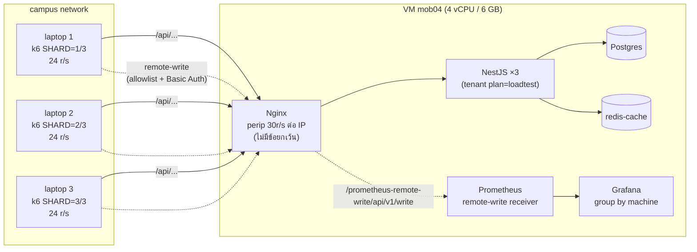

# 16 — Performance + Load Test: "เร็วพอไหม" วัดยังไงให้ตัวเลขไม่โกหก

> บทนี้ตอบคำถาม: **"ระบบเร็วพอสำหรับร้านไหม — แล้วเราจะวัดยังไงให้ได้ตัวเลขที่เชื่อได้ ไม่ใช่ตัวเลขที่วัดตัวจำกัดของตัวเองหรือวัด laptop ของเราเอง"**

---

## 🧭 ก่อนอ่าน

- **ต้องอ่านก่อน:** [00_index.md](00_index.md) (client/server, HTTP), [02_architecture.md](02_architecture.md) (Nginx → NestJS ×3 → Postgres/Redis), [06_backend.md](06_backend.md) (transaction, `runTx`), [14_devops.md](14_devops.md) (Docker Compose, Prometheus/Grafana)
- **ควรอ่านคู่กัน:** [12_testing.md](12_testing.md) — บทนั้นพูดถึง concurrency test "200 บิลบนสต็อก 50" ในมุม *ความถูกต้อง* บทนี้จะแยกให้เห็นว่ามันต่างจาก *performance* test ยังไง
- **เวลาที่ใช้:** ~70–90 นาที (+15 นาทีถ้ารัน demo ตามเอง)
- **อ่านจบแล้วคุณจะ…**
  - อธิบายได้ว่าทำไม p95 บอกความจริงได้ดีกว่าค่าเฉลี่ย และคำนวณ Little's law จากตัวเลข k6 จริงได้
  - บอกได้ว่าคอขวด (bottleneck) ของ stack นี้น่าจะอยู่ตรงไหน — CPU, RAM, DB connection, lock
  - อธิบาย "measurement contamination" ได้ด้วยตัวเลขจริงที่เรายิงเองในบทนี้ (rate limiter 2 ชั้น ตอบ 429 ก่อนระบบจะเหนื่อย)
  - รู้ว่าทำไมกล่อง DoD "k6 ผ่านเกณฑ์" เป็น **กล่องเดียวที่ยังไม่ติ๊ก** ใน phase 1 และวิธีวัดที่ทีมเคาะไว้ (§8.1) หน้าตาเป็นยังไง
  - แยกออกว่า test ไหนพิสูจน์ "ถูก" และ test ไหนพิสูจน์ "เร็ว"

> 🔴 **กันเข้าใจผิดตั้งแต่ต้น:** ณ วันที่เขียนบทนี้ (2026-09-25) **โปรเจกต์นี้ยังไม่มีตัวเลข performance ทางการเลย** —
> การวัดจริงคือ issue **#380** ซึ่งยังไม่ได้ทำ ตัวเลขทุกตัวในส่วน "Demo" ของบทนี้มาจาก **laptop เครื่องเดียว** เพื่อการสอน
> **ห้ามเอาไปอ้างว่าระบบผ่านเกณฑ์ และห้ามใช้ปิด #380**

---

## 🧱 ปูพื้นฐาน

### 1. "เร็ว" มีสองความหมาย: latency กับ throughput

> **Analogy — ร้านก๋วยเตี๋ยว:**
> - ลูกค้าหนึ่งคนสั่งแล้ว**รอกี่นาที**กว่าจะได้ชาม → นั่นคือ **latency**
> - ร้าน**ทำได้กี่ชามต่อชั่วโมง** → นั่นคือ **throughput**
>
> สองอย่างนี้ไม่เหมือนกัน: ร้านที่มีหม้อ 10 ใบ ทำได้ 200 ชาม/ชั่วโมง (throughput สูง) แต่ลูกค้าแต่ละคนอาจยังรอ 8 นาทีเท่าเดิม (latency ไม่ดีขึ้น)

นิยามแบบวิศวกร:

- **latency** (เวลาตอบสนอง) = เวลาตั้งแต่ client ส่ง request จนได้ response กลับมาครบ วัดเป็น ms (มิลลิวินาที)
- **throughput** (ปริมาณงานต่อหน่วยเวลา) = จำนวน request ที่ระบบทำเสร็จต่อวินาที มักเรียกว่า **RPS** (requests per second) หรือเขียน `r/s`
- **concurrency** (ความพร้อมกัน) = จำนวน request ที่ "กำลังอยู่ในระบบ" ณ ขณะใดขณะหนึ่ง — ในเครื่องมือ k6 เรียกผู้ใช้จำลองว่า **VU** (virtual user)

ทั้งสามตัวผูกกันด้วยสูตรเดียว (ข้อ 3 ข้างล่าง) — เข้าใจสูตรนี้แล้วตัวเลข load test จะอ่านออกทันที

### 2. ทำไมไม่ใช้ค่าเฉลี่ย — percentile p50 / p95 / p99

**percentile** = เรียง latency ของทุก request จากน้อยไปมาก แล้วดูว่าค่าที่ตำแหน่ง X% อยู่ที่เท่าไร

- **p50** (median) = ครึ่งหนึ่งของ request เร็วกว่านี้
- **p95** = 95% ของ request เร็วกว่านี้ — อีก 5% ช้ากว่า
- **p99** = 99% เร็วกว่านี้ — 1 ใน 100 คนเจอช้ากว่านี้

**ตัวอย่างตัวเลข (ตัวอย่างสมมติ)** — ยิง 100 request:

| จำนวน request | latency แต่ละตัว |
|---|---|
| 94 ตัว | 20 ms |
| 5 ตัว | 300 ms |
| 1 ตัว | 3,000 ms (3 วินาที) |

```
average = (94×20 + 5×300 + 1×3000) / 100 = (1880 + 1500 + 3000) / 100 = 63.8 ms   ← ดู "ดีมาก"
p50     = 20 ms      (ตัวที่ 50 ในลำดับ)
p95     = 300 ms     (ตัวที่ 95 — เริ่มเข้ากลุ่มช้า)
p99     = 300 ms     (ตัวที่ 99)
max     = 3000 ms
```

ค่าเฉลี่ย 63.8 ms บอกว่า "ทุกคนสบาย" แต่ความจริงคือ **6 คนจาก 100 รอ ≥ 300 ms และมีคนหนึ่งรอ 3 วินาที**
ถ้า 100 request นี้คือพนักงานหน้าร้านกดขายของ วันหนึ่งกดหลายร้อยครั้ง → เจอ "ค้าง" หลายครั้งต่อวันแน่นอน

**เพราะ** ค่าเฉลี่ยกลบ tail (หางของการกระจาย — กลุ่มที่ช้าที่สุด) → **จึง** เกณฑ์ของโปรเจกต์นี้เขียนเป็น p95 เสมอ (`p95 < 200ms` สำหรับอ่านสินค้า) → **ราคาที่จ่าย** คือต้องเก็บ distribution ทั้งก้อน (histogram) ไม่ใช่เก็บแค่ผลรวมกับจำนวน

> 🔴 **percentile รวมกันไม่ได้แบบบวกหาร.** p95 ของเครื่อง A = 100 ms, เครื่อง B = 300 ms → p95 รวม **ไม่ใช่** 200 ms
> (มันไม่ใช่สถิติเชิงเส้น) — เรื่องนี้จะกลับมาเป็นกฎสำคัญตอน §8.1 ที่ยิงจาก 3 เครื่อง

### 3. Little's law — สูตรเดียวที่ผูก concurrency, throughput, latency

```
L = λ × W

L = จำนวนงานที่อยู่ในระบบพร้อมกัน (concurrency)
λ = อัตรางานเข้า/ออก ต่อวินาที (throughput)
W = เวลาที่งานหนึ่งอยู่ในระบบ (latency)
```

> **Analogy:** ร้านก๋วยเตี๋ยวมีลูกค้าเข้า 2 คน/นาที (λ) แต่ละคนนั่งกิน 15 นาที (W) → ในร้านจะมีลูกค้านั่งอยู่ประมาณ 2 × 15 = **30 คน** (L) เสมอ
> ถ้าร้านมีแค่ 20 ที่นั่ง → คิวหน้าร้านยาวขึ้นเรื่อยๆ ไม่มีวันหมด

**ตรวจกับตัวเลขจริง** (จาก demo ท้ายบท, ยิง `/health/ready`):
k6 มี 10 VU แต่ละ VU ใช้เวลาต่อรอบ (ยิง + รอ `sleep(0.1)`) เฉลี่ย **109.7 ms**
→ λ = L / W = 10 / 0.1097 s ≈ **91.2 r/s** — k6 วัดได้จริง **91.08 r/s** ✅ ตรงกันเกือบเป๊ะ

บทเรียนที่ได้: **"ใส่ VU เพิ่ม" ไม่ได้แปลว่าโหลดเพิ่มเป็นเส้นตรง** — ถ้า latency (W) พุ่งขึ้น throughput จะไม่ขึ้นตาม
นี่คือเหตุผลที่สคริปต์ของ repo ในโหมดหลายเครื่อง **คุม "อัตรา r/s" ไม่ใช่คุม "จำนวน VU"** (จะเห็นใน 🔍)

### 4. คอขวด (bottleneck) — ระบบเร็วได้เท่าชิ้นที่ช้าที่สุด

> **Analogy — สายพานแพ็กของ:** มีคนหยิบของ 5 คน คนแพ็ก 5 คน แต่มีเครื่องพิมพ์ใบปะหน้า**เครื่องเดียว** → ทั้งสายพานเร็วได้แค่เท่าที่เครื่องพิมพ์ทำไหว เพิ่มคนหยิบอีก 10 คนก็ไม่ช่วย

คอขวดที่เจอบ่อยในระบบแบบนี้:

| ทรัพยากร | อาการเมื่อหมด | ใน stack นี้ |
|---|---|---|
| **CPU** | ทุก request ช้าลงพร้อมกัน, CPU% แตะ 100 | VM มี 4 vCPU แบ่งให้ทุก container |
| **RAM** | container โดน **OOM kill** (Out Of Memory — ระบบฆ่า process ที่กินเกิน) แล้ว restart | แต่ละ container มี `mem_limit` |
| **DB connection** | request ยืน "รอ connection" จน timeout ทั้งที่ CPU ว่าง | Postgres `max_connections=100` |
| **lock** (ล็อกแถวใน DB) | request ที่แก้แถวเดียวกันต้องต่อคิวกันทีละตัว | ขายสินค้าตัวเดียวกันพร้อมกัน → ล็อกแถว `products` |
| **rate limiter** | ตอบ `429 Too Many Requests` ทั้งที่ระบบข้างหลังยังว่าง | Nginx `perip` + tenant limiter |

แถวสุดท้ายสำคัญมาก: **rate limiter คือคอขวดที่เราตั้งใจสร้างเอง** — ถ้าไม่รู้ตัว จะวัดได้ "ระบบรับได้แค่ 30 r/s" ทั้งที่ความจริงคือ "ตัวจำกัดตั้งไว้ 30 r/s"

### 5. Connection pool — ทำไมไม่เปิด connection ใหม่ทุก request

**connection pool** (สระ connection) = ชุด connection ไป database ที่เปิดค้างไว้แล้วให้ request ยืมใช้แล้วคืน

> **Analogy — รถเข็นหน้าซูเปอร์ฯ:** ร้านมีรถเข็น 15 คัน ลูกค้าหยิบไปใช้แล้วคืน ไม่ต้องสร้างรถใหม่ทุกคน
> ถ้ารถหมด ลูกค้าคนต่อไปต้อง**ยืนรอ**จนมีคนคืน

ทำไมต้องมี: การเปิด connection ใหม่กับ Postgres ต้อง handshake + ยืนยันตัวตน + Postgres สร้าง process ใหม่ — แพงกว่า query ง่ายๆ หลายเท่า
แต่ pool ก็มีกับดัก 2 ข้อ:
1. **ขนาดรวมทุก process ต้องไม่เกิน `max_connections` ของ DB** — มี API 3 ตัว แต่ละตัว pool 15 → 45 แล้ว ยังต้องบวก worker และ pool อื่นๆ
2. **request เดียวห้ามยืม 2 คันพร้อมกัน** — ถ้าทุก request ถือ 1 คันแล้วรออีก 1 คัน เมื่อ request พร้อมกันเท่าขนาด pool จะ **deadlock** (ทุกคนรอกันเองตลอดไป) — เคยเกิดจริงในโปรเจกต์นี้ (#162, ดู ⚠️)

### 6. Caching — ทางลัดที่ทำให้ตัวเลขดูดีแบบ "ถูกต้อง"

**cache** = เก็บคำตอบที่เคยคำนวณไว้ในที่ที่อ่านเร็ว (เช่น Redis ในหน่วยความจำ) ครั้งหน้าถามซ้ำตอบจาก cache ไม่ต้องไป DB

> **Analogy:** คนขายหน้าร้านจำราคาหัวเทียนรุ่นขายดีได้ ไม่ต้องเดินไปเปิดสมุดทุกครั้ง — แต่ถ้าราคาเปลี่ยนต้อง "ลืม" ของเก่าให้ทัน (invalidation)

ผลต่อ load test: ถ้า request เป็น **cache HIT** เกือบหมด ตัวเลข latency จะวัด "Redis + Node" ไม่ได้วัด "Postgres"
นี่ไม่ผิด — ร้านจริงก็อ่านรายการสินค้าซ้ำๆ เหมือนกัน — แต่ต้อง**รายงาน cache hit rate คู่กับ latency เสมอ** ไม่งั้นคนอ่านแยกไม่ออก
เกณฑ์ของโปรเจกต์จึงเขียนว่า `GET /products`: p95 < 200ms **และ** cache hit > 90% (`02_API_SCREENS.md §9`)

### 7. Scale: แนวตั้ง vs แนวนอน

| | **vertical scaling** (ขยายแนวตั้ง) | **horizontal scaling** (ขยายแนวนอน) |
|---|---|---|
| ทำอะไร | เครื่องเดิม ใส่ CPU/RAM เพิ่ม | เพิ่มจำนวนเครื่อง/process ที่ทำงานเหมือนกัน |
| analogy | จ้างพ่อครัวคนเดิมให้ทำงานเร็วขึ้น | จ้างพ่อครัวเพิ่ม มีคนแจกออเดอร์ |
| ข้อดี | ไม่ต้องแก้โค้ด | ทนเครื่องตายได้ (ตัวหนึ่งพัง ตัวอื่นรับต่อ) |
| ราคา | มีเพดาน (VM คณะขยายไม่ได้แล้ว) | ต้องมี **load balancer** (ตัวกระจายงาน) และ app ต้อง stateless |

stack นี้ใช้แนวนอน**ในเครื่องเดียว**: NestJS 3 instance หลัง Nginx (`least_conn` — ส่งงานให้ตัวที่มี connection ค้างน้อยที่สุด)
ข้อสังเกต: ทั้ง 3 ตัวยังแชร์ 4 vCPU เดียวกัน และแชร์ Postgres ตัวเดียว → ช่วยเรื่อง "Node ใช้ CPU ได้ทีละ core" และทนตัวหนึ่งตาย แต่ **ไม่ได้เพิ่มเพดานของ DB**

### 8. Load test มีหลายแบบ — ถามคำถามคนละข้อ

| ชนิด | ทำอะไร | ตอบคำถาม |
|---|---|---|
| **load test** | ยิงที่ระดับที่คาดว่าจะเจอจริง ค้างไว้ช่วงหนึ่ง | "ในวันปกติ p95 เท่าไร ผ่านเกณฑ์ไหม" |
| **stress test** | เพิ่มโหลดไปเรื่อยๆ จนพัง | "พังที่เท่าไร พังแบบไหน (ช้า? 5xx? OOM?)" |
| **soak test** | โหลดปานกลาง แต่ยาวหลายชั่วโมง | "มี memory leak / connection รั่วไหม" |
| **spike test** | โหลดพุ่งทันทีแล้วหาย | "รับคลื่นกะทันหันได้ไหม (เช่นเปิดร้านเช้า)" |

scenario 04 ของ repo (mixed 80% อ่าน / 20% เขียน, 10 นาที) ใกล้ soak แบบสั้น; scenario 01 เป็น load test; ไม่มี stress test ทางการ

### 9. SLI / SLO — เปลี่ยน "เร็วพอ" ให้เป็นตัวเลขที่ตกลงกันได้

- **SLI** (Service Level Indicator) = สิ่งที่วัด เช่น "p95 latency ของ `GET /products`", "สัดส่วน request ที่ไม่ใช่ 5xx"
- **SLO** (Service Level Objective) = เป้าของ SLI นั้น เช่น "p95 < 200 ms", "error < 0.1%"

ถ้าไม่มี SLO → "เร็วพอไหม" เป็นเรื่องความรู้สึก เถียงกันไม่จบ
ถ้ามี SLO → ผ่าน/ไม่ผ่าน ตัดสินด้วยตัวเลข (k6 เรียกว่า **threshold** — ถ้าเกิน k6 exit code ไม่เป็น 0)

### 10. Measurement contamination — ตัวเลขที่ "วัดผิดของ"

**contamination** (การปนเปื้อน) = ตัวเลขที่ได้สะท้อนอย่างอื่น ไม่ใช่ระบบที่เราอยากวัด แหล่งปนเปื้อนหลักๆ:

1. **เครื่องยิง (load generator) อยู่เครื่องเดียวกับ server** → k6 แย่ง CPU กับ server เอง ยิ่งยิงหนัก server ยิ่งช้า เพราะ k6 ไม่ใช่เพราะโค้ด
2. **rate limiter ต่อ IP** → VU ทุกตัวในเครื่องเดียวใช้ IP เดียว ตัวจำกัดตอบ 429 ก่อนระบบจะเหนื่อย → วัดได้ "ความเร็วของการปฏิเสธ"
3. **429 เร็วกว่า 200** → ถ้าเอา request ที่โดนปฏิเสธมารวมใน p95 → p95 **ดูดีขึ้น** ทั้งที่ลูกค้าไม่ได้ของ (เห็นกับตาใน demo)
4. **ทางเข้าไม่เหมือนจริง** → ยิงผ่าน SSH tunnel = วัด tunnel; ยิงตรงเข้า API ตัวเดียว = ไม่ได้ผ่าน load balancer
5. **ข้อมูลไม่เหมือนจริง** → DB ว่าง 10 แถว กับ 50,000 แถว คนละเรื่องกัน

### 11. ทำไมตัวเลขจาก laptop ≠ production

- **CPU/RAM ต่างกัน** — laptop ที่เขียนบทนี้เป็น Apple M2 8 core / 16 GB, Docker Desktop ได้ 8 CPU / ~5.8 GiB; VM คณะมี 4 vCPU / 6 GB
- **network ต่างกัน** — `localhost` ไม่มี latency ของสาย/Wi-Fi/FortiGate ของคณะ
- **k6 อยู่เครื่องเดียวกัน** — ข้อ 10.1
- **สถาปัตยกรรม CPU ต่างกัน** — ARM (M2) vs x86 ของ VM
- **ข้อมูลในร้านทดลองมีสินค้า 1 ชิ้น** — ร้านจริงมีหลายร้อยรายการ

สรุปคือ: laptop ใช้ **ฝึกอ่านตัวเลขและหาบั๊กชัดๆ** ได้ แต่ **ใช้ตัดสิน SLO ไม่ได้**

---

## 🔥 ปัญหาจริงของร้าน

ร้านศรีสุรัตน์เป็นร้านเดียว เครื่องขายไม่กี่เครื่อง — ฟังดูไม่ต้องห่วงเรื่องโหลด ทำไมโปรเจกต์ถึงให้ความสำคัญ?

1. **ระบบเป็น multi-tenant** (หลายร้านใช้ server เดียว) — วันหนึ่งถ้ามีหลายร้าน โหลดรวมกันบนเครื่อง 4 vCPU / 6 GB เครื่องเดียว
2. **เกณฑ์ของคอร์สกำหนด** — `02_API_SCREENS.md §9` ผูก load test เข้ากับเกณฑ์คอร์ส (1,000 VU อ่าน, 200 VU เขียน, ฯลฯ)
3. **ความเร็วหน้าเคาน์เตอร์คือเงิน** — กดขายแล้วค้าง 3 วินาทีตอนลูกค้าช่างยืนรอ 5 คน = ร้านเสียลูกค้า
4. **ความถูกต้องภายใต้โหลด** — สองเครื่องขายสินค้าชิ้นสุดท้ายพร้อมกัน ต้องไม่ขายเกินสต็อก (นี่คือ correctness ไม่ใช่ speed — ดูตารางถัดไป)

และตัวปัญหาที่หนักจริงไม่ได้อยู่ที่ "ทำให้เร็ว" แต่อยู่ที่ **"วัดให้สะอาด"** — ทีมเคยวัดแล้ว (#184, 2026-09-15) แต่ไม่มีเส้นทางไหนสะอาดเลย (ดู ⚠️) จึงยังไม่มีตัวเลขทางการจนวันนี้

### Correctness test vs Performance test — คนละคำถาม

| | **concurrency correctness test** | **performance test** |
|---|---|---|
| คำถาม | "ทำพร้อมกันแล้วผลยัง**ถูก**ไหม" | "ทำแล้ว**เร็ว**พอไหม ที่โหลดเท่านี้" |
| ตัวอย่างในโปรเจกต์ | ยิง `POST /sales` 200 ครั้งพร้อมกันบนสินค้าสต็อก 50 → ต้องได้ 50 บิลพอดี สต็อก 0 ไม่ติดลบ | `GET /products` p95 < 200ms ที่ 1,000 VU |
| ผ่าน/ไม่ผ่านดูจาก | ข้อมูลใน DB (`pnpm k6:verify`) | distribution ของ latency + error rate |
| ถูกรบกวนจาก contamination ไหม | **แทบไม่** — ถึงช้าหรือโดน 429 บ้าง ข้อมูลที่เข้าไปได้ก็ต้องถูก | **มาก** — ตัวเลขทั้งหมดขึ้นกับทางเข้าและเครื่องยิง |
| สถานะ DoD | ✅ ติ๊กแล้ว (`03_ARCHITECTURE.md:555`) | 🔴 ยังเปิด (`03_ARCHITECTURE.md:554`) → #380 |

นี่คือเหตุผลที่กล่องแรก "ผ่าน" ได้ตั้งแต่ 2026-09-15 ทั้งที่ latency ทุกเส้นทางไม่สะอาด — **เพราะ** correctness ไม่สนว่าเร็วแค่ไหน **จึง** พิสูจน์ได้แม้ทางเข้าไม่สมบูรณ์ **ราคา** คือห้ามเอาตัวเลขเวลาจากรอบนั้นไปอ้างเรื่องความเร็ว

---

## ⚖️ ทางเลือก → ทำไมเลือกอันนี้

### ยิงโหลดจากไหน? (คำถามที่กินเวลาทีมมากที่สุด)

ข้อจำกัดที่ต้องเคารพพร้อมกัน:
- VM ของคณะ 4 vCPU / 6 GB — "**ห้ามรัน k6 บน VM นี้**" (`03_ARCHITECTURE.md:621`)
- Nginx มี `limit_req zone=perip rate=30r/s burst=60` ต่อ IP
- เกณฑ์ต้องวัด**ผ่าน edge จริง** (Nginx) ไม่ใช่อ้อม

| ทางเลือก | ปนเปื้อนแบบไหน | ผล |
|---|---|---|
| A. เครื่องเดียว ยิงผ่าน Nginx | ทุก VU ใช้ IP เดียว → `perip` ตอบ 429 ก่อนระบบเหนื่อย | ❌ วัด rate limiter (#184: 97.51% ของ request เป็น 429) |
| B. SSH tunnel ตรงเข้า `api-1` | ทุกอย่างไหลผ่าน SSH connection เดียว เข้า Node ตัวเดียว | ❌ วัด tunnel (#184: p95 11.6 s) |
| C. k6 บน VM เอง | k6 แย่ง 4 vCPU กับ stack + โดนแค่ `api-1` | ❌ ใช้เป็น diagnostic เท่านั้น |
| D. ยกเว้น IP เครื่องยิงออกจาก `perip` | carve-out ค้างบน production + 1 IP ที่ผ่าน edge แบบปิดตัวจำกัด ไม่เหมือนทราฟฟิกจริง | ❌ **owner ปฏิเสธ** (2026-09-22) |
| **E. 3 เครื่องพร้อมกัน แต่ละเครื่องอยู่ใต้ `perip` ของตัวเอง ส่งผลเข้า Prometheus ของ VM ผ่าน remote-write** | ปนเปื้อนน้อยสุดภายใต้ข้อจำกัด | ✅ **เคาะแล้ว** (#251, 2026-09-15; ยืนยันซ้ำ 2026-09-22) |

**เพราะ** ทุกทางที่ยิงจากเครื่องเดียววัด "ของผิดชิ้น" และการเปิดช่องโหว่ถาวรแลกความสะดวกครั้งเดียวไม่คุ้ม
→ **จึง** ใช้ 3 laptop ของทีม แต่ละตัวยิงที่ **24 r/s** (80% ของ 30 r/s) → รวม **~72 r/s**
→ **ราคาที่จ่าย:** (1) ต้องนัดสามคนพร้อมกัน (2) ตัวเลขที่ได้พิสูจน์ "tail latency ที่ ~72 r/s ผ่าน edge จริง" **ไม่ได้พิสูจน์ว่ารับ 1,000 คนพร้อมกันได้** (`03_ARCHITECTURE.md` §8.1 เขียนตรงๆ ว่าข้อนั้นยังไม่มีวิธีวัดสะอาด) (3) p95 ต้องผ่าน**ทีละเครื่อง** รวมกันไม่ได้

### เครื่องมือยิงโหลด

| เครื่องมือ | จุดเด่น | ทำไมไม่เลือก / ทำไมเลือก |
|---|---|---|
| **k6** | เขียน scenario เป็น JavaScript, threshold ในตัว, ส่งผลเข้า Prometheus ได้ (`experimental-prometheus-rw`) | ✅ ใช้ — เข้ากับ Prometheus/Grafana ที่มีอยู่แล้ว และคอร์สใช้ |
| JMeter | GUI, เก่าแก่ | ตั้งค่าเป็น XML, หนัก, ไม่เข้ากับ stack |
| `ab` / `wrk` | เร็ว เบา | ยิง URL เดียว เขียน flow login → ขาย ยาก ไม่มี threshold |

---

## 🔍 ของจริงใน repo

### 1. ตัวจำกัดชั้นนอก: Nginx `perip`

`server/docker/nginx/nginx.conf:25-26`
```nginx
  limit_req_zone $binary_remote_addr zone=perip:10m rate=30r/s;
  limit_req_status 429;
```
`server/docker/nginx/nginx.conf:78-80` และ `:97-100`
```nginx
    location /health/ {
      proxy_pass http://api;
    }
    ...
    location /api/ {
      limit_req zone=perip burst=60 nodelay;
      proxy_pass http://api;
    }
```

- **ทำอะไร:** นับ request ต่อ IP (`$binary_remote_addr`) แบบ **token bucket** — เติม 30 เหรียญ/วินาที ถังจุ 60 เหรียญ (`burst=60`); `nodelay` = ถ้ามีเหรียญก็ผ่านทันที ถ้าหมดตอบ 429 ทันที ไม่ให้รอคิว
- **ทำไม `/health/` ไม่มีบรรทัด `limit_req`:** comment ในไฟล์บอกว่า health probe ห้ามโดนจำกัด ไม่งั้น load balancer จะคิดว่า instance ตาย → ในบทนี้เราใช้ `/health/ready` เป็น **baseline ที่ไม่มีตัวจำกัด** ได้พอดี
- **ถ้าไม่มี:** ใครก็ยิงถล่ม `/api/v1/auth/token` เดารหัสได้ไม่จำกัด (เป็นด่านแรกก่อน login)

### 2. ตัวจำกัดชั้นใน: per-tenant limiter ใน NestJS

`server/src/rate-limit/rate-limit.service.ts:12-13` และ `:72-75`
```ts
const DEFAULT_LIMIT = 300;
const DEFAULT_WINDOW_SEC = 60;
...
      // ADR-0006: 'loadtest' plan is unlimited so k6 measures the system rather than limiter
      if (plan === 'loadtest') {
        return { allowed: true };
      }
```
`server/src/rate-limit/tenant-rate-limit.guard.ts:33` (health ยกเว้น) และ `:92-95` (ตอบ 429 พร้อม code ภาษาไทย)
```ts
          code: 'RATE_LIMITED',
          message: 'ระบบกำลังทำงานหนัก กรุณารอสักครู่',
        },
        HttpStatus.TOO_MANY_REQUESTS,
```

- **ทำอะไร:** ร้านหนึ่ง (tenant) ยิง route เดียวกันได้ **300 ครั้งต่อหน้าต่าง 60 วินาที** (นับใน Redis ด้วย Lua `INCR`) — กันร้านเดียวกินทรัพยากรของทุกร้าน (ADR-0006)
- **ทำไมมี plan `loadtest`:** `02_API_SCREENS.md §9` เตือนไว้บรรทัดแรกเลยว่า ถ้าไม่ปิดตัวจำกัดนี้ให้ร้านที่ใช้ยิง k6 "ตัวเลขที่ได้คือการวัด rate limiter ของตัวเอง" — `pnpm k6:setup` จึงสร้าง tenant ที่ `plan='loadtest'`
- **สังเกต:** ยกเว้นเฉพาะชั้น**ใน**ต่อร้าน ส่วนชั้น**นอก**ต่อ IP (Nginx) **ไม่ยกเว้น** — นั่นคือการตัดสินใจ §8.1
- **fail-open:** ถ้า Redis ล่ม ตัวจำกัดปล่อยผ่าน (`:109`) — POS ต้องขายต่อได้ ดีกว่าบล็อกทั้งร้าน

### 3. load balancer: `least_conn` กระจายไป 3 instance

`server/docker/nginx/nginx.conf:33-39`
```nginx
  upstream api {
    least_conn;
    server 172.30.0.11:3000 max_fails=2 fail_timeout=10s;
    server 172.30.0.12:3000 max_fails=2 fail_timeout=10s;
    server 172.30.0.13:3000 max_fails=2 fail_timeout=10s;
    keepalive 32;
  }
```
- `least_conn` ส่ง request ถัดไปให้ตัวที่ **connection ค้างน้อยที่สุด** — ดีกว่า round-robin (วนทีละตัว) เมื่อ request ใช้เวลาไม่เท่ากัน (อ่านสินค้า 5 ms vs ปิดกะ 500 ms)
- `keepalive 32` = Nginx เปิด connection ไป upstream ค้างไว้ใช้ซ้ำ ไม่ต้อง handshake TCP ใหม่ทุก request (หลักเดียวกับ connection pool)
- ใน demo เราเห็นการกระจายจริง: 5 นาทีล่าสุด `GET /products` ลงที่ api-1 ≈ 527, api-3 ≈ 519, api-2 ≈ 460 (Prometheus `increase()`, ค่าประมาณ)

### 4. งบ RAM และงบ DB connection

`server/docker-compose.yml:11-14`
```yaml
# Memory budget (faculty VM 4 vCPU / 6 GB): 1024 + 2×256 + 3×384 + 256 + 128 + 64 + 256 (etcd)
# ≈ 3.3 GB.
# Connections: max_connections=100 → 3 api × (15 request + 2 audit + 1 health + 2 admin) +
# worker × (5 + 2 + 1 + 2) = 70 ≤ 80 (80%). The admin pool is platform-plane only, fixed at 2
# (server/README.md *Invariants this stack enforces*).
```
อ่านทีละส่วน:
- **RAM:** Postgres 1024 MB + Redis 2 ตัว × 256 + API 3 × 384 + worker 256 + bull-board 128 + nginx 64 + etcd 256 ≈ 3.3 GB → เหลือหัวให้ OS และ monitoring ใน 6 GB. ทุกตัวมี `mem_limit` (เช่น `docker-compose.yml:58` `mem_limit: 384m` ของ API) เพื่อว่า NestJS รั่วแล้วโดน OOM kill **คนเดียว** ไม่ลาก Postgres ตายไปด้วย
- **Connection:** 3 × (15 + 2 + 1 + 2) + (5 + 2 + 1 + 2) = 60 + 10 = **70** ≤ 80 (80% ของ `max_connections=100`) — กฎจาก `03_ARCHITECTURE.md`: `instances × (1 + replicas) × poolSize ≤ 80%` "สาเหตุอันดับ 1 ของ too many connections" — `ADMIN_DATA_SOURCE` (owner role, platform plane เท่านั้น) เคยเป็นขนาด `DB_POOL_SIZE` และอยู่นอกตัวเลขนี้ ตอนนี้ตรึงไว้ที่ 2 ต่อ process แล้วนับรวม (#421)
- **ทำไมเผื่อ 20%:** ให้ superuser/psql ของคนดูแล, migration, และ burst ตอนระบบเต็ม
- **ถ้าจะ scale เป็น API 4 ตัว:** 4 × 20 + 10 = 90 → ทะลุเพดาน 80% ไปแล้ว (เดิมตอน admin pool ยังไม่นับรวม 4 × 18 + 8 = 80 พอดีเพดาน) ต้องลด pool หรือเพิ่ม `max_connections` ก่อน — **การเพิ่ม instance ไม่ฟรี**

`DB_POOL_SIZE` ถูกตั้งเป็น 15 ต่อ API ใน compose (`docker-compose.yml:142`) ส่วน worker ตั้ง `"5"` (`:169`); ค่า default ในโค้ดถ้าไม่ตั้งคือ 5 (`server/src/config/config.ts:109`)

### 5. เพดาน 25 วินาที: transaction ที่นานเกินต้องถูกยกเลิก

`server/src/common/database/commit-ceiling.ts:9` และ `:15-18`
```ts
export const TX_COMMIT_CEILING_MS = 25_000;
...
export const APP_ROLE_TIMEOUTS = {
  statement_timeout: '25s',
  idle_in_transaction_session_timeout: '5s',
} as const;
```
- **ทำอะไร:** transaction ไหนเปิดนานกว่า 25 วินาที → rollback แล้วโยน `CommitCeilingExceededError` **ก่อน** `COMMIT` (#213); role `pos_app` ใน Postgres ก็ตั้ง `statement_timeout=25s` ซ้อนอีกชั้น
- **เกี่ยวกับ performance ยังไง:** ภายใต้โหลดหนัก transaction ที่ค้าง = ถือ connection จาก pool ค้าง = คนอื่นยืมไม่ได้ → คอขวดลาม. เพดานนี้ตัดหาง (tail) ที่ยาวผิดปกติทิ้ง และเกี่ยวกับ sync ของ client ที่ย้อนเวลาอ่าน 30 วินาที (ADR-0010) — ถ้า commit ช้ากว่านั้น client อาจพลาดแถว
- **ห้าม:** ตั้ง `statement_timeout` ≤ `CLAIM_LOCK_TIMEOUT` (CLAUDE.md) — จะทำให้ `503 IDEMPOTENCY_KEY_IN_FLIGHT` ไม่มีวันเกิด

### 6. Metric ฝั่ง server — histogram ที่ทำให้ p95 คำนวณได้

`server/src/metrics/metrics.service.ts:34-37`
```ts
      name: 'http_request_duration_seconds',
      ...
      buckets: [0.005, 0.01, 0.025, 0.05, 0.1, 0.25, 0.5, 1, 2.5, 5, 10],
```
- **histogram** = นับว่ามี request กี่ตัวที่ ≤ 5ms, ≤ 10ms, ≤ 25ms, … แทนที่จะเก็บทุกค่า → Prometheus ประมาณ p95 จาก bucket ด้วย `histogram_quantile()` (เป็นค่า**ประมาณ**จากการ interpolate ในช่อง bucket ไม่ใช่ค่าเป๊ะ)
- `server/src/metrics/metrics.middleware.ts:33` — `/metrics`, `/health/live`, `/health/ready` **ไม่ถูกนับ** เพราะ scrape + healthcheck สร้าง 200 "ปลอม" ~36 ครั้งต่อนาที ทำให้ success rate ดูดีเกินจริง (CLAUDE.md, Metrics) — นี่ก็เป็นการกัน contamination อีกแบบ
- ⚠️ server เห็นแค่ request **ที่ผ่าน Nginx เข้ามาแล้ว** — 429 ที่ Nginx ตอบเอง server ไม่เคยรู้ (demo จะเห็นชัด)

### 7. สูตรแบ่งโหลดต่อเครื่อง (shard)

`server/test/k6/lib/shard.js:16-17` และ `:26-27`
```js
export const NGINX_RATE_PER_IP = 30; // r/s
export const NGINX_BURST_PER_IP = 60; // requests
...
export const SAFE_RATE_PER_SHARD = NGINX_RATE_PER_IP * RATE_SAFETY_MARGIN; // 24 r/s
export const SAFE_BURST_PER_SHARD = NGINX_BURST_PER_IP * BURST_SAFETY_MARGIN; // 45 requests
```
- **ทำไมไม่ใช้เต็ม 30:** เวลาจริงแกว่ง (network, clock ของ laptop) — ถ้าวางแผนเต็มถัง แกว่งนิดเดียวก็เกิด 429 แล้วรอบนั้นใช้ไม่ได้
- `assertRateSafe()` (`shard.js:96-103`) **โยน error ก่อนยิงแม้แต่ request เดียว** ถ้าใครตั้ง `RATE_PER_SHARD` เกิน 24 — กันคนพลาดตั้งค่าผิดแล้วได้ข้อมูลปนเปื้อนโดยไม่รู้ตัว

### 8. สคริปต์ k6 ของ repo: สองโหมดในไฟล์เดียว

`server/test/k6/01-read-products.js:23-49` (ย่อ)
```js
    read_heavy: shardInfo
      ? {
          executor: 'ramping-arrival-rate',   // คุม "อัตรา r/s"
          ...
          stages: [
            { duration: '5s', target: Math.round(ratePerSecond * 0.33) },
            { duration: '10s', target: ratePerSecond },
            { duration: '15s', target: ratePerSecond },
            { duration: '5s', target: 0 },
          ],
        }
      : {
          executor: 'ramping-vus',            // คุม "จำนวน VU" (เดิม: ขึ้นไป 1000)
          ...
```
`:51-56`
```js
  thresholds: {
    // Rubric requirement: p95 < 200ms, cache hit > 90%, error < 0.1%
    http_req_duration: ['p(95)<200'],
    cache_hits: ['rate>0.90'],
    http_req_failed: ['rate<0.001'],
  },
```
- **มี `SHARD=i/N`** → เปลี่ยนเป็น `ramping-arrival-rate` (k6 เติม VU เองเพื่อรักษาอัตรา r/s) — นี่คือ Little's law ใช้งานจริง: คุม λ ตรงๆ แทนที่จะคุม L แล้วหวังว่า λ จะออกมาพอดี
- **ไม่มี `SHARD`** → ทำงานแบบเดิมก่อน #251 (1,000 VU) — ห้ามรันแบบนี้ผ่าน Nginx จากเครื่องเดียว จะได้ 429 ท่วม
- `thresholds` คือ SLO ในรูปโค้ด — ถ้าไม่ผ่าน k6 exit code ≠ 0

### 9. Remote-write: 3 เครื่องส่งผลเข้าที่เดียว

`deploy/compose/monitoring.yml:58-61`
```yaml
      # #251: accepts remote_write pushes from the distributed k6 shards, reached only through
      # Nginx's allowlisted + Basic-Auth-gated /prometheus-remote-write/ location (never this
      # service's own loopback port, and never a new published port — server/docker/nginx/nginx.conf).
      - "--web.enable-remote-write-receiver"
```
- ปกติ Prometheus **ดึง** (scrape) metric จาก target เอง; **remote-write** = กลับทาง ให้ k6 **ดัน** ผลเข้า Prometheus
- ทางเข้าเป็น `location = /prometheus-remote-write/api/v1/write` ใน `nginx.conf` (exact match เฉพาะ endpoint เขียน) — ต้องผ่าน **ทั้ง** IP allowlist **และ** Basic Auth (CIDR ของ campus ยังเป็น `TODO(owner)`)
- ไม่เปิด port ใหม่ ไม่แตะ firewall (ยังคง 22/80/443)

ภาพรวม §8.1:



กติกาอ่านผล (`server/test/k6/README.md` "Reading the numbers"):
- **p95 เป็นค่าต่อเครื่อง** — แต่ละเครื่องต้องผ่านเกณฑ์เอง ห้ามเอามาเฉลี่ย (ข้อ 2 ของปูพื้นฐาน)
- **canary ของความสะอาด:** `sum(increase(k6_http_reqs_total{status="429"}[$__range])) by (machine)` **ต้องเป็น 0 ทุกเครื่อง** — ถ้าเครื่องไหนมี 429 = รอบนั้นของเครื่องนั้นปนเปื้อน ทิ้งแล้วรันใหม่
- **ระวัง NAT:** ถ้า 2 laptop อยู่หลัง VPN/proxy ตัวเดียวกัน Nginx จะเห็นเป็น IP เดียว → งบต่อเครื่องหายไปครึ่งหนึ่งโดยไม่รู้ตัว

### 10. เครื่องมือวัด RAM ของ container ระหว่างยิง

`deploy/scripts/measure-container-rss.sh:1-4`
```bash
#!/usr/bin/env bash
# measure-container-rss.sh — Continuous container RSS and host memory sampler under load
# for Issue #184 (Slice 22), per 03_ARCHITECTURE.md §8 and 08_PHASE2_SPEC.md §17.
#
```
เก็บ RAM/CPU ของทุก container ทุก 2 วินาที (`INTERVAL=2`) เทียบเพดาน 6 GB (`CEILING_MB=6144`) — **RSS** (Resident Set Size) = RAM ที่ process ใช้อยู่จริงในหน่วยความจำ
🔴 สคริปต์นี้**มีแล้ว แต่ยังไม่เคยถูกรันบน VM ระหว่าง k6 ทางการ** — เป็นส่วนหนึ่งของ #380 ที่ยังไม่ได้วัด

---

## 🧪 Demo: ยิง k6 เบาๆ บน laptop เครื่องเดียว

> 🔴🔴 **ไม่ใช่ตัวเลขทางการ — laptop เดียว, ไม่ใช่วิธี §8.1, ห้ามใช้ปิด #380**
> k6 รันบนเครื่องเดียวกับ Docker stack (ปนเปื้อนแบบข้อ 10.1), ทุก VU ใช้ IP เดียว (ข้อ 10.2), ร้านทดลองมีสินค้า 1 ชิ้น, Apple M2 ไม่ใช่ VM x86 ของคณะ
> จุดประสงค์เดียว: **ให้เห็นกับตาว่า contamination หน้าตาเป็นยังไง** และฝึกอ่านผล k6

**สภาพแวดล้อม (รันจริง 2026-09-25):** stack `-p studylab` จาก [17_lab.md](17_lab.md) (Nginx + NestJS ×3 + Postgres + Redis ×2 + etcd + worker + bull-board + monitoring overlay), ร้าน `studylab` plan=`demo` (**ไม่ใช่** `loadtest` — ตั้งใจให้เห็นตัวจำกัดชั้นใน), k6 v2.2.0 (Homebrew) บน host, token ของ `labowner` (ได้จาก `POST /api/v1/auth/token` ตาม 14_lab Step 2.6 — ไม่พิมพ์ค่า token ออกมา)

### รอบ 1 — baseline: `/health/ready` (ไม่มีตัวจำกัดทั้งสองชั้น)

สคริปต์ตัวอย่างสำหรับบทเรียน (**ไม่ใช่ของ repo**):
```js
import http from 'k6/http';
import { check, sleep } from 'k6';
export const options = { vus: 10, duration: '30s', insecureSkipTLSVerify: true };
export default function () {
  const r = http.get('https://localhost/health/ready');
  check(r, { 'status 200': (x) => x.status === 200 });
  sleep(0.1);
}
```
`insecureSkipTLSVerify` จำเป็นเพราะ cert ของ lab เป็น self-signed (ใช้ใน lab เท่านั้น)

ผลจริง (ตัดมาเฉพาะส่วนสำคัญ):
```
    checks_succeeded...: 100.00% 2736 out of 2736
    http_req_duration..............: avg=8.98ms  min=1.18ms   med=7.33ms   max=95.09ms  p(90)=15.51ms  p(95)=18.52ms
    http_req_failed................: 0.00%  0 out of 2736
    http_reqs......................: 2736   91.082822/s
    iteration_duration.............: avg=109.7ms min=101.42ms med=108.01ms max=195.13ms p(90)=116.63ms p(95)=119.73ms
```
อ่านผล:
- ~91 r/s ไม่มี error เลย — ตรงกับ Little's law (10 / 0.1097 ≈ 91.2)
- **avg 8.98 ms แต่ max 95 ms** — ห่างกัน 10 เท่า นี่คือ tail ที่ค่าเฉลี่ยซ่อนไว้; p95 = 18.52 ms
- `/health/ready` แตะ DB + Redis จริง (`01_architecture` / DoD) จึงไม่ใช่ endpoint ว่างเปล่า แต่ก็ไม่ใช่ `GET /products`

### รอบ 2 — ยิงเกินตัวจำกัด: `GET /api/v1/products` 10 VU × 30s

สคริปต์เดียวกัน เปลี่ยน URL เป็น `/api/v1/products?page=1&limit=20` ใส่ `Authorization: Bearer …` และนับ 429 แยกตามแหล่ง: body มี `RATE_LIMITED` = NestJS (ชั้นใน), ไม่มี = Nginx (ชั้นนอก)

```
    checks_succeeded...: 18.98% 526 out of 2770
    rejected_by_nginx_perip........: 1813   60.401216/s
    rejected_by_tenant_limiter.....: 431    14.359031/s
    http_req_duration..............: avg=7.42ms   min=314µs    med=6ms      max=25.95ms  p(90)=15.53ms  p(95)=17.7ms
      { expected_response:true }...: avg=13.35ms  min=2.56ms   med=13.25ms  max=25.95ms  p(90)=19.52ms  p(95)=20.82ms
    http_req_failed................: 81.01% 2244 out of 2770
    http_reqs......................: 2770   92.284263/s
```

อ่านผล — นี่คือหัวใจของบท:

1. **81% ของ request ล้มเหลว แต่ระบบข้างหลังสบายมาก** — `docker stats` ระหว่างยิง (วินาทีที่ ~15): API แต่ละตัว CPU 3.8–5.9%, RAM ~83.5 MiB จาก 384 MiB; Postgres 44 MiB. ไม่มีอะไรเหนื่อยเลย ตัวที่ "ทำงาน" คือตัวจำกัด
2. **คณิตศาสตร์ของ token bucket ตรงเป๊ะ:** Nginx ปล่อยผ่าน 526 + 431 = **957** ≈ 30 r/s × 30 s + burst 60 = **960**
3. **ตัวจำกัดสองชั้นทำงานต่อกัน:** จาก 957 ที่ผ่าน Nginx มี 431 ที่ NestJS ปฏิเสธเพราะร้านนี้ใช้ quota 300 ครั้ง/นาทีของ route นี้หมด (รอบนี้คร่อมสองหน้าต่างนาที ~300 + ~226 = 526 ที่ได้ 200)
4. **p95 ของ "ทุก request" = 17.7 ms แต่ p95 ของ "request ที่สำเร็จ" = 20.82 ms** — 429 ตอบเร็วมาก (min 314 µs) จึง**ดึง p95 ให้ดูดีขึ้น** ถ้ารายงานแค่ตัวแรก = รายงานว่า "ระบบเร็ว" ทั้งที่ลูกค้า 81% ไม่ได้ของ (contamination ข้อ 10.3)

### รอบ 3 — สคริปต์ของ repo เอง ที่อัตราปลอดภัย: `01-read-products.js` + `SHARD=1/1`

ใช้ไฟล์ `server/test/k6/01-read-products.js` + `lib/shard.js` **ไม่แก้สักบรรทัด** (copy ไปไว้ใน scratchpad พร้อม `k6-env.json` ที่ทำมือ: `baseUrl` + token ของ owner — ของจริงสร้างด้วย `pnpm k6:setup` ซึ่งต้องต่อ Postgres ตรง จึงใช้กับ stack lab นี้ไม่ได้)
รอจนขึ้นนาทีใหม่ (ให้หน้าต่างของ tenant limiter รีเซ็ต) แล้วรัน:
```bash
SHARD=1/1 k6 run --insecure-skip-tls-verify 01-read-products.js
```
```
    ✗ status is 200
      ↳  50% — ✓ 300 / ✗ 299
    cache_hits.....................: 50.08% 300 out of 599
    http_req_duration..............: avg=7.76ms   min=1.43ms   med=7.48ms   max=35.47ms  p(90)=11.33ms  p(95)=13.27ms
      { expected_response:true }...: avg=8.89ms   min=2.14ms   med=8.52ms   max=35.47ms  p(90)=12.14ms  p(95)=14.86ms
    http_req_failed................: 49.91% 299 out of 599
    http_reqs......................: 599    17.113246/s
level=error msg="thresholds on metrics 'cache_hits, http_req_failed' have been crossed"
```
และจาก access log ของ Nginx ช่วงเดียวกัน: รอบนี้ **Nginx ตอบ 429 เอง = 0 ครั้ง** (ทุก 429 มี `upstream_status` = มาจาก NestJS)

อ่านผล:
- **ชั้นนอกสะอาดแล้ว** — 24 r/s ต่ำกว่า 30 r/s ของ `perip` ✅ นี่คือเหตุผลที่ `shard.js` เลือก 80%
- **แต่ชั้นในยังปนเปื้อน** — ได้ 200 **300 ครั้งพอดี** แล้วที่เหลือ 299 ครั้งเป็น `RATE_LIMITED` = quota 300/นาทีของ plan `demo`. จำนวน request รวม 599 ตรงกับที่คำนวณจาก stages (5s×~4 + 10s×~16 + 15s×24 + 5s×~12 ≈ 600)
- **threshold ล้ม** (`http_req_failed` 49.9% > 0.1%, `cache_hits` 50% < 90%) — ซึ่ง**ถูกต้อง**: k6 บอกเราว่ารอบนี้ใช้ไม่ได้ ไม่ใช่บอกว่าระบบช้า. `cache_hits` ต่ำเพราะ 429 ไม่มี header `X-Cache` — request ที่ได้ 200 ทั้ง 300 ตัวเป็น HIT หมด
- **บทเรียน:** นี่คือเหตุที่ `pnpm k6:setup` ต้องสร้าง tenant `plan='loadtest'` ก่อนยิง — ตรงตามคำเตือนใน `02_API_SCREENS.md §9` ทุกตัวอักษร

### มุมมองจาก server: Prometheus เห็นอะไร

```bash
curl -s -G http://127.0.0.1:9090/api/v1/query \
  --data-urlencode 'query=sum by (method,status_code) (http_requests_total{route="/api/v1/products"})'
```
```
{'method': 'GET', 'status_code': '200'} 829
{'method': 'GET', 'status_code': '429'} 730
{'method': 'GET', 'status_code': '401'} 1
{'method': 'POST', 'status_code': '201'} 1
```
- 829 = 526 (รอบ 2) + 300 (รอบ 3) + 3 (จาก Lab 2 ใน 17_lab); 730 = 431 + 299 → **ตรงกับ k6 ทุกตัว**
- แต่ **1,813 ครั้งที่ Nginx ปฏิเสธ ไม่มีในนี้เลย** — ถ้าดูแค่ dashboard ฝั่ง server จะไม่รู้ว่ามีคนโดนปฏิเสธเกือบ 2 พันครั้ง → ต้องดูทั้งฝั่ง client (k6) และ edge (access log)

p95 ที่ server คำนวณเอง (histogram, 5 นาที, รวม 429 ของชั้นใน):
```
histogram_quantile(0.95, sum by (le) (rate(http_request_duration_seconds_bucket{route="/api/v1/products"}[5m])))  → 0.0187 s (~18.7 ms)
histogram_quantile(0.50, ...)                                                                                        → 0.0052 s (~5.2 ms)
```
ใกล้กับที่ k6 วัด แต่ไม่เท่ากัน — เพราะ server ไม่นับเวลาเดินทาง TLS/Nginx และเป็นค่าประมาณจาก bucket

### RAM ของทั้ง stack ระหว่างยิง

`docker stats --no-stream` ระหว่างรอบ 2 (หน่วย MiB, ตัดเหลือ RAM):

| container | RAM ตอนยิง | RAM ตอนว่าง (ก่อนยิง, จาก 17_lab) | mem_limit |
|---|---|---|---|
| api-1 / api-2 / api-3 | 83.5 / 83.5 / 83.6 | 78.7 / 78.1 / 78.0 | 384 |
| worker | 71.0 | 69.3 | 256 |
| postgres | 44.4 | 44.4 | 1024 |
| etcd | 55.2 | 55.4 | 256 |
| redis-cache / redis-queue | 9.7 / 12.9 | 9.7 / 12.8 | 256 / 256 |
| nginx | 11.1 | 12.7 | 64 |
| bull-board | 43.0 | 43.0 | 128 |
| prometheus / grafana / node-exporter | 91.6 / 216.2 / 28.3 | 91.6 / 215.0 / 28.0 | 512 / 256 / 64 |

รวมทุก container ≈ **834 MiB** (ไม่รวม monitoring ≈ 498 MiB) — ห่างจากงบ ~3.3 GB มาก **แต่อย่าสรุปว่า "RAM พอแน่นอน"**: โหลดนี้เบามาก (ส่วนใหญ่โดนปฏิเสธ), ข้อมูลน้อย, Postgres ยังไม่ได้ใช้ shared buffer เต็ม — ตัวเลข RSS ภายใต้โหลดจริงคือ AC ของ #380 ที่ยังไม่ได้วัด
ข้อสังเกตที่เอาไปใช้ได้: **grafana ใช้ 216 จาก 256 MiB (84%)** ตั้งแต่ตอนว่าง — ถ้าต้องห่วง OOM ตัวแรกที่น่าจับตาคือ grafana ไม่ใช่ API (ข้อสังเกตจาก lab นี้เท่านั้น)

ไฟล์ผลดิบทั้งหมดของ demo ไม่ได้ commit (อยู่ใน scratchpad ของ session ที่เขียนบท) — ถ้าอยากเห็นเอง ทำตาม [17_lab.md](17_lab.md) แล้วรันสคริปต์ข้างบนได้เลย
หลังรันเสร็จ lab stack ถูกปิดด้วย `docker compose -p studylab … down -v` ตามหัวข้อ "ปิด lab" ของ 17_lab

---

## 🛠️ เทคนิคในบทนี้

### 1. SLO แบบ percentile (percentile-based SLO)

- **คืออะไร:** เขียนเป้าความเร็วเป็น "p95 < X ms" แทน "เฉลี่ย < X ms" — เหมือนร้านสัญญาว่า "95 ใน 100 ออเดอร์เสร็จใน 10 นาที" แทน "เฉลี่ย 10 นาที"
- **ปัญหาที่แก้:** ค่าเฉลี่ยซ่อน tail — ตัวอย่างข้างบน avg 63.8 ms แต่ 6% รอ ≥ 300 ms; demo รอบ 1 avg 8.98 ms แต่ max 95 ms
- **ทำไมเลือกท่านี้:** เทียบกับ "max < X" — max โดนตัวเดียวที่ผิดปกติ (GC pause, cold cache) ดึงจนไม่มีวันผ่าน; p95/p99 สมดุลกว่า
- **ดียังไง / ราคา:** ตรงกับประสบการณ์ผู้ใช้; ราคาคือต้องเก็บ histogram และ **รวมข้ามเครื่องไม่ได้** (ต้องผ่านทีละเครื่อง หรือใช้ native histogram ซึ่ง repo ยังไม่เคยลอง)
- **อยู่ตรงไหน:** `server/test/k6/01-read-products.js:51-56` (`p(95)<200`), `docs/Backend_design/02_API_SCREENS.md` §9 (ตารางเกณฑ์), `server/src/metrics/metrics.service.ts:34-37` (histogram ฝั่ง server)

### 2. แยกเครื่องยิงโหลดออกจาก server (load generator isolation)

- **คืออะไร:** k6 ต้องรันบนเครื่องอื่น ไม่ใช่เครื่องที่ถูกวัด — เหมือนกรรมการจับเวลาต้องไม่ใช่คนวิ่งเอง
- **ปัญหาที่แก้:** k6 1,000 VU กิน CPU เอง → server ช้าลงเพราะ k6 ไม่ใช่เพราะโค้ด (#184 รัน k6 บน VM: p95 839 ms, max 26.4 s — ใช้เป็น diagnostic เท่านั้น)
- **ทำไมเลือกท่านี้:** เทียบกับ "รันบน VM แต่จำกัด CPU ของ k6" — ยังแย่ง memory bandwidth/network stack และไม่ผ่าน edge จริง
- **ดียังไง / ราคา:** ตัวเลขเชื่อได้; ราคาคือต้องมี inbound ถึง VM และต้องมีเครื่องเพิ่ม (→ 3 laptop)
- **อยู่ตรงไหน:** กฎ "ห้ามรัน k6 บน VM นี้" `docs/Backend_design/03_ARCHITECTURE.md:621`; เหตุผลเต็ม `docs/handoff_log/close3-demo-deploy-2026-09-15.md` §4.1

### 3. Remote-write (k6 → Prometheus)

- **คืออะไร:** ให้ k6 **ดัน** metric เข้า Prometheus แทนการที่ Prometheus มาดึง — เหมือนสาขาย่อย 3 สาขาส่งยอดขายเข้าสำนักงานใหญ่ แทนที่สำนักงานใหญ่ต้องโทรไปถามทีละสาขา
- **ปัญหาที่แก้:** 3 laptop ไม่มี port ที่ Prometheus เข้าไป scrape ได้ (อยู่หลัง NAT/Wi-Fi) และแต่ละเครื่องจะมีผลแยกกัน 3 ไฟล์
- **ทำไมเลือกท่านี้:** เทียบกับ "แต่ละเครื่อง export JSON แล้วรวมมือ" — ต้องรวม timeline เอง, ไม่เห็น live; remote-write ได้ Grafana ดูสดแยกตาม `machine` ทันที
- **ดียังไง / ราคา:** ไม่เปิด port ใหม่; ราคาคือต้องมี endpoint ที่รับเขียนจากข้างนอก → ต้องล็อกด้วย allowlist **และ** Basic Auth, และ credential ต้องแจกนอก git; percentile ยังคำนวณในเครื่อง k6 แต่ละตัว
- **อยู่ตรงไหน:** `deploy/compose/monitoring.yml:58-61`, `server/docker/nginx/nginx.conf` (`location = /prometheus-remote-write/api/v1/write`), `server/test/k6/README.md` (ขั้นตอน `K6_PROMETHEUS_RW_SERVER_URL`)

### 4. กำหนดขนาด connection pool (connection pool sizing)

- **คืออะไร:** คำนวณ pool ของทุก process รวมกันให้ไม่เกิน 80% ของ `max_connections` — เหมือนนับรถเข็นของทุกสาขาไม่ให้เกินที่จอด
- **ปัญหาที่แก้:** "too many connections" เมื่อ scale; และ pool deadlock (#162) เมื่อ request เดียวยืมสองคัน
- **ทำไมเลือกท่านี้:** เทียบกับ "pool ใหญ่ๆ ไว้ก่อน" — Postgres ใช้ process ต่อ connection, connection เยอะ = RAM เยอะ + context switch; เทียบกับ PgBouncer — เพิ่มชิ้นส่วนใหม่ที่ยังไม่จำเป็นที่ขนาดนี้
- **ดียังไง / ราคา:** ป้องกันล่มแบบคาดเดาได้; ราคาคือ **ทุกครั้งที่เพิ่ม instance ต้องคิดเลขใหม่** (API ตัวที่ 4 ชนเพดาน 80 พอดี) และกฎ "ห้าม connection ที่สองใน request เดียว" ต้องบังคับด้วย test
- **อยู่ตรงไหน:** `server/docker-compose.yml:11-14`, `:142`, `:169`, `:195` (`max_connections=100`); `server/src/rate-limit/rate-limit.service.ts:279-298` (comment #162); gate `server/test/rate-limit-pool.e2e-spec.ts`

### 5. Rate limiting (token bucket 2 ชั้น)

- **คืออะไร:** จำกัดจำนวน request ต่อช่วงเวลา — ชั้นนอกต่อ IP (Nginx), ชั้นในต่อร้าน (NestJS + Redis). Analogy: รปภ.หน้าห้าง (ต่อคน) กับโควตาต่อบริษัทในห้างประชุม
- **ปัญหาที่แก้:** ชั้นนอกกัน flood/เดารหัสก่อน login; ชั้นในกัน "ร้านเดียวทำทุกร้านช้า" (noisy neighbour)
- **ทำไมเลือกท่านี้:** เทียบกับ "ไม่มีตัวจำกัด แล้วหวังว่า server รับไหว" — บน VM 4 vCPU ร้านเดียวที่มีบั๊ก loop ยิงรัวทำทุกร้านล่มได้
- **ดียังไง / ราคา:** ระบบเสถียรขึ้น; ราคาคือ **ทำให้ load test ยากขึ้นมาก** — ต้องมี plan `loadtest` สำหรับชั้นใน และต้องยิงหลายเครื่องสำหรับชั้นนอก (demo รอบ 2–3 เห็นชัด) และ fail-open เมื่อ Redis ล่ม
- **อยู่ตรงไหน:** `server/docker/nginx/nginx.conf:25-26`, `:97-100`; `server/src/rate-limit/rate-limit.service.ts:12-13`, `:72-75`; `server/src/rate-limit/tenant-rate-limit.guard.ts:33`, `:92-95`; ADR-0006

### 6. Caching (cache-aside + header `X-Cache`)

- **คืออะไร:** อ่านจาก Redis ก่อน ถ้าไม่มี (MISS) ค่อยไป Postgres แล้วเก็บไว้; ตอบ header `X-Cache: HIT/MISS` บอกว่าได้จากไหน
- **ปัญหาที่แก้:** `GET /products` ถูกเรียกบ่อยที่สุด — ถ้าทุกครั้งไปถึง Postgres, DB (ตัวเดียว ขยายแนวนอนไม่ได้) จะเป็นคอขวดแรก
- **ทำไมเลือกท่านี้:** เทียบกับ "เพิ่ม index/ปรับ query อย่างเดียว" — ยังต้องใช้ DB connection ทุกครั้ง; cache ตัด connection ออกเลย
- **ดียังไง / ราคา:** latency ต่ำ, DB ว่าง; ราคาคือ invalidation (ข้อมูลเก่า) และ **ต้องรายงาน hit rate คู่กับ latency** ไม่งั้นแยกไม่ออกว่าวัด Redis หรือ Postgres — header `X-Cache` ทำให้ k6 นับ `cache_hits` ได้
- **อยู่ตรงไหน:** `server/src/products/products.controller.ts:81`, `:100`; k6 นับที่ `server/test/k6/01-read-products.js:72-73`

### 7. Horizontal scaling หลัง `least_conn`

- **คืออะไร:** รัน NestJS 3 ตัวเหมือนกัน ให้ Nginx กระจายงานไปตัวที่ว่างที่สุด
- **ปัญหาที่แก้:** Node.js ใช้ JavaScript thread เดียวต่อ process → process เดียวใช้ CPU ได้ประมาณ core เดียว; และตัวหนึ่งตาย/กำลัง deploy อีกสองตัวรับต่อ
- **ทำไมเลือกท่านี้:** เทียบกับ round-robin — ถ้ามี request ช้าติดอยู่ที่ตัวหนึ่ง round-robin ยังส่งงานให้มันต่อ; `least_conn` เลี่ยงให้
- **ดียังไง / ราคา:** ใช้ CPU หลาย core + ทนตัวตาย; ราคาคือ connection pool คูณ 3, RAM 3 × 384 MB, ยังแชร์ Postgres ตัวเดียว และ Nginx ฟรีมีแค่ passive health check
- **อยู่ตรงไหน:** `server/docker/nginx/nginx.conf:33-39`; service `api-1/2/3` ใน `server/docker-compose.yml`

### 8. คุมอัตรา ไม่ใช่คุมจำนวน VU (arrival-rate executor)

- **คืออะไร:** บอก k6 ว่า "ยิง 24 request/วินาที" แล้วให้ k6 จัดจำนวน VU เอง แทน "ใช้ 1,000 VU" — Little's law ในทางปฏิบัติ
- **ปัญหาที่แก้:** VU ที่ sleep 0.2 s แล้ว latency ~0 ยิงได้เกือบ 5 r/s ต่อตัว — 1,000 VU แบ่ง 3 เครื่องยังเป็นหลักพัน r/s ต่อเครื่อง เกิน `perip` ทันที (README "Per-shard math")
- **ทำไมเลือกท่านี้:** เทียบกับ "หาร VU ด้วย 3" — ไม่ได้คุมสิ่งที่ตัวจำกัดนับจริง (r/s)
- **ดียังไง / ราคา:** รู้ล่วงหน้าว่าจะไม่โดน 429 (demo รอบ 3: Nginx 429 = 0); ราคาคือโหลดรวมถูกจำกัดที่ ~72 r/s ซึ่ง "ไม่ใช่ 1,000 คนพร้อมกัน"
- **อยู่ตรงไหน:** `server/test/k6/01-read-products.js:23-49`, `server/test/k6/lib/shard.js:16-27`, `:96-103`

### ตารางสรุป

| เทคนิค | แก้ปัญหาอะไร | ราคาที่จ่าย | file |
|---|---|---|---|
| percentile SLO | ค่าเฉลี่ยซ่อนหาง | ต้องเก็บ histogram, รวมข้ามเครื่องไม่ได้ | `server/test/k6/01-read-products.js:51-56` |
| load generator isolation | k6 แย่ง CPU กับ server | ต้องมีเครื่องเพิ่ม + inbound | `docs/Backend_design/03_ARCHITECTURE.md:621` |
| remote-write | รวมผล 3 เครื่องแบบสด | endpoint รับเขียน → allowlist + Basic Auth | `deploy/compose/monitoring.yml:58-61` |
| pool sizing | too many connections / deadlock | คิดเลขใหม่ทุกครั้งที่ scale | `server/docker-compose.yml:11-14` |
| rate limiting 2 ชั้น | flood / noisy neighbour | load test ยาก, ต้องมี plan `loadtest` | `server/docker/nginx/nginx.conf:25-26`, `server/src/rate-limit/rate-limit.service.ts:12-13` |
| caching + `X-Cache` | DB เป็นคอขวด | invalidation, ต้องรายงาน hit rate | `server/src/products/products.controller.ts:81` |
| horizontal scaling (`least_conn`) | Node ใช้ core เดียว, ตัวตาย | RAM/connection ×3, DB ยังตัวเดียว | `server/docker/nginx/nginx.conf:33-39` |
| arrival-rate executor | VU count ไม่บอก r/s | โหลดรวมแค่ ~72 r/s | `server/test/k6/lib/shard.js:26-27` |

---

## 📚 Tech stack ของบทนี้

| เครื่องมือ | version จริงจาก repo | หน้าที่ | ทำไมเลือก | ทางเลือกที่ไม่เลือก |
|---|---|---|---|---|
| k6 | ไม่ได้ pin ใน repo (สคริปต์ `package.json` เรียก `k6 run` จาก PATH); demo นี้ใช้ v2.2.0 | ยิงโหลด + threshold + remote-write | สคริปต์ JS, ส่งเข้า Prometheus ได้, คอร์สใช้ | JMeter, `wrk`, Locust |
| Nginx | `nginx:1.29-alpine` | edge, `perip` limiter, `least_conn` LB | มีอยู่แล้วใน stack | HAProxy, Traefik |
| Prometheus | `prom/prometheus:v2.55.1` | เก็บ metric server + รับ remote-write จาก k6 | pull model + remote-write receiver ในตัว | InfluxDB (k6 output เดิม) |
| Grafana | `grafana/grafana:11.2.0` | dashboard `pos-overview.json` (มี 5 panel ของ k6, group by `machine`) | ต่อ Prometheus ได้ทันที | k6 Cloud (เสียเงิน, ข้อมูลออกนอก) |
| node-exporter | `prom/node-exporter:v1.8.2` | CPU/RAM ของ host | มาตรฐาน | — |
| `measure-container-rss.sh` | ใน repo (`deploy/scripts/`) | เก็บ RSS ของ container ระหว่างยิง | ไม่ต้องติดตั้งอะไรเพิ่ม (ใช้ `docker stats`) | cAdvisor (อีก container หนึ่งบน VM ที่ RAM จำกัด) |

---

## ⚠️ บทเรียนจากของจริง

### 1. #184 — วัดแล้ว แต่ไม่มีเส้นทางไหนสะอาด (2026-09-15)

ทีมเอา k6 ไปยิง VM จริง 3 ทาง (`docs/handoff_log/close3-demo-deploy-2026-09-15.md` §4):

| scenario | ทาง | ผล | p95 (เกณฑ์) |
|---|---|---|---|
| 1 read, 1,000 VU | ผ่าน Nginx | 97.51% เป็น 429 | 621 ms (200 ms) |
| 1 read, 1,000 VU | SSH tunnel | 0% fail, cache hit 99.98% | 11.6 s |
| 1 read, 1,000 VU | k6 บน VM | 0% fail, cache hit 99.99% | 839 ms, max 26.4 s |

อ่านแบบวิศวกร: **ไม่มีแถวไหนบอกความเร็วของระบบได้เลย** — แถวแรกวัด `perip`, แถวสองวัด tunnel, แถวสามวัด k6 แย่ง CPU. สิ่งที่รอบนี้พิสูจน์ได้จริงคือ **ความถูกต้อง**: 200 `POST /sales` บนสต็อก 50 → 50 บิล, stock 0, 5xx 0, `k6:verify` ผ่าน (ติ๊ก DoD `03_ARCHITECTURE.md:555`)

### 2. #184 ปิด-เปิด-ปิด 3 รอบ และ PR ที่ "Closes" แต่ไม่ได้วัด

ตาม CLAUDE.md: #184 ถูกปิด → เปิด → ปิด สามรอบในสองวัน และ owner ปิดครั้งสุดท้าย 2026-09-21 **โดย AC ทั้ง 4 ข้อยังไม่ติ๊ก**; PR #357 มี `Closes #184` แต่ส่งมาแค่ tooling + runbook **ไม่มีการวัดเลย**. งานวัดจริงย้ายไป **#380** (เลน C, `PattaraponKitcharoen`) และ owner สั่ง **ห้ามเปิด #184 อีก** (2026-09-22)
**บทเรียน:** "ticket ปิด" ≠ "งานเสร็จ" และ "มีเครื่องมือวัด" ≠ "วัดแล้ว" — ตรวจหลักฐาน (ตัวเลขจริง) เสมอ ไม่ใช่ตรวจสถานะ ticket

### 3. #251 — เคาะวิธีวัด ≠ วัดแล้ว; และข้อเสนอ carve-out ที่ถูกปฏิเสธ

#251 ปิด 2026-09-22 หมายถึง "**เคาะวิธีแล้ว**" (§8.1) ไม่ใช่ "วัดแล้ว". ระหว่างทบทวนมีข้อเสนอ **ยกเว้น IP เครื่องยิงออกจาก `perip`** ให้คนเดียวรันได้ — ถูกปฏิเสธด้วย 2 เหตุผล (`03_ARCHITECTURE.md:632-638`):
1. carve-out ที่เปิดค้างบน production = ความเสี่ยงถาวร แลกกับความสะดวกครั้งเดียว
2. "1 IP ผ่าน edge ที่ปิดตัวจำกัดตัวเอง" ไม่เหมือนทราฟฟิกจริงมากกว่า 3 IP จริง

🔴 **กฎถาวร:** ห้ามเพิ่มข้อยกเว้นให้ `perip` ใน `nginx.conf` โดยไม่ถามเจ้าของ

### 4. #162 — pool deadlock จาก guard ที่ยืม connection ที่สอง

guard อ่าน `tenants.plan` ตอน cache เย็น ขณะที่ request ถือ connection อยู่แล้ว → เมื่อ request พร้อมกันเท่า `DB_POOL_SIZE` ทุกตัวถือ 1 รออีก 1 → **pool ตายจนหมด `connectionTimeoutMillis`** (comment ที่ `server/src/rate-limit/rate-limit.service.ts:279-293`)
**บทเรียนด้าน performance:** บั๊กแบบนี้ **ไม่โผล่ตอนทดสอบทีละ request** — โผล่เฉพาะเมื่อ concurrency ≥ ขนาด pool → load test เจอบั๊ก correctness ได้ด้วย. ปัจจุบันกฎ "ห้ามยืม connection ที่สองใน request เดียว" มี gate `server/test/rate-limit-pool.e2e-spec.ts`; `Promise.all([runTx(a), runTx(b)])` ก็ผิดแบบเดียวกัน

### 5. ตัวเลข dev machine ที่ไม่เคยเป็นหลักฐาน

`close3` §4.3 บันทึกไว้ว่า #37 บนเครื่อง dev ยิง api ตรงไม่ผ่าน Nginx ได้ p95 123 / 349 / 303 / 15 ms — ดูดีกว่าบน VM มาก แต่ **ไม่นับ** เพราะเครื่องต่าง, ไม่ผ่าน edge, k6 อยู่เครื่องเดียวกัน — เหตุผลเดียวกับที่ demo ในบทนี้ห้ามใช้ปิด #380

### 6. สิ่งที่ยังค้างจริง (ณ 2026-09-25)

- **DoD phase 1: 17 กล่อง ติ๊ก 16** — กล่องเดียวที่เปิดคือ k6 (`03_ARCHITECTURE.md:554`) → **#380**: k6 สามเครื่อง + RSS ของ container **ยังไม่มีอะไรถูกวัดเลย**
- #380 ยังต้องการ VM ที่ deploy ได้ — แต่ CD ไป `mob04` **ติด FortiGate ของคณะ** (CLAUDE.md "Still open") ต้อง deploy ให้ได้ก่อน
- allowlist CIDR ของ campus ใน location remote-write ยังเป็น `TODO(owner)`
- load-time RAM ของ stack เต็มบน `mob04` — เคยเขียนว่า "วัดใน #184" แต่ **ไม่เคยวัด** → ย้ายไปอยู่ใน #380

---

## ✅ สรุป

> - **latency ≠ throughput**; ผูกกันด้วย Little's law `L = λ × W` (demo: 10 VU / 0.1097 s ≈ 91 r/s ตรงกับที่วัดได้)
> - **ใช้ percentile (p95/p99) ไม่ใช่ค่าเฉลี่ย** — ค่าเฉลี่ยซ่อน tail; และ percentile **รวมข้ามเครื่องไม่ได้** → §8.1 ต้องผ่านทีละเครื่อง
> - คอขวดของ stack นี้ที่ต้องคิด: DB connection (70 ≤ 80), RAM (~3.3 GB จาก 6 GB), lock บนแถวสินค้า, และ **rate limiter 2 ชั้นที่เราตั้งเอง**
> - **contamination** คือศัตรูหลัก: เครื่องยิงเดียวกับ server, IP เดียวโดน `perip`, 429 ที่เร็วดึง p95 ให้ดูดี, tenant limiter ถ้าไม่ใช้ plan `loadtest`
> - วิธีทางการ (§8.1): **3 เครื่อง × 24 r/s, ไม่มีข้อยกเว้น `perip`, remote-write เข้า Prometheus, canary = 429 ต้องเป็น 0 ทุกเครื่อง**
> - **correctness test (200 บน 50 → 50 บิล) ผ่านแล้ว; performance test ยังไม่เคยวัดสะอาด** — กล่อง DoD เดียวที่เปิดอยู่ → #380
> - ตัวเลขจาก laptop ใช้ฝึกอ่านผลและเห็นกลไก ไม่ใช่หลักฐาน SLO

---

## ❓ Quiz

<details><summary>1. ระบบ A: avg 40 ms, p95 900 ms. ระบบ B: avg 80 ms, p95 120 ms. พนักงานหน้าร้านจะรู้สึกว่าระบบไหน "ค้างบ่อย" กว่า และทำไมเกณฑ์ของโปรเจกต์ถึงไม่ใช้ avg?</summary>

**ระบบ A** — 1 ใน 20 ครั้งที่กดรอเกือบ 1 วินาที พนักงานที่กดวันละหลายร้อยครั้งเจอ "ค้าง" หลายสิบครั้งต่อวัน ส่วน B ช้ากว่าเล็กน้อยแต่สม่ำเสมอ
ค่าเฉลี่ยของ A ดูดีเพราะ request เร็วส่วนใหญ่กลบ tail ไว้ — เกณฑ์ใน `02_API_SCREENS.md §9` จึงเขียนเป็น p95 เพื่อวัดประสบการณ์ของ "กลุ่มที่แย่" ไม่ใช่ "คนทั่วไป"

</details>

<details><summary>2. ใน demo รอบ 2, p95 ของทุก request (17.7 ms) ต่ำกว่า p95 ของ request ที่สำเร็จ (20.82 ms) ทั้งที่ 81% ล้มเหลว — เกิดอะไรขึ้น และถ้ารายงานแค่ตัวแรกจะผิดยังไง?</summary>

429 ถูกตอบโดย Nginx/guard **ก่อน** จะไปทำงานจริง (ไม่แตะ Redis/DB) จึงเร็วมาก (min 314 µs) — พอเอามารวมใน distribution มันดึง p95 ลง
ถ้ารายงานแค่ "p95 = 17.7 ms ผ่านเกณฑ์ 200 ms" = บอกว่าระบบเร็ว ทั้งที่ลูกค้า 81% ไม่ได้ข้อมูลเลย — นี่คือ contamination และเหตุที่ต้องดู error rate + canary 429 คู่กันเสมอ

</details>

<details><summary>3. ทำไมทีมไม่ยกเว้น IP ของเครื่อง k6 ออกจาก `perip` ซึ่งจะทำให้คนเดียวรันวัดได้ง่ายกว่านัดสามคนมาก?</summary>

owner ปฏิเสธด้วย 2 เหตุผล (`03_ARCHITECTURE.md` §8.1): (1) ข้อยกเว้นที่เปิดค้างบน production เป็นช่องโหว่ถาวรแลกความสะดวกครั้งเดียว — ใครปลอม/ยืม IP นั้นได้ก็ข้ามตัวจำกัดได้ (2) "1 IP ที่ผ่าน edge โดยปิดตัวจำกัด" ไม่เหมือนทราฟฟิกจริงเท่า "3 IP จริงที่แต่ละตัวโดนจำกัดเหมือนร้านจริง" → ตัวเลขที่ได้จะวัดระบบในสภาพที่ไม่มีวันเกิดจริง

</details>

<details><summary>4. ถ้าอยากเพิ่ม NestJS เป็น 4 instance เพื่อ "ให้เร็วขึ้น" ต้องเช็คอะไรก่อน และมันจะช่วยจริงไหม?</summary>

ต้องคิดงบ connection ใหม่: 4 × (15 + 2 + 1) + 8 = **80** = ชนเพดาน 80% ของ `max_connections=100` พอดี (ไม่มีที่เหลือให้ psql/migration) → ต้องลด `DB_POOL_SIZE` หรือเพิ่ม `max_connections`; และ RAM อีก 384 MB
จะช่วยหรือไม่ขึ้นกับว่าคอขวดอยู่ที่ไหน: ถ้าคอขวดคือ Postgres ตัวเดียว หรือ CPU 4 vCPU ที่ทุกตัวแชร์กัน การเพิ่ม instance **ไม่ช่วย** และอาจแย่ลง (แย่ง CPU/connection มากขึ้น) — ต้องวัดก่อน ไม่ใช่เดา

</details>

<details><summary>5. การทดสอบ "200 `POST /sales` พร้อมกันบนสต็อก 50" ผ่านแล้วบน VM ทั้งที่ latency ทุกเส้นทางปนเปื้อน — ทำไมมันนับได้ แต่ตัวเลข p95 จากรอบเดียวกันนับไม่ได้?</summary>

เพราะคำถามต่างกัน: correctness test ถามว่า "ข้อมูลสุดท้ายถูกไหม" — ตรวจจาก DB (stock 0, 50 บิล, ไม่ติดลบ, ไม่ซ้ำ) ซึ่งไม่ขึ้นกับว่า request มาช้าหรือเร็วหรือโดน 429 บ้าง (request ที่เข้าถึงได้ก็ต้องถูก)
ส่วน p95 ขึ้นกับทางเข้าและเครื่องยิงทั้งหมด — tunnel/VM/IP เดียวเปลี่ยนตัวเลขได้เป็นสิบเท่า จึงไม่บอกอะไรเกี่ยวกับระบบ

</details>

<details><summary>6. demo รอบ 3 ใช้สคริปต์ของ repo ที่อัตรา 24 r/s แล้ว Nginx ไม่ตอบ 429 เลย แต่ threshold ยังล้ม ถ้าจะทำให้รอบนี้ "สะอาด" (แต่ยังเป็นแค่ laptop) ต้องเปลี่ยนอะไร และทำไมแม้สะอาดแล้วก็ยังปิด #380 ไม่ได้?</summary>

ต้องให้ร้านที่ใช้ยิงเป็น `plan='loadtest'` (ที่ `pnpm k6:setup` ทำให้) เพื่อปิด tenant limiter 300 ครั้ง/นาที — ตามที่ `02_API_SCREENS.md §9` เตือน
แต่ยังปิด #380 ไม่ได้เพราะ: k6 อยู่เครื่องเดียวกับ server (แย่ง CPU), เป็น laptop ARM ไม่ใช่ VM 4 vCPU ของคณะ, ยิงจาก 1 IP ไม่ใช่ 3 เครื่องตาม §8.1, ไม่ได้ส่งผลผ่าน remote-write, ข้อมูลร้านมีสินค้าชิ้นเดียว และ AC ของ #380 ต้องมี container RSS บน VM ด้วย

</details>

---

## ➡️ อ่านต่อ

- บทถัดไป: [17_lab.md](17_lab.md) — hands-on lab: เปิด stack `studylab` เอง แล้วลองรันสคริปต์ใน demo ของบทนี้ (อย่าลืมปิดด้วย `down -v` แบบมี `-p studylab`)
- อยากเจาะลึก:
  - `docs/Backend_design/03_ARCHITECTURE.md` §8 (DoD) และ §8.1 (วิธีวัดที่ไม่ปนเปื้อน)
  - `docs/Backend_design/02_API_SCREENS.md` §9 (ตารางเกณฑ์ k6)
  - `server/test/k6/README.md` — runbook เต็ม: สูตรแบ่งโหลด, คำสั่งต่อเครื่อง, PromQL สำหรับอ่านผล, native histogram (ยังไม่เคยลอง)
  - `docs/handoff_log/close3-demo-deploy-2026-09-15.md` §4 — ผลจริงของ #184 ทั้ง 3 เส้นทาง
  - `docs/Backend_design/adr/0006-per-tenant-rate-limit.md` — ทำไมมี tenant limiter และ plan `loadtest`
