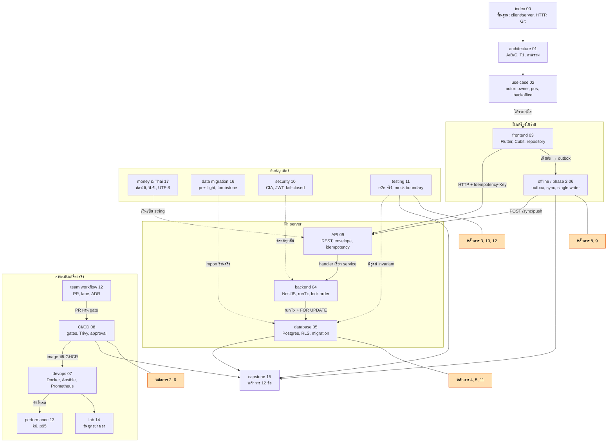

# 18 — Capstone: บทเรียนวิศวกรรม (วิศวกรคิดยังไง)

> บทนี้ตอบคำถาม: **"อ่านมาทั้งชุดแล้ว — อะไรคือวิธีคิดที่เอาไปใช้กับโปรเจกต์อื่นได้ ไม่ใช่แค่ POS ร้านนี้?"**

---

## 🧭 ก่อนอ่าน

- **ควรอ่านมาก่อน:** ทุกบทในชุดนี้ อย่างน้อยส่วน ⚠️ บทเรียน กับ ✅ สรุป ของแต่ละบท —
  บทนี้ **ไม่สอนเนื้อหาใหม่** แต่เอาเหตุการณ์จริงที่กระจายอยู่ทุกบทมา **กลั่น** เป็นหลักการ
- **เวลา:** ประมาณ 60–90 นาที (+ แบบฝึกหัดท้ายบทอีก 1–2 ชั่วโมง ถ้าทำจริง)
- อ่านจบแล้วคุณจะ…
  - รู้จัก **หลักการวิศวกรรม 12 ข้อ** ที่โปรเจกต์นี้ "จ่ายค่าเรียน" มาแล้วจริง พร้อมหลักฐาน (issue/PR/file:line)
  - เห็น **กลไก** ว่าทำไมแต่ละเรื่องถึงพัง — ไม่ใช่แค่จำว่า "อย่าทำ"
  - มี **ชุดเครื่องมือตัดสินใจ**: คำถามก่อนเลือกเทคโนโลยี, ตาราง trade-off, วิธีเขียน ADR, checklist ตรวจงาน
  - เห็น **แผนที่ทั้งชุดในหน้าเดียว** ว่าทุกบทต่อกันยังไง
  - ลองออกแบบโจทย์จริง 8 ข้อด้วยตัวเอง แล้วเทียบกับเฉลย

---

## 🧱 ปูพื้นฐาน: วิศวกรต่างจาก "คนที่เขียนโค้ดได้" ตรงไหน

### 1. โค้ดที่ "รันได้" ยังไม่ใช่งานที่เสร็จ

ปี 1 เราถูกตรวจการบ้านด้วยคำถามเดียว: **"output ตรงไหม?"** ถ้าตรง = ผ่าน

งานจริงมีคำถามอีกหลายชั้นที่การบ้านไม่เคยถาม:

```
การบ้าน:     input ถูก → output ถูก ?                         ✔ จบ
งานจริง:     input ผิดรูป → พังดังหรือพังเงียบ ?
             สองคนกดพร้อมกัน → ยังถูกไหม ?
             เน็ตหลุดกลางทาง → ข้อมูลอยู่สภาพไหน ?
             อีก 6 เดือนมีคนแก้ไฟล์นี้ → กฎยังอยู่ไหม ?
             เราบอกคนอื่นว่า "เสร็จแล้ว" → มีหลักฐานอะไร ?
```

ทุกหลักการในบทนี้คือคำตอบของคำถามชั้นล่างๆ เหล่านี้

### 2. Incident → กลไก → หลักการ

**Incident** (เหตุการณ์ที่ระบบทำงานผิด) ทุกครั้งมีสามชั้น:

| ชั้น | คำถาม | ตัวอย่าง (เรื่องจริงใน repo นี้ — #162) |
|---|---|---|
| **อาการ** | เห็นอะไร | server ค้าง ทุก request timeout |
| **กลไก** | ทำไมถึงเกิด ทีละขั้น | ทุก request ถือ connection 1 เส้นแล้วขออีกเส้น → pool หมด → ไม่มีใครคืน |
| **หลักการ** | กฎทั่วไปที่ป้องกันทั้ง "ตระกูล" ของปัญหานี้ | "หนึ่ง request ห้ามยึด connection ที่สอง" |

มือใหม่มักหยุดที่ชั้นแรก ("แก้ให้หายค้างแล้ว") วิศวกรลงไปถึงชั้นที่สาม เพราะ **กลไกเดียวกันจะกลับมาในรูปอื่น**
(เช่น `Promise.all([runTx(a), runTx(b)])` ไม่ใช่ guard แต่กลไกเหมือนกันเป๊ะ)

> Analogy: หมอที่ดีไม่ได้แค่ให้ยาแก้ไข้ — ถามว่าไข้มาจากอะไร แล้วบอกวิธีไม่ให้ป่วยแบบนี้อีก
> **post-mortem** (บันทึกหลังเหตุการณ์ — อะไรเกิด ทำไม แก้ยังไง ป้องกันยังไง) คือใบวินิจฉัยของวิศวกร

### 3. "ความจริง" ต้องมีหลักฐาน ไม่ใช่ความรู้สึก

เกือบครึ่งของหลักการในบทนี้วนกลับมาที่เรื่องเดียว: **เราเชื่ออะไร และเชื่อเพราะอะไร**

- CI เขียว → เชื่อว่า deploy แล้ว? (บทเรียน 2)
- test ผ่าน → เชื่อว่ารอด redis ล่ม? (บทเรียน 3)
- เอกสารบอกว่ามี constraint → เชื่อว่า DB บังคับ? (บทเรียน 10)
- issue ปิดแล้ว → เชื่อว่างานเสร็จ? (บทเรียน 2)

วิศวกรฝึกนิสัยถามว่า **"สิ่งที่ฉันเห็น พิสูจน์สิ่งที่ฉันอ้างจริงไหม หรือพิสูจน์แค่เรื่องที่ใกล้เคียง?"**

### 4. ทุกการตัดสินใจมี "ราคา"

ไม่มีทางเลือกที่ดีทุกด้าน ทุกบทในชุดนี้ใช้รูปประโยคเดียวกัน: **"เพราะ X → จึงต้อง Y → ราคาที่จ่ายคือ Z"**
วิศวกรที่ดีไม่ใช่คนที่เลือกของ "ดีที่สุด" แต่เป็นคน **รู้ว่ากำลังจ่ายอะไร และจ่ายโดยตั้งใจ** —
เช่นเจ้าของโปรเจกต์ตัดสินใจพัก backup offsite (#363) ไว้จนหลัง demo **โดยเขียนราคาไว้ชัดๆ**:
ถ้าดิสก์ `mob04` เสีย ข้อมูล demo tenant หายหมด นั่นคือ trade-off ที่ซื่อสัตย์

---

## 🔥 ปัญหาจริง: ทำไมต้องกลั่นเป็นหลักการ

โปรเจกต์นี้มีทีม 3 คน (`NuimanLP`, `LomerAlloys`, `PattaraponKitcharoen`), มี PR ที่ merge แล้วกว่า 200 ใบ
(บท [team workflow](13_team_workflow.md) นับได้ 212 ใบ ณ 2026-09-25) และ `CLAUDE.md` ที่ root มีส่วน
"Binding rules" ยาวหลายหน้า — **ทุกข้อในนั้นเกิดจากของที่เคยพังจริง**

ปัญหาคือ: รายการกฎยาวๆ **จำไม่ได้และไม่ย้ายไปใช้ที่อื่น** คนที่ไปทำโปรเจกต์ใหม่จะไม่เจอ `runTx` หรือ
`one_pos_per_tenant` อีกแล้ว แต่จะเจอ **กลไกเดิม** ในชื่อใหม่แน่นอน บทนี้จึงจัดกลุ่มกฎทั้งหมดเป็น
หลักการ 12 ข้อ ที่แต่ละข้อมีโครงเดียวกัน:

```
หลักการ (1 บรรทัด)
  → เรื่องจริง       : เกิดอะไร อ้าง issue/PR/commit ได้ เสียอะไรไป
  → กลไกที่ทำให้พัง  : ทีละขั้น ทำไมมันพัง
  → วิธีแก้ที่ทำจริง : file:line หรือบทที่สอนเรื่องนี้
  → เอาไปใช้ที่อื่น   : ตัวอย่างที่ไม่ใช่ POS
```

---

## 🎯 หลักการ 12 ข้อ

### หลักการ 1 — Validate ก่อน แล้วค่อย clamp

> **ตรวจว่าค่าถูกต้องก่อน แล้วค่อยบีบให้อยู่ในช่วง — clamp บนค่าที่ยังไม่ตรวจ เปลี่ยน "ความเสียหายที่ส่งเสียงดัง" เป็น "ความเสียหายเงียบๆ"**

**คำศัพท์:** **clamp** (บีบค่าให้อยู่ในช่วง เช่น `Math.max(0, x)` = ถ้าติดลบให้เป็น 0)

**เรื่องจริง** — `CLAUDE.md` เรียกบทเรียนนี้ว่า "learned the expensive way more than once (#22, #24, #260's import pre-flight)":

- **#22/#24** — โค้ด import ข้อมูลร้านเคยเขียน `Math.max(0, credit_balance)` และ `Math.max(1, qty)` ตรงๆ
  บนค่าที่มาจากไฟล์ ถ้าไฟล์มีหนี้ช่างติดลบ (เพราะบั๊กที่ไหนสักแห่งในระบบเดิม) ค่าจะกลายเป็น 0 **โดยไม่มี error
  ไม่มีคำเตือน** — หนี้ช่างหายไปจากบัญชีเงียบๆ (รายละเอียดใน [data migration](09_data_migration.md) บทเรียน 1)
- **ยังเปิดอยู่** — รีวิวทั้ง codebase 2026-09-24 พบ `server/src/quotes/quotes.controller.ts:113`:
  ```ts
  const olderThanDays = Math.max(1, Number(dto?.olderThanDays ?? 90));
  ```
  ส่ง `-30` มา → กลายเป็น 1 วัน → **ลบใบเสนอราคาเกือบทั้งหมด** (ดู [backend](06_backend.md) บทเรียน 4) ยังไม่แก้

**กลไกที่ทำให้พัง:**

```
ค่าผิด (-500) ──validate──▶ ❌ ปฏิเสธ + บอกว่าแถวไหน     ← ดัง: มีคนเห็น ไปแก้ต้นเหตุ
ค่าผิด (-500) ──clamp─────▶ 0 ✔ บันทึกลง DB               ← เงียบ: ข้อมูลผิดไปแล้ว ไม่มีใครรู้
```

clamp ไม่ได้ "แก้" ข้อมูลผิด มัน **ซ่อน** ข้อมูลผิด และซ่อนเก่งมาก เพราะผลลัพธ์ดูสมเหตุสมผล (0 ดูเป็นหนี้ปกติ)

**วิธีแก้ที่ทำจริง:** import ของ platform มี **pre-flight** — ตรวจทั้งไฟล์ก่อนเขียนแม้แต่แถวเดียว
(`server/src/platform/tenant-import.service.ts:137` `preflight(...)`) และแม้แต่ `round2` ในไฟล์เดียวกันก็
**throw** เมื่อเจอค่าที่ parse ไม่ได้ แทนที่จะคืน 0 (`tenant-import.service.ts:80-95` — คอมเมนต์อ้าง "#22's lesson" ตรงๆ)

**เอาไปใช้ที่อื่น:** ระบบตัดเกรดที่ `score = max(0, score)` — ถ้าอาจารย์กรอก `-85` แทน `85` เพราะพิมพ์พลาด
นักศึกษาได้ 0 เงียบๆ แทนที่ระบบจะร้องว่า "คะแนนติดลบ แถว 23" คำถามที่ต้องถามทุกครั้งที่เห็น `max`/`min`/`clamp`:
**"ค่าที่เข้ามาตรงนี้ ผ่านการตรวจแล้วหรือยัง?"**

---

### หลักการ 2 — หลักฐาน ไม่ใช่สถานะ (เขียว ≠ เสร็จ, ปิด ≠ เสร็จ)

> **สถานะ (สีเขียว, "closed", "Closes #N") คือสิ่งที่เครื่องมือหรือคนบอก — หลักฐานคือสิ่งที่เกิดขึ้นจริงบนเครื่องจริง**

**เรื่องจริง** (หลายเรื่อง กลไกเดียวกัน):

| เหตุการณ์ | สถานะที่เห็น | ความจริง | ที่มา |
|---|---|---|---|
| `Deploy (demo)` run | ✅ success | job `deploy` ถูก **skip** เพราะ image ยังไม่อยู่บน GHCR — มีแค่ `resolve release` ที่รัน | `.github/workflows/deploy.yml:140`, [CI/CD](15_cicd.md) |
| #39 → #184 | ทุก run บน `main` เขียว | job build image ถูก skip ทุกครั้ง (implicit `success()` + `changes` skip บน push) → **ไม่มี image ใหม่ขึ้น GHCR เลย** จนมีคนไปหา image มา deploy | [CI/CD](15_cicd.md) บทเรียน 3 |
| #184 (วัด k6) | ปิด→เปิด→ปิด 3 รอบใน 2 วัน | AC ทั้ง 4 ข้อไม่ถูกติ๊ก; PR #357 `Closes #184` ส่งแค่เครื่องมือ **ไม่มีตัวเลขวัดเลย** | [team workflow](13_team_workflow.md) บทเรียน 2 |
| #292–#296 | ปิดด้วยมือ ไม่มี PR แนบ | งานจริงอยู่ใน PR #306 ที่อ้างแค่ `#196` | [team workflow](13_team_workflow.md) บทเรียน 3 |
| #67 (self-hosted runner) | issue ปิด 2026-09-20 | `gh api …/actions/runners` = **0 runners** — ส่งแค่สคริปต์ + runbook | [devops](14_devops.md) |
| `ansible-playbook --check` | ดูเหมือนพังยับ | `command` ไม่มี check mode → ถูกข้าม → assertion ถัดไป fail บน output ว่าง — **false positive** | [testing](12_testing.md) |
| ประโยคใน `CLAUDE.md` เรื่อง DoD | "phase 1 done" | "this sentence has gone stale twice" — ต้องนับ checkbox ใหม่ทุกครั้ง (ล่าสุด 17 กล่อง ติ๊ก 16) | [team workflow](13_team_workflow.md) บทเรียน 5 |

**กลไกที่ทำให้พัง:** "skip" ในภาษาของ CI นับเป็น "ไม่ fail" ซึ่งเครื่องมือแสดงเป็นสีเขียว; "closed" ใน GitHub
แปลว่า "มีคนกดปิด" ไม่ได้แปลว่า "AC ครบ" — **ตัวชี้วัดวัดสิ่งที่ง่ายต่อการวัด ไม่ใช่สิ่งที่เราสนใจ**
และเมื่อคนเขียนสถานะรอบถัดไปเชื่อสิ่งที่รอบก่อนเขียน ความผิดจะถูกคัดลอกต่อไปเรื่อยๆ

**วิธีแก้ที่ทำจริง:**
- หลักฐาน deploy มีอย่างเดียว: ไฟล์ `/opt/pos/.current_sha` บน VM (`CLAUDE.md` CI/CD rules)
- status job ของ CI เพิ่มท่อน "**ห้าม** job ปล่อยของเป็น skipped บน main push" ([CI/CD](15_cicd.md))
- audit ticket ด้วย `git log --all --grep` ไม่ใช่ `closedByPullRequestsReferences` อย่างเดียว
- **ซื่อสัตย์กับสิ่งที่ยังไม่เสร็จ:** CD ไป `mob04` ติด FortiGate ของคณะ (ตัดสินที่เครือข่าย ไม่ใช่ใน repo) —
  `CLAUDE.md` เขียนตรงๆ ว่า `docker save`/`load` ด้วยมือเป็นแค่ทางกู้วัน demo "**not CD, and must never be recorded as one**"

**เอาไปใช้ที่อื่น:** ส่งงานกลุ่มแล้วเพื่อนบอก "push แล้ว" — หลักฐานคือเปิด GitHub ดู commit ด้วยตัวเอง; ร้านอาหารบอก
"ส่งอาหารแล้ว" — หลักฐานคืออาหารถึงโต๊ะ ไม่ใช่สถานะในแอป ทุกครั้งที่จะพูดว่า "เสร็จ" ให้ถาม
**"ถ้าคนที่ไม่เชื่อฉันมาตรวจ เขาจะดูที่ไหน?"** แล้วไปดูที่นั่นเอง

---

### หลักการ 3 — Mock ผิดที่ ซ่อน bug

> **Test พิสูจน์ได้เฉพาะสิ่งที่มันทำให้เกิดขึ้นจริง — ถ้า mock ตรงจุดที่กำลังจะพิสูจน์ test นั้นพิสูจน์อะไรไม่ได้เลย**

**คำศัพท์:** **mock** (ของปลอมที่แทนของจริงใน test แล้วให้เราสั่งได้ว่าจะตอบอะไร)

**เรื่องจริง:**
- **#383** — DoD ต้องพิสูจน์ว่า "redis-cache ล่ม ร้านยังขายได้" test เดิม (`tenant-scope.e2e-spec.ts`) ใช้
  `vi.spyOn` บน **method ของ cache client** ให้ throw — พิสูจน์ได้แค่ว่า `catch` ในโค้ดเราทำงาน ไม่ได้พิสูจน์ว่า
  ระบบรอดจาก redis ที่ **ต่อไม่ติดจริง** และยังยิงไปที่ `/api/v1/tx4-probe` แทน `GET /products` + `POST /sales`
  ที่ AC ขอ
- **#384** — test ของ retire/enrol เคย **mint token เอง** ข้ามขั้น `POST /auth/device` ทั้งหมด → ไม่เคยพิสูจน์ว่า
  enrol code ใช้ได้ครั้งเดียวจริง
- **HIGH bug ที่ยังเปิด** — test ของ `/sync/push` ครอบแค่ push→push (สองครั้งใช้ fingerprint `POST /sales`
  เหมือนกัน) จึงเขียว ทั้งที่เส้นทางจริง online→push พัง (ดูหลักการ 9)

**กลไกที่ทำให้พัง:**

```
สิ่งที่อยากพิสูจน์:   [แอป] ──TCP──▶ [redis ตาย]      → แอปยังขายได้?
สิ่งที่ test ทำ:     [แอป] ──▶ [cache.get() ปลอม throw]
                            ↑ ข้ามทั้ง: timeout ของ TCP, commandTimeout, retry ของ client library,
                              การต่อ connection ใหม่ — ซึ่งคือที่ที่ bug จริงอยู่ (เคส #140 = redis เปิดแต่เงียบ)
```

mock แทน **ขอบของระบบ** ที่เรากำลังทดสอบ → ขอบนั้นไม่ถูกทดสอบเลย

**วิธีแก้ที่ทำจริง:** `server/test/redis-cache-outage.e2e-spec.ts` ทำให้ redis-cache ต่อไม่ได้จริง **สองแบบ**
(ปฏิเสธการเชื่อมต่อ และเปิดแต่เงียบจนถึง `commandTimeout`) แล้วยิง `GET /products` + `POST /sales` จริงพร้อมเช็คว่า
สต็อกลดจริง; #384 แก้ `server/test/shifts.e2e-spec.ts:562` ให้เดินผ่าน endpoint จริงทุกขั้น
ส่วนกติกา lane ของ phase 2 ("test เฉพาะกับ fake ฝั่งตัวเอง") มาพร้อมกฎคู่กัน: **AC ห้ามอ้างว่า "ใช้กับของจริงได้"
จนกว่าอีกครึ่งจะ merge** (สอนใน [testing](12_testing.md))

**เอาไปใช้ที่อื่น:** แอปชำระเงินที่ test ด้วยการ mock ว่า "ธนาคารตอบ OK" จะไม่มีวันเจอบั๊กตอนธนาคารตอบช้า 30 วินาที
กฎง่ายๆ: **mock สิ่งที่อยู่นอกคำถาม — ห้าม mock สิ่งที่เป็นคำถาม**

---

### หลักการ 4 — ทรัพยากรที่มีจำกัด: ยืมทีละชิ้น ถือให้สั้นที่สุด

> **หนึ่ง request ห้ามยึด connection ที่สอง และงานช้าที่ไม่ต้องใช้ DB ต้องอยู่นอก transaction**

**เรื่องจริง:**
- **#162** — global guard อ่าน `tenants.plan` ตอน cache ว่างด้วย **connection ใหม่** ขณะ request ถือ
  connection แรกอยู่ เมื่อ request พร้อมกันเท่ากับ `DB_POOL_SIZE` → **ทั้งระบบค้าง** (บท [architecture](02_architecture.md) /
  [backend](06_backend.md) / [database](07_database.md) เล่าเรื่องนี้ทั้งสามบท — เพราะมันสำคัญขนาดนั้น)
- **tx.5 / #154** — void บิลเคยตรวจ PIN ด้วย argon2 (~75 ms) **ข้างใน** transaction → transaction ยาวสุด
  ~101–131 ms; ย้ายออกมาก่อน `runIdempotent` เหลือ ~14–22 ms (`adr/0003-handler-scoped-migration-plan.md`)

**กลไกที่ทำให้พัง:**

```
pool = 2
request A: ถือ conn#1 ── ขอ conn เพิ่ม ── รอ...
request B: ถือ conn#2 ── ขอ conn เพิ่ม ── รอ...
pool ว่าง 0 → ไม่มีใครได้ → ไม่มีใครคืน → ค้างตลอดไป   (deadlock ระดับ connection)
```

เงื่อนไขของ deadlock ครบทุกข้อ: ถือของไว้ + ขอเพิ่ม + ไม่มีใครยอมคืน + รอเป็นวง

**วิธีแก้ที่ทำจริง:** `runTx` **join** transaction ที่เปิดอยู่แทนเปิดใหม่
(`server/src/common/database/tenant.service.ts:74` — `if (open) return fn(open);`), มี e2e
`server/test/rate-limit-pool.e2e-spec.ts` เป็นด่าน, และห้าม `Promise.all([runTx(a), runTx(b)])`

**เอาไปใช้ที่อื่น:** ห้องสมุดให้ยืมได้คนละ 1 เล่ม — ถ้าทุกคนยืมไว้ 1 เล่มแล้วยืนรอเล่มที่สองก่อนจะคืน ไม่มีใครได้อ่าน
หลักเดียวกันใช้กับ thread lock, file handle, GPU memory: **ยืมครบทีเดียว หรือคืนก่อนขอใหม่, และอย่านั่งคิดเลขช้าๆ
ขณะถือของที่คนอื่นรอ** (ในวิชา OS จะเจอในชื่อ Coffman conditions)

---

### หลักการ 5 — กฎที่ห้ามพัง ให้ database เป็นคนบังคับ

> **ถ้า invariant สำคัญพอที่ความผิดพลาดครั้งเดียวจะเสียหาย อย่าฝากไว้แค่ในโค้ด app — ใส่เป็น constraint ใน DB**

**คำศัพท์:** **invariant** (เงื่อนไขที่ต้องจริงเสมอ ไม่ว่าเกิดอะไรขึ้น เช่น "สต็อกไม่ติดลบ", "ร้านละ 1 เครื่อง pos")

**เรื่องจริง:**
- **#16 — เลขอะไหล่ซ้ำแบบตัวพิมพ์ต่างกัน:** `uq_products_partno` เดิมแยกตัวพิมพ์ `BP-1` กับ `bp-1` จึงอยู่ด้วยกันได้
  ทั้งที่แอปเดิมถือว่าซ้ำ การเช็คในโค้ด app **ปิดรูนี้ไม่ได้** ด้วยสองเหตุผลที่คอมเมนต์หัว migration เขียนไว้:
  (1) การ import ของ platform เขียนสินค้าโดยไม่ผ่านโค้ดเช็คนั้น (2) `toLowerCase()` ของ JS กับ `lower()` ของ
  Postgres ให้ผลต่างกันนอก ASCII (`server/src/db/migrations/1788652800007-ProductsPartNoCaseInsensitive.ts:3-15`)
- **ADR-0004 — ร้านละ 1 เครื่อง `pos`:** ไม่ใช่แค่ if ในโค้ด แต่เป็น partial unique index
  (`server/src/db/migrations/1788652800000-InitialSchema.ts:83-84`):
  ```sql
  CREATE UNIQUE INDEX one_pos_per_tenant ON devices (tenant_id)
    WHERE role = 'pos' AND retired_at IS NULL
  ```
- **CHECK constraints** ใน `InitialSchema.ts` เช่น `role = 'owner'` (:57), `device_no BETWEEN 1 AND 99` (:69),
  `last_no <= 9999` (:108 — เลขเอกสารตาม ADR-0007 มีแค่ 4 หลัก)
- **RLS** — การแยกข้อมูลร้านไม่ได้ฝากไว้ที่ `WHERE tenant_id = ?` ที่คนต้องจำใส่ทุก query แต่ Postgres ซ่อนแถวให้เอง
  แบบ fail-closed (บท [database](07_database.md) / [security](11_security.md))

**กลไกที่ทำให้พัง (ถ้าฝากไว้แค่ app):**

```
เส้นทาง 1: POST /products ──▶ [เช็คซ้ำใน service] ──▶ DB     ✔
เส้นทาง 2: platform import ──────────────────────────▶ DB     ✘ ไม่มีใครเช็ค
เส้นทาง 3: สองคนกดพร้อมกัน: เช็ค(ไม่ซ้ำ) เช็ค(ไม่ซ้ำ) → insert insert   ✘ race
```

app-level check มีปัญหา 2 อย่างเสมอ: **มีเส้นทางที่ลืมเช็ค** และ **race ระหว่างเช็คกับเขียน** — constraint ใน DB
ไม่มีทั้งสองปัญหา เพราะมีทางเข้าเดียวและ atomic

**วิธีแก้ที่ทำจริง:** constraint อยู่ใน migration, ฝั่ง API แค่ **แปล** error ของ constraint เป็นคำตอบที่เป็นมิตร
(`server/src/products/products.service.ts:496-497` จับชื่อ constraint → `409 DUPLICATE_PART_NO`; `devices.service.ts`
จับ `one_pos_per_tenant` แบบเดียวกัน)

**เอาไปใช้ที่อื่น:** ระบบจองที่นั่งคอนเสิร์ต — `UNIQUE (show_id, seat_no)` ใน DB กันขายที่นั่งซ้ำได้แม้มีคนกด
พร้อมกัน 10,000 คน ส่วน if ในโค้ดกันไม่ได้ **โค้ด app บอก "ทำไม" ให้ผู้ใช้เข้าใจ ส่วน DB บอก "ไม่" แบบเด็ดขาด**

---

### หลักการ 6 — พังให้ดัง (fail loud) ดีกว่ารอดแบบเงียบ

> **ค่าตั้งผิด/ขาด ต้องทำให้ระบบหยุดทันทีพร้อมข้อความชัดเจน — fallback แบบเงียบคือช่องโหว่ที่รอวันถูกเจอ**

**เรื่องจริง:**
- **#184 (platform secret):** เคยมี fallback เป็นสตริงสาธารณะ ถ้า VM ลืมตั้ง secret ใครก็ปลอมเป็น platform admin ได้
  → แก้ด้วย `:?` ใน compose (`server/docker-compose.yml:19-28` เช่น
  `${JWT_PLATFORM_SECRET:?JWT_PLATFORM_SECRET is required}`) — compose **ไม่ยอมรัน** ถ้าขาด
  แต่ **ยังค้างครึ่งหนึ่ง**: `server/src/config/config.ts:113` ยังมี `?? 'dev-only-platform-secret'` — รันนอก compose
  = ช่องเดิมกลับมา (บท [security](11_security.md) ช่อง G6)
- **#367 (CORS):** `CORS_ORIGINS` ที่ตั้งแต่ผิดรูปเคยตกเป็น `'*'` (เปิดให้ทุกเว็บ) เงียบๆ → ตอนนี้ throw ตอน boot:
  `"${name} is set but lists no entry … — leave it empty to disable"` (`server/src/config/config.ts:74`)
- **#363 (backup offsite):** ออกแบบให้แยก 2 สถานะชัดเจน (`deploy/scripts/backup-db.sh:31-36`):
  - **ยังไม่ตั้งค่า** → `::warning::` 1 บรรทัด + exit 0 (เงียบแต่ **ซื่อสัตย์**: บอกว่ายังไม่มี offsite)
  - **ตั้งค่าแล้วแต่พัง** → `::error::` + exit ≠ 0 (`:151`, `:160`) — เพราะ "ปลายทางที่ตั้งไว้แล้วล้มเงียบๆ คือบั๊กที่ #363 มีไว้แก้"

**กลไกที่ทำให้พัง:** fallback เงียบทำให้ **ความผิดพลาดของคน (ลืมตั้งค่า) กลายเป็นพฤติกรรมของระบบ (เปิดให้ทุกคน)**
และไม่มีสัญญาณใดบอก — log เขียว, service ขึ้น, ทุกอย่าง "ปกติ" จนวันที่มีคนใช้ช่องนั้น

**ข้อควรระวัง — fail-open ก็มีที่ของมัน:** บท [backend](06_backend.md) สอนว่า cache / rate-limit / etcd ถูกออกแบบให้
**fail-open** (ล่มแล้วร้านยังขายได้) ความต่างอยู่ที่ **ของที่เป็นความสะดวก** ล่มได้ ส่วน **ของที่เป็นความปลอดภัย
หรือความจริง** (secret, CORS, RLS, backup) ต้อง fail loud/closed — ต้องถามทุกครั้งว่ากล่องนี้อยู่ฝั่งไหน

**เอาไปใช้ที่อื่น:** แอปที่อ่าน `API_KEY` จาก env แล้วถ้าไม่มีใช้ `"test"` — deploy production แล้วลืมตั้ง ระบบรันด้วย
key ทดสอบไปหลายเดือน กฎ: **ค่าที่ "ต้องมี" ให้ crash ตอนเริ่ม; ค่าที่ "ไม่มีก็ได้" ให้ log บอกชัดๆ ว่ากำลังใช้ค่า default**

---

### หลักการ 7 — ตัดสินใจจากปัญหา ไม่ใช่จากเครื่องมือ

> **เริ่มจาก "โจทย์บีบเราไว้ตรงไหน" แล้วให้คำตอบเลือกเครื่องมือเอง — ไม่ใช่เริ่มจาก "เทคโนโลยีนี้เจ๋ง"**

**เรื่องจริง:**
- **Architecture A / B / C** — `03_ARCHITECTURE.md §1` บีบทุกอย่างเหลือคำถามเดียว: **"สต็อกตัวจริงอยู่ที่ server หรือที่เครื่อง?"**
  แล้วเลือก C (hybrid) โดยเฟส 1 = A เป๊ะ เพราะส่งงานคอร์สได้ครบโดยไม่ต้องรอ sync engine และไม่ทิ้ง "ขายตอนเน็ตล่ม"
  (บท [architecture](02_architecture.md))
- **CouchDB ถูกปฏิเสธ (ADR-0012, 2026-09-08 — เสนอและปฏิเสธวันเดียวกัน)** — เหตุผล: เสีย transaction ข้ามตาราง /
  `FOR UPDATE` / FK / RLS, ไม่มี PouchDB สำหรับ Flutter ที่รองรับ Web, โจทย์คอร์สกำหนด PostgreSQL, และ "sync ตอนเน็ตล่ม"
  มีที่อยู่แล้วในเฟส 2 ADR ถูก **เก็บไว้แม้ถูกปฏิเสธ** เพื่อไม่ต้องคิดใหม่ถ้าหัวข้อกลับมา
- **Ansible ไม่ใช่ Kubernetes** — เพราะมี VM เดียวที่ RAM 6 GB (บท [devops](14_devops.md))
- **Prometheus + Grafana ไม่ใช่ ELK/Wazuh** — งบ RAM ไม่พอ (บท [devops](14_devops.md))

**กลไกที่ทำให้พัง (ถ้าเริ่มจากเครื่องมือ):** เครื่องมือทุกตัวถูกสร้างมาแก้ปัญหาของ **คนสร้าง** — ถ้าปัญหาของเราไม่ใช่ปัญหานั้น
เราจ่ายราคาเต็ม (ความซับซ้อน, RAM, เวลาเรียนรู้) แต่ไม่ได้ประโยชน์ ตัวอย่าง CouchDB: จุดแข็งคือ sync หลายเครื่อง แต่
ADR-0004 ทำให้มีเครื่อง `pos` ขายได้เครื่องเดียวอยู่แล้ว → จุดแข็งนั้นแทบไม่ได้ใช้ ขณะที่ราคา (เสีย transaction) จ่ายเต็ม

**วิธีแก้ที่ทำจริง:** ทุกการเลือกใหญ่มี **ADR** (ดูหัวข้อ "ชุดเครื่องมือตัดสินใจ" ด้านล่าง) และ `CLAUDE.md` กำหนดว่า
"where a doc contradicts an ADR, the ADR wins"

**เอาไปใช้ที่อื่น:** เพื่อนอยากใช้ microservices + Kafka ทำเว็บลงทะเบียนชมรม 200 คน — คำถามแรกไม่ใช่ "Kafka ดีไหม"
แต่คือ "ระบบนี้มีปัญหาอะไรที่ monolith + database ตัวเดียวแก้ไม่ได้?" ถ้าตอบไม่ได้ ก็ยังไม่ต้องใช้

---

### หลักการ 8 — ออกแบบให้ conflict ไม่เกิด ดีกว่าแก้ conflict เก่ง

> **คนเขียนคนเดียว (single writer) กำจัดปัญหาทั้งตระกูล — ถูกกว่า algorithm รวมข้อมูลที่ฉลาดที่สุด**

**คำศัพท์:** **conflict** (สองเครื่องแก้ข้อมูลเดียวกันขณะไม่ได้คุยกัน แล้วต้องตัดสินว่าเชื่อใคร)

**เรื่องจริง:**
- **ADR-0004** — ร้านละ 1 เครื่อง `pos` (บังคับด้วย `one_pos_per_tenant`) + เครื่อง `backoffice` กี่เครื่องก็ได้
  เหตุผลที่ ADR เขียน **ไม่ใช่เรื่องสต็อก** แต่เป็นของที่มีอยู่ **ชิ้นเดียวทางกายภาพ**: ลิ้นชักเงินใบเดียว +
  เลขใบเสร็จชุดเดียว (บท [offline / phase 2](10_offline_phase2.md))
- **ผลพลอยได้ — ลบของทิ้งได้ทั้งชิ้น:** `Products.offlineOk` + scarcity rule ถูกออกแบบ ใส่ schema (Drift v3)
  แล้ว **ลบทิ้ง** (#272 / PR #310) เมื่อเจ้าของเห็นว่า writer เดียวทำให้มันไม่จำเป็น — และระหว่างลบยังพบว่า Postgres
  ไม่เคยมีคอลัมน์นี้เลย
- **ADR-0004 ฉบับแรกอ้างหลักฐานผิด** — test "200 บิลพร้อมกัน ได้ 50 บิลพอดี" พิสูจน์แค่ row lock ไม่ได้พิสูจน์
  "หลายเครื่องขาย" เพราะระบบห้ามมีหลายเครื่องขายอยู่แล้ว → race จริงที่ต้องทดสอบคือ `pos` ขาย **พร้อมกับ**
  `backoffice` รับของเข้า (บท [use case](03_use_case.md) บทเรียน 2)

**กลไก:**

```
หลาย writer ออฟไลน์:  เครื่อง A ขาย RC-0042  |  เครื่อง B ขาย RC-0042   → เลขซ้ำ, ลิ้นชักไหนจริง?, สต็อกเหลือเท่าไร?
                     → ต้องมี: conflict detection + merge rule + UI ให้คนตัดสิน + test ทุกคู่ผสม
writer เดียว:         มีแค่ A → ไม่มีอะไรชน → ไม่ต้องมีทั้งหมดข้างบน
```

**เอาไปใช้ที่อื่น:** Git ใช้ branch protection ให้ `main` รับการเขียนผ่าน PR ทางเดียว; Google Docs ต้องมีระบบ merge
ซับซ้อนเพราะเลือกให้หลายคนพิมพ์พร้อมกัน — ถ้าโจทย์ของคุณไม่ต้องการแบบนั้นจริง **อย่าจ่ายราคานั้น**
คำถามที่ต้องถามก่อนออกแบบ sync ใดๆ: "จำเป็นจริงไหมที่ต้องมีคนเขียนมากกว่าหนึ่ง?"

---

### หลักการ 9 — อะไรที่ถูกส่งซ้ำได้ ต้อง idempotent (และคำนวณ "ตัวตน" แบบเดียวทุกทาง)

> **ในเครือข่ายจริง "ไม่ได้คำตอบ" ≠ "ไม่สำเร็จ" — ทุก write ที่อาจ retry ต้องมี key ที่ทำให้ส่งซ้ำแล้วผลไม่ซ้ำ**

**คำศัพท์:** **idempotent** (ทำซ้ำกี่ครั้งผลเท่ากับทำครั้งเดียว), **fingerprint** (ลายนิ้วมือของคำขอ — ใช้เทียบว่าคำขอที่ใช้ key เดิมเป็นเรื่องเดียวกันจริงไหม)

**เรื่องจริง:**
- **กฎที่ตั้งไว้ถูก:** fingerprint ใช้ **path จริง** ไม่ใช่ route pattern — เพราะถ้าใช้ pattern `/sales/:id/void`
  การ void บิลคนละใบด้วย key เดิมจะได้ fingerprint เดียวกัน → replay "void บิลแรกสำเร็จ" ขณะบิลที่ตั้งใจ void ยังอยู่
  (`server/src/idempotency/idempotency.runner.ts:40`, บท [API](05_api.md) บทเรียน 2)
- **ฝั่ง client:** bill id + `Idempotency-Key` มินต์ **ครั้งเดียวต่อตะกร้า** (`PendingWrites`) — มินต์ใหม่ทุก retry
  = ทำลายการป้องกันทั้งสองชั้นและขายซ้ำ (บท [frontend](04_frontend.md))
- **🔴 HIGH ที่ยังไม่แก้ (รีวิว 2026-09-24):** online route เก็บ `POST /api/v1/sales` แต่ `/sync/push` สร้างเองเป็น
  `'POST /sales'` (`server/src/sync/sync.service.ts:201`) → บิลที่ขายออนไลน์สำเร็จแล้วแต่คำตอบหาย พอ push ซ้ำด้วย key เดิม
  ได้ `409 IDEMPOTENCY_KEY_REUSED` แทน "applied" (บท [offline / phase 2](10_offline_phase2.md) บทเรียน 1)

**กลไก:**

```
client ──POST /sales (key=k1)──▶ server COMMIT ✔
client ◀────── ✗ คำตอบหาย (timeout) ──────
client: "ไม่รู้ผล" → ต้องส่งซ้ำ (key=k1 เดิม)
  ├─ ไม่มี idempotency       → ขาย 2 ครั้ง, สต็อกตัด 2 ครั้ง
  ├─ มี, fingerprint ตรง      → server ตอบผลเดิม (replay) ✔
  └─ มี, fingerprint คำนวณคนละแบบ → server คิดว่าเป็นคนละเรื่อง → ปฏิเสธบิลที่สำเร็จไปแล้ว ✘  (HIGH bug)
```

ฝั่ง client ต้องแยก **verdict** (4xx = server ตัดสินแล้ว) ออกจาก **non-verdict** (5xx / 429 / timeout = ไม่รู้ผล)
และไม่เดาว่าอย่างหลังคือล้ม (`isVerdict`, บท [API](05_api.md))

**เอาไปใช้ที่อื่น:** ปุ่ม "โอนเงิน" ที่ผู้ใช้กดสองทีเพราะเน็ตช้า; webhook ที่ผู้ให้บริการส่งซ้ำ; ข้อความในคิวที่ worker
ประมวลผลแล้ว crash ก่อน ack — ทั้งหมดต้องการ key ที่ **สร้างครั้งเดียวที่ต้นทาง** และ server ที่จำผลไว้
และถ้ามีหลายทางเข้าสู่ action เดียวกัน **fingerprint ต้องมาจากฟังก์ชันเดียว** (หลักการ 10)

---

### หลักการ 10 — ความจริงมีบ้านเดียว: ทุกสำเนาจะค่อยๆ ลอยออกจากกัน

> **กฎที่เขียนสองที่จะไม่เหมือนกันในวันหนึ่ง — คอมเมนต์และเอกสารคือสำเนาของโค้ด และมันลอยออกเสมอ**

นี่คือหลักการที่เจอบ่อยที่สุดในโปรเจกต์ จึงแบ่งเป็น 2 ส่วน

**ส่วน ก — กฎในโค้ดที่มีสองสำเนา**

| กฎ | สำเนาที่ 1 | สำเนาที่ 2 | ผล | ที่มา |
|---|---|---|---|---|
| ความยาวรหัสผ่าน (#364) | CLI `bootstrap:admin` บังคับ 12 ตัว | API สร้างร้าน ไม่บังคับเลย | รหัส owner `1234` ผ่านได้ | แก้แล้ว: รวมที่ `server/src/common/password.ts` |
| idempotency fingerprint | `idempotency.runner.ts:40` | `sync.service.ts:201` | HIGH bug (หลักการ 9) | ยังไม่แก้ |
| RLS policy | ลูปเดียวใน migration `…0001` ใช้ `NULLIF` | `OwnerReviewItems.ts` เขียนเองไม่มี `NULLIF` | tenant ไม่ได้ตั้ง → HTTP 500 แทน 0 แถว | ยังไม่แก้ ([database](07_database.md)) |
| การเก็บ access token | ADR-0009: "memory เท่านั้น ห้าม localStorage" | `token_storage.dart` ใช้ `SharedPreferences` (บน web = localStorage) | XSS อ่าน token ได้ | ยังไม่แก้ ([security](11_security.md) G9) |
| เลข schema ปัจจุบัน | Drift `schemaVersion` | hard-code "9" ใน test 6 ไฟล์ | PR #276 CI แดง ต้องแก้ 6 ไฟล์ | [CI/CD](15_cicd.md) บทเรียน 1 |

**ส่วน ข — คอมเมนต์/เอกสารที่ตามโค้ดไม่ทัน** (หลายอันพบระหว่างเขียนชุดเอกสารนี้เอง)

| สิ่งที่เขียนไว้ | ความจริงในโค้ด | พบในบท |
|---|---|---|
| คอมเมนต์ `bull-board` ใน `server/docker-compose.yml:178` ว่า "No Redis connection yet — it registers no queue until #34" | `server/src/bull-board.ts` สร้าง `Queue` ครบทุกตัวแล้ว | [architecture](02_architecture.md) |
| `app_router.dart:55` "the 11 routes" | จำนวน route จริงต่างไปแล้ว | [use case](03_use_case.md) |
| `repository_providers.dart:1` "the 13 repository providers" | `CLAUDE.md` นับ 21 entries (17 repos + 4 service) | [frontend](04_frontend.md) |
| คอมเมนต์ idempotency พูดถึง body `{pin}` ของ void | phase 2 เปลี่ยน void ออนไลน์เป็น "เหตุผลอย่างเดียว ไม่มี PIN" | [backend](06_backend.md) |
| `server/README.md` ว่า job `api-metrics` "commented out" | `deploy/prometheus/prometheus.yml` เปิดใช้แล้ว (Lab เห็น 3 target `up`) | [lab](17_lab.md) |
| `08_PHASE2_SPEC.md §4` ว่าใช้ Workbox และชื่อ cache = `github.sha` | `frontend/web/sw.js` เขียนเอง ไม่ใช้ Workbox และชื่อ cache คงที่ `'srisurart-pos-v1'` | [offline / phase 2](10_offline_phase2.md) |
| `02_API_SCREENS.md §4.1` ติ๊ก platform route ว่า idempotent ✔ | ไม่มี controller platform ตัวไหนเรียก `runIdempotent` | [API](05_api.md) |
| `purchasing.controller.ts` ประกาศ 6 route | ไม่ถูกลงทะเบียนใน module → ยิงไม่ถึง | [API](05_api.md) |
| เอกสาร `audit_log` PK = `id BIGSERIAL` | migration จริงใช้ `(tenant_id, id)` | [database](07_database.md) |
| `CLAUDE.md` ("Writing in docs/Backend_design") ว่า `uq_products_partno_ci` "not applied" | migration `1788652800007` สร้าง index นี้ และลงทะเบียนใน `server/src/db/data-source.ts:9,26` | ตรวจตอนเขียนบทนี้ (ดู ⚠️ ด้านล่าง) |

**กลไก:** เวลาแก้กฎ คนแก้จะแก้ **ที่ที่ตัวเองเห็น** สำเนาอื่นไม่มีอะไรบังคับให้ตาม — ไม่มี compiler ตรวจคอมเมนต์
ไม่มี test ตรวจเอกสาร ยิ่งสำเนาอยู่ห่าง (คนละไฟล์ คนละภาษา คนละ repo) ยิ่งลอยเร็ว

**วิธีแก้ที่ทำจริง:**
- รวมกฎไว้ที่เดียว (`password.ts`, `MIN_PASSWORD_LENGTH`)
- ประกาศลำดับความจริง: **migration คือความจริงของ schema** ("the migrations are the schema's source of truth"),
  **ADR ชนะเอกสารอื่น**, และ **โค้ดชนะคอมเมนต์**
- test ระดับ source (architecture test `tenant-door.spec.ts`, `api_repository_contract_test.dart`) บังคับกฎที่
  unit test ทั่วไปมองไม่เห็น (บท [testing](12_testing.md))
- `CLAUDE.md` มีกฎ "A cross-reference to another doc's section must be grepped before it is written"

**เอาไปใช้ที่อื่น:** ค่า VAT 7% ที่เขียนไว้ใน 5 ไฟล์ — วันที่รัฐบาลเปลี่ยน จะมี 1 ไฟล์ที่ลืมแก้เสมอ
กฎง่ายๆ: **ถ้าต้องเขียนความรู้เดียวกันสองที่ ให้ที่หนึ่งเป็นของจริง อีกที่ "อ้างถึง" หรือถูกสร้างจากมัน** และเวลาอ่าน
คอมเมนต์ ให้ถือว่าเป็น **คำใบ้** ไม่ใช่ **ความจริง** จนกว่าจะเปิดโค้ดหรือรันดู

---

### หลักการ 11 — ประวัติที่ถูกใช้ไปแล้ว ห้ามแก้ — ให้เขียนต่อท้าย

> **migration ที่ apply แล้วห้ามแก้ไฟล์เดิม ให้เพิ่มไฟล์ใหม่เสมอ**

**คำศัพท์:** **migration** (ไฟล์ที่บอกว่าจะเปลี่ยนโครงตาราง DB จากเวอร์ชันหนึ่งไปอีกเวอร์ชัน รันตามลำดับ และ DB จำว่ารันไฟล์ไหนไปแล้ว)

**เรื่องจริง:** commit `225ecf7` ("single owner role…") เพิ่ม migration ใหม่ `1788652803001-SingleOwnerRole.ts` ถูกต้อง
แต่ **แก้ `InitialSchema.ts` ที่รันไปแล้วด้วย** (เปลี่ยน CHECK ของ role และลบ `pin_hash`) รอดมาได้เพราะไฟล์ใหม่บังเอิญ
เขียน `DROP … IF EXISTS` ไว้ (บท [database](07_database.md) บทเรียน 1) — และบั๊ก 2 ตัวใน `OwnerReviewItems` ที่ยังเปิด
**ต้องแก้ด้วย migration ใหม่** ไม่ใช่แก้ไฟล์นั้น (`CLAUDE.md`)

**กลไก:**

```
DB เก่า (รัน InitialSchema ไปแล้ว):  จำแค่ "ชื่อ InitialSchema รันแล้ว" → เนื้อหาใหม่ไม่มีวันถูกรัน
DB ใหม่ (สร้างหลัง commit):          รัน InitialSchema เวอร์ชันแก้แล้ว
→ ปลายทางอาจเหมือนกัน แต่เดินมาคนละทาง — ถ้าวันหนึ่งไม่เหมือน ไม่มีใครเห็นจนกว่าจะพังบนเครื่องใดเครื่องหนึ่ง
```

**เอาไปใช้ที่อื่น:** บัญชีธนาคารไม่ลบรายการที่ผิด แต่เพิ่มรายการกลับรายการ (reversal); `git` ที่ push ไปแล้วห้าม
`push --force` บน branch ที่คนอื่นดึงไปแล้ว (บท [team workflow](13_team_workflow.md) — merge vs rebase) หลักเดียวกัน:
**สิ่งที่คนอื่น/เครื่องอื่น "ใช้" ไปแล้ว คือประวัติ — แก้ประวัติไม่ได้ เขียนต่อได้**

---

### หลักการ 12 — ช่องโหว่ส่วนใหญ่ไม่ได้ซ่อน มันรอให้มีคนอ่านอย่างตั้งใจ

> **security ไม่ได้จบที่ PR merge — จบเมื่อพิสูจน์ได้บนเครื่องที่รันจริง และเกือบทุกช่องเจอได้ด้วยการอ่านโค้ดอย่างระวัง**

**เรื่องจริง:** ระหว่างเขียนบท [security](11_security.md) ผู้เขียนพบ 4 ช่องจากการ **อ่านโค้ดเฉยๆ** ไม่มี tool พิเศษ
(บทนั้นระบุว่า "ไม่พบ issue ที่บันทึกไว้ใน `docs/`" — ถ้าจะแก้ควรเปิด issue ก่อน):

| ช่อง | อ่านเจอที่ | ทำไมถึงเป็นปัญหา |
|---|---|---|
| G6 | `server/src/config/config.ts:113` `?? 'dev-only-platform-secret'` | compose กันไว้ แต่รันนอก compose = ช่อง #184 กลับมา |
| G8 | `RowLevelSecurity.ts:70-74` | `pos_app` แก้/ลบ `audit_log` ได้ → app ถูกเจาะ = ลบร่องรอยได้ |
| G9 | `frontend/lib/data/storage/token_storage.dart` | ขัด ADR-0009 ที่ห้ามเก็บ access token ใน localStorage |
| G10 | `server/docker-compose.yml:73,92,191,214` | image `postgres:16-alpine`, `redis:7-alpine` ฯลฯ ไม่ pin digest → ไส้เปลี่ยนได้ |

และช่องที่ปิดแล้วก็มีรูปแบบเดียวกัน:
- **#134** — ไม่ได้ตั้ง `trust proxy` → ทุก client มี IP เป็นของ Nginx → rate limit login เป็น **ถังเดียวของทั้งโลก**
  บทเรียนต่อยอด: การเพิ่มกล่อง (เช่น CDN หน้า Nginx) **เปลี่ยนสมมติฐานของกล่องอื่น** (`server/src/app.setup.ts:30-36`)
- **#270** — block `/platform` ใน Nginx เดิม **ไม่เคยทำงาน** เพราะ path ขาด prefix `api/v1` → ตอนนี้มี job `nginx-check` ใน CI ยิงจริง

**กลไก:** รูปแบบซ้ำๆ คือ (1) "คิดแล้ว เขียนแล้ว แต่ไม่ไปถึงเครื่องจริง" (CORS `'*'` บน `mob04`, etcd auth #365)
(2) "กฎเขียนสองที่แล้วลอย" (หลักการ 10) (3) "config ที่ไม่เคยถูกยิงทดสอบ" (#270)

**เอาไปใช้ที่อื่น:** ก่อนส่งโปรเจกต์ ให้อ่านทุกบรรทัดที่มีคำว่า `??`, `||`, `default`, `fallback`, `TODO`, `*`
แล้วถามว่า "ถ้าค่านี้ถูกใช้ใน production จะเกิดอะไร?" — ช่องจำนวนมากอยู่ในบรรทัดพวกนี้

---

### ตารางรวม 12 หลักการ

| # | หลักการ (สั้น) | เรื่องจริงหลัก | สถานะ |
|---|---|---|---|
| 1 | Validate ก่อน clamp | #22/#24, `quotes.controller.ts:113` | import แก้แล้ว / quotes ยังเปิด |
| 2 | หลักฐาน ไม่ใช่สถานะ | Deploy skip, #39→#184, #184, #292–#296, #67 | กลไกกันแล้วบางส่วน; CD ยังติด FortiGate |
| 3 | Mock ผิดที่ซ่อน bug | #383, #384 | แก้แล้ว |
| 4 | ยืมทีละชิ้น ถือให้สั้น | #162, #154 | แก้แล้ว + มี e2e กัน |
| 5 | Invariant อยู่ใน DB | #16, `one_pos_per_tenant`, CHECK, RLS | ใช้อยู่ |
| 6 | Fail loud | #184 secret, #367 CORS, #363 backup | ส่วนใหญ่แก้; G6 ยังค้าง |
| 7 | ปัญหาก่อนเครื่องมือ | A/B/C, ADR-0012 CouchDB | ตัดสินแล้ว |
| 8 | Single writer | ADR-0004, #272 | ใช้อยู่ |
| 9 | Idempotent retry | fingerprint concrete path, HIGH bug | HIGH ยังไม่แก้ |
| 10 | ความจริงมีบ้านเดียว | #364, stale comments ~10 จุด | บางส่วนแก้ |
| 11 | ห้ามแก้ประวัติ | `225ecf7`, `OwnerReviewItems` | บั๊กยังรอ migration ใหม่ |
| 12 | อ่านอย่างตั้งใจหาช่อง | G6/G8/G9/G10, #134, #270 | G-series ยังเปิด |

---

## 🧰 ชุดเครื่องมือตัดสินใจ

### 1. คำถามก่อนเลือกเทคโนโลยี (กลั่นจากรูปแบบ ADR ของ repo นี้)

ADR ใน `docs/Backend_design/adr/` มีโครงคล้ายกัน: **บริบท → การตัดสินใจ → เหตุผล → ทางเลือกที่ไม่เอา → ผลที่ตามมา → ยังไม่เคาะ**
จากโครงนั้น กลั่นเป็นคำถาม 10 ข้อ:

1. **ปัญหาจริงคืออะไร** เขียนได้ในประโยคเดียวไหม โดยไม่เอ่ยชื่อเทคโนโลยี?
2. **ข้อจำกัดที่บีบเรา** มีอะไรบ้าง? (RAM 6 GB, โจทย์คอร์สกำหนด PostgreSQL, ทีม 3 คน, เวลาถึง demo)
3. **ทางเลือกอย่างน้อย 3 ทาง** มีอะไร — รวมทาง "ไม่ทำอะไรเลย / ใช้ของที่มีอยู่"?
4. แต่ละทาง **เสียอะไร** (ไม่ใช่แค่ได้อะไร)?
5. ทางนี้ **ย้อนกลับได้ไหม** ถ้าผิด? ต้นทุนการย้อนเท่าไร? (ย้อนยาก = ต้องคิดนานขึ้น)
6. ทางนี้ **ทำเป็นเฟสได้ไหม** — เริ่มเล็กแล้วโตได้ไหม? (Architecture C: เฟส 1 = A)
7. **ใครต้องดูแลมัน** ตอนตีสอง? ทีมรู้จักมันพอไหม?
8. **invariant สำคัญ** ของระบบ (เงิน สต็อก ข้อมูลข้ามร้าน) ยังถูกบังคับได้ไหม ถ้าเลือกทางนี้?
9. **จะรู้ได้ยังไงว่าเลือกถูก** — มีเกณฑ์วัดผล (DoD) ที่ตรวจได้จริงไหม?
10. ถ้าหัวข้อนี้กลับมาอีกใน 6 เดือน **คนใหม่จะอ่านเหตุผลได้ที่ไหน**? (→ เขียน ADR แม้จะปฏิเสธ)

### 2. แม่แบบตาราง trade-off

```markdown
| เกณฑ์ (เรียงตามความสำคัญ)        | ทางเลือก A | ทางเลือก B | ทางเลือก C (ไม่ทำ/ของเดิม) |
|----------------------------------|-----------|-----------|---------------------------|
| แก้ปัญหาหลักได้ไหม               |           |           |                           |
| รักษา invariant (เงิน/สต็อก/ร้าน) |           |           |                           |
| ต้นทุนทรัพยากร (RAM/เงิน)         |           |           |                           |
| ความซับซ้อน / เวลาเรียนรู้         |           |           |                           |
| ย้อนกลับได้ไหม                    |           |           |                           |
| ทำเป็นเฟสได้ไหม                   |           |           |                           |
| **ตัดสิน**: เลือก __ เพราะ __ → จึงต้อง __ → ราคาที่จ่ายคือ __                                    |
```

เคล็ดลับ: ใส่ **ทางเลือก "ไม่ทำ"** ทุกครั้ง — บ่อยครั้งที่มันชนะ (เช่น ไม่ต้องมี `offlineOk` เพราะ single writer)

### 3. วิธีเขียน ADR — ตัวอย่างย่อ (ตัวอย่างสมมติ ไม่มีใน repo)

**ADR** (Architecture Decision Record — บันทึกการตัดสินใจสถาปัตยกรรม 1 เรื่อง 1 ไฟล์ เขียนตอนตัดสินใจ ไม่แก้ย้อนหลัง
ถ้าเปลี่ยนใจให้เขียน addendum หรือ ADR ใหม่ที่ supersede)

```markdown
# ADR-00XX — เก็บ log ของ api ไว้ที่ไหน   (ตัวอย่างสมมติ)

* สถานะ: Proposed | Accepted | Rejected | Superseded by ADR-00YY
* วันที่: 2026-10-01 · ผู้ตัดสิน: owner

## บริบท
ตอนนี้มีแค่ metrics (Prometheus) ไม่มี log รวมศูนย์ เวลาบิลพังต้อง ssh เข้า VM ไปอ่าน `docker logs`
ทีละ container (api ×3). VM มี RAM 6 GB และงบ compose ใช้ไปแล้ว ≈3.3 GB

## การตัดสินใจ
ใช้ `docker logs` + rotate ตามเดิม, เพิ่ม request id ในทุก log line ก่อน — ยังไม่ติดตั้ง log stack

## เหตุผล
- ELK/Wazuh ต้องใช้ RAM เกินงบที่เหลือ
- ปัญหาที่เจอจริงคือ "หา log ของบิลเดียวข้าม 3 instance ไม่เจอ" → request id แก้ได้ด้วยต้นทุนแทบศูนย์

## ทางเลือกที่ไม่เอา
- ELK: RAM ไม่พอ · Loki: เป็นไปได้แต่ยังไม่มีปัญหาที่ต้องการมัน

## ผลที่ตามมา
- (+) ไม่เพิ่ม RAM  (−) ยังต้อง ssh; ค้นข้ามวันลำบาก
- ทบทวนใหม่เมื่อ: มี tenant จริงเกิน N ร้าน หรือ incident ที่หา log ไม่เจอเกิน 1 ครั้ง/เดือน

## ยังไม่เคาะ
- เก็บ log กี่วัน (เกี่ยวกับ PDPA — Phase 8a)
```

สังเกต 3 อย่างที่ ADR ของ repo นี้ทำและควรลอก: (1) เขียน **ทางเลือกที่ไม่เอา** พร้อมเหตุผล (2) มี **เงื่อนไขทบทวน**
(3) มีหัวข้อ **"ยังไม่เคาะ"** — ยอมรับตรงๆ ว่าอะไรยังไม่รู้ (ดูของจริงที่ `adr/0004-device-roles.md` ท้ายไฟล์ และ
`adr/0012-couchdb-replaces-postgres.md` ที่ Rejected แต่ยังเก็บไว้)

### 4. Scrutinize checklist — ก่อนบอกว่า "เสร็จ"

ทีมใช้ `/scrutinize` (มองแบบคนนอก) ก่อนลงมือ และ `/code-review` (Standards + Spec) ก่อนปิดทุก ticket
(`09_PHASE2_LANES.md §10`) กลั่นเป็น checklist ที่ใช้ได้แม้ไม่มีเครื่องมือเหล่านั้น:

**ก่อนเขียนโค้ด**
- [ ] เข้าใจ **เจตนา** ของ ticket ไหม ไม่ใช่แค่ตัวอักษร? มีทางที่ง่ายกว่านี้ไหม?
- [ ] invariant อะไรที่งานนี้แตะ? ใครบังคับมันอยู่ (DB / service / client)?
- [ ] งานนี้มี **ทางเข้ากี่ทาง** (online, push, import, CLI)? กฎเดียวกันต้องใช้ทุกทาง

**ระหว่างเขียน**
- [ ] input จาก client ถูก **validate ก่อน** ใช้/clamp ไหม? field ที่ client ส่งได้ ไม่ได้แปลว่า server ต้องเชื่อ (เคส `date`)
- [ ] มี connection/lock/transaction ที่ถือนานเกินจำเป็นไหม? มีงานช้าอยู่ใน transaction ไหม?
- [ ] write นี้ถูก retry ได้ไหม? ถ้าได้ idempotent ไหม?
- [ ] ค่าที่ขาด/ผิด → **ดัง** หรือ **เงียบ**?
- [ ] กฎนี้มีสำเนาอยู่ที่อื่นไหม? (grep ก่อน)

**ก่อนปิด**
- [ ] test พิสูจน์ **สิ่งที่ AC ขอ** จริงไหม หรือพิสูจน์สิ่งที่ใกล้เคียง? mock อยู่ **นอก** คำถามไหม?
- [ ] test ครอบ **เส้นทางข้ามกัน** (online→push) ไม่ใช่แค่เส้นทางเดิมซ้ำ?
- [ ] คอมเมนต์/เอกสารที่อ้างถึงสิ่งที่แก้ ถูกแก้ตามไหม?
- [ ] AC ทุกข้อมี **หลักฐาน** (output, file:line, run id) — ไม่ใช่ "น่าจะได้"
- [ ] สิ่งที่ยังไม่เสร็จ เขียนไว้ตรงๆ ไหม?

---

## 🗺️ แผนที่ทั้งหมดในหน้าเดียว

แผนภาพนี้ต่อทุกบทเข้าด้วยกัน — กล่องคือบท, ข้อความบนเส้นคือ "อะไรไหลจากบทหนึ่งไปอีกบท", กล่องสีส้มคือหลักการ
ที่บทนั้นสอนหนักที่สุด



อ่านแบบเล่าเรื่อง: **ร้าน (use case)** กำหนดว่าใครทำอะไร → **Flutter (frontend)** ส่งคำขอพร้อม key → **API** รับ →
**backend** ล็อกแถวตามลำดับ → **Postgres** บังคับ invariant ด้วย constraint + RLS → ถ้าเน็ตล่ม **outbox** เก็บไว้แล้ว
**push** ทีหลัง → ทั้งหมดถูกพิสูจน์ด้วย **test จริง** → ส่งผ่าน **PR + CI** → กลายเป็น **image** → (ควรจะ) ขึ้น VM —
ซึ่งยังติด FortiGate อยู่

---

## 🛠️ เทคนิคทั้งชุด → อยู่บทไหน

บทนี้ไม่มีเทคนิคใหม่ แต่ตารางนี้คือ **สารบัญย้อนกลับ** ของเทคนิคทุกตัวในชุด: อยากทบทวนอะไร ไปบทไหน

| เทคนิค | แก้ปัญหาอะไร | ราคาที่จ่าย | บท |
|---|---|---|---|
| Layered architecture + repository pattern | สลับ Drift ↔ API ได้โดยจอไม่ต้องแก้ | มีชั้นเพิ่ม, ต้องตามโค้ดข้ามไฟล์ | [frontend](04_frontend.md) |
| DI ผ่าน `RepositoryProvider` + Cubit | state รวมศูนย์, test ง่าย | เรียนรู้ bloc | [frontend](04_frontend.md) |
| Drift `transaction` (all-or-nothing) | throw แล้ว rollback ทั้งบิล | — | [frontend](04_frontend.md), [database](07_database.md) |
| Online-first แบบเฟส (Architecture C) | ส่งงานได้เร็ว ไม่ทิ้ง offline | ดูแล 2 code path ในเฟส 2 | [architecture](02_architecture.md) |
| Shared schema + RLS (T1) | ต้นทุนต่อร้านต่ำ แยกข้อมูลร้านได้ | พลาดครั้งเดียวรั่วข้ามร้าน | [database](07_database.md), [security](11_security.md) |
| Composite PK/FK `(tenant_id, id)` | ข้อมูลข้ามร้านชี้หากันไม่ได้ | key ยาวขึ้น | [database](07_database.md) |
| Partial / expression unique index | invariant ใน DB (part no, 1 pos) | ต้องรู้ SQL ลึกขึ้น | [database](07_database.md) |
| `FOR UPDATE` + lock order คงที่ | กันขายเกิน + กัน deadlock | throughput ต่อสินค้าตัวเดียวลดลง | [backend](06_backend.md), [database](07_database.md) |
| Handler-scoped `runTx` (ADR-0003) | ไม่ยึด connection ก่อนจำเป็น, ไม่มี connection ที่สอง | ต้องมี architecture test เฝ้า | [backend](06_backend.md) |
| Commit ceiling 25 s + `statement_timeout` | transaction ค้างไม่ทำ cursor หลุด | ต้องจูน timeout ให้สัมพันธ์กัน | [backend](06_backend.md) |
| Idempotency-Key + fingerprint concrete path | retry ไม่ขายซ้ำ | ตาราง key + ต้องใช้แบบเดียวทุกทาง | [API](05_api.md), [backend](06_backend.md) |
| Verdict vs non-verdict (`isVerdict`) | ไม่เดาว่า timeout = ล้ม | UI ต้องมีสถานะ "ไม่รู้ผล" | [API](05_api.md), [offline / phase 2](10_offline_phase2.md) |
| Response envelope + error code | เครื่องอ่าน code, คนอ่านข้อความไทย | ทุก route ต้องห่อ | [API](05_api.md) |
| Keyset cursor ระดับ µs | sync แคตตาล็อกไม่ข้าม/ไม่ซ้ำ | cursor 2 ฟิลด์ | [API](05_api.md) |
| เงินเป็นสตางค์ integer / string บนสาย | ไม่มี float error | แปลงทุกขอบ | [money & Thai](08_money_thai.md) |
| Thai strings = behaviour parity | ข้อความตรงกับของเดิม | ห้ามแก้คำเอง | [money & Thai](08_money_thai.md) |
| `csvSafe` | กัน CSV/formula injection | — | [money & Thai](08_money_thai.md) |
| Outbox + single offline writer | ขายตอนเน็ตล่มโดยไม่มี conflict | ขายได้เครื่องเดียวต่อร้าน | [offline / phase 2](10_offline_phase2.md) |
| Clamp เวลา client ±5 นาที + `date_flag` | นาฬิกาเครื่องโกหก | ต้อง validate ก่อน clamp | [offline / phase 2](10_offline_phase2.md) |
| Contract ด้วย fixture + `SyncFacade` | 3 lane ทำงานขนานกันได้ | ต้องมี test ข้ามเส้นทางเมื่อรวมกัน | [offline / phase 2](10_offline_phase2.md), [testing](12_testing.md) |
| ETL + pre-flight + atomic + reconcile + tombstone | ย้ายข้อมูลร้านจริงไม่เสียเงิน/สต็อก | ช้ากว่า, โค้ดเยอะ | [data migration](09_data_migration.md) |
| Background job (BullMQ) | งานใหญ่ไม่ชน timeout | ต้องมีคิว + สถานะงาน | [data migration](09_data_migration.md), [backend](06_backend.md) |
| argon2id, RS256 + `kid`, rate limit Lua `INCR` | รหัสผ่าน/token/brute force | CPU, revoke ยาก | [security](11_security.md) |
| `trust proxy = 1` + rightmost XFF | IP จริงต่อ client | ต้องมี proxy ตัวเดียว | [architecture](02_architecture.md), [security](11_security.md) |
| e2e กับ Postgres จริง + concurrency test 200/50 | พิสูจน์ lock/RLS จริง | CI ช้าขึ้น | [testing](12_testing.md) |
| Architecture (fitness) test | บังคับกฎ ADR ระดับ source | ต้องแก้อย่างตั้งใจ | [testing](12_testing.md) |
| Feature branch + PR + branch protection + lane/file ownership | ทีมไม่ชนกัน | ขั้นตอนเพิ่ม | [team workflow](13_team_workflow.md) |
| ADR | เหตุผลไม่หาย | ต้องเขียน | [team workflow](13_team_workflow.md), บทนี้ |
| Multi-stage Dockerfile + `mem_limit` | image เล็ก, ไม่กิน RAM กัน | build ซับซ้อนขึ้น | [devops](14_devops.md) |
| `.env` + `:?` required | secret ไม่เข้า Git, ขาดแล้วไม่รัน | ต้องจัดการไฟล์บน VM | [devops](14_devops.md) |
| Ansible (2 playbook, 2 user) | deploy ซ้ำได้, least privilege | จำว่า user ไหนทำอะไร | [devops](14_devops.md) |
| Prometheus + Grafana (metrics middleware) | เห็น success rate / p95 | ไม่มี log รวมศูนย์ | [devops](14_devops.md) |
| `changes` gate + status job เดียว | PR เอกสารเร็ว, ไม่ค้าง, ห้าม skip ของสำคัญ | YAML ซับซ้อน | [CI/CD](15_cicd.md) |
| Trivy ก่อน push + pin digest | image มีช่องโหว่ไม่ขึ้น registry | bump digest เอง | [CI/CD](15_cicd.md) |
| Required reviewer บน environment `demo` | merge ไม่หลุดขึ้น VM กลาง demo | ต้องมีคนกด | [CI/CD](15_cicd.md) |
| Load test (k6) + วัด p95 | รู้ขีดจำกัดจริง | ยังไม่ได้วัด (#380) | [performance](16_performance.md) |

---

## ⚠️ บทเรียนจากของจริง (ที่เจอระหว่างเขียนบทนี้)

1. **แม้แต่ "กฎเตือนเรื่องเอกสาร" ก็ตกยุคได้** — `CLAUDE.md` ส่วน "Writing in `docs/Backend_design/`" เขียนว่า
   key primer เคยอ้าง `uq_products_partno_ci` "(not applied) when the enforcing index is `uq_products_partno`"
   แต่ตรวจตอนเขียนบทนี้ (2026-09-25) พบว่า migration `1788652800007-ProductsPartNoCaseInsensitive.ts` สร้าง
   index นี้จริง และถูกลงทะเบียนใน `server/src/db/data-source.ts:9,26`; `products.service.ts:485` ก็เขียนว่ามัน
   "is what enforces it" และ `01_DATABASE.md` บรรทัด ~515–517 ก็ระบุตรงกับโค้ด — ประโยคใน `CLAUDE.md` จึงดูเหมือนเป็น
   สำเนาที่ลอยออก (หลักการ 10) **ยังไม่ได้ตรวจบน DB ที่รันจริง** (เช่น `\di` บน `mob04`) ถ้าจะแก้ `CLAUDE.md` ควรยืนยันก่อน
2. **บท performance (`16_performance.md`) ถูกเขียนคู่ขนานกับบทนี้** — บทนี้จึงไม่ได้อ้างเนื้อหาในบทนั้น
   เรื่อง k6 ในบทนี้อ้างเฉพาะสถานะจาก `CLAUDE.md` (#380 ยังไม่มีตัวเลขวัดจริง)
3. **ชุดเอกสารนี้เองจะตกยุค** — ทุกสถานะในบทนี้เป็นภาพ ณ 2026-09-25 (HIGH bug 2 ตัว, `OwnerReviewItems`, G6–G10,
   CD ติด FortiGate) เมื่อคุณอ่าน บางข้ออาจแก้แล้ว — ใช้หลักการ 2: เปิด `CLAUDE.md` / issue / โค้ดดูเอง อย่าเชื่อบทนี้

---

## ✅ สรุป

> - **วิศวกรลงไปถึงกลไก** — อาการ → กลไก → หลักการ เพราะกลไกเดียวกันจะกลับมาในชื่อใหม่
> - **ข้อมูลเข้า:** validate ก่อน clamp (1) · fail loud สำหรับของที่เป็นความจริง/ความปลอดภัย (6) · field ที่ client ส่งได้ ไม่ได้แปลว่าต้องเชื่อ
> - **ความถูกต้องภายใต้การทำงานพร้อมกัน:** ยืมทีละชิ้น ถือให้สั้น (4) · invariant อยู่ใน DB (5) · single writer ดีกว่า conflict resolution (8) · retry ต้อง idempotent (9)
> - **ความจริงและหลักฐาน:** สถานะไม่ใช่หลักฐาน (2) · mock นอกคำถามเท่านั้น (3) · ความจริงมีบ้านเดียว สำเนาจะลอย (10) · ประวัติห้ามแก้ เขียนต่อท้าย (11)
> - **การตัดสินใจ:** เริ่มจากปัญหาไม่ใช่เครื่องมือ (7) · ทุกทางเลือกมีราคา เขียนราคาไว้ใน ADR รวมถึงทางที่ปฏิเสธ
> - **Security:** ช่องส่วนใหญ่เจอได้ด้วยการอ่านอย่างตั้งใจ และจบเมื่อพิสูจน์บนเครื่องจริง (12)
> - **ซื่อสัตย์:** CD ยังติด FortiGate, backup ยังไม่ออกจาก VM, k6 ยังไม่วัด, HIGH bug 2 ตัวยังเปิด — การบอกสิ่งนี้ตรงๆ คือส่วนหนึ่งของงานวิศวกรรม ไม่ใช่ความล้มเหลว

---

## ❓ แบบฝึกหัดออกแบบ (Capstone)

ทุกข้อเป็นโจทย์เล็กที่ "เหมือนจริง" — ลองเขียนคำตอบเองก่อน (ใช้ checklist ในหัวข้อชุดเครื่องมือ) แล้วค่อยเปิดเฉลย
เฉลยไม่ใช่คำตอบเดียวที่ถูก แต่แสดงว่าควรคิดถึงอะไรบ้าง

### ข้อ 1 — เพิ่มฟีเจอร์ "คูปองส่วนลด"

เจ้าของร้านอยากให้ลูกค้าใช้โค้ดคูปอง (เช่น `NEWYEAR50` ลด 50 บาท ใช้ได้ 100 ครั้ง ครั้งละ 1 บิล) ต้องแตะ layer ไหนบ้าง,
invariant อะไร, test อะไร, idempotent ไหม?

<details><summary>เฉลย</summary>

**Layer ที่แตะ:**
- **DB** ([database](07_database.md)): ตารางใหม่ `coupons` (`tenant_id`, `code`, `discount`, `max_uses`, `used_count`) + PK `(tenant_id, id)`
  + เปิด RLS แบบเดียวกับตารางอื่น (**ใช้ลูปมาตรฐาน / มี `NULLIF`** — อย่าซ้ำบั๊ก `OwnerReviewItems`) — ผ่าน **migration ใหม่**
- **Backend** ([backend](06_backend.md)): `saveSale` รับ `couponCode` → ล็อกแถวคูปอง `FOR UPDATE` → ต้องวางลงใน **lock order**
  (`sales → mechanic → products → doc_counters → customer`) ให้ชัดว่าคูปองอยู่ตรงไหน ไม่งั้นเสี่ยง deadlock
- **API** ([API](05_api.md)): error code ใหม่ เช่น `COUPON_EXHAUSTED` + ข้อความไทยที่ **owner ต้องเคาะ** (ห้ามแต่งเอง)
- **Frontend** ([frontend](04_frontend.md)): ช่องกรอกโค้ด + แสดงส่วนลด (ใช้ `baht()`)
- **Offline** ([offline / phase 2](10_offline_phase2.md)): คูปองใช้ตอนเน็ตล่มได้ไหม? ถ้าได้ ใครนับ `used_count`? — นี่คือคำถามให้ owner ตัดสิน

**Invariant** (หลักการ 5): `used_count <= max_uses` → ใส่เป็น `CHECK` ใน DB ไม่ใช่แค่ if; ส่วนลดไม่เกินยอดบิล;
ส่วนลดเป็นสตางค์ integer ([money & Thai](08_money_thai.md)); คืนสินค้าต้องคิดส่วนลดตามสัดส่วนจาก **ยอดต้นทาง** และตัดสินใจว่าคืนสิทธิ์คูปองไหม

**Test** ([testing](12_testing.md)): e2e กับ Postgres จริง — คูปองเหลือ 1 สิทธิ์ ยิง 50 บิลพร้อมกัน ต้องสำเร็จ **1 บิลพอดี**
(แบบเดียวกับ test 200/50); คูปองของร้าน A ใช้ในร้าน B ต้องไม่เจอ (RLS)

**Idempotent?** ต้องเป็น — คูปองผูกกับบิล และบิลมี `Idempotency-Key` อยู่แล้ว ถ้าตัดคูปองใน **transaction เดียวกับบิล**
retry จะ replay ผลเดิมโดยไม่ตัดสิทธิ์ซ้ำ (หลักการ 9) ห้ามตัดคูปองด้วย request แยก

</details>

### ข้อ 2 — ร้านขยายเป็น 2 เคาน์เตอร์ อยากได้เครื่อง `pos` สองเครื่อง

<details><summary>เฉลย</summary>

นี่คือการ **เปลี่ยน ADR-0004** ไม่ใช่แค่ลบ index — ต้องเขียน ADR ใหม่ที่ supersede

สิ่งที่ `one_pos_per_tenant` ปกป้องอยู่ (หลักการ 8): **ลิ้นชักใบเดียว + เลขใบเสร็จชุดเดียว** ถ้ามี 2 เครื่อง:
- ลิ้นชัก 2 ใบ → กะ (shift) ต้องผูกกับเครื่อง ไม่ใช่ร้าน
- เลขใบเสร็จ: ADR-0007 มีเลขเครื่องเป็น prefix อยู่แล้ว (`RC01-…`) — ตรวจว่าเพียงพอไหม
- **ออฟไลน์**: 2 เครื่องขายของชิ้นสุดท้ายพร้อมกันตอนเน็ตล่ม → conflict กลับมาทั้งตระกูล (stock lease, merge rule) ซึ่งเคยถูกตัดทิ้ง

ทางเลือกที่ควรใส่ในตาราง trade-off: (ก) 2 `pos` ออนไลน์เท่านั้น ออฟไลน์ได้เครื่องเดียว (ข) 2 `pos` เต็มรูป + conflict resolution
(ค) ไม่ทำ — เคาน์เตอร์ที่ 2 เป็น `backoffice` ที่ออกใบเสนอราคาแล้วส่งไปคิดเงินที่ `pos` · ทางที่ถูกที่สุดมักเป็น (ค) หรือ (ก)
(บท [use case](03_use_case.md), [offline / phase 2](10_offline_phase2.md))

</details>

### ข้อ 3 — ส่ง SMS ขอบคุณลูกค้าหลังขายเสร็จ

<details><summary>เฉลย</summary>

- **ห้ามส่ง SMS ข้างใน transaction ของบิล** (หลักการ 4) — network ภายนอกช้า ถือ connection ไว้ และถ้า transaction rollback
  ลูกค้าได้ SMS ของบิลที่ไม่มีจริง → ใช้ **post-commit hook** เข้าคิว BullMQ (`redis-queue` ที่เป็น `noeviction` + AOF) ให้ worker ส่ง
  (บท [architecture](02_architecture.md), [backend](06_backend.md))
- **Idempotent:** worker อาจ crash หลังส่งก่อน ack → งานถูกรันซ้ำ → ลูกค้าได้ 2 ข้อความ ใช้ job id = sale id และบันทึกว่าส่งแล้ว
- **Fail loud vs quiet:** SMS ล่มต้องไม่ทำให้ขายไม่ได้ (เป็น "ความสะดวก" → fail-open) แต่ต้องมี metric/log บอกว่าส่งไม่ได้ (หลักการ 6)
- **Security/PDPA:** เบอร์ลูกค้าเป็นข้อมูลส่วนบุคคล — Phase 8a (PDPA) ยังไม่ทำ ([security](11_security.md) G11)

</details>

### ข้อ 4 — หน้า "รายงานยอดขายรายเดือน" ช้า 8 วินาที

<details><summary>เฉลย</summary>

1. **วัดก่อน** (หลักการ 2 + [performance](16_performance.md)) — ช้าตรงไหน: query, การแปลง JSON, หรือ network? ใช้ `EXPLAIN` **ในฐานะ `pos_app`**
   ไม่ใช่ superuser เพราะ RLS เปลี่ยน plan (`CLAUDE.md` Catalogue/sync rules)
2. ถ้าเป็น query: index ที่ขึ้นต้นด้วย `tenant_id` ตามด้วยคอลัมน์วันที่ ([database](07_database.md))
3. ถ้าจะ cache: ใช้ `redis-cache` ได้ เพราะรายงานเป็น "ความสะดวก" ไม่ใช่ "ความจริง" — key ต้องขึ้นต้น `t:{tid}:` เสมอ ไม่งั้นรั่วข้ามร้าน
4. **ห้าม** ทำให้รายงานยึด connection นานจนบิลหน้าเคาน์เตอร์รอ (หลักการ 4) — commit ceiling 25 s มีไว้กันกรณีแบบนี้
5. ใส่ตัวเลขก่อน/หลังใน PR เป็นหลักฐาน

</details>

### ข้อ 5 — ต้องเพิ่มคอลัมน์ `vat_rate` ให้สินค้า

<details><summary>เฉลย</summary>

- **Postgres:** migration **ใหม่** (หลักการ 11) — ห้ามแก้ `InitialSchema.ts`; ใส่ `CHECK (vat_rate >= 0 AND vat_rate <= …)` (หลักการ 5)
- **Drift:** schema bump (v11 → v12) — เป็นงานของ lane B ตามกติกา phase 2 (`CLAUDE.md`) และต้องรัน `build_runner` บน **path ASCII**
  แล้ว commit `*.g.dart` ([frontend](04_frontend.md)); test ที่ hard-code เลข schema จะแดง (เคส PR #276 — [CI/CD](15_cicd.md))
- **API:** field ใหม่เป็น string แบบเงิน/ทศนิยม ไม่ใช่ float ([money & Thai](08_money_thai.md)); client ที่ยังไม่อัปเดตต้องไม่พัง
  ("field ที่ response ไม่มี ให้คงแถวไว้")
- **Data migration:** สินค้าเดิมหลายพันตัวได้ค่าอะไร? default ต้องเป็นการตัดสินของ owner ไม่ใช่ `0` เงียบๆ (หลักการ 1, 6)

</details>

### ข้อ 6 — นำเข้าราคาทุนจากไฟล์ Excel ของซัพพลายเออร์

<details><summary>เฉลย</summary>

ใช้แบบแผนจาก [data migration](09_data_migration.md): **pre-flight ตรวจทั้งไฟล์ก่อนเขียนแถวแรก** (ราคาติดลบ/ว่าง/ตัวอักษร → รายงานเป็นรายการแถว
ไม่ clamp — หลักการ 1) → เขียนแบบ **atomic** (ทั้งไฟล์หรือไม่เลย) → **idempotent** (import ไฟล์เดิมซ้ำไม่เปลี่ยนผล) → **reconcile**
(นับจำนวนแถว/ผลรวมก่อน-หลัง) → ถ้าไฟล์ใหญ่ ทำเป็น **background job** (#239: sync import 2 MiB ใช้ 6.4 s และร้านจะโตขึ้น)
จับคู่สินค้าด้วยเลขอะไหล่แบบเดียวกับที่ DB บังคับ (`lower(part_no)` — ไม่ใช่ `toLowerCase()` ของ JS, หลักการ 5, 10)
ต้นทุนถัวเฉลี่ยใช้สูตรเดียวกับ `receivePO` ของ server (integer สตางค์, [money & Thai](08_money_thai.md)) ไม่ใช่เขียนสูตรใหม่

</details>

### ข้อ 7 — เพื่อนในทีมบอกว่า "deploy ขึ้น VM แล้วนะ CI เขียวหมด"

คุณจะตรวจอะไร และจะตอบเพื่อนว่าอย่างไร?

<details><summary>เฉลย</summary>

(หลักการ 2) CI เขียวพิสูจน์ว่า **โค้ดผ่าน gate** ไม่ได้พิสูจน์ว่า **ขึ้นเครื่อง** ตรวจตามลำดับ:
1. `Deploy (demo)` run ของ SHA นั้น — job `deploy` **รันจริง** หรือถูก skip (`images_ready`)? ยังรอ approval อยู่ไหม? ([CI/CD](15_cicd.md))
2. มี runner ไหม (`gh api …/actions/runners` — ณ 2026-09-23 = 0)
3. หลักฐานเดียวที่ `CLAUDE.md` ยอมรับ: `/opt/pos/.current_sha` บน VM ตรงกับ SHA ที่ merge ไหม
4. ถ้า image มาจาก `docker save`/`load` ด้วยมือ (เพราะ FortiGate) — ขึ้นเครื่องจริง แต่ **ห้ามเรียกว่า CD**

คำตอบที่ดี: "ขอบคุณ — ขอ SHA ใน `.current_sha` หน่อย จะได้บันทึกใน ticket" (ไม่ใช่ไม่เชื่อเพื่อน แต่ทุกคนต้องการหลักฐานเดียวกัน)

</details>

### ข้อ 8 — อาจารย์แนะนำ "ลองย้ายไป MongoDB ดูไหม จะได้ sync ง่าย"

<details><summary>เฉลย</summary>

ตอบด้วยกระบวนการ ไม่ใช่ความชอบ (หลักการ 7):
1. หัวข้อคล้ายนี้เคยถูกวิเคราะห์แล้ว — **อ่าน ADR-0012 (CouchDB, Rejected)** ก่อน: เหตุผลส่วนใหญ่ (transaction หลายตาราง,
   `FOR UPDATE`, FK, RLS, โจทย์คอร์สกำหนด PostgreSQL) ใช้กับข้อเสนอนี้ได้ด้วย
2. ถามว่า "sync ง่าย" แก้ปัญหาอะไรที่ **ยังไม่ถูกแก้** — ADR-0004 (single writer) + outbox ทำให้ sync เป็นปัญหาเล็กอยู่แล้ว
3. ทำตาราง trade-off 3 ทาง (Mongo / Postgres เดิม / Postgres + ปรับ sync) แล้วเขียน **ADR ใหม่** — แม้จะปฏิเสธ ก็ให้เก็บไว้
4. ถ้าอาจารย์หมายถึงความหมายอื่น (เช่นอยากให้ทีมเรียนรู้ document DB) — แยก "โจทย์การเรียน" ออกจาก "โจทย์ของร้าน" (ADR-0012 ทำแบบนี้: แยก "สองความหมายของใช้ CouchDB")

</details>

---

## 📚 เรียนอะไรต่อ (คำแนะนำ — ไม่ใช่หลักสูตรบังคับ)

รายการนี้เป็น **ข้อเสนอแนะ** ของหนังสือ/หัวข้อที่เป็นที่รู้จักกว้างขวาง ไม่มีลิงก์ให้ — ค้นชื่อเอาเองได้

| หัวข้อ | หนังสือ / แหล่งที่รู้จักกันดี | เชื่อมกับหลักการไหนในบทนี้ |
|---|---|---|
| ระบบข้อมูล, replication, consistency, idempotency | *Designing Data-Intensive Applications* — Martin Kleppmann | 4, 5, 8, 9 |
| Transaction, lock, index ของ DB | เอกสารทางการของ PostgreSQL (บท Concurrency Control, Indexes) | 4, 5 |
| Concurrency และ deadlock ระดับ OS | *Operating Systems: Three Easy Pieces* — Arpaci-Dusseau | 4 |
| เครือข่าย, HTTP, TLS | *Computer Networking: A Top-Down Approach* — Kurose & Ross | 2 (FortiGate), 12 |
| ออกแบบโมดูลให้ "ลึก" และลดความซับซ้อน | *A Philosophy of Software Design* — John Ousterhout | 10 |
| ความทนทานของระบบใน production, fail fast | *Release It!* — Michael Nygard | 6 |
| การดูแลระบบจริง, SLO, post-mortem แบบไม่โทษคน | *Site Reliability Engineering* — Google | 2, 6 |
| นิสัยวิศวกรโดยรวม | *The Pragmatic Programmer* — Hunt & Thomas | ทุกข้อ |
| ช่องโหว่เว็บที่พบบ่อย | OWASP Top 10 (หัวข้อค้นเอง) | 12 |
| Testing | หัวข้อ "test doubles", "contract testing", "property-based testing" | 3 |

วิธีอ่านที่แนะนำ: อ่านทีละบท แล้ว **กลับมาหาตัวอย่างใน repo นี้** ที่ตรงกับบทนั้น — ความรู้จะติดกว่าอ่านรวดเดียว

---

## ➡️ อ่านต่อ

- กลับไป [แผนที่ + พื้นฐาน (index)](00_index.md) — อ่านรอบสองจะเห็นว่าแต่ละคำใน glossary มี "เรื่องจริง" อยู่ข้างหลัง
- ลงมือ: [hands-on lab](17_lab.md) — รันทุกอย่างเอง แล้วลองหาหลักฐานของหลักการ 2, 5, 6 ด้วยตาตัวเอง
- เจาะลึกการตัดสินใจจริง: `docs/Backend_design/adr/README.md` (อ่านก่อนเขียนโค้ด backend — ADR ชนะเอกสารอื่น) และ ADR ทุกไฟล์ใน `docs/Backend_design/adr/`
- สถานะปัจจุบันและกฎที่ยังบังคับ: `CLAUDE.md` ที่ root (ส่วน "Still open" และ "Binding rules")
- เรื่องเล่าเต็มของทุก PR ถึง 2026-09-17: `docs/handoff_log/claude-md-full-history-archive-2026-09-17.md`
- รีวิวทั้ง codebase ล่าสุด (ต้นทางของ HIGH bug และ clamp ใน quotes): `docs/handoff_log/session-2026-09-24-whole-codebase-review.md`
