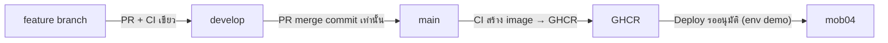

# 20 — โครงสไลด์นำเสนอ (Slide outline) — สถานะ ณ 2026-10-07

> บทนี้ตอบคำถาม: **"ถ้าต้องนำเสนอโปรเจกต์นี้ใน ~20 สไลด์ แต่ละหน้าควรพูดอะไร ใช้ภาพอะไร และตัวเลขไหนอ้างได้จริง?"**

---

## 🧭 ก่อนอ่าน

- เป็นบท "ปลายทาง" ของชุด — ทุกหน้าในนี้ชี้กลับไปหาบทต้นทาง (ส่วน `## สไลด์ (Slide-ready summary)` ที่หัวทุกบท 01–19)
- **กติกาตัวเลข:** ทุกตัวเลขในบทนี้มีแหล่งอ้างอิง (ไฟล์, issue, PR, run id) ตรวจกับ git/GitHub/VM วันที่ 2026-10-07 —
  ถ้าอ่านทีหลัง ให้ตรวจซ้ำก่อนพูด ห้ามเติมตัวเลขที่ไม่มีแหล่ง
- **กติกาสถานะ:** ห้ามพูดว่า "เสร็จ" กับงานที่ยังเปิด — #380 (k6), #344 (เดโมครบวง), #363 (backup ออกนอก VM),
  #231 (cutover), #443 (platform admin-ui) ยังเปิดทั้งหมด ณ 2026-10-07 (`gh issue list --state open`)
- ภาพสำเร็จรูปที่มีอยู่แล้ว: แผนภาพในรายงาน `../report/src/diagrams/*.png` (สร้างจาก HTML ข้างกัน),
  `../infographic/monitoring-dashboard.png`, `../infographic/dashboard-status.png`, และสไลด์อัปเดตเดิม
  `../infographic/slides-update-2026-10-03.pptx` (6 หน้า, วิธีทำอยู่ใน
  [`session-2026-10-04-slides-infographic-monitoring.md`](../handoff_log/session-2026-10-04-slides-infographic-monitoring.md))
- เทียบกับโครง 12 หน้าเดิมใน [01_pitch.md](01_pitch.md) หัวข้อ "🎬 Presenter script — โครงสไลด์ 12 หน้า" — บทนี้ขยายเป็น
  20 หน้าสำหรับการนำเสนอทางเทคนิค และอัปเดตสถานะถึง 2026-10-07

---

## ภาพรวม 20 หน้า

| # | หัวสไลด์ | บทต้นทาง | ประเด็นหลัก |
|---|---|---|---|
| 1 | Srisurart Autopart POS | [01](01_pitch.md) | POS ร้านอะไหล่ไทย: offline-first → multi-tenant |
| 2 | ปัญหาของร้าน | [01](01_pitch.md), [03](03_use_case.md) | ข้อมูลหาย/เน็ตหลุด/ต้นทุนคนละล็อต |
| 3 | สามยุคของระบบ | [00](00_index.md) | JS → Flutter+Drift → client+server+CI/CD · ร้านยังใช้ Drift build |
| 4 | ใครใช้ระบบ | [03](03_use_case.md) | owner / พนักงาน / เครื่อง `pos` / `backoffice` / platform admin |
| 5 | สถาปัตยกรรมรวม | [02](02_architecture.md) | Nginx → API ×3 → Postgres + Redis ×2 + BullMQ + etcd |
| 6 | Frontend | [04](04_frontend.md) | Flutter + bloc + Drift · `ApiException` ไม่ถึงหน้าจอ |
| 7 | สัญญา API + idempotency | [05](05_api.md), [06](06_backend.md) | `Idempotency-Key` · 4xx = คำตัดสิน, 5xx = ไม่รู้ผล |
| 8 | Multi-tenant ปลอดภัย | [06](06_backend.md), [07](07_database.md) | RLS + `runTx` ไม่รับ tenant id · อ่านข้ามร้านได้ 0 แถว |
| 9 | เงิน + ภาษาไทยถูกต้อง | [08](08_money_thai.md) | เงินเป็น string · ข้อความไทยตรง `db.js` · owner รับรองครบ |
| 10 | ย้ายข้อมูล + id แบบ UUID | [09](09_data_migration.md) | import snapshot ร้านจริงผ่าน 44 checks · UUIDv7 (#616) → server ไม่รับ snapshot แอปเดิมแล้ว |
| 11 | Offline phase 2 | [10](10_offline_phase2.md) | outbox + `/sync/push` · replay key → client id → parse |
| 12 | Security | [11](11_security.md) | JWT + device token · rate limit · gitleaks · CA ส่วนตัว |
| 13 | Testing | [12](12_testing.md) | 60 ไฟล์ e2e · 116 ไฟล์ Flutter test · contract fixtures |
| 14 | ทำงานเป็นทีม | [13](13_team_workflow.md) | PR → `develop` → `main` (merge commit เท่านั้น) |
| 15 | CI/CD pipeline | [14](14_devops.md), [15](15_cicd.md) | 2 status checks · GHCR + Trivy · deploy ต้องอนุมัติ |
| 16 | เรื่องเล่า deploy ขึ้น `mob04` | [19](19_deploy_mob04_story.md) | FortiGate → runner → rollback → UUID cutover → `dd659e2` |
| 17 | Monitoring | [14](14_devops.md), [16](16_performance.md) | Prometheus + Grafana 29 panel · heartbeat |
| 18 | Load test k6 (#380) | [16](16_performance.md) | วัดจริงครั้งแรก 2026-10-05 — อ่านผ่าน, แย่งซื้อ 200 คนไม่ผ่าน, ข้อมูลถูก |
| 19 | สถานะ DoD + งานค้าง | [00](00_index.md), [18](18_capstone.md) | DoD 16/17 · 5 issue สำคัญยังเปิด |
| 20 | บทเรียน + ก้าวต่อไป | [18](18_capstone.md) | "green ≠ deployed" · ตรวจ head SHA · ตัวเลขต้องมีแหล่ง |

---

## รายละเอียดทีละหน้า

### สไลด์ 1 — Srisurart Autopart POS
- ระบบขายหน้าร้านอะไหล่รถยนต์ไทย "ศรีสุรัตน์" ทำงานออฟไลน์ได้ และรองรับหลายร้าน (multi-tenant)
- Flutter (Android/iOS/Web) + NestJS + PostgreSQL + Redis + Nginx + CI/CD
- ทีม 3 lane: `NuimanLP` (team/1), `LomerAlloys` (team/2), `PattaraponKitcharoen` (team/3)
- **Speaker note:** เปิดด้วยประโยคเดียวจาก [01_pitch.md](01_pitch.md) หัวข้อ "One-liner" แล้วบอกขนาดงาน
- **ตัวเลข:** 428 PR ที่ merge แล้ว · 1,289 commit บน `develop` (`gh pr list --state merged`, `git rev-list --count origin/develop`, นับ 2026-10-07 ~07:40 UTC — ตัวเลขโตทุกวัน นับใหม่ก่อนนำเสนอ)
- **ภาพ:** โลโก้/ภาพหน้าจอขาย `../tutorial/sri-pos-manual/img/checkout-mobile.png`

### สไลด์ 2 — ปัญหาของร้าน
- ยุคแรกข้อมูลอยู่ใน `localStorage` ของเบราว์เซอร์เครื่องเดียว — ล้าง cache = ข้อมูลหาย
- เน็ตร้านไม่เสถียร แต่ต้องขายต่อได้ · รับของคนละล็อตคนละต้นทุน · ช่างมีเครดิต
- **Speaker note:** ใช้ "หนึ่งวันที่ร้าน — ก่อน vs หลัง" ใน [01_pitch.md](01_pitch.md)
- **ภาพ:** ตาราง Pain → Feature → Evidence จาก [01_pitch.md](01_pitch.md)

### สไลด์ 3 — สามยุคของระบบ
- ยุค 1: React + `localStorage` (คนละ repo) → ยุค 2: Flutter + Drift/SQLite (branch `POC_sample_offline_first`) → ยุค 3: client + server + CI/CD
- กติกาธุรกิจ (ขาย/คืน/รับของ) **port** มาจาก `pos/db.js` ไม่ได้คิดใหม่
- **ร้านจริงยังใช้ Drift build** — ยังไม่มี cutover (#231 เปิดอยู่)
- **ภาพ:** `../report/src/diagrams/evolution.png`

### สไลด์ 4 — ใครใช้ระบบ
- owner, พนักงาน, เครื่อง `pos` (ขายได้), เครื่อง `backoffice` (อ่าน/จัดการ — ขายไม่ได้), platform admin
- เครื่อง `pos` หนึ่งเครื่องต่อร้านเป็นผู้เขียนหลัก (ADR-0004)
- **ตัวเลข:** `backoffice` ยิง `POST /sales` → `403 DEVICE_ROLE_FORBIDDEN` (`server/test/security.e2e-spec.ts`, DoD `03_ARCHITECTURE.md §8`)
- **ภาพ:** use case diagram (actor → use case) ตามแบบใน [03_use_case.md](03_use_case.md)

### สไลด์ 5 — สถาปัตยกรรมรวม
- Nginx ตัวเดียวหน้าด่าน → NestJS API 3 instance → PostgreSQL (แหล่งความจริง) + `redis-cache` + `redis-queue` (BullMQ) + etcd
- Drift ในเครื่องกลายเป็น read cache / offline shell
- Postgres 29 ตาราง · Drift schema v13 (CLAUDE.md)
- **ตัวเลข:** stack บน `mob04` มี 14 container (รอบวัด k6 2026-10-05: restart/OOM = 0 ทั้ง 14 — [`session-2026-10-05-k6-capacity-run.md`](../handoff_log/session-2026-10-05-k6-capacity-run.md))
- **ภาพ:** `../report/src/diagrams/architecture.png`

### สไลด์ 6 — Frontend
- Flutter + flutter_bloc + go_router + Drift · UI ภาษาไทยเป็นหลัก
- API build (`USE_API_WRITES`) ให้ server เป็นความจริง แล้ว patch แถว Drift จากคำตอบ (ADR-0010)
- `ApiException` ไม่ถึงหน้าจอ — ทุก repository แปลงเป็นข้อความไทยก่อน (PR #642, #644; เทสต์เฝ้า `frontend/test/presentation_no_api_exception_test.dart`, `frontend/test/api_exception_never_escapes_test.dart`)
- **ภาพ:** `../report/src/diagrams/client-layers.png`

### สไลด์ 7 — สัญญา API + idempotency
- ทุก write มี `Idempotency-Key` · bill id + key สร้าง**ครั้งเดียวต่อตะกร้า**
- 4xx = คำตัดสิน · 5xx / 429 / `IN_FLIGHT` = ยังไม่รู้ผล → **จอดความพยายามไว้ (id + key เดิม) ไม่เข้าคิว** · เข้า outbox เฉพาะ transport failure (`08_PHASE2_SPEC.md §5`; PR #469, #645)
- เงินส่งเป็น string `"1234.50"`
- **ภาพ:** `../report/src/diagrams/request-flow.png`

### สไลด์ 8 — Multi-tenant ปลอดภัย
- ฐานข้อมูลเดียว หลายร้าน แยกด้วย Row-Level Security
- transaction เปิดใน handler · `TenantService.runTx(fn)` ไม่รับ tenant id · ห้ามใช้ pool connection ที่สองในคำขอเดียว (#162)
- **ตัวเลข:** อ่านข้ามร้านได้ 0 แถว — RLS sweep 25 ตาราง + 12 endpoint (`server/test/cross-tenant-read.e2e-spec.ts`, DoD `03_ARCHITECTURE.md §8`)
- **ภาพ:** `../report/src/diagrams/rls-concept.png`

### สไลด์ 9 — เงิน + ภาษาไทยถูกต้อง
- ปัดเศษผ่าน `round2()` / `baht()` · ต้นทุนเฉลี่ยถ่วงน้ำหนักตอนรับของ
- ข้อความไทยต้องตรงกับ `db.js` ทุกตัวอักษร (behaviour parity)
- owner รับรองข้อความไทยที่ agent ร่างไว้**ทั้งหมด** 2026-10-07 (PR #649) · PR #651 เติมข้อความ error ไทยที่เหลือ และ PR #653 รับรอง 10 ข้อความใหม่นั้นในวันเดียวกัน
- **ตัวเลข:** บิลขาดสต็อก 3 บรรทัด → ได้ข้อความไทยครบ 3 บรรทัดในคำตอบเดียว (`server/test/sales.e2e-spec.ts`, DoD `03_ARCHITECTURE.md §8`)

### สไลด์ 10 — ย้ายข้อมูล + id แบบ UUID
- `importLegacyBackup()` (Drift build) นำเข้า backup JSON ของแอปเดิมแบบ atomic · ฝั่ง server มี pre-flight → import atomic → reconcile
- id ของ entity เปลี่ยนจาก TEXT เป็น UUIDv7 (ยกเว้น `tenants`/`users`/`platform_admins` = v4) (#616, PR #617; migration `EntityIdsToUuid1788652804900`)
- ผลข้างเคียงของ #616: tenant import ฝั่ง server **ปฏิเสธ snapshot จากแอปเดิม** (`400 INVALID_ID`, `server/src/platform/tenant-import.service.ts`) — วิธีย้ายข้อมูลร้านจริงตอน cutover (#231) ยังไม่ได้กำหนด
- **ตัวเลข:** snapshot ร้านจริงเคยผ่าน 44 checks, preflight 0 violations ก่อน #616 (#185 2026-09-17, DoD `03_ARCHITECTURE.md §8`)
- **ภาพ:** `../report/src/diagrams/er.png`

### สไลด์ 11 — Offline phase 2
- outbox ในเครื่อง → `POST /sync/push` ส่งทีละ op ด้วย device token
- ลำดับต่อ op: replay ด้วย key → replay ด้วย client id → parse payload → service (`08_PHASE2_SPEC.md §8.3`)
- replay ด้วย client id ได้แม้ key หมดอายุแล้ว (PR #638) · e2e ครบ 7 op type (PR #641 เติม 3 ตัวสุดท้าย, `server/test/sync-push.e2e-spec.ts`)
- เลข RC/CN ออกได้ทั้งออนไลน์และออฟไลน์จากเครื่อง `pos`
- **ภาพ:** `../report/src/diagrams/outbox-flow.png` และ `../report/src/diagrams/sync-seq.png`

### สไลด์ 12 — Security
- JWT อายุสั้น + refresh · device token ผูกเครื่อง · web เก็บ access token ในหน่วยความจำเท่านั้น (ADR-0009 addendum)
- rate limit ต่อ IP ที่ Nginx (`perip`) + login throttle ก่อนใช้ DB
- secret scan ด้วย gitleaks ทุก PR · GitHub push protection เปิด
- TLS บน `mob04` ใช้ CA ส่วนตัว (PR #552) — APK เชื่อเฉพาะ CA นี้
- **Speaker note:** เน้นว่า k6 จากหลายเครื่อง**ไม่ได้**ยกเว้น `perip` (owner ปฏิเสธ carve-out)

### สไลด์ 13 — Testing
- unit + repository test ฝั่ง Flutter · e2e บน Postgres จริงฝั่ง server · contract fixtures ร่วมกันสองฝั่ง
- architecture spec 3 ตัวเฝ้า seam ของ tenant/idempotency
- **ตัวเลข:** `server/test/*.e2e-spec.ts` 60 ไฟล์ · `frontend/test/**/*_test.dart` 116 ไฟล์ (นับ 2026-10-07 ที่ `origin/develop` `68eebd1`)
- **ภาพ:** test pyramid vs testing trophy ใน [12_testing.md](12_testing.md) หัวข้อ 3

### สไลด์ 14 — ทำงานเป็นทีม
- ทุก PR งานเข้า `develop` · `develop` → `main` ด้วย **merge commit เท่านั้น** (ruleset `24564072`, 2026-10-06)
- เหตุผล: squash/rebase เปลี่ยน SHA → `ROLLBACK_FLOOR` (`bedd328`) ไม่ใช่บรรพบุรุษของ `main` → `pos-deploy` ปฏิเสธทุก SHA
- ทั้ง `main` และ `develop` บังคับ PR + `flutter-ci-status` + `server-ci-status`
- บทเรียน: ตรวจ head SHA ตอน merge (`gh pr view N --json headRefOid`) — review fix ที่ push หลังกด merge ไม่ถึง `main`
- **ภาพ:**

### สไลด์ 15 — CI/CD pipeline
- `flutter.yml` + `server.yml` รันทุก PR และทุก push ไป `main`/`develop` (develop ตั้งแต่ PR #647) · job `changes` gate ภายใน
- image ขึ้น GHCR เฉพาะจาก `main` · Trivy gate · gitleaks
- `deploy.yml` รอ reviewer (`NuimanLP`) อนุมัติบน environment `demo`
- **"green ≠ deployed"**: merge เข้า `main` ยิง Deploy 2 รอบ รอบแรกมัก skip แต่ขึ้นเขียว — หลักฐานเดียวคือ `/opt/pos/.current_sha`
- **ตัวเลข:** SHA `dd659e2` — run `37585675913` job `deploy to demo` = skipped, run `37585778195` = success (2026-10-07)
- **ภาพ:** `../report/src/diagrams/cicd-pipeline.png`

### สไลด์ 16 — เรื่องเล่า deploy ขึ้น `mob04`
- 2026-09-21 → 09-29: FortiGate ของคณะตัด `ghcr.io` (x509 ไม่มี SAN) — ปัญหาเครือข่าย ไม่ใช่โค้ด
- 2026-09-30: ติดตั้ง self-hosted runner → deploy จริงครั้งแรก `e50f4fa` · rollback พิสูจน์แล้ว · #67 ปิด 15/15
- 2026-10-06: UUID cutover — backup → ล้าง DB → migration → `65861ea` (PR #628)
- 2026-10-07: `.current_sha` = `dd659e2`, `/health/ready` 200 (อ่านบน VM 07:40 UTC)
- **Speaker note:** เน้นว่า backup ของ 10-06 อยู่บน VM + เครื่อง owner เท่านั้น — **ยังไม่มี offsite backup (#363 parked)**
- **ภาพ:** `../report/src/diagrams/deploy.png` + timeline ใน [19_deploy_mob04_story.md](19_deploy_mob04_story.md)

### สไลด์ 17 — Monitoring
- Prometheus เก็บ metric ของ API · Grafana dashboard `pos-overview.json` 29 panel (นับ 2026-10-07)
- metric ธุรกิจ/runtime: `pos_documents_total`, `pos_db_pool_connections`, `pos_queue_jobs` (#597, deploy `41a8f19`)
- heartbeat ทุก 5 นาทีไปบริการ uptime ภายนอก (#596/#604, ติดตั้งบน `mob04` ด้วยมือ 2026-10-04)
- **ภาพ:** `../infographic/monitoring-dashboard.png`, `../infographic/dashboard-status.png`

### สไลด์ 18 — Load test k6 (#380) — วัดจริงครั้งแรก
- วิธี: 3 เครื่อง แต่ละเครื่องอยู่ใต้ `perip` ของตัวเอง ส่งผลเข้า Prometheus ของ VM (`03_ARCHITECTURE.md §8.1`)
- อ่าน `GET /products`: p95 16 / 29 / 33 ms (เกณฑ์ < 200 ms) ✅ · รับได้ ≥ 72 r/s (เพดานของเครื่องยิง ไม่ใช่ของระบบ)
- แย่งซื้อสินค้าชิ้นเดียว 200 คน: p95 ~3 s ❌ (เกณฑ์ < 500 ms) — แต่**ข้อมูลถูกทุกครั้ง** (3,752 บิล = 3,752 เลขใบเสร็จไม่ซ้ำ)
- RAM container รวมสูงสุด 648 MiB (host 1,561 / 5,920 MiB)
- **#380 ยังเปิด — ยังไม่ติ๊ก AC หรือ DoD ใดๆ การรับผลเป็นการตัดสินของ owner**
- **ตัวเลข:** issue #380 comment 2026-10-05 + [`session-2026-10-05-k6-capacity-run.md`](../handoff_log/session-2026-10-05-k6-capacity-run.md)
- **Speaker note:** ร้านจริงมีเครื่อง `pos` เครื่องเดียว (ADR-0004) จึงไม่น่าเจอคิวแย่งแถวสินค้า 200 คนในร้านเดียว — แต่ห้ามอ้างว่า "ผ่าน"

### สไลด์ 19 — สถานะ DoD + งานค้าง
- DoD phase 1: **17 ข้อ ติ๊ก 16** — ที่เหลือคือ k6 (`03_ARCHITECTURE.md §8`, นับใหม่ 2026-10-07)
- ยังเปิด: #380 k6 (วัดแล้ว รอ owner) · #344 เดโมครบวง (ต้องเริ่มใหม่หลังล้าง DB 10-06) · #363 backup ออกนอก VM (parked) · #231 cutover · #443 platform admin-ui
- ปิดแล้วล่าสุด: #476 (2026-10-03) · #612/#616/#619/#620/#621 (2026-10-06)
- **ภาพ:** ตาราง ✅/🔴 สองคอลัมน์

### สไลด์ 20 — บทเรียน + ก้าวต่อไป
- "green ≠ deployed" — ยืนยันด้วย `.current_sha` เสมอ
- ตัวเลข/สถานะทุกตัวต้องมีแหล่ง — ticket ปิดแล้วไม่ได้แปลว่างานเสร็จ
- validate ก่อน clamp · lock order คงที่ · transaction ใน handler
- ก้าวต่อไป: owner ตัดสินผล k6 → เดิน #344 ใหม่ → เลือก protocol offsite backup (#363) → phase 2 cutover (#231)
- **ภาพ:** "ตารางรวม 12 หลักการ" ใน [18_capstone.md](18_capstone.md)

---

## ✅ สรุป

- 20 หน้า ครอบคลุม product → สถาปัตยกรรม → ความถูกต้อง → offline → ปฏิบัติการ → ผลวัดจริง → สถานะ
- ทุกตัวเลขมีแหล่ง ณ 2026-10-07 · งานที่ยังเปิดพูดว่า "ยังเปิด" เสมอ
- ภาพส่วนใหญ่มีอยู่แล้วใน `docs/report/src/diagrams/` และ `docs/infographic/`

## ➡️ อ่านต่อ

กลับไปที่ [00_index.md](00_index.md) หรือดูส่วน "สไลด์" ที่หัวของแต่ละบทเพื่อขยายหน้าใดหน้าหนึ่ง
